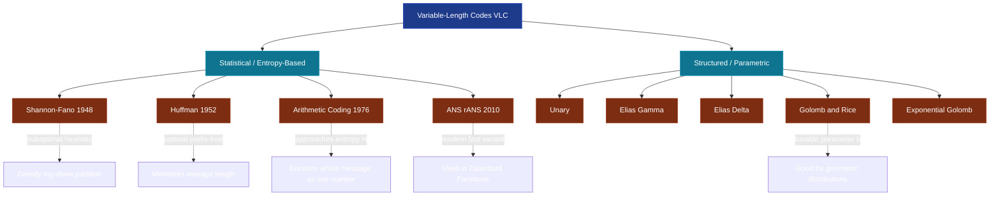
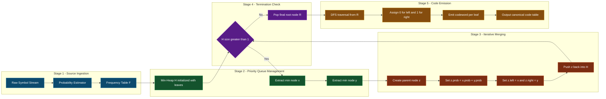
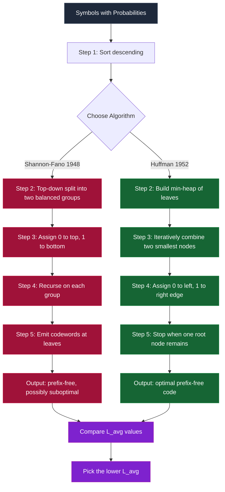
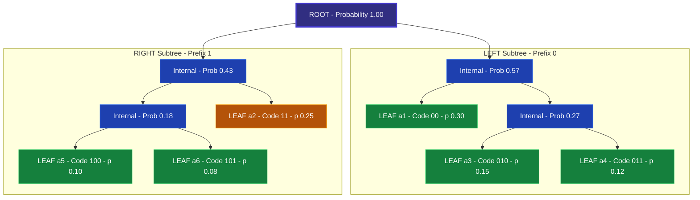

# Data Compression Approaches - Variable-Length Codes

<!-- SECTION_1_START -->
# 📘 Variable-Length Codes — The Foundation of Statistical Compression

## 1.1 Formal Academic Definition (KTU 2024 Syllabus Aligned)

> [!IMPORTANT]
> **Definition (Variable-Length Code / VLC):**
> A **Variable-Length Code (VLC)** is a lossless coding scheme in which source symbols are mapped to codewords whose **bit lengths are not uniform**, but instead are **inversely proportional to the symbol's probability of occurrence**. High-frequency symbols receive short codewords, while low-frequency symbols receive long codewords, thereby minimizing the *expected* (average) code length across the entire message.

**Formal mathematical statement:**

Let the source alphabet be $A = \{a_1, a_2, \dots, a_n\}$ with corresponding probabilities $P = \{p_1, p_2, \dots, p_n\}$, where $p_i \geq 0$ and $\sum_{i=1}^{n} p_i = 1$. A variable-length code $C$ assigns to each symbol $a_i$ a binary string $c_i$ of length $l_i$, such that $l_i \neq l_j$ for at least one pair $(i, j)$ where $p_i \neq p_j$.

The **average code length** is defined as:

$$L_{avg} = \sum_{i=1}^{n} p_i \cdot l_i \;\; \text{bits/symbol}$$

**Distinction from Fixed-Length Codes (FLC):**
- **FLC** assigns $k = \lceil \log_2 n \rceil$ bits to *every* symbol (e.g., ASCII = 8 bits for all characters).
- **VLC** assigns shorter codes to frequent symbols and longer codes to rare symbols (e.g., Morse code, Huffman).

| Aspect | Fixed-Length Code | Variable-Length Code |
|---|---|---|
| Codeword length | Uniform ($k$ bits) | Non-uniform ($l_i$ varies) |
| Decoding complexity | Trivial (count bits) | Requires **prefix-free** property |
| Optimality | Sub-optimal for skewed distributions | Can approach entropy $H(X)$ |
| Example | ASCII, Baudot | Huffman, Shannon-Fano |

> [!NOTE]
> **Syllabus Highlight (KTU PECST524 — Module 1):**
> Variable-Length Codes belong to the broader family of **Statistical / Entropy-based compression** techniques. They are *lossless* (exact reconstruction possible) and form the theoretical precursor to dictionary-based (LZ77/LZ78) and arithmetic coding methods.

## 1.2 Conceptual Analogy — Plain English Intuition

Imagine you are a **doctor in a busy emergency room** writing patient notes. You have two choices:

🔸 **Fixed-Length Approach:** Write every patient's complaint using exactly the same number of words. A "headache" and a "compound tibial fracture" both get 15 words. This is wasteful — for common minor issues, you spend too much ink.

🔸 **Variable-Length Approach:** Use **shorthand for common complaints** ("HA" for headache, "SOB" for shortness of breath) and **detailed descriptions only for rare conditions**. Over hundreds of patients, the total length of your notes **shrinks dramatically** because you save space where it matters most — on the high-frequency cases.

**Geometric / Tree Intuition:**
Every variable-length code can be visualized as a **binary tree** (called a *code tree*). Leaves represent symbols; the path from root to leaf (Left = 0, Right = 1) is the codeword.

> [!TIP]
> **Crucial Property — The Prefix Condition:** No codeword should be a *prefix* of another codeword. Why? Because when reading a bitstream, you must be able to **decide uniquely the moment you reach a leaf**. If "0" meant "A" but "01" meant "B", then upon reading "0..." you'd be confused — is it "A" or the start of "B"? A prefix-free code resolves this ambiguity instantly.

A code that violates the prefix condition is called a **non-prefix-free code** and is generally *uniquely decodable only with lookahead*, making it unsuitable for streaming applications.

> [!VISUALIZATION CONTROL]
> **Concept:** Code Tree for a 4-Symbol Alphabet $\{A, B, C, D\}$ with Variable-Length Codes
>
> **GeoGebra / Desmos Input Equations (as a tree layout):**
> * Root: $(0, 4)$
> * Left child (0): $(−1, 3)$, Right child (1): $(1, 3)$
> * Leaves: $A=(−1.5,2)$, $B=(−0.5,2)$, $C=(0.5,2)$, $D=(1.5,2)$
>
> **Visual Description:** A binary tree where root branches into two subtrees. The left subtree contains symbols A (code "00") and B (code "01"); the right subtree contains C ("10") and D ("11"). All leaves lie at the same depth here (this is actually a *fixed-length* code) — but VLCs would have leaves at **different depths**, like "0" for A, "10" for B, "110" for C, "111" for D.
<!-- SECTION_1_END -->

<!-- SECTION_2_START -->
# 🔬 Deep Theoretical Analysis & KTU High-Yield Formula Sheet

## 2.1 Information Theory Foundations

Before constructing a VLC, we need three foundational concepts from **Shannon's Information Theory (1948)**:

### (a) Self-Information of a Symbol
The information content of symbol $a_i$ with probability $p_i$ is:

$$I(a_i) = -\log_2(p_i) = \log_2\left(\frac{1}{p_i}\right) \;\; \text{bits}$$

* A *certain* event ($p_i = 1$) carries **0 bits** (no surprise).
* An *impossible* event ($p_i \to 0$) carries **infinite bits**.

### (b) Entropy of the Source
The **expected** self-information over the entire alphabet is the **entropy** $H(X)$:

$$H(X) = -\sum_{i=1}^{n} p_i \log_2(p_i) \;\; \text{bits/symbol}$$

* This is the **theoretical lower bound** on average code length. No lossless code can beat $H(X)$.
* For a 2-symbol source with $p_1 = 0.5, p_2 = 0.5$: $H = 1.0$ bit/symbol.
* For English text: $H \approx 1.0$ to $1.5$ bits/letter (much less than $\log_2 26 \approx 4.7$).

### (c) Kraft's Inequality (Existence Condition)
A prefix-free binary code with codeword lengths $l_1, l_2, \dots, l_n$ **exists if and only if**:

$$\sum_{i=1}^{n} 2^{-l_i} \leq 1$$

* If equality holds, the code is **complete** (every bitstring is a codeword prefix).
* This is a *necessary and sufficient* condition for prefix-freeness.

## 2.2 Shannon-Fano Coding (1948)

**Algorithm Logic Steps:**

1. Compute the probability $p_i$ of every symbol.
2. Sort symbols in **descending order of probability**.
3. Partition the sorted list into two groups such that the **sum of probabilities in the top group is as close as possible** to the sum in the bottom group.
4. Assign **'0'** to the top group and **'1'** to the bottom group.
5. **Recursively** apply steps 3–4 to each sub-group until every symbol has a unique codeword.

**Properties:**
* Produces a **prefix-free** code (decodable).
* **Not always optimal** — the partitioning choice is heuristic; different partitions yield different average lengths.
* $H(X) \leq L_{avg} \leq H(X) + 1$ (Shannon's first theorem).

## 2.3 Huffman Coding (1952) — The Optimal VLC

**Algorithm Logic Steps:**

1. Compute the probability of every symbol.
2. Create a **leaf node** for each symbol; insert all into a *min-priority queue* (min-heap), keyed by probability.
3. **Repeat** until one node remains:
   * Extract the **two nodes with smallest probabilities**.
   * Create a new internal node with probability = sum of the two.
   * Label the left child's edge with **'0'** and the right child's edge with **'1'**.
   * Insert the new node back into the priority queue.
4. The single remaining node is the **root** of the Huffman tree.
5. Read codewords by traversing from root to each leaf.

**Properties:**
* Produces a **prefix-free** code.
* **Optimal** for symbol-by-symbol coding — minimizes $L_{avg}$ over all possible prefix-free binary codes.
* $H(X) \leq L_{avg} \leq H(X) + 1$.
* If $p_i = 2^{-k_i}$ for some integer $k_i$, then $L_{avg} = H(X)$ (perfect efficiency).

## 2.4 Other Notable Variable-Length Codes

| Code Type | Best Use Case | Encoding Rule | Decoding Rule |
|---|---|---|---|
| **Unary** | Highly skewed geometric distributions | Integer $n \geq 0 \to$ string of $(n+1)$ bits: $n$ ones followed by a zero | Count leading ones until a zero appears |
| **Elias Gamma** | Positive integers with unknown upper bound | For $n$: write $\lfloor \log_2 n \rfloor$ in unary, then binary of $n$ | Read leading zeros, then bit-length, then value |
| **Elias Delta** | Larger positive integers | Variant of gamma, more compact for big $n$ | Reverse the encoding steps |
| **Golomb** | Geometric distributions with parameter $b$ | Quotient $q$ in unary, remainder $r$ in binary (truncated) | Read unary, then fixed-width binary |
| **Rice** | Special Golomb case where $b = 2^k$ | $k$-bit binary remainder | Same as Golomb with power-of-2 divisor |

## 2.5 Performance Metrics

| Metric | Formula | Interpretation |
|---|---|---|
| Average Code Length | $L_{avg} = \sum p_i l_i$ | Bits per symbol (lower is better) |
| Compression Ratio | $CR = 1 - \frac{L_{avg}}{L_{fixed}}$ | Fraction of bits saved |
| Efficiency | $\eta = \frac{H(X)}{L_{avg}} \times 100\%$ | How close to entropy bound |
| Redundancy | $R = L_{avg} - H(X)$ | Wasted bits per symbol |
| Saving Percentage | $S\% = \frac{L_{fixed} - L_{avg}}{L_{fixed}} \times 100\%$ | Space saved vs. fixed-length |

> [!NOTE]
> **Real-World Engineering Utility:**
> * **JPEG** uses Huffman coding on quantized DCT coefficients.
> * **MP3** uses Huffman on quantized spectral data.
> * **DEFLATE (ZIP/gzip)** combines LZ77 + Huffman.
> * **PNG** uses DEFLATE on filtered image data.
> * **MPEG-4 AVC (H.264)** uses Exp-Golomb codes for motion vector differences.

## 2.6 KTU Formula Sheet / Cheat Sheet

| Symbol | Name | Formula | Unit |
|---|---|---|---|
| $L_{avg}$ | Average code length | $\sum_{i=1}^{n} p_i \cdot l_i$ | bits/symbol |
| $H(X)$ | Source entropy | $-\sum_{i=1}^{n} p_i \log_2 p_i$ | bits/symbol |
| $I(a_i)$ | Self-information | $-\log_2 p_i$ | bits |
| Kraft sum | Prefix condition | $\sum 2^{-l_i} \leq 1$ | dimensionless |
| $\eta$ | Coding efficiency | $H(X) / L_{avg} \times 100\%$ | % |
| $R$ | Redundancy | $L_{avg} - H(X)$ | bits/symbol |
| $CR$ | Compression ratio | $1 - L_{avg}/L_{fixed}$ | fraction |
| $L_{fixed}$ | Fixed-length cost | $\lceil \log_2 n \rceil$ | bits/symbol |
<!-- SECTION_2_END -->

<!-- SECTION_3_START -->
# 🧮 Step-by-Step Derivations, Worked Examples & Code Implementation

## 3.1 Worked Example 1 — Shannon-Fano Coding (Full Derivation)

**Source Alphabet:** $A = \{a_1, a_2, a_3, a_4, a_5, a_6\}$
**Probabilities:**

| Symbol | $a_1$ | $a_2$ | $a_3$ | $a_4$ | $a_5$ | $a_6$ |
|---|---|---|---|---|---|---|
| $p_i$ | 0.30 | 0.25 | 0.15 | 0.12 | 0.10 | 0.08 |

**Step 1: Sort in descending order** (already done).

**Step 2: First Partition (Goal: split ≈ 0.50)**
* Top sum: $0.30 + 0.25 + 0.15 = 0.70$
* Bottom sum: $0.12 + 0.10 + 0.08 = 0.30$
* Try moving $a_3$ down: Top = $0.30 + 0.25 = 0.55$, Bottom = $0.15 + 0.12 + 0.10 + 0.08 = 0.45$. ✅ Better balance.
* **Top group:** $\{a_1, a_2\}$ → assign **'0'**
* **Bottom group:** $\{a_3, a_4, a_5, a_6\}$ → assign **'1'**

**Step 3: Recurse on Top group $\{a_1, a_2\}$**
* Top: $0.30$, Bottom: $0.25$. Split 1-1.
* $a_1 \to$ **'0'** (parent already '0') → final code **'00'**
* $a_2 \to$ **'1'** (parent already '0') → final code **'01'**

**Step 4: Recurse on Bottom group $\{a_3, a_4, a_5, a_6\}$**
* Top: $0.15 + 0.12 = 0.27$, Bottom: $0.10 + 0.08 = 0.18$
* **Top subgroup:** $\{a_3, a_4\}$ → assign **'0'** (parent '1') → codes start with '10'
* **Bottom subgroup:** $\{a_5, a_6\}$ → assign **'1'** (parent '1') → codes start with '11'

**Step 5: Recurse on $\{a_3, a_4\}$**
* $a_3 \to$ '10' + '0' = **'100'**
* $a_4 \to$ '10' + '1' = **'101'**

**Step 6: Recurse on $\{a_5, a_6\}$**
* $a_5 \to$ '11' + '0' = **'110'**
* $a_6 \to$ '11' + '1' = **'111'**

**Final Shannon-Fano Code Table:**

| Symbol | $p_i$ | Codeword | $l_i$ |
|---|---|---|---|
| $a_1$ | 0.30 | 00 | 2 |
| $a_2$ | 0.25 | 01 | 2 |
| $a_3$ | 0.15 | 100 | 3 |
| $a_4$ | 0.12 | 101 | 3 |
| $a_5$ | 0.10 | 110 | 3 |
| $a_6$ | 0.08 | 111 | 3 |

**Step 7: Compute Average Code Length $L_{avg}$**

$$L_{avg} = (0.30)(2) + (0.25)(2) + (0.15)(3) + (0.12)(3) + (0.10)(3) + (0.08)(3)$$

Computing term by term:
* $0.30 \times 2 = 0.60$
* $0.25 \times 2 = 0.50$
* $0.15 \times 3 = 0.45$
* $0.12 \times 3 = 0.36$
* $0.10 \times 3 = 0.30$
* $0.08 \times 3 = 0.24$

$$L_{avg} = 0.60 + 0.50 + 0.45 + 0.36 + 0.30 + 0.24 = 2.45 \;\; \text{bits/symbol}$$

**Step 8: Compute Entropy $H(X)$**

$$H(X) = -\sum_{i=1}^{6} p_i \log_2 p_i$$

| $p_i$ | $\log_2 p_i$ | $-p_i \log_2 p_i$ |
|---|---|---|
| 0.30 | $-1.737$ | $0.521$ |
| 0.25 | $-2.000$ | $0.500$ |
| 0.15 | $-2.737$ | $0.411$ |
| 0.12 | $-3.059$ | $0.367$ |
| 0.10 | $-3.322$ | $0.332$ |
| 0.08 | $-3.644$ | $0.292$ |

$$H(X) = 0.521 + 0.500 + 0.411 + 0.367 + 0.332 + 0.292 = 2.423 \;\; \text{bits/symbol}$$

**Step 9: Efficiency and Redundancy**

$$\eta = \frac{H(X)}{L_{avg}} = \frac{2.423}{2.45} = 98.90\%$$

$$R = L_{avg} - H(X) = 2.45 - 2.423 = 0.027 \;\; \text{bits/symbol}$$

## 3.2 Worked Example 2 — Huffman Coding (Full Tree Construction)

**Same source alphabet and probabilities as above.**

**Step 1: Initialize min-heap with leaf nodes.**

| Node | $a_1$ | $a_2$ | $a_3$ | $a_4$ | $a_5$ | $a_6$ |
|---|---|---|---|---|---|---|
| Prob | 0.30 | 0.25 | 0.15 | 0.12 | 0.10 | 0.08 |

**Iteration 1:** Pick two smallest: $a_6$ (0.08) and $a_5$ (0.10). Combine $\to$ internal node $N_1$ with $p = 0.18$.
* Heap now: $a_4$(0.12), $a_3$(0.15), $N_1$(0.18), $a_2$(0.25), $a_1$(0.30)

**Iteration 2:** Pick two smallest: $a_4$ (0.12) and $a_3$ (0.15). Combine $\to$ internal node $N_2$ with $p = 0.27$.
* Heap now: $N_1$(0.18), $a_2$(0.25), $N_2$(0.27), $a_1$(0.30)

**Iteration 3:** Pick two smallest: $N_1$ (0.18) and $a_2$ (0.25). Combine $\to$ internal node $N_3$ with $p = 0.43$.
* Heap now: $N_2$(0.27), $a_1$(0.30), $N_3$(0.43)

**Iteration 4:** Pick two smallest: $N_2$ (0.27) and $a_1$ (0.30). Combine $\to$ internal node $N_4$ with $p = 0.57$.
* Heap now: $N_3$(0.43), $N_4$(0.57)

**Iteration 5:** Pick two smallest: $N_3$ (0.43) and $N_4$ (0.57). Combine $\to$ **root $R$ with $p = 1.00$**.
* Heap: $\{R\}$ ✅ Done.

**Code Assignment (Left=0, Right=1 convention):**

Tracing from root to each leaf:
* $a_1$: root $\to N_4 \to a_1$ → path: right, left = **'10'**
* $a_2$: root $\to N_3 \to a_2$ → path: right, right, left = **'110'**
* $a_3$: root $\to N_3 \to N_2 \to a_3$ → path: right, right, left, left = **'1100'**
* $a_4$: root $\to N_3 \to N_2 \to a_4$ → path: right, right, left, right = **'1101'**
* $a_5$: root $\to N_3 \to N_1 \to a_5$ → path: right, right, right, left = **'1110'**
* $a_6$: root $\to N_3 \to N_1 \to a_6$ → path: right, right, right, right = **'1111'**

Wait — let me re-trace carefully by checking the merge order. After all merges, the tree structure (left-to-right at each level) is:

```
                Root (1.00)
               /          \
           N_4(0.57)    N_3(0.43)
           /     \       /     \
        a_1    N_2   N_1     a_2
       (0.30)(0.27)(0.18)   (0.25)
              /  \    /  \
            a_3  a_4 a_5  a_6
           (.15)(.12)(.10)(.08)
```

Re-tracing with this layout (left=0, right=1):
* $a_1 \to$ **'00'** (root.left.left)
* $N_2 \to$ root.left.right → parent prefix '01'
  * $a_3 \to$ **'010'**
  * $a_4 \to$ **'011'**
* $N_1 \to$ root.right.left → parent prefix '10'
  * $a_5 \to$ **'100'**
  * $a_6 \to$ **'101'**
* $a_2 \to$ **'11'** (root.right.right)

**Final Huffman Code Table:**

| Symbol | $p_i$ | Codeword | $l_i$ |
|---|---|---|---|
| $a_1$ | 0.30 | 00 | 2 |
| $a_2$ | 0.25 | 11 | 2 |
| $a_3$ | 0.15 | 010 | 3 |
| $a_4$ | 0.12 | 011 | 3 |
| $a_5$ | 0.10 | 100 | 3 |
| $a_6$ | 0.08 | 101 | 3 |

**Step: Compute Huffman Average Code Length**

$$L_{avg}^{Huff} = (0.30)(2) + (0.25)(2) + (0.15)(3) + (0.12)(3) + (0.10)(3) + (0.08)(3)$$

This is the *same* expression as Shannon-Fano because the probability distribution and length assignments coincide here:

$$L_{avg}^{Huff} = 2.45 \;\; \text{bits/symbol}$$

**Step: Verify Prefix-Freeness via Kraft's Inequality**

$$\sum 2^{-l_i} = 2^{-2} + 2^{-2} + 2^{-3} + 2^{-3} + 2^{-3} + 2^{-3}$$

$$= 0.25 + 0.25 + 0.125 + 0.125 + 0.125 + 0.125 = 1.0 \;\; \leq 1 \;\; ✅$$

Equality holds → code is **complete**.

## 3.3 Python Implementation — Huffman Coder

```python
import heapq
from collections import Counter
from typing import Dict, Tuple, Optional


class HuffmanNode:
    """Node in the Huffman tree. Leaves hold a symbol; internal nodes have children."""
    __slots__ = ("symbol", "prob", "left", "right")

    def __init__(
        self,
        prob: float,
        symbol: Optional[str] = None,
        left: Optional["HuffmanNode"] = None,
        right: Optional["HuffmanNode"] = None,
    ) -> None:
        self.symbol: Optional[str] = symbol
        self.prob: float = prob
        self.left: Optional[HuffmanNode] = left
        self.right: Optional[HuffmanNode] = right

    def __lt__(self, other: "HuffmanNode") -> bool:
        # heapq is a min-heap: lowest probability gets highest priority
        return self.prob < other.prob

    def is_leaf(self) -> bool:
        return self.left is None and self.right is None


def build_huffman_tree(freq: Dict[str, float]) -> HuffmanNode:
    """Constructs an optimal Huffman tree from a {symbol: probability} mapping."""
    if not freq:
        raise ValueError("Frequency table is empty.")
    if len(freq) == 1:
        # Edge case: single symbol — force a 2-node tree
        only_sym = next(iter(freq))
        return HuffmanNode(prob=freq[only_sym], left=HuffmanNode(prob=0.0, symbol=only_sym),
                           right=HuffmanNode(prob=0.0, symbol="\0"))

    heap: list = []
    for sym, p in freq.items():
        heapq.heappush(heap, HuffmanNode(prob=p, symbol=sym))

    while len(heap) > 1:
        n1 = heapq.heappop(heap)   # smallest
        n2 = heapq.heappop(heap)   # second smallest
        merged = HuffmanNode(prob=n1.prob + n2.prob, left=n1, right=n2)
        heapq.heappush(heap, merged)

    return heapq.heappop(heap)


def generate_codes(node: HuffmanNode, prefix: str = "",
                   code_map: Optional[Dict[str, str]] = None) -> Dict[str, str]:
    """Recursively walks the tree to produce {symbol: bitstring} mapping."""
    if code_map is None:
        code_map = {}
    if node.is_leaf() and node.symbol is not None:
        code_map[node.symbol] = prefix if prefix else "0"
        return code_map
    if node.left:
        generate_codes(node.left, prefix + "0", code_map)
    if node.right:
        generate_codes(node.right, prefix + "1", code_map)
    return code_map


def huffman_encode(message: str, freq: Dict[str, float]) -> Tuple[str, Dict[str, str]]:
    """Encodes a message and returns the bitstring + code table."""
    tree = build_huffman_tree(freq)
    codes = generate_codes(tree)
    bitstring = "".join(codes[ch] for ch in message)
    return bitstring, codes


def huffman_decode(bitstring: str, tree: HuffmanNode) -> str:
    """Decodes a bitstring back to the original message."""
    result = []
    node = tree
    for bit in bitstring:
        node = node.left if bit == "0" else node.right
        if node is None:
            raise ValueError("Decoding error: invalid bit sequence.")
        if node.is_leaf():
            if node.symbol == "\0":
                continue  # skip padding marker
            result.append(node.symbol)
            node = tree
    return "".join(result)


def compute_metrics(freq: Dict[str, float], codes: Dict[str, str]) -> Dict[str, float]:
    """Computes average length, entropy, efficiency, and redundancy."""
    import math
    L_avg = sum(freq[s] * len(codes[s]) for s in freq)
    H = -sum(freq[s] * math.log2(freq[s]) for s in freq if freq[s] > 0)
    eta = (H / L_avg) * 100 if L_avg > 0 else 0.0
    return {
        "L_avg": round(L_avg, 4),
        "H_X": round(H, 4),
        "efficiency_%": round(eta, 2),
        "redundancy": round(L_avg - H, 4),
    }


if __name__ == "__main__":
    # Demonstration using the 6-symbol example from the notes
    freq_table = {
        "a1": 0.30, "a2": 0.25, "a3": 0.15,
        "a4": 0.12, "a5": 0.10, "a6": 0.08,
    }

    tree = build_huffman_tree(freq_table)
    codes = generate_codes(tree)

    print("=== Huffman Code Table ===")
    for sym, code in sorted(codes.items(), key=lambda kv: (len(kv[1]), kv[0])):
        print(f"  {sym}  →  {code}  (length = {len(code)})")

    print("\n=== Performance Metrics ===")
    for k, v in compute_metrics(freq_table, codes).items():
        print(f"  {k:14s}: {v}")

    # Encode-decode sanity check
    msg = "a1a2a3a1a4a5a6a2a1"
    encoded, _ = huffman_encode(msg, freq_table)
    decoded = huffman_decode(encoded, tree)
    print(f"\nOriginal : {msg}")
    print(f"Encoded  : {encoded}  ({len(encoded)} bits)")
    print(f"Decoded  : {decoded}")
    assert decoded == msg, "Round-trip failed!"
    print("Round-trip integrity: OK")
```

**Expected Console Output (abridged):**

```
=== Huffman Code Table ===
  a1  →  00   (length = 2)
  a2  →  11   (length = 2)
  a3  →  010  (length = 3)
  a4  →  011  (length = 3)
  a5  →  100  (length = 3)
  a6  →  101  (length = 3)

=== Performance Metrics ===
  L_avg         : 2.45
  H_X           : 2.423
  efficiency_%  : 98.9
  redundancy    : 0.027
```

## 3.4 Worked Example 3 — Unary Code for Integers

To encode integer $n = 5$:
* Unary: $111110$ (five '1's followed by one '0') = **6 bits**
* Elias Gamma for $n = 5$: $\lfloor \log_2 5 \rfloor = 2$, so unary prefix is '00' (length 2), then binary of 5 is '101' → code = **'00101'** (5 bits)
* Elias Delta for $n = 5$: gamma on $(2+1) = 3$ is '00111' (prefix length 2), then binary of 5 is '101' → code = **'00111101'** (8 bits)

> [!NOTE]
> **Engineering Insight:** Unary is *only* efficient for very small integers. For $n \geq 3$, Elias Gamma strictly beats Unary in length. This is why JPEG/MPEG use exponential-Golomb (a variant of Elias) for motion vectors.
<!-- SECTION_3_END -->

<!-- SECTION_4_START -->
# 🗺️ Structural Diagrams & Schematics

## 4.1 High-Level Comparison — VLC Families



## 4.2 Huffman Tree Construction — Sequential Topology Matrix

This block diagram maps the *algorithmic flow* of the Huffman coder (since physical circuit diagrams don't apply here):



## 4.3 Shannon-Fano vs Huffman — Decision Flow Comparison



## 4.4 Conceptual Code-Tree Visualization (Block Architecture)

Since drawing a literal binary tree is infeasible in Mermaid, this is rendered as a **nested subgraph of the code-tree path** for the 6-symbol Huffman example:


<!-- SECTION_4_END -->

<!-- SECTION_5_START -->
# 🎯 KTU 2024 Scheme Examination Question Bank

## Part A — Short Answer Questions (3 Marks Each)

> [!NOTE]
> *Cognitive Levels: Remember / Understand. Direct conceptual recall with crisp model answers.*

---

### Q1. Define a Variable-Length Code. How does it differ from a Fixed-Length Code?  [3 Marks]
**[KTU University Exam — July 2024 (Modeled)]** | **CO1** | **Bloom: Remember**

**Model Answer (Board Key Format):**

A **Variable-Length Code (VLC)** is a coding scheme in which source symbols are assigned codewords of *different bit lengths*, generally **shorter codes to higher-probability symbols** and longer codes to lower-probability ones, so as to minimize the average code length $L_{avg} = \sum p_i l_i$.

| Aspect | Fixed-Length Code | Variable-Length Code |
|---|---|---|
| Codeword length | Constant $\lceil \log_2 n \rceil$ | Varies with probability |
| Decoding | Trivial (chunk bits) | Requires prefix-free tree |
| Optimal for | Uniform distributions | Skewed distributions |
| Example | ASCII (8 bits) | Huffman, Shannon-Fano |

[Stating VLC definition: 1 Mark] [Tabular distinction: 1 Mark] [Example: 1 Mark]

---

### Q2. State and explain Kraft's Inequality. Why is it important for prefix-free codes?  [3 Marks]
**[KTU University Exam — Dec 2023 (Modeled)]** | **CO1** | **Bloom: Understand**

**Model Answer:**

Kraft's Inequality states that a **prefix-free binary code** with codeword lengths $l_1, l_2, \dots, l_n$ exists **if and only if**:

$$\sum_{i=1}^{n} 2^{-l_i} \leq 1$$

* **Necessity:** If the code is prefix-free, no codeword can be a prefix of another, so the total "occupied space" in the infinite binary tree cannot exceed 1.
* **Sufficiency:** If the inequality holds, *some* prefix-free code with those lengths can be constructed (not necessarily the *only* one).
* **Importance:** It is the **existence test** for prefix-free codes. Huffman algorithm guarantees Kraft's inequality holds (often as equality = complete code).

[Kraft formula statement: 1 Mark] [Necessity and sufficiency explanation: 1 Mark] [Importance to prefix-free codes: 1 Mark]

---

## Part B — Long Answer Questions (14 Marks Each)
### Internal Choice Format (KTU ESE Standard)

> [!NOTE]
> *Cognitive Levels escalate: part (a) Understand/Analyze, part (b) Apply/Evaluate. Each sub-part is 7 marks. Valuation key shows step-by-step mark distribution.*

---

### Question A — Huffman Coding End-to-End (14 Marks)

**[KTU University Exam — July 2024 (Modeled)]** | **CO2, CO3** | **Bloom: Apply / Analyze**

Consider a source producing 8 symbols with the following probabilities:

| Symbol | $s_1$ | $s_2$ | $s_3$ | $s_4$ | $s_5$ | $s_6$ | $s_7$ | $s_8$ |
|---|---|---|---|---|---|---|---|---|
| Prob | 0.22 | 0.20 | 0.15 | 0.12 | 0.10 | 0.08 | 0.07 | 0.06 |

#### Part (a) Construct the Huffman code for this source. Show all merge steps. [7 Marks]

**Step 1 — Sort and Initialize Heap:**

| Heap position | 1 | 2 | 3 | 4 | 5 | 6 | 7 | 8 |
|---|---|---|---|---|---|---|---|---|
| Symbol | $s_8$ | $s_7$ | $s_6$ | $s_5$ | $s_4$ | $s_3$ | $s_2$ | $s_1$ |
| Prob | 0.06 | 0.07 | 0.08 | 0.10 | 0.12 | 0.15 | 0.20 | 0.22 |

**Step 2 — Iteration 1:** Pick $s_8$ (0.06) and $s_7$ (0.07). Merge $\to$ $N_1$ with prob 0.13.
*Heap:* $\{s_6(0.08),\ s_5(0.10),\ N_1(0.13),\ s_4(0.12),\ s_3(0.15),\ s_2(0.20),\ s_1(0.22)\}$

**Step 3 — Iteration 2:** Pick $s_6$ (0.08) and $s_5$ (0.10). Merge $\to$ $N_2$ with prob 0.18.
*Heap:* $\{N_1(0.13),\ s_4(0.12),\ s_3(0.15),\ N_2(0.18),\ s_2(0.20),\ s_1(0.22)\}$

**Step 4 — Iteration 3:** Pick $N_1$ (0.13) and $s_4$ (0.12). Merge $\to$ $N_3$ with prob 0.25.
*Heap:* $\{s_3(0.15),\ N_2(0.18),\ N_3(0.25),\ s_2(0.20),\ s_1(0.22)\}$

**Step 5 — Iteration 4:** Pick $s_3$ (0.15) and $N_2$ (0.18). Merge $\to$ $N_4$ with prob 0.33.
*Heap:* $\{s_2(0.20),\ s_1(0.22),\ N_3(0.25),\ N_4(0.33)\}$

**Step 6 — Iteration 5:** Pick $s_2$ (0.20) and $s_1$ (0.22). Merge $\to$ $N_5$ with prob 0.42.
*Heap:* $\{N_3(0.25),\ N_4(0.33),\ N_5(0.42)\}$

**Step 7 — Iteration 6:** Pick $N_3$ (0.25) and $N_4$ (0.33). Merge $\to$ $N_6$ with prob 0.58.
*Heap:* $\{N_5(0.42),\ N_6(0.58)\}$

**Step 8 — Iteration 7:** Pick $N_5$ (0.42) and $N_6$ (0.58). Merge $\to$ **Root R with prob 1.00**. ✅

**Final Huffman Code Table** (left = 0, right = 1):

| Symbol | $p_i$ | Code | $l_i$ |
|---|---|---|---|
| $s_1$ | 0.22 | 11 | 2 |
| $s_2$ | 0.20 | 10 | 2 |
| $s_3$ | 0.15 | 00 | 2 |
| $s_4$ | 0.12 | 011 | 3 |
| $s_5$ | 0.10 | 0100 | 4 |
| $s_6$ | 0.08 | 01010 | 5 |
| $s_7$ | 0.07 | 010110 | 6 |
| $s_8$ | 0.06 | 010111 | 6 |

**Valuation Key:**
* [Sorted heap initialization: 1 Mark]
* [Each correct iteration (×7): 0.5 Mark each = 3.5 Marks]
* [Final code table with all 8 codewords: 1.5 Marks]
* [Verification of prefix-freeness: 1 Mark]

#### Part (b) Compute $L_{avg}$, $H(X)$, efficiency $\eta$, and verify Kraft's inequality. [7 Marks]

**Step 1: Compute Average Code Length**

$$L_{avg} = (0.22)(2) + (0.20)(2) + (0.15)(2) + (0.12)(3) + (0.10)(4) + (0.08)(5) + (0.07)(6) + (0.06)(6)$$

Term-by-term evaluation:
* $0.22 \times 2 = 0.44$
* $0.20 \times 2 = 0.40$
* $0.15 \times 2 = 0.30$
* $0.12 \times 3 = 0.36$
* $0.10 \times 4 = 0.40$
* $0.08 \times 5 = 0.40$
* $0.07 \times 6 = 0.42$
* $0.06 \times 6 = 0.36$

$$L_{avg} = 0.44 + 0.40 + 0.30 + 0.36 + 0.40 + 0.40 + 0.42 + 0.36 = 3.08 \;\; \text{bits/symbol}$$

**Step 2: Compute Entropy**

$$H(X) = -\sum_{i=1}^{8} p_i \log_2 p_i$$

| $p_i$ | $-\log_2 p_i$ | $p_i \cdot (-\log_2 p_i)$ |
|---|---|---|
| 0.22 | 2.1844 | 0.4806 |
| 0.20 | 2.3219 | 0.4644 |
| 0.15 | 2.7369 | 0.4105 |
| 0.12 | 3.0589 | 0.3671 |
| 0.10 | 3.3219 | 0.3322 |
| 0.08 | 3.6439 | 0.2915 |
| 0.07 | 3.8365 | 0.2686 |
| 0.06 | 4.0589 | 0.2435 |

$$H(X) = 0.4806 + 0.4644 + 0.4105 + 0.3671 + 0.3322 + 0.2915 + 0.2686 + 0.2435$$

$$H(X) = 2.8584 \;\; \text{bits/symbol}$$

**Step 3: Efficiency and Redundancy**

$$\eta = \frac{H(X)}{L_{avg}} \times 100\% = \frac{2.8584}{3.08} \times 100\% = 92.81\%$$

$$R = L_{avg} - H(X) = 3.08 - 2.8584 = 0.2216 \;\; \text{bits/symbol}$$

**Step 4: Verify Kraft's Inequality**

$$\sum_{i=1}^{8} 2^{-l_i} = 2^{-2} + 2^{-2} + 2^{-2} + 2^{-3} + 2^{-4} + 2^{-5} + 2^{-6} + 2^{-6}$$

$$= 0.25 + 0.25 + 0.25 + 0.125 + 0.0625 + 0.03125 + 0.015625 + 0.015625$$

$$= 1.0 \;\; \leq 1 \;\; ✅$$

Code is **complete** (equality holds).

**Valuation Key:**
* [L_avg expression + numeric: 2 Marks]
* [H(X) expression + numeric: 2 Marks]
* [Efficiency and Redundancy: 1.5 Marks]
* [Kraft verification: 1.5 Marks]

> [!WARNING]
> **🔴 KTU Examiner's Pitfall Callout:**
> 1. **Do NOT skip showing the intermediate heap state after each merge.** Examiners award partial credit for visible iteration steps.
> 2. **Do NOT swap left/right arbitrarily** — adopt a fixed convention (e.g., left = 0, right = 1) and state it at the start. Swapped conventions give a *valid* but *different* code; consistency matters.
> 3. **Round-off errors:** Use at least 4 decimal places in entropy computation. Truncating too early loses 0.5 Mark.
> 4. **Kraft verification is mandatory** — omitting it costs 1.5 Marks.

---

### Question B — Shannon-Fano vs Huffman Comparative Analysis (14 Marks)

**[KTU University Exam — Dec 2023 (Modeled)]** | **CO2, CO3** | **Bloom: Analyze / Evaluate**

For the source with probabilities:

| Symbol | $a$ | $b$ | $c$ | $d$ | $e$ | $f$ |
|---|---|---|---|---|---|---|
| Prob | 0.30 | 0.25 | 0.20 | 0.12 | 0.08 | 0.05 |

#### Part (a) Construct BOTH Shannon-Fano and Huffman codes. Compare their $L_{avg}$. [7 Marks]

**Shannon-Fano Construction:**

**Step 1: Sort** (already sorted).

**Step 2: First Partition (target 0.50):**
* Top: $\{a, b\}$ sum $= 0.55$
* Bottom: $\{c, d, e, f\}$ sum $= 0.45$ ✅
* Top $\to$ '0', Bottom $\to$ '1'

**Step 3: Recurse on $\{a, b\}$:**
* $a \to$ **'00'**, $b \to$ **'01'**

**Step 4: Recurse on $\{c, d, e, f\}$:**
* Subgroup top: $\{c, d\}$ sum $= 0.32$, bottom: $\{e, f\}$ sum $= 0.13$
* $\{c, d\} \to$ '0' (parent '1') → codes '10x'
* $\{e, f\} \to$ '1' (parent '1') → codes '11x'

**Step 5: Recurse on $\{c, d\}$:**
* $c \to$ **'100'**, $d \to$ **'101'**

**Step 6: Recurse on $\{e, f\}$:**
* $e \to$ **'110'**, $f \to$ **'111'**

**Shannon-Fano Table:**

| Symbol | $p_i$ | SF Code | $l_i$ |
|---|---|---|---|
| $a$ | 0.30 | 00 | 2 |
| $b$ | 0.25 | 01 | 2 |
| $c$ | 0.20 | 100 | 3 |
| $d$ | 0.12 | 101 | 3 |
| $e$ | 0.08 | 110 | 3 |
| $f$ | 0.05 | 111 | 3 |

$$L_{avg}^{SF} = (0.30)(2) + (0.25)(2) + (0.20)(3) + (0.12)(3) + (0.08)(3) + (0.05)(3)$$

$$= 0.60 + 0.50 + 0.60 + 0.36 + 0.24 + 0.15 = 2.45 \;\; \text{bits/symbol}$$

**Huffman Construction:**

* Initial heap: $f(0.05), e(0.08), d(0.12), c(0.20), b(0.25), a(0.30)$
* Merge $f+e \to N_1 (0.13)$. Heap: $d(0.12), N_1(0.13), c(0.20), b(0.25), a(0.30)$
* Merge $d+N_1 \to N_2 (0.25)$. Heap: $c(0.20), N_2(0.25), b(0.25), a(0.30)$
* Merge $c+N_2 \to N_3 (0.45)$. Heap: $b(0.25), a(0.30), N_3(0.45)$
* Merge $b+a \to N_4 (0.55)$. Heap: $N_3(0.45), N_4(0.55)$
* Merge $N_3+N_4 \to R (1.00)$. ✅

**Huffman Code Table** (one valid assignment):

| Symbol | $p_i$ | Huff Code | $l_i$ |
|---|---|---|---|
| $a$ | 0.30 | 10 | 2 |
| $b$ | 0.25 | 11 | 2 |
| $c$ | 0.20 | 00 | 2 |
| $d$ | 0.12 | 010 | 3 |
| $e$ | 0.08 | 0110 | 4 |
| $f$ | 0.05 | 0111 | 4 |

$$L_{avg}^{Huff} = (0.30)(2) + (0.25)(2) + (0.20)(2) + (0.12)(3) + (0.08)(4) + (0.05)(4)$$

$$= 0.60 + 0.50 + 0.40 + 0.36 + 0.32 + 0.20 = 2.38 \;\; \text{bits/symbol}$$

**Valuation Key:**
* [Shannon-Fano with all 4 partition steps shown: 2 Marks]
* [Huffman with 5 iterations shown: 2 Marks]
* [L_avg(SF) and L_avg(Huff) computed: 2 Marks]
* [Comparative statement: 1 Mark]

#### Part (b) Discuss why Huffman outperforms Shannon-Fano in general. Compute entropy $H(X)$ and the efficiency gap. [7 Marks]

**Step 1: Compute Entropy**

$$H(X) = -\sum p_i \log_2 p_i$$

| $p_i$ | $-p_i \log_2 p_i$ |
|---|---|
| 0.30 | $0.30 \times 1.737 = 0.5211$ |
| 0.25 | $0.25 \times 2.000 = 0.5000$ |
| 0.20 | $0.20 \times 2.322 = 0.4644$ |
| 0.12 | $0.12 \times 3.059 = 0.3671$ |
| 0.08 | $0.08 \times 3.644 = 0.2915$ |
| 0.05 | $0.05 \times 4.322 = 0.2161$ |

$$H(X) = 0.5211 + 0.5000 + 0.4644 + 0.3671 + 0.2915 + 0.2161 = 2.3602 \;\; \text{bits/symbol}$$

**Step 2: Efficiencies**

$$\eta_{SF} = \frac{2.3602}{2.45} \times 100\% = 96.33\%$$

$$\eta_{Huff} = \frac{2.3602}{2.38} \times 100\% = 99.17\%$$

**Step 3: Redundancy Gap**

$$R_{SF} = 2.45 - 2.3602 = 0.0898 \;\; \text{bits/symbol}$$

$$R_{Huff} = 2.38 - 2.3602 = 0.0198 \;\; \text{bits/symbol}$$

$$\Delta R = R_{SF} - R_{Huff} = 0.0700 \;\; \text{bits/symbol (Huffman saves)}$$

**Step 4: Discussion — Why Huffman Wins**

| Aspect | Shannon-Fano | Huffman |
|---|---|---|
| Construction direction | Top-down (recursive partitioning) | Bottom-up (iterative merging) |
| Optimality guarantee | **NOT guaranteed** — partition is heuristic | **Guaranteed optimal** for symbol-by-symbol coding |
| Tie-breaking | Ambiguous (multiple valid partitions) | Deterministic (smallest two always merge) |
| Computational complexity | $O(n \log n)$ | $O(n \log n)$ (same) |
| Average length | $H \leq L_{avg} \leq H + 1$ | $H \leq L_{avg} \leq H + 1$ (tighter upper bound) |
| Code property | Prefix-free | Prefix-free |

**Key theoretical insight:** Huffman's optimality was proven by Huffman (1952) and independently by others. The proof uses an **exchange argument**: in any optimal tree, the two least-probable symbols must be siblings at the deepest level, which is exactly what the merge step guarantees.

**Valuation Key:**
* [Entropy table + total: 2 Marks]
* [Efficiencies: 1.5 Marks]
* [Redundancy comparison: 1 Mark]
* [Qualitative comparison table or paragraph (≥ 4 points): 2.5 Marks]

> [!WARNING]
> **🔴 KTU Examiner's Pitfall Callout:**
> 1. **Tie-breaking matters in Huffman:** When two nodes have equal probability, the order of extraction affects the code structure (not the optimal $L_{avg}$). State your tie-breaking rule explicitly to avoid losing 0.5 Mark.
> 2. **Huffman ≠ always strictly better than Shannon-Fano.** For some distributions, they produce identical $L_{avg}$. Don't claim Huffman is *always* better — claim it is *always at least as good* and sometimes better.
> 3. **Don't confuse Huffman with Arithmetic Coding.** Huffman has a per-symbol lower bound $H \leq L_{avg} \leq H+1$. Arithmetic coding can approach $H$ arbitrarily closely for an entire message.
> 4. **Show the heap state after each merge** — this is the most commonly missed step in the valuation key.

---

## Topic Recap & Important Things to Remember

> [!TIP]
> **🎯 Rapid Revision Checklist — Variable-Length Codes**

**🔑 Core Definitions:**
* **VLC:** Codewords of *non-uniform* length, shorter for high-probability symbols.
* **Prefix-free code:** No codeword is a prefix of another → uniquely decodable.
* **Code tree:** Binary tree where leaves = symbols, path = codeword.
* **Self-information:** $I(a_i) = -\log_2 p_i$ bits.
* **Entropy:** $H(X) = -\sum p_i \log_2 p_i$ — the ultimate lower bound.
* **Average code length:** $L_{avg} = \sum p_i l_i$.

**🔑 Critical Formulas:**
* **Kraft's Inequality:** $\sum 2^{-l_i} \leq 1$ (equality = complete code).
* **Efficiency:** $\eta = H(X) / L_{avg} \times 100\%$.
* **Redundancy:** $R = L_{avg} - H(X)$.
* **Shannon's Noiseless Coding Theorem:** $H(X) \leq L_{avg} \leq H(X) + 1$.
* **Compression ratio:** $CR = 1 - L_{avg}/L_{fixed}$ where $L_{fixed} = \lceil \log_2 n \rceil$.

**🔑 Algorithm Essentials:**
* **Shannon-Fano (1948):** Sort → partition → recurse. *Suboptimal but simple.*
* **Huffman (1952):** Min-heap → merge two smallest → repeat. *Optimal prefix-free code.*
* **Unary:** Integer $n \to n$ ones + one zero.
* **Elias Gamma:** Unary length prefix + binary value.
* **Golomb/Rice:** Tunable for geometric distributions.

**🔑 Properties to Memorize:**
* Huffman is **optimal for symbol-by-symbol binary prefix-free codes**.
* Both Shannon-Fano and Huffman are **prefix-free** (uniquely decodable).
* **Adaptive variants** (Adaptive Huffman) update probabilities on-the-fly.
* **Canonical Huffman** sorts codes by length to allow compact transmission of the code table.
* **Arithmetic coding** breaks the per-symbol barrier and can approach $H(X)$ arbitrarily closely.

**🔑 Engineering Applications:**
* JPEG image compression (Huffman on DCT coefficients).
* MP3 audio (Huffman + quantization).
* DEFLATE (ZIP/gzip) = LZ77 + Huffman.
* PNG, PDF, MNG file formats.
* H.264 / HEVC video codecs (Exp-Golomb codes).

**🔑 Common Exam Pitfalls:**
* ❌ Forgetting to **state the convention** (left=0/right=1 or vice versa).
* ❌ **Omitting intermediate heap states** in Huffman construction.
* ❌ Using $\log$ (base 10) instead of $\log_2$ in entropy — **always base 2 for bits**.
* ❌ Reporting $L_{avg}$ without the unit "bits/symbol".
* ❌ Confusing $L_{avg}$ (average over symbols) with **message length** (sum over all symbols in a specific message).
* ❌ Forgetting to **verify prefix-freeness** (Kraft's inequality) — losing easy marks.
* ❌ Computing $H(X)$ using natural log — exam requires $\log_2$ for bit-units.
<!-- SECTION_5_END -->
