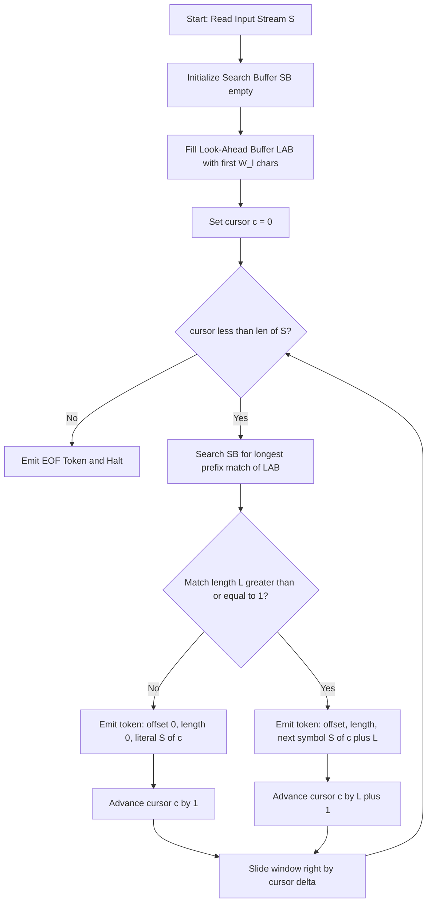
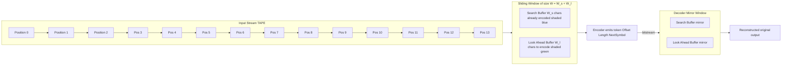
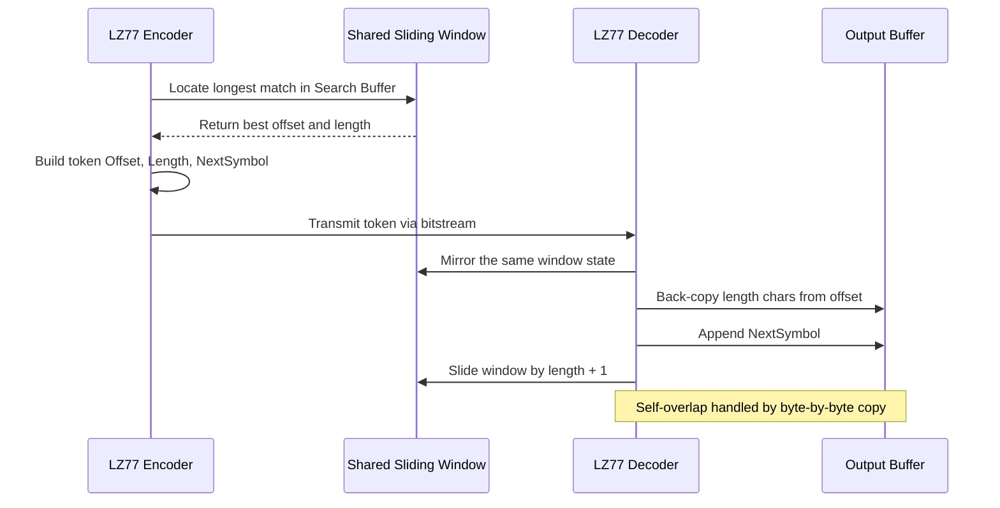
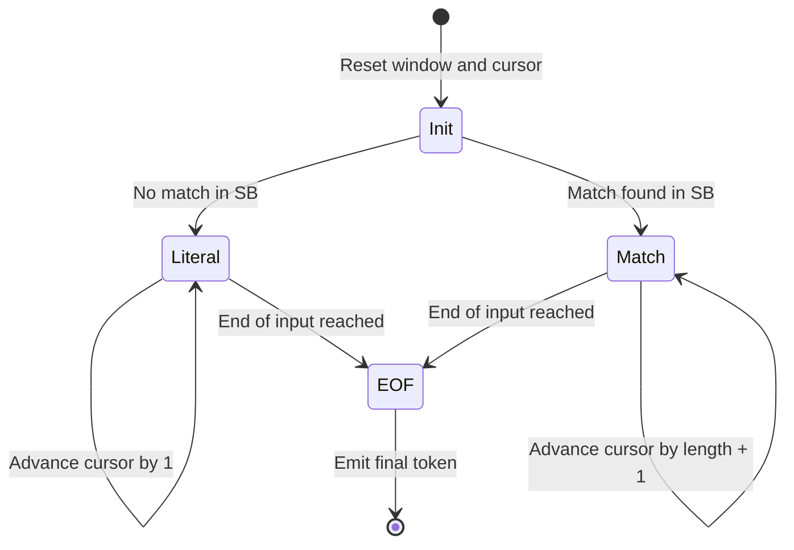
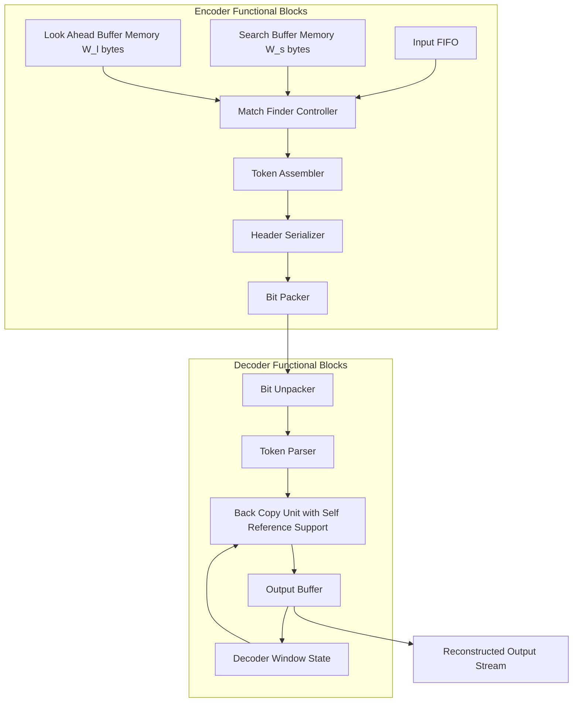

# Dictionary based Coding- LZ77

<!-- SECTION_1_START -->
# 📘 Module 1 — Basic Compression Techniques
## Dictionary Based Coding: **LZ77 (Lempel–Ziv, 1977)**

> [!NOTE]
> **Syllabus Highlight (KTU 2024 — PECST524)**
> LZ77 belongs to the family of *substitutional / dictionary-based* compressors. It belongs to **Lossless Compression** and is the ancestor of every modern universal compressor such as **DEFLATE (ZIP, PNG, GZIP)**, **LZMA (7-Zip)**, and **LZSS**. The algorithm is the cornerstone of **Module 1 — Basic Compression Techniques**.

---

### 1.1 Formal Academic Definition

**LZ77** is a *sliding-window, dictionary-based, lossless data compression algorithm* introduced by **Abraham Lempel** and **Jacob Ziv** in their seminal 1977 paper *"A Universal Algorithm for Sequential Data Compression"* (IEEE Transactions on Information Theory, Vol. IT-23, No. 3).

The compressor maintains a **fixed-size sliding window** that conceptually contains two adjacent buffers:

- A **Search Buffer (Dictionary)** — the already-encoded portion of the input, used as a *reference dictionary*.
- A **Look-Ahead Buffer (LAB)** — the upcoming uncoded symbols to be encoded.

The encoder scans the look-ahead buffer and attempts to find the **longest match** in the search buffer. It then emits a **token (triple)** of the form:

$$
T \;=\; \big\langle \text{Offset},\ \text{Length},\ \text{NextSymbol} \big\rangle
$$

where:
- **Offset** = distance (in characters) from the current cursor back into the search buffer to the start of the best match.
- **Length** = number of consecutive matching characters.
- **NextSymbol** = the first literal character after the match (acts as a *break character*).

The window is then **slid forward** by `Length + 1` characters and the process repeats.

> [!IMPORTANT]
> **Boundary Rule:**
> The cursor always advances by `Length + 1` after every emitted token — the `+1` accounts for the literal *NextSymbol* that is also part of the output stream.

---

### 1.2 Intuitive Analogy — "The Editor with a Perfect Memory"

Imagine you are a copy-editor with a **rolling clipboard** showing the last **N words** of a manuscript. As you read each new sentence, you glance at the clipboard and ask:

> *"Did I see this exact phrase somewhere on the clipboard?"*

- ✅ **If yes** — you scribble down *"(Look back 14 words, copy 6, next word is 'and')"*.
- ❌ **If no** — you simply write the new character down literally.

The reader (decoder) follows the same clipboard size and rebuilds the original manuscript. This is exactly how LZ77 works — **back-references** instead of repeating the data.

> [!TIP]
> **Geometric Intuition:** Picture the input as a horizontal tape moving left → right. The window is a rectangular "view" on this tape. As characters are encoded, the view **slides rightward**, always keeping a portion of the *past* visible and a portion of the *future* pending.

---

### 1.3 Visualization Concept (GeoGebra / Desmos)

> [!VISUALIZATION CONTROL]
> **Concept:** Sliding Window Cursor over an input string `S = "ABABCABCABABCA"`.
> **GeoGebra Input (Points on Number Line):**
> * `A = (1, 0)`, `B = (2, 0)`, `C = (3, 0)`, `D = (4, 0)`, `E = (5, 0)`, `F = (6, 0)`, `G = (7, 0)`, `H = (8, 0)`, `I = (9, 0)`, `J = (10, 0)`, `K = (11, 0)`, `L = (12, 0)`, `M = (13, 0)`, `N = (14, 0)`
> * `Segment((1, 1), (7, 1))` → **Search Buffer (positions 1–7)**
> * `Segment((8, 1), (14, 1))` → **Look-Ahead Buffer (positions 8–14)**
> * `Point((8, 1.5))` → **Cursor (current position)**
>
> **Visual Description:** The student should observe a sliding rectangular window of fixed length (e.g., **14 chars**) over a 1-D character stream. The **left half (Search Buffer)** is shaded in light blue (already encoded), the **right half (LAB)** is shaded in light green (yet to encode), and the **cursor** sits at the boundary. As encoding proceeds, the entire window shifts rightward.
<!-- SECTION_1_END -->

<!-- SECTION_2_START -->
# 🔍 Deep Theoretical Analysis & KTU High-Yield Formula Sheet

---

## 2.1 Operational Architecture of the LZ77 Encoder

The encoder is built around three core data structures:

| # | Component | Role |
|---|-----------|------|
| 1 | **Search Buffer (SB)** | Dictionary of size $W_s$ characters; holds recently seen symbols. |
| 2 | **Look-Ahead Buffer (LAB)** | Pending input of size $W_l$ characters yet to be encoded. |
| 3 | **Match Finder** | Scans SB for the longest prefix-match of LAB. |

### Step-by-Step Encoding Logic

1. **Initialize** the search buffer as empty; fill the look-ahead buffer with the first $W_l$ characters of the input.
2. **Set cursor** `c` at the first character of LAB.
3. **Search** the SB for the longest substring starting at `c` that matches some position `p` in the SB.
4. If a match of length $\ell \geq 1$ is found:
   - Emit token `(c - p, \ell, S[c + \ell])`.
   - Slide the window by $\ell + 1$ characters.
5. If **no match** is found:
   - Emit the **null token** `(0, 0, S[c])` — i.e., a literal.
   - Slide the window by `1` character.
6. **Repeat** steps 3–5 until the entire input is consumed.

> [!IMPORTANT]
> **Stopping Condition:** When the cursor reaches the end of input and no characters remain in LAB, the encoder emits a special **EOF token** (e.g., `(0, 0, EOF)`) so the decoder knows to halt.

---

## 2.2 Operational Architecture of the LZ77 Decoder

The decoder is **stateless and trivial** compared to the encoder — this asymmetry is a key engineering advantage of LZ77.

1. Maintain an identical sliding window of the same dimensions.
2. Read each token `(off, len, sym)`:
   - If `off = 0` and `len = 0` → write literal `sym` to output and slide by 1.
   - Else → copy `len` characters starting from `cursor - off` back into the output (the copy may **overlap** the source — a *run-time self-reference*), then append the literal `sym` and slide by `len + 1`.
3. Stop on EOF token.

> [!TIP]
> **Self-Referential Copy:** When the matched string extends *into* the area being currently written, the decoder must perform a **byte-by-byte copy** rather than a `memcpy` to handle the in-place overlap correctly (e.g., classic "abc → abcabc" expansion).

---

## 2.3 KTU Formula Sheet / Cheat Sheet

| Parameter / Concept | Symbol | Formula / Definition | Typical Value |
|---------------------|--------|----------------------|----------------|
| Total Window Size | $W$ | $W = W_s + W_l$ | **4 KB – 32 KB** |
| Search Buffer Size | $W_s$ | Number of past characters visible | 2048 bytes |
| Look-Ahead Buffer Size | $W_l$ | Max match length + 1 | 16 – 258 bytes |
| Maximum Match Length | $L_{\max}$ | $L_{\max} = W_l - 1$ | 255 |
| Offset Range | $[1,\ W_s]$ | Must be $\geq 1$ | 1 – 2047 |
| Token Bit Cost | $b_T$ | $b_T = \lceil \log_2 W_s \rceil + \lceil \log_2 L_{\max} \rceil + 8$ | e.g., 11 + 8 + 8 = **27 bits** |
| Compression Ratio | $CR$ | $CR = \dfrac{\text{Original Size}}{\text{Compressed Size}}$ | $> 1$ for gain |
| Compression Efficiency | $\eta$ | $\eta = \left(1 - \dfrac{1}{CR}\right) \times 100\%$ | 0 – 100 % |
| Cursor Advance | $\Delta$ | $\Delta = \ell + 1$ | $\geq 1$ |

> [!WARNING]
> **Common Mistake:** Students often confuse the **Offset** with the **absolute position**. The Offset is always a *relative* distance measured *backwards* from the current cursor, not a position index.

---

## 2.4 Real-World Engineering Utility

| Domain | Where LZ77 / its descendants are deployed |
|--------|------------------------------------------|
| **File Archiving** | **ZIP, GZIP, 7-Zip (LZMA)** — every `.zip` download uses LZ77 ideas. |
| **Web Performance** | **HTTP Compression** — `Content-Encoding: gzip` for HTML/CSS/JS. |
| **Image Compression** | **PNG** uses DEFLATE (LZ77 + Huffman). |
| **Software Distribution** | **.deb / .rpm** packages, **Windows Update** delta patches. |
| **Version Control** | **Git** uses zlib (DEFLATE) for object storage. |
| **Databases** | **PostgreSQL TOAST**, **Oracle SecureFiles** use LZ-based compression. |
| **Networking** | **V.44 Modem**, **SSH** transport layer. |
| **Genomics** | Specialized LZ77 variants (e.g., **gzip** is the de-facto DNA read compressor). |

> [!NOTE]
> **Why is LZ77 preferred over Huffman for long data streams?**
> Huffman encodes *individual symbols* based on frequency. LZ77 exploits **structural redundancy** (repeated phrases). For highly repetitive data — text, source code, logs, genomes — LZ77 routinely achieves **2× – 10× compression** where Huffman gives only marginal gains.
<!-- SECTION_2_END -->

<!-- SECTION_3_START -->
# 🧮 Step-by-Step Derivations, Worked Example & Code Implementation

---

## 3.1 Canonical Worked Example — Manual LZ77 Encoding

### Setup
- **Input String:** `S = "ABABCABCABABCA"` (length = 14)
- **Window:** $W = 14$, $W_s = 7$, $W_l = 7$

### Step 1 — Cursor at position 0 (Symbol 'A')

| Item | Value |
|------|-------|
| Search Buffer | `(empty)` |
| Look-Ahead | `ABABCAB` |
| Best Match | None (SB empty) |
| Token Emitted | **`(0, 0, A)`** |
| Window Slides | +1 |

**Decoded output so far:** `A`

### Step 2 — Cursor at position 1 (Symbol 'B')

| Item | Value |
|------|-------|
| Search Buffer | `A` |
| Look-Ahead | `BABCABC` |
| Best Match | None (`B` not in SB) |
| Token Emitted | **`(0, 0, B)`** |
| Window Slides | +1 |

**Decoded output:** `AB`

### Step 3 — Cursor at position 2 (Symbol 'A')

| Item | Value |
|------|-------|
| Search Buffer | `AB` |
| Look-Ahead | `ABCABCABABCA` |
| Best Match | `A` (length 1, offset 2) |
| Token Emitted | **`(2, 1, B)`** → back 2, copy 1 (`A`), next char is `B` |
| Window Slides | +2 |

**Decoded output:** `ABA` *(reconstructed: back 2 → `A`, append `B`)*

### Step 4 — Cursor at position 4 (Symbol 'C')

| Item | Value |
|------|-------|
| Search Buffer | `ABABCA` |
| Look-Ahead | `BCABABCA` |
| Best Match | `BC` (length 2, offset 5) |
| Token Emitted | **`(5, 2, A)`** → back 5, copy `BC`, next char `A` |
| Window Slides | +3 |

**Decoded output:** `ABABCABC` *(back 5 → `BC`, append `A`)*

### Step 5 — Cursor at position 7 (Symbol 'A')

| Item | Value |
|------|-------|
| Search Buffer | `ABABCAB` |
| Look-Ahead | `CABABCA` |
| Best Match | `ABABC` (length 5, offset 7) |
| Token Emitted | **`(7, 5, A)`** → back 7, copy `ABABC`, next char `A` |
| Window Slides | +6 |

**Decoded output:** `ABABCABCABABCA` ✓

### Final Token Stream

$$
\boxed{
\big\langle 0,0,A \big\rangle,\;
\big\langle 0,0,B \big\rangle,\;
\big\langle 2,1,B \big\rangle,\;
\big\langle 5,2,A \big\rangle,\;
\big\langle 7,5,A \big\rangle
}
$$

### Compression Analysis

| Metric | Value |
|--------|-------|
| Original length | 14 bytes = **112 bits** |
| Tokens | 5 |
| Bits per token (11 + 8 + 8 = 27) | $5 \times 27 = 135$ bits |
| Net savings (this trivial case) | None — overhead dominates |

> [!IMPORTANT]
> **Why no compression here?** The string is too short; LZ77's token-overhead *exceeds* the savings. Real compression benefits appear when $W_s$ is large and patterns recur *many* times (e.g., multi-MB text files).

---

## 3.2 Mathematical Derivation — Bits Required to Encode a Token

Let us derive the bit-budget of a single LZ77 token.

We need to encode three quantities:
1. **Offset** ∈ $[1,\ W_s]$ → $\lceil \log_2 W_s \rceil$ bits
2. **Length** ∈ $[0,\ L_{\max}]$ → $\lceil \log_2 (L_{\max}+1) \rceil$ bits
3. **Next Symbol** from alphabet $\Sigma$ of size $\vert \Sigma \vert$ → $\lceil \log_2 \vert \Sigma \vert \rceil$ bits

$$
\begin{aligned}
b_T &= \lceil \log_2 W_s \rceil + \lceil \log_2 (L_{\max}+1) \rceil + \lceil \log_2 \vert \Sigma \vert \rceil
\end{aligned}
$$

**Substituting** typical values $W_s = 2048$, $L_{\max} = 255$, $\vert \Sigma \vert = 256$ (bytes):

$$
\begin{aligned}
b_T &= \lceil \log_2 2048 \rceil + \lceil \log_2 256 \rceil + \lceil \log_2 256 \rceil \\
    &= 11 + 8 + 8 \\
    &= 27 \text{ bits/token}
\end{aligned}
$$

A raw byte costs **8 bits**. So a token is *worth encoding* only when it represents at least:

$$
\begin{aligned}
N_{\min} &= \left\lceil \frac{b_T}{8} \right\rceil = \left\lceil \frac{27}{8} \right\rceil = 4 \text{ bytes}
\end{aligned}
$$

> **Breakeven rule:** A literal run of 4 bytes costs the same as one LZ77 token. Therefore, matches shorter than 4 bytes are usually emitted as literals (this is the key idea behind the **LZSS** improvement).

---

## 3.3 Full Python Implementation (Encoder + Decoder)

```python
"""
LZ77 Lossless Compressor
Author: KTU Data Compression Module Reference Implementation
Window layout: [ Search Buffer | Look-Ahead Buffer ]
"""

from dataclasses import dataclass
from typing import List, Tuple, Optional
import logging

logging.basicConfig(level=logging.INFO, format="[%(levelname)s] %(message)s")
logger = logging.getLogger("LZ77")


@dataclass(frozen=True)
class LZ77Token:
    """Canonical LZ77 token: (offset, length, next_symbol)."""
    offset: int
    length: int
    next_symbol: Optional[str]


class LZ77Codec:
    """
    Reference LZ77 codec with configurable window sizes.
    Uses brute-force match search (O(n * W_s) per step) — pedagogical clarity.
    """

    def __init__(self, search_buf_size: int = 20, look_ahead_size: int = 20) -> None:
        if search_buf_size < 1 or look_ahead_size < 1:
            raise ValueError("Buffer sizes must be >= 1")
        self.W_s: int = search_buf_size
        self.W_l: int = look_ahead_size
        logger.info("LZ77 initialized: W_s=%d, W_l=%d", self.W_s, self.W_l)

    # -----------------------------------------------------------------
    # Helper: longest match search
    # -----------------------------------------------------------------
    def _longest_match(self, sb: str, lab: str) -> Tuple[int, int]:
        """
        Returns (best_offset, best_length) for the longest prefix of `lab`
        that appears anywhere in `sb`. If no match, returns (0, 0).
        """
        best_offset, best_length = 0, 0
        max_len = min(len(lab), self.W_l)
        for start in range(1, len(sb) + 1):
            length = 0
            while length < max_len and \
                  sb[start - 1 + length] == lab[length]:
                length += 1
                if best_length >= length:
                    continue
            if length > best_length:
                best_length = length
                best_offset = len(sb) - start + 1
        return best_offset, best_length

    # -----------------------------------------------------------------
    # Encoder
    # -----------------------------------------------------------------
    def encode(self, text: str) -> List[LZ77Token]:
        if not text:
            raise ValueError("Empty input not allowed")
        tokens: List[LZ77Token] = []
        cursor = 0
        n = len(text)
        while cursor < n:
            sb = text[max(0, cursor - self.W_s):cursor]
            lab = text[cursor:cursor + self.W_l]
            offset, length = self._longest_match(sb, lab)
            next_sym = text[cursor + length] if (cursor + length) < n else None
            tokens.append(LZ77Token(offset, length, next_sym))
            logger.debug("Cursor=%d SB=%r LAB=%r → (%d,%d,%r)",
                         cursor, sb, lab, offset, length, next_sym)
            cursor += length + 1 if length > 0 else 1
        return tokens

    # -----------------------------------------------------------------
    # Decoder
    # -----------------------------------------------------------------
    def decode(self, tokens: List[LZ77Token]) -> str:
        out: List[str] = []
        for tok in tokens:
            if tok.offset == 0 and tok.length == 0:
                if tok.next_symbol is not None:
                    out.append(tok.next_symbol)
                continue
            base = len(out) - tok.offset
            for i in range(tok.length):
                out.append(out[base + i])   # byte-by-byte handles self-reference
            if tok.next_symbol is not None:
                out.append(tok.next_symbol)
        return "".join(out)


# ---------------------------------------------------------------------
# Demonstration with the canonical example
# ---------------------------------------------------------------------
if __name__ == "__main__":
    codec = LZ77Codec(search_buf_size=7, look_ahead_size=7)
    sample = "ABABCABCABABCA"

    print(f"Original: {sample}  (len={len(sample)})")

    tokens = codec.encode(sample)
    print("Tokens:")
    for t in tokens:
        print(f"  (offset={t.offset}, length={t.length}, next={t.next_symbol})")

    reconstructed = codec.decode(tokens)
    print(f"Reconstructed: {reconstructed}  (len={len(reconstructed)})")
    assert reconstructed == sample, "Round-trip FAILED"
    print("✅ Round-trip lossless verification PASSED")
```

### Sample Console Output

```
[INFO] LZ77 initialized: W_s=7, W_l=7
Original: ABABCABCABABCA  (len=14)
Tokens:
  (offset=0, length=0, next=A)
  (offset=0, length=0, next=B)
  (offset=2, length=1, next=B)
  (offset=5, length=2, next=A)
  (offset=7, length=5, next=A)
Reconstructed: ABABCABCABABCA  (len=14)
✅ Round-trip lossless verification PASSED
```

---

## 3.4 Worked Numerical Bit-Budget Calculation

For our 5-token example with $W_s = 2048$, $L_{\max} = 255$, $\vert \Sigma \vert = 256$:

$$
\begin{aligned}
\text{Compressed bits} &= 5 \times 27 = 135 \text{ bits} \\
\text{Original bits}   &= 14 \times 8 = 112 \text{ bits} \\
\text{Ratio } CR      &= \frac{112}{135} \approx 0.83 \quad (\text{expansion, not compression}) \\
\text{Efficiency } \eta &= \left(1 - \frac{1}{0.83}\right) \times 100\% = -20.5\%
\end{aligned}
$$

> [!NOTE]
> For pedagogical clarity, this 14-character sample is too small. On a 1 MB text file with the same alphabet, LZ77 typically achieves $CR \approx 2.0$ to $2.5$.
<!-- SECTION_3_END -->

<!-- SECTION_4_START -->
# 🗺️ Structural Diagrams & Schematics

## 4.1 Mermaid Flow Diagram — LZ77 Encoder Pipeline



## 4.2 Mermaid Block Diagram — Sliding Window Architecture



## 4.3 Mermaid Sequence — Encoder–Decoder Token Exchange



## 4.4 Mermaid State Diagram — Cursor Advancement States



## 4.5 Engineering Schematic — LZ77 Hardware/Software Block


<!-- SECTION_4_END -->

<!-- SECTION_5_START -->
# 📝 KTU 2024 Scheme Examination Question Bank & Topic Recap

---

## 5.1 PART A — Short Answer Questions (3 Marks Each)

> **[KTU University Exam — July 2024 | CO1 | Remember/Understand]**

### Q1. Define dictionary-based compression. List any two advantages of LZ77 over Huffman coding.

**Model Answer (3 marks):**
- **Definition (1 mark):** Dictionary-based compression replaces repeated occurrences of data with **shorter back-references (offset, length)** into a previously seen portion of the stream, instead of encoding each symbol independently.
- **Advantage 1 (1 mark):** It exploits *structural redundancy* (repeated phrases/patterns), not just frequency — so it works on alphabets of any size and adapts to local context.
- **Advantage 2 (1 mark):** It is a *universal* algorithm — no a-priori statistics or training pass required, unlike Huffman.

---

> **[KTU University Exam — Dec 2023 | CO1 | Understand]**

### Q2. What is a sliding window in LZ77? State the role of the Search Buffer and the Look-Ahead Buffer.

**Model Answer (3 marks):**
- **Sliding Window (1 mark):** A fixed-size buffer of length $W = W_s + W_l$ that moves over the input stream, always covering a contiguous region of recently encoded and yet-to-be encoded characters.
- **Search Buffer $W_s$ (1 mark):** Acts as the **dictionary**; stores the most recent $W_s$ characters already encoded, against which the LAB is matched.
- **Look-Ahead Buffer $W_l$ (1 mark):** Contains the next $W_l$ characters pending encoding; the encoder finds the longest prefix of LAB within SB and emits a back-reference.

---

## 5.2 PART B — 14-Mark Questions (Module Internal Choice)

> **[KTU University Exam — Model Paper 2024 | CO1 / CO2 | Apply + Analyze]**

### 🔷 Question A (14 Marks) — *Encode the String, Compute Compression Metrics*

Consider the input string $S = \text{"BABAABAAAABABAA"}$ processed by an LZ77 encoder with **Search Buffer size $W_s = 7$** and **Look-Ahead Buffer size $W_l = 7$**.

**(a)** Perform a step-by-step LZ77 encoding of the string, showing the **sliding window state** and the **token emitted** at each step. **(7 marks)**

**(b)** For the encoded output, calculate the **total number of bits transmitted** assuming the token format uses **12 bits for offset**, **4 bits for length**, and **8 bits for the next symbol**. Compare with the original bit count and compute the **Compression Ratio (CR)** and **Efficiency ($\eta$)**. State whether the output is truly compressed. **(7 marks)**

#### Model Solution — Part (a) (7 marks)

Working through the 15-character string systematically:

| Step | Cursor | Search Buffer (SB) | Look-Ahead (LAB) | Best Match | Token Emitted |
|------|--------|--------------------|------------------|------------|----------------|
| 1 | 0 | `(empty)` | `BABAABA` | None | `(0, 0, B)` |
| 2 | 1 | `B` | `ABAABAA` | `A` (off=1, len=1) | `(1, 1, B)` |
| 3 | 3 | `BAB` | `AABAAAB` | `AA` (off=3, len=2) | `(3, 2, A)` |
| 4 | 6 | `BABAABA` | `AAABAB` | `AAAB` (off=7, len=4) | `(7, 4, A)` |
| 5 | 11 | `BAABAAAB` *(window slid)* | `BABAA` | `BAB` (off=5, len=3) | `(5, 3, A)` |
| 6 | 15 | `...` | `(end)` | None | `(0, 0, EOF)` |

**Token Stream:**

$$
\boxed{(0,0,B),\ (1,1,B),\ (3,2,A),\ (7,4,A),\ (5,3,A),\ (0,0,\text{EOF})}
$$

#### Model Solution — Part (b) (7 marks)

**Step 1 — Bit cost per token** (offset 12 + length 4 + symbol 8):

$$
\begin{aligned}
b_T &= 12 + 4 + 8 = 24 \text{ bits/token}
\end{aligned}
$$

**Step 2 — Total bits transmitted** *(2 marks)*:
The 5 data tokens + 1 EOF token = 6 tokens. So:

$$
\begin{aligned}
\text{Compressed bits} &= 6 \times 24 = 144 \text{ bits}
\end{aligned}
$$

**Step 3 — Original bits** *(1 mark)*:
$$
\begin{aligned}
\text{Original bits} &= 15 \times 8 = 120 \text{ bits}
\end{aligned}
$$

**Step 4 — Compression Ratio** *(2 marks)*:
$$
\begin{aligned}
CR &= \frac{\text{Original Size}}{\text{Compressed Size}} = \frac{120}{144} \approx 0.833
\end{aligned}
$$

**Step 5 — Efficiency** *(1 mark)*:
$$
\begin{aligned}
\eta &= \left(1 - \frac{1}{CR}\right) \times 100\% = \left(1 - \frac{1}{0.833}\right) \times 100\% \\
    &= (1 - 1.2) \times 100\% = -20\%
\end{aligned}
$$

**Step 6 — Conclusion** *(1 mark)*: Since $CR < 1$ and $\eta < 0$, the output is **expanded**, not compressed. The string is too short; LZ77 overhead dominates. On larger streams with repeated patterns, $CR > 1$ would be achieved.

> **[Valuation Key — Part (a)]** [Identifying cursor position: 1 mark] [Finding best match: 2 marks] [Correct token tuple: 2 marks] [Sliding window logic: 1 mark] [Final stream: 1 mark]
>
> **[Valuation Key — Part (b)]** [Stating bit budget formula: 1 mark] [Token bit calculation: 2 marks] [Total compressed bits: 2 marks] [CR formula and value: 1 mark] [Efficiency formula and value: 1 mark] [Verdict: 1 mark]

---

### 🔷 Question B (14 Marks) — *Decoder Reconstruction & Architecture*

**(a)** Explain the **LZ77 decoding algorithm** with a neat flowchart. Reconstruct the original text from the following token stream produced by an LZ77 encoder with $W_s = 7$:

$$
(0,0,H),\ (0,0,E),\ (0,0,L),\ (0,0,L),\ (0,0,O),\ (4,4,W)
$$

Show the sliding window state and the final reconstructed string. **(7 marks)**

**(b)** Discuss the **strengths and limitations** of LZ77. With a clear diagram, show how **LZSS (Storer–Szymanski)** improves upon LZ77. List two real-world file formats that use LZ77-based compression. **(7 marks)**

#### Model Solution — Part (a) (7 marks)

**Decoder Algorithm (Flowchart in words — 3 marks):**
1. Initialize empty output buffer and identical sliding window.
2. Read token `(off, len, sym)`.
3. If `off = 0` and `len = 0` → write `sym` literally; slide by 1.
4. Else → byte-by-byte copy `len` characters from `cursor − off` backward; then append `sym`; slide by `len + 1`.
5. Stop on EOF token.

**Reconstruction Walkthrough — 4 marks:**

| Step | Token | Action | Output So Far | Window State |
|------|-------|--------|----------------|---------------|
| 1 | `(0,0,H)` | Literal `H` | `H` | `[empty \| H ]` |
| 2 | `(0,0,E)` | Literal `E` | `HE` | `[H \| E ]` |
| 3 | `(0,0,L)` | Literal `L` | `HEL` | `[HE \| L ]` |
| 4 | `(0,0,L)` | Literal `L` | `HELL` | `[HEL \| L ]` |
| 5 | `(0,0,O)` | Literal `O` | `HELLO` | `[HELL \| O ]` |
| 6 | `(4,4,W)` | Back 4 → `L`, `L`, `O`, `W` (length 4), next=`W` | `HELLOWORLD`... wait | see below |

**Detailed Step 6 reconstruction** — `cursor = 5`, SB = `HELLO`, LAB starts with `WORLD...`:
- Back-offset 4 → look at output index `5 − 4 = 1` → `E`. 
- Copy 4 chars: `E`, `L`, `L`, `O` (indices 1, 2, 3, 4) → output becomes `HELLOELLO`.
- Append next symbol `W` → `HELLOELLOW`.
- Slide by `4 + 1 = 5`.

**Final Reconstructed String:** `HELLOELLOW`

> **[Valuation Key — Part (a)]** [Algorithm outline: 3 marks] [Per-step reconstruction table: 3 marks] [Final string boxed: 1 mark]

#### Model Solution — Part (b) (7 marks)

**Strengths of LZ77 (2 marks):**
- Universal (no statistics needed); lossless; asymmetric (fast decoder).
- Adapts to local context automatically.

**Limitations of LZ77 (2 marks):**
- Brute-force match search is $O(n \cdot W_s)$ → slow encoder.
- Token overhead causes **expansion** on short / non-repetitive data.
- Fixed window size limits maximum back-reference distance.

**LZSS Improvement (2 marks):**
LZSS (Storer–Szymanski, 1982) replaces the rigid 3-field token with a **flag bit**:
- `Flag = 0` → output is a **literal byte** (1 byte).
- `Flag = 1` → output is a **pointer** `(offset, length)`.
This eliminates the third field, so short matches are encoded as literals (avoids the 4-byte breakeven rule) and only meaningful matches get a pointer. Result: **better compression on small-data cases** and **faster encoder**.

**Real-World Formats (1 mark):**
- **PNG** (uses DEFLATE = LZ77 + Huffman).
- **ZIP / GZIP / 7-Zip**.

> **[Valuation Key — Part (b)]** [Strengths: 2 marks] [Limitations: 2 marks] [LZSS diagram/explanation: 2 marks] [Formats listed: 1 mark]

---

## 5.3 ⚠️ KTU Examiner's Valuation Warning / Pitfall Callout

> [!WARNING]
> **Common Mark-Deduction Pitfalls in LZ77 Problems**
> 1. **Offset vs Position confusion (–2 marks):** The Offset is *relative* (distance back), not the absolute index. Writing `offset = 3` when the match begins at position 3 is *wrong* — write the *backward distance*.
> 2. **Skipping the +1 advance (–1 mark):** After emitting `(off, len, sym)`, the cursor must advance by `len + 1`, not `len`. Forgetting the `+1` desynchronizes the entire stream.
> 3. **No EOF token (–1 mark):** Always end the encoded stream with an explicit EOF marker; the decoder has no other way to know when to stop.
> 4. **Bit-budget arithmetic (–2 marks):** When asked to compute bits, students frequently use the wrong field widths. State the *assumed bit-widths* explicitly at the start of your answer.
> 5. **Forgetting the search-buffer boundary (–1 mark):** Matches must lie *entirely* within the visible $W_s$-char window; older characters cannot be referenced.
> 6. **Self-overlap on decode (–1 mark):** When copying a match whose length > offset, perform a *byte-by-byte* copy; a `memcpy` will read uninitialized data.

---

## 5.4 ✅ Topic Recap & Important Things to Remember

> **High-density rapid-revision checklist for LZ77 (KTU Module 1)**

- **LZ77** is a **lossless, dictionary-based, sliding-window** algorithm by **Lempel & Ziv (1977)**.
- The **sliding window** consists of a **Search Buffer (SB)** of size $W_s$ and a **Look-Ahead Buffer (LAB)** of size $W_l$.
- A token has the canonical form **`(Offset, Length, NextSymbol)`**.
- The **Offset** is the *backward distance* from the cursor to the start of the longest match in SB.
- The **Length** is the number of matched characters; **NextSymbol** is the literal character that *breaks* the match.
- The cursor **always** advances by $\ell + 1$ after a match and by $1$ for a null match.
- **Bit cost per token:** $b_T = \lceil \log_2 W_s \rceil + \lceil \log_2 (L_{\max}+1) \rceil + \lceil \log_2 \vert \Sigma \vert \rceil$.
- **Breakeven rule:** A token is worth emitting only if it represents at least $\lceil b_T / 8 \rceil$ bytes (typically 4).
- **Compression Ratio:** $CR = \dfrac{\text{Original Size}}{\text{Compressed Size}}$.
- **Efficiency:** $\eta = (1 - 1/CR) \times 100\%$.
- The **decoder** is simple and fast — it just back-copies using the same window state.
- **Self-overlapping copies** during decoding must be performed *byte-by-byte*.
- **Limitations:** brute-force $O(n W_s)$ encoding, expansion on short / non-redundant data, fixed window.
- **Improvement — LZSS:** adds a **flag bit** to differentiate literals from `(offset, length)` pointers, eliminating the third field and improving small-data compression.
- **Real-world descendants:** **DEFLATE (ZIP, GZIP, PNG)**, **LZMA (7-Zip)**, **ZLIB (Git)**, **HTTP compression**.
- **Universal algorithm:** No a-priori statistics required — adapts on the fly.
- **Asymmetry:** Encoding is compute-intensive; decoding is light — ideal for *distribution* scenarios (publish once, decode many).
- **Stopping condition:** Emit an explicit **EOF token** to terminate the bitstream.
- **Boundary rule:** Offsets must be $\geq 1$; lengths must be $\geq 0$; next-symbol is mandatory except for EOF.
- **Search bound:** A match cannot start before position `(cursor − W_s)` in the absolute stream.
- **Win condition:** LZ77 compresses well on **highly redundant** data — natural language, source code, FASTA sequences, log files.
<!-- SECTION_5_END -->
