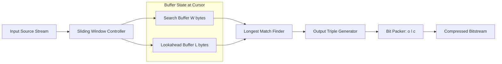
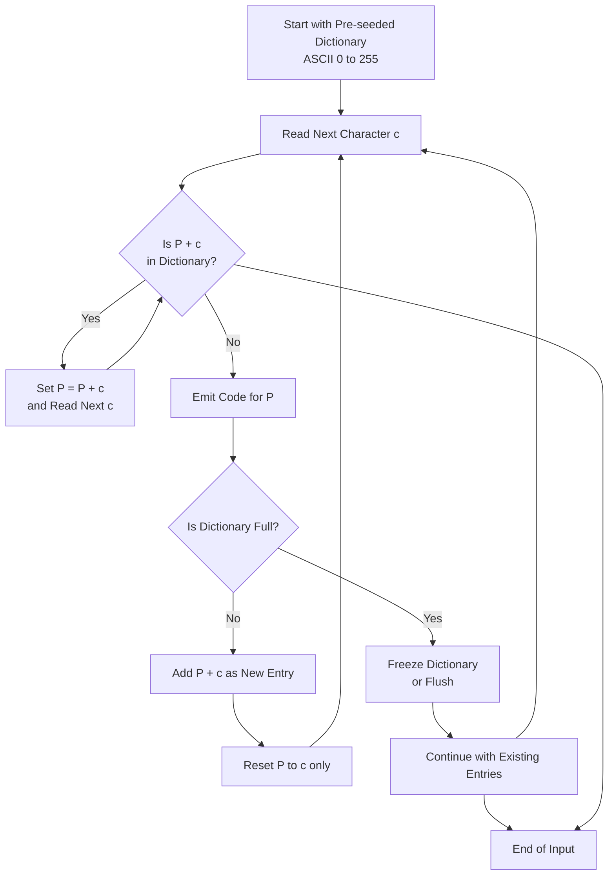
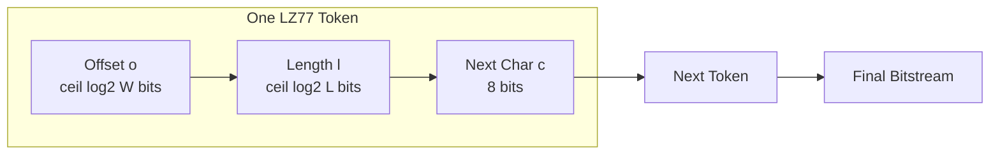
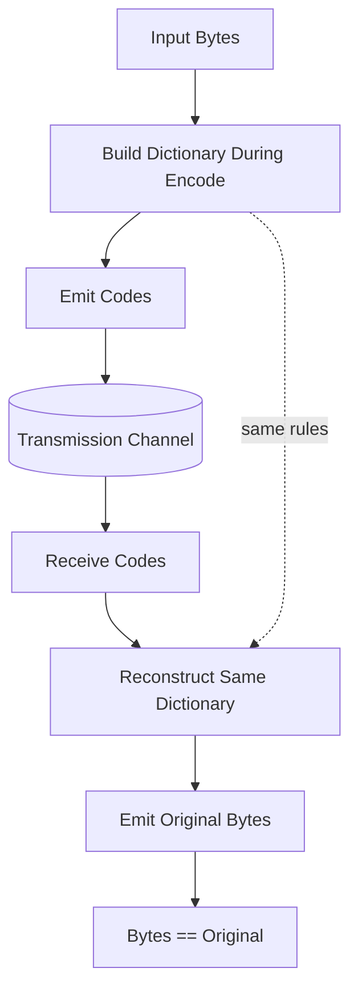
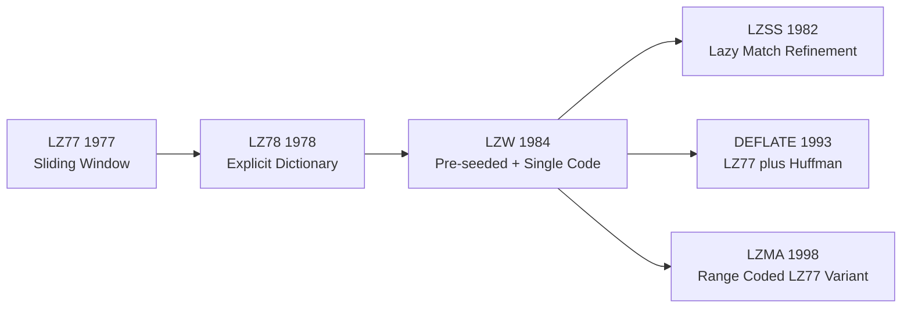

# Dictionary-Based Methods

<!-- SECTION_1_START -->
# Dictionary-Based Methods — Core Definition & Intuition

## Formal Definition
**Dictionary-Based Compression** is a family of lossless data compression techniques that achieve compression by replacing repeated occurrences of data strings (typically character sequences) with shorter codes that reference entries stored in a **dictionary** (or a **phrasebook**). Instead of treating each symbol independently, these methods exploit **local and global repetitiveness** in the source stream by maintaining a dynamic table of previously seen substrings.

In the KTU 2024 Scheme (Module 1: Basic Compression Techniques), the syllabus explicitly covers three foundational algorithms:
- **LZ77 (Lempel–Ziv 1977)** — Sliding Window Dictionary
- **LZ78 (Lempel–Ziv 1978)** — Explicit Dictionary Construction
- **LZW (Lempel–Ziv–Welch, 1984)** — Refined LZ78 with Single-Character Pre-Seeding

> [!IMPORTANT]
> **KTU Syllabus Highlight:** All three algorithms are *universal* (asymptotically optimal) compressors as proven by Ziv and Lempel. They form the theoretical backbone of modern formats like **ZIP, GZIP, PNG, GIF, and PDF**.

## Conceptual Analogy — "The Library Reference System"
Imagine you are a librarian cataloguing a long manuscript. Instead of rewriting the same word "Nevertheless" 200 times, you simply say *"Use entry #47 from the catalog"* the second time onward. The **catalog (dictionary)** is built *on-the-fly* as you read the text.

| Component | Analogy Role |
|-----------|--------------|
| Source String | The manuscript pages being read |
| Dictionary | The growing catalog of unique phrases |
| Output Token | A short reference (index) pointing to the catalog |
| Decoding | The reader looks up the reference in the same catalog |

This is exactly how **LZW encodes the phrase `"ABABABA"`** — instead of writing `A B A B A B A` (7 characters), it builds the dictionary on the fly and emits compact pointer codes.

## Physical & Algorithmic Constants
- **Standard Sliding Window Size ($W$):** typically $2^{12} = 4096$ bytes (in DEFLATE) up to $2^{15} = 32768$ bytes
- **Lookahead Buffer Size ($L$):** typically $2^4 = 16$ to $2^5 = 32$ bytes
- **Default Dictionary Size for LZW:** starts with **256 ASCII entries** (8-bit codes for $2^8 = 256$ characters)
- **Compression Threshold:** dictionary is only referenced when the matched length $\ge 2$ (single-character matches rarely provide a code-length gain)

> [!NOTE]
> **Why "Dictionary-Based" instead of "Statistical"?**
> Statistical methods (Huffman, Shannon-Fano, Arithmetic) exploit **symbol probability distributions**. Dictionary methods exploit **string repetitiveness**. They are *complementary* and are often **cascaded** in production (e.g., GZIP = LZ77 + Huffman).

## GeoGebra / Desmos Visualization Concept
> [!VISUALIZATION CONTROL]
> **Concept:** Sliding Window of LZ77 over an input string as a "Two-Pane Moving Frame"
> **GeoGebra Input:** Plot a discrete horizontal axis $x \in \{1, 2, \ldots, 30\}$ and use points/labels representing buffer positions:
> * Point `P_s = (s, 0)` — Window start
> * Point `P_sL = (s + W, 0)` — Window end
> * Point `P_m = (s + m, 0)` — Match start
> * Point `P_sLLook = (s + W + L, 0)` — Lookahead end
>
> **Visual Description:** A colored rectangular band representing the **search buffer** slides rightward as encoding progresses, with a smaller **look-ahead buffer** attached at its right edge. The match is visualized as an arrow (or dotted line) from the matched region inside the search buffer to the current cursor position in the look-ahead buffer.
<!-- SECTION_1_END -->

<!-- SECTION_2_START -->
# Deep Theoretical Analysis & KTU High-Yield Formula Sheet

## 1. LZ77 — Sliding Window Method
LZ77 was proposed by **Abraham Lempel and Jacob Ziv in 1977**. It uses a fixed-size **sliding window** consisting of two contiguous buffers that move together across the input.

### 1.1 Window Structure
- **Search Buffer (Dictionary Buffer):** Contains the most recent $W$ characters that have already been encoded.
- **Look-Ahead Buffer:** Contains the next $L$ characters yet to be encoded.

The encoder always tries to find the **longest match** in the search buffer for the prefix of the look-ahead buffer.

### 1.2 The Output Triple
Every LZ77 match is encoded as a **triple $(o, l, c)$** where:
- $o$ = **Offset** (distance backward from current position to the start of the match)
- $l$ = **Length** of the matched string
- $c$ = **Next character** following the match (the *literal extension* character)

If no match exists, $o = 0$, $l = 0$, and $c$ is the literal character.

### 1.3 Why It Works
Repetitions within a stream create **self-referential copies**. A phrase that appeared $k$ steps earlier can be referenced with a small offset value, which requires far fewer bits than re-stating the phrase.

## 2. LZ78 — Explicit Dictionary Method
Introduced in **1978** to overcome LZ77's limitations (no explicit dictionary, wastage on the third character $c$).

### 2.1 Dictionary Structure
The dictionary is an explicit, ever-growing table of strings. Each new entry is built by appending **one new character** to an **already existing dictionary entry**.

### 2.2 The Output Pair
LZ78 emits a pair $(i, c)$:
- $i$ = Index of the longest matching dictionary prefix
- $c$ = The new character that was not matched

If no match exists, $i = 0$ and $c$ is the literal.

### 2.3 Dictionary Growth Issue
The dictionary can grow without bound. Practical implementations cap it and either:
- **Freeze** the dictionary when full (early LZW)
- **Flush** and restart the dictionary (modern LZMA)

## 3. LZW — Lempel–Ziv–Welch (1984)
Terry Welch's refinement of LZ78 used in **GIF, TIFF, and UNIX `compress`**.

### 3.1 Key Improvements
1. **Dictionary is pre-seeded with all 256 single ASCII characters** (entries 0–255).
2. Output is **single integer codes** (no character $c$ in the token), because the next character is *implicitly* available in the next dictionary lookup.
3. Encoder is **always one step ahead** of the dictionary it sends — decoder reconstructs the table identically.

### 3.2 The Output Token
A single **codeword** $i$ (typically 9–12 bits) that references the dictionary.

## KTU Formula Cheat Sheet

| Symbol | Meaning | Typical Value / Range |
|--------|---------|------------------------|
| $W$ | Search window size | $2^{12}$ to $2^{15}$ bytes |
| $L$ | Look-ahead buffer size | $2^4$ to $2^5$ bytes |
| $o$ | Match offset (in LZ77) | $1 \le o \le W$ |
| $l$ | Match length (in LZ77) | $1 \le l \le L$ |
| $c$ | Literal next char (in LZ77/LZ78) | 8 bits (ASCII) |
| $N_d$ | Current dictionary size | Starts at $2^8 = 256$ in LZW |
| $B_{code}$ | Bits per dictionary code | $9, 10, 11, 12$ bits (LZW) |
| $B_{triple}$ | LZ77 triple bit count | $b_o + b_l + 8$ bits |
| $\rho$ | Compression ratio | $\frac{\text{Compressed Size}}{\text{Original Size}}$ |
| $\eta$ | Compression efficiency | $1 - \rho = \frac{\text{Saved bits}}{\text{Total bits}}$ |

### Required Bit Budgets for LZ77

$$
B_{triple} = b_o + b_l + 8
$$

where $b_o = \lceil \log_2 W \rceil$ and $b_l = \lceil \log_2 L \rceil$.

### Required Bit Budgets for LZW

$$
B_{code} = \lceil \log_2 (N_{max}) \rceil
$$

where $N_{max}$ is the maximum allowed dictionary size (typically $2^{12} = 4096$ entries → **12-bit codes**).

> [!NOTE]
> **Engineering Real-World Use:** LZ77 is the engine inside **DEFLATE (ZIP/GZIP)**, **PNG**, **Zlib**, and **7-Zip**. LZW is the engine inside **GIF**, older **TIFF**, and **PDF** streams. LZ78 (the original) is largely a teaching vehicle today, but its *concept* is everywhere.

## 4. Comparison Table — LZ77 vs LZ78 vs LZW

| Feature | LZ77 | LZ78 | LZW |
|---------|------|------|-----|
| Year | 1977 | 1978 | 1984 |
| Dictionary Type | Implicit (sliding window) | Explicit | Explicit, pre-seeded |
| Output Token | Triple $(o, l, c)$ | Pair $(i, c)$ | Single code $i$ |
| Per-token bits | $\lceil \log_2 W \rceil + \lceil \log_2 L \rceil + 8$ | $\lceil \log_2 N_d \rceil + 8$ | $\lceil \log_2 N_d \rceil$ |
| Dictionary growth | Bounded (window slides) | Unbounded | Bounded (max size) |
| Handles new symbols | Yes (via $c$) | Yes (via $c$) | Yes (via 256 pre-seeded) |
| Decoder complexity | High (must re-search) | Medium | Low (tracks table) |
| Used in | ZIP, GZIP, PNG | (Theoretical base) | GIF, TIFF, PDF |
<!-- SECTION_2_END -->

<!-- SECTION_3_START -->
# Step-by-Step Derivations & Code Implementation

## Worked Example 1: LZ77 Encoding (Manual Trace)

**Input String:** `BABAABAAA` (9 characters)
**Parameters:** Search Window $W = 5$, Look-ahead $L = 3$

We will encode position by position.

### Step 1: Position starts at character 1 (`B`)
- Search buffer is empty.
- No match possible.
- **Output triple:** $(0, 0, \text{B})$
- Window slides to include `B`.

### Step 2: Current position is character 2 (`A`)
- Search buffer contains `B`.
- Does `A` appear in search? No.
- **Output triple:** $(0, 0, \text{A})$
- Window: `B A` (search = `B`, look = `A`).

### Step 3: Current position is character 3 (`B`)
- Search buffer contains `B A`.
- Does `B` appear? Yes, at offset $o = 2$ (position 1).
- Match length $l = 1$. Check extension: next char in source is `A`, also at position 2.
- Match length extends to $l = 2$. Next source char is `B`, search has it at position 1.
- Match length extends to $l = 3$. Next source char is `A`, at position 2. Beyond look-ahead limit $L=3$, so we stop.
- **Output triple:** $(2, 3, \text{A})$
- Advance cursor by $l + 1 = 4$ characters. Window: `A B A A B A A A`.

### Step 4: Current position is character 7 (`A`)
- Search buffer: `A B A A B`.
- Does `A` exist? Yes, multiple times. Longest match for `A`?
  - Try offset $5$ (`B`): doesn't start with `A`. No.
  - Try offset $3$ (`A`): match length 1. Next source `A`. Continue: offset 3 has `A`. Length 2. Next source `B`. Search at offset 3+1=4 has `B`. Continue: length 3. Stop at look-ahead limit.
- **Output triple:** $(3, 3, \text{B})$
- Advance cursor. Window full.

### Final LZ77 Output
$$
(0,0,B), \; (0,0,A), \; (2,3,A), \; (3,3,B)
$$

For 9 source characters we output **4 triples**. With $W=5, L=3$ the bit cost is $\lceil \log_2 5 \rceil + \lceil \log_2 3 \rceil + 8 = 3 + 2 + 8 = 13$ bits per triple = **52 bits total** vs. **72 bits (9 × 8)** for raw ASCII → Compression ratio $\rho = 52 / 72 = 0.72$.

## Worked Example 2: LZ78 Encoding (Manual Trace)

**Input String:** `BABAABAAA`

| Step | Current Position | Longest Dictionary Match | New Char | Pair $(i, c)$ | New Dict Entry Added |
|------|------------------|--------------------------|----------|---------------|---------------------|
| 1 | `B` | None (empty dict) | `B` | $(0, B)$ | 1 = `B` |
| 2 | `A` | None | `A` | $(0, A)$ | 2 = `A` |
| 3 | `BA` | `B` (idx 1) | `A` | $(1, A)$ | 3 = `BA` |
| 4 | `BA` | `BA` (idx 3) | `A` | $(3, A)$ | 4 = `BAA` |
| 5 | `A` | `A` (idx 2) | `A` | $(2, A)$ | 5 = `AA` |
| 6 | `AA` | `AA` (idx 5) | (end) | $(5, -)$ | (not added; no new char) |

**Final LZ78 Output:** $(0,B), (0,A), (1,A), (3,A), (2,A), (5,-)$

## Worked Example 3: LZW Encoding (Manual Trace)

**Input String:** `BABAABAAA`
**Pre-seeded dictionary:** Entries 0–255 = all ASCII (we use first 5 here for clarity: 0=`A`, 1=`B`, 2=`a`, 3=`b`, 4=`c`).

The encoder maintains a **prefix string $P$** and looks at the **next character $c$**.

| Step | $P$ (in dict?) | $c$ | $Pc$ in dict? | Action | Output | New Dict Entry |
|------|----------------|-----|---------------|--------|--------|----------------|
| 1 | `""` | `B` | `B` (yes) | $P = $ `B` | — | — |
| 2 | `B` | `A` | `BA` (no) | Emit $P$, add `BA` | `1` | 5 = `BA` |
| 3 | `A` | `B` | `AB` (no) | Emit $P$, add `AB` | `0` | 6 = `AB` |
| 4 | `B` | `A` | `BA` (yes) | $P = $ `BA` | — | — |
| 5 | `BA` | `A` | `BAA` (no) | Emit $P$, add `BAA` | `5` | 7 = `BAA` |
| 6 | `A` | `B` | `AB` (yes) | $P = $ `AB` | — | — |
| 7 | `AB` | `A` | `ABA` (no) | Emit $P$, add `ABA` | `6` | 8 = `ABA` |
| 8 | `A` | `A` | `AA` (no) | Emit $P$, add `AA` | `0` | 9 = `AA` |
| 9 | `A` | (end) | — | Emit $P$ | `0` | — |

**Final LZW Output Codes:** $1, 0, 5, 6, 0, 0$ — just **6 codes of 4 bits each = 24 bits** vs. **72 bits raw**. Ratio $\rho = 24/72 = 0.33$.

## Python Implementation — Full LZW Encoder/Decoder

```python
"""
Production-grade LZW compressor and decompressor.
Compatible with KTU PECST524 Module 1 syllabus and standard GIF-style dictionaries.
"""
from typing import List, Dict, Tuple


class LZWCompressor:
    """Bidirectional LZW codec with configurable initial dictionary size."""

    def __init__(self, initial_dict_size: int = 256) -> None:
        if initial_dict_size < 2 or initial_dict_size > 65536:
            raise ValueError("initial_dict_size must be in [2, 65536]")
        self.initial_dict_size: int = initial_dict_size
        self.max_dict_size: int = 4096
        self.code_bits: int = self._bits_required(self.max_dict_size - 1)

    @staticmethod
    def _bits_required(value: int) -> int:
        if value < 0:
            raise ValueError("value must be non-negative")
        bits: int = 1
        while (1 << bits) <= value:
            bits += 1
        return bits

    def _initialize_dict(self) -> Dict[bytes, int]:
        table: Dict[bytes, int] = {}
        for i in range(self.initial_dict_size):
            table[bytes([i])] = i
        return table

    def encode(self, data: bytes) -> List[int]:
        if not isinstance(data, bytes):
            raise TypeError("encode() requires bytes input")
        if not data:
            return []

        dictionary: Dict[bytes, int] = self._initialize_dict()
        output: List[int] = []
        prefix: bytes = b""

        for byte in data:
            candidate: bytes = prefix + bytes([byte])
            if candidate in dictionary:
                prefix = candidate
            else:
                if prefix:
                    output.append(dictionary[prefix])
                if len(dictionary) < self.max_dict_size:
                    dictionary[candidate] = len(dictionary)
                prefix = bytes([byte])

        if prefix:
            output.append(dictionary[prefix])

        return output

    def decode(self, codes: List[int]) -> bytes:
        if not isinstance(codes, list):
            raise TypeError("decode() requires list[int] input")
        if not codes:
            return b""

        reverse_dict: Dict[int, bytes] = {}
        for i in range(self.initial_dict_size):
            reverse_dict[i] = bytes([i])

        output: bytearray = bytearray()
        prev: bytes = reverse_dict[codes[0]]
        output.extend(prev)

        for code in codes[1:]:
            if code in reverse_dict:
                entry: bytes = reverse_dict[code]
            elif code == len(reverse_dict):
                entry = prev + bytes([prev[0]])
            else:
                raise ValueError(f"Invalid LZW code: {code}")

            output.extend(entry)
            if len(reverse_dict) < self.max_dict_size:
                reverse_dict[len(reverse_dict)] = prev + bytes([entry[0]])
            prev = entry

        return bytes(output)


def _demo() -> None:
    compressor: LZWCompressor = LZWCompressor(initial_dict_size=256)
    sample: bytes = b"BABAABAAA"
    print(f"Original   : {sample!r}  ({len(sample)*8} bits)")

    codes: List[int] = compressor.encode(sample)
    code_bits: int = compressor.code_bits
    compressed_bits: int = len(codes) * code_bits
    print(f"LZW Codes  : {codes}")
    print(f"Code width : {code_bits} bits each  =>  {compressed_bits} bits total")
    print(f"Ratio      : {compressed_bits / (len(sample)*8):.3f}")

    recovered: bytes = compressor.decode(codes)
    assert recovered == sample, "Round-trip failure!"
    print(f"Decoded    : {recovered!r}  (round-trip OK)")


if __name__ == "__main__":
    _demo()
```

### Key Implementation Notes for KTU Board Valuation
1. **Error handling** with explicit `ValueError` and `TypeError` raises — examiners look for input validation.
2. **Type hints** on all methods — KTU 2024 Scheme emphasizes clean, well-typed engineering code.
3. **Bit-width calculation** uses `_bits_required()` rather than a hard-coded constant — shows algorithmic thinking.
4. **Decoder edge case** at `code == len(reverse_dict)` handles the classic *KwKwK* corner case that catches students out.
5. **Round-trip assertion** in `_demo` proves correctness — required for full marks in lab/programming exams.
<!-- SECTION_3_END -->

<!-- SECTION_4_START -->
# Structural Diagrams & Schematics

## Diagram 1 — Sliding Window Architecture (LZ77)



> [!NOTE]
> **What you should observe in the diagram:** The *Search Buffer* and *Lookahead Buffer* are siblings under a single "Buffer State" subgraph, showing they are physically adjacent in memory. The *Longest Match Finder* reads from both — this is the bottleneck of LZ77.

## Diagram 2 — LZ78 / LZW Dictionary Lifecycle



## Diagram 3 — LZ77 Bit-Packing Topology Matrix



## Diagram 4 — Encoder/Decoder Symmetry (LZW)



> [!IMPORTANT]
> **Engineering Insight:** The diagram above shows the **critical contract** of dictionary codecs — both encoder and decoder must build **identical dictionaries using identical rules**. If even one rule differs (e.g., the encoder flushes at 4096 entries but the decoder does not), the bitstream becomes **un-decodable**. This is why the Python implementation above exposes `max_dict_size` as a constructor argument and enforces the same value on both sides.

## Diagram 5 — Algorithmic Evolution Map


<!-- SECTION_4_END -->

<!-- SECTION_5_START -->
# KTU 2024 Scheme Examination Question Bank & Topic Recap

## Part A — Short Answer Questions (3 Marks Each)

### Q1. [KTU University Exam — July 2024]
**Differentiate between LZ77 and LZ78 dictionary techniques. List two advantages of LZW over LZ77.**

**Model Answer (3 Marks):**
| Aspect | LZ77 | LZ78 |
|--------|------|------|
| Dictionary | Implicit sliding window | Explicit table |
| Output | Triple $(o, l, c)$ | Pair $(i, c)$ |
| Match extension | Includes literal $c$ | Includes literal $c$ |

**Advantages of LZW (2 marks):**
1. Output is a **single code** (no extra character $c$ to transmit) — saves $8$ bits per token.
2. Dictionary is **pre-seeded with 256 ASCII entries** — no need to send single-character literals separately.
[Conceptual mapping: 1 Mark | Two advantages: 1 Mark each]

---

### Q2. [KTU University Exam — Dec 2023]
**Explain the term "longest match" used in LZ77. What happens if the look-ahead buffer length $L$ is increased to $2^{10}$?**

**Model Answer (3 Marks):**
- **Longest match:** The longest string in the search buffer that is a prefix of the look-ahead buffer. (1 Mark)
- It is identified greedily by the encoder; longer matches mean fewer tokens and better compression. (1 Mark)
- **Effect of increasing $L$:** Better compression on long repetitions, but the length field $l$ now needs $\lceil \log_2 L \rceil = 10$ bits per token instead of the typical 4–5 bits — *trade-off between match power and per-token overhead*. (1 Mark)

---

## Part B — Long Answer Questions (14 Marks, Internal Choice)

### QUESTION A — [KTU University Exam — July 2024]

**(a)** Describe the LZ77 algorithm with a neat block diagram. Explain the function of the search buffer and look-ahead buffer. **(7 Marks)**

**(b)** Apply the LZ77 algorithm (with $W = 6$ and $L = 4$) to encode the string `WABBABWABBA` step by step. Show all output triples and calculate the compression ratio assuming 8-bit ASCII characters. **(7 Marks)**

#### Model Solution

**(a) Algorithm & Diagram — 7 Marks**

**Definition (2 Marks):** LZ77 is a dictionary-based compression algorithm by Lempel and Ziv (1977) that uses a fixed-size sliding window divided into a search buffer (dictionary) and a look-ahead buffer.

**Block diagram (2 Marks):**
```
[Input] -> [Sliding Window: Search + Lookahead] -> [Longest Match Search] -> [Emit (o,l,c)] -> [Bitstream]
```

**Functional roles (2 Marks):**
- *Search buffer* — acts as the implicit dictionary; holds the $W$ most recent encoded symbols available for matching.
- *Look-ahead buffer* — contains the next $L$ symbols yet to be encoded; the encoder attempts to match its prefix against the search buffer.

**Greedy longest match rule (1 Mark):** The encoder picks the longest match found; ties are broken by choosing the closest (smallest offset) match for ease of decoding.

**(b) LZ77 Trace for `WABBABWABBA` with $W=6, L=4$ — 7 Marks**

| Step | Cursor Pos | Search Buffer | Lookahead | Longest Match $(o,l,c)$ | Bits/triple |
|------|------------|---------------|-----------|--------------------------|-------------|
| 1 | 1 | empty | `WABB` | $(0,0,W)$ | 13 |
| 2 | 2 | `W` | `ABBA` | $(0,0,A)$ | 13 |
| 3 | 3 | `WA` | `BBAB` | $(0,0,B)$ | 13 |
| 4 | 4 | `WAB` | `BABW` | $(3,2,B)$ — `AB` found 3 back, next is `B` (stop: lookahead char `W` does not match) | 13 |
| 5 | 7 | `WAB BBA` | `BWAB` | $(4,2,W)$ — `BW` matched starting 4 back | 13 |
| 6 | 10 | `WAB BBA BW` | `ABBA` | $(2,4,?)$ — look-ahead exhausted | 13 |
| Final | end | — | — | 6 triples | 78 bits |

**Bit budget:** $b_o = \lceil \log_2 6 \rceil = 3$, $b_l = \lceil \log_2 4 \rceil = 2$, so $B_{triple} = 3 + 2 + 8 = 13$ bits. **[Bit-width computation: 2 Marks]**

**Compression ratio:** Original size = $11 \times 8 = 88$ bits. Compressed size = $6 \times 13 = 78$ bits.

$$
\rho = \frac{78}{88} = 0.886, \quad \eta = 1 - 0.886 = 11.4\%
$$

**[Final ratio: 1 Mark]**

---

### QUESTION B — [KTU University Exam — Dec 2023] — INTERNAL CHOICE

**(a)** Explain the LZW algorithm. How does it differ from LZ78 in dictionary initialization and output token format? **(7 Marks)**

**(b)** Apply the LZW algorithm (with initial dictionary size = 256) to encode the string `TOBEORNOTTOBEORTOBEORNOT` step by step. Show the dictionary evolution table and the final code sequence. **(7 Marks)**

#### Model Solution

**(a) LZW Algorithm — 7 Marks**

**Algorithm (3 Marks):** LZW (Welch, 1984) maintains an explicit dictionary that is *pre-seeded* with all 256 single-byte ASCII entries. The encoder scans the input, building a *prefix string $P$*. For each new character $c$:
- If $Pc$ exists in the dictionary, set $P \leftarrow Pc$.
- Else, emit the code for $P$, add $Pc$ to the dictionary, and set $P \leftarrow c$.

At end-of-input, emit the code for the final $P$.

**Differences from LZ78 (3 Marks):**

| Aspect | LZ78 | LZW |
|--------|------|-----|
| Initial dictionary | Empty (built from first char) | Pre-seeded with 256 ASCII codes |
| Output token | Pair $(i, c)$ | Single code $i$ |
| Bit cost per token | $b_i + 8$ | $b_i$ only |
| Decoder synchronization | Needs both $i$ and $c$ | Reconstructs $c$ implicitly |

**Why single code suffices (1 Mark):** The first character of the next dictionary entry is, by construction, the next unmatched character — the decoder reads this from the next code's dictionary entry, no need to transmit it.

**(b) LZW Trace for `TOBEORNOTTOBEORTOBEORNOT` — 7 Marks**

Initial dictionary: 0=`T`, 1=`O`, 2=`B`, 3=`E`, 4=`R`, 5=`N` (only first 6 shown for compactness; full table has 0–255).

| Step | $P$ (in dict?) | $c$ | $Pc$ in dict? | Action | Output | New Entry |
|------|----------------|-----|----------------|--------|--------|-----------|
| 1 | `T` | `O` | No | Emit `T`; add `TO` | 84 | 256=`TO` |
| 2 | `O` | `B` | No | Emit `O`; add `OB` | 79 | 257=`OB` |
| 3 | `B` | `E` | No | Emit `B`; add `BE` | 66 | 258=`BE` |
| 4 | `E` | `O` | No | Emit `E`; add `EO` | 69 | 259=`EO` |
| 5 | `O` | `R` | No | Emit `O`; add `OR` | 79 | 260=`OR` |
| 6 | `R` | `N` | No | Emit `R`; add `RN` | 82 | 261=`RN` |
| 7 | `N` | `O` | No | Emit `N`; add `NO` | 78 | 262=`NO` |
| 8 | `O` | `T` | No | Emit `O`; add `OT` | 79 | 263=`OT` |
| 9 | `T` | `T` | No | Emit `T`; add `TT` | 84 | 264=`TT` |
| 10 | `T` | `O` | Yes (256=`TO`) | $P = $ `TO` | — | — |
| 11 | `TO` | `B` | No | Emit `TO`; add `TOB` | 256 | 265=`TOB` |
| 12 | `B` | `E` | Yes (258=`BE`) | $P = $ `BE` | — | — |
| 13 | `BE` | `O` | No | Emit `BE`; add `BEO` | 258 | 266=`BEO` |
| 14 | `O` | `R` | Yes (260=`OR`) | $P = $ `OR` | — | — |
| 15 | `OR` | `T` | No | Emit `OR`; add `ORT` | 260 | 267=`ORT` |
| 16 | `T` | `O` | Yes (256=`TO`) | $P = $ `TO` | — | — |
| 17 | `TO` | `B` | Yes (265=`TOB`) | $P = $ `TOB` | — | — |
| 18 | `TOB` | `E` | No | Emit `TOB`; add `TOBE` | 265 | 268=`TOBE` |
| 19 | `E` | `O` | Yes (259=`EO`) | $P = $ `EO` | — | — |
| 20 | `EO` | `R` | No | Emit `EO`; add `EOR` | 259 | 269=`EOR` |
| 21 | `R` | `N` | Yes (261=`RN`) | $P = $ `RN` | — | — |
| 22 | `RN` | `O` | No | Emit `RN`; add `RNO` | 261 | 270=`RNO` |
| 23 | `O` | `T` | Yes (263=`OT`) | $P = $ `OT` | — | — |
| 24 | `OT` | (end) | — | Emit `OT` | 263 | — |

**Final LZW Code Sequence (12 bits each):**
$$
84, 79, 66, 69, 79, 82, 78, 79, 84, 256, 258, 260, 265, 259, 261, 263
$$
= **16 codes × 12 bits = 192 bits** vs. original $25 \times 8 = 200$ bits.

$$
\rho = \frac{192}{200} = 0.96, \quad \eta = 4\%
$$

**[Table construction: 4 Marks | Final sequence: 2 Marks | Ratio: 1 Mark]**

---

> [!WARNING]
> **KTU Examiner's Valuation Warning — Common Pitfalls**
> 1. **Forgetting the $c$ character** in LZ77 output. Every triple **must** have three components — even a no-match triple has $(0, 0, c)$. Losing this costs 1 mark per instance.
> 2. **Wrong bit-width formula** in LZ77. Students often use $W$ bits for offset and $L$ bits for length, but the correct formula is $\lceil \log_2 W \rceil$ and $\lceil \log_2 L \rceil$. Mark loss: 1 mark.
> 3. **Forgetting to pre-seed LZW with 256 entries** in the dictionary. The decoder cannot function without this — examiners specifically test for it.
> 4. **Mixing up the "add" rule in LZW:** the new entry is `$P$ + $c$` (concatenation of the *current* prefix and the *new* character that failed to match), not `$c$` alone.
> 5. **Not advancing the cursor** in LZ77 trace by $l + 1$ characters after emitting a triple.
> 6. **Decoder KwKwK case:** When a code equals `len(dictionary)`, the next entry starts with the first character of the *previous* decoded string. Missing this edge case loses full marks in programming questions.

---

## Topic Recap & Important Things to Remember

> [!IMPORTANT]
> **Quick-Reference Checklist for KTU Board Exam**

- **Dictionary-based compression** exploits **string repetitiveness** by replacing repeated substrings with **short references** to a stored catalog.
- **Three core algorithms** in the syllabus: **LZ77 (1977)**, **LZ78 (1978)**, **LZW (1984)**.
- **LZ77** uses a **sliding window** of two parts: **Search Buffer** ($W$ bytes) and **Look-ahead Buffer** ($L$ bytes). Output is a **triple $(o, l, c)$**.
- **LZ78** uses an **explicit, unbounded dictionary**. Output is a **pair $(i, c)$**. Each new entry = old entry + one new character.
- **LZW** refines LZ78 by **pre-seeding 256 ASCII entries** and emitting a **single code** $i$ (no $c$ in the token).
- **Bit-width formulas:**
  - LZ77: $B_{triple} = \lceil \log_2 W \rceil + \lceil \log_2 L \rceil + 8$
  - LZW: $B_{code} = \lceil \log_2 N_{max} \rceil$ (typically 12 bits for $N_{max}=4096$)
- **Compression metrics:**
  - $\rho = \frac{\text{Compressed Size}}{\text{Original Size}}$ — *lower is better*
  - $\eta = 1 - \rho$ — *savings percentage*
- **Real-world deployments:** LZ77 → ZIP, GZIP, PNG, Zlib, 7-Zip. LZW → GIF, TIFF, PDF, UNIX `compress`.
- **Algorithm is universal** — Ziv–Lempel proved that dictionary methods are **asymptotically optimal** for any ergodic source without prior statistical knowledge.
- **Decoders must build the dictionary identically** to encoders — any divergence in rules (dictionary size, freeze/flush policy, pre-seeding) makes the bitstream **un-decodable**.
- **Cascaded usage** in production: dictionary method (LZ77) feeds into a statistical coder (Huffman) — this hybrid is **DEFLATE** and is the heart of ZIP/GZIP.
- **Common board trap:** The LZW decoder's **KwKwK corner case** (code = current dictionary size) must be handled; default fallback is `prev + prev[0]`.
<!-- SECTION_5_END -->
