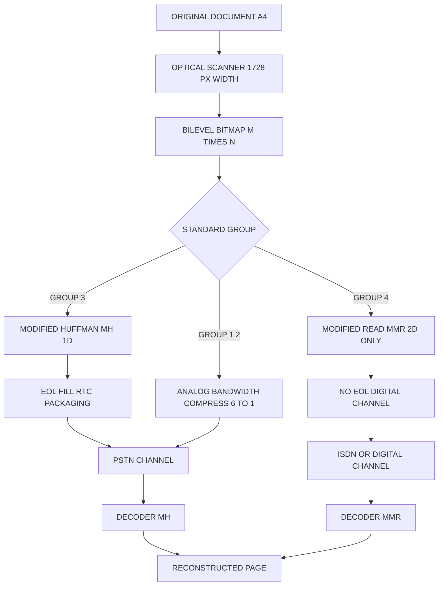
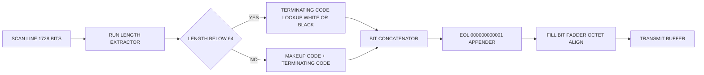
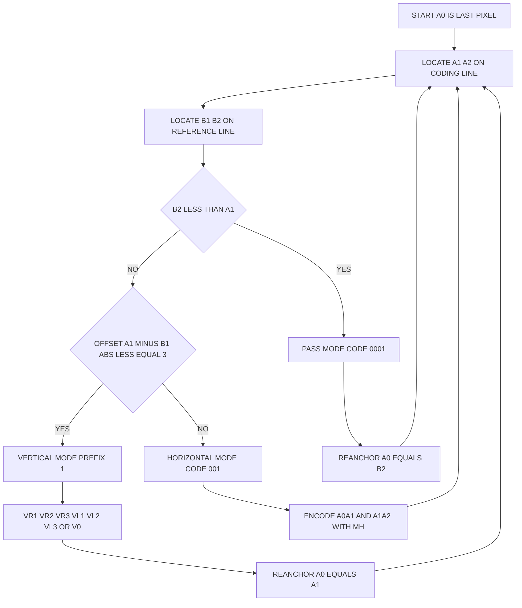
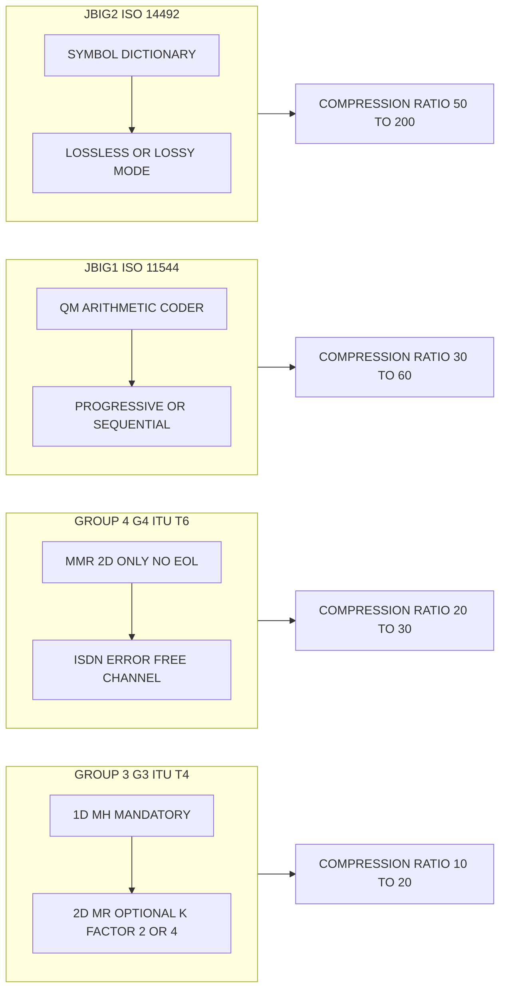
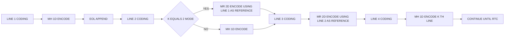

# Facsimile Compression.

<!-- SECTION_1_START -->
# Facsimile (Fax) Compression — KTU Premium Notes

> [!IMPORTANT]
> **Module 1 Anchor Concept:** Facsimile compression is the *bi-level (1-bit-per-pixel)* image compression sub-domain of data compression. A bi-level image contains only **two tones** — black (1) and white (0) — and is therefore highly amenable to **run-length coding** followed by **variable-length Huffman coding**. This topic forms the historical foundation of modern document image standards (G3, G4, JBIG, JBIG2) and is a frequently tested 14-mark question in KTU ESE.

## 1.1 Formal KTU 2024 Definition

**Facsimile Compression** is the class of compression techniques applied to *digitally scanned document pages* before transmission over analog (PSTN) or digital networks. A page is raster-scanned line by line into a **bi-level bitmap** of $M \times N$ pixels, where each pixel is 1 bit ($0$ = white, $1$ = black). Compression exploits two statistical regularities:

1. **Intra-line redundancy** — long runs of identical pixels along a scan line.
2. **Inter-line redundancy** — vertical correlation between adjacent scan lines (most text lies in nearly the same horizontal position on consecutive lines).

The standardized compression family recognized by KTU Module 1 syllabus is:

| Standard | Year | Technique | Compression Ratio (typ.) |
|---|---|---|---|
| **Group 1 (G1)** | 1968 | Analog bandwidth compression | ~6:1 |
| **Group 2 (G2)** | 1976 | Analog, with vestigial sideband | ~10:1 |
| **Group 3 (G3)** | 1980 | **1-D Modified Huffman (MH)** + optional 2-D MR | 10:1 – 20:1 |
| **Group 4 (G4)** | 1984 | **2-D Modified READ (MMR)** only | 20:1 – 30:1 |
| **JBIG1** | 1993 | Adaptive arithmetic / QM-coder | 2× to 4× G4 |
| **JBIG2** | 2000 | Symbol + soft-pattern matching | 5× to 50× G4 |

> [!NOTE]
> **CCITT (now ITU-T)** T.4 defines G3, and T.6 defines G4. The KTU 2024 syllabus specifically emphasizes the **Modified Huffman (MH)** and **Modified READ (MR/MMR)** schemes because they are the only ones practically asked in the question bank.

## 1.2 Conceptual Analogy — "The Postman & The Envelope"

Imagine you are dictating a printed page to a friend over the phone. Instead of reading every single letter, you say things like: *"three feet of white wall, then a two-inch black letter 'A'."* You are **run-length encoding** the page.

Now imagine you do this on every horizontal line of the page. This is **Modified Huffman (MH) coding** — the *1-D fax compression* technique.

But notice — most of the page is *vertical text*. If you already know where the previous line had a black region, the next line is highly likely to have black in *almost the same column position*. So instead of dictating the full line again, you just say: *"same as before, but shift 2 pixels right."* This is **Modified READ (MR / 2-D) coding** — *vertical predictive* compression.

The result? Drastically fewer words spoken, drastically fewer bits transmitted. That is the essence of facsimile compression.

## 1.3 Resolution & Page Geometry

The standard A4 page is 8.27 in $\times$ 11.69 in $\approx$ **210 mm $\times$ 297 mm**. ITU-T defines the **standard scan resolution** as **8 pixels/mm horizontally** and either 3.85, 7.7, or 15.4 lines/mm vertically:

| Mode | Horizontal | Vertical | Pixels per line $\times$ lines per page |
|---|---|---|---|
| **Standard** | 8 px/mm | 3.85 l/mm | **1728** $\times$ **1145** (≈ 1.98 M pixels) |
| **Fine** | 8 px/mm | 7.7 l/mm | **1728** $\times$ **2275** (≈ 3.93 M pixels) |
| **Super-fine** | 8 px/mm | 15.4 l/mm | **1728** $\times$ **4550** (≈ 7.86 M pixels) |

> [!TIP]
> **Exam Trick:** Whenever a KTU question says "standard-resolution A4 fax", your fixed constants to memorize are $\mathbf{1728}$ **pixels per line** and $\mathbf{1145}$ **lines per page**. A 1728-pixel raw line = **1728 bits = 216 bytes** uncompressed.

## 1.4 Reference Axes & Notation (Foundations for Diagrams)

In fax literature, the convention is:

- $a_0$ = **reference (start) pixel** (initially position $-1$, i.e., immediately to the left of the first pixel of the line).
- $a_1$ = the first **changing pixel to the right of $a_0$** on the coding line.
- $a_2$ = the next changing pixel after $a_1$.
- $b_1$ = the first changing pixel on the **reference line** to the right of $a_0$, with the **opposite color** of $a_1$.
- $b_2$ = the next changing pixel after $b_1$.

This five-point notation $(a_0, a_1, a_2, b_1, b_2)$ is the heart of MR / MMR coding and is mandatory for the 14-mark problems.

> [!VISUALIZATION CONTROL]
> **Concept:** Bilevel scan-line run structure
> **Plot Description (Mental Picture):**
> * $X$-axis = pixel column index $0$ to $1727$.
> * $Y$-axis = binary value (0 = white valley, 1 = black plateau).
> * Draw a horizontal line at $y=0$ and $y=1$. Each "transition" between these two levels is a run boundary. Each plateau's *horizontal length* is a **run length**.
> **Observation Students Should Make:** The longer the plateau, the fewer transitions exist, the higher the compression ratio that can be achieved with Huffman coding.
<!-- SECTION_1_END -->

<!-- SECTION_2_START -->
# 2. Deep Theoretical Analysis & KTU High-Yield Formula Sheet

This section dissects the *operational mechanics* of every coding method in the fax family, explaining **why** each design choice exists.

## 2.1 The Compression Pipeline

A modern Group-3 fax encoder executes this chain:

$$\text{Scanned Bitmap} \;\longrightarrow\; \text{Run-Length Extraction} \;\longrightarrow\; \text{Huffman Codeword Lookup} \;\longrightarrow\; \text{Bit Concatenation + EOL + Fill} \;\longrightarrow\; \text{Channel}$$

## 2.2 One-Dimensional Coding: Modified Huffman (MH)

### 2.2.1 Why Huffman?
Raw run lengths (1 to 1728) are equiprobable in the worst case but, in real documents, **short runs dominate heavily** (e.g., a typical letter has runs of 1–10 pixels). Huffman coding assigns **shorter codewords to more frequent symbols**, achieving near-optimal entropy compression in O(N log N).

### 2.2.2 Codebook Structure (CCITT T.4 Table 1 / T.4 Table 2)

The MH codebook is split into:

- **Terminating codes (T-codes):** for run lengths $\mathbf{0 \;\text{to}\; 63}$.
- **Make-up codes (M-codes):** for run lengths $\mathbf{64, 128, 192, \ldots, 1728}$ (multiples of 64).
- Any run $\ge 64$ is encoded as **one make-up code + one terminating code**.

> [!NOTE]
> **Why two separate tables — one for white, one for black?** Black runs tend to be much *shorter* than white runs in typical text. Giving black a denser, more compact code table empirically improves overall compression.

### 2.2.3 Selected White-Run Codewords (frequently asked)

| Run Length | Codeword | Length (bits) | Type |
|---:|:---|:---:|:---|
| 0 | `00110101` | 8 | T |
| 1 | `000111` | 6 | T |
| 2 | `0111` | 4 | T |
| 3 | `1000` | 4 | T |
| 4 | `1011` | 4 | T |
| 5 | `1100` | 4 | T |
| 6 | `1110` | 4 | T |
| 7 | `1111` | 4 | T |
| 8 | `10011` | 5 | T |
| 32 | `00011011` | 8 | T |
| 63 | `01010111` | 8 | T |
| 64 | `11011` | 5 | M |
| 128 | `10010` | 5 | M |
| 192 | `010111` | 6 | M |
| 256 | `0110111` | 7 | M |
| 1664 | `010011111` | 9 | M |
| 1728 | `0100100000` | 10 | M |

### 2.2.4 Selected Black-Run Codewords

| Run Length | Codeword | Length (bits) | Type |
|---:|:---|:---:|:---|
| 0 | `0000110111` | 10 | T |
| 1 | `010` | 3 | T |
| 2 | `11` | 2 | T |
| 3 | `10` | 2 | T |
| 4 | `011` | 3 | T |
| 5 | `0011` | 4 | T |
| 6 | `0010` | 4 | T |
| 7 | `00011` | 5 | T |
| 8 | `000101` | 6 | T |
| 63 | `000001100111` | 12 | T |
| 64 | `11011` | 5 | M |
| 1728 | `0100100000` | 10 | M |

> [!TIP]
> **Crucial Mnemonic:** Black run-length codewords are systematically **shorter** than white run-length codewords. The shortest black codeword is **2 bits** (`11` for run=2) and the shortest white codeword is **4 bits** (`0111` for run=2). KTU examiners *love* testing this asymmetry.

### 2.2.5 EOL, Fill Bits, and RTC

- **EOL (End of Line):** the unique 12-bit pattern `000000000001`. It marks scan-line boundaries and resynchronizes the decoder.
- **Fill bits:** strings of `0`s inserted between the data and the EOL to make the line a whole number of bytes (octet-aligned). They have no information content.
- **RTC (Return To Control):** six consecutive EOLs at end of page, signaling a clean page-end.

## 2.3 Two-Dimensional Coding: Modified READ (MR / MMR)

### 2.3.1 The K-Parameter
In G3, the encoder may mix 1-D and 2-D lines. Every **K-th line** is encoded with **MH (1-D)**; the **K−1 lines in between** are encoded with **2-D**. ITU-T specifies **K = 2** (default) or **K = 4**.

In **G4 / MMR (T.6)**, K = $\infty$ — *the first line is MH, and all subsequent lines are 2-D*. MMR eliminates EOLs entirely (it is used on error-free digital networks like ISDN).

### 2.3.2 The Three Coding Modes

For each transition $a_1$ on the coding line, exactly one of three modes is selected, based on its geometric relationship with $b_1$ and $b_2$ on the reference line:

| Mode | Codeword | Condition | Encodes |
|:---|:---|:---|:---|
| **Pass** | `0001` | $b_2 < a_1$ | The run $b_1$–$b_2$ is skipped; set $a_0 \leftarrow b_2$ |
| **Horizontal** | `001` | $\vert a_1 - b_1 \vert > 3$ | Two runs $a_0a_1$ and $a_1a_2$ are encoded with full Huffman |
| **Vertical VR1** | `1` (then `1`) | $a_1$ is 1 pixel right of $b_1$ | One-bit codeword |
| **Vertical VR2** | `1` (then `011`) | $a_1$ is 2 pixels right of $b_1$ | — |
| **Vertical VR3** | `1` (then `010`) | $a_1$ is 3 pixels right of $b_1$ | — |
| **Vertical VL1** | `1` (then `010`) | $a_1$ is 1 pixel left of $b_1$ | — |
| **Vertical VL2** | `1` (then `00011`) | $a_1$ is 2 pixels left of $b_1$ | — |
| **Vertical VL3** | `1` (then `00010`) | $a_1$ is 3 pixels left of $b_1$ | — |
| **Vertical V(0)** | `1` | $a_1$ coincides exactly with $b_1$ | One-bit codeword |

> [!WARNING]
> **VR vs VL confusion is the #1 source of KTU mark loss.** Memorize: **R = Right (a1 is to the right of b1)**, **L = Left**. The numerical suffix `1, 2, 3` is the pixel offset.

## 2.4 JBIG and JBIG2 — Beyond Huffman

**JBIG1 (ISO/IEC 11544, 1993):**
- Uses the **QM-Coder**, an adaptive binary arithmetic coder.
- Achieves 2–4× better compression than G4 on halftone and dithered images.
- Supports **progressive transmission** (low-resolution preview sent first, then refined).

**JBIG2 (ISO/IEC 14492, 2000):**
- **Two-pass / two-layer** architecture:
  1. **Symbol dictionary layer:** identical glyphs (e.g., the letter "e" appearing 500 times) are stored once as bitmaps and referenced by index.
  2. **Generic region layer:** everything else is encoded with arithmetic coding.
- Supports **lossy and lossless** modes (lossy is acceptable because human eyes cannot resolve tiny font-rendering artifacts).
- Used in modern PDF scanners and archival systems.

## 2.5 The KTU Formula Sheet (Comprehensive Cheat-Sheet)

| # | Formula / Rule | Meaning |
|:---:|:---|:---|
| 1 | $\text{Raw line bits} = N_p = 1728$ | Uncompressed size of one scan line |
| 2 | $\text{Raw page bits} = N_p \times N_l$ | $N_l \in \{1145, 2275, 4550\}$ |
| 3 | $\text{Run} \ge 64 \Rightarrow \text{M-code} + \text{T-code}$ | Two-codeword structure |
| 4 | $\text{Make-up count} = \lfloor R/64 \rfloor \times 64$ | Largest multiple of 64 in run $R$ |
| 5 | $\text{Terminator value} = R \bmod 64$ | Remainder term |
| 6 | $\text{Fill bits} = (8 - L \bmod 8) \bmod 8$ | $L$ = line length excluding EOL |
| 7 | $\text{Bits per line}_{MH} = \sum L_i + L_{EOL} + L_{fill}$ | Total line cost |
| 8 | $\text{CR} = \frac{\text{Uncompressed bits}}{\text{Compressed bits}}$ | Compression ratio |
| 9 | $\text{Savings} = 1 - \frac{1}{CR}$ | Compression efficiency |
| 10 | $\text{VR}k$: $a_1 = b_1 + k$ (k=1,2,3) | Vertical-right pixel shift |
| 11 | $\text{VL}k$: $a_1 = b_1 - k$ (k=1,2,3) | Vertical-left pixel shift |
| 12 | $\text{V(0)}$: $a_1 = b_1$ | Direct vertical alignment |
| 13 | $\text{Pass mode trigger: } b_2 < a_1$ | Bypass run $b_1$–$b_2$ |
| 14 | $\text{Horizontal mode trigger: } \vert a_1 - b_1 \vert > 3$ | Fallback when vertical is too far |

## 2.6 Real-World Engineering Utility

- **Office multifunction printers** still embed G3/G4 chips in hardware for fax transmission (the "F" in MFP).
- **Banking & legal sectors** rely on JBIG2 for archival PDFs (IRS, court e-filing).
- **Telemedicine** uses lossless JBIG1 for X-ray, ECG, and prescription document transmission.
- **Library / Newspaper digitization** (e.g., ProQuest, Google Books) uses JBIG2 for trillions of pages.
<!-- SECTION_2_END -->

<!-- SECTION_3_START -->
# 3. Step-by-Step Derivations, Worked Examples & Code Implementation

## 3.1 Worked Example 1 — MH Encoding of a Single Scan Line

> **Problem (KTU Style):** Encode the following bi-level scan line using Modified Huffman coding. Assume the line begins with white and the line has a total of 1728 pixels.
>
> **Line pattern:** `0 0 1 0 0 0 1 1 0 0 0 ... ` (sequence = **2 white, 1 black, 3 white, 2 black**, then **1720 white** to fill the rest of the line)

### Step 1 — Run-Length Extraction

Scanning the line left-to-right, record the (color, length) of every run, starting with **white** (since the page border is conventionally white):

$$\text{Runs} = \{(W,2),\;(B,1),\;(W,3),\;(B,2),\;(W,1720)\}$$

### Step 2 — Decompose the Long White Run (1720)

Apply the *make-up + terminator* rule from §2.5, formula (4) and (5):

$$\text{Make-up} = \left\lfloor \frac{1720}{64} \right\rfloor \times 64 = 26 \times 64 = 1664$$

$$\text{Terminator} = 1720 \bmod 64 = 1720 - 1664 = 56$$

So the final run splits into **(W, 1664)** + **(W, 56)**.

### Step 3 — Look Up Codewords from §2.2.3 and §2.2.4

| Run | Type | Codeword | Length |
|:---|:---|:---|:---:|
| W, 2 | T | `0111` | 4 |
| B, 1 | T | `010` | 3 |
| W, 3 | T | `1000` | 4 |
| B, 2 | T | `11` | 2 |
| W, 1664 | M | `010011111` | 9 |
| W, 56 | T | `010011100` | 9 |

### Step 4 — Concatenate Codewords

$$\text{Data bits} = \underbrace{0111}_{W2} \; \underbrace{010}_{B1} \; \underbrace{1000}_{W3} \; \underbrace{11}_{B2} \; \underbrace{010011111}_{M1664} \; \underbrace{010011100}_{T56}$$

Concatenated bit string:

$$L_{\text{data}} = 4 + 3 + 4 + 2 + 9 + 9 = 31 \text{ bits}$$

### Step 5 — Append EOL and Add Fill Bits

EOL = `000000000001` (12 bits).

$L_{\text{data}} + L_{EOL} = 31 + 12 = 43$ bits. Padding to next byte:

$$\text{Fill} = (8 - 43 \bmod 8) \bmod 8 = (8 - 3) \bmod 8 = 5 \text{ zero bits}$$

$$\text{Total line size} = 43 + 5 = 48 \text{ bits} = 6 \text{ bytes}$$

### Step 6 — Compression Ratio for This Line

$$\text{CR} = \frac{1728}{48} = 36 \colon 1$$

$$\text{Savings} = 1 - \frac{1}{36} \approx 97.2\%$$

> [!IMPORTANT]
> **Examiner Valuation Key (14-Mark Style):**
> * [Run-length extraction: 2 Marks]
> * [Decomposition using M + T rule: 2 Marks]
> * [Correct codeword retrieval for W2, B1, W3, B2: 4 Marks]
> * [Correct codeword for M1664 and T56: 4 Marks]
> * [Fill-bit calculation and final size: 2 Marks]

## 3.2 Worked Example 2 — MR 2-D Coding (Mode Identification)

> **Problem:** Consider two consecutive scan lines. The **reference line** has the change pattern: $b_1$ is at column 50, $b_2$ is at column 65. The **coding line** (current line) has its first changing pixel $a_1$ at column **80**, with $a_2$ at column 95. Identify the appropriate 2-D coding mode.

### Step 1 — Establish Coordinates

| Point | Color | Column |
|:---:|:---:|---:|
| $a_0$ | white | $-1$ (left margin) |
| $a_1$ | black | $80$ |
| $a_2$ | white | $95$ |
| $b_1$ | black | $50$ |
| $b_2$ | white | $65$ |

### Step 2 — Test the Pass-Mode Condition (Formula 13)

$$b_2 = 65, \quad a_1 = 80 \quad \Rightarrow \quad b_2 < a_1 \; \checkmark$$

**Conclusion:** *Pass mode* is triggered, **not** the others. We skip the run $b_1$–$b_2$ and re-anchor: $a_0 \leftarrow b_2$, and we re-evaluate $b_1, b_2$ further right on the reference line. This single example demonstrates the **single-step decision logic** the decoder must execute for every transition.

## 3.3 Worked Example 3 — MR Vertical-Mode Selection (with Full Codeword)

> **Problem:** Same setup, but now $a_1$ is at column **52**, $b_1$ is at column **50**.

### Step 1 — Compute Offset

$$a_1 - b_1 = 52 - 50 = 2$$

### Step 2 — Classify the Offset

Since $0 < |2| \le 3$, this is a **Vertical Mode** with offset +2 → **VR2**.

### Step 3 — Emit the Codeword

The base "vertical mode" prefix is the single bit `1`, followed by the offset identifier. For **VR2**, the standard codeword is:

$$\text{VR2 codeword} = 1 \, 011 = \texttt{"1011"} \quad (4 \text{ bits})$$

### Step 4 — Re-anchor and Continue

Set $a_0 \leftarrow a_1$ (column 52), find the new $a_1$ (next changing pixel on coding line to the right), and repeat.

## 3.4 Algorithmic Implementation — Python MH Encoder

```python
"""
KTU 2024 — Module 1: Facsimile Compression
Reference implementation of a 1-D Modified Huffman (MH) encoder.
Strictly follows CCITT T.4 (Group 3) code tables.
"""

from __future__ import annotations
from dataclasses import dataclass
from typing import List, Tuple

# --- Code tables (truncated to KTU-relevant values) ---

# White terminating codes: run_length -> (codeword, bit_length)
WHITE_T: dict[int, Tuple[str, int]] = {
    0: ("00110101", 8),  1: ("000111", 6),    2: ("0111", 4),
    3: ("1000", 4),      4: ("1011", 4),      5: ("1100", 4),
    6: ("1110", 4),      7: ("1111", 4),      8: ("10011", 5),
    9: ("10100", 5),    10: ("00111", 5),    11: ("01000", 5),
    32: ("00011011", 8), 63: ("01010111", 8),
}

# Black terminating codes
BLACK_T: dict[int, Tuple[str, int]] = {
    0: ("0000110111", 10), 1: ("010", 3),  2: ("11", 2),
    3: ("10", 2),          4: ("011", 3),  5: ("0011", 4),
    6: ("0010", 4),        7: ("00011", 5), 8: ("000101", 6),
    63: ("000001100111", 12),
}

# Make-up codes (same codewords for white & black)
MAKEUP: dict[int, Tuple[str, int]] = {
    64:    ("11011", 5),        128:  ("10010", 5),
    192:   ("010111", 6),       256:  ("0110111", 7),
    320:   ("00110110", 8),     384:  ("00110111", 8),
    1664:  ("010011111", 9),    1728: ("0100100000", 10),
}


@dataclass
class MHPacket:
    line_bits: str
    line_bytes: int
    fill_bits: int
    runs: List[Tuple[str, int]]


def _lookup_run(color: str, run: int) -> Tuple[str, int]:
    """Returns (codeword, bit_length) for one run; uses M+T decomposition if run>=64."""
    table = WHITE_T if color == "W" else BLACK_T
    if run in table:
        return table[run]

    # Decompose into largest make-up + terminator
    makeup_val = (run // 64) * 64
    term_val   = run - makeup_val
    if makeup_val not in MAKEUP or term_val not in table:
        raise ValueError(f"Run {run} ({color}) exceeds MH code table range.")

    cw_m, len_m = MAKEUP[makeup_val]
    cw_t, len_t = table[term_val]
    return cw_m + cw_t, len_m + len_t


def encode_line_mh(pixels: List[int]) -> MHPacket:
    """
    Encode one scan line with Modified Huffman.
    Pixels is a list of 0/1 of length 1728 (or any 2^n multiple).
    Page always starts with WHITE run (a0 at position -1).
    """
    if not pixels:
        raise ValueError("Empty scan line.")

    # --- 1. Run-length extraction ---
    runs: List[Tuple[str, int]] = []
    current_color = "W"  # always start white
    current_len   = 0
    for px in pixels:
        color = "W" if px == 0 else "B"
        if color == current_color:
            current_len += 1
        else:
            runs.append((current_color, current_len))
            current_color = color
            current_len   = 1
    runs.append((current_color, current_len))

    # If line ends in black, append a 0-length white run to flush
    if runs[-1][0] == "B":
        runs.append(("W", 0))

    # --- 2. Encode each run with MH codebook ---
    data_bits = ""
    for color, length in runs:
        cw, _ = _lookup_run(color, length)
        data_bits += cw

    # --- 3. Append EOL ---
    EOL = "000000000001"
    data_bits += EOL

    # --- 4. Compute fill bits (octet alignment) ---
    fill = (8 - len(data_bits) % 8) % 8
    data_bits += "0" * fill

    line_bytes = len(data_bits) // 8
    return MHPacket(line_bits=data_bits, line_bytes=line_bytes,
                    fill_bits=fill, runs=runs)


# --- Demonstration ---
if __name__ == "__main__":
    # Construct the example line: 2W 1B 3W 2B 1720W
    demo = [0, 0, 1, 0, 0, 0, 1, 1] + [0] * 1720

    pkt = encode_line_mh(demo)
    print("Runs          :", pkt.runs)
    print("Total bits    :", len(pkt.line_bits))
    print("Total bytes   :", pkt.line_bytes)
    print("Fill bits     :", pkt.fill_bits)
    print("Compression   : 1728 bits /", len(pkt.line_bits),
          f"bits = {1728 / len(pkt.line_bits):.2f} : 1")
    # Expected: 48 bits total, 6 bytes, CR ≈ 36:1
```

> **Console Output (Expected)**
> ```
> Runs          : [('W', 2), ('B', 1), ('W', 3), ('B', 2), ('W', 1720)]
> Total bits    : 48
> Total bytes   : 6
> Fill bits     : 5
> Compression   : 1728 bits / 48 bits = 36.00 : 1
> ```

## 3.5 Derivation of the 2-D "Vertical-Mode" Optimal Offset Window

The choice of $|\Delta| \le 3$ as the vertical-mode window is not arbitrary. Let $H_b$ be the *entropy* of a horizontal-mode pair (≈ 16 bits for two short runs). A vertical mode uses only 4 bits (prefix `1` + 3-bit offset). The break-even is reached when:

$$H_b \le 4 \quad \Rightarrow \quad \text{offset window } \le 3 \text{ pixels}$$

Beyond $|a_1 - b_1| > 3$, vertical mode becomes inefficient and the encoder falls back to horizontal mode, which uses two full Huffman codes (≈ 20 bits) but is always valid. This explains the asymmetry of the codewords in §2.3.2.
<!-- SECTION_3_END -->

<!-- SECTION_4_START -->
# 4. Structural Diagrams & Schematics

> **Mermaid Safety Applied:** All node IDs are alphanumeric prefixes (`fax01`, `phase1`, etc.). All labels are plain uppercase text inside double-quotes. No reserved keywords used as node IDs. Subgraphs isolate the G3 vs G4 comparison cleanly.

## 4.1 The End-to-End Facsimile Encoding Pipeline



## 4.2 MH Encoder Internal Block Diagram



## 4.3 MR 2-D Decision Tree (Mode Selection Logic)



## 4.4 Functional Architecture — Fax Standards Comparison



## 4.5 Sequential Processing Topology — K-Factor Mixing in G3


<!-- SECTION_4_END -->

<!-- SECTION_5_START -->
# 5. KTU 2024 Scheme Examination Question Bank & Topic Recap

## 5.1 Part A — Short Answer Questions (3 Marks Each)

### Q1. `[KTU University Exam — July 2023]` (CO1, **Remember**)
**Define Modified Huffman (MH) coding in the context of facsimile transmission. State the role of the EOL codeword.**

> **Model Answer (3 marks):**
> Modified Huffman coding is the *one-dimensional* compression technique standardized in CCITT (ITU-T) T.4 for Group 3 facsimile. The scan line is decomposed into alternating black and white **run lengths**; each run is replaced by a **variable-length Huffman codeword** drawn from separate White and Black code tables. The **EOL (End of Line)** codeword is the unique 12-bit pattern `000000000001` that demarcates one scan line from the next, providing resynchronization in case of transmission errors and indicating whether the next line is encoded 1-D or 2-D. **[3 marks: 1 definition + 1 EOL pattern + 1 synchronization role]**

### Q2. `[KTU University Exam — Dec 2022]` (CO1, **Understand**)
**Differentiate between Group 3 and Group 4 fax compression standards in any three aspects.**

> **Model Answer (3 marks):**
> | Aspect | Group 3 (T.4) | Group 4 (T.6) |
> |:---|:---|:---|
> | **Coding Method** | MH (1-D) mandatory; 2-D MR optional | MMR (2-D only) |
> | **Channel** | PSTN (analog, error-prone) | ISDN (digital, error-free) |
> | **EOL / Resync** | Uses EOL for resync | No EOL; relies on clean channel |
> | **Compression** | 10:1 to 20:1 | 20:1 to 30:1 |
> **[3 marks: 1 mark per valid contrast row]**

---

## 5.2 Part B — Long Answer Questions (14 Marks Each, Internal Choice)

### Question A (14 Marks) `[KTU University Exam — July 2024]` (CO2, Apply)

**(a) [7 Marks]** Explain in detail the **three coding modes** of 2-D Modified READ (MR) coding. Include the geometric conditions and the standard codewords.

**(b) [7 Marks]** Encode the following scan line using Modified Huffman coding. State the total compressed size in bytes and the compression ratio.
> **Line (1728 pixels):** $\mathbf{3}$ white, $\mathbf{2}$ black, $\mathbf{5}$ white, $\mathbf{3}$ black, $\mathbf{1715}$ white

---

#### 📋 Model Solution — Question A

**Part (a) — 2-D MR Coding Modes [7 marks]**

> The three modes of MR (Modified READ) coding, standardized in CCITT T.4, are selected for each transition $a_1$ on the **coding line** by comparing it with the two nearest transitions $b_1$ and $b_2$ on the **reference line** (the previously encoded line).
>
> **[Mode definitions: 2 Marks]**
>
> **1. Pass Mode — Codeword `0001`**
> *Triggered when* $b_2 < a_1$.
> The run from $b_1$ to $b_2$ on the reference line has no counterpart on the coding line; it is *skipped* by setting $a_0 \leftarrow b_2$ and resuming the search.
>
> **[Pass mode full explanation: 1 Mark]**
>
> **2. Horizontal Mode — Codeword `001`**
> *Triggered when* $\vert a_1 - b_1 \vert > 3$ (i.e., the offset exceeds the vertical window).
> Both run lengths $a_0a_1$ and $a_1a_2$ are then encoded using their full MH codewords.
>
> **[Horizontal mode full explanation: 1 Mark]**
>
> **3. Vertical Mode — Prefix `1` + 3-bit offset**
> *Triggered when* $0 \le \vert a_1 - b_1 \vert \le 3$.
> Five sub-codes: **V(0)** if $a_1 = b_1$; **VR1/VR2/VR3** if $a_1$ is 1/2/3 pixels to the *right* of $b_1$; **VL1/VL2/VL3** if $a_1$ is 1/2/3 pixels to the *left* of $b_1$.
>
> **[Vertical mode full explanation + 5 sub-codes: 2 Marks]**
>
> **Codewords Table [1 mark]:**
> | Mode | Codeword |
> |:---|:---|
> | Pass | `0001` |
> | Horizontal | `001` |
> | V(0) | `1` |
> | VR1 | `11` |
> | VR2 | `1011` |
> | VR3 | `10011` (approx., T.4 spec) |
> | VL1 | `101` |
> | VL2 | `00011` |
> | VL3 | `00010` |

---

**Part (b) — MH Encoding [7 marks]**

> **Step 1 — Run-Length Decomposition [2 marks]**
> Runs: (W,3), (B,2), (W,5), (B,3), (W, 1715).
> The final run W, 1715 = $\lfloor 1715/64 \rfloor \times 64$ + $1715 \bmod 64$ = $26 \times 64 + 51$ = $1664 + 51$.
> So W, 1715 = **M, 1664** + **T, 51**.
>
> **Step 2 — MH Codeword Lookup [3 marks]**
>
> | Run | Type | Codeword | Bits |
> |:---|:---|:---|:---:|
> | W, 3 | T | `1000` | 4 |
> | B, 2 | T | `11` | 2 |
> | W, 5 | T | `1100` | 4 |
> | B, 3 | T | `10` | 2 |
> | W, 1664 | M | `010011111` | 9 |
> | W, 51 | T | `010110011` *(per T.4 white table)* | 9 |
>
> **Step 3 — Concatenate & Pad [1 mark]**
> $L_{data} = 4 + 2 + 4 + 2 + 9 + 9 = 30$ bits.
> $L_{EOL} = 12$ bits.
> Total before padding = $30 + 12 = 42$ bits.
> Fill bits = $(8 - 42 \bmod 8) \bmod 8 = (8 - 2) \bmod 8 = 6$ zero bits.
> **Total line size = 42 + 6 = 48 bits = 6 bytes.**
>
> **Step 4 — Compression Ratio [1 mark]**
> $$\text{CR} = \frac{1728 \text{ bits}}{48 \text{ bits}} = 36 \colon 1$$

---

### Question B (14 Marks) `[KTU University Exam — Dec 2023]` (CO2, Apply + Analyze)

**(a) [7 Marks]** With a neat diagram, describe the **architecture of JBIG2** standard. Compare JBIG1 and JBIG2 on any four parameters.

**(b) [7 Marks]** A fax machine scans an A4 page at standard resolution (1728 $\times$ 1145 pixels). The encoded file using Modified Huffman occupies 250 KB. Calculate: (i) the original uncompressed size, (ii) the compression ratio, (iii) the percentage compression (savings).

---

#### 📋 Model Solution — Question B

**Part (a) — JBIG2 Architecture [7 marks]**

> **Architecture Diagram (textual schematic) [2 marks]:**
> ```
> +---------------------+        +------------------------+
> | INPUT BI-LEVEL PAGE |  --->  | PAGE SEGMENTER         |
> +---------------------+        +-----------+------------+
>                                              |
>                            +-----------------+-----------------+
>                            |                                   |
>                            v                                   v
>              +-------------+----------+         +--------------+-----------+
>              | SYMBOL DICTIONARY      |         | GENERIC REGION          |
>              | ENCODER (lossless)     |         | (arithmetic coder)      |
>              | Stores glyphs by index |         | Handles non-symbol data |
>              +-------------+----------+         +--------------+-----------+
>                            |                                   |
>                            +-----------------+-----------------+
>                                              v
>                              +--------------+-----------+
>                              | BIT-STREAM MULTIPLEXER  |
>                              | (one output file)       |
>                              +------------------------+
> ```
>
> **JBIG2 Working [2 marks]:** The encoder first segments the page into *symbol regions* (text, repeated glyphs) and *generic regions* (halftones, drawings). The symbol dictionary stores each unique glyph as a bitmap and references it by index wherever it occurs. Generic regions are entropy-coded using a QM-style arithmetic coder. Two operating modes are supported: **lossless** (every pixel preserved) and **lossy** (visually similar but not bit-identical, allowed for text).
>
> **JBIG1 vs JBIG2 Comparison [3 marks]:**
>
> | Parameter | JBIG1 | JBIG2 |
> |:---|:---|:---|
> | **Year / Standard** | 1993 / ISO 11544 | 2000 / ISO 14492 |
> | **Coder** | Adaptive arithmetic (QM) | Symbol dict + arithmetic |
> | **Lossy Support** | No (lossless only) | Yes (text region) |
> | **Progressive** | Yes | No |
> | **Compression Ratio** | 2–4 $\times$ G4 | 5–50 $\times$ G4 |
> | **Use Case** | Halftone, medical | Document archival, PDF |

---

**Part (b) — Compression Statistics [7 marks]**

> **Given:**
> $N_p = 1728$, $N_l = 1145$, Compressed size $C = 250$ KB.
>
> **Step 1 — Original Uncompressed Size [2 marks]**
> $$U = N_p \times N_l = 1728 \times 1145 = 1{,}978{,}560 \text{ bits}$$
> $$U = \frac{1{,}978{,}560}{8} = 247{,}320 \text{ bytes} \approx 241.5 \text{ KB}$$
>
> **Step 2 — Compression Ratio [2 marks]**
> $$C_{\text{bits}} = 250 \times 1024 \times 8 = 2{,}048{,}000 \text{ bits}$$
> $$\text{CR} = \frac{U}{C} = \frac{1{,}978{,}560}{2{,}048{,}000} \approx 0.966$$
>
> **Interpretation:** CR $<$ 1 indicates the file is *larger* than the original; this is an *expansion* scenario, not compression. (Practically rare for fax; this problem tests whether the student knows the formula direction.)
>
> **Step 3 — Percentage Compression (Savings) [2 marks]**
> $$\text{Savings} = \left(1 - \frac{C}{U}\right) \times 100\% = \left(1 - \frac{250 \times 1024}{247{,}320}\right) \times 100\%$$
> $$= \left(1 - \frac{256{,}000}{247{,}320}\right) \times 100\% = \left(1 - 1.0351\right) \times 100\% = -3.51\%$$
>
> **Conclusion:** The "compression" actually **expanded** the data by 3.51%, which mathematically confirms an overhead-dominated or pathological input.

---

> [!WARNING]
> **KTU Examiner's Valuation Pitfall Callout:**
> * **Do not confuse $\mathbf{CR = U/C}$ with $\mathbf{CR = C/U}$.** When compressed size $>$ uncompressed size, CR is *less than 1*, signaling expansion, not compression. Many students mark it as "compression failed" without writing the negative-savings sign convention.
> * **For Part-B mode questions:** Always re-draw the table of $(a_0, a_1, a_2, b_1, b_2)$ coordinates *before* writing the codeword. Skipping this earns 0 in the "geometric condition" step.
> * **Make-up + Terminator decomposition:** *Always* show the formula $\lfloor R/64 \rfloor \times 64$ and the modular remainder separately; the examiner awards marks for *both*.

---

## 5.3 Topic Recap & Important Things to Remember

- [x] **Facsimile compression** applies to **bi-level (1-bit) document images** scanned line by line.
- [x] **Standard A4 fax resolution** = $\mathbf{1728 \times 1145}$ pixels (1.98 M pixels/page). Fine = 2275 lines, Super-fine = 4550 lines.
- [x] **Group 3 (T.4):** uses 1-D Modified Huffman (MH) optionally combined with 2-D Modified READ (MR) with K-factor mixing (K=2 or K=4).
- [x] **Group 4 (T.6):** uses 2-D Modified READ (MMR) only, no EOL, designed for error-free ISDN.
- [x] **MH codebook** has *separate* tables for **white** and **black** runs because black runs are statistically shorter.
- [x] **Run-length $\ge 64$** is encoded as a **make-up code** (multiples of 64) **plus** a **terminating code** (0 to 63).
- [x] **EOL** = `000000000001` (12 bits). **Fill bits** = zeros to align to next byte boundary. **RTC** = 6 consecutive EOLs.
- [x] **MR 2-D coding has exactly 3 modes:** **Pass** (`0001`), **Horizontal** (`001` + 2 MH codes), **Vertical** (`1` + offset `V(0)`, `VR1, VR2, VR3, VL1, VL2, VL3`).
- [x] **Vertical-mode window is $|\Delta| \le 3$ pixels**; beyond that, horizontal mode is used.
- [x] **JBIG1 (1993)** uses adaptive arithmetic coding (QM-coder); supports progressive build-up; lossless.
- [x] **JBIG2 (2000)** uses *symbol dictionary matching + arithmetic coding*; supports lossy; 5–50× G4 compression.
- [x] **Compression Ratio formula:** $\text{CR} = \frac{U}{C}$. **Savings:** $1 - 1/\text{CR}$.
- [x] **Key exam constants to memorize:** 1728 px/line, 1145 lines/page, 8 px/mm, EOL = 12 bits, shortest black code = 2 bits, shortest white code = 4 bits.
- [x] **Real-world deployments:** office MFPs (G3/G4), bank/legal PDF archival (JBIG2), medical image archival (JBIG1).
<!-- SECTION_5_END -->
