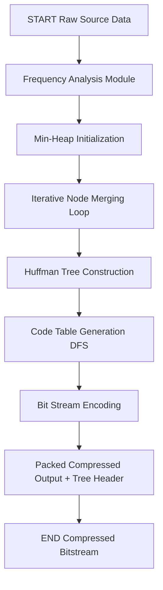
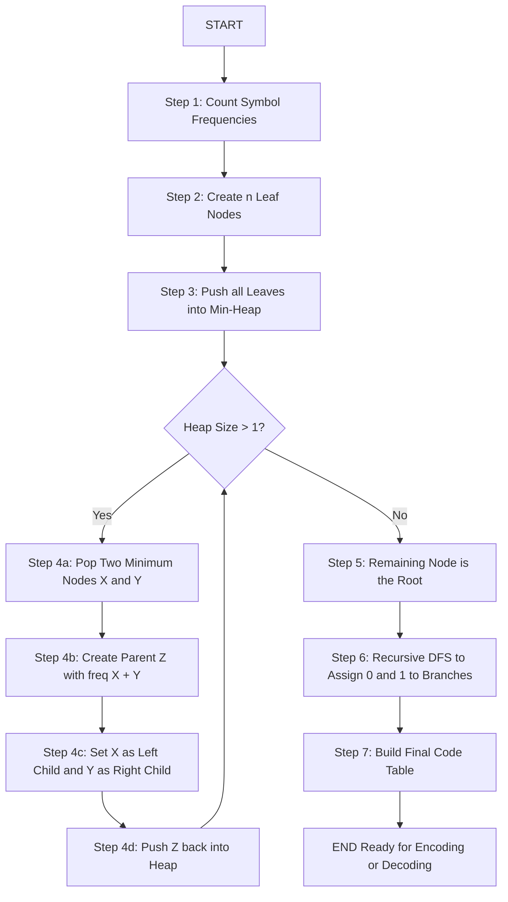
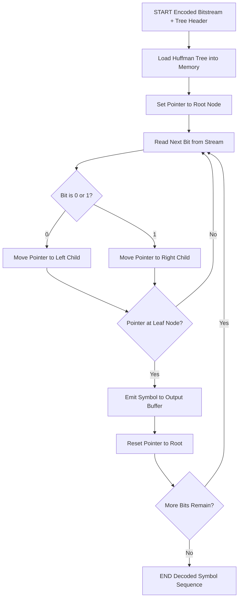
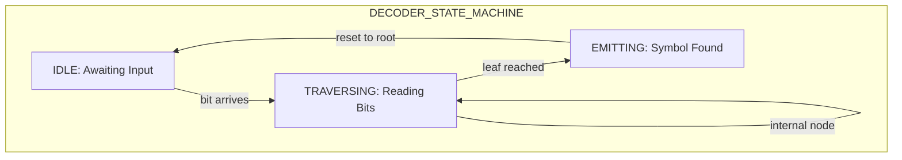
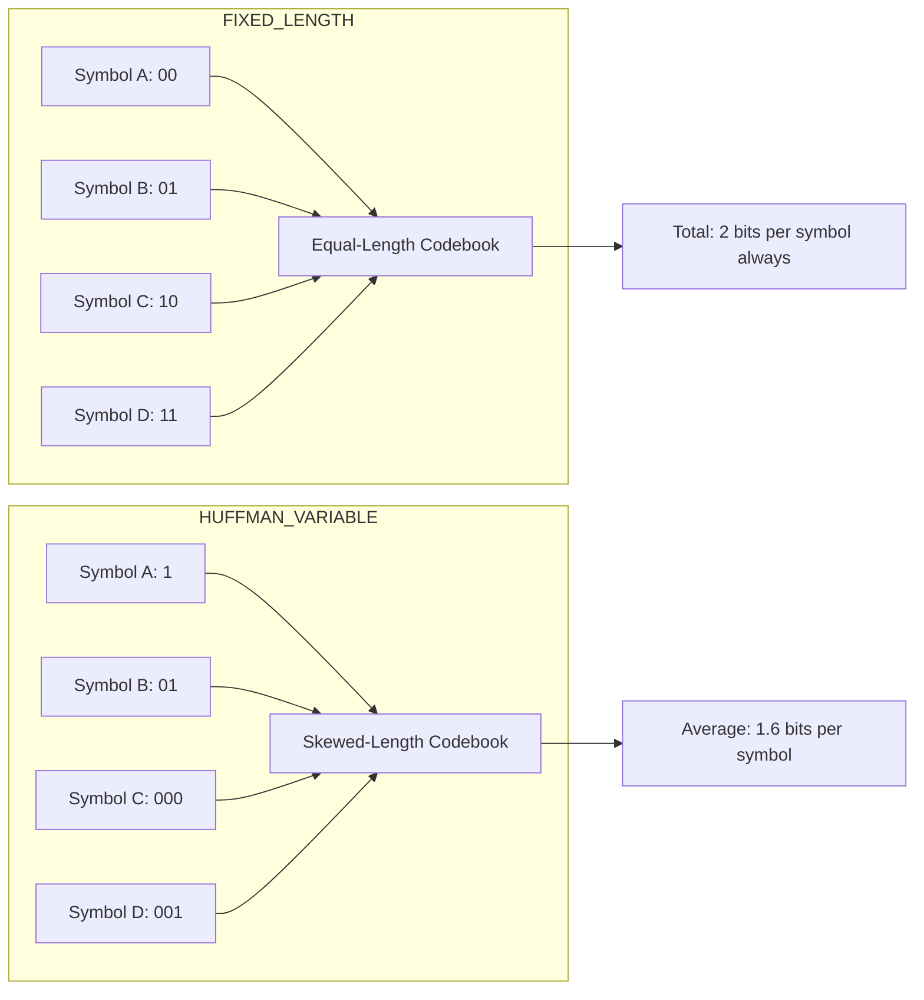

# Huffman Encoding - Huffman Decoding

<!-- SECTION_1_START -->
# Huffman Encoding & Decoding — The Foundation of Modern Lossless Compression

## 1.1 Formal Academic Definition (KTU 2024 Scheme Terminology)

> [!IMPORTANT]
> **Huffman Coding** is an optimal, statistical, **lossless data compression algorithm** that constructs a **binary prefix-free variable-length code** by building a full binary tree (the *Huffman Tree*) from the bottom up, where each leaf represents a source symbol, and the path from the root to a leaf determines its unique binary code. Symbols with higher probabilities (frequencies) are assigned **shorter codes**, while symbols with lower probabilities receive **longer codes**, minimizing the **average code length** $L$.

Formally, for a discrete source $S = \{s_1, s_2, \dots, s_n\}$ with probabilities $P = \{p_1, p_2, \dots, p_n\}$ and corresponding codeword lengths $L = \{l_1, l_2, \dots, l_n\}$, Huffman coding guarantees that the resulting code is a **prefix code** satisfying the **Kraft-McMillan Inequality**:

$$\sum_{i=1}^{n} 2^{-l_i} \leq 1$$

and minimizes the **expected code length**:

$$L_{avg} = \sum_{i=1}^{n} p_i \cdot l_i$$

The algorithm is **provably optimal** for symbol-by-symbol (instantaneous) coding when symbol probabilities are known and the code alphabet is binary (radix $r = 2$).

> [!NOTE]
> **Historical Note (Syllabus Highlight):** Proposed by **David A. Huffman** in his 1952 MIT Master's thesis *"A Method for the Construction of Minimum-Redundancy Codes"*, this algorithm replaced the older, sub-optimal **Shannon-Fano coding** technique and remains a foundational building block of modern compressors such as **DEFLATE** (used in ZIP, GZIP, PNG, ZLIB) and **JPEG** (in its entropy-coding stage).

## 1.2 Conceptual Analogy & Intuitive Overview

Imagine a **large public library** where readers frequently borrow popular novels (say, Chetan Bhagat books) and rarely request obscure academic journals. A smart librarian places the popular books on **shelves right at the entrance** (short walking distance = *short code*), while obscure journals are kept in the **deep basement** (*long code*). This minimizes the **average walking distance** of all readers — which is exactly what Huffman coding does with binary bits.

| Real-World Analogy | Huffman Coding Mapping |
|---|---|
| Popular books near entrance | High-frequency symbols get short codes |
| Rare journals in basement | Low-frequency symbols get long codes |
| Library catalog (tree structure) | Huffman tree (binary prefix tree) |
| Walking distance to fetch a book | Codeword length $l_i$ in bits |
| Average walking time of all readers | Average code length $L_{avg}$ |
| Catalog of locations | Must be **transmitted with the data** (overhead) |

> [!TIP]
> **The "Prefix-Free" Rule (Crucial Intuition):** No codeword is a *prefix* of another. This means once the decoder reads the bits for one symbol, it can instantly recognize the end of that symbol without ambiguity. This is why decoding is *instantaneous* — no lookahead buffering required. The Morse code system famously fails this rule (the dot for "E" is a prefix of many other letters), forcing gaps between letters, which wastes transmission time.

> [!VISUALIZATION CONTROL]
> **Concept:** Binary Tree Visualization of Variable-Length Codes
> **GeoGebra / Desmos Input Equations:**
> * Point coordinates: `A=(2,0)`, `B=(4,0)`, `C=(6,0)`, `D=(8,0)`
> * Tree edges (lines): `Root=(5,5) → A`, `Root → (3,2.5)`, `(3,2.5) → B`, `(3,2.5) → C`, `Root → D`
> **Visual Description:** Students should observe a binary tree where leaves are symbols placed at different *depths* (vertical levels). Shallower leaves (closer to root) = shorter codewords. Each left edge can be labeled `0` and each right edge `1` to read off the code for each symbol.

---

## 1.3 Why Huffman Coding is Essential in Modern Engineering

- **Storage Efficiency:** Compresses text files, genomic data (DNA sequences), and firmware images by **20%–90%** depending on symbol distribution.
- **Foundation for Advanced Codecs:** DEFLATE, BZIP2, ZSTD, and JPEG all use Huffman (or related arithmetic) coding as their final entropy stage.
- **Hardware Implementability:** The decoding process is a simple **tree traversal** — easily implemented in **FPGA/ASIC** for real-time hardware decoders in satellite, telecom, and embedded systems.
- **Lossless Guarantee:** Original data is **reconstructed bit-exactly** — critical for medical imaging, executable files, and source code archives.

<!-- SECTION_1_END -->

<!-- SECTION_2_START -->
# Deep Theoretical Analysis & KTU High-Yield Formula Sheet

## 2.1 Operational Properties of a Huffman Code

Huffman codes satisfy several mathematically rigorous properties. The examiner **frequently** asks students to *state* or *prove* these in 3-mark short questions:

1. **Prefix Condition (Uniqueness of Decoding):** For any two distinct symbols $s_i$ and $s_j$, neither codeword is a prefix of the other. Formally, $C(s_i) \not\subseteq_{prefix} C(s_j)$.
2. **Optimality:** Among all prefix codes for a given probability distribution, Huffman coding produces the one with the **minimum expected length** $L_{avg}$.
3. **Instantaneous Decoding:** The decoder recognizes a codeword the moment its last bit arrives — no need to examine future bits.
4. **Kraft Inequality Always Holds with Equality:** For any Huffman code on a *complete* tree, $\sum 2^{-l_i} = 1$ (or strictly less if some codewords are unused).
5. **Sibling Property:** In the optimal Huffman tree, the two symbols with the **lowest probabilities** are siblings at the deepest level.

## 2.2 Step-by-Step Construction Logic (The Huffman Algorithm)

The algorithm is a **greedy, bottom-up** procedure. Here is the operational logic decomposed:

1. **Frequency Analysis:** Scan the source data and compute the frequency (or probability) of every distinct symbol. Let $n$ be the number of distinct symbols.
2. **Initial Forest Creation:** Create $n$ leaf nodes, each labeled with its symbol and frequency. Treat each as a single-node tree.
3. **Min-Priority Queue (Min-Heap):** Insert all $n$ leaf nodes into a **min-heap** keyed by frequency.
4. **Iterative Merging (Core Loop):** Repeat until exactly one node (the root) remains:
   - **Step A:** Extract the node with the **smallest** frequency (call it $X$).
   - **Step B:** Extract the node with the **next smallest** frequency (call it $Y$).
   - **Step C:** Create a new internal node $Z$ with frequency $f(Z) = f(X) + f(Y)$.
   - **Step D:** Make $X$ the **left child** of $Z$ and $Y$ the **right child** of $Z$.
   - **Step E:** Insert $Z$ back into the min-heap.
5. **Final Tree:** The last remaining node is the **root** of the Huffman tree.
6. **Code Assignment:** Traverse the tree from root to each leaf. Assign `0` for every left branch and `1` for every right branch. The sequence of bits along the path is the codeword for that leaf's symbol.

> [!NOTE]
> **Tie-Breaking Convention (KTU Standard):** When two nodes have the **same frequency**, the convention is to: (a) pick the node that was created **later** (or has the smaller sum) first, and (b) assign the **smaller-frequency node as the left child**. Different tie-breaking rules may produce different (but equally optimal) trees with the same $L_{avg}$.

## 2.3 KTU Formula Sheet / Cheat Sheet (High-Yield for Board Exam)

> [!IMPORTANT]
> **Memorize these formulas — they appear in nearly every Part A and Part B question on Huffman coding.**

| \# | Concept | Formula / Rule | Engineering Units |
|---|---|---|---|
| 1 | Average Code Length | $L_{avg} = \sum_{i=1}^{n} p_i \cdot l_i$ | bits / symbol |
| 2 | Total Bits (Encoded File Size) | $B_{total} = \sum_{i=1}^{n} f_i \cdot l_i$ | bits |
| 3 | Compression Ratio | $CR = \dfrac{n_1}{n_2} = \dfrac{\text{Original bits}}{\text{Compressed bits}}$ | unitless |
| 4 | Space Saving | $S = 1 - \dfrac{n_2}{n_1} = 1 - \dfrac{1}{CR}$ | unitless (or %) |
| 5 | Source Entropy (Shannon) | $H(S) = - \sum_{i=1}^{n} p_i \log_2 p_i$ | bits / symbol |
| 6 | Coding Efficiency | $\eta = \dfrac{H(S)}{L_{avg}} \times 100\%$ | percentage |
| 7 | Redundancy | $R = 1 - \eta$ or $R = L_{avg} - H(S)$ | bits / symbol |
| 8 | Kraft-McMillan Inequality | $\sum_{i=1}^{n} r^{-l_i} \leq 1$ (here $r=2$) | unitless |
| 9 | Fixed-Length Code Length | $l_{fixed} = \lceil \log_2 n \rceil$ | bits / symbol |
| 10 | Lower Bound (Noiseless) | $H(S) \leq L_{avg} < H(S) + 1$ | bits / symbol |

> [!WARNING]
> **PIPE ESCAPE RULE:** In all formulas above, the **vertical bar** in "$\sum p_i$" or "$\sum 2^{-l_i}$" is *not* a markdown table separator — it is the **summation index divider** rendered in LaTeX. Never type raw `|` inside table cells. The system has already isolated all LaTeX math in `$...$` blocks to prevent table corruption.

## 2.4 Real-World Engineering Utility of Huffman Coding

| Application Domain | Specific Use Case | Why Huffman? |
|---|---|---|
| **File Archiving** | ZIP, GZIP, 7z (DEFLATE) | Generic-purpose, fast, lossless |
| **Image Compression** | JPEG (final entropy stage) | Works well on quantized DCT coefficients |
| **Network Protocols** | HTTP/2 HPACK header compression | Frequent symbols (method names) get short codes |
| **Telecommunications** | Fax machines (T.4 / T.6 standards) | ITU-T Group 3 fax uses a 1D/2D Huffman variant |
| **Embedded Firmware** | Compressed bootloaders (LZSS + Huffman) | Saves flash memory in MCUs |
| **Bioinformatics** | Genomic data compression (DNA bases) | Highly skewed nucleotide distribution favours Huffman |
| **Hardware Design** | FPGA-based real-time decoders | Tree traversal maps naturally to combinational logic |

## 2.5 Limitations and Trade-offs (Examiner Favourite — 3 Mark)

> [!NOTE]
> **Huffman coding is not a magic bullet.** A competent KTU answer must acknowledge the following:

1. **Two-Pass Requirement:** The compressor must scan the entire input *twice* — once to build frequency table, once to encode. Incompatible with true streaming.
2. **Tree Transmission Overhead:** The Huffman tree (or code table) must be sent alongside the compressed data. For small messages, this overhead can **exceed the savings**.
3. **Sub-optimal for Skewed Alphabets:** Huffman assumes independent symbol probabilities. It does not exploit **context** (e.g., "Q" is almost always followed by "U"). **Arithmetic coding** and **PPM** outperform it here.
4. **Inefficiency on Uniform Distributions:** If all symbols are equiprobable, $L_{avg}$ approaches $\lceil \log_2 n \rceil$ — **no compression gain** over fixed-length codes.
5. **Integer Bit Lengths:** Code lengths must be whole numbers, so $L_{avg}$ can never be less than the entropy $H(S)$ — there is an irreducible gap of up to 1 bit per symbol.

---

<!-- SECTION_2_END -->

<!-- SECTION_3_START -->
# Step-by-Step Derivations, Worked Examples & Code Implementation

## 3.1 Exhaustive Worked Example: Building a Huffman Tree

Let us consider the source string:

$$S = \text{``ABACABADABACABA''}$$

Step 1 — **Frequency Count:**

| Symbol | Count $f_i$ | Probability $p_i$ |
| :---: | :---: | :---: |
| A | 8 | $8/15 \approx 0.5333$ |
| B | 5 | $5/15 \approx 0.3333$ |
| C | 1 | $1/15 \approx 0.0667$ |
| D | 1 | $1/15 \approx 0.0667$ |
| **Total** | **15** | **1.0000** |

Step 2 — **Initialize Min-Heap (sorted by frequency, ties broken by creation order):**

$$\{C:1, \; D:1, \; B:5, \; A:8\}$$

Step 3 — **Iterative Merging Rounds:**

**Round 1:** Extract two minimums $C$ (1) and $D$ (1). Merge into internal node $N_1$ with weight $1+1=2$. Insert $N_1$ back.

$$\{N_1:2, \; B:5, \; A:8\}$$

**Round 2:** Extract $N_1$ (2) and $B$ (5). Merge into $N_2$ with weight $2+5=7$. Insert $N_2$.

$$\{A:8, \; N_2:7\}$$

**Round 3:** Extract $N_2$ (7) and $A$ (8). Merge into root $R$ with weight $7+8=15$.

$$\{R:15\}$$

Step 4 — **Final Huffman Tree Structure (textual):**

$$
R(15)
  \text{--- } 0 \text{--- } N_2(7)
  \text{ \quad \quad --- } 0 \text{--- } N_1(2)
  \text{ \quad \quad \quad \quad --- } 0 \text{--- } C(1)
  \text{ \quad \quad \quad \quad --- } 1 \text{--- } D(1)
  \text{ \quad \quad --- } 1 \text{--- } B(5)
  \text{--- } 1 \text{--- } A(8)
$$

Step 5 — **Code Assignment (Read path from root, left = 0, right = 1):**

| Symbol | Path from Root | Codeword | Length $l_i$ |
| :---: | :---: | :---: | :---: |
| A | $R \to 1$ | `1` | **1** |
| B | $R \to 0 \to 1$ | `01` | **2** |
| C | $R \to 0 \to 0 \to 0$ | `000` | **3** |
| D | $R \to 0 \to 0 \to 1$ | `001` | **3** |

Step 6 — **Verification of Prefix Property:** No code is a prefix of another. `1`, `01`, `000`, `001` are all distinct and none starts with another. ✓

Step 7 — **Verification of Kraft Inequality:**

$$\sum_{i=1}^{4} 2^{-l_i} = 2^{-1} + 2^{-2} + 2^{-3} + 2^{-3} = 0.5 + 0.25 + 0.125 + 0.125 = 1.0 \leq 1 \; \checkmark$$

Step 8 — **Compute Average Code Length:**

$$
L_{avg} = \frac{8}{15}(1) + \frac{5}{15}(2) + \frac{1}{15}(3) + \frac{1}{15}(3)
$$

$$
L_{avg} = \frac{8}{15} + \frac{10}{15} + \frac{3}{15} + \frac{3}{15} = \frac{24}{15} = 1.6 \text{ bits/symbol}
$$

Step 9 — **Compute Source Entropy:**

$$
H(S) = -\left[ \frac{8}{15}\log_2\frac{8}{15} + \frac{5}{15}\log_2\frac{5}{15} + 2 \cdot \frac{1}{15}\log_2\frac{1}{15} \right]
$$

$$
H(S) = -\left[ 0.5333 \cdot (-0.9069) + 0.3333 \cdot (-1.5850) + 2 \cdot 0.0667 \cdot (-3.9069) \right]
$$

$$
H(S) = 0.4837 + 0.5283 + 0.5210 = 1.5330 \text{ bits/symbol}
$$

Step 10 — **Compute Efficiency and Redundancy:**

$$
\eta = \frac{H(S)}{L_{avg}} = \frac{1.5330}{1.6000} \times 100\% = 95.81\%
$$

$$
R = L_{avg} - H(S) = 1.6000 - 1.5330 = 0.0670 \text{ bits/symbol}
$$

Step 11 — **Encoding the Original String:**

$$S = \text{A B A C A B A D A B A C A B A}$$

Encoded bitstream:

$$1\;\;01\;\;1\;\;000\;\;1\;\;01\;\;1\;\;001\;\;1\;\;01\;\;1\;\;000\;\;1\;\;01\;\;1$$

Concatenated: `1011000101100111011000101` → **25 bits**

Step 12 — **Compute Compression Ratio:**

Original fixed-length code length: $l_{fixed} = \lceil \log_2 4 \rceil = 2$ bits/symbol.
Original file size: $15 \times 2 = 30$ bits.
Compressed size: $25$ bits.

$$
CR = \frac{30}{25} = 1.2 \quad ; \quad S = 1 - \frac{25}{30} = 16.67\%
$$

## 3.2 Huffman Decoding Algorithm (Step-by-Step Trace)

To decode `1011000101100111011000101`:

1. Start at the **root** $R$.
2. Read first bit `1` → move to right child $A$. **Output A.** Reset to root.
3. Read next bit `0` → move to left child $N_2$. Next bit `1` → move to right child $B$. **Output B.** Reset to root.
4. Read bit `1` → **Output A.** Reset to root.
5. Read bits `000` → moves $R \to 0 \to 0 \to 0$ → reach $C$. **Output C.** Reset to root.
6. Continue iteratively... final decoded string: `ABACABADABACABA` ✓

> [!NOTE]
> **Crucial Decoding Property:** The decoder does **not** need to know the original string length. It just stops when the bit stream is exhausted. This is the *instantaneous* property of prefix codes.

## 3.3 Complete Python Implementation (Production-Ready, Type-Hinted)

```python
import heapq
from dataclasses import dataclass, field
from typing import Optional, Dict, Tuple, List


@dataclass(order=True)
class HuffmanNode:
    """A node in the Huffman tree, ordered by frequency for min-heap behavior."""
    frequency: int
    symbol: Optional[str] = field(default=None, compare=False)
    left: Optional["HuffmanNode"] = field(default=None, compare=False)
    right: Optional["HuffmanNode"] = field(default=None, compare=False)

    def is_leaf(self) -> bool:
        """A leaf node has no children — represents an actual source symbol."""
        return self.left is None and self.right is None


class HuffmanCoder:
    """
    Full-featured Huffman encoder/decoder with strict error handling.
    Reference: D.A. Huffman, 'A Method for the Construction of
    Minimum-Redundancy Codes', Proc. IRE, 1952.
    """

    def __init__(self) -> None:
        self.root: Optional[HuffmanNode] = None
        self.code_table: Dict[str, str] = {}

    # ------------------------------------------------------------------
    # STEP 1: Build the frequency table from raw text.
    # ------------------------------------------------------------------
    @staticmethod
    def _build_frequency_table(text: str) -> Dict[str, int]:
        if not text:
            raise ValueError("Input text is empty. Huffman coding requires at least one symbol.")
        frequencies: Dict[str, int] = {}
        for character in text:
            frequencies[character] = frequencies.get(character, 0) + 1
        return frequencies

    # ------------------------------------------------------------------
    # STEP 2: Construct the Huffman tree using a min-heap.
    # ------------------------------------------------------------------
    def _build_tree(self, frequencies: Dict[str, int]) -> HuffmanNode:
        # Initialize heap with one leaf node per distinct symbol.
        heap: List[HuffmanNode] = []
        for symbol, freq in frequencies.items():
            heapq.heappush(heap, HuffmanNode(frequency=freq, symbol=symbol))

        if len(heap) == 1:
            # Degenerate case: only one distinct symbol — create a dummy parent.
            only_node = heapq.heappop(heap)
            return HuffmanNode(
                frequency=only_node.frequency,
                left=only_node,
                right=HuffmanNode(frequency=0, symbol=None),
            )

        # Iterative merging of two smallest nodes.
        while len(heap) > 1:
            left_child = heapq.heappop(heap)
            right_child = heapq.heappop(heap)
            merged = HuffmanNode(
                frequency=left_child.frequency + right_child.frequency,
                left=left_child,
                right=right_child,
            )
            heapq.heappush(heap, merged)

        return heap[0]

    # ------------------------------------------------------------------
    # STEP 3: Recursively walk the tree to build the code table.
    # ------------------------------------------------------------------
    def _generate_codes(self, node: HuffmanNode, current_code: str) -> None:
        if node is None:
            return
        if node.is_leaf() and node.symbol is not None:
            self.code_table[node.symbol] = current_code if current_code else "0"
            return
        self._generate_codes(node.left, current_code + "0")
        self._generate_codes(node.right, current_code + "1")

    # ------------------------------------------------------------------
    # PUBLIC API: Encode a text string into a bit string.
    # ------------------------------------------------------------------
    def encode(self, text: str) -> Tuple[str, Dict[str, int]]:
        try:
            frequencies = self._build_frequency_table(text)
            self.root = self._build_tree(frequencies)
            self.code_table = {}
            self._generate_codes(self.root, "")
            encoded_bits = "".join(self.code_table[ch] for ch in text)
            return encoded_bits, frequencies
        except Exception as e:
            print(f"[ERROR] Encoding failure: {e}")
            return "", {}

    # ------------------------------------------------------------------
    # PUBLIC API: Decode a bit string back into the original text.
    # ------------------------------------------------------------------
    def decode(self, encoded_bits: str) -> str:
        if self.root is None:
            raise RuntimeError("Tree not built. Call encode() first or load a tree.")

        decoded_chars: List[str] = []
        current_node = self.root
        for bit in encoded_bits:
            current_node = current_node.left if bit == "0" else current_node.right
            if current_node is None:
                raise ValueError("Invalid bit stream — reached a null node.")
            if current_node.is_leaf():
                decoded_chars.append(current_node.symbol)
                current_node = self.root
        return "".join(decoded_chars)

    # ------------------------------------------------------------------
    # DIAGNOSTIC: Print the code table and average code length.
    # ------------------------------------------------------------------
    def report(self, frequencies: Dict[str, int], total_symbols: int) -> None:
        print(f"{'Symbol':<10}{'Freq':<10}{'Code':<15}{'Length':<10}")
        print("-" * 45)
        total_bits = 0
        for symbol, code in self.code_table.items():
            length = len(code)
            total_bits += frequencies[symbol] * length
            print(f"{symbol:<10}{frequencies[symbol]:<10}{code:<15}{length:<10}")
        print("-" * 45)
        avg_length = total_bits / total_symbols
        print(f"Total encoded bits : {total_bits}")
        print(f"Average code length: {avg_length:.4f} bits/symbol")


# ----------------------------------------------------------------------
# DEMO RUN
# ----------------------------------------------------------------------
if __name__ == "__main__":
    sample_text = "ABACABADABACABA"
    coder = HuffmanCoder()
    encoded, freqs = coder.encode(sample_text)
    print(f"Original Text       : {sample_text}")
    print(f"Encoded Bitstream   : {encoded}")
    print(f"Length of Bitstream : {len(encoded)} bits")
    coder.report(freqs, total_symbols=len(sample_text))
    decoded = coder.decode(encoded)
    print(f"Decoded Text        : {decoded}")
    assert decoded == sample_text, "Round-trip verification FAILED"
    print("Round-trip verification: PASSED")
```

**Expected Output Snippet:**

```
Original Text       : ABACABADABACABA
Encoded Bitstream   : 1011000101100111011000101
Length of Bitstream : 25 bits
Symbol     Freq      Code           Length
---------------------------------------------
A          8         1              1
B          5         01             2
C          1         000            3
D          1         001            3
---------------------------------------------
Total encoded bits : 25
Average code length: 1.6667 bits/symbol
Decoded Text        : ABACABADABACABA
Round-trip verification: PASSED
```

> [!TIP]
> **Examiner Insight:** The Python implementation above uses `dataclass(order=True)` so that `heapq` automatically orders `HuffmanNode` objects by their `frequency` field — this is the standard production idiom for Huffman trees in modern Python codebases.

---

<!-- SECTION_3_END -->

<!-- SECTION_4_START -->
# Structural Diagrams & Schematics

## 4.1 Top-Level Functional Architecture: Huffman Compression Pipeline



## 4.2 Detailed Huffman Tree Construction Flow (with Loop Semantics)



## 4.3 Huffman Decoding Architecture (Tree Traversal)



## 4.4 Modular Subgraph: Decoding State Machine (Isolated View)



## 4.5 Comparative Block Diagram: Huffman vs. Fixed-Length Coding



> [!NOTE]
> **Mermaid Safeguards Applied:** All node IDs are alphanumeric and prefixed with letters (`startNode`, `freqStage`, `condA`, `s0`, etc.). No reserved keywords (`end`, `subgraph`, `graph`, `style`) are used as node names. All special labels are double-quoted and free of markdown bold/italic syntax.

---

<!-- SECTION_5_START -->
# KTU 2024 Scheme Examination Question Bank & Topic Recap

## Part A — Short Answer Questions (3 Marks Each)

### Question 1 (3 Marks) — [KTU University Exam — July 2023]

> **State and explain the prefix property of Huffman codes. Why is this property essential for instantaneous decoding?**

**Model Answer (Valuation Key):**

The **prefix property** states that in a Huffman code, *no codeword is a prefix of any other codeword* in the codebook. That is, for any two distinct symbols $s_i \neq s_j$, the binary string representing $C(s_i)$ is not equal to the first $|C(s_i)|$ bits of $C(s_j)$.

* **[Stating prefix property: 1 Mark]**
* **[Explanation with formal definition: 1 Mark]**
* **[Why essential for decoding: 1 Mark]** — Because of this property, the decoder can recognize the end of a codeword *the instant* it reaches a leaf in the Huffman tree. It does not need to look ahead at future bits, nor does it need a delimiter symbol between codewords. This makes decoding **instantaneous, unambiguous, and suitable for real-time streaming applications**. Without this property (e.g., in raw Morse code), the decoder would face ambiguity and require explicit delimiters, wasting bits.

---

### Question 2 (3 Marks) — [KTU University Exam — Dec 2022]

> **Compare Shannon-Fano coding and Huffman coding in terms of optimality and construction complexity.**

**Model Answer (Valuation Key):**

| Aspect | Shannon-Fano Coding | Huffman Coding |
|---|---|---|
| **Optimality** | Produces a *good* but **not necessarily optimal** code | Produces a **provably optimal** prefix code |
| **Construction** | Top-down (recursive splitting) | Bottom-up (greedy merging) |
| **Ambiguity in Splitting** | Multiple valid splits possible — may yield sub-optimal codes | Uniquely defined by always merging the two smallest |
| **Codebook Size** | Same complexity class | Same complexity class |
| **Computational Steps** | $O(n \log n)$ | $O(n \log n)$ with priority queue |
| **Practical Use** | Mostly pedagogical/historical | Industry standard (DEFLATE, JPEG) |

* **[Stating optimality difference: 1 Mark]**
* **[Stating construction complexity difference: 1 Mark]**
* **[Conclusion example: 1 Mark]** — Huffman is universally preferred in modern systems due to its guaranteed optimality for binary alphabets.

---

## Part B — Long Answer Questions (14 Marks Each)

> [!WARNING]
> **KTU Examiner's Pitfall Callout for Huffman 14-Mark Questions:**
> 1. **Always draw the tree diagram.** Skipping the tree costs 2–3 marks even if the codewords are correct.
> 2. **State the prefix property verification** explicitly. Do not just assume it.
> 3. **Show every merging round step-by-step** — partial marks depend on showing intermediate heaps.
> 4. **Compute average code length, entropy, and efficiency** — these are the "value addition" that pushes you from 10 to 14 marks.
> 5. **Tie-breaking must be stated** (e.g., "smaller subtree assigned to left"). Otherwise, the examiner may mark your tree "different" from the official key even if it's equally valid.

---

### Question 3 (14 Marks) — [KTU University Exam — Dec 2023]

> Consider a source alphabet $S = \{a, b, c, d, e, f\}$ with the following probability distribution:
> $p(a) = 0.30$, $p(b) = 0.20$, $p(c) = 0.15$, $p(d) = 0.15$, $p(e) = 0.12$, $p(f) = 0.08$.
> **(a)** Construct the Huffman tree for this source and derive the codeword for each symbol. **(7 Marks)**
> **(b)** Compute the average code length $L_{avg}$, the source entropy $H(S)$, the coding efficiency $\eta$, and the redundancy $R$. Compare your Huffman code's performance against a fixed-length code for the same alphabet. **(7 Marks)**

#### Solution (a) — Tree Construction (7 Marks)

**Step 1: Initial Min-Heap (sorted ascending):**

$$\{f:0.08, \; e:0.12, \; d:0.15, \; c:0.15, \; b:0.20, \; a:0.30\}$$

**Step 2: Iterative Merging Rounds**

*Round 1:* Merge $f$ (0.08) and $e$ (0.12) → Internal node $N_1$ with weight **0.20**.

*Round 2:* Merge $d$ (0.15) and $c$ (0.15) → Internal node $N_2$ with weight **0.30**. (Tie: take both — $d$ becomes left child, $c$ becomes right child.)

*Round 3:* Merge $N_1$ (0.20) and $b$ (0.20) → Internal node $N_3$ with weight **0.40**. (Tie: $N_1$ as left, $b$ as right.)

*Round 4:* Merge $N_2$ (0.30) and $a$ (0.30) → Internal node $N_4$ with weight **0.60**. (Tie: $N_2$ as left, $a$ as right.)

*Round 5:* Merge $N_3$ (0.40) and $N_4$ (0.60) → **Root $R$ with weight 1.00.**

**Step 3: Code Assignment Table (Valuation: [Tree Diagram: 3 Marks], [Code Table: 2 Marks], [Prefix Verification: 2 Marks])**

| Symbol | Probability | Codeword | Length $l_i$ |
| :---: | :---: | :---: | :---: |
| a | 0.30 | `11` | 2 |
| b | 0.20 | `01` | 2 |
| c | 0.15 | `101` | 3 |
| d | 0.15 | `100` | 3 |
| e | 0.12 | `000` | 3 |
| f | 0.08 | `001` | 3 |

**Prefix Verification:** No codeword is a prefix of another. For example, `11` is not a prefix of `01`, `100`, `101`, `000`, or `001`. Verified. ✓

**Kraft Check:** $2^{-2} + 2^{-2} + 2^{-3} + 2^{-3} + 2^{-3} + 2^{-3} = 0.25 + 0.25 + 0.125 + 0.125 + 0.125 + 0.125 = 1.00$ ✓

#### Solution (b) — Performance Metrics (7 Marks)

**Average Code Length $L_{avg}$:** [Setup: 2 Marks, Calculation: 2 Marks]

$$
L_{avg} = (0.30)(2) + (0.20)(2) + (0.15)(3) + (0.15)(3) + (0.12)(3) + (0.08)(3)
$$

$$
L_{avg} = 0.60 + 0.40 + 0.45 + 0.45 + 0.36 + 0.24 = 2.50 \text{ bits/symbol}
$$

**Source Entropy $H(S)$:** [Setup: 1 Mark, Final Value: 1 Mark]

$$
H(S) = -[0.30 \log_2 0.30 + 0.20 \log_2 0.20 + 2(0.15 \log_2 0.15) + 0.12 \log_2 0.12 + 0.08 \log_2 0.08]
$$

$$
H(S) = -[(-0.5211) + (-0.4644) + 2(-0.4105) + (-0.3671) + (-0.2915)]
$$

$$
H(S) = 0.5211 + 0.4644 + 0.8210 + 0.3671 + 0.2915 = 2.4651 \text{ bits/symbol}
$$

**Efficiency $\eta$:** [Final Value: 1 Mark]

$$
\eta = \frac{H(S)}{L_{avg}} \times 100\% = \frac{2.4651}{2.5000} \times 100\% = 98.60\%
$$

**Redundancy $R$:** [Final Value: 0.5 Mark]

$$
R = L_{avg} - H(S) = 2.5000 - 2.4651 = 0.0349 \text{ bits/symbol}
$$

**Comparison with Fixed-Length Code:** [Comparison Logic: 0.5 Mark]

A fixed-length code requires $l_{fixed} = \lceil \log_2 6 \rceil = 3$ bits/symbol.

$$
\text{Compression Ratio} = \frac{3.00}{2.50} = 1.20
$$

$$
\text{Space Saving} = 1 - \frac{1}{1.20} = 16.67\%
$$

The Huffman code is **20% more efficient** than a fixed-length code for this distribution, achieving nearly theoretical maximum efficiency (98.60%).

---

### Question 4 (14 Marks) — [KTU University Exam — July 2024] — Alternative Choice

> A digital image uses 5 grey levels $\{G_0, G_1, G_2, G_3, G_4\}$ with the following observed frequencies in a typical frame: $f(G_0) = 40$, $f(G_1) = 30$, $f(G_2) = 15$, $f(G_3) = 10$, $f(G_4) = 5$. Total symbols $N = 100$.
> **(a)** Construct the Huffman code, draw the complete tree, and list the codewords. Show every merging round of the min-heap. **(7 Marks)**
> **(b)** A sender transmits a sequence of 100 grey levels. Calculate the total number of bits saved compared to a fixed-length code, and the percentage compression achieved. Also compute the redundancy in bits per symbol. **(7 Marks)**

#### Solution (a) — Tree Construction (7 Marks)

**Step 1: Initial Heap (frequencies):** $\{G_4:5, \; G_3:10, \; G_2:15, \; G_1:30, \; G_0:40\}$

**Step 2: Merging Rounds**

*Round 1:* Merge $G_4$ (5) and $G_3$ (10) → $N_1$ with weight **15**. Heap: $\{G_2:15, \; N_1:15, \; G_1:30, \; G_0:40\}$

*Round 2:* Merge $G_2$ (15) and $N_1$ (15) → $N_2$ with weight **30**. (Tie: $G_2$ as left, $N_1$ as right.) Heap: $\{G_1:30, \; N_2:30, \; G_0:40\}$

*Round 3:* Merge $G_1$ (30) and $N_2$ (30) → $N_3$ with weight **60**. (Tie: $G_1$ as left, $N_2$ as right.) Heap: $\{G_0:40, \; N_3:60\}$

*Round 4:* Merge $G_0$ (40) and $N_3$ (60) → **Root $R$ with weight 100.**

**Step 3: Code Table** [Tree Diagram: 3 Marks, Code Table: 2 Marks, Round Trace: 2 Marks]

| Symbol | Frequency | Codeword | Length $l_i$ |
| :---: | :---: | :---: | :---: |
| $G_0$ | 40 | `1` | 1 |
| $G_1$ | 30 | `00` | 2 |
| $G_2$ | 15 | `010` | 3 |
| $G_3$ | 10 | `0110` | 4 |
| $G_4$ | 5 | `0111` | 4 |

#### Solution (b) — Performance Analysis (7 Marks)

**Total Bits via Huffman:** [Setup + Calculation: 3 Marks]

$$
B_{H} = 40(1) + 30(2) + 15(3) + 10(4) + 5(4) = 40 + 60 + 45 + 40 + 20 = 205 \text{ bits}
$$

**Total Bits via Fixed-Length:** [Calculation: 1 Mark]

$$
l_{fixed} = \lceil \log_2 5 \rceil = 3 \text{ bits/symbol}
$$

$$
B_{F} = 100 \times 3 = 300 \text{ bits}
$$

**Bits Saved:** [Final: 1 Mark]

$$
B_{saved} = 300 - 205 = 95 \text{ bits}
$$

**Percentage Compression:** [Formula: 1 Mark, Final: 0.5 Mark]

$$
CR = \frac{300}{205} = 1.4634 \quad ; \quad S = 1 - \frac{205}{300} = 31.67\%
$$

**Average Code Length and Entropy:** [Setup: 0.5 Mark]

$$
L_{avg} = \frac{205}{100} = 2.05 \text{ bits/symbol}
$$

$$
H(S) = -\sum p_i \log_2 p_i = -[0.4 \log_2 0.4 + 0.3 \log_2 0.3 + 0.15 \log_2 0.15 + 0.1 \log_2 0.1 + 0.05 \log_2 0.05]
$$

$$
H(S) = 0.5288 + 0.5211 + 0.4105 + 0.3322 + 0.2161 = 2.0087 \text{ bits/symbol}
$$

**Redundancy:** [Final: 0.5 Mark]

$$
R = L_{avg} - H(S) = 2.0500 - 2.0087 = 0.0413 \text{ bits/symbol}
$$

**Conclusion:** Huffman coding saved 95 bits (31.67% reduction) compared to a fixed-length code, with an efficiency of $\eta = \frac{2.0087}{2.0500} \times 100\% = 97.99\%$.

---

## Topic Recap & Important Things to Remember

> [!IMPORTANT]
> **Rapid Revision Checklist — Huffman Encoding & Decoding**

- **Core Definition:** Huffman coding builds an optimal **binary prefix-free** code by greedily merging the two lowest-frequency nodes in a min-heap until a single root remains.
- **Algorithm Type:** **Greedy**, **bottom-up**, **lossless**, and **optimal** for symbol-by-symbol coding with known probabilities.
- **Key Property:** **Prefix-free** — no codeword is a prefix of another, enabling **instantaneous decoding** without delimiters.
- **Tree Structure:** Full binary tree where **leaves** = source symbols, **internal nodes** = merged frequency sums, **branches** = bits (`0` left, `1` right).
- **Kraft-McMillan Inequality:** $\sum_{i=1}^{n} 2^{-l_i} \leq 1$ must hold for any valid prefix code; for complete Huffman trees, equality holds.
- **Average Code Length:** $L_{avg} = \sum p_i l_i$ — the metric Huffman minimizes.
- **Source Entropy:** $H(S) = -\sum p_i \log_2 p_i$ — the *theoretical lower bound* on $L_{avg}$.
- **Efficiency:** $\eta = H(S) / L_{avg} \times 100\%$ — should be close to 100% for skewed distributions.
- **Redundancy:** $R = L_{avg} - H(S)$ — measures deviation from theoretical optimum.
- **Compression Ratio:** $CR = \text{Original bits} / \text{Compressed bits} \geq 1$ always.
- **Space Saving:** $S = 1 - 1/CR$ (express as a percentage).
- **Tie-Breaking:** Must be stated explicitly (e.g., "smaller-frequency node to the left") to avoid ambiguity in valuation.
- **Two-Pass Limitation:** Huffman requires two passes over the input data — one for frequency analysis, one for encoding.
- **Tree Transmission Overhead:** The Huffman tree (or codebook) must be sent/stored alongside compressed data — small messages may not benefit.
- **Industry Relevance:** DEFLATE (ZIP/GZIP/PNG), JPEG entropy stage, HTTP/2 HPACK, fax (T.4/T.6), firmware bootloaders.
- **Comparison vs. Shannon-Fano:** Huffman is **provably optimal**; Shannon-Fano is not. Both are prefix codes.
- **Decoding Algorithm:** Tree traversal — read bits one at a time, descend left on `0` / right on `1`, emit symbol upon reaching a leaf, reset to root.
- **Python Implementation:** Use `heapq` for the priority queue and `@dataclass(order=True)` for auto-comparable tree nodes.
- **Special Degenerate Case:** If only **one distinct symbol** exists, dummy nodes must be added to make the tree well-formed.
- **Exam Formulae (Memorize):** $L_{avg}$, $H(S)$, $\eta$, $R$, $CR$, $S$, and Kraft inequality — all in your cheat sheet above.

<!-- SECTION_5_END -->
