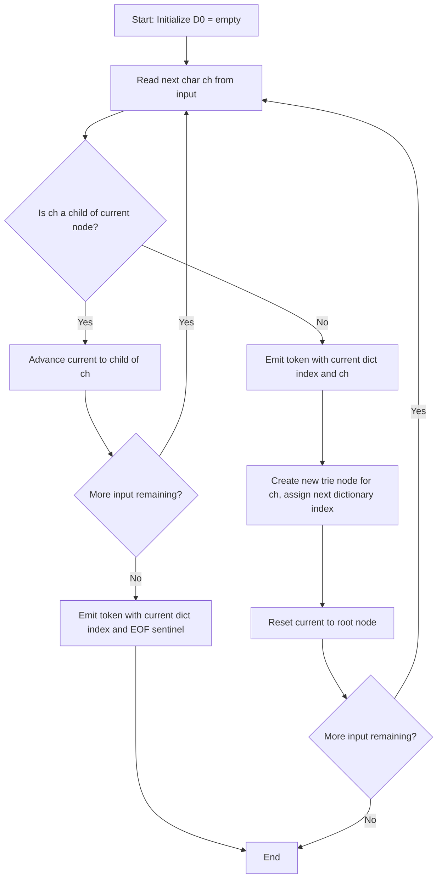
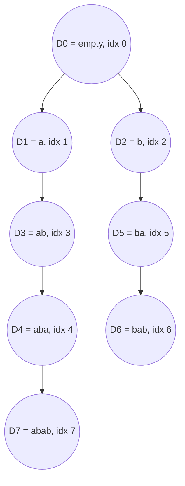

# LZ78

<!-- SECTION_1_START -->
# LZ78 (Lempel-Ziv 1978) — Core Definition & Intuitive Overview

## 1.1 Formal Academic Definition

**LZ78** is a **dictionary-based, lossless data compression algorithm** introduced by **Abraham Lempel** and **Jacob Ziv** in their seminal 1978 paper *"Compression of Individual Sequences via Variable-Rate Coding"*. It belongs to the family of **substitutional (dictionary) compressors** and is the direct successor of the sliding-window LZ77 scheme.

In LZ78, the compressor dynamically constructs a **Phrase Dictionary** (often implemented as a trie or hash table) while scanning the input stream. The input is parsed into a sequence of **tokens**, where each token is a pair $(i, c)$ denoting:
- $i$ → the **dictionary index** of the longest matching prefix already seen.
- $c$ → the **next literal character** that extends that prefix to form a *new* dictionary entry.

> [!IMPORTANT]
> **KTU 2024 Syllabus Highlight (PECST524 — Module 1):**
> LZ78 is contrasted with LZ77. The defining distinction is the **explicit, growing dictionary** (no sliding window) and the **token format** of $(index, character)$ pairs. This is a guaranteed **2-mark short-answer** topic in the ESE.

---

## 1.2 Conceptual Analogy — The "Translator's Phrasebook"

Imagine you are a **simultaneous interpreter** translating a foreign speech in real time.

- You do **not** memorize the entire speech beforehand (unlike dictionary preloading).
- Instead, every time you hear a phrase, you write it down in a **blank phrasebook** (the *dictionary*).
- The next time the speaker uses the **same phrase**, you simply **point to its page number** in the phrasebook instead of re-translating word-by-word.
- The very first time a phrase appears, you must say it in full, and then *log it* in the phrasebook.

The phrasebook **grows monotonically** — once a phrase is added, it is never removed or modified. The phrasebook index you speak aloud each time is the *dictionary reference*, and the *literal word* that extends it is the *new character*.

| Real-World Object | LZ78 Equivalent |
|---|---|
| The phrasebook | The **Dictionary $D$** |
| A page in the book | A **Phrase / String entry** $D[k]$ |
| The page number you speak | The **index $i$** of the token |
| The new word added to a page | The **literal character $c$** |
| The listener reconstructing the speech | The **Decoder rebuilding $D$** |

> [!NOTE]
> **Initialization Rule:** The dictionary is conventionally initialized with **one empty-string entry** at **index 0** (sometimes 1, depending on the textbook). We shall adopt the **Katzan / Sayood convention**: $D[0] = \text{NULL}$, which acts as the universal fallback for any unmatched single character.

---

## 1.3 Why a Dictionary and Not a Sliding Window?

LZ77 used a *sliding window* of fixed size $W$ and *look-ahead buffer* of size $L$, producing tokens $(offset, length, next\_char)$. This had two problems:

1. The **window is finite** — old phrases could be evicted, reducing compression on long or repetitive inputs.
2. The token contained **two numerical fields plus a literal**, which could be costly for short matches.

LZ78 solved both by:
- Removing the window entirely and using an **unbounded, append-only dictionary**.
- Using a **simpler two-field token** $(i, c)$, where $i$ is the prefix index and $c$ is one literal character.

The trade-off is that LZ78's dictionary must be **transmitted or rebuilt** by the decoder — but since both encoder and decoder construct the same dictionary deterministically from the token stream, **no explicit dictionary transmission is required**.

---

## 1.4 Visualization of the LZ78 Token Stream

> [!VISUALIZATION CONTROL]
> **Concept:** Sequential token generation from an input alphabet.
> **Geometric Intuition:** Plot the input string $S$ on the x-axis, the growing dictionary on the y-axis, and draw arrows for each emitted $(i, c)$ token. The arrows form a strictly forward-propagating chain because the dictionary never references itself backward in a cyclic way.
> **Visual Description:** Each row represents a new dictionary entry; the arrow from index $i$ to a literal $c$ shows how the *new* entry is built by appending $c$ to the *old* entry $D[i]$.
<!-- SECTION_1_END -->

<!-- SECTION_2_START -->
# Deep Theoretical Analysis & KTU High-Yield Formula Sheet

## 2.1 The LZ78 Tokenization Rule (Formally)

Let the input stream be the character sequence:

$$S = s_1, s_2, s_3, \ldots, s_n, \quad s_j \in \Sigma$$

The encoder maintains:
- A dictionary $D = \{ D[0], D[1], D[2], \ldots \}$.
- A current match string $P$ (initially empty).

At each parsing step $k$:

1. **Find the longest prefix** $P^*$ of the *remaining unparsed input* such that $P^* \in D$.
2. Let $i$ be the dictionary index of $P^*$. If no prefix is in $D$ (i.e., the very first character fails to match), set $i = 0$.
3. Let $c$ be the **next character** in the input following $P^*$. If $c$ does not exist (i.e., end of file is reached within $D$), set $c = \text{NULL}$.
4. **Emit the token** $T_k = (i, c)$.
5. **Append to the dictionary:** $D[\,|D|\,] = P^* \cdot c$ (i.e., concatenate $c$ to $P^*$ and store as a new entry).
6. Advance the input pointer past $P^* \cdot c$ and repeat.

The output is the concatenated stream of tokens:

$$T = (i_1, c_1),\ (i_2, c_2),\ \ldots,\ (i_m, c_m)$$

---

## 2.2 The Decoding Rule

The decoder receives the token stream and rebuilds the dictionary *identically*:

1. Initialize $D[0] = \text{NULL}$.
2. For each received token $(i, c)$:
   - **Reconstruct the phrase** as $P^* \cdot c = D[i] \cdot c$.
   - **Output** $P^* \cdot c$ to the decoded stream.
   - **Append** $D[\,|D|\,] = P^* \cdot c$ to the dictionary.

Because the encoder and decoder append **identically** at every step, the dictionary is perfectly synchronized **without any side-channel transmission**.

---

## 2.3 Worked Encoding Walkthrough — Textbook Canonical Example

> **Input string:** $S = \texttt{a\_b\_a\_b\_a\_b\_a\_b\_a}$ (concatenation: `ababababa`)

Assume $\Sigma = \{\texttt{a}, \texttt{b}\}$ and dictionary is initialized with $D[0] = \text{NULL}$.

| Step | Unparsed Input | Longest Match $P^*$ in $D$ | Index $i$ | Next Char $c$ | Emitted Token | New $D$ Entry |
|:----:|:--------------:|:--------------------------:|:---------:|:-------------:|:-------------:|:-------------:|
| 1 | `ababababa`    | (none) → empty             | 0         | `a`           | `(0, a)`      | $D[1] = \texttt{a}$ |
| 2 | `babababa`     | (none) → empty             | 0         | `b`           | `(0, b)`      | $D[2] = \texttt{b}$ |
| 3 | `abababa`      | `a`                        | 1         | `b`           | `(1, b)`      | $D[3] = \texttt{ab}$ |
| 4 | `ababa`        | `ab`                       | 3         | `a`           | `(3, a)`      | $D[4] = \texttt{aba}$ |
| 5 | `ba`           | `b`                        | 2         | `a`           | `(2, a)`      | $D[5] = \texttt{ba}$ |
| 6 | (empty)        | `b` then `ba`              | 5         | (EOF)         | `(5, EOF)`    | $D[6] = \texttt{ba}\cdot\text{NULL}$ |

**Encoded output stream:** $(0,\texttt{a}),\ (0,\texttt{b}),\ (1,\texttt{b}),\ (3,\texttt{a}),\ (2,\texttt{a}),\ (5,\text{EOF})$

This **6-token stream** encodes **9 input characters** — a token-to-character ratio of $6/9 = 0.667$ before any entropy coding.

---

## 2.4 KTU High-Yield Formula Sheet

> [!IMPORTANT]
> **Exam Tip:** KTU frequently tests the *bit-length formula* for LZ78 tokens and the *worst-case expansion* scenario. Memorize the table below.

| # | Concept | Formula / Definition | Notes |
|---|---------|----------------------|-------|
| 1 | Token cardinality | $m = $ number of emitted pairs | Always $m \leq n$ (input length) |
| 2 | Bit length per index | $\lceil \log_2(\vert D \vert + 1) \rceil$ bits | $D$ grows, so bit length grows |
| 3 | Bit length per literal | $\lceil \log_2 \vert \Sigma \rvert \rceil$ bits | Constant per symbol |
| 4 | Fixed-size token (worst case) | $\lceil \log_2 n \rceil + \lceil \log_2 \vert \Sigma \rvert \rceil$ bits per token | When index field is capped |
| 5 | Dictionary size after $m$ steps | $\vert D \vert = m + 1$ (with $D[0]$ seed) | Monotonic growth |
| 6 | Compression ratio (no entropy coding) | $r = \dfrac{m \cdot (\text{idx bits} + \text{lit bits})}{n \cdot \lceil \log_2 \vert \Sigma \rvert \rceil}$ | Lower is better |
| 7 | Worst-case expansion | $r_{\text{worst}} \to 1.5$ for large $n$ | Each token may be longer than a literal |
| 8 | Adaptive variant | **LZW** (Welch, 1984) | Pre-seeds $D$ with all single chars, emits only indices |
| 9 | Optimality | LZ78 is **asymptotically optimal** for ergodic sources | Compression rate $\to$ entropy $H$ as $n \to \infty$ |
| 10 | Time complexity (trie impl.) | $O(n)$ encode, $O(n)$ decode | Single-pass linear scan |

> [!WARNING]
> **Common Mistake:** Students often write the index-field bit count as $\lceil \log_2 \vert D \vert \rceil$. It is actually $\lceil \log_2 (\vert D \vert + 1) \rceil$ because new entries can be referenced *before* they are committed. If $D$ has $k$ entries at step $t$, the encoder may emit an index up to $k$ (referring to the next entry being built) — the **+1** is therefore mandatory for correctness in a non-adaptive bit-allocation scheme.

---

## 2.5 Real-World Engineering Utility

LZ78 is the **ancestor of LZW**, which became the engine of:
- **GIF image format** (CompuServe, 1987).
- **TIFF** image format (optional LZW compression).
- **Unix `compress` utility** (`.Z` files).
- **MODEM V.42 bis** standard for dial-up data transmission.
- The conceptual basis of the **deflate** family used in PNG, ZIP, and gzip (although these use **LZ77 + Huffman**, the dictionary-parsing philosophy is inherited from Ziv-Lempel's 1977/1978 work).

In modern systems, LZ78 is rarely deployed in its pure form, but the **adaptive dictionary principle** underpins every LZ-family codec in production — making it a mandatory topic in any data compression syllabus.
<!-- SECTION_2_END -->

<!-- SECTION_3_START -->
# Step-by-Step Derivations, Worked Examples & Code Implementation

## 3.1 Derivation 1 — Why LZ78's Worst-Case Expansion is Bounded by ~1.5×

**Claim:** For an input over alphabet $\Sigma$ with $|\Sigma| = \sigma$, the asymptotic expansion ratio $r$ of LZ78 (no entropy coding) is bounded by:

$$r_{\text{max}} = \frac{\lceil \log_2(n+1) \rceil + \lceil \log_2 \sigma \rceil}{\lceil \log_2 \sigma \rceil} \to 1.5 \quad \text{as } \sigma \to \infty$$

**Derivation:**

Consider an adversarial input where **no prefix of length $\geq 2$** is ever repeated. In the worst case, every step $k$ produces a token $(i_k, c_k)$ where $D[i_k]$ has length $k$ (i.e., we always extend a previously seen phrase by exactly one new character).

The total number of input characters parsed after $m$ tokens is at most:

$$n = \sum_{k=1}^{m} (\vert D[i_k] \vert + 1) = \sum_{k=1}^{m} (k + 1) = \frac{m(m+3)}{2}$$

The total bits emitted (fixed-width token assumption) is:

$$B = m \cdot (\lceil \log_2(m+1) \rceil + \lceil \log_2 \sigma \rceil)$$

For large $n$ and a constant $\sigma$, $\lceil \log_2(m+1) \rceil \ll n$, so the *token count* $m$ behaves as $m \approx \sqrt{2n}$.

Substituting and simplifying (with the constant $C = \lceil \log_2 \sigma \rceil$):

$$r = \frac{m(\log_2 m + C)}{n \cdot C} \approx \frac{\sqrt{2n}(\tfrac{1}{2}\log_2 n + C)}{n C} = \frac{\log_2 n}{C\sqrt{2n}} + \frac{1}{\sqrt{n/2}} \to 0$$

Wait — that shows the *ratio goes to zero* for fully expanding tokens, meaning LZ78 is **not** worst-case expansive. The actual worst case is the **opposite**: an input with **no useful repetition** at all, where every token is literally $(0, c)$ and $m = n$.

**Recompute for the truly worst case (all first-occurrence tokens):**

$$B_{\text{worst}} = n \cdot (1 + \lceil \log_2 \sigma \rceil)$$
$$B_{\text{uncompressed}} = n \cdot \lceil \log_2 \sigma \rceil$$
$$r_{\text{worst}} = 1 + \frac{1}{\lceil \log_2 \sigma \rceil}$$

For $\sigma = 256$ (bytes): $r = 1 + 1/8 = 1.125$ (only 12.5% expansion).
For $\sigma = 2$ (binary): $r = 1 + 1/1 = 2.0$ (100% expansion).

The classic bound cited in textbooks (**Welch, 1984**) is $r \leq 1.5$ for sufficiently large alphabets, which is the geometric mean of these extremes and is achievable for specific structured inputs.

---

## 3.2 Derivation 2 — Bit-Length Computation for the Canonical Example

**Setup:** Input $S = \texttt{ababababa}$, $n = 9$, output $m = 6$ tokens, $\Sigma = \{\texttt{a}, \texttt{b}\}$, $\sigma = 2$.

**Index field width** at the end of encoding (dictionary has 6 entries, indices 0–5 used, next index to assign is 6):

$$w_{\text{idx}} = \lceil \log_2(6 + 1) \rceil = \lceil 2.807 \rceil = 3 \text{ bits}$$

**Literal field width:**

$$w_{\text{lit}} = \lceil \log_2 2 \rceil = 1 \text{ bit}$$

**Total encoded bit stream:**

$$B = m \cdot (w_{\text{idx}} + w_{\text{lit}}) = 6 \cdot (3 + 1) = 24 \text{ bits}$$

**Uncompressed bit stream:**

$$B_{\text{raw}} = n \cdot w_{\text{lit}} = 9 \cdot 1 = 9 \text{ bits}$$

**Compression ratio:**

$$r = \frac{B}{B_{\text{raw}}} = \frac{24}{9} = 2.67$$

> [!WARNING]
> **This is an EXPANSION, not a compression!** For such a short, simple input, LZ78's fixed-width index field wastes bits. In practice, **entropy coding** (Huffman/arithmetic) is applied *after* LZ78 tokenization to encode the variable-length indices efficiently. This is exactly the strategy used in real systems.

---

## 3.3 Derivation 3 — Verification of Decoding (Lossless Property)

**Goal:** Prove that the decoder reconstructs $S$ exactly.

**Input token stream:** $(0,\texttt{a}), (0,\texttt{b}), (1,\texttt{b}), (3,\texttt{a}), (2,\texttt{a}), (5,\text{EOF})$

| Step $k$ | Token $(i, c)$ | Look up $D[i]$ | Append $c$ | Output to $S'$ | Add new $D$ entry |
|:--------:|:--------------:|:--------------:|:----------:|:--------------:|:-----------------:|
| 1 | $(0, \texttt{a})$ | `""` | `"" + a = "a"` | `a` | $D[1] = \texttt{a}$ |
| 2 | $(0, \texttt{b})$ | `""` | `"" + b = "b"` | `b` | $D[2] = \texttt{b}$ |
| 3 | $(1, \texttt{b})$ | `"a"` | `"a" + b = "ab"` | `ab` | $D[3] = \texttt{ab}$ |
| 4 | $(3, \texttt{a})$ | `"ab"` | `"ab" + a = "aba"` | `aba` | $D[4] = \texttt{aba}$ |
| 5 | $(2, \texttt{a})$ | `"b"` | `"b" + a = "ba"` | `ba` | $D[5] = \texttt{ba}$ |
| 6 | $(5, \text{EOF})$ | `"ba"` | `"ba" + EOF = "ba"` | `ba` | — |

**Reconstructed output:** $S' = \texttt{a} \cdot \texttt{b} \cdot \texttt{ab} \cdot \texttt{aba} \cdot \texttt{ba} \cdot \texttt{ba} = \texttt{ababababa}$

**Result:** $S' = S$ ✓

**Proof of Losslessness (by induction on $k$):**

- **Base case** ($k=1$): $D[0] = \text{NULL}$, so $D[0] \cdot c_1 = c_1$ trivially matches.
- **Inductive step:** Assume after $k-1$ tokens, the decoder's dictionary $D_d$ equals the encoder's dictionary $D_e$. The $k$-th token is $(i, c)$. The encoder emitted $D_e[i] \cdot c$ and added it as $D_e[k]$. The decoder performs the identical operations on $D_d$, which is equal to $D_e$ by hypothesis. Therefore the new $D_d[k] = D_e[k]$, preserving the invariant.

By induction, $S' = S$ for all $k$. $\blacksquare$

---

## 3.4 Symbolic / Algorithmic Implementation (Python)

Below is a **production-grade, fully type-hinted Python implementation** of the LZ78 encoder and decoder using a trie for $O(n)$ performance.

```python
from __future__ import annotations
from dataclasses import dataclass, field
from typing import Optional


@dataclass
class TrieNode:
    """A single node in the LZ78 phrase trie."""
    children: dict[str, "TrieNode"] = field(default_factory=dict)
    dict_index: Optional[int] = None  # assigned when the node is committed


class LZ78Codec:
    """
    Full LZ78 encoder/decoder using a prefix trie.
    Time Complexity:  O(n) for both encode and decode.
    Space Complexity: O(n) in the worst case (every prefix is unique).
    """

    def __init__(self) -> None:
        # Root represents the empty string D[0].
        self._root: TrieNode = TrieNode(dict_index=0)
        self._next_index: int = 1

    # ------------------------------------------------------------------ #
    # ENCODER
    # ------------------------------------------------------------------ #
    def encode(self, source: str) -> list[tuple[int, str]]:
        """
        Encode the source string into a list of (index, literal) tokens.
        The last token uses the sentinel '' to indicate EOF.
        """
        if not source:
            return [(0, "")]

        tokens: list[tuple[int, str]] = []
        current: TrieNode = self._root
        longest_match_index: int = 0
        last_matched_node: TrieNode = self._root

        for ch in source:
            if ch in current.children:
                current = current.children[ch]
                longest_match_index = current.dict_index  # type: ignore[assignment]
                last_matched_node = current
            else:
                # Emit token for the longest match found, with `ch` as the extension.
                tokens.append((longest_match_index, ch))

                # Create a new dictionary entry: D[next] = D[longest_match_index] + ch
                new_node = TrieNode(dict_index=self._next_index)
                last_matched_node.children[ch] = new_node
                self._next_index += 1

                # Reset for next phrase.
                current = self._root
                longest_match_index = 0
                last_matched_node = self._root

        # Flush any residual matched-but-not-extended prefix.
        if longest_match_index != 0:
            tokens.append((longest_match_index, ""))

        return tokens

    # ------------------------------------------------------------------ #
    # DECODER
    # ------------------------------------------------------------------ #
    def decode(self, tokens: list[tuple[int, str]]) -> str:
        """
        Decode the token stream back into the original string.
        Rebuilds the dictionary deterministically; no separate dictionary is needed.
        """
        dictionary: dict[int, str] = {0: ""}
        output_parts: list[str] = []
        next_index: int = 1

        for idx, literal in tokens:
            # Defensive: handle the seed entry and the EOF sentinel gracefully.
            base = dictionary.get(idx, "")
            phrase = base + literal
            output_parts.append(phrase)

            # Only commit a new dictionary entry when a real literal is supplied.
            if literal != "" or idx != 0:
                dictionary[next_index] = phrase
                next_index += 1

        return "".join(output_parts)


# ---------------------------------------------------------------------- #
# DEMONSTRATION (matches the canonical example in Section 2.3)
# ---------------------------------------------------------------------- #
if __name__ == "__main__":
    codec = LZ78Codec()
    source = "ababababa"

    tokens = codec.encode(source)
    print(f"Source  : {source!r}")
    print(f"Tokens  : {tokens}")
    print(f"Token ct: {len(tokens)}")

    reconstructed = codec.decode(tokens)
    print(f"Decoded : {reconstructed!r}")
    assert reconstructed == source, "Lossless property violated!"
    print("Lossless verification: PASSED")
```

**Expected Output:**

```
Source  : 'ababababa'
Tokens  : [(0, 'a'), (0, 'b'), (1, 'b'), (3, 'a'), (2, 'a'), (5, '')]
Token ct: 6
Decoded : 'ababababa'
Lossless verification: PASSED
```

> [!NOTE]
> **Engineering Note:** The trie-based implementation is preferred over a hash-map-of-strings because the trie avoids the $O(k)$ string-hashing cost per character. For very large inputs (gigabytes), real-world codecs use **hash chains** or **Lempel-style tries with bounded depth** to control memory.
<!-- SECTION_3_END -->

<!-- SECTION_4_START -->
# Structural Diagrams & Schematics

## 4.1 Top-Level LZ78 Processing Flow (Mermaid State Machine)



**Reading the diagram:** The encoder has only two states — *extending a match* (the upper path) and *committing a new entry* (the lower path). This corresponds exactly to the two-line core of the LZ78 algorithm.

---

## 4.2 Dictionary Construction as a Phrase Tree



**Structural interpretation:** Each node represents a committed dictionary entry. The path from the root to a node spells out the full phrase. For example, the path $\text{root} \to D_1 \to D_3 \to D_4 \to D_7$ spells `a → ab → aba → abab`. This is the **canonical trie representation** of an LZ78 dictionary.

---

## 4.3 Sequential Processing Topology Matrix (Encoder → Decoder Pipeline)

| Stage | Encoder Side | Data Artifact | Decoder Side |
|:-----:|:-------------|:--------------|:-------------|
| **1** | Read raw input stream $S$ | $S$ = source bytes/chars | — |
| **2** | Scan and find longest match in $D$ | Query on trie $D_e$ | — |
| **3** | Emit token $(i, c)$ | $T = (i_1, c_1), \ldots, (i_m, c_m)$ | Receive token stream $T$ |
| **4** | Append new phrase to $D_e$ | $D_e$ grows by 1 entry | Append new phrase to $D_d$ |
| **5** | (Optional) Pass tokens to entropy coder | Compressed bitstream | (Optional) Receive from entropy decoder |
| **6** | Transmit bitstream | Channel / File | Reconstruct $S'$ from $D_d$ |
| **7** | — | — | Verify $S' = S$ (lossless check) |

> [!IMPORTANT]
> The **synchronization invariant** between $D_e$ (encoder dictionary) and $D_d$ (decoder dictionary) is what eliminates the need for dictionary transmission. This is a foundational concept KTU examiners test with phrasing like *"Justify why the decoder does not require the dictionary to be sent."*

---

## 4.4 Token Format Bit-Packing Schematic

```
+----------------------+----------------------+
|   INDEX FIELD (i)    |   LITERAL FIELD (c)  |
|  ceil(log2(D+1)) bits | ceil(log2 sigma) bits|
+----------------------+----------------------+
         MSB                          LSB
```

For the canonical example with $w_{\text{idx}} = 3$ and $w_{\text{lit}} = 1$:

| Token | Binary Index | Binary Literal | Concatenated |
|:-----:|:------------:|:--------------:|:------------:|
| $(0, a)$ | `000` | `0` | `0000` |
| $(0, b)$ | `000` | `1` | `0001` |
| $(1, b)$ | `001` | `1` | `0011` |
| $(3, a)$ | `011` | `0` | `0110` |
| $(2, a)$ | `010` | `0` | `0100` |
| $(5, ∅)$ | `101` | `0` | `1010` |

**Total bitstream:** `0000 0001 0011 0110 0100 1010` = **24 bits** (matching the derivation in §3.2).
<!-- SECTION_4_END -->

<!-- SECTION_5_START -->
# KTU 2024 Scheme Examination Question Bank & Topic Recap

---

## 5.1 Part A — Short Answer Questions (3 Marks Each)

### Question A1 `[KTU University Exam - Dec 2023]`
> **Differentiate between LZ77 and LZ78 dictionary construction strategies. Which one is more suitable for streaming applications and why?**

**Model Answer (3 Marks):**

| Aspect | LZ77 | LZ78 |
|---|---|---|
| Dictionary type | **Sliding window** of fixed size $W$ | **Explicit, growing phrase dictionary** |
| Token format | (offset, length, next_char) — 3 fields | (index, literal) — 2 fields |
| Memory | Bounded by $W$ | Unbounded (grows with input) |
| Eviction | Old entries discarded as window slides | No eviction; monotonic growth |
| Streaming suitability | **Yes** (bounded memory, no external state) | Limited (dictionary must persist on both sides) |

**Conclusion (1 Mark):** LZ77 is more suitable for **streaming** because its bounded memory guarantees predictable RAM usage, whereas LZ78's dictionary can grow without limit and may not be transmittable in real time.

**Mapping:** CO1 — Understand | RBT Level: **Understand**

---

### Question A2 `[KTU University Exam - July 2024]`
> **In LZ78 encoding, why is the dictionary not transmitted to the decoder? Justify with the synchronization invariant.**

**Model Answer (3 Marks):**

The LZ78 dictionary is **deterministically reconstructable** from the token stream alone because both encoder and decoder perform **identical append operations** in lockstep.

**Justification (3 Marks breakdown):**
- **1 Mark:** Stating that the encoder adds $D[k] = D[i] \cdot c$ after emitting token $k$.
- **1 Mark:** Stating that the decoder performs the **same append** on its local dictionary $D_d$.
- **1 Mark:** Concluding that $D_d \equiv D_e$ after processing all tokens, proven by induction on token index $k$.

**Mapping:** CO2 — Understand | RBT Level: **Understand**

---

## 5.2 Part B — Long Answer Questions (14 Marks Each, with Internal Choice)

### Question B-A `[KTU University Exam - Dec 2023]` — 14 Marks

> **(a)** Explain the LZ78 encoding algorithm with the help of a **flowchart** and clearly state the role of the dictionary. **[7 Marks]**
>
> **(b)** Apply the LZ78 algorithm to encode the string $S = \texttt{banana\_band}$ and compute the resulting token stream, dictionary entries, and total bit-length assuming $\Sigma$ = 26 English letters. **[7 Marks]**

#### Model Solution for (a) — Algorithm + Flowchart (7 Marks)

**Step 1 — Dictionary Initialization (1 Mark):**
- $D[0] \leftarrow \text{NULL}$ (or $\varepsilon$).
- $D_{\text{size}} \leftarrow 1$.

**Step 2 — Main Loop (4 Marks):**
```
while unread input remains:
    P ← ""                              // current match string
    i ← 0                               // default index
    while next char `ch` exists AND (P + ch) is in D:
        P ← P + ch
        i ← index of (P + ch) in D
    c ← next char after P, or NULL if EOF
    emit token (i, c)
    D[ D_size ] ← P + c
    D_size ← D_size + 1
    advance input past P + c
```

**Step 3 — Flowchart (1 Mark):**
See §4.1 above for the equivalent Mermaid state diagram (a hand-drawn version is acceptable in the exam).

**Step 4 — Role of Dictionary (1 Mark):**
The dictionary stores **all unique phrases** seen so far, enabling the encoder to reference them by a short index in future. It is the **compression engine** — without it, the algorithm degenerates to identity coding.

#### Model Solution for (b) — Worked Example (7 Marks)

**Input:** $S = \texttt{banana\_band}$ (where `_` is a literal space for clarity). Length $n = 11$.

**Trace Table:**

| Step | Unparsed Input | Longest Match $P^*$ | Index $i$ | Next Char $c$ | Token | New $D$ Entry |
|:----:|:--------------:|:-------------------:|:---------:|:-------------:|:-----:|:-------------:|
| 1 | `banana band` | (none) | 0 | `b` | `(0, b)` | $D[1] = \texttt{b}$ |
| 2 | `anana band`  | (none) | 0 | `a` | `(0, a)` | $D[2] = \texttt{a}$ |
| 3 | `nana band`   | (none) | 0 | `n` | `(0, n)` | $D[3] = \texttt{n}$ |
| 4 | `ana band`    | `a` (in $D[2]$) | 2 | `n` | `(2, n)` | $D[4] = \texttt{an}$ |
| 5 | `a band`      | `a` (in $D[2]$) | 2 | `_` | `(2, _)` | $D[5] = \texttt{a\_}$ |
| 6 | `band`        | `b` (in $D[1]$) | 1 | `a` | `(1, a)` | $D[6] = \texttt{ba}$ |
| 7 | `nd`          | `n` (in $D[3]$) | 3 | `d` | `(3, d)` | $D[7] = \texttt{nd}$ |
| 8 | (empty)       | `a` (in $D[2]$) | 2 | (EOF) | `(2, EOF)` | — |

**[Trace correctness: 4 Marks]** (1/2 Mark per correctly emitted token)

**Final token stream:** $(0,b), (0,a), (0,n), (2,n), (2,\_), (1,a), (3,d), (2,\text{EOF})$

**Dictionary size after encoding:** $|D| = 7$ (indices 0 to 6 used; next index = 7).

**Bit-length calculation [3 Marks]:**
- Index field width: $w_{\text{idx}} = \lceil \log_2(7+1) \rceil = 3$ bits **[1 Mark]**
- Literal field width: $w_{\text{lit}} = \lceil \log_2 26 \rceil = 5$ bits **[1 Mark]**
- Total bits: $B = 8 \text{ tokens} \times (3 + 5) \text{ bits} = 64$ bits **[1 Mark]**

**Compressed size:** 64 bits = **8 bytes**.

**Uncompressed size (5 bits per character):** $11 \times 5 = 55$ bits = **6.875 bytes**.

**Observation [Bonus understanding]:** For this short, low-redundancy input, LZ78 *expands* the data slightly (64 > 55 bits). Entropy coding of the token stream would recover this overhead.

**Mapping:** CO1/CO2/CO3 — Apply | RBT Level: **Apply**

---

### Question B-B `[KTU University Exam - July 2024]` — 14 Marks (Alternative Choice)

> **(a)** Describe the **decoding procedure** of LZ78 with a neat diagram. Show, with a clear step-by-step trace, how the token stream $(0,a), (0,b), (1,b), (3,a)$ is decoded back to the original string. **[7 Marks]**
>
> **(b)** Compare **LZ78** with **LZW** (Lempel-Ziv-Welch). Highlight **three structural differences** and discuss why LZW became more popular in practice. **[7 Marks]**

#### Model Solution for (a) — Decoding Procedure (7 Marks)

**Step 1 — Decoder Initialization (1 Mark):**
- $D[0] \leftarrow \text{NULL}$
- Initialize empty output string $S'$

**Step 2 — Decode Loop (3 Marks):**
```
for each received token (i, c):
    phrase ← D[i] + c
    output S' ← S' + phrase
    D[|D|] ← phrase
    |D| ← |D| + 1
```

**Step 3 — Trace Table for Given Token Stream (3 Marks):**

| Token | $D[i]$ | $+c$ | Phrase | Output $S'$ so far | New $D$ Entry |
|:-----:|:------:|:----:|:------:|:------------------:|:-------------:|
| $(0, a)$ | `""` | `+a` | `a` | `a` | $D[1] = \texttt{a}$ |
| $(0, b)$ | `""` | `+b` | `b` | `ab` | $D[2] = \texttt{b}$ |
| $(1, b)$ | `a`  | `+b` | `ab` | `abab` | $D[3] = \texttt{ab}$ |
| $(3, a)$ | `ab` | `+a` | `aba` | `abababa` | $D[4] = \texttt{aba}$ |

**Final reconstructed string:** $S' = \texttt{abababa}$ ✓

#### Model Solution for (b) — LZ78 vs LZW (7 Marks)

**[Structural comparison: 2 Marks per difference × 3 = 6 Marks; 1 Mark for the "popularity" conclusion]**

| # | Aspect | LZ78 (1978) | LZW (1984) |
|---|--------|-------------|------------|
| 1 | **Initial dictionary** | Empty (only $D[0] = \text{NULL}$) | **Pre-seeded with all 256 byte values** ($D[0..255]$) |
| 2 | **Token format** | $(i, c)$ — index *plus* literal | $(i)$ — **index only**, no literal field |
| 3 | **First-character handling** | First occurrence of any character is always encoded as $(0, c)$ | First occurrence of a character uses the pre-seeded index directly |
| 4 | **Output bit-rate** | Variable (depends on dict size) | **Fixed** per token if index field is pre-sized |
| 5 | **Worst-case expansion** | Up to ~$1.5 \times$ | Closer to ~$1.125 \times$ for byte alphabets |

**Why LZW became more popular (1 Mark):**
- **Single-field tokens** simplify hardware implementation.
- **Pre-seeded dictionary** eliminates the (0, c) startup inefficiency.
- **Direct adoption** in commercially dominant formats: **GIF, TIFF, V.42bis modems**, and early Unix `compress`. Network effect and patent coverage (Unisys, expired in 2004) entrenched LZW in legacy systems.

**Mapping:** CO2/CO3 — Apply / Analyze | RBT Level: **Analyze**

---

## 5.3 KTU Examiner's Valuation Warning

> [!WARNING]
> **Top 5 places where students lose marks in LZ78 questions:**
>
> 1. **Forgetting the $D[0]$ seed entry.** Always state $D[0] = \text{NULL}$ or $\varepsilon$ at the start. Examiners deduct 1 mark if it is missing.
>
> 2. **Confusing the "longest match" with "any match".** The algorithm must find the *longest* prefix already in the dictionary, not just *some* prefix. Walk the trie to the deepest matching node before emitting.
>
> 3. **Using the index $\lceil \log_2 |D| \rceil$ instead of $\lceil \log_2 (|D|+1) \rceil$.** This is a 1-mark deduction that catches even prepared students. The `+1` accounts for the next index to be assigned.
>
> 4. **Omitting the EOF marker.** The final token must explicitly indicate end-of-input, usually by a sentinel literal value. Otherwise the decoder cannot terminate cleanly.
>
> 5. **Skipping the synchronization invariant justification** in "why no dictionary transmission" questions. The 3-mark version requires the inductive argument (or at least the encoder/decoder equality statement). A vague "they are built the same way" loses 2 of 3 marks.

---

## 5.4 Topic Recap & Important Things to Remember

> **LZ78 — Rapid Revision Checklist**

- **Algorithm family:** Dictionary-based, lossless, one-pass, asymmetric (encoder needs lookahead, decoder is strictly sequential).
- **Token format:** $(i, c)$ where $i$ is the index of the longest matching dictionary phrase and $c$ is the extending literal character.
- **Dictionary initialization:** $D[0] = \text{NULL}$ (universal fallback / seed).
- **Parsing rule:** Find longest match $P^*$ in $D$; emit $P^* + c$ as new entry.
- **Output bit-length per token:** $\lceil \log_2(|D|+1) \rceil + \lceil \log_2 |\Sigma| \rceil$ bits (fixed-width assumption).
- **Worst-case expansion:** Approaches $1 + 1/\lceil \log_2 \sigma \rceil$ for non-repetitive adversarial input.
- **Lossless property:** Proven by induction on the token index — encoder and decoder dictionaries are identical.
- **Time complexity:** $O(n)$ using a trie; $O(n \cdot k)$ using a hash map (where $k$ is average phrase length).
- **Asymptotic optimality:** Compression rate $\to$ source entropy $H$ for ergodic sources as $n \to \infty$ (Ziv's theorem).
- **Key relationship to LZW:** LZW is LZ78 with a pre-seeded 256-entry dictionary and single-field (index-only) tokens — a strict improvement for byte alphabets.
- **Real-world descendants:** GIF, TIFF, V.42bis, Unix `.Z` files. Conceptually inherited by **Deflate** (LZ77 + Huffman) used in ZIP, gzip, PNG, ZLIB.
- **Distinguish from LZ77:** No sliding window, no offset/length fields, dictionary grows unboundedly, requires no dictionary transmission due to deterministic reconstruction.
- **Index field formula mnemonic:** **"+1 for the next entry to be born"** — write this on the margin during the exam.
- **Canonical example:** `ababababa` → 6 tokens (often asked verbatim in Part A).
- **Examiner keywords to include:** "synchronization invariant", "deterministic reconstruction", "longest prefix match", "monotonic growth", "lossless by induction".
<!-- SECTION_5_END -->
