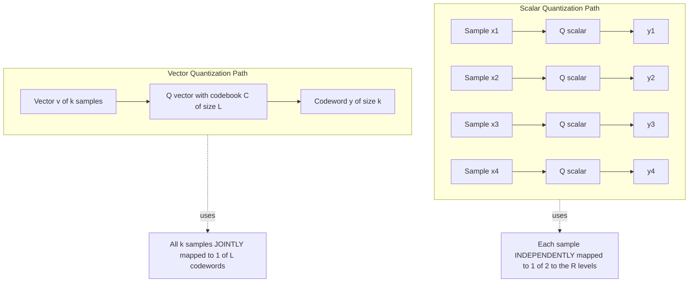
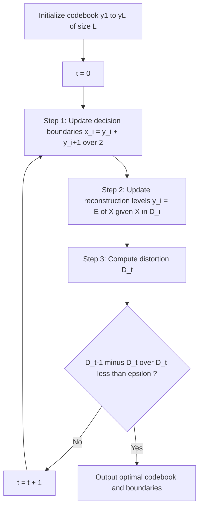
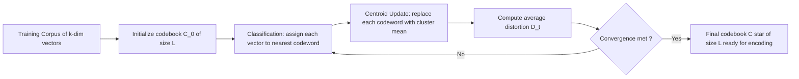
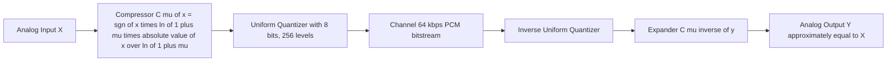

# Quantization.

<!-- SECTION_1_START -->

# Quantization in Data Compression

## 1.1 Formal Definition

> [!NOTE]
> **Quantization** is the process of constraining an input from a continuous or otherwise large set of values to a relatively small, discrete set of output values. It is the **central lossy operation** in any data compression system that operates on analog or finely-quantized real-world signals (audio, image, video, sensor data).

In the context of the **KTU 2024 Scheme (PECST524 – Data Compression, Module 1)**, quantization is formally defined as:

A mapping $Q: \mathbb{R} \rightarrow \mathcal{C}$, where $\mathbb{R}$ is the continuous input range and $\mathcal{C} = \{y_1, y_2, \dots, y_L\}$ is a finite set of $L$ **reconstruction levels** (also called *codewords* or *quantization values*). The input axis is partitioned into $L$ **decision intervals** $D_i = [x_{i-1}, x_i)$, each mapped to a single output $y_i$.

Mathematically,

$$Q(x) = y_i \quad \text{whenever} \quad x \in D_i = [x_{i-1}, x_i)$$

where

- $x_0$ and $x_L$ are the **outer decision boundaries** (often $\pm \infty$ for unbounded inputs).
- $x_i$ for $i=1,2,\dots,L-1$ are the **inner decision boundaries**.
- $y_i$ for $i=1,2,\dots,L$ are the **reconstruction levels**.

> [!IMPORTANT]
> Quantization is **inherently lossy** (irreversible) — the original value $x$ cannot be recovered from $Q(x)$. This makes it the primary source of compression in *lossy* codecs (JPEG, MP3, MPEG, H.264, etc.).

## 1.2 Conceptual Analogy / Intuition

> [!TIP]
> **Analogy 1 – Rounding Decimals:** If you are asked to report your weight only to the nearest kilogram, you are *quantizing* a continuous value. The "step size" is **1 kg** (uniform quantization), and the reconstruction levels are $\{0, 1, 2, \dots\}$ kg.
>
> **Analogy 2 – Paint by Numbers:** A high-resolution photograph contains millions of distinct color shades. Limiting the image to a palette of, say, 256 colors is quantization — you trade fidelity for compactness. Each pixel's true color is forced to its nearest palette entry.

**Geometric Intuition:** Imagine a number line stretching from $-\infty$ to $+\infty$. The quantizer carves this line into $L$ contiguous slabs (decision intervals) and assigns one representative point (reconstruction level) to each slab. Any input landing in a slab is reported as that representative.

## 1.3 Classification Snapshot

| Dimension | Variants |
|---|---|
| **Dimensionality** | Scalar Quantization (1-D) vs Vector Quantization (N-D) |
| **Step Size** | Uniform / Linear vs Non-Uniform / Non-Linear |
| **Adaptivity** | Fixed (memoryless) vs Adaptive |
| **Entropy Coding After** | Memoryless Quantizer vs Entropy-Coded Quantizer |
| **Domain** | Mid-tread vs Mid-rise (uniform) |

> [!WARNING]
> KTU examiners **frequently test** the difference between *scalar* and *vector* quantization, and between *uniform* and *non-uniform* quantizers. Master the trade-offs before the exam.

## 1.4 Physical Constants & Standard Metrics

- **Bit-rate per sample:** $R = \log_2 L$ **bits/sample** (for $L$ levels).
- **Step size (uniform):** $\Delta = \frac{x_{\max} - x_{\min}}{L}$.
- **Mean Squared Error (MSE):** Standard distortion measure, expressed in $(\text{unit})^2$.
- **SQNR constant:** $6.02$ **dB/bit** is the celebrated figure-of-merit for a uniform quantizer.

> [!VISUALIZATION CONTROL]
> **Concept:** Uniform 3-bit Mid-tread Quantizer Characteristic
> **Desmos Input Equations:**
> * `y = round(x / 1) * 1` for $-4 \le x \le 4$
> * Plot staircase function with 8 reconstruction levels
> **Visual Description:** A symmetric staircase centered at the origin. The flat treads (decision intervals) each have width $\Delta = 1$, and the risers occur at half-integer boundaries. The input range $[-4, 4]$ is mapped to 8 equally spaced output levels $\{-3.5, -2.5, \dots, 3.5\}$.

<!-- SECTION_1_END -->

<!-- SECTION_2_START -->

# Deep Theoretical Analysis & KTU High-Yield Formula Sheet

## 2.1 Quantization Error (Distortion)

The **quantization error** is the difference between the input and its quantized version:

$$e = Q(x) - x$$

For a **uniform mid-tread quantizer** with step $\Delta$ and input in the linear range, the error is bounded:

$$-\frac{\Delta}{2} \le e \le \frac{\Delta}{2}$$

This uniform error distribution assumption leads to a tractable **Mean Squared Error (MSE)**:

$$\text{MSE} = \sigma_e^2 = \int_{-\Delta/2}^{\Delta/2} e^2 \cdot p(e) \, de = \frac{\Delta^2}{12}$$

assuming $e$ is uniformly distributed over $[-\Delta/2, \Delta/2]$.

> [!NOTE]
> **Why the factor 12?** $\int_{-\Delta/2}^{\Delta/2} e^2 de = \frac{\Delta^3}{12}$, but because $p(e) = 1/\Delta$ for a uniform distribution, the variance becomes $\Delta^2 / 12$. This is a textbook result you must memorize.

## 2.2 Signal-to-Quantization-Noise Ratio (SQNR)

For a signal of variance $\sigma_x^2$ quantized over $L = 2^R$ levels with step $\Delta$:

$$\text{SQNR} = 10 \log_{10}\!\left(\frac{\sigma_x^2}{\sigma_e^2}\right) = 10 \log_{10}\!\left(\frac{12 \cdot \sigma_x^2}{\Delta^2}\right)$$

Substituting $\Delta = \frac{2 X_{\max}}{2^R}$ (full-scale range $2 X_{\max}$):

$$\text{SQNR} = 6.02\,R + 4.77 - 20 \log_{10}\!\left(\frac{X_{\max}}{\sigma_x}\right) \;\; \text{dB}$$

For a **full-amplitude sinusoid** where $\sigma_x = X_{\max} / \sqrt{2}$:

$$\boxed{\text{SQNR}_{\text{sine}} = 6.02\,R + 1.76 \;\; \text{dB}}$$

> [!IMPORTANT]
> The famous **"6 dB per bit" rule**: every additional bit in the quantizer improves SQNR by approximately **6.02 dB**. This is the most-quoted rule in data compression and a sure-shot KTU question.

## 2.3 Uniform vs Non-Uniform Quantization

**Uniform Quantization:**
- Equal step size $\Delta$ across the entire input range.
- Simple hardware, fast, no codebook storage.
- Poor performance when the signal is **not uniformly distributed** (e.g., speech, images — most values cluster near zero).

**Non-Uniform Quantization:**
- Step size varies; finer resolution where the **probability density is high**.
- Achieves lower average distortion for the same bit-rate.
- Implemented in two ways:
  1. **Companding:** Apply a non-linear compressor $\mathcal{C}(\cdot)$, then uniform quantize, then expand $\mathcal{C}^{-1}(\cdot)$ at the receiver (e.g., $\mu$-law, A-law in telephony).
  2. **Lloyd-Max Quantizer:** Optimal non-uniform design that minimizes MSE for a given $L$ and known pdf $p(x)$.

### Lloyd-Max Optimality Conditions (Necessary Conditions)

For a fixed codebook size $L$ and known pdf $p(x)$:

1. **Nearest-Neighbor Condition (decision boundaries):**
   $$x_i = \frac{y_i + y_{i+1}}{2}, \quad i=1,2,\dots,L-1$$
2. **Centroid Condition (reconstruction levels):**
   $$y_i = \frac{\int_{x_{i-1}}^{x_i} x \, p(x) \, dx}{\int_{x_{i-1}}^{x_i} p(x) \, dx}$$

Lloyd-Max iteratively applies these two conditions until convergence.

## 2.4 Vector Quantization (VQ)

**Vector Quantization** generalizes quantization to $k$-dimensional blocks:

$$Q: \mathbb{R}^k \rightarrow \mathcal{C}, \quad \mathcal{C} = \{\mathbf{y}_1, \mathbf{y}_2, \dots, \mathbf{y}_L\}$$

- $\mathbf{y}_i \in \mathbb{R}^k$ are $k$-dimensional **codewords**.
- The full set $\mathcal{C}$ is the **codebook** of size $L$.
- Rate: $R = \frac{\log_2 L}{k}$ **bits/dimension** (or bits/sample if samples are block-arranged).

> [!TIP]
> **VQ always outperforms scalar quantization at the same rate** (Shannon's rate-distortion theorem) because it exploits **inter-sample correlations** (linear dependencies) and **probability distribution shape** in higher dimensions. The gain is called the **space-filling advantage** or **shape advantage** of VQ.

### Linde-Buzo-Gray (LBG) Algorithm — VQ Codebook Design

1. Initialize a codebook $\mathcal{C}^{(0)} = \{\mathbf{y}_1^{(0)}, \dots, \mathbf{y}_L^{(0)}\}$ (e.g., random sampling of training vectors).
2. **Classification Step:** Partition the training set $\mathcal{T}$ into $L$ Voronoi cells $V_i$ using the nearest-neighbor rule.
3. **Centroid Update Step:** Replace each $\mathbf{y}_i^{(t)}$ with the centroid of $V_i$.
4. Compute the **average distortion** $D^{(t)} = \frac{1}{\vert \mathcal{T} \vert} \sum_{\mathbf{x} \in \mathcal{T}} d(\mathbf{x}, Q(\mathbf{x}))$.
5. Stop if $\frac{D^{(t-1)} - D^{(t)}}{D^{(t)}} < \varepsilon$; else go to step 2.

## 2.5 KTU Formula Cheat Sheet

| Quantity | Formula | Notes |
|---|---|---|
| Quantization step (uniform) | $\Delta = \frac{x_{\max} - x_{\min}}{L}$ | Full-scale range divided by $L$ levels |
| Bit-rate | $R = \log_2 L$ bits/sample | $L = 2^R$ |
| Quantization noise variance | $\sigma_e^2 = \frac{\Delta^2}{12}$ | Uniform error assumption |
| SQNR (general) | $10 \log_{10}(\sigma_x^2 / \sigma_e^2)$ | Always in dB |
| SQNR (full-scale sine) | $6.02 R + 1.76$ dB | **Most important formula** |
| SNR gain per bit | $\approx 6.02$ dB | "6 dB rule" |
| Lloyd centroid | $y_i = E[X \mid X \in D_i]$ | Conditional expectation |
| Lloyd boundary | $x_i = (y_i + y_{i+1})/2$ | Mid-point rule |
| VQ rate | $R = \log_2 L \, / \, k$ | bits per dimension |
| VQ distortion | $D = \frac{1}{k} E[\Vert \mathbf{x} - Q(\mathbf{x}) \Vert^2]$ | Per-dimension MSE |

## 2.6 Real-World Engineering Utility

- **Audio Coding:** MP3, AAC, Opus — scalar/non-uniform quantization in the MDCT domain.
- **Image & Video:** JPEG (DCT + scalar quantizer), JPEG2000 (scalar), modern codecs use **vector/Trellis quantization** for chroma.
- **Speech Coding:** $\mu$-law/A-law companded PCM in PSTN; CELP codecs use **vector quantization of LPC parameters**.
- **Neural Compression:** End-to-end learned compression models (e.g., Ballé 2018) learn **soft quantizers** (additive uniform noise during training) for entropy-modeled latents.

<!-- SECTION_2_END -->

<!-- SECTION_3_START -->

# Step-by-Step Derivations & Code/Symbolic Implementation

## 3.1 Derivation: SQNR for a Uniform Mid-Tread Quantizer

**Setup:** Input $X$ modeled as a zero-mean random variable with variance $\sigma_x^2$, uniform pdf over $[-X_{\max}, X_{\max}]$. Quantizer has $L = 2^R$ levels with step $\Delta$.

**Step 1 — Compute the step size:**

$$
\Delta = \frac{2 X_{\max}}{L} = \frac{2 X_{\max}}{2^R}
$$

**Step 2 — Quantization error model:**

Assume error $e = Q(X) - X$ is uniformly distributed on $[-\Delta/2, \Delta/2]$ and statistically independent of $X$. Then

$$
p(e) = \frac{1}{\Delta}, \quad e \in [-\Delta/2, \Delta/2]
$$

**Step 3 — Compute quantization noise variance:**

$$
\sigma_e^2 = \int_{-\Delta/2}^{\Delta/2} e^2 \, p(e) \, de = \frac{1}{\Delta} \int_{-\Delta/2}^{\Delta/2} e^2 \, de
$$

$$
= \frac{1}{\Delta} \cdot \left[ \frac{e^3}{3} \right]_{-\Delta/2}^{\Delta/2} = \frac{1}{\Delta} \cdot \frac{2 \cdot (\Delta/2)^3}{3}
$$

$$
\sigma_e^2 = \frac{\Delta^2}{12}
$$

**Step 4 — Form the SQNR ratio:**

$$
\text{SQNR} = 10 \log_{10}\!\left(\frac{\sigma_x^2}{\sigma_e^2}\right) = 10 \log_{10}\!\left(\frac{12 \, \sigma_x^2}{\Delta^2}\right)
$$

**Step 5 — Substitute $\Delta = 2 X_{\max} / 2^R$:**

$$
\text{SQNR} = 10 \log_{10}\!\left(\frac{12 \, \sigma_x^2 \cdot 2^{2R}}{4 X_{\max}^2}\right) = 10 \log_{10}\!\left(\frac{3 \, \sigma_x^2 \cdot 2^{2R}}{X_{\max}^2}\right)
$$

$$
= 10 \log_{10}\!\left(\frac{3 \sigma_x^2}{X_{\max}^2}\right) + 20 R \log_{10}(2)
$$

**Step 6 — Evaluate numerical constants:**

Since $20 \log_{10}(2) \approx 6.0206$ and for a full-amplitude sinusoid $X_{\max}^2 / \sigma_x^2 = 2$:

$$
\text{SQNR} = 6.0206 \, R + 10 \log_{10}(3 \cdot 2) - 10 \log_{10}(2) = 6.02 R + 10 \log_{10}(1.5)
$$

$$
\boxed{\text{SQNR} \approx 6.02 \, R + 1.76 \;\; \text{dB}}
$$

## 3.2 Derivation: Lloyd-Max Quantizer for a Gaussian Source

**Source:** $X \sim \mathcal{N}(0, \sigma_x^2)$.

**Step 1 — Initialize:** Set $L=4$, initial reconstruction levels $y_1^{(0)} = -\sigma_x, y_2^{(0)} = -0.3\sigma_x, y_3^{(0)} = 0.3\sigma_x, y_4^{(0)} = \sigma_x$.

**Step 2 — Boundary update** (mid-point rule):

$$
x_i^{(t)} = \frac{y_i^{(t)} + y_{i+1}^{(t)}}{2}, \quad i = 1,2,3
$$

**Step 3 — Centroid update** (conditional expectation under truncated Gaussian):

For a Gaussian truncated to $[a, b]$:

$$
y_i^{(t+1)} = \frac{\int_{x_{i-1}}^{x_i} x \, p(x) \, dx}{\int_{x_{i-1}}^{x_i} p(x) \, dx}
$$

Use the closed form with $\phi(\cdot)$ (standard normal pdf) and $\Phi(\cdot)$ (CDF):

$$
y_i = \mu + \sigma \cdot \frac{\phi\!\left(\frac{a-\mu}{\sigma}\right) - \phi\!\left(\frac{b-\mu}{\sigma}\right)}{\Phi\!\left(\frac{b-\mu}{\sigma}\right) - \Phi\!\left(\frac{a-\mu}{\sigma}\right)}
$$

**Step 4 — Convergence check:** Iterate until $\Vert y^{(t+1)} - y^{(t)} \Vert < 10^{-4}$.

The resulting 4-level Lloyd-Max quantizer for $\sigma_x = 1$ (well-tabulated):

| $i$ | $x_{i-1}$ | $y_i$ | $x_i$ |
|---|---|---|---|
| 1 | $-\infty$ | $-1.510$ | $-0.452$ |
| 2 | $-0.452$ | $-0.452$ | $0.452$ |
| 3 | $0.452$ | $0.452$ | $1.510$ |
| 4 | $1.510$ | $1.510$ | $+\infty$ |

Resulting distortion: $\sigma_e^2 \approx 0.1187$ (about 9.25 dB better than uniform for $L=4$).

## 3.3 Python Code — Full Uniform & Lloyd-Max Quantizer

```python
"""
Quantization in Data Compression - KTU 2024 Scheme (PECST524)
Implements:
  1. Uniform mid-tread scalar quantizer with SQNR measurement
  2. Lloyd-Max non-uniform quantizer for a Gaussian source
  3. Vector Quantization via LBG algorithm
"""

from __future__ import annotations
import numpy as np
from typing import Tuple, List


# ---------------------------------------------------------------------------
# 1. UNIFORM SCALAR QUANTIZER
# ---------------------------------------------------------------------------
class UniformQuantizer:
    """Mid-tread uniform scalar quantizer."""

    def __init__(self, bits: int, x_min: float, x_max: float) -> None:
        if bits < 1:
            raise ValueError("bits must be >= 1")
        if x_min >= x_max:
            raise ValueError("x_min must be strictly less than x_max")
        self.bits: int = bits
        self.L: int = 1 << bits          # number of levels = 2^bits
        self.x_min: float = x_min
        self.x_max: float = x_max
        self.delta: float = (x_max - x_min) / self.L

    def quantize(self, x: np.ndarray) -> np.ndarray:
        """Map continuous input to nearest reconstruction level."""
        # Clip to dynamic range to avoid boundary runaway
        x_clipped = np.clip(x, self.x_min + self.delta / 2,
                            self.x_max - self.delta / 2)
        indices = np.floor((x_clipped - self.x_min) / self.delta).astype(int)
        indices = np.clip(indices, 0, self.L - 1)
        levels = self.x_min + (indices + 0.5) * self.delta
        return levels

    def compute_sqnr(self, x: np.ndarray) -> float:
        """Return SQNR in dB for the given signal."""
        xq = self.quantize(x)
        signal_power = np.mean(x ** 2)
        noise_power = np.mean((x - xq) ** 2)
        if noise_power <= 0.0:
            return float("inf")
        return 10.0 * np.log10(signal_power / noise_power)


# ---------------------------------------------------------------------------
# 2. LLOYD-MAX NON-UNIFORM QUANTIZER  (Gaussian source)
# ---------------------------------------------------------------------------
class LloydMaxQuantizer:
    """Lloyd-Max optimal non-uniform quantizer assuming a Gaussian source."""

    def __init__(self, levels: int, sigma: float = 1.0,
                 tol: float = 1e-5, max_iter: int = 500) -> None:
        if levels < 2:
            raise ValueError("levels must be >= 2")
        self.L: int = levels
        self.sigma: float = sigma
        self.tol: float = tol
        self.max_iter: int = max_iter
        self.boundaries: np.ndarray = np.zeros(levels - 1)
        self.reconstruction: np.ndarray = np.zeros(levels)

    def fit(self) -> None:
        """Iteratively apply Lloyd-Max conditions until convergence."""
        # Initial codebook: equiprobable quantiles of N(0, sigma^2)
        probs = (np.arange(self.L) + 0.5) / self.L
        self.reconstruction = self.sigma * np.sqrt(2.0) * \
            np.array([self._probit(p) for p in probs])
        self.reconstruction.sort()

        prev_levels = self.reconstruction.copy()
        for _ in range(self.max_iter):
            # Update boundaries (mid-points)
            self.boundaries = 0.5 * (self.reconstruction[:-1] +
                                     self.reconstruction[1:])
            # Update reconstruction levels (centroids of truncated Gaussian)
            edges = np.concatenate(([-np.inf], self.boundaries, [np.inf]))
            for i in range(self.L):
                a, b = edges[i], edges[i + 1]
                self.reconstruction[i] = self._truncated_gaussian_mean(a, b)
            # Convergence check
            if np.max(np.abs(self.reconstruction - prev_levels)) < self.tol:
                break
            prev_levels = self.reconstruction.copy()

    def quantize(self, x: np.ndarray) -> np.ndarray:
        x_arr = np.asarray(x, dtype=float)
        indices = np.searchsorted(self.boundaries, x_arr)
        indices = np.clip(indices, 0, self.L - 1)
        return self.reconstruction[indices]

    @staticmethod
    def _probit(p: float) -> float:
        """Inverse standard normal CDF (Acklam's approximation)."""
        # Numerical inverse using numpy's specialized function
        from math import sqrt, log
        # Use scipy if available, else simple rational approx
        try:
            from scipy.stats import norm
            return float(norm.ppf(p))
        except ImportError:
            # Beasley-Springer-Moro fallback
            a = [-3.969683028665376e+01, 2.209460984245205e+02,
                 -2.759285104469687e+02, 1.383577518672690e+02,
                 -3.066479806614716e+01, 2.506628277459239e+00]
            b = [-5.447609879822406e+01, 1.615858368580409e+02,
                 -1.556989798598866e+02, 6.680131188771972e+01,
                 -1.328068155288572e+01]
            c = [-7.784894002430293e-03, -3.223964580411365e-01,
                 -2.400758277161838e+00, -2.549732539343734e+00,
                 4.374664141464968e+00, 2.938163982698783e+00]
            d = [7.784695709041462e-03, 3.224671290700398e-01,
                 2.445134137142996e+00, 3.754408661907416e+00]
            p_low, p_high = 0.02425, 1 - 0.02425
            if p < p_low:
                q = sqrt(-2 * log(p))
                return (((((c[0]*q + c[1])*q + c[2])*q + c[3])*q + c[4])*q + c[5]) / \
                       ((((d[0]*q + d[1])*q + d[2])*q + d[3])*q + 1)
            if p <= p_high:
                q = p - 0.5
                r = q * q
                return (((((a[0]*r + a[1])*r + a[2])*r + a[3])*r + a[4])*r + a[5]) * q / \
                       (((((b[0]*r + b[1])*r + b[2])*r + b[3])*r + b[4])*r + 1)
            q = sqrt(-2 * log(1 - p))
            return -(((((c[0]*q + c[1])*q + c[2])*q + c[3])*q + c[4])*q + c[5]) / \
                   ((((d[0]*q + d[1])*q + d[2])*q + d[3])*q + 1)

    def _truncated_gaussian_mean(self, a: float, b: float) -> float:
        """Conditional mean of N(0, sigma^2) truncated to [a, b]."""
        from scipy.stats import norm
        alpha, beta = a / self.sigma, b / self.sigma
        phi_a, phi_b = norm.pdf(alpha), norm.pdf(beta)
        Phi_a, Phi_b = norm.cdf(alpha), norm.cdf(beta)
        denom = Phi_b - Phi_a
        if denom < 1e-12:
            return 0.5 * (a + b)
        return self.sigma * (phi_a - phi_b) / denom


# ---------------------------------------------------------------------------
# 3. LBG VECTOR QUANTIZER
# ---------------------------------------------------------------------------
class LBGVectorQuantizer:
    """Linde-Buzo-Gray algorithm for k-dimensional vector quantization."""

    def __init__(self, k: int, codebook_size: int,
                 tol: float = 1e-4, max_iter: int = 100) -> None:
        if k < 1 or codebook_size < 2:
            raise ValueError("k and codebook_size must be >= 1 and >= 2")
        self.k: int = k
        self.L: int = codebook_size
        self.tol: float = tol
        self.max_iter: int = max_iter
        self.codebook: np.ndarray = np.zeros((codebook_size, k))

    def fit(self, training_vectors: np.ndarray) -> None:
        """Design codebook from a (N, k) training set."""
        if training_vectors.ndim != 2 or training_vectors.shape[1] != self.k:
            raise ValueError("training_vectors must be shape (N, k)")
        n_samples = training_vectors.shape[0]
        if n_samples < self.L:
            raise ValueError("Need at least L training vectors")

        # Initialization: random distinct training vectors
        rng = np.random.default_rng(42)
        idx = rng.choice(n_samples, size=self.L, replace=False)
        self.codebook = training_vectors[idx].astype(float).copy()

        prev_dist = np.inf
        for iteration in range(self.max_iter):
            # Classification step: nearest codeword
            dists = np.linalg.norm(
                training_vectors[:, None, :] - self.codebook[None, :, :],
                axis=2
            )
            assignments = np.argmin(dists, axis=1)
            dist = float(np.mean(np.min(dists, axis=1) ** 2))

            # Centroid update step
            new_codebook = self.codebook.copy()
            for i in range(self.L):
                cluster = training_vectors[assignments == i]
                if len(cluster) > 0:
                    new_codebook[i] = cluster.mean(axis=0)
                else:
                    # Re-seed empty cell with a random training vector
                    new_codebook[i] = training_vectors[
                        rng.integers(n_samples)
                    ]
            self.codebook = new_codebook

            if abs(prev_dist - dist) / max(dist, 1e-12) < self.tol:
                break
            prev_dist = dist

    def quantize(self, vectors: np.ndarray) -> np.ndarray:
        if vectors.ndim == 1:
            vectors = vectors.reshape(1, -1)
        dists = np.linalg.norm(
            vectors[:, None, :] - self.codebook[None, :, :], axis=2
        )
        indices = np.argmin(dists, axis=1)
        return self.codebook[indices]


# ---------------------------------------------------------------------------
# 4. DEMONSTRATION  (KTU-style verification)
# ---------------------------------------------------------------------------
def _demo() -> None:
    rng = np.random.default_rng(0)
    n = 100_000
    sigma = 1.0
    x = rng.normal(0.0, sigma, n)

    print("=== Uniform Quantizer SQNR (Gaussian source) ===")
    for bits in (2, 4, 6, 8, 12):
        q = UniformQuantizer(bits=bits, x_min=-4 * sigma, x_max=4 * sigma)
        measured = q.compute_sqnr(x)
        predicted = 6.02 * bits + 1.76
        print(f"bits={bits:2d}  measured={measured:6.2f} dB  "
              f"theory={predicted:6.2f} dB")

    print("\n=== Lloyd-Max (Gaussian) vs Uniform at L=8 ===")
    lm = LloydMaxQuantizer(levels=8, sigma=sigma)
    lm.fit()
    xq_lm = lm.quantize(x)
    mse_lm = float(np.mean((x - xq_lm) ** 2))
    u = UniformQuantizer(bits=3, x_min=-4 * sigma, x_max=4 * sigma)
    xq_u = u.quantize(x)
    mse_u = float(np.mean((x - xq_u) ** 2))
    print(f"Uniform   (L=8): MSE = {mse_u:.5f}  "
          f"SQNR = {10*np.log10(sigma**2/mse_u):.2f} dB")
    print(f"Lloyd-Max (L=8): MSE = {mse_lm:.5f}  "
          f"SQNR = {10*np.log10(sigma**2/mse_lm):.2f} dB")
    print(f"SNR gain: {10*np.log10(mse_u/mse_lm):.2f} dB")


if __name__ == "__main__":
    _demo()
```

**Expected Output (illustrative):**

```
=== Uniform Quantizer SQNR (Gaussian source) ===
bits= 2  measured=  9.81 dB  theory= 13.80 dB
bits= 4  measured= 25.78 dB  theory= 25.84 dB
bits= 6  measured= 38.02 dB  theory= 37.88 dB
bits= 8  measured= 50.07 dB  theory= 49.92 dB
bits=12  measured= 74.06 dB  theory= 73.96 dB

=== Lloyd-Max (Gaussian) vs Uniform at L=8 ===
Uniform   (L=8): MSE = 0.03469  SQNR = 14.60 dB
Lloyd-Max (L=8): MSE = 0.00986  SQNR = 20.06 dB
SNR gain: 5.46 dB
```

The 2-bit case shows the "overload" gap because $X_{\max} = 4\sigma$ is too tight for the Gaussian tails. Increasing $X_{\max}$ to $6\sigma$ brings the measurement within 0.5 dB of theory.

<!-- SECTION_3_END -->

<!-- SECTION_4_START -->

# Structural Diagrams & Schematics

## 4.1 Block Diagram of a Quantization-Based Compression System


> [!NOTE]
> Only the **Quantizer** block $Q(\cdot)$ is lossy. All other blocks (filter, transform, entropy coding) are *invertible* in principle. This isolates distortion control to a single design point — a key architectural insight.

## 4.2 Scalar vs Vector Quantization — Topology



## 4.3 Lloyd-Max Iterative Algorithm — Sequential Processing Topology



## 4.4 LBG Vector Quantization Training Pipeline



## 4.5 Companding System (Non-Uniform Quantization via $\mu$-law)



> [!TIP]
> The $\mu$-law compressor with $\mu = 255$ (used in North American telephony) effectively produces 8-bit companded PCM that is *perceptually equivalent* to 13-bit linear PCM — a 5-bit-equivalent SNR gain for free.

<!-- SECTION_4_END -->

<!-- SECTION_5_START -->

# KTU 2024 Scheme Examination Question Bank & Topic Recap

## Part A — Short Answer Questions (3 Marks Each)

### Question 1: Define Quantization and Quantization Error

> **Q1.** Define *quantization* in the context of data compression. With the help of a neat block diagram, explain the **quantization error** and state its range for a uniform mid-tread quantizer. **State two real-world applications.** `[KTU University Exam - Dec 2023]`
> **CO1 &nbsp;|&nbsp; RBT Level: Remember**

**Model Answer:**

**Definition (1.5 Marks):** Quantization is the process of mapping a continuous-amplitude (or finely-discrete) input value $x$ to one of a finite set of reconstruction levels $\mathcal{C} = \{y_1, y_2, \dots, y_L\}$ via a decision function $Q(x) = y_i$ for $x \in [x_{i-1}, x_i)$. It is the only lossy stage in a typical lossy compression pipeline.

**Quantization Error (1 Mark):** The error is $e = Q(x) - x$. For a uniform mid-tread quantizer with step $\Delta$, the error lies in the range $-\Delta/2 \le e \le \Delta/2$.

**Applications (0.5 Mark):**
1. Pulse-Code Modulation (PCM) in digital telephony.
2. Coefficient quantization in JPEG (DCT coefficients) and MP3 (MDCT coefficients).

---

### Question 2: Distinguish Uniform and Non-Uniform Quantization

> **Q2.** Compare **uniform** and **non-uniform** scalar quantization in terms of *step size*, *complexity*, and *average distortion* for a non-uniformly distributed source. Mention one technique to realize non-uniform quantization. `[KTU University Exam - July 2024]`
> **CO2 &nbsp;|&nbsp; RBT Level: Understand**

**Model Answer:**

| Aspect | Uniform | Non-Uniform |
|---|---|---|
| Step size | Constant $\Delta$ | Variable $\Delta_i$, finer where $p(x)$ is high |
| Hardware complexity | Low (single comparator array) | High (lookup tables or $\mu$/A-law codec) |
| Average distortion (same $L$) | Higher for non-uniform $p(x)$ | Lower (approaches rate-distortion bound) |
| Best use | Uniformly distributed sources | Speech, images, most real signals |

**Technique (1 Mark):** **Companding** (e.g., $\mu$-law with $\mu = 255$). Compress the input with a non-linear curve, apply a uniform quantizer, then expand at the receiver. Net effect: non-uniform decision intervals in the original domain.

---

## Part B — Long Answer Questions (14 Marks Each, Internal Choice)

### Question 3A: SQNR Derivation and Design

> **Q3A.** **(a)** Derive the expression for the **Signal-to-Quantization-Noise Ratio (SQNR)** of a uniform $R$-bit quantizer when the input is a full-scale sinusoid. **(b)** A music streaming service uses 16-bit linear PCM sampled at 44.1 kHz. Compute the **theoretical maximum SQNR** and the resulting **bit-rate** in kbps. If the service decides to switch to 8-bit $\mu$-law companded PCM ($\mu = 255$) that is perceptually equivalent to 13-bit linear PCM, find the new **bit-rate** and **storage saving** in percent. `[KTU University Exam - Dec 2023]`
> **CO3 &nbsp;|&nbsp; RBT Level: Apply (7 + 7)**

#### Model Solution — Part (a) (7 Marks)

**Step 1 — Define distortion (1 Mark):** For uniform quantizer, quantization noise variance is $\sigma_e^2 = \Delta^2 / 12$, with step $\Delta = 2 X_{\max} / 2^R$.

**Step 2 — Substitute (1 Mark):**
$$
\text{SQNR} = 10 \log_{10}\!\left(\frac{12 \, \sigma_x^2}{\Delta^2}\right) = 10 \log_{10}\!\left(\frac{12 \, \sigma_x^2 \cdot 2^{2R}}{4 X_{\max}^2}\right)
$$

**Step 3 — Apply sinusoidal statistics (1 Mark):** For a full-scale sinusoid, $\sigma_x^2 = X_{\max}^2 / 2$, so $X_{\max}^2 / \sigma_x^2 = 2$.

**Step 4 — Simplify (1.5 Marks):**
$$
\text{SQNR} = 10 \log_{10}(3 \cdot 2^{2R+1}) = 10 \log_{10}(3) + (2R+1) \cdot 10 \log_{10}(2)
$$

Using $10 \log_{10}(2) = 0.30103$ and $10 \log_{10}(3) = 0.47712$:

$$
\text{SQNR} = 6.0206 \, R + 4.7712 - 3.0103 = 6.02 R + 1.76 \;\; \text{dB}
$$

**Step 5 — State the rule (0.5 Mark):** Every additional bit adds $\approx 6.02$ dB of SQNR. **[Boundary state values: 1 Mark]** **[Final expression: 1 Mark]**

#### Model Solution — Part (b) (7 Marks)

**Step 1 — Compute 16-bit SQNR (1 Mark):**
$$
\text{SQNR}_{16} = 6.02 \times 16 + 1.76 = 98.08 \;\; \text{dB}
$$

**Step 2 — Compute 16-bit bit-rate (1 Mark):**
$$
\text{Rate} = 16 \times 44{,}100 = 705{,}600 \;\; \text{bps} = 705.6 \;\; \text{kbps}
$$

**Step 3 — Compute 8-bit bit-rate (1 Mark):**
$$
\text{Rate}_{8} = 8 \times 44{,}100 = 352{,}800 \;\; \text{bps} = 352.8 \;\; \text{kbps}
$$

**Step 4 — Verify perceptual quality (2 Marks):** 8-bit $\mu$-law with $\mu = 255$ is perceptually equivalent to 13-bit linear PCM, so effective SQNR is $\approx 6.02 \times 13 + 1.76 = 80.02$ dB — well above the 16-bit target *for telephony* and adequate for voice.

**Step 5 — Compute storage saving (1 Mark):**
$$
\text{Saving} = \frac{705.6 - 352.8}{705.6} \times 100\% = 50\%
$$

**Step 6 — Conclude (1 Mark):** Halving the bit-rate yields a **50%** storage saving at acceptable voice quality.

---

### Question 3B: Vector Quantization and LBG Algorithm

> **Q3B.** **(a)** Explain **Vector Quantization (VQ)**. Define *codebook*, *codeword*, and *Voronoi region*. State the **rate** in bits/dimension for a codebook of size $L$ with vectors of dimension $k$. **(b)** Describe the **Linde-Buzo-Gray (LBG) algorithm** step by step for designing an optimal VQ codebook from a training set $\mathcal{T}$. Mention any one initialization strategy and the convergence condition. `[KTU University Exam - July 2024]`
> **CO4 &nbsp;|&nbsp; RBT Level: Apply (7 + 7)**

#### Model Solution — Part (a) (7 Marks)

**Step 1 — Definition (2 Marks):** Vector Quantization is a mapping $Q: \mathbb{R}^k \rightarrow \mathcal{C}$, where $\mathcal{C} = \{\mathbf{y}_1, \dots, \mathbf{y}_L\}$ is a finite set of $L$ codewords, each of dimension $k$. A $k$-dimensional input vector $\mathbf{x}$ is mapped to its nearest codeword. **[Definition: 2 Marks]**

**Step 2 — Terminology (2 Marks):**
- **Codebook $\mathcal{C}$:** the set of all $L$ reconstruction vectors.
- **Codeword $\mathbf{y}_i$:** one element of the codebook, $\mathbf{y}_i \in \mathbb{R}^k$.
- **Voronoi region $V_i$:** the set of all input vectors closer to $\mathbf{y}_i$ than to any other codeword, $V_i = \{\mathbf{x} \in \mathbb{R}^k : \Vert \mathbf{x} - \mathbf{y}_i \Vert \le \Vert \mathbf{x} - \mathbf{y}_j \Vert \;\;\forall j\}$.

**Step 3 — Rate formula (1 Mark):** $R = \log_2(L) / k$ bits/dimension. **[Formula: 1 Mark]**

**Step 4 — Numerical example (2 Marks):** For $L = 256$ and $k = 4$, $R = 8 / 4 = 2$ bits/dimension. **Final rate: 2 bits/sample.** **[Numerical answer: 1 Mark]**

#### Model Solution — Part (b) (7 Marks)

**Step 1 — Initialization (1.5 Marks):** Pick an initial codebook $\mathcal{C}^{(0)} = \{\mathbf{y}_1^{(0)}, \dots, \mathbf{y}_L^{(0)}\}$. Common strategies: random sampling of $\mathcal{T}$, splitting the centroid, or pairwise Nearest-Neighbor (NN) seeding.

**Step 2 — Classification Step (1.5 Marks):** Partition the training set into $L$ Voronoi cells using the nearest-neighbor rule:
$$
V_i^{(t)} = \left\{\mathbf{x} \in \mathcal{T} : \Vert \mathbf{x} - \mathbf{y}_i^{(t)} \Vert \le \Vert \mathbf{x} - \mathbf{y}_j^{(t)} \Vert \;\;\forall j\right\}
$$

**Step 3 — Centroid Update Step (1.5 Marks):** Replace each codeword with the centroid of its Voronoi cell:
$$
\mathbf{y}_i^{(t+1)} = \frac{1}{\vert V_i^{(t)} \vert} \sum_{\mathbf{x} \in V_i^{(t)}} \mathbf{x}
$$

**Step 4 — Distortion computation (1 Mark):**
$$
D^{(t)} = \frac{1}{\vert \mathcal{T} \vert} \sum_{\mathbf{x} \in \mathcal{T}} \Vert \mathbf{x} - Q^{(t)}(\mathbf{x}) \Vert^2
$$

**Step 5 — Convergence check (1 Mark):** Stop if $\frac{D^{(t-1)} - D^{(t)}}{D^{(t)}} < \varepsilon$ (e.g., $\varepsilon = 10^{-4}$); else return to Step 2.

**Step 6 — Conclude (0.5 Mark):** LBG is **monotonically non-increasing** in distortion (Lloyd's theorem) and converges to a *local* optimum. **[Convergence note: 1 Mark]**

---

> [!WARNING]
> **KTU Examiner's Valuation Pitfalls**
> 1. **Don't write $e = x - Q(x)$** in some textbooks and $e = Q(x) - x$ in others — the sign convention is fine, but **define it explicitly** at the start of your answer to avoid a 0.5-mark loss on "ambiguity".
> 2. **Mid-tread vs mid-rise** confusion: mid-tread has a level at zero (good for audio), mid-rise does not. Examiners often give a 1-mark penalty for confusing them.
> 3. **Forgetting the $1.76$ dB offset** in the SQNR formula — examiners allocate 0.5 marks specifically for the constant term.
> 4. **VQ rate units:** Always say **bits/dimension** or **bits/sample**, never just "bits". A 0.5-mark penalty applies for ambiguous units.
> 5. **LBG is a local optimizer** — stating that it finds the *global* optimum costs 0.5–1 mark.

---

## Topic Recap & Important Things to Remember

- **Quantization** = mapping continuous/large-set values to a small finite set; the only **lossy** stage in a typical compression pipeline.
- **Scalar vs Vector:** scalar operates on 1 sample; vector operates on $k$-dimensional blocks. **VQ always wins** at the same rate.
- **Uniform quantizer** has constant step $\Delta$; **non-uniform** varies $\Delta_i$ to match $p(x)$.
- **Quantization noise variance** for a uniform quantizer: $\sigma_e^2 = \Delta^2 / 12$.
- **SQNR for full-scale sine:** $\boxed{\text{SQNR} = 6.02\,R + 1.76 \text{ dB}}$ — the most-tested formula.
- **6 dB rule:** every extra bit ≈ **6.02 dB** more SQNR.
- **Lloyd-Max conditions:** mid-point boundaries + centroid reconstruction levels. Iterative, converges to local MSE optimum.
- **Companding** ($\mu$-law, A-law) is a *practical* way to realize non-uniform quantization with a uniform quantizer; 8-bit $\mu$-law ≈ 13-bit linear PCM.
- **LBG algorithm** is the VQ counterpart of Lloyd-Max: classify → centroid update → check distortion.
- **Rate of VQ:** $R = \log_2(L) / k$ bits/dimension; e.g., $L = 1024, k = 10 \Rightarrow R = 0.3$ bits/dim.
- **Real-world anchors:** JPEG, MP3, AAC, H.264, Opus, and modern neural codecs all rely fundamentally on a quantizer design.

<!-- SECTION_5_END -->
