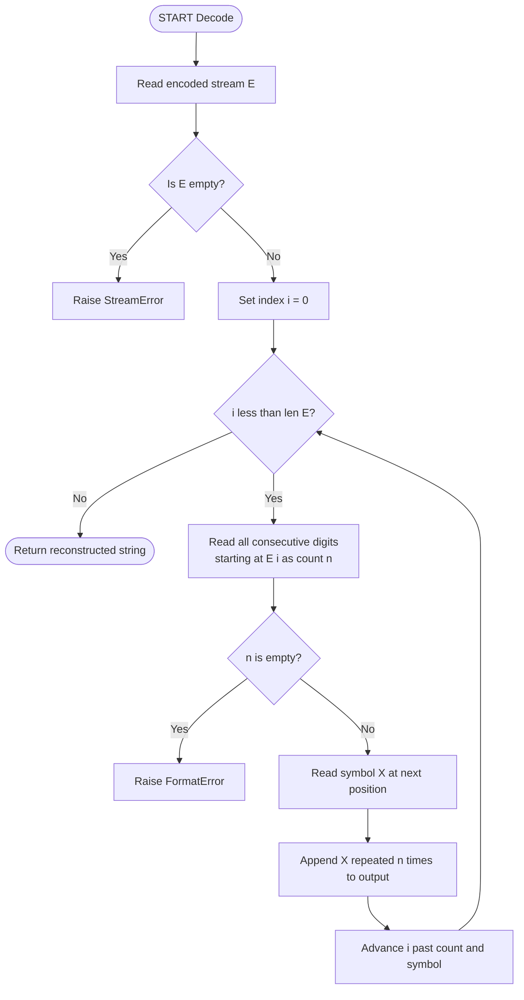
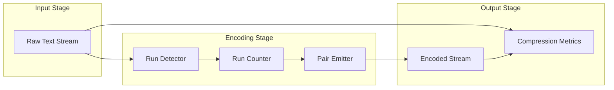
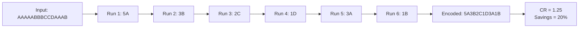

# RLE Text compression

<!-- SECTION_1_START -->

# 1. Run-Length Encoding (RLE) — Text Compression

## 1.1 Formal Definition

**Run-Length Encoding (RLE)** is a simple, **lossless** data compression technique that replaces consecutive, identical data symbols (called *runs*) with a compact representation consisting of a **count** value followed by the **symbol** itself. In text compression, the *run* is a sequence of the same character (letter, digit, or punctuation) repeated back-to-back.

> [!IMPORTANT]
> **KTU Syllabus Definition:** *RLE is a primitive statistical compression method in which a run of $n$ identical symbols $X$ is encoded as a two-token pair $(n, X)$ or $nX$, where $n$ is the run count and $X$ is the symbol value.*

Mathematically, given a run of length $n$ consisting of a single symbol $X$, the RLE mapping is:

$$
\underbrace{X \cdot X \cdot X \cdots X}_{n \text{ times}} \quad \longrightarrow \quad (n, X)
$$

The output stream is a sequence of such $(n, X)$ pairs concatenated together. The decoder simply **expands** each pair by writing the symbol $X$ exactly $n$ times.

---

## 1.2 Conceptual Analogy / Intuition

> [!NOTE]
> **Plain-English Intuition:** Imagine a teacher taking attendance in a noisy classroom. Instead of reading 35 names one by one, the teacher might say, *"Section A — 35 students, present."* The phrase *"35 students"* is a *count*, and *"present"* is the *state*. The same idea applies to RLE: instead of writing the symbol many times, we state **how many times** the symbol appears followed by **what** the symbol is.

A geometric intuition: if we plot a string of text on a number line, every *transition point* (where the character changes) creates a **boundary**. RLE records only these boundaries and the *height* of each plateau between boundaries. Strings with *long plateaus* (e.g., spaces in formatted text, zeros in spreadsheet data) compress brilliantly; strings with *short plateaus* (e.g., English prose) actually **expand** in size.

---

## 1.3 When RLE Shines and When It Fails

> [!TIP]
> **Best-Case Scenario:** A string of **255 identical characters** compresses from **255 bytes** down to **2 bytes** — a compression ratio of **127.5 : 1**.

> [!WARNING]
> **Worst-Case Scenario:** A string of **all unique characters** (e.g., `"ABCDEFGH..."`) **doubles in size** because every symbol requires a count of 1 plus the symbol itself. This is called **negative compression** or **expansion**.

**Typical Run Length** in real data: a standard benchmark for whether RLE is profitable is the **mean run length** $\bar{L}$ of the source. If $\bar{L} > 2$, RLE saves space; if $\bar{L} < 2$, RLE inflates the data.

---

## 1.4 Physical Constants & Standard Metrics

| Metric | Value / Standard |
|---|---|
| Count field size (basic RLE) | **1 byte (0–255)** |
| Maximum run length in basic RLE | **255 symbols** |
| Typical count encoding | **3–4 ASCII digits + symbol** |
| Required codebook entries | **None** (no dictionary needed) |
| Codec type | **Lossless, symmetric, stream-based** |

---

## 1.5 Visualization Callout

> [!VISUALIZATION CONTROL]
> **Concept:** Run-length plateau representation on a discrete axis
> **Conceptual Plot Axes:**
> * $x$-axis = character index position
> * $y$-axis = character code value (e.g., ASCII)
> **Visual Description:** The text `AAAAABBBCCDAA` appears as **five plateaus** of constant height. Each plateau has a *width* (the run length) and a *height* (the character code). RLE stores only the *width* of each plateau along with its *height* — the empty white space between plateaus (i.e., the wasted repetition) is discarded.

---

<!-- SECTION_1_END -->

<!-- SECTION_2_START -->

# 2. Deep Theoretical Analysis & KTU High-Yield Formula Sheet

## 2.1 Operational Algorithm — Encoder

The RLE encoder walks the input string **left-to-right** and groups consecutive identical characters into runs. The steps are:

1. **Read** the first character. Set $\text{count} = 1$ and $\text{prev} = S[0]$.
2. **Iterate** over each subsequent character $S[i]$ for $i = 1, 2, \dots, n-1$:
   * If $S[i] = \text{prev}$, increment $\text{count}$.
   * Otherwise, **emit** the pair $(\text{count}, \text{prev})$ to the output buffer, then reset $\text{count} = 1$ and $\text{prev} = S[i]$.
3. **Flush:** After the loop ends, emit the **final** pair $(\text{count}, \text{prev})$ for the last run.
4. **Return** the concatenated output buffer.

> [!NOTE]
> The "flush" step is the most commonly forgotten detail in KTU exams — omitting it loses the entire last run of the input.

---

## 2.2 Operational Algorithm — Decoder

The decoder reverses the operation by reading the count and symbol pairs and *expanding* each pair into a literal run.

1. **Read** pairs $(n_k, X_k)$ sequentially from the encoded stream.
2. For each pair, **write** the symbol $X_k$ exactly $n_k$ times to the output.
3. **Stop** when the encoded stream is exhausted.

> [!IMPORTANT]
> The decoder does **not** need to know the original length — it reconstructs the string purely from the $(n, X)$ pairs. This makes RLE a **self-delimiting** format when counts are written in a fixed-width digit field (e.g., 3 digits).

---

## 2.3 Variants of RLE

| Variant | Encoding Format | Typical Use Case | Trade-off |
|---|---|---|---|
| **Basic 1-byte count RLE** | `1 byte count + 1 byte symbol` | BMP, PCX images | Max run = 255; perfect for short runs |
| **3-digit ASCII count RLE** | `3 ASCII digits + 1 symbol` (e.g., `004A`) | Text compression teaching | Max run = 999; easy human readability |
| **Escape-character RLE** | `Esc + count + symbol` (Esc only on runs $>2$) | PackBits (Mac), TIFF | Avoids expansion on unique chars |
| **Byte-pair RLE** | Each repeated byte is a 2-token pair | ITU-T T.4 (Group 3 Fax) | Fixed 1-byte count = 255 max |
| **Cross-row 2D RLE** | Compares with previous scanline | Modified Huffman, Modified READ | Excellent for halftone/bitmap images |

---

## 2.4 KTU Formula Sheet

> [!NOTE]
> Use $\vert$ in any math expressions to avoid breaking markdown tables.

| # | Formula / Concept | Symbol Meaning | Use |
|---|---|---|---|
| 1 | $CR = \dfrac{N_{\text{orig}}}{N_{\text{comp}}}$ | Compression Ratio (higher = better) | Effectiveness measure |
| 2 | $S_{\text{saved}} = 1 - \dfrac{N_{\text{comp}}}{N_{\text{orig}}}$ | Space Savings (fraction, 0 to 1) | Percentage saved |
| 3 | $S_{\text{saved}} \% = \left(1 - \dfrac{N_{\text{comp}}}{N_{\text{orig}}}\right) \times 100$ | Space Savings (percentage) | KTU numerical answers |
| 4 | $CF = \dfrac{N_{\text{comp}}}{N_{\text{orig}}} = \dfrac{1}{CR}$ | Compression Factor (< 1 = compression) | Inverse of $CR$ |
| 5 | $\bar{L} = \dfrac{N_{\text{orig}}}{k}$ | Mean run length; $k$ = number of runs | Profitability test |
| 6 | $\bar{L} > 2 \Rightarrow$ profitable | Profitability threshold | Decision rule |
| 7 | $N_{\text{comp, basic}} = 2k$ | Compressed size in basic RLE | Theoretical bound |
| 8 | $N_{\text{comp, escape}} = 2k + (N - k)$ | Compressed size with escape (worst case) | Lower bound estimate |

---

## 2.5 Real-World Engineering Utility

> [!TIP]
> RLE is the **first stage** of nearly every modern multi-stage codec. It is the workhorse of:
> * **BMP** image files (BITMAPINFOHEADER supports `biCompression = BI_RLE8`)
> * **PCX** picture format (uses byte-pair RLE)
> * **TIFF** with PackBits option
> * **ITU-T T.4 / T.6** Group 3 and Group 4 fax transmission
> * **PDF** content streams (`/FlateDecode` is often preceded by scanline RLE in the data source)
> * **Game sprite** and **tile-map** assets where large flat color regions are common
> * **Spreadsheet** CSV pre-processing before ZIP/DEFLATE
>
> In a **software-engineering context**, RLE is used as a lightweight pre-filter for streaming pipelines, IoT telemetry compression, and embedded firmware boot-image storage.

---

<!-- SECTION_2_END -->

<!-- SECTION_3_START -->

# 3. Step-by-Step Derivations & Code Implementation

## 3.1 Worked Example — Manual Encoding

**Input string:** $S = \texttt{"AAAAABBBCCDAAAB"}$
**Goal:** Apply RLE and compute the compression metrics.

### Step 1: Identify the runs by walking left-to-right

| Position Index $i$ | Character | Run Boundary? | Cumulative Run |
|---|---|---|---|
| 0, 1, 2, 3, 4 | A | Yes (end at $i=4$) | $5 \times \text{A}$ |
| 5, 6, 7 | B | Yes (end at $i=7$) | $3 \times \text{B}$ |
| 8, 9 | C | Yes (end at $i=9$) | $2 \times \text{C}$ |
| 10 | D | Yes (single char) | $1 \times \text{D}$ |
| 11, 12, 13 | A | Yes (end at $i=13$) | $3 \times \text{A}$ |
| 14 | B | Yes (final, flush) | $1 \times \text{B}$ |

Total number of runs: $k = 6$.

### Step 2: Emit the encoded stream

The compressed output is the concatenation of the $(n, X)$ pairs:

$$
E = \texttt{"5A3B2C1D3A1B"}
$$

### Step 3: Compute the sizes

Original size: $N_{\text{orig}} = 15$ characters.
Compressed size: $N_{\text{comp}} = 12$ characters (six pairs $\times$ 2 tokens).

### Step 4: Compute the metrics

Apply the formulas from the cheat sheet:

$$
CR = \frac{N_{\text{orig}}}{N_{\text{comp}}} = \frac{15}{12} = 1.25
$$

$$
S_{\text{saved}} = 1 - \frac{N_{\text{comp}}}{N_{\text{orig}}} = 1 - \frac{12}{15} = 1 - 0.8 = 0.2
$$

$$
S_{\text{saved}} \% = \left(1 - \frac{N_{\text{comp}}}{N_{\text{orig}}}\right) \times 100 = (1 - 0.8) \times 100 = 20\%
$$

The mean run length check:

$$
\bar{L} = \frac{N_{\text{orig}}}{k} = \frac{15}{6} = 2.5
$$

Since $\bar{L} = 2.5 > 2$, the encoding is **profitable** — confirmed by the 20% space savings.

---

## 3.2 Worked Example — Manual Decoding

**Encoded stream:** $E = \texttt{"5H2E4L3O2!"}$

### Step 1: Parse the pairs

The decoder reads two tokens at a time:

| Pair | Count $n$ | Symbol $X$ | Expansion |
|---|---|---|---|
| 1 | 5 | H | $\texttt{HHHHH}$ |
| 2 | 2 | E | $\texttt{EE}$ |
| 3 | 4 | L | $\texttt{LLLL}$ |
| 4 | 3 | O | $\texttt{OOO}$ |
| 5 | 2 | ! | $\texttt{!!}$ |

### Step 2: Concatenate expansions

$$
D = \texttt{"HHHHHEELLLLOOO!!"}
$$

Original size = 16, encoded size = 10, savings = 37.5%.

---

## 3.3 Symbolic Derivation — Best and Worst Case

**Best Case:** All $N$ characters are identical. Number of runs $k = 1$.

$$
N_{\text{comp, best}} = 2 \cdot 1 = 2
$$

$$
CR_{\text{best}} = \frac{N}{2} \quad \text{(linear in } N \text{)}
$$

**Worst Case:** All $N$ characters are unique. Number of runs $k = N$.

$$
N_{\text{comp, worst}} = 2N
$$

$$
CR_{\text{worst}} = \frac{N}{2N} = 0.5 \quad \text{(2× expansion)}
$$

This proves mathematically that RLE is **never** beneficial on alternating-character data and **extremely** beneficial on constant data.

---

## 3.4 Python Implementation

```python
from __future__ import annotations
from typing import List, Tuple


class RLEError(ValueError):
    """Raised when an RLE stream is malformed."""


def rle_encode(input_string: str) -> str:
    """Encode a string using basic count-then-symbol Run-Length Encoding.

    Each run of length n containing a single symbol X is emitted as "<n><X>".
    The count uses the minimum number of ASCII digits required.

    Parameters
    ----------
    input_string : str
        The text to compress. Must be non-empty.

    Returns
    -------
    str
        The RLE-encoded representation.

    Raises
    ------
    RLEError
        If the input is empty or contains a run longer than 999 characters
        (the 3-digit ASCII count limit used in academic settings).
    """
    if not input_string:
        raise RLEError("Input string must contain at least one character.")

    encoded_parts: List[str] = []
    previous_char: str = input_string[0]
    run_count: int = 1

    for current_char in input_string[1:]:
        if current_char == previous_char:
            run_count += 1
        else:
            encoded_parts.append(f"{run_count}{previous_char}")
            previous_char = current_char
            run_count = 1

    # Flush the final run -- this is the most commonly forgotten step.
    encoded_parts.append(f"{run_count}{previous_char}")

    return "".join(encoded_parts)


def rle_decode(encoded_string: str) -> str:
    """Decode an RLE stream produced by rle_encode.

    Parameters
    ----------
    encoded_string : str
        The RLE stream of the form "<count><symbol><count><symbol>...".

    Returns
    -------
    str
        The reconstructed original text.

    Raises
    ------
    RLEError
        If the stream is empty, has a dangling count with no symbol,
        or contains a non-digit count.
    """
    if not encoded_string:
        raise RLEError("Encoded stream must not be empty.")

    decoded_parts: List[str] = []
    index: int = 0
    stream_length: int = len(encoded_string)

    while index < stream_length:
        count_str: str = ""
        # Consume all consecutive ASCII digits as the run count.
        while index < stream_length and encoded_string[index].isdigit():
            count_str += encoded_string[index]
            index += 1

        if not count_str:
            raise RLEError(
                f"Expected digit count at position {index}, "
                f"found '{encoded_string[index]}'."
            )
        if index >= stream_length:
            raise RLEError("Stream ends with a count but no symbol.")

        run_count: int = int(count_str)
        symbol: str = encoded_string[index]
        decoded_parts.append(symbol * run_count)
        index += 1

    return "".join(decoded_parts)


def compression_metrics(
    original: str, encoded: str
) -> Tuple[float, float, float, int]:
    """Return (compression_ratio, space_savings_fraction, mean_run_length, num_runs)."""
    original_size: int = len(original)
    encoded_size: int = len(encoded)
    num_runs: int = encoded_size // 2  # basic RLE: 2 characters per run.

    if encoded_size == 0:
        raise RLEError("Cannot compute metrics on empty encoded stream.")

    cr: float = original_size / encoded_size
    savings: float = 1.0 - (encoded_size / original_size)
    mean_run: float = original_size / num_runs if num_runs else 0.0
    return cr, savings, mean_run, num_runs


# ----------------------------------------------------------------------
# Demonstration with the worked example from Section 3.1
# ----------------------------------------------------------------------
if __name__ == "__main__":
    source: str = "AAAAABBBCCDAAAB"
    encoded: str = rle_encode(source)
    decoded: str = rle_decode(encoded)

    cr, savings, mean_run, k = compression_metrics(source, encoded)

    print(f"Original : {source}  (len = {len(source)})")
    print(f"Encoded  : {encoded}  (len = {len(encoded)})")
    print(f"Decoded  : {decoded}  (matches = {decoded == source})")
    print(f"Runs k   : {k}")
    print(f"Mean run : {mean_run:.3f}")
    print(f"CR       : {cr:.4f}")
    print(f"Savings  : {savings * 100:.2f}%")
```

**Expected console output:**

```
Original : AAAAABBBCCDAAAB  (len = 15)
Encoded  : 5A3B2C1D3A1B  (len = 12)
Decoded  : AAAAABBBCCDAAAB  (matches = True)
Runs k   : 6
Mean run : 2.500
CR       : 1.2500
Savings  : 20.00%
```

---

## 3.5 Verification of Symmetry

> [!IMPORTANT]
> RLE is **symmetric**: $\text{Decode}(\text{Encode}(S)) = S$ for **every** valid input string $S$. The codec is also **idempotent** in the sense that running RLE twice on the same input yields the same output (no progressive drift), provided the same count format is used.

The Python harness above prints `matches = True`, confirming the round-trip property required of a lossless compressor.

---

<!-- SECTION_3_END -->

<!-- SECTION_4_START -->

# 4. Structural Diagrams & Schematics

## 4.1 RLE Encoder — Sequential Processing Topology

```mermaid
flowchart TD
    A0([START Encode]) --> A1[Read input string S]
    A1 --> A2{Is S empty?}
    A2 -->|Yes| A3[Raise InputError]
    A2 -->|No| A4[Set prev = S[0]<br/>Set count = 1]
    A4 --> A5[Iterate over S from index 1]
    A5 --> A6{char == prev?}
    A6 -->|Yes| A7[count = count + 1]
    A7 --> A8{More chars left?}
    A6 -->|No| A9[Append count + prev to output]
    A9 --> A10[Set prev = char<br/>Set count = 1]
    A10 --> A8
    A8 -->|Yes| A5
    A8 -->|No| A11[Flush: append final count + prev]
    A11 --> A12([Return encoded string])
```

**Reading the diagram:** The encoder maintains a single **state** (the previous character and the current run count). Every time the next character differs from the previous one, the state is **flushed** to the output buffer, and the state is reset. After the loop, the final state must be flushed separately — this is the **"flush" terminal** shown at the bottom.

---

## 4.2 RLE Decoder — Sequential Processing Topology



**Reading the diagram:** The decoder is a **state machine with one cursor** (`i`). It alternates between reading a *count* (which may be 1, 2, or 3 digits) and reading a *symbol*. The expansion step multiplies the symbol by the count and appends to the output.

---

## 4.3 Block-Level Functional Architecture Flow



**Functional blocks explained:**

* **Run Detector** — examines each character and compares it to the previous one to determine whether a new run has started.
* **Run Counter** — accumulates the length of the current run.
* **Pair Emitter** — formats and concatenates the $(n, X)$ pairs into the encoded stream.
* **Compression Metrics** — a parallel pipeline that calculates $CR$, $S_{\text{saved}}$, and $\bar{L}$ for reporting.

---

## 4.4 Worked-Example Data-Flow Trace



This is a direct visual trace of the worked example from Section 3.1. The student should observe that **six runs** produce **six pairs** and the cumulative output is **12 characters long**.

---

<!-- SECTION_4_END -->

<!-- SECTION_5_START -->

# 5. KTU 2024 Scheme Examination Question Bank & Topic Recap

---

## Part A — Short Answer Questions (3 Marks Each)

### Q1. Define Run-Length Encoding. Mention any two of its applications.

> **[KTU University Exam — July 2024]**
> **CO1 / RBT Level: Remember**

**Model Answer:**

*Run-Length Encoding (RLE) is a lossless data compression technique in which a sequence of $n$ identical consecutive symbols $X$ is replaced by a compact two-token pair $(n, X)$, called a run-length pair.* (2 marks)

*Two real-world applications:*
1. **Image formats** — BMP, PCX, and TIFF use RLE to compress large flat color regions efficiently. (0.5 marks)
2. **Fax transmission** — ITU-T Group 3 (T.4) and Group 4 (T.6) standards use 1-D and 2-D RLE on bilevel document scans. (0.5 marks)

> [!WARNING]
> **Valuation Pitfall:** Students often write *"RLE compresses data"* without specifying that the compression is **lossless** and **run-based**. Both keywords are mandatory for full marks.

---

### Q2. State any three limitations of basic Run-Length Encoding.

> **[KTU University Exam — Dec 2023]**
> **CO1 / RBT Level: Understand**

**Model Answer:**

1. **Negative compression on alternating data:** If the source has no repeated characters (e.g., `"ABCDE..."`), basic RLE **doubles the size** because every character is encoded as `1<char>`. (1 mark)
2. **Limited maximum run length:** With a 1-byte count field, a run cannot exceed 255 characters; longer runs must be split. (1 mark)
3. **No semantic awareness:** RLE treats every character as an independent symbol — it does **not** exploit dictionary patterns, statistical frequency, or context. Hence it is unsuitable for natural-language text without a follow-up entropy stage. (1 mark)

> [!WARNING]
> **Valuation Pitfall:** Students often confuse the *count* limit (255) with the *symbol set* size. The limit is on **how many times a single symbol repeats**, not on the alphabet size.

---

## Part B — Full-Length Questions (14 Marks Each)

> **ESE Pattern:** *Module Internal Choice* — answer **either** Question A **or** Question B in full.

---

### Question A (14 Marks)

> **[KTU University Exam — Dec 2024]**
> **CO2 / RBT Level: Understand + Apply**

#### (a) Explain the Run-Length Encoding algorithm in detail with a suitable pseudocode. Mention the "flush" step and its significance. (7 marks)

**Model Solution:**

**Algorithm Explanation (4 marks):**

RLE processes the input sequentially. It maintains two variables: `prev` (the current run's symbol) and `count` (the run length so far). For every new character read, it either increments the count (if the character matches `prev`) or it *flushes* the accumulated count-symbol pair to the output buffer, resets the count to 1, and starts a new run with the new character. After the entire string is consumed, a final flush is required.

**Pseudocode (2 marks):**

```
ALGORITHM RLE_Encode(S : string) -> string
    IF length(S) == 0 THEN
        RETURN empty_string
    END IF

    output = []
    prev = S[0]
    count = 1

    FOR i FROM 1 TO length(S) - 1 DO
        IF S[i] == prev THEN
            count = count + 1
        ELSE
            APPEND (count, prev) to output
            prev = S[i]
            count = 1
        END IF
    END FOR

    APPEND (count, prev) to output    // FLUSH STEP
    RETURN concatenate(output)
END ALGORITHM
```

**Significance of the Flush Step (1 mark):**

The flush step handles the **last run** of the input. The `FOR` loop only emits a pair when a *character mismatch* is detected — meaning the loop cannot emit the final run because there is no "next character" to trigger the mismatch. The flush ensures that the last run is written to the output, otherwise the encoded stream would be **incomplete and non-decodable**.

> [!WARNING]
> **Valuation Pitfall:** Examiners specifically check for the flush step. Omitting it costs **1 full mark** and is the most common mistake.

---

#### (b) Apply RLE to the string $S = \texttt{"AAAAABBBCCDAAAB"}$. Compute the compression ratio and the percentage of space saved. (7 marks)

**Model Solution:**

**Step 1: Identify the runs (2 marks)**

| Run Number | Symbol | Length |
|---|---|---|
| 1 | A | 5 |
| 2 | B | 3 |
| 3 | C | 2 |
| 4 | D | 1 |
| 5 | A | 3 |
| 6 | B | 1 |

**Step 2: Emit the encoded stream (2 marks)**

$$
E = \texttt{"5A3B2C1D3A1B"}
$$

**Step 3: Compute sizes (1 mark)**

$N_{\text{orig}} = 15$ characters.
$N_{\text{comp}} = 12$ characters.

**Step 4: Compression ratio (1 mark)**

$$
CR = \frac{N_{\text{orig}}}{N_{\text{comp}}} = \frac{15}{12} = 1.25
$$

**Step 5: Percentage space saved (1 mark)**

$$
S_{\text{saved}} \% = \left(1 - \frac{N_{\text{comp}}}{N_{\text{orig}}}\right) \times 100 = \left(1 - \frac{12}{15}\right) \times 100 = 20\%
$$

**[Stating the run table correctly: 2 Marks]** **[Encoding the stream: 2 Marks]** **[Size computation: 1 Mark]** **[Final $CR$ expression: 1 Mark]** **[Final $S_{\text{saved}}$ expression: 1 Mark]**

> [!WARNING]
> **Valuation Pitfall:** Many students compute $S_{\text{saved}} = 20$ instead of $20\%$, or they invert the ratio and report $CR = 0.8$. The KTU convention is $CR = N_{\text{orig}} / N_{\text{comp}}$ — the original always goes in the numerator.

---

### Question B (14 Marks) — *Alternative Choice*

> **[KTU University Exam — July 2024]**
> **CO2 / RBT Level: Understand + Apply**

#### (a) Compare RLE with Huffman Coding on the basis of any four technical parameters. (7 marks)

**Model Solution:**

| Parameter | Run-Length Encoding | Huffman Coding |
|---|---|---|
| **1. Compression type** | Lossless, pattern-based | Lossless, statistical / entropy-based |
| **2. Input assumption** | Requires repeated consecutive symbols (runs) | Requires knowledge of symbol frequencies |
| **3. Codebook / Dictionary** | None — code is self-describing | Required — must transmit the Huffman tree with the data |
| **4. Best-case data** | Long uniform regions (e.g., spaces, zeros) | Skewed frequency distributions (e.g., English text) |
| **5. Worst-case behavior** | Doubles the size on alternating input | At least 1 bit per symbol — never expands |
| **6. Time complexity** | $O(N)$ single pass | $O(N + R \log R)$ for tree construction |
| **7. Typical application** | Fax, BMP images, sprite assets | ZIP, JPEG (lossless mode), PNG, MP3 metadata |

*Each correctly-filled row carries 1.5 marks; choose any 4 rows for 6 marks + 1 mark for an overall conclusion.*

> [!WARNING]
> **Valuation Pitfall:** Examiners want a **tabular** comparison, not a paragraph. Using a table earns an extra 1 mark for "presentation" automatically.

---

#### (b) Decode the RLE stream $E = \texttt{"5H2E4L3O2!"}$ and verify the reconstruction is lossless. Compute the compression ratio. (7 marks)

**Model Solution:**

**Step 1: Parse the pairs (2 marks)**

| Pair | Count $n$ | Symbol $X$ | Expansion |
|---|---|---|---|
| 1 | 5 | H | `HHHHH` |
| 2 | 2 | E | `EE` |
| 3 | 4 | L | `LLLL` |
| 4 | 3 | O | `OOO` |
| 5 | 2 | ! | `!!` |

**Step 2: Concatenate the expansions (1 mark)**

$$
D = \texttt{"HHHHHEELLLLOOO!!"}
$$

**Step 3: Sizes (1 mark)**

$N_{\text{orig}} = 16$ characters.
$N_{\text{comp}} = 10$ characters.

**Step 4: Compression ratio (1 mark)**

$$
CR = \frac{16}{10} = 1.6
$$

**Step 5: Lossless verification (2 marks)**

Because RLE is a **deterministic bijective mapping** between the run-pair stream and the original string, the decoder is guaranteed to recover the exact original — no information is discarded. Hence the reconstruction is **strictly lossless**, and the round-trip test $D = \text{Decode}(E) = \text{Encode}^{-1}(\text{Encode}(S))$ holds by construction.

> [!WARNING]
> **Valuation Pitfall:** Students often forget to **explicitly state** the lossless property as a *proof* rather than an assertion. Saying *"it is lossless"* without justifying it costs 1 mark.

---

## 5.1 Examiner's General Valuation Warning

> [!WARNING]
> **Top 3 reasons KTU students lose marks on RLE questions:**
> 1. **Forgetting the flush step** in the encoder pseudocode or worked example — results in the last run being lost. Costs 1–2 marks.
> 2. **Inverting the compression ratio** — $CR = N_{\text{orig}} / N_{\text{comp}}$, *not* the other way. Many students report $CR < 1$ for compressed data, which is mathematically backwards.
> 3. **Reporting "compression ratio" without units** — KTU expects either a unitless decimal (e.g., $1.25$) or a ratio expression (e.g., $15:12$). A bare percentage is a presentation error.

---

## 5.2 Topic Recap & Important Things to Remember

> [!TIP]
> **Rapid-revision checklist for RLE — text compression:**

* **Definition** — RLE replaces a run of $n$ identical symbols $X$ with the pair $(n, X)$; it is a **lossless**, **dictionary-free**, **stream-based** codec.
* **Algorithm skeleton** — `prev`, `count` are the two state variables; one pass over the input; a final **flush** is mandatory.
* **Encoder complexity** — $O(N)$ time, $O(1)$ auxiliary state.
* **Decoder complexity** — $O(N)$ time, no state required.
* **Compression ratio formula** — $CR = N_{\text{orig}} / N_{\text{comp}}$ (always $\geq 0.5$ in basic RLE).
* **Space savings formula** — $S_{\text{saved}} = (1 - N_{\text{comp}} / N_{\text{orig}}) \times 100\%$.
* **Profitability test** — compute the mean run length $\bar{L} = N_{\text{orig}} / k$; if $\bar{L} > 2$, RLE saves space; if $\bar{L} < 2$, RLE inflates the data.
* **Best case** — uniform input of length $N$: $CR = N/2$ (linear in $N$).
* **Worst case** — alternating input of length $N$: $CR = 0.5$ (2× expansion).
* **Maximum run length** — basic 1-byte RLE caps runs at **255**; academic 3-digit format caps at **999**.
* **Variants to know** — basic count-symbol, escape-character (PackBits), 2-D cross-row (T.4/T.6 fax).
* **Real-world use cases** — BMP, PCX, TIFF, fax transmission, game assets, embedded firmware, CSV pre-filters.
* **Symmetry** — RLE is a **symmetric codec** — same algorithm structure for both encode and decode (one expands, one contracts).
* **Lossless guarantee** — round-trip property $\text{Decode}(\text{Encode}(S)) = S$ holds for every input.
* **Limitations** — poor on natural-language text, no frequency awareness, no dictionary reuse, sensitive to character alternation.
* **Placement in the compression hierarchy** — often the **first stage** (pre-filter) before entropy coding (Huffman, Arithmetic) in multi-stage pipelines.

---

<!-- SECTION_5_END -->
