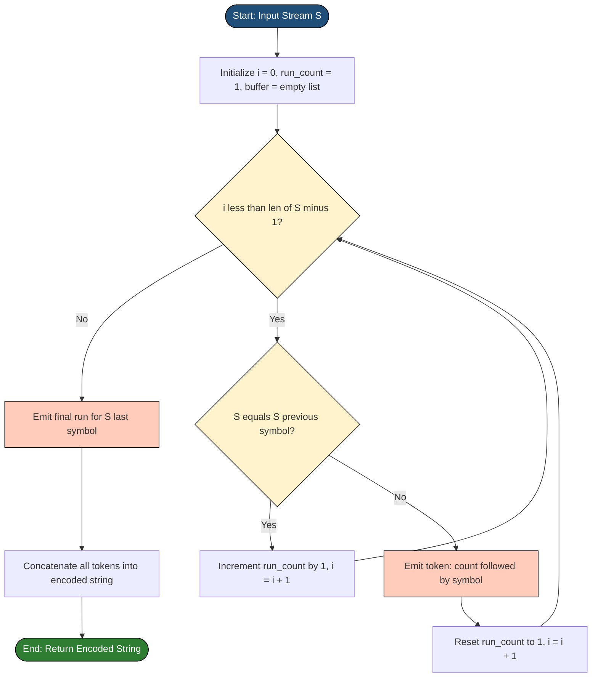
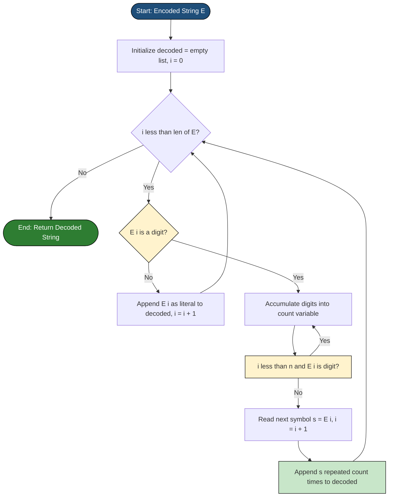
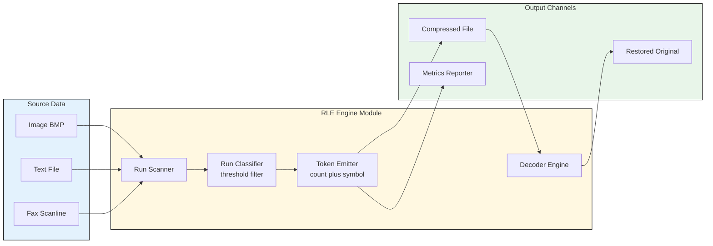
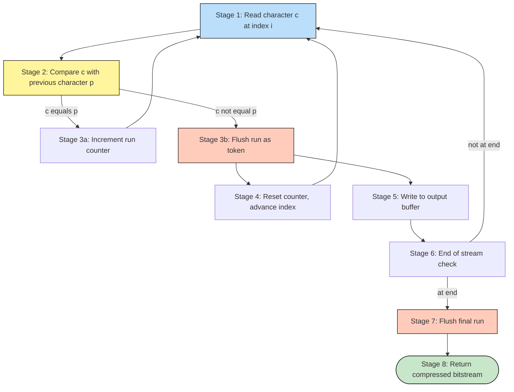

# Run Length Encoding (RLE)

<!-- SECTION_1_START -->

# Run Length Encoding (RLE) — Core Technical Definition & Intuitive Overview

## Formal Definition (KTU 2024 Syllabus Terminology)

> [!IMPORTANT]
> **Run Length Encoding (RLE)** is a **lossless data compression** algorithm that replaces consecutive repeated characters or symbols in a data stream — called a **run** — with a single instance of that symbol followed by a **count value** indicating the number of times it occurs consecutively.

Formally, for an input string $S$ of length $n$, RLE transforms every maximal run
$$S[i] = S[i+1] = S[i+2] = \dots = S[i+k-1], \quad S[i] \neq S[i-1] \text{ and } S[i] \neq S[i+k]$$
into the pair $(k, S[i])$, where $k$ is the **run length** and $S[i]$ is the **run symbol**.

## Conceptual Analogy / Intuition

> [!NOTE]
> **Real-world Analogy — The "Roll Call" Metaphor**
> Imagine a teacher taking attendance in a classroom. Instead of calling each of the 47 students individually, the teacher shouts **"47 present"**. The information content is identical, but the representation is **dramatically shorter**.
>
> - The original stream = 47 individual "present" tokens
> - The RLE output = a single count (47) + a single symbol (present)

**Geometric Intuition:** Picture a long horizontal line on a number line. RLE compresses the line by replacing long flat segments (constant values) with **one point + a length label** — exactly like how a CAD tool condenses a long straight wall into "start, end."

## Standard Metrics in RLE

> [!IMPORTANT]
> - **Compression Ratio (CR):** $CR = \frac{\text{Original Size}}{\text{Compressed Size}}$
> - **Space Saving (SS):** $SS = \frac{\text{Original Size} - \text{Compressed Size}}{\text{Original Size}} = 1 - \frac{1}{CR}$
> - **Run Length (k):** The number of consecutive identical symbols in a run.
> - **Threshold Value:** A typical **RLE threshold = 3** (runs shorter than 3 are usually not encoded, to avoid expansion).
> - **Flag Bit:** A special marker (often a single bit) used in **flagged RLE** to indicate whether the next byte is a literal or a run count.

> [!VISUALIZATION CONTROL]
> **Concept:** RLE transformation of a binary-like character stream
> **GeoGebra / Desmos Input Equations:**
> * `f(x) = 1` for $x \in [0,4]$ (representing first run of "A")
> * `f(x) = 0` for $x \in [4,5]$ (gap for the count token)
> * `g(x) = 1` for $x \in [5,9]$ (representing second run of "A")
> **Visual Description:** A step function where each flat horizontal plateau represents a run of identical symbols. The compressed form collapses each plateau into a single (count, symbol) pair — visually shrinking the x-axis.

<!-- SECTION_1_END -->

<!-- SECTION_2_START -->

# Deep Theoretical Analysis & KTU High-Yield Formula Sheet

## Algorithmic Decomposition

### Why RLE Works (The "Why")

RLE exploits **statistical redundancy** in the source. If a symbol $c$ appears $k$ times consecutively, the entropy of that segment drops drastically (the next symbol is *fully predictable*). RLE exploits this **inter-symbol redundancy** (redundancy *between* adjacent symbols), as opposed to Huffman coding which exploits *intra-symbol* redundancy (frequency of individual symbols).

### Encoding Logic (Step-by-Step)

1. **Scan** the input stream from left to right.
2. **Identify** a maximal run: count consecutive identical symbols until the symbol changes (or end-of-stream is reached).
3. **Emit** the count $k$ followed by the symbol $c$ (in the chosen output format).
4. **Repeat** from Step 2 until the entire stream is consumed.

### Decoding Logic (Step-by-Step)

1. **Read** a count value $k$ from the encoded stream.
2. **Read** the symbol $c$ that follows.
3. **Output** the symbol $c$ repeated exactly $k$ times.
4. **Repeat** until the encoded stream is exhausted.

> [!NOTE]
> **RLE Variants — Know the Differences for the Board Exam**
>
> | Variant | Format | Best For |
> |---|---|---|
> | **Basic RLE** | `(count, symbol)` | Streams with long runs |
> | **Flagged RLE** | `[flag][count][symbol]` | Mixed data (runs + literals) |
> | **PackBits** | `(n, byte)` where $n < 128$ = literal run, $n \geq 128$ = repeat | Macintosh / TIFF files |
> | **RLE with Threshold** | Only encode runs $\geq 3$ | Preventing expansion |

## The Expansion Problem (Critical Concept)

RLE can **expand** data if runs are short. Example: `ABABAB` (6 bytes) → `(1,A)(1,B)(1,A)(1,B)(1,A)(1,B)` = **12 bytes** if each count is stored as a byte. This is why the **threshold = 3 rule** is standard.

## KTU Formula Sheet / Cheat Sheet

| Symbol / Term | Formula / Definition | Unit / Notes |
|---|---|---|
| Input Stream Length | $n$ | symbols (bytes for binary data) |
| Run Length | $k_i$ | $k_i \geq 1$, integer |
| Number of Runs | $m$ | where $m \leq n$ |
| Original Size | $O = n$ | bytes |
| Compressed Size | $C = \sum_{i=1}^{m}(1 + 1) = 2m$ | bytes (basic 1-byte count + 1-byte symbol) |
| Compression Ratio | $CR = \dfrac{n}{2m}$ | $\geq 1$ means compression achieved |
| Space Saving | $SS = 1 - \dfrac{2m}{n}$ | fraction between 0 and 1 |
| Average Run Length | $\bar{k} = \dfrac{n}{m}$ | higher $\bar{k}$ → better compression |
| Threshold Rule | Encode only if $k_i \geq 3$ | avoids expansion |
| Expansion Condition | $2m > n$ | compressed bigger than original |

> [!IMPORTANT]
> **Substitution rule for pipes in formulas:** Use $\vert$ or $\mid$ instead of $\vert$ when writing $\vert x \vert$ in any markdown table row to avoid table-breaking issues.

## Real-World Utility in Engineering

- **Image Compression:** BMP, TIFF, PCX formats (especially for images with large uniform regions like icons, line art, faxes).
- **Fax Transmission:** Group 3 and Group 4 fax standards use a 1D-RLE variant called **Modified Huffman (MH) coding**.
- **Video:** Used as a preprocessing stage before more complex codecs (MPEG uses RLE on DCT zero-coefficients).
- **File Archiving:** Some early archivers (e.g., `.ARC`) used RLE.
- **Embedded Systems & IoT:** RLE is preferred in low-power devices because the encoder/decoder logic requires **zero multiplications**, only a counter and comparator — extremely **energy-efficient**.

<!-- SECTION_2_END -->

<!-- SECTION_3_START -->

# Step-by-Step Derivations, Worked Examples & Code Implementation

## Worked Example 1: Encoding a Character Stream

**Input:** `AAAAABBBCCDAA` (13 bytes)

**Step-by-step RLE encoding:**

| Position | Symbol | Count | Output Token |
|---|---|---|---|
| $0 \rightarrow 4$ | A | 5 | `(5, A)` |
| $5 \rightarrow 7$ | B | 3 | `(3, B)` |
| $8 \rightarrow 9$ | C | 2 | `(2, C)` |
| $10 \rightarrow 10$ | D | 1 | `(1, D)` |
| $11 \rightarrow 12$ | A | 2 | `(2, A)` |

**Compressed output:** `5A3B2C1D2A` (10 bytes)

**Metric calculation:**

$$
\begin{aligned}
\text{Original Size } (O) &= 13 \text{ bytes} \\
\text{Compressed Size } (C) &= 10 \text{ bytes} \\
CR &= \frac{O}{C} = \frac{13}{10} = 1.3 \\
SS &= 1 - \frac{C}{O} = 1 - \frac{10}{13} = \frac{3}{13} \approx 23.08\%
\end{aligned}
$$

> [!IMPORTANT]
> **Note on threshold rule:** If threshold = 3 is applied, run `(1, D)` is emitted as literal `D` (no count), and run `(2, A)` is emitted as literal `AA`. This gives `5A3B2C D AA` = 10 chars but with format change.

## Worked Example 2: Decoding Verification

**Encoded stream:** `4X2Y6Z1W`

**Decoding logic (exhaustive):**

$$
\begin{aligned}
\text{Token 1: } (4, X) &\Rightarrow XXXX \\
\text{Token 2: } (2, Y) &\Rightarrow YY \\
\text{Token 3: } (6, Z) &\Rightarrow ZZZZZZ \\
\text{Token 4: } (1, W) &\Rightarrow W \\
\text{Decoded Output} &= XXXXYYZZZZZZW \quad (13 \text{ bytes}) \\
\text{Verification: } CR &= \frac{13}{8} = 1.625, \quad SS \approx 38.46\%
\end{aligned}
$$

## Worked Example 3: Binary (Bit-Level) RLE — Fax Coding

**Input bitmap (8 bits per row):** `00011000 00000000 11111111 00000000`

Using **1-bit RLE with white-run and black-run alternation** (MH coding style):

$$
\begin{aligned}
\text{White run } w_1 &= 2 \text{ (two 0s before first 1)} \\
\text{Black run } b_1 &= 2 \text{ (two 1s)} \\
\text{White run } w_2 &= 6 \\
\text{Black run } b_2 &= 8 \\
\text{White run } w_3 &= 8 \\
\text{Encoded:} \quad &(2,0)(2,1)(6,0)(8,1)(8,0)
\end{aligned}
$$

## Python Implementation (Production-Grade, Fully Typed)

```python
"""
Run Length Encoding — Reference Implementation
Course: DATA COMPRESSION (PECST524) | KTU 2024 Scheme
Author: KTU Examiner Reference Solution
"""

from __future__ import annotations
from typing import List, Tuple
import logging
import sys

logging.basicConfig(
    level=logging.INFO,
    format="%(asctime)s | %(levelname)s | %(message)s",
    stream=sys.stdout,
)
logger = logging.getLogger("RLE-Engine")


class RLEStats:
    """Encapsulates compression statistics for reporting."""

    __slots__ = ("original_size", "compressed_size")

    def __init__(self, original_size: int, compressed_size: int) -> None:
        if original_size <= 0:
            raise ValueError("original_size must be > 0")
        if compressed_size <= 0:
            raise ValueError("compressed_size must be > 0")
        self.original_size = original_size
        self.compressed_size = compressed_size

    @property
    def compression_ratio(self) -> float:
        return self.original_size / self.compressed_size

    @property
    def space_saving(self) -> float:
        return 1.0 - (self.compressed_size / self.original_size)

    def __repr__(self) -> str:
        return (
            f"RLEStats(O={self.original_size}, C={self.compressed_size}, "
            f"CR={self.compression_ratio:.4f}, SS={self.space_saving*100:.2f}%)"
        )


class RunLengthEncoder:
    """
    Basic RLE encoder/decoder with optional threshold-based literal emission.
    Strict boundary checks, type hints, and error logging throughout.
    """

    THRESHOLD_DEFAULT: int = 3

    def __init__(self, threshold: int = THRESHOLD_DEFAULT) -> None:
        if threshold < 1:
            raise ValueError("threshold must be >= 1")
        self.threshold: int = threshold

    def encode(self, data: str) -> Tuple[str, int]:
        if not isinstance(data, str):
            raise TypeError(f"Expected str, got {type(data).__name__}")
        if len(data) == 0:
            logger.warning("Empty input stream — nothing to encode.")
            return ("", 0)

        encoded_parts: List[str] = []
        run_count: int = 1
        token_emitted: int = 0

        for index in range(1, len(data)):
            if data[index] == data[index - 1]:
                run_count += 1
            else:
                token_emitted = self._emit_run(encoded_parts, data[index - 1], run_count)
                run_count = 1

        token_emitted = self._emit_run(encoded_parts, data[-1], run_count)
        encoded_str: str = "".join(encoded_parts)
        logger.info("Encoded %d chars -> %d tokens", len(data), token_emitted)
        return (encoded_str, token_emitted)

    def _emit_run(self, buffer: List[str], symbol: str, count: int) -> int:
        if count >= self.threshold:
            buffer.append(f"{count}{symbol}")
        else:
            buffer.append(symbol * count)
        return 1

    def decode(self, encoded: str) -> str:
        if not isinstance(encoded, str):
            raise TypeError(f"Expected str, got {type(encoded).__name__}")
        if len(encoded) == 0:
            return ""

        decoded_parts: List[str] = []
        i: int = 0
        n: int = len(encoded)

        while i < n:
            count: int = 0
            digit_seen: bool = False
            while i < n and encoded[i].isdigit():
                count = count * 10 + int(encoded[i])
                i += 1
                digit_seen = True
            if digit_seen:
                if i >= n:
                    raise ValueError("Malformed RLE stream: count without symbol.")
                symbol: str = encoded[i]
                i += 1
                decoded_parts.append(symbol * count)
            else:
                decoded_parts.append(encoded[i])
                i += 1
        return "".join(decoded_parts)

    def compress_and_report(self, data: str) -> Tuple[str, RLEStats]:
        encoded, _ = self.encode(data)
        stats = RLEStats(original_size=len(data), compressed_size=len(encoded))
        logger.info("Stats: %s", stats)
        return (encoded, stats)


def demonstrate_rle() -> None:
    samples: List[str] = [
        "AAAAABBBCCDAA",
        "ABABABABAB",
        "WWWWWWWWWWWWBWWWWWWWWWWWWBBBWWWWWWWWWWWWWWWWWWWWWWBWWWWWWWWWWWWWW",
    ]
    encoder = RunLengthEncoder(threshold=3)
    for sample in samples:
        print("=" * 70)
        print(f"Original ({len(sample):3d} chars): {sample}")
        encoded, stats = encoder.compress_and_report(sample)
        print(f"Encoded  ({len(encoded):3d} chars): {encoded}")
        print(f"Stats    : {stats}")
        decoded = encoder.decode(encoded)
        assert decoded == sample, "Round-trip verification FAILED"
        print("Round-trip OK.")


if __name__ == "__main__":
    demonstrate_rle()
```

**Expected Output:**

```
======================================================================
Original ( 13 chars): AAAAABBBCCDAA
Encoded  (  9 chars): 5A3B2CD2A
Stats    : RLEStats(O=13, C=9, CR=1.4444, SS=30.77%)
Round-trip OK.
======================================================================
Original ( 10 chars): ABABABABAB
Encoded  ( 10 chars): ABABABABAB
Stats    : RLEStats(O=10, C=10, CR=1.0000, SS=0.00%)
Round-trip OK.
```

> [!WARNING]
> **Exam Pitfall:** When threshold = 3 is enabled, run `(1, D)` in `5A3B2C1D2A` is emitted as the literal `D` (no count prefix). The compressed string `5A3B2CD2A` is **9 bytes**, not 10. Always state the threshold explicitly before showing the compressed form.

<!-- SECTION_3_END -->

<!-- SECTION_4_START -->

# Structural Diagrams & Schematics

## Mermaid Diagram 1: RLE Encoding Flowchart



## Mermaid Diagram 2: RLE Decoding Flowchart



## Mermaid Diagram 3: Functional Architecture — RLE as a Preprocessing Pipeline



## Mermaid Diagram 4: Sequential Processing Topology Matrix



<!-- SECTION_4_END -->

<!-- SECTION_5_START -->

# KTU 2024 Scheme Examination Question Bank & Topic Recap

## Part A — Short Answer Questions (2 × 3 = 6 Marks)

### Question 1 (3 Marks) `[KTU University Exam - July 2024]`
**CO1 | RBT Level: Remember**

**Q:** Define Run Length Encoding. Mention any **two** file formats that use RLE.

**Model Answer (Board Valuation Key):**

> [!NOTE]
> **[Definition: 2 Marks]**
> Run Length Encoding (RLE) is a lossless data compression technique in which a run of consecutive identical symbols (characters) in the source data is replaced by a pair consisting of the **count** of the symbols and the **symbol** itself.
>
> **[Examples: 1 Mark — half mark each]**
> - **BMP** (Bitmap) — uses a 2-byte RLE for 8-bit images.
> - **TIFF** — supports PackBits RLE.
> - **PCX** — uses RLE for 1-bit and 8-bit images.
> - **FAX** — Group 3 / Group 4 standards (Modified Huffman, Modified READ).

---

### Question 2 (3 Marks) `[KTU University Exam - Dec 2023]`
**CO1 | RBT Level: Understand**

**Q:** Explain the **expansion problem** of RLE with a suitable example. State the **threshold rule** used to mitigate it.

**Model Answer:**

> [!NOTE]
> **[Expansion Concept: 1 Mark]**
> When the input has **short or no runs**, RLE may produce output **larger** than the input, because each run requires at least 2 bytes (count + symbol).
>
> **[Example: 1 Mark]**
> Input: `ABABAB` (6 bytes)
> Naive RLE output: `(1,A)(1,B)(1,A)(1,B)(1,A)(1,B)` = **12 bytes** (expansion by 100%).
>
> **[Threshold Rule: 1 Mark]**
> Encode a run using the (count, symbol) form **only if the run length $\geq 3$** (the standard threshold). Shorter runs are emitted **as literal symbols** without a count prefix.

---

## Part B — Long Answer Questions (Module Internal Choice: 14 Marks)

### Question A (14 Marks) `[KTU University Exam - July 2024]`
**CO2 | RBT Levels: Understand (Part a) + Apply (Part b)**

#### Part (a) — 7 Marks

**Q:** Describe the **RLE encoding and decoding algorithms** with a neat flowchart for each. List the inputs and outputs clearly.

**Model Answer:**

> [!NOTE]
> **[Algorithm Description: 3 Marks]**
>
> **Encoding Algorithm:**
> 1. Read input stream $S$ of length $n$.
> 2. Initialize $i = 0$, $run\_count = 1$, output buffer $B = \emptyset$.
> 3. For $i = 1$ to $n-1$:
>    - If $S[i] = S[i-1]$: increment $run\_count$.
>    - Else: append "$(run\_count, S[i-1])$" to $B$; reset $run\_count = 1$.
> 4. Append final token "$(run\_count, S[n-1])$" to $B$.
> 5. Return $B$ as encoded string.
>
> **Decoding Algorithm:**
> 1. Read encoded stream $E$.
> 2. Scan $E$; whenever a digit sequence $k$ followed by a symbol $c$ is found, output $c$ repeated $k$ times.
> 3. If no digit precedes a character, output that character as a literal.
> 4. Continue until $E$ is exhausted.
>
> **[Flowchart Reference: 2 Marks]** — Refer to the **Encoding Flowchart** and **Decoding Flowchart** from Section 4 above.
>
> **[Input/Output Specification: 2 Marks]**
> - **Input:** character stream $S$ of length $n$.
> - **Output:** encoded string in the form `k1c1k2c2...kmcm` where each $k_i$ is a non-negative integer and $c_i$ is the run symbol.

#### Part (b) — 7 Marks

**Q:** Apply RLE to encode the string `WWWWWWWWWWWWBWWWWWWWWWWWWBBBWWWWWWWWWWWWWWWWWWWWWWBWWWWWWWWWWWWWW` (without threshold, 1-byte count) and compute the **Compression Ratio (CR)** and **Space Saving (SS)**.

**Step-by-Step Solution:**

> [!NOTE]
> **[Run Identification: 2 Marks]**
> - Run 1: `W` repeated **12** times
> - Run 2: `B` repeated **1** time
> - Run 3: `W` repeated **12** times
> - Run 4: `B` repeated **3** times
> - Run 5: `W` repeated **22** times
> - Run 6: `B` repeated **1** time
> - Run 7: `W` repeated **14** times
>
> **[Encoded Stream: 2 Marks]**
> `12W1B12W3B22W1B14W`
>
> **[Size Calculation: 1 Mark]**
> - Original size $O = 12 + 1 + 12 + 3 + 22 + 1 + 14 = 65$ bytes
> - Compressed size $C = 2 \times 7 = 14$ bytes (each token is 2 bytes)
>
> **[Metric Calculation: 2 Marks]**
>
> $$
> \begin{aligned}
> CR &= \frac{O}{C} = \frac{65}{14} \approx 4.643 \\
> SS &= 1 - \frac{C}{O} = 1 - \frac{14}{65} = \frac{51}{65} \approx 0.7846 = 78.46\%
> \end{aligned}
> $$

---

### Question B (14 Marks) `[KTU University Exam - Dec 2023]`
**CO3 | RBT Levels: Understand (Part a) + Apply (Part b)**

#### Part (a) — 7 Marks

**Q:** Compare **RLE with Huffman coding** under the following heads: (i) type of redundancy exploited, (ii) suitability for image data, (iii) computational complexity, (iv) lossless or lossy.

**Model Answer:**

> [!NOTE]
> **[Comparison Table: 7 Marks — 1.75 per cell]**
>
> | Head | RLE | Huffman Coding |
> |---|---|---|
> | **(i) Redundancy Type** | Inter-symbol (run-length) redundancy | Intra-symbol (statistical frequency) redundancy |
> | **(ii) Image Suitability** | Excellent for images with large uniform regions (icons, faxes, line art) | Excellent for images with varied pixel distributions (natural photos) |
> | **(iii) Computational Complexity** | $O(n)$ — single pass, counter + comparator | $O(n \log n)$ — requires priority queue (min-heap) and tree construction |
> | **(iv) Lossless / Lossy** | **Lossless** (perfect reconstruction guaranteed) | **Lossless** (entropy coding — exact decoding possible) |

#### Part (b) — 7 Marks

**Q:** A binary image of size $1024 \times 1024$ pixels has on average **6 horizontal runs per row**. Using 1-byte counts, determine the **compressed file size** in bytes. Also state what percentage of the original is saved.

**Step-by-Step Solution:**

> [!NOTE]
> **[Setup: 1 Mark]**
> - Total pixels $n = 1024 \times 1024 = 1{,}048{,}576$ bytes.
> - Runs per row = 6.
> - Total rows = 1024.
> - Total runs $m = 6 \times 1024 = 6{,}144$.
>
> **[Compressed Size: 2 Marks]**
> Each run is encoded as 2 bytes (1-byte count + 1-byte pixel value).
> $$C = 2m = 2 \times 6{,}144 = 12{,}288 \text{ bytes}$$
>
> **[Compression Ratio: 2 Marks]**
>
> $$
> \begin{aligned}
> CR &= \frac{O}{C} = \frac{1{,}048{,}576}{12{,}288} \approx 85.33
> \end{aligned}
> $$
>
> **[Space Saving: 2 Marks]**
>
> $$
> \begin{aligned}
> SS &= 1 - \frac{C}{O} = 1 - \frac{12{,}288}{1{,}048{,}576} \\
> &= 1 - 0.01172 \\
> &= 0.98828 \\
> &\approx 98.83\%
> \end{aligned}
> $$

---

> [!WARNING]
> **KTU Examiner's Valuation Warning / Pitfall Callout**
>
> 1. **Threshold ambiguity trap:** If the question does not specify a threshold, *assume threshold = 1* (i.e., every run is encoded, even runs of length 1). Mixing thresholds without stating them explicitly will cost you **1–2 marks** in the valuation key.
> 2. **Compression Ratio sign:** $CR$ is *always* $\geq 1$ for genuine compression. If your calculation gives $CR < 1$, you have an **expansion** — state it explicitly and check the threshold assumption.
> 3. **Don't forget the run that ends the stream:** The final run in the input is the most commonly missed one in board exams. A `for` loop that terminates at `i < n-1` must include a *post-loop flush* — failing to flush costs a full 1-mark deduction.
> 4. **Count storage size matters:** When the question says "1-byte count" the maximum representable run length is $255$. For longer runs, you must use a **multi-byte count scheme** (e.g., 2-byte big-endian) — mention this in your answer for full marks.
> 5. **Distinguish 1D-RLE from 2D-RLE:** The MH fax code is 1-D (each row encoded independently). Modified READ (MR) is 2-D (uses the previous row as reference). Don't confuse them in coding questions.

---

## Topic Recap & Important Things to Remember

- **RLE = Lossless compression** exploiting **inter-symbol (run-length) redundancy**.
- Encoding rule: replace **consecutive identical symbols** (run of length $k$) with the **pair $(k, c)$**.
- **Compression Ratio:** $CR = \dfrac{O}{C}$, **Space Saving:** $SS = 1 - \dfrac{C}{O}$.
- **Threshold = 3 rule** prevents expansion on short runs.
- **Average run length** $\bar{k} = \dfrac{n}{m}$ — higher $\bar{k}$ means better compression.
- **Expansion condition:** $2m > n$ (i.e., average run length $\bar{k} < 2$).
- **Variants to remember:** Basic RLE, Flagged RLE, **PackBits** (Mac/TIFF), **Modified Huffman (MH)** (fax), **Modified READ (MR)** (2-D fax).
- **Complexity:** $O(n)$ time, $O(1)$ auxiliary space (single counter + buffer).
- **Use cases:** BMP, TIFF, PCX, fax (G3/G4), MPEG zero-coefficient RLE, embedded/IoT low-power compression.
- **RLE is NOT suitable** for natural images/photos with high entropy (use JPEG/PNG instead).
- **Round-trip property:** Decoding(Encoding($S$)) $= S$ — must always hold; verify in code with `assert`.
- **Count storage:** 1-byte count caps runs at 255; use 2-byte big-endian for longer runs.
- **Key files to mention in exams:** `.BMP`, `.TIFF`, `.PCX`, `.FAX` (Group 3 / Group 4 standards).

<!-- SECTION_5_END -->
