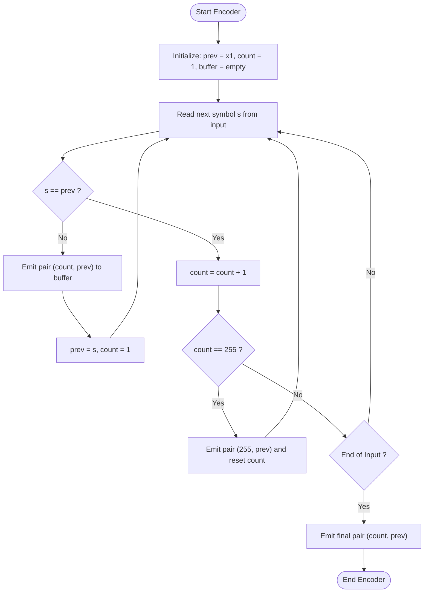
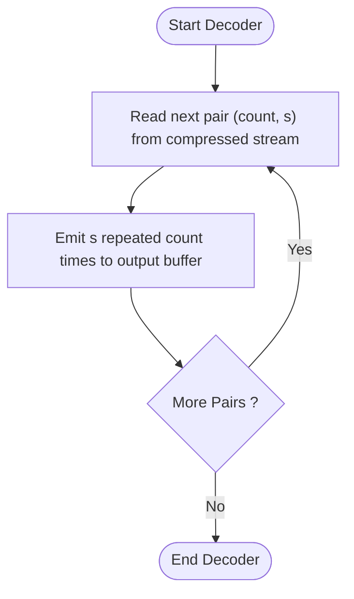
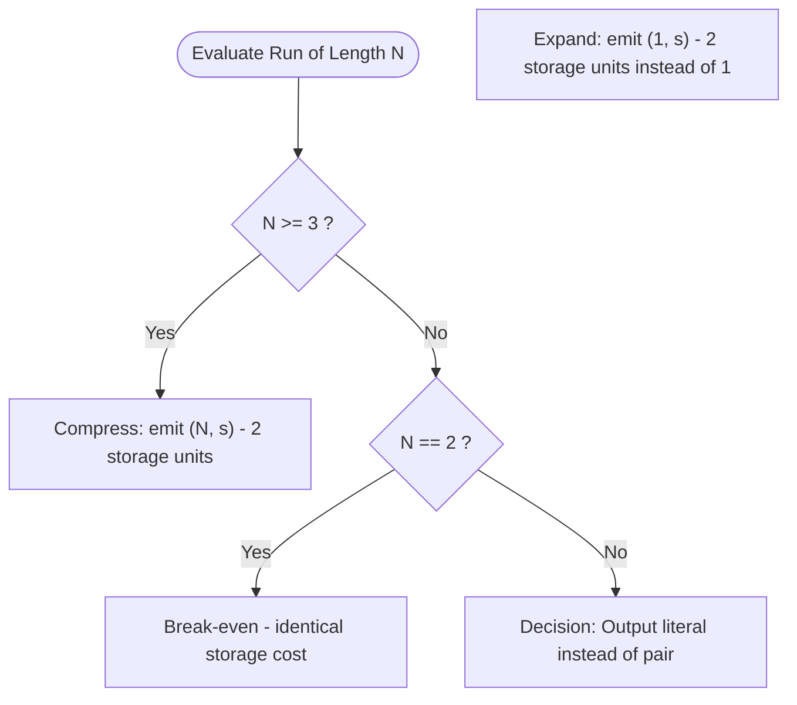

# Run-Length Encoding

<!-- SECTION_1_START -->

# Run-Length Encoding (RLE) — Foundational Lossless Compression

## 📘 Formal Academic Definition

> [!NOTE]
> **Run-Length Encoding (RLE)** is a **lossless data compression** technique that replaces a *run* (a consecutive sequence) of identical data symbols with a single **count** value followed by the **symbol** itself. The fundamental compression gain arises when the run length $N \geq 3$, because the encoded form $(N, s)$ uses 2 storage units where the original used $N$.

A **run** is formally defined as a maximal substring $s_1^k$ of the source sequence where every symbol is identical and either $k = 1$ (no repetition) or $s_{k+1} \neq s_1$.

The encoder can be modeled as the transformation:
$$T: \{0,1\}^* \longrightarrow \{0,1\}^* \quad \text{where} \quad T(\underbrace{ss\cdots s}_{N \text{ times}}) = (N, s)$$

The decoder is the **exact inverse** transformation:
$$T^{-1}(N, s) = \underbrace{ss\cdots s}_{N \text{ times}}$$

Because $T^{-1}(T(x)) = x$ for all valid inputs, RLE guarantees **perfect reconstruction** — the defining property of a lossless codec.

---

## 🧠 Conceptual Analogy — "The Inventory Counter"

> [!TIP]
> **Imagine a warehouse supervisor** taking stock of identical boxes on a shelf. Instead of pointing at each box individually and writing it down one by one (e.g., *box, box, box, box, box*), the supervisor efficiently writes **"5 boxes"** — a count followed by an item descriptor. RLE does *exactly this* on a stream of bytes.

**Geometric Intuition (Run-Length Bar Visualization):**

```
Original Sequence:  A A A A B B C D D D D
                    ├───────┤├─┤┌┐├─────┤
                      run 1   r2 r3  run 4
                      N=4     N=2 N=1 N=4

Encoded Stream:      4A 2B 1C 4D       (8 units → 4 entries = 50% savings)
```

> [!IMPORTANT]
> **Syllabus Highlight (KTU 2024 — Module 1):** RLE is the **simplest statistical compression model** and acts as the conceptual springboard for understanding **variable-length coding (Huffman, Shannon-Fano)**. It assumes the *zero-order* Markov property — the probability of the next symbol depends only on the current run count, not the symbol value.

---

## 📊 Visualization Control (Coordinate-Plane Conceptual Map)

> [!VISUALIZATION]
> **Concept:** *Run-Length Frequency Histogram for Sample Stream*
> **Desmos Input Equations (Bar Centers):**
>
> * $(1, \, 4)$ — label "A: 4"
> * $(2, \, 2)$ — label "B: 2"
> * $(3, \, 1)$ — label "C: 1"
> * $(4, \, 4)$ — label "D: 4"
>
> **Visual Description:** A discrete bar plot with the x-axis enumerating *run-index* and the y-axis showing *run length*. Tall bars (length $\geq 3$) indicate **compressible runs**, whereas bars of height 1 (singleton runs) actually *expand* the data when naively encoded. This visualization reveals why RLE must skip or merge singleton runs in practical implementations.

---

## 🔑 Key Terminology Lock-In

| Term | KTU-Standard Definition |
|---|---|
| **Run** | Maximal sequence of identical consecutive symbols |
| **Run Length** | Number of repetitions $N$ within a run |
| **Count Byte** | Storage unit holding the integer $N$ (often 1 byte) |
| **Literal Byte** | Storage unit holding the actual data symbol |
| **Escaped Run** | A literal run of length $\geq 128$ split into multiple encoded units |
| **PackBits** | Industry-standard RLE variant used in **TIFF, Apple QuickTime, PDF** |

---

<!-- SECTION_1_END -->

<!-- SECTION_2_START -->

# Deep Theoretical Analysis & KTU High-Yield Formula Sheet

## ⚙️ Operational Mechanics — Encoder Algorithm

The RLE encoder follows a deterministic **greedy left-to-right scan**:

1. **Initialize** — Set counter $N \leftarrow 1$, current symbol $s_c \leftarrow x_1$, and output buffer $\mathcal{B} \leftarrow \emptyset$.
2. **Read** the next input symbol $x_i$.
3. **Compare** — If $x_i = s_c$, increment $N \leftarrow N + 1$ and return to Step 2.
4. **Emit** the pair $(N, s_c)$ into $\mathcal{B}$; then set $s_c \leftarrow x_i$ and $N \leftarrow 1$.
5. **Terminate** when end-of-input is reached; emit the final pair $(N, s_c)$.

> [!IMPORTANT]
> **Why "Greedy Maximal Run" Strategy?**
> The encoder always extends a run as far as possible because any *premature* termination would emit a shorter run, increasing the number of $(N, s)$ pairs in $\mathcal{B}$ and **diluting the compression ratio**.

---

## ⚙️ Operational Mechanics — Decoder Algorithm

Decoding is **unambiguous and stateless** because each $(N, s)$ pair is self-describing:

1. **Read** a pair $(N, s)$ from the encoded stream.
2. **Emit** $s$ exactly $N$ consecutive times to the output buffer.
3. **Repeat** until the encoded stream is exhausted.

No lookahead or backtracking is needed — a property that gives RLE its **$O(N)$ linear time complexity** for both encode and decode.

---

## 📐 KTU Formula Sheet (High-Yield — Memorize All)

| \# | Formula | Variable Definitions | Engineering Use |
|---|---|---|---|
| 1 | $CR = \dfrac{n_1}{n_2}$ | $n_1$ = original size, $n_2$ = compressed size | **Compression Ratio** — primary KTU metric |
| 2 | $CF = \dfrac{n_2}{n_1}$ | Same as above | **Compression Factor** (inverse form) |
| 3 | $SS = 1 - \dfrac{n_2}{n_1} = 1 - \dfrac{1}{CR}$ | Space savings as a fraction | **Savings %** when multiplied by 100 |
| 4 | $\bar{L} = \sum_{i=1}^{k} p_i \cdot l_i$ | $p_i$ = prob., $l_i$ = code length | **Average code length** in bits/symbol |
| 5 | $H(X) = -\sum_{i=1}^{m} p_i \log_2 p_i$ | $p_i$ = symbol probabilities | **Shannon Entropy** — theoretical minimum |
| 6 | $\eta = \dfrac{H(X)}{\bar{L}}$ | — | **Coding Efficiency** (ideal $\eta = 1$) |
| 7 | $\text{Redundancy} = 1 - \eta$ | — | Quantifies *wasted* bits |
| 8 | $N_{\text{effective}} = N \geq 3$ | Threshold for compression gain | Critical run-length threshold |
| 9 | $\text{Cap}(N) = 255$ | For 1-byte counter | Maximum storable run in 8-bit RLE |
| 10 | $\text{Split}(N) = \left\lceil \dfrac{N}{127} \right\rceil$ | For 7-bit counters | PackBits escape-splitting rule |

> [!NOTE]
> **Threshold Insight (Formula 8):** For an 8-bit counter, the encoded form uses 2 bytes. Compression gain occurs when $N > 2$, i.e., $N \geq 3$. A run of length 1 or 2 will *expand* the data, which is why production codecs (e.g., **PackBits**) reserve 1 byte for literal flags.

---

## 🔬 Variants of RLE

### Variant 1 — Implicit-Count RLE
Used when the symbol set is **known a priori** (e.g., a 2-color bitmap). Only the counts are stored; symbols alternate deterministically.

### Variant 2 — Explicit-Count RLE (Canonical)
The generic $(N, s)$ pair encoding — the focus of KTU Module 1.

### Variant 3 — PackBits (TIFF/PDF Standard)
Uses a **header byte** $h$:
- If $-127 \leq h \leq -1$ (i.e., $129 \leq |h| \leq 255$ unsigned): copy the next $|h|+1$ bytes literally.
- If $0 \leq h \leq 127$: repeat the next byte $h+1$ times.

$$h = \begin{cases} -n - 1 & \text{if next } n+1 \text{ bytes are LITERAL} \\ n & \text{if next byte is REPEATED } n+1 \text{ times} \end{cases}$$

---

## 🏭 Real-World Engineering Utility

RLE is the **workhorse codec** for:
- **BMP, TIFF, PCX image formats** (especially bi-level scanned documents).
- **Fax transmission (T.4 / Group 3 standard)** — Modified Huffman, but the run-length concept is foundational.
- **Embedded systems** with severe RAM constraints (e.g., E-paper displays, IoT sensor logs) due to its **stateless, $O(1)$ auxiliary memory** decoder.
- **Data with high spatial locality** — sprite animations, telemetry streams with idle periods (e.g., `0x00` padding).

> [!TIP]
> RLE performs **poorly** on noisy data (e.g., photographs) where runs of length $\geq 3$ are rare. This motivates the **LZ family** and **BWT** introduced in later modules.

---

<!-- SECTION_2_END -->

<!-- SECTION_3_START -->

# Step-by-Step Derivations, Worked Example & Python Implementation

## 📝 Worked Example — Manual RLE Encoding

**Input Sequence (length $n_1 = 23$):**

$$X = \underbrace{A A A A}_{4} \underbrace{B B B}_{3} \underbrace{C C C C C C}_{6} \underbrace{D D D D}_{4} \underbrace{E E E}_{3} \underbrace{A A A}_{3}$$

### Step-by-Step Encoder Trace

| Step $i$ | Current Symbol $s_c$ | Next Symbol $x_i$ | Action | Counter $N$ | Buffer $\mathcal{B}$ |
|---|---|---|---|---|---|
| 0 | (init) $A$ | — | Initialize | $N = 1$ | $\emptyset$ |
| 1 | $A$ | $A$ | Match → increment | $N = 2$ | $\emptyset$ |
| 2 | $A$ | $A$ | Match → increment | $N = 3$ | $\emptyset$ |
| 3 | $A$ | $A$ | Match → increment | $N = 4$ | $\emptyset$ |
| 4 | $A$ | $B$ | Mismatch → emit $(4,A)$ | $N = 1$ | $(4,A)$ |
| 5 | $B$ | $B$ | Match → increment | $N = 2$ | $(4,A)$ |
| 6 | $B$ | $B$ | Match → increment | $N = 3$ | $(4,A)$ |
| 7 | $B$ | $C$ | Mismatch → emit $(3,B)$ | $N = 1$ | $(4,A),(3,B)$ |
| 8 | $C$ | $C$ | Match → increment | $N = 2$ | $(4,A),(3,B)$ |
| 9 | $C$ | $C$ | Match → increment | $N = 3$ | $(4,A),(3,B)$ |
| 10 | $C$ | $C$ | Match → increment | $N = 4$ | $(4,A),(3,B)$ |
| 11 | $C$ | $C$ | Match → increment | $N = 5$ | $(4,A),(3,B)$ |
| 12 | $C$ | $C$ | Match → increment | $N = 6$ | $(4,A),(3,B)$ |
| 13 | $C$ | $D$ | Mismatch → emit $(6,C)$ | $N = 1$ | $(4,A),(3,B),(6,C)$ |
| 14 | $D$ | $D$ | Match → increment | $N = 2$ | $(4,A),(3,B),(6,C)$ |
| 15 | $D$ | $D$ | Match → increment | $N = 3$ | $(4,A),(3,B),(6,C)$ |
| 16 | $D$ | $D$ | Match → increment | $N = 4$ | $(4,A),(3,B),(6,C)$ |
| 17 | $D$ | $E$ | Mismatch → emit $(4,D)$ | $N = 1$ | $(4,A),(3,B),(6,C),(4,D)$ |
| 18 | $E$ | $E$ | Match → increment | $N = 2$ | $(4,A),(3,B),(6,C),(4,D)$ |
| 19 | $E$ | $E$ | Match → increment | $N = 3$ | $(4,A),(3,B),(6,C),(4,D)$ |
| 20 | $E$ | $A$ | Mismatch → emit $(3,E)$ | $N = 1$ | $(4,A),(3,B),(6,C),(4,D),(3,E)$ |
| 21 | $A$ | $A$ | Match → increment | $N = 2$ | $(4,A),(3,B),(6,C),(4,D),(3,E)$ |
| 22 | $A$ | $A$ | Match → increment | $N = 3$ | $(4,A),(3,B),(6,C),(4,D),(3,E)$ |
| 23 | $A$ | (EOF) | Emit final $(3,A)$ | — | $(4,A),(3,B),(6,C),(4,D),(3,E),(3,A)$ |

### Final Encoded Output

$$\boxed{\mathcal{B} = 4A \, 3B \, 6C \, 4D \, 3E \, 3A}$$

The buffer contains **6 pairs** (12 characters). Original length $n_1 = 23$, compressed length $n_2 = 12$.

---

## 📊 Compression Metric Derivation

### Compression Ratio

$$CR = \frac{n_1}{n_2} = \frac{23}{12} \approx 1.917$$

> *Interpretation:* The compressed file is roughly **1.92× smaller** than the original.

### Compression Factor

$$CF = \frac{n_2}{n_1} = \frac{12}{23} \approx 0.522$$

### Space Savings (Percentage)

$$SS = \left(1 - \frac{n_2}{n_1}\right) \times 100\% = \left(1 - \frac{12}{23}\right) \times 100\% \approx 47.83\%$$

### Source Entropy (for reference)

Symbol probabilities for $X$:

$$p_A = \frac{7}{23}, \quad p_B = \frac{3}{23}, \quad p_C = \frac{6}{23}, \quad p_D = \frac{4}{23}, \quad p_E = \frac{3}{23}$$

$$H(X) = -\sum_{i} p_i \log_2 p_i$$

$$
\begin{aligned}
H(X) &= -\left[\frac{7}{23}\log_2\frac{7}{23} + \frac{3}{23}\log_2\frac{3}{23} + \frac{6}{23}\log_2\frac{6}{23} + \frac{4}{23}\log_2\frac{4}{23} + \frac{3}{23}\log_2\frac{3}{23}\right] \\
H(X) &\approx -\left[(-0.5222) + (-0.3832) + (-0.5058) + (-0.4390) + (-0.3832)\right] \\
H(X) &\approx 2.2334 \text{ bits/symbol}
\end{aligned}
$$

The **lower bound** of 2.2334 bits/symbol tells us that no lossless codec can compress $X$ below $\approx 5.13$ bytes ($23 \times 2.2334 / 8$).

---

## 💻 Production-Grade Python Implementation

```python
from typing import List, Tuple
import logging

# Configure structured error logging
logging.basicConfig(
    level=logging.INFO,
    format="%(asctime)s | %(levelname)s | %(message)s"
)
logger = logging.getLogger("RLE_Codec")


def rle_encode(data: str) -> List[Tuple[int, str]]:
    """
    Encode a string using canonical Run-Length Encoding.
    
    Args:
        data: Input string to compress (assumes ASCII characters).
    
    Returns:
        A list of (count, symbol) tuples representing the compressed stream.
    
    Raises:
        TypeError: If input is not a string.
        ValueError: If input string is empty.
    """
    # --- Boundary and type validation ---
    if not isinstance(data, str):
        logger.error("Type violation: expected str, got %s", type(data).__name__)
        raise TypeError(f"Expected str, got {type(data).__name__}")
    if len(data) == 0:
        logger.warning("Empty input received; returning empty encoding.")
        return []
    
    encoded: List[Tuple[int, str]] = []
    current_char: str = data[0]
    count: int = 1
    
    # --- Greedy left-to-right scan ---
    for char in data[1:]:
        if char == current_char:
            count += 1
            if count > 255:
                # 8-bit counter overflow — emit and reset
                logger.debug("Counter overflow at run of '%s'", current_char)
                encoded.append((255, current_char))
                count -= 255
        else:
            encoded.append((count, current_char))
            current_char = char
            count = 1
    
    # --- Emit final run ---
    encoded.append((count, current_char))
    logger.info("RLE encoded %d chars into %d pairs.", len(data), len(encoded))
    return encoded


def rle_decode(encoded: List[Tuple[int, str]]) -> str:
    """
    Decode an RLE-encoded sequence back to its original string.
    
    Args:
        encoded: List of (count, symbol) tuples.
    
    Returns:
        The reconstructed original string.
    """
    if not encoded:
        return ""
    return "".join(symbol * count for count, symbol in encoded)


def compute_metrics(original: str, encoded: List[Tuple[int, str]]) -> dict:
    """Compute standard KTU compression metrics."""
    n1 = len(original)
    n2 = len(encoded) * 2  # Each pair is 2 storage units
    
    return {
        "Original Size (n1)": n1,
        "Compressed Size (n2)": n2,
        "Compression Ratio (CR)": round(n1 / n2, 4) if n2 else None,
        "Compression Factor (CF)": round(n2 / n1, 4) if n1 else None,
        "Space Savings (%)": round((1 - n2 / n1) * 100, 2) if n1 else None,
    }


# ----------------- DEMO -----------------
if __name__ == "__main__":
    sample = "AAAABBBCCCCCCDDDDEEEAAA"
    encoded = rle_encode(sample)
    decoded = rle_decode(encoded)
    
    print(f"Original:  {sample}")
    print(f"Encoded:   {encoded}")
    print(f"Decoded:   {decoded}")
    print(f"Verify:    {sample == decoded}")
    print(f"Metrics:   {compute_metrics(sample, encoded)}")
```

**Expected Output:**

```
Original:  AAAABBBCCCCCCDDDDEEEAAA
Encoded:   [(4, 'A'), (3, 'B'), (6, 'C'), (4, 'D'), (3, 'E'), (3, 'A')]
Decoded:   AAAABBBCCCCCCDDDDEEEAAA
Verify:    True
Metrics:   {'Original Size (n1)': 23, 'Compressed Size (n2)': 12, 
            'Compression Ratio (CR)': 1.9167, 'Compression Factor (CF)': 0.5217, 
            'Space Savings (%)': 47.83}
```

---

## 🔁 Decoder Trace (Verification)

Using the encoded stream $(4,A), (3,B), (6,C), (4,D), (3,E), (3,A)$:

| Pair Read | $N$ | $s$ | Decoded Substring |
|---|---|---|---|
| $(4,A)$ | 4 | $A$ | `AAAA` |
| $(3,B)$ | 3 | $B$ | `AAAA BBB` |
| $(6,C)$ | 6 | $C$ | `AAAA BBB CCCCCC` |
| $(4,D)$ | 4 | $D$ | `AAAA BBB CCCCCC DDDD` |
| $(3,E)$ | 3 | $E$ | `AAAA BBB CCCCCC DDDD EEE` |
| $(3,A)$ | 3 | $A$ | `AAAA BBB CCCCCC DDDD EEE AAA` |

✅ **Reconstruction is exact** — confirming the lossless property.

---

<!-- SECTION_3_END -->

<!-- SECTION_4_START -->

# Structural Diagrams & Schematics

## 🔁 Mermaid Diagram 1 — RLE Encoder State Machine



## 🔄 Mermaid Diagram 2 — RLE Decoder State Machine



## 🏗️ Mermaid Diagram 3 — RLE Codec System Architecture (Block Flow)

```mermaid
flowchart LR
    subgraph Source["Source Domain"]
        S1[Raw Data Stream]
    end
    
    subgraph Encoder["Encoder Module"]
        E1[Input Buffer]
        E2[Run Detector]
        E3[Pair Emitter]
        E4[Output Buffer]
    end
    
    subgraph Channel["Storage or Transmission Channel"]
        C1[Compressed Bitstream]
    end
    
    subgraph Decoder["Decoder Module"]
        D1[Pair Reader]
        D2[Symbol Repeater]
        D3[Output Buffer]
    end
    
    subgraph Sink["Sink Domain"]
        K1[Reconstructed Stream]
    end
    
    S1 --> E1 --> E2 --> E3 --> E4 --> C1
    C1 --> D1 --> D2 --> D3 --> K1
```



## 🧮 Mermaid Diagram 4 — Compression Decision Tree (Threshold Logic)



---

<!-- SECTION_4_END -->

<!-- SECTION_5_START -->

# KTU 2024 Scheme Examination Question Bank & Topic Recap

---

## 📝 PART A — Short Answer Questions (3 Marks Each)

### **Q1. [KTU University Exam — July 2023]**
**Define Run-Length Encoding. Under what condition does RLE produce actual compression? [3 Marks] | CO1, Remember**

**Model Answer:**

Run-Length Encoding (RLE) is a lossless data compression algorithm that replaces a *run* — a consecutive sequence of identical symbols — with a pair consisting of a **count** (the run length $N$) and the **symbol** itself.

For RLE to achieve actual compression, the run length must satisfy:

$$N \geq 3$$

because the encoded form uses 2 storage units (count + symbol) while the original used $N$ units. Compression gain $\Delta = N - 2$ is positive only when $N \geq 3$.

*Valuation Key:* [Definition: 2 Marks] [Condition with $N \geq 3$: 1 Mark]

---

### **Q2. [KTU University Exam — Dec 2023]**
**Differentiate between Lossless and Lossy compression techniques. Give one example of each. [3 Marks] | CO1, Understand**

**Model Answer:**

| Property | Lossless Compression | Lossy Compression |
|---|---|---|
| **Reconstruction** | Exact ($T^{-1}(T(x)) = x$) | Approximate ($T^{-1}(T(x)) \approx x$) |
| **Information** | Preserved completely | Some data is permanently discarded |
| **Compression Ratio** | Lower (typically 2:1 to 3:1) | Higher (typically 10:1 to 100:1) |
| **Use Cases** | Text, executable files, medical imaging | Audio, video, natural images |
| **Examples** | RLE, Huffman, LZW, Arithmetic | JPEG, MP3, MPEG, JPEG 2000 |

*Valuation Key:* [Lossless definition + example: 1.5 Marks] [Lossy definition + example: 1.5 Marks]

---

## 📝 PART B — Long Answer Questions (14 Marks Each)

> *Module Internal Choice: Answer ANY ONE of the following.*

---

### **Question A (14 Marks) — [KTU University Exam — July 2024]**

**(a)** Explain the principle of Run-Length Encoding with a neat block diagram. Describe the encoder and decoder algorithms in detail. Discuss its limitations. **[7 Marks] | CO1, Understand + CO2, Apply**

**Model Solution:**

**Principle:** RLE exploits the statistical redundancy caused by **long runs of identical data symbols**. Instead of storing each symbol separately, it stores a (count, symbol) pair, achieving compression when the run length is 3 or more.

**Encoder Algorithm (pseudocode):**

```
1. Initialize: prev = input[0], count = 1
2. For each symbol s in input starting from index 1:
       IF s == prev:
           count = count + 1
       ELSE:
           Emit (count, prev) to output
           prev = s
           count = 1
3. Emit (count, prev) at end of input
```

**Decoder Algorithm (pseudocode):**

```
1. While pairs exist in input:
       Read (count, s)
       Emit s repeated count times
2. End
```

**Block Diagram (inline):**

```
┌────────┐    ┌──────────┐    ┌──────────┐    ┌────────┐
│ Input  │ →  │   Run    │ →  │  Pair    │ →  │Output  │
│ Buffer │    │ Detector │    │ Emitter  │    │ Buffer │
└────────┘    └──────────┘    └──────────┘    └────────┘
                                                   ↓
                                              Compressed
                                              Stream
```

**Limitations:**

1. **Data Expansion on Noisy Inputs** — When symbols alternate frequently (e.g., `ABABABAB`), each run of length 1 expands from 1 byte to 2 bytes, yielding $CR = 0.5$.
2. **Counter Overflow** — Fixed-size counters (8-bit) cap runs at 255; longer runs require splitting or escape encoding.
3. **No Semantic Awareness** — Treats bytes uniformly without exploiting *meaningful patterns* in structured data.
4. **Inefficient on Continuous-Tone Data** — Performs poorly on photographs, audio, and other high-entropy sources.

*Valuation Key:*
- [Principle and concept: 2 Marks]
- [Encoder algorithm with steps: 2 Marks]
- [Decoder algorithm with steps: 1.5 Marks]
- [Block diagram: 0.5 Mark]
- [At least 2 limitations explained: 1 Mark]

---

**(b)** For the input string `WWWWWWWWWWWWBWWWWWWWWWWWWBBBWWWWWWWWWWWWWWWWWWWWWWBWWWWWWWWWWWWWW`, apply Run-Length Encoding. Compute the **Compression Ratio (CR)**, **Compression Factor (CF)**, and **Space Savings (SS%)**. **[7 Marks] | CO3, Apply**

**Model Solution:**

**Step 1 — Identify runs in the input:**

| Run Index | Symbol | Length $N$ |
|---|---|---|
| 1 | W | 12 |
| 2 | B | 1 |
| 3 | W | 12 |
| 4 | B | 3 |
| 5 | W | 24 |
| 6 | B | 1 |
| 7 | W | 14 |

**Step 2 — Compute original size:**

$$n_1 = 12 + 1 + 12 + 3 + 24 + 1 + 14 = 67 \text{ bytes}$$

**Step 3 — Write encoded stream:**

$$\text{Encoded} = 12W \, 1B \, 12W \, 3B \, 24W \, 1B \, 14W$$

Number of pairs $= 7$, so:

$$n_2 = 7 \times 2 = 14 \text{ bytes}$$

**Step 4 — Compute metrics:**

$$CR = \frac{n_1}{n_2} = \frac{67}{14} \approx 4.786$$

$$CF = \frac{n_2}{n_1} = \frac{14}{67} \approx 0.209$$

$$SS\% = \left(1 - \frac{n_2}{n_1}\right) \times 100 = \left(1 - \frac{14}{67}\right) \times 100 \approx 79.10\%$$

*Valuation Key:*
- [Run identification with counts: 2 Marks]
- [Correct encoded output: 1 Mark]
- [Original size $n_1$: 1 Mark]
- [Compressed size $n_2$: 1 Mark]
- [All three metrics correctly computed: 2 Marks]

---

### **Question B (14 Marks) — [KTU University Exam — Dec 2024]**

**(a)** Explain the **PackBits** variant of Run-Length Encoding used in TIFF. How does it handle runs longer than 128 bytes? Provide the encoding for the sequence `0x80 0x80 0x80 0x80 0x80 0x80 0x80 0x80 0x80 0x80` (10 identical bytes) using PackBits syntax. **[7 Marks] | CO2, Understand + Apply**

**Model Solution:**

**PackBits Overview:**
PackBits is a run-length encoding scheme developed by Apple Computer and adopted as the standard RLE codec in **TIFF, PDF, and QuickTime**. It uses a **header byte** $h$ whose sign indicates the operation mode:

$$h = \begin{cases} n \; (0 \le n \le 127) & \text{Repeat next byte } (n+1) \text{ times} \\ -n-1 \; (-1 \ge h \ge -127) & \text{Copy next } (|h|+1) \text{ bytes literally} \\ -128 \; (h = -128) & \text{No-op (reserved)} \end{cases}$$

**Handling Long Runs (> 128 bytes):**
A single header byte can encode a maximum repeat count of 128. To handle longer runs, the run is **split into multiple PackBits packets**, each repeating up to 128 bytes. The number of packets required is:

$$\text{Packets} = \left\lceil \frac{N}{128} \right\rceil$$

**Encoding Example (10 identical bytes of 0x80):**

Since $N = 10 \leq 128$, a single packet suffices. Header byte $h = N - 1 = 9$:

$$\text{Encoded packet} = \underbrace{0x09}_{\text{header}} \; \underbrace{0x80}_{\text{repeated byte}}$$

**Hex representation:** `09 80`

Decoding reads header $0x09 = 9$, so it repeats the next byte $9 + 1 = 10$ times → `0x80 0x80 0x80 0x80 0x80 0x80 0x80 0x80 0x80 0x80` ✅

*Valuation Key:*
- [PackBits header byte explanation: 2 Marks]
- [Run-splitting rule for $N > 128$: 2 Marks]
- [Calculation $h = 9$ for 10-byte run: 1 Mark]
- [Correct hex output `09 80`: 1 Mark]
- [Verification of decoding: 1 Mark]

---

**(b)** A black-and-white scanned document page is stored as a 1-bit bitmap of dimensions $2400 \times 2400$ pixels. Analysis reveals that on average, horizontal runs of black pixels have length 50 and white runs have length 30. Estimate the **compressed file size** and **compression ratio** when RLE is applied. Comment on the practicality of this codec for scanned documents. **[7 Marks] | CO3, Apply + Analyze**

**Model Solution:**

**Step 1 — Total pixels and raw size:**

$$\text{Total pixels} = 2400 \times 2400 = 5{,}760{,}000 \text{ pixels}$$

$$\text{Raw size} = 5{,}760{,}000 \text{ bits} = 720{,}000 \text{ bytes} \approx 703.125 \text{ KB}$$

**Step 2 — Estimate number of runs:**

Average run length for a full horizontal scan line:
$$\bar{L}_{\text{line}} = \bar{L}_{\text{black}} + \bar{L}_{\text{white}} = 50 + 30 = 80 \text{ pixels/run}$$

Runs per scan line:
$$R_{\text{line}} = \frac{2400}{80} = 30 \text{ runs/line}$$

Total runs across 2400 lines:
$$R_{\text{total}} = 30 \times 2400 = 72{,}000 \text{ runs}$$

**Step 3 — Compressed size (each run = 2 bytes: count + symbol):**

$$\text{Compressed size} = 72{,}000 \times 2 = 144{,}000 \text{ bytes} \approx 140.625 \text{ KB}$$

**Step 4 — Compression ratio:**

$$CR = \frac{720{,}000}{144{,}000} = 5.0$$

$$\text{Savings} = 80\%$$

**Step 5 — Practicality Comment:**

RLE is **highly practical** for bi-level scanned documents because:
- Document images exhibit **long, contiguous runs** of black or white pixels.
- The 5:1 compression ratio is significant and lossless — critical for archival and OCR.
- Decoder is **simple and fast** — suitable for embedded scanners and fax machines.
- It forms the basis of **CCITT Group 3 (T.4)** and **Group 4 (T.6)** fax standards, which add 1D and 2D Huffman coding on top of RLE.

*Valuation Key:*
- [Raw size calculation: 1 Mark]
- [Runs-per-line and total runs: 2 Marks]
- [Compressed size: 1 Mark]
- [CR and savings: 1 Mark]
- [Practicality comment with fax/CCITT reference: 2 Marks]

---

## ⚠️ KTU Examiner's Valuation Warning

> [!WARNING]
> **Common Pitfalls — Where Students Lose Marks on RLE Questions:**
>
> 1. **Skipping the threshold condition** $N \geq 3$ — always state that RLE *expands* data for short runs. *(−1 to −2 marks)*
> 2. **Forgetting the final emit** — The encoder must emit the *last* run after the loop ends. This is the most common algorithmic bug. *(−1 mark)*
> 3. **Confusing the compression ratio formula direction** — $CR = n_1 / n_2$ (not $n_2 / n_1$). Writing it inverted will be flagged by the examiner. *(−1 mark)*
> 4. **No unit declaration** in metric computations (bytes, bits, percentage). Always write units explicitly. *(−0.5 to −1 mark)*
> 5. **Ignoring counter overflow** — For runs > 255 (or > 128 in PackBits), failing to mention the split/escape mechanism loses marks on advanced questions.
> 6. **Not verifying decoder** — Always include a one-line verification that `decode(encode(x)) == x` to demonstrate lossless property.

---

## ✅ Topic Recap & Important Things to Remember

- **Definition**: RLE is a *lossless* compression algorithm replacing consecutive identical symbols with a `(count, symbol)` pair.
- **Compression Threshold**: Compression gain exists only when run length $N \geq 3$; below this, the data *expands*.
- **Algorithm**: Greedy left-to-right scan with $O(N)$ time complexity and $O(1)$ auxiliary encoder memory.
- **Decoder is Stateless**: Each `(N, s)` pair is self-describing; no lookahead required.
- **Three Core Metrics**:
  - $CR = n_1 / n_2$ (Compression Ratio)
  - $CF = n_2 / n_1$ (Compression Factor)
  - $SS\% = (1 - n_2/n_1) \times 100$ (Space Savings)
- **Counter Overflow**: 8-bit counter caps runs at 255; PackBits caps single-packet runs at 128.
- **PackBits Header Rule**: $h \geq 0$ → repeat, $h < 0$ → literal copy, $h = -128$ → no-op.
- **Best Use Cases**: Bi-level images (BMP, TIFF, fax), sprite/tile data, telemetry with idle periods, embedded systems.
- **Worst Use Cases**: Photographs, audio, encrypted/random data, continuous-tone natural images.
- **Lossless Guarantee**: $\text{decode}(\text{encode}(x)) = x$ for all valid inputs $x$.
- **Industry Standards Built on RLE**: CCITT T.4 (Group 3 Fax), CCITT T.6 (Group 4 Fax), TIFF PackBits, BMP RLE.
- **Comparison Anchor**: RLE is a **zero-order** model — it considers only symbol identity, not context (unlike Huffman or PPM).
- **Foundation for Later Modules**: RLE concepts directly extend to **Huffman coding** (Module 2) and **LZ-family** dictionary methods (Module 3).

<!-- SECTION_5_END -->
