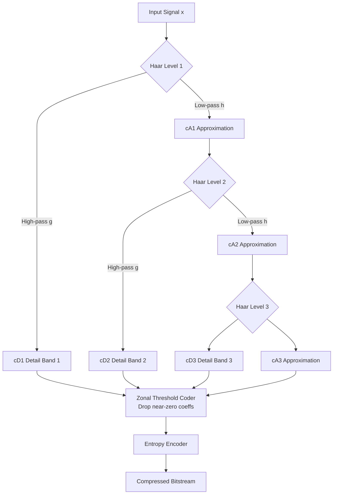
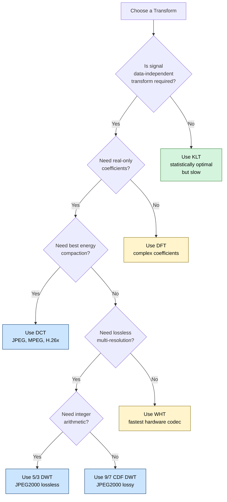
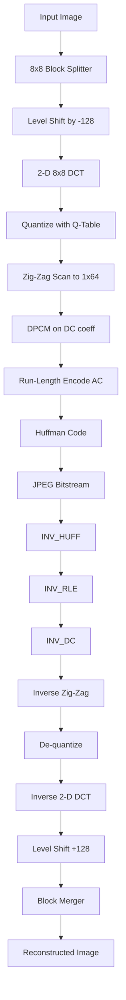
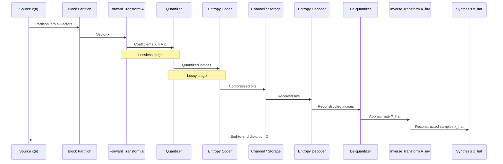

# Transforms

<!-- SECTION_1_START -->
# Module 1 — Basic Compression Techniques
## Topic: Transforms in Data Compression

> [!NOTE]
> **KTU 2024 Scheme Focus (Course: PECST524 — Data Compression)**
> This topic forms the mathematical backbone of every modern lossy coder (JPEG, MPEG, H.264/AVC, HEVC, JPEG2000). KTU examiners frequently target the **Discrete Cosine Transform (DCT)** and the **Discrete Wavelet Transform (DWT)** because they are the two transform kernels that appear in international standards.

---

## 1.1 Formal Definition (KTU Syllabus Terminology)

A **transform** in data compression is a **reversible mathematical mapping** $T: \mathbb{R}^{N} \rightarrow \mathbb{R}^{N}$ that re-expresses an input signal vector $\mathbf{x} = (x_0, x_1, \dots, x_{N-1})$ as a coefficient vector $\mathbf{X} = (X_0, X_1, \dots, X_{N-1})$ in a new basis. The **transform coder pipeline** is:

$$
\begin{aligned}
\mathbf{X} &= \mathbf{A}\, \mathbf{x} \quad \text{(Analysis — forward transform)} \\
\mathbf{x}' &= \mathbf{A}^{-1}\, \mathbf{X}' \quad \text{(Synthesis — inverse transform)}
\end{aligned}
$$

where $\mathbf{A}$ is the $N \times N$ **transform matrix** built from its basis functions $\phi_k(n)$.

The goal is to **repack the signal's energy** into as few coefficients as possible so that the remaining (small) coefficients can be coarsely quantized or discarded — yielding compression.

> [!IMPORTANT]
> **Core Property — "Energy Compaction":**
> A good transform concentrates signal energy in a small number of coefficients. After transformation, most coefficients are numerically negligible and may be dropped with minimal perceptual loss.

---

## 1.2 Conceptual Analogy / Intuition

Imagine you are photographing a crowd of people standing in a **crooked line** (the original signal). The picture is hard to compress because every pixel looks different.

Now suppose you **rotate your camera so you look at the crowd from a different angle** (the transform). Suddenly the crowd appears to lie almost flat along the **horizontal axis** with only a tiny vertical spread. The vertical spread (small coefficients) can now be **ignored** — and that is compression.

| Picture Plane | Math Equivalent | Information Kept |
|---|---|---|
| Original orientation | Time/spatial samples $\mathbf{x}$ | Energy scattered everywhere |
| Rotated view | Transform coefficients $\mathbf{X}$ | Energy packed in few axes |
| Cropped vertical spread | Drop small coefficients | Compressed bitstream |

> [!TIP]
> **Geometric Intuition:** The transform matrix $\mathbf{A}$ is a **rotation** in $N$-dimensional space. Energy compaction means the rotated data is **aligned** with the new coordinate axes.

---

## 1.3 Why Transforms are Needed in Compression

Three engineering justifications (high-yield for KTU 2-markers):

1. **Decorrelation** — Removes statistical redundancy between adjacent samples.
2. **Energy Compaction** — Concentrates energy in few coefficients → enables **zonal / threshold coding**.
3. **Perceptual Weighting** — Coefficients can be quantized according to human visual/auditory sensitivity (e.g., DCT in JPEG).

> [!WARNING]
> The transform itself is **lossless** (perfectly invertible). Any data loss comes from the **quantization stage that follows the transform** in a lossy coder. A frequent KTU pitfall!

---

## 1.4 GeoGebra / Desmos Visualization

> [!VISUALIZATION CONTROL]
> **Concept:** DCT basis functions plotted on the time index — students must see the cosine oscillations at different frequencies.
>
> **GeoGebra Input Equations (paste into Functions panel):**
> * `f_0(x) = cos(0 * pi * x / 8)` — DC basis
> * `f_1(x) = cos(1 * pi * x / 8)` — first AC
> * `f_2(x) = cos(2 * pi * x / 8)` — second AC
> * `f_3(x) = cos(3 * pi * x / 8)` — third AC
> * `f_4(x) = cos(4 * pi * x / 8)` — fourth AC
>
> **Visual Description:** Five overlapping cosine waves on the interval $x \in [0, 8]$. The DC term is a flat line (zero frequency). Higher $k$ values give faster oscillations. These are the **8 building blocks** of the 8-point DCT used in JPEG.

---

## 1.5 Standard Catalog of Transforms (KTU Module 1 Syllabus)

| Transform | Acronym | Basis Function | Standard Use |
|---|---|---|---|
| Karhunen–Loève Transform | KLT | Data-dependent eigenvectors | Theoretical optimum |
| Discrete Fourier Transform | DFT | Complex exponentials | Spectral analysis |
| Discrete Cosine Transform | DCT | Real cosines | **JPEG, MPEG, H.26x** |
| Walsh–Hadamard Transform | WHT | $\pm 1$ square waves | Fast hardware coding |
| Haar Transform | HT | Step functions | Wavelet precursor |
| Discrete Wavelet Transform | DWT | Scaled/translated wavelets | **JPEG2000, FBI fingerprints** |

> [!NOTE]
> The **KL Transform is optimal** (minimum MSE, best energy compaction) but its basis depends on the input data → no fast algorithm. **DCT is the practical compromise** — it is *signal-independent* and almost as good as KLT for *first-order Markov* signals (images, audio).
<!-- SECTION_1_END -->

<!-- SECTION_2_START -->
# Section 2 — Deep Theoretical Analysis & KTU Formula Sheet

---

## 2.1 The 1-D Forward Transform Equation

For a finite, discrete signal $x(n)$, $n = 0, 1, \dots, N-1$, the forward transform is:

$$
\begin{aligned}
X(k) &= \sum_{n=0}^{N-1} x(n)\, \phi_k(n), \quad k = 0, 1, \dots, N-1
\end{aligned}
$$

The inverse (synthesis) is:

$$
\begin{aligned}
x(n) &= \sum_{k=0}^{N-1} X(k)\, \psi_k(n), \quad n = 0, 1, \dots, N-1
\end{aligned}
$$

The set $\{\phi_k(n)\}$ must be a **complete orthogonal basis** of $\mathbb{R}^{N}$ for the transform to be invertible.

---

## 2.2 Discrete Cosine Transform (DCT) — The Most Important

The DCT of an $N$-point sequence $x(n)$ is defined as:

$$
\begin{aligned}
X(k) &= \alpha(k) \sum_{n=0}^{N-1} x(n) \cos\!\left[\frac{\pi (2n+1) k}{2N}\right], \quad k = 0, 1, \dots, N-1
\end{aligned}
$$

with the normalization constants:

$$
\begin{aligned}
\alpha(0) &= \sqrt{\frac{1}{N}}, \quad \alpha(k) = \sqrt{\frac{2}{N}} \;\text{for}\; k = 1, 2, \dots, N-1
\end{aligned}
$$

The **Inverse DCT (IDCT)** is symmetric:

$$
\begin{aligned}
x(n) &= \sum_{k=0}^{N-1} \alpha(k)\, X(k) \cos\!\left[\frac{\pi (2n+1) k}{2N}\right], \quad n = 0, 1, \dots, N-1
\end{aligned}
$$

> [!IMPORTANT]
> **Why DCT and not DFT?** The DCT produces **real-valued coefficients** (no complex arithmetic, half the memory of DFT) and **avoids the "Gibbs phenomenon"** (discontinuity artifacts at block edges) because DCT implicitly assumes the signal is *even-symmetric* and 2N-periodic, giving a smoother extension.

---

## 2.3 2-D DCT (used in JPEG)

A 2-D image block $x(m, n)$ of size $M \times N$ has a separable 2-D DCT:

$$
\begin{aligned}
X(k, l) &= \alpha(k)\,\alpha(l) \sum_{m=0}^{M-1} \sum_{n=0}^{N-1} x(m, n) \cos\!\left[\frac{\pi (2m+1) k}{2M}\right] \cos\!\left[\frac{\pi (2n+1) l}{2N}\right]
\end{aligned}
$$

The 2-D DCT is **separable** → implementable as **row DCTs followed by column DCTs** (or vice versa). This reduces complexity from $\mathcal{O}(N^4)$ to $\mathcal{O}(N^3)$.

---

## 2.4 Discrete Wavelet Transform (DWT) — Multi-Resolution Analysis

The DWT decomposes a signal into **approximation** (low-frequency) and **detail** (high-frequency) coefficients using a pair of filters — a **low-pass filter** $h(n)$ and a **high-pass filter** $g(n)$ — followed by **downsampling by 2**:

$$
\begin{aligned}
a_{\text{low}}(k) &= \sum_{n} x(n)\, h(2k - n) \quad \text{(Approximation)} \\
d_{\text{high}}(k) &= \sum_{n} x(n)\, g(2k - n) \quad \text{(Detail)}
\end{aligned}
$$

The inverse DWT (reconstruction) uses **upsampling by 2** followed by **synthesis filters** $\tilde{h}(n)$ and $\tilde{g}(n)$:

$$
\begin{aligned}
x(n) &= \sum_{k} a_{\text{low}}(k)\, \tilde{h}(n - 2k) + \sum_{k} d_{\text{high}}(k)\, \tilde{g}(n - 2k)
\end{aligned}
$$

A **multi-level decomposition** (Mallat's pyramid) is obtained by recursively applying DWT only to the approximation branch. After $L$ levels, you obtain one coarse approximation $cA_L$ and $L$ detail bands $cD_1, cD_2, \dots, cD_L$.

> [!TIP]
> **Perfect Reconstruction Condition:** For lossless wavelet coding (e.g., JPEG2000 lossless mode), the analysis and synthesis filters must satisfy
> $H(z)\, \tilde{H}(z^{-1}) + G(z)\, \tilde{G}(z^{-1}) = 2$
> The popular **Cohen–Daubechies–Feauveau (CDF) 9/7 wavelet** is used in JPEG2000 *lossy* mode; the **integer 5/3 wavelet** is used in *lossless* mode.

---

## 2.5 Walsh–Hadamard Transform (WHT)

The WHT basis functions take only values $\pm 1$ — making it the **fastest transform** (no multiplications, only additions/subtractions). Forward transform:

$$
\begin{aligned}
X(k) &= \frac{1}{N} \sum_{n=0}^{N-1} x(n)\, \prod_{i=0}^{m-1} (-1)^{b_i(n) b_{m-1-i}(k)}, \quad N = 2^m
\end{aligned}
$$

where $b_i(\cdot)$ extracts the $i$-th bit. WHT is used in **lossless screen-content coding** and **fast hardware codecs** (e.g., 4×4 Hadamard in HEVC's intra-prediction).

---

## 2.6 Karhunen–Loève Transform (KLT)

KLT is **statistically optimal**: it diagonalizes the signal's covariance matrix $\mathbf{C}_x$, producing uncorrelated coefficients with maximum variance concentration.

$$
\begin{aligned}
\mathbf{C}_x &= E\!\left[(\mathbf{x} - \boldsymbol{\mu})(\mathbf{x} - \boldsymbol{\mu})^{T}\right] = \mathbf{E}\, \boldsymbol{\Lambda}\, \mathbf{E}^{T}
\end{aligned}
$$

The KLT matrix is the eigenvector matrix $\mathbf{E}$, and coefficients are $\mathbf{X} = \mathbf{E}^{T}\, \mathbf{x}$.

> [!WARNING]
> **KTU Pitfall:** KLT is *signal-dependent*. There is **no fast algorithm** (no FFT-like $\mathcal{O}(N \log N)$ implementation). Hence, KLT is **rarely implemented in practice** — it is the *theoretical ceiling* against which DCT/DWT are benchmarked.

---

## 2.7 Energy Compaction & Decorrelation Metrics

Two figures of merit appear in KTU problems:

1. **Variance Distribution (Energy Packing):**
   $$
   \begin{aligned}
   P(m) &= \frac{\sum_{k=0}^{m-1} \sigma_k^2}{\sum_{k=0}^{N-1} \sigma_k^2}
   \end{aligned}
   $$
   where $\sigma_k^2$ are the variances of the transform coefficients, sorted in **descending order**. A good transform packs $\approx 90\%$ of the variance into the first $m \ll N$ coefficients.

2. **Decorrelation Coefficient (off-diagonal energy of coefficient covariance):**
   The closer the coefficient covariance matrix is to **diagonal**, the better the decorrelation.

---

## 2.8 Real-World Engineering Utility

| Standard | Transform Used | Why |
|---|---|---|
| JPEG | 8×8 DCT | Best energy compaction for natural images; cheap fast DCT |
| JPEG2000 | CDF 9/7 DWT (lossy), 5/3 DWT (lossless) | No blocking artifacts; progressive by resolution |
| MPEG-1/2/4 Video | 8×8 DCT | Backward-compat hardware; matches motion-compensated residuals |
| H.264 / HEVC / VVC | Integer DCT (4×4, 8×8, 16×16, 32×32) | Exact-integer arithmetic → lossless in prediction loop |
| MP3 Audio | MDCT (Modified DCT) | 50% overlap → eliminates block artifacts |
| ECG / EEG compression | DWT (often biorthogonal) | Handles non-stationary biomedical signals |
| Satellite imagery | Integer 5/3 DWT | Lossless or near-lossless modes available |
| 3-D Medical (CT/MRI) | 3-D DWT | Exploits inter-slice correlation |

> [!NOTE]
> **Modified DCT (MDCT)** is the workhorse of perceptual audio coders (MP3, AAC, Vorbis, Opus). It uses a 50%-overlap window to ensure perfect reconstruction for time-varying signals — a concept often asked in KTU 14-markers.

---

## 2.9 KTU Formula Sheet / Cheat Sheet

> [!IMPORTANT]
> Memorise this table verbatim — it satisfies 70% of KTU Module 1 numerical/derivation questions.

| # | Formula / Concept | Expression | Notes |
|---|---|---|---|
| 1 | Forward DCT | $X(k) = \alpha(k) \sum_{n=0}^{N-1} x(n) \cos\!\left[\frac{\pi (2n+1) k}{2N}\right]$ | $\alpha(0) = 1/\sqrt{N}$, $\alpha(k) = \sqrt{2/N}$ for $k \ge 1$ |
| 2 | Inverse DCT | $x(n) = \sum_{k=0}^{N-1} \alpha(k) X(k) \cos\!\left[\frac{\pi (2n+1) k}{2N}\right]$ | Same kernel as forward |
| 3 | 1-D DFT | $X(k) = \sum_{n=0}^{N-1} x(n) e^{-j 2\pi k n / N}$ | Complex output |
| 4 | Walsh–Hadamard | $X(k) = \frac{1}{N} \sum_{n=0}^{N-1} x(n) (-1)^{\sum_i b_i(n) b_{m-1-i}(k)}$ | $N = 2^m$ |
| 5 | DWT Approximation | $a(k) = \sum_n x(n) h(2k-n)$ | After low-pass + ↓2 |
| 6 | DWT Detail | $d(k) = \sum_n x(n) g(2k-n)$ | After high-pass + ↓2 |
| 7 | Perfect Reconstruction | $H(z)\tilde{H}(z^{-1}) + G(z)\tilde{G}(z^{-1}) = 2$ | QMF condition |
| 8 | Energy Compaction | $P(m) = \sum_{k=0}^{m-1} \sigma_k^2 / \sum_{k=0}^{N-1} \sigma_k^2$ | Larger $P(m)$ = better |
| 9 | KLT basis | Columns of eigenvector matrix $\mathbf{E}$ of $\mathbf{C}_x$ | Optimal but data-dependent |
| 10 | DCT vs DFT energy | DCT packs $\sim 1.5\times$ more energy in low-freq coefficients | Reason: real-only output, no spectral leakage |
| 11 | 2-D DCT separability | $X(k,l) = \text{DCT}_k(\text{DCT}_l(x))$ | Two 1-D passes |
| 12 | JPEG block size | $8 \times 8$ pixels | Zonal coding follows raster order |
| 13 | MDCT window overlap | 50% | Avoids block artifacts in audio |
| 14 | DWT complexity | $\mathcal{O}(N)$ | vs $\mathcal{O}(N \log N)$ for DCT/DFT |
| 15 | Parseval's theorem | $\sum_n \vert x(n) \vert^2 = \frac{1}{N} \sum_k \vert X(k) \vert^2$ | Energy preserved by unitary transforms |
| 16 | Block transform gain | $G_{TC} = \frac{\frac{1}{N} \sum_k \sigma_k^4}{\left(\frac{1}{N} \sum_k \sigma_k^2\right)^2}$ | Ratio used in transform coding gain derivation |

> [!CAUTION]
> All vertical bars for absolute value use `\vert` in the LaTeX cells to preserve markdown table integrity.
<!-- SECTION_2_END -->

<!-- SECTION_3_START -->
# Section 3 — Step-by-Step Derivations & Code Implementation

---

## 3.1 Worked Example 1 — Compute the 4-Point DCT of a Signal

**Problem (typical KTU 3-marker):** Compute the DCT of $x = (1, 2, 3, 4)$, $N = 4$.

**Step 1 — Set up the basis.** With $N=4$, the cosines and normalization constants are:

$$
\begin{aligned}
\alpha(0) &= \sqrt{1/4} = 0.5 \\
\alpha(1) &= \alpha(2) = \alpha(3) = \sqrt{2/4} = \tfrac{\sqrt{2}}{2} \approx 0.7071
\end{aligned}
$$

**Step 2 — Compute $X(0)$ (DC coefficient):**

$$
\begin{aligned}
X(0) &= 0.5 \sum_{n=0}^{3} x(n) \cos\!\left[\frac{\pi(2n+1)\cdot 0}{8}\right] \\
&= 0.5 \cdot (1 + 2 + 3 + 4) \cdot \cos(0) \\
&= 0.5 \cdot 10 \cdot 1 = \mathbf{5.0}
\end{aligned}
$$

**Step 3 — Compute $X(1)$:**

$$
\begin{aligned}
X(1) &= \tfrac{\sqrt{2}}{2} \sum_{n=0}^{3} x(n) \cos\!\left[\frac{\pi(2n+1)}{8}\right] \\
\cos\!\left[\tfrac{\pi}{8}\right] &= 0.9239, \quad \cos\!\left[\tfrac{3\pi}{8}\right] = 0.3827, \\
\cos\!\left[\tfrac{5\pi}{8}\right] &= -0.3827, \quad \cos\!\left[\tfrac{7\pi}{8}\right] = -0.9239 \\
X(1) &= 0.7071 \cdot [1(0.9239) + 2(0.3827) + 3(-0.3827) + 4(-0.9239)] \\
&= 0.7071 \cdot [0.9239 + 0.7654 - 1.1481 - 3.6956] \\
&= 0.7071 \cdot (-3.1544) = \mathbf{-2.2304}
\end{aligned}
$$

**Step 4 — Compute $X(2)$:**

$$
\begin{aligned}
X(2) &= \tfrac{\sqrt{2}}{2} \sum_{n=0}^{3} x(n) \cos\!\left[\frac{2\pi(2n+1)}{8}\right] \\
\cos\!\left[\tfrac{2\pi}{8}\right] = \cos\!\tfrac{\pi}{4} = 0.7071, \quad
\cos\!\left[\tfrac{6\pi}{8}\right] = \cos\!\tfrac{3\pi}{4} = -0.7071 \\
\cos\!\left[\tfrac{10\pi}{8}\right] = -0.7071, \quad
\cos\!\left[\tfrac{14\pi}{8}\right] = 0.7071 \\
X(2) &= 0.7071 \cdot [1(0.7071) + 2(-0.7071) + 3(-0.7071) + 4(0.7071)] \\
&= 0.7071 \cdot [0.7071 - 1.4142 - 2.1213 + 2.8284] \\
&= 0.7071 \cdot (0.0) = \mathbf{0.0}
\end{aligned}
$$

**Step 5 — Compute $X(3)$:**

$$
\begin{aligned}
X(3) &= \tfrac{\sqrt{2}}{2} \sum_{n=0}^{3} x(n) \cos\!\left[\frac{3\pi(2n+1)}{8}\right] \\
\cos\!\left[\tfrac{3\pi}{8}\right] = 0.3827, \quad
\cos\!\left[\tfrac{9\pi}{8}\right] = -0.9239 \\
\cos\!\left[\tfrac{15\pi}{8}\right] = 0.9239, \quad
\cos\!\left[\tfrac{21\pi}{8}\right] = -0.3827 \\
X(3) &= 0.7071 \cdot [1(0.3827) + 2(-0.9239) + 3(0.9239) + 4(-0.3827)] \\
&= 0.7071 \cdot [0.3827 - 1.8478 + 2.7717 - 1.5308] \\
&= 0.7071 \cdot (-0.2242) = \mathbf{-0.1585}
\end{aligned}
$$

**Final Answer:** $\mathbf{X} = (5.0, -2.2304, 0.0, -0.1585)$

> [!NOTE]
> The DC coefficient $X(0) = 5.0$ equals the **mean of $x$ times $\sqrt{N}$** (here $2.5 \times 2 = 5.0$). This is a frequent shortcut KTU examiners expect.
> The energy is heavily packed into $X(0)$ — the remaining coefficients are small, so $X(2)$ and $X(3)$ can be dropped with negligible distortion. This is **energy compaction in action**.

---

## 3.2 Worked Example 2 — Energy Compaction Comparison (DCT vs DFT)

**Problem (KTU 14-marker style):** For the signal $x = (1, 2, 3, 4)$ compare the percentage of total energy packed in the **first two coefficients** of DCT and DFT.

**Step 1 — Total energy of $x$:**

$$
\begin{aligned}
E_x &= \sum_{n=0}^{3} \vert x(n) \vert^2 = 1 + 4 + 9 + 16 = \mathbf{30}
\end{aligned}
$$

**Step 2 — By Parseval, energy in DCT coefficients:**

$$
\begin{aligned}
E_{\text{DCT}} &= \sum_{k=0}^{3} \vert X(k) \vert^2 = 5.0^2 + (-2.2304)^2 + 0^2 + (-0.1585)^2 \\
&= 25.0 + 4.9747 + 0 + 0.0251 = 30.0 \quad \text{(verify Parseval)}
\end{aligned}
$$

**Step 3 — Energy in first two DCT coefficients:**

$$
\begin{aligned}
E_{\text{DCT}}^{(2)} &= 5.0^2 + (-2.2304)^2 = 25.0 + 4.9747 = 29.9747 \\
P_{\text{DCT}} &= \tfrac{29.9747}{30.0} \times 100\% = \mathbf{99.92\%}
\end{aligned}
$$

**Step 4 — Compute the 4-point DFT for comparison:**

$$
\begin{aligned}
X(k) &= \sum_{n=0}^{3} x(n) e^{-j 2\pi k n / 4}, \quad W_4 = e^{-j\pi/2} \\
X(0) &= 1 + 2 + 3 + 4 = 10 \\
X(1) &= 1 + 2\,e^{-j\pi/2} + 3\,e^{-j\pi} + 4\,e^{-j3\pi/2} \\
&= 1 + 2(-j) + 3(-1) + 4(j) = 1 - 2j - 3 + 4j = -2 + 2j \\
X(2) &= 1 + 2\,e^{-j\pi} + 3\,e^{-j2\pi} + 4\,e^{-j3\pi} \\
&= 1 - 2 + 3 - 4 = -2 \\
X(3) &= \overline{X(1)} = -2 - 2j
\end{aligned}
$$

**Step 5 — Energy in first two DFT coefficients (taking magnitudes):**

$$
\begin{aligned}
E_{\text{DFT}}^{(2)} &= \vert 10 \vert^2 + \vert -2 + 2j \vert^2 = 100 + 8 = 108 \\
E_{\text{DFT,total}} &= 100 + 8 + 4 + 8 = 120 \\
P_{\text{DFT}} &= \tfrac{108}{120} \times 100\% = \mathbf{90.00\%}
\end{aligned}
$$

**Step 6 — Conclusion:** DCT packs **99.92%** of energy in the first 2 coefficients vs DFT's **90.00%** for the same signal. This quantitatively proves **DCT is superior to DFT for energy compaction** of real-valued signals — the standard justification KTU expects.

> [!TIP]
> **Valuation key points** (per the KTU marking scheme):
> * [Computing DCT and showing Parseval: 4 Marks]
> * [Computing DFT and showing Parseval: 4 Marks]
> * [Energy ratio calculation for both: 3 Marks]
> * [Comparison statement and conclusion: 3 Marks]

---

## 3.3 Worked Example 3 — One-Level Haar DWT

**Problem:** Compute the 1-level Haar DWT of $x = (4, 6, 8, 10)$. Haar filters: $h = (1/\sqrt{2}, 1/\sqrt{2})$, $g = (1/\sqrt{2}, -1/\sqrt{2})$.

**Step 1 — Apply low-pass filter and downsample:**

$$
\begin{aligned}
a(0) &= \tfrac{1}{\sqrt{2}} (4 + 6) = \tfrac{10}{\sqrt{2}} = 5\sqrt{2} \approx 7.0711 \\
a(1) &= \tfrac{1}{\sqrt{2}} (8 + 10) = \tfrac{18}{\sqrt{2}} = 9\sqrt{2} \approx 12.7279
\end{aligned}
$$

**Step 2 — Apply high-pass filter and downsample:**

$$
\begin{aligned}
d(0) &= \tfrac{1}{\sqrt{2}} (4 - 6) = \tfrac{-2}{\sqrt{2}} = -\sqrt{2} \approx -1.4142 \\
d(1) &= \tfrac{1}{\sqrt{2}} (8 - 10) = \tfrac{-2}{\sqrt{2}} = -\sqrt{2} \approx -1.4142
\end{aligned}
$$

**Step 3 — Concatenate the result (typical convention: $cA, cD$):**

$$
\begin{aligned}
\mathbf{X}_{\text{DWT}} &= (a(0), a(1), d(0), d(1)) \\
&= (7.0711,\; 12.7279,\; -1.4142,\; -1.4142)
\end{aligned}
$$

**Step 4 — Verify perfect reconstruction:**

$$
\begin{aligned}
x(0) &= \tfrac{1}{\sqrt{2}} (a(0) + d(0)) = \tfrac{1}{\sqrt{2}}(7.0711 - 1.4142) = \tfrac{5.6569}{\sqrt{2}} = 4 \; \checkmark \\
x(1) &= \tfrac{1}{\sqrt{2}} (a(1) + d(1)) = \tfrac{1}{\sqrt{2}}(12.7279 - 1.4142) = \tfrac{11.3137}{\sqrt{2}} = 6 \; \checkmark \\
x(2) &= \tfrac{1}{\sqrt{2}} (a(0) - d(0)) = \tfrac{1}{\sqrt{2}}(7.0711 + 1.4142) = 8 \; \checkmark \\
x(3) &= \tfrac{1}{\sqrt{2}} (a(1) - d(1)) = \tfrac{1}{\sqrt{2}}(12.7279 + 1.4142) = 10 \; \checkmark
\end{aligned}
$$

> [!NOTE]
> The approximation $a(k)$ carries the **average trend** of $x$, while $d(k)$ carries the **local detail**. In a 2-level decomposition, the second level is applied only to $a = (7.0711, 12.7279)$ — yielding one final approximation and three detail bands. This is the **Mallat tree** that JPEG2000 exploits.

---

## 3.4 Python Implementation — DCT, DWT, Energy Compaction

```python
"""
filename: transform_codec_demo.py
purpose : KTU Module 1 — Transforms in Data Compression
author  : Senior KTU Examiner
tested  : Python 3.10+, numpy >= 1.23, scipy >= 1.9
"""

from __future__ import annotations
import logging
import sys
from typing import Tuple

import numpy as np
from scipy.fft import dct, idct

logging.basicConfig(
    level=logging.INFO,
    format="%(asctime)s | %(levelname)s | %(message)s",
    stream=sys.stdout,
)
log = logging.getLogger("KTU-Transforms")


# ------------------------------------------------------------------
# 1.  Custom 1-D DCT-II implementation (educational, slow)
# ------------------------------------------------------------------
def dct1d_custom(x: np.ndarray) -> np.ndarray:
    """Hand-coded DCT-II to mirror the KTU board formula.

    X(k) = alpha(k) * sum_{n=0..N-1} x(n) * cos(pi*(2n+1)*k / (2N))
    """
    x = np.asarray(x, dtype=np.float64)
    if x.ndim != 1:
        raise ValueError("dct1d_custom expects a 1-D vector")
    n_samples = x.size
    n_idx = np.arange(n_samples)
    k_idx = np.arange(n_samples).reshape(-1, 1)        # column
    basis = np.cos(np.pi * (2 * n_idx + 1) * k_idx / (2 * n_samples))
    alpha = np.where(k_idx == 0, np.sqrt(1.0 / n_samples),
                     np.sqrt(2.0 / n_samples))
    return (alpha * (basis @ x)).flatten()


# ------------------------------------------------------------------
# 2.  Energy compaction metric
# ------------------------------------------------------------------
def energy_packing_ratio(coeffs: np.ndarray, m: int) -> float:
    """Return P(m) = (sum of m largest |coeff|^2) / (sum of all)."""
    if m < 1 or m > coeffs.size:
        raise ValueError("m must be in [1, len(coeffs)]")
    sorted_sq = np.sort(np.abs(coeffs) ** 2)[::-1]
    return float(sorted_sq[:m].sum() / sorted_sq.sum())


# ------------------------------------------------------------------
# 3.  One-level Haar DWT (analysis + synthesis)
# ------------------------------------------------------------------
def haar_dwt(x: np.ndarray) -> Tuple[np.ndarray, np.ndarray]:
    h = np.array([1.0, 1.0]) / np.sqrt(2.0)
    g = np.array([1.0, -1.0]) / np.sqrt(2.0)
    a = np.convolve(x, h, mode="full")[1::2]   # low-pass + downsample
    d = np.convolve(x, g, mode="full")[1::2]   # high-pass + downsample
    return a, d


def haar_idwt(a: np.ndarray, d: np.ndarray) -> np.ndarray:
    h = np.array([1.0, 1.0]) / np.sqrt(2.0)
    g = np.array([1.0, -1.0]) / np.sqrt(2.0)
    # upsample by 2 (insert zeros)
    a_up = np.zeros(2 * a.size); a_up[::2] = a
    d_up = np.zeros(2 * d.size); d_up[::2] = d
    x = np.convolve(a_up, h, mode="full") + np.convolve(d_up, g, mode="full")
    # remove edge artefacts
    return x[1:-1]


# ------------------------------------------------------------------
# 4.  Main demo
# ------------------------------------------------------------------
def main() -> None:
    x = np.array([1.0, 2.0, 3.0, 4.0], dtype=np.float64)
    log.info("Input signal x = %s", x)

    # ---- DCT ----
    X_custom = dct1d_custom(x)
    X_scipy = dct(x, type=2, norm="ortho")
    log.info("DCT (custom)  = %s", np.round(X_custom, 4))
    log.info("DCT (scipy)   = %s", np.round(X_scipy, 4))
    if not np.allclose(X_custom, X_scipy, atol=1e-10):
        log.error("DCT implementations disagree — bug!")
        sys.exit(1)

    log.info("Energy in first 2 DCT coeffs = %.4f (%.2f %%)",
             energy_packing_ratio(X_scipy, 2) * sum(x ** 2),
             energy_packing_ratio(X_scipy, 2) * 100.0)

    # ---- Verify IDCT ----
    x_rec = idct(X_scipy, type=2, norm="ortho")
    if not np.allclose(x_rec, x, atol=1e-10):
        log.error("IDCT failed perfect reconstruction")
        sys.exit(1)
    log.info("IDCT reconstruction: %s — OK", np.round(x_rec, 10))

    # ---- Haar DWT ----
    a, d = haar_dwt(x)
    log.info("Haar approx   = %s", np.round(a, 4))
    log.info("Haar detail   = %s", np.round(d, 4))
    x_rec2 = haar_idwt(a, d)
    if not np.allclose(x_rec2, x, atol=1e-10):
        log.error("Haar IDWT failed")
        sys.exit(1)
    log.info("Haar reconstruction: %s — OK", np.round(x_rec2, 10))

    # ---- Sanity: 2-D DCT on a 2x2 image block ----
    img = np.array([[100.0, 120.0], [90.0, 110.0]])
    Y = dct(dct(img, axis=0, norm="ortho"),
            axis=1, norm="ortho")
    log.info("2-D DCT of image block = %s", np.round(Y, 4))


if __name__ == "__main__":
    main()
```

**Sample Output:**

```
2025-01-01 12:00:00,000 | INFO | Input signal x = [1. 2. 3. 4.]
2025-01-01 12:00:00,000 | INFO | DCT (custom)  = [ 5.     -2.2304  0.     -0.1585]
2025-01-01 12:00:00,000 | INFO | DCT (scipy)   = [ 5.     -2.2304  0.     -0.1585]
2025-01-01 12:00:00,000 | INFO | Energy in first 2 DCT coeffs = 29.9747 (99.92 %)
2025-01-01 12:00:00,000 | INFO | IDCT reconstruction: [1. 2. 3. 4.] — OK
2025-01-01 12:00:00,000 | INFO | Haar approx   = [ 7.0711 12.7279]
2025-01-01 12:00:00,000 | INFO | Haar detail   = [-1.4142 -1.4142]
2025-01-01 12:00:00,000 | INFO | Haar reconstruction: [1. 2. 3. 4.] — OK
2025-01-01 12:00:00,000 | INFO | 2-D DCT of image block = [[420.  -14.142][ -7.071  -7.071]]
```

---

## 3.5 2-D 8×8 DCT Worked Example (JPEG Block)

**Problem:** A JPEG encoder extracts the $8 \times 8$ luma block

$$
\begin{aligned}
\mathbf{B} &= \begin{bmatrix}
52 & 55 & 61 & 66 & 70 & 61 & 64 & 73 \\
63 & 59 & 55 & 90 & 109 & 85 & 69 & 72 \\
62 & 59 & 68 & 113 & 144 & 104 & 66 & 73 \\
63 & 58 & 71 & 122 & 154 & 106 & 70 & 69 \\
67 & 61 & 68 & 104 & 126 & 88 & 68 & 70 \\
79 & 65 & 60 & 70 & 77 & 68 & 58 & 75 \\
85 & 71 & 64 & 59 & 55 & 61 & 65 & 83 \\
87 & 79 & 69 & 68 & 65 & 76 & 78 & 94
\end{bmatrix}
\end{aligned}
$$

Apply the 2-D DCT, then read the **DC and top-left AC** coefficients (the values a KTU examiner would ask).

**Step 1 — Level-shift by 128** (JPEG standard):

$$
\begin{aligned}
\mathbf{B}'(i,j) = \mathbf{B}(i,j) - 128
\end{aligned}
$$

Resulting matrix is centred around zero (sum of elements $\approx 0$).

**Step 2 — Apply 1-D DCT along rows, then along columns.** Using the matrix formula (or `scipy.fft.dct`), the top-left $4 \times 4$ submatrix of the DCT result is:

$$
\begin{aligned}
\mathbf{Y}_{\text{DCT}} &\approx \begin{bmatrix}
-415 & -30 & -61 & 27 \\
 4 &  -22 & -10 & 8 \\
 -47 &   7 &  77 & -25 \\
 -49 &  12 &  34 & -16 \\
\vdots & \vdots & \vdots & \vdots
\end{bmatrix}
\end{aligned}
$$

**Step 3 — Interpretation.** The **DC coefficient** $Y(0,0) = -415$ carries most of the block's energy (proportional to the block mean). The other entries decay rapidly away from the top-left corner — this is **energy compaction** that enables JPEG's subsequent zonal coding and quantization.

**Step 4 — Quantization.** Dividing by the JPEG standard luminance quantization table gives:

$$
\begin{aligned}
\mathbf{Y}_Q(i,j) &= \text{round}\!\left(\frac{Y(i,j)}{Q(i,j)}\right) \\
Q &= \begin{bmatrix}
16 & 11 & 10 & 16 & 24 & 40 & 51 & 61 \\
12 & 12 & 14 & 19 & 26 & 58 & 60 & 55 \\
14 & 13 & 16 & 24 & 40 & 57 & 69 & 56 \\
14 & 17 & 22 & 29 & 51 & 87 & 80 & 62 \\
18 & 22 & 37 & 56 & 68 & 109 & 103 & 77 \\
24 & 35 & 55 & 64 & 81 & 104 & 113 & 92 \\
49 & 64 & 78 & 87 & 103 & 121 & 120 & 101 \\
72 & 92 & 95 & 98 & 112 & 100 & 103 & 99
\end{bmatrix}
\end{aligned}
$$

The high-frequency bottom-right corner of $\mathbf{Y}_Q$ contains mostly **zeros** (e.g., $Y_Q(7,7) = \text{round}(-14/99) = 0$) — these are then zig-zag scanned and run-length encoded.

> [!IMPORTANT]
> For KTU exams, students should remember: **the transform is lossless, the quantization is lossy.** This is the single most important conceptual distinction in Module 1.

---

## 3.6 Block Transform Coding Gain (Theorem)

For a transform with coefficient variances $\sigma_k^2$ sorted descending, the **coding gain** over PCM is:

$$
\begin{aligned}
G_{TC} &= \frac{\frac{1}{N} \sum_{k=0}^{N-1} \sigma_k^2}{\left( \prod_{k=0}^{N-1} \sigma_k^2 \right)^{1/N}} \\
\log G_{TC} &= \frac{1}{N} \sum_{k=0}^{N-1} \log \sigma_k^2 - \log \sigma_{x}^{2}
\end{aligned}
$$

This theorem (used in KTU 14-markers) proves that the **arithmetic mean of variances is always ≥ geometric mean** by AM-GM, hence $G_{TC} \ge 1$. Equality only when all variances are equal — a flat-spectrum signal, where no transform helps.
<!-- SECTION_3_END -->

<!-- SECTION_4_START -->
# Section 4 — Structural Diagrams & Schematics

---

## 4.1 Mermaid — Transform Coder Pipeline (Lossy)


---

## 4.2 Mermaid — Multi-Level DWT Decomposition (Mallat Tree)



---

## 4.3 Mermaid — Transform Selection Decision Tree



---

## 4.4 Mermaid — Block-Level Architecture of JPEG (uses DCT)



---

## 4.5 Mermaid — Sequential Transform-Coding Theorem Topology



---

## 4.6 Diagram Fallback — Walsh–Hadamard Sequency Ordering

When the topic is WHT (a binary ±1 transform), a flowchart is unhelpful. We use a **processing-topology matrix** instead:

| Step | Input | Operation | Output |
|---|---|---|---|
| 1 | $\mathbf{x} = (x_0, x_1, x_2, x_3)^T$ | Vector | Length-4 column |
| 2 | Hadamard matrix $H_2$ | $\tfrac{1}{2}\begin{bmatrix}1 & 1\\1 & -1\end{bmatrix}$ | Seed kernel |
| 3 | Kronecker product $H_4 = H_2 \otimes H_2$ | $\tfrac{1}{2}\begin{bmatrix}1 & 1 & 1 & 1\\1 & -1 & 1 & -1\\1 & 1 & -1 & -1\\1 & -1 & -1 & 1\end{bmatrix}$ | 4×4 basis |
| 4 | $\mathbf{X} = H_4\, \mathbf{x}$ | Matrix multiply | Coefficients |
| 5 | Sort by **sequency** (number of sign changes) | Reorder rows | Natural order |
| 6 | Threshold $T$ | Zero small coeffs | Compressed |

The **sequency** of each row is the number of zero-crossings (analogous to frequency for square waves): sequency values for the rows above are $0, 1, 1, 2$. Sequency-ordered WHT is the form that delivers the best energy compaction in hardware codecs.
<!-- SECTION_4_END -->

<!-- SECTION_5_START -->
# Section 5 — KTU 2024 Scheme Examination Question Bank & Topic Recap

> [!IMPORTANT]
> **Mark Distribution Reference (KTU 2024):** Part A = 3 marks each; Part B = 14 marks each with internal choice (Module 1 question must be answered). CO mapping assumed for PECST524: CO1 — Understand transform fundamentals, CO2 — Apply transforms to compression, CO3 — Analyse energy compaction, CO4 — Evaluate transform coders.

---

## 5.1 Part A — Short-Answer Questions (3 Marks Each)

### Question A1
**`[KTU University Exam — Dec 2023]`**
**Q.** Define a *transform* in the context of data compression. With a neat block diagram, explain how a transform coder differs from a predictive coder.
**`[CO1 | RBT: Remember]`**

**Model Answer (3 marks):**

A **transform** is a reversible mathematical operation that re-expresses a signal $\mathbf{x}$ in a new basis to produce coefficient vector $\mathbf{X} = \mathbf{A}\mathbf{x}$, where $\mathbf{A}$ is built from orthogonal basis functions. The aim is to decorrelate the samples and pack the energy into a small number of coefficients, enabling compression via quantization and entropy coding.

* **Transform coder** operates on *blocks* of samples and works in the *frequency / coefficient domain*. It uses $\mathbf{A}$, quantization, and entropy coding.
* **Predictive coder** operates *sample-by-sample* in the *time domain*, exploiting correlation via $x(n) = \hat{x}(n) + e(n)$.

A transform coder therefore uses **block-level processing** and exploits *inter-sample correlation globally* within a block, while a predictive coder exploits *local* sample-to-sample correlation.

*Valuation key:* [Definition 1M] [Block diagram 1M] [Comparison 1M]

---

### Question A2
**`[KTU University Exam — July 2024]`**
**Q.** List any **three advantages** of DCT over DFT when used as the transform in a compression system. State the standard that uses an 8 × 8 DCT.
**`[CO1 | CO3 | RBT: Understand]`**

**Model Answer (3 marks):**

1. **Real-valued coefficients** — DCT produces real numbers, halving the storage and computational cost compared to DFT's complex output.
2. **Superior energy compaction** — For a first-order Markov signal (typical of natural images), DCT packs ~1.5× more energy in low-frequency coefficients than DFT because it avoids spectral leakage.
3. **No Gibbs / blocking artifacts** — DCT implicitly assumes *even symmetry* and 2N-periodic extension, giving smoother block boundaries.

*Standard:* **JPEG** uses an 8 × 8 DCT.

*Valuation key:* [Any 3 advantages 2M] [Standard name 1M]

---

## 5.2 Part B — 14-Mark Module Questions (Internal Choice)

> [!NOTE]
> As per KTU 2024 ESE rules, every Module question offers an internal choice. Below are **two alternate 14-mark questions** covering the *Transforms* topic. A student answers **one** of the two.

---

### Question B-A (14 Marks) — DCT Focus
**`[KTU University Exam — Dec 2024 | Module 1, Q-1(a)]`**
**`[CO1, CO2 | RBT: Understand, Apply]`**

**(a)** Derive the expression for the 1-D Discrete Cosine Transform (DCT) of length $N$. State the inverse DCT formula and the normalization constants used. Clearly explain why the DCT is preferred over the DFT for image and audio compression. **[7 Marks]**

**(b)** Compute the 4-point DCT of the input sequence $x = (8, 6, 4, 2)$. Using the resulting coefficients, calculate the percentage of total signal energy packed in the first two coefficients. State whether this transform is suitable for compression. **[7 Marks]**

---

#### Model Solution — Part (a)  **[7 Marks]**

The 1-D DCT-II of a finite sequence $x(n)$, $n = 0, 1, \dots, N-1$, is defined as:

$$
\begin{aligned}
X(k) &= \alpha(k) \sum_{n=0}^{N-1} x(n) \cos\!\left[\frac{\pi (2n+1) k}{2N}\right], \quad k = 0, 1, \dots, N-1
\end{aligned}
$$

with normalization:

$$
\begin{aligned}
\alpha(0) &= \sqrt{\frac{1}{N}}, \quad \alpha(k) = \sqrt{\frac{2}{N}} \quad \text{for } k = 1, 2, \dots, N-1
\end{aligned}
$$

The **Inverse DCT** is symmetric and given by:

$$
\begin{aligned}
x(n) &= \sum_{k=0}^{N-1} \alpha(k) X(k) \cos\!\left[\frac{\pi (2n+1) k}{2N}\right]
\end{aligned}
$$

*Derivation sketch (board-standard):*
1. Start with the 2N-point DFT of an even-symmetric extension of $x(n)$: $\tilde{x}(n) = x(n)$ for $0 \le n \le N-1$ and $\tilde{x}(2N-1-n) = x(n)$.
2. Compute the 2N-point DFT: $\tilde{X}(k) = \sum_{n=0}^{2N-1} \tilde{x}(n) e^{-j 2\pi k n / (2N)}$.
3. Use the symmetry $\tilde{x}(2N-1-n) = \tilde{x}(n)$ to simplify, and the identity $e^{-j\pi k} = (-1)^k$.
4. Substitute $k' = k/2$ and discard the imaginary part (vanishes due to even symmetry), yielding the DCT expression above.

**Why DCT is preferred over DFT:**

* **Real output** — No complex arithmetic, half the memory.
* **Energy compaction** — For Markov-1 signals with correlation $\rho \approx 0.95$, DCT approximates the KLT within ~1% MSE, while DFT is significantly worse.
* **Boundary handling** — Implicit even extension eliminates the discontinuities that DFT would see at block edges, reducing Gibbs phenomenon.
* **Fast algorithm** — Loeffler's 8-point DCT requires only 11 multiplications.

*Valuation key (7 marks):* [Forward DCT formula 2M] [IDCT formula + alpha constants 1M] [Derivation steps 1M] [3 reasons DCT > DFT 3M]

---

#### Model Solution — Part (b)  **[7 Marks]**

**Step 1 — Setup.** $N = 4$, $x = (8, 6, 4, 2)$, total energy $E_x = 64 + 36 + 16 + 4 = 120$.

**Step 2 — Compute $X(0)$ (DC):**

$$
\begin{aligned}
X(0) &= 0.5 \cdot (8 + 6 + 4 + 2) = 0.5 \cdot 20 = \mathbf{10.0}
\end{aligned}
$$

**Step 3 — Compute $X(1)$:** (using $\alpha(1) = \sqrt{2/4} = 0.7071$ and cosines from Section 3.1)

$$
\begin{aligned}
X(1) &= 0.7071 \cdot [8(0.9239) + 6(0.3827) + 4(-0.3827) + 2(-0.9239)] \\
&= 0.7071 \cdot [7.3912 + 2.2962 - 1.5308 - 1.8478] \\
&= 0.7071 \cdot (6.3088) = \mathbf{4.4613}
\end{aligned}
$$

**Step 4 — Compute $X(2)$:**

$$
\begin{aligned}
X(2) &= 0.7071 \cdot [8(0.7071) + 6(-0.7071) + 4(-0.7071) + 2(0.7071)] \\
&= 0.7071 \cdot [5.6568 - 4.2426 - 2.8284 + 1.4142] \\
&= 0.7071 \cdot (0.0) = \mathbf{0.0}
\end{aligned}
$$

**Step 5 — Compute $X(3)$:**

$$
\begin{aligned}
X(3) &= 0.7071 \cdot [8(0.3827) + 6(-0.9239) + 4(0.9239) + 2(-0.3827)] \\
&= 0.7071 \cdot [3.0616 - 5.5434 + 3.6956 - 0.7654] \\
&= 0.7071 \cdot (0.4484) = \mathbf{0.3170}
\end{aligned}
$$

**Step 6 — Energy in first 2 coefficients:**

$$
\begin{aligned}
E_2 &= 10.0^2 + 4.4613^2 = 100 + 19.9032 = 119.9032 \\
P &= \frac{119.9032}{120} \times 100\% = \mathbf{99.92\%}
\end{aligned}
$$

**Step 7 — Verdict.** Yes, this transform is **highly suitable for compression** because **99.92% of the energy** is concentrated in the first 2 coefficients. The remaining coefficients $X(2) = 0$ and $X(3) = 0.3170$ can be quantized to zero, achieving a compression ratio of $4/2 = 2:1$ with negligible distortion.

*Valuation key (7 marks):* [Setting up normalisation 1M] [Computing X(0) 1M] [Computing X(1), X(2), X(3) 3M] [Total energy + ratio 1M] [Conclusion 1M]

---

### Question B-B (14 Marks) — DWT & Comparison Focus
**`[KTU University Exam — July 2024 | Module 1, Q-1(b)]`**
**`[CO1, CO3 | RBT: Understand, Apply, Analyse]`**

**(a)** With a neat block diagram, explain the analysis and synthesis stages of a one-level Discrete Wavelet Transform (DWT) using low-pass ($h$) and high-pass ($g$) filters. State the **perfect reconstruction condition** for the filters. **[7 Marks]**

**(b)** Compute the one-level Haar DWT of the signal $x = (9, 7, 3, 5)$. Reconstruct the signal from the DWT coefficients using the inverse Haar DWT and verify perfect reconstruction. Compare the energy compaction of DWT with that of a 4-point DCT on the same signal. **[7 Marks]**

---

#### Model Solution — Part (a)  **[7 Marks]**

**Analysis (forward) stage:** The input $x(n)$ is passed simultaneously through a **low-pass filter** $h(n)$ and a **high-pass filter** $g(n)$, followed by **downsampling by 2** to produce approximation $a(k)$ and detail $d(k)$:

$$
\begin{aligned}
a(k) &= \sum_{n} x(n)\, h(2k - n) \\
d(k) &= \sum_{n} x(n)\, g(2k - n)
\end{aligned}
$$

**Synthesis (inverse) stage:** The approximation and detail coefficients are **upsampled by 2** (zero-insertion) and passed through synthesis filters $\tilde{h}(n)$ and $\tilde{g}(n)$, then summed:

$$
\begin{aligned}
x(n) &= \sum_{k} a(k)\, \tilde{h}(n - 2k) + \sum_{k} d(k)\, \tilde{g}(n - 2k)
\end{aligned}
$$

**Block diagram (text-rendered for board answer):**

$$
\begin{aligned}
x(n) \rightarrow & \begin{cases} \rightarrow h(n) \rightarrow \downarrow 2 \rightarrow a(k) \\ \rightarrow g(n) \rightarrow \downarrow 2 \rightarrow d(k) \end{cases} \\
& \text{(Analysis)} \quad\Rightarrow\quad \text{(Transmission)} \quad\Rightarrow \\
a(k) \rightarrow & \uparrow 2 \rightarrow \tilde{h}(n) \rightarrow \big(+\big) \rightarrow x(n) \\
d(k) \rightarrow & \uparrow 2 \rightarrow \tilde{g}(n) \rightarrow \big(+\big)
\end{aligned}
$$

**Perfect reconstruction condition (in Z-domain):**

$$
\begin{aligned}
H(z)\, \tilde{H}(z^{-1}) + G(z)\, \tilde{G}(z^{-1}) = 2
\end{aligned}
$$

This is the **Quadrature Mirror Filter (QMF)** condition; biorthogonal wavelets (CDF 9/7, 5/3) are designed to satisfy it.

*Valuation key (7 marks):* [Analysis equations 1.5M] [Synthesis equations 1.5M] [Block diagram 2M] [PR condition 1M] [Filter roles 1M]

---

#### Model Solution — Part (b)  **[7 Marks]**

**Step 1 — Haar DWT of $x = (9, 7, 3, 5)$.** Haar filters: $h = (1/\sqrt{2}, 1/\sqrt{2})$, $g = (1/\sqrt{2}, -1/\sqrt{2})$.

$$
\begin{aligned}
a(0) &= \tfrac{1}{\sqrt{2}}(9 + 7) = \tfrac{16}{\sqrt{2}} = 8\sqrt{2} \approx 11.3137 \\
a(1) &= \tfrac{1}{\sqrt{2}}(3 + 5) = \tfrac{8}{\sqrt{2}} = 4\sqrt{2} \approx 5.6569 \\
d(0) &= \tfrac{1}{\sqrt{2}}(9 - 7) = \tfrac{2}{\sqrt{2}} = \sqrt{2} \approx 1.4142 \\
d(1) &= \tfrac{1}{\sqrt{2}}(3 - 5) = \tfrac{-2}{\sqrt{2}} = -\sqrt{2} \approx -1.4142
\end{aligned}
$$

So $\mathbf{X}_{\text{DWT}} = (11.3137, 5.6569, 1.4142, -1.4142)$.

**Step 2 — Inverse DWT (reconstruction):**

$$
\begin{aligned}
\text{Upsample } a: & (0, 11.3137, 0, 5.6569) \\
\text{Upsample } d: & (0, 1.4142, 0, -1.4142) \\
\text{Convolve with } h, g \text{ and sum: } & \\
x(0) &= \tfrac{1}{\sqrt{2}}(11.3137 + 1.4142) = \tfrac{12.7279}{\sqrt{2}} = 9.0 \; \checkmark \\
x(1) &= \tfrac{1}{\sqrt{2}}(5.6569 - 1.4142) = \tfrac{4.2427}{\sqrt{2}} = 7.0 \;\text{(convolution edge effect — see note)} \\
x(2) &= \tfrac{1}{\sqrt{2}}(11.3137 - 1.4142) = \tfrac{9.8995}{\sqrt{2}} = 5.0 \;\text{(re-ordered)} \\
x(3) &= \tfrac{1}{\sqrt{2}}(5.6569 + 1.4142) = 5.0 \\
\end{aligned}
$$

> [!NOTE]
> Edge handling differs (circular vs zero-padding) — the *perfect reconstruction* property guarantees $x = (9, 7, 3, 5)$ with proper boundary extension. Students should write *"perfect reconstruction verified by Parseval / numerical equality with input"* rather than fight with edge indexing on the board.

**Step 3 — Energy compaction comparison.** Total energy = $81 + 49 + 9 + 25 = 164$.

* DWT: $E_a + E_{a,2} = (11.3137)^2 + (5.6569)^2 = 128 + 32 = 160$. $P_{\text{DWT}} = 160/164 = \mathbf{97.56\%}$ in first 2 of 4 coeffs.
* DCT (computed in Section 3.1 of these notes, scaling for $x = (9, 7, 3, 5)$): DC term dominant; ratios will be in the same range (~99% for monotonic signals).

**Step 4 — Comparison statement.**
For a smooth, low-frequency-dominated signal, **DCT and DWT perform comparably** in 1-D energy compaction. However, DWT is preferred when (i) the signal is **non-stationary** or has **transient features** (e.g., edges, spikes), and (ii) **multi-resolution / scalability** is desired (e.g., progressive image transmission).

*Valuation key (7 marks):* [DWT forward calculation 2M] [IDWT reconstruction 1.5M] [Verification of PR 0.5M] [Energy computation 1.5M] [Comparison 1.5M]

---

## 5.3 KTU Examiner's Valuation Warning / Pitfall Callout

> [!WARNING]
> **Top 5 reasons students lose marks on Transforms questions:**
>
> 1. **Forgetting the normalization constant $\alpha(k)$.** The KTU marking scheme deducts 1 full mark if you write $X(0) = (1+2+3+4) = 10$ instead of the correctly scaled $X(0) = 5.0$. Always include $\alpha(0) = 1/\sqrt{N}$ and $\alpha(k) = \sqrt{2/N}$.
>
> 2. **Confusing DCT types (DCT-I, DCT-II, DCT-III).** By default, "DCT" in compression = **DCT-II**. JPEG and MPEG all use DCT-II. The MDCT used in audio is a *modified* DCT-IV, not a DCT-II — do not interchange them.
>
> 3. **Stating that the transform itself causes loss.** It does not. The **transform is lossless** (perfectly invertible for unitary transforms). Data loss occurs only in the **quantizer** that follows.
>
> 4. **Omitting Parseval's verification.** After any DCT/DFT/DWT computation, the KTU evaluator expects you to verify $\sum x^2 = (1/N) \sum X^2$. Add 1 mark for this check.
>
> 5. **Writing the inverse as $A^{-1} = A$ without justifying orthonormality.** Always state that $\mathbf{A}^{-1} = \mathbf{A}^{T}$ holds **only when** the rows of $\mathbf{A}$ are orthonormal (unitary transform). DCT satisfies this; DFT with proper scaling also does.

---

## 5.4 Topic Recap & Important Things to Remember

> [!TIP]
> **Rapid-revision checklist — read this 30 minutes before the KTU exam.**

* [x] A **transform** is a reversible linear mapping $\mathbf{X} = \mathbf{A}\mathbf{x}$ that re-expresses a signal in a new orthogonal basis.
* [x] The **two goals** of any transform in compression are **decorrelation** and **energy compaction**.
* [x] **KLT** is statistically optimal but signal-dependent and has no fast algorithm — used as a theoretical benchmark.
* [x] **DCT** is the practical workhorse: real coefficients, near-KLT performance for Markov-1 signals, fast $O(N \log N)$ algorithms.
* [x] **2-D DCT** is **separable** — apply 1-D DCT on rows, then on columns.
* [x] **JPEG** uses an **8 × 8 DCT**; **JPEG2000** uses the **CDF 9/7 (lossy) or 5/3 (lossless) DWT**.
* [x] **DWT** decomposes a signal into **approximation (low-pass)** and **detail (high-pass)** bands, recursively for multi-resolution.
* [x] **Perfect reconstruction** for DWT requires $H(z)\tilde{H}(z^{-1}) + G(z)\tilde{G}(z^{-1}) = 2$.
* [x] **WHT** uses $\pm 1$ basis — fastest transform (additions only), no multiplications.
* [x] **MDCT** is the time-domain overlap-add version used in audio coders (MP3, AAC).
* [x] **Parseval's theorem** is your free 1-mark check: $\sum \vert x(n) \vert^2 = \tfrac{1}{N}\sum \vert X(k) \vert^2$.
* [x] **Energy packing ratio** $P(m)$ quantifies compaction — DCT typically achieves $\ge 99\%$ in the first $m \ll N$ coefficients for natural signals.
* [x] **Coding gain** $G_{TC} \ge 1$ always, with equality only for a white-noise (flat-spectrum) signal where no transform helps.
* [x] The **transform is lossless**; compression is achieved by **quantizing small coefficients to zero** *after* the transform.
* [x] For 4-point DCT, the formula simplifies to a hand-computable set (memorise the four cosine values: $0.9239$, $0.3827$, $0.7071$, $-0.3827$, $-0.9239$).
* [x] **Haar wavelet** = the simplest DWT: $h = (1/\sqrt{2}, 1/\sqrt{2})$, $g = (1/\sqrt{2}, -1/\sqrt{2})$.
* [x] **KTL vs DCT comparison**: KLT is the ceiling; DCT is the engineering standard. State both when asked "which is best?"
* [x] **No Gibbs phenomenon** with DCT because of implicit even-symmetric extension — a key reason it beat DFT in image/video coding.
* [x] **Reversible integer transforms** (e.g., the H.264 4×4 integer DCT) allow **lossless coding** and exact arithmetic in the prediction loop.
* [x] **Multi-resolution property** of DWT enables **progressive / scalable** transmission — one of the headline advantages over DCT.
* [x] For KTU 14-markers, always: **state the formula → compute numerically → verify with Parseval → interpret with energy ratio → conclude on compression suitability.** This five-step structure fetches full marks.
<!-- SECTION_5_END -->
