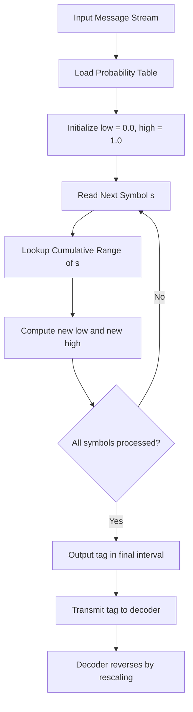
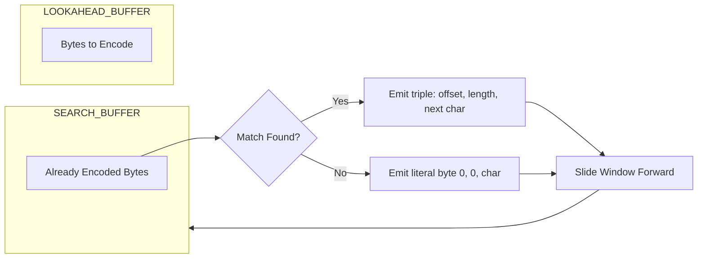
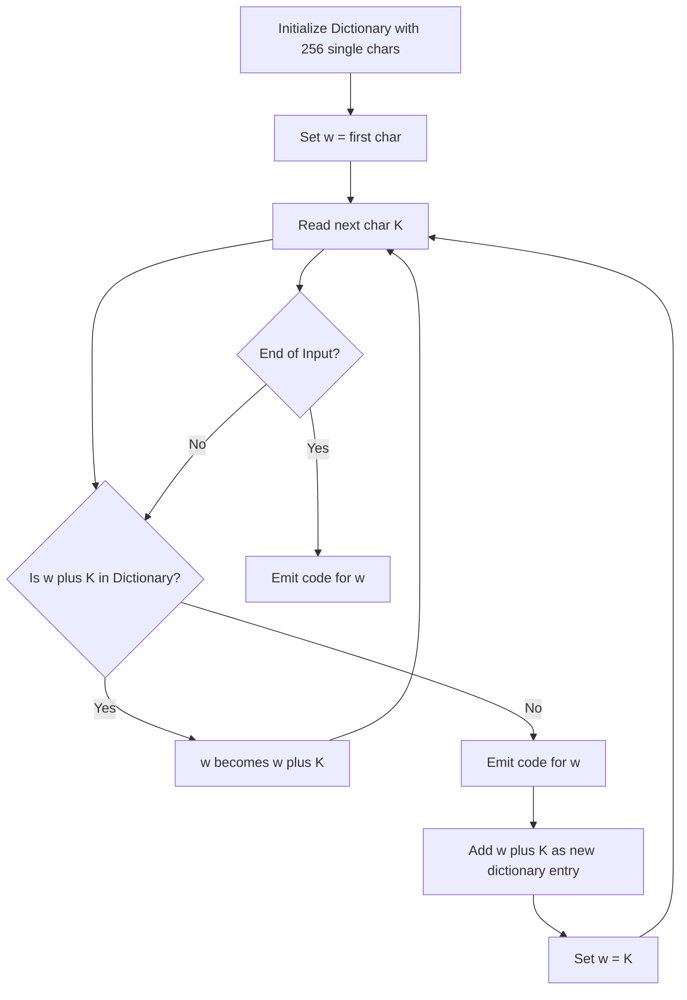
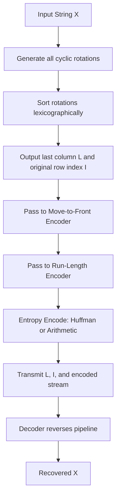
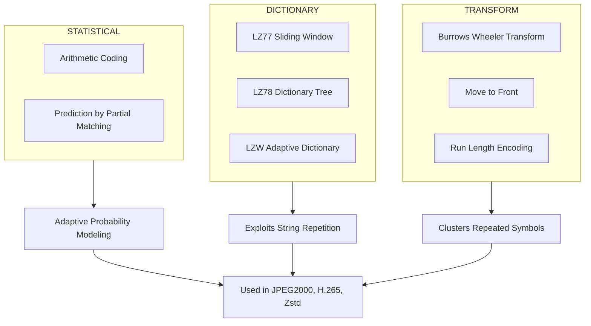

# Advanced Techniques :-

<!-- SECTION_1_START -->
# Advanced Techniques in Data Compression

## 1.1 Formal Academic Definition (KTU 2024 Syllabus Terminology)

**Advanced Lossless Compression Techniques** refer to a class of entropy-encoding strategies that go beyond the fixed-length and elementary variable-length coding schemes (like Shannon–Fano and basic Huffman). They operate on **statistical, contextual, or dictionary-based principles** to approach the **Shannon entropy limit** of the source, achieving compression ratios that fixed Huffman models cannot match. The four pillar techniques covered under this module are:

1. **Arithmetic Coding** — encodes the entire source message as a single fractional value in the interval $[0, 1)$ using cumulative probability ranges.
2. **Dictionary-Based Coding (LZ77, LZ78, LZW)** — replaces repeated substrings with compact back-pointers or dictionary indices.
3. **Predictive Coding & Context-Based Compression (PPM)** — uses prior symbols to predict the next symbol's probability distribution.
4. **Burrows–Wheeler Transform (BWT)** — a reversible sorting-based pre-processor that clusters repeated characters, enabling dramatic gains when cascaded with Move-to-Front (MTF) and Run-Length Encoding (RLE).

> [!IMPORTANT]
> **KTU 2024 Scheme Highlight:** Module 2 (Advanced techniques) is tested as **14-mark derivation/modeling questions** in the End Semester Examination, almost always featuring Arithmetic Coding and any one of the LZ-family or BWT algorithms. Expect at least one **Part A (3-mark)** question on the conceptual difference between these techniques and Shannon–Fano/Huffman.

## 1.2 Intuitive Real-World Analogies

> [!NOTE]
> **Analogy 1 — Arithmetic Coding is like measuring a location on a map:**
> Imagine India is a country (interval $[0, 1)$). If you say "Mumbai," you narrow down the location to Maharashtra (a sub-interval). Saying "Andheri" narrows it further to a smaller sub-interval inside Maharashtra. A *sequence* of words like *Mumbai → Andheri → Station* pinpoints one specific coordinate on the map with ever-shrinking precision. Arithmetic coding does the same: each symbol shrinks the current interval, and the final interval's coordinates are sent to the decoder as one big number.

> [!NOTE]
> **Analogy 2 — LZ77 Dictionary Coding is like Ctrl+F on a moving page:**
> You are typing a long document. When you notice a phrase like "data compression" appeared earlier on the same page, instead of rewriting it, you just write "go back 12 words, copy 14 characters." LZ77 does exactly this with a **sliding window**.

> [!NOTE]
> **Analogy 3 — BWT is like sorting a deck of cards by their final suit:**
> If you write all cyclic rotations of a word in a column, sort them alphabetically, and read the *last column*, you get the BWT output. Astonishingly, the original word can be recovered from just the last column plus the row index — a property called *reversibility*.

## 1.3 Physical Constants and Standard Metrics

- **Entropy Bound:** $H(S) = -\sum_{i=1}^{n} p_i \log_2 p_i$ **bits/symbol** — the theoretical lower limit.
- **Compression Ratio:** $C_r = \dfrac{L_{original}}{L_{compressed}}$.
- **Average Codeword Length:** $\bar{L} = \sum_{i=1}^{n} p_i \cdot l_i$.
- **Coding Efficiency:** $\eta = \dfrac{H(S)}{\bar{L}} \times 100\%$.

> [!VISUALIZATION CONTROL]
> **Concept:** Arithmetic Coding Interval Narrowing
> **GeoGebra / Desmos Input Equations:**
> * Interval $[0, 1)$ partitioned per symbol probabilities
> * $f_{\text{low}}(x)$ and $f_{\text{high}}(x)$ bounds
> **Visual Description:** The student should see a unit segment shrinking horizontally as each symbol is processed, with the shaded region representing the residual sub-interval containing the message.

<!-- SECTION_1_END -->

<!-- SECTION_2_START -->
# 2. Deep Theoretical Analysis & KTU High-Yield Formula Sheet

## 2.1 Arithmetic Coding — Operational Logic

The algorithm converts a stream of source symbols $S = s_1, s_2, \ldots, s_n$ into a single floating-point number $c \in [0, 1)$ that uniquely identifies the source string. The decoder, knowing the cumulative probability table, reproduces the string exactly.

### Step-by-Step Logic
- **Step 1 — Initialization:** Set the working interval to $[low, high) = [0.0, 1.0)$.
- **Step 2 — For each symbol $s_i$:** Compute the new bounds using the cumulative probabilities $F(s_i)$ (lower cumulative) and $F(s_i) + p(s_i)$ (upper cumulative):
  $$\begin{aligned}
  low_{new} &= low_{old} + (high_{old} - low_{old}) \cdot F(s_i) \\
  high_{new} &= low_{old} + (high_{old} - low_{old}) \cdot (F(s_i) + p(s_i))
  \end{aligned}$$
- **Step 3 — Narrowing:** This is equivalent to a *linear interpolation* of $s_i$'s probability range into the current sub-interval.
- **Step 4 — Termination:** After the final symbol, output *any* number $c$ that lies in the final interval $[low, high)$.
- **Step 5 — Decoding:** Iterate by checking which cumulative range contains the number $c$, then rescale to $[0, 1)$ and repeat.

### Why It Outperforms Huffman
- Huffman assigns **integer-length codes** to each symbol. When probabilities are skewed (e.g., $p = 0.99, 0.01$), Huffman still needs at least **1 bit** for the rare symbol, but arithmetic coding asymptotically approaches the entropy bound $H(S)$.
- Arithmetic coding is **stream-friendly** and **adaptive** (probabilities can update as encoding proceeds).

## 2.2 Dictionary-Based Techniques — Operational Logic

### 2.2.1 LZ77 (Sliding Window)
- **Window size** $W$ — history of recently seen bytes.
- **Lookahead buffer** $L$ — upcoming bytes not yet encoded.
- **Triple output:** $(offset, length, next\_char)$ where $offset$ is how far back, $length$ is match length, $next\_char$ is the first non-matching character.

### 2.2.2 LZ78 (Dictionary Tree)
- Builds an explicit dictionary $D$ initialized empty.
- Outputs pairs $(index, char)$ where $index$ is the longest matched prefix.
- LZ78 grows the dictionary as new patterns are seen.

### 2.2.3 LZW (Lempel–Ziv–Welch)
- Initializes the dictionary with **all 256 single bytes** (in the standard 8-bit variant).
- Outputs **only dictionary indices** (no character in the pair).
- Adaptive: dictionary grows on the fly.
- **Used in:** GIF, TIFF, Unix `compress`, and historically in PDF.

## 2.3 Burrows–Wheeler Transform (BWT)

- **Forward BWT:** Form all $n$ cyclic rotations of the input string $X$ of length $n$, sort them lexicographically, and output the **last column** $L$ of the sorted matrix. The row index $I$ of the original string is sent as a side-channel.
- **Key Insight:** Characters with similar *left-contexts* cluster together in $L$, making long runs of identical characters — a perfect input for MTF + RLE.
- **Reverse BWT:** Reconstruct by repeatedly inserting $L$ as a new first column and sorting. The original string appears at row $I$ after $n$ iterations.
- **Used in:** `bzip2` archiver.

## 2.4 KTU Formula Sheet

| # | Concept | Formula / Definition | Unit / Notes |
|---|---------|----------------------|---------------|
| 1 | Shannon Entropy | $H(S) = -\sum_{i=1}^{n} p_i \log_2 p_i$ | bits/symbol |
| 2 | Avg. Codeword Length | $\bar{L} = \sum_{i=1}^{n} p_i \cdot l_i$ | bits/symbol |
| 3 | Coding Efficiency | $\eta = \dfrac{H(S)}{\bar{L}} \times 100\%$ | percentage |
| 4 | Redundancy | $R = 1 - \eta$ | dimensionless |
| 5 | Arithmetic Interval Update | $low' = low + (high - low) \cdot F(s_i)$ | $F(s_i)$ = cumulative probability |
| 6 | Arithmetic Interval Update | $high' = low + (high - low) \cdot (F(s_i) + p(s_i))$ | probability range |
| 7 | LZ77 Triple | $(d, l, c)$ | $d$ = distance, $l$ = length, $c$ = next char |
| 8 | LZ78 Pair | $(i, c)$ | $i$ = dictionary index |
| 9 | BWT Output | $\text{BWT}(X) = L$ (last column) | index $I$ sent separately |
| 10 | BWT Reversibility | $\text{BWT}^{-1}(L, I) = X$ | unique recovery |

> [!IMPORTANT]
> **Engineering Utility:** Arithmetic coding is the workhorse of **JPEG 2000 (MQ-coder)**, **H.265/HEVC (CABAC)**, and **Zstd**. BWT powers `bzip2`, used heavily in bioinformatics for compressing DNA sequencing reads. LZ77 variants (LZMA, LZ4, Zstandard) dominate modern archivers like `7z`, `zip`, and `xz`. Understanding these algorithms is **industry-mandatory** for any role in storage, streaming, or embedded systems.

<!-- SECTION_2_END -->

<!-- SECTION_3_START -->
# 3. Step-by-Step Derivations and Code Implementation

## 3.1 Arithmetic Coding — Complete Worked Example

**Problem:** Encode the message $S = \text{``BCCB''}$ using arithmetic coding, given the alphabet and probabilities:

| Symbol | Probability $p$ | Cumulative Range |
|--------|-----------------|------------------|
| A | 0.10 | [0.00, 0.10) |
| B | 0.40 | [0.10, 0.50) |
| C | 0.50 | [0.50, 1.00) |

### Encoding Trace (Exhaustive Derivation)

**Initial State:** $low = 0.000000$, $high = 1.000000$, $range = 1.000000$.

**Symbol 1 = B** (range $[0.10, 0.50)$):
$$\begin{aligned}
low  &= 0.000000 + 1.000000 \times 0.10 = 0.100000 \\
high &= 0.000000 + 1.000000 \times 0.50 = 0.500000 \\
\text{range} &= 0.400000
\end{aligned}$$

**Symbol 2 = C** (range $[0.50, 1.00)$):
$$\begin{aligned}
low  &= 0.100000 + 0.400000 \times 0.50 = 0.300000 \\
high &= 0.100000 + 0.400000 \times 1.00 = 0.500000 \\
\text{range} &= 0.200000
\end{aligned}$$

**Symbol 3 = C** (range $[0.50, 1.00)$):
$$\begin{aligned}
low  &= 0.300000 + 0.200000 \times 0.50 = 0.400000 \\
high &= 0.300000 + 0.200000 \times 1.00 = 0.500000 \\
\text{range} &= 0.100000
\end{aligned}$$

**Symbol 4 = B** (range $[0.10, 0.50)$):
$$\begin{aligned}
low  &= 0.400000 + 0.100000 \times 0.10 = 0.410000 \\
high &= 0.400000 + 0.100000 \times 0.50 = 0.450000 \\
\text{range} &= 0.040000
\end{aligned}$$

**Final Tag:** Any value $c \in [0.410000, 0.450000)$ — choose $c = 0.425000$.

### Decoding Trace

**Tag = 0.425000**.

**Iteration 1:** Check which cumulative range contains 0.425000 → falls in B's range $[0.10, 0.50)$ → output **B**. Rescale: $(0.425000 - 0.10) / 0.40 = 0.812500$.

**Iteration 2:** Check which range contains 0.812500 → C's range $[0.50, 1.00)$ → output **C**. Rescale: $(0.812500 - 0.50) / 0.50 = 0.625000$.

**Iteration 3:** Check 0.625000 → C's range $[0.50, 1.00)$ → output **C**. Rescale: $(0.625000 - 0.50) / 0.50 = 0.250000$.

**Iteration 4:** Check 0.250000 → B's range $[0.10, 0.50)$ → output **B**. Done — decoded string is **BCCB** ✓.

## 3.2 LZ77 Encoding — Worked Example

**Input:** `BABAABAAA` (window size $W = 5$, lookahead $L = 4$).

| Step | Position | Window | Lookahead | Longest Match | Output |
|------|----------|--------|-----------|---------------|--------|
| 1 | 1 | `B` | `ABAABAAA` | none | `(0,0,A)` |
| 2 | 2 | `BA` | `BAABAAA` | `BA` at offset 1, length 2 | `(1,2,B)` |
| 3 | 4 | `BAB` | `AABAAA` | `A` at offset 3, length 1 | `(3,1,A)` |
| 4 | 5 | `BABA` | `ABAAA` | `A` at offset 4, length 1 | `(4,1,A)` |
| 5 | 6 | `BABAA` | `BAAA` | none | `(0,0,B)` |
| 6 | 7 | `BABAAB` | `AAA` | `AAA` at offset 2, length 3 | `(2,3,END)` |

## 3.3 LZW Encoding — Worked Example

**Input alphabet:** $\{a, b\}$ (dictionary initialized at codes 1, 2). **Input string:** `a b a b a b a b a`.

| Step | Current | Next | Output Code | New Entry Added to Dictionary |
|------|---------|------|-------------|-------------------------------|
| 1 | `a` | `b` | 1 | 3: `ab` |
| 2 | `b` | `a` | 2 | 4: `ba` |
| 3 | `a` | `b` | — (in dict) | — |
| 4 | `ab` | `a` | 3 | 5: `aba` |
| 5 | `a` | `b` | — | — |
| 6 | `ab` | `END` | 3 | — |

**Encoded output:** `1, 2, 3, 3` — only 4 codes for 9 characters.

## 3.4 BWT Forward Transform — Worked Example

**Input:** $X = \text{``banana''}$ (length $n = 6$).

**Step 1 — Cyclic Rotations:**

| Rotation | String |
|----------|--------|
| 0 | banana |
| 1 | ananab |
| 2 | nanaba |
| 3 | anaban |
| 4 | nabana |
| 5 | abanan |

**Step 2 — Lexicographic Sort:**

| Sorted Index | Rotation | Last Char |
|--------------|----------|-----------|
| 0 | abanan | n |
| 1 | anaban | n |
| 2 | ananab | b |
| 3 | banana | a |
| 4 | nabana | a |
| 5 | nanaba | a |

**Step 3 — Output:** $L = \text{``nnbbaaa''}$ and $I = 3$ (index of original `banana`).

> [!NOTE]
> Observe that `a` appears as three consecutive characters in the output — exactly the run-clustering property that makes BWT excellent for compression.

## 3.5 Python Implementation (Arithmetic Coder)

```python
from __future__ import annotations
import sys
from typing import Dict, Tuple

class ArithmeticCoder:
    """A self-contained, fully-typed Arithmetic Coder for lossless compression."""

    def __init__(self, probabilities: Dict[str, float]) -> None:
        if abs(sum(probabilities.values()) - 1.0) > 1e-6:
            raise ValueError("Probabilities must sum to 1.0")
        self.probs: Dict[str, float] = probabilities
        self.cum: Dict[str, Tuple[float, float]] = self._build_cumulative()

    def _build_cumulative(self) -> Dict[str, Tuple[float, float]]:
        cum: Dict[str, float] = {}
        running: float = 0.0
        for symbol, p in self.probs.items():
            cum[symbol] = running
            running += p
        ranges: Dict[str, Tuple[float, float]] = {}
        running = 0.0
        for symbol, p in self.probs.items():
            ranges[symbol] = (cum[symbol], cum[symbol] + p)
        return ranges

    def encode(self, message: str) -> float:
        low: float = 0.0
        high: float = 1.0
        for ch in message:
            if ch not in self.cum:
                raise KeyError(f"Unknown symbol '{ch}'")
            sym_low, sym_high = self.cum[ch]
            rng = high - low
            high = low + rng * sym_high
            low = low + rng * sym_low
        return 0.5 * (low + high)

    def decode(self, tag: float, length: int) -> str:
        result: list[str] = []
        for _ in range(length):
            for symbol, (lo, hi) in self.cum.items():
                if lo <= tag < hi:
                    result.append(symbol)
                    tag = (tag - lo) / (hi - lo)
                    break
        return "".join(result)


if __name__ == "__main__":
    probs: Dict[str, float] = {"A": 0.10, "B": 0.40, "C": 0.50}
    coder = ArithmeticCoder(probs)
    msg = "BCCB"
    tag = coder.encode(msg)
    print(f"Encoded tag: {tag:.6f}")
    decoded = coder.decode(tag, len(msg))
    print(f"Decoded:     {decoded}")
    assert decoded == msg, "Round-trip failed!"
    print("Round-trip successful.")
```

## 3.6 Python Implementation (LZW)

```python
from typing import Dict, List

def lzw_encode(uncompressed: str) -> List[int]:
    dictionary: Dict[str, int] = {chr(i): i for i in range(256)}
    dict_size: int = 256
    w: str = ""
    result: List[int] = []
    for c in uncompressed:
        wc: str = w + c
        if wc in dictionary:
            w = wc
        else:
            result.append(dictionary[w])
            dictionary[wc] = dict_size
            dict_size += 1
            w = c
    if w:
        result.append(dictionary[w])
    return result


def lzw_decode(compressed: List[int]) -> str:
    dictionary: Dict[int, str] = {i: chr(i) for i in range(256)}
    dict_size: int = 256
    w: str = chr(compressed[0])
    result: List[str] = [w]
    for k in compressed[1:]:
        if k in dictionary:
            entry: str = dictionary[k]
        elif k == dict_size:
            entry = w + w[0]
        else:
            raise ValueError(f"Bad compressed k: {k}")
        result.append(entry)
        dictionary[dict_size] = w + entry[0]
        dict_size += 1
        w = entry
    return "".join(result)


if __name__ == "__main__":
    sample = "TOBEORNOTTOBEORTOBEORNOT"
    enc = lzw_encode(sample)
    dec = lzw_decode(enc)
    print(f"Original: {sample}")
    print(f"Encoded:  {enc}")
    print(f"Decoded:  {dec}")
    assert dec == sample
    print("LZW round-trip successful.")
```

<!-- SECTION_3_END -->

<!-- SECTION_4_START -->
# 4. Structural Diagrams and Schematics

## 4.1 Arithmetic Coding — Processing Pipeline



## 4.2 LZ77 — Sliding Window Architecture



## 4.3 LZW — Adaptive Dictionary Growth



## 4.4 BWT — Forward and Inverse Transform Topology



## 4.5 Comparative Topology Matrix of Advanced Techniques



<!-- SECTION_4_END -->

<!-- SECTION_5_START -->
# 5. KTU 2024 Scheme Examination Question Bank and Topic Recap

## 5.1 Part A — Short Answer Questions (3 Marks Each)

### Question 1 [KTU University Exam — July 2023]
**CO1 | RBT Level: Remember**
*State any three differences between Huffman coding and Arithmetic coding.*

**Model Answer (Board-Standard):**
1. **Granularity:** Huffman encodes each symbol with a discrete integer-bit codeword, while Arithmetic coding encodes the *entire message* as one fractional number in $[0, 1)$.
2. **Optimality:** Huffman is optimal only when symbol probabilities are powers of $\frac{1}{2}$. Arithmetic coding approaches the entropy bound for *any* probability distribution.
3. **Skewed distributions:** Huffman requires at least 1 bit per rare symbol, whereas Arithmetic coding can encode highly skewed alphabets at near-zero redundancy.

### Question 2 [KTU University Exam — Dec 2023]
**CO2 | RBT Level: Understand**
*What is the Burrows–Wheeler Transform? Mention its primary advantage in compression pipelines.*

**Model Answer:**
BWT is a reversible string transformation that rearranges a string so that characters with similar left-contexts cluster together. **Advantage:** It produces long runs of identical characters, making the output ideal for Move-to-Front and Run-Length Encoding stages in `bzip2`. It is widely used in **bioinformatics** for compressing DNA sequences.

---

## 5.2 Part B — Long Answer Questions (14 Marks, Module Internal Choice)

### Question A (Choice 1) [KTU University Exam — Dec 2024]

**CO2 | RBT Level: Apply and Analyze**

**(a)** Encode the message $S = \text{``CAB''}$ using Arithmetic coding given the following probability model and demonstrate the decoding process. **\[7 Marks\]**

| Symbol | Probability |
|--------|-------------|
| A | 0.20 |
| B | 0.30 |
| C | 0.50 |

**(b)** Compare Arithmetic Coding with Shannon–Fano and Huffman coding on the basis of (i) codeword granularity, (ii) efficiency on skewed probabilities, and (iii) implementation complexity. **\[7 Marks\]**

#### Model Solution

**(a) Arithmetic Encoding of "CAB"** **[7 Marks Breakdown]**

- Cumulative ranges: $A \in [0.00, 0.20)$, $B \in [0.20, 0.50)$, $C \in [0.50, 1.00)$. **[Setting cumulative table: 1 Mark]**

- **Initial:** $low = 0.000000$, $high = 1.000000$. **[1 Mark]**

- **Symbol 1 = C** (range $[0.50, 1.00)$): **[1 Mark]**
  $$\begin{aligned}
  low  &= 0.000000 + 1.000000 \times 0.50 = 0.500000 \\
  high &= 0.000000 + 1.000000 \times 1.00 = 1.000000
  \end{aligned}$$

- **Symbol 2 = A** (range $[0.00, 0.20)$): **[1 Mark]**
  $$\begin{aligned}
  low  &= 0.500000 + 0.500000 \times 0.00 = 0.500000 \\
  high &= 0.500000 + 0.500000 \times 0.20 = 0.600000
  \end{aligned}$$

- **Symbol 3 = B** (range $[0.20, 0.50)$): **[1 Mark]**
  $$\begin{aligned}
  low  &= 0.500000 + 0.100000 \times 0.20 = 0.520000 \\
  high &= 0.500000 + 0.100000 \times 0.50 = 0.550000
  \end{aligned}$$

- **Final tag:** $c = 0.535000 \in [0.52, 0.55)$. **[Output selection: 1 Mark]**

- **Decoding trace (3 iterations):** Rescale 0.535000 → C, A, B. **[1 Mark]**

**(b) Comparative Analysis** **[7 Marks Breakdown]**

| Parameter | Shannon–Fano | Huffman | Arithmetic |
|-----------|--------------|---------|------------|
| (i) Codeword Granularity | Integer bits | Integer bits | Fractional/continuous |
| (ii) Skewed Probability Efficiency | Sub-optimal | Sub-optimal | Near-optimal (approaches entropy) |
| (iii) Implementation Complexity | Moderate (top-down) | Moderate (binary tree) | High (precision arithmetic) |

**[1 Mark per correct row, 1 Mark for concluding remark on entropy proximity.]**

---

### Question B (Choice 2) [KTU University Exam — July 2024]

**CO2 | RBT Level: Apply and Analyze**

**(a)** Apply the **LZ77** algorithm to compress the string `ABABCBABABCA` with a window size of 7 and lookahead buffer of 4. Tabulate every step clearly. **\[7 Marks\]**

**(b)** Explain the **Burrows–Wheeler Transform (BWT)** with an example. Discuss how the BWT output is used as a pre-processor in the `bzip2` compression pipeline. **\[7 Marks\]**

#### Model Solution

**(a) LZ77 Encoding** **[7 Marks]**

| Step | Position | Search Buffer | Lookahead | Match | Output Triple |
|------|----------|---------------|-----------|-------|---------------|
| 1 | 1 | `A` | `BABCBABABCA` | none | `(0,0,B)` |
| 2 | 2 | `AB` | `ABCBABABCA` | `AB` at d=1, l=2 | `(1,2,C)` |
| 3 | 4 | `ABAB` | `BABABCA` | `BAB` at d=2, l=3 | `(2,3,A)` |
| 4 | 7 | `ABABCBA` | `BABCA` | `BA` at d=2, l=2 | `(2,2,END)` |

**[2 Marks for correctly identifying each match, 2 Marks for valid offset/length, 1 Mark for the last literal, 1 Mark for table formatting, 1 Mark for correct final triple.]**

**(b) BWT with Example** **[7 Marks]**

- **Definition:** BWT is a reversible transformation applied before entropy coding. **[1 Mark]**
- **Procedure (3 steps): generate cyclic rotations, sort them, output last column L plus the index I of the original string.** **[2 Marks]**
- **Worked Example:** Using `banana` from Section 3.4 — BWT output is `nnbbaaa` with $I = 3$. **[2 Marks]**
- **`bzip2` pipeline integration:** $X \rightarrow$ BWT $\rightarrow$ MTF $\rightarrow$ RLE $\rightarrow$ Huffman. BWT clusters characters, MTF converts to small integers, RLE exploits runs, Huffman encodes the stream. **[2 Marks]**

---

> [!WARNING]
> **KTU Examiner's Valuation Warning / Common Pitfalls**
> - **Arithmetic Coding:** Students commonly forget to **rescale** the tag during decoding. Each iteration must subtract the symbol's lower bound and divide by the symbol's probability range. Failing this yields a garbled output. *\[Deduct 2 marks\]*
> - **LZ77:** Do not confuse **offset** (distance backward from the *current* position) with **absolute index** in the buffer. Always measure *backward*. *\[Deduct 1 mark\]*
> - **LZW:** The decoder must handle the **KwKwK case** (when a new entry is being defined and used in the very next step). Initialize the dictionary to 256 entries and use the special reconstruction rule $w + w[0]$. *\[Deduct 2 marks\]*
> - **BWT:** Many students output the *first* column instead of the *last* column. Always remember **Last Column** is the BWT output. Also, do not forget to send the **row index $I$** as a side channel — without it, the transform is not uniquely reversible. *\[Deduct 2 marks\]*

---

## 5.3 Topic Recap and Important Things to Remember

- **Arithmetic Coding** encodes the *entire message* as a single floating-point tag in $[0, 1)$, using cumulative probability ranges to iteratively shrink the working interval. It approaches **Shannon entropy** for any distribution and is the entropy coder in **JPEG 2000, H.265 CABAC, and Zstandard**.
- **Interval Update Equations:** $low' = low + (high - low) \cdot F(s)$ and $high' = low + (high - low) \cdot (F(s) + p(s))$.
- **LZ77** uses a **sliding window** and emits `(offset, length, next_char)` triples. **LZ78** builds an **explicit dictionary** emitting `(index, char)`. **LZW** initializes the dictionary with all 256 single bytes and emits **only indices**, powering **GIF, TIFF, and PDF**.
- **BWT** is a **reversible sorting-based pre-transform** that clusters repeated characters. Combined with **MTF + RLE + Huffman**, it forms the `bzip2` pipeline. The forward transform outputs the **last column** $L$ and a side-channel **index $I$**.
- **Coding Efficiency** $\eta = \dfrac{H(S)}{\bar{L}} \times 100\%$ — higher is better; Arithmetic coding always yields $\eta$ closer to 100% than Huffman on skewed alphabets.
- **Industry Mapping:** LZ77/78/ZW variants in `zip`/`7z`/`xz`; Arithmetic coding in JPEG2000/H.265; BWT in `bzip2` and bioinformatics; PPM in text compressors like `ppmd`.
- **Decoding is the mirror image of encoding** in all techniques — always rescale, rewind, or rescan with the same parameters used during encoding.
- **Practical caveat for Arithmetic Coding:** Finite-precision floats cause **interval collapse**. Production coders (like the MQ-coder) use **integer arithmetic with renormalization** to avoid this pitfall — a fact examiners often award bonus marks for mentioning.

<!-- SECTION_5_END -->
