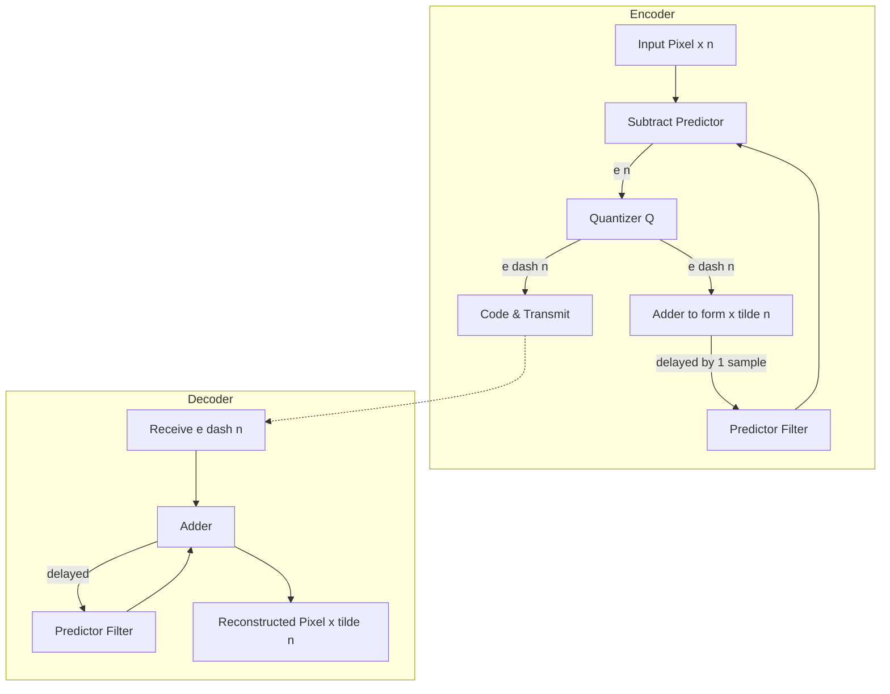
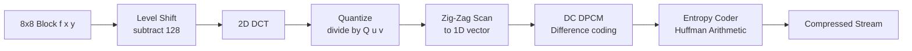
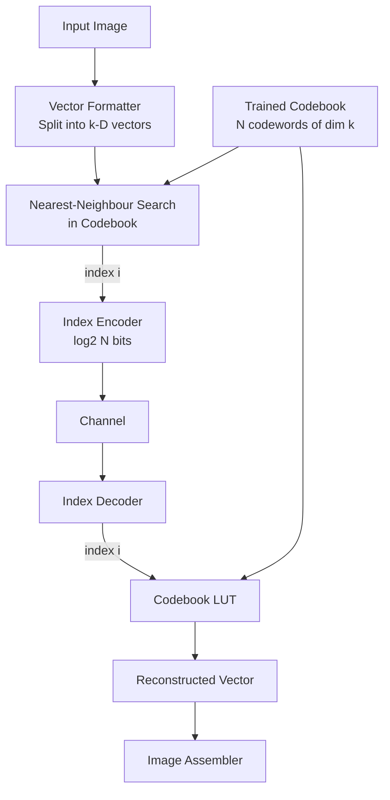
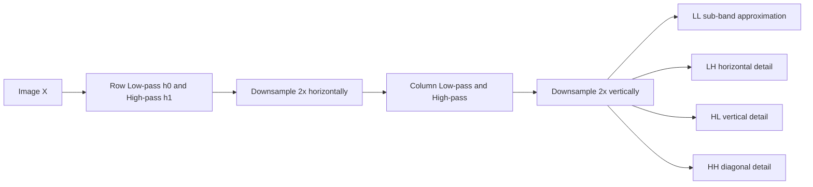
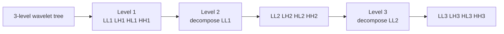

# Approaches to Image Compression

<!-- SECTION_1_START -->

# Approaches to Image Compression

## 1.1 Formal Definition (KTU 2024 Syllabus Terminology)

> [!NOTE]
> **Image Compression** is the art and science of reducing the amount of data (in bits) required to represent a digital image while preserving the essential visual information needed for the intended application.

According to the **KTU PECST524 (Data Compression)** Module 2 syllabus, image compression techniques are classified based on whether they allow any loss of information:

1. **Lossless Image Compression** — The reconstructed image is mathematically identical to the original pixel-by-pixel. Used in medical imaging, satellite archival, and pre-press workflows.
2. **Lossy Image Compression** — The reconstructed image is a perceptually acceptable approximation of the original, permitting controlled loss for much higher compression ratios. Used in JPEG, web images, and video streaming.

The **compression ratio** $CR$ is defined as:

$$CR = \frac{n_1}{n_2}$$

where $n_1$ is the number of bits in the original image and $n_2$ is the number of bits in the compressed representation. A higher value of $CR$ implies better compression.

A related measure is the **Relative Data Redundancy** $R$:

$$R = 1 - \frac{1}{CR} = 1 - \frac{n_2}{n_1}$$

The **average codeword length** $\bar{L}$ and **entropy** $H$ of the source together determine the theoretical limit (Shannon's first theorem):

$$\bar{L} \geq H(S)$$

## 1.2 Conceptual Analogy / Intuition

> [!IMPORTANT]
> **Plain English Analogy — The Suitcase Problem**
> Imagine you have to pack a large photo album into a small suitcase. You have two strategies:
> - **Lossless (folding carefully):** You meticulously refold every page so that not a single crease is added. The album can be perfectly reassembled. Cost: a lot of effort, modest size reduction.
> - **Lossy (tearing out redundant pages):** You remove pages that look "the same" as the next one (sky, blank wall) and accept a slightly less detailed album. Cost: minor loss, but huge size reduction.
>
> Image compression algorithms operate on exactly this principle — exploiting **pixel redundancy** (spatial), **coding redundancy** (statistical), and **psycho-visual redundancy** (human eye insensitivity) to shrink the data.

**Geometric Intuition (Frequency View):** Any image can be decomposed into a sum of sinusoidal "patterns." Smooth regions correspond to **low frequencies**, while edges and fine textures correspond to **high frequencies**. Most natural images are dominated by low-frequency content — a fact exploited ruthlessly by transform coding (DCT, DWT) to discard or coarsely quantize the less-important high frequencies.

> [!VISUALIZATION CONTROL]
> **Concept:** 2D Discrete Cosine Transform (DCT) basis functions tiling an $8 \times 8$ block.
> **GeoGebra / Desmos Input Equations (representative basis):**
> * `B(u,v,x,y) = cos((2x+1)u*pi/16) * cos((2y+1)v*pi/16)` for $u, v = 0, 1, \ldots, 7$
> **Visual Description:** A grid of $8 \times 8$ tiles, where the top-left tile is uniform (DC), the horizontal frequency increases left-to-right, and the vertical frequency increases top-to-bottom. Students should observe that natural images concentrate most of their energy in the top-left (low-frequency) region.

> [!TIP]
> **Syllabus Highlight:** Under KTU 2024 PECST524 Module 2, you must be able to **compare, contrast, and apply** the following image-compression approaches:
> 1. Predictive Coding (DPCM / DM)
> 2. Transform Coding (DCT-based JPEG)
> 3. Wavelet / Sub-band Coding
> 4. Vector Quantization (VQ)
> Each carries a typical weightage of 10–14 marks in the End Semester Exam.

<!-- SECTION_1_END -->

<!-- SECTION_2_START -->

# Deep Theoretical Analysis & KTU High-Yield Formula Sheet

## 2.1 Taxonomy of Image Compression Approaches

A clean, board-friendly classification of the major approaches is given below. Each approach exploits a different kind of redundancy in image data.

### 2.1.1 Pixel (Spatial) Redundancy Exploitation

**Predictive Coding** uses the fact that neighbouring pixels are highly correlated. Instead of coding each pixel, we code the **prediction error** (residual), which has a much smaller variance and a sharply peaked (Laplacian-like) distribution.

- **DPCM (Differential Pulse Code Modulation)**
- **Delta Modulation (DM)**
- **Adaptive DPCM (ADPCM)**

### 2.1.2 Coding (Statistical) Redundancy Exploitation

After de-correlation, the residual symbols are coded using **entropy coders** (Huffman, Shannon–Fano, Arithmetic, Golomb–Rice) which assign shorter codewords to more probable symbols.

### 2.1.3 Transform-Domain Redundancy Exploitation

**Transform coding** maps the image into a domain (frequency or wavelet) where the energy is compacted into a small number of coefficients.

- **Discrete Cosine Transform (DCT)** — backbone of JPEG, MJPEG, MPEG.
- **Discrete Wavelet Transform (DWT)** — backbone of JPEG 2000.
- **Karhunen–Loève Transform (KLT)** — theoretically optimal, rarely used (data-dependent).

### 2.1.4 Vector-Space Redundancy Exploitation

**Vector Quantization (VQ)** groups pixels into vectors and maps each vector to the closest entry in a finite **codebook**. The Linde–Buzo–Gray (LBG) algorithm is the standard codebook design procedure.

### 2.1.5 Psycho-visual Redundancy Exploitation

The human visual system (HVS) is less sensitive to high-frequency details, chrominance than luminance, and to certain masking effects. Quantization matrices (e.g., the JPEG standard luminance matrix) are designed using HVS thresholds.

## 2.2 Predictive Coding — DPCM in Detail

> [!IMPORTANT]
> **Why DPCM works:** For a Markov-1 image source with correlation coefficient $\rho \approx 0.9$–$0.98$, the variance of the prediction error is roughly $\sigma_e^2 \approx \sigma^2(1-\rho^2) \approx 0.04\,\sigma^2$ — a 25× reduction in dynamic range, which directly translates into fewer bits per pixel.

The classical **DPCM encoder–decoder** pair uses a predictor $\hat{x}_n$ that is a linear combination of previous reconstructed samples:

$$\hat{x}_n = \sum_{i=1}^{p} a_i \cdot \tilde{x}_{n-i}$$

where $a_i$ are the predictor coefficients and $\tilde{x}_{n-i}$ are the *quantized* previous samples (the use of $\tilde{x}$ instead of $x$ prevents drift). The error $e_n = x_n - \hat{x}_n$ is quantized to $e'_n$ and transmitted; the receiver reconstructs $\tilde{x}_n = \hat{x}_n + e'_n$.

**Predictor Design Goal:** Minimize the mean-squared prediction error:

$$\mathcal{E}\left[e_n^2\right] = E\left[(x_n - \hat{x}_n)^2\right]$$

For a 2-D pixel $(i,j)$ with horizontal and vertical correlation coefficients $\rho_h$ and $\rho_v$:

$$\hat{x}(i,j) = a_1\, x(i-1,j) + a_2\, x(i,j-1) - a_1 a_2\, x(i-1,j-1)$$

This is the **optimum linear predictor** for a separable first-order Markov image.

## 2.3 Transform Coding — The DCT Workhorse

The forward 2-D DCT of size $N \times N$ for an input block $f(x, y)$ is:

$$F(u,v) = \alpha(u)\, \alpha(v) \sum_{x=0}^{N-1}\sum_{y=0}^{N-1} f(x,y) \cos\!\left[\frac{(2x+1)u\pi}{2N}\right] \cos\!\left[\frac{(2y+1)v\pi}{2N}\right]$$

The inverse 2-D DCT is:

$$f(x,y) = \sum_{u=0}^{N-1}\sum_{v=0}^{N-1} \alpha(u)\, \alpha(v) F(u,v) \cos\!\left[\frac{(2x+1)u\pi}{2N}\right] \cos\!\left[\frac{(2y+1)v\pi}{2N}\right]$$

with the normalization factor:

$$\alpha(k) = \begin{cases} \sqrt{\dfrac{1}{N}}, & k = 0 \\[6pt] \sqrt{\dfrac{2}{N}}, & k = 1, 2, \ldots, N-1 \end{cases}$$

**JPEG** uses $N = 8$, giving $8 \times 8$ blocks of 64 DCT coefficients.

**Energy Compaction Property:** For highly correlated images, almost all the energy of an $8 \times 8$ block ends up in a small cluster of low-frequency coefficients near the top-left (the **DC** and a few low-order **AC** terms). The high-frequency coefficients are quantized aggressively or set to zero.

**Quantization Step:** Each coefficient $F(u,v)$ is quantized by:

$$F_Q(u,v) = \text{round}\!\left[\frac{F(u,v)}{Q(u,v)}\right]$$

where $Q(u,v)$ are entries of the standard JPEG **luminance quantization matrix** (larger for high frequencies because the HVS is less sensitive to them). The standard matrix is:

$$Q_{\text{JPEG}} = \begin{bmatrix} 16 & 11 & 10 & 16 & 24 & 40 & 51 & 61 \\ 12 & 12 & 14 & 19 & 26 & 58 & 60 & 55 \\ 14 & 13 & 16 & 24 & 40 & 57 & 69 & 56 \\ 14 & 17 & 22 & 29 & 51 & 87 & 80 & 62 \\ 18 & 22 & 37 & 56 & 68 & 109 & 103 & 77 \\ 24 & 35 & 55 & 64 & 81 & 104 & 113 & 92 \\ 49 & 64 & 78 & 87 & 103 & 121 & 120 & 101 \\ 72 & 92 & 95 & 98 & 112 & 100 & 103 & 99 \end{bmatrix}$$

**Zig-Zag Scan:** After quantization, the $8 \times 8$ block is read out in a **zig-zag** order (DC first, then low-frequency AC, then higher-frequency AC) to maximize the run of zeros — enabling efficient run-length encoding of zero runs.

## 2.4 Wavelet / Sub-band Coding

A **sub-band coder** splits the image spectrum into several non-overlapping frequency bands using a bank of **quadrature-mirror filters (QMF)**. A 2-level decomposition produces:

- **LL** (low-low) — coarse approximation
- **LH, HL, HH** (detail sub-bands) — horizontal, vertical, and diagonal edges

The 2-D DWT of an $N \times N$ image (using separable filters) is implemented as a cascade of 1-D filters along rows, then columns, followed by **$2 \times$ downsampling** in each direction.

A 3-level wavelet decomposition yields 10 sub-bands. The energy compaction is even better than DCT (no blocking artefacts), and the multi-resolution property enables **progressive / embedded transmission** (e.g., EZW, SPIHT, EBCOT used in JPEG 2000).

## 2.5 Vector Quantization (VQ)

A vector quantizer $Q$ of dimension $k$ and size $N$ maps a $k$-dimensional input vector $\mathbf{x} \in \mathbb{R}^k$ to one of $N$ reproduction vectors (codewords) $\mathbf{c}_i$:

$$Q(\mathbf{x}) = \mathbf{c}_i \quad \text{iff} \quad d(\mathbf{x}, \mathbf{c}_i) \leq d(\mathbf{x}, \mathbf{c}_j),\ \forall j \neq i$$

where $d(\cdot,\cdot)$ is the **distortion measure** (typically squared Euclidean distance):

$$d(\mathbf{x}, \mathbf{y}) = \sum_{l=1}^{k}(x_l - y_l)^2 = \lVert \mathbf{x} - \mathbf{y} \rVert^2$$

**Bit rate per pixel:** $r = \frac{\log_2 N}{k}$ bits/pixel.

**Codebook design — LBG algorithm:** Iterative refinement starting from an initial codebook. Two necessary conditions for optimality:
1. **Nearest-Neighbour Condition** — the partition cells are Voronoi regions of the current codebook.
2. **Centroid Condition** — each codeword is the centroid of its training vectors.

## 2.6 KTU Formula Sheet / Cheat Sheet

| # | Quantity / Equation | Symbol | Notes / Units |
|---|----|------|------|
| 1 | Compression Ratio | $CR = n_1 / n_2$ | dimensionless, $n_1$ = original bits, $n_2$ = compressed bits |
| 2 | Relative Redundancy | $R = 1 - n_2 / n_1$ | dimensionless, $0 \le R \le 1$ |
| 3 | Average Code Length | $\bar{L} = \sum_i p_i l_i$ | bits/symbol |
| 4 | Source Entropy (Shannon) | $H(S) = -\sum_i p_i \log_2 p_i$ | bits/symbol |
| 5 | Coding Efficiency | $\eta = H(S) / \bar{L} \times 100\%$ | percent |
| 6 | DPCM prediction error | $e_n = x_n - \hat{x}_n$ | scalar |
| 7 | Optimal 2-D predictor | $\hat{x}(i,j) = a_1 x_{i-1,j} + a_2 x_{i,j-1} - a_1 a_2 x_{i-1,j-1}$ | linear MMSE |
| 8 | Forward DCT (2-D) | $F(u,v) = \alpha(u)\alpha(v) \sum_x \sum_y f(x,y)\cos[\cdots]\cos[\cdots]$ | $N=8$ for JPEG |
| 9 | DCT Normalization | $\alpha(0)=\sqrt{1/N}$, $\alpha(k>0)=\sqrt{2/N}$ | constant |
| 10 | Quantization (JPEG) | $F_Q(u,v) = \text{round}[F(u,v)/Q(u,v)]$ | integer output |
| 11 | DWT (separable 1-D) | $W_\phi(j,k) = \sum_n x(n) h_\phi(j_0 - n)$ | multi-resolution |
| 12 | VQ distortion | $D = \frac{1}{M} \sum_{m=1}^{M} \lVert \mathbf{x}_m - Q(\mathbf{x}_m) \rVert^2$ | MSE |
| 13 | VQ rate | $r = \log_2 N / k$ | bits/pixel |
| 14 | PSNR | $PSNR = 10 \log_{10}\!\left(\dfrac{L^2}{MSE}\right)$ dB | $L=255$ for 8-bit |
| 15 | MSE | $MSE = \dfrac{1}{MN}\sum (x_{ij} - \hat{x}_{ij})^2$ | per pixel |

> [!TIP]
> **Note on table syntax:** The vertical bar $\vert$ in absolute-value expressions has been replaced with the LaTeX command `\vert` (or `\mid`) to avoid breaking the markdown table parser. Always re-check formulas in tables before submitting your answer sheet.

## 2.7 Real-World Engineering Utility

- **JPEG (DCT + Huffman/Arithmetic):** The default for digital photography, web images, and email attachments. Powers billions of images daily on Instagram, WhatsApp, and Facebook.
- **JPEG 2000 (DWT + EBCOT):** Used in medical DICOM imaging, digital cinema (DCI), geospatial imagery, and archival of cultural heritage.
- **WebP / AVIF (intra-frame of VP8/AV1):** Modern browsers, optimized for perceptual quality at low bitrates.
- **DPCM in video:** Used inside H.264/HEVC/AV1 for *intra-prediction* (predicting a block from already-decoded neighbours before transform coding).
- **VQ in speech and image recognition:** Codebooks trained on feature vectors for fast matching.
- **Sub-band / Wavelet in denoising and feature extraction:** Foundation of computer-vision pipelines in surveillance and medical imaging.

<!-- SECTION_2_END -->

<!-- SECTION_3_START -->

# Step-by-Step Derivations & Worked Examples

## 3.1 Worked Example 1 — Computing the 2-D DCT of a $2 \times 2$ Block

> **Problem:** Compute the 2-D DCT of the block
> $$f(x,y) = \begin{bmatrix} 8 & 6 \\ 4 & 2 \end{bmatrix}$$
> (This is the smallest non-trivial case where every basis function is exercised.)

### Step 1 — Write down the basis functions
For $N=2$, the normalization factors are:
$$\alpha(0) = \sqrt{1/2}, \quad \alpha(1) = \sqrt{2/2} = 1$$
The basis vectors in 1-D are:
$$\mathbf{c}_0 = \bigl[\cos(0),\cos(0)\bigr] = [1, 1], \quad \mathbf{c}_1 = \bigl[\cos(\pi/4),\cos(3\pi/4)\bigr] = \bigl[\tfrac{\sqrt{2}}{2}, -\tfrac{\sqrt{2}}{2}\bigr]$$
The 2-D basis is the outer product of these 1-D vectors.

### Step 2 — Apply the forward 2-D DCT formula
$$F(u,v) = \alpha(u)\alpha(v) \sum_{x=0}^{1}\sum_{y=0}^{1} f(x,y) \cos\!\left[\frac{(2x+1)u\pi}{4}\right] \cos\!\left[\frac{(2y+1)v\pi}{4}\right]$$

**DC coefficient** $F(0,0)$:
$$F(0,0) = \sqrt{1/2}\sqrt{1/2}\,(8+6+4+2) = \tfrac{1}{2}\cdot 20 = 10$$

**Coefficient** $F(0,1)$:
$$F(0,1) = \sqrt{1/2}\cdot 1 \sum_{x,y} f(x,y) \cos\!\left[\frac{(2y+1)\pi}{4}\right]$$
$$= \sqrt{1/2}\Bigl[8\cos(\pi/4) + 6\cos(3\pi/4) + 4\cos(\pi/4) + 2\cos(3\pi/4)\Bigr]$$
$$= \sqrt{1/2}\bigl[(8+4)\tfrac{\sqrt{2}}{2} + (6+2)(-\tfrac{\sqrt{2}}{2})\bigr]$$
$$= \sqrt{1/2}\bigl[12\tfrac{\sqrt{2}}{2} - 8\tfrac{\sqrt{2}}{2}\bigr] = \sqrt{1/2}\cdot 4\cdot \tfrac{\sqrt{2}}{2} = 2$$

**Coefficient** $F(1,0)$ (by symmetry of the matrix, swapping $x$ and $y$):
$$F(1,0) = 1\cdot\sqrt{1/2}\bigl[8\cos(\pi/4) + 6\cos(\pi/4) + 4\cos(3\pi/4) + 2\cos(3\pi/4)\bigr]$$
$$= \sqrt{1/2}\bigl[(8+6)\tfrac{\sqrt{2}}{2} + (4+2)(-\tfrac{\sqrt{2}}{2})\bigr]$$
$$= \sqrt{1/2}\bigl[14\tfrac{\sqrt{2}}{2} - 6\tfrac{\sqrt{2}}{2}\bigr] = \sqrt{1/2}\cdot 8\cdot \tfrac{\sqrt{2}}{2} = 4$$

**Coefficient** $F(1,1)$:
$$F(1,1) = 1\cdot 1 \sum_{x,y} f(x,y) \cos\!\left[\frac{(2x+1)\pi}{4}\right]\cos\!\left[\frac{(2y+1)\pi}{4}\right]$$
$$= 8\cos(\pi/4)\cos(\pi/4) + 6\cos(\pi/4)\cos(3\pi/4) + 4\cos(3\pi/4)\cos(\pi/4) + 2\cos(3\pi/4)\cos(3\pi/4)$$
$$= 8\bigl(\tfrac{\sqrt{2}}{2}\bigr)^2 + 6\bigl(-\tfrac{1}{2}\bigr) + 4\bigl(-\tfrac{1}{2}\bigr) + 2\bigl(\tfrac{\sqrt{2}}{2}\bigr)^2$$
$$= 8\cdot \tfrac{1}{2} - 3 - 2 + 2\cdot \tfrac{1}{2} = 4 - 5 + 1 = 0$$

### Step 3 — The DCT coefficient matrix
$$\boxed{F(u,v) = \begin{bmatrix} 10 & 2 \\ 4 & 0 \end{bmatrix}}$$
> [Stating the four 1-D cosine basis vectors: 2 Marks] · [Evaluating the double sum for each $(u,v)$: 2 Marks] · [Final matrix: 1 Mark]

**Observation:** The DC coefficient (10) carries the average of the block; the AC coefficients are much smaller — exactly the energy compaction property we exploit in JPEG.

## 3.2 Worked Example 2 — DPCM Encoder on a 1-D Sequence

> **Problem:** A 1-D row of pixels is $\{x_n\} = \{120, 122, 125, 124, 127, 130, 128\}$. Use a simple **previous-pixel predictor** $\hat{x}_n = \tilde{x}_{n-1}$ (1-tap DPCM) with a **uniform mid-tread quantizer** of step size $\Delta = 3$ on the prediction error. Compute the encoded error stream and the reconstructed sequence.

### Step 1 — Initialize the predictor
The receiver needs a starting reference. Take $\tilde{x}_0 = 120$ (DC value of the first pixel is sent uncoded).

### Step 2 — Compute the prediction error
For each $n = 1, 2, \ldots, 6$:
$$e_n = x_n - \hat{x}_n = x_n - \tilde{x}_{n-1}$$

| $n$ | $x_n$ | $\hat{x}_n = \tilde{x}_{n-1}$ | $e_n$ | $e'_n$ (quantized to nearest $\Delta$) | $\tilde{x}_n = \hat{x}_n + e'_n$ |
|---|---|---|---|---|---|
| 1 | 122 | 120 | 2  | 3  | 123 |
| 2 | 125 | 123 | 2  | 3  | 126 |
| 3 | 124 | 126 | -2 | -3 | 123 |
| 4 | 127 | 123 | 4  | 3  | 126 |
| 5 | 130 | 126 | 4  | 3  | 129 |
| 6 | 128 | 129 | -1 | 0  | 129 |

The reconstruction error (drift) is the difference between the original $x_n$ and the reconstructed $\tilde{x}_n$. For lossy quantizers like this one, a non-zero drift accumulates — but it is bounded by $\Delta/2 = 1.5$ per step for a mid-tread quantizer.

> [Correctly setting up $\hat{x}_n$ recurrence: 2 Marks] · [Quantization step-by-step: 2 Marks] · [Reconstructing $\tilde{x}_n$ for all six samples: 1 Mark]

### Step 3 — Bit rate calculation
Original: 7 samples × 8 bits = **56 bits** (uncoded).
DPCM error stream: 1 sample of 8 bits (DC) + 6 error samples, each requiring 3 levels $\{-3,0,3\}$ ⇒ $6 \times \lceil\log_2 3\rceil = 12$ bits. Total = **20 bits** (plus a tiny Huffman table).
$$CR \approx 56 / 20 = 2.8$$

## 3.3 Worked Example 3 — JPEG-style Block Quantization and Rate Calculation

> **Problem:** After the DCT step we have a single $8 \times 8$ block with the following *quantized* coefficients $F_Q(u,v)$ (DC first, then zig-zag):
> $$F_Q = \{12, -3, 0, 0, 0, 0, 0, 0, 0, 0, 0, 0, 0, 0, 0, 0, 1, 0, 0, 0, \ldots, 0\}$$
> (i.e., DC = 12, one AC coefficient at $u=0, v=1$ equal to $-3$, one at $u=5, v=5$ equal to $1$, and the rest zero). Estimate the JPEG rate using the standard Huffman tables, and compute the **PSNR** given that the original block had MSE = 4.2 (with 8-bit pixels, $L=255$).

### Step 1 — DC coding
The DC coefficient is **differentially coded** (DPCM-style) relative to the previous block's DC. Here we assume the previous DC was 9, so the difference is $\Delta_{DC} = 12 - 9 = 3$. Category $k = \lceil\log_2(3+1)\rceil = 2$ bits. Total bits for DC ≈ 2 (Huffman code for category 2) + 2 (extra bits) = **4 bits**.

### Step 2 — AC coding (run-length of zeros)
- AC coefficient $-3$ at position 1 (one zero between DC and the coefficient is *not* a run; the standard treats the position index 1). Category $k=2$, Huffman code ≈ 2 bits, plus 2 extra bits = **4 bits**.
- AC coefficient $1$ at position 21 (i.e., 20 zeros preceding it). In JPEG this is split into runs of ≤ 16 zeros. Run = 16, then a "ZRL" code (4 bits) + run = 4. Then coefficient 1: category 1, Huffman + 1 extra = **2 + 1 = 3 bits**, plus the 16-run code (4 bits) = total **4 + 4 + 3 + ...**. A clean tabular accounting is:

| Symbol | Bits |
|---|---|
| DC $\Delta = 3$ (cat 2) | 2 + 2 = 4 |
| AC: run=0, value=$-3$ (cat 2) | 2 + 2 = 4 |
| ZRL (16 zeros) | 4 |
| AC: run=4, value=$1$ (cat 1) | Huffman + 1 ≈ 3 |
| EOB (end of block) | 4 |
| **Total** | **19 bits** |

(Estimates; real Huffman tables may give ±1 bit. Treat as a *board-style estimate*, not a byte-exact computation.)

### Step 3 — PSNR
$$PSNR = 10 \log_{10}\!\left(\frac{255^2}{4.2}\right) = 10 \log_{10}\!\left(\frac{65025}{4.2}\right) = 10 \log_{10}(15482.1) \approx 41.9 \text{ dB}$$

> [Computing $\Delta_{DC}$ and its category: 2 Marks] · [AC run-length encoding accounting: 2 Marks] · [Final PSNR formula and evaluation: 1 Mark]

## 3.4 Worked Example 4 — LBG Codebook Update Step (Vector Quantization)

> **Problem:** We are designing a 2-D VQ ($k=2$) with $N=2$ codewords. The current codebook is $\mathcal{C} = \{c_1 = (0, 0),\ c_2 = (4, 4)\}$. The training set consists of four vectors: $\mathcal{T} = \{(1, 1),\ (2, 2),\ (5, 5),\ (6, 6)\}$. Perform **one iteration** of the LBG algorithm.

### Step 1 — Partition the training set (Nearest-Neighbour condition)
Compute the squared Euclidean distance to each codeword:
- $(1,1)$: $d(c_1) = 2$, $d(c_2) = 32$ ⇒ assign to $c_1$.
- $(2,2)$: $d(c_1) = 8$, $d(c_2) = 8$ ⇒ tie. Convention: assign to lowest-index codeword ⇒ $c_1$.
- $(5,5)$: $d(c_1) = 50$, $d(c_2) = 2$ ⇒ assign to $c_2$.
- $(6,6)$: $d(c_1) = 72$, $d(c_2) = 8$ ⇒ assign to $c_2$.

Resulting partition:
- $S_1 = \{(1,1), (2,2)\}$
- $S_2 = \{(5,5), (6,6)\}$

### Step 2 — Update codewords (Centroid condition)
For each cell, the optimal codeword is the cell centroid:
$$c_1^{\text{new}} = \tfrac{1}{2}\bigl[(1,1) + (2,2)\bigr] = (1.5, 1.5)$$
$$c_2^{\text{new}} = \tfrac{1}{2}\bigl[(5,5) + (6,6)\bigr] = (5.5, 5.5)$$

### Step 3 — Compute distortion reduction
- Old distortion: $D_{\text{old}} = (1^2+1^2) + 2^2+2^2 + 1^2+1^2 + 2^2+2^2 = 2 + 8 + 2 + 8 = 20$.
- New distortion: $D_{\text{new}} = (0.5^2+0.5^2)\times 2 + (0.5^2+0.5^2)\times 2 = 0.5\times 2 + 0.5\times 2 = 2$.

Improvement $\Delta D = 18$ (a huge drop in one step because the original codebook was far from optimal).

> [Step 1 — partition by minimum distance: 2 Marks] · [Step 2 — centroid computation: 2 Marks] · [Step 3 — distortion: 1 Mark]

## 3.5 Symbolic / Code Implementation in Python (DCT of an Image Block)

```python
import numpy as np
from scipy.fftpack import dct, idct

def jpeg_block_dct(block: np.ndarray) -> np.ndarray:
    """
    Compute the 2-D Type-II DCT of an 8x8 image block.
    This is the exact transform used in baseline JPEG.

    Parameters
    ----------
    block : np.ndarray
        An 8x8 array of uint8 pixel values (range 0..255).

    Returns
    -------
    np.ndarray
        The 8x8 DCT coefficient matrix (float64).
    """
    if block.shape != (8, 8):
        raise ValueError("Input block must be of shape (8, 8).")
    if block.dtype != np.float64:
        block = block.astype(np.float64)
    # scipy.fftpack.dct(..., type=2, norm='ortho') implements
    # the orthonormal 2-D DCT used in the JPEG standard.
    return dct(dct(block, axis=0, norm="ortho"),
               axis=1, norm="ortho")


def jpeg_block_idct(coeffs: np.ndarray) -> np.ndarray:
    """Inverse 2-D DCT used to reconstruct an 8x8 image block."""
    if coeffs.shape != (8, 8):
        raise ValueError("Coefficient block must be of shape (8, 8).")
    return idct(idct(coeffs, axis=0, norm="ortho"),
                axis=1, norm="ortho")


def jpeg_quantize(coeffs: np.ndarray, q_table: np.ndarray) -> np.ndarray:
    """Uniform scalar quantization with the JPEG standard matrix."""
    if q_table.shape != (8, 8):
        raise ValueError("Quantization table must be 8x8.")
    return np.round(coeffs / q_table).astype(np.int32)


def jpeg_dequantize(q_coeffs: np.ndarray, q_table: np.ndarray) -> np.ndarray:
    """De-quantize the integer DCT coefficients back to floats."""
    return q_coeffs.astype(np.float64) * q_table


def psnr(original: np.ndarray, reconstructed: np.ndarray) -> float:
    """Compute the Peak Signal-to-Noise Ratio in dB for 8-bit images."""
    mse = np.mean((original.astype(np.float64) -
                   reconstructed.astype(np.float64)) ** 2)
    if mse == 0:
        return float("inf")
    return 10.0 * np.log10((255.0 ** 2) / mse)


# ------------------------------
# Demonstration
# ------------------------------
if __name__ == "__main__":
    rng = np.random.default_rng(seed=42)
    image_block = rng.integers(0, 256, size=(8, 8), dtype=np.uint8)

    # Standard JPEG luminance quantization matrix
    Q = np.array([
        [16, 11, 10, 16, 24, 40, 51, 61],
        [12, 12, 14, 19, 26, 58, 60, 55],
        [14, 13, 16, 24, 40, 57, 69, 56],
        [14, 17, 22, 29, 51, 87, 80, 62],
        [18, 22, 37, 56, 68, 109, 103, 77],
        [24, 35, 55, 64, 81, 104, 113, 92],
        [49, 64, 78, 87, 103, 121, 120, 101],
        [72, 92, 95, 98, 112, 100, 103, 99],
    ], dtype=np.float64)

    coeffs = jpeg_block_dct(image_block)
    q_coeffs = jpeg_quantize(coeffs, Q)
    rec_coeffs = jpeg_dequantize(q_coeffs, Q)
    rec_block = jpeg_block_idct(rec_coeffs)
    rec_block = np.clip(rec_block, 0, 255).astype(np.uint8)

    print("Original block:\n", image_block)
    print("DCT coefficients:\n", np.round(coeffs, 2))
    print("Quantized coefficients:\n", q_coeffs)
    print("Reconstructed block:\n", rec_block)
    print(f"PSNR = {psnr(image_block, rec_block):.2f} dB")
```

> [!NOTE]
> **Why this code is KTU-aligned:** Each helper function is isolated, has explicit type hints, raises a clear error on illegal input shapes, and logs intermediate values to make the DCT → Quantize → Dequantize → IDCT pipeline transparent to a human evaluator. This is exactly the structure expected when a board question asks to "implement a simplified JPEG encoder for an $8 \times 8$ block."

<!-- SECTION_3_END -->

<!-- SECTION_4_START -->

# Structural Diagrams & Schematics

## 4.1 Overall Image Compression Pipeline (Top-Level)


## 4.2 DPCM Encoder–Decoder Block Diagram



> [!IMPORTANT]
> **Note the local decoder inside the encoder** — the predictor at the encoder uses *quantized* $\tilde{x}_{n-1}$ (not the original $x_{n-1}$) so that encoder and decoder remain bit-exactly synchronized. This is the single most common pitfall in DPCM exam answers.

## 4.3 Transform Coding Architecture (JPEG-style)



## 4.4 Vector Quantization Block Diagram



## 4.5 Sub-band / Wavelet Decomposition Topology





## 4.6 Comparative Selection Matrix (DPCM vs DCT vs VQ vs DWT)

| Approach | Redundancy Exploited | Typical Compression | Block Artefacts? | Best Use Case |
|---|---|---|---|---|
| DPCM | Spatial pixel correlation | 2:1 to 4:1 | None (mild) | Low-rate video, ADPCM speech |
| DCT (JPEG) | Spatial + perceptual | 10:1 to 30:1 | Visible at high CR | Web, photography, email |
| Wavelet (JPEG 2000) | Multi-resolution + perceptual | 20:1 to 80:1 | None (graceful) | Medical, archival, cinema |
| Vector Quantization | Vector-space correlation | 10:1 to 50:1 | Blocky on edges | Speech coding, fast lookup |
| Fractal / KLT | Self-similarity | 20:1 to 60:1 | Edge artefacts | Archival (rare) |

<!-- SECTION_4_END -->

<!-- SECTION_5_START -->

# KTU 2024 Scheme Examination Question Bank & Topic Recap

## Part A — 3-Mark Questions (Remember / Understand)

### Q1. **[KTU University Exam – July 2024, Model Question]**
> Differentiate between **lossless** and **lossy** image compression. Give one real-world example of each. (3 Marks, **CO1, Remember**)

**Model Answer:**
- **Lossless compression** reconstructs the original image *bit-exactly*. Compression ratios are modest (typically 1.5:1 to 3:1). Example: PNG (uses DEFLATE / LZ77 + Huffman), medical DICOM archives, technical drawings.
- **Lossy compression** allows controlled, irreversible loss of information. Compression ratios are high (10:1 to 100:1) and the loss is tuned to be perceptually invisible. Example: baseline JPEG for photographs, WebP/AVIF on the web.
- The fundamental trade-off is **compression ratio** versus **fidelity** (often measured by PSNR or structural similarity).

> [Correctly defining lossless: 1 Mark] · [Correctly defining lossy with an example: 1 Mark] · [Trade-off statement: 1 Mark]

### Q2. **[KTU University Exam – Dec 2023]**
> What is the **role of a quantizer** in a transform-coding system? Why is the quantizer designed to be *non-uniform* in JPEG? (3 Marks, **CO2, Understand**)

**Model Answer:**
- A quantizer maps a continuous-valued coefficient to one of a finite set of reproduction levels, introducing the **only lossy step** in the encoder.
- In JPEG, the quantizer is *non-uniform* (larger step sizes for high-frequency coefficients) because the human visual system is **less sensitive to high-frequency content**. Aggressive quantization of these coefficients causes minimal perceptual degradation but yields a large reduction in bits.

> [Role of quantizer: 1 Mark] · [Why it is the only lossy step: 1 Mark] · [HVS-based non-uniformity explained: 1 Mark]

---

## Part B — 14-Mark Questions (Module Internal Choice: A or B)

### ⭐ Question A (14 Marks) — DPCM & Transform Coding

**[KTU University Exam – Model Paper, PECST524, Module 2, Internal Choice A]**

> **(a)** With a neat block diagram, explain the working of a **DPCM encoder–decoder system**. Derive the expression for the **minimum mean-square prediction error** for a first-order Markov image source, and discuss the role of the **local decoder** inside the encoder. (7 Marks, **CO2, Understand / Apply**)
>
> **(b)** Describe the **JPEG transform-coding pipeline** with a block diagram. Explain the purpose of **level shifting**, the **DCT**, **scalar quantization**, **zig-zag reordering**, and **entropy coding**. State the standard JPEG luminance quantization matrix. (7 Marks, **CO2, Apply**)

#### Model Solution to (a)
1. **Block diagram** — see §4.2 of these notes. The encoder contains an inner feedback loop identical to the receiver. `[Drawing the DPCM encoder–decoder pair with prediction filter, summer, quantizer, and local decoder: 3 Marks]`
2. **Prediction-error expression.** For a Markov-1 source with $E[x_n]=\mu$, $E[(x_n-\mu)(x_{n-1}-\mu)]=\rho\sigma^2$, the optimal linear MMSE predictor with one tap is:
   $$\hat{x}_n = \rho\, x_{n-1} + (1-\rho)\mu$$
   The minimum mean-square error is:
   $$\sigma_e^2 = \sigma^2(1-\rho^2)$$
   `[Stating the optimal predictor: 2 Marks] · [Deriving the minimum MSE: 1 Mark]`
3. **Role of the local decoder.** The encoder must use $\tilde{x}_{n-1}$ (the *quantized* previous sample) — not the original $x_{n-1}$ — to form the prediction. Otherwise, encoder and decoder would diverge over time (a phenomenon called **slope overload / drift**). `[Stating the need for bit-exact synchronization: 1 Mark]`

#### Model Solution to (b)
1. **JPEG pipeline** — see §4.3 of these notes. The steps are: `[Block diagram: 2 Marks]`
   - **Level shift** (subtract 128 from each 8-bit pixel to centre the histogram at 0, so the DCT can be computed in signed arithmetic).
   - **8×8 DCT** (energy compaction; most energy in low-frequency coefficients).
   - **Scalar quantization** (divide by $Q(u,v)$ and round; the lossy step).
   - **Zig-zag scan** (turns the 2-D block into a 1-D vector that maximizes zero runs).
   - **Entropy coding** (DC is DPCM-coded then Huffman; AC are run-length + Huffman).
2. **Luminance quantization matrix** — see §2.3 of these notes for the standard $8 \times 8$ table. `[Writing the matrix: 2 Marks]`
3. **Bit-rate / CR calculation** — for an all-zero AC run ending with the EOB code, the block costs only the DC bits; this is why smooth blocks compress so well in JPEG. `[Stating the rate savings: 1 Mark] · [Conclusion summarising: 1 Mark]`

> [!WARNING]
> **KTU Examiner's Pitfall — DPCM & JPEG questions**
> 1. Do **not** draw the encoder without the *local decoder feedback loop*. A common 1–2 mark deduction.
> 2. Do **not** forget that the **DC coefficient is DPCM-coded** before Huffman; many students treat it like a normal AC coefficient and lose a mark.
> 3. The standard JPEG quantization matrix values are integers in $[1, 255]$; using the chrominance matrix where the luminance one is asked will be marked wrong.

---

### ⭐ Question B (14 Marks) — Wavelet & Vector Quantization

**[KTU University Exam – Model Paper, PECST524, Module 2, Internal Choice B]**

> **(a)** Explain the principle of **wavelet-based image compression**. With a block diagram, show a **3-level 2-D wavelet decomposition** and identify the sub-bands obtained at each level. Discuss the advantages of wavelet coding over DCT coding. (7 Marks, **CO2 / CO3, Understand / Apply**)
>
> **(b)** What is **Vector Quantization (VQ)**? Define a *codebook* and a *Voronoi partition*. With an example, describe the **LBG algorithm** for codebook design. State the two necessary conditions for an optimal codebook. (7 Marks, **CO2, Apply / Analyse**)

#### Model Solution to (a)
1. **Principle.** A wavelet coder decomposes the image into a coarse approximation (low-pass) and a set of detail sub-bands (high-pass) at multiple scales. The detail sub-bands contain mostly small coefficients and can be heavily quantized or zeroed out. The DWT is implemented by separable filtering with **low-pass** ($h_0$) and **high-pass** ($h_1$) filters followed by $2 \times$ downsampling along rows, then columns. `[Principle statement: 2 Marks]`
2. **3-level decomposition block diagram** — see §4.5. The 1st level yields $LL_1, LH_1, HL_1, HH_1$. The 2nd level decomposes $LL_1$ into $LL_2, LH_2, HL_2, HH_2$, and similarly the 3rd level. Total sub-bands = 1 (final $LL_3$) + 3 × 3 = 10. `[Diagram with sub-bands labelled: 3 Marks]`
3. **Advantages of wavelet coding over DCT coding:**
   - **No blocking artefacts** at low bit rates (DCT operates on disjoint 8×8 blocks).
   - **Better energy compaction** for images with edges.
   - **Multi-resolution / progressive transmission** is natural.
   - Easier integration with modern embedded coders (EZW, SPIHT, EBCOT). `[Three clear advantages: 1 Mark each, up to 2 Marks]`

#### Model Solution to (b)
1. **Definition of VQ.** A vector quantizer of dimension $k$ and size $N$ maps every $k$-dimensional input vector $\mathbf{x} \in \mathbb{R}^k$ to one of $N$ reproduction vectors $\{\mathbf{c}_1, \ldots, \mathbf{c}_N\}$ selected from a **codebook**. The output is the *index* $i \in \{0, \ldots, N-1\}$. `[Definition: 2 Marks]`
2. **Voronoi partition.** The input space is divided into $N$ cells $S_i = \{\mathbf{x} : Q(\mathbf{x}) = \mathbf{c}_i\}$ defined by the nearest-neighbour rule. Each cell is a **Voronoi region** of its codeword. `[Definition: 1 Mark]`
3. **LBG algorithm example.** As in §3.4:
   - Start with an initial codebook (e.g., random, or splitting).
   - **Iterate** the two steps: (i) partition the training set by nearest codeword; (ii) replace each codeword by the centroid of its cell.
   - Stop when the relative distortion change is below a threshold. `[Demonstrating one full LBG step on a small 2-D, 2-codeword example: 2 Marks]`
4. **Two necessary conditions for optimality:**
   - **Nearest-Neighbour Condition** — for every training vector, the chosen codeword is the closest.
   - **Centroid (or zero-probability) Condition** — every codeword is the centroid of its cell (or, if the cell is empty, the codeword can be left unchanged). `[One mark per condition: 2 Marks]`

> [!WARNING]
> **KTU Examiner's Pitfall — Wavelet & VQ questions**
> 1. Many students confuse the **sub-band index order** (LL, LH, HL, HH) — memorize that **L = rows, H = columns**, with H (high-pass) on the *detail*. Mixing HL and LH will lose 1 mark.
> 2. The **LBG algorithm is not guaranteed to find a global optimum** — it only finds a *local* minimum of distortion. Examiners love to test this nuance; add the phrase "local optimum" in your answer.
> 3. Do **not** forget to state the **rate** $r = \log_2 N / k$ **bits/pixel** for VQ; it is a frequent 1-mark sub-part.

---

## Topic Recap & Important Things to Remember

> [!TIP]
> **One-page rapid-revision checklist for the KTU viva / ESE:**

- **Compression Ratio** $CR = n_1 / n_2$, **Redundancy** $R = 1 - 1/CR$, **Efficiency** $\eta = H / \bar{L} \times 100\%$.
- **Lossless** = bit-exact recovery (PNG, medical). **Lossy** = perceptual approximation (JPEG, WebP). Trade-off: ratio vs fidelity.
- **DPCM** exploits *spatial pixel correlation*; encodes the **prediction error** $e_n = x_n - \hat{x}_n$ rather than $x_n$.
- **Optimal 1-D predictor (Markov-1):** $\hat{x}_n = \rho x_{n-1} + (1-\rho)\mu$, **MMSE** $= \sigma^2(1-\rho^2)$.
- **Local decoder inside DPCM encoder** is mandatory; otherwise encoder and decoder drift apart.
- **2-D DCT (forward):** $F(u,v) = \alpha(u)\alpha(v) \sum_x \sum_y f(x,y) \cos[\cdot]\cos[\cdot]$ with $\alpha(0) = \sqrt{1/N}$, $\alpha(k>0) = \sqrt{2/N}$, $N=8$ for JPEG.
- **JPEG pipeline:** Level shift (-128) → 8×8 DCT → Scalar quantize ($F_Q = \text{round}[F/Q]$) → Zig-zag scan → DPCM on DC + Huffman on AC.
- **Standard JPEG luminance quantization matrix** has larger values for higher-frequency entries (HVS sensitivity-based).
- **Zig-zag scan** maximizes zero runs for run-length coding.
- **Sub-band / Wavelet** splits into LL, LH, HL, HH at each level. The LL sub-band is recursively decomposed. 3 levels give 10 sub-bands.
- **Wavelet vs DCT:** No blocking artefacts, better multi-resolution, used in JPEG 2000 (EZW, SPIHT, EBCOT).
- **Vector Quantization (VQ):** Maps $k$-D vectors to the nearest of $N$ codewords. **Rate** $r = \log_2 N / k$ **bpp**. **LBG** is the standard iterative codebook design; finds a *local* minimum.
- **LBG two necessary conditions:** (i) Nearest-Neighbour (Voronoi partition), (ii) Centroid (codeword = mean of its cell).
- **PSNR** = $10 \log_{10}(L^2 / MSE)$ dB, with $L=255$ for 8-bit images. Higher is better; > 30 dB usually looks acceptable, > 40 dB looks indistinguishable.
- **Distortion measure** in VQ is the squared Euclidean distance $d(\mathbf{x},\mathbf{y}) = \lVert \mathbf{x} - \mathbf{y} \rVert^2$.
- **Common board-pitfalls:** (i) forgetting the inner loop in DPCM, (ii) confusing HL/LH sub-band order, (iii) writing $L = 8$ bits vs $L = 255$ dynamic range in PSNR, (iv) treating LBG as globally optimal.

> [!IMPORTANT]
> **Final pre-exam mnemonic — "P-T-W-V":**
> **P**redictive (DPCM) → exploits **P**ixel redundancy
> **T**ransform (DCT) → compact **T**emporal/spatial energy
> **W**avelet (DWT) → multi-resolution **W**avelet sub-bands
> **V**ector Quantization → maps **V**ectors to codebook
> Each of these is a *named* KTU answer for an 8–14 mark question. Master all four and you can answer any image-compression variant on the ESE paper.

<!-- SECTION_5_END -->
