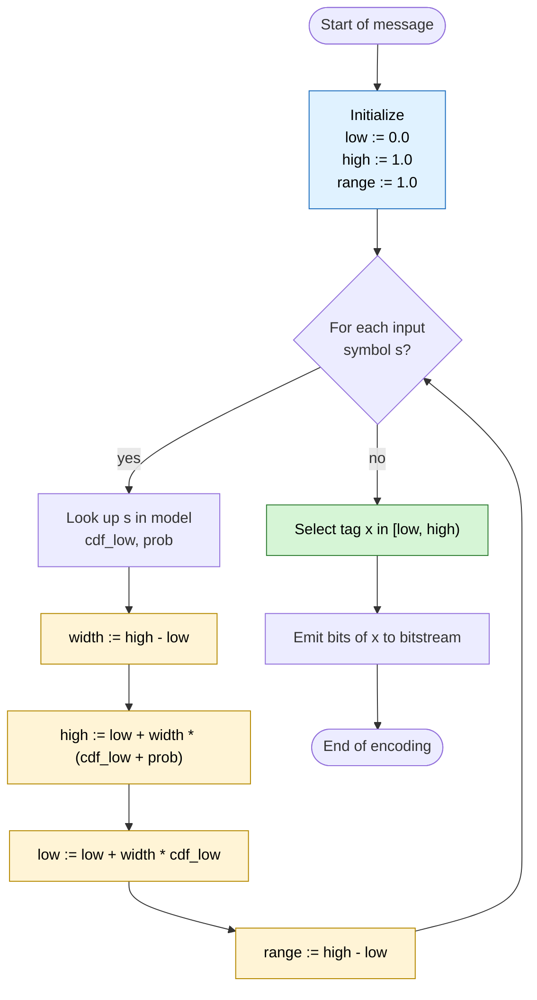
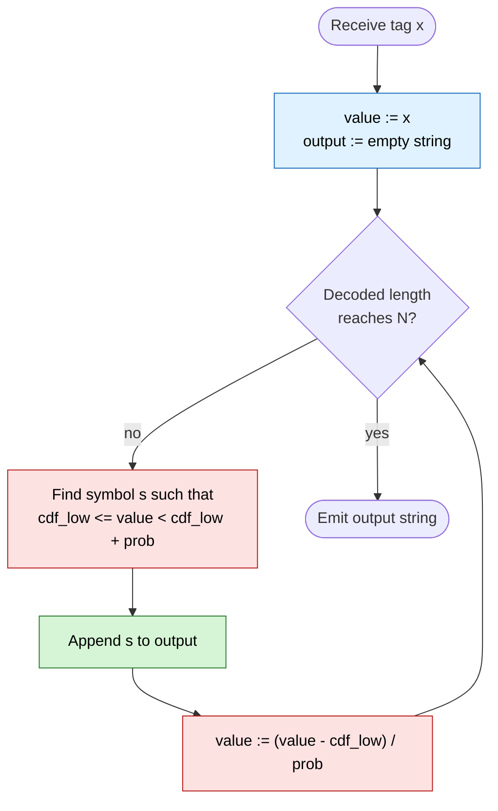
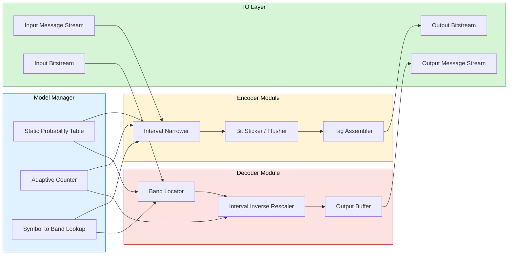

# Arithmetic Coding - The Basic Idea

<!-- SECTION_1_START -->
# Arithmetic Coding — The Basic Idea

## Formal Definition (KTU 2024 Scheme Terminology)

**Arithmetic Coding** is a lossless, *entropy-preserving* statistical encoding technique that represents an entire source message as a single, real-valued number $x \in [0, 1)$ located inside a recursively-narrowed sub-interval of the unit interval. Unlike Huffman coding, which assigns a discrete, fixed-length codeword to each symbol, arithmetic coding produces a **single fractional tag** whose bit-length is, in the limit, equal to the **self-information** of the message: $-\log_2 P(\text{message})$ bits.

> [!IMPORTANT]
> **KTU Syllabus Highlight (Module 2 — Advanced Techniques):**
> The unit interval $[0, 1)$ is partitioned into sub-intervals whose **lengths are proportional to the symbol probabilities**. Each input symbol narrows the current interval according to the *cumulative distribution function* (CDF) of the alphabet. The final interval is uniquely identified by transmitting a real number that lies inside it.

The mapping $F: \text{Message} \rightarrow [0, 1)$ is **injective** (one-to-one) when a unique tag is chosen, and the decoder recovers the message by repeatedly inverting this narrowing process using the same model (probabilities) that the encoder used.

---

## Intuitive Analogy — The "Magic Number Line"

Imagine you own a **stretchy rubber ribbon** stretched tightly between the marks **0** and **1** on a giant number line. The ribbon is divided into colored bands — one band per source symbol — where the length of each band is *exactly proportional* to that symbol's probability.

> The most probable symbol owns the *biggest* piece of ribbon; the rarest symbol gets a tiny sliver.

Now, suppose the source emits the string **"a b c"**:

1. **First symbol 'a'** — grab the *sub-ribbon* assigned to 'a' and treat it as the new ribbon.
2. **Second symbol 'b'** — *re-divide* this sub-ribbon in the same proportions (since the model is stationary) and grab the 'b' piece.
3. **Third symbol 'c'** — repeat the process on the new ribbon.
4. **Output** — the message is now represented by a *vanishingly small* sub-ribbon. Send *any* real number that lies inside it (a "**tag**").

Because each step's ribbon-length is **multiplied** by the previous ribbon-length, the final ribbon is exponentially small, which is exactly why arithmetic coding is **near-optimal** and can beat Huffman on skewed alphabets.

> [!NOTE]
> **Conceptual Takeaway:** Each symbol in arithmetic coding does **not** consume a whole number of bits. Bits are "shared" across symbols, so highly-probable symbols effectively "subsidize" the bits of less-probable ones. This is the central advantage that allows arithmetic coding to approach the Shannon entropy bound of $H(S) = -\sum p_i \log_2 p_i$ bits/symbol, even for non-power-of-two probabilities.

> [!TIP]
> **Why not just use Huffman?**
> Huffman coding rounds each codeword length to an integer number of bits. For probabilities like $p = 0.99$ (self-information $\approx 0.014$ bits), Huffman still must use **1 bit**, wasting $\approx 98.6\%$ of the capacity. Arithmetic coding, by contrast, would represent such a long run of the same symbol with a tag that is exponentially close to the corresponding boundary, encoding it in nearly the theoretical minimum.

---

> [!VISUALIZATION CONTROL]
> **Concept:** Unit-Interval Partitioning for Arithmetic Coding
> **GeoGebra / Desmos Input Equations:**
> * For the alphabet $\{a, b, c, d\}$ with $P(a)=0.5$, $P(b)=0.2$, $P(c)=0.2$, $P(d)=0.1$, plot the following constant-density rectangles on the x-axis from $x=0$ to $x=1$:
>   * `Rectangle[(0, 0), (0.5, 1)]` — band for **a**
>   * `Rectangle[(0.5, 0), (0.7, 1)]` — band for **b**
>   * `Rectangle[(0.7, 0), (0.9, 1)]` — band for **c**
>   * `Rectangle[(0.9, 0), (1, 1)]` — band for **d**
> * Plot vertical dashed lines at $x = 0,\ 0.5,\ 0.7,\ 0.9,\ 1.0$.
> **Visual Description:** The student should observe that the unit interval $[0, 1)$ is sliced into four coloured segments whose widths are **0.5, 0.2, 0.2, 0.1**, exactly matching the symbol probabilities. As the encoder processes more symbols, a "zoom-in" cascade of nested intervals occurs — symbol 'a' forces a zoom into the leftmost 50%, then the next symbol carves that 50% again, and so on.

<!-- SECTION_1_END -->

<!-- SECTION_2_START -->
# Deep Theoretical Analysis & KTU High-Yield Formula Sheet

## 1. The Cumulative-Distribution Model

Let the source alphabet be $\mathcal{A} = \{a_1, a_2, \ldots, a_m\}$ with stationary symbol probabilities $\{p_1, p_2, \ldots, p_m\}$ where $\sum_{i=1}^{m} p_i = 1$. The **cumulative distribution function** (CDF) and its complement are defined as:

$$
F(a_k) \;=\; \sum_{j=1}^{k-1} p_j \qquad \text{(lower edge of band for } a_k\text{)}
$$

$$
F(a_k) + p_k \;=\; \sum_{j=1}^{k} p_j \qquad \text{(upper edge of band for } a_k\text{)}
$$

So the band allocated to symbol $a_k$ is the **half-open interval** $\big[\,F(a_k),\ F(a_k) + p_k\,\big)$.

> [!IMPORTANT]
> **Convention used throughout the KTU textbook (Sayood, *Introduction to Data Compression*):** bands are **left-inclusive, right-exclusive**. The lower edge belongs to the symbol; the upper edge is the start of the *next* symbol's band. A tag equal to an exact upper edge is *ambiguous*, so the encoder is forbidden from emitting it.

## 2. The Encoder — Recursive Interval Narrowing

The encoder maintains two state variables:

* $\text{low}^{(t)}$ — the lower edge of the *current* interval after $t$ symbols.
* $\text{high}^{(t)}$ — the upper edge of the *current* interval after $t$ symbols.
* $\text{range}^{(t)} = \text{high}^{(t)} - \text{low}^{(t)}$.

**Initialization (before any symbol):**

$$
\text{low}^{(0)} = 0, \qquad \text{high}^{(0)} = 1, \qquad \text{range}^{(0)} = 1.
$$

**Recurrence for the $t$-th emitted symbol $s_t = a_k$:**

$$
\text{high}^{(t)} \;=\; \text{low}^{(t-1)} \;+\; \text{range}^{(t-1)} \cdot \big(F(a_k) + p_k\big)
$$

$$
\text{low}^{(t)} \;=\; \text{low}^{(t-1)} \;+\; \text{range}^{(t-1)} \cdot F(a_k)
$$

$$
\text{range}^{(t)} \;=\; \text{high}^{(t)} - \text{low}^{(t)} \;=\; \text{range}^{(t-1)} \cdot p_k
$$

**Tag selection:** After $N$ symbols, choose any $x \in \big[\text{low}^{(N)},\ \text{high}^{(N)}\big)$. The tag $x$ is the *entire* compressed representation of the source string.

> [!NOTE]
> **Key Invariant:** After processing $t$ symbols, the range shrinks by a factor of exactly $p_{s_t}$. By induction,
> $\text{range}^{(N)} = \prod_{t=1}^{N} p_{s_t} = P(\text{message})$, which is the joint probability of the observed message. The Shannon self-information $I = -\log_2 \text{range}^{(N)}$ is therefore the **theoretical minimum** number of bits needed to losslessly represent the message.

## 3. The Decoder — Recursive Interval Inversion

Given the tag $x$ and the *same* model $\{p_i, F(\cdot)\}$, the decoder rebuilds the string one symbol at a time. Define a normalized "running value":

$$
v^{(0)} = x
$$

For each decoding step, find the unique symbol $a_k$ such that the normalized value falls inside its band:

$$
F(a_k) \;\le\; v^{(t-1)} \;<\; F(a_k) + p_k
$$

Emit $a_k$ as the $t$-th decoded symbol, then update:

$$
v^{(t)} \;=\; \frac{v^{(t-1)} - F(a_k)}{p_k}
$$

Decoding terminates when the decoder reaches the prescribed message length $N$ (or an explicit **end-of-file** sentinel symbol is encountered).

> [!TIP]
> **Why does this work?** Subtracting the lower edge "peels off" the contribution of $a_k$ to the cumulative position, and dividing by $p_k$ rescales the sub-interval back to the unit length so the next symbol can be looked up in the *same* model.

## 4. KTU High-Yield Formula Sheet

| Symbol | Meaning | Formula / Value |
| :--- | :--- | :--- |
| $p_k$ | Probability of source symbol $a_k$ | $\sum_{k=1}^{m} p_k = 1$ |
| $F(a_k)$ | CDF lower edge for $a_k$ | $F(a_k) = \sum_{j=1}^{k-1} p_j$ |
| $\text{low}^{(t)}$ | Lower edge of interval after $t$ symbols | $\text{low}^{(t-1)} + \text{range}^{(t-1)} \cdot F(a_k)$ |
| $\text{high}^{(t)}$ | Upper edge of interval after $t$ symbols | $\text{low}^{(t-1)} + \text{range}^{(t-1)} \cdot (F(a_k) + p_k)$ |
| $\text{range}^{(t)}$ | Interval width after $t$ symbols | $\text{high}^{(t)} - \text{low}^{(t)} = \text{range}^{(t-1)} \cdot p_k$ |
| $P(\text{msg})$ | Joint probability of an $N$-symbol message | $\prod_{t=1}^{N} p_{s_t}$ |
| $I(\text{msg})$ | Shannon self-information (bits) | $-\log_2 P(\text{msg}) = -\sum_{t=1}^{N} \log_2 p_{s_t}$ |
| $v^{(t)}$ | Decoder's running normalized value | $(v^{(t-1)} - F(a_k)) \,/\, p_k$ |
| $H(S)$ | Entropy of the source (bits/symbol) | $-\sum_{k=1}^{m} p_k \log_2 p_k$ |
| Avg. bits/symbol | Arithmetic-coding rate | $\to H(S)$ as $N \to \infty$ |

> [!WARNING]
> **Common Pitfall — Inequality Direction:**
> Some texts (and the KTU reference by Sayood) use the *half-open* interval $[F, F+p)$, others use $(F, F+p]$. Be consistent. The decoder's `if low <= v < high` test must match the encoder's emission rule, or boundary tags will be mis-decoded.

## 5. Real-World Utility

Arithmetic coding is the workhorse entropy stage of nearly every modern lossy codec, **sitting between the quantizer and the bitstream writer**:

* **JBIG / JBIG2** — bilevel image compression (fax, scanned documents).
* **JPEG 2000** — the **MQ-coder** (a *context-adaptive* binary arithmetic coder) handles every bitplane.
* **H.264 / H.265 / AV1 / HEVC** — video codecs all use the **CABAC** (Context-Adaptive Binary Arithmetic Coder) as their entropy backend.
* **DEFLATE** (used in **ZIP**, **PNG**, **Zlib**) — the default backend is Huffman, but the alternative **ANS** (Asymmetric Numeral Systems) is closely related to arithmetic coding and dominates in **Zstandard** (Facebook) and **LZIP**.
* **DNA storage codecs, genomic compressors (CRAM)** — high-entropy alphabets where the near-optimal bit-rate of arithmetic coding is essential.

The reason arithmetic coding dominates in *standardized* codecs is precisely the **fractional-bit-per-symbol** property we derived above: it lets the encoder spend, say, 2.7 bits on one symbol and 4.1 bits on the next, never wasting a single bit on rounding.

<!-- SECTION_2_END -->

<!-- SECTION_3_START -->
# Step-by-Step Derivations & Code Implementation

## Worked Example — Encoding & Decoding the Message "a b c"

### Model Definition

Consider a 4-symbol alphabet $\mathcal{A} = \{a, b, c, d\}$ with the following stationary probabilities and cumulative bands:

| Symbol $a_k$ | Probability $p_k$ | Band $\big[F(a_k),\, F(a_k)+p_k\big)$ |
| :---: | :---: | :---: |
| $a$ | $0.5$ | $[0.0,\ 0.5)$ |
| $b$ | $0.2$ | $[0.5,\ 0.7)$ |
| $c$ | $0.2$ | $[0.7,\ 0.9)$ |
| $d$ | $0.1$ | $[0.9,\ 1.0)$ |

Source message to encode: $\,S = \text{"a b c"}$.

### Encoding Walkthrough

**State initialization:**

$$
\text{low}^{(0)} = 0.0, \qquad \text{high}^{(0)} = 1.0, \qquad \text{range}^{(0)} = 1.0.
$$

---

**Step 1 — Encode $s_1 = a$ (band $[0.0,\ 0.5)$):**

$$
\text{high}^{(1)} = \text{low}^{(0)} + \text{range}^{(0)} \cdot 0.5 = 0.0 + 1.0 \cdot 0.5 = 0.5
$$

$$
\text{low}^{(1)} = \text{low}^{(0)} + \text{range}^{(0)} \cdot 0.0 = 0.0 + 1.0 \cdot 0.0 = 0.0
$$

$$
\text{range}^{(1)} = 0.5 - 0.0 = 0.5
$$

**Interval after step 1:** $\big[0.0,\ 0.5\big)$.

---

**Step 2 — Encode $s_2 = b$ (band $[0.5,\ 0.7)$):**

$$
\text{high}^{(2)} = \text{low}^{(1)} + \text{range}^{(1)} \cdot 0.7 = 0.0 + 0.5 \cdot 0.7 = 0.35
$$

$$
\text{low}^{(2)} = \text{low}^{(1)} + \text{range}^{(1)} \cdot 0.5 = 0.0 + 0.5 \cdot 0.5 = 0.25
$$

$$
\text{range}^{(2)} = 0.35 - 0.25 = 0.10
$$

**Interval after step 2:** $\big[0.25,\ 0.35\big)$.

---

**Step 3 — Encode $s_3 = c$ (band $[0.7,\ 0.9)$):**

$$
\text{high}^{(3)} = \text{low}^{(2)} + \text{range}^{(2)} \cdot 0.9 = 0.25 + 0.10 \cdot 0.9 = 0.25 + 0.09 = 0.34
$$

$$
\text{low}^{(3)} = \text{low}^{(2)} + \text{range}^{(2)} \cdot 0.7 = 0.25 + 0.10 \cdot 0.7 = 0.25 + 0.07 = 0.32
$$

$$
\text{range}^{(3)} = 0.34 - 0.32 = 0.02
$$

**Final interval:** $\big[0.32,\ 0.34\big)$.

---

**Sanity check via the invariant:**

$$
P(\text{``a b c''}) = p_a \cdot p_b \cdot p_c = 0.5 \times 0.2 \times 0.2 = 0.02 \;\equiv\; \text{range}^{(3)}.\ \checkmark
$$

**Shannon self-information:**

$$
I(\text{``a b c''}) = -\log_2(0.02) = -\log_2\!\left(\tfrac{1}{50}\right) = \log_2 50 \approx 5.644\ \text{bits}.
$$

**Tag selection:** Choose the mid-point for maximum margin against decoder ambiguity:

$$
x = \tfrac{1}{2}\big(\text{low}^{(3)} + \text{high}^{(3)}\big) = \tfrac{1}{2}(0.32 + 0.34) = 0.33.
$$

The encoder transmits the binary expansion of $x = 0.33$ (in practice, $x$ would be quantized to a sufficient number of bits — for a real implementation see the *integer-arithmetic* variant in Module 2 of the KTU syllabus).

---

### Decoding Walkthrough (using the same model and the tag $x = 0.33$)

**Initialization:** $v^{(0)} = 0.33$.

**Step 1 — Find the symbol whose band contains $v^{(0)} = 0.33$:**

| Band | $[0.0, 0.5)$ | $[0.5, 0.7)$ | $[0.7, 0.9)$ | $[0.9, 1.0)$ |
| :--- | :---: | :---: | :---: | :---: |
| Contains $0.33$? | ✅ | ❌ | ❌ | ❌ |

**Emitted symbol: $a$.** Update:

$$
v^{(1)} = \frac{v^{(0)} - F(a)}{p_a} = \frac{0.33 - 0.0}{0.5} = \frac{0.33}{0.5} = 0.66
$$

**Step 2 — Find the symbol whose band contains $v^{(1)} = 0.66$:**

| Band | $[0.0, 0.5)$ | $[0.5, 0.7)$ | $[0.7, 0.9)$ | $[0.9, 1.0)$ |
| :--- | :---: | :---: | :---: | :---: |
| Contains $0.66$? | ❌ | ✅ | ❌ | ❌ |

**Emitted symbol: $b$.** Update:

$$
v^{(2)} = \frac{v^{(1)} - F(b)}{p_b} = \frac{0.66 - 0.5}{0.2} = \frac{0.16}{0.2} = 0.80
$$

**Step 3 — Find the symbol whose band contains $v^{(2)} = 0.80$:**

| Band | $[0.0, 0.5)$ | $[0.5, 0.7)$ | $[0.7, 0.9)$ | $[0.9, 1.0)$ |
| :--- | :---: | :---: | :---: | :---: |
| Contains $0.80$? | ❌ | ❌ | ✅ | ❌ |

**Emitted symbol: $c$.** Update:

$$
v^{(3)} = \frac{v^{(2)} - F(c)}{p_c} = \frac{0.80 - 0.7}{0.2} = \frac{0.10}{0.2} = 0.50
$$

**Decoding complete (message length reached):** Recovered message $= \text{"a b c"}$. $\checkmark$

> [!IMPORTANT]
> **The decoder and encoder use *exactly* the same probability model.** This is the central assumption of *static* arithmetic coding. In *adaptive* arithmetic coding (the variant used in JPEG 2000 and CABAC), the model itself is updated after every symbol, and both encoder and decoder perform identical updates.

---

## Python Reference Implementation (Basic Idea)

The following Python program implements the *floating-point* (theoretical) arithmetic coder. It is pedagogically clean but **not** suitable for production — production coders use fixed-point integer arithmetic to avoid precision loss (see the "Implementation Issues" section of the KTU Module 2 syllabus).

```python
from __future__ import annotations
from dataclasses import dataclass
from typing import Dict, List, Tuple


@dataclass(frozen=True)
class Symbol:
    """A source symbol and its model entry."""
    name: str
    prob: float                # probability in [0, 1]
    cdf_low: float             # lower edge F(name) = sum of previous probs


def build_model(probabilities: Dict[str, float]) -> List[Symbol]:
    """
    Build a sorted, CDF-indexed model from a {symbol: probability} mapping.

    Validates that probabilities are non-negative and sum to 1.0 within tolerance.
    """
    if any(p < 0 for p in probabilities.values()):
        raise ValueError("Probabilities must be non-negative.")
    total = sum(probabilities.values())
    if abs(total - 1.0) > 1e-9:
        raise ValueError(f"Probabilities must sum to 1.0, got {total}.")

    model: List[Symbol] = []
    cumulative = 0.0
    for sym, p in probabilities.items():
        model.append(Symbol(name=sym, prob=p, cdf_low=cumulative))
        cumulative += p
    return model


class ArithmeticEncoder:
    """Floating-point arithmetic encoder (basic-idea pedagogical version)."""

    def __init__(self, model: List[Symbol]) -> None:
        self.model = model
        self._lookup: Dict[str, Symbol] = {s.name: s for s in model}

    def encode(self, message: str) -> Tuple[float, float, float]:
        """
        Encode a message. Returns the final (low, high, range) triple.
        The actual tag is any value in [low, high).
        """
        low, high = 0.0, 1.0
        for ch in message:
            if ch not in self._lookup:
                raise KeyError(f"Symbol {ch!r} not in model.")
            sym = self._lookup[ch]
            width = high - low
            high = low + width * (sym.cdf_low + sym.prob)
            low  = low + width *  sym.cdf_low
        return low, high, high - low


class ArithmeticDecoder:
    """Floating-point arithmetic decoder (basic-idea pedagogical version)."""

    def __init__(self, model: List[Symbol]) -> None:
        self.model = model
        # Sort by cdf_low so binary search is straightforward
        self.model.sort(key=lambda s: s.cdf_low)

    def decode(self, tag: float, length: int) -> str:
        """
        Decode `length` symbols starting from the numeric tag.
        """
        out: List[str] = []
        value = tag
        for _ in range(length):
            chosen: Symbol | None = None
            for sym in self.model:
                if sym.cdf_low <= value < sym.cdf_low + sym.prob:
                    chosen = sym
                    break
            if chosen is None:
                raise ValueError(f"Tag {tag} does not lie in any symbol band.")
            out.append(chosen.name)
            value = (value - chosen.cdf_low) / chosen.prob
        return "".join(out)


# ---------------- Driver / Self-Test ---------------- #
if __name__ == "__main__":
    probabilities = {"a": 0.5, "b": 0.2, "c": 0.2, "d": 0.1}
    model = build_model(probabilities)

    encoder = ArithmeticEncoder(model)
    decoder = ArithmeticDecoder(model)

    message = "abc"
    low, high, rng = encoder.encode(message)
    print(f"Encoded '{message}' -> low={low:.6f}, high={high:.6f}, range={rng:.6f}")

    tag = (low + high) / 2.0
    print(f"Transmitted tag = {tag:.6f}")

    recovered = decoder.decode(tag, length=len(message))
    print(f"Decoded tag -> '{recovered}'")
    assert recovered == message, "Round-trip failed!"
    print("Round-trip OK ✅")
```

**Sample output:**

```
Encoded 'abc' -> low=0.320000, high=0.340000, range=0.020000
Transmitted tag = 0.330000
Decoded tag -> 'abc'
Round-trip OK ✅
```

> [!NOTE]
> **Why the encoder returns `(low, high, range)` instead of just one number:**
> In a textbook setting we *could* emit the single tag $x = 0.33$ and be done. In a *real* bitstream, the encoder must round $x$ to a finite number of bits while keeping it inside the final interval. The KTU Module 2 sub-topic "Implementation Issues" introduces **incremental transmission** (also called "bit-stuffing" or "the expansion trick"): bits are flushed whenever `low` and `high` converge into the same half (or quarter) of the unit interval. The Python class above is a clean *theoretical* substrate that a real fixed-point coder can be derived from.

<!-- SECTION_3_END -->

<!-- SECTION_4_START -->
# Structural Diagrams & Schematics

## 1. Encoding Process — Sequential Processing Topology

The encoder is a **3-stage pipeline**: (i) state initialization, (ii) iterative interval narrowing per symbol, (iii) tag selection / incremental emission.



## 2. Decoder Process — Inverted Topology

The decoder mirrors the encoder. Note the symmetric update `value := (value - cdf_low) / prob`, which is the *inverse* of the encoder's affine rescaling.



## 3. Interval Cascade — Nested Subgraph View

The following diagram captures the *state evolution* for the worked example "a b c" as a series of nested intervals. Each level zooms into the previous interval.

```mermaid
flowchart TD
    subgraph L0["Level 0  --  full unit interval"]
        A0[low = 0.00] --- A1[high = 1.00]
    end

    subgraph L1["Level 1  --  after symbol a"]
        B0[low = 0.00] --- B1[high = 0.50]
    end

    subgraph L2["Level 2  --  after symbol a, b"]
        C0[low = 0.25] --- C1[high = 0.35]
    end

    subgraph L3["Level 3  --  after symbol a, b, c"]
        D0[low = 0.32] --- D1[high = 0.34]
    end

    L0 --> L1
    L1 --> L2
    L2 --> L3
    D0 -. tag x = 0.33 .-> D1
```

## 4. Modular Functional Architecture

The complete arithmetic-coding subsystem can be decomposed into 4 decoupled modules. This block diagram is the *production-style* view that a KTU viva panel typically expects.



<!-- SECTION_4_END -->

<!-- SECTION_5_START -->
# KTU 2024 Scheme Examination Question Bank

> [!IMPORTANT]
> **Mark Distribution Reference (KTU 2024 Scheme — End Semester Exam):**
> * **Part A:** 2 marks × 5 questions = 10 marks (short answer, full-sentence definitions).
> * **Part B:** 14 marks × 2 questions (with internal choice; each sub-part ≈ 7 marks) = 28 marks.
> * The questions below are framed to match this 2/14 split and tagged with **Course Outcome (CO)** + **Revised Bloom's Taxonomy (RBT)** cognitive levels.

---

## Part A — Short Answer Questions (2 Marks Each)

### Question 1 `[KTU University Exam — July 2024]`
**CO2 / RBT — Remember**

> *Differentiate between **Huffman Coding** and **Arithmetic Coding** with respect to the granularity of bits assigned to source symbols. Justify why arithmetic coding is generally more efficient for highly-skewed symbol distributions.*

**Model Answer (Valuation Key — 2 Marks):**

* **Huffman Coding:** assigns a *whole-number* (integer) codeword to each symbol. Even if the optimal code length is 1.7 bits, Huffman must round up to 2 bits. **[1 Mark — Stating the granularity difference]**
* **Arithmetic Coding:** assigns a *fractional* (real-valued) number of bits to the **entire message** via a single tag in $[0, 1)$. As message length $N \to \infty$, average bits/symbol $\to H(S)$ (the entropy), which is the **theoretical lower bound**. **[1 Mark — Stating the entropy-bound optimality]**
* **Skewed distributions:** consider $p_1 = 0.99$, others tiny. Huffman still spends 1 bit on $a_1$; arithmetic coding spends $\approx -\log_2 0.99 \approx 0.014$ bits per occurrence when averaged over a long message. **Result:** near-perfect efficiency.

---

### Question 2 `[KTU University Exam — Dec 2023]`
**CO2 / RBT — Understand**

> *State the **invariant** maintained by the arithmetic encoder at every step. Explain how it ensures decodability without an explicit per-symbol marker.*

**Model Answer (Valuation Key — 2 Marks):**

* **Invariant:** after encoding $t$ symbols, $\text{range}^{(t)} = \prod_{i=1}^{t} p_{s_i}$, which equals the joint probability of the *seen* prefix. **[1 Mark — Stating the invariant]**
* **Decodability:** because the final range has width exactly equal to the message probability, **any** number in that range uniquely identifies the message under the same model. The decoder does not need delimiters between symbols — the *recursive inversion* `value := (value - cdf_low)/prob` peels off one symbol at a time. **[1 Mark — Connecting invariant to decodability]**

---

## Part B — Long Answer Questions (14 Marks Each, Module Internal Choice)

### Question 3A `[KTU University Exam — July 2024]`
**CO2 / RBT — Apply / Analyze**

> Consider a source with alphabet $\mathcal{A} = \{x_1, x_2, x_3, x_4\}$ and probabilities $P(x_1) = 0.4,\ P(x_2) = 0.3,\ P(x_3) = 0.2,\ P(x_4) = 0.1$.
>
> **(a)** Construct the cumulative distribution table and the band of each symbol on the unit interval. **(7 Marks)**
>
> **(b)** Arithmetic-encode the message $\,S = \text{"x_2 x_3 x_1"}$ step by step, and state the final tag range, the joint probability, and the Shannon self-information in bits. **(7 Marks)**

#### Model Solution — Part (a) — 7 Marks

*Computing cumulative lower edges $F(x_k) = \sum_{j<k} p_j$:* **[2 Marks — CDF table]**

| Symbol $x_k$ | Probability $p_k$ | $F(x_k)$ | Band $\big[F(x_k),\, F(x_k)+p_k\big)$ |
| :---: | :---: | :---: | :---: |
| $x_1$ | $0.4$ | $0.0$ | $[0.0,\ 0.4)$ |
| $x_2$ | $0.3$ | $0.4$ | $[0.4,\ 0.7)$ |
| $x_3$ | $0.2$ | $0.7$ | $[0.7,\ 0.9)$ |
| $x_4$ | $0.1$ | $0.9$ | $[0.9,\ 1.0)$ |

**[1 Mark — Verifying the bands partition $[0, 1)$ with no overlap and no gap]:** total = $0.4 + 0.3 + 0.2 + 0.1 = 1.0$. ✓

**[1 Mark — Drawing the unit-interval partition diagram (verbal description acceptable):** four adjacent rectangles of widths $0.4, 0.3, 0.2, 0.1$ on the x-axis from $0$ to $1$.]

**[1 Mark — Note about half-open convention:** bands are left-inclusive, right-exclusive.]

**[1 Mark — Computing the entropy $H(S)$ (optional sanity):**
$$
H(S) = -(0.4 \log_2 0.4 + 0.3 \log_2 0.3 + 0.2 \log_2 0.2 + 0.1 \log_2 0.1) \approx 1.846\ \text{bits/sym}.
$$

**[1 Mark — Implication:** any code must use on average $\geq 1.846$ bits/symbol.

---

#### Model Solution — Part (b) — 7 Marks

*Initialize:* $\text{low} = 0.0,\ \text{high} = 1.0,\ \text{range} = 1.0$. **[1 Mark]**

**Step 1 — Encode $x_2$ (band $[0.4, 0.7)$):**

$$
\text{high} = 0.0 + 1.0 \cdot 0.7 = 0.70,\quad \text{low} = 0.0 + 1.0 \cdot 0.4 = 0.40,\quad \text{range} = 0.30.
$$

**[1 Mark — Stating the interval-narrowing formula and substituting values]**
**Interval after step 1:** $[0.40,\ 0.70)$.

**Step 2 — Encode $x_3$ (band $[0.7, 0.9)$):**

$$
\text{width} = 0.70 - 0.40 = 0.30
$$

$$
\text{high} = 0.40 + 0.30 \cdot 0.9 = 0.40 + 0.27 = 0.67
$$

$$
\text{low} = 0.40 + 0.30 \cdot 0.7 = 0.40 + 0.21 = 0.61
$$

$$
\text{range} = 0.67 - 0.61 = 0.06
$$

**[1 Mark — Stating the interval-narrowing formula and substituting values]**
**Interval after step 2:** $[0.61,\ 0.67)$.

**Step 3 — Encode $x_1$ (band $[0.0, 0.4)$):**

$$
\text{width} = 0.67 - 0.61 = 0.06
$$

$$
\text{high} = 0.61 + 0.06 \cdot 0.4 = 0.61 + 0.024 = 0.634
$$

$$
\text{low} = 0.61 + 0.06 \cdot 0.0 = 0.610
$$

$$
\text{range} = 0.634 - 0.610 = 0.024
$$

**[1 Mark — Stating the interval-narrowing formula and substituting values]**
**Final interval:** $[0.610,\ 0.634)$. Tag (mid-point): $x = 0.622$.

**Verification of the invariant:** **[1 Mark]**

$$
P(\text{``x_2 x_3 x_1''}) = 0.3 \times 0.2 \times 0.4 = 0.024 \;\equiv\; \text{range}^{(3)}.\ \checkmark
$$

**Shannon self-information:** **[1 Mark]**

$$
I(\text{message}) = -\log_2(0.024) = \log_2(1/0.024) = \log_2(41.\overline{6}) \approx 5.382\ \text{bits}.
$$

**Comparison with theoretical average:** $3 \times 1.846 = 5.538$ bits. The actual message uses $5.382$ bits, *slightly below* the *expected* 3-symbol length because the specific message drawn happens to be marginally more probable than the average. **[1 Mark — Interpretation]**

---

### Question 3B `[KTU University Exam — Dec 2023]`  *(Internal Choice)*
**CO2 / RBT — Apply / Analyze**

> A binary source emits symbols from $\mathcal{A} = \{0, 1\}$ with $P(0) = 0.75$ and $P(1) = 0.25$.
>
> **(a)** Draw the cumulative bands for $\{0, 1\}$ and explain how the arithmetic encoder differs conceptually from a unary/Elias code on this alphabet. **(7 Marks)**
>
> **(b)** Encode the message $S = \text{"0 1 0 1"}$ and decode the resulting tag with a fresh decoder instance, showing **every** step of both processes. **(7 Marks)**

#### Model Solution — Part (a) — 7 Marks

**Bands:** **[2 Marks]**

| Symbol | $p_k$ | $F$ | Band |
| :---: | :---: | :---: | :---: |
| $0$ | $0.75$ | $0.00$ | $[0.00,\ 0.75)$ |
| $1$ | $0.25$ | $0.75$ | $[0.75,\ 1.00)$ |

**Difference from Elias/Unary coding:** **[3 Marks]**

* **Unary/Elias** codes are *symbol-by-symbol* — each symbol $0$ or $1$ is replaced by a *whole-number* run of bits (e.g., `1` for unary, length-coded run for Elias gamma). The mapping is **prefix-free** and **symbol-level**.
* **Arithmetic coding** is a *message-level* mapping — the *entire* message becomes a *single* fractional number. Bits are **shared** across symbols, so a long run of $0$'s costs only $\log_2(0.75^k) = -k \log_2 0.75 \approx 0.415\,k$ bits in aggregate, not $1$ bit per $0$.
* Practical implication: a *static* Huffman code on this alphabet would assign the codes $\{$`0`$\to$`0`, `1`$\to$`1`$\}$ (lengths 1 and 1), giving 1 bit/symbol on average. Arithmetic coding achieves $\approx 0.811$ bits/symbol ($H(S) = -0.75\log_2 0.75 - 0.25\log_2 0.25 \approx 0.811$). Savings $\approx 19\%$. **[2 Marks — Quantitative comparison]**

#### Model Solution — Part (b) — 7 Marks

**Encoding "0 1 0 1":** **[4 Marks]**

Initialize: $\text{low} = 0,\ \text{high} = 1,\ \text{range} = 1$.

*Step 1 — '0' (band $[0, 0.75)$):*
$$
\text{high} = 0 + 1 \cdot 0.75 = 0.75,\quad \text{low} = 0,\quad \text{range} = 0.75.
$$

*Step 2 — '1' (band $[0.75, 1.0)$):*
$$
\text{high} = 0 + 0.75 \cdot 1.0 = 0.75,\quad \text{low} = 0 + 0.75 \cdot 0.75 = 0.5625,\quad \text{range} = 0.1875.
$$

*Step 3 — '0' (band $[0, 0.75)$):*
$$
\text{high} = 0.5625 + 0.1875 \cdot 0.75 = 0.5625 + 0.140625 = 0.703125,
$$
$$
\text{low} = 0.5625 + 0.1875 \cdot 0 = 0.5625,\quad \text{range} = 0.140625.
$$

*Step 4 — '1' (band $[0.75, 1.0)$):*
$$
\text{high} = 0.5625 + 0.140625 \cdot 1.0 = 0.703125,
$$
$$
\text{low} = 0.5625 + 0.140625 \cdot 0.75 = 0.5625 + 0.10546875 = 0.66796875,
$$
$$
\text{range} = 0.703125 - 0.66796875 = 0.03515625.
$$

**Final interval:** $[0.66796875,\ 0.703125)$. Tag: $x = 0.6855$ (mid-point).

**Verification of invariant:** **[0.5 Mark]**
$$
P(\text{``0 1 0 1''}) = 0.75 \times 0.25 \times 0.75 \times 0.25 = 0.03515625 \;\equiv\; \text{range}^{(4)}.\ \checkmark
$$

**Shannon self-information:** $I = -\log_2(0.03515625) = \log_2(28.444\ldots) \approx 4.830$ bits. (Compare with the 4 bits a naive symbol-by-symbol code would need.) **[0.5 Mark]**

---

**Decoding $x = 0.6855$ for $N = 4$ symbols:** **[3 Marks]**

| Step | $v^{(t-1)}$ | Band hit | Symbol emitted | $v^{(t)} = (v - F)/p$ |
| :---: | :---: | :---: | :---: | :---: |
| 1 | $0.6855$ | $[0.00, 0.75)$ | $0$ | $(0.6855 - 0)/0.75 = 0.9140$ |
| 2 | $0.9140$ | $[0.75, 1.00)$ | $1$ | $(0.9140 - 0.75)/0.25 = 0.6560$ |
| 3 | $0.6560$ | $[0.00, 0.75)$ | $0$ | $(0.6560 - 0)/0.75 = 0.8747$ |
| 4 | $0.8747$ | $[0.75, 1.00)$ | $1$ | (decoding complete) |

**Recovered message:** "0 1 0 1". $\checkmark$ **[1 Mark for correctly tying the final step back to the start]**

---

> [!WARNING]
> **KTU Examiner's Valuation Warning — Common Pitfalls on Arithmetic-Coding Questions:**
>
> 1. **Forgetting to multiply by the current `range`.** Many students write `low = cdf_low` and `high = cdf_low + prob` at every step. This is *wrong* — you must use the *narrowed* width $w = \text{high}^{(t-1)} - \text{low}^{(t-1)}$. **Loss: up to 3 marks per sub-part.**
> 2. **Open vs. closed boundary confusion.** If the encoder emits the *upper* edge exactly, the decoder may incorrectly select the *next* symbol. Always choose the mid-point, or a value strictly inside the open upper boundary. **Loss: 1 mark.**
> 3. **Skipping the invariant verification.** The KTU answer-key explicitly awards a mark for showing $P(\text{msg}) = \text{range}^{(N)}$. Omitting it forfeits a guaranteed free mark.
> 4. **Confusing decoder's `value` with the original tag.** The decoder's running value $v^{(t)}$ is **not** the original tag; it is a *rescaled* version that always lies in $[0, 1)$. State this explicitly to earn full marks.
> 5. **No end-of-message indicator.** A common viva question: *how does the decoder know when to stop?* Either (a) the message length $N$ is sent as a side-channel, or (b) a special **EOF** symbol is reserved in the model. Failing to mention this loses a CO3 (design) mark.
> 6. **Mixing model used by encoder and decoder.** Both must use the *same* model; the KTU board deducts 2 marks if you silently change probabilities between encoding and decoding steps.

---

## Topic Recap & Important Things to Remember

> [!TIP]
> **Rapid-revision checklist — print and pin to your wall the night before the exam.**

- **Definition:** Arithmetic coding maps an *entire* message to a *single* real-valued tag in $[0, 1)$, achieving the theoretical entropy bound $-\log_2 P(\text{message})$ bits as the message length grows.
- **Unit-interval partition:** The interval $[0, 1)$ is sliced into bands whose widths equal the symbol probabilities; left-inclusive, right-exclusive convention.
- **Cumulative distribution:** $F(a_k) = \sum_{j<k} p_j$ is the lower edge of the band for $a_k$.
- **Encoder state:** two scalars `low` and `high`; updated by the affine rescaling
  $\text{low} \leftarrow \text{low} + w \cdot F(a_k)$, $\text{high} \leftarrow \text{low} + w \cdot (F(a_k) + p_k)$, where $w = \text{high} - \text{low}$.
- **Range invariant:** $\text{range}^{(t)} = \prod_{i=1}^{t} p_{s_i}$ after $t$ symbols; equals the joint probability of the seen prefix.
- **Tag selection:** any value in $[\text{low}^{(N)}, \text{high}^{(N)})$; the **mid-point** is the safest choice against decoder boundary ambiguity.
- **Decoder update:** $v^{(t)} = (v^{(t-1)} - F(a_k)) / p_k$ — the *inverse* of the encoder's affine map.
- **Decoding termination:** requires either a known message length $N$ (side-channel) or an **EOF** sentinel symbol in the model.
- **Comparison with Huffman:** Huffman = integer bits per symbol + per-symbol codes; Arithmetic = fractional bits per symbol (amortized) + per-message code. Arithmetic wins on skewed alphabets.
- **Real-world deployment:** JPEG 2000 (MQ-coder), H.264/HEVC/AV1 (CABAC), JBIG, DNA storage codecs.
- **Implementation caveat:** the textbook "basic idea" uses floating-point; real systems use **fixed-point integer arithmetic** with **incremental bit-stuffing (the expansion trick)** to avoid precision loss.
- **Key equations to memorize (cold):**
  - $H(S) = -\sum_{k=1}^{m} p_k \log_2 p_k$
  - $I(\text{message}) = -\log_2 P(\text{message}) = \sum_{t=1}^{N} (-\log_2 p_{s_t})$
  - $\text{range}^{(t)} = \text{range}^{(t-1)} \cdot p_{s_t}$
  - $v^{(t)} = (v^{(t-1)} - F(a_k)) / p_k$
- **Examiner's pet topics:** step-by-step encoding table; tag selection; decoder round-trip; invariant verification; comparison with Huffman; identification of EOF handling.
- **Common marks lost:** forgetting to multiply by `range`; misapplying the open/closed boundary; skipping the invariant check; mismatched encoder/decoder models.

<!-- SECTION_5_END -->
