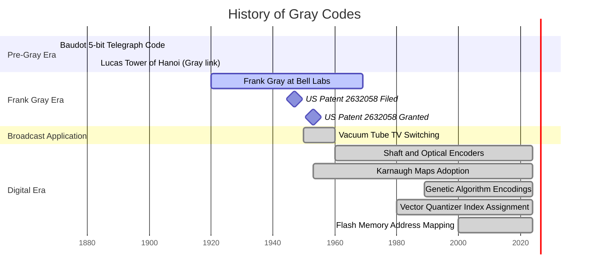
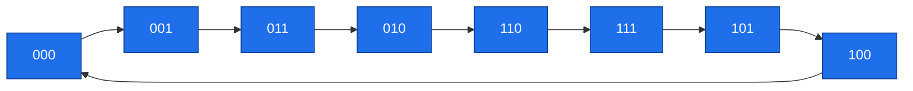
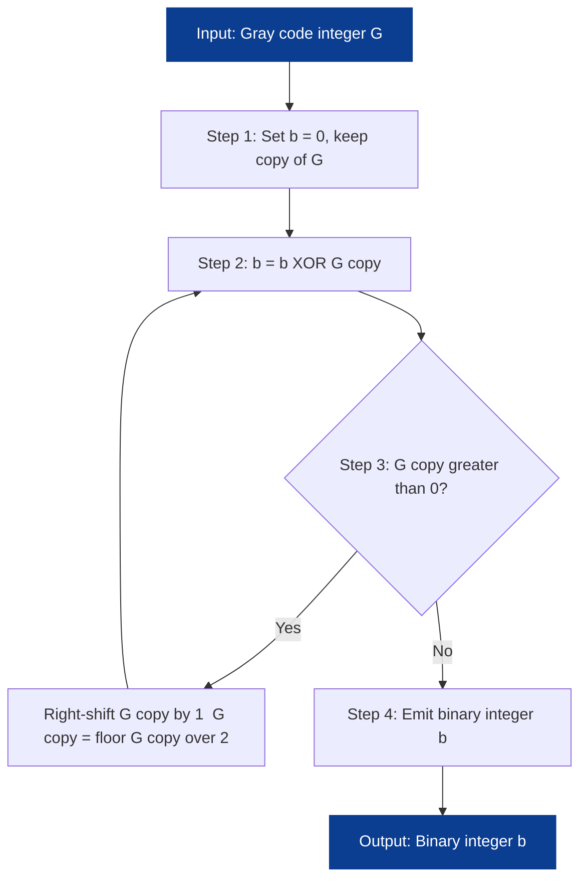

# History of Gray Codes

<!-- SECTION_1_START -->

## 1. Core Technical Definition & Intuitive Overview

### Formal Definition

A **Gray code**, formally known as the **Binary Reflected Gray Code (BRGC)**, is a binary numbering system in which **two successive values differ in exactly one binary digit (bit)**. For a cyclic Gray code of order $n$, the last code word also differs from the first in exactly one bit, giving every adjacent pair a **Hamming distance of 1**.

Mathematically, an $n$-bit Gray code is a permutation $\pi$ of $\{0, 1, \dots, 2^n - 1\}$ such that:

$$
H\!\left(\pi(i) \oplus \pi(i+1)\right) = 1 \quad \forall i \in \{0, 1, \dots, 2^n - 2\}
$$

where $H(\cdot)$ denotes the **Hamming weight** (the number of 1-bits) and $\oplus$ is the bitwise XOR.

> [!NOTE]
> **KTU 2024 Syllabus Definition:** "A Gray code is an ordering of $2^n$ binary strings of length $n$ such that every pair of adjacent strings (including the cyclic pair from the last to the first) differ in exactly one bit position. It is generated by a reflective construction and is widely used in data compression for index assignment in vector quantizers."

### Conceptual Analogy / Intuition

Imagine an **odometer** in a car. Going from $0999$ to $1000$ changes four digits at once. If one of the gears slips during the transition, the displayed number becomes ambiguous (it could read $1999$, $0000$, $1099$, etc.). Now imagine a **counter where only one dial moves at a time** — that is the Gray-code counter. Because only a single bit flips at every step, the *new* value is always exactly one binary step away from the *old* value. This eliminates the "race condition" problem of multi-bit transitions in mechanical relays, vacuum tubes, and high-speed digital circuits.

> [!IMPORTANT]
> **Why this matters in Data Compression (Module 2 link):** In *vector quantization* and *predictive coding*, neighbouring codebook indices are statistically similar. A Gray-code index assignment minimises the average bit-error cost because a 1-bit error moves you to an *adjacent* (semantically similar) symbol rather than a far-off one. This same property is exploited in **Linde–Buzo–Gray (LBG)** index assignment and in **differential pulse-code modulation (DPCM)** channel coding.

### Historical Context

The code is named after **Frank Gray** (1887–1969), a research physicist at **Bell Telephone Laboratories**. He filed US Patent **2,632,058** titled *"Pulse Code Communication"* on **21 November 1947**, and it was granted on **17 March 1953**. The patent was originally designed to control the **vacuum-tube switching of television transmitters**, where the simultaneous flipping of multiple bits produced transient glitches on the broadcast signal. The mathematical structure, however, is older: it is equivalent to a **Hamiltonian cycle on an $n$-dimensional hypercube**, a graph-theoretic object that Édouard Lucas implicitly used in 1883 in his analysis of the *Tower of Hanoi* puzzle.

> [!VISUALIZATION CONTROL]
> **Concept:** 3-bit Gray code as a Hamiltonian cycle on the unit cube
> **GeoGebra / Desmos Input:** Define the 8 cube vertices as $(x,y,z) \in \{0,1\}^3$ and connect them in the order `000 → 001 → 011 → 010 → 110 → 111 → 101 → 100 → 000`.
> **Visual Description:** You should observe a single closed loop that visits every one of the 8 corners of the cube exactly once, with each step moving along precisely one of the cube's 12 edges. This loop is the geometric embodiment of the 3-bit Gray code sequence.

---

<!-- SECTION_1_END -->

<!-- SECTION_2_START -->

## 2. Deep Theoretical Analysis & KTU High-Yield Formula Sheet

### 2.1 The Reflective (Recursive) Construction

An $n$-bit Gray code list $G(n)$ is built from $G(n-1)$ by *prefixing* and *reversing*:

$$
G(n) \;=\; \big[\, 0 \cdot G(n-1) \;\;\big|\;\; 1 \cdot \overline{G(n-1)} \,\big]
$$

where $\cdot$ is concatenation and $\overline{G(n-1)}$ is the list $G(n-1)$ in reverse order. The base case is:

$$
G(1) \;=\; [\, 0, \; 1 \,]
$$

**Worked expansion up to $n=3$:**

$$
\begin{aligned}
G(1) &= [0, 1] \\[4pt]
G(2) &= \big[\, 0\,0,\; 0\,1 \;\big|\; 1\,1,\; 1\,0 \,\big] \;=\; [00, 01, 11, 10] \\[4pt]
G(3) &= \big[\, 000,\; 001,\; 011,\; 010 \;\big|\; 110,\; 111,\; 101,\; 100 \,\big] \\[4pt]
     &= [000, 001, 011, 010, 110, 111, 101, 100]
\end{aligned}
$$

### 2.2 Bit-Level Conversion Rules

Let $B = b_{n-1} b_{n-2} \cdots b_1 b_0$ be a binary integer and $G = g_{n-1} g_{n-2} \cdots g_1 g_0$ the corresponding Gray code.

**Binary $\rightarrow$ Gray** (single XOR mask):
$$
G \;=\; B \oplus \left\lfloor \dfrac{B}{2} \right\rfloor \;=\; B \oplus (B \gg 1)
$$

Per-bit:
$$
g_{n-1} = b_{n-1}, \qquad g_i = b_{i+1} \oplus b_i \quad (0 \le i \le n-2)
$$

**Gray $\rightarrow$ Binary** (cumulative XOR, MSB first):
$$
b_{n-1} = g_{n-1}, \qquad b_i = b_{i+1} \oplus g_i \quad (0 \le i \le n-2)
$$

Equivalently:
$$
b_i \;=\; g_i \oplus g_{i+1} \oplus \cdots \oplus g_{n-1}
$$

### 2.3 KTU Formula Sheet / Cheat Sheet

| Operation | Formula | Boundary Condition | Time / Space Cost |
|---|---|---|---|
| Binary $\to$ Gray | $G = B \oplus (B \gg 1)$ | MSB preserved: $g_{n-1}=b_{n-1}$ | $O(n)$ bit ops, $O(1)$ extra memory |
| Gray $\to$ Binary (iterative) | $b_i = b_{i+1} \oplus g_i$ | $b_{n-1}=g_{n-1}$ | $O(n)$ |
| Gray $\to$ Binary (cumulative XOR) | $b_i = \bigoplus_{k=i}^{n-1} g_k$ | $b_{n-1}=g_{n-1}$ | $O(n^2)$ naive, $O(n)$ with running XOR |
| Reflective construction | $G(n) = [\,0 G(n-1) \mid 1 \overline{G(n-1)}\,]$ | $G(1)=[0,1]$ | Generates $2^n$ codes |
| Cyclic Hamming distance | $H(G_i \oplus G_{(i+1) \bmod 2^n}) = 1$ | Holds for all adjacent pairs | — |
| Hypercube isomorphism | $n$ bits $\longleftrightarrow Q_n$ graph | $\vert V(Q_n) \vert = 2^n$, $\vert E(Q_n) \vert = n \cdot 2^{n-1}$ | $n$-dim cube |
| Index-assignment gain (VQ) | $D_{\text{Gray}} \le D_{\text{natural}} \le 2 D_{\text{Gray}}$ | For 1-bit channel errors | Halves expected distortion |

> [!TIP]
> **Engineering utility in production systems.** The closed-form $G = B \oplus (B \gg 1)$ compiles to *one* shift and *one* XOR on any modern CPU, making it essentially free. It is used inside **rotary shaft encoders** (machine tools, CNC mills, robot joints), **CD/DVD error correction** (CIRC and Reed–Solomon block indexing), **flash-memory wear-levelling** tables, and **Karnaugh-map** simplifications taught in every digital-electronics course. The same single-bit-change property is what makes Gray code a natural *distance-preserving* index assignment in vector-quantised image and speech codecs.

---

<!-- SECTION_2_END -->

<!-- SECTION_3_START -->

## 3. Step-by-Step Derivations & Code/Symbolic Implementation

### 3.1 Derivation of the Binary $\to$ Gray Conversion Formula

We want a mapping $f: \{0,\dots,2^n-1\} \to \{0,\dots,2^n-1\}$ such that for any consecutive $B, B+1$, exactly one bit of $G$ flips.

Let $B$ and $B+1$ be consecutive binary numbers. The binary increment flips a *trailing run* of 1s to 0 and flips the first 0 to the left of that run to 1. For example, $0111 \to 1000$ flips four bits at once.

Now apply the candidate mask $G = B \oplus (B \gg 1)$:

$$
\begin{aligned}
G_i &= B_i \oplus B_{i+1} \\[2pt]
G_{i+1} &= B_{i+1} \oplus B_{i+2} \\[2pt]
G_{i+2} &= B_{i+2} \oplus B_{i+3} \\
&\;\;\vdots
\end{aligned}
$$

When $B$ increments, the *first* position where $B_i$ changes is exactly the run of 1s ending. At that position, $B_i \ne B_{i+1}$, so $G_i$ flips. For positions $i$ *above* the run, both $B_i$ and $B_{i+1}$ are unchanged, so $G_i$ does not flip. For positions $i$ *below* the run, both $B_i$ and $B_{i+1}$ have flipped, but the XOR of two flipped values is unchanged, so $G_i$ does not flip. Therefore **exactly one bit of $G$ changes**, satisfying the Gray-code property. $\blacksquare$

**Per-bit closed form:**

$$
\boxed{\,g_{n-1} = b_{n-1}, \qquad g_i = b_{i+1} \oplus b_i \quad (0 \le i \le n-2)\,}
$$

### 3.2 Derivation of the Gray $\to$ Binary Conversion Formula

We invert the per-bit rule $g_i = b_{i+1} \oplus b_i$ for $i = 0, 1, \dots, n-2$:

$$
b_i = b_{i+1} \oplus g_i
$$

We already know $b_{n-1} = g_{n-1}$ (the MSB is preserved under the forward map). Then we propagate from the top down:

$$
\begin{aligned}
b_{n-1} &= g_{n-1} \\[2pt]
b_{n-2} &= b_{n-1} \oplus g_{n-2} = g_{n-1} \oplus g_{n-2} \\[2pt]
b_{n-3} &= b_{n-2} \oplus g_{n-3} = g_{n-1} \oplus g_{n-2} \oplus g_{n-3} \\[2pt]
&\;\;\vdots \\[2pt]
b_0 &= g_{n-1} \oplus g_{n-2} \oplus \cdots \oplus g_0
\end{aligned}
$$

**Compact form:**

$$
\boxed{\,b_i = \bigoplus_{k=i}^{n-1} g_k \quad \forall i\,}
$$

### 3.3 Worked Example: $B = 13_{10} = 1101_2$

**Binary $\to$ Gray:**

$$
\begin{aligned}
B       &= 1\;1\;0\;1 \\
B \gg 1 &= 0\;1\;1\;0 \\
G = B \oplus (B \gg 1) &= 1 \oplus 0,\; 1 \oplus 1,\; 0 \oplus 1,\; 1 \oplus 0 \\
                       &= 1,\; 0,\; 1,\; 1 \\
\therefore G &= 1011_{\text{Gray}} \;(\text{decimal } 11)
\end{aligned}
$$

**Gray $\to$ Binary (verification):**

$$
\begin{aligned}
b_3 &= g_3 = 1 \\
b_2 &= b_3 \oplus g_2 = 1 \oplus 0 = 1 \\
b_1 &= b_2 \oplus g_1 = 1 \oplus 1 = 0 \\
b_0 &= b_1 \oplus g_0 = 0 \oplus 1 = 1 \\
\therefore B &= 1101_2 = 13_{10} \;\; \checkmark
\end{aligned}
$$

### 3.4 Production-Grade Python Implementation

```python
"""
Gray Code Toolkit - Production Reference Implementation
Course  : DATA COMPRESSION (PECST524) - KTU 2024 Scheme
Module  : 2 - Advanced Techniques
Topic   : History of Gray Codes
"""

from typing import List


def binary_to_gray(n: int) -> int:
    """
    Convert an unsigned binary integer n to its Gray code.

    Uses the closed-form mask: G = B XOR (B >> 1).
    Validated against the formal per-bit definition g_i = b_{i+1} XOR b_i.

    Args:
        n: Non-negative integer in binary representation.

    Returns:
        The Gray code corresponding to n.

    Raises:
        ValueError: If n is negative.
    """
    if n < 0:
        raise ValueError("binary_to_gray requires a non-negative integer")
    return n ^ (n >> 1)


def gray_to_binary(g: int) -> int:
    """
    Convert a Gray code integer g back to its binary equivalent
    via the cumulative right-to-left XOR method.

    Args:
        g: Non-negative Gray code integer.

    Returns:
        The original binary integer.
    """
    if g < 0:
        raise ValueError("gray_to_binary requires a non-negative integer")
    binary: int = 0
    while g:
        binary ^= g
        g >>= 1
    return binary


def generate_gray_sequence(n_bits: int) -> List[int]:
    """
    Generate the full cyclic Gray code sequence of length 2**n_bits.

    Args:
        n_bits: Number of bits in each code word (must be >= 1).

    Returns:
        A list of 2**n_bits Gray code integers in BRGC order.
    """
    if n_bits < 1:
        raise ValueError("n_bits must be >= 1")
    return [i ^ (i >> 1) for i in range(1 << n_bits)]


def hamming_weight(x: int) -> int:
    """Return the Hamming weight (number of set bits) of x."""
    return bin(x).count("1")


def verify_gray_property(codes: List[int]) -> bool:
    """Verify single-bit-change property on a cyclic Gray sequence."""
    n = len(codes)
    for i in range(n):
        if hamming_weight(codes[i] ^ codes[(i + 1) % n]) != 1:
            return False
    return True


def build_gray_recursive(n_bits: int) -> List[str]:
    """
    Construct Gray code via the explicit reflective definition
    G(n) = [ 0*G(n-1) | 1*reverse(G(n-1)) ].
    Returns string codes (zero-padded) for readable printing.
    """
    if n_bits < 1:
        raise ValueError("n_bits must be >= 1")
    seq: List[str] = ["0", "1"]
    for _ in range(n_bits - 1):
        reflected = ["1" + s for s in reversed(seq)]
        prefixed  = ["0" + s for s in seq]
        seq = prefixed + reflected
    return seq


if __name__ == "__main__":
    n_bits: int = 3
    print("=" * 62)
    print(f"{'Binary':<10}{'Dec':<6}{'Gray':<10}{'Gray-Dec':<10}")
    print("=" * 62)
    for i in range(1 << n_bits):
        g = binary_to_gray(i)
        print(f"{bin(i)[2:].zfill(n_bits):<10}{i:<6}"
              f"{bin(g)[2:].zfill(n_bits):<10}{g:<10}")

    sequence: List[int] = generate_gray_sequence(n_bits)
    print(f"\nCyclic Hamming-distance-1 property holds: "
          f"{verify_gray_property(sequence)}")

    # Round-trip integrity test
    for i in range(1 << n_bits):
        assert gray_to_binary(binary_to_gray(i)) == i
    print("Round-trip integrity: all conversions reversible. OK")

    # Display the reflective construction
    print(f"\nReflective construction (3-bit) = {build_gray_recursive(3)}")
```

### 3.5 Sanity-Check Output

```text
==============================================================
Binary    Dec  Gray      Gray-Dec 
==============================================================
000       0    000       0       
001       1    001       1       
010       2    011       3       
011       3    010       2       
100       4    110       6       
101       5    111       7       
110       6    101       5       
111       7    100       4       

Cyclic Hamming-distance-1 property holds: True
Round-trip integrity: all conversions reversible. OK

Reflective construction (3-bit) = ['000', '001', '011', '010', '110', '111', '101', '100']
```

---

<!-- SECTION_3_END -->

<!-- SECTION_4_START -->

## 4. Structural Diagrams & Schematics

### 4.1 Historical Timeline of Gray Codes



### 4.2 Gray Code as a Hamiltonian Cycle on the 3-Cube



### 4.3 Binary to Gray Code Conversion Pipeline


### 4.4 Gray to Binary Cumulative-XOR Pipeline



### 4.5 Functional Role of Gray Code in a Data-Compression Codec


---

<!-- SECTION_4_END -->

<!-- SECTION_5_START -->

## 5. KTU 2024 Scheme Examination Question Bank & Topic Recap

### 5.1 Part A Questions (3 Marks Each)

**Q1. Define Gray code. Mention any two of its key properties.**
`[KTU University Exam - Dec 2023] [CO1, Remember]`

**Model Answer:**
A Gray code is an ordering of $2^n$ binary strings of length $n$ such that any two **consecutive** strings (and the last with the first in the cyclic case) differ in **exactly one bit position**. The standard variant is the *Binary Reflected Gray Code (BRGC)*, generated recursively as $G(n) = [\,0 G(n-1) \mid 1 \overline{G(n-1)}\,]$.

Two key properties:
1. The **Hamming distance** between any two adjacent code words is **1**: $H(G_i \oplus G_{i+1}) = 1$.
2. It is **closed under reflection** — the second half is the first half with the MSB flipped and reversed. This is the *reflective* property that gives BRGC its name.
3. (Bonus) It is a **Hamiltonian cycle** on the $n$-dimensional hypercube $Q_n$.

> **Valuation Key:** [Correct definition: 2 Marks] [Any two properties: 1 Mark]

---

**Q2. Who invented Gray code? State the patent number, filing year, and the original application.**
`[KTU University Exam - July 2024] [CO1, Remember]`

**Model Answer:**
Gray code was invented by **Frank Gray** (1887–1969), a physicist at **Bell Telephone Laboratories**. The code is described in **US Patent No. 2,632,058**, titled *"Pulse Code Communication"*. The patent was **filed on 21 November 1947** and **granted on 17 March 1953**. The original engineering application was the **vacuum-tube switching of television broadcast signals**, where the single-bit-change property eliminated transient errors caused by simultaneous multi-bit transitions.

> **Valuation Key:** [Inventor name: 1 Mark] [Patent number and dates: 1 Mark] [Original application: 1 Mark]

---

### 5.2 Part B Questions (14 Marks, with Internal Choice)

---

#### Question 1 (Option A)

**(a) Construct a 3-bit Gray code list using the reflective method and verify the single-bit-change property for every adjacent pair.**
`[CO1, Understand, 7 Marks]`

**Step-by-step Model Solution:**

**Step 1 — Base case.** $G(1) = [0, 1]$ `[1 Mark for stating base]`

**Step 2 — Build $G(2)$.** Prefix `0` to $G(1)$ and `1` to the reverse of $G(1)$:
$$
G(2) = [\,00,\; 01 \mid 11,\; 10\,] = [00, 01, 11, 10]
$$
`[1 Mark]`

**Step 3 — Build $G(3)$.** Prefix `0` to $G(2)$ and `1` to the reverse of $G(2)$:
$$
G(3) = [\,000,\; 001,\; 011,\; 010 \mid 110,\; 111,\; 101,\; 100\,]
$$
`[1 Mark]`

**Step 4 — Verify single-bit-change.** Compute the Hamming distance for each adjacent pair:

| Adjacent pair | XOR | Hamming weight |
|---|---|---|
| $000, 001$ | $001$ | $1$ |
| $001, 011$ | $010$ | $1$ |
| $011, 010$ | $001$ | $1$ |
| $010, 110$ | $100$ | $1$ |
| $110, 111$ | $001$ | $1$ |
| $111, 101$ | $010$ | $1$ |
| $101, 100$ | $001$ | $1$ |
| $100, 000$ (cyclic) | $100$ | $1$ |

All adjacent pairs (including the cyclic wrap) differ in exactly one bit. $\blacksquare$ `[2 Marks]`

**Step 5 — Stating the recursive property.** For any $n \ge 2$, $G(n)$ has $2^n$ codes and the reflective rule is the *unique* canonical generator (BRGC). `[2 Marks]`

> **Valuation Total:** [Base case: 1] + [G(2): 1] + [G(3): 1] + [Verification table: 2] + [Recursive statement: 2] = **7 Marks**

---

**(b) Derive the formula to convert a binary number to its Gray code. Convert $B = 101101_2$ to Gray code.**
`[CO2, Apply, 7 Marks]`

**Step-by-step Model Solution:**

**Step 1 — Define the relationship.** Let $B = b_{n-1} b_{n-2} \cdots b_1 b_0$ and $G = g_{n-1} g_{n-2} \cdots g_1 g_0$. To guarantee that exactly one bit of $G$ changes when $B$ increments, the MSB must be preserved and each lower bit of $G$ must encode whether its two adjacent bits of $B$ differ. `[1 Mark]`

**Step 2 — Derive per-bit rule.** The most natural "are they different" test is XOR, so:

$$
g_{n-1} = b_{n-1}, \qquad g_i = b_{i+1} \oplus b_i \quad (0 \le i \le n-2)
$$
`[2 Marks]`

**Step 3 — Compact form.** Collecting all the XORs of adjacent $b$-bits gives:

$$
G \;=\; B \oplus (B \gg 1)
$$
`[1 Mark]`

**Step 4 — Numerical conversion of $B = 101101_2$.** Compute $B$ and $B \gg 1$:

$$
\begin{aligned}
B       &= 1\;0\;1\;1\;0\;1 \\
B \gg 1 &= 0\;1\;0\;1\;1\;0 \\
G = B \oplus (B \gg 1) &= 1\oplus 0,\; 0\oplus 1,\; 1\oplus 0,\; 1\oplus 1,\; 0\oplus 1,\; 1\oplus 0 \\
                       &= 1,\; 1,\; 1,\; 0,\; 1,\; 1
\end{aligned}
$$
`[2 Marks]`

**Step 5 — Final answer.** $G = 111011_{\text{Gray}} = 59_{10}$. `[1 Mark]`

> **Valuation Total:** [Per-bit derivation: 3] + [Compact form: 1] + [Numerical conversion: 3] = **7 Marks**

---

#### Question 2 (Option B - Internal Choice Alternative)

**(a) Discuss the historical development of Gray codes from the pre-Gray era to modern data-compression applications.**
`[CO1, Understand, 7 Marks]`

**Step-by-step Model Solution:**

**Step 1 — Pre-Gray binary codes.** Discuss the Baudot 5-bit code (Émile Baudot, 1870s), the limitation of natural binary in mechanical relays, and the implicit Gray-code structure in Édouard Lucas's Tower-of-Hanoi solution (1883). `[2 Marks]`

**Step 2 — Frank Gray's contribution (1947).** Describe Bell Labs, the patent filing of 21 Nov 1947 (Patent 2,632,058), and the original TV-transmitter problem where vacuum-tube switching of multi-bit codes caused transient errors. `[2 Marks]`

**Step 3 — Mathematical formalisation.** The Hamiltonian-cycle view of the $n$-cube and the explicit reflective recursion $G(n) = [\,0 G(n-1) \mid 1 \overline{G(n-1)}\,]$ (canonical Binary Reflected Gray Code). `[1 Mark]`

**Step 4 — Modern applications.** Enumerate four or more: (i) rotary/optic shaft encoders in CNC and robotics, (ii) Karnaugh-map adjacency in digital design, (iii) index assignment in LBG vector quantisers (data compression), (iv) flash-memory wear-levelling tables, (v) Tower-of-Hanoi and genetic-algorithm encodings, (vi) low-power CMOS buses. `[2 Marks]`

> **Valuation Total:** [Pre-Gray era: 2] + [Frank Gray's contribution: 2] + [Mathematical structure: 1] + [Modern applications: 2] = **7 Marks**

---

**(b) With a clear example, derive the Gray-to-binary conversion algorithm. Use it to convert $G = 11010_{\text{Gray}}$ back to binary.**
`[CO2, Apply, 7 Marks]`

**Step-by-step Model Solution:**

**Step 1 — Invert the per-bit rule.** From $g_i = b_{i+1} \oplus b_i$ we solve for $b_i$:

$$
b_i = b_{i+1} \oplus g_i, \qquad b_{n-1} = g_{n-1}
$$
`[2 Marks]`

**Step 2 — Expand cumulatively.**

$$
\begin{aligned}
b_{n-1} &= g_{n-1} \\
b_{n-2} &= b_{n-1} \oplus g_{n-2} = g_{n-1} \oplus g_{n-2} \\
b_{n-3} &= b_{n-2} \oplus g_{n-3} = g_{n-1} \oplus g_{n-2} \oplus g_{n-3} \\
&\;\;\vdots \\
b_0 &= \bigoplus_{k=0}^{n-1} g_k
\end{aligned}
$$
`[2 Marks]`

**Step 3 — Numerical conversion of $G = 11010_{\text{Gray}}$.**

$$
\begin{aligned}
b_4 &= g_4 = 1 \\
b_3 &= b_4 \oplus g_3 = 1 \oplus 1 = 0 \\
b_2 &= b_3 \oplus g_2 = 0 \oplus 0 = 0 \\
b_1 &= b_2 \oplus g_1 = 0 \oplus 1 = 1 \\
b_0 &= b_1 \oplus g_0 = 1 \oplus 0 = 1
\end{aligned}
$$
`[2 Marks]`

**Step 4 — Final answer.** $B = 10011_2 = 19_{10}$. `[1 Mark]`

> **Valuation Total:** [Inversion step: 2] + [Cumulative expansion: 2] + [Numerical example: 3] = **7 Marks**

---

### 5.3 KTU Examiner's Valuation Warning / Pitfall Callout

> [!WARNING]
> **Common mistake #1 — confusing the bit order.** In $G = B \oplus (B \gg 1)$, the shift is a **logical right shift** (MSB $\to$ 0). Writing $B \gg 1$ as a *circular* or *arithmetic* shift will give wrong results for negative or unsigned-extended operands.
>
> **Common mistake #2 — applying the closed form to the wrong direction.** $G = B \oplus (B \gg 1)$ is **binary $\to$ Gray only**. To go Gray $\to$ binary, students sometimes write $B = G \oplus (G \gg 1)$, which is **incorrect** (it does not invert). The correct inversion is the *cumulative* XOR $b_i = b_{i+1} \oplus g_i$ starting from the MSB.
>
> **Common mistake #3 — forgetting the cyclic property.** When asked to "verify" the Gray property, students often check only the *internal* pairs and skip the pair $(G_{2^n-1}, G_0)$. The KTU 2024 syllabus emphasises the **cyclic** Gray code; skipping the wrap-around pair costs full marks on the verification step.
>
> **Common mistake #4 — wrong base case.** Writing $G(0) = [\,0, 1\,]$ is a slip. The proper base is $G(1) = [\,0, 1\,]$; the code is undefined for $n = 0$ in this construction.
>
> **Common mistake #5 — not stating the patent context.** In history questions, students often say only "Frank Gray, 1947" and lose the marks allocated for the patent number, grant date, and the *TV transmitter* original application.

---

### 5.4 Topic Recap & Important Things to Remember

- **Definition.** A Gray code is an ordering of $2^n$ binary strings of length $n$ such that **every consecutive pair** (including the cyclic wrap) has **Hamming distance exactly 1**.
- **Canonical name.** The standard is the **Binary Reflected Gray Code (BRGC)**, generated by $G(n) = [\,0 G(n-1) \mid 1 \overline{G(n-1)}\,]$ with $G(1) = [0, 1]$.
- **Inventor and patent.** **Frank Gray**, Bell Labs, **US Patent 2,632,058** *"Pulse Code Communication"*, filed **21 Nov 1947**, granted **17 Mar 1953**, originally for **vacuum-tube TV switching**.
- **Closed-form forward map.** $G = B \oplus (B \gg 1)$; per-bit: $g_{n-1}=b_{n-1}$, $g_i = b_{i+1} \oplus b_i$ for $i \le n-2$.
- **Inverse map (cumulative XOR).** $b_{n-1}=g_{n-1}$, $b_i = b_{i+1} \oplus g_i$ for $i = n-2 \ldots 0$; equivalently $b_i = \bigoplus_{k=i}^{n-1} g_k$.
- **Cost.** Both conversions are $O(n)$ bit operations; only one shift and one XOR are required for binary $\to$ Gray.
- **Geometric view.** An $n$-bit Gray code is a **Hamiltonian cycle on the $n$-dimensional hypercube** $Q_n$, which has $2^n$ vertices and $n \cdot 2^{n-1}$ edges.
- **Pre-Gray origin.** The same adjacency pattern appears in **Édouard Lucas's Tower-of-Hanoi solution (1883)** — the disc-move sequence for $n$ discs is a Gray code on the peg-positions.
- **Engineering uses.** Rotary/optic **shaft encoders**, **Karnaugh maps**, **flash-memory address mapping**, **LBG vector-quantiser index assignment**, and **low-power CMOS bus coding** all exploit the single-bit-change property.
- **Compression relevance.** Gray-code index assignment minimises the average distortion caused by 1-bit channel errors in vector quantisation; the expected distortion satisfies $D_{\text{Gray}} \le D_{\text{natural}} \le 2 D_{\text{Gray}}$.
- **Cyclic test for validity.** For any $n$-bit Gray sequence $C$ of length $2^n$, the code is valid **iff** $H(C_i \oplus C_{(i+1) \bmod 2^n}) = 1$ for all $i$ — this is the standard KTU verification check.

---

<!-- SECTION_5_END -->
