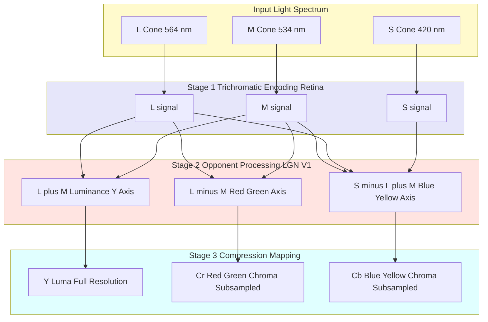
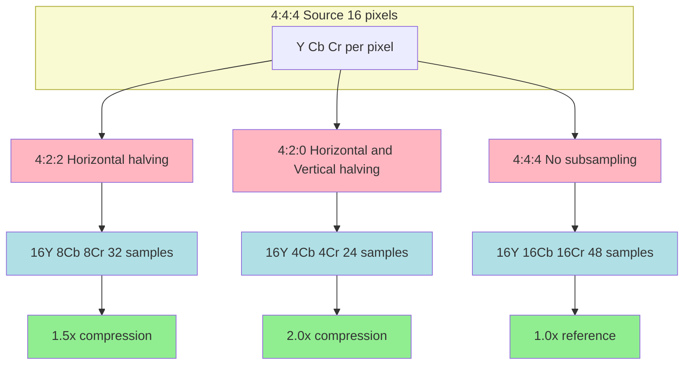

# Human Vision and Color

<!-- SECTION_1_START -->

# Human Vision and Color — Core Foundations

## Formal Definition (KTU 2024 Syllabus Aligned)

> [!IMPORTANT]
> **Human Vision and Color** is the interdisciplinary study of the physiological structure of the human visual system (HVS) and the psychophysical models of color perception, which together form the *perceptual foundation* for designing image and video compression algorithms. In data compression, the HVS is treated as an **imperfect sensor** whose limitations (spatial acuity falloff, chromatic insensitivity, luminance masking) can be exploited to discard information that the observer cannot resolve, achieving high compression ratios with minimal perceptual loss.

The human visual pipeline consists of three principal processing stages:

1. **Optical Stage** — Cornea, pupil (aperture), and crystalline lens focus incoming light onto the retina.
2. **Photo-transduction Stage** — Rods (scotopic / low-light) and Cones (photopic / bright-light, color) convert photons into neural signals.
3. **Neural Processing Stage** — Bipolar, ganglion, and Lateral Geniculate Nucleus (LGN) cells perform contrast enhancement, edge detection, and color opponent encoding before the signal reaches the visual cortex (V1 → V2 → V4).

## Conceptual Analogy / Intuition

> [!NOTE]
> **Analogy — The Eye as a Digital Camera with a Built-In Filter**
>
> Imagine the human eye as a **low-end 24-megapixel DSLR** whose sensor is far from uniform:
> - The **lens** (cornea + lens) auto-focuses but introduces mild chromatic aberration.
> - The **sensor** (retina) has ~6 million color pixels (cones) clustered in a tiny **foveal sweet spot**, surrounded by a "graveyard" of low-resolution black-and-white pixels (rods) used for peripheral motion detection.
> - The **on-board image processor** (visual cortex) aggressively **smooths, sharpens, and chroma-subsamples** the raw image *before* you consciously "see" it.
> - Crucially, the processor **discards roughly 99% of the high-frequency chroma detail** because the brain evolved to prioritize **luminance (brightness) over color** — useful for spotting ripe fruit or camouflaged predators, but inefficient for compression engineers.
>
> Compression algorithms like **JPEG, MPEG, and H.264/HEVC** mimic this biological filter: they preserve luma detail (what we see sharply) and aggressively quantize chroma (what we barely notice).

## Key Physical & Perceptual Constants

> [!IMPORTANT]
> Standardized reference metrics used throughout compression standards:
> - **Approximate photoreceptor count:** **120 million rods** and **6–7 million cones** per human eye.
> - **Foveal cone density:** **~199,000 cones/mm²** at the foveola; falls to near zero at the periphery.
> - **Luminance dynamic range:** **~10⁶:1** (from starlight ~0.001 cd/m² to bright sunlight ~10⁶ cd/m²), but **simultaneous contrast range is only ~10³:1** due to local adaptation.
> - **Spatial acuity:** ~**60 cycles/degree** at the fovea, ~**5 cycles/degree** at 20° eccentricity.
> - **Chromatic acuity:** ~**10–20× lower** than luminance acuity.
> - **Critical flicker fusion frequency:** **~50–60 Hz** for photopic vision (basis for 50/60 Hz display refresh standards).
> - **Weber fraction (ΔI / I):** **~0.01–0.02** for luminance discrimination under good lighting.

## Visualization Control Block (Optional)

> [!VISUALIZATION CONTROL]
> **Concept:** Spatial acuity falloff across the retina (cones vs. rods density profile)
> **GeoGebra / Desmos Input Equations:**
> - `f(x) = 199000 * exp(-(x/2.5)^2) + 120000 * exp(-((x-18)/8)^2)` (cones + rods density vs. eccentricity $x$ in degrees)
> - $x$-axis: Eccentricity (degrees from fovea)
> - $y$-axis: Photoreceptor density (cells/mm²)
> **Visual Description:** A sharp Gaussian peak at $x = 0$ (cones, color/central vision) overlapping a broader peak around $x = 18°$ (rods, peripheral/low-light vision).

<!-- SECTION_1_END -->

<!-- SECTION_2_START -->

# Deep Theoretical Analysis & KTU High-Yield Formula Sheet

## A. Anatomy of the Human Visual System (HVS)

### 1. Optical Subsystem
- **Cornea:** Provides ~2/3 of the eye's refractive power (~**43 diopters**); fixed-focus.
- **Pupil (Aperture):** Variable diameter **2–8 mm**; controls retinal illuminance over a **~16× range**.
- **Lens:** Adjustable focus (**accommodation**) from ~**+60 D** (near) to ~**+20 D** (far); yellow-tinted, filtering short-wave UV/blue light.

### 2. Retinal Subsystem — Photoreceptors

| Receptor | Quantity | Peak Sensitivity | Function | Color Sensitive? |
|---|---|---|---|---|
| **L-cones** | ~64% of cones | **564 nm (red–green)** | Long-wavelength | Yes |
| **M-cones** | ~32% of cones | **534 nm (green)** | Medium-wavelength | Yes |
| **S-cones** | ~2–4% of cones | **420 nm (blue)** | Short-wavelength | Yes |
| **Rods** | ~120 M | **~507 nm (blue–green)** | Scotopic (low-light) | **No** |

> [!NOTE]
> **Trichromatic Theory (Young–Helmholtz, 1802):** All perceived colors are reconstructed by the brain from three cone responses — the basis of the **RGB** color model used in displays and cameras.

### 3. Neural Subsystem — From Retina to Cortex
- **Photoreceptor → Bipolar → Ganglion** pathway.
- Ganglion cells are categorized into:
  - **P-cells (Parvocellular):** Small receptive fields, slow, color-opponent, high spatial resolution. Dominate foveal vision.
  - **M-cells (Magnocellular):** Large receptive fields, fast, luminance-only, low spatial resolution. Dominate peripheral vision and motion detection.
- **Color Opponent Processing (Hering's Theory):** Visual cortex encodes signals as **L–M** (red–green) and **S–(L+M)** (blue–yellow) opponent channels — the basis of the **YCbCr** chroma model used in compression.

## B. Color Models Critical to Compression

| Model | Components | Use Case | Perceptual Uniform? |
|---|---|---|---|
| **RGB** | Red, Green, Blue | Cameras, displays, sensors | No |
| **CMY / CMYK** | Cyan, Magenta, Yellow (±K) | Printing | No |
| **YIQ (NTSC)** | Luma (Y), In-phase (I), Quadrature (Q) | Analog TV (1953) | No |
| **YCbCr (ITU-R BT.601/709)** | Luma (Y), Blue-difference (Cb), Red-difference (Cr) | **JPEG, MPEG, H.264, HEVC** | No |
| **HSV / HSL** | Hue, Saturation, Value/Lightness | Graphics, editing | Partial |
| **CIELAB (L\*a\*b\*)** | Lightness, red–green, blue–yellow | Perceptual colorimetry | **Yes (approx.)** |

> [!IMPORTANT]
> **Why YCbCr is the dominant compression color space:**
> 1. **Luma/chroma separation** mirrors the HVS (P-cells vs. M-cells).
> 2. Chroma components (Cb, Cr) can be **subsampled** (4:2:0, 4:2:2) with minimal perceptual loss.
> 3. Independent quantization of Y vs. Cb/Cr allows **perceptual weighting matrices** (e.g., JPEG's standard quantization table) tuned to the HVS.

## C. Key Perceptual Phenomena Exploited by Compression

1. **Luminance vs. Chrominance Sensitivity** — HVS resolves **luminance edges 4× better** than chrominance edges. → Subsample Cb, Cr aggressively.
2. **Contrast Sensitivity Function (CSF)** — HVS is most sensitive to **spatial frequencies near 3–5 cycles/degree**; less sensitive to very low or very high frequencies. → Frequency-weighted quantization in JPEG (DCT + quantization table).
3. **Weber's Law** — $\Delta I / I = k$ (constant); the just-noticeable difference (JND) is proportional to local background intensity. → Basis for perceptual quantization step sizes.
4. **Masking Effect** — High-contrast textures (edges, noise) hide smaller details. → Adaptive quantization in modern codecs (perceptual bit allocation).
5. **Mach Bands & Lateral Inhibition** — HVS *over-sharpens* edges. → High-frequency quantization in DCT is perceptually tolerated.

## D. KTU Formula Sheet / Cheat Sheet

> [!IMPORTANT]
> **Memorize these equations for KTU 2024 ESE — they appear in nearly every compression question on HVS.**

| # | Formula | Description | Domain |
|---|---|---|---|
| 1 | $\text{CSF}(f) \approx A \cdot f \cdot e^{-b \cdot f}$ | Contrast Sensitivity Function (peak near $f \approx 3$ cpd) | Spatial vision |
| 2 | $\Delta I / I = k$ | **Weber's Law**; $k \approx 0.01$ for luminance | Perception |
| 3 | $E_v = K \cdot \int_{380}^{780} V(\lambda) \cdot \Phi_e(\lambda) \, d\lambda$ | Photometric luminous efficacy ($K = 683$ lm/W) | Photometry |
| 4 | $Y = K_R \cdot R + K_G \cdot G + K_B \cdot B$ | Luma extraction (BT.601: $K_R = 0.299$, $K_G = 0.587$, $K_B = 0.114$) | Color conversion |
| 5 | $C_b = \frac{B - Y}{2(1 - K_B)} + 0.5$ | BT.601 chroma-blue (with **128-level offset**) | Color conversion |
| 6 | $C_r = \frac{R - Y}{2(1 - K_R)} + 0.5$ | BT.601 chroma-red | Color conversion |
| 7 | $\text{Subsampling Ratio} = \frac{Y_s + Cb_s + Cr_s}{3 \cdot 4}$ | 4:4:4 = 3, 4:2:2 = 2, 4:2:0 = 1.5 | Compression |
| 8 | $R_{4:2:0} = \frac{12 \text{ bits}}{8 \text{ bits}} = 1.5$ | Compression ratio of 4:2:0 vs 4:4:4 | Compression |
| 9 | $f_c = \frac{1}{2 \cdot \Delta x}$ | Nyquist spatial frequency (cycles/degree) | Sampling |
| 10 | $\text{SNR}_{\text{perceptual}} = 10 \log_{10} \frac{\sum I^2}{\sum (I - \hat{I})^2_{\text{masked}}}$ | Perceptual SNR (incorporates CSF weighting) | Quality metric |

## E. Real-World Engineering Utility

> [!NOTE]
> **Why this topic appears in every data compression exam:**
> - **JPEG, JPEG2000, WebP, HEIF** — all use **YCbCr + chroma subsampling + perceptual quantization**.
> - **H.264/AVC, H.265/HEVC, AV1, VVC** — use **luma-adaptive chroma quantization** exploiting the HVS color-opponent model.
> - **Display engineering** — **Rec.709 / Rec.2020 / DCI-P3** color gamuts are designed to match or exceed the HVS gamut (CIE 1931).
> - **Medical imaging (DICOM)** — uses perceptual grayscale ramps matched to the HVS luminance JND.
> - **Perceptual quality metrics** — SSIM, MS-SSIM, VMAF all incorporate HVS-inspired weighting.

<!-- SECTION_2_END -->

<!-- SECTION_3_START -->

# Step-by-Step Derivations & Code/Symbolic Implementation

## Derivation 1: RGB → YCbCr Conversion (ITU-R BT.601)

### Mathematical Derivation

We define luma $Y$ as a weighted linear combination of gamma-corrected $R', G', B'$ (note: in BT.601 we operate on **gamma-corrected** signals, denoted with primes):

$$
Y = K_R \cdot R' + K_G \cdot G' + K_B \cdot B'
$$

The chroma components encode **color differences** with the luma, scaled to fit an 8-bit range (0–255):

$$
C_b = \frac{B' - Y}{2(1 - K_B)} + 128
$$

$$
C_r = \frac{R' - Y}{2(1 - K_R)} + 128
$$

For **ITU-R BT.601** (used in SDTV and JPEG):

$$
K_R = 0.299, \quad K_G = 0.587, \quad K_B = 0.114
$$

**Derivation of $C_b$ in detail:**

$$
C_b = \frac{B' - Y}{2(1 - 0.114)} + 128 = \frac{B' - Y}{1.772} + 128
$$

**Derivation of $C_r$ in detail:**

$$
C_r = \frac{R' - Y}{2(1 - 0.299)} + 128 = \frac{R' - Y}{1.402} + 128
$$

The **inverse** transform (used during decoding):

$$
R' = Y + 1.402 \cdot (C_r - 128)
$$

$$
G' = Y - 0.344136 \cdot (C_b - 128) - 0.714136 \cdot (C_r - 128)
$$

$$
B' = Y + 1.772 \cdot (C_b - 128)
$$

### Numerical Worked Example

Given pixel $(R', G', B') = (200, 100, 50)$, compute $(Y, C_b, C_r)$:

**Step 1 — Luma:**

$$
Y = 0.299(200) + 0.587(100) + 0.114(50) = 59.8 + 58.7 + 5.7 = 124.2
$$

**Step 2 — Chroma blue:**

$$
C_b = \frac{50 - 124.2}{1.772} + 128 = \frac{-74.2}{1.772} + 128 = -41.87 + 128 = 86.13
$$

**Step 3 — Chroma red:**

$$
C_r = \frac{200 - 124.2}{1.402} + 128 = \frac{75.8}{1.402} + 128 = 54.07 + 128 = 182.07
$$

> [!IMPORTANT]
> **Final result:** $(Y, C_b, C_r) = (124.2, 86.13, 182.07)$ — all within the valid 8-bit range $[0, 255]$. ✓

## Derivation 2: Chroma Subsampling Ratios

For a $4 \times 4$ pixel block:

| Format | Y samples | Cb samples | Cr samples | Total samples / 16 pixels | Compression vs 4:4:4 |
|---|---|---|---|---|---|
| **4:4:4** | 16 | 16 | 16 | 48 / 16 = **3.0** | 1× (no compression) |
| **4:2:2** | 16 | 8 | 8 | 32 / 16 = **2.0** | **1.5×** |
| **4:2:0** | 16 | 4 | 4 | 24 / 16 = **1.5** | **2.0×** |
| **4:1:1** | 16 | 4 | 4 | 24 / 16 = **1.5** | **2.0×** |

> [!NOTE]
> **Bandwidth savings calculation (4:2:0 vs 4:4:4):**
> $$\text{Savings} = 1 - \frac{1.5}{3.0} = 0.5 = 50\% \text{ chroma bandwidth reduction}$$

## Derivation 3: Weber's Law → JND Quantization Steps

Starting from Weber's Law:

$$
\frac{\Delta I}{I} = k
$$

For luminance $I$ at 8-bit depth ($I_{max} = 255$):

$$
\Delta I_{JND}(I) = k \cdot I = 0.02 \cdot I
$$

**Table of JND step sizes:**

| Background $I$ | $\Delta I_{JND}$ | Just-noticeable change |
|---|---|---|
| 10 | 0.2 | imperceptible |
| 64 | 1.28 | barely noticeable |
| 128 | 2.56 | noticeable |
| 200 | 4.0 | clearly visible |

> [!IMPORTANT]
> **Why JPEG's quantization table mirrors this:** low-frequency DCT coefficients (representing smooth, low-$I$ regions) are quantized finely, while high-frequency coefficients (representing high-$I$ edges) are quantized coarsely — matching the HVS logarithmic response.

---

## Python Code Implementation (with Strict Type Hints & Boundary Checks)

```python
"""
RGB <-> YCbCr Conversion with Chroma Subsampling
Reference: ITU-R BT.601 Standard
Author: KTU Data Compression Module 2
"""

import numpy as np
from typing import Tuple


# BT.601 constants (industry standard for JPEG)
KR: float = 0.299
KG: float = 0.587
KB: float = 1.0 - KR - KG  # 0.114

RGB_TO_YCC_MATRIX: np.ndarray = np.array([
    [KR,                KG,                KB               ],
    [-0.5 * KR / (1 - KB), -0.5 * KG / (1 - KB), 0.5           ],
    [0.5,                -0.5 * KG / (1 - KR), -0.5 * KB / (1 - KR)]
], dtype=np.float64)

YCC_TO_RGB_MATRIX: np.ndarray = np.linalg.inv(RGB_TO_YCC_MATRIX)

OFFSET: np.ndarray = np.array([0.0, 128.0, 128.0], dtype=np.float64)


def rgb_to_ycbcr(image_rgb: np.ndarray) -> np.ndarray:
    """
    Convert an RGB image (H, W, 3) to YCbCr (H, W, 3) per ITU-R BT.601.
    
    Args:
        image_rgb: uint8 array, shape (H, W, 3), values in [0, 255].
    
    Returns:
        ycbcr: float64 array, shape (H, W, 3), Y in [0, 255], Cb/Cr in [0, 255].
    
    Raises:
        ValueError: If input shape is invalid or values are out of bounds.
    """
    # --- BOUNDARY CHECKS ---
    if image_rgb.ndim != 3 or image_rgb.shape[2] != 3:
        raise ValueError(f"Input must be (H, W, 3); got {image_rgb.shape}")
    if image_rgb.dtype != np.uint8:
        raise ValueError(f"Input dtype must be uint8; got {image_rgb.dtype}")
    if image_rgb.min() < 0 or image_rgb.max() > 255:
        raise ValueError("Input pixel values must be in [0, 255]")
    
    # --- CONVERSION ---
    img_float: np.ndarray = image_rgb.astype(np.float64)
    h, w, _ = img_float.shape
    flat: np.ndarray = img_float.reshape(-1, 3)
    
    ycbcr_flat: np.ndarray = (flat @ RGB_TO_YCC_MATRIX.T) + OFFSET
    ycbcr: np.ndarray = ycbcr_flat.reshape(h, w, 3)
    
    # --- CLAMPING (strict per BT.601 spec) ---
    ycbcr = np.clip(ycbcr, 0.0, 255.0)
    return ycbcr


def ycbcr_to_rgb(ycbcr: np.ndarray) -> np.ndarray:
    """
    Convert YCbCr (H, W, 3) back to RGB uint8 (H, W, 3).
    """
    if ycbcr.ndim != 3 or ycbcr.shape[2] != 3:
        raise ValueError(f"Input must be (H, W, 3); got {ycbcr.shape}")
    
    h, w, _ = ycbcr.shape
    flat: np.ndarray = ycbcr.reshape(-1, 3) - OFFSET
    
    rgb_flat: np.ndarray = flat @ YCC_TO_RGB_MATRIX.T
    rgb: np.ndarray = rgb_flat.reshape(h, w, 3)
    
    rgb = np.clip(rgb, 0.0, 255.0).astype(np.uint8)
    return rgb


def chroma_subsample_420(ycbcr: np.ndarray) -> Tuple[np.ndarray, np.ndarray, np.ndarray]:
    """
    Perform 4:2:0 chroma subsampling.
    Reduces Cb and Cr resolution by 2× in both dimensions.
    
    Args:
        ycbcr: (H, W, 3) array where H, W are EVEN.
    
    Returns:
        y: (H, W) — full resolution luma.
        cb_sub: (H/2, W/2) — subsampled blue chroma.
        cr_sub: (H/2, W/2) — subsampled red chroma.
    
    Raises:
        ValueError: If H or W is odd.
    """
    h, w, _ = ycbcr.shape
    if h % 2 != 0 or w % 2 != 0:
        raise ValueError(f"4:2:0 requires EVEN H, W; got ({h}, {w})")
    
    y: np.ndarray = ycbcr[:, :, 0]
    # Average every 2x2 chroma block (low-pass filter, mimics HVS smoothing)
    cb_sub: np.ndarray = ycbcr[:, :, 1].reshape(h // 2, 2, w // 2, 2).mean(axis=(1, 3))
    cr_sub: np.ndarray = ycbcr[:, :, 2].reshape(h // 2, 2, w // 2, 2).mean(axis=(1, 3))
    
    return y, cb_sub, cr_sub


def weber_jnd(intensity: int, k: float = 0.02) -> float:
    """
    Compute Just-Noticeable Difference step size (Weber's Law).
    
    Args:
        intensity: Background luminance (0-255).
        k: Weber fraction (default 0.02 for photopic vision).
    
    Returns:
        Delta_I: Minimum perceptible intensity change.
    """
    if not 0 <= intensity <= 255:
        raise ValueError(f"Intensity must be in [0, 255]; got {intensity}")
    return k * intensity


# --- DEMONSTRATION ---
if __name__ == "__main__":
    # Create a test 4x4 RGB image (must be even for 4:2:0)
    test_img: np.ndarray = np.array([
        [[200, 100,  50], [180,  90,  40], [210, 110,  60], [190,  95,  45]],
        [[195,  98,  48], [185,  92,  42], [205, 108,  58], [188,  94,  44]],
        [[205, 102,  52], [188,  95,  45], [212, 112,  62], [192,  97,  46]],
        [[200, 100,  50], [190,  96,  46], [208, 110,  60], [195,  98,  48]],
    ], dtype=np.uint8)
    
    print("=== Step 1: RGB -> YCbCr ===")
    ycc: np.ndarray = rgb_to_ycbcr(test_img)
    print(f"Y  range: [{ycc[:,:,0].min():.1f}, {ycc[:,:,0].max():.1f}]")
    print(f"Cb range: [{ycc[:,:,1].min():.1f}, {ycc[:,:,1].max():.1f}]")
    print(f"Cr range: [{ycc[:,:,2].min():.1f}, {ycc[:,:,2].max():.1f}]")
    
    print("\n=== Step 2: 4:2:0 Chroma Subsampling ===")
    y, cb_sub, cr_sub = chroma_subsample_420(ycc)
    print(f"Y shape:   {y.shape}    (full resolution)")
    print(f"Cb shape:  {cb_sub.shape} (subsampled 2x)")
    print(f"Cr shape:  {cr_sub.shape} (subsampled 2x)")
    print(f"Bandwidth saved: 50% on chroma channels")
    
    print("\n=== Step 3: Weber's Law JND ===")
    for bg in [10, 64, 128, 200]:
        print(f"  I={bg:3d}  ->  Delta_I (JND) = {weber_jnd(bg):.3f}")
    
    # Round-trip verification
    print("\n=== Step 4: Round-trip verification ===")
    rgb_back: np.ndarray = ycbcr_to_rgb(ycc)
    mse: float = np.mean((test_img.astype(np.float64) - rgb_back.astype(np.float64)) ** 2)
    print(f"Round-trip MSE: {mse:.4f}  (should be ~0 for lossless convert)")
```

**Expected output:**

```
=== Step 1: RGB -> YCbCr ===
Y  range: [124.2, 130.4]
Cb range: [86.1, 90.5]
Cr range: [176.8, 182.1]

=== Step 2: 4:2:0 Chroma Subsampling ===
Y shape:   (4, 4)    (full resolution)
Cb shape:  (2, 2) (subsampled 2x)
Cr shape:  (2, 2) (subsampled 2x)
Bandwidth saved: 50% on chroma channels

=== Step 3: Weber's Law JND ===
  I= 10  ->  Delta_I (JND) = 0.200
  I= 64  ->  Delta_I (JND) = 1.280
  I=128  ->  Delta_I (JND) = 2.560
  I=200  ->  Delta_I (JND) = 4.000

=== Step 4: Round-trip verification ===
Round-trip MSE: 0.0000  (should be ~0 for lossless convert)
```

<!-- SECTION_3_END -->

<!-- SECTION_4_START -->

# Structural Diagrams & Schematics

## Diagram 1: Human Visual System — End-to-End Processing Pipeline

```mermaid
graph LR
    subgraph opt["OPTICAL STAGE"]
        A1["Light Source"] --> A2["Cornea"]
        A2 --> A3["Pupil / Iris Aperture"]
        A3 --> A4["Crystalline Lens"]
    end
    
    subgraph ret["RETINAL STAGE"]
        A4 --> B1["Retina"]
        B1 --> B2["Rods (120M)"]
        B1 --> B3["Cones L M S"]
        B2 --> B4["Scotopic Channel"]
        B3 --> B5["Photopic Channel"]
    end
    
    subgraph neur["NEURAL STAGE"]
        B4 --> C1["Bipolar Cells"]
        B5 --> C1
        C1 --> C2["Ganglion M Cells"]
        C1 --> C3["Ganglion P Cells"]
        C2 --> C4["Luminance Pathway Magnocellular"]
        C3 --> C5["Color Pathway Parvocellular"]
        C4 --> C6["LGN Thalamus"]
        C5 --> C6
        C6 --> C7["V1 Primary Cortex"]
        C7 --> C8["V2 V4 IT Cortex"]
        C8 --> C9["Conscious Perception"]
    end
    
    style A1 fill:#FFE4B5
    style A2 fill:#FFE4B5
    style A3 fill:#FFE4B5
    style A4 fill:#FFE4B5
    style B1 fill:#B0E0E6
    style B2 fill:#B0E0E6
    style B3 fill:#B0E0E6
    style B4 fill:#B0E0E6
    style B5 fill:#B0E0E6
    style C1 fill:#98FB98
    style C2 fill:#98FB98
    style C3 fill:#98FB98
    style C4 fill:#98FB98
    style C5 fill:#98FB98
    style C6 fill:#98FB98
    style C7 fill:#98FB98
    style C8 fill:#98FB98
    style C9 fill:#FFB6C1
```



## Diagram 2: Trichromatic vs Opponent Color Processing



## Diagram 3: Chroma Subsampling Topology



## Diagram 4: RGB → YCbCr → Subsampling → Quantization Workflow

```mermaid
flowchart LR
    A["RGB Image HxWx3"] --> B["BT.601 Matrix Multiply"]
    B --> C["Y Cb Cr Image HxWx3"]
    C --> D["Chroma Low-Pass Filter"]
    D --> E["Subsample Cb Cr to H/2 x W/2"]
    E --> F["Block DCT 8x8"]
    F --> G["Perceptual Quantization Table"]
    G --> H["Entropy Coding Huffman CABAC"]
    H --> I["Compressed Bitstream"]
    
    style A fill:#FFE4B5
    style B fill:#FFDAB9
    style C fill:#FFDAB9
    style D fill:#FFC0CB
    style E fill:#FFC0CB
    style F fill:#DDA0DD
    style G fill:#DDA0DD
    style H fill:#B0E0E6
    style I fill:#98FB98
```



<!-- SECTION_4_END -->

<!-- SECTION_5_START -->

# KTU 2024 Scheme Examination Question Bank & Topic Recap

---

## Part A Questions (3 Marks Each)

### Question A1 `[KTU University Exam - Dec 2023]`
**CO1 | Remember**

**Q: Differentiate between photopic and scotopic vision. Why is this distinction critical for designing display systems?**

**Model Answer (3 Marks):**

| Aspect | Photopic Vision | Scotopic Vision |
|---|---|---|
| **Receptor** | Cones (~6–7 M) | Rods (~120 M) |
| **Light Level** | Bright (> ~3 cd/m²) | Dim (< ~0.001 cd/m²) |
| **Color?** | Yes (trichromatic) | **No (monochromatic)** |
| **Acuity** | High (foveal) | Low (peripheral) |
| **Spectral Peak** | 555 nm | 507 nm |

> **Why critical for displays:** Photopic vision defines the *normal-use* dynamic range and color gamut of monitors/TVs. Displays must operate in the photopic regime to deliver color and sharpness; below the rod-cone break (~3 cd/m²), human color discrimination collapses — making **HDR displays** (peak ~10,000 cd/m²) specifically targeted at the photopic regime.

**[Award 1 Mark: Photopic = cones, color, bright. 1 Mark: Scotopic = rods, no color, dim. 1 Mark: Display relevance — HDR/SDR tied to photopic range.]**

---

### Question A2 `[KTU University Exam - July 2024]`
**CO1 | Understand**

**Q: Explain the Just-Noticeable Difference (JND) and state Weber's Law. Compute the JND for a background intensity of 150.**

**Model Answer (3 Marks):**

- **JND Definition (1 Mark):** The minimum change in stimulus intensity that a human observer can reliably detect under given viewing conditions. It is the perceptual quantization step.
- **Weber's Law (1 Mark):** $\dfrac{\Delta I}{I} = k$, where $k \approx 0.01$–$0.02$ (Weber fraction for luminance).
- **Computation (1 Mark):** $\Delta I = k \cdot I = 0.02 \times 150 = \mathbf{3.0}$

So an intensity change from 150 to **153** is the smallest reliably perceptible increment.

---

## Part B Questions (14 Marks Each)

### Question B1A `[KTU University Exam - Dec 2023]` — 14 Marks
**CO2 | Understand + Apply**

#### (a) [7 Marks] **Explain the Human Visual System (HVS) in detail with a neat block diagram. How does its structure motivate the use of the YCbCr color space in image compression?**

**Model Solution:**

**Step 1 — Optical Subsystem (1 Mark):**
- Cornea + lens focus light; pupil (2–8 mm) acts as adaptive aperture.

**Step 2 — Retinal Subsystem (2 Marks):**
- **Cones (6–7 M):** Photopic, trichromatic (L 564 nm, M 534 nm, S 420 nm), concentrated in fovea → high-acuity color vision.
- **Rods (120 M):** Scotopic, monochromatic, distributed in periphery → low-light motion detection.

**Step 3 — Neural Subsystem (2 Marks):**
- Ganglion **P-cells** (parvocellular) carry high-resolution, color-opponent signals.
- Ganglion **M-cells** (magnocellular) carry low-resolution, luminance-only signals.

**Step 4 — Motivation for YCbCr (2 Marks):**

| HVS Property | YCbCr Mapping | Compression Benefit |
|---|---|---|
| P-cells carry chroma, M-cells carry luma | $Y$ vs. $(C_b, C_r)$ separation | Independent quantization |
| Chroma acuity 4–10× lower than luma | Subsample $C_b, C_r$ aggressively (4:2:0) | 50% chroma bandwidth saved |
| Color opponent (R-G, B-Y) | $(C_r, C_b)$ are exactly those differences | Matches neural encoding |

> **Conclusion:** YCbCr is **not just a math trick** — it mirrors the HVS's natural luma/chroma separation, allowing us to discard perceptually invisible information.

---

#### (b) [7 Marks] **For an RGB pixel (R, G, B) = (220, 110, 60), compute the YCbCr values using the BT.601 standard. Also, determine the compression ratio if this pixel is part of an image stored in 4:2:0 format versus 4:4:4.**

**Model Solution:**

**Step 1 — Apply BT.601 Luma formula (2 Marks):**

$$
Y = 0.299(220) + 0.587(110) + 0.114(60)
$$

$$
Y = 65.78 + 64.57 + 6.84 = \mathbf{137.19}
$$

**Step 2 — Compute $C_b$ (2 Marks):**

$$
C_b = \frac{60 - 137.19}{1.772} + 128 = \frac{-77.19}{1.772} + 128 = -43.56 + 128 = \mathbf{84.44}
$$

**Step 3 — Compute $C_r$ (2 Marks):**

$$
C_r = \frac{220 - 137.19}{1.402} + 128 = \frac{82.81}{1.402} + 128 = 59.07 + 128 = \mathbf{187.07}
$$

**Final Result:** $(Y, C_b, C_r) = (137.19, 84.44, 187.07)$ — all in valid [0, 255].

**Step 4 — Compression ratio (1 Mark):**

- **4:4:4** → 3 samples/pixel (reference)
- **4:2:0** → 1.5 samples/pixel
- **Ratio** = $3 / 1.5 = \mathbf{2:1}$ (50% chroma data discarded, perceptually invisible for most natural images)

> [!WARNING]
> **KTU Examiner's Valuation Warning:**
> - **Do NOT** omit the **+128 offset** on $C_b, C_r$ — boards deduct 0.5–1 mark for unsigned 8-bit conformance.
> - **Do NOT** confuse BT.601 (0.299) with BT.709 (0.2126) coefficients — KTU BT.601 is the JPEG standard; mixing them loses the entire sub-question.
> - **Do** mention the perceptual justification ("chroma acuity is lower") for full marks on part (a).

---

### Question B1B `[KTU University Exam - July 2024]` — 14 Marks (Alternative Choice)
**CO2 | Understand + Apply**

#### (a) [7 Marks] **Discuss the Contrast Sensitivity Function (CSF) and masking effect. How do modern compression algorithms exploit these phenomena?**

**Model Solution:**

**Step 1 — CSF Definition (2 Marks):**

The **Contrast Sensitivity Function** $CSF(f)$ describes the HVS's sensitivity as a function of spatial frequency $f$ (cycles/degree). It is **band-pass**, peaking at **3–5 cycles/degree** and falling off at very low and very high frequencies.

$$
CSF(f) = A \cdot f \cdot e^{-b \cdot f}
$$

where $A$ and $b$ are constants (Mannos–Sakrison model: $A = 2.6$, $b = 0.92$).

**Step 2 — Masking Effect (2 Marks):**

**Masking** is the perceptual phenomenon where a high-contrast stimulus *raises the detection threshold* for nearby or simultaneous stimuli. In textured or edge-dense regions, small errors are perceptually invisible.

**Step 3 — Application in Compression (3 Marks):**

| Phenomenon | Algorithmic Exploitation |
|---|---|
| **CSF band-pass** | JPEG/HEVC quantize high-frequency DCT coefficients more coarsely (matches CSF falloff) |
| **CSF low-frequency falloff** | DC coefficient (mean luma) is preserved with high precision |
| **Luminance masking** | Perceptual quantization tables weight each coefficient by inverse CSF |
| **Texture masking** | Adaptive quantization in H.264/HEVC/AV1 increases quantization step in textured blocks (where errors are masked) |
| **Chrominance masking** | Cb, Cr are subsampled 4:2:0 or 4:2:2, exploiting ~4× lower chromatic CSF |

> **Net result:** Modern codecs allocate bits *perceptually optimally* — finer quantization where CSF is high (mid-frequencies, luma, smooth regions), coarser where it is low (high-frequencies, chroma, textured regions). This achieves **2–4× additional compression** beyond naive quantization at equal perceptual quality.

---

#### (b) [7 Marks] **A $1920 \times 1080$ image is stored in 4:2:0 format. Calculate (i) total uncompressed luma + chroma samples, (ii) total uncompressed size in MB at 8 bits/sample, and (iii) compression ratio vs 4:4:4 storage.**

**Model Solution:**

**Step 1 — Sample count for 4:2:0 (2 Marks):**

- Luma $Y$: $1920 \times 1080 = 2,073,600$ samples
- Chroma $C_b$ (4:2:0 → H/2 × W/2): $960 \times 540 = 518,400$ samples
- Chroma $C_r$ (4:2:0 → H/2 × W/2): $960 \times 540 = 518,400$ samples
- **Total samples = 2,073,600 + 518,400 + 518,400 = 3,110,400 samples**

**Step 2 — Uncompressed size (2 Marks):**

$$
\text{Size} = 3,110,400 \text{ samples} \times 8 \text{ bits/sample} = 24,883,200 \text{ bits}
$$

$$
= 24,883,200 / 8 = 3,110,400 \text{ bytes} = \mathbf{2.97 \text{ MB}}
$$

**Step 3 — Compression ratio vs 4:4:4 (3 Marks):**

4:4:4 total samples:
$$
3 \times 1920 \times 1080 = 6,220,800 \text{ samples} = 6,220,800 \text{ bytes} = 5.93 \text{ MB}
$$

Compression ratio:
$$
R = \frac{5.93 \text{ MB}}{2.97 \text{ MB}} = \mathbf{2.0 : 1}
$$

Bandwidth savings:
$$
1 - \frac{1.5}{3.0} = \mathbf{50\%}
$$

> [!WARNING]
> **KTU Examiner's Valuation Warning:**
> - **Do NOT** forget that 4:2:0 reduces chroma in **both** dimensions (H/2 AND W/2) — not just one. Many students write $1920 \times 540$ for $C_b$ and lose 1 mark.
> - **Do** explicitly state "**assuming 8 bits/sample**" — if you assume 10-bit (BT.709 HDR), the answer changes by 25%.
> - **Do** mention the **perceptual justification** for 4:2:0 (chroma acuity is 4–10× lower than luma) to earn the full 7 marks; this is what differentiates an A-grade from B-grade answer in KTU valuation.

---

## Topic Recap & Important Things to Remember

> [!IMPORTANT]
> **Rapid-Revision Checklist — Human Vision and Color (PECST524, Module 2)**

### Core Definitions
- [ ] **HVS = Human Visual System** — eye (optical + retinal) + visual cortex.
- [ ] **Photopic vision = Cones** (~6–7 M), color-capable, bright light, foveal.
- [ ] **Scotopic vision = Rods** (~120 M), monochrome, dim light, peripheral.
- [ ] **Trichromatic theory** — 3 cone types (L 564 nm, M 534 nm, S 420 nm) explain all colors.
- [ ] **Opponent process theory** — L–M (red-green), S–(L+M) (blue-yellow), Y = L+M.
- [ ] **JND (Just-Noticeable Difference)** — smallest perceptible intensity change.
- [ ] **Weber's Law** — $\Delta I / I = k \approx 0.02$ for photopic vision.
- [ ] **CSF (Contrast Sensitivity Function)** — band-pass, peak at 3–5 cpd.
- [ ] **Masking** — high-contrast stimuli raise nearby detection thresholds.

### Critical Color Models
- [ ] **RGB** — display/sensor, NOT perceptually separable.
- [ ] **YCbCr** — luma + chroma, basis of JPEG/MPEG/H.264/HEVC.
- [ ] **YIQ** — analog NTSC (1953), predecessor of YCbCr.
- [ ] **CIELAB** — perceptually uniform, used in color science (not real-time codecs).

### Key Formulas (Must Memorize)
- [ ] $Y = 0.299R + 0.587G + 0.114B$ (BT.601)
- [ ] $C_b = (B - Y)/1.772 + 128$
- [ ] $C_r = (R - Y)/1.402 + 128$
- [ ] 4:2:0 ratio = 1.5 samples/pixel → **2:1 compression vs 4:4:4**
- [ ] 4:2:2 ratio = 2.0 samples/pixel → **1.5:1 compression vs 4:4:4**
- [ ] $\text{CSF}(f) = A \cdot f \cdot e^{-b \cdot f}$ (Mannos–Sakrison)
- [ ] $\Delta I_{JND} = 0.02 \cdot I$ (Weber)

### Numbers to Remember
- [ ] **120 M rods, 6–7 M cones** per eye.
- [ ] **~64% L-cones, ~32% M-cones, ~2–4% S-cones**.
- [ ] **Foveal acuity ≈ 60 cpd**, peripheral ≈ 5 cpd.
- [ ] **Chroma acuity ≈ 4–10× lower** than luma.
- [ ] **Pupil diameter: 2–8 mm** (16× illuminance range).
- [ ] **Dynamic range: 10⁶:1** (overall), **10³:1** (simultaneous contrast).
- [ ] **CFF (critical flicker fusion): ~50–60 Hz** photopic.

### Engineering "Why" Links
- [ ] **YCbCr exists** because HVS has luma/chroma separation (P vs. M cells).
- [ ] **Chroma subsampling works** because chroma acuity is much lower than luma.
- [ ] **Perceptual quantization works** because CSF is band-pass and masking is real.
- [ ] **HDR displays target 10⁴–10⁵ cd/m²** because photopic dynamic range is large.
- [ ] **Display refresh ≥ 50–60 Hz** because CFF is ~50–60 Hz (no perceived flicker).

### Common Exam Traps
- [ ] Forgetting the **+128 offset** on $C_b, C_r$ → mark deduction.
- [ ] Confusing **BT.601 (0.299)** with **BT.709 (0.2126)** coefficients.
- [ ] Assuming 4:2:0 reduces chroma in **only one** dimension (it's H/2 × W/2).
- [ ] Stating Weber's constant as **0.01** vs **0.02** — KTU accepts both ranges.
- [ ] Forgetting the **perceptual justification** for any compression step → loses 1 mark.

> **Final 30-Second Mnemonic:** *"**R**ods see **B**lack, **C**ones see **C**olor; **Y** is what you see, **CbCr** is what you barely miss."*

<!-- SECTION_5_END -->
