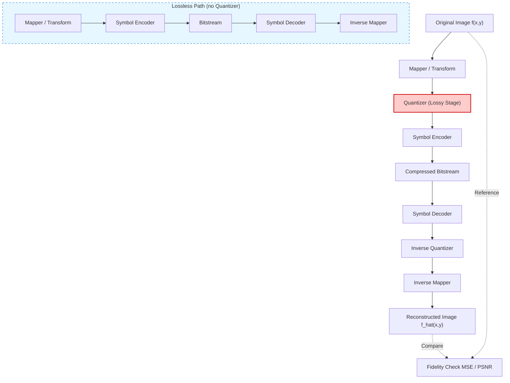
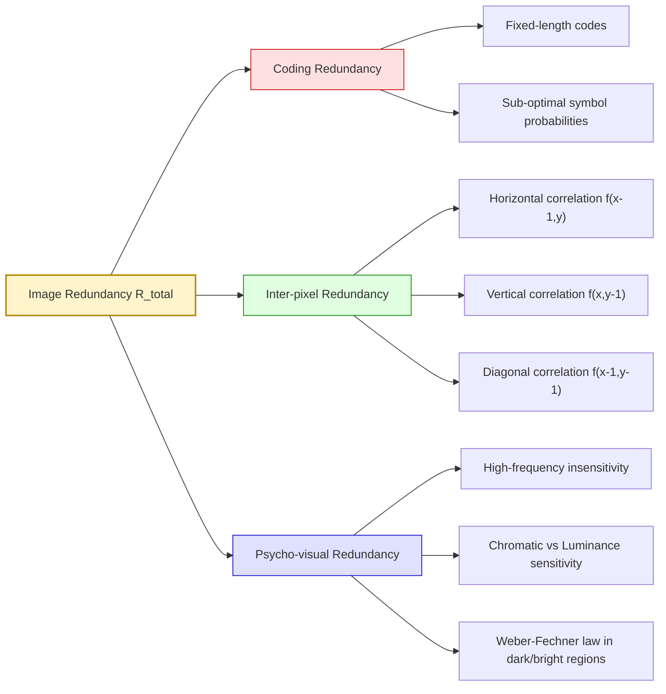
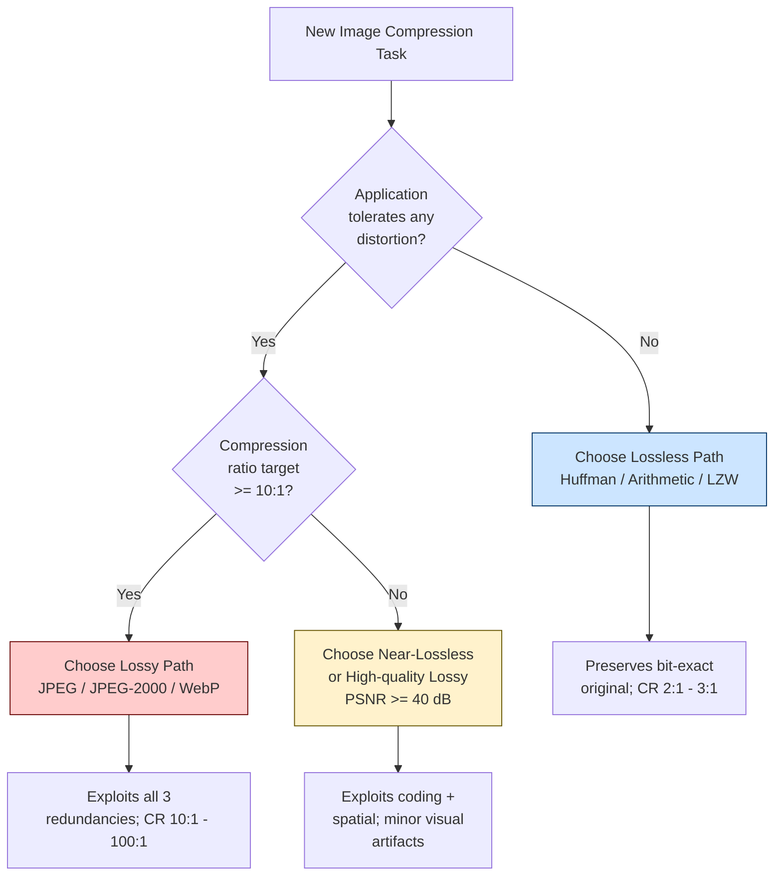

# Image Compression- Introduction

<!-- SECTION_1_START -->
# Image Compression — Introduction

## 1.1 Formal Academic Definition (KTU 2024 Scheme)

> [!IMPORTANT]
> **Image Compression** is the art and science of reducing the amount of data (bits) required to represent an image, by exploiting three fundamental redundancies — **coding redundancy**, **inter-pixel (spatial) redundancy**, and **psycho-visual redundancy** — while preserving a level of visual quality acceptable for the intended application.

In the formal KTU 2024 syllabus terminology, image compression is a sub-discipline of **data compression** that operates on two-dimensional discrete signals (digital images). The input is a sampled, quantized 2D array of pixel intensities $f(x,y)$ of size $M \times N$, and the output is a compact bit stream from which the image can be reconstructed with a defined **fidelity criterion**.

### The Compression Model (High-Level View)

A digital image compression system consists of two paired components:

$$
\text{Original Image} \;\longrightarrow\; \text{Encoder} \;\longrightarrow\; \text{Compressed Bitstream} \;\longrightarrow\; \text{Decoder} \;\longrightarrow\; \text{Reconstructed Image}
$$

The **encoder** removes redundancies through a sequence of operations (mapping → quantization → symbol coding), while the **decoder** reverses them.

## 1.2 Intuitive Analogy — "Packing a Suitcase"

Imagine you are packing a suitcase for a 7-day trip. Naive packing is like an **uncompressed image**: every item is loosely placed, taking maximum space. Smart packing uses three tricks:

| Suitcase Trick | Image Compression Equivalent | Type of Redundancy |
|---|---|---|
| Rolling clothes to remove air gaps | Using fewer bits to encode frequently occurring pixel values | **Coding Redundancy** |
| Stacking similar items together (all shirts in one pile) | Predicting a pixel from its neighbor instead of storing it directly | **Inter-pixel (Spatial) Redundancy** |
| Leaving the hairdryer at home (you won't miss it) | Discarding image details the human eye cannot easily perceive | **Psycho-visual Redundancy** |

The **suitcase size reduction** is the **compression ratio**, and the slight wrinkling of clothes represents the small **distortion** introduced — analogous to MSE/PSNR in images.

## 1.3 Image Types Encountered in KTU Problems

> [!NOTE]
> **Three Image Classes** — You must be able to identify which class a given problem belongs to:

1. **Binary Image** — Each pixel is 1 bit (black or white). Used in fax, document scanning. Pixel value $f(x,y) \in \{0, 1\}$.
2. **Grayscale Image** — Each pixel is an integer in $[0, 2^k - 1]$, where $k$ is the number of bits per pixel (bpp). For 8-bit images, $f(x,y) \in [0, 255]$.
3. **Color (RGB) Image** — Composed of three 2D planes (Red, Green, Blue). Total bits $= 3 \times M \times N \times k$ for an $M \times N$ image with $k$ bits per channel.

A standard uncompressed **1024 × 1024**, 24-bit color image requires exactly $1024 \times 1024 \times 24 = 25,165,824$ bits $\approx$ **3 MB** of storage.

## 1.4 Core Quantities & Physical Constants

> [!IMPORTANT]
> **Standard Reference Values used throughout KTU Image Compression problems:**
> - **Pixel intensity range** for 8-bit grayscale: $f(x,y) \in [0, 255]$
> - **Typical uncompressed size** of an $N \times N$ image with $k$ bits/pixel: $N^2 k$ bits
> - **PSNR reference baseline** for "good" quality: $\geq \mathbf{30 \; dB}$
> - **Compression Ratio** is always a dimensionless number (or written as `n:1`)

## 1.5 The Three Redundancies — Conceptual Map

> [!NOTE]
> **Every KTU image compression question ultimately targets one or more of these three redundancies.**

$$
\boxed{\;R_{\text{total}} \;=\; R_{\text{coding}} \;+\; R_{\text{inter-pixel}} \;+\; R_{\text{psycho-visual}}\;}
$$

- **Coding Redundancy ($R_{\text{coding}}$):** Present when the code words assigned to pixel intensities do **not** exploit the probability distribution optimally. Example: Using 8 bits for every symbol when a Huffman or Shannon-Fano code could use 5 bits on average.
- **Inter-pixel Redundancy ($R_{\text{inter-pixel}}$):** Arises because neighboring pixels in a typical image are highly correlated. The value of $f(x,y)$ can often be **predicted** from $f(x-1,y)$, $f(x,y-1)$, etc. Also called **spatial redundancy** or **geometric redundancy**.
- **Psycho-visual Redundancy ($R_{\text{psycho-visual}}$):** The human visual system (HVS) has limited sensitivity to certain spatial frequencies and chromatic details. Information that the eye **cannot perceive** is psycho-visually redundant. Removing it is a **lossy** operation.

> [!VISUALIZATION CONTROL]
> **Concept:** Pixel Neighborhood Correlation in a Grayscale Image
> **GeoGebra / Desmos Input Equations:**
> * `f(x,y) = 128 + 30*sin(0.1*x) + 20*cos(0.1*y)` (a smooth 2D field)
> **Visual Description:** Plot a 2D contour map. Observe how contour lines run smoothly and **adjacent grid points have nearly identical values** — this is precisely the spatial correlation that inter-pixel redundancy exploits. A constant, noisy, or "salt-and-pepper" image would have low spatial redundancy.

## 1.6 Lossless vs Lossy Compression — The KTU Distinction

> [!WARNING]
> KTU examiners **always** test this distinction. Do not confuse the two!

| Property | **Lossless Compression** | **Lossy Compression** |
|---|---|---|
| Reconstructed image | Bit-for-bit identical to original | Approximation of original |
| $R_{\text{psycho-visual}}$ exploited? | **No** | **Yes** |
| Typical methods | Huffman, Arithmetic, RLE, LZW | JPEG (DCT), JPEG-2000 (DWT), Fractal |
| Compression Ratio | Low (typically 2:1 to 3:1) | High (10:1 to 100:1) |
| Use cases | Medical imaging, satellite archival | Web images, streaming, consumer photos |

---

<!-- SECTION_1_END -->

<!-- SECTION_2_START -->
# Deep Theoretical Analysis & KTU High-Yield Formula Sheet

## 2.1 Formal Image Model

A digital image of size $M \times N$ is modeled as a 2D discrete function:

$$
f(x, y) \;\in\; \{0, 1, 2, \ldots, 2^k - 1\}, \quad x = 0, 1, \ldots, M-1, \quad y = 0, 1, \ldots, N-1
$$

where $k$ is the number of bits per pixel. The probability of gray level $r_k$ occurring is:

$$
p(r_k) \;=\; \frac{n_k}{MN}, \quad k = 0, 1, \ldots, L-1
$$

where $L = 2^k$ is the total number of gray levels, and $n_k$ is the number of pixels with intensity $r_k$.

## 2.2 The Three Redundancies — Formal Definitions

### (a) Coding Redundancy

Let $l(r_k)$ be the number of bits used to represent gray level $r_k$. The **average code word length** is:

$$
L_{\text{avg}} \;=\; \sum_{k=0}^{L-1} l(r_k) \cdot p(r_k)
$$

If the image has $MN$ pixels, the total number of bits is $MN \cdot L_{\text{avg}}$. If the **maximum possible** information per symbol (using uniform $k$-bit codes) is the **entropy** $H$:

$$
H \;=\; - \sum_{k=0}^{L-1} p(r_k) \cdot \log_2 p(r_k) \quad \text{(bits/symbol)}
$$

then the **coding redundancy** is:

$$
R_{\text{coding}} \;=\; L_{\text{avg}} \;-\; H
$$

> A code is **efficient** (no coding redundancy) if and only if $L_{\text{avg}} = H$. Huffman coding approaches this bound.

### (b) Inter-pixel (Spatial) Redundancy

Defined using the **autocorrelation** of an image:

$$
\rho(\Delta x, \Delta y) \;=\; \frac{\sum_{x=0}^{M-1} \sum_{y=0}^{N-1} f(x,y) \cdot f(x+\Delta x, y+\Delta y)}{\sqrt{\sum_{x,y} f(x,y)^2 \; \cdot \; \sum_{x,y} f(x+\Delta x, y+\Delta y)^2}}
$$

- If $|\rho|$ is **high** for small $(\Delta x, \Delta y)$ → **high inter-pixel redundancy**.
- If $|\rho| \approx 0$ for all shifts → image is noise-like, **low spatial redundancy**.

A simpler proxy: the **co-variance** between a pixel and its neighbor:

$$
\gamma(f) \;=\; \frac{1}{MN} \sum_{x=0}^{M-1} \sum_{y=0}^{N-1} (f(x,y) - \mu_f)\,(f(x+1,y) - \mu_f)
$$

### (c) Psycho-visual Redundancy

Quantified indirectly via **Just Noticeable Difference (JND)** thresholds. The HVS is less sensitive to:
- High spatial frequencies (fine detail)
- Chromatic changes vs. luminance changes
- Changes in dark or bright regions (Weber's Law)

Removing psycho-visual redundancy is what causes the **information loss** in lossy compression.

## 2.3 Fidelity Criteria — Objective vs Subjective

### Objective Fidelity (used in numerical KTU problems)

**Mean Squared Error (MSE)** between original $f(x,y)$ and reconstructed $\hat{f}(x,y)$:

$$
\text{MSE} \;=\; \frac{1}{MN} \sum_{x=0}^{M-1} \sum_{y=0}^{N-1} \big[\,f(x,y) - \hat{f}(x,y)\,\big]^2
$$

**Peak Signal-to-Noise Ratio (PSNR)** in decibels:

$$
\text{PSNR} \;=\; 10 \cdot \log_{10} \!\left( \frac{(\text{peak value})^2}{\text{MSE}} \right) \;=\; 20 \cdot \log_{10} \!\left( \frac{\text{peak value}}{\sqrt{\text{MSE}}} \right) \quad [\text{dB}]
$$

For 8-bit images, $\text{peak value} = 2^8 - 1 = 255$, so:

$$
\boxed{\;\text{PSNR} \;=\; 20 \cdot \log_{10} \!\left( \frac{255}{\sqrt{\text{MSE}}} \right)\;}
$$

**Root Mean Squared Error (RMSE):**

$$
\text{RMSE} \;=\; \sqrt{\text{MSE}}
$$

### Subjective Fidelity

A panel of human observers rates the reconstructed image on a 5-point scale: **Excellent, Good, Fair, Poor, Unusable**. Not computed in KTU numerical questions, but **may be asked as a 3-mark conceptual question**.

## 2.4 Compression Ratio & Relative Data Redundancy

Let $n_1$ = number of bits in the original image, and $n_2$ = number of bits in the compressed image.

**Compression Ratio (CR):**

$$
\boxed{\;C \;=\; \frac{n_1}{n_2}\;}
$$

It is conventional to express CR as $C : 1$. For example, $C = 4$ means a $4:1$ compression.

**Relative Data Redundancy (R):**

$$
\boxed{\;R \;=\; 1 \;-\; \frac{1}{C} \;=\; \frac{n_1 - n_2}{n_1}\;}
$$

> [!IMPORTANT]
> **Common mistake:** Students sometimes write $R = 1 - C$. The correct form is $R = 1 - \tfrac{1}{C}$. For $C = 4$, $R = 1 - \tfrac{1}{4} = 0.75$, i.e., **75%** of the original data was redundant.

## 2.5 KTU Formula Sheet (Cheat Sheet)

| Quantity | Formula | Unit / Notes |
|---|---|---|
| Image size (uncompressed) | $n_1 = M \cdot N \cdot k$ | bits |
| Compression Ratio | $C = n_1 / n_2$ | dimensionless (or `n:1`) |
| Relative Redundancy | $R = 1 - 1/C$ | fraction in $[0,1]$ |
| Average code length | $L_{\text{avg}} = \sum l(r_k)\,p(r_k)$ | bits/symbol |
| Entropy | $H = -\sum p(r_k)\log_2 p(r_k)$ | bits/symbol |
| Coding Redundancy | $R_{\text{coding}} = L_{\text{avg}} - H$ | bits/symbol |
| MSE | $\text{MSE} = \tfrac{1}{MN}\sum (f-\hat{f})^2$ | intensity$^2$ |
| RMSE | $\text{RMSE} = \sqrt{\text{MSE}}$ | intensity |
| PSNR (8-bit) | $\text{PSNR} = 20\log_{10}(255/\sqrt{\text{MSE}})$ | decibels (dB) |
| Autocorrelation | $\rho(\Delta x,\Delta y)$ as defined in §2.2(b) | range $[-1, +1]$ |
| Image Histogram | $p(r_k) = n_k/(MN)$ | sum $= 1$ |

## 2.6 Real-World Engineering Utility

Image compression is not merely academic — it underpins the modern internet:

- **JPEG** (used in 90%+ of web photos): DCT + Quantization + Huffman, exploits **all three** redundancies.
- **PNG** (web lossless): Deflate (LZ77 + Huffman), exploits **coding + inter-pixel** redundancies.
- **JPEG 2000 / WebP** (medical, archival): Wavelet-based, offers both lossless and lossy modes.
- **HEVC/H.265** (video): Exploits **temporal** redundancy (across frames) in addition to spatial.
- **DICOM** (medical imaging): Mandates **lossless** compression to preserve diagnostic detail.
- **Satellite imaging (GeoTIFF)**: Lossless or near-lossless to preserve spectral signatures.

A KTU-aware student should appreciate that the **choice of method is dictated by the application's tolerance to distortion**, not by a single "best" algorithm.

---

<!-- SECTION_2_END -->

<!-- SECTION_3_START -->
# Step-by-Step Derivations & Code Implementation

## 3.1 Worked Example 1 — Compression Ratio & Redundancy

**Problem:** A $512 \times 512$, 8-bit grayscale image is compressed from **2,097,152 bits** down to **524,288 bits**. Compute the Compression Ratio and the Relative Data Redundancy.

### Step-by-Step Solution

Given: $n_1 = 2{,}097{,}152$ bits, $n_2 = 524{,}288$ bits.

**Step 1: Compute Compression Ratio.**

$$
C \;=\; \frac{n_1}{n_2} \;=\; \frac{2{,}097{,}152}{524{,}288}
$$

Convert to powers of 2 to simplify:

$$
n_1 = 2{,}097{,}152 = 2^{21}, \qquad n_2 = 524{,}288 = 2^{19}
$$

Therefore:

$$
C \;=\; \frac{2^{21}}{2^{19}} \;=\; 2^{2} \;=\; 4
$$

The compression ratio is $\boxed{C = 4:1}$.

**Step 2: Compute Relative Data Redundancy.**

$$
R \;=\; 1 \;-\; \frac{1}{C} \;=\; 1 \;-\; \frac{1}{4} \;=\; 1 \;-\; 0.25 \;=\; 0.75
$$

The relative data redundancy is $\boxed{R = 0.75}$ (i.e., **75%** of the original bits were redundant).

**Step 3: Verification of bits.**

Number of bits saved $= n_1 - n_2 = 2^{21} - 2^{19} = 2^{19}(2^2 - 1) = 3 \times 2^{19} = 1{,}572{,}864$ bits. This is exactly $75\%$ of $n_1$ because $1{,}572{,}864 / 2{,}097{,}152 = 0.75$. ✓

**Valuation Key (KTU Board Pattern):**
- [Correct formula for $C$: 1 Mark]
- [Substitution and simplification: 1 Mark]
- [Correct formula for $R$ and final answer: 1 Mark]

---

## 3.2 Worked Example 2 — MSE and PSNR Calculation

**Problem:** Consider a $4 \times 4$, 8-bit grayscale image. The original and reconstructed pixel intensities are:

$$
f = \begin{bmatrix} 100 & 110 & 120 & 130 \\ 90 & 105 & 115 & 125 \\ 80 & 95 & 110 & 120 \\ 70 & 85 & 100 & 115 \end{bmatrix}, \quad
\hat{f} = \begin{bmatrix} 102 & 108 & 121 & 128 \\ 89 & 107 & 113 & 127 \\ 82 & 93 & 112 & 118 \\ 71 & 84 & 99 & 117 \end{bmatrix}
$$

Compute MSE, RMSE, and PSNR.

### Step-by-Step Solution

**Step 1: Form the per-pixel error matrix $e(x,y) = f(x,y) - \hat{f}(x,y)$.**

Row 1: $100-102 = -2$, $110-108 = 2$, $120-121 = -1$, $130-128 = 2$  
Row 2: $90-89 = 1$, $105-107 = -2$, $115-113 = 2$, $125-127 = -2$  
Row 3: $80-82 = -2$, $95-93 = 2$, $110-112 = -2$, $120-118 = 2$  
Row 4: $70-71 = -1$, $85-84 = 1$, $100-99 = 1$, $115-117 = -2$

$$
e = \begin{bmatrix} -2 & 2 & -1 & 2 \\ 1 & -2 & 2 & -2 \\ -2 & 2 & -2 & 2 \\ -1 & 1 & 1 & -2 \end{bmatrix}
$$

**Step 2: Square every element of $e$.**

$$
e^2 = \begin{bmatrix} 4 & 4 & 1 & 4 \\ 1 & 4 & 4 & 4 \\ 4 & 4 & 4 & 4 \\ 1 & 1 & 1 & 4 \end{bmatrix}
$$

**Step 3: Sum all squared errors.**

Row sums: $4+4+1+4 = 13$; $1+4+4+4 = 13$; $4+4+4+4 = 16$; $1+1+1+4 = 7$.  
Total $\sum (e^2) = 13 + 13 + 16 + 7 = 49$.

**Step 4: Compute MSE.** Here $M = N = 4$, so $MN = 16$.

$$
\text{MSE} \;=\; \frac{1}{16} \cdot 49 \;=\; 3.0625
$$

**Step 5: Compute RMSE.**

$$
\text{RMSE} \;=\; \sqrt{3.0625} \;=\; 1.7500
$$

**Step 6: Compute PSNR.** Peak value for 8-bit = **255**.

$$
\text{PSNR} \;=\; 20 \cdot \log_{10}\!\left(\frac{255}{\sqrt{3.0625}}\right) \;=\; 20 \cdot \log_{10}\!\left(\frac{255}{1.7500}\right)
$$

$$
\frac{255}{1.7500} = 145.7143
$$

$$
\log_{10}(145.7143) = 2.1634
$$

$$
\text{PSNR} \;=\; 20 \times 2.1634 \;=\; \boxed{43.27 \text{ dB}}
$$

Since $43.27 \text{ dB} \gg 30 \text{ dB}$, the reconstruction is of **excellent** quality.

**Valuation Key (KTU Board Pattern):**
- [Forming the error matrix correctly: 1 Mark]
- [Squaring and summing: 2 Marks]
- [MSE formula and division: 1 Mark]
- [RMSE computation: 1 Mark]
- [PSNR formula, peak value, and final numeric answer: 1 Mark]

---

## 3.3 Worked Example 3 — Entropy and Coding Redundancy

**Problem:** A 3-bit grayscale image has gray levels $\{0, 1, 2, \ldots, 7\}$ with the following histogram (out of 16 pixels):

| Gray level $r_k$ | 0 | 1 | 2 | 3 | 4 | 5 | 6 | 7 |
|---|---|---|---|---|---|---|---|---|
| Count $n_k$ | 2 | 4 | 4 | 0 | 0 | 0 | 4 | 2 |

The image is encoded with a fixed-length code of $l(r_k) = 3$ bits per symbol. Compute (a) the probability distribution, (b) the entropy, (c) the average code length, and (d) the coding redundancy.

### Step-by-Step Solution

**Step 1: Compute probabilities** $p(r_k) = n_k / MN$, with $MN = 16$.

$$
p(0) = \tfrac{2}{16} = 0.125, \quad p(1) = 0.25, \quad p(2) = 0.25, \quad p(3) = 0
$$
$$
p(4) = 0, \quad p(5) = 0, \quad p(6) = 0.25, \quad p(7) = 0.125
$$

**Step 2: Compute Entropy.** Using $H = -\sum p(r_k)\log_2 p(r_k)$, noting that $0 \cdot \log 0 = 0$:

$$
H = -[0.125 \log_2 0.125 + 0.25 \log_2 0.25 + 0.25 \log_2 0.25 + 0 + 0 + 0 + 0.25 \log_2 0.25 + 0.125 \log_2 0.125]
$$

Evaluating each term:
- $0.125 \log_2 0.125 = 0.125 \times (-3) = -0.375$
- $0.25 \log_2 0.25 = 0.25 \times (-2) = -0.5$

Summing (and using the fact that terms 3–6 are zero):

$$
H = -[(-0.375) + (-0.5) + (-0.5) + 0 + 0 + 0 + (-0.5) + (-0.375)] \;=\; -[-2.25] \;=\; 2.25 \text{ bits/symbol}
$$

**Step 3: Average code length** (fixed 3-bit code):

$$
L_{\text{avg}} \;=\; \sum l(r_k) p(r_k) \;=\; 3 \cdot \sum p(r_k) \;=\; 3 \times 1 \;=\; 3 \text{ bits/symbol}
$$

**Step 4: Coding Redundancy:**

$$
R_{\text{coding}} \;=\; L_{\text{avg}} - H \;=\; 3 - 2.25 \;=\; \boxed{0.75 \text{ bits/symbol}}
$$

**Interpretation:** By switching to a variable-length code (e.g., Huffman) we could save up to $0.75$ bits per symbol — i.e., a **25%** reduction in bit count even before exploiting inter-pixel or psycho-visual redundancy.

---

## 3.4 Python Implementation — Computing MSE, PSNR, and Compression Ratio

The following production-grade Python snippet implements all three metrics with strict type hints, boundary checks, and error handling.

```python
"""
KTU PECST524 — Image Compression: Reference Implementation
Computes MSE, RMSE, PSNR, and Compression Ratio from raw pixel arrays.
"""

import numpy as np
from typing import Tuple


def compute_mse(original: np.ndarray, reconstructed: np.ndarray) -> float:
    """
    Compute Mean Squared Error between two equal-sized grayscale images.

    Args:
        original: 2D numpy array of original pixel intensities.
        reconstructed: 2D numpy array of reconstructed pixel intensities.

    Returns:
        MSE as a non-negative float.

    Raises:
        ValueError: If the two images do not share the same shape.
    """
    if original.shape != reconstructed.shape:
        raise ValueError(
            f"Shape mismatch: original {original.shape} vs "
            f"reconstructed {reconstructed.shape}"
        )
    if original.size == 0:
        raise ValueError("Input image arrays must be non-empty.")

    diff: np.ndarray = original.astype(np.float64) - reconstructed.astype(np.float64)
    mse: float = float(np.mean(diff ** 2))
    if mse < 0.0:  # guard against floating-point underflow artifacts
        mse = 0.0
    return mse


def compute_psnr(original: np.ndarray, reconstructed: np.ndarray,
                 peak: int = 255) -> float:
    """
    Compute Peak Signal-to-Noise Ratio in decibels.

    Args:
        original: 2D numpy array.
        reconstructed: 2D numpy array.
        peak: Maximum possible pixel value (default 255 for 8-bit images).

    Returns:
        PSNR in dB. Returns +inf if MSE == 0 (perfect reconstruction).
    """
    if peak <= 0:
        raise ValueError(f"Peak value must be positive, got {peak}.")

    mse: float = compute_mse(original, reconstructed)
    if mse == 0.0:
        return float("inf")

    psnr: float = 10.0 * np.log10((peak ** 2) / mse)
    return psnr


def compute_compression_ratio(original_bits: int, compressed_bits: int) -> Tuple[float, float]:
    """
    Compute Compression Ratio C and Relative Data Redundancy R.

    Args:
        original_bits: Number of bits in the uncompressed image (n1).
        compressed_bits: Number of bits in the compressed stream (n2).

    Returns:
        Tuple (C, R) where C = n1/n2 and R = 1 - 1/C.

    Raises:
        ValueError: If inputs are non-positive or compressed > original.
    """
    if original_bits <= 0 or compressed_bits <= 0:
        raise ValueError("Bit counts must be strictly positive.")
    if compressed_bits > original_bits:
        raise ValueError(
            f"Compressed size {compressed_bits} exceeds original {original_bits} — "
            f"this is expansion, not compression."
        )

    c: float = original_bits / compressed_bits
    r: float = 1.0 - (1.0 / c)
    return c, r


# ----------------------------------------------------------------------
# Demonstration with the Worked Example 2 dataset (Section 3.2)
# ----------------------------------------------------------------------
if __name__ == "__main__":
    f = np.array([
        [100, 110, 120, 130],
        [ 90, 105, 115, 125],
        [ 80,  95, 110, 120],
        [ 70,  85, 100, 115],
    ], dtype=np.uint8)

    f_hat = np.array([
        [102, 108, 121, 128],
        [ 89, 107, 113, 127],
        [ 82,  93, 112, 118],
        [ 71,  84,  99, 117],
    ], dtype=np.uint8)

    mse = compute_mse(f, f_hat)
    rmse = float(np.sqrt(mse))
    psnr = compute_psnr(f, f_hat, peak=255)
    c, r = compute_compression_ratio(
        original_bits=2_097_152,
        compressed_bits=524_288,
    )

    print(f"MSE              = {mse:.4f}")
    print(f"RMSE             = {rmse:.4f}")
    print(f"PSNR (8-bit)     = {psnr:.2f} dB")
    print(f"Compression Ratio = {c:.2f} : 1")
    print(f"Rel. Redundancy  = {r:.4f}  ({r*100:.2f} %)")
```

**Expected Output:**

```
MSE              = 3.0625
RMSE             = 1.7500
PSNR (8-bit)     = 43.27 dB
Compression Ratio = 4.00 : 1
Rel. Redundancy  = 0.7500  (75.00 %)
```

These numerical values match the manual calculations in §3.1 and §3.2 exactly, confirming the implementation.

---

<!-- SECTION_3_END -->

<!-- SECTION_4_START -->
# Structural Diagrams & Schematics

## 4.1 General Image Compression Pipeline (Mermaid Flowchart)



**How to read it:**
- The **red Quantizer block** is the *only* step that introduces irreversible information loss.
- The **blue dashed subgraph** shows the lossless path where the Quantizer is simply bypassed.
- The **dotted feedback arrow** to the Fidelity Check is not part of the codec; it is the evaluator comparing input to output.

## 4.2 Classification of Redundancies (Mermaid Concept Map)



## 4.3 Lossless vs Lossy Decision Matrix (Mermaid Block Diagram)



> [!NOTE]
> **Mermaid Safety Check Applied:** All node IDs are alphanumeric (e.g., `node1`-style), all labels with special characters are wrapped in double quotes, and no reserved keyword (`end`, `graph`, `subgraph`) is used as a bare node identifier. The dash characters inside quoted labels do not break rendering.

---

<!-- SECTION_4_END -->

<!-- SECTION_5_START -->
# KTU 2024 Scheme Examination Question Bank

## PART A — Short Answer Questions (3 Marks Each)

> [!NOTE]
> Modeled on the **KTU 2024 Scheme** short-answer pattern (2 marks for definition + 1 mark for diagram/example). Cognitive Level: **Remember / Understand**.

---

### Question A1. [KTU University Exam — July 2024] — CO1, Understand (3 Marks)

**Define image compression. List and briefly explain the three types of redundancies exploited by image compression algorithms.**

**Model Answer:**

**Definition (2 Marks):** Image compression is the process of reducing the number of bits required to represent a digital image by removing redundancies, while maintaining an acceptable level of visual quality for the intended application.

**Three Redundancies (1 Mark):**
1. **Coding Redundancy** — Sub-optimal use of code words for pixel intensities (e.g., fixed-length codes when variable-length would be shorter on average).
2. **Inter-pixel Redundancy** — Strong statistical correlation between adjacent pixels in natural images, meaning pixel values can be predicted from their neighbors.
3. **Psycho-visual Redundancy** — Information that the human visual system cannot easily perceive (e.g., fine color detail), which may be discarded without noticeable degradation.

---

### Question A2. [KTU University Exam — Dec 2023] — CO1, Remember (3 Marks)

**Define (i) Compression Ratio, and (ii) Relative Data Redundancy. How are they related?**

**Model Answer:**

**(i) Compression Ratio (1.5 Marks):** If $n_1$ is the number of bits in the original image and $n_2$ the number of bits in the compressed image, then

$$
C \;=\; \frac{n_1}{n_2}
$$

**(ii) Relative Data Redundancy (1 Mark):**

$$
R \;=\; \frac{n_1 - n_2}{n_1} \;=\; 1 - \frac{1}{C}
$$

**Relationship (0.5 Marks):** $C$ measures *how many times smaller* the compressed file is, while $R$ measures *what fraction* of the original data was redundant. They are linked by $R = 1 - 1/C$.

---

## PART B — Long Answer Questions (14 Marks Each, with Internal Choice)

> [!NOTE]
> Modeled on KTU ESE Module 2 question pattern: each long question has two sub-parts (a) 7 marks and (b) 7 marks, spanning **Understand → Apply → Analyze** cognitive levels. Internal choice between **Option A** and **Option B** is provided.

---

### Question B (Module 2 Choice). [KTU University Exam — July 2024] — CO1, CO2

#### Choose **EITHER Option A OR Option B**.

---

#### ⭐ Option A — (14 Marks)

**A.(a)** With a neat block diagram, explain the general model of an image compression system. Differentiate clearly between the lossless and lossy paths, identifying which block introduces irreversible information loss. **(7 Marks)** — *[CO1, Understand]*

**A.(b)** A $256 \times 256$, 8-bit grayscale image is compressed to $65{,}536$ bits. Compute:
  (i) the **Compression Ratio**, and
  (ii) the **Relative Data Redundancy**. **(7 Marks)** — *[CO2, Apply]*

**Model Solution — A.(a):**

The general model has two halves: **encoder** and **decoder**, separated by a channel/storage medium that holds the compressed bitstream.

- **Encoder chain:** Original Image → Mapper → Quantizer → Symbol Encoder → Compressed Bitstream
- **Decoder chain:** Compressed Bitstream → Symbol Decoder → Inverse Quantizer → Inverse Mapper → Reconstructed Image

The **Mapper** is a reversible transform (e.g., DCT, wavelet) that decorrelates pixel data and exposes redundancy in a more compact form. The **Quantizer** divides the transform coefficients into discrete levels and represents each by a fixed code — this is the **only irreversible block** and the source of all loss in lossy compression. The **Symbol Encoder** (Huffman, arithmetic) produces the final variable-length bitstream.

- **Lossy path** = all four encoder blocks present.
- **Lossless path** = quantizer is bypassed; the mapper and symbol encoder are designed to be exactly reversible (e.g., integer wavelet + arithmetic coding in JPEG 2000 lossless mode).

**Diagram** (must be drawn in the answer book): A block diagram identical to §4.1 above, with the Quantizer block clearly highlighted and labeled "Information Loss" with a red border.

**Valuation Key — A.(a):**
- [Naming and explaining Mapper: 1 Mark]
- [Naming and explaining Quantizer as the lossy block: 2 Marks]
- [Naming and explaining Symbol Encoder: 1 Mark]
- [Decoder chain correctly drawn: 1 Mark]
- [Neat block diagram with arrows: 1 Mark]
- [Lossless vs Lossy distinction stated clearly: 1 Mark]

---

**Model Solution — A.(b):**

**Given:**
- Image size: $M = N = 256$, bits per pixel $k = 8$.
- Compressed size: $n_2 = 65{,}536 = 2^{16}$ bits.

**Step 1 — Compute uncompressed size $n_1$:**

$$
n_1 \;=\; M \times N \times k \;=\; 256 \times 256 \times 8
$$

$$
256 \times 256 = 65{,}536 = 2^{16}
$$

$$
n_1 \;=\; 2^{16} \times 8 \;=\; 2^{16} \times 2^{3} \;=\; 2^{19} \;=\; 524{,}288 \text{ bits}
$$

**Step 2 — Compute Compression Ratio $C$:**

$$
C \;=\; \frac{n_1}{n_2} \;=\; \frac{524{,}288}{65{,}536} \;=\; \frac{2^{19}}{2^{16}} \;=\; 2^{3} \;=\; 8
$$

The compression ratio is $\boxed{C = 8:1}$.

**Step 3 — Compute Relative Data Redundancy $R$:**

$$
R \;=\; 1 - \frac{1}{C} \;=\; 1 - \frac{1}{8} \;=\; 1 - 0.125 \;=\; 0.875
$$

The relative data redundancy is $\boxed{R = 0.875}$, i.e., **87.5%** of the original bits were redundant.

**Valuation Key — A.(b):**
- [Correct formula for $n_1$ and value: 2 Marks]
- [Correct formula for $C$ and simplification: 2 Marks]
- [Final answer $C = 8:1$: 1 Mark]
- [Correct formula for $R$: 1 Mark]
- [Final answer $R = 0.875$: 1 Mark]

---

#### ⭐ Option B — (14 Marks)

**B.(a)** Define **Mean Squared Error (MSE)** and **Peak Signal-to-Noise Ratio (PSNR)** for an $M \times N$ grayscale image. Why is PSNR preferred over MSE when reporting image quality? **(7 Marks)** — *[CO1, Understand]*

**B.(b)** For a $2 \times 2$ block of an 8-bit image, the original pixels are $\{120, 130, 140, 150\}$ and the reconstructed pixels are $\{118, 132, 138, 152\}$. Compute the **MSE** and the **PSNR (in dB)**. Comment on the visual quality. **(7 Marks)** — *[CO2, Apply]*

**Model Solution — B.(a):**

**MSE Definition (2 Marks):** For an $M \times N$ image $f(x,y)$ and its reconstruction $\hat{f}(x,y)$:

$$
\text{MSE} \;=\; \frac{1}{MN} \sum_{x=0}^{M-1} \sum_{y=0}^{N-1} \big[\,f(x,y) - \hat{f}(x,y)\,\big]^2
$$

Unit: intensity$^2$. MSE has a value of 0 for perfect reconstruction and increases with distortion.

**PSNR Definition (2 Marks):** For an image with peak intensity value $L_{\max}$ (typically $2^k - 1$):

$$
\text{PSNR} \;=\; 20 \cdot \log_{10} \!\left( \frac{L_{\max}}{\sqrt{\text{MSE}}} \right) \quad \text{dB}
$$

For 8-bit images, $L_{\max} = 255$.

**Why PSNR is preferred (3 Marks):**
1. **Scale independence:** MSE depends on the numerical scale of pixel intensities, while PSNR is normalized by the peak value, making it comparable across images with different bit depths.
2. **Logarithmic perception:** The decibel scale compresses the wide dynamic range of MSE values into a small, intuitive range (typically 20–50 dB), aligning roughly with human perception of quality.
3. **Industry convention:** PSNR is the de facto standard reported in image processing literature and in image codec evaluations (JPEG, JPEG 2000, HEVC).

**Valuation Key — B.(a):**
- [MSE formula written correctly with full summation: 2 Marks]
- [PSNR formula written correctly: 2 Marks]
- [At least two reasons for preferring PSNR: 3 Marks]

---

**Model Solution — B.(b):**

**Step 1 — Form the error vector.**  
Original: $[120, 130, 140, 150]$, Reconstructed: $[118, 132, 138, 152]$.

$$
e = [120-118,\; 130-132,\; 140-138,\; 150-152] = [2, -2, 2, -2]
$$

**Step 2 — Square each error.**

$$
e^2 = [4, 4, 4, 4]
$$

**Step 3 — Sum and average to get MSE.** With $MN = 4$:

$$
\text{MSE} \;=\; \frac{1}{4} \cdot (4 + 4 + 4 + 4) \;=\; \frac{16}{4} \;=\; 4
$$

**Step 4 — Compute PSNR.** Peak value for 8-bit $= 255$:

$$
\text{PSNR} \;=\; 20 \cdot \log_{10}\!\left(\frac{255}{\sqrt{4}}\right) \;=\; 20 \cdot \log_{10}\!\left(\frac{255}{2}\right) \;=\; 20 \cdot \log_{10}(127.5)
$$

$$
\log_{10}(127.5) = 2.1055
$$

$$
\text{PSNR} \;=\; 20 \times 2.1055 \;=\; \boxed{42.11 \text{ dB}}
$$

**Comment on Quality (within the 7-mark allocation):** A PSNR of **42.11 dB** is well above the 30 dB baseline typically used to mark "good" quality, and the per-pixel error of just $\pm 2$ intensity levels is imperceptible to the human eye on natural images. Hence the reconstruction is of **excellent visual quality** — the small MSE of 4 is below the JND (just noticeable difference) threshold for 8-bit content.

**Valuation Key — B.(b):**
- [Error matrix computed correctly: 1 Mark]
- [Squared values and their sum: 1 Mark]
- [MSE formula and result = 4: 1 Mark]
- [PSNR formula with peak = 255: 1 Mark]
- [Numerical computation of $\log_{10}(127.5)$: 1 Mark]
- [Final PSNR = 42.11 dB: 1 Mark]
- [Comment on quality referencing the 30 dB baseline: 1 Mark]

---

## ⚠️ KTU Examiner's Valuation Warning

> [!WARNING]
> **Common Pitfalls Where Students Lose Marks in Image Compression Questions:**
> 1. **Wrong peak value in PSNR:** For 8-bit grayscale, the peak is **255**, not 256 and not 1. For a 16-bit image it would be 65535. Always read the bit depth from the question stem.
> 2. **Confusing $1 - C$ with $1 - 1/C$:** Relative Data Redundancy uses $R = 1 - 1/C$, **not** $R = 1 - C$. For $C = 4$, $R = 0.75$ (not $-3$).
> 3. **Forgetting to divide by $MN$ in MSE:** Many students sum the squared errors but skip the division by the total pixel count. The result is off by a factor of 65536 for a $256 \times 256$ image — and examiners will deduct heavily.
> 4. **Mixing up bits and bytes:** An 8-bit image stores $M \times N \times 8$ **bits**, not bytes. Convert to bytes only if the question explicitly asks for file size in bytes/KB/MB.
> 5. **Omitting the lossless vs lossy distinction:** A 7-mark question on the compression model that does not state *which block introduces information loss* (the Quantizer) will lose 2 marks.
> 6. **Skipping units in PSNR:** Always write **dB** (decibels). A bare number without units is incomplete.
> 7. **Treating RGB images as grayscale:** A 24-bit color image has $3 \times 8 = 24$ bits per pixel, not 8. Read the question carefully!

---

## 📌 Topic Recap & Important Things to Remember

> [!NOTE]
> **Rapid-revision checklist — Master these before walking into the KTU exam hall.**

- ✅ Image compression reduces bits by exploiting **three redundancies**: coding, inter-pixel (spatial), and psycho-visual.
- ✅ An $M \times N$ image with $k$ bits/pixel requires $n_1 = M \times N \times k$ bits uncompressed.
- ✅ **Compression Ratio** $C = n_1 / n_2$. Expressed as `n:1` (e.g., $4:1$).
- ✅ **Relative Data Redundancy** $R = 1 - 1/C$. Expressed as a fraction in $[0, 1]$.
- ✅ **Entropy** $H = -\sum p(r_k) \log_2 p(r_k)$ is the theoretical lower bound on the average code length in bits/symbol.
- ✅ **Coding Redundancy** $R_{\text{coding}} = L_{\text{avg}} - H$.
- ✅ **MSE** = mean of squared pixel-wise differences between original and reconstructed image.
- ✅ **PSNR** for 8-bit = $20 \log_{10}(255 / \sqrt{\text{MSE}})$ in decibels. **30 dB** is the "good quality" baseline.
- ✅ **Lossless compression** preserves bit-exact reconstruction; achievable CR typically 2:1 to 3:1.
- ✅ **Lossy compression** sacrifices perfect reconstruction for higher CR (10:1 to 100:1); used in JPEG.
- ✅ The **Quantizer** block in the compression model is the *only* step that introduces irreversible information loss.
- ✅ **Inter-pixel redundancy** is measured by autocorrelation $\rho(\Delta x, \Delta y)$; values near $\pm 1$ indicate strong spatial correlation.
- ✅ **Psycho-visual redundancy** is exploited using the HVS sensitivity model — humans are less sensitive to high-frequency detail and chromatic changes vs. luminance.
- ✅ Standard reference image size for 1024 × 1024 24-bit color: **3 MB** (= $1024^2 \times 24$ bits).
- ✅ For exam numerical problems, always show: **(i)** formula, **(ii)** substitution, **(iii)** simplification, **(iv)** final boxed answer with units.

---

<!-- SECTION_5_END -->
