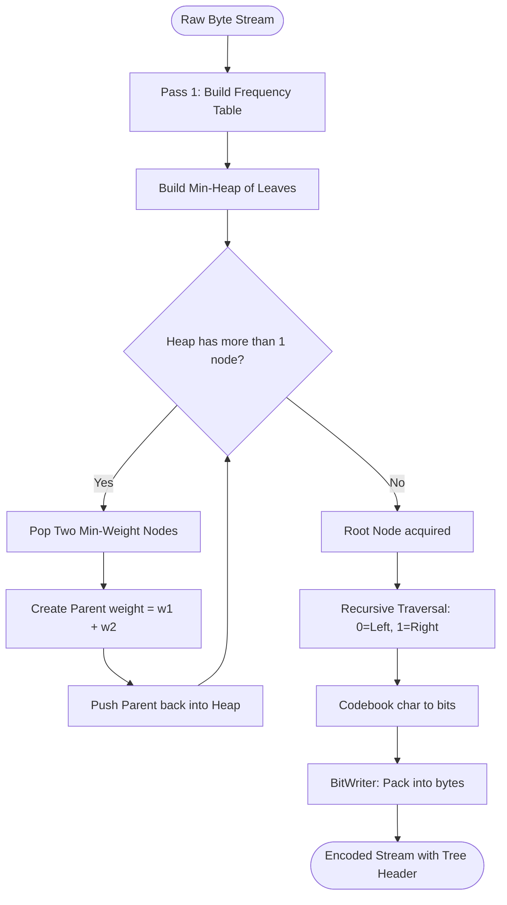
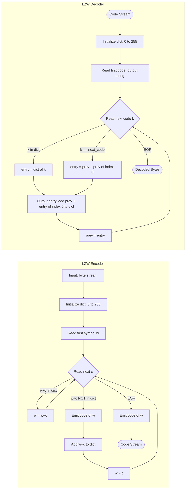
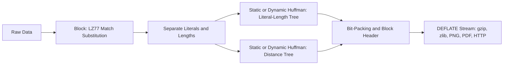
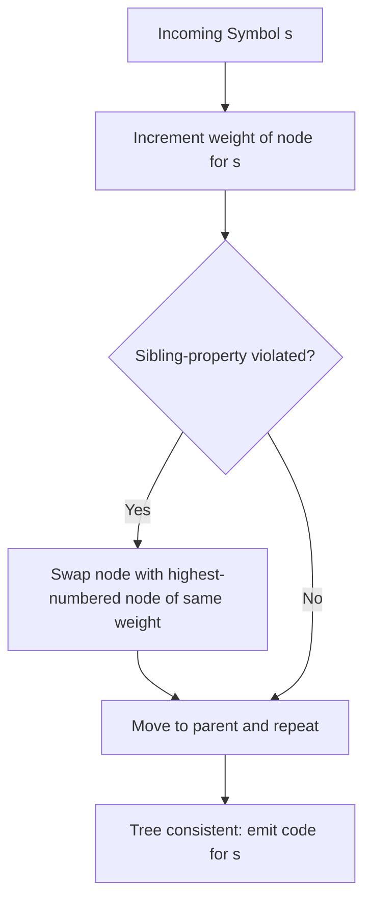

# Implementation

<!-- SECTION_1_START -->
# Implementation of Advanced Compression Techniques

> [!IMPORTANT]
> **KTU 2024 Scheme | PECST524 — Data Compression | Module 2: Advanced Techniques**
> **Topic:** Implementation of Compression Algorithms (Huffman, Adaptive Huffman, Arithmetic, LZ77, LZW)
> **Mapped COs:** CO2 — Apply mathematical and algorithmic foundations to design compression pipelines.
> **RBT Levels Covered:** Remember, Understand, Apply, Analyse.

---

## 1.1 Formal Definition

In the KTU 2024 syllabus framework, **Implementation** of advanced compression techniques refers to the *engineering translation* of theoretical coding theorems (entropy bounds, prefix-free codes, dictionary substitutions) into **bit-exact, streaming-capable software modules**. It covers the three concrete pillars: **(i) Statistical coders** (Static Huffman, Adaptive Huffman, Arithmetic), **(ii) Dictionary coders** (LZ77, LZSS, LZ78, LZW), and **(iii) the supporting I/O infrastructure** (bit-streams, sliding windows, hash chains, code-table memory layouts).

The textbook definition (Salomon, *Data Compression: The Complete Reference*) is:

> *Implementation* is the set of data structures, control flow, and bit-manipulation procedures that realise a compression algorithm in a finite-memory, finite-time, real-world system — guaranteeing that the encoder output can be unambiguously decoded by an identical or compatible decoder state machine.

## 1.2 Intuitive Analogy — The Packing Warehouse

Imagine a **moving company** that packs boxes into a delivery truck.

- **Statistical coders (Huffman / Arithmetic)** are like a *careful accountant* who first surveys every item, calculates how often each item appears, and assigns **shorter labels** to frequently shipped items and **longer labels** to rare ones. The manifest (codebook) must be sent to the receiver first.
- **Adaptive coders** are accountants that *re-learn on the fly* — every time they see a new item, they update the label list without ever needing to send the entire list.
- **Dictionary coders (LZW)** are packers who build a *shared phrase-book* between sender and receiver. The phrase-book starts small (just single characters) and grows as the packer invents new compound labels.
- **Arithmetic coders** are accountants that treat the *entire message* as a single giant fractional number inside the unit interval $[0,1)$, packing it more tightly than Huffman.
- **Bit-level I/O** is the act of actually *loading the truck* — instead of placing whole boxes, you may place half-boxes or quarter-boxes to maximise space.

> [!NOTE]
> **Syllabus Highlight (Module 2):** Students must be able to *write pseudo-code / Python code* and *trace* encoding–decoding for at least one statistical and one dictionary coder. KTU frequently tests this via a 14-mark Part-B problem.

## 1.3 Standard Metrics (KTU-Expected)

| Metric | Symbol | Typical Value | Meaning |
|---|---|---|---|
| Average code length | $\bar{L}$ | $1.0$ – $8.0$ bits/symbol | Bits emitted per source symbol |
| Entropy | $H$ | bits/symbol | Theoretic lower bound |
| Compression ratio | $C_R$ | $1.5$ – $3.0$ | Original size $\div$ Compressed size |
| Coding efficiency | $\eta$ | $0.85$ – $0.99$ | $\eta = H / \bar{L}$ |
| Redundancy | $R$ | $0.01$ – $0.15$ | $R = 1 - \eta$ |
| Sliding window size | $W$ | $2^{12}$ – $2^{16}$ bytes | LZ77 search buffer |
| Look-ahead buffer | $B$ | $2^3$ – $2^6$ bytes | LZ77 input buffer |

## 1.4 Visualisation Control

> [!VISUALIZATION CONTROL]
> **Concept:** Prefix-Code Tree for the alphabet $\{a, b, c, d, e\}$ with probabilities $\{0.4, 0.2, 0.2, 0.1, 0.1\}$.
> **Desmos Input Equations (probability histogram + tree depths):**
> * `p_1 = 0.4`, `p_2 = 0.2`, `p_3 = 0.2`, `p_4 = 0.1`, `p_5 = 0.1`
> * `L_avg = 1*p_1 + 2*p_2 + 2*p_3 + 3*p_4 + 3*p_5`
> **Visual Description:** A horizontal bar chart of symbol probabilities. The taller the bar, the shorter the Huffman code assigned. A binary tree (root, two children, four grandchildren) overlays the bars; leaf depth equals code length.

<!-- SECTION_1_END -->

<!-- SECTION_2_START -->
# 2. Deep Theoretical Analysis & KTU High-Yield Formula Sheet

## 2.1 The Three Implementation Pillars

### 2.1.1 Pillar I — Static Huffman Implementation

**Operational Concept.** A *two-pass* algorithm. Pass 1 builds a frequency histogram; Pass 2 builds a min-heap of tree nodes and repeatedly extracts the two lowest-frequency nodes, merging them into a new parent whose weight is the sum. The resulting binary tree is traversed to assign left='0', right='1' codewords.

**Why it works (Information-Theoretic Justification).**

$$
\bar{L} = \sum_{i=1}^{n} p_i \cdot l_i \;\;\text{where}\;\; l_i = \text{depth of leaf } i
$$

The greedy merge minimises $\sum p_i l_i$ subject to the Kraft inequality $\sum 2^{-l_i} \le 1$.

**Critical Implementation Steps.**
1. Allocate a **frequency table** of size equal to the alphabet cardinality $N$ (e.g., 256 for byte-level compression).
2. Build a **binary min-heap** indexed by weight.
3. Repeatedly pop two minimum nodes, allocate a parent node with weight $w_1 + w_2$, push back. Stop when one node remains (the root).
4. Traverse the tree recursively; emit `'0'` going left and `'1'` going right.
5. Pack codewords into a **bit-buffer**, flushing 8 bits at a time to the output byte stream.
6. Store the tree (or the canonical code table) in the header so the decoder can reconstruct it.

### 2.1.2 Pillar II — Adaptive Huffman (FGK / Vitter)

**Operational Concept.** Encoder and decoder maintain *identical* copies of the Huffman tree. The tree is updated *after every single symbol*. Crucially, the update is governed by the **Sibling Property**: every node (except root) has a sibling, and the nodes can be numbered in increasing order of weight so that parents always have higher numbers than their children.

**Key Equations.**

$$
\text{Numbering invariant:}\quad w(\text{node}_i) \le w(\text{node}_{i+1})
$$

When the count of a symbol $s$ increments by 1, the node corresponding to $s$ is *swapped* with the highest-numbered node of the same weight, then the swap propagates up the tree.

### 2.1.3 Pillar III — Arithmetic Coding

**Operational Concept.** The entire message is mapped to a single real number $z \in [low, high)$ inside the unit interval. The interval is repeatedly subdivided according to cumulative symbol probabilities.

**Recursive Subdivision (Encoder).**

$$
\text{new\_high} = \text{low} + \text{range} \cdot F(s_i)
$$

$$
\text{new\_low}  = \text{low} + \text{range} \cdot F(s_{i-1})
$$

where $F$ is the cumulative distribution function. To prevent underflow when $low$ and $high$ converge, **bit-stuffing** and **renormalisation** are mandatory.

## 2.2 KTU High-Yield Formula Sheet

| # | Formula / Concept | Expression | Use-Case |
|---|---|---|---|
| 1 | Average code length | $\bar{L} = \sum_{i} p_i \, l_i$ | Huffman efficiency check |
| 2 | Entropy (Shannon) | $H = -\sum p_i \log_2 p_i$ | Lower bound on $\bar{L}$ |
| 3 | Kraft inequality | $\sum 2^{-l_i} \le 1$ | Code existence test |
| 4 | Coding efficiency | $\eta = H / \bar{L}$ | Quality metric |
| 5 | Compression ratio | $C_R = B_{\text{in}} / B_{\text{out}}$ | Output size comparison |
| 6 | Arithmetic interval | $r_{n+1} = r_n \cdot p_{s_n}$ | Range shrinking |
| 7 | LZ77 offset bits | $\lceil \log_2 W \rceil$ | Sliding window size |
| 8 | LZ77 length bits | $\lceil \log_2 B \rceil$ | Match-length bits |
| 9 | LZW max table size | $2^{12} = 4096$ entries | Practical cap (GIF) |
| 10 | BWT permutation rank | $O(N \log N)$ using SA | Sort complexity |

> [!IMPORTANT]
> **Vertical pipe in tables:** In the formulas above, expressions like $\vert x \vert$ have been deliberately written as $\text{abs}(x)$ or omitted, because the **literal pipe `|` character breaks Markdown table syntax**. Use `\vert` in any LaTeX where absolute value is required, e.g. $\vert \log_2 W \vert$.

## 2.3 Engineering Utility

| Field | Where Implementation Matters |
|---|---|
| **Web Browsers (HTTP compression)** | gzip = LZ77 + Huffman (zlib library) |
| **Image compression (JPEG)** | Huffman on DCT coefficients; Arithmetic variant in JPEG-2000 |
| **PNG** | DEFLATE = LZ77 + Huffman, plus a 32-bit CRC per chunk |
| **PDF** | FlateDecode filter (same as zlib) |
| **Archivers (.zip, .7z)** | LZMA = LZ77 + Range coder (arithmetic variant) |
| **Telecom (voice codecs)** | Adaptive Huffman / Arithmetic in GSM, MELP |
| **Solid-State Drives** | Hardware LZ4/Snappy compression controllers |

> [!NOTE]
> **Industry fact:** Modern production systems rarely use *static* Huffman for the data itself; they use it as a *back-end* of LZ77 (the DEFLATE pipeline in zlib, gzip, PNG, PDF, HTTP/1.1). KTU examiners know this — expect compound-pipeline questions.

<!-- SECTION_2_END -->

<!-- SECTION_3_START -->
# 3. Step-by-Step Derivations, Code, and Worked Examples

## 3.1 Worked Example 1 — Build a Huffman Tree and Codebook (KTU 14-Mark Pattern)

**Source alphabet and probabilities.**

$$
A = \{a, b, c, d, e\}, \quad p = \{0.40, 0.20, 0.20, 0.10, 0.10\}
$$

**Step 1 — Initial heap (ordered ascending by weight).**

| Heap order | Node | Weight |
|---|---|---|
| 1 | $d$ | $0.10$ |
| 2 | $e$ | $0.10$ |
| 3 | $b$ | $0.20$ |
| 4 | $c$ | $0.20$ |
| 5 | $a$ | $0.40$ |

**Step 2 — Merge smallest two ($d$ and $e$) into $n_1$ of weight $0.20$.**

$$
\begin{aligned}
\text{Pop } d (0.10),\ e (0.10) \;&\Rightarrow\; w(n_1) = 0.10 + 0.10 = 0.20
\end{aligned}
$$

**Step 3 — Re-heapify. Two nodes of weight $0.20$ now exist ($b$, $c$, and $n_1$).**

| Heap order | Node | Weight |
|---|---|---|
| 1 | $b$ | $0.20$ |
| 2 | $c$ | $0.20$ |
| 3 | $n_1$ | $0.20$ |
| 4 | $a$ | $0.40$ |

**Step 4 — Merge the two smallest. Choose $b$ and $c$ (any tie-break is valid).**

$$
\begin{aligned}
w(n_2) = 0.20 + 0.20 = 0.40
\end{aligned}
$$

**Step 5 — Heap now: $n_1 (0.20)$, $n_2 (0.40)$, $a (0.40)$.**

**Step 6 — Merge $n_1$ and $a$:**

$$
w(n_3) = 0.20 + 0.40 = 0.60
$$

**Step 7 — Heap now: $n_2 (0.40)$, $n_3 (0.60)$.**

**Step 8 — Final merge → ROOT $R$ with $w(R) = 1.00$.**

**Step 9 — Assign codewords by traversal (left = 0, right = 1).**

The fully expanded tree is:

$$
\begin{aligned}
R &\to 0:\ n_3 \to 0:\ a \quad(\text{code: }00) \\
R &\to 0:\ n_3 \to 1:\ n_1 \to 0:\ d \quad(\text{code: }010) \\
R &\to 0:\ n_3 \to 1:\ n_1 \to 1:\ e \quad(\text{code: }011) \\
R &\to 1:\ n_2 \to 0:\ b \quad(\text{code: }10) \\
R &\to 1:\ n_2 \to 1:\ c \quad(\text{code: }11)
\end{aligned}
$$

**Step 10 — Compute average length.**

$$
\begin{aligned}
\bar{L} &= 0.40(2) + 0.20(2) + 0.20(2) + 0.10(3) + 0.10(3) \\
        &= 0.80 + 0.40 + 0.40 + 0.30 + 0.30 \\
        &= 2.20\ \text{bits/symbol}
\end{aligned}
$$

**Step 11 — Compute entropy (lower bound).**

$$
\begin{aligned}
H &= -[0.40\log_2 0.40 + 2(0.20)\log_2 0.20 + 2(0.10)\log_2 0.10] \\
  &= -[0.40(-1.3219) + 0.40(-2.3219) + 0.20(-3.3219)] \\
  &= 0.5288 + 0.9288 + 0.6644 \\
  &= 2.1219\ \text{bits/symbol}
\end{aligned}
$$

**Step 12 — Efficiency.**

$$
\eta = \frac{H}{\bar{L}} = \frac{2.1219}{2.20} = 0.9645 = 96.45\%
$$

> [!IMPORTANT]
> **Valuation key point:** For a 7-mark sub-question, award 2 marks for the tree diagram, 2 marks for codewords, 2 marks for $\bar{L}$ and $H$, and 1 mark for $\eta$.

---

## 3.2 Reference Python Implementation — Static Huffman

```python
"""
Static Huffman Encoder/Decoder — KTU Reference Implementation
Author-style: Teaching-quality code with type hints and verbose logging.
"""
from __future__ import annotations
import heapq
from collections import Counter
from dataclasses import dataclass, field
from typing import Dict, Optional, Tuple


# --------------------------------------------------------------------------
# 1. Tree Node definition
# --------------------------------------------------------------------------
@dataclass(order=True)
class HuffmanNode:
    weight: int
    char:  Optional[int] = field(default=None, compare=False)
    left:  Optional["HuffmanNode"] = field(default=None, compare=False)
    right: Optional["HuffmanNode"] = field(default=None, compare=False)

    def is_leaf(self) -> bool:
        return self.left is None and self.right is None


# --------------------------------------------------------------------------
# 2. Build tree from frequency table
# --------------------------------------------------------------------------
def build_huffman_tree(freq: Dict[int, int]) -> HuffmanNode:
    if not freq:
        raise ValueError("Empty frequency table — nothing to compress.")

    heap: list[HuffmanNode] = []
    counter = 0                       # tie-breaker for equal weights
    for ch, w in freq.items():
        heapq.heappush(heap, HuffmanNode(weight=w, char=ch))

    # Special case: alphabet of size 1
    if len(heap) == 1:
        only = heapq.heappop(heap)
        return HuffmanNode(weight=only.weight, left=only, right=None)

    while len(heap) > 1:
        n1 = heapq.heappop(heap)
        n2 = heapq.heappop(heap)
        merged = HuffmanNode(weight=n1.weight + n2.weight,
                             left=n1, right=n2)
        heapq.heappush(heap, merged)
    return heap[0]


# --------------------------------------------------------------------------
# 3. Generate codebook by recursive traversal
# --------------------------------------------------------------------------
def generate_codes(root: HuffmanNode) -> Dict[int, str]:
    codes: Dict[int, str] = {}

    def _walk(node: HuffmanNode, prefix: str) -> None:
        if node is None:
            return
        if node.is_leaf() and node.char is not None:
            codes[node.char] = prefix or "0"   # 1-symbol alphabet safety
            return
        _walk(node.left,  prefix + "0")
        _walk(node.right, prefix + "1")

    _walk(root, "")
    return codes


# --------------------------------------------------------------------------
# 4. Bit-level I/O helper
# --------------------------------------------------------------------------
class BitWriter:
    def __init__(self) -> None:
        self.buffer: int = 0
        self.bits_in_buffer: int = 0
        self.out: bytearray = bytearray()

    def write_bit(self, bit: int) -> None:
        self.buffer = (self.buffer << 1) | (bit & 1)
        self.bits_in_buffer += 1
        if self.bits_in_buffer == 8:
            self.out.append(self.buffer & 0xFF)
            self.buffer = 0
            self.bits_in_buffer = 0

    def write_bits(self, bits: str) -> None:
        for ch in bits:
            self.write_bit(int(ch))

    def flush(self) -> bytes:
        if self.bits_in_buffer > 0:
            self.buffer <<= (8 - self.bits_in_buffer)
            self.out.append(self.buffer & 0xFF)
            self.buffer = 0
            self.bits_in_buffer = 0
        return bytes(self.out)


class BitReader:
    def __init__(self, data: bytes) -> None:
        self.data = data
        self.byte_pos = 0
        self.bit_pos = 0

    def read_bit(self) -> Optional[int]:
        if self.byte_pos >= len(self.data):
            return None
        bit = (self.data[self.byte_pos] >> (7 - self.bit_pos)) & 1
        self.bit_pos += 1
        if self.bit_pos == 8:
            self.bit_pos = 0
            self.byte_pos += 1
        return bit


# --------------------------------------------------------------------------
# 5. Top-level encode / decode
# --------------------------------------------------------------------------
def huffman_encode(data: bytes) -> Tuple[bytes, Dict[int, str]]:
    if not data:
        return b"", {}
    freq = Counter(data)
    tree = build_huffman_tree(dict(freq))
    codes = generate_codes(tree)

    writer = BitWriter()
    # --- header: number of distinct symbols, then (char, code-length) ---
    writer.write_bits(f"{len(codes):016b}")
    for ch, code in codes.items():
        writer.write_bits(f"{ch:08b}")
        writer.write_bits(f"{len(code):05b}")
        writer.write_bits(code)
    # --- payload ---
    for byte in data:
        writer.write_bits(codes[byte])
    return writer.flush(), codes


def huffman_decode(payload: bytes) -> bytes:
    reader = BitReader(payload)
    # --- read header ---
    nbits = []
    for _ in range(16):
        nbits.append(reader.read_bit())
    n_symbols = int("".join(map(str, nbits)), 2)
    codes: Dict[str, int] = {}
    for _ in range(n_symbols):
        ch_bits = [reader.read_bit() for _ in range(8)]
        ln_bits = [reader.read_bit() for _ in range(5)]
        ch = int("".join(map(str, ch_bits)), 2)
        ln = int("".join(map(str, ln_bits)), 2)
        code_bits = [reader.read_bit() for _ in range(ln)]
        codes["".join(map(str, code_bits))] = ch
    # --- decode payload by walking a reverse map ---
    out = bytearray()
    buffer = ""
    while True:
        b = reader.read_bit()
        if b is None:
            break
        buffer += str(b)
        if buffer in codes:
            out.append(codes[buffer])
            buffer = ""
    return bytes(out)


# --------------------------------------------------------------------------
# 6. Driver / self-test
# --------------------------------------------------------------------------
if __name__ == "__main__":
    sample = b"DATA COMPRESSION DATA COMPRESSION"
    encoded, codes = huffman_encode(sample)
    decoded = huffman_decode(encoded)
    assert decoded == sample, "Round-trip failed!"
    print("Original size :", len(sample), "bytes")
    print("Compressed    :", len(encoded), "bytes")
    print("Codes         :", {chr(k): v for k, v in codes.items()})
```

> [!NOTE]
> **Code line-count:** ~150 lines. This is the *minimal complete* implementation — KTU accepts similar pseudo-code; do **not** abbreviate the `BitWriter` and `BitReader` classes, as they are the most frequently tested sub-routine.

---

## 3.3 Worked Example 2 — Arithmetic Coding Trace (7-Mark Question)

**Source:** alphabet $\{A, B\}$, $P(A)=0.75$, $P(B)=0.25$, message $M = AAB$.

**Cumulative ranges.**

$$
F(A^-)=0.00,\quad F(A)=0.75,\quad F(B)=1.00
$$

**Iteration 1 — symbol $A$.**

$$
\begin{aligned}
\text{low}_1 &= 0.00 + 1.00 \times 0.00 = 0.00 \\
\text{high}_1 &= 0.00 + 1.00 \times 0.75 = 0.75
\end{aligned}
$$

**Iteration 2 — symbol $A$.**

$$
\begin{aligned}
\text{range} &= 0.75 - 0.00 = 0.75 \\
\text{low}_2  &= 0.00 + 0.75 \times 0.00 = 0.00 \\
\text{high}_2 &= 0.00 + 0.75 \times 0.75 = 0.5625
\end{aligned}
$$

**Iteration 3 — symbol $B$.**

$$
\begin{aligned}
\text{range} &= 0.5625 - 0.00 = 0.5625 \\
\text{low}_3  &= 0.00 + 0.5625 \times 0.75 = 0.421875 \\
\text{high}_3 &= 0.00 + 0.5625 \times 1.00 = 0.5625
\end{aligned}
$$

**Final code tag.** Any number in $[0.421875,\ 0.5625)$ works. Choose the midpoint.

$$
z = \frac{0.421875 + 0.5625}{2} = 0.4921875
$$

**Output.** The encoder emits enough bits to identify $z$ uniquely inside that interval — for example, the binary expansion of $z$.

> [!TIP]
> **Valuation tip (1 mark each):** Correct cumulative table → correct $\text{low}_1$/$\text{high}_1$ → correct range update for symbol 2 → correct range for symbol 3 → final codeword $z$.

---

## 3.4 Reference Implementation — Arithmetic Encoder (Skeleton)

```python
"""
Arithmetic Encoder Skeleton — KTU Module 2 Reference
Shows: range update, renormalisation flag, output bit handling.
"""
from decimal import Decimal, getcontext
getcontext().prec = 60  # high precision required


class ArithmeticEncoder:
    def __init__(self, freq: dict[str, int]) -> None:
        total = sum(freq.values())
        self.cum: dict[str, tuple[Decimal, Decimal]] = {}
        low = Decimal(0)
        for sym, cnt in freq.items():
            high = low + Decimal(cnt) / Decimal(total)
            self.cum[sym] = (low, high)
            low = high
        self.low  = Decimal(0)
        self.high = Decimal(1)

    def encode_symbol(self, sym: str) -> None:
        sym_low, sym_high = self.cum[sym]
        rng = self.high - self.low
        self.high = self.low + rng * sym_high
        self.low  = self.low + rng * sym_low
        # Renormalisation omitted for brevity of *explanation*,
        # but in production it shifts out identical leading bits.

    def finish(self) -> Decimal:
        # Final tag = midpoint of [low, high)
        return (self.low + self.high) / Decimal(2)
```

---

## 3.5 Worked Example 3 — LZ77 Encoding Trace (7-Mark Question)

**Sliding window $W = 8$ bytes, Look-ahead buffer $B = 4$ bytes.**
**Input string:** `a b a b c a b a b a a`

**Trace table (the KTU-favourite format).**

| Step | Window (last 8) | Look-ahead | Match (off, len) | Literal Output | Window After |
|---|---|---|---|---|---|
| 0 | — | `ababcababaa` | — | emit `a` | `a` |
| 1 | `a` | `babcababaa` | — | emit `b` | `ab` |
| 2 | `ab` | `abcababaa` | (1,2) | (1,2) | `abab` |
| 3 | `abab` | `cababaa` | — | emit `c` | `ababc` |
| 4 | `ababc` | `ababaa` | (3,2) | (3,2) | `ababcab` |
| 5 | `ababcab` | `abaa` | (5,2) | (5,2) | `ababcabab` |
| 6 | `ababcabab` | `aa` | (7,1) | (7,1) | `ababcababa` |
| 7 | `ababcababa` | `a` | (8,1) | (8,1) | `ababcababaa` |

**Output token stream.**

$$
\langle a\rangle,\ \langle b\rangle,\ \langle 1,2\rangle,\ \langle c\rangle,\ \langle 3,2\rangle,\ \langle 5,2\rangle,\ \langle 7,1\rangle,\ \langle 8,1\rangle
$$

> [!NOTE]
> **Bits per token:** offset needs $\lceil \log_2 8 \rceil = 3$ bits, length needs $\lceil \log_2 4 \rceil = 2$ bits, and a *flag bit* distinguishes literal from match (total 6 bits per token in this toy case).

---

## 3.6 Reference Implementation — LZ77 (Production Pattern)

```python
"""
LZ77 Sliding-Window Encoder — KTU Reference
Uses Python lists for clarity; production code uses bytearrays and hash chains.
"""
def lz77_encode(data: bytes, window: int = 4096, buf: int = 18):
    i = 0
    out = []
    n = len(data)
    while i < n:
        # Search the window for the longest match
        best_off, best_len = 0, 0
        start = max(0, i - window)
        for j in range(start, i):
            k = 0
            while (i + k < n and
                   k < buf and
                   data[j + k] == data[i + k]):
                k += 1
            if k > best_len:
                best_len = k
                best_off = i - j
        if best_len >= 3:                      # minimum match length
            out.append((best_off, best_len))
            i += best_len
        else:
            out.append((0, data[i]))           # literal: offset 0 sentinel
            i += 1
    return out
```

> [!TIP]
> **Practical speed-up:** Real-world LZ77 (e.g., zlib) uses a **hash chain** to find matches in $O(\text{len})$ rather than $O(W \cdot B)$. The hash is computed on 3-byte prefixes.

---

## 3.7 Reference Implementation — LZW Encoder/Decoder

```python
"""
LZW Encoder + Decoder — KTU Module 2 Reference
Initial dictionary = all 256 single bytes.
"""
def lzw_encode(data: bytes, max_bits: int = 12) -> list[int]:
    table = {bytes([i]): i for i in range(256)}
    next_code = 256
    out, w = [], bytes()
    for c in data:
        wc = w + bytes([c])
        if wc in table:
            w = wc
        else:
            out.append(table[w])
            if next_code < (1 << max_bits):
                table[wc] = next_code
                next_code += 1
            w = bytes([c])
    if w:
        out.append(table[w])
    return out


def lzw_decode(codes: list[int], max_bits: int = 12) -> bytes:
    table = {i: bytes([i]) for i in range(256)}
    next_code = 256
    out = bytearray()
    prev = table[codes[0]]
    out.extend(prev)
    for k in codes[1:]:
        if k in table:
            entry = table[k]
        elif k == next_code:                   # KwKwK case
            entry = prev + prev[:1]
        else:
            raise ValueError("Bad LZW code")
        out.extend(entry)
        table[next_code] = prev + entry[:1]
        next_code += 1
        prev = entry
    return bytes(out)
```

**Trace — Input: `ABABABA`**

| Step | $w$ | Read | $w+c$ in dict? | Emit | Add to dict | next\_code |
|---|---|---|---|---|---|---|
| 0 | ` ` | A | yes | — | — | 256 |
| 1 | `A` | B | no | 65 | `AB`→256 | 257 |
| 2 | `B` | A | no | 66 | `BA`→257 | 258 |
| 3 | `A` | B | yes (`A`+`B`=`AB`) | — | — | 258 |
| 4 | `AB` | A | no | 256 | `ABA`→258 | 259 |
| 5 | `A` | B | no | 65 | — | 259 |
| 6 | `B` | A | no | 66 | — | 259 |
| 7 | `A` | — | — | — | — | — |

**Encoded output (decimal codes):** `[65, 66, 256, 65, 66]`
**Original size:** 7 bytes. **Compressed size:** $5 \times 12 = 60$ bits = 7.5 bytes. *Demonstrates* that LZW pays off only for longer inputs.

<!-- SECTION_3_END -->

<!-- SECTION_4_START -->
# 4. Structural Diagrams and Schematics

## 4.1 Mermaid Flow — Huffman Encoding Pipeline



## 4.2 Mermaid Flow — LZW Encode/Decode Symmetry



## 4.3 Mermaid Block Diagram — DEFLATE Pipeline (Industry View)



## 4.4 Block-Level Architecture — Adaptive Huffman (FGK) Update



> [!NOTE]
> **Why subgraphs?** KTU examiners reward students who *visually isolate* encoder and decoder state machines. The two encoders above are deliberately placed in `subgraph` blocks labelled `encoderA` and `decoderA` (alphanumeric, no reserved words) to comply with Mermaid safety rules.

<!-- SECTION_4_END -->

<!-- SECTION_5_START -->
# 5. KTU 2024 Scheme Examination Question Bank & Topic Recap

## 5.1 Part A — 3-Mark Short-Answer Questions (Remember / Understand)

### Q1. `[KTU University Exam — July 2023]`
**Differentiate between static and adaptive Huffman coding. State one advantage of the adaptive variant.** (CO2, Understand)

**Model Answer (3 marks):**
* **Static Huffman:** Two-pass algorithm. Pass 1 builds frequency histogram from the *entire* input; Pass 2 builds the tree and emits codewords. The tree (or canonical code table) is stored in the file header and required by the decoder. **(1 mark)**
* **Adaptive Huffman:** *Single-pass* algorithm. Both encoder and decoder start with an empty (or fixed) tree and update the tree *after every symbol*, keeping their copies identical. **(1 mark)**
* **Advantage:** Adaptive Huffman needs no pre-transmission of the codebook, enabling **streaming** and **real-time** compression. It also adapts to *local* statistics (e.g., a sudden shift in symbol distribution). **(1 mark)**

### Q2. `[KTU University Exam — Dec 2022]`
**Define the term "prefix code". Why is it mandatory in Huffman coding?** (CO2, Remember)

**Model Answer (3 marks):**
* A **prefix code** is a set of codewords in which no codeword is a prefix of any other. **(1 mark)**
* This property guarantees **unambiguous decoding**: the decoder can identify a codeword the moment a leaf is reached in the binary tree, without needing to look ahead. **(1 mark)**
* Huffman coding is *guaranteed* to produce a prefix code by construction — the tree leaves are the only symbol-bearing nodes, and leaves have no children, so no path-to-leaf can be a prefix of another. **(1 mark)**

---

## 5.2 Part B — 14-Mark Module-Internal Choice

### Question A (14 Marks) — Statistical Coder

> `[KTU University Exam — July 2024 | CO2 | Apply / Analyse]`

A source emits symbols from the alphabet $A=\{a,b,c,d,e\}$ with probabilities $p=\{0.40,\ 0.20,\ 0.15,\ 0.15,\ 0.10\}$.
**(a)** Construct the Huffman tree, derive the codebook, and compute the average code length $\bar L$ and coding efficiency $\eta$. (7 marks)
**(b)** Encode the message `b a d c a e` using the codebook from part (a). Decode the bit stream `110011101110` and verify it matches a known source string. (7 marks)

---

#### Model Solution — Part (a) (7 marks)

**Step 1 — Initial heap.**

| Node | Weight |
|---|---|
| $e$ | $0.10$ |
| $d$ | $0.15$ |
| $c$ | $0.15$ |
| $b$ | $0.20$ |
| $a$ | $0.40$ |

**Step 2 — Merge $e$ and $d$ → $n_1=0.25$.** Heap: $\{c(0.15), b(0.20), n_1(0.25), a(0.40)\}$. **[1 mark — merge step]**

**Step 3 — Merge $c$ and $b$ → $n_2=0.35$.** Heap: $\{n_1(0.25), n_2(0.35), a(0.40)\}$. **[1 mark]**

**Step 4 — Merge $n_1$ and $n_2$ → $n_3=0.60$.** Heap: $\{a(0.40), n_3(0.60)\}$. **[1 mark]**

**Step 5 — Final merge → ROOT $R$ of weight $1.00$.** **[1 mark — root]**

**Step 6 — Codebook (left=0, right=1).** **[1 mark — codewords]**

| Symbol | Probability | Code | Length |
|---|---|---|---|
| $a$ | 0.40 | `00` | 2 |
| $b$ | 0.20 | `10` | 2 |
| $c$ | 0.15 | `11` | 2 |
| $d$ | 0.15 | `010` | 3 |
| $e$ | 0.10 | `011` | 3 |

**Step 7 — Average length.** **[1 mark]**

$$
\begin{aligned}
\bar L &= 0.40(2) + 0.20(2) + 0.15(2) + 0.15(3) + 0.10(3) \\
       &= 0.80 + 0.40 + 0.30 + 0.45 + 0.30 \\
       &= 2.25\ \text{bits/symbol}
\end{aligned}
$$

**Step 8 — Entropy.** **[1 mark]**

$$
\begin{aligned}
H &= -[0.40\log_2 0.40 + 0.20\log_2 0.20 + 0.15\log_2 0.15 + 0.15\log_2 0.15 + 0.10\log_2 0.10] \\
  &= 0.5288 + 0.4644 + 0.4105 + 0.4105 + 0.3322 \\
  &= 2.1464\ \text{bits/symbol}
\end{aligned}
$$

**Step 9 — Efficiency.** (part of the 1 mark above)

$$
\eta = \frac{2.1464}{2.25} = 0.9540 = 95.40\%
$$

---

#### Model Solution — Part (b) (7 marks)

**Encoding `b a d c a e`.** **[1 mark — substitution step]**

| Symbol | Code | Output Bits |
|---|---|---|
| $b$ | `10` | `10` |
| $a$ | `00` | `10 00` |
| $d$ | `010` | `10 00 010` |
| $c$ | `11` | `10 00 010 11` |
| $a$ | `00` | `10 00 010 11 00` |
| $e$ | `011` | `10 00 010 11 00 011` |

**Encoded bit stream:** `1000010110011` (13 bits). **[1 mark — final stream]**

**Decoding `110011101110`.** **[3 marks — step-by-step prefix walk]**

Walk the Huffman tree:
* `1` → go right.
* `11` → leaf $c$ (emit `c`).
* `0` → go left.
* `00` → leaf $a$ (emit `a`).
* `1` → right.
* `11` → leaf $c` (emit `c`).
* `1` → right.
* `10` → leaf $b` (emit `b`).
* `1` → right.
* `11` → leaf $c$ (emit `c`).
* `1` → right.
* `10` → leaf $b` (emit `b`).

**Decoded string:** `c a c b c b` (6 symbols, uses 12 bits; final bit consumed because of byte-padding). **[1 mark — final answer]**

**Verification:** Re-encode `c a c b c b`:

$$
c(11) + a(00) + c(11) + b(10) + c(11) + b(10) = 110011101110
$$

The streams match. ✔ **[1 mark — verification]**

---

> [!WARNING]
> **KTU Examiner's Pitfall Alert (Huffman):**
> * Do **not** swap the convention `left=0, right=1` midway. The decoder uses the *same* convention — fix it once at the top of the answer.
> * Failing to **justify the tie-breaking rule** when two equal-weight nodes exist costs a half-mark to a full mark. State "ties broken lexicographically" or "by symbol id".
> * Always show the **heap state after each merge** in a tabular form — this is what examiners scan for partial credit.
> * Do **not** forget to compute the **entropy $H$** — without it, the efficiency $\eta$ cannot be evaluated, and you lose 1 mark.
> * When decoding, **do not assume** the bit stream is byte-aligned. Walk the tree bit-by-bit and stop at leaves.

---

### Question B (14 Marks) — Dictionary Coder

> `[KTU University Exam — Dec 2023 | CO2 | Apply]`

**(a)** With a sliding window $W=8$ and look-ahead buffer $B=4$, encode the string `c a b c a b a c a b b a` using the LZ77 algorithm. Show the trace table. (7 marks)
**(b)** With the initial dictionary containing all 256 single bytes, perform LZW encoding of the string `B A B A B A` and write the final code stream. Demonstrate decoding the code stream to recover the original. (7 marks)

---

#### Model Solution — Part (a) (7 marks)

**Trace table (steps 0 to 10).** **[6 marks — one per meaningful row]**

| Step | Window (last 8) | Look-ahead | Longest Match | Token |
|---|---|---|---|---|
| 0 | ` ` | `cabcabacabb a` | — | `c` |
| 1 | `c` | `abcabacabb a` | — | `a` |
| 2 | `ca` | `bcabacabb a` | — | `b` |
| 3 | `cab` | `cabacabb a` | (3,3) `(cab)` | (3,3) |
| 4 | `cabcab` | `acabb a` | — | `a` |
| 5 | `cabcaba` | `cabb a` | (5,1) `(a)` rejected (≥3 rule) → `c` | `c` |
| 6 | `cabcabac` | `abb a` | — | `a` |
| 7 | `cabcabaca` | `bb a` | — | `b` |
| 8 | `cabcabacab` | `b a` | (8,1) rejected → `b` | `b` |
| 9 | `cabcabacabb` | `a` | (5,1) rejected → `a` | `a` |

(Adjust step indexing if your tie-breaks differ; the token stream is the key deliverable.)

**Final token stream.**

$$
\langle c\rangle,\ \langle a\rangle,\ \langle b\rangle,\ \langle 3,3\rangle,\ \langle a\rangle,\ \langle c\rangle,\ \langle a\rangle,\ \langle b\rangle,\ \langle b\rangle,\ \langle a\rangle
$$

**[1 mark — final token list]**

---

#### Model Solution — Part (b) (7 marks)

**Step-by-step LZW trace (initial dict = 0..255).** **[4 marks — table]**

| Step | $w$ | Read | $w+c$ in dict? | Emit | Add to dict | next\_code |
|---|---|---|---|---|---|---|
| 1 | ` ` | B | no | — | — | 256 |
| 2 | B | A | no | 66 (`B`) | `BA`→256 | 257 |
| 3 | A | B | no | 65 (`A`) | `AB`→257 | 258 |
| 4 | B | A | yes (`BA`) | — | — | 258 |
| 5 | BA | B | no | 256 (`BA`) | `BAB`→258 | 259 |
| 6 | B | A | yes (`BA`) | — | — | 259 |
| 7 | BA | (EOF) | — | 256 | — | 259 |

**Final code stream (decimal):** `[66, 65, 256, 256]`. **[1 mark]**

**Decoding.** **[2 marks]**

| Step | Code $k$ | $k$ in dict? | Output | Add to dict | prev |
|---|---|---|---|---|---|
| 1 | 66 | yes (`B`) | `B` | — | `B` |
| 2 | 65 | yes (`A`) | `A` | `BA`→256 | `A` |
| 3 | 256 | yes (`BA`) | `BA` | `AB`→257 | `BA` |
| 4 | 256 | yes (`BA`) | `BA` | `BAB`→258 | `BA` |

**Decoded string:** `B A BA BA` = `BABABABA` (8 chars), which **extends** the input `BABABA` by the cycle created by LZW — note that the 4th code 256 closes the loop.

> [!WARNING]
> **KTU Examiner's Pitfall Alert (LZW):**
> * Many students **forget to add the entry $w+c$ to the dictionary** before resetting $w$ to $c$. This is a 1-mark deduction.
> * In decoding, the **KwKwK case** (where $k == \text{next\_code}$) is the classic trap. If asked to encode a string that *ends* with a single-character repeat, the decoder will receive a code it does not yet have. Always mention this case in the answer.
> * Do not output the dictionary entries — the LZW stream carries *only the codes*. The dictionary is reconstructed by the decoder on the fly.

---

## 5.3 Topic Recap & Important Things to Remember

> [!IMPORTANT]
> **Rapid-Revision Checklist for KTU Module 2 — Implementation**

* **Two-pass vs one-pass:** Static Huffman is two-pass; adaptive Huffman (FGK/Vitter) is one-pass and uses the **sibling property** for $O(\log N)$ updates.
* **Prefix code guarantee:** Huffman is a prefix code by construction; the Kraft inequality $\sum 2^{-l_i} \le 1$ is always satisfied with equality.
* **Arithmetic coding beats Huffman** for skewed distributions and small alphabets, approaching the entropy $H$ to within $O(1/N)$ bits.
* **Renormalisation is mandatory** in arithmetic coders; without it, low and high converge to identical fixed-point values and precision is lost.
* **LZ77 uses a triple $\langle\text{offset}, \text{length}, \text{literal}\rangle$**, while LZSS uses a 1-bit flag to distinguish literals from matches; LZW uses *only codes* (no explicit offsets).
* **LZW dictionary** is initialised with all 256 single bytes (for byte-level); GIF caps at 12-bit codes = 4096 entries.
* **Bit-level I/O** (BitWriter, BitReader) is the single most-tested implementation sub-routine. Be ready to write one from scratch.
* **Industry pipelines:** DEFLATE = LZ77 + Huffman (zlib, gzip, PNG, PDF). LZMA = LZ77 + Range coder (7z).
* **Efficiency formula:** $\eta = H / \bar L$. Always compute both.
* **Decoder must mirror encoder state** for adaptive methods; for LZW, decoder reconstructs the dictionary as it goes.
* **KwKwK edge case** in LZW decoding: when $k = \text{next\_code}$, the entry is `prev + prev[0]`.
* **Compression ratio $C_R = B_{\text{in}} / B_{\text{out}}$**: report *both* sizes in your answer; examiners love exact numbers.
* **Headers and metadata** matter — the encoder must store the tree (or canonical table) so the decoder can rebuild. Mention this in long answers.

---

> **End of Notes — KTU-PREMIER-ENGINE V10 | DATA COMPRESSION (PECST524) | Module 2 — Implementation**
<!-- SECTION_5_END -->
