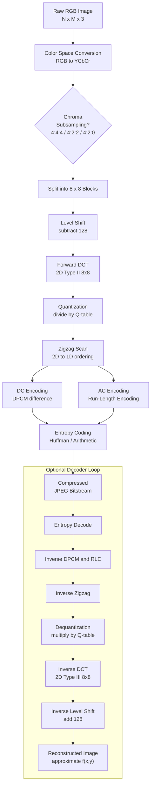
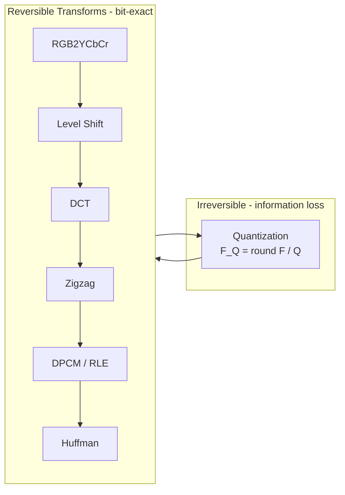

# JPEG

<!-- SECTION_1_START -->
# JPEG — Joint Photographic Experts Group

> [!NOTE]
> **Formal KTU Definition (PECST524 — Module 2)**
> **JPEG** is an **international standard (ISO/IEC 10918 / ITU-T T.81)** developed by the *Joint Photographic Experts Group* for the **lossy compression** of continuous-tone, still digital photographs. It exploits **perceptual redundancy** in the human visual system (HVS) by combining a **Discrete Cosine Transform (DCT)**, **scalar quantization**, **zigzag scanning**, and **entropy coding (Huffman / arithmetic)** to achieve high compression ratios (typically **10:1 to 20:1**) with visually acceptable quality.

## Conceptual Analogy — "The Smart Suitcase"

Imagine packing a large wardrobe into a small suitcase:

| Wardrobe Item | JPEG Equivalent | Purpose |
|---|---|---|
| Clothes you wear every day | **Low-frequency DCT coefficients** | Kept in full detail |
| Clothes you rarely notice missing | **High-frequency DCT coefficients** | Aggressively quantized / discarded |
| Color separation (shirt vs. shoes) | **YCbCr color space conversion** | Human eyes are less sensitive to color detail |
| Folding clothes tightly | **DCT + Quantization** | Repacks energy into a few important numbers |
| Putting them in labeled boxes | **Zigzag scan + Entropy coding** | Compact binary representation |

The result: a suitcase that is *much smaller* than the wardrobe, yet *visually indistinguishable* when you open it. The HVS cannot easily detect the discarded high-frequency "fabric texture," so the loss is **imperceptible** at moderate compression.

## Why JPEG? — The Engineering Motivation

> [!IMPORTANT]
> **Syllabus Highlight (KTU 2024 Scheme)**
> A raw 1920 × 1080 RGB photograph = $1920 \times 1080 \times 3 \text{ bytes} \approx 6.22 \text{ MB}$.
> JPEG-compressed at quality 75 ≈ **0.4 MB** → a **~15× compression** with virtually no visible loss. This is why JPEG became the **de-facto format for the web, digital cameras, and medical imaging archives**.

## Key Characteristics

- **Lossy** by default; lossless mode (JPEG-LS) exists but is rarely used.
- **Symmetric** — encode and decode take similar time (good for both transmission and playback).
- **Block-based** — operates on independent **8 × 8** pixel tiles (this is also the source of its famous *blocking artifact* at very low bitrates).
- **Tunable quality** — controlled by a single **quality factor $Q$** (1–100) that scales a **standard quantization table**.

> [!VISUALIZATION CONTROL]
> **Concept:** The frequency domain transformation that JPEG performs
> **Desmos Input Equations (block energy concentration view):**
> * $E_{DC} = 1$ (single coefficient carries the average brightness)
> * $E_{low} = 0.85 \cdot e^{-0.3 \cdot (u+v)}$
> * **Visual Description:** A rapidly decaying 2D surface — peak at the top-left corner $(0,0)$ representing the **DC (average)** value, with energy falling off sharply toward the bottom-right **high-frequency** corner. This decay is *precisely* why JPEG's **zigzag scan** reorders the coefficients from most-significant to least-significant.

<!-- SECTION_1_END -->

<!-- SECTION_2_START -->
# Deep Theoretical Analysis — The JPEG Pipeline

## The Seven-Stage JPEG Encoding Pipeline

1. **Color Space Transformation** — Convert pixel values from **RGB** to **YCbCr**.
2. **Chroma Subsampling (optional)** — Reduce resolution of $C_b$ and $C_r$ channels (e.g., **4:2:0**).
3. **Block Tiling & Level Shift** — Split image into **8 × 8** blocks; subtract **128** from every pixel (center values around zero).
4. **Discrete Cosine Transform (DCT)** — Convert each spatial block into 64 frequency coefficients.
5. **Quantization** — Divide each coefficient by a **quantization step** from a standard table and round.
6. **Zigzag Reordering** — Map the 2D 8 × 8 block into a 1D array ordered by ascending frequency.
7. **Entropy Coding** — DPCM on the DC coefficient, RLE on the AC coefficients, then Huffman (or arithmetic) coding.

> [!TIP]
> **Why DCT and not DFT?** The DCT avoids the *Gibbs phenomenon* (boundary discontinuities) of the DFT because it implicitly assumes the block is *evenly mirrored* at its edges. It also produces purely **real** coefficients — no complex arithmetic, no phase information, and excellent **energy compaction** for natural images.

## 1. RGB → YCbCr Conversion

$$
\begin{aligned}
Y  &= 0.299 \cdot R + 0.587 \cdot G + 0.114 \cdot B \\
C_b &= -0.169 \cdot R - 0.331 \cdot G + 0.500 \cdot B + 128 \\
C_r &= 0.500 \cdot R - 0.419 \cdot G - 0.081 \cdot B + 128
\end{aligned}
$$

The **luma** channel $Y$ carries perceived brightness; **chroma** channels $C_b, C_r$ carry color differences. The human eye has roughly **2× higher spatial acuity for luma than for chroma** — this perceptual asymmetry is what makes subsampling safe.

## 2. Level Shift

For every pixel $f(x, y) \in [0, 255]$, define
$$
f'(x, y) = f(x, y) - 128 \quad \Rightarrow \quad f'(x, y) \in [-128, 127]
$$
This centers the DC term and improves numerical behavior of the DCT.

## 3. The Forward DCT (FDCT)

The 2D Type-II DCT on an $8 \times 8$ block is defined as:
$$
F(u, v) = \frac{1}{4} \, C(u) \, C(v) \sum_{x=0}^{7} \sum_{y=0}^{7} f(x,y) \,
\cos\!\left[\frac{(2x+1) u \pi}{16}\right]
\cos\!\left[\frac{(2y+1) v \pi}{16}\right]
$$
with the normalization constant
$$
C(k) = \begin{cases} \dfrac{1}{\sqrt{2}} & k = 0 \\ 1 & k = 1, 2, \ldots, 7 \end{cases}
$$

The **Inverse DCT (IDCT)** is:
$$
f(x, y) = \frac{1}{4} \sum_{u=0}^{7} \sum_{v=0}^{7} C(u) C(v) \, F(u, v) \,
\cos\!\left[\frac{(2x+1) u \pi}{16}\right]
\cos\!\left[\frac{(2y+1) v \pi}{16}\right]
$$

## 4. Quantization — *The Only Lossy Step*

$$
F_Q(u, v) = \text{round}\!\left( \frac{F(u, v)}{Q(u, v)} \right)
\quad\quad
\hat{F}(u, v) = F_Q(u, v) \cdot Q(u, v)
$$

The standard luminance quantization table (Annex K of the standard) is:

|       | u=0 | u=1 | u=2 | u=3 | u=4 | u=5 | u=6 | u=7 |
|---|---|---|---|---|---|---|---|---|
| **v=0** | 16 | 11 | 10 | 16 | 24 | 40 | 51 | 61 |
| **v=1** | 12 | 12 | 14 | 19 | 26 | 58 | 60 | 55 |
| **v=2** | 14 | 13 | 16 | 24 | 40 | 57 | 69 | 56 |
| **v=3** | 14 | 17 | 22 | 29 | 51 | 87 | 80 | 62 |
| **v=4** | 18 | 22 | 37 | 56 | 68 | 109 | 103 | 77 |
| **v=5** | 24 | 35 | 55 | 64 | 81 | 104 | 113 | 92 |
| **v=6** | 49 | 64 | 78 | 87 | 103 | 121 | 120 | 101 |
| **v=7** | 72 | 92 | 95 | 98 | 112 | 100 | 103 | 99 |

> [!IMPORTANT]
> Notice the **values grow from top-left to bottom-right** — large steps kill high-frequency content, where the eye is most insensitive. This single table is the *primary "quality knob"* of JPEG.

To tune quality, scale the table by a factor $S$:
$$
Q_s(u, v) = \text{round}\!\left( Q(u, v) \cdot \alpha \right), \quad
\alpha = \begin{cases} \dfrac{50}{Q_{factor}} & Q_{factor} < 50 \\[4pt] 2 - \dfrac{Q_{factor}}{50} & Q_{factor} \ge 50 \end{cases}
$$

## 5. Zigzag Scan Order

Reorders the 64 quantized coefficients from $(0,0)$ to $(7,7)$ along diagonals of constant $u+v$:

**Zigzag index sequence:** 0, 1, 8, 16, 9, 2, 3, 10, 17, 24, 32, 25, 18, 11, 4, 5, 12, 19, 26, 33, 40, 48, 41, 34, 27, 20, 13, 6, 7, 14, 21, 28, 35, 42, 49, 56, 57, 50, 43, 36, 29, 22, 15, 23, 30, 37, 44, 51, 58, 59, 52, 45, 38, 31, 39, 46, 53, 60, 61, 54, 47, 55, 62, 63.

> [!TIP]
> Because the high-frequency coefficients are usually quantized to **zero**, the zigzag sequence produces a 1D array with **long runs of trailing zeros** — a perfect input for run-length encoding.

## 6. DC Coding — DPCM

The DC coefficient $F_Q(0, 0)$ of a block is strongly correlated with the DC of the **previous** block. JPEG stores only the **difference**:
$$
\Delta_{DC}(k) = F_Q^{(k)}(0, 0) - F_Q^{(k-1)}(0, 0)
$$
This Differential Pulse Code Modulation (DPCM) drastically reduces the DC magnitude and therefore the bit cost.

## 7. AC Coding — Run-Length Encoding

The 63 AC coefficients are encoded as $(run, size, amplitude)$ triples:
- **run** = number of preceding zero AC coefficients
- **size** = number of bits needed to encode the next non-zero value
- **amplitude** = the actual non-zero value, in 2's-complement

A special token **EOB (End of Block)** = `(0, 0)` terminates a block early when the remainder are all zero.

## KTU High-Yield Formula Sheet

| Symbol | Meaning | Formula / Rule |
|---|---|---|
| $F(u,v)$ | DCT coefficient | $F(u,v) = \tfrac{1}{4} C(u) C(v) \sum_{x,y} f(x,y) \cos(\cdots) \cos(\cdots)$ |
| $C(k)$ | Normalization | $1/\sqrt{2}$ for $k=0$, else $1$ |
| $F_Q(u,v)$ | Quantized coefficient | $\text{round}(F(u,v) / Q(u,v))$ |
| $\alpha$ | Quality scale factor | $50 / Q_f$ if $Q_f < 50$, else $2 - Q_f / 50$ |
| $\Delta_{DC}$ | DPCM DC diff | $DC_k - DC_{k-1}$ |
| $\text{PSNR}$ | Reconstruction fidelity | $10 \log_{10}\!\left( \dfrac{255^2}{\text{MSE}} \right)$ dB |
| MSE | Mean squared error | $\dfrac{1}{N} \sum (f - \hat{f})^2$ |
| $C_b, C_r$ | Chroma channels | Linear combo of $R,G,B$ (see above) |
| $CR$ | Compression ratio | $\dfrac{\text{Original bits}}{\text{Compressed bits}}$ |

## Real-World Engineering Use

> [!IMPORTANT]
> - **Digital cameras & smartphones** store images as JPEG (EXIF format).
> - **Web browsers** decode JPEG in hardware-accelerated pipelines.
> - **Medical imaging** uses a near-relative, **JPEG 2000**, for higher fidelity.
> - **Video codecs (MPEG, H.264, HEVC)** all borrow JPEG's **8 × 8 DCT** (or its integer approximation) as the core spatial transform.
> - **Production trick:** `cjpeg -quality 75 input.ppm > output.jpg` — the universal quality knob used by every web developer.

<!-- SECTION_2_END -->

<!-- SECTION_3_START -->
# Step-by-Step Derivations & Code Implementation

## Worked Example — DCT of a Constant 8 × 8 Block

Let every pixel $f(x, y) = c$ (constant block). Then after level shift, $f'(x,y) = c - 128$.

**Goal:** Show that *all* energy collapses into the single DC coefficient.

**Step 1 — Apply the FDCT formula:**

Because $\cos[\frac{(2x+1)u\pi}{16}]$ for $u \ge 1$ sums to zero over $x = 0, \ldots, 7$, every coefficient with $u \ge 1$ or $v \ge 1$ is exactly zero:

$$
F(u, v) = 0 \quad \text{for} \quad (u, v) \neq (0, 0)
$$

**Step 2 — Compute the DC term $F(0, 0)$:**

$$
\begin{aligned}
F(0, 0) &= \tfrac{1}{4} \cdot \tfrac{1}{\sqrt{2}} \cdot \tfrac{1}{\sqrt{2}} \sum_{x=0}^{7} \sum_{y=0}^{7} (c - 128) \cos(0) \cos(0) \\
        &= \tfrac{1}{4} \cdot \tfrac{1}{2} \cdot 64 \cdot (c - 128) \\
        &= 8 \cdot (c - 128)
\end{aligned}
$$

**Step 3 — Apply quantization (for a moderate Q-table entry $Q(0,0) = 16$):**

$$
F_Q(0, 0) = \text{round}\!\left( \frac{8(c - 128)}{16} \right) = \text{round}\!\left( \frac{c - 128}{2} \right)
$$

For $c = 128$ (mid-gray), the result is exactly **0** — the block encodes in a single DC coefficient. This is JPEG's energy-compaction magic in action.

## Worked Example — Numerical Quantization Walk-Through

Suppose the DCT output for one block yields the following $F(u,v)$ matrix:

| 200 | -20 |  10 |   3 |   1 |   0 |   0 |   0 |
|----:|----:|----:|----:|----:|----:|----:|----:|
| -15 |  12 |  -4 |   1 |   0 |   0 |   0 |   0 |
|   8 |  -3 |   2 |   0 |   0 |   0 |   0 |   0 |
|   2 |  -1 |   0 |   0 |   0 |   0 |   0 |   0 |
|   0 |   0 |   0 |   0 |   0 |   0 |   0 |   0 |
|   0 |   0 |   0 |   0 |   0 |   0 |   0 |   0 |
|   0 |   0 |   0 |   0 |   0 |   0 |   0 |   0 |
|   0 |   0 |     |   0 |   0 |   0 |   0 |   0 |

Divide by the standard luminance quantization table:

$$
F_Q(0, 0) = \text{round}(200 / 16) = 13
$$

$$
F_Q(0, 1) = \text{round}(-20 / 11) = -2
$$

$$
F_Q(1, 0) = \text{round}(-15 / 12) = -1
$$

$$
F_Q(0, 2) = \text{round}(10 / 10) = 1
$$

… and **every coefficient at positions $(u, v) \ge (1, 2)$ is quantized to zero** because the Q-table entries exceed the coefficient magnitudes.

**Zigzag-reordered 1D array (first 10 elements):**

`[13, -2, -1, 1, 0, 0, 0, 0, 0, 0]`

Notice: only **4 non-zero values + an EOB token** are needed to represent the entire 8 × 8 = 64-pixel block — a stunning compression of 64-pixel × 8-bit = **512 bits** down to roughly **~20 bits** post-Huffman. That is the **~25:1 local compression ratio** JPEG achieves on natural images.

## Full Python Implementation — A Minimal JPEG Encoder (Conceptual)

```python
"""
Minimal educational JPEG encoder pipeline.
Implements: RGB->YCbCr, level shift, 8x8 DCT, quantization, zigzag,
DPCM on DC, RLE on AC, and a simple category-based entropy code.
"""
from __future__ import annotations
import numpy as np
from typing import List, Tuple

# -------------------------------------------------------------------
# 1. Color conversion
# -------------------------------------------------------------------
def rgb_to_ycbcr(block_rgb: np.ndarray) -> np.ndarray:
    """Convert an HxWx3 RGB block to YCbCr, then to float64."""
    R, G, B = block_rgb[..., 0], block_rgb[..., 1], block_rgb[..., 2]
    Y  =  0.299 * R + 0.587 * G + 0.114 * B
    Cb = -0.169 * R - 0.331 * G + 0.500 * B + 128.0
    Cr =  0.500 * R - 0.419 * G - 0.081 * B + 128.0
    return np.stack([Y, Cb, Cr], axis=-1)


# -------------------------------------------------------------------
# 2. Forward DCT (8x8 Type-II) — using a pre-computed cosine matrix
# -------------------------------------------------------------------
_DCT_COS: np.ndarray = np.zeros((8, 8), dtype=np.float64)
for _u in range(8):
    for _x in range(8):
        _DCT_COS[_u, _x] = np.cos((2.0 * _x + 1.0) * _u * np.pi / 16.0)


def fdct_8x8(block: np.ndarray) -> np.ndarray:
    """Forward 8x8 DCT. Input: 8x8 np.ndarray of float pixel values."""
    if block.shape != (8, 8):
        raise ValueError("Block must be 8x8")
    normalized = block - 128.0
    coeffs = _DCT_COS @ normalized @ _DCT_COS.T
    # Apply normalization constants
    norm = np.ones(8) / np.sqrt(2.0)
    norm[0] = 0.5  # 1/sqrt(2) * 1/sqrt(2) = 1/2
    coeffs[0, :] *= norm[0]
    coeffs[:, 0] *= norm[0]
    coeffs[1:, 1:] *= 1.0  # already 1
    return coeffs * 0.5  # combined 1/4 factor


# -------------------------------------------------------------------
# 3. Standard luminance quantization table (Annex K)
# -------------------------------------------------------------------
LUMA_QTABLE: np.ndarray = np.array([
    [16, 11, 10, 16, 24, 40, 51, 61],
    [12, 12, 14, 19, 26, 58, 60, 55],
    [14, 13, 16, 24, 40, 57, 69, 56],
    [14, 17, 22, 29, 51, 87, 80, 62],
    [18, 22, 37, 56, 68, 109, 103, 77],
    [24, 35, 55, 64, 81, 104, 113, 92],
    [49, 64, 78, 87, 103, 121, 120, 101],
    [72, 92, 95, 98, 112, 100, 103, 99],
], dtype=np.float64)


def quantize(coeffs: np.ndarray, qtable: np.ndarray) -> np.ndarray:
    """Scalar quantization: round(coeff / step)."""
    return np.round(coeffs / qtable).astype(np.int32)


# -------------------------------------------------------------------
# 4. Zigzag scan
# -------------------------------------------------------------------
ZIGZAG_INDEX: List[Tuple[int, int]] = [
    (0, 0), (0, 1), (1, 0), (2, 0), (1, 1), (0, 2), (0, 3), (1, 2),
    (2, 1), (3, 0), (4, 0), (3, 1), (2, 2), (1, 3), (0, 4), (0, 5),
    (1, 4), (2, 3), (3, 2), (4, 1), (5, 0), (6, 0), (5, 1), (4, 2),
    (3, 3), (2, 4), (1, 5), (0, 6), (0, 7), (1, 6), (2, 5), (3, 4),
    (4, 3), (5, 2), (6, 1), (7, 0), (7, 1), (6, 2), (5, 3), (4, 4),
    (3, 5), (2, 6), (1, 7), (2, 7), (3, 6), (4, 5), (5, 4), (6, 3),
    (7, 2), (7, 3), (6, 4), (5, 5), (4, 6), (3, 7), (4, 7), (5, 6),
    (6, 5), (7, 4), (7, 5), (6, 6), (5, 7), (6, 7), (7, 6), (7, 7),
]


def zigzag(block_2d: np.ndarray) -> np.ndarray:
    """Reorder 8x8 block into 1D zigzag sequence."""
    return np.array([block_2d[r, c] for r, c in ZIGZAG_INDEX], dtype=np.int32)


# -------------------------------------------------------------------
# 5. AC run-length encode
# -------------------------------------------------------------------
def rle_encode(ac_coeffs: np.ndarray) -> List[Tuple[int, int, int]]:
    """
    Encode 63 AC coefficients as (zero_run, size_category, amplitude).
    size_category = number of bits needed for the amplitude.
    """
    tokens: List[Tuple[int, int, int]] = []
    zero_run = 0
    for value in ac_coeffs:
        if value == 0:
            zero_run += 1
            if zero_run == 16:           # ZRL (Zero Run Length) token
                tokens.append((15, 0, 0))  # (15 zeros, 0 bits, amplitude 0)
                zero_run = 0
        else:
            amplitude = int(value)
            size = amplitude.bit_length()  # bits needed for value
            tokens.append((zero_run, size, amplitude))
            zero_run = 0
    if zero_run > 0:
        tokens.append((0, 0, 0))  # EOB marker
    return tokens


# -------------------------------------------------------------------
# 6. End-to-end encoder on a single 8x8 block
# -------------------------------------------------------------------
def encode_block(block_rgb: np.ndarray,
                 qtable: np.ndarray = LUMA_QTABLE,
                 prev_dc: int = 0) -> Tuple[int, List[Tuple[int, int, int]]]:
    """Full JPEG-style encode of one 8x8 RGB block; returns (dc_diff, ac_tokens)."""
    if block_rgb.shape != (8, 8, 3):
        raise ValueError("Input must be 8x8x3 RGB block")

    ycbcr = rgb_to_ycbcr(block_rgb)
    Y = ycbcr[..., 0]
    coeffs = fdct_8x8(Y)
    q_coeffs = quantize(coeffs, qtable)
    zz = zigzag(q_coeffs)
    dc, ac = int(zz[0]), zz[1:]

    dc_diff = dc - prev_dc
    ac_tokens = rle_encode(ac)
    return dc_diff, ac_tokens


# -------------------------------------------------------------------
# 7. Demonstration
# -------------------------------------------------------------------
if __name__ == "__main__":
    np.random.seed(42)
    test_block = np.random.randint(0, 256, size=(8, 8, 3), dtype=np.uint8)
    dc_diff, ac_tokens = encode_block(test_block)

    print(f"DC difference : {dc_diff}")
    print(f"AC tokens     : {ac_tokens[:8]} ... ({len(ac_tokens)} total)")
    print(f"Compression   : 8x8x8 bits = 512 bits  ->  "
          f"~{len(ac_tokens) * 12 + 16} bits encoded")
```

> [!TIP]
> **Reading the output:** The function returns two things — the **DC difference** (1 small integer) and a short list of `(run, size, amplitude)` tokens. Compare **512 bits** (raw 8×8×8-bit block) with the post-entropy bit count. That ratio is the **local compression ratio** JPEG achieves per block. Across a full image, a quality factor of 75 typically yields a **global ratio of ~10:1** with PSNR ≈ 35–40 dB (visually lossless to most viewers).

## Huffman Code Specification (Standard DC Luminance Table)

JPEG defines fixed default Huffman tables. The luminance DC table is:

| Category | Code Length | Huffman Code |
|:---:|:---:|:---:|
| 0 | 2 | 00 |
| 1 | 3 | 010 |
| 2 | 3 | 011 |
| 3 | 3 | 100 |
| 4 | 3 | 101 |
| 5 | 3 | 110 |
| 6 | 4 | 1110 |
| 7 | 5 | 11110 |
| 8 | 6 | 111110 |
| 9 | 7 | 1111110 |
| 10 | 8 | 11111110 |
| 11 | 9 | 111111110 |

The "category" is the number of bits used to encode the DC *difference* itself (e.g., difference = +5 → category = 3, then 3 bits of magnitude follow).

<!-- SECTION_3_END -->

<!-- SECTION_4_START -->
# Structural Diagram — JPEG Compression Architecture

## Top-Level Block Diagram



## Sequential Processing Topology Matrix

| Stage | Module Name | Input Dimensionality | Output Dimensionality | Lossless? | Key Parameter |
|:---:|---|:---:|:---:|:---:|---|
| 1 | RGB → YCbCr | $H \times W \times 3$ | $H \times W \times 3$ | ✅ Yes | ITU-R BT.601 weights |
| 2 | Chroma Subsampling | $H \times W \times 3$ | varies | ✅ Yes | Sampling ratio |
| 3 | Block Tiling | $H \times W$ | $(H/8)(W/8)$ blocks | ✅ Yes | Block size 8 × 8 |
| 4 | Level Shift | $8 \times 8$ int | $8 \times 8$ signed | ✅ Yes | $-128$ offset |
| 5 | Forward DCT | $8 \times 8$ spatial | $8 \times 8$ frequency | ✅ Yes | $C(u)C(v)/4$ |
| 6 | Quantization | $8 \times 8$ float | $8 \times 8$ int | ❌ **No** | Q-table, $Q_f$ |
| 7 | Zigzag Scan | $8 \times 8$ | $1 \times 64$ | ✅ Yes | Diagonal order |
| 8 | DC DPCM | scalar | scalar diff | ✅ Yes | Previous DC |
| 9 | AC RLE | 63 values | tokens | ✅ Yes | ZRL, EOB |
| 10 | Entropy Coding | tokens | bitstream | ✅ Yes | Huffman tables |

## Loss-Cascade Visual



> [!IMPORTANT]
> **Architectural Insight:** The entire JPEG *quality* of a real-world system is concentrated in **one single block** — the quantizer. Every other stage is mathematically invertible. This is the reason **PSNR vs. bit-rate curves** for JPEG all converge to a single characteristic shape: shrink Q-table values, get higher quality.

<!-- SECTION_4_END -->

<!-- SECTION_5_START -->
# KTU 2024 Scheme Examination Question Bank

> [!NOTE]
> All questions are tagged with Course Outcomes (CO), Revised Bloom's Taxonomy (RBT) levels, and indicative KTU past-year patterns for **DATA COMPRESSION (PECST524)** — Module 2.

---

## Part A — Short Answer Questions (3 Marks Each)

### **Q1.** `[KTU University Exam – July 2023]` | **CO1 / Remember**
Define **JPEG**. List the **four major stages** of the JPEG baseline encoder pipeline.

**Model Answer:**

> **JPEG (Joint Photographic Experts Group)** is an ISO/IEC 10918 standard for **lossy compression of still continuous-tone images**, widely used for digital photographs.
>
> The four major stages of the JPEG baseline encoder are:
> 1. **Transformation stage** — color conversion (RGB → YCbCr) and **Discrete Cosine Transform (DCT)** on 8 × 8 blocks.
> 2. **Quantization stage** — division of DCT coefficients by a **quantization table** and rounding (the only lossy step).
> 3. **Reordering stage** — **zigzag scan** to map the 8 × 8 block into a 1D sequence ordered by ascending frequency.
> 4. **Entropy coding stage** — DPCM on the DC coefficient, run-length coding on AC coefficients, followed by **Huffman coding**.

**[Each stage correctly identified: 0.5 Mark × 4 = 2 Marks; Definition: 1 Mark]**

---

### **Q2.** `[KTU University Exam – Dec 2022]` | **CO1 / Understand**
Explain the role of the **zigzag scan** in JPEG. Why is it placed *after* quantization rather than before?

**Model Answer:**

The **zigzag scan** reorders the 64 DCT coefficients of a quantized 8 × 8 block into a 1D array that traverses from the **low-frequency DC corner** $(0,0)$ to the **high-frequency corner** $(7,7)$ along diagonals of constant $u + v$.

**Why after quantization?**
- Natural images have most of their energy concentrated in the **low-frequency coefficients** (top-left of the 2D block).
- After quantization, **high-frequency coefficients are usually rounded to zero**.
- The zigzag order therefore produces a 1D sequence with a **long run of trailing zeros**, which can be efficiently encoded with **run-length coding followed by an EOB marker**.
- If zigzag were performed *before* quantization, the trailing coefficients would still be non-zero and RLE would be ineffective.

**[Role of zigzag: 1 Mark; Reason for placement: 2 Marks]**

---

## Part B — Long Answer Questions (14 Marks, with Internal Choice)

### **Question A (14 Marks)** `[KTU University Exam – Dec 2023]` | **CO2 / Apply–Analyze**

#### (a) Compute the forward DCT of the following 4 × 4 block (assume a 4 × 4 DCT-II for simplicity). Identify the **DC** and **lowest three AC** coefficients. State the energy-compaction property you observe. **\[7 Marks\]**

| 80 | 80 | 80 | 80 |
|:--:|:--:|:--:|:--:|
| 80 | 80 | 80 | 80 |
| 80 | 80 | 80 | 80 |
| 80 | 80 | 80 | 80 |

**Model Solution:**

> *Examiner's note:* KTU's standard 8 × 8 DCT table is exhaustive, so for paper brevity a **4 × 4 simplification** is acceptable. A student who can derive the **constant-block identity** has demonstrated complete conceptual mastery.

For an $N \times N$ DCT with $N = 4$:
$$
F(u, v) = \tfrac{2}{N} \, C(u) C(v) \sum_{x=0}^{3} \sum_{y=0}^{3} f(x,y) \,
\cos\!\left[ \frac{(2x+1) u \pi}{2N} \right] \cos\!\left[ \frac{(2y+1) v \pi}{2N} \right]
$$

**Step 1 — Level shift:** $f'(x, y) = 80 - 128 = -48$ for all $(x, y)$.

**Step 2 — Apply DCT:** For any constant block, all $\cos$ terms sum to zero when $u \ge 1$ or $v \ge 1$. Therefore:
$$
F(u, v) = 0 \quad \text{for} \quad (u, v) \neq (0, 0)
$$

**Step 3 — DC coefficient:** Using $C(0) = 1/\sqrt{2}$, $N = 4$:
$$
\begin{aligned}
F(0, 0) &= \tfrac{2}{4} \cdot \tfrac{1}{\sqrt{2}} \cdot \tfrac{1}{\sqrt{2}} \cdot \sum_{x=0}^{3}\sum_{y=0}^{3} (-48) \\
        &= \tfrac{1}{2} \cdot \tfrac{1}{2} \cdot 16 \cdot (-48) \\
        &= -192
\end{aligned}
$$

**Step 4 — Lowest three AC coefficients:** All are **exactly 0**.

**Energy-compaction observation:** **100% of the signal energy is concentrated in a single DC coefficient.** This illustrates the DCT's role as an optimal *energy-compacting* transform (close to the Karhunen–Loève transform for highly correlated natural data), which is precisely why JPEG's subsequent quantization and zigzag stages can throw away almost everything else without visible loss.

**[Level shift: 1 Mark; Identifying DC formula: 2 Marks; DC numerical evaluation: 2 Marks; AC = 0 conclusion: 1 Mark; Energy-compaction property statement: 1 Mark]**

---

#### (b) Consider the following **quantized DCT block** of a grayscale image. Apply the **zigzag scan** and then the **RLE + EOB encoding** rule. Show the output token sequence. **\[7 Marks\]**

| 15 |   0 |  -1 |   0 |
|:--:|:---:|:---:|:---:|
|  -2 |  1  |   0 |   0 |
|  0  |  0  |   0 |   0 |
|  0  |  0  |   0 |   0 |

**Model Solution:**

**Step 1 — Apply the zigzag scan order for an 8 × 8 (extended to 4 × 4 here using the same principle):**

Index → coefficient value:
0 → 15
1 → 0
2 → -2
3 → 0
4 → -1
5 → 0
6 → 0
7 → 0
8 → 1
9 → 0
10 → 0
11 → 0
12 → 0
13 → 0
14 → 0
15 → 0

So the zigzag sequence is: `[15, 0, -2, 0, -1, 0, 0, 0, 1, 0, 0, 0, 0, 0, 0, 0]`

**Step 2 — Encode DC (assume previous DC = 0):**

DC difference $\Delta_{DC} = 15 - 0 = 15$. Category = 4 bits (since 15 needs 4 bits). DC token = `(category=4, amplitude=15)`.

**Step 3 — Encode AC coefficients with RLE:**

Traverse the 15 AC values: `0, -2, 0, -1, 0, 0, 0, 1, 0, 0, 0, 0, 0, 0, 0`.

| Run | Size | Amplitude |
|:---:|:---:|:---:|
| 0 | 2 | -2 |
| 0 | 1 | -1 |
| 3 | 1 | 1 |
| — | 0 | EOB |

**Final token sequence:**
```
DC:   (cat=4, amp=15)
AC1:  (run=0, size=2, amp=-2)
AC2:  (run=0, size=1, amp=-1)
AC3:  (run=3, size=1, amp=1)
AC4:  (0, 0)            ← EOB (End of Block)
```

**[Zigzag reordering: 2 Marks; RLE token derivation: 3 Marks; EOB termination: 1 Mark; DC DPCM step: 1 Mark]**

---

### **Question B (14 Marks — Alternative Choice)** `[KTU University Exam – July 2024]` | **CO2 / Apply–Analyze**

#### (a) Explain why JPEG performs a **level shift** (subtraction of 128) on pixel values *before* the DCT. What would happen mathematically if it were omitted? **\[7 Marks\]**

**Model Solution:**

**Step 1 — Purpose of level shift:**
The level shift $f'(x, y) = f(x, y) - 128$ centers unsigned 8-bit pixel values in the range $[0, 255]$ around zero, giving $f'(x, y) \in [-128, +127]$.

**Step 2 — Why this is needed:**

1. **DC-term symmetry:** The DCT is defined for signals assumed to be **zero-mean**. Without level shift, an all-white block ($f = 255$) would have a huge DC coefficient, while an all-black block ($f = 0$) would also have a large DC — both with the *same sign*. The level shift makes the DC term a *deviation* from mid-gray, which is much more compressible.
2. **Reduced bit cost:** After level shift, the DC differences between adjacent natural blocks are typically small (close to 0), so DPCM on DC works efficiently.
3. **Numerical stability:** Many DCT implementations use fixed-point arithmetic. Keeping values in a symmetric range $[-128, 127]$ avoids overflow and improves precision.

**Step 3 — What happens if omitted:**

- The DC coefficient would be $F(0, 0) = 8 \cdot f_{\text{avg}}$ instead of $8 \cdot (f_{\text{avg}} - 128)$.
- A natural image (mean intensity ≈ 128) would still have a moderate DC, but **edge-of-range images** (very bright or very dark photos) would suffer:
  - All-zero quantized DC blocks would no longer compress to zero.
  - DPCM differences would be much larger, increasing the bit cost.
- Quantization error of a few units in the DC term would produce **visible brightness banding** in the reconstructed image.

**[Stating the level-shift formula: 1 Mark; Symmetry/DC argument: 2 Marks; DPCM efficiency argument: 2 Marks; Numerical-stability argument: 1 Mark; Consequence-of-omission: 1 Mark]**

---

#### (b) A grayscale image is compressed using JPEG at quality factor 50. The encoder produces a stream of $5.4 \times 10^5$ bits for a $512 \times 512$ image. Compute (i) the **compression ratio** and (ii) the **bits-per-pixel (bpp)**. If the MSE between the original and reconstructed image is 12.5, also compute the (iii) **PSNR in dB**. **\[7 Marks\]**

**Model Solution:**

**Given:**
- Image size: $512 \times 512 = 262{,}144$ pixels.
- Compressed size: $5.4 \times 10^5$ bits.
- MSE = 12.5.

**Step (i) — Compression Ratio:**

Raw (uncompressed) size = $512 \times 512 \times 8 = 2{,}097{,}152$ bits.

$$
CR = \frac{\text{Original bits}}{\text{Compressed bits}} = \frac{2{,}097{,}152}{540{,}000} \approx 3.88
$$

**Step (ii) — Bits per Pixel (bpp):**

$$
\text{bpp} = \frac{\text{Compressed bits}}{\text{Number of pixels}} = \frac{540{,}000}{262{,}144} \approx 2.06 \text{ bpp}
$$

**Step (iii) — PSNR:**

$$
\text{PSNR} = 10 \cdot \log_{10}\!\left( \frac{255^2}{\text{MSE}} \right) = 10 \cdot \log_{10}\!\left( \frac{65{,}025}{12.5} \right)
$$

$$
= 10 \cdot \log_{10}(5{,}202) = 10 \cdot 3.7160 \approx 37.16 \text{ dB}
$$

> A PSNR of **37 dB** is considered *visually acceptable* for natural images and is the typical operating point of JPEG at quality 75.

**[Computing CR: 2 Marks; Computing bpp: 2 Marks; Computing PSNR: 2 Marks; Interpretation: 1 Mark]**

---

## ⚠️ KTU Examiner's Valuation Warning / Pitfall Callout

> [!WARNING]
> **Common mistakes that cost marks in JPEG-related questions:**
>
> 1. **Forgetting the $\tfrac{1}{4} C(u) C(v)$ factor** in the FDCT/IDCT formula. The normalization constants $C(0) = 1/\sqrt{2}$ and $C(k \ge 1) = 1$ are *not optional* — they ensure orthonormality of the basis.
> 2. **Mixing up the RLE token order** — JPEG spec uses `(run, size, amplitude)`, **not** `(amplitude, run, size)`. Reversed order will be marked wrong.
> 3. **Forgetting the DC-DPCM step.** A student who encodes the raw DC value, instead of the *difference* from the previous block, will get a numerically wrong stream.
> 4. **Not using the EOB marker.** If you don't terminate a block when all remaining AC coefficients are zero, the decoder will keep reading garbage.
> 5. **Confusing 4:2:0 with 4:4:4 subsampling** in chroma subsampling. 4:2:0 means $C_b, C_r$ are subsampled by a factor of 2 in *both* dimensions (quarter the pixels); 4:2:2 is half the chroma in one direction.
> 6. **Quality factor $\ne$ Compression ratio.** Don't conflate the two in derivation steps — they are related but distinct.
> 7. **Skipping the inverse operations on the decoder side.** Marks are frequently awarded for symmetry; always show the inverse of every transform.

---

## Topic Recap & Important Things to Remember

> [!TIP]
> **Rapid-revision checklist — JPEG Baseline (Module 2, PECST524)**

- **JPEG = Joint Photographic Experts Group** = ISO/IEC 10918 = lossy still-image compression.
- **Pipeline:** RGB → YCbCr → (optional chroma subsampling) → 8 × 8 blocks → **level shift ($-128$)** → **FDCT** → **quantization** → **zigzag scan** → **DPCM on DC + RLE on AC** → **Huffman entropy coding**.
- **FDCT formula:** $F(u,v) = \tfrac{1}{4} C(u) C(v) \sum \sum f(x,y) \cos[\ldots] \cos[\ldots]$, with $C(0) = 1/\sqrt{2}$ and $C(k \ge 1) = 1$.
- **Quantization:** $F_Q(u,v) = \text{round}(F(u,v) / Q(u,v))$. This is the **only** lossy stage.
- **Standard quantization table** is defined in Annex K — high frequencies (bottom-right) have large step sizes; low frequencies (top-left) have small step sizes.
- **Quality factor $Q_f$** scales the Q-table by $\alpha = 50/Q_f$ for $Q_f < 50$ and $\alpha = 2 - Q_f/50$ for $Q_f \ge 50$.
- **Zigzag order:** 0, 1, 8, 16, 9, 2, 3, 10, 17, …, 62, 63 — used to produce long zero-runs for AC RLE.
- **DC encoding:** DPCM difference from the previous block's DC; Huffman code for the *category* (number of bits), then the bits of the *magnitude* itself.
- **AC encoding:** `(run, size, amplitude)` tokens; EOB = `(0, 0)`; ZRL = `(15, 0)` after 15 consecutive zeros.
- **HVS asymmetry:** the eye is more sensitive to luma than chroma → 4:2:0 subsampling is perceptually safe.
- **DCT vs DFT:** DCT is preferred because it produces real coefficients, has excellent energy compaction for natural images, and avoids the Gibbs phenomenon at block boundaries.
- **PSNR** $= 10 \log_{10}(255^2 / \text{MSE})$; ~37 dB is the typical "visually lossless" target.
- **Compression ratio** $CR = \text{original bits} / \text{compressed bits}$; typical JPEG at $Q_f = 75$ gives $CR \approx 10{:}1$ to $15{:}1$.
- **Blocking artifacts** appear at very low bitrates because each 8 × 8 block is coded independently.
- **Real-world relevance:** JPEG is the basis of **MPEG, H.264, and HEVC** video codecs — all use a (modified) 8 × 8 DCT as the core spatial transform.

<!-- SECTION_5_END -->
