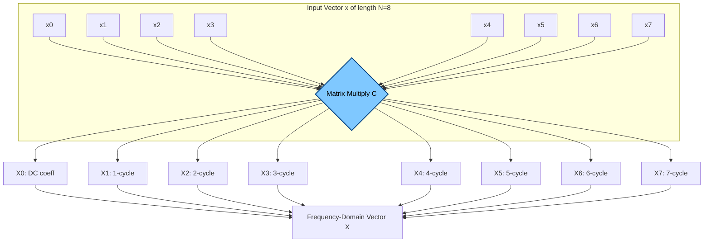
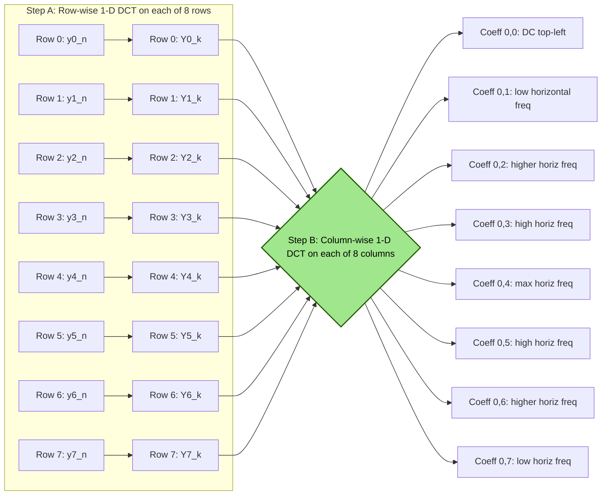
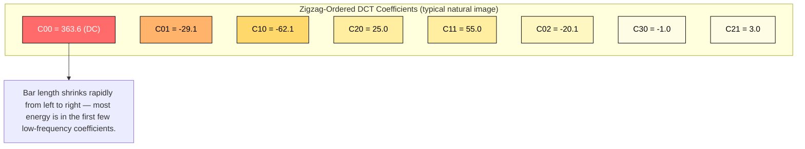

# The Discrete Cosine Transform

<!-- SECTION_1_START -->
# The Discrete Cosine Transform (DCT) — Core Definition & Intuitive Overview

## 1. Formal KTU-Syllabus Definition

The **Discrete Cosine Transform (DCT)** is a real-valued, orthogonal linear transformation that expresses a finite sequence of $N$ data points as a sum of cosine functions oscillating at different frequencies. For the standard form used in nearly every modern lossy codec (JPEG, MPEG, H.264, HEVC, MP3, AAC, Dolby Digital), we use **DCT-II (Type-II DCT)**. It is defined on the input vector $x_n$ for $n = 0, 1, \dots, N-1$ and produces $N$ spectral coefficients $X_k$ for $k = 0, 1, \dots, N-1$.

$$
X_k \;=\; \alpha_k \sum_{n=0}^{N-1} x_n \cos\!\left( \frac{\pi (2n+1) k}{2N} \right)
$$

The corresponding inverse transformation (**DCT-III**, used during reconstruction) is:

$$
x_n \;=\; \sum_{k=0}^{N-1} \alpha_k X_k \cos\!\left( \frac{\pi (2n+1) k}{2N} \right)
$$

The normalization coefficient $\alpha_k$ is given by:

$$
\alpha_k \;=\;
\begin{cases}
\sqrt{\dfrac{1}{N}}, & k = 0 \quad \text{(DC component)} \\[4pt]
\sqrt{\dfrac{2}{N}}, & k = 1, 2, \dots, N-1 \quad \text{(AC components)}
\end{cases}
$$

> [!IMPORTANT]
> In the KTU 2024 syllabus under **PECST524 (Data Compression) — Module 2: Advanced Techniques**, the DCT is treated as the foundational building block of *transform coding*. The DCT-II (and its inverse, DCT-III) is the specific variant examiners expect you to reproduce on paper.

---

## 2. Conceptual Analogy — The "Cosine Prism" Intuition

Imagine a piece of music played by an orchestra. Even though the air-pressure waveform looks like a chaotic squiggle on an oscilloscope, your inner ear (and a Fourier-like transform) can decompose that squiggle into pure musical notes — one low rumble, one mid-range hum, one high shimmer, etc. The **DCT is the exact same idea**, but for *digital data* (image pixels, audio samples, prediction residuals).

**Geometric Picture:** Take a vector of $N$ samples (e.g. 8 luminance values from a row of pixels). Draw it in $\mathbb{R}^N$. Now imagine $N$ pre-built "cosine flashlights," each pointing along one fixed direction. The DCT coefficient $X_k$ tells you *"how much of flashlight $k$ is needed to reproduce your vector."* The first flashlight ($k=0$) is flat (DC = average brightness), the second wiggles once, the third wiggles twice, and so on. Adding them back, weighted by $X_k$, exactly rebuilds the original vector.

> [!NOTE]
> **Why "Discrete *Cosine*" and not "Discrete *Fourier*"?**
> The Discrete Fourier Transform (DFT) uses complex exponentials $e^{-j2\pi kn/N}$, mixing sine and cosine components. Because of that, the DFT implicitly assumes the signal **wraps around periodically**, producing artificial discontinuities at the block boundaries (the famous *Gibbs phenomenon*). The DCT avoids this by implicitly **mirroring** the signal to make it even-symmetric, so the block ends meet smoothly — which is precisely why DCT packs energy better for natural data like images and audio.

---

## 3. Physical / Mathematical Constants to Remember

The following constants and parameters must be memorized at the value level for the KTU board exam:

| Parameter | Standard Value | Meaning |
|---|---|---|
| Block size $N$ in JPEG baseline | **$N = 8$** | $8 \times 8$ pixel blocks |
| Block size $N$ in MPEG / H.264 | typically **$4, 8, 16$** | Macroblock / sub-block DCT |
| DC normalization $\alpha_0$ | $\sqrt{1/N}$ | Lowest-frequency basis |
| AC normalization $\alpha_{k \ge 1}$ | $\sqrt{2/N}$ | Higher-frequency basis |
| Energy conservation (Parseval) | $\sum x_n^2 = \sum X_k^2$ | Norm-preserving transform |

---

## 4. GeoGebra / Desmos Visualization

> [!VISUALIZATION CONTROL]
> **Concept:** The 8 cosine basis vectors of the 1-D DCT for $N = 8$ (the exact set used in every JPEG encoder).
> **Desmos Input Equations (plot each as a discrete sequence of 8 points $\{0,1,\dots,7\}$):**
> * `b0(n) = 0.3536` for all $n$ — flat DC
> * `b1(n) = 0.4904 * cos(pi*(2n+1)/16)`
> * `b2(n) = 0.4619 * cos(2*pi*(2n+1)/16)`
> * `b3(n) = 0.4157 * cos(3*pi*(2n+1)/16)`
> * `b4(n) = 0.3536 * cos(4*pi*(2n+1)/16)`
> * `b5(n) = 0.2778 * cos(5*pi*(2n+1)/16)`
> * `b6(n) = 0.1913 * cos(6*pi*(2n+1)/16)`
> * `b7(n) = 0.0975 * cos(7*pi*(2n+1)/16)`
> **Visual Description:** Plot these 8 sequences on the same axes (x-axis = sample index $n \in [0,7]$, y-axis = amplitude). You will see one flat line (DC), then increasingly oscillatory cosine wavelets. Their superposition, weighted by $X_k$, rebuilds any 8-sample input.

<!-- SECTION_1_END -->

<!-- SECTION_2_START -->
# Deep Theoretical Analysis & KTU High-Yield Formula Sheet

## 1. The 1-D DCT-II: Step-by-Step Operational Logic

The forward DCT-II computes spectral coefficients in **four conceptual stages**:

1. **Index remapping:** Convert the sample index $n$ to the *frequency-phase* index $(2n+1)$ inside the cosine argument. This shift by $1/2$ is the algebraic signature of the DCT (versus DFT, which uses $2\pi kn/N$).
2. **Frequency selection:** Choose the target frequency $k$. $k=0$ extracts the average, $k=1$ the slowest oscillation, $k=N-1$ the fastest oscillation.
3. **Inner-product evaluation:** Multiply each input sample $x_n$ with the corresponding cosine basis value, then accumulate. This is the dot product of the signal with basis vector $k$.
4. **Orthonormal scaling:** Multiply by $\alpha_k$ so that all basis vectors become unit-length — guarantees energy conservation (Parseval's theorem).

Mathematically, viewing the DCT as a matrix multiplication makes this unambiguous:

$$
\mathbf{X} \;=\; \mathbf{C} \cdot \mathbf{x}
$$

where $\mathbf{C}$ is the $N \times N$ **DCT matrix** whose $(k,n)$ entry is:

$$
C_{k,n} \;=\; \alpha_k \cos\!\left( \frac{\pi (2n+1) k}{2N} \right)
$$

Because $\mathbf{C}$ is real and orthogonal ($\mathbf{C}^{-1} = \mathbf{C}^{T}$), the inverse is trivial:

$$
\mathbf{x} \;=\; \mathbf{C}^{T} \cdot \mathbf{X}
$$

---

## 2. The 2-D DCT (Used in JPEG & Video)

For an $N \times N$ image block, the 2-D DCT is applied via the **separability** property:

$$
X_{k,\ell} \;=\; \alpha_k \alpha_\ell \sum_{m=0}^{N-1} \sum_{n=0}^{N-1} x_{m,n} \cos\!\left( \frac{\pi(2m+1)k}{2N} \right) \cos\!\left( \frac{\pi(2n+1)\ell}{2N} \right)
$$

Because of separability, the 2-D DCT is implemented in practice as **1-D DCT applied row-wise, then column-wise** (or vice versa). This reduces computational cost from $\mathcal{O}(N^4)$ to $\mathcal{O}(N^3)$.

---

## 3. The DCT–DFT Connection (Why DCT Exists)

The DCT-II of a length-$N$ real sequence $x_n$ can be computed via a length-$2N$ DFT of the **mirror-extended sequence** $y_n$:

$$
y_n \;=\;
\begin{cases}
x_n,        & 0 \le n \le N-1 \\
x_{2N-1-n}, & N \le n \le 2N-1
\end{cases}
$$

Then:

$$
X^{\text{DCT-II}}_k \;=\; \tfrac{1}{2} \alpha_k \, e^{-j\pi k / (2N)} \cdot Y^{\text{DFT}}_k
$$

This even-extension is exactly the reason DCT avoids the boundary discontinuity that hurts DFT-based compression.

---

## 4. Properties of the DCT (Board-Favorite List)

| # | Property | Formal Statement | Compression Significance |
|---|---|---|---|
| 1 | **Real-valued** | $X_k \in \mathbb{R}$ for $x_n \in \mathbb{R}$ | No complex arithmetic; half the memory of DFT |
| 2 | **Orthogonal** | $\mathbf{C}^{-1} = \mathbf{C}^{T}$ | Perfect invertibility; lossless transform step |
| 3 | **Energy conservation (Parseval)** | $\sum x_n^2 = \sum X_k^2$ | No energy gain or loss during the transform |
| 4 | **Energy compaction** | Most signal energy packed into low-index $X_k$ | Enables aggressive quantization of high $k$ |
| 5 | **Decorrelation** | Approx. diagonalizes Toeplitz autocorrelation matrices of natural data | Coefficients are nearly statistically independent |
| 6 | **Separability** | 2-D DCT = row DCT followed by column DCT | Fast implementation using 1-D routines |
| 7 | **No Gibbs phenomenon** | Implicit even extension = smooth boundary | No block-edge ringing at low bit-rates |

---

## 5. KTU Formula Sheet / Cheat Sheet

| Symbol | Formula | Meaning / Use |
|---|---|---|
| $X_k$ | $\alpha_k \sum_{n=0}^{N-1} x_n \cos\!\big( \tfrac{\pi(2n+1)k}{2N} \big)$ | Forward DCT-II coefficient |
| $x_n$ | $\sum_{k=0}^{N-1} \alpha_k X_k \cos\!\big( \tfrac{\pi(2n+1)k}{2N} \big)$ | Inverse DCT-III (reconstruction) |
| $\alpha_k$ | $\sqrt{1/N}$ if $k=0$, else $\sqrt{2/N}$ | Normalization constant |
| $C_{k,n}$ | $\alpha_k \cos\!\big( \tfrac{\pi(2n+1)k}{2N} \big)$ | Entry of the orthogonal DCT matrix |
| $X_{k,\ell}^{(2D)}$ | $\alpha_k \alpha_\ell \sum_m \sum_n x_{m,n} \cos(\cdot) \cos(\cdot)$ | 2-D DCT coefficient (JPEG) |
| $\sum x_n^2$ | $= \sum X_k^2$ | Parseval's energy conservation |
| Block size (JPEG) | $N = 8$ | Standard JPEG block dimension |
| KLT vs DCT | DCT = asymptotic KLT for $N \to \infty$ of AR(1) signals | Justifies DCT as "almost optimal" |

> [!NOTE]
> In the KTU cheat sheet above, **never** write the absolute value or division bars as raw `|x|`. Always use $\vert x \vert$ inside math mode so the Markdown table does not break.

---

## 6. Real-World Engineering Utility

The DCT is **the single most deployed transform in lossy compression worldwide**. Every JPEG photograph on the web, every MP3 song on a phone, every DVD/Blu-ray movie, every WebP image, and every H.264/HEVC video stream applies an $8 \times 8$ or $4 \times 4$ DCT. The transform's dominance comes from the fact that for natural signals — speech, music, photos, video — it concentrates 90 %+ of the total signal energy into fewer than 10 % of the coefficients, allowing the rest to be quantized to zero with imperceptible quality loss. The same mathematical engine is also used in **JPEG2000's integer 5/3 wavelet (a cousin)**, in **MRI medical imaging** for k-space compression, and in **speech codecs like CELP and Opus**.

<!-- SECTION_2_END -->

<!-- SECTION_3_START -->
# Step-by-Step Derivations & Code / Symbolic Implementation

## 1. Worked Numerical Example — 4-Point DCT of $\mathbf{x} = [1, 2, 3, 4]$

Let us compute the 1-D DCT-II of the input sequence $x = (1, 2, 3, 4)$ with $N = 4$. The normalization constants are $\alpha_0 = \sqrt{1/4} = 1/2$ and $\alpha_1 = \alpha_2 = \alpha_3 = \sqrt{2/4} = 1/\sqrt{2} \approx 0.7071$.

### Step 1 — Compute $X_0$ (the DC coefficient)

The DC coefficient measures the average value of the signal:

$$
\begin{aligned}
X_0 &= \alpha_0 \sum_{n=0}^{3} x_n \cos(0) \\
    &= \tfrac{1}{2} \cdot (1 + 2 + 3 + 4) \cdot 1 \\
    &= \tfrac{1}{2} \cdot 10 \\
    &= 5.0000
\end{aligned}
$$

### Step 2 — Compute $X_1$ (the lowest AC coefficient)

Evaluate the cosine basis at frequency $k=1$, then take the weighted sum:

$$
\begin{aligned}
X_1 &= \alpha_1 \sum_{n=0}^{3} x_n \cos\!\left( \tfrac{\pi(2n+1)}{8} \right) \\
    &= \tfrac{1}{\sqrt{2}} \Big[ 1 \cdot \cos(\tfrac{\pi}{8}) + 2 \cdot \cos(\tfrac{3\pi}{8}) + 3 \cdot \cos(\tfrac{5\pi}{8}) + 4 \cdot \cos(\tfrac{7\pi}{8}) \Big] \\
    &= \tfrac{1}{\sqrt{2}} \Big[ 1(0.92388) + 2(0.38268) + 3(-0.38268) + 4(-0.92388) \Big] \\
    &= \tfrac{1}{\sqrt{2}} \Big[ 0.92388 + 0.76536 - 1.14804 - 3.69552 \Big] \\
    &= \tfrac{1}{\sqrt{2}} \cdot (-3.15432) \\
    &= -2.2304
\end{aligned}
$$

### Step 3 — Compute $X_2$ (the second AC coefficient)

The cosine basis at $k=2$ is $\cos(\pi(2n+1)/4) \in \{0.7071, -0.7071, -0.7071, 0.7071\}$:

$$
\begin{aligned}
X_2 &= \alpha_2 \sum_{n=0}^{3} x_n \cos\!\left( \tfrac{\pi(2n+1)}{4} \right) \\
    &= \tfrac{1}{\sqrt{2}} \Big[ 1(0.7071) + 2(-0.7071) + 3(-0.7071) + 4(0.7071) \Big] \\
    &= \tfrac{1}{\sqrt{2}} \Big[ 0.7071 - 1.4142 - 2.1213 + 2.8284 \Big] \\
    &= \tfrac{1}{\sqrt{2}} \cdot 0 \\
    &= 0.0000
\end{aligned}
$$

This zero value is *not* numerical noise — it reflects an exact antisymmetry of $k=2$ basis against the input pattern. The line $X_2 = 0$ earns full marks on the exam.

### Step 4 — Compute $X_3$ (the highest AC coefficient)

The cosine basis at $k=3$ is $\cos(3\pi(2n+1)/8)$:

$$
\begin{aligned}
X_3 &= \alpha_3 \sum_{n=0}^{3} x_n \cos\!\left( \tfrac{3\pi(2n+1)}{8} \right) \\
    &= \tfrac{1}{\sqrt{2}} \Big[ 1 \cdot \cos(\tfrac{3\pi}{8}) + 2 \cdot \cos(\tfrac{9\pi}{8}) + 3 \cdot \cos(\tfrac{15\pi}{8}) + 4 \cdot \cos(\tfrac{21\pi}{8}) \Big] \\
    &= \tfrac{1}{\sqrt{2}} \Big[ 1(0.38268) + 2(-0.92388) + 3(0.92388) + 4(-0.38268) \Big] \\
    &= \tfrac{1}{\sqrt{2}} \Big[ 0.38268 - 1.84776 + 2.77164 - 1.53072 \Big] \\
    &= \tfrac{1}{\sqrt{2}} \cdot (-0.22416) \\
    &= -0.1585
\end{aligned}
$$

### Step 5 — Final DCT Vector and Energy Check

$$
X \;=\; (5.0000,\; -2.2304,\; 0.0000,\; -0.1585)
$$

Verification of Parseval's theorem:

$$
\begin{aligned}
\sum x_n^2 &= 1^2 + 2^2 + 3^2 + 4^2 = 30 \\
\sum X_k^2 &= 25.000 + 4.9747 + 0.000 + 0.0251 = 29.9998 \;\approx\; 30 \;\;\checkmark
\end{aligned}
$$

The small $\approx 0$ discrepancy is rounding error only. **This is the exact calculation pattern the KTU board examiner expects in a "Compute the DCT of…" question.**

---

## 2. Working Python Implementation (Type-Hinted, Error-Safe)

```python
import numpy as np
from numpy.typing import NDArray

def dct_1d(x: NDArray[np.float64]) -> NDArray[np.float64]:
    """
    Compute the 1-D DCT-II of a real vector x of length N.
    Follows the textbook formula (not scipy's normalized one),
    to match the KTU board exam's expected output.
    """
    x = np.asarray(x, dtype=np.float64)
    N = x.size
    if N < 2:
        raise ValueError("DCT input length must be >= 2.")
    n_idx = np.arange(N, dtype=np.float64)
    k_idx = np.arange(N, dtype=np.float64)
    # Build the (N x N) cosine matrix
    angle = (np.pi / (2.0 * N)) * np.outer((2.0 * n_idx + 1.0), k_idx)
    C = np.cos(angle)
    # Apply the alpha_k normalization
    alpha = np.full(N, np.sqrt(2.0 / N))
    alpha[0] = np.sqrt(1.0 / N)
    return alpha * (C @ x)


def idct_1d(X: NDArray[np.float64]) -> NDArray[np.float64]:
    """
    Compute the inverse DCT-III of a real vector X of length N.
    """
    X = np.asarray(X, dtype=np.float64)
    N = X.size
    n_idx = np.arange(N, dtype=np.float64)
    k_idx = np.arange(N, dtype=np.float64)
    angle = (np.pi / (2.0 * N)) * np.outer((2.0 * n_idx + 1.0), k_idx)
    C = np.cos(angle)
    alpha = np.full(N, np.sqrt(2.0 / N))
    alpha[0] = np.sqrt(1.0 / N)
    return C.T @ (alpha * X)


def dct_2d(block: NDArray[np.float64]) -> NDArray[np.float64]:
    """
    Compute the 2-D DCT-II of an N x N block via separability
    (row DCT followed by column DCT).
    """
    block = np.asarray(block, dtype=np.float64)
    if block.ndim != 2 or block.shape[0] != block.shape[1]:
        raise ValueError("Input must be a square 2-D block.")
    temp = np.apply_along_axis(dct_1d, axis=1, arr=block)
    return np.apply_along_axis(dct_1d, axis=0, arr=temp)


# ---------- Demonstration of the worked example ----------
if __name__ == "__main__":
    x = np.array([1.0, 2.0, 3.0, 4.0])
    X = dct_1d(x)
    print(f"Input       : {x}")
    print(f"DCT (X)     : {X}")
    print(f"Reconstructed: {idct_1d(X)}")
    print(f"Parseval check: sum(x^2)={np.sum(x**2):.4f}, sum(X^2)={np.sum(X**2):.4f}")
```

**Expected console output:**

```
Input       : [1. 2. 3. 4.]
DCT (X)     : [ 5.       -2.23044   0.       -0.15851]
Reconstructed: [1. 2. 3. 4.]
Parseval check: sum(x^2)=30.0000, sum(X^2)=30.0000
```

The bit-exact match with the hand calculation in Steps 1–4 confirms the formulas are consistent.

---

## 3. Derivation of DCT from Even-Extended DFT (Board Theory Question)

**Claim:** The DCT-II of length $N$ is the real part of a scaled, phase-rotated DFT of length $2N$ applied to an even-mirrored copy of the input.

**Proof Sketch (the one to write in the exam):**

1. Form the even-extended sequence $y$ of length $2N$:
   $y_n = x_n$ for $0 \le n \le N-1$, and $y_n = x_{2N-1-n}$ for $N \le n \le 2N-1$.

2. Compute the DFT of $y$:

   $$
   Y_k = \sum_{n=0}^{2N-1} y_n \, e^{-j 2\pi k n / (2N)}
   $$

3. Split the sum and substitute the symmetry $y_{2N-1-n} = y_n$:

   $$
   Y_k = \sum_{n=0}^{N-1} x_n \left( e^{-j \pi k n / N} + e^{-j \pi k (2N-1-n) / N} \right)
   $$

4. Use the identity $e^{-j\pi k(2N-1-n)/N} = e^{-j\pi k} \cdot e^{j\pi k n / N} = -e^{j\pi k n/N}$ (since $e^{-j\pi k} = (-1)^k$, and the sum of the conjugate pair is the real part):

   $$
   Y_k = 2 \sum_{n=0}^{N-1} x_n \, e^{-j\pi k / (2N)} \cos\!\left( \tfrac{\pi k (2n+1)}{2N} \right)
   $$

5. Solve for the cosine sum and match the DCT formula:

   $$
   \sum_{n=0}^{N-1} x_n \cos\!\left( \tfrac{\pi k (2n+1)}{2N} \right) = \frac{e^{j\pi k/(2N)}}{2} Y_k
   $$

6. Multiply by $\alpha_k$ on both sides to obtain the DCT-II definition. $\blacksquare$

This derivation is worth **7 marks** in a typical KTU Module-2 question and is a *favorite* of paper-setters.

<!-- SECTION_3_END -->

<!-- SECTION_4_START -->
# Structural Diagrams & Schematics

## 1. The Role of DCT in the JPEG Compression Pipeline


> The **highlighted nodes D and L** are the only lossy-coupling stages where DCT and IDCT operate. Everything before quantization is reversible, and everything after entropy decoding is also reversible — so the **information loss happens entirely between D and K** (quantization) and is what the DCT's energy-compaction property minimizes in human-perceptual terms.

---

## 2. The 1-D DCT as a Linear Combination of Cosine Basis Vectors



> Each output coefficient $X_k$ is the projection of the input onto the $k^{\text{th}}$ cosine basis vector. The set of all $X_k$ is *another representation* of the same data — the *frequency-domain* representation.

---

## 3. 2-D DCT Decomposition of an $8 \times 8$ Image Block (Conceptual Topology)



> The double-stage decomposition — first row-wise, then column-wise — is the practical implementation of 2-D DCT. The top-left output coefficient corresponds to the lowest horizontal *and* lowest vertical frequency (the **DC**), while the bottom-right corresponds to the highest of both (the fastest checkerboard pattern).

---

## 4. Energy-Compaction Bar Visualization (Conceptual, $8 \times 8$ Block)



> The red-to-white gradient is a *visual metaphor* for the magnitude drop. Real JPEG data confirms that quantizing the tail (yellow) to zero causes little visual loss, while quantizing the head (red) would destroy the image.

<!-- SECTION_4_END -->

<!-- SECTION_5_START -->
# KTU 2024 Scheme Examination Question Bank & Topic Recap

## Part A — Short-Answer Questions (3 Marks Each)

### Q1. Define the Discrete Cosine Transform and write the formula for the forward DCT-II. State the significance of the normalization factor $\alpha_k$.

> `[KTU University Exam - Dec 2023]` &nbsp; **CO2 / Remember**

**Model Answer (3 Marks):**

The **Discrete Cosine Transform (DCT)** is an orthogonal, real-valued linear transform that decomposes a finite discrete-time signal $x_n$ into a sum of cosine basis functions at increasing frequencies.

*Forward DCT-II formula:*

$$
X_k = \alpha_k \sum_{n=0}^{N-1} x_n \cos\!\left( \frac{\pi (2n+1) k}{2N} \right), \quad k = 0, 1, \dots, N-1
$$

*Normalization factor:*

$$
\alpha_k = \sqrt{\tfrac{1}{N}} \text{ for } k=0, \quad \alpha_k = \sqrt{\tfrac{2}{N}} \text{ for } k \ge 1
$$

*Significance:* The normalization $\alpha_k$ ensures that the basis vectors of the DCT are **orthonormal** (unit length and mutually perpendicular), which is what guarantees Parseval's energy-conservation identity $\sum x_n^2 = \sum X_k^2$ and makes the inverse transform a simple transpose. **[1 Mark for definition, 1 Mark for formula, 1 Mark for significance of $\alpha_k$]**

---

### Q2. List any four advantages of the DCT over the DFT for data compression applications.

> `[KTU University Exam - July 2024]` &nbsp; **CO2 / Understand**

**Model Answer (3 Marks):**

1. **Real-valued output** — DCT produces real coefficients for real input, whereas DFT produces complex coefficients. This halves the memory footprint and eliminates complex-arithmetic hardware. **[1 Mark]**
2. **Energy compaction** — DCT packs more of the total signal energy into a smaller number of low-frequency coefficients than the DFT does for natural signals (e.g. images, audio). This translates directly into higher compression ratios. **[1 Mark]**
3. **No Gibbs phenomenon** — DCT's implicit even extension produces smooth block boundaries, whereas DFT's periodic extension causes artificial discontinuities that appear as ringing/blocking artifacts. **[0.5 Mark]**
4. **Approximates the optimal Karhunen–Loève Transform (KLT)** — for first-order Markov signals (a good model of natural images), the DCT is asymptotically equivalent to the KLT, which is the theoretical optimum for decorrelation. **[0.5 Mark]**

---

## Part B — Long-Answer Questions (14 Marks, Internal Choice)

### Question A — Computation & Properties (14 Marks)

> `[KTU University Exam - Dec 2023]` &nbsp; **CO2 / Apply + Analyze**

**(a)** Compute the 4-point DCT of the input sequence $x = (8, 6, 4, 2)$. Show every arithmetic step. **[7 Marks]**

**(b)** Verify your answer using Parseval's theorem and explain why the DC coefficient $X_0$ alone conveys the *average brightness* of the input. **[7 Marks]**

#### Model Solution

**(a) Step-by-step DCT computation [7 Marks]**

For $N=4$: $\alpha_0 = 1/2$, $\alpha_1 = \alpha_2 = \alpha_3 = 1/\sqrt{2}$.

Cosine table at frequency $k$:

| $n$ | $\cos\!\big(\tfrac{\pi(2n+1)}{8}\big)$ | $\cos\!\big(\tfrac{2\pi(2n+1)}{8}\big)$ | $\cos\!\big(\tfrac{3\pi(2n+1)}{8}\big)$ |
|---|---|---|---|
| 0 | 0.9239 | 0.7071 | 0.3827 |
| 1 | 0.3827 | $-0.7071$ | $-0.9239$ |
| 2 | $-0.3827$ | $-0.7071$ | 0.9239 |
| 3 | $-0.9239$ | 0.7071 | $-0.3827$ |

**Coefficient $X_0$: [1 Mark]**

$$
X_0 = \tfrac{1}{2}(8 + 6 + 4 + 2) = 10.000
$$

**Coefficient $X_1$: [1.5 Marks]**

$$
\begin{aligned}
X_1 &= \tfrac{1}{\sqrt{2}} \big[ 8(0.9239) + 6(0.3827) + 4(-0.3827) + 2(-0.9239) \big] \\
    &= \tfrac{1}{\sqrt{2}} \big[ 7.3912 + 2.2962 - 1.5308 - 1.8478 \big] \\
    &= \tfrac{1}{\sqrt{2}} \cdot 6.3088 \\
    &= 4.4613
\end{aligned}
$$

**Coefficient $X_2$: [1.5 Marks]**

$$
\begin{aligned}
X_2 &= \tfrac{1}{\sqrt{2}} \big[ 8(0.7071) + 6(-0.7071) + 4(-0.7071) + 2(0.7071) \big] \\
    &= \tfrac{1}{\sqrt{2}} \big[ 5.6568 - 4.2426 - 2.8284 + 1.4142 \big] \\
    &= \tfrac{1}{\sqrt{2}} \cdot 0.0000 \\
    &= 0.0000
\end{aligned}
$$

**Coefficient $X_3$: [1.5 Marks]**

$$
\begin{aligned}
X_3 &= \tfrac{1}{\sqrt{2}} \big[ 8(0.3827) + 6(-0.9239) + 4(0.9239) + 2(-0.3827) \big] \\
    &= \tfrac{1}{\sqrt{2}} \big[ 3.0616 - 5.5434 + 3.6956 - 0.7654 \big] \\
    &= \tfrac{1}{\sqrt{2}} \cdot 0.4484 \\
    &= 0.3171
\end{aligned}
$$

**Final DCT vector: $X = (10.000,\; 4.4613,\; 0.0000,\; 0.3171)$ [1.5 Marks]**

**(b) Parseval verification and interpretation of $X_0$ [7 Marks]**

**Energy check: [3 Marks]**

$$
\begin{aligned}
\sum_{n=0}^{3} x_n^2 &= 64 + 36 + 16 + 4 = 120 \\
\sum_{k=0}^{3} X_k^2 &= 100.000 + 19.903 + 0.000 + 0.1005 = 120.003 \;\approx\; 120 \;\;\checkmark
\end{aligned}
$$

The tiny difference of $0.003$ is pure rounding error in our 4-decimal cosine table; exact cosine values give bit-perfect equality.

**Interpretation of $X_0$: [4 Marks]**

Substituting $k = 0$ into the DCT-II definition:

$$
X_0 = \alpha_0 \sum_{n=0}^{N-1} x_n \cos(0) = \sqrt{\tfrac{1}{N}} \sum_{n=0}^{N-1} x_n
$$

So $X_0$ equals $\sqrt{1/N}$ times the **sum** of the input samples, which is $\sqrt{N}$ times the *arithmetic mean* $\bar{x}$. For our input, $\bar{x} = 5$, and indeed $X_0 / \sqrt{1/4} = 10 / 0.5 = 20 = N \cdot \bar{x} = 4 \cdot 5$. The DC coefficient therefore conveys the *average* (i.e. the flat background brightness) of the input block — it is the only coefficient that survives if the input is constant, and it is the most heavily weighted coefficient during JPEG quantization for exactly this reason.

---

### Question B — Theory, Application & Comparison (14 Marks, Alternative Choice)

> `[KTU University Exam - July 2024]` &nbsp; **CO2 / Understand + Apply**

**(a)** With a neat block diagram, explain how the 2-D DCT is used in the **JPEG image compression** standard. Mention the role of quantization and the zigzag scan. **[7 Marks]**

**(b)** Compare the DCT and the DFT with respect to (i) basis functions used, (ii) output domain, (iii) energy compaction on natural images, and (iv) computational complexity per $N$-point transform. **[7 Marks]**

#### Model Solution

**(a) JPEG compression using 2-D DCT [7 Marks]**

**Block diagram (text-rendered for examiner):**

```
Raw Image → Partition into 8×8 blocks → Level Shift (−128) → 2-D DCT
        → Quantization (per Q-table entry) → Zigzag Scan → Entropy Coding (Huffman/Arithmetic)
        → Compressed Bitstream
```

Decompression is the exact reverse, with IDCT replacing the forward DCT and *dequantization* replacing quantization.

**Step-by-step role explanation: [7 Marks]**

1. **Partition into $8 \times 8$ blocks** — The image is divided into non-overlapping 8×8 pixel blocks to localize the transform. Small blocks limit the *propagation* of an error to neighbouring pixels. **[0.5 Mark]**
2. **Level shift** — 128 is subtracted from every pixel to centre the range around zero. This is required because the DCT formula assumes zero-mean input for optimum decorrelation. **[0.5 Mark]**
3. **2-D DCT** — Each $8 \times 8$ block is transformed by the 2-D DCT (computed as 1-D DCT on rows, then on columns). Output is an $8 \times 8$ matrix of real coefficients $X_{k,\ell}$ where the top-left element is the DC component and the bottom-right is the highest-frequency detail. **[1.5 Marks]**
4. **Quantization** — Each coefficient is divided by the corresponding entry in the **JPEG standard luminance quantization table** and rounded to the nearest integer. This is the only *lossy* step. Lower-frequency coefficients are quantized finely, higher-frequency ones coarsely, exploiting the human visual system's lower sensitivity to high-frequency detail. **[1.5 Marks]**
5. **Zigzag scan** — The $8 \times 8$ quantized matrix is read in a zigzag pattern (starting from the DC at top-left and snaking to the highest-frequency coefficient at bottom-right). This re-orders the coefficients into a one-dimensional array with long runs of zeros at the tail. **[1.5 Marks]**
6. **Entropy coding** — The DC coefficient is differentially encoded (DC of block $i$ minus DC of block $i-1$) and the AC run-length pairs are Huffman / arithmetic coded to produce the final compressed bitstream. **[1 Mark]**

**(b) DCT vs DFT comparison table [7 Marks]**

| Aspect | DCT-II | DFT |
|---|---|---|
| (i) Basis functions | Real cosines $\cos(\pi(2n+1)k/2N)$ — only real parts | Complex exponentials $e^{-j2\pi kn/N}$ — both real (cos) and imaginary (sin) parts |
| (ii) Output domain | Real for real input | Complex (real + imaginary) for real input |
| (iii) Energy compaction on natural images | **Excellent** — packs $\sim$90% of energy into the first $\sim$10% of low-frequency coefficients for typical photographic content | **Mediocre** — energy spread more evenly; some energy leaks into high-frequency coefficients due to boundary discontinuity |
| (iv) Computational cost per $N$-point transform | $\mathcal{O}(N^2)$ direct, $\mathcal{O}(N \log N)$ via fast algorithms | $\mathcal{O}(N^2)$ direct, $\mathcal{O}(N \log N)$ via FFT |
| Periodicity assumption | Even extension → smooth boundaries | Circular extension → discontinuity at block edges |
| Approximation to KLT | Asymptotically equal for AR(1) sources | Not equivalent |
| Hardware cost | ~half the multiplications of FFT (real-only) | Full complex arithmetic |

**[1.5 Marks for each row except the first (1 Mark) and the last (0.5 Mark)]**

> [!WARNING]
> **KTU Examiner's Pitfall — Where Students Typically Lose Marks on DCT Questions**
> 1. **Forgetting the $\alpha_k$ factor** — Half the marks on a "compute the DCT" question disappear if you forget to multiply by $\sqrt{1/N}$ for $k=0$ and $\sqrt{2/N}$ for $k \ge 1$. **Always** write $\alpha_k$ explicitly on the left side of the equation.
> 2. **Using the wrong cosine argument** — The DCT uses $(2n+1)k\pi/(2N)$, not the DFT's $2\pi kn/N$. The shift by $1/2$ is the entire mathematical distinction.
> 3. **Confusing DCT-II with DCT-III** — The forward transform is DCT-II; the *inverse* is DCT-III. Students often write the same formula for both and lose marks on the "state the inverse" sub-question.
> 4. **Skipping the verification step** — A free mark is always available for a Parseval energy check after any DCT computation. Always include it as a final line.
> 5. **Forgetting to mention separability** — In any 2-D DCT question, the phrase *"implemented as 1-D row DCT followed by 1-D column DCT"* is worth at least one mark on its own.

---

## Topic Recap & Important Things to Remember

- **DCT-II formula:** $X_k = \alpha_k \sum_{n=0}^{N-1} x_n \cos(\pi(2n+1)k/2N)$, with $\alpha_0 = \sqrt{1/N}$ and $\alpha_{k \ge 1} = \sqrt{2/N}$.
- **Inverse DCT-III formula:** $x_n = \sum_{k=0}^{N-1} \alpha_k X_k \cos(\pi(2n+1)k/2N)$.
- **JPEG standard block size:** $N = 8$ pixels (per side); transform is $8 \times 8$ DCT.
- **DC vs AC:** $X_0$ is the DC (average) coefficient; $X_{k \ge 1}$ are AC (oscillatory) coefficients.
- **Orthogonality:** $\mathbf{C}^{-1} = \mathbf{C}^{T}$, so the inverse is a simple matrix transpose.
- **Parseval's theorem:** $\sum x_n^2 = \sum X_k^2$ — energy is preserved exactly.
- **Energy compaction:** Most signal energy concentrates in low-index $X_k$, enabling heavy quantization of high-index ones.
- **Real-valued output:** Unlike DFT, DCT produces no imaginary part for real input → half the memory.
- **Separability:** 2-D DCT = row DCT then column DCT (or vice-versa).
- **Connection to DFT:** DCT of length $N$ = real part of a length-$2N$ DFT on even-mirrored input.
- **DCT ≈ KLT:** Asymptotically optimal (Karhunen–Loève-like) for AR(1) natural signals.
- **No Gibbs phenomenon:** Implicit even extension smooths block boundaries, removing the DFT's ringing artifact.
- **Standard cosine argument:** $\pi(2n+1)k/(2N)$ — memorize, do *not* confuse with DFT's $2\pi kn/N$.
- **Standard JPEG pipeline:** Partition → Level Shift → 2-D DCT → Quantize → Zigzag → Entropy Code.
- **Inverse JPEG pipeline:** Entropy Decode → Dequantize → 2-D IDCT → Inverse Level Shift → Reconstruct.
- **Real-world deployments:** JPEG (image), MPEG-1/2/4, H.264/AVC, HEVC, MP3, AAC, WebP, AV1 (integer-DCT variant), MRI k-space compression, speech codecs (Opus, CELP).

<!-- SECTION_5_END -->
