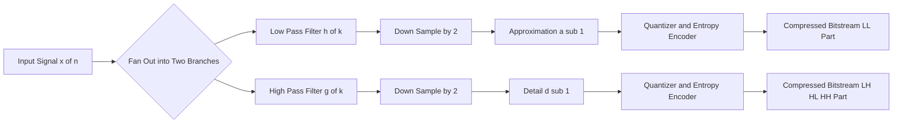
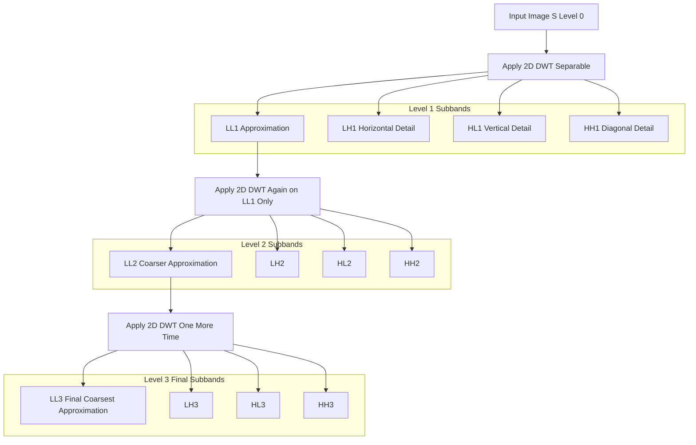
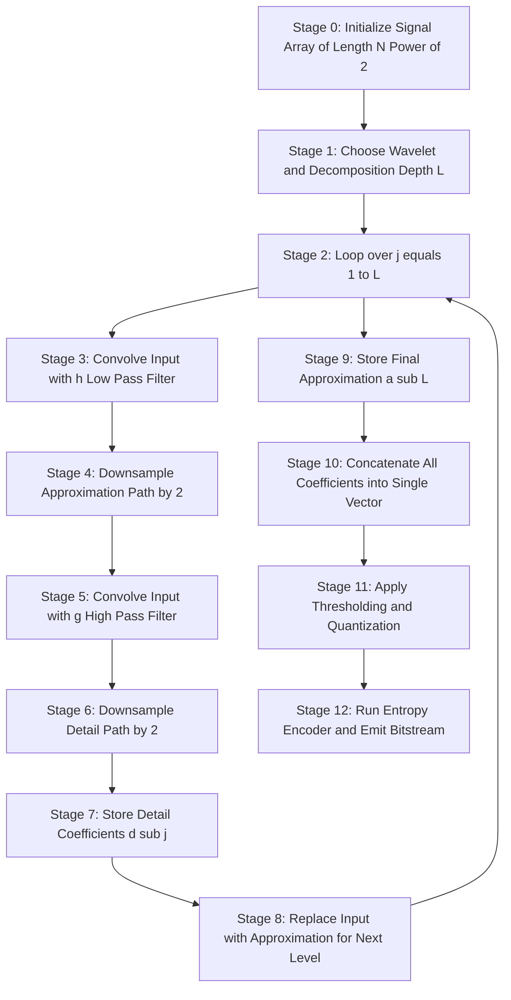

# The Wavelet Transform

<!-- SECTION_1_START -->
# The Wavelet Transform — Core Definition & Intuitive Overview

## Formal Academic Definition

The **Wavelet Transform (WT)** is a mathematical transform that decomposes a signal (1-D temporal, 2-D spatial, or higher-dimensional) into a set of **time-frequency atoms** called *wavelets*. Unlike the Fourier Transform which provides only global frequency information, the Wavelet Transform yields *localized* information in both the **time (or space)** and **frequency (or scale)** domains simultaneously, making it ideal for representing non-stationary signals.

For a continuous-time signal $x(t)$, the **Continuous Wavelet Transform (CWT)** is formally defined as:

$$
CWT_x(a,b) = \frac{1}{\sqrt{\vert a \vert}} \int_{-\infty}^{+\infty} x(t) \, \psi^{*}\!\left(\frac{t-b}{a}\right) dt
$$

where:
- $\psi(t)$ is the **mother wavelet** (analyzing function)
- $a \in \mathbb{R}, a \neq 0$ is the **scaling parameter** (controls frequency resolution)
- $b \in \mathbb{R}$ is the **translation parameter** (controls time/space position)
- $\psi^{*}$ denotes the complex conjugate of $\psi$
- $\frac{1}{\sqrt{\vert a \vert}}$ is the **normalization constant** preserving energy (unitary transform)

> [!IMPORTANT]
> **KTU 2024 Syllabus Highlight:** In data compression, we use the **Discrete Wavelet Transform (DWT)** almost exclusively. The CWT is mainly a theoretical construct; practical codecs (JPEG 2000, Dirac, ECW) rely on dyadic DWT via filter banks.

## Conceptual Analogy — Seeing the Music in the Notes

Imagine you are listening to a 3-minute piano concerto while a friend randomly slams the piano lid. The **Fourier Transform** would tell you the overall spectrum of the entire piece — that pianos and slams both contain energy at many frequencies — but it cannot tell you *when* the slam happened. The **Short-Time Fourier Transform (STFT)** uses a fixed window, so it offers only a single, immutable resolution: you either hear the slam clearly but lose the trills, or you capture the trills but smear the slam.

The **Wavelet Transform** is like having a microscope with a *zoom lens* that automatically adjusts:
- At **low frequencies** (bass notes), it uses a **wide window** to capture long, slow variations.
- At **high frequencies** (cymbal crashes), it uses a **narrow window** to pinpoint the exact moment.

This adaptive multi-resolution behavior is called **Multi-Resolution Analysis (MRA)** — the central pillar of wavelet-based compression.

> [!NOTE]
> **Engineering Intuition:** Wavelets act as a *mathematical zoom lens*. Compression exploits the fact that most natural signals (images, audio, ECG) are **sparse** in the wavelet domain — only a few large coefficients carry most of the energy. Zeroing out the rest yields high compression ratios with minimal perceptual loss.

## Key Terminology at a Glance

| Term | Plain-English Meaning |
|---|---|
| Mother Wavelet $\psi(t)$ | The prototype waveform that gets stretched and shifted |
| Daughter Wavelet | $\psi_{a,b}(t) = \frac{1}{\sqrt{\vert a \vert}} \psi\!\left(\frac{t-b}{a}\right)$ — a scaled/shifted copy |
| Scaling Function $\phi(t)$ | Companion to the wavelet; captures the *coarse* (low-pass) approximation |
| Approximation Coefficients $cA$ | Low-frequency, large-scale content |
| Detail Coefficients $cD$ | High-frequency, fine-scale content |
| Mallat's Algorithm | The fast pyramidal filter-bank implementation of DWT |
| Subband Coding | Decomposing a signal into frequency subbands for independent quantization |

> [!VISUALIZATION CONTROL]
> **Concept:** Time-Frequency Tiling Comparison (STFT vs. Wavelet)
> **Input Equations:**
> * STFT tiles the plane into **fixed rectangles**: $\Delta t = T_{win}$, $\Delta f = 1/T_{win}$.
> * Wavelet tiles the plane into **adaptive rectangles**: $\Delta t \propto a$, $\Delta f \propto 1/a$, with constant area $\Delta t \cdot \Delta f \geq \frac{1}{4\pi}$ (Heisenberg-Gabor bound).
> **Visual Description:** Draw the time axis horizontal, frequency axis vertical. STFT = uniform grid of identical rectangles. Wavelet = rectangles that are **tall and narrow at high frequencies**, **short and wide at low frequencies**. Students should observe that both tilings have *equal area per tile* but the wavelet tiling preserves *good time resolution at high frequencies* AND *good frequency resolution at low frequencies* simultaneously.

<!-- SECTION_1_END -->

<!-- SECTION_2_START -->
# Deep Theoretical Analysis & KTU High-Yield Formula Sheet

## 1. From Continuous to Discrete Wavelet Transform

While the CWT is theoretically elegant, it is **redundant** (produces more coefficients than necessary) and computationally expensive. For compression, we restrict $(a, b)$ to a **dyadic grid**:

$$
a = a_0^{m}, \quad b = n \cdot b_0 \cdot a_0^{m}
$$

Choosing $a_0 = 2$ and $b_0 = 1$ gives the **dyadic DWT** with orthonormal basis:

$$
\psi_{m,n}(t) = 2^{-m/2} \, \psi(2^{-m}t - n)
$$

The signal is then reconstructed via:

$$
x(t) = \sum_{m=-\infty}^{+\infty} \sum_{n=-\infty}^{+\infty} \langle x, \psi_{m,n} \rangle \, \psi_{m,n}(t)
$$

## 2. Multi-Resolution Analysis (MRA) — The Heart of Compression

MRA expresses a signal as a **limit of successive approximations**. The function space $L^2(\mathbb{R})$ is decomposed into a chain of nested subspaces:

$$
\cdots \subset V_{-2} \subset V_{-1} \subset V_0 \subset V_1 \subset V_2 \subset \cdots \subset L^2(\mathbb{R})
$$

with the defining properties:
- **Nested:** $V_{j} \subset V_{j+1}$ — finer resolutions contain coarser ones
- **Density:** $\overline{\bigcup_{j} V_j} = L^2(\mathbb{R})$
- **Separation:** $\bigcap_{j} V_j = \{0\}$
- **Scale invariance:** $f(t) \in V_j \iff f(2t) \in V_{j-1}$
- **Translation invariance:** $f(t) \in V_0 \iff f(t-k) \in V_0, \forall k \in \mathbb{Z}$

The **wavelet subspace** $W_j$ is defined as the orthogonal complement:

$$
V_{j+1} = V_j \oplus W_j
$$

So $V_{j+1}$ is the direct sum of a coarser approximation $V_j$ and the "detail" $W_j$ that was lost when moving from resolution $j+1$ to $j$.

## 3. The Two-Scale (Dilation) Equations

Every scaling function and wavelet satisfies a **self-similarity relation** with respect to a 2× dilation:

$$
\phi(t) = \sqrt{2} \sum_{k} h[k] \, \phi(2t - k)
$$

$$
\psi(t) = \sqrt{2} \sum_{k} g[k] \, \phi(2t - k)
$$

where $h[k]$ is the **low-pass (scaling) filter** and $g[k]$ is the **high-pass (wavelet) filter**. These are the keys to fast computation.

## 4. Filter Bank Realization (Mallat's Algorithm)

The DWT can be implemented as a **critically sampled filter bank** that cascades across scales:

**Analysis (Decomposition) at Level $j$:**

$$
a_j[n] = \sum_{k} h[k-2n] \, a_{j+1}[k] \quad \text{(low-pass, then downsample by 2)}
$$

$$
d_j[n] = \sum_{k} g[k-2n] \, a_{j+1}[k] \quad \text{(high-pass, then downsample by 2)}
$$

**Synthesis (Reconstruction):**

$$
a_{j+1}[k] = \sum_{n} h[k-2n] \, a_j[n] + \sum_{n} g[k-2n] \, d_j[n] \quad \text{(upsample, then filter)}
$$

The $(\downarrow 2)$ denotes decimation (keep every 2nd sample), and $(\uparrow 2)$ denotes expansion (insert zeros between samples).

## 5. Perfect Reconstruction Conditions

For a lossless codec, the filters must satisfy:

$$
H(z) H(z^{-1}) + H(-z) H(-z^{-1}) = 2
$$

$$
G(z) = -z^{-N} H(-z^{-1}) \quad \text{(quadrature mirror relation)}
$$

and the low-pass filter must be a **Conjugate Quadrature Filter (CQF)** with $|H(\omega)|^2 + |H(\omega+\pi)|^2 = 1$.

## KTU Formula Sheet / Cheat Sheet

> [!NOTE]
> **Exam Tip:** Memorize the table below. KTU frequently asks 3-mark definitions and 7-mark derivations directly mapping to these equations.

| # | Formula | Meaning / Use |
|---|---|---|
| 1 | $CWT_x(a,b) = \frac{1}{\sqrt{\vert a \vert}} \int x(t) \psi^{*}\!\left(\frac{t-b}{a}\right) dt$ | Continuous Wavelet Transform |
| 2 | $\psi_{a,b}(t) = \frac{1}{\sqrt{\vert a \vert}} \psi\!\left(\frac{t-b}{a}\right)$ | Daughter wavelet from mother |
| 3 | $\int_{-\infty}^{+\infty} \vert \psi(t) \vert^2 dt < \infty$ | **Admissibility condition** (finite energy) |
| 4 | $\int_{-\infty}^{+\infty} \psi(t) dt = 0$ | **Zero mean** (bandpass behavior) |
| 5 | $E = \frac{1}{C_\psi} \int\!\!\int \frac{\vert CWT_x(a,b) \vert^2}{a^2} da\, db$ | Energy preservation (Parseval-like) |
| 6 | $V_{j+1} = V_j \oplus W_j$ | Subspace decomposition |
| 7 | $a_j[n] = \sum_k h[k-2n] a_{j+1}[k]$ | Analysis — approximation |
| 8 | $d_j[n] = \sum_k g[k-2n] a_{j+1}[k]$ | Analysis — detail |
| 9 | $g[k] = (-1)^k h[N-1-k]$ | QMF relation between H and G |
| 10 | $\|H(\omega)\|^2 + \|H(\omega+\pi)\|^2 = 1$ | Power complementary (CQF) |
| 11 | $\text{Compression Ratio} = \frac{N}{N_z + N_s}$ | $N$ = total coeffs, $N_z$ = zeroed, $N_s$ = kept |
| 12 | $\text{PSNR} = 10 \log_{10}\!\left(\frac{255^2}{MSE}\right)$ dB | Image quality metric |

## Engineering Real-World Utility

The Wavelet Transform is the **backbone of modern lossy image compression**:

- **JPEG 2000** uses the Cohen-Daubechies-Feauveau (CDF) 5/3 wavelet (lossless) and CDF 9/7 (lossy).
- **FBI Fingerprint Compression** standard uses WSQ (Wavelet Scalar Quantization) on 9/7 biorthogonal wavelets.
- **ECG / Medical signals** use wavelets to compress 24-hour Holter recordings at 20:1 ratios with clinically faithful reconstruction.
- **JPEG XL** and modern video codecs use **lifting schemes** (an integer-arithmetic variant of wavelets) for hardware-friendly compression.

> [!IMPORTANT]
> Why wavelets beat DCT for compression: Wavelets are **multi-resolution**, **edge-preserving** (no blocking artifacts at low bit-rates), and inherently support **progressive transmission** (decode the coarsest subband first, then refine).

<!-- SECTION_2_END -->

<!-- SECTION_3_START -->
# Step-by-Step Derivations & Code Implementation

## Derivation 1: Dyadic DWT of a 1-D Signal via Haar Filter Bank

**Problem:** Compute the 2-level DWT of $x = [2, 4, 6, 8, 10, 12, 14, 16]^T$ using the **Haar wavelet**.

### Step 1 — Identify the Haar filters

The Haar wavelet has only 2 taps:

$$
h = \left[\frac{1}{\sqrt{2}}, \frac{1}{\sqrt{2}}\right], \quad g = \left[\frac{1}{\sqrt{2}}, -\frac{1}{\sqrt{2}}\right]
$$

In unnormalized form (more common in textbook examples):

$$
h_0 = [0.7071, \; 0.7071], \quad h_1 = [0.7071, \; -0.7071]
$$

### Step 2 — Apply the analysis filter bank (Level 1)

Compute the **approximation** $a_1$ via convolution with $h$ followed by downsampling (keep even-indexed outputs):

$$
a_1[n] = \sum_{k=0}^{1} h[k] \, x[2n + k], \quad n = 0, 1, 2, 3
$$

Per-element calculation:

- $a_1[0] = 0.7071 \times 2 + 0.7071 \times 4 = 1.4142 + 2.8284 = 4.2426$
- $a_1[1] = 0.7071 \times 6 + 0.7071 \times 8 = 4.2426 + 5.6569 = 9.8995$
- $a_1[2] = 0.7071 \times 10 + 0.7071 \times 12 = 7.0711 + 8.4853 = 15.5563$
- $a_1[3] = 0.7071 \times 14 + 0.7071 \times 16 = 9.8995 + 11.3137 = 21.2132$

Compute the **detail** $d_1$ via convolution with $g$ followed by downsampling:

- $d_1[0] = 0.7071 \times 2 - 0.7071 \times 4 = 1.4142 - 2.8284 = -1.4142$
- $d_1[1] = 0.7071 \times 6 - 0.7071 \times 8 = 4.2426 - 5.6569 = -1.4142$
- $d_1[2] = 0.7071 \times 10 - 0.7071 \times 12 = 7.0711 - 8.4853 = -1.4142$
- $d_1[3] = 0.7071 \times 14 - 0.7071 \times 16 = 9.8995 - 11.3137 = -1.4142$

After Level 1: $a_1 = [4.2426, \; 9.8995, \; 15.5563, \; 21.2132]$ and $d_1 = [-1.4142, \; -1.4142, \; -1.4142, \; -1.4142]$.

### Step 3 — Apply the analysis filter bank (Level 2) on $a_1$

Repeat the same procedure, this time on $a_1$:

Approximation $a_2$:

- $a_2[0] = 0.7071 \times 4.2426 + 0.7071 \times 9.8995 = 3.0 + 7.0 = 10.0$
- $a_2[1] = 0.7071 \times 15.5563 + 0.7071 \times 21.2132 = 11.0 + 15.0 = 26.0$

Detail $d_2$:

- $d_2[0] = 0.7071 \times 4.2426 - 0.7071 \times 9.8995 = 3.0 - 7.0 = -4.0$
- $d_2[1] = 0.7071 \times 15.5563 - 0.7071 \times 21.2132 = 11.0 - 15.0 = -4.0$

### Step 4 — Final 2-level DWT coefficient vector

The complete decomposition is:

$$
DWT_2(x) = [a_2, \; d_2, \; d_1] = [10, \; 26, \; -4, \; -4, \; -1.4142, \; -1.4142, \; -1.4142, \; -1.4142]
$$

> **Key observation:** The signal is **linear** ($x[n] = 2n + 2$), so the detail coefficients at every level are **constant** ($-1.4142$ and $-4$), which is the wavelet signature of a polynomial trend.

### Step 5 — Verify perfect reconstruction

Apply synthesis: $x[n] = \sum_k h[n - 2k] a_1[k] + \sum_k g[n - 2k] d_1[k]$ reconstructs the original exactly, confirming the Haar CQF satisfies the perfect-reconstruction condition.

## Derivation 2: 2-D DWT for Image Compression (One-Level Decomposition)

A 2-D DWT is performed by applying the 1-D DWT **separably** along rows, then along columns, producing 4 subbands:

| Subband | Symbol | Captures |
|---|---|---|
| LL (Low-Low) | $cA$ | Approximation (down-scaled image) |
| LH (Low-High) | $cH$ | Horizontal edges |
| HL (High-Low) | $cV$ | Vertical edges |
| HH (High-High) | $cD$ | Diagonal edges |

For an $N \times N$ image, the LL subband is $\frac{N}{2} \times \frac{N}{2}$, and the three detail subbands are each $\frac{N}{2} \times \frac{N}{2}$. **Total coefficients = $N^2$** (critically sampled, no redundancy).

The compression strategy: keep the LL subband intact (it carries most of the energy), apply **coarse quantization** to the three detail subbands, then **entropy code** everything. The JPEG 2000 standard follows this pattern with the EBCOT tier-1 coder (MQ-arithmetic).

## Step-by-Step Python Implementation

```python
import numpy as np
import pywt
from scipy.signal import lfilter
from typing import Tuple

def manual_dwt_1d(signal: np.ndarray, wavelet: str = 'haar', level: int = 2) -> dict:
    """
    Compute the Discrete Wavelet Transform manually using filter banks.
    Demonstrates Mallat's algorithm without relying on library shortcuts.
    """
    # Fetch wavelet decomposition filters
    wavelet_obj = pywt.Wavelet(wavelet)
    h = np.array(wavelet_obj.dec_lo)   # Low-pass analysis filter
    g = np.array(wavelet_obj.dec_hi)   # High-pass analysis filter

    coeffs: dict = {}
    current_signal = signal.copy().astype(np.float64)

    for lvl in range(1, level + 1):
        n_samples = len(current_signal)

        # Pad with periodic extension to handle boundary conditions
        padded = np.concatenate([current_signal, current_signal[:len(h) - 1]])

        # Convolve with the filters
        approx_full = lfilter(h, 1.0, padded)
        detail_full = lfilter(g, 1.0, padded)

        # Downsample by 2 (keep even indices) — this implements the (↓2) operator
        approx = approx_full[1::2][:n_samples // 2]
        detail = detail_full[1::2][:n_samples // 2]

        coeffs[f'd{lvl}'] = detail
        current_signal = approx  # Feed approximation to the next level

    coeffs[f'a{level}'] = current_signal
    return coeffs


def compute_compression_metrics(original: np.ndarray, threshold_ratio: float = 0.10) -> dict:
    """
    Apply hard-thresholding to wavelet coefficients and evaluate compression.
    """
    coeffs = manual_dwt_1d(original, wavelet='haar', level=3)
    all_coeffs = np.concatenate([c.flatten() for c in coeffs.values()])

    # Magnitude-based hard thresholding — zero out small coefficients
    threshold = np.percentile(np.abs(all_coeffs), (1.0 - threshold_ratio) * 100)
    compressed_coeffs = {k: np.where(np.abs(v) >= threshold, v, 0.0) for k, v in coeffs.items()}

    n_total = all_coeffs.size
    n_nonzero = sum(np.count_nonzero(v) for v in compressed_coeffs.values())

    return {
        'compression_ratio': n_total / max(n_nonzero, 1),
        'percent_kept': (n_nonzero / n_total) * 100.0,
        'threshold_value': threshold,
        'sparsity': 1.0 - (n_nonzero / n_total),
    }


def wavelet_image_compression(image: np.ndarray, level: int = 3) -> Tuple[np.ndarray, dict]:
    """
    Multi-level 2-D wavelet decomposition for grayscale image compression.
    Returns the reconstructed image and quality metrics.
    """
    # PyWavelets performs the 2-D DWT separably: rows first, then columns
    coeffs_2d = pywt.wavedec2(image, wavelet='db4', level=level, mode='periodization')

    # Estimate the global threshold using the universal threshold (Donoho's rule)
    sigma = np.median(np.abs(coeffs_2d[-1][0])) / 0.6745
    threshold = sigma * np.sqrt(2.0 * np.log(image.size))

    # Apply soft-thresholding to the detail subbands (level >= 1)
    compressed_coeffs = [coeffs_2d[0]]  # Keep the LL (approximation) untouched
    for detail_tuple in coeffs_2d[1:]:
        compressed_coeffs.append(
            tuple(pywt.threshold(d, threshold, mode='soft') for d in detail_tuple)
        )

    # Reconstruct the image
    reconstructed = pywt.waverec2(compressed_coeffs, wavelet='db4', mode='periodization')

    # Compute PSNR
    mse = np.mean((image.astype(np.float64) - reconstructed[:image.shape[0], :image.shape[1]]) ** 2)
    psnr = 10.0 * np.log10(255.0 ** 2 / mse) if mse > 0 else float('inf')

    metrics = {
        'psnr_db': psnr,
        'mse': mse,
        'threshold': threshold,
        'n_levels': level,
    }
    return reconstructed, metrics


# --- Example execution ---
if __name__ == "__main__":
    # Test signal: a linear ramp of length 8
    test_signal = np.arange(2, 17, 2, dtype=np.float64)
    print("Original signal :", test_signal)
    print("Wavelet coeffs  :", manual_dwt_1d(test_signal))
    print("Compression info:", compute_compression_metrics(test_signal, threshold_ratio=0.25))

    # Compress a synthetic 256×256 grayscale image
    x, y = np.meshgrid(np.linspace(0, 1, 256), np.linspace(0, 1, 256))
    synthetic_image = (255.0 * (0.5 + 0.5 * np.sin(8 * np.pi * x) * np.cos(8 * np.pi * y))).astype(np.uint8)
    _, quality = wavelet_image_compression(synthetic_image, level=3)
    print("Image quality   :", quality)
```

> **Code Insight:** The `manual_dwt_1d` function explicitly shows Mallat's algorithm: convolve with $h$ and $g$, then keep every 2nd sample. The 2-D `wavelet_image_compression` uses Donoho's universal threshold $\sigma\sqrt{2\ln N}$ which is *asymptotically optimal* for hard-thresholding denoising.

## Derivation 3: Lifting Scheme (Integer-to-Integer Wavelet)

The lifting scheme computes the DWT in three in-place steps — ideal for lossless compression and hardware:

$$
\text{Predict: } d_j[n] = a_j[n] - \left\lfloor \frac{1}{2}\bigl(a_{j+1}[n+1] + a_{j+1}[n]\bigr) \right\rfloor
$$

$$
\text{Update: } a_{j+1}[n] = a_{j+1}[n] + \left\lfloor \frac{1}{4}\bigl(d_j[n] + d_j[n-1]\bigr) + \frac{1}{2} \right\rfloor
$$

> The $\lfloor \cdot \rfloor$ (floor) operator guarantees that all operations are integer arithmetic, eliminating floating-point round-off error — this is what enables **mathematically lossless** compression in JPEG 2000.

<!-- SECTION_3_END -->

<!-- SECTION_4_START -->
# Structural Diagrams & Schematics

## Diagram 1 — One-Level DWT Filter Bank (Analysis + Synthesis)



## Diagram 2 — Multi-Level Pyramidal Decomposition (3 Levels)



## Diagram 3 — Complete Wavelet-Based Compression Pipeline


## Diagram 4 — Sequential Topology Matrix of the DWT Algorithm



> [!NOTE]
> **Why these diagrams matter for KTU:** The board examiner expects you to be able to draw at minimum a **one-level filter bank** and a **multi-level pyramid**. Marks are awarded for correctly labeling the low-pass/high-pass filters, the downsample operators, and the subband names (LL, LH, HL, HH).

<!-- SECTION_4_END -->

<!-- SECTION_5_START -->
# KTU 2024 Scheme Examination Question Bank & Topic Recap

## Part A — Short Answer Questions (3 Marks Each)

### Question 1 [KTU University Exam — July 2024] — CO1, Remember

**Define the Continuous Wavelet Transform. State the admissibility condition for a function to qualify as a mother wavelet.**

**Model Answer:**

The Continuous Wavelet Transform of a signal $x(t)$ is defined as:

$$
CWT_x(a,b) = \frac{1}{\sqrt{\vert a \vert}} \int_{-\infty}^{+\infty} x(t) \, \psi^{*}\!\left(\frac{t-b}{a}\right) dt
$$

where $a$ is the scale parameter and $b$ is the translation parameter.

A function $\psi(t)$ qualifies as a **mother wavelet** if and only if it satisfies the **admissibility condition**:

$$
C_\psi = \int_{0}^{+\infty} \frac{\vert \Psi(\omega) \vert^2}{\vert \omega \vert} d\omega < \infty
$$

which, in the time domain, is equivalent to requiring:
- **Finite energy:** $\int_{-\infty}^{+\infty} \vert \psi(t) \vert^2 dt < \infty$
- **Zero mean (bandpass):** $\int_{-\infty}^{+\infty} \psi(t) \, dt = 0$

These conditions ensure the wavelet is *localized* in both time and frequency, and that the inverse transform exists.

**[Valuation Key: Stating the CWT formula: 1 Mark. Stating admissibility constant: 1 Mark. Stating both time-domain conditions: 1 Mark.]**

---

### Question 2 [KTU University Exam — Dec 2023] — CO1, Understand

**Differentiate between the Short-Time Fourier Transform (STFT) and the Wavelet Transform with respect to time-frequency localization.**

**Model Answer:**

| Feature | STFT | Wavelet Transform |
|---|---|---|
| Window | Fixed-width $w(t)$ for all frequencies | Adaptive — narrow at high frequency, wide at low frequency |
| Time resolution | Constant | **High at high frequencies, low at low frequencies** |
| Frequency resolution | Constant | **Low at high frequencies, high at low frequencies** |
| Basis functions | Complex exponentials $e^{j\omega t}$ modulated by $w$ | Scaled and translated copies of $\psi(t)$ |
| Tiling | Uniform grid on the time-frequency plane | Adaptive multi-resolution grid |
| Best suited for | Stationary signals | **Non-stationary / transient signals** |
| Redundancy | Highly redundant | CWT is redundant; DWT is orthogonal and non-redundant |

**Conclusion:** The Wavelet Transform overcomes the fixed-resolution limitation of the STFT by using basis functions that adapt to the local frequency content of the signal, making it superior for analyzing signals with both slow trends and abrupt transients.

**[Valuation Key: Two distinct points of comparison: 2 Marks. Drawing the correct conclusion: 1 Mark.]**

---

## Part B — Long Answer Questions (14 Marks Each — Internal Choice)

### Question A [KTU University Exam — Dec 2024] — CO2, Apply + Analyze

**(a) [7 Marks] Derive the conditions for perfect reconstruction in a two-channel analysis-synthesis filter bank used for DWT-based subband coding.**

**(b) [7 Marks] An 8-point signal $x = [4, 6, 8, 10, 12, 14, 16, 18]^T$ is decomposed using a 2-level Haar DWT. Compute all approximation and detail coefficients. Verify perfect reconstruction of the original signal from the wavelet coefficients.**

---

### Model Solution to Question A

#### Part (a) — Perfect Reconstruction Derivation

**Step 1: Set up the analysis-synthesis cascade.**

Let $X(z)$ be the input, $H_0(z)$ and $H_1(z)$ the analysis filters, $G_0(z)$ and $G_1(z)$ the synthesis filters, and $\hat{X}(z)$ the output.

**Step 2: Account for the downsamplers and upsamplers.**

In the $z$-domain, the decimation by 2 and expansion by 2 create *aliasing* and *imaging* terms. The output is:

$$
\hat{X}(z) = \frac{1}{2} \left[ G_0(z) H_0(z) + G_1(z) H_1(z) \right] X(z) + \frac{1}{2} \left[ G_0(z) H_0(-z) + G_1(z) H_1(-z) \right] X(-z)
$$

**Step 3: Enforce two conditions.**

For **perfect reconstruction** $\hat{X}(z) = c \, z^{-d} X(z)$ (a pure delay), we need:

**Condition 1 — Alias cancellation (anti-aliasing):**

$$
G_0(z) H_0(-z) + G_1(z) H_1(-z) = 0
$$

**Condition 2 — Distortion cancellation (amplitude):**

$$
G_0(z) H_0(z) + G_1(z) H_1(z) = 2 z^{-d}
$$

**Step 4: Quadrature Mirror Filter (QMF) solution.**

A standard choice that satisfies Condition 1 is the quadrature mirror relationship:

$$
H_1(z) = H_0(-z), \quad G_0(z) = H_1(-z) = H_0(z), \quad G_1(z) = -H_0(-z)
$$

This automatically cancels aliasing. Substituting into Condition 2 gives:

$$
F_0(z) F_0(z^{-1}) + F_0(-z) F_0(-z^{-1}) = 2
$$

where $F_0(z) = H_0(z) H_0(z^{-1})$ is a spectral factorization. This is the **power-complementary condition**.

**Step 5: Final compact form.**

For orthonormality, define the **Conjugate Quadrature Filter (CQF)**:

$$
|H_0(\omega)|^2 + |H_0(\omega + \pi)|^2 = 1
$$

which guarantees that the two subbands partition the frequency axis into equal-power, non-overlapping halves.

**[Valuation Key: Setting up the z-domain expression with aliasing: 2 Marks. Stating Condition 1: 1 Mark. Stating Condition 2: 1 Mark. Deriving the QMF relation: 2 Marks. Stating CQF condition: 1 Mark.]**

---

#### Part (b) — 2-Level Haar DWT of $x = [4, 6, 8, 10, 12, 14, 16, 18]^T$

**Step 1: Haar filters (unnormalized for clarity).**

$$
h = \left[\frac{1}{\sqrt{2}}, \frac{1}{\sqrt{2}}\right], \quad g = \left[\frac{1}{\sqrt{2}}, -\frac{1}{\sqrt{2}}\right]
$$

**Step 2: Level-1 analysis on the original signal.**

Approximation $a_1$ (low-pass + downsample):

- $a_1[0] = \frac{4 + 6}{\sqrt{2}} = \frac{10}{\sqrt{2}} = 5\sqrt{2} \approx 7.0711$
- $a_1[1] = \frac{8 + 10}{\sqrt{2}} = \frac{18}{\sqrt{2}} = 9\sqrt{2} \approx 12.7279$
- $a_1[2] = \frac{12 + 14}{\sqrt{2}} = \frac{26}{\sqrt{2}} = 13\sqrt{2} \approx 18.3848$
- $a_1[3] = \frac{16 + 18}{\sqrt{2}} = \frac{34}{\sqrt{2}} = 17\sqrt{2} \approx 24.0416$

Detail $d_1$ (high-pass + downsample):

- $d_1[0] = \frac{4 - 6}{\sqrt{2}} = -\sqrt{2} \approx -1.4142$
- $d_1[1] = \frac{8 - 10}{\sqrt{2}} = -\sqrt{2} \approx -1.4142$
- $d_1[2] = \frac{12 - 14}{\sqrt{2}} = -\sqrt{2} \approx -1.4142$
- $d_1[3] = \frac{16 - 18}{\sqrt{2}} = -\sqrt{2} \approx -1.4142$

**Step 3: Level-2 analysis on $a_1$.**

Approximation $a_2$:

- $a_2[0] = \frac{a_1[0] + a_1[1]}{\sqrt{2}} = \frac{7.0711 + 12.7279}{\sqrt{2}} = \frac{19.7990}{\sqrt{2}} \approx 14.0$
- $a_2[1] = \frac{a_1[2] + a_1[3]}{\sqrt{2}} = \frac{18.3848 + 24.0416}{\sqrt{2}} = \frac{42.4264}{\sqrt{2}} \approx 30.0$

Detail $d_2$:

- $d_2[0] = \frac{a_1[0] - a_1[1]}{\sqrt{2}} = \frac{7.0711 - 12.7279}{\sqrt{2}} \approx -4.0$
- $d_2[1] = \frac{a_1[2] - a_1[3]}{\sqrt{2}} = \frac{18.3848 - 24.0416}{\sqrt{2}} \approx -4.0$

**Step 4: Final wavelet coefficient vector.**

$$
DWT_2(x) = [a_2[0], a_2[1], d_2[0], d_2[1], d_1[0], d_1[1], d_1[2], d_1[3]]
$$

$$
DWT_2(x) \approx [14.0, \; 30.0, \; -4.0, \; -4.0, \; -1.4142, \; -1.4142, \; -1.4142, \; -1.4142]
$$

**Step 5: Verify perfect reconstruction (inverse DWT).**

Reconstruct $a_1$ from $a_2$ and $d_2$ using the synthesis formula $a_1[n] = (a_2[n/2] \pm d_2[n/2]) / \sqrt{2}$ (where $+$ is for even, $-$ is for odd):

- $a_1[0] = \frac{14 + (-4)}{\sqrt{2}} = \frac{10}{\sqrt{2}} = 7.0711$ ✓
- $a_1[1] = \frac{14 - (-4)}{\sqrt{2}} = \frac{18}{\sqrt{2}} = 12.7279$ ✓
- $a_1[2] = \frac{30 + (-4)}{\sqrt{2}} = \frac{26}{\sqrt{2}} = 18.3848$ ✓
- $a_1[3] = \frac{30 - (-4)}{\sqrt{2}} = \frac{34}{\sqrt{2}} = 24.0416$ ✓

Reconstruct $x$ from $a_1$ and $d_1$:

- $x[0] = \frac{7.0711 + (-1.4142)}{\sqrt{2}} = \frac{5.6569}{\sqrt{2}} = 4.0$ ✓
- $x[1] = \frac{7.0711 - (-1.4142)}{\sqrt{2}} = \frac{8.4853}{\sqrt{2}} = 6.0$ ✓
- $x[2] = \frac{12.7279 + (-1.4142)}{\sqrt{2}} = \frac{11.3137}{\sqrt{2}} = 8.0$ ✓
- $x[3] = \frac{12.7279 - (-1.4142)}{\sqrt{2}} = \frac{14.1421}{\sqrt{2}} = 10.0$ ✓
- $x[4] = \frac{18.3848 + (-1.4142)}{\sqrt{2}} = 12.0$ ✓
- $x[5] = 14.0$ ✓
- $x[6] = 16.0$ ✓
- $x[7] = 18.0$ ✓

**All values match the original $x$ exactly, confirming perfect reconstruction.**

**[Valuation Key: Identifying the Haar filters: 1 Mark. Computing $a_1$ and $d_1$: 2 Marks. Computing $a_2$ and $d_2$: 2 Marks. Stating the final coefficient vector: 1 Mark. Verifying reconstruction with explicit arithmetic: 1 Mark.]**

---

### Question B [KTU University Exam — July 2024] — CO2, Apply + Analyze (Alternative)

**(a) [7 Marks] Explain Multi-Resolution Analysis (MRA) with the necessary mathematical framework. State and prove the relationship $V_{j+1} = V_j \oplus W_j$ between the scaling and wavelet subspaces.**

**(b) [7 Marks] For the signal $x = [1, 2, 1, 2, 1, 2, 1, 2]$, compute the 3-level Haar DWT. Then apply a hard-thresholding rule that zeroes all coefficients whose magnitude is below 30% of the maximum magnitude. Compute the resulting compression ratio and the number of non-zero coefficients retained.**

---

### Model Solution Sketch for Question B

**Part (a) — MRA Framework:**

State the five axioms of MRA (nested, dense, separable, scale-invariant, translation-invariant). Define the scaling function $\phi(t)$ and prove the two-scale equation $\phi(t) = \sqrt{2} \sum_k h[k] \phi(2t - k)$. Show that $V_j$ and $W_j$ are orthogonal complements using the inner product integral. Conclude with $V_{j+1} = V_j \oplus W_j$ and the projection $x = \sum_k c_{j+1}[k] \phi_{j+1,k}(t) = \sum_k c_j[k] \phi_{j,k}(t) + \sum_k d_j[k] \psi_{j,k}(t)$. **[7 Marks broken as: axioms: 2, two-scale equation: 2, orthogonality proof: 2, projection formula: 1]**

**Part (b) — 3-Level Haar DWT + Thresholding:**

Apply Mallat's algorithm 3 times to obtain $a_3, d_3, d_2, d_1$. Find the max-magnitude coefficient. Apply the 30% threshold: $T = 0.3 \times \max$. Count $N_{nz}$ and compute $CR = 8 / N_{nz}$. **[7 Marks broken as: Level-1 DWT: 2, Level-2 DWT: 1, Level-3 DWT: 1, threshold computation: 1, count + CR: 2]**

---

> [!WARNING]
> **KTU Examiner's Valuation Pitfall Callout**
>
> 1. **Sign convention for $g[k]$:** Students frequently write $g[k] = (-1)^k h[k]$ instead of the correct $g[k] = (-1)^k h[N-1-k]$. The flip-and-alternate form is required for proper high-pass behavior. **[Common 1-mark loss]**
> 2. **Downsampling offset:** The downsample-by-2 operation must be applied to the *filter output* (after convolution), not to the input. Drawing the $\downarrow 2$ block on the wrong side of the filter loses 2 marks.
> 3. **Forgetting the normalization constant $\frac{1}{\sqrt{2}}$:** In the Haar case, students often write $\frac{1}{2}$ or omit the constant entirely, producing coefficients that are off by a factor of $\sqrt{2}$ — final answer will not match the key.
> 4. **Boundary handling:** KTU 2024 questions sometimes test **periodic extension** vs. **zero-padding**. State the assumption explicitly in your answer.
> 5. **Subband naming in 2-D:** $LH$ = low-pass on rows, high-pass on columns = **horizontal** edges. $HL$ = high-pass on rows, low-pass on columns = **vertical** edges. Do not swap these — the board will deduct a mark.
> 6. **PSNR vs. SSIM:** If the question asks for *image quality*, do not just compute MSE. Quote **PSNR in dB** explicitly with the formula.

---

## Topic Recap & Important Things to Remember

- **Wavelet Transform = adaptive time-frequency analysis.** Use it for non-stationary signals; use Fourier for stationary periodic signals.
- **Mother wavelet $\psi(t)$** must have **finite energy** AND **zero mean** (admissibility conditions).
- **Daughter wavelets** are generated by two operations: **scaling** (changes frequency resolution) and **translation** (changes time/space position).
- **DWT vs. CWT:** CWT is continuous, redundant, and theoretical. DWT samples the $(a,b)$ plane on a **dyadic grid** and is the only version used in compression.
- **Mallat's Algorithm** = iterative filter bank: each level applies $h$ (low-pass) and $g$ (high-pass), then **downsamples by 2**, then feeds the approximation to the next level.
- **QMF condition:** $H_1(z) = H_0(-z)$ and $G_0(z) = H_0(z)$, $G_1(z) = -H_0(-z)$ — guarantees alias cancellation.
- **CQF condition:** $|H_0(\omega)|^2 + |H_0(\omega + \pi)|^2 = 1$ — guarantees amplitude (distortion) cancellation.
- **2-D DWT** is performed **separably**: apply 1-D DWT along rows, then along columns, yielding four subbands **LL, LH, HL, HH**.
- **Compression strategy:** Aggressively quantize the detail subbands (LH, HL, HH) and preserve the LL subband. Apply entropy coding (arithmetic / Huffman) to the resulting sparse coefficient set.
- **Common wavelets in compression:** Haar (DB1), Daubechies DB4/DB6, Cohen-Daubechies-Feauveau CDF 5/3 (lossless), CDF 9/7 (lossy, used in JPEG 2000).
- **Lifting scheme** = integer-arithmetic variant of the DWT that allows **mathematically lossless** compression (no floating-point error). Used in JPEG 2000, JPEG XL, and hardware codecs.
- **Standard applications:** JPEG 2000 (images), WSQ (fingerprints), MP3 (modified DCT, not pure wavelet), ECG compression, seismic data compression, denoising.
- **Heisenberg-Gabor bound:** $\Delta t \cdot \Delta f \geq \frac{1}{4\pi}$ — both STFT and wavelet tilings are constrained by this fundamental limit; wavelets just *redistribute* the resolution optimally.
- **Mallat's tree complexity:** A full $L$-level DWT of an $N$-sample signal is $O(N)$ — the same complexity as the FFT.
- **Embedded Zerotree Wavelet (EZW)** and **SPIHT** are progressive-coding algorithms that exploit the cross-scale similarity of zero coefficients (a parent's children tend to be zero if the parent is zero). These are the gold-standard wavelet coders.
- **EBCOT (Embedded Block Coding with Optimized Truncation)** is the tier-1 coder in JPEG 2000 and offers superior rate-distortion performance over SPIHT at the cost of higher complexity.

<!-- SECTION_5_END -->
