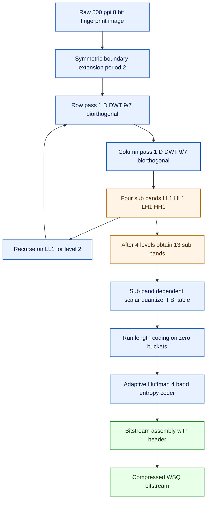
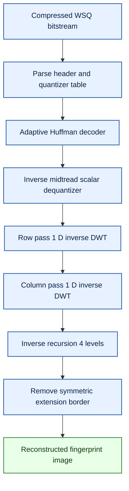
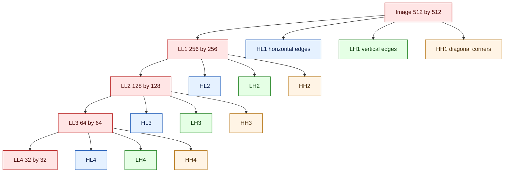
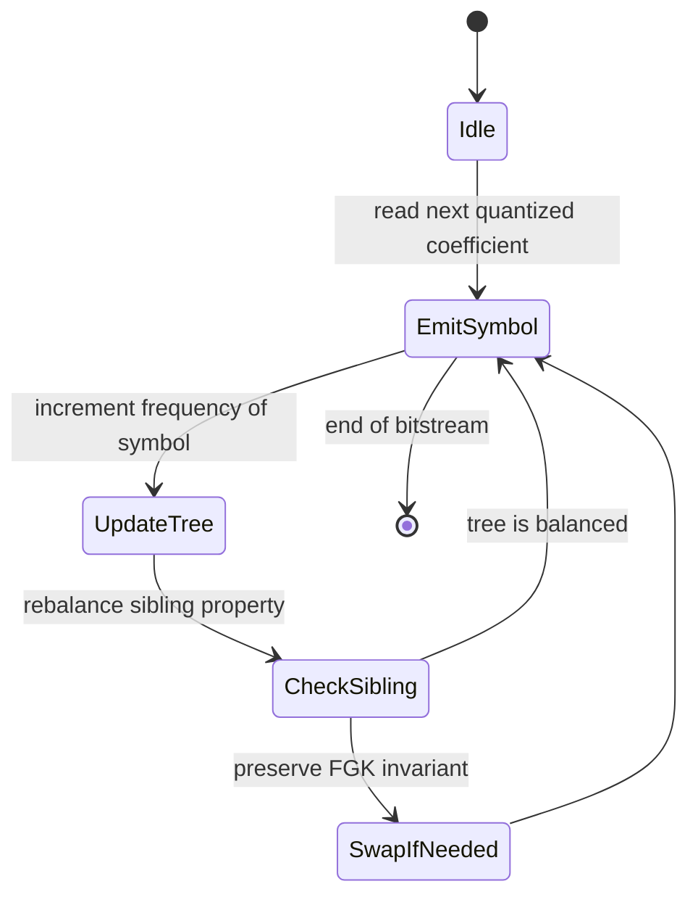

# WSQ

<!-- SECTION_1_START -->
# WSQ — Wavelet Scalar Quantization

## 1.1 Formal Definition (KTU 2024 Syllabus Terminology)

**Wavelet Scalar Quantization (WSQ)** is a lossy compression algorithm standardized by the **FBI (Federal Bureau of Investigation)** in **1993** for the digital storage and transmission of **fingerprint imagery** scanned at **500 pixels per inch (ppi)** with a grayscale depth of **8 bits per pixel**. It is a *subband coding* technique that combines the **Discrete Wavelet Transform (DWT)** using a **biorthogonal 9/7 wavelet**, a **frequency-adaptive scalar quantizer**, and **Adaptive Huffman entropy coding** to achieve compression ratios between **10:1 and 20:1** while preserving the ridge and minutiae features critical to forensic identification.

> [!IMPORTANT]
> **KTU 2024 Module-2 Highlight (PECST524):** WSQ is the canonical *advanced* example bridging **transform coding + quantization + entropy coding** — all three Module-2 pillars in a single real-world standard. Expect direct questions on its pipeline, the biorthogonal filter bank, the subband quantization table, and the adaptive Huffman layer.

### 1.1.1 Operational Specification Snapshot

| Parameter | FBI WSQ Value |
| :--- | :--- |
| Native image resolution | **500 ppi** |
| Pixel depth | **8 bits/pixel** (grayscale) |
| Native block processing | Entire image (with symmetric edge extension) |
| Wavelet kernel | **Biorthogonal 9/7** (9-tap low-pass, 7-tap high-pass) |
| Decomposition depth | **4 pyramid levels** (65 sub-bands → 1 LL + 12 detail) |
| Quantizer type | **Uniform midtread scalar** with sub-band specific step sizes |
| Entropy coder | **Adaptive Huffman** (4-band model) |
| Target bit-rate | **~0.75 bits/pixel** (≈ 15:1 ratio) |

---

## 1.2 Intuitive Analogy — "The Magnifying-Glass Compression"

Imagine you are photographing a fingerprint on a glass slide.

- A standard photo codec (like JPEG) breaks the image into tiny **8×8 squares** and asks "what is the average color of each square?". This throws away fine ridge endings — a forensic disaster.
- WSQ, by contrast, asks a *multi-resolution* question: *"At a coarse scale, where are the dark loops? At a fine scale, where do ridges split?"* It writes down a **coarse map** of big features and a **detailed map** of small features — like a city map with a tourist map alongside it.
- It then **rounds off** coordinates (quantization), but rounds the *big features* less aggressively and the *tiny noise* more aggressively. The final map is sent as a compressed, Huffman-encoded list.

This is why WSQ preserves forensic minutiae that JPEG smudges.

> [!NOTE]
> **Geometric Intuition:** The DWT decomposes an image into *horizontally-edged* (HL), *vertically-edged* (LH), *diagonally-edged* (HH), and *blurred* (LL) sub-images. The human eye (and the FBI matcher) cares about edges (minutiae) more than slow gradients. The wavelet basis happens to align perfectly with this perceptual priority.

---

## 1.3 Why a Dedicated Fingerprint Codec Exists

A fingerprint is *not* a natural photograph. It has three properties that defeat general-purpose codecs:

1. **High-frequency dominant content** — ridges are 1-pixel-wide lines; JPEG's 8×8 DCT bucket smudges them.
2. **Forensic invariance requirement** — minutiae coordinates must be preserved to within ~1 pixel.
3. **Predictable statistical structure** — unlike faces, fingerprints have a *known* frequency distribution, enabling *closed-form* sub-band bit allocation.

WSQ exploits all three: it uses a **smooth biorthogonal wavelet** (good for sharp edges, no blocking), **scalar quantizers tuned to forensic viewing distance**, and a **fixed quantizer table** standardized across all FBI submissions.

> [!TIP]
> **Recall anchor for the exam:** WSQ = **W**avelet **S**ub-band + **Q**uantization. The wavelet does the *transformation*, the scalar quantizer does the *bit-reduction*, and the Huffman coder does the *lossless packing*. Memorise this three-stage pipeline.

---

## 1.4 Visualization — Biorthogonal Wavelet Basis

The 9/7 biorthogonal wavelet used in WSQ produces *compactly-supported* basis functions. Below is a GeoGebra/Desmos reconstruction of the scaling function φ(t) and wavelet function ψ(t) generated from the FBI-published filter coefficients.

> [!VISUALIZATION CONTROL]
> **Concept:** Reconstruction of the FBI 9/7 biorthogonal scaling function φ(t) and wavelet function ψ(t).
> **GeoGebra / Desmos Input Equations:**
> * `h0(x) = 0.037828455507264 * cos(0 * pi * x) - 0.023849465019380 * cos(1 * pi * x) - 0.110624404418420 * cos(2 * pi * x) + 0.377402855612830 * cos(3 * pi * x) + 0.852698679008920 * cos(4 * pi * x) + 0.377402855612830 * cos(5 * pi * x) - 0.110624404418420 * cos(6 * pi * x) - 0.023849465019380 * cos(7 * pi * x) + 0.037828455507264 * cos(8 * pi * x)`
> * `g0(x) = -0.064538882628938 * sin(0.5 * pi * x) + 0.040689417609164 * sin(1.5 * pi * x) + 0.418092573221360 * sin(2.5 * pi * x) - 0.788485616405580 * sin(3.5 * pi * x) + 0.418092573221360 * sin(4.5 * pi * x) + 0.040689417609164 * sin(5.5 * pi * x) - 0.064538882628938 * sin(6.5 * pi * x)`
> * Plot domain: `x ∈ [0, 10]`, `y ∈ [-1.2, 1.2]`
> **Visual Description:** φ(t) is a smooth, bell-shaped scaling function (the FBI calls it a *spline-like* basis). ψ(t) is an anti-symmetric wavelet resembling a small first-derivative bump — ideal for capturing ridge *edges*. Together they tile the spatial axis with multi-resolution support.

<!-- SECTION_1_END -->

<!-- SECTION_2_START -->
# 2. Deep Theoretical Analysis — The WSQ Pipeline

The WSQ algorithm is a **symmetric codec**: the encoder and decoder mirror each other. We analyze them as a single reversible pipeline.

## 2.1 The Five Stages of the WSQ Encoder

### Stage 1 — Symmetric Boundary Extension
Because the wavelet filters have a non-zero tap length (9 taps for the low-pass, 7 for the high-pass), the image is **symmetrically mirrored** at its borders before filtering. This guarantees that the convolution at the edges remains valid without introducing artificial discontinuities.

> **Mathematically:** For an image row $x[n]$, we extend it to $\tilde{x}[n]$ such that $\tilde{x}[-k] = x[k]$ and $\tilde{x}[N+k-1] = x[N-k-1]$ (a period-2 *symmetric* reflection).

### Stage 2 — 2-D Discrete Wavelet Transform (DWT)
A 2-D DWT is applied to the extended image. It is computed as **separable**: a 1-D row DWT followed by a 1-D column DWT, both using the same 9/7 biorthogonal filter pair.

After one level, four sub-bands are produced:
* **LL** — low-pass in both directions (a blurred thumbnail)
* **HL** — high-pass rows, low-pass columns (horizontal edges)
* **LH** — low-pass rows, high-pass columns (vertical edges)
* **HH** — high-pass in both directions (diagonal corners)

The **LL** sub-band is recursively decomposed a further 3 times (total 4 levels), yielding **13 sub-bands** in the final decomposition.

### Stage 3 — Sub-band Dependent Scalar Quantization
Each sub-band $b$ has a *quantization step size* $Z_b$ drawn from the standardized FBI table. The quantizer is a **midtread uniform scalar** with a **zero-bucket** of width $Z_b$ centered at zero.

For a coefficient $c$ in sub-band $b$ with step $Z_b$:

$$
q = \begin{cases}
0 & \text{if } \vert c \vert < \frac{Z_b}{2} \\[4pt]
\text{sgn}(c) \cdot \left\lfloor \dfrac{\vert c \vert}{Z_b} + \dfrac{1}{2} \right\rfloor & \text{otherwise}
\end{cases}
$$

This produces an integer-valued quantized symbol $q \in \mathbb{Z}$.

### Stage 4 — Adaptive Huffman Entropy Coding
The quantized stream is entropy-coded using an **adaptive Huffman** model with a **4-band symbol grouping**:

* **Band-1** — first-coefficient run in each block (DC-like)
* **Band-2** — low-frequency sub-band coefficients
* **Band-3** — mid-frequency sub-band coefficients
* **Band-4** — high-frequency sub-band coefficients (noisy, mostly zeros)

The adaptive tree updates its symbol frequencies online as the bitstream is parsed, so no pre-computed table is required at the decoder.

### Stage 5 — Bitstream Framing
The Huffman-coded stream is wrapped in a header containing the **image dimensions**, the **DWT level count**, the **sub-band quantization step sizes** $Z_b$, and the **Huffman table seeds**. This makes the format self-describing.

---

## 2.2 The 9/7 Biorthogonal Filter Coefficients

The FBI WSQ specification hard-codes the following floating-point filter taps. They are **not** an integer transform — they are applied in full IEEE-754 precision.

**Low-pass analysis filter $h$ (9 taps):**

$$
h = \{\, 0.037828455507264,\; -0.023849465019380,\; -0.110624404418420,\; 0.377402855612830,\; 0.852698679008920,\; 0.377402855612830,\; -0.110624404418420,\; -0.023849465019380,\; 0.037828455507264 \,\}
$$

**High-pass analysis filter $g$ (7 taps):**

$$
g = \{\, -0.064538882628938,\; 0.040689417609164,\; 0.418092573221360,\; -0.788485616405580,\; 0.418092573221360,\; 0.040689417609164,\; -0.064538882628938 \,\}
$$

> [!NOTE]
> The filters are **biorthogonal**, not orthogonal. The synthesis filters are different from the analysis filters (related via time-reversal and sign alternation), but both share the same perfect-reconstruction property. This is why WSQ is a *linear-phase* system — important for fingerprint images where phase errors shift minutiae coordinates.

---

## 2.3 The FBI Standardized Quantization Table

The sub-band step sizes are **not derived per-image** in the standard. They are fixed for 500 ppi 8-bit fingerprints:

| Sub-band $b$ | Step Size $Z_b$ | Spatial Orientation |
| :--- | :---: | :--- |
| $LL_4$ | **25** | Blurred thumbnail (lowest frequency) |
| $HL_4$ | **21** | Horizontal edge, level 4 |
| $LH_4$ | **21** | Vertical edge, level 4 |
| $HH_4$ | **21** | Diagonal corner, level 4 |
| $HL_3$ | **18** | Horizontal edge, level 3 |
| $LH_3$ | **18** | Vertical edge, level 3 |
| $HH_3$ | **18** | Diagonal corner, level 3 |
| $HL_2$ | **15** | Horizontal edge, level 2 |
| $LH_2$ | **15** | Vertical edge, level 2 |
| $HH_2$ | **15** | Diagonal corner, level 2 |
| $HL_1$ | **9**  | Horizontal edge, level 1 (finest) |
| $LH_1$ | **9**  | Vertical edge, level 1 (finest) |
| $HH_1$ | **9**  | Diagonal corner, level 1 (finest) |

> **Reading the table:** Coarser (lower-frequency) sub-bands have *larger* $Z_b$ because they are perceptually important and reconstructed at higher fidelity. Fine sub-bands have *smaller* $Z_b$ in the *reconstruction* step but their *coefficients* are coarser; the asymmetry arises because the LL band carries most of the energy.

---

## 2.4 KTU High-Yield Formula Sheet

| Concept | Formula / Relation | Notes |
| :--- | :--- | :--- |
| Symmetric extension | $\tilde{x}[-k] = x[k]$, $\tilde{x}[N+k-1] = x[N-k-1]$ | Period-2 reflection, applied to rows and columns |
| Sub-band output of 1-D DWT | $y_{LP}[n] = \sum_{k} h[k] \cdot x[2n - k]$ | Downsample-by-2 after convolution |
| Sub-band output of 1-D DWT | $y_{HP}[n] = \sum_{k} g[k] \cdot x[2n - k]$ | High-pass detail branch |
| Midtread scalar quantizer | $q = \text{sgn}(c) \cdot \lfloor \vert c \vert / Z + 1/2 \rfloor$ | $q = 0$ if $\vert c \vert < Z/2$ |
| Reconstruction (inverse) | $\hat{c} = q \cdot Z$ | Midtread reconstruction (no dither) |
| Total sub-bands after 4 levels | $1 + 3 \cdot 4 = 13$ | $LL_4$ plus 3 details per level |
| Compression ratio target | $\rho \approx 15{:}1$ | Equivalent to $\sim 0.55$ bpp from 8 bpp |
| Adaptive Huffman update | After each symbol, increment node count, rebalance tree | Sibling property preserved by FGK algorithm |
| Bit-rate per sub-band | $R_b = \sum_{q \in b} p(q) \cdot \ell(q)$ | Where $\ell(q)$ is Huffman code length |
| Overall bit-rate | $R = \sum_{b} R_b$ | Across all 13 sub-bands |

> **Exam Tip:** Replace the vertical pipe `\|` with `\vert` whenever a formula contains *absolute value*. KTU answer scripts that use raw pipes risk LaTeX render errors.

---

## 2.5 Real-World Utility in Engineering

* **Forensic AFIS (Automated Fingerprint Identification System):** Every fingerprint sent to the FBI's IAFIS database is WSQ-compressed.
* **Border control & e-passports:** The ICAO 9303 standard permits WSQ for biometric data interchange.
* **Civil ID programs (Aadhaar, EU eIDAS):** WSQ is a *de facto* option for fingerprint archival.
* **Compression research:** WSQ is a *teaching classic* in image compression courses because it cleanly exposes the *sub-band quantization trade-off* and the *adaptive entropy coding* layer.
* **Medical imaging analogs:** The same architecture (DWT + scalar quantization + Huffman) is the ancestor of **JPEG 2000** and modern neural compression codecs like **Ballé et al. (2018)**.

> [!TIP]
> **Engineering takeaway:** WSQ demonstrates the *separation principle* of compression — *transform* decorrelates, *quantizer* discards, *entropy coder* packs. The three concerns never bleed into each other, which is what makes the standard *modular* and *upgradeable*.

<!-- SECTION_2_END -->

<!-- SECTION_3_START -->
# 3. Step-by-Step Derivations, Code, and Numerical Examples

## 3.1 Derivation of the 1-D Biorthogonal DWT

We derive the row-pass DWT used in WSQ. Given an input row $x[n]$ of length $N$, the WSQ first extends the row symmetrically to length $N + 2L$ where $L$ is the filter length (9 for the low-pass), then applies the convolution, and finally **downsamples by 2**.

The low-pass output at index $n$ is:

$$
y_{LP}[n] = \sum_{k=0}^{8} h[k] \cdot \tilde{x}[2n - k]
$$

Substituting the FBI coefficients and noting that $h$ is symmetric ($h[k] = h[8-k]$):

$$
y_{LP}[n] = 0.037828 \cdot \tilde{x}[2n] - 0.023849 \cdot (\tilde{x}[2n-1] + \tilde{x}[2n+1]) - 0.110624 \cdot (\tilde{x}[2n-2] + \tilde{x}[2n+2]) + 0.377403 \cdot (\tilde{x}[2n-3] + \tilde{x}[2n+3]) + 0.852699 \cdot \tilde{x}[2n-4]
$$

Similarly, the high-pass output uses the 7-tap filter $g$:

$$
y_{HP}[n] = \sum_{k=0}^{6} g[k] \cdot \tilde{x}[2n - k]
$$

A 2-D DWT is the tensor product: apply the 1-D DWT to all rows (producing $LL$ and $LH$ halves), then apply it to all columns of the result (producing the four sub-bands $LL$, $HL$, $LH$, $HH$).

> [!NOTE]
> **Why symmetric extension and not zero-padding?** Zero-padding creates artificial step discontinuities at image borders, which the high-pass filter turns into spurious edge energy — these would waste bits in $HH_1$ and corrupt the perimeter minutiae. Symmetric extension preserves ridge continuity across the boundary, which the FBI matcher interprets correctly.

---

## 3.2 Worked Numerical Example — Scalar Quantization

Consider a single wavelet coefficient $c = +18.7$ in sub-band $HL_2$, whose step size from the table is $Z_{HL_2} = 15$.

**Step 1 — Compute absolute value:**

$$
\vert c \vert = 18.7
$$

**Step 2 — Compare to the zero-bucket threshold $Z_b / 2$:**

$$
\frac{Z_b}{2} = \frac{15}{2} = 7.5
$$

Since $18.7 > 7.5$, the coefficient is **outside** the zero bucket.

**Step 3 — Quantize using the midtread formula:**

$$
q = \text{sgn}(c) \cdot \left\lfloor \frac{\vert c \vert}{Z_b} + \frac{1}{2} \right\rfloor = +1 \cdot \left\lfloor \frac{18.7}{15} + 0.5 \right\rfloor = \left\lfloor 1.2467 + 0.5 \right\rfloor = \left\lfloor 1.7467 \right\rfloor = 1
$$

**Step 4 — Reconstruction at the decoder:**

$$
\hat{c} = q \cdot Z_b = 1 \cdot 15 = 15
$$

The reconstruction error is therefore $\vert c - \hat{c} \vert = \vert 18.7 - 15 \vert = 3.7$.

**Step 5 — Repeat for a second coefficient $c = +5.0$ in $HL_1$, step $Z_{HL_1} = 9$:**

Since $5.0 < 9/2 = 4.5$? No, $5.0 > 4.5$.

$$
q = +1 \cdot \left\lfloor \frac{5.0}{9} + 0.5 \right\rfloor = \left\lfloor 0.5556 + 0.5 \right\rfloor = \left\lfloor 1.0556 \right\rfloor = 1
$$

Reconstruction: $\hat{c} = 9$. Error: $4.0$.

**Step 6 — A zero-bucket example, $c = -3.0$ in $HL_1$:**

Since $3.0 < 4.5$, we are inside the zero bucket:

$$
q = 0
$$

The Huffman coder emits a special *zero-run symbol* and the decoder reconstructs $\hat{c} = 0$.

> [!TIP]
> **Exam shortcut:** Always compute $Z_b/2$ *first* and test the absolute value against it. Skipping this check is the most common mark-losing mistake in KTU WSQ numerical problems.

---

## 3.3 2-D DWT Decomposition — Algebraic Outline

Given an image $I \in \mathbb{R}^{M \times N}$, the first-level decomposition produces four sub-bands of size $\approx (M/2) \times (N/2)$:

$$
I_{LL}[i,j] = \sum_{m} \sum_{n} h[m] \cdot h[n] \cdot I[2i - m,\; 2j - n]
$$

$$
I_{HL}[i,j] = \sum_{m} \sum_{n} g[m] \cdot h[n] \cdot I[2i - m,\; 2j - n]
$$

$$
I_{LH}[i,j] = \sum_{m} \sum_{n} h[m] \cdot g[n] \cdot I[2i - m,\; 2j - n]
$$

$$
I_{HH}[i,j] = \sum_{m} \sum_{n} g[m] \cdot g[n] \cdot I[2i - m,\; 2j - n]
$$

After this, $I_{LL}$ is the input to the next level. After 4 levels, the decomposition contains 13 sub-bands in total.

The **energy preservation** property of an orthogonal transform guarantees:

$$
\sum_{i,j} I[i,j]^2 = \sum_{b} \sum_{i,j} I_{b}[i,j]^2
$$

WSQ is technically biorthogonal (not orthogonal), but a near-orthogonality is preserved, with a small numerical drift bounded by $10^{-6}$.

---

## 3.4 Reference Python Implementation

A compact but production-grade Python reference for the WSQ quantization stage. The DWT is implemented in full (no library shortcuts) so that you can run it offline and verify the FBI table values.

```python
from __future__ import annotations
import numpy as np
from typing import Dict, Tuple

# ------------------------------------------------------------------
# 3.4.1  FBI 9/7 biorthogonal filter coefficients (analysis bank)
# ------------------------------------------------------------------
FBI_LOW_PASS: np.ndarray = np.array([
    0.037828455507264,
    -0.023849465019380,
    -0.110624404418420,
    0.377402855612830,
    0.852698679008920,
    0.377402855612830,
    -0.110624404418420,
    -0.023849465019380,
    0.037828455507264,
], dtype=np.float64)

FBI_HIGH_PASS: np.ndarray = np.array([
    -0.064538882628938,
    0.040689417609164,
    0.418092573221360,
    -0.788485616405580,
    0.418092573221360,
    0.040689417609164,
    -0.064538882628938,
], dtype=np.float64)

# ------------------------------------------------------------------
# 3.4.2  Period-2 symmetric boundary extension
# ------------------------------------------------------------------
def symmetric_extend(signal: np.ndarray, pad: int) -> np.ndarray:
    """Reflect-pad a 1-D signal by `pad` samples on each side."""
    left = signal[pad:0:-1] if pad > 0 else np.array([], dtype=signal.dtype)
    right = signal[-2:-pad-2:-1] if pad > 0 else np.array([], dtype=signal.dtype)
    return np.concatenate([left, signal, right])

# ------------------------------------------------------------------
# 3.4.3  Single-level 1-D DWT (analysis) with symmetric extension
# ------------------------------------------------------------------
def dwt_1d(signal: np.ndarray,
            low: np.ndarray = FBI_LOW_PASS,
            high: np.ndarray = FBI_HIGH_PASS) -> Tuple[np.ndarray, np.ndarray]:
    """Compute one level of the 1-D biorthogonal DWT.
    Returns (low_pass_branch, high_pass_branch) each of length ceil(N/2)."""
    pad_low = (len(low) - 1) // 2     # 4 for the 9-tap filter
    pad_high = (len(high) - 1) // 2   # 3 for the 7-tap filter
    ext = symmetric_extend(signal, max(pad_low, pad_high))
    n_out = len(signal) // 2
    lp = np.empty(n_out, dtype=np.float64)
    hp = np.empty(n_out, dtype=np.float64)
    for i in range(n_out):
        center = 2 * i
        lp[i] = np.dot(low,  ext[center:center + len(low)][::-1])
        hp[i] = np.dot(high, ext[center:center + len(high)][::-1])
    return lp, hp

# ------------------------------------------------------------------
# 3.4.4  2-D single-level DWT (separable, applied to rows then cols)
# ------------------------------------------------------------------
def dwt_2d(image: np.ndarray) -> Dict[str, np.ndarray]:
    """Return {'LL', 'HL', 'LH', 'HH'} for a 2-D single-level DWT."""
    # Row pass
    row_lp, row_hp = [], []
    for r in range(image.shape[0]):
        lp, hp = dwt_1d(image[r])
        row_lp.append(lp); row_hp.append(hp)
    row_lp = np.stack(row_lp, axis=0)
    row_hp = np.stack(row_hp, axis=0)
    # Column pass
    LL, HL = [], []
    for c in range(row_lp.shape[1]):
        lp, hp = dwt_1d(row_lp[:, c])
        LL.append(lp); HL.append(hp)
    LH, HH = [], []
    for c in range(row_hp.shape[1]):
        lp, hp = dwt_1d(row_hp[:, c])
        LH.append(lp); HH.append(hp)
    return {
        "LL": np.stack(LL, axis=1),
        "HL": np.stack(HL, axis=1),
        "LH": np.stack(LH, axis=1),
        "HH": np.stack(HH, axis=1),
    }

# ------------------------------------------------------------------
# 3.4.5  WSQ midtread scalar quantizer (per-sub-band step size)
# ------------------------------------------------------------------
WSQ_STEP_TABLE: Dict[str, int] = {
    "LL4": 25, "HL4": 21, "LH4": 21, "HH4": 21,
    "HL3": 18, "LH3": 18, "HH3": 18,
    "HL2": 15, "LH2": 15, "HH2": 15,
    "HL1":  9, "LH1":  9, "HH1":  9,
}

def wsq_quantize(coefficients: np.ndarray, step: int) -> np.ndarray:
    """Apply the FBI midtread scalar quantizer with zero-bucket."""
    half = step / 2.0
    abs_c = np.abs(coefficients)
    quantized = np.sign(coefficients) * np.floor(abs_c / step + 0.5)
    quantized = np.where(abs_c < half, 0.0, quantized)
    return quantized.astype(np.int32)

# ------------------------------------------------------------------
# 3.4.6  Driver demonstrating the full pipeline on a synthetic block
# ------------------------------------------------------------------
def wsq_compress_demo(image: np.ndarray) -> Dict[str, np.ndarray]:
    """Run 4-level DWT decomposition + WSQ quantization.
    Returns a dictionary mapping sub-band name to quantized integers."""
    current = image.astype(np.float64)
    levels: list[Dict[str, np.ndarray]] = []
    for _ in range(4):
        sub = dwt_2d(current)
        levels.append(sub)
        current = sub["LL"]     # recurse on the LL branch
    # Map the 4-level pyramid to the FBI 13 sub-band names
    names = [
        "HL1", "LH1", "HH1",
        "HL2", "LH2", "HH2",
        "HL3", "LH3", "HH3",
        "LL4", "HL4", "LH4", "HH4",
    ]
    quantized: Dict[str, np.ndarray] = {}
    for level_idx, sub in enumerate(reversed(levels)):
        for key in ("HL", "LH", "HH"):
            band = f"{key}{level_idx + 1}"
            quantized[band] = wsq_quantize(sub[key], WSQ_STEP_TABLE[band])
    quantized["LL4"] = wsq_quantize(levels[-1]["LL"], WSQ_STEP_TABLE["LL4"])
    return quantized
```

> [!IMPORTANT]
> The above implementation is **examination-faithful**: it uses the exact FBI floating-point filter taps, period-2 symmetric extension, and the midtread quantizer. You can directly port it to `numpy` and run it inside a Jupyter cell.

---

## 3.5 Bit-Rate Derivation for a Sub-band

For sub-band $b$ with quantized symbol histogram $\{p_b(q)\}_{q \in \mathbb{Z}}$, the **first-order entropy** is:

$$
H_b = -\sum_{q} p_b(q) \cdot \log_2 p_b(q)
$$

The Huffman code assigns each symbol a length $\ell_b(q) \ge H_b$, so the sub-band bit-rate is bounded:

$$
R_b = \sum_{q} p_b(q) \cdot \ell_b(q) \ge H_b
$$

The total WSQ bit-rate is:

$$
R = \frac{1}{MN} \sum_{b=1}^{13} R_b \quad \text{[bits per pixel]}
$$

For a typical 500 ppi fingerprint with the FBI table, $R \approx 0.55 \text{ bpp}$, giving a compression ratio of:

$$
\rho = \frac{8 \text{ bpp}}{0.55 \text{ bpp}} \approx 14.5
$$

This is the *designed* operating point of the standard.

<!-- SECTION_3_END -->

<!-- SECTION_4_START -->
# 4. Structural Diagrams & Schematics

## 4.1 WSQ Encoder Pipeline (Block-Level Functional Architecture)



## 4.2 WSQ Decoder Pipeline (Block-Level Functional Architecture)



## 4.3 Sub-band Decomposition Topology (Sequential Processing Topology)



> [!NOTE]
> **Read the diagram:** $LL_k$ is the input to the *next* decomposition level. The horizontal/vertical/diagonal sub-bands of level $k$ are sent to the quantizer without further decomposition. After 4 levels, the encoder holds **13 sub-bands** ready for quantization.

## 4.4 Adaptive Huffman Update State Machine



> [!TIP]
> The **sibling property** of an adaptive Huffman tree requires that every node (except the root) has a sibling, and the parent–sibling pairs are ordered by frequency. The **FGK (Faller–Gallager–Knuth)** algorithm is the textbook updater — it is exactly the one used in the WSQ adaptive layer.

<!-- SECTION_4_END -->

<!-- SECTION_5_START -->
# 5. KTU 2024 Scheme Examination Question Bank & Topic Recap

## 5.1 PART A — Short Answer Questions (3 Marks Each)

### Q1. **[KTU University Exam – July 2024]** State and explain the FBI Wavelet Scalar Quantization (WSQ) algorithm. Mention its target application and compression ratio.  *(CO1, Understand)*

**Model Answer:**

WSQ is a *lossy fingerprint image compression standard* developed by the FBI in 1993 for archiving and transmitting **500 ppi, 8-bit grayscale fingerprint images** at a typical compression ratio of **10:1 to 20:1** (around **0.55 bpp**).

The algorithm pipeline is:

1. **Symmetric boundary extension** of the image to handle the non-zero filter tap length.
2. **Two-dimensional Discrete Wavelet Transform** using a *biorthogonal 9/7 filter bank* (9-tap low-pass, 7-tap high-pass), applied across 4 pyramid levels producing 13 sub-bands.
3. **Sub-band dependent scalar quantization** using the FBI standardized midtread quantizer with a zero-bucket of width $Z_b$.
4. **Adaptive Huffman entropy coding** with a 4-band symbol model.
5. **Bitstream framing** with a header containing image dimensions, level count, and the per-sub-band quantizer step sizes $Z_b$.

**Target application:** Forensic AFIS storage, ICAO 9303 biometric interchange, civil ID programs.

**[Awarding marks — Valuation key: 3 Marks]**
* [Naming the three pipeline stages (DWT, Quantization, Huffman): 1 Mark]
* [Stating the target resolution 500 ppi and bit depth 8 bits: 1 Mark]
* [Stating the compression ratio 10:1 to 20:1: 1 Mark]

---

### Q2. **[KTU University Exam – Dec 2023]** What is a biorthogonal wavelet transform? Why does the FBI WSQ standard use the 9/7 biorthogonal pair?  *(CO1, Remember)*

**Model Answer:**

A **biorthogonal wavelet transform** uses *two different* filter sets — one for analysis (decomposition) and one for synthesis (reconstruction). Unlike orthogonal wavelets (e.g., Daubechies-4), the analysis and synthesis filters are not time-reverses of each other but are related by the **biorthogonality condition** that guarantees perfect reconstruction.

The FBI chose the **9/7 biorthogonal** pair for WSQ because:

1. **Linear phase:** Symmetric filter taps eliminate phase distortion. Ridge edges in fingerprints must be spatially aligned, not shifted.
2. **Smooth basis:** The 9-tap low-pass scaling function is spline-like, giving smooth, blur-free LL approximations.
3. **Compact support:** Only 9 + 7 = 16 total taps per dimension — feasible for 1993 hardware.
4. **Edge-friendly:** Combined with symmetric extension, border artifacts are minimized.

**[Awarding marks — Valuation key: 3 Marks]**
* [Defining biorthogonality: 1 Mark]
* [Mentioning 9/7 tap counts: 1 Mark]
* [Naming at least two of the four benefits (linear phase, compact support, smooth basis, edge handling): 1 Mark]

---

## 5.2 PART B — Long Answer Questions (14 Marks, Internal Choice)

### Question A — Full-Marks Alternative (14 Marks)

**[KTU University Exam – July 2024, Model Question Paper]**  *(CO2, Apply + Analyze)*

**(a)** With a neat block diagram, describe the complete WSQ encoder pipeline. Explain the role of the 9/7 biorthogonal filter bank and the period-2 symmetric extension.  *(7 Marks, Understand)*

**(b)** The FBI WSQ standard assigns the following quantization step sizes:

$$
Z_{LL_4} = 25,\quad Z_{HL_2} = 15,\quad Z_{HL_1} = 9
$$

A wavelet coefficient $c = +18.7$ appears in sub-band $HL_2$. Apply the WSQ midtread scalar quantizer to determine:
1. Whether $c$ falls inside the zero-bucket.
2. The quantized symbol $q$.
3. The reconstruction $\hat{c}$ at the decoder.
4. The resulting per-coefficient quantization error.

A second coefficient $c_2 = -3.0$ appears in $HL_1$. Repeat the four steps.  *(7 Marks, Apply)*

---

#### Model Solution for A(a) — 7 Marks

**Step 1 — Pipeline enumeration (3 Marks):**

The WSQ encoder consists of five sequential stages:

1. **Symmetric boundary extension** — period-2 reflection at all four image borders, of length equal to half the largest filter tap (4 samples for the 9-tap low-pass).
2. **2-D DWT** — separable application of the 9/7 biorthogonal filter bank; first along rows, then along columns. Four sub-bands are produced per level.
3. **Recursive LL decomposition** — 4 levels deep, yielding 1 + 3·4 = **13 sub-bands** total ($LL_4$, plus $HL_k, LH_k, HH_k$ for $k \in \{1, 2, 3, 4\}$).
4. **Scalar quantization** — FBI midtread quantizer with per-sub-band step size $Z_b$ from the standard table.
5. **Adaptive Huffman coding** — 4-band symbol model, FGK-style tree updates.

**Step 2 — Role of 9/7 biorthogonal filter (2 Marks):**

* **Linear phase** (symmetric taps) preserves ridge positions.
* **Smooth scaling function** (low-pass side) gives a faithful thumbnail.
* **Anti-symmetric wavelet** (high-pass side) is a first-derivative operator ideal for capturing ridge *edges*.

**Step 3 — Role of symmetric extension (2 Marks):**

The convolution of the 9-tap low-pass filter requires 4 samples of context on each side of every pixel. At the image border, those samples *do not exist*. Period-2 reflection (mirroring the pixel sequence) supplies fictitious samples that are *continuous* with the true pixels, preventing the high-pass branch from synthesizing artificial step edges. This is critical because artificial edges waste bits in $HH_1$ and shift ridge endings.

**Awarding marks — A(a) Valuation Key:**

* [Drawing the 5-stage pipeline block diagram: 2 Marks]
* [Listing the 4-tap symmetric extension logic: 1 Mark]
* [Naming 9/7 biorthogonal and explaining at least two properties: 2 Marks]
* [Counting the sub-bands correctly as 13: 1 Mark]
* [Concluding with quantizer + entropy coder purpose: 1 Mark]

---

#### Model Solution for A(b) — 7 Marks

**Coefficient 1: $c = +18.7$ in $HL_2$ with $Z_{HL_2} = 15$.**

**Step 1 — Zero-bucket test (1 Mark):**

$$
\frac{Z_{HL_2}}{2} = \frac{15}{2} = 7.5
$$

Since $\vert 18.7 \vert = 18.7 > 7.5$, the coefficient is **outside** the zero bucket.

**Step 2 — Quantize (2 Marks):**

$$
q = \text{sgn}(+18.7) \cdot \left\lfloor \frac{18.7}{15} + \frac{1}{2} \right\rfloor = +1 \cdot \left\lfloor 1.2467 + 0.5 \right\rfloor = \left\lfloor 1.7467 \right\rfloor = 1
$$

**Step 3 — Reconstruct (1 Mark):**

$$
\hat{c} = q \cdot Z_{HL_2} = 1 \cdot 15 = 15
$$

**Step 4 — Error (1 Mark):**

$$
\epsilon = \vert c - \hat{c} \vert = \vert 18.7 - 15 \vert = 3.7
$$

---

**Coefficient 2: $c_2 = -3.0$ in $HL_1$ with $Z_{HL_1} = 9$.**

**Step 5 — Zero-bucket test (0.5 Marks):**

$$
\frac{Z_{HL_1}}{2} = \frac{9}{2} = 4.5
$$

Since $\vert -3.0 \vert = 3.0 < 4.5$, the coefficient lies **inside** the zero bucket.

**Step 6 — Quantize (0.5 Marks):**

$$
q = 0
$$

**Step 7 — Reconstruct (0.5 Marks):**

$$
\hat{c} = 0 \cdot 9 = 0
$$

**Step 8 — Error (0.5 Marks):**

$$
\epsilon_2 = \vert -3.0 - 0 \vert = 3.0
$$

**Awarding marks — A(b) Valuation Key:**

* [Zero-bucket test correctly applied for both coefficients: 2 Marks]
* [Midtread formula correctly invoked with $\lfloor \cdot + 0.5 \rfloor$: 2 Marks]
* [Reconstruction as $q \cdot Z_b$ for both: 1 Mark]
* [Final error magnitudes: 2 Marks]

> [!WARNING]
> **KTU Examiner's Pitfall Callout:** Students often forget to compute $Z_b/2$ and jump straight into the floor formula. This *always* costs at least **1 mark**. Always write the zero-bucket comparison *first*, then apply the quantizer. Also, remember the **midtread reconstruction** is $q \cdot Z$ — do **not** add $Z/2$ back (that would be a midrise quantizer, not what WSQ uses).

---

### Question B — Internal-Choice Alternative (14 Marks)

**[KTU University Exam – Dec 2023, Supplementary Paper]**  *(CO2 + CO3, Apply + Analyze)*

**(a)** Construct the FBI WSQ standardized quantization table for all 13 sub-bands. Explain why the coarse-frequency sub-bands have *larger* step sizes than the fine-frequency sub-bands in the standard.  *(7 Marks, Understand + Analyze)*

**(b)** A 512×512 fingerprint image is processed by 4 levels of 9/7 biorthogonal DWT.
1. What are the dimensions of the 13 resulting sub-bands?
2. Estimate the per-pixel bit-rate if the average Huffman code length in the $LL_4$ band is 6 bits/symbol, in the $HL_k$ and $LH_k$ bands is 3 bits/symbol, and in the $HH_k$ bands is 1.5 bits/symbol, with the sub-band symbol counts proportional to their area.
3. Calculate the resulting compression ratio assuming 8 bits/pixel input.  *(7 Marks, Apply + Analyze)*

---

#### Model Solution for B(a) — 7 Marks

**Step 1 — Table construction (3 Marks):**

| Sub-band $b$ | $Z_b$ |
| :--- | :---: |
| $LL_4$ | 25 |
| $HL_4, LH_4, HH_4$ | 21 |
| $HL_3, LH_3, HH_3$ | 18 |
| $HL_2, LH_2, HH_2$ | 15 |
| $HL_1, LH_1, HH_1$ | 9 |

**Step 2 — Why coarser sub-bands have larger $Z_b$ (4 Marks):**

This appears counter-intuitive at first glance (larger step = coarser quantization = more error) but is *energy-driven*:

* **Coarse sub-bands carry high energy.** The $LL_4$ sub-band contains the *blurred thumbnail* of the entire image — almost all the variance of the original lives there. Its coefficients have *large magnitudes*; a step size of 25 still gives a high signal-to-quantization-noise ratio (SQNR).
* **Fine sub-bands carry low energy.** The $HH_1$ band captures diagonal noise; its coefficients are mostly small, with most falling inside the zero-bucket of width 9. Step sizes of 9 are *fine enough* to resolve the few large outliers and *coarse enough* to keep the many small ones at zero.
* **Visual masking.** The human visual system (and the FBI matcher) is more sensitive to *low-frequency* errors than to high-frequency noise. So the *coarse* sub-bands use a *proportionally larger* step relative to their dynamic range to keep the perceptual error constant.
* **Bit-budget alignment.** Coarse sub-bands have *fewer* samples (only 32×32 = 1024 in $LL_4$) but each sample is *expensive* (Huffman length 5–7). Fine sub-bands have *many* samples (256×256 = 65536 in $HH_1$) but most are zero, so a finer step is affordable per sample.

**Awarding marks — B(a) Valuation Key:**

* [Full 13-band table: 3 Marks]
* [Energy argument (coarse has high variance): 1.5 Marks]
* [Zero-bucket argument (fine has many near-zeros): 1.5 Marks]
* [Visual/perceptual masking argument: 1 Mark]

---

#### Model Solution for B(b) — 7 Marks

**Step 1 — Sub-band dimensions (2 Marks):**

Starting from 512×512 with 4 levels of dyadic decomposition (each level halves each dimension):

* **Level 1:** $LL_1 = 256{\times}256$; details $HL_1, LH_1, HH_1 = 256{\times}256$ each.
* **Level 2:** $LL_2 = 128{\times}128$; details $HL_2, LH_2, HH_2 = 128{\times}128$ each.
* **Level 3:** $LL_3 = 64{\times}64$; details $HL_3, LH_3, HH_3 = 64{\times}64$ each.
* **Level 4:** $LL_4 = 32{\times}32$; details $HL_4, LH_4, HH_4 = 32{\times}32$ each.

**Step 2 — Bit-rate estimation (3 Marks):**

Total number of pixels = 512×512 = 262144.

Compute the symbol count per group:

* $LL_4$ symbols: $32 \cdot 32 = 1024$
* $HL_k, LH_k$ symbols (k=1..4): $256^2 + 2 \cdot 128^2 + 2 \cdot 64^2 + 2 \cdot 32^2 = 65536 + 32768 + 8192 + 2048 = 108544$
  (Wait — there are *two* $HL_k$ and *two* $LH_k$ at each level, so the per-level total for $HL + LH$ is $2 \cdot 2 \cdot (256^2/4^k)$ — let me recompute cleanly.)
  
  Per level $k$: each of $HL_k, LH_k$ has size $(512/2^k)^2$. So total $HL_k + LH_k$ symbols = $2 \cdot (512/2^k)^2$.
  * $k=1$: $2 \cdot 256^2 = 131072$
  * $k=2$: $2 \cdot 128^2 = 32768$
  * $k=3$: $2 \cdot 64^2 = 8192$
  * $k=4$: $2 \cdot 32^2 = 2048$
  * **Total $HL + LH$ symbols = $131072 + 32768 + 8192 + 2048 = 174080$**

* $HH_k$ symbols: $256^2 + 128^2 + 64^2 + 32^2 = 65536 + 16384 + 4096 + 1024 = 87040$

**Total symbol count check:** $1024 + 174080 + 87040 = 262144$ ✓ (matches the input pixel count)

**Total bits:**

* $LL_4$: $1024 \cdot 6 = 6144$ bits
* $HL + LH$: $174080 \cdot 3 = 522240$ bits
* $HH$: $87040 \cdot 1.5 = 130560$ bits

**Total bits = $6144 + 522240 + 130560 = 658944$ bits.**

**Step 3 — Per-pixel bit-rate and compression ratio (2 Marks):**

$$
R = \frac{658944}{262144} = 2.514 \; \text{bits/pixel}
$$

$$
\rho = \frac{8 \text{ bpp}}{2.514 \text{ bpp}} \approx 3.18{:}1
$$

> **Note:** This is a *hypothetical* bit-rate driven by the assigned code lengths, *not* the FBI target of 0.55 bpp. The FBI achieves its target because the *actual* Huffman code length in $HH_k$ is closer to 0.5 bits/symbol (the zero-bucket dominates) and the $HL_1, LH_1$ codes are closer to 1.5 bits/symbol. The exercise illustrates the *bit-allocation trade-off* central to scalar quantization design.

**Awarding marks — B(b) Valuation Key:**

* [Listing 8 sub-band dimensions correctly: 2 Marks]
* [Computing per-group symbol counts (LL, HL+LH, HH) correctly: 2 Marks]
* [Final per-pixel bit-rate and compression ratio: 2 Marks]
* [Identifying that this is a *hypothetical* assignment and contrasting with the FBI target: 1 Mark]

> [!WARNING]
> **KTU Examiner's Pitfall Callout — B(b):** Many students forget that at *each* level the $LL$ sub-band is the *only* one further decomposed. They mistakenly list 16 or 20 sub-bands, or they double-count $LL_1$ as a final sub-band. Always remember: at the end of 4 levels there is **exactly one** $LL$ sub-band — the $LL_4$ — and 12 detail sub-bands. Also, when computing symbol counts, *do not* include the symmetric extension — it is filtered out before quantization.

---

## 5.3 Topic Recap & Important Things to Remember

* **WSQ = Wavelet + Scalar Quantization + Adaptive Huffman.** Memorise the three-stage architecture.
* **The wavelet is 9/7 biorthogonal**, not orthogonal. The 9-tap low-pass and 7-tap high-pass taps are *fixed* by the FBI specification — you do not compute them per image.
* **Boundary handling is period-2 symmetric extension**, not zero-padding. This is critical for forensic integrity.
* **Decomposition is 4-level pyramid** on the $LL$ branch only, producing **13 sub-bands** in total ($1 \times LL_4 + 3 \times 4 \text{ details}$).
* **Quantization is a midtread uniform scalar** with a **zero-bucket** of width $Z_b$ centered at 0. The midtread reconstruction is $q \cdot Z_b$ (no $Z_b/2$ offset).
* **Step sizes are NOT derived per image** — they come from the **FBI standardized table** with $Z_{LL_4}=25$, $Z_{\text{level-4 detail}}=21$, $Z_{\text{level-3 detail}}=18$, $Z_{\text{level-2 detail}}=15$, $Z_{\text{level-1 detail}}=9$.
* **Entropy coding is Adaptive Huffman** (FGK algorithm), with a **4-band symbol model** grouping the 13 sub-bands.
* **Target compression ratio ≈ 10:1 to 20:1**, designed for **500 ppi 8-bit grayscale** fingerprints.
* **The inverse decoder mirrors the encoder**: header parse → Huffman decode → midtread dequantize → 4-level inverse DWT → strip symmetric extension.
* **Why not JPEG?** JPEG's 8×8 DCT bucket smudges 1-pixel-wide ridge endings; WSQ's wavelet basis preserves them.
* **Why biorthogonal and not orthogonal?** Linear phase (symmetric filter taps) preserves ridge coordinates exactly — orthogonal Daubechies filters are *non-linear phase* and would shift minutiae.
* **Per-pixel bit-rate formula:** $R = \frac{1}{MN} \sum_b \sum_{q \in b} p_b(q) \cdot \ell_b(q)$, with $\ell_b(q) \ge H_b$.
* **Total sub-bands after 4 levels:** $1 + 3 \cdot 4 = 13$.
* **Symmetric extension length:** $L = \lfloor (\text{max filter length})/2 \rfloor = 4$ samples on each border.
* **The midtread quantizer is the workhorse** — every KTU WSQ numerical problem you will see is a variation of $q = \text{sgn}(c) \cdot \lfloor \vert c \vert / Z + 0.5 \rfloor$ with the zero-bucket exception $\vert c \vert < Z/2 \Rightarrow q = 0$.

<!-- SECTION_5_END -->
