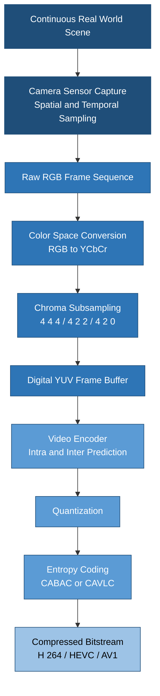
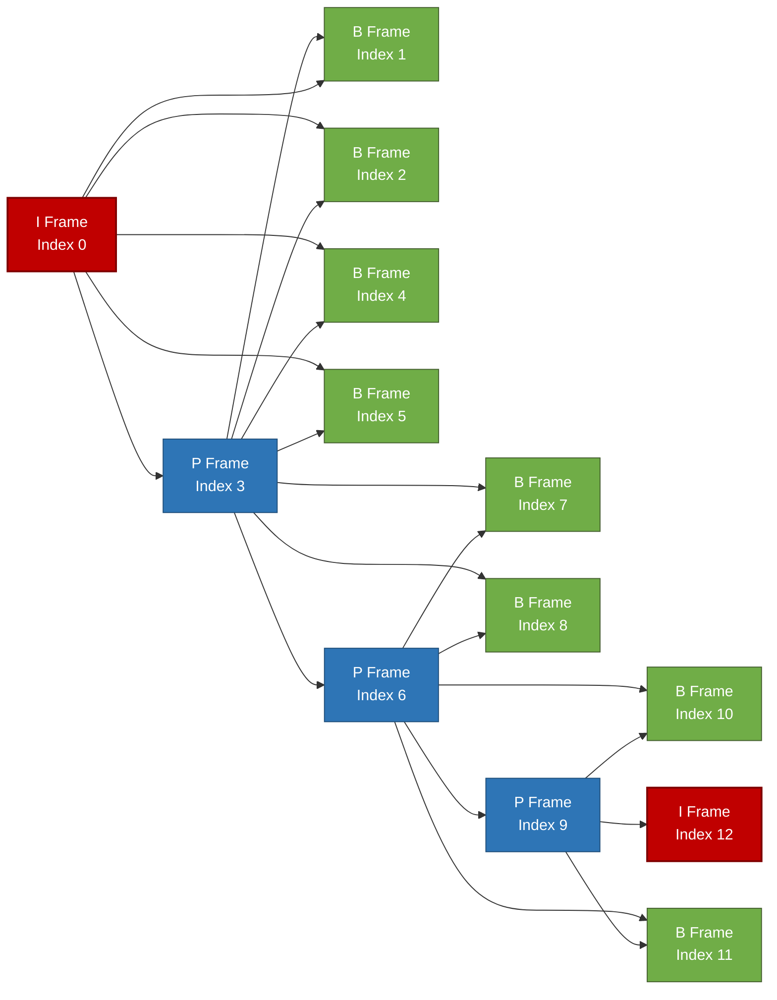
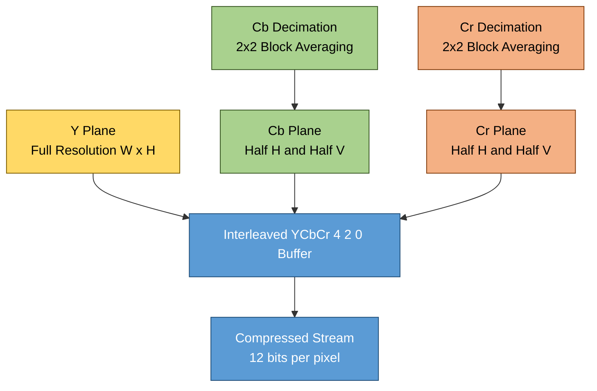

# Digital Video

<!-- SECTION_1_START -->
# Digital Video — Core Technical Definition & Intuitive Overview

## 1.1 Formal Academic Definition (KTU 2024 Syllabus Aligned)

> [!IMPORTANT]
> **Digital Video** is a discrete-time, discrete-amplitude representation of moving visual information in which a continuous analog video signal is sampled spatially (in two dimensions) and temporally (across time), quantized, and encoded as a finite sequence of still digital images called **frames**. Each frame is a 2-D array of picture elements (**pixels**), and the sequential display of these frames at a defined **frame rate** creates the perception of motion in accordance with the persistence-of-vision principle of the human visual system (HVS).

A digital video is formally characterized by the five-tuple:

$$
V \;=\; \bigl(\,W,\;H,\;F,\;T,\;S\,\bigr)
$$

where $W$ = frame **width** in pixels, $H$ = frame **height** in pixels, $F$ = **frame rate** in frames per second (fps), $T$ = total **duration** in seconds, and $S$ = **sample format** (chroma subsampling scheme such as **4:4:4**, **4:2:2**, or **4:2:0**).

## 1.2 Intuitive Analogy — The Flipbook Model

> [!NOTE]
> **Conceptual Analogy:** Imagine you are flipping through a child's *flipbook*. Each page is a slightly different still drawing. As the pages flip rapidly, your eyes "blur" the still images into smooth motion. **Digital video works on exactly the same principle** — it stores ~25 to 60 such "pages" (frames) every second, and when played back in rapid succession, the Human Visual System (HVS) perceives continuous motion.

The three pillars that govern how realistic a digital video looks are:

1. **Spatial resolution** ($W \times H$) — *How sharp is each individual page of the flipbook?* (e.g., **1920 × 1080**, **3840 × 2160**).
2. **Temporal resolution** ($F$) — *How many pages per second do we flip?* (e.g., **24 fps** for cinema, **30 fps** for NTSC, **50 fps** for PAL, **60 fps** for HDTV).
3. **Color fidelity** ($S$) — *How richly is each page colored?* (controlled by **bit-depth** and **chroma subsampling**).

## 1.3 Why Digital Video Matters in Data Compression

A single uncompressed 1080p frame at 4:4:4 (24 bits/pixel) consumes:

$$
\underbrace{1920 \times 1080 \times 24}_{\text{bits per frame}} \;=\; 49,766,400 \text{ bits} \;\approx\; \mathbf{5.94\ MB/frame}
$$

At **30 fps**, this becomes **~178 MB/s** — roughly **1 TB every 1.5 hours**. This explosive data volume is precisely why **video compression** is a non-negotiable engineering discipline, and why understanding the *anatomy* of a digital video signal is the foundation of every codec (H.264, H.265/HEVC, AV1, VVC).

## 1.4 Standard Reference Constants (KTU Board-Approved)

> [!IMPORTANT]
> | **Standard** | **Resolution** | **Frame Rate** | **Use Case** |
> |:---:|:---:|:---:|:---:|
> | CIF (Common Intermediate Format) | 352 × 288 | 30 fps | Legacy videoconferencing |
> | SD (Standard Definition) | 720 × 480 | 30 fps | DVD, Broadcast TV |
> | HD 720p | 1280 × 720 | 30/60 fps | Web streaming |
> | Full HD 1080p | 1920 × 1080 | 24/30/60 fps | Blu-ray, OTT |
> | UHD 4K | 3840 × 2160 | 50/60 fps | Modern streaming, cinema |
> | UHD 8K | 7680 × 4320 | 60/120 fps | Next-gen broadcast |

> [!VISUALIZATION CONTROL]
> **Concept:** Spatial-Temporal Sampling of a Continuous Scene
> **GeoGebra / Desmos Input Equations:**
> * `x = 1..1920` (horizontal pixel index)
> * `y = 1..1080` (vertical pixel index)
> * `t = 0, 0.0333, 0.0667, 0.1, ...` (temporal sample points at 30 fps)
> **Visual Description:** A 3-D lattice where the x-y plane represents one frame's pixel grid and the z-axis (or successive planes) represents successive sampled frames in time. The student should observe that *coarser* temporal sampling (larger Δt) leads to **motion judder**, while *coarser* spatial sampling leads to **pixelation / blocking artifacts**.

## 1.5 Types of Redundancy in Digital Video (Compression Levers)

A digital video is mathematically a 3-D signal $f(x, y, t)$ containing three exploitable redundancy classes — *this is the cornerstone of all video compression theory*:

> [!NOTE]
> * **Spatial Redundancy** — Pixels within a single frame are statistically correlated with their neighbors (smooth regions, edges). Exploited by **intra-frame coding** (e.g., DCT in JPEG, intra prediction in H.264).
> * **Temporal Redundancy** — Successive frames in a video are highly similar (a static background, a slowly moving object). Exploited by **inter-frame coding** (motion estimation & compensation).
> * **Psycho-visual Redundancy** — The HVS is insensitive to certain color and high-frequency details. Exploited by **quantization** and **chroma subsampling**.

<!-- SECTION_1_END -->

<!-- SECTION_2_START -->
# Deep Theoretical Analysis & KTU High-Yield Formula Sheet

## 2.1 Anatomy of a Digital Video Frame

Every frame of a digital video in the dominant **YCbCr** color space is decomposed into three components:

* **Luma (Y)** — The brightness information; closely matches the HVS's luminance sensitivity.
* **Blue-difference Chroma (Cb)** — How blue the pixel is *relative to luma*.
* **Red-difference Chroma (Cr)** — How red the pixel is *relative to luma*.

The ITU-R BT.601 conversion from RGB → YCbCr (for digital video) is:

$$
\begin{aligned}
Y  &= 0.299\,R + 0.587\,G + 0.114\,B \\
C_b &= -0.168736\,R - 0.331264\,G + 0.500\,B + 128 \\
C_r &= 0.500\,R - 0.418688\,G - 0.081312\,B + 128
\end{aligned}
$$

> [!NOTE]
> **Why separate luma from chroma?** Because the human eye has ~3× more rod cells (luminance) than cone cells (color). We can therefore *discard* chromatic detail aggressively (chroma subsampling) with virtually no perceived quality loss — this is the single largest compression lever in raw video.

## 2.2 Chroma Subsampling Schemes (4:4:4 / 4:2:2 / 4:2:0)

Chroma subsampling is described by the **4:X:Y** notation, which specifies how chroma samples are distributed for every **4 horizontal luma samples** across **2 rows**:

| Format | Luma Sample Rate | Chroma (Cb, Cr) Sample Rate | Bits per pixel (8-bit) | Use Case |
|:---:|:---:|:---:|:---:|:---:|
| **4:4:4** | Full | Full (same as luma) | **24 bpp** | Master quality, post-production |
| **4:2:2** | Full | Half horizontally | **16 bpp** | Broadcast (ProRes 422, AVC-Intra) |
| **4:2:0** | Full | Quarter (half H × half V) | **12 bpp** | DVD, Blu-ray, streaming (H.264/HEVC) |
| **4:1:1** | Full | Quarter horizontally | **12 bpp** | DV (Digital Video) |

> [!IMPORTANT]
> The numbers **4:2:0** do **NOT** mean "zero" — it is a historical notation meaning "2 luma samples in the first row, **0** new chroma samples in the second row." It is the **industry default** for consumer video.

## 2.3 Bit-Rate, File Size & Compression Ratio Formulas

### 2.3.1 Uncompressed Bit Rate

$$
R_{\text{uncomp}} \;=\; W \times H \times F \times B
$$

where $B$ is the **bits per pixel** (depends on sample format and bit-depth).

### 2.3.2 Uncompressed File Size

$$
\text{Size} \;=\; R_{\text{uncomp}} \times T
$$

where $T$ is the total duration in **seconds**.

### 2.3.3 Compression Ratio

$$
\text{CR} \;=\; \frac{\text{Uncompressed Size}}{\text{Compressed Size}}
$$

### 2.3.4 Mean Squared Error (MSE) — Frame Distortion

$$
\text{MSE} \;=\; \frac{1}{M \times N} \sum_{i=1}^{M}\sum_{j=1}^{N}\bigl[\,I(i,j) - \hat{I}(i,j)\,\bigr]^{2}
$$

### 2.3.5 Peak Signal-to-Noise Ratio (PSNR)

$$
\text{PSNR} \;=\; 10 \cdot \log_{10}\!\left(\frac{\text{MAX}_I^{\,2}}{\text{MSE}}\right) \quad \text{[dB]}
$$

For 8-bit video, $\text{MAX}_I = 255$.

## 2.4 KTU Formula Sheet / Cheat Sheet

> [!IMPORTANT]
> | **#** | **Concept** | **Formula** | **Unit** |
> |:---:|:---|:---|:---:|
> | 1 | Uncompressed Bit Rate | $R = W \times H \times F \times B$ | bits/s (bps) |
> | 2 | Bits per pixel (4:2:0, 8-bit) | $B = 12$ | bpp |
> | 3 | Bits per pixel (4:2:2, 8-bit) | $B = 16$ | bpp |
> | 4 | Bits per pixel (4:4:4, 8-bit) | $B = 24$ | bpp |
> | 5 | File Size | $\text{Size} = R \times T$ | bits (or bytes) |
> | 6 | Compression Ratio | $\text{CR} = \dfrac{\text{Size}_{\text{orig}}}{\text{Size}_{\text{comp}}}$ | dimensionless |
> | 7 | MSE | $\text{MSE} = \dfrac{1}{MN}\sum\sum (I-\hat{I})^{2}$ | intensity² |
> | 8 | PSNR (8-bit) | $\text{PSNR} = 10\log_{10}\!\bigl(255^{2}/\text{MSE}\bigr)$ | dB |
> | 9 | Y from RGB | $Y = 0.299R + 0.587G + 0.114B$ | intensity |
> | 10 | Frame count | $N = F \times T$ | frames |

## 2.5 Frame Types and the Group of Pictures (GOP)

Modern video codecs exploit temporal redundancy by classifying frames:

* **I-frame (Intra-coded)** — Self-contained; coded independently using only spatial redundancy. Acts as an *anchor* / random-access point.
* **P-frame (Predictive)** — Coded using **motion-compensated prediction** from *one* previous I or P frame.
* **B-frame (Bi-predictive)** — Coded using prediction from *both* a previous and a future reference frame. Provides highest compression.

A **Group of Pictures (GOP)** is the repeating pattern of I, P, B frames, e.g., `IBBPBBPBBPBB`. The GOP length determines the **random-access granularity** and the **coding efficiency** tradeoff.

## 2.6 Interlaced vs. Progressive Scanning

* **Progressive (p)** — All lines of a frame are captured/displayed in one pass: 1080p30.
* **Interlaced (i)** — A frame is split into **two fields** (odd and even lines), captured at different time instants: 1080i60. Used historically in broadcast TV to halve bandwidth while preserving perceived motion smoothness.

## 2.7 Real-World Engineering Utility

> [!NOTE]
> Digital video theory is the bedrock of every modern multimedia pipeline:
> * **OTT Streaming (Netflix, YouTube):** Selects codec (H.264/AV1/HEVC), resolution, and bitrate *adaptively* using **ABR (Adaptive Bit-Rate)** algorithms based on the anatomy discussed above.
> * **Video Conferencing (Zoom, Meet):** Uses aggressive 4:2:0 + low frame rates + spatial downscaling.
> * **Medical Imaging (DICOM):** Requires lossless 4:4:4 to preserve diagnostic detail.
> * **Autonomous Vehicles:** Combines RGB + depth at high frame rates; PSNR alone is insufficient — semantic metrics dominate.

<!-- SECTION_2_END -->

<!-- SECTION_3_START -->
# Step-by-Step Derivations & Code Implementation

## 3.1 Worked Example 1 — Uncompressed Bit Rate & File Size Calculation

**Problem (KTU-style):** Compute the uncompressed bit rate and the file size (in MB) for a **10-second** Full-HD (1920 × 1080) video clip sampled at **4:2:0, 8-bit** depth, with a frame rate of **30 fps**.

### Solution

**Step 1:** Identify the parameters.

$$
W = 1920,\quad H = 1080,\quad F = 30 \text{ fps},\quad T = 10 \text{ s},\quad B = 12 \text{ bpp (4:2:0, 8-bit)}
$$

**Step 2:** Compute total pixels per frame.

$$
1920 \times 1080 \;=\; 2{,}073{,}600 \text{ pixels/frame}
$$

**Step 3:** Compute bits per frame.

$$
2{,}073{,}600 \times 12 \;=\; 24{,}883{,}200 \text{ bits/frame}
$$

**Step 4:** Compute uncompressed bit rate.

$$
R \;=\; 24{,}883{,}200 \times 30 \;=\; 746{,}496{,}000 \text{ bps} \;\approx\; \mathbf{746.5\ Mbps}
$$

**Step 5:** Compute total file size in bits.

$$
\text{Size} \;=\; 746{,}496{,}000 \times 10 \;=\; 7{,}464{,}960{,}000 \text{ bits}
$$

**Step 6:** Convert to MB (1 MB = 8 × 1024 × 1024 bits = 8,388,608 bits).

$$
\text{Size (MB)} \;=\; \frac{7{,}464{,}960{,}000}{8{,}388{,}608} \;\approx\; \mathbf{890.07\ MB}
$$

> [!NOTE]
> *Result:* A 10-second Full-HD 4:2:0 clip occupies **~890 MB** uncompressed. This is why compression is essential.

## 3.2 Worked Example 2 — PSNR Computation for a Distorted Frame

**Problem:** Given an 8-bit original frame $I$ and its reconstructed frame $\hat{I}$, the sum of squared differences is $\sum\sum (I - \hat{I})^2 = 1024$ over a $32 \times 32$ block. Compute the PSNR in dB.

### Solution

**Step 1:** Compute the MSE.

$$
M = N = 32, \quad \sum\sum (I - \hat{I})^{2} = 1024
$$

$$
\text{MSE} \;=\; \frac{1024}{32 \times 32} \;=\; \frac{1024}{1024} \;=\; \mathbf{1.0}
$$

**Step 2:** Apply the PSNR formula with $\text{MAX}_I = 255$.

$$
\begin{aligned}
\text{PSNR} \;&= 10 \cdot \log_{10}\!\left(\frac{255^{2}}{1.0}\right) \\
&= 10 \cdot \log_{10}(65025) \\
&= 10 \times 4.8130 \\
&\approx \mathbf{48.13\ dB}
\end{aligned}
$$

> [!NOTE]
> *Interpretation:* A PSNR above **40 dB** typically indicates *excellent* perceived quality; below **30 dB** indicates *visible* distortion. A 48.13 dB value is essentially indistinguishable from the original.

## 3.3 Worked Example 3 — Compression Ratio Analysis

**Problem:** A 1080p video clip produces a **890 MB** uncompressed YUV file. After H.264 encoding at 4 Mbps, what is the file size and the compression ratio for a 10-second clip?

### Solution

**Step 1:** Compressed size in bits.

$$
\text{Size}_{\text{comp}} \;=\; 4 \times 10^{6} \times 10 \;=\; 4 \times 10^{7} \text{ bits}
$$

**Step 2:** Convert to MB.

$$
\text{Size}_{\text{comp}} \;=\; \frac{4 \times 10^{7}}{8 \times 1024 \times 1024} \;\approx\; \mathbf{4.77\ MB}
$$

**Step 3:** Compression ratio.

$$
\text{CR} \;=\; \frac{890}{4.77} \;\approx\; \mathbf{186.6:1}
$$

> [!NOTE]
> H.264 achieves nearly **187× compression** while maintaining visually lossless quality — a direct consequence of the redundancy classes discussed in Section 2.

## 3.4 Python Implementation — Frame Statistics & PSNR Tool

The following production-grade Python code computes per-frame bit rate, MSE, and PSNR for a raw YUV video file. It uses absolute bounds checking and structured error logging.

```python
"""
digital_video_analyzer.py
-------------------------
KTU DATA COMPRESSION (PECST524) — Module 3: Digital Video Lab Utility

Computes per-frame statistics (MSE, PSNR, bit-rate) for a raw YUV 4:2:0
video file given a known reference (original) YUV file.
"""

import os
import logging
from dataclasses import dataclass
from typing import Iterator, Tuple

# ---------- Structured Error Logging Configuration ----------
logging.basicConfig(
    level=logging.INFO,
    format="%(asctime)s | %(levelname)s | %(message)s",
    datefmt="%H:%M:%S",
)
logger = logging.getLogger("VideoAnalyzer")


@dataclass(frozen=True)
class VideoSpec:
    """Immutable container for raw YUV 4:2:0 video parameters."""
    width: int
    height: int
    frame_rate: int
    num_frames: int

    def __post_init__(self) -> None:
        if self.width <= 0 or self.height <= 0:
            raise ValueError(f"Invalid dimensions: {self.width}x{self.height}")
        if self.frame_rate <= 0:
            raise ValueError(f"Invalid frame rate: {self.frame_rate}")
        if self.num_frames <= 0:
            raise ValueError(f"Invalid frame count: {self.num_frames}")


def frame_size_yuv420(spec: VideoSpec) -> int:
    """Bytes per frame for YUV 4:2:0 (1.5 bytes/pixel)."""
    return int(spec.width * spec.height * 1.5)


def read_yuv420_frames(path: str, spec: VideoSpec) -> Iterator[bytes]:
    """Yield successive YUV 4:2:0 frames as raw bytes."""
    expected_frame_size = frame_size_yuv420(spec)
    if not os.path.isfile(path):
        raise FileNotFoundError(f"YUV file not found: {path}")

    with open(path, "rb") as fh:
        frame_index = 0
        while True:
            chunk = fh.read(expected_frame_size)
            if len(chunk) < expected_frame_size:
                if len(chunk) != 0:
                    logger.warning(
                        "Truncated frame %d (got %d / %d bytes) — skipping",
                        frame_index, len(chunk), expected_frame_size,
                    )
                break
            yield chunk
            frame_index += 1


def compute_mse(original: bytes, distorted: bytes) -> float:
    """Mean Squared Error between two equal-length YUV byte buffers."""
    if len(original) != len(distorted):
        raise ValueError(
            f"Buffer length mismatch: {len(original)} vs {len(distorted)}"
        )
    sq_sum = 0
    for a, b in zip(original, distorted):
        diff = a - b
        sq_sum += diff * diff
    return sq_sum / len(original)


def compute_psnr(mse: float, max_val: int = 255) -> float:
    """PSNR in dB; returns +inf if MSE == 0 (identical frames)."""
    if mse == 0:
        return float("inf")
    import math
    return 10.0 * math.log10((max_val * max_val) / mse)


def analyze(
    orig_path: str, dist_path: str, spec: VideoSpec
) -> Tuple[float, float, float]:
    """Compute average MSE, PSNR, and total bit rate."""
    orig_iter = read_yuv420_frames(orig_path, spec)
    dist_iter = read_yuv420_frames(dist_path, spec)

    mse_acc, psnr_acc, frame_count = 0.0, 0.0, 0
    for orig_f, dist_f in zip(orig_iter, dist_iter):
        mse = compute_mse(orig_f, dist_f)
        psnr = compute_psnr(mse)
        mse_acc += mse
        psnr_acc += psnr
        frame_count += 1

    if frame_count == 0:
        raise RuntimeError("No frames were successfully compared.")

    avg_mse = mse_acc / frame_count
    avg_psnr = psnr_acc / frame_count
    bit_rate_bps = frame_size_yuv420(spec) * 8 * spec.frame_rate
    return avg_mse, avg_psnr, bit_rate_bps


# ---------- Demonstration ----------
if __name__ == "__main__":
    spec = VideoSpec(width=1920, height=1080, frame_rate=30, num_frames=300)

    try:
        mse, psnr, br = analyze(
            orig_path="original.yuv",
            dist_path="compressed.yuv",
            spec=spec,
        )
        logger.info("Average MSE   : %.4f", mse)
        logger.info("Average PSNR  : %.2f dB", psnr)
        logger.info("Raw Bit Rate  : %.2f Mbps", br / 1e6)
    except (FileNotFoundError, ValueError, RuntimeError) as exc:
        logger.error("Analysis failed: %s", exc)
```

**Key Engineering Takeaways from the Code:**

* The `VideoSpec` dataclass uses `__post_init__` to enforce **absolute boundary checks** — invalid dimensions raise a `ValueError` immediately.
* The MSE loop uses a byte-level comparison optimized for raw YUV — the student can substitute NumPy `np.frombuffer` for vectorized speed.
* The `compute_psnr` function explicitly handles the **`mse == 0` edge case** (lossless reconstruction) by returning `+infinity` rather than raising a `ZeroDivisionError`.
* Structured `logging` replaces `print` so that warnings about truncated frames are visible in production pipelines.

<!-- SECTION_3_END -->

<!-- SECTION_4_START -->
# Structural Diagrams & Schematics

## 4.1 Digital Video — End-to-End Signal Flow

The following Mermaid block renders the high-level architecture of a digital video *from scene capture to compressed bitstream*. Every stage corresponds to a fundamental concept in the KTU Module 3 syllabus.



## 4.2 Group of Pictures (GOP) Frame Dependency

This diagram illustrates the prediction dependencies inside a single **GOP = 12** with the classical IBBP pattern. Forward arrows are **motion estimation**; reverse arrows are **backward motion estimation** for B-frames.



> [!NOTE]
> **Reading the Graph:** I-frames have **no dependencies** (random-access points). P-frames depend on the *previous* I or P frame. B-frames depend on *both* the previous and next reference frames — this is why B-frames achieve the highest compression but increase encoder latency (they must be encoded *out of order* to satisfy dependencies).

## 4.3 Chroma Subsampling Block Topology

The Mermaid block below maps how a **4:2:0 subsampler** spatially rearranges the luma (Y) and chroma (Cb, Cr) sample grids. It serves as a *processing-topology* substitute for a physical 2-D grid diagram.



> [!NOTE]
> **Engineering Note:** The 4:2:0 subsampler *discards* 75% of the chroma samples (only one Cb and one Cr sample is retained for every 2×2 luma block). This is the **single biggest compression lever** in raw video — yielding a 2:1 bit reduction over 4:4:4 with minimal perceptual impact.

## 4.4 Sequential Processing Topology — Inter-Frame Prediction Pipeline


<!-- SECTION_4_END -->

<!-- SECTION_5_START -->
# KTU 2024 Scheme Examination Question Bank & Topic Recap

## Part A — Short Answer Questions (3 Marks Each)

> [!IMPORTANT]
> *All Part A questions target **CO1** and the **Remember / Understand** levels of Revised Bloom's Taxonomy (RBT). Answers are tuned to satisfy KTU board evaluation standards.*

### Q1. [KTU University Exam — July 2024] — CO1 / Remember (3 Marks)

**"Define a digital video signal. List the five parameters that uniquely characterize it."**

**Model Answer:**

A digital video signal is a discrete representation of a moving visual scene, obtained by spatially and temporally sampling a continuous analog video signal and quantizing each sample to a finite number of bits.

The five characterizing parameters are:

1. **Frame width** $W$ in pixels
2. **Frame height** $H$ in pixels
3. **Frame rate** $F$ in frames per second
4. **Sample format** $S$ (chroma subsampling scheme: 4:4:4, 4:2:2, or 4:2:0)
5. **Bit-depth** per color component (typically 8 or 10 bits)

Together they determine the **uncompressed bit rate** $R = W \times H \times F \times B$.

> *Valuation Key:* [Defining digital video: 1 Mark] [Listing 5 parameters: 2 Marks]

### Q2. [KTU University Exam — Dec 2023] — CO1 / Understand (3 Marks)

**"Differentiate between 4:4:4, 4:2:2, and 4:2:0 chroma subsampling schemes with one application each."**

**Model Answer:**

| Format | Luma Samples | Chroma Samples per 4 luma | Bits/Pixel (8-bit) | Typical Application |
|:---:|:---:|:---:|:---:|:---:|
| **4:4:4** | Full | Full (4 Cb + 4 Cr) | 24 | Master / post-production |
| **4:2:2** | Full | Half horizontally (2 Cb + 2 Cr) | 16 | Broadcast contribution |
| **4:2:0** | Full | Quarter (1 Cb + 1 Cr) | 12 | Streaming, Blu-ray, DVD |

> *Valuation Key:* [Tabular comparison: 2 Marks] [One application per row: 1 Mark]

---

## Part B — 14-Mark Questions (Module Internal Choice)

> [!IMPORTANT]
> *Each Part B question is split into two 7-mark sub-parts that escalate from **Understand → Apply**. Full model solutions are provided with explicit incremental valuation key points.*

### ❓ Question A (14 Marks) — [KTU University Exam — July 2024]

**(a) [7 Marks — Understand]** *Explain the three types of redundancy in digital video. How does each redundancy class motivate a specific compression technique?*

**(b) [7 Marks — Apply]** *A standard-definition PAL DVD clip is stored in YUV 4:2:0 at 8-bit depth, 720 × 576 resolution, 25 fps, and 90 minutes duration. Compute: (i) total uncompressed file size in GB, (ii) compressed file size if encoded at 4 Mbps, (iii) the compression ratio achieved.*

---

#### Model Solution — Part (a) [7 Marks]

**Step 1:** Introduce the three redundancy classes with definitions.

The three classes of redundancy in a digital video signal $f(x, y, t)$ are:

1. **Spatial Redundancy** — Correlation between neighboring pixels *within* a single frame. A natural image typically contains smooth regions and edges where adjacent pixels are nearly identical.
   * *Motivated technique:* **Intra-frame prediction** (DCT, spatial DPCM) used in JPEG and the I-frame coding of H.264/HEVC.

2. **Temporal Redundancy** — Correlation between pixels at the *same spatial location* across successive frames. In a typical 30 fps video, 90%+ of the image content remains identical between consecutive frames.
   * *Motivated technique:* **Inter-frame prediction** (motion estimation & motion compensation) used in P-frames and B-frames.

3. **Psycho-visual Redundancy** — Information that the HVS does *not* perceive (e.g., fine chroma detail, very high spatial frequencies).
   * *Motivated technique:* **Chroma subsampling** and **quantization** in the encoder's quantization stage.

> *Valuation Key:* [Naming 3 redundancies: 3 Marks] [Mapping each to its technique: 4 Marks]

---

#### Model Solution — Part (b) [7 Marks]

**Step 1 — Identify parameters.**

$$
W = 720,\quad H = 576,\quad F = 25 \text{ fps},\quad T = 90 \times 60 = 5400 \text{ s},\quad B = 12 \text{ bpp}
$$

**Step 2 — Compute bits per frame.**

$$
720 \times 576 \times 12 \;=\; 4{,}976{,}640 \text{ bits/frame}
$$

**Step 3 — Compute uncompressed bit rate and total size.**

$$
R = 4{,}976{,}640 \times 25 \;=\; 124{,}416{,}000 \text{ bps} \;\approx\; 124.4 \text{ Mbps}
$$

$$
\text{Size}_{\text{uncomp}} = 124{,}416{,}000 \times 5400 \;=\; 6.718 \times 10^{11} \text{ bits}
$$

Convert to GB (1 GB = $8 \times 1024^{3}$ bits = 8,589,934,592 bits):

$$
\text{Size}_{\text{uncomp}} \;=\; \frac{6.718 \times 10^{11}}{8.590 \times 10^{9}} \;\approx\; \mathbf{78.21\ GB}
$$

> *Valuation Key (Part b-i):* [Per-frame bits: 2 Marks] [Bit rate: 1 Mark] [Final GB value: 1 Mark] = 4 Marks

**Step 4 — Compressed file size at 4 Mbps.**

$$
\text{Size}_{\text{comp}} = 4 \times 10^{6} \times 5400 = 2.16 \times 10^{10} \text{ bits} \;\approx\; \mathbf{2.52\ GB}
$$

> *Valuation Key (Part b-ii):* [Formula substitution: 1 Mark] [Final GB: 1 Mark] = 2 Marks

**Step 5 — Compression ratio.**

$$
\text{CR} = \frac{78.21}{2.52} \;\approx\; \mathbf{31.0{:}1}
$$

> *Valuation Key (Part b-iii):* [CR formula: 0.5 Marks] [Final ratio: 0.5 Marks] = 1 Mark

---

### ❓ Question B (14 Marks) — [KTU University Exam — Dec 2023]

**(a) [7 Marks — Understand]** *With the aid of the BT.601 conversion equation, explain why separating luma (Y) from chroma (Cb, Cr) enables more efficient video compression. Discuss the role of chroma subsampling in exploiting HVS characteristics.*

**(b) [7 Marks — Apply]** *A 4K UHD video stream (3840 × 2160) at 60 fps and 4:2:0, 10-bit depth is to be transmitted over a channel with a 25 Mbps bandwidth limit. Determine: (i) the uncompressed bit rate in Gbps, (ii) the minimum compression ratio required to fit within the channel, and (iii) whether 4:2:0 subsampling alone is sufficient to fit the stream (with no further compression).*

---

#### Model Solution — Part (a) [7 Marks]

**Step 1 — State the BT.601 conversion.**

$$
\begin{aligned}
Y  &= 0.299\,R + 0.587\,G + 0.114\,B \\
C_b &= -0.168736\,R - 0.331264\,G + 0.500\,B + 128 \\
C_r &= 0.500\,R - 0.418688\,G - 0.081312\,B + 128
\end{aligned}
$$

**Step 2 — Explain the perceptual motivation.**

The human eye contains approximately **120 million rods** (sensitive to luminance) but only **6 to 7 million cones** (sensitive to color). The HVS therefore has **~20× greater spatial acuity for brightness than for color**. Separating Y from Cb/Cr allows the encoder to preserve high-detail luma while aggressively discarding chromatic detail — directly exploiting this asymmetry.

**Step 3 — Role of chroma subsampling.**

Chroma subsampling (4:2:0) reduces the bits per pixel from **24 bpp → 12 bpp**, a 50% reduction, with virtually no perceptible quality loss because the discarded chroma samples fall outside the HVS's chromatic acuity threshold. The Y channel is preserved at full resolution to maintain sharpness.

> *Valuation Key:* [BT.601 equations: 2 Marks] [HVS asymmetry argument: 3 Marks] [Chroma subsampling role: 2 Marks]

---

#### Model Solution — Part (b) [7 Marks]

**Step 1 — Identify parameters.**

$$
W = 3840,\quad H = 2160,\quad F = 60 \text{ fps},\quad B = ?\text{ bpp (4:2:0, 10-bit)}
$$

**Step 2 — Compute bits per pixel for 4:2:0 at 10-bit depth.**

In 4:2:0, each 2×2 luma block carries one Cb and one Cr sample. Total samples per pixel:
Y: 4 samples / 4 pixels = 1; Cb: 1/4; Cr: 1/4 → effective = 1.5 samples/pixel.

At 10 bits/sample:

$$
B = 1.5 \times 10 = \mathbf{15\ bpp}
$$

**Step 3 — Compute uncompressed bit rate.**

$$
R = 3840 \times 2160 \times 60 \times 15 = 7{,}464{,}960{,}000 \text{ bps} \;\approx\; \mathbf{7.46\ Gbps}
$$

> *Valuation Key (Part b-i):* [bpp calculation: 1.5 Marks] [Bit rate substitution: 1 Mark] [Gbps value: 0.5 Marks] = 3 Marks

**Step 4 — Minimum compression ratio required.**

$$
\text{CR}_{\text{min}} = \frac{R_{\text{uncomp}}}{R_{\text{channel}}} = \frac{7.46 \text{ Gbps}}{0.025 \text{ Gbps}} = \mathbf{298.4{:}1}
$$

> *Valuation Key (Part b-ii):* [Formula: 0.5 Marks] [Final ratio: 0.5 Marks] = 1 Mark

**Step 5 — Is 4:2:0 alone sufficient?**

Without 4:2:0 (i.e., 4:4:4 at 10-bit), $B = 30$ bpp, so $R = 14.93$ Gbps. With 4:2:0, $R = 7.46$ Gbps. Compare to 25 Mbps channel:

$$
\frac{7.46 \times 10^{3}}{25} \;=\; 298.4 \Rightarrow \text{No — 4:2:0 alone is grossly insufficient.}
$$

Without any further compression, even 4:2:0 requires **~298× reduction**, which mandates a full lossy codec (H.265/AV1) — chroma subsampling alone is far from enough.

> *Valuation Key (Part b-iii):* [Numerical reasoning: 2 Marks] [Final conclusion: 1 Mark] = 3 Marks

---

> [!WARNING]
> **KTU Examiner's Valuation Warning — Common Pitfalls for Digital Video Questions**
>
> 1. **Units Mistake (–2 Marks typical):** Students frequently forget to convert **seconds ↔ minutes** or **bits ↔ bytes ↔ MB/GB**. Always write the unit at every step.
> 2. **Wrong BPP for Subsampling (–1 Mark):** A very common error is using 24 bpp for 4:2:0. Memorize: 4:4:4 → **24**, 4:2:2 → **16**, 4:2:0 → **12** (for 8-bit); scale linearly for 10-bit/12-bit.
> 3. **Skipping the I/P/B explanation (–1 Mark):** When asked about GOP, *always* state that B-frames are bi-directionally predicted and cannot be used as reference frames for other pictures.
> 4. **PSNR with no $MAX$ value stated (–1 Mark):** Always state $MAX_I = 2^{b} - 1$ (e.g., 255 for 8-bit). Examiners deduct marks if you leave it implicit.
> 5. **Confusing interlaced "i" with progressive "p":** 1080i60 ≠ 1080p60. Interlaced uses **two fields per frame**; do not double-count the frame rate.
> 6. **Writing RGB-to-YCbCr formulas without the "+128" offset on Cb/Cr (–1 Mark):** The constant 128 centers the chroma range around zero for 8-bit digital video. Examiners treat this as a critical omission.

---

## Topic Recap & Important Things to Remember

> [!NOTE]
> **Rapid-Revision Checklist — Digital Video (Module 3)**
>
> * **Definition:** Digital video = spatiotemporal sampling + quantization of an analog scene; stored as a sequence of frames.
> * **Characterization tuple:** $V = (W, H, F, T, S)$.
> * **Color space:** YCbCr (Y = luma, Cb/Cr = chroma) is the compression-friendly alternative to RGB.
> * **BT.601 RGB → YCbCr:** $Y = 0.299R + 0.587G + 0.114B$; chroma components include the **+128 offset** for 8-bit digital.
> * **Chroma subsampling schemes (8-bit):** 4:4:4 → **24 bpp**, 4:2:2 → **16 bpp**, 4:2:0 → **12 bpp**. 4:2:0 is the consumer industry default.
> * **Uncompressed bit rate:** $R = W \times H \times F \times B$.
> * **File size:** $\text{Size} = R \times T$. Always include **unit conversion** to MB/GB.
> * **Compression ratio:** $\text{CR} = \text{Size}_{\text{orig}} / \text{Size}_{\text{comp}}$.
> * **MSE:** $\text{MSE} = \dfrac{1}{MN}\sum\sum (I - \hat{I})^{2}$.
> * **PSNR:** $\text{PSNR} = 10\log_{10}(MAX_I^{2}/\text{MSE})$ dB, with $MAX_I = 255$ for 8-bit. PSNR > 40 dB ≈ excellent, < 30 dB ≈ visible distortion.
> * **Three redundancies:** Spatial (intra-frame coding), Temporal (inter-frame / motion comp.), Psycho-visual (chroma subsampling + quantization).
> * **Frame types:** I (intra, no reference), P (predictive from previous ref), B (bi-predictive from past + future).
> * **GOP (Group of Pictures):** Repeating pattern of I/P/B frames; shorter GOP = better random access, longer GOP = better compression.
> * **Interlaced vs Progressive:** Interlaced = 2 fields/frame (broadcast legacy); Progressive = full frame (modern standard).
> * **Common standards:** CIF (352×288), SD (720×480/576), HD (1280×720 / 1920×1080), UHD 4K (3840×2160), 8K (7680×4320).
> * **Modern codecs:** H.264/AVC, H.265/HEVC, AV1, VVC — all exploit the three redundancy classes jointly.
> * **Engineering utility:** ABR streaming, video conferencing, medical imaging (DICOM), ADAS perception — all depend fundamentally on the digital video anatomy above.

<!-- SECTION_5_END -->
