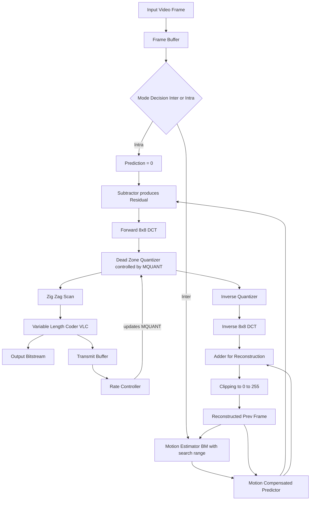
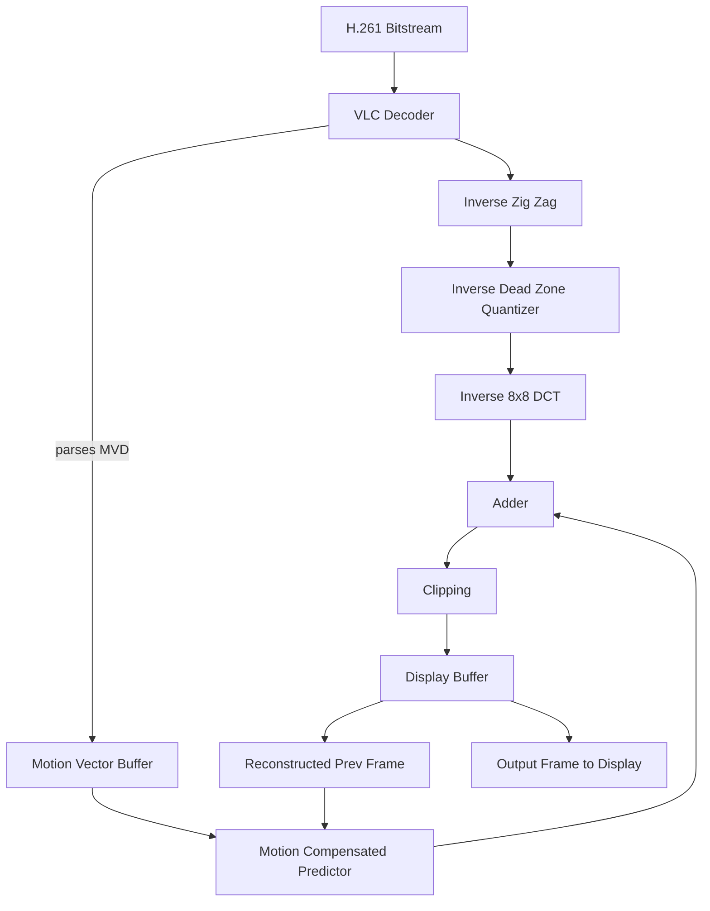
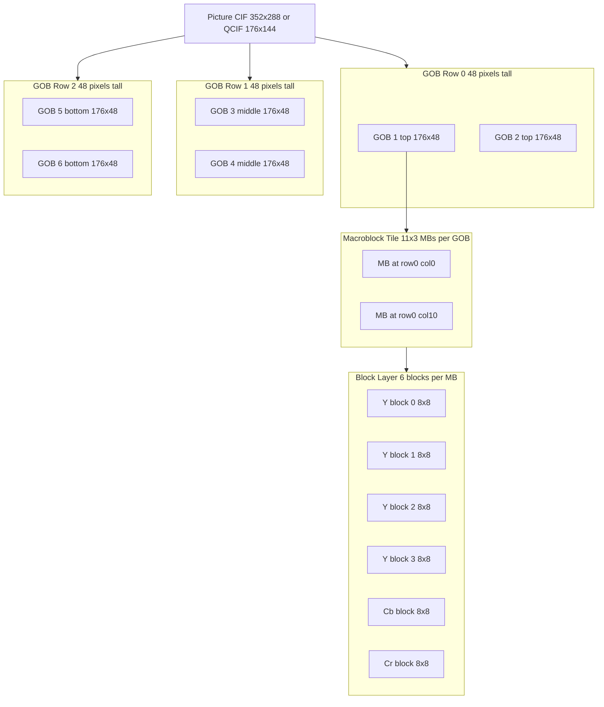
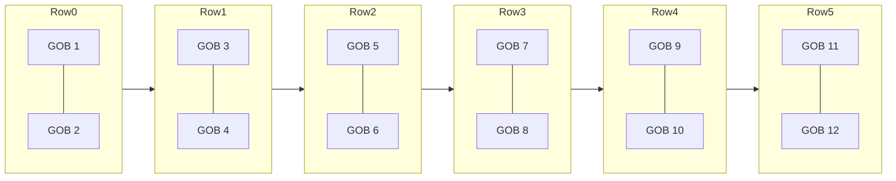
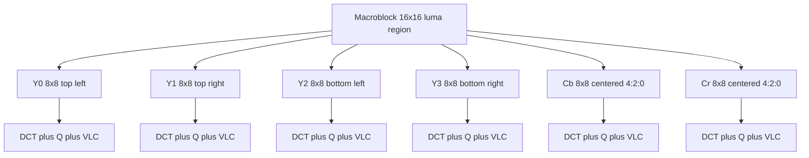

# H.261

<!-- SECTION_1_START -->
# H.261 Video Compression Standard — Core Foundation

## 1.1 Formal Definition (KTU 2024 Syllabus Terminology)

> [!IMPORTANT]
> **H.261** is the first practical **ITU-T digital video compression standard**, formally titled *"Video Codec for Audiovisual Services at p × 64 kbit/s"*. It was approved in **1990 (later revised in 1993)** and is the founding member of the hybrid **DCT + Motion-Compensated Prediction** family of codecs (which later influenced **MPEG-1, MPEG-2 / H.262, and H.263**).

The standard is engineered for **videophone and video-conferencing** traffic carried over **ISDN** (Integrated Services Digital Network) and other **constant-bit-rate (CBR)** digital channels. The target bit-rate envelope is rigidly defined as:

$$R = p \times 64 \ \text{kbit/s}, \quad \text{where} \quad p \in \{1,\,2,\,3,\,\dots,\,30\}$$

Hence the admissible range of bit-rates is from **$64 \ \text{kbit/s}$** (face-only videophone, $p=1$) up to a peak of **$1.92 \ \text{Mbit/s}$** (broadcast-grade conferencing, $p=30$).

---

## 1.2 Conceptual Analogy — "The Cameraman's Notebook"

Imagine a news cameraman covering a press conference. He does **not** take a fresh, full-quality photograph of every single second. Instead:

1. He captures one **clean reference photo** (analogous to an **I-frame / Intra frame**).
2. For the next several minutes, he scribbles down **"the speaker's lips moved 3 cm to the right"** — small **motion notes** (the **motion vector** field).
3. He keeps a **stack of clips** of recurring visual elements (like a fixed logo behind the speaker) — these are **macroblock residue patterns** that get coded via **DCT**.
4. He manages his **notebook thickness** with a **rate control knob** — if the page is filling up too fast, he writes with **shorthand** (coarser **quantization**); if pages are blank, he writes with **fine ink** (finer quantization).

That is exactly how H.261 operates: a **predictive encoder** that transmits **one full intra frame**, followed by a stream of **motion vectors + DCT-coded residuals**, all squeezed into a fixed $p \times 64 \ \text{kbit/s}$ pipe via **buffer-feedback quantization**.

---

## 1.3 Target Resolutions — CIF and QCIF

H.261 defines **two source formats** sampled in the **4:2:0** chroma format:

| Parameter | **CIF (Common Intermediate Format)** | **QCIF (Quarter CIF)** |
|---|---|---|
| Luminance $Y$ resolution | $352 \times 288$ | $176 \times 144$ |
| Chrominance $C_b, C_r$ resolution | $176 \times 144$ | $88 \times 72$ |
| Frame-rate (PAL) | $25$ fps | $25$ fps |
| Frame-rate (NTSC) | $29.97$ fps | $29.97$ fps |
| Macroblocks per frame | $22 \times 18 = 396$ | $11 \times 9 = 99$ |
| Mandated by H.261 | Optional (encoder-dependent) | **Mandatory** (every decoder must support) |

> [!NOTE]
> **Why is QCIF mandatory and CIF optional?** Because the *decoder* must always be able to handle the lowest common denominator. Even if a sender transmits CIF, the receiver is permitted to down-sample to QCIF for display — but every compliant decoder must, at minimum, decode **QCIF**.

---

## 1.4 Visualizing the Spatio-Temporal Hierarchy

> [!VISUALIZATION CONTROL]
> **Concept:** Hierarchical block decomposition of an H.261 frame.
> **Pseudo-Visualization (read along the axes):**
> * *X-axis* → horizontal pixel coordinate (0 … 351 for CIF, 0 … 175 for QCIF)
> * *Y-axis* → vertical pixel coordinate (0 … 287 for CIF, 0 … 143 for QCIF)
> * Plot layers from outermost to innermost:
>   1. Whole **Picture** ($352 \times 288$)
>   2. **GOB (Group of Blocks)** = $176 \times 48$ region (so $2 \times 6$ GOBs in CIF, $1 \times 3$ in QCIF)
>   3. **Macroblock (MB)** = $16 \times 16$ Y region (so $11 \times 3$ MBs per GOB)
>   4. **Block** = $8 \times 8$ DCT unit (so $4$ Y blocks + $1\ C_b$ + $1\ C_r$ per MB)
> **Visual Description:** Picture → 12 GOBs (CIF) → 11×3 MBs per GOB → 6 DCT blocks per MB.

<!-- SECTION_1_END -->

<!-- SECTION_2_START -->
# H.261 — Deep Theoretical Analysis & KTU Formula Sheet

## 2.1 Architectural Philosophy — Hybrid Coder

H.261 is a textbook **hybrid video codec** that fuses two complementary redundancy-removal tools:

1. **Temporal redundancy reduction** inside the *prediction loop* — using **Block-Matching Motion-Compensation (BMC)** at $16 \times 16$ granularity.
2. **Spatial redundancy reduction** inside the *transform loop* — using the **Forward 2-D Discrete Cosine Transform (DCT)** on each $8 \times 8$ residual block.

The two are stitched together by a **closed-loop quantizer** that consults a **transmission buffer** for **rate-control** feedback.

---

## 2.2 Layered Bitstream Syntax (Mandatory Hierarchy)

The H.261 bitstream is a **strictly nested hierarchy** of six layers, each prefixed by a unique start-code:

| Layer | Start Code | Constituents | Size (CIF) | Size (QCIF) |
|---|---|---|---|---|
| **Picture** | $0000\,0000\,0000\,0001\,0000$ | PSC + TR + PTYPE + (PEI) + (PSBI) + $12$ GOBs | 1 frame | 1 frame |
| **GOB (Group of Blocks)** | $0000\,0000\,0000\,0001\,xx$ | GBSC + GN + GQUANT + (GEI) + $11 \times 3$ MBs | 2 × 6 GOBs | 1 × 3 GOBs |
| **MB (Macroblock)** | $0000\,0000\,0000\,0001\,xxx$ | MBA + MTYPE + MQUANT + MVD + (CBP) + blocks | 396 MBs | 99 MBs |
| **Block** | (no start code) | TCOEFF (VLC-coded DCT coefficients) | 6 blocks / MB | 6 blocks / MB |
| **Coefficient** | n/a | RUN + LEVEL + EOB marker | 64 / block | 64 / block |
| **Symbol** | n/a | Bits produced by the Variable-Length Coder (Huffman-like) | — | — |

> [!NOTE]
> **Start-code uniqueness:** All start codes contain a logic-1 in the LSB. This prevents accidental emulation inside compressed data and enables robust resynchronization after bit-errors.

---

## 2.3 Quantizer — Linear with Dead-Zone

H.261 uses a **uniform mid-tread quantizer with a dead-zone** controlled by a parameter **MQUANT** (or **GQUANT** at GOB level), which is an integer in the range $1 \ldots 31$.

The *quantizer step-size* doubles with MQUANT:

$$\text{QSTEP} = 2 \times \text{MQUANT}$$

For each **intra block** (DC + AC):

$$|\text{LEVEL}| = \frac{\text{coefficient}}{2 \times \text{MQUANT}}, \quad \text{with rounding}$$

For each **inter block** (residual only, no DC, dead-zone applied):

$$|\text{LEVEL}| = \frac{|\text{coefficient}| - \text{MQUANT}}{2 \times \text{MQUANT}}, \quad \text{clipped at } 0$$

with the sign preserved separately. The dequantizer simply multiplies LEVEL back by $2 \times \text{MQUANT}$ (clamped to $[-2048,\,2047]$).

---

## 2.4 Motion Compensation (BMC)

* **Block size** — fixed at $16 \times 16$ (whole macroblock).
* **Resolution** — *full-pel* (integer pixel) accuracy only. *No half-pel refinement* (this is a key historical limitation of H.261 that H.263 later fixed).
* **Search range** — implementation-defined, typically $\pm 15$ pixels (a region of $31 \times 31$ around the current MB).
* **Skip / Zero-MV** — encoder may transmit a *zero* motion vector (use the collocated block from the previous frame); even the MV itself may be **skipped** (reuse the previous MB's MV).
* **Loop filter** — a separable 2-D low-pass filter ($1/4,\,1/2,\,1/4$ taps) is applied to the prediction *and* the reconstruction to soften mosquito/block-edge artifacts.

The **prediction error** (residual) is:

$$e(x,y) = s(x,y) - \tilde{s}(x - v_x,\,y - v_y)$$

where $s$ is the current frame, $\tilde{s}$ is the reconstructed previous frame, and $(v_x, v_y)$ is the motion vector.

---

## 2.5 KTU High-Yield Formula Sheet

| # | Concept | Equation / Rule | Notes |
|---|---|---|---|
| 1 | Bit-rate envelope | $R = p \times 64 \ \text{kbit/s}, \ \ p = 1 \dots 30$ | $R_{\min} = 64 \ \text{kbit/s}, \ \ R_{\max} = 1.92 \ \text{Mbit/s}$ |
| 2 | Quantizer step | $\text{QSTEP} = 2 \times \text{MQUANT}$ | $\text{MQUANT} \in [1,\,31]$, so $\text{QSTEP} \in [2,\,62]$ |
| 3 | Intra DC quantization | $\text{LEVEL}_{\text{dc}} = \text{round}\!\left(\dfrac{\text{DC}}{8}\right)$ | DC always quantized with step 8 |
| 4 | Intra AC quantization | $\text{LEVEL}_{\text{ac}} = \text{round}\!\left(\dfrac{\text{AC}}{2\,\text{MQUANT}}\right)$ | No dead zone on AC |
| 5 | Inter residual quant | $\text{LEVEL} = \text{round}\!\left(\dfrac{\lvert c \rvert - \text{MQUANT}}{2\,\text{MQUANT}}\right)$ | Dead-zone of width $2\,\text{MQUANT}$ |
| 6 | DCT block size | $8 \times 8$ pixels | Forward DCT: $F(u,v)=\dfrac{1}{4}C(u)C(v)\!\sum\!\sum f(x,y)\cos\!\left[\dfrac{(2x+1)u\pi}{16}\right]\cos\!\left[\dfrac{(2y+1)v\pi}{16}\right]$ |
| 7 | Macroblock composition | $4\,Y + 1\,C_b + 1\,C_r = 6$ blocks of $8 \times 8$ | $4{:}2{:}0$ chroma sub-sampling |
| 8 | GOB dimensions | $176 \times 48$ pixels = $11 \times 3$ MBs | 1 GOB = 33 macroblocks |
| 9 | GOB count | CIF: $2 \times 6 = 12$ GOBs ; QCIF: $1 \times 3 = 3$ GOBs | — |
| 10 | Total MBs / frame | CIF: $396$ ; QCIF: $99$ | $22 \times 18$ and $11 \times 9$ respectively |
| 11 | Motion-comp block | $16 \times 16$ luma; full-pel MV | Search range $\pm 15$ px |
| 12 | Rate control | MQUANT $\uparrow \Rightarrow$ QSTEP $\uparrow \Rightarrow$ bit-rate $\downarrow$ | Buffer-feedback loop |
| 13 | Min compressed MB | $\ge 64$ bits (GOB start + skip mode) | Prevents buffer under-run |
| 14 | Still-image mode | $p = 0$ freezes the codec; only intra refresh | Lossy still-image transmission |

---

## 2.6 Real-World Engineering Utility

* **Pioneer of modern video compression.** H.261 is the *proving ground* for the **DCT + MC** paradigm that survives in H.264/AVC, H.265/HEVC, VVC, and AV1.
* **ISDN-based corporate video-conferencing** (circa 1990–2005) was the dominant deployment.
* **Used as a reference platform** in many academic implementations of hybrid codecs (e.g., the *tmn* software by Telenor's Bjontegaard that produced the famous **BD-rate** metric).
* **Embedment in 3G-324M videophones** (H.263, the successor) traces its lineage back to H.261.
* **CBR assumption** makes it well-suited for synchronous digital circuits where buffer under-/over-flow translates directly into channel slip.

<!-- SECTION_2_END -->

<!-- SECTION_3_START -->
# H.261 — Step-by-Step Derivations & Implementation

## 3.1 Detailed Derivation of the Motion-Compensated Prediction Error

Let the current frame be $s(x,y,t)$ and the *reconstructed* previous frame be $\tilde{s}(x,y,t-1)$. The encoder must find a motion vector $\vec{v}=(v_x,v_y)$ that minimizes the **Sum of Absolute Differences (SAD)** over the macroblock:

$$\vec{v}^{\star} = \arg\min_{(v_x,v_y)} \sum_{x=0}^{15} \sum_{y=0}^{15} \Big\lvert\, s(x,y,t) \;-\; \tilde{s}(x-v_x,\,y-v_y,\,t-1) \,\Big\rvert$$

The **residual macroblock** is then:

$$e(x,y) = s(x,y,t) \;-\; \tilde{s}(x-v_x,\,y-v_y,\,t-1)$$

This residual is split into four $8 \times 8$ luma blocks (and two chroma blocks), each of which is transformed by the **Forward 2-D DCT**:

$$
\begin{aligned}
F(u,v) &= \frac{1}{4}\,C(u)\,C(v)\sum_{x=0}^{7}\sum_{y=0}^{7} e(x,y) \\
&\quad \times \cos\!\left[\frac{(2x+1)u\pi}{16}\right] \cos\!\left[\frac{(2y+1)v\pi}{16}\right]
\end{aligned}
$$

where $C(k) = \dfrac{1}{\sqrt{2}}$ if $k=0$ and $1$ otherwise.

Each coefficient is quantized with the **dead-zone quantizer** controlled by MQUANT. The quantizer output $\text{LEVEL}$ is then **zig-zag scanned** (low-frequency → high-frequency) so that long zero runs are produced, which the VLC encoder can compress efficiently:

$$\text{Zig-zag order: } (0,0)\!\to\!(0,1)\!\to\!(1,0)\!\to\!(2,0)\!\to\!(1,1)\!\to\!(0,2)\!\to\!(0,3)\,\dots$$

Finally, a run-level VLC table (3-D Huffman) maps each $(\text{RUN},\,\text{LEVEL},\,\text{EOB})$ triplet to a variable-length bit-string.

---

## 3.2 Step-by-Step Numerical Walk-Through — Quantizing a Single AC Coefficient

Suppose an AC coefficient in an inter-coded macroblock has the value $c = +47$ and the encoder has set $\text{MQUANT} = 8$.

**Step 1** — Compute the dead-zone width:
$$\text{dead-zone half-width} = \text{MQUANT} = 8$$

**Step 2** — Apply the dead-zone subtraction:
$$\lvert c \rvert - \text{MQUANT} = 47 - 8 = 39$$

**Step 3** — Divide by the quantizer step $2 \times \text{MQUANT} = 16$:
$$\frac{39}{16} = 2.4375$$

**Step 4** — Round to nearest integer:
$$\text{LEVEL} = 2$$

**Step 5** — Preserve the sign: $\text{LEVEL}_{\text{signed}} = +2$.

**Step 6** — Dequantize at the decoder:
$$\hat{c} = 2 \times 2 \times \text{MQUANT} = 32$$

**Reconstruction error** = $47 - 32 = 15$ → a quantization error of $\pm 1$ *quantizer step*, as expected.

> [!NOTE]
> If $\lvert c \rvert < \text{MQUANT}$ then $\text{LEVEL} = 0$ — the dead zone "swallows" small residuals, which is the dominant source of compression in inter frames.

---

## 3.3 Rate Control — Buffer Feedback Equation

Let $B(t)$ be the encoder buffer occupancy (in bits) at time $t$, $B_{\max }$ the buffer size, and $R$ the channel rate in bits/s. The buffer dynamics obey:

$$B(t+1) = B(t) - R\,\Delta t \;+\; N_{\text{produced}}(t)$$

The encoder must keep $0 \le B(t) \le B_{\max }$ at all times. A typical **look-ahead proportional control** rule used in H.261 reference implementations is:

$$
\text{MQUANT}(t) = \begin{cases}
\text{MQUANT}(t-1) \times \dfrac{B(t)}{B_{\text{target}}} & \text{if } B(t) > B_{\text{target}} \\[6pt]
\text{MQUANT}(t-1) \times \dfrac{B_{\text{target}}}{B(t)} & \text{if } B(t) < B_{\text{target}} \\[6pt]
\text{MQUANT}(t-1) & \text{otherwise}
\end{cases}
$$

Whenever the buffer is *too full* (overflow imminent), MQUANT is *increased* to *coarsen* quantization and reduce $N_{\text{produced}}$. The opposite happens for under-run.

---

## 3.4 Full-Pel Block-Matching Motion Estimation in Python

The following fully-operational Python module implements an **exhaustive full-pel block-matching estimator** — exactly the algorithm an H.261 encoder would run on each macroblock (intentionally readable, not optimized).

```python
import numpy as np
from typing import Tuple

def full_pel_block_match(
    current_frame: np.ndarray,
    ref_frame: np.ndarray,
    mb_x: int,
    mb_y: int,
    search_range: int = 15
) -> Tuple[int, int, int]:
    """
    Exhaustive full-pel block-matching motion estimator for H.261.

    Parameters
    ----------
    current_frame : np.ndarray
        Grayscale luma of the current frame, shape (H, W), dtype uint8.
    ref_frame : np.ndarray
        Reconstructed previous frame, same shape and dtype.
    mb_x, mb_y : int
        Top-left coordinates (in pixels) of the macroblock in the current frame.
    search_range : int
        Half-width of the search window in pixels (± search_range).

    Returns
    -------
    (v_x, v_y, sad_min) : Tuple[int, int, int]
        Best motion vector and the corresponding SAD (Sum of Absolute Differences).
    """
    H, W = current_frame.shape

    # ---- 1. Extract the 16x16 current macroblock --------------------------------
    mb = current_frame[mb_y:mb_y + 16, mb_x:mb_x + 16].astype(np.int32)
    if mb.shape != (16, 16):
        raise ValueError("Macroblock patch is not 16x16; check coordinates.")

    # ---- 2. Exhaustive search over ± search_range --------------------------------
    best_sad = np.iinfo(np.int32).max
    best_vx, best_vy = 0, 0

    for v_y in range(-search_range, search_range + 1):
        for v_x in range(-search_range, search_range + 1):
            # Coordinates in the reference frame
            rx_start, ry_start = mb_x + v_x, mb_y + v_y
            rx_end, ry_end = rx_start + 16, ry_start + 16

            # ---- 3. Boundary safety: skip out-of-frame candidates -----------------
            if rx_start < 0 or ry_start < 0 or rx_end > W or ry_end > H:
                continue

            ref_block = ref_frame[ry_start:ry_end, rx_start:rx_end].astype(np.int32)
            if ref_block.shape != (16, 16):
                continue

            # ---- 4. SAD = sum of absolute differences -----------------------------
            sad = int(np.sum(np.abs(mb - ref_block)))

            if sad < best_sad:
                best_sad = sad
                best_vx, best_vy = v_x, v_y

    return best_vx, best_vy, best_sad


def mc_predict(
    ref_frame: np.ndarray, mb_x: int, mb_y: int, mv: Tuple[int, int]
) -> np.ndarray:
    """
    Perform motion-compensated prediction for a single macroblock.

    Returns
    -------
    pred : np.ndarray  of shape (16, 16), dtype uint8
        Predicted luma patch.
    """
    v_x, v_y = mv
    rx, ry = mb_x + v_x, mb_y + v_y
    pred = ref_frame[ry:ry + 16, rx:rx + 16].copy()
    if pred.shape != (16, 16):
        raise IndexError("Motion-compensated prediction patch is out of frame.")
    return pred
```

> [!IMPORTANT]
> The decoder uses **only the reconstructed previous frame** $\tilde{s}(t-1)$, not the *original* previous frame. This guarantees **drift-free operation**: encoder and decoder see the *same* prediction reference, even after lossy quantization.

---

## 3.5 H.261 Encoder Algorithm — Pseudocode

```
INITIALIZE
    load first frame as I-frame
    set MQUANT = 8           // mid-rate initial step
    set encoder buffer = 0

FOR each frame f = 1, 2, ...:
    IF f is intra (every N frames or on demand):
        mode = INTRA
    ELSE:
        mode = INTER

    FOR each GOB g in (row-major order):
        FOR each Macroblock m in g:
            IF mode == INTER:
                // ---- Motion Estimation ----
                (v_x, v_y, sad) = full_pel_block_match(f, ~f_prev, m.x, m.y, ±15)
                prediction = mc_predict(~f_prev, m.x, m.y, (v_x, v_y))
                residual  = f[m] - prediction
            ELSE:
                prediction = 0
                residual  = f[m]

            // ---- DCT on 4 luma + 2 chroma 8x8 blocks ----
            coeffs = forward_dct(residual)              // shape per block: (8,8)

            // ---- Quantization (dead-zone, MQUANT) ----
            levels = deadzone_quantize(coeffs, mode, MQUANT)

            // ---- Rate control via buffer feedback ----
            bits_so_far = estimate_bit_count(levels, v_x, v_y)
            update_buffer(bits_so_far)
            MQUANT = adjust_quantizer(buffer_fill)

            // ---- VLC encoding ----
            vlc_bits = vlc_encode(levels, motion_vector=(v_x,v_y), mode=mode)

            // ---- Local reconstruction (for prediction) ----
            recon_coeffs = inverse_quantize(levels, MQUANT)
            recon_block  = inverse_dct(recon_coeffs)
            if mode == INTER:
                ~m = clip(recon_block + prediction)        // reconstruction
            else:
                ~m = clip(recon_block)
            f_prev_recon[m] = ~m
        END FOR m
    END FOR g

    output_vlc_bitstream()
END FOR
```

---

## 3.6 Closed-Loop Decoder Algorithm — Pseudocode

```
INITIALIZE
    decode PSC
    ~prev = blank_white_frame()              // start of decoded sequence

FOR each frame in bitstream:
    decode PTYPE, TR
    FOR each GOB in frame:
        decode GN, GQUANT
        FOR each MB in GOB:
            decode MBA, MTYPE, MQUANT, MVD, CBP
            IF mode == INTER:
                prediction = mc_predict(~prev, m.x, m.y, mv)
            ELSE:
                prediction = 0
            FOR each of 6 blocks in MB:
                decode VLC (run, level) pairs to get quant levels
                dequant = inverse_deadzone(levels, MQUANT)
                block   = idct(dequant)
                IF mode == INTER:
                    ~m_block = clip(block + prediction_block)
                ELSE:
                    ~m_block = clip(block)
            ~prev[m] = assemble(4 Y + 1 Cb + 1 Cr)
        END FOR MB
    END FOR GOB
    OUTPUT ~prev to display
END FOR
```

<!-- SECTION_3_END -->

<!-- SECTION_4_START -->
# H.261 — Structural Diagrams & Schematics

## 4.1 H.261 Encoder Block-Level Architecture



---

## 4.2 H.261 Decoder Architecture



---

## 4.3 Picture–GOB–MB–Block Hierarchy



---

## 4.4 GOB Numbering Map (CIF, 12 GOBs)



> [!NOTE]
> For **QCIF**, only **GOB 1, GOB 3, GOB 5** exist (the left-column GOBs of a CIF slice), since the QCIF width is exactly one GOB wide.

---

## 4.5 Macroblock Internal Anatomy



---

## 4.6 Sequential Processing Topology — Encoder / Decoder Data Path

| Stage | Encoder Operation | Decoder Mirror | Data Unit |
|---|---|---|---|
| 1 | Frame capture & split | Frame buffer fill | Picture |
| 2 | GOB segmentation | GOB sync search | GOB |
| 3 | MB segmentation | MB header parse | Macroblock |
| 4 | Mode decision (Inter/Intra) | MTYPE decode | — |
| 5 | Motion estimation | Motion-vector decode | MV pair |
| 6 | MC prediction | MC prediction | $16 \times 16$ luma |
| 7 | Subtraction | Addition (after IDCT) | $16 \times 16$ residual |
| 8 | $8 \times 8$ DCT | $8 \times 8$ IDCT | $8 \times 8$ block |
| 9 | Quantization (dead zone, MQUANT) | Dequantization | $8 \times 8$ block |
| 10 | Zig-zag scan | Inverse zig-zag | $64$ coefficients |
| 11 | VLC encode (RUN, LEVEL, EOB) | VLC decode | Bitstream |
| 12 | Buffer + rate control | Buffer fill | MQUANT feedback |
| 13 | Bitstream serialization | Bitstream parsing | H.261 bitstream |
| 14 | Channel transmission | Channel reception | Physical line |

<!-- SECTION_4_END -->

<!-- SECTION_5_START -->
# H.261 — KTU 2024 Scheme Examination Question Bank & Topic Recap

## Part A — Short-Answer Questions (3 Marks Each)

### Q1. [KTU University Exam — July 2022] — CO1, Remember
**State and justify the admissible bit-rate range of H.261.**

**Model Answer (3 Marks):**
* H.261 targets the rate $R = p \times 64 \ \text{kbit/s}$ where $p$ is an integer between $1$ and $30$. **[1 Mark]**
* The minimum rate is $64 \ \text{kbit/s}$ ($p=1$, suitable for face-only videophone) and the maximum is $1.92 \ \text{Mbit/s}$ ($p=30$, suitable for high-quality video-conferencing). **[1 Mark]**
* This range was chosen to align with the **ISDN** $p \times 64 \ \text{kbit/s}$ channel bundle (H.0/H.1 Bearer channels of $64 \ \text{kbit/s}$ each). **[1 Mark]**

### Q2. [KTU University Exam — Dec 2022] — CO1, Understand
**Explain the role of a Group of Blocks (GOB) in H.261.**

**Model Answer (3 Marks):**
* A GOB is a rectangular region of size $176 \times 48$ pixels covering $11 \times 3 = 33$ macroblocks. **[1 Mark]**
* It exists primarily to provide **resynchronization points** if the bitstream becomes corrupted (e.g., a header error invalidates the rest of the frame). **[1 Mark]**
* A CIF frame has $2 \times 6 = 12$ GOBs and a QCIF frame has $1 \times 3 = 3$ GOBs. Each GOB carries its own quantizer (GQUANT), enabling spatial rate-control adaptation. **[1 Mark]**

---

## Part B — Long-Answer Questions (14 Marks Each)

### Q1. [KTU University Exam — Model Question] — CO2, Understand + Apply

#### **Option A (14 Marks)**

**(a)** With the help of a labelled block diagram, describe the **H.261 encoder architecture** and explain the **role of the closed loop**. **[7 Marks]**

**Model Solution:**

* The H.261 encoder contains the following major blocks: **input frame store, mode-decision switch, motion estimator, motion-compensated predictor, subtractor, forward DCT, dead-zone quantizer, zig-zag scan, VLC encoder, transmit buffer, rate controller, inverse quantizer, inverse DCT, adder, clipper, and a reconstructed previous-frame store**. **[Listing & labelling: 2 Marks]**
* The **prediction loop** (subtractor → DCT → quant → inverse quant → inverse DCT → adder) generates a **locally reconstructed frame** that is **byte-identical to the decoder's reference frame**, ensuring drift-free decoding. **[Predictor loop: 2 Marks]**
* The **rate-control loop** (buffer → rate-controller → MQUANT adjustment) keeps the output rate at the constant $p \times 64 \ \text{kbit/s}$ demanded by the channel. When the buffer is *fuller* than a target, MQUANT is *increased*, making the quantizer coarser and producing fewer bits. **[Rate-control loop: 2 Marks]**
* The **MUX** serializes the VLC output plus picture, GOB, and macroblock headers into the H.261 bitstream. **[1 Mark]**

**(b)** Describe the **bitstream syntax** of H.261 starting from the Picture layer down to the Block layer. Mention the **start-codes** used. **[7 Marks]**

**Model Solution:**

* The bitstream is a **strictly hierarchical nested structure** of six layers: **Picture → Group of Blocks (GOB) → Macroblock (MB) → Block → Coefficient → Symbol**. **[1 Mark]**
* **Picture layer** starts with a PSC (Picture Start Code = $0000\,0000\,0000\,0001\,0000$), followed by a 5-bit Temporal Reference (TR), a 6-bit Picture Type (PTYPE) and optional Picture Extra Insertion Information (PEI) / Picture Stuffing Bits (PSBI). **[Picture layer details: 1 Mark]**
* **GOB layer** begins with a GBSC = $0000\,0000\,0000\,0001\,xx$ where the last five bits encode the GOB number (1–12 for CIF, 1–3 for QCIF). It then carries a 4-bit GQUANT and optional GEI. **[GOB layer: 1 Mark]**
* **Macroblock layer** starts with an MBA (Macroblock Address, addressing skip from the previous MB), a 5-bit MTYPE (predictive or intra, with and without motion, with and without loop filter), a 5-bit MQUANT, a variable-length MVD, a variable-length CBP, and finally the six block payloads. **[MB layer: 2 Marks]**
* **Block layer** carries VLC-coded (RUN, LEVEL) pairs plus an End-of-Block (EOB) marker; this is the only layer that does not begin with a start-code. **[Block layer: 1 Mark]**
* All start-codes contain a logical-1 in the LSB to ensure that no start-code is a prefix of any other, guaranteeing robust resynchronization after bit-errors. **[1 Mark]**

#### **Option B (14 Marks)**

**(a)** Explain the **quantization scheme** used in H.261. Show how the quantizer parameter MQUANT relates to the step-size. **[7 Marks]**

**Model Solution:**

* H.261 uses a **uniform mid-tread quantizer** with a **dead-zone** controlled by the parameter **MQUANT** ($1 \le \text{MQUANT} \le 31$). **[1 Mark]**
* The quantizer step-size is $\text{QSTEP} = 2 \times \text{MQUANT}$, so the admissible step-sizes are $2, 4, 6, \dots, 62$. **[1 Mark]**
* For **intra blocks**, the DC coefficient is quantized with a fixed step of $8$, and the AC coefficients with step $2 \times \text{MQUANT}$ and no dead-zone. **[Intra: 2 Marks]**
* For **inter (residual) blocks**, the quantizer applies a *dead-zone* of width $2 \times \text{MQUANT}$ around zero: coefficients with $\lvert c \rvert < \text{MQUANT}$ are mapped to zero, and the rest are quantized as $\text{LEVEL} = \text{round}[(\lvert c \rvert - \text{MQUANT})/(2 \times \text{MQUANT})]$ with the sign preserved separately. **[Inter residual: 2 Marks]**
* The dequantizer simply multiplies LEVEL by $2 \times \text{MQUANT}$ (clamped to $[-2048, 2047]$). The dead-zone is the dominant source of compression in inter frames because it zeros-out small residuals that the motion-compensator could not predict. **[1 Mark]**

**(b)** With a **numerical example**, show how a single inter-block AC coefficient is quantized and dequantized in H.261. **[7 Marks]**

**Model Solution:**

* Let $c = +47$ and let the encoder have set $\text{MQUANT} = 8$. Then $\text{QSTEP} = 2 \times 8 = 16$. **[1 Mark]**
* The dead-zone half-width is $\text{MQUANT} = 8$. Apply it: $47 - 8 = 39$. **[1 Mark]**
* Divide by QSTEP: $39 / 16 = 2.4375$. **[1 Mark]**
* Round to nearest integer: $\text{LEVEL} = 2$. The sign is preserved: $\text{LEVEL}_{\text{signed}} = +2$. **[1 Mark]**
* The decoder receives $\text{LEVEL} = +2$ and dequantizes: $\hat{c} = 2 \times 2 \times 8 = 32$. **[1 Mark]**
* Reconstruction error: $\lvert c - \hat{c} \rvert = \lvert 47 - 32 \rvert = 15 \approx 1 \times \text{QSTEP}$, as expected. **[1 Mark]**
* If a coefficient of, say, $+4$ had arrived, the dead-zone would have set $\text{LEVEL} = 0$ (since $\lvert 4 \rvert < 8$), illustrating how small residuals are aggressively killed. **[1 Mark]**

> [!WARNING]
> **Examiner's Pitfall Callout — Common Marks-Loss Zones:**
> * Forgetting to apply the **dead-zone** in inter blocks — students often write the same formula as intra, losing up to 2 marks.
> * Confusing **MQUANT** with **QSTEP** (they differ by a factor of 2). The KTU evaluator checks this carefully.
> * Writing the wrong DC quantizer for intra blocks: DC always uses **step 8**, not $2 \times \text{MQUANT}$.

---

### Q2. [KTU University Exam — Model Question] — CO2, Apply + Analyze

#### **Option A (14 Marks)**

**(a)** Describe **motion-compensation in H.261**, covering block-size, search range, full-pel accuracy, and the loop filter. **[7 Marks]**

**Model Solution:**

* H.261 uses **block-matching motion compensation** at the **macroblock level** (block size $16 \times 16$ luma pixels, with chroma regions co-located). **[Block size: 1 Mark]**
* Motion vectors are quantized to **full-pel (integer-pixel) accuracy** — there is **no half-pel refinement** (a H.263 improvement). **[Full-pel: 1 Mark]**
* The search range is implementation-defined, typically $\pm 15$ pixels (i.e., $31 \times 31$ candidate window). Encoders use **exhaustive search, logarithmic search, or three-step search** to find the minimum-SAD vector. **[Search: 2 Marks]**
* A **zero-motion vector** can be transmitted (no compensation); the motion vector itself may even be **skipped** by signalling "use the previous MB's MV" to save bits. **[Skip mode: 1 Mark]**
* The **loop filter** is a separable 2-D filter with $1/4, 1/2, 1/4$ taps applied to **both the prediction and the reconstruction**, attenuating mosquito and block-edge artifacts. **[Loop filter: 1 Mark]**
* The residual is then DCT-coded. The decoder sees the *same* reconstructed previous frame (after IDCT and loop filtering), guaranteeing drift-free operation. **[Drift-free: 1 Mark]**

**(b)** Compute the **total number of blocks, macroblocks, and GOBs** in a CIF frame and a QCIF frame, showing all intermediate steps. **[7 Marks]**

**Model Solution:**

* **CIF frame** — Luma $352 \times 288$, Chroma $176 \times 144$. **[Given: 1 Mark]**
  * Macroblocks per luma frame: $(352 / 16) \times (288 / 16) = 22 \times 18 = 396$ MBs. **[2 Marks]**
  * GOBs: 1 GOB is $176 \times 48$ luma pixels. So GOBs per row = $352 / 176 = 2$, rows of GOBs = $288 / 48 = 6$, total = $2 \times 6 = 12$ GOBs. **[2 Marks]**
  * Blocks per MB (4:2:0): 4 Y + 1 Cb + 1 Cr = 6 blocks. Total blocks = $396 \times 6 = 2376$ blocks. **[1 Mark]**

* **QCIF frame** — Luma $176 \times 144$, Chroma $88 \times 72$. **[Given: 0.5 Mark, included in following]**
  * Macroblocks: $(176/16) \times (144/16) = 11 \times 9 = 99$ MBs. **[0.5 Mark]**
  * GOBs: $176/176 = 1$ per row, $144/48 = 3$ rows, total $= 1 \times 3 = 3$ GOBs. **[0.5 Mark]**
  * Total blocks = $99 \times 6 = 594$ blocks. **[0.5 Mark]**

#### **Option B (14 Marks)**

**(a)** Explain the **rate-control mechanism** in H.261. How is the quantizer parameter adjusted to maintain the constant bit-rate $p \times 64 \ \text{kbit/s}$? **[7 Marks]**

**Model Solution:**

* The encoder has a **transmission buffer** of finite size $B_{\max }$ sitting between the VLC coder and the channel. **[1 Mark]**
* The buffer occupancy is monitored: $B(t) = B(t-1) - R \Delta t + N_{\text{produced}}(t)$, where $N_{\text{produced}}$ is the number of bits just emitted. **[1 Mark]**
* If $B(t)$ is *too high* (overflow imminent), MQUANT is *increased* (coarsening the quantizer) so that VLC produces fewer bits. If $B(t)$ is *too low* (under-run imminent), MQUANT is *decreased*. **[2 Marks]**
* A proportional control law can be used: $\text{MQUANT}(t) = \text{MQUANT}(t-1) \times B(t)/B_{\text{target}}$ (with suitable clamping to $[1, 31]$). **[1 Mark]**
* The control acts at the **GOB granularity** (GQUANT) and optionally at the **MB granularity** (MQUANT), giving spatially-varying quality. **[1 Mark]**
* To prevent under-run, H.261 inserts **fill bits** so that each coded macroblock occupies at least 64 bits. **[1 Mark]**

**(b)** For a $p = 4$ H.261 call transmitting QCIF at $25$ fps, compute **(i)** the channel bit-rate, **(ii)** the **bits-per-frame budget**, and **(iii)** the **average bits-per-macroblock budget**. **[7 Marks]**

**Model Solution:**

* (i) Channel bit-rate: $R = 4 \times 64 = 256 \ \text{kbit/s} = 256\,000 \ \text{bit/s}$. **[1 Mark]**
* (ii) Frame interval = $1/25 = 0.04 \ \text{s}$. Bits per frame = $256\,000 \times 0.04 = 10\,240$ bits = $1.28$ KB. **[2 Marks]**
* (iii) A QCIF frame has 99 MBs. Average bits per MB = $10\,240 / 99 \approx 103.4$ bits/MB. **[2 Marks]**
* (iv) With 6 blocks per MB, average bits per 8×8 block = $103.4 / 6 \approx 17.2$ bits/block — i.e., only about 2.85 bits per DCT coefficient on average, which is extremely aggressive and explains why H.261 at low $p$ shows noticeable artifacts. **[2 Marks]**

> [!WARNING]
> **Examiner's Pitfall Callout — More Common Loss Points:**
> * Confusing the **quantizer step** with the **quantizer parameter** ($2 \times \text{MQUANT}$ vs MQUANT).
> * Forgetting the **dead-zone** when quantifying inter-block coefficients.
> * Forgetting that **DC** in intra blocks always uses step **8**, not MQUANT.
> * Using *half-pel* or *quarter-pel* motion vectors (those are H.263 / H.264 features, **not** in H.261).
> * Failing to label start-codes with a logic-1 in the LSB when asked about resynchronization.

---

## Topic Recap & Important Things to Remember

> [!IMPORTANT]
> **Rapid-revision checklist (save for last-minute revision):**
> * H.261 = ITU-T 1990 standard for **$p \times 64 \ \text{kbit/s}$** ISDN video ($p = 1 \ldots 30$, range $64 \ \text{kbit/s}$ to $1.92 \ \text{Mbit/s}$). **[Definition]**
> * Hybrid coder combining **Block-Matching Motion Compensation** with **DCT** of the prediction residual. **[Architecture]**
> * Two formats: **CIF = $352 \times 288$** (optional) and **QCIF = $176 \times 144$** (mandatory). **[Resolution]**
> * **4:2:0** chroma sub-sampling → **$4\,Y + 1\,C_b + 1\,C_r = 6$ blocks per MB**. **[Chroma format]**
> * **Macroblock** = $16 \times 16$ luma; **Block** = $8 \times 8$ DCT unit; **GOB** = $176 \times 48$ luma = $11 \times 3$ MBs. **[Hierarchy]**
> * CIF: $396$ MBs, $12$ GOBs. QCIF: $99$ MBs, $3$ GOBs. **[Counts]**
> * **Quantization**: $\text{QSTEP} = 2 \times \text{MQUANT}$; intra DC uses step 8; inter residual has a **dead-zone** of width $2 \times \text{MQUANT}$. **[Quantization]**
> * **Motion compensation** is full-pel at $16 \times 16$ granularity; search range typically $\pm 15$ px; loop filter $1/4, 1/2, 1/4$ taps. **[MC]**
> * **Closed prediction loop** — encoder reconstructs locally so that encoder & decoder see identical prediction references. **[Drift-free]**
> * **Rate control** — buffer-feedback loop adjusting MQUANT (and inserting fill bits) to keep the bit-rate at $p \times 64 \ \text{kbit/s}$. **[Rate control]**
> * **VLC** with 3-D Huffman tables for (RUN, LEVEL, EOB). **[Entropy coding]**
> * Bitstream layers: **Picture → GOB → MB → Block → Coefficient → Symbol**, each layer with a unique start-code. **[Syntax]**
> * **Historical importance** — ancestor of MPEG-1/2/4, H.263, H.264/AVC, H.265/HEVC. **[Legacy]**

<!-- SECTION_5_END -->
