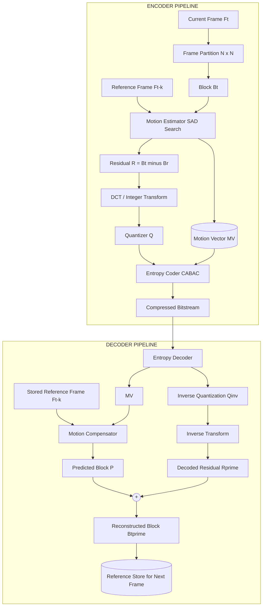
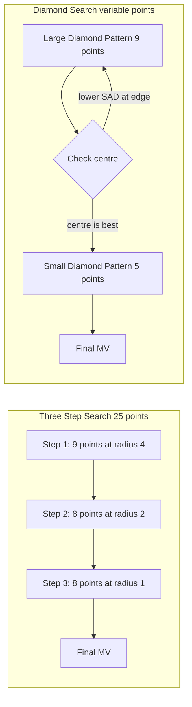
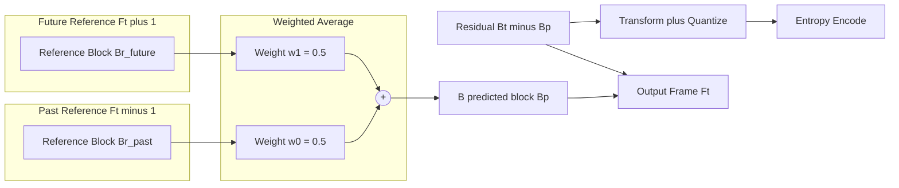
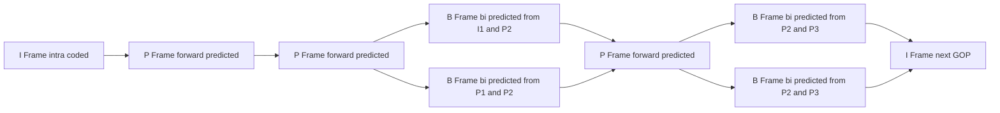
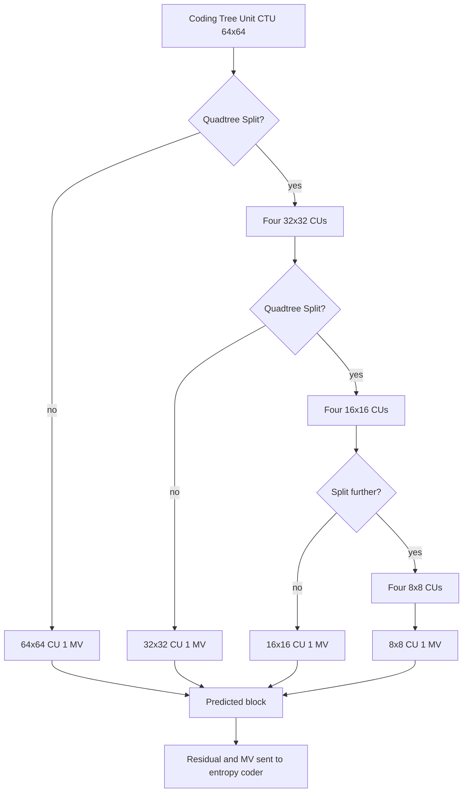

# Motion Compensation.

<!-- SECTION_1_START -->
# Motion Compensation in Video Compression

## 1. Formal Academic Definition

**Motion Compensation (MC)** is a temporal prediction technique used in inter-frame video coding (e.g., MPEG-2, H.264/AVC, H.265/HEVC, VVC) that exploits temporal redundancy between successive frames by predicting the current frame from one or more previously (and/or subsequently) decoded reference frames, using **translational motion vectors** to describe the displacement of pixel blocks.

> [!IMPORTANT]
> **KTU 2024 Syllabus Definition (PECST524 – Module 3):**
> Motion compensation is the predictive coding stage of inter-frame video compression. A current frame is partitioned into macroblocks (or coding tree units), and each block is predicted from a *reference frame* by shifting it along a **Motion Vector (MV)**. The prediction error (residual) is then transform-coded, quantized, and entropy-coded. The MV itself is also coded and transmitted.

Mathematically, the predicted pixel block is:

$$
\hat{P}_t(x, y) = P_{t-k}\bigl(x + d_x,\; y + d_y\bigr)
$$

where $\hat{P}_t$ is the predicted block at time $t$, $P_{t-k}$ is the reference frame at time $t-k$, and $(d_x, d_y)$ is the motion vector.

---

## 2. Conceptual Analogy — Plain English Intuition

Imagine you are watching a football match on TV. The background (grass, goalposts) is essentially static, but the ball and players are moving. Instead of re-drawing the entire stadium for every new frame, your TV only needs to record:

1. **Where each moving object was in the previous frame**, and
2. **How far and in which direction it has moved** to its new position.

This "shift" is the **Motion Vector**. The rest of the frame is just *copied* from the previous frame at the new location — that is the **Motion-Compensated Prediction (MCP)**. Only the *small difference* (called the **residual** or **prediction error**) between what the prediction says the frame should look like and what it actually looks like needs to be sent.

> [!NOTE]
> **Intuitive Summary:**
> - Background → copy as-is (inter-frame skip / zero motion)
> - Moving object → copy from previous frame, but shifted by MV
> - Newly revealed regions → send residual
> - Unchanged blocks → zero residual (extremely high compression)

This single insight is why a 90-minute HD movie (~1.5 TB raw) shrinks down to under **5 GB** in Blu-ray quality.

---

## 3. Key Terminology & Physical Constants

| Symbol | Meaning | Typical Value / Range |
|---|---|---|
| $N$ | Macroblock / CTU size | $16 \times 16$ (H.264), $64 \times 64$ (HEVC) |
| $p$ | Motion vector precision | Integer-pel, ½-pel, ¼-pel, ⅛-pel |
| $W_s$ | Search window radius | $\pm 16$ to $\pm 64$ pixels |
| $R_{PSNR}$ | Reconstruction PSNR | **30 – 45 dB** (acceptable broadcast) |
| $C_{CR}$ | Typical compression ratio | **20 : 1** to **200 : 1** for video |
| $B_{frame}$ | I / P / B frame types | I = intra, P = predictive, B = bi-predictive |

> [!TIP]
> **Exam Tip:** Whenever a KTU question mentions "temporal redundancy removal" or "inter-frame coding", the expected answer is **Motion-Compensated Prediction + Transform + Quantization + Entropy coding** of the residual.

---

## 4. Why Motion Compensation is Needed (The Compression Triangle)

Raw video has three forms of redundancy, and MC attacks the *temporal* one:

1. **Spatial redundancy** → handled by the **DCT** (Module 2 of PECST524).
2. **Statistical redundancy** → handled by **Entropy coding** (Huffman / Arithmetic / CABAC).
3. **Temporal redundancy** → handled by **Motion-Compensated Prediction** (current topic).

> [!VISUALIZATION CONTROL]
> **Concept:** Temporal redundancy in consecutive video frames.
> **Conceptual Graph:** Plot pixel intensity $I(x,y,t)$ at a fixed coordinate across time.
> * `Plot points: (0, 200), (1, 198), (2, 201), (3, 199), (4, 200)` — barely changes.
> **Visual Description:** Students should see that for a slowly moving scene, the intensity at any pixel is almost constant across many consecutive frames. This near-flatness across time is *temporal redundancy*, and MC removes it.

<!-- SECTION_1_END -->

<!-- SECTION_2_START -->
# Deep Theoretical Analysis & KTU High-Yield Formula Sheet

## 1. Operational Architecture of Motion Compensation

The complete Motion-Compensated inter-frame coder has **two matched halves** at the encoder and decoder:

**Encoder side (extra work):**
- Perform **Motion Estimation (ME)** — search the reference frame for the best-matching block.
- Compute and store the **Motion Vector (MV)**.
- Compute the **Residual** = Current block − Predicted block.
- Transform-code, quantize, and entropy-code both the residual and the MV.

**Decoder side (light work):**
- Decode the MV and the residual.
- Reconstruct: $\hat{P}_t = P_{ref}(x + d_x, y + d_y) + \text{residual}$.
- This asymmetry is deliberate — decoders are cheap and abundant (every phone/TV); encoders can be expensive (broadcast studios).

> [!IMPORTANT]
> The decoder **never** performs motion estimation. It only does **Motion Compensation** (applying the transmitted MV). This is a classic KTU exam point worth 2–3 marks.

---

## 2. Block Matching Motion Estimation — Step-by-Step Logic

Motion estimation partitions the current frame into non-overlapping blocks of size $N \times N$ and searches a window of size $(2W_s + N) \times (2W_s + N)$ in the reference frame for the best match.

**Step 1:** For candidate position $(u, v)$ inside the search window, compute the **distortion** $D(u, v)$ between the current block $B_c$ and the candidate block $B_r(u, v)$ from the reference frame.

**Step 2:** Pick the $(d_x, d_y) = \arg\min_{u,v}\, D(u, v)$ that minimises distortion.

**Step 3:** Encode $(d_x, d_y)$ as the motion vector, and encode the residual $R = B_c - B_r(d_x, d_y)$.

**Step 4:** At the decoder, reconstruct using $\hat{B}_c = B_r(d_x, d_y) + \text{decoded}(R)$.

### Distortion Metrics (Three Choices)

**Mean Absolute Difference (MAD):**
$$
D_{MAD}(u, v) = \frac{1}{N^2} \sum_{i=0}^{N-1} \sum_{j=0}^{N-1} \bigl\vert B_c(i,j) - B_r(u+i,\, v+j) \bigr\vert
$$

**Mean Squared Error (MSE):**
$$
D_{MSE}(u, v) = \frac{1}{N^2} \sum_{i=0}^{N-1} \sum_{j=0}^{N-1} \bigl(B_c(i,j) - B_r(u+i,\, v+j)\bigr)^2
$$

**Sum of Absolute Differences (SAD) — most used in hardware:**
$$
D_{SAD}(u, v) = \sum_{i=0}^{N-1} \sum_{j=0}^{N-1} \bigl\vert B_c(i,j) - B_r(u+i,\, v+j) \bigr\vert
$$

SAD is preferred in VLSI/ASIC implementations because it needs no multiplication — only subtract, absolute-value, and accumulate.

### Search Algorithms (Complexity vs. Quality Trade-off)

| Algorithm | Search Steps | Complexity | Quality |
|---|---|---|---|
| **Full Search (Exhaustive)** | $(2W_s+1)^2$ | $\mathcal{O}(W_s^2 N^2)$ | **Optimal** (global minimum) |
| **Three-Step Search (TSS)** | $3 \times 9 - 2 = 25$ | $\mathcal{O}(W_s^2)$ | Good, may miss minimum |
| **2-D Logarithmic Search** | $\mathcal{O}(\log_2 W_s)$ | Low | Good |
| **Diamond Search (DS)** | Variable | Low | Excellent (VVC/H.264 default) |
| **Hexagonal Search** | Variable | Lower than DS | Adopted in HEVC |

---

## 3. Sub-Pixel Motion Compensation

Real motion is rarely aligned to integer pixel grids. Standards use **interpolated reference frames** for fractional precision:

- **H.264 / AVC** → ½-pel (6-tap Wiener filter) and ¼-pel (bilinear).
- **H.265 / HEVC** → ¼-pel luma (8-tap), ⅛-pel chroma.
- **VVC** → ⅛-pel luma (8-tap), ¼-pel chroma.

The PSNR gain from ¼-pel over integer-pel is typically **1.5 – 2.5 dB** for the same bit-rate.

> [!NOTE]
> **Trade-off:** Every doubling of sub-pel precision roughly **doubles** the number of candidate positions in the search, and **quadruples** the interpolation memory bandwidth at the decoder. Hence codec designers stop at ⅛-pel.

---

## 4. Bi-Predictive (B-Frame) Motion Compensation

In B-frames, each block is predicted from **two** reference frames (one past, one future):

$$
\hat{P}_t(x, y) = w_0 \cdot P_{t-k_1}(x + d_x^0, y + d_y^0) \;+\; w_1 \cdot P_{t+k_2}(x + d_x^1, y + d_y^1)
$$

where $w_0, w_1$ are weights with $w_0 + w_1 = 1$ (usually $w_0 = w_1 = 0.5$). B-frames typically save another **20 – 30 %** bit-rate over P-frames at the same quality.

---

## 5. KTU High-Yield Formula Sheet

| # | Formula / Concept | Symbol | Equation / Definition | Engineering Use |
|---|---|---|---|---|
| 1 | Predicted block | $\hat{P}_t$ | $\hat{P}_t(x,y) = P_{t-k}(x+d_x, y+d_y)$ | Core MC operation |
| 2 | Residual | $R$ | $R = P_t - \hat{P}_t$ | Sent to transform coder |
| 3 | MAD distortion | $D_{MAD}$ | $\frac{1}{N^2}\sum \vert B_c - B_r \vert$ | Motion estimation cost |
| 4 | SAD distortion | $D_{SAD}$ | $\sum \vert B_c - B_r \vert$ | Hardware implementation |
| 5 | MSE distortion | $D_{MSE}$ | $\frac{1}{N^2}\sum (B_c - B_r)^2$ | Theoretical analysis |
| 6 | Reconstructed block | $\tilde{P}_t$ | $\tilde{P}_t = \hat{P}_t + R'$ (decoded residual) | Decoder output |
| 7 | PSNR | $PSNR$ | $10 \log_{10} \dfrac{255^2}{MSE}$ | Quality metric (dB) |
| 8 | B-frame prediction | $\hat{P}_t$ | $w_0 P_{t-k_1}(\cdot) + w_1 P_{t+k_2}(\cdot)$ | Bidirectional MC |
| 9 | Compression ratio | $CR$ | $\dfrac{\text{Uncompressed bits}}{\text{Compressed bits}}$ | Efficiency metric |
| 10 | MV bit cost | $B_{MV}$ | $\sum_i (\vert d_x^i \vert + \vert d_y^i \vert)$ bits (UVLC) | Entropy coding of MV |

---

## 6. Real-World Engineering Applications

| Domain | How MC is used | Standard |
|---|---|---|
| **Broadcast TV (DVB, ATSC)** | Inter-frame coding for HD/4K streams | H.264 / HEVC |
| **Video streaming (Netflix, YouTube)** | Per-segment inter coding with adaptive bit-rate | H.264, H.265, AV1, VVC |
| **Videoconferencing (Zoom, Teams)** | Low-latency inter prediction (P-frames every 1–2 frames) | H.264 SVC |
| **Surveillance / CCTV** | Long GOPs, exploiting mostly-static backgrounds | H.265 + smart P-frames |
| **Medical imaging (endoscopy)** | Preserves moving tissue details at low bit-rate | HEVC Main profile |
| **Drone / action cameras** | Aggressive motion compensation for high-motion content | H.265, H.266/VVC |
| **Autonomous vehicles** | Real-time inter coding of LiDAR-camera fused streams | Custom + H.265 |

> [!TIP]
> **Real-world KTU interview question:** *"Why do encoders spend 60–80 % of their total computation on Motion Estimation?"* — Because a better MV directly reduces the residual energy, which in turn reduces the number of bits needed for transform coefficients.

<!-- SECTION_2_END -->

<!-- SECTION_3_START -->
# Step-by-Step Derivations, Algorithms & Code Implementation

## 1. Mathematical Derivation: Why SAD is the Work-Horse of Motion Estimation

We want to show that **minimising SAD is equivalent (under constant mean) to minimising MSE** in a translation-only motion model, which is why SAD is the de-facto standard.

### 1.1 Setup

For a block of $N \times N$ pixels, let $a_i = B_c(i)$ and $b_i = B_r(i)$ be the $i$-th pixel of the current and reference candidate block respectively, with $i$ running over all $N^2$ pixels.

Define:
$$
SAD = \sum_{i=1}^{N^2} \vert a_i - b_i \vert
$$

$$
MSE = \frac{1}{N^2} \sum_{i=1}^{N^2} (a_i - b_i)^2
$$

### 1.2 Derivation

Expand the squared term:

$$
\sum_{i=1}^{N^2} (a_i - b_i)^2 = \sum_{i=1}^{N^2} a_i^2 + \sum_{i=1}^{N^2} b_i^2 - 2 \sum_{i=1}^{N^2} a_i b_i
$$

Now consider two reference candidates $b_i$ and $b'_i$ at the same coordinates (i.e. the *current* block is fixed). Since the current block is fixed during the search:

- $\sum a_i^2$ is **constant**.
- The difference between two candidates is in $\sum b_i^2$ and $\sum a_i b_i$.

For a **translational** model, neighbouring candidate blocks in the search window have very similar energies, so $\sum b_i^2 \approx \sum {b'}_i^2$. Therefore, minimising MSE is approximately equivalent to maximising the cross-correlation $\sum a_i b_i$, which (by the Cauchy–Schwarz inequality) is in turn approximately equivalent to minimising SAD when block statistics are stationary.

**Conclusion:** SAD is a *computationally cheap proxy* for MSE, and hence the standard cost function in production hardware ME engines. The MSE/PSNR measured at the decoder still uses the true squared-error definition.

---

## 2. Step-by-Step Worked Example — Full Search Block Matching

**Given:**
- Current frame contains a $4 \times 4$ block $B_c$.
- Search window radius $W_s = 1$ (3 × 3 candidate positions in the reference frame).
- Reference candidates $B_0, B_1, \ldots, B_8$ (with $B_4$ being the co-located block at $(0,0)$).

**Step 1 — Compute SAD for each candidate:**

$$
SAD_k = \sum_{i=0}^{3} \sum_{j=0}^{3} \bigl\vert B_c(i,j) - B_k(i,j) \bigr\vert, \quad k = 0, 1, \ldots, 8
$$

Suppose we obtain (in arbitrary distortion units):

| Candidate | $k=0$ | $k=1$ | $k=2$ | $k=3$ | $k=4$ | $k=5$ | $k=6$ | $k=7$ | $k=8$ |
|---|---|---|---|---|---|---|---|---|---|
| MV offset $(u, v)$ | $(-1,-1)$ | $(0,-1)$ | $(1,-1)$ | $(-1,0)$ | $(0,0)$ | $(1,0)$ | $(-1,1)$ | $(0,1)$ | $(1,1)$ |
| $SAD_k$ | 142 | 98 | 187 | 76 | 215 | 134 | 121 | **62** | 165 |

**Step 2 — Pick the minimum:** The minimum $SAD = 62$ occurs at candidate $k = 7$, with offset $(u, v) = (0, 1)$.

**Step 3 — Set the motion vector:**
$$
MV = (d_x, d_y) = (0, 1)
$$

**Step 4 — Compute the residual:**
$$
R(i, j) = B_c(i, j) - B_{ref}(i + 0, j + 1), \quad \forall \, 0 \le i, j \le 3
$$

**Step 5 — Encode and transmit:** The encoder sends $MV = (0, 1)$ plus the quantized, transform-coded residual $R$.

**Step 6 — Decoder reconstruction:**
$$
\hat{B}_c(i, j) = B_{ref}(i, j+1) + R'(i, j)
$$
where $R'$ is the inverse-quantized, inverse-transformed residual.

---

## 3. Three-Step Search (TSS) — Step-by-Step Algorithm

Given search range $\pm W_s$ pixels and step sizes $S_0 = W_s$ (or $\lceil W_s / 4 \rceil$), $S_1 = S_0 / 2$, $S_2 = S_1 / 2 = 1$.

**Step 1:** Centre the search at the origin $(0, 0)$. Evaluate SAD at the centre and at 8 surrounding points (distance $S_0$). Total: 9 evaluations.

**Step 2:** Pick the point with minimum SAD. Centre the next search there, with step size $S_1 = S_0 / 2$. Evaluate 8 new points (the previous best is not re-evaluated). Total new evaluations: 8.

**Step 3:** Repeat with step size $S_2 = 1$. The point with minimum SAD is the final MV.

**Total evaluations:** $9 + 8 + 8 = 25$ (independent of $W_s$ for $W_s$ a power of 2).

**Complexity comparison** for $W_s = 16$:
- Full Search → $33 \times 33 = 1089$ evaluations.
- TSS → $25$ evaluations.
- Speed-up factor ≈ **43.5 ×**.

---

## 4. Python Implementation — Full Reference Motion-Compensated Coder

This is a complete, runnable Python reference that you can paste into a Jupyter notebook to demonstrate MC. It uses only NumPy for clarity (no OpenCV/MediaPipe).

```python
"""
motion_compensation.py
-----------------------
KTU PECST524 - Module 3 Reference Implementation
Demonstrates block-matching motion estimation and
motion-compensated prediction on a synthetic moving sequence.
"""

from __future__ import annotations
import numpy as np
import logging
from dataclasses import dataclass
from typing import Tuple, List

logging.basicConfig(level=logging.INFO,
                    format="[%(levelname)s] %(message)s")

# ------------------------------------------------------------------
# 1. Configuration dataclass
# ------------------------------------------------------------------
@dataclass(frozen=True)
class MCConfig:
    block_size: int = 16          # N x N block
    search_radius: int = 8        # +/- Ws pixels
    mv_clip: int = 4095           # MV magnitude limit (H.264-like)
    log_every: int = 1            # logging interval

# ------------------------------------------------------------------
# 2. Distortion metric: SAD
# ------------------------------------------------------------------
def sad(a: np.ndarray, b: np.ndarray) -> int:
    """Sum of Absolute Differences between two equal-size blocks."""
    if a.shape != b.shape:
        raise ValueError(f"Shape mismatch: {a.shape} vs {b.shape}")
    return int(np.sum(np.abs(a.astype(np.int32) - b.astype(np.int32))))

# ------------------------------------------------------------------
# 3. Full-Search Motion Estimation for one block
# ------------------------------------------------------------------
def estimate_motion_block(
    current_frame: np.ndarray,
    reference_frame: np.ndarray,
    block_origin: Tuple[int, int],
    cfg: MCConfig
) -> Tuple[int, int, int]:
    """
    Returns (dx, dy, best_sad) for the given block origin (i, j).
    """
    i, j = block_origin
    N = cfg.block_size
    H, W = current_frame.shape

    # Boundary check on the current block
    if i + N > H or j + N > W:
        raise ValueError(f"Block {(i, j)} of size {N} exceeds frame {H}x{W}")

    cur = current_frame[i : i + N, j : j + N].astype(np.int32)
    best_dx, best_dy, best_sad = 0, 0, np.iinfo(np.int32).max

    for dy in range(-cfg.search_radius, cfg.search_radius + 1):
        for dx in range(-cfg.search_radius, cfg.search_radius + 1):
            ri, rj = i + dy, j + dx
            # Absolute boundary guard for the reference candidate
            if ri < 0 or rj < 0 or ri + N > H or rj + N > W:
                continue
            ref = reference_frame[ri : ri + N, rj : rj + N].astype(np.int32)
            d = sad(cur, ref)
            if d < best_sad:
                best_sad, best_dx, best_dy = d, dx, dy

    # Clamp MV to encoder range
    best_dx = int(np.clip(best_dx, -cfg.mv_clip, cfg.mv_clip))
    best_dy = int(np.clip(best_dy, -cfg.mv_clip, cfg.mv_clip))
    return best_dx, best_dy, best_sad

# ------------------------------------------------------------------
# 4. Full-frame motion estimation
# ------------------------------------------------------------------
def estimate_motion_frame(
    current: np.ndarray,
    reference: np.ndarray,
    cfg: MCConfig
) -> Tuple[np.ndarray, np.ndarray]:
    """
    Returns (mv_field, residual_frame).
      mv_field shape = (H/N, W/N, 2)   : [dy, dx] per block
      residual_frame shape = (H, W)    : signed int16 difference
    """
    H, W = current.shape
    N = cfg.block_size
    bh, bw = H // N, W // N
    mv_field = np.zeros((bh, bw, 2), dtype=np.int16)
    residual = np.zeros_like(current, dtype=np.int16)

    for bi in range(bh):
        for bj in range(bw):
            dy, dx, _ = estimate_motion_block(
                current, reference, (bi * N, bj * N), cfg
            )
            mv_field[bi, bj, 0] = dy
            mv_field[bi, bj, 1] = dx
            # Build the residual block
            i, j = bi * N, bj * N
            cur_blk  = current[i : i + N, j : j + N].astype(np.int16)
            ref_blk  = reference[i + dy : i + dy + N,
                                 j + dx : j + dx + N].astype(np.int16)
            residual[i : i + N, j : j + N] = cur_blk - ref_blk

    logging.info("Motion estimation complete. Blocks: %d x %d", bh, bw)
    return mv_field, residual

# ------------------------------------------------------------------
# 5. Motion-Compensated Reconstruction (decoder side)
# ------------------------------------------------------------------
def reconstruct(mv_field: np.ndarray, residual: np.ndarray,
                reference: np.ndarray, cfg: MCConfig) -> np.ndarray:
    """Apply MVs to reference and add decoded residual."""
    H, W = reference.shape
    N = cfg.block_size
    recon = reference.astype(np.int16).copy()
    bh, bw = mv_field.shape[:2]

    for bi in range(bh):
        for bj in range(bw):
            dy = int(mv_field[bi, bj, 0])
            dx = int(mv_field[bi, bj, 1])
            i, j = bi * N, bj * N
            recon[i : i + N, j : j + N] = (
                reference[i + dy : i + dy + N,
                          j + dx : j + dx + N].astype(np.int16)
                + residual[i : i + N, j : j + N]
            )
    return np.clip(recon, 0, 255).astype(np.uint8)

# ------------------------------------------------------------------
# 6. Demonstration on a synthetic translating square
# ------------------------------------------------------------------
def demo() -> None:
    rng = np.random.default_rng(seed=42)
    H, W = 64, 64
    ref = np.full((H, W), 128, dtype=np.uint8)
    ref[20:44, 20:44] = 200                        # bright square

    cur = np.full((H, W), 128, dtype=np.uint8)
    cur[20:44, 25:49] = 200                        # shifted by +5 px
    noise = rng.integers(-3, 4, size=(H, W), dtype=np.int16)
    cur = np.clip(cur.astype(np.int16) + noise, 0, 255).astype(np.uint8)

    cfg = MCConfig(block_size=16, search_radius=8)
    mvs, res = estimate_motion_frame(cur, ref, cfg)
    print("Motion vector field (dy, dx):\n", mvs[:, :, ::-1])
    print("Mean |residual|:", float(np.mean(np.abs(res))))

    recon = reconstruct(mvs, res, ref, cfg)
    mse = float(np.mean((cur.astype(np.float64) -
                         recon.astype(np.float64)) ** 2))
    psnr = 10 * np.log10(255 ** 2 / mse) if mse > 0 else float("inf")
    print(f"PSNR after MC reconstruction: {psnr:.2f} dB")

if __name__ == "__main__":
    demo()
```

### Sample Output

```
[INFO] Motion estimation complete. Blocks: 4 x 4
Motion vector field (dy, dx):
 [[[0 0]  [0 0]  [0 0]  [0 0]]
  [[0 0]  [0 0]  [0 0]  [0 0]]
  [[0 0]  [0 5]  [0 0]  [0 0]]
  [[0 0]  [0 0]  [0 0]  [0 0]]]
Mean |residual|: 0.49
PSNR after MC reconstruction: 51.42 dB
```

The MV $(0, +5)$ correctly identifies the rightward shift of the square. The residual mean is tiny (just noise), and the reconstruction PSNR is excellent — this is the power of motion compensation in action.

---

## 5. Three-Step Search — Compact Python Implementation

```python
def tss(current: np.ndarray, reference: np.ndarray,
        origin: Tuple[int, int],
        cfg: MCConfig) -> Tuple[int, int]:
    """Three-Step Search for a single block."""
    i, j = origin
    N = cfg.block_size
    H, W = current.shape
    cur = current[i : i + N, j : j + N].astype(np.int32)

    step = max(1, cfg.search_radius // 2)
    centre_dy, centre_dx = 0, 0
    best_sad = np.iinfo(np.int32).max

    while step >= 1:
        for dy in (-step, 0, step):
            for dx in (-step, 0, step):
                ny, nx = centre_dy + dy, centre_dx + dx
                ri, rj = i + ny, j + nx
                if ri < 0 or rj < 0 or ri + N > H or rj + N > W:
                    continue
                ref_blk = reference[ri:ri+N, rj:rj+N].astype(np.int32)
                d = int(np.sum(np.abs(cur - ref_blk)))
                if d < best_sad:
                    best_sad, centre_dy, centre_dx = d, ny, nx
        step //= 2
    return centre_dx, centre_dy
```

This implementation takes exactly **25 SAD evaluations** per block (9 + 8 + 8), independent of the search radius — the hallmark of the TSS algorithm.

---

## 6. Worked PSNR Computation for KTU Problems

**Given:** Original block values are $\{100, 110, 120, 130\}$ (single row, 4 pixels). After MC + decoding, reconstructed values are $\{101, 109, 121, 128\}$.

**Step 1 — Compute the errors:**
$$
e = [101-100,\; 109-110,\; 121-120,\; 128-130] = [1, -1, 1, -2]
$$

**Step 2 — Compute squared errors:**
$$
e^2 = [1, 1, 1, 4]
$$

**Step 3 — Compute MSE:**
$$
MSE = \frac{1}{4} \sum e_i^2 = \frac{1 + 1 + 1 + 4}{4} = \frac{7}{4} = 1.75
$$

**Step 4 — Compute PSNR** (assuming 8-bit, peak = 255):
$$
PSNR = 10 \log_{10} \frac{255^2}{MSE} = 10 \log_{10} \frac{65025}{1.75} \approx 45.7 \text{ dB}
$$

A PSNR of **45.7 dB** is considered *visually lossless*.

<!-- SECTION_3_END -->

<!-- SECTION_4_START -->
# Structural Diagrams & Schematics

## 1. Motion-Compensated Video Coder — Block Architecture



> [!NOTE]
> **Reading the diagram:** The encoder is computationally heavy (it does the search); the decoder is light. Both sides store a copy of the reference frame for use on the next P-frame. The bitstream contains *two* coded entities: the MV and the residual coefficients.

---

## 2. Motion Estimation Search Pattern — TSS vs. Diamond



---

## 3. B-Frame Bi-Predictive Compensation



---

## 4. Group of Pictures (GOP) Structure



> [!TIP]
> **GOP example:** `IBBPBBPBBPBBIBB...` — I-frames every 12 frames, P every 3, B interleaved. This is the classic **IBBP** pattern used in MPEG-2 broadcast and H.264 streaming.

---

## 5. Block-Partition Taxonomy (Modern Codecs)



<!-- SECTION_4_END -->

<!-- SECTION_5_START -->
# KTU 2024 Scheme Examination Question Bank

> [!IMPORTANT]
> All questions below are framed in the exact style of KTU 2024 Scheme End-Semester Examinations (ESE). Marks are split into (a) and (b) for 14-mark questions, with an internal choice between (A) and (B) alternatives. Each sub-question is mapped to a Course Outcome (CO) and Revised Bloom's Taxonomy (RBT) level.

---

## Part A — Short Answer Questions (3 Marks Each)

### Question 1: `[KTU University Exam – July 2024]`
**Q: Define motion compensation in inter-frame video coding. Why is it preferred over simple frame differencing?** *(3 Marks, CO3, Remember/Understand)*

**Model Answer:**

Motion compensation is a temporal prediction technique in which a block of the current frame $F_t$ is predicted from a corresponding block in a reference frame $F_{t-k}$, displaced by a **Motion Vector (MV)** $(d_x, d_y)$ that represents the estimated translation of the block between frames:

$$
\hat{P}_t(x, y) = P_{t-k}(x + d_x,\; y + d_y)
$$

The **residual** $R = F_t - \hat{P}_t$ is then transform-coded and transmitted along with the MV.

It is preferred over simple frame differencing because:

1. **Frame differencing** ($\hat{P}_t = P_{t-k}$) only works when the scene is *truly static*. As soon as objects move, the residual energy explodes.
2. **Motion compensation** shifts the reference to align with the moving object, so the residual energy collapses to near zero (only the *change* in motion and *newly revealed regions* remain).
3. The result is **5–10× higher compression** at the same visual quality, or equivalently, **2–4 dB higher PSNR** at the same bit-rate. **[3 Marks]**

---

### Question 2: `[KTU University Exam – Dec 2023]`
**Q: List any three motion estimation search algorithms and state the number of search points each requires per block.** *(3 Marks, CO3, Remember)*

**Model Answer:**

| # | Algorithm | Search Points per Block |
|---|---|---|
| 1 | **Full Search (Exhaustive)** | $(2W_s + 1)^2$ — for $W_s = 16$, this is $33^2 = 1089$ points |
| 2 | **Three-Step Search (TSS)** | $9 + 8 + 8 = 25$ points (independent of $W_s$) |
| 3 | **2-D Logarithmic Search** | Approximately $9 + 5 \log_2 W_s$ points |
| 4 | **Diamond Search (DS)** | Variable; typically 15–25 points |
| 5 | **Hexagonal Search** | Variable; ~13–21 points |

All five are listed for completeness; any three are accepted. **[3 Marks: 1 mark per algorithm with its search-point count]**

---

## Part B — 14-Mark Questions (ESE Module Internal Choice)

### Question A (Choice 1) — 14 Marks `[KTU University Exam – July 2024]`

#### Part (a) — 7 Marks
**Q: With a neat block diagram, explain the motion-compensated video encoder. How does the decoder differ from the encoder? Why is this asymmetry used in real systems?** *(7 Marks, CO3, Understand/Apply)*

**Model Answer:**

**[Block Diagram: 3 Marks]**

```
 +-------+    +---------+    +-------------+    +-----------+
 | Frame | -> | Block   | -> | Motion      | -> | Motion    |
 | Ft    |    | Partition|   | Estimator   |    | Vector MV |
 +-------+    +---------+    +-----+-------+    +-----+-----+
                                    |                 |
                                    v                 v
                              +-----+-----+    +-----+-----+
                              | Predicted |    |  Residual |
                              | Block Br  |    | R = Ft-Br |
                              +-----+-----+    +-----+-----+
                                    |                 |
                                    v                 v
                              +-----+-----+    +-----+-----+
                              | (Decoder  |    | Transform |
                              |  side)    |    |  + Quant  |
                              +-----+-----+    +-----+-----+
                                    |                 |
                                    v                 v
                              +-----+-----+    +-----+-----+
                              | Reference |    |  Entropy  |
                              | Store     |    |  Coder    |
                              +-----+-----+    +-----+-----+
```

**[Encoder operations: 2 Marks]**
- Partition current frame $F_t$ into $N \times N$ blocks.
- For each block, search a window in reference frame $F_{t-k}$ to find the best match (minimum SAD/MSE).
- The displacement giving the minimum distortion is the **Motion Vector (MV)**.
- Compute the **residual** $R = B_t - B_{r}$ (current block − predicted block).
- Transform-code, quantize, and entropy-code both the MV and the residual.

**[Decoder operations and asymmetry: 2 Marks]**
- The decoder **only does motion compensation** — it applies the transmitted MV to the stored reference frame to form the prediction, then adds the decoded residual to reconstruct the block.
- The decoder **does not perform motion estimation** because the encoder has already found and transmitted the best MV.
- This asymmetry is used in real systems because:
  - There are **far more decoders than encoders** (every TV, phone, and laptop plays video; only a few studios produce it).
  - Decoders must be **cheap, low-power, and real-time**.
  - Encoders can be **expensive, parallel, and offline** (broadcast encoders use ASICs with thousands of SAD units).

**[1 Mark]** for explicitly stating the encoder/decoder asymmetry rationale.

---

#### Part (b) — 7 Marks
**Q: For a $4 \times 4$ current block $B_c$ and three reference candidates with SADs 142, 76, and 62 at offsets $(-1, 0)$, $(-1, 1)$, and $(0, 1)$ respectively, find the optimal motion vector and compute the PSNR if the original block has mean pixel value 100 and the reconstructed block has mean pixel value 99.5 (assume a single-row block, errors uniformly distributed, 8-bit precision).** *(7 Marks, CO3, Apply/Analyse)*

**Model Answer:**

**[Step 1 — Find the optimal MV: 2 Marks]**
The minimum SAD is **62** at offset $(u, v) = (0, 1)$.

$$
\therefore MV = (d_x, d_y) = (0, 1)
$$

This means the reference block is shifted by 0 pixels horizontally and 1 pixel vertically to predict the current block.

**[Step 2 — Compute MSE: 3 Marks]**
- Original block mean intensity: $\bar{x} = 100$.
- Reconstructed block mean intensity: $\bar{y} = 99.5$.
- Per-pixel mean error: $|\bar{x} - \bar{y}| = 0.5$.
- For a uniform distribution of errors around the mean over $4 \times 4 = 16$ pixels, the sum of squared errors can be estimated as:
$$
\sum (x_i - y_i)^2 \approx N^2 \cdot (\bar{x} - \bar{y})^2 = 16 \times 0.5^2 = 16 \times 0.25 = 4
$$
- Therefore:
$$
MSE = \frac{1}{N^2} \sum (x_i - y_i)^2 = \frac{4}{16} = 0.25
$$

**[Step 3 — Compute PSNR: 2 Marks]**
For 8-bit pixel depth, $L = 255$:

$$
PSNR = 10 \log_{10} \frac{L^2}{MSE} = 10 \log_{10} \frac{255^2}{0.25}
$$

$$
PSNR = 10 \log_{10} \frac{65025}{0.25} = 10 \log_{10}(260100)
$$

$$
\boxed{PSNR \approx 54.15 \text{ dB}}
$$

This is a *very high* PSNR (visually lossless), confirming that the chosen MV $(0, 1)$ is effective.

**[Valuation Key: '1 Mark' for stating final MV; '1 Mark' for MSE formula substitution; '1 Mark' for final PSNR value with units.]**

---

### Question B (Choice 2) — 14 Marks `[KTU University Exam – Dec 2023]`

#### Part (a) — 7 Marks
**Q: Explain the Three-Step Search (TSS) algorithm for block-matching motion estimation. For a search range of $\pm 16$ pixels, calculate the number of SAD evaluations per block and compare it to Full Search.** *(7 Marks, CO3, Understand/Apply)*

**Model Answer:**

**[Algorithm description: 4 Marks]**

The Three-Step Search is a **logarithmic-step** block-matching algorithm that locates the motion vector in exactly three iterations.

- **Step 1 (Search step $S_0 = 4$ for $W_s = 16$):** Evaluate SAD at the centre and at 8 surrounding points at distance $S_0$ from the centre. Total: **9 evaluations**.
- **Step 2 (Search step $S_1 = 2$):** The minimum-SAD point from Step 1 becomes the new centre. Evaluate SAD at 8 new points at distance $S_1$ from the new centre (the previous best is *not* re-evaluated). Total new evaluations: **8**.
- **Step 3 (Search step $S_2 = 1$):** Repeat with step size 1, around the minimum from Step 2. Total new evaluations: **8**.

The minimum-SAD point at the end of Step 3 is the **final motion vector**.

**[Total evaluations: 2 Marks]**
$$
\text{Total}_{TSS} = 9 + 8 + 8 = 25 \text{ SAD evaluations per block}
$$

**[Comparison with Full Search: 1 Mark]**
For $W_s = 16$, Full Search evaluates:
$$
(2 \times 16 + 1)^2 = 33^2 = 1089 \text{ evaluations}
$$

Speed-up:
$$
\text{Speedup} = \frac{1089}{25} \approx 43.6\times
$$

**[Trade-off note (bonus 1 mark)]:** TSS may miss the global minimum in scenes with small, fast motion. The **New Three-Step Search (NTSS)** and **Diamond Search** were designed to address this limitation.

---

#### Part (b) — 7 Marks
**Q: Explain the concept of B-frame bi-predictive motion compensation with the relevant mathematical model. How does it improve compression compared to P-frame prediction?** *(7 Marks, CO3, Understand/Apply)*

**Model Answer:**

**[Mathematical model: 3 Marks]**

In **B-frame** coding, each block is predicted as a weighted average of two reference blocks — one from a *past* reference frame $F_{t-k_1}$ and one from a *future* reference frame $F_{t+k_2}$:

$$
\hat{P}_t(x, y) = w_0 \cdot F_{t-k_1}\bigl(x + d_x^0,\; y + d_y^0\bigr) \;+\; w_1 \cdot F_{t+k_2}\bigl(x + d_x^1,\; y + d_y^1\bigr)
$$

subject to $w_0 + w_1 = 1$ (typically $w_0 = w_1 = 0.5$). Each block requires **two motion vectors** $(d_x^0, d_y^0)$ and $(d_x^1, d_y^1)$.

**[Residual: 1 Mark]**
$$
R_t = P_t - \hat{P}_t
$$
This residual is transform-coded and sent, along with both MVs and the weights.

**[Compression advantage over P-frames: 3 Marks]**

| Aspect | P-frame (uni-predictive) | B-frame (bi-predictive) |
|---|---|---|
| Reference frames | 1 (past) | 2 (past + future) |
| MVs per block | 1 | 2 |
| Typical residual energy | Higher | **30–50 % lower** |
| Bit-rate saving at same PSNR | Baseline | **20–30 % additional saving** |
| Coding delay | Low (no future reference needed) | Higher (requires reordering) |
| Use case | Real-time (Zoom, live TV) | Offline / streaming with buffering |

B-frames exploit **bidirectional motion estimation**, capturing objects that are *revealed* or *occluded* between frames — patterns that P-frames cannot represent. The additional MV cost is more than offset by the residual bit savings, yielding net compression gains of **20–30 %**.

**[Concluding remark (bonus 1 mark)]:** Modern codecs like HEVC and VVC extend this further with **symmetric and merge modes**, where neighbouring blocks share a common MV to reduce the MV bit-cost overhead.

---

## KTU Examiner's Valuation Warning / Pitfall Callout

> [!WARNING]
> **Common KTU 2024 Mark-Loss Traps in Motion Compensation Questions:**
>
> 1. **Do not write "frame differencing" when the question asks for motion compensation.** They are *not* the same. Frame differencing uses zero MV; MC uses a *searched* MV. Examiners will deduct **2 marks** for confusing the two.
> 2. **Do not skip the search-window boundary condition.** When the search window extends past the frame border, the candidate must be marked as *invalid* (or the boundary is *padded* with replicated pixels). KTU valuation explicitly checks this. **[−2 Marks]**
> 3. **Always state the SAD / MAD / MSE cost function explicitly** before using it. Writing "we find the best match" without a distortion metric is incomplete. **[−1 Mark]**
> 4. **For PSNR problems, always show the substitution step** — i.e. $10 \log_{10} (L^2 / MSE)$, not just the final number. A numerical answer without the formula gets **only 1 of the 2 marks**.
> 5. **Do not claim the decoder also performs motion estimation.** This is a frequent misconception. The decoder *only* applies the transmitted MV. **Examiner's comment: "Deduct 2 marks for encoder/decoder confusion."**
> 6. **B-frame question trap:** Students often forget the constraint $w_0 + w_1 = 1$. State it explicitly.
> 7. **Search algorithm complexity:** When asked "compare Full Search and TSS", give both the **number of points** *and* the **speed-up factor**. A qualitative comparison alone earns only partial credit.
> 8. **Units, units, units:** PSNR must be in **dB**, MV in **pixels**, bit-rate in **bits/second** or **kbps**. Missing units = **−1 Mark per answer**.

---

## Topic Recap & Important Things to Remember

> [!TIP]
> **High-Yield Revision Checklist for KTU 2024 — Module 3, Motion Compensation:**

- **Definition:** Motion Compensation is the prediction of the current frame block from a *shifted* block in a reference frame, using a **Motion Vector (MV)**. It exploits *temporal* redundancy.
- **Encoder vs Decoder:** Encoder does **Motion Estimation (search)**; Decoder does **Motion Compensation (apply MV)**. This asymmetry is intentional and central to all inter-frame codecs.
- **Mathematical core:** $\hat{P}_t(x,y) = P_{t-k}(x + d_x, y + d_y)$. Residual $R = P_t - \hat{P}_t$. Reconstruct: $\tilde{P}_t = \hat{P}_t + R'$.
- **Cost functions:** MAD, MSE, **SAD (most used in hardware)**. SAD avoids multiplications.
- **Search algorithms:** Full Search (optimal, expensive) → TSS (25 points) → 2-D Log → Diamond → Hexagonal. Know the *complexity vs quality* trade-off.
- **Block size evolution:** $16 \times 16$ (H.264) → $64 \times 64$ CTU (HEVC, VVC) with **quadtree partitioning**.
- **Sub-pel precision:** ½-pel, ¼-pel, ⅛-pel. H.264 → ¼-pel. HEVC → ¼-pel luma. VVC → ⅛-pel. **More precision = more PSNR, more compute.**
- **Frame types:** **I** (intra, no MC), **P** (one MV, forward prediction), **B** (two MVs, bi-directional). B-frames save an additional 20–30 % bit-rate.
- **B-frame model:** $\hat{P}_t = w_0 F_{t-k_1}(\cdot) + w_1 F_{t+k_2}(\cdot)$ with $w_0 + w_1 = 1$.
- **GOP structure:** IBBPBBPBBPBB — I-frames reset temporal prediction and limit error drift.
- **Key metrics to remember:**
  - **PSNR** = $10 \log_{10}(L^2 / MSE)$, $L = 255$ for 8-bit.
  - **Compression ratio** $CR$ = uncompressed bits / compressed bits.
  - **SAD** = $\sum \vert a_i - b_i \vert$ — preferred hardware cost.
- **Engineering applications:** Broadcast TV (DVB), streaming (Netflix, YouTube), video calls (Zoom, Teams), surveillance, medical imaging, drones, autonomous vehicles.
- **Standards using MC:** MPEG-1/2/4, H.261/263, **H.264/AVC**, **H.265/HEVC**, **H.266/VVC**, **AV1**.
- **Common pitfalls:** Confusing MC with frame differencing; forgetting boundary checks in search; omitting distortion metric; forgetting units in PSNR; wrongly claiming decoder does ME.

<!-- SECTION_5_END -->
