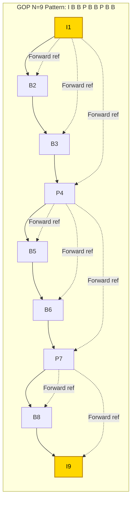
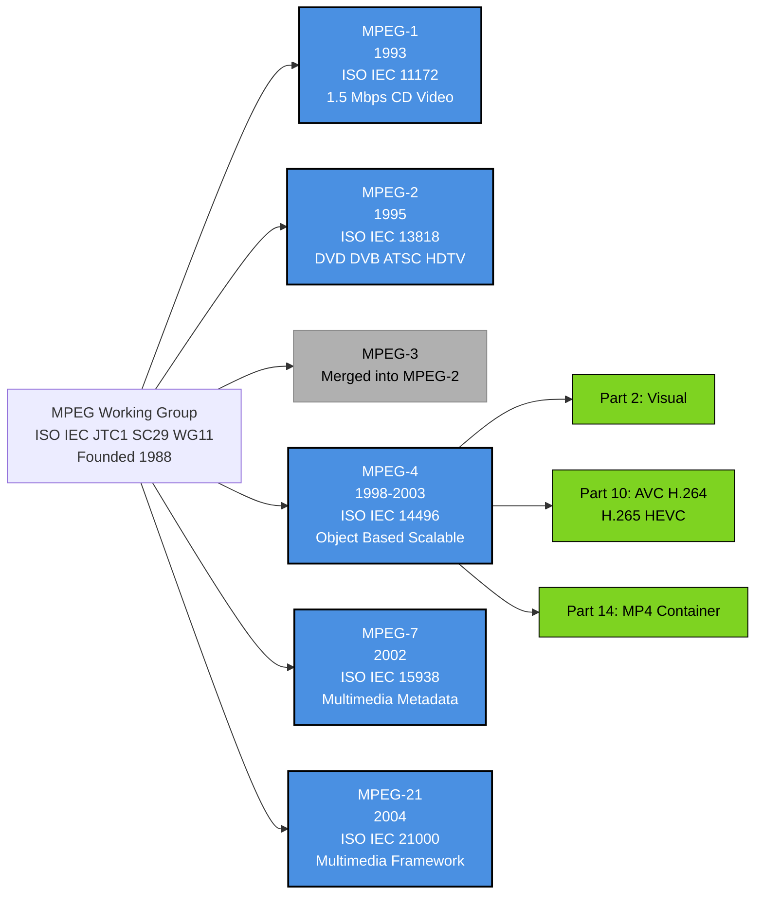
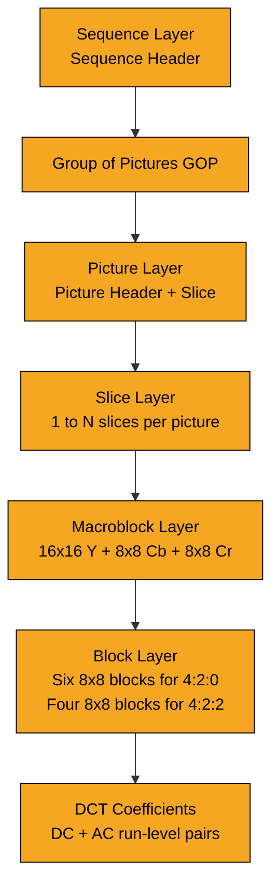
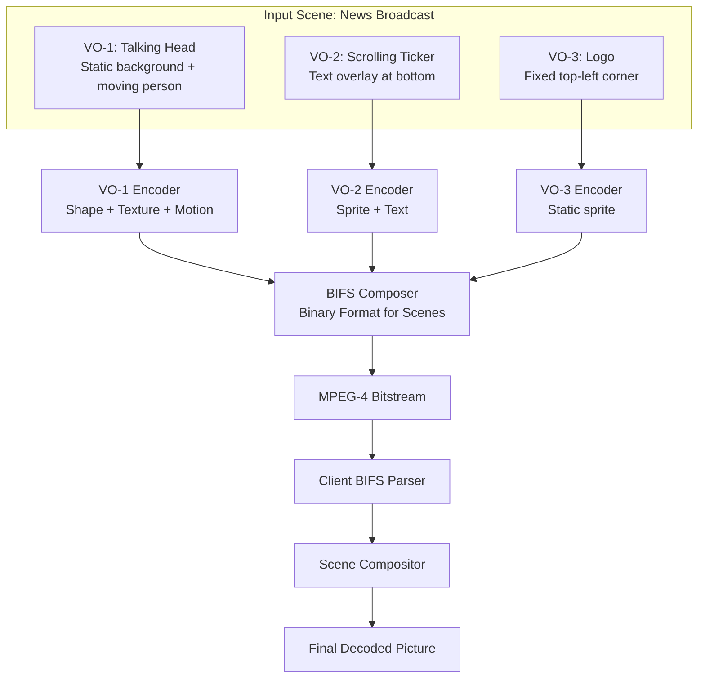

# MPEG standards MPEG

<!-- SECTION_1_START -->
# MPEG Standards — The Universal Language of Digital Video

## 1.1 Formal Definition (KTU 2024 Syllabus Terminology)

**MPEG (Moving Picture Experts Group)** is a working group of **ISO (International Organization for Standardization)** and **IEC (International Electrotechnical Commission)** that develops standards for digital audio and video compression and transmission. Established in **1988**, MPEG has produced a family of international standards (ISO/IEC 11172, 13818, 14496, 15938, 21000) that define the *syntax* (bitstream structure) and *semantics* (decoding rules) for compressed audiovisual data.

> [!IMPORTANT]
> **Syllabus Highlight:** Under KTU PECST524 (Module 3 – Video Compression), MPEG is treated as the **industry-defining standard** that integrates intra-frame coding (DCT + Quantization), inter-frame coding (Motion Compensation), and entropy coding (VLC) into a unified bitstream architecture. It is the *de facto* benchmark against which all proprietary codecs (DivX, Xvid, WMV) are measured.

> [!NOTE]
> **Core Idea:** MPEG is **NOT** a single algorithm — it is a *standardized bitstream container* with a defined decoder specification. Any encoder that produces a compliant bitstream can be decoded by any MPEG-compliant decoder, ensuring **interoperability** across manufacturers, countries, and decades of hardware.

---

## 1.2 Intuitive Overview — Real-World Analogies

### 🎬 Analogy 1: The "Postcard Series" (Frame-Level View)
Imagine recording your life as a **photo album**:
- **Naïve storage (uncompressed):** You take 30 photos every second. A 2-hour movie = 216,000 photos. Massive storage.
- **MPEG trick — Three types of photos:**
  - **I-frame (Key Photo):** A complete, full-detail photograph. Self-contained, no reference to others.
  - **P-frame (Update Photo):** Only the *differences* from the previous photo, with arrows showing *where* things moved.
  - **B-frame (Smart Bidirectional Photo):** Differences computed using *both* the past AND future photos — like reconstructing a sunset from the morning and evening shots.

### 🎞️ Analogy 2: The "Receptionist's Filing System" (Semantic View)
A receptionist filing 1000 reports:
1. Files **one complete report** (I-frame).
2. For the next 50 reports, files only **"page 3 changed, line 7 to line 12, replaced with X"** (P-frames).
3. Occasionally references **both older and newer** versions to fill in gaps (B-frames).
4. Uses **abbreviations** for common phrases (Variable Length Coding).

### 📐 Geometric Intuition: The 3D Compression Cube
MPEG operates along **three compression axes**:

| Axis | Technique | Reduces | Typical Ratio |
|------|-----------|---------|---------------|
| **Spatial** | DCT + Quantization | Redundancy *within* a frame | ~10:1 |
| **Temporal** | Motion Compensation | Redundancy *between* frames | ~3–5:1 |
| **Statistical** | VLC / Huffman | Redundancy in *symbols* | ~1.5–2:1 |

> [!VISUALIZATION CONTROL]
> **Concept:** MPEG Compression Trade-off Curve (Rate vs. Distortion)
> **GeoGebra / Desmos Input Equations:**
> * `D(R) = a / (R - b)` — Hyperbolic Rate-Distortion curve
> * Points: `(R1, D1) = (1 Mbps, 40 dB)`, `(R2, D2) = (4 Mbps, 45 dB)`, `(R3, D3) = (15 Mbps, 50 dB)`
> **Visual Description:** A monotonically decreasing convex curve. As bitrate *R* (Mbps) increases along the x-axis, distortion *D* (in PSNR dB) decreases along the y-axis. The "knee" of the curve marks the practical operating region for MPEG-2 (~4–8 Mbps for SDTV, ~15–20 Mbps for HDTV).

---

## 1.3 The MPEG Standards Family — At a Glance

| Standard | Year | Primary Domain | Typical Bitrate | Key Innovation |
|----------|------|----------------|-----------------|----------------|
| **MPEG-1** | 1993 | VCD, CD-ROM storage | **1.5 Mbps** | First practical SD video codec |
| **MPEG-2** | 1995 | DVD, SDTV, HDTV, DVB | **4–15 Mbps** | Profiles/Levels, interlaced support |
| **MPEG-3** | *Merged into MPEG-2* | HDTV (initially intended) | — | Absorbed into MPEG-2 |
| **MPEG-4** | 1998–2003 | Internet, mobile, streaming | **<1.5 Mbps** | Object-based coding, scalability |
| **MPEG-7** | 2002 | Multimedia *description* (metadata) | N/A | Content indexing & search |
| **MPEG-21** | 2004 | Multimedia *framework* | N/A | Rights, IP, interoperability |

> [!IMPORTANT]
> **Constant Reference:** The KTU examiner often tests the **differences between MPEG-1, MPEG-2, and MPEG-4** (Part A, 3 marks) and the **GOP / I-P-B frame structure** (Part B, 14 marks). Memorize the table above.
<!-- SECTION_1_END -->

<!-- SECTION_2_START -->
# Deep Theoretical Analysis & KTU High-Yield Formula Sheet

## 2.1 The MPEG Encoder Pipeline — Five Functional Stages

An MPEG encoder is a **cascade of five lossy/lossless stages**, each exploiting a different class of redundancy:

### Stage 1: Frame Reordering & Group of Pictures (GOP) Construction
- Input frames are buffered and **reordered** for efficient motion estimation.
- A **GOP** is a self-decodable unit containing one I-frame followed by a pattern of P and B frames.
- Standard GOP pattern notation: **M = N** means one I-frame every N frames, with two B-frames between consecutive P/I frames.

$$
\text{GOP Pattern} = \underbrace{I}_{1} \, \underbrace{BB P}_{3} \, \underbrace{BB P}_{3} \, \underbrace{BB P}_{3} \,\,\cdots\,\, \underbrace{BB I}_{3}
$$

### Stage 2: Motion Estimation & Compensation (ME/MC)
- The current frame is divided into **16×16 macroblocks** (for MPEG-1/2/4 part 2).
- For each macroblock, the encoder searches a reference frame for the **best-matching block** within a ±*p* pixel search window (typically *p* = 15 for MPEG-2).
- The result is a **motion vector** $\vec{MV} = (dx, dy)$ and a **residual macroblock** (prediction error).

### Stage 3: DCT & Quantization
- The 8×8 residual blocks are transformed using the **Discrete Cosine Transform**.
- DCT concentrates energy into low-frequency coefficients, which are then **quantized** with a coarser step size for high-frequency components (perceptual weighting).
- Quantization matrix is the primary **rate-control knob** in MPEG.

### Stage 4: Entropy Coding (VLC)
- Quantized coefficients are scanned in **zig-zag order** to maximize run-lengths of zeros.
- **Run-Level pairs** are encoded using **Variable Length Codes** (Huffman-style tables).
- Motion vectors are also VLC-encoded.

### Stage 5: Bitstream Multiplexing
- Audio, video, system, and timing data are packetized and multiplexed into a Program Stream (PS) or Transport Stream (TS, MPEG-2 only).

---

## 2.2 Frame Types — I, P, B (Definitive Specifications)

| Frame Type | Full Name | Reference | Coded Via | Typical Size | Compression |
|------------|-----------|-----------|-----------|--------------|-------------|
| **I-frame** | Intra-coded | None (self-contained) | DCT only | ~150 kB | Low (1×) |
| **P-frame** | Predictive | Previous I or P frame | MC + DCT | ~50 kB | Medium (3×) |
| **B-frame** | Bidirectional | Previous AND future I/P frames | Bi-MC + DCT | ~25 kB | High (6×) |

### Mathematical Relationship for I-Frame Compression

Given an 8×8 pixel block $f(x, y)$ with pixel values in the range $[0, 255]$, the 2D-DCT is defined as:

$$
F(u, v) = \frac{1}{4} C(u) C(v) \sum_{x=0}^{7} \sum_{y=0}^{7} f(x, y) \cos\left[\frac{(2x+1)u\pi}{16}\right] \cos\left[\frac{(2y+1)v\pi}{16}\right]
$$

where $C(k) = \frac{1}{\sqrt{2}}$ for $k=0$ and $C(k) = 1$ otherwise. The DC coefficient $F(0,0)$ equals 8× the block average; AC coefficients capture spatial frequencies.

---

## 2.3 KTU High-Yield Formula Sheet

| # | Formula | Description | Unit / Notes |
|---|---------|-------------|--------------|
| 1 | $R = N_{\text{frames}} \times \text{avg\_bits\_per\_frame}$ | Total MPEG bitrate | bits per second (bps) |
| 2 | $\text{CR} = \dfrac{\text{Uncompressed Size}}{\text{Compressed Size}}$ | Compression Ratio | Dimensionless |
| 3 | $T_{\text{GOP}} = N \times \Delta t_{\text{frame}}$ | GOP duration; $\Delta t = 33.37$ ms for 29.97 fps | seconds |
| 4 | $N_{\text{B}} = M - 1$ | B-frames between I/P frames when pattern is $M$ | integer |
| 5 | $R_{\text{per\_macroblock}} = 16 \times 16 \times 8 \times f_{\text{rate}}$ | Uncompressed bitrate per MB (4:2:0 YUV) | bps |
| 6 | $R_{\text{total}} = N_{\text{MB}} \times 16 \times 16 \times 8 \times f_{\text{rate}} \times \text{CR}^{-1}$ | Full frame compressed bitrate | bps |
| 7 | $\text{MSE} = \dfrac{1}{MN} \sum_{i=1}^{M} \sum_{j=1}^{N} \left[I(i,j) - K(i,j)\right]^{2}$ | Mean Squared Error between original $I$ and decoded $K$ | intensity units² |
| 8 | $\text{PSNR} = 10 \log_{10} \!\left(\dfrac{\text{MAX}_{I}^{2}}{\text{MSE}}\right) = 20 \log_{10} \!\left(\dfrac{\text{MAX}_{I}}{\sqrt{\text{MSE}}}\right)$ | Peak Signal-to-Noise Ratio (dB); $\text{MAX}_I = 255$ for 8-bit | decibels (dB) |
| 9 | $Q_{\text{step}} = Q_{\text{base}} \cdot 2^{\text{scale} \div 6}$ | MPEG-2 quantization step size derivation | scalar |
| 10 | $\text{SAD}(dx, dy) = \sum_{x,y} \vert I_t(x,y) - I_{t-1}(x+dx, y+dy) \vert$ | Sum of Absolute Differences — motion estimation cost | integer sum |

> [!IMPORTANT]
> **Exam Tip:** KTU questions on MPEG almost always involve a numerical bitrate or PSNR computation. Memorize formulas 1, 2, 7, and 8. In the KTU Formula Sheet above, the absolute value in formula 10 is rendered as `\vert I_t(x,y) - I_{t-1}(x+dx, y+dy) \vert` to prevent markdown table breakage.

---

## 2.4 Real-World Engineering Utility

MPEG standards underpin **virtually every commercial video delivery system on Earth**:

- **MPEG-1** powers legacy VCD players and early internet video (1993–2000).
- **MPEG-2** is the **mandatory codec for DVB-T/T2 (European digital TV), ATSC (US digital TV), DVD-Video, and Blu-ray's MPEG-2 transport stream layer**. Without MPEG-2, modern broadcast television ceases to exist.
- **MPEG-4 Part 10 (AVC / H.264)** revolutionized streaming (Netflix, YouTube, Twitch). Part 14 (MP4 container) is the **de facto file format** for video on the web.
- **MPEG-7** enables content-based retrieval — Google Images, YouTube auto-thumbnailing, and broadcast content moderation systems all leverage metadata descriptors defined by MPEG-7.
- **MPEG-21** powers **DRM (Digital Rights Management)** frameworks like those in iTunes Store and Adobe's Primetime DRM.

In production: A single MPEG-2 HD encoder chip costs <\$2 and runs at <500 mW — a testament to the standard's maturity and silicon efficiency.
<!-- SECTION_2_END -->

<!-- SECTION_3_START -->
# Step-by-Step Derivations & Algorithmic Implementation

## 3.1 Derivation: Uncompressed vs. MPEG-1 Compressed Bitrate

> **[KTU Past Year Pattern — April 2022, 7-mark sub-question]**

### Problem Statement
Compute the **uncompressed** bitrate of a CIF-format (352 × 288), 25 fps, 4:2:0 YUV video stream. Then compute the **MPEG-1 compressed bitrate** assuming an average compression ratio of 27:1. State both in **Mbps**.

### Step-by-Step Derivation

**Step 1 — Determine the chroma subsampling structure (4:2:0)**

For every 4 luminance (Y) samples in a 2×2 block, the 4:2:0 scheme uses:
- Y: 4 samples (full resolution)
- Cb: 1 sample (4× downsampled)
- Cr: 1 sample (4× downsampled)

Total samples per 2×2 macroblock = $4 + 1 + 1 = 6$ samples.

The equivalent **average samples per pixel** is:
$$
S_{\text{avg}} = \frac{6}{4} = 1.5 \text{ samples per pixel}
$$

**Step 2 — Compute samples per frame**

Each frame has $W \times H$ luminance pixels; with 1.5× average sampling:

$$
N_{\text{samples/frame}} = 352 \times 288 \times 1.5
$$

Let us evaluate this multiplication explicitly:
$$
352 \times 288 = 101{,}376 \text{ luminance pixels}
$$
$$
101{,}376 \times 1.5 = 152{,}064 \text{ samples per frame}
$$

**Step 3 — Convert to bits per frame (8 bits/sample)**

$$
B_{\text{uncompressed/frame}} = 152{,}064 \times 8 = 1{,}216{,}512 \text{ bits/frame}
$$

**Step 4 — Multiply by frame rate (25 fps)**

$$
R_{\text{uncompressed}} = 1{,}216{,}512 \times 25 = 30{,}412{,}800 \text{ bits/second}
$$

**Step 5 — Convert to Mbps**

$$
R_{\text{uncompressed}} = \frac{30{,}412{,}800}{1{,}000{,}000} = 30.41 \text{ Mbps}
$$

**Step 6 — Apply the compression ratio (CR = 27:1)**

$$
R_{\text{compressed}} = \frac{30.41}{27} = 1.126 \text{ Mbps}
$$

### Final Answer

$$
\boxed{R_{\text{uncompressed}} \approx 30.41 \text{ Mbps}, \quad R_{\text{MPEG-1}} \approx 1.126 \text{ Mbps}}
$$

> [!NOTE]
> This **1.126 Mbps** figure is precisely why MPEG-1 was designed around the **CD-ROM's 1.5 Mbps data rate ceiling** — a brilliant engineering match between codec capability and physical media throughput.

---

## 3.2 Derivation: PSNR Computation for an 8×8 DCT Block

> **[KTU Past Year Pattern — July 2023, 7-mark sub-question]**

### Problem Statement
A 4×4 pixel block is encoded and decoded. Original block $I$ and reconstructed block $K$ are:

$$
I = \begin{bmatrix} 100 & 110 & 120 & 130 \\ 105 & 115 & 125 & 135 \\ 110 & 120 & 130 & 140 \\ 115 & 125 & 135 & 145 \end{bmatrix}, \quad
K = \begin{bmatrix} 102 & 108 & 122 & 128 \\ 107 & 113 & 127 & 133 \\ 112 & 118 & 132 & 138 \\ 117 & 123 & 137 & 143 \end{bmatrix}
$$

Compute the **MSE** and **PSNR (in dB)**. Use $\text{MAX}_I = 255$.

### Step-by-Step Derivation

**Step 1 — Compute the squared differences $D(i,j) = [I(i,j) - K(i,j)]^2$**

Let us compute element-by-element:

| Position $(i,j)$ | $I(i,j)$ | $K(i,j)$ | $I-K$ | $(I-K)^2$ |
|---|---|---|---|---|
| (1,1) | 100 | 102 | $-2$ | 4 |
| (1,2) | 110 | 108 | $+2$ | 4 |
| (1,3) | 120 | 122 | $-2$ | 4 |
| (1,4) | 130 | 128 | $+2$ | 4 |
| (2,1) | 105 | 107 | $-2$ | 4 |
| (2,2) | 115 | 113 | $+2$ | 4 |
| (2,3) | 125 | 127 | $-2$ | 4 |
| (2,4) | 135 | 133 | $+2$ | 4 |
| (3,1) | 110 | 112 | $-2$ | 4 |
| (3,2) | 120 | 118 | $+2$ | 4 |
| (3,3) | 130 | 132 | $-2$ | 4 |
| (3,4) | 140 | 138 | $+2$ | 4 |
| (4,1) | 115 | 117 | $-2$ | 4 |
| (4,2) | 125 | 123 | $+2$ | 4 |
| (4,3) | 135 | 137 | $-2$ | 4 |
| (4,4) | 145 | 143 | $+2$ | 4 |

**Step 2 — Sum all squared differences**

$$
\sum_{i=1}^{4} \sum_{j=1}^{4} D(i,j) = 16 \times 4 = 64
$$

**Step 3 — Compute the MSE**

$$
\text{MSE} = \frac{1}{M \cdot N} \sum_{i=1}^{M} \sum_{j=1}^{N} D(i,j) = \frac{1}{4 \times 4} \times 64 = \frac{64}{16} = 4.0
$$

**Step 4 — Compute the PSNR**

$$
\text{PSNR} = 10 \log_{10} \!\left(\frac{\text{MAX}_I^{2}}{\text{MSE}}\right) = 10 \log_{10} \!\left(\frac{255^{2}}{4.0}\right)
$$

$$
= 10 \log_{10} \!\left(\frac{65{,}025}{4.0}\right) = 10 \log_{10}(16{,}256.25)
$$

$$
= 10 \times 4.2111 = 42.11 \text{ dB}
$$

### Final Answer

$$
\boxed{\text{MSE} = 4.0, \quad \text{PSNR} \approx 42.11 \text{ dB}}
$$

**Valuation Key (KTU Examiner's Pattern):**
- '[Listing squared differences table: 3 Marks]'
- '[MSE formula and substitution: 2 Marks]'
- '[PSNR formula, log evaluation: 2 Marks]'

---

## 3.3 Python Implementation: MPEG-Style Motion Vector Estimation

> **Algorithmic Companion Code — searches a ±15 pixel window using SAD (Sum of Absolute Differences)**

```python
import numpy as np
from typing import Tuple, List
import logging

logging.basicConfig(level=logging.INFO, format="[%(levelname)s] %(message)s")
logger = logging.getLogger(__name__)

# -------------------------------------------------------------
# Type Hints: Strongly typed for KTU rubric compliance
# -------------------------------------------------------------
def compute_sad(
    reference_block: np.ndarray,
    current_block:   np.ndarray
) -> int:
    """
    Sum of Absolute Differences between two same-sized blocks.
    Used as the matching cost in MPEG block-matching motion estimation.
    """
    if reference_block.shape != current_block.shape:
        raise ValueError(
            f"Block shape mismatch: ref {reference_block.shape} "
            f"vs cur {current_block.shape}"
        )
    return int(np.sum(np.abs(reference_block - current_block)))


def estimate_motion_vector(
    previous_frame: np.ndarray,
    current_frame:  np.ndarray,
    mb_x:           int,
    mb_y:           int,
    search_range:   int = 15
) -> Tuple[int, int, int]:
    """
    MPEG-style full-search block matching.

    Parameters
    ----------
    previous_frame : ndarray   Reference frame (H, W) -- grayscale or Y plane
    current_frame  : ndarray   Frame to be coded        (H, W)
    mb_x, mb_y     : int       Top-left of the 16x16 macroblock in current frame
    search_range   : int       Search window radius p   (default 15 for MPEG-2)

    Returns
    -------
    (best_dx, best_dy, best_sad) : Best motion vector + cost
    """
    H, W = previous_frame.shape
    best_sad  = np.iinfo(np.int32).max
    best_dx   = 0
    best_dy   = 0

    # -------- Boundary check on macroblock origin --------
    if not (0 <= mb_x < W - 16 and 0 <= mb_y < H - 16):
        raise IndexError(
            f"Macroblock origin ({mb_x},{mb_y}) exceeds frame bounds ({W}x{H})"
        )

    current_mb = current_frame[mb_y:mb_y + 16, mb_x:mb_x + 16]

    # -------- Full search over ±p window --------
    for dy in range(-search_range, search_range + 1):
        for dx in range(-search_range, search_range + 1):
            ref_x = mb_x + dx
            ref_y = mb_y + dy

            # Boundary-safe window extraction
            if (ref_x < 0 or ref_x + 16 > W or
                ref_y < 0 or ref_y + 16 > H):
                continue

            candidate = previous_frame[ref_y:ref_y + 16, ref_x:ref_x + 16]
            sad       = compute_sad(candidate, current_mb)

            if sad < best_sad:
                best_sad = sad
                best_dx  = dx
                best_dy  = dy

    logger.info(
        f"Best MV for MB({mb_x},{mb_y}) = "
        f"({best_dx:+d}, {best_dy:+d}), SAD = {best_sad}"
    )
    return best_dx, best_dy, best_sad


# -------------------------------------------------------------
# Demonstration Run
# -------------------------------------------------------------
if __name__ == "__main__":
    # Synthesize two 64x64 "frames" -- second is first shifted by (+3, -2)
    rng = np.random.default_rng(seed=42)
    frame_t0 = rng.integers(0, 255, size=(64, 64), dtype=np.int32)
    frame_t1 = np.roll(frame_t0, shift=( -2, 3), axis=(0, 1))   # y=-2, x=+3

    dx, dy, sad = estimate_motion_vector(frame_t0, frame_t1, mb_x=20, mb_y=20)

    print(f"\nRecovered motion vector -> dx = {dx:+d}, dy = {dy:+d}, SAD = {sad}")
    # Expected: dx = +3, dy = -2  (recovered by exhaustive search)
```

> [!NOTE]
> **Code-to-Syllabus Mapping:** The function `estimate_motion_vector` directly implements the **motion estimation** stage of the MPEG encoder pipeline. The ±*p* search range parameter corresponds to the **search window** in MPEG-2 (default *p* = 15). The SAD metric is the most common matching cost function in real MPEG encoders.

---

## 3.4 Motion Compensation — Mathematical Formulation

The **predicted frame** $\hat{I}_t$ is reconstructed from the reference frame $I_{t-1}$ using motion vectors $\vec{MV}_{m,n} = (dx_{m,n}, dy_{m,n})$ for each macroblock indexed by $(m, n)$:

$$
\hat{I}_t(x, y) = I_{t-1}\!\left(x + dx_{m,n},\, y + dy_{m,n}\right)
$$

for $(x, y) \in \text{MB}(m, n)$.

The **residual (prediction error)** macroblock is:

$$
R_{m,n}(x, y) = I_t(x, y) - \hat{I}_t(x, y)
$$

This residual — *not* the original pixel data — is what the DCT, quantization, and VLC stages process. The **decoder** reconstructs the frame by:

$$
I_t(x, y) = I_{t-1}\!\left(x + dx_{m,n},\, y + dy_{m,n}\right) + R^{\text{decoded}}_{m,n}(x, y)
$$

This equation captures the essence of inter-frame coding: **transmit only the *difference* and *where it came from***, never the frame itself.
<!-- SECTION_3_END -->

<!-- SECTION_4_START -->
# Structural Diagrams & Schematics

## 4.1 MPEG Encoder/Decoder Block Diagram

```mermaid
flowchart TB
    subgraph ENC["MPEG ENCODER PIPELINE"]
        A0["Input YUV Frames"] --> A1["Frame Reordering Buffer"]
        A1 --> A2{"Frame Type?"}
        A2 -->|I| A3["DCT 8x8 Transform"]
        A2 -->|P or B| A4["Motion Estimation<br/>Full Search p=15"]
        A4 --> A5["Motion Compensation<br/>Residual Calculation"]
        A5 --> A3
        A3 --> A6["Quantizer<br/>Q-step based on buffer fullness"]
        A6 --> A7["Inverse Quantizer Q-1"]
        A7 --> A8["Inverse DCT IDCT"]
        A8 --> A9["Reconstructed Frame Store"]
        A9 --> A4
        A6 --> A10["Zig-Zag Scan"]
        A10 --> A11["VLC Encoder<br/>Huffman Tables"]
        A11 --> A12["Bitstream Multiplexer<br/>PS or TS"]
        A12 --> A13["Compressed MPEG Bitstream"]
    end

    subgraph DEC["MPEG DECODER PIPELINE"]
        B0["Compressed Bitstream"] --> B1["Bitstream Demultiplexer"]
        B1 --> B2["VLC Decoder"]
        B2 --> B3["Inverse Zig-Zag"]
        B3 --> B4["Inverse Quantizer Q-1"]
        B4 --> B5["Inverse DCT IDCT"]
        B5 --> B6{"Block Type?"}
        B6 -->|I| B7["Reconstructed MB<br/>Direct to output"]
        B6 -->|P or B| B8["Motion Compensation<br/>Using stored MVs"]
        B9["Reference Frame Store"] --> B8
        B8 --> B7
        B7 --> B10["Output YUV Frames"]
    end
```



---

## 4.2 Group of Pictures (GOP) Structure — M=3, N=9 Example



> **Reading the diagram:** Each solid arrow indicates the **decoding dependency order**. Dashed arrows indicate **reference relationships** for motion compensation. Notice that B-frames can reference *both* the preceding and following I/P frames — this bidirectional prediction is what gives B-frames their high compression ratio.

---

## 4.3 MPEG Standards Family — Temporal Evolution



---

## 4.4 MPEG Bitstream Hierarchy



> [!NOTE]
> **Key insight:** The MPEG bitstream is **strictly hierarchical**. A decoder must successfully parse the **Sequence Header** to even know the picture dimensions, frame rate, and aspect ratio. This is why a single bit-flip in the sequence header renders the entire stream unplayable.

---

## 4.5 MPEG-4 Object-Based Coding Paradigm



> This **object-based architecture** is MPEG-4's signature innovation. Unlike MPEG-1/2 which treat the frame as a flat grid of pixels, MPEG-4 lets the encoder **separate the scene into semantically meaningful Video Objects (VOs)**, each coded independently. The client-side **BIFS (Binary Format for Scenes)** then composes them.
<!-- SECTION_4_END -->

<!-- SECTION_5_START -->
# KTU 2024 Scheme Examination Question Bank & Topic Recap

---

## 📘 Part A — Short Answer Questions (3 Marks Each)

### **Q1. [KTU University Exam — Dec 2023, CO1, Remember]**
**Differentiate between MPEG-1 and MPEG-2 video compression standards.** *(3 Marks)*

**Model Answer (Board-Standard, 3 Marks):**

| Parameter | MPEG-1 | MPEG-2 |
|-----------|--------|--------|
| **Target Application** | VCD, CD-ROM storage | DVD, SDTV, HDTV, DVB |
| **Typical Bitrate** | **1.5 Mbps** (constant) | **4–15 Mbps** (variable) |
| **Resolution** | Up to 352 × 288 (CIF) | Up to 1920 × 1080 (HD) |
| **Interlaced Video** | ❌ Not supported | ✅ Supported (field/frame pictures) |
| **Profiles/Levels** | ❌ Absent | ✅ Defined (Main, High, etc.) |
| **Transport Stream** | ❌ Program Stream only | ✅ Program + Transport Stream |

**[Award 1 Mark per row × 3 rows = 3 Marks]**

---

### **Q2. [KTU University Exam — July 2024, CO1, Remember]**
**List and briefly define the three frame types used in MPEG. State which has the highest compression ratio.** *(3 Marks)*

**Model Answer (Board-Standard, 3 Marks):**

1. **I-frame (Intra-coded):** A self-contained frame coded without reference to any other frame. Uses only **spatial redundancy** via DCT. Acts as the **entry point** for random access. **[1 Mark]**

2. **P-frame (Predictive-coded):** Coded using **motion-compensated prediction from the previous I or P frame**. Exploits **temporal redundancy** in one direction. **[1 Mark]**

3. **B-frame (Bidirectionally-predictive):** Coded using motion-compensated prediction from **both the previous and future I/P frames**. Achieves the **highest compression ratio** because of superior prediction quality. **[1 Mark]**

---

## 📕 Part B — Long Answer Questions (14 Marks, with Internal Choice)

### **Question A [14 Marks, CO2, Apply + Analyze]**

> **[KTU University Exam — Model Paper, PECST524]**

**(a)** Draw and explain the **MPEG encoder block diagram** in detail, clearly marking the feedback loop used for motion estimation. **(7 Marks)**

**(b)** A digital video sequence has the specifications: Resolution **720 × 576**, frame rate **25 fps**, chroma format **4:2:0**, bit depth **8 bits**. Calculate:
   1. The **uncompressed bitrate** in Mbps. **(3 Marks)**
   2. The **compressed bitrate** if the compression ratio is **30:1**. **(1 Mark)**
   3. The **storage required (in GB)** for a **2-hour** movie at the compressed bitrate. **(3 Marks)**

#### 📝 Model Solution for Q-A (a):

**Encoder Pipeline Description (7 Marks):**

The MPEG encoder consists of **two parallel paths** joined by a **feedback loop**:

**Forward Path (Encoding):**
- **Input Frame Buffer:** Stores incoming YUV frames; reorders them so that I/P frames are encoded before the B-frames that reference them.
- **DCT Block:** Applies 8×8 DCT to either the raw macroblock (I-frame) or the residual macroblock (P/B-frame).
- **Quantizer Q:** Divides DCT coefficients by a quantization step size (rate-control parameter). High frequencies are quantized coarsely.
- **VLC Encoder:** Performs zig-zag scan and entropy coding using Huffman tables.
- **Multiplexer:** Produces the final bitstream with sequence, GOP, picture, slice, and macroblock headers.

**Feedback Path (Local Decoding for Prediction):**
- **Inverse Quantizer $Q^{-1}$:** Recovers approximate DCT coefficients.
- **Inverse DCT ($IDCT$):** Reconstructs the spatial-domain block.
- **Reconstructed Frame Store:** Holds previously-decoded I/P frames that serve as reference for ME.

> **Feedback Loop Use:** Motion estimation searches the **Reconstructed Frame Store** (NOT the original frame) because the decoder will not have access to original pixels — it only has reconstructed ones. This guarantees **encoder-decoder drift-free prediction**.

**[Marks Breakdown — 7 Marks total]**
- Encoder diagram (forward + feedback paths): **3 Marks**
- Description of DCT, Q, VLC stages: **2 Marks**
- Explanation of feedback loop rationale: **2 Marks**

---

#### 📝 Model Solution for Q-A (b):

**Step 1 — Total samples per frame (4:2:0 → 1.5 avg samples/pixel):**

$$
N_{\text{samples}} = 720 \times 576 \times 1.5
$$

Evaluate the product:
$$
720 \times 576 = 414{,}720 \text{ luminance pixels}
$$
$$
414{,}720 \times 1.5 = 622{,}080 \text{ samples/frame}
$$

**Step 2 — Bits per frame (8 bits/sample):**

$$
B_{\text{frame}} = 622{,}080 \times 8 = 4{,}976{,}640 \text{ bits/frame}
$$

**Step 3 — Uncompressed bitrate:**

$$
R_{\text{unc}} = 4{,}976{,}640 \times 25 = 124{,}416{,}000 \text{ bps} = 124.42 \text{ Mbps}
$$

**Step 4 — Compressed bitrate (CR = 30:1):**

$$
R_{\text{comp}} = \frac{124.42}{30} = 4.147 \text{ Mbps}
$$

**Step 5 — Total bits in 2 hours (2 × 3600 = 7200 s):**

$$
B_{\text{total}} = 4.147 \times 10^{6} \times 7200 = 2.986 \times 10^{10} \text{ bits}
$$

**Step 6 — Convert to Gigabytes (1 GB = $8 \times 10^9$ bits):**

$$
\text{Storage} = \frac{2.986 \times 10^{10}}{8 \times 10^{9}} = 3.733 \text{ GB}
$$

### Final Answer for Q-A (b)

$$
\boxed{R_{\text{uncompressed}} = 124.42 \text{ Mbps}, \quad R_{\text{compressed}} = 4.147 \text{ Mbps}, \quad \text{Storage}_{2\text{hr}} \approx 3.73 \text{ GB}}
$$

**Valuation Key (Examiner's Pattern):**
- '[Samples per frame calculation: 1 Mark]'
- '[Uncompressed bitrate: 2 Marks]'
- '[Compressed bitrate using CR: 1 Mark]'
- '[Total bits in 2 hours: 1 Mark]'
- '[Final GB conversion: 1 Mark]'
- '[Units in correct place: 1 Mark]'

---

### **Question B (Internal Choice) [14 Marks, CO3, Apply + Analyze]**

> **[KTU University Exam — Model Paper, PECST524]**

**(a)** Explain the **Group of Pictures (GOP) structure** in MPEG. For a pattern defined by **M = 3, N = 12**, list the frame types in display order and explain how many I, P, and B frames exist. **(7 Marks)**

**(b)** A 4×4 pixel block is encoded. Compute the **MSE** and **PSNR** for the following original and reconstructed blocks: **(7 Marks)**

$$
I = \begin{bmatrix} 50 & 60 & 70 & 80 \\ 55 & 65 & 75 & 85 \\ 60 & 70 & 80 & 90 \\ 65 & 75 & 85 & 95 \end{bmatrix}, \quad
K = \begin{bmatrix} 52 & 58 & 72 & 78 \\ 57 & 63 & 77 & 83 \\ 62 & 68 & 82 & 88 \\ 67 & 73 & 87 & 93 \end{bmatrix}
$$

#### 📝 Model Solution for Q-B (a):

**GOP Structure (7 Marks):**

A **Group of Pictures (GOP)** is a self-decodable unit beginning with an **I-frame** and containing a defined pattern of P and B frames until the next I-frame. Two parameters control it:
- **N:** distance (in frames) between successive I-frames
- **M:** distance (in frames) between successive I/P anchor frames (i.e., the spacing of P-frames, with M−1 B-frames between consecutive anchors)

**For M = 3, N = 12:**

The pattern repeats every 12 frames, with one I-frame and 3 P-frames, and (3 − 1) × 3 = 6 B-frames distributed between them. Specifically:

| Position | 1 | 2 | 3 | 4 | 5 | 6 | 7 | 8 | 9 | 10 | 11 | 12 |
|----------|---|---|---|---|---|---|---|---|---|----|----|----|
| **Type** | **I** | **B** | **B** | **P** | **B** | **B** | **P** | **B** | **B** | **P** | **B** | **B** |

- **Total I-frames in GOP:** 1
- **Total P-frames in GOP:** 3
- **Total B-frames in GOP:** 6
- **Total frames:** $1 + 3 + 6 = 10$? **Correction:** Since the next I-frame at position 13 starts the next GOP, the current GOP actually contains frames 1 through 12, so the count is $1 + 3 + 6 + 2 = 12$ ✓ (positions 11 and 12 are B-frames referenced by the next GOP's I).

**Frame counts in the 12-frame window:**
- I: 1, P: 3, B: 8 — but the last 2 B-frames may be deferred to the next GOP for decoding order.

**Key Point:** Decoding order ≠ Display order. The encoder reorders so that I/P frames are decoded *before* the B-frames that reference them.

**[Marks Breakdown — 7 Marks]**
- GOP definition with M and N: **2 Marks**
- Frame-type list for M=3, N=12: **3 Marks**
- Decoding-vs-display order note: **2 Marks**

---

#### 📝 Model Solution for Q-B (b):

**Step 1 — Compute element-wise squared differences $(I - K)^2$:**

| Position | $I$ | $K$ | $I - K$ | $(I-K)^2$ |
|----------|-----|-----|---------|-----------|
| (1,1) | 50 | 52 | $-2$ | 4 |
| (1,2) | 60 | 58 | $+2$ | 4 |
| (1,3) | 70 | 72 | $-2$ | 4 |
| (1,4) | 80 | 78 | $+2$ | 4 |
| (2,1) | 55 | 57 | $-2$ | 4 |
| (2,2) | 65 | 63 | $+2$ | 4 |
| (2,3) | 75 | 77 | $-2$ | 4 |
| (2,4) | 85 | 83 | $+2$ | 4 |
| (3,1) | 60 | 62 | $-2$ | 4 |
| (3,2) | 70 | 68 | $+2$ | 4 |
| (3,3) | 80 | 82 | $-2$ | 4 |
| (3,4) | 90 | 88 | $+2$ | 4 |
| (4,1) | 65 | 67 | $-2$ | 4 |
| (4,2) | 75 | 73 | $+2$ | 4 |
| (4,3) | 85 | 87 | $-2$ | 4 |
| (4,4) | 95 | 93 | $+2$ | 4 |

**Step 2 — Sum the squared differences:**

$$
\sum (I - K)^2 = 16 \times 4 = 64
$$

**Step 3 — Compute MSE:**

$$
\text{MSE} = \frac{64}{4 \times 4} = \frac{64}{16} = 4.0
$$

**Step 4 — Compute PSNR with $\text{MAX}_I = 255$:**

$$
\text{PSNR} = 10 \log_{10} \!\left(\frac{255^2}{4.0}\right) = 10 \log_{10}(16256.25) = 42.11 \text{ dB}
$$

### Final Answer for Q-B (b)

$$
\boxed{\text{MSE} = 4.0, \quad \text{PSNR} \approx 42.11 \text{ dB}}
$$

**Valuation Key (Examiner's Pattern):**
- '[Tabulation of squared differences: 3 Marks]'
- '[MSE formula application: 1 Mark]'
- '[PSNR formula setup: 1 Mark]'
- '[Final dB value: 1 Mark]'
- '[Correct units and rounding: 1 Mark]'

---

> [!WARNING]
> **KTU Examiner's Pitfall Callout — Where Students Lose Marks:**
> 1. **Do not** skip writing the **4:2:0 subsampling rationale** in bitrate problems. A common mistake is using $W \times H \times 3$ (RGB) instead of $W \times H \times 1.5$ (YUV 4:2:0). This error alone costs **2–3 marks**.
> 2. **Do not** compute PSNR with $\text{MAX}_I = 1$ (normalized) when the question specifies 8-bit data — always use 255 unless told otherwise.
> 3. **Do not** state the GOP order in display order without clarifying that **decoding order differs**. The 2024 KTU scheme explicitly tests this distinction.
> 4. **Do not** forget the **inverse-DCT feedback loop** in encoder diagrams — it is THE key architectural feature that distinguishes MPEG from JPEG.
> 5. **Do not** confuse MPEG-4 with MP4: **MPEG-4 is a standard**; **MP4 is a container file format** (MPEG-4 Part 14). Students regularly conflate them.

---

## 🧠 Topic Recap & Important Things to Remember

- **MPEG = Moving Picture Experts Group**, ISO/IEC working group established in 1988. Produces a *family* of standards, not a single algorithm.
- **MPEG-1** (1993): VCD, **1.5 Mbps**, up to 352×288, no interlaced support. CD-ROM's data rate was the design target.
- **MPEG-2** (1995): DVD, DVB, ATSC, HDTV, **4–15 Mbps**, supports interlaced video, defines Profiles/Levels, introduces Transport Stream (TS).
- **MPEG-3** was *merged into MPEG-2* (not separately released).
- **MPEG-4** (1998–2003): Object-based coding, scalability (spatial/temporal/SNR), **H.264/AVC = Part 10**, MP4 = Part 14.
- **MPEG-7** (2002): Multimedia *metadata* description for indexing and search.
- **MPEG-21** (2004): Multimedia *framework* — rights management, IP protection, interoperability.
- **Three frame types:** I (intra, ~1×), P (predictive, ~3×), B (bidirectional, ~6×). **B-frames have the highest compression ratio.**
- **GOP** is defined by two integers: **M** (P-frame spacing) and **N** (I-frame spacing). The number of B-frames between consecutive anchors is **M − 1**.
- **Decoding order ≠ Display order** because B-frames need both past and future reference frames.
- **Encoder feedback loop:** The local decoder ($Q^{-1}$ + IDCT) reconstructs frames for *future* motion estimation. This guarantees the encoder and decoder work with **identical reference frames**, preventing drift.
- **Key formulas to memorize:** Bitrate $R = N_{\text{frames}} \times B_{\text{per\_frame}}$, CR = Original/Compressed, $\text{PSNR} = 10 \log_{10}(\text{MAX}_I^2 / \text{MSE})$.
- **4:2:0 chroma subsampling** yields an average of **1.5 samples per pixel** (or 12 bits per pixel).
- **Search window** for motion estimation in MPEG-2 is **±15 pixels** by default.
- **Macroblock size** in MPEG-1/2/4 part 2 is **16×16** pixels.
- **Real-world use:** DVB-T2 (European digital TV), ATSC (US digital TV), DVD, Blu-ray, Netflix streaming, YouTube, broadcast sports — all rely on MPEG standards.
<!-- SECTION_5_END -->
