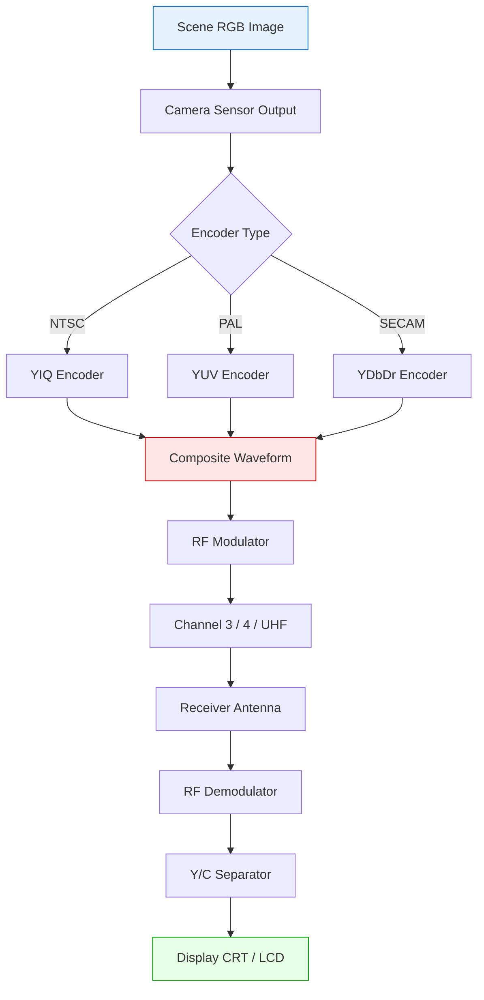
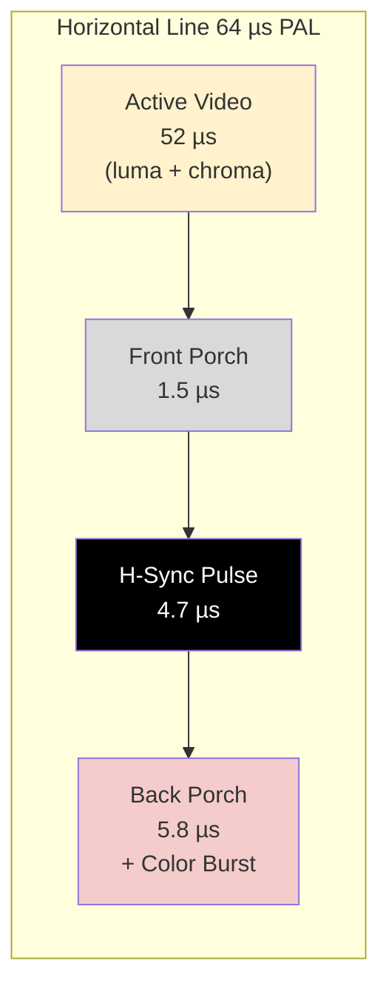
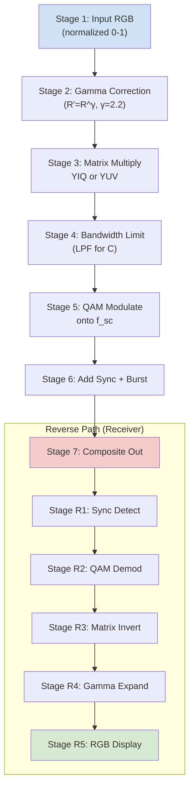
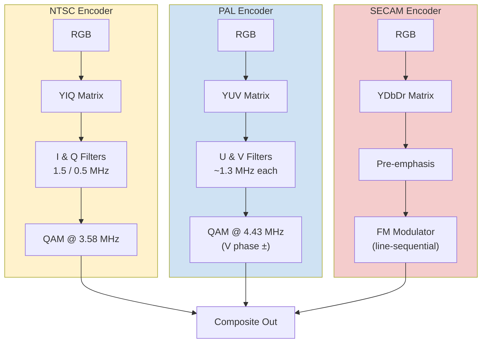
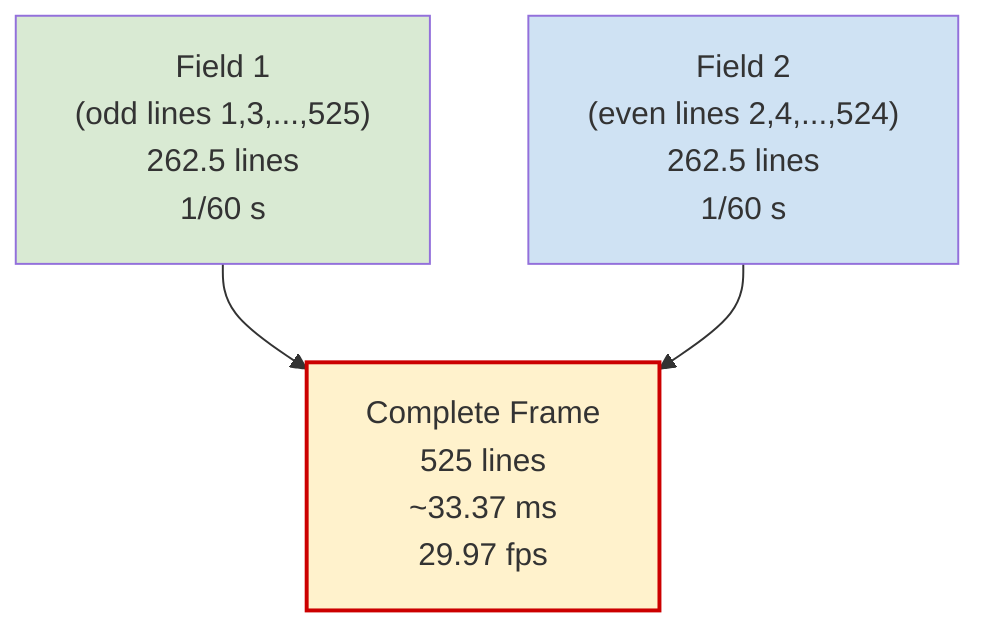

# Video Compression - Analog video

<!-- SECTION_1_START -->
# Analog Video — The Foundation of Video Compression

> [!NOTE]
> **KTU 2024 Syllabus Anchor (PECST524 | Module 3):** *Analog Video — color spaces (RGB, YIQ, YUV, YD<sub>B</sub>D<sub>R</sub>), component vs composite video, NTSC/PAL/SECAM standards, interlaced scanning, and the transition to digital compression.*

## 1.1 Formal Academic Definition

**Analog video** is a continuous, time-varying electrical representation of visual information in which the brightness (*luminance*) and color (*chrominance*) of each point in a scene are encoded as smoothly varying voltage levels along a 1-D signal. Unlike digital video, which samples the scene into a discrete grid of pixels, analog video is fundamentally a **continuous waveform** described by an infinite-precision function of time.

Mathematically, an analog video signal is a scalar (or vector) function $V(t)$ such that:

$$V(t) = Y(t) + C(t)$$

where $Y(t)$ is the **luminance** component (brightness only) and $C(t)$ is the **chrominance** component (color information). In broadcast standards, these two are combined into a single composite waveform to save bandwidth on the legacy RF channel.

> [!IMPORTANT]
> **Core Idea for Compression:** Every modern digital video codec (MPEG-2, H.264, HEVC, VVC) is built on top of concepts pioneered for analog television. Understanding the *Y/C separation* and the *human visual system's lower sensitivity to color detail* is what makes lossy chroma-subsampling (4:2:0, 4:2:2) work.

## 1.2 Intuitive Analogy — "Painting on a Long Ribbon"

Imagine you are **painting a scene on one extremely long, thin ribbon of paper** instead of a canvas. You start at the top-left of the scene and draw a single horizontal line across, then snap back slightly lower and draw the next line. By the time you reach the bottom, you have recreated the entire picture — but the "painting" itself is just **one continuous stripe of brushstrokes**.

That ribbon is your analog video signal:
- The **brush pressure** at any moment = the **brightness** of that tiny point.
- The **paint color** at any moment = the **chroma**.
- The **left-to-right speed** at which you draw = the **line rate** (~15,625 lines/sec for PAL).
- The **time taken to complete the whole ribbon** = the **frame rate** (25 or 30 fps).

A TV simply unrolls this ribbon in sync and shines light through it. The "trick" of compression is that your eye (the viewer) is **far more sensitive to pressure (brightness) than to color (paint hue)** — so we can blur the color information and still think the picture looks fine.

> [!TIP]
> **Key Standards at a Glance**
>
> | Standard | Region | Frame Rate | Lines/Frame | Color Model |
> |---|---|---|---|---|
> | **NTSC** | USA, Japan | **29.97 fps** | 525 | **YIQ** |
> | **PAL** | Europe, India | **25 fps** | 625 | **YUV** |
> | **SECAM** | France, Russia | **25 fps** | 625 | **Y D<sub>B</sub> D<sub>R</sub>** |

## 1.3 GeoGebra Visualization — The Luminance Waveform

> [!VISUALIZATION CONTROL]
> **Concept:** Composite video waveform — Luminance with color burst
> **GeoGebra / Desmos Input Equations:**
> * `Y(t) = 0.5 + 0.4·sin(2π·(2)·t) + 0.1·sin(2π·(15)·t)`  ← horizontal sync pulses
> * `Burst(t) = 0.2·sin(2π·(3.58)·t) · pulseTrain(t)` ← NTSC color burst at **3.579545 MHz**
> * `Composite(t) = Y(t) + Burst(t)`
>
> **Visual Description:** A periodic waveform running along the t-axis. You will see broad, smooth brightness variations (the actual picture content) with **sharp negative-going sync pulses** and a small high-frequency **color burst** packet sitting on the back porch of each horizontal blanking interval. This single waveform is everything the analog TV needs to reconstruct the picture.

---

## 1.4 Fundamental Physical Parameters (Must Memorize)

> [!IMPORTANT]
> The following constants appear in **every KTU question** on analog video. Memorize them with units.
>
> * **NTSC Color Subcarrier Frequency:** $f_{sc} = 3.579545\,455\,\text{MHz}$ (often written $3.58\,\text{MHz}$)
> * **PAL Color Subcarrier Frequency:** $f_{sc} = 4.433618\,75\,\text{MHz}$ (often written $4.43\,\text{MHz}$)
> * **NTSC Horizontal Line Rate:** $f_H = 15\,734.264\,\text{Hz}$
> * **PAL Horizontal Line Rate:** $f_H = 15\,625\,\text{Hz}$
> * **NTSC Field Rate:** $f_V = 59.94\,\text{Hz}$ (interlaced)
> * **PAL Field Rate:** $f_V = 50\,\text{Hz}$ (interlaced)
> * **Total NTSC Video Bandwidth:** $\approx 4.2\,\text{MHz}$ luminance + $\approx 1.5\,\text{MHz}$ chroma
> * **Aspect Ratio (standard definition):** $4:3$ (SDTV) or $16:9$ (EDTV/HDTV)

<!-- SECTION_1_END -->

<!-- SECTION_2_START -->
# Deep Theoretical Analysis & KTU High-Yield Formula Sheet

## 2.1 Anatomy of an Analog Video Signal

An analog television signal is **not** a single quantity — it is a precisely engineered **time-multiplexed waveform** carrying five distinct sub-signals on one wire:

1. **Luminance (Y)** — Brightness information (the black-and-white picture).
2. **Chrominance (C)** — Color information, modulated onto a color subcarrier.
3. **Horizontal Sync (H-Sync)** — Sharp negative pulses telling the CRT "go back to the start of the next line."
4. **Vertical Sync (V-Sync)** — A long pulse train telling the CRT "go back to the top of the frame."
5. **Color Burst** — A short reference packet of ~9 cycles of the unmodulated subcarrier, placed on the **back porch** of every horizontal blanking interval, used by the receiver to recover the phase reference for demodulating chroma.

> [!NOTE]
> **Why a color burst?** Because the chroma is encoded using **quadrature amplitude modulation (QAM)** of the subcarrier. The receiver must know the *exact phase* of the subcarrier to separate I and Q (or U and V) components. The color burst is that phase reference — a few cycles of "pure" subcarrier sent every line.

## 2.2 Color Science for Video — Three Competing Models

All three broadcast standards use the principle of **separating luminance from chrominance**, but they choose different mathematical projections of the RGB cube.

### 2.2.1 NTSC — YIQ Color Space
Used in NTSC (USA, Japan, parts of South America). The I and Q axes are chosen to match the human visual system's opponent-process model: **I** is "orange–cyan" and **Q** is "magenta–green–yellow–purple rotated 33°". I gets **1.5 MHz** of bandwidth, Q gets only **0.5 MHz** because the eye is even less sensitive along Q.

### 2.2.2 PAL — YUV Color Space
Used in PAL (Europe, India, most of Asia, Africa). The U and V axes are simple differences $(B - Y)$ and $(R - Y)$. PAL cleverly alternates the **phase of V on every other line** to cancel out hue errors during transmission — hence the name *Phase Alternating Line*.

### 2.2.3 SECAM — Y D<sub>B</sub> D<sub>R</sub> Color Space
Used in France, Russia, and a few others. Instead of QAM, SECAM **frequency-modulates** the chroma difference signals sequentially — sending D<sub>B</sub> on one line, D<sub>R</sub> on the next, and using a 1-line analog delay in the receiver to reconstruct both simultaneously. This makes SECAM extremely robust against phase distortion but incompatible with cheap single-chip decoding.

## 2.3 Component Video vs Composite Video

> [!IMPORTANT]
> **Why this matters for compression:** Almost all digital video compression schemes assume they are working on **component** (Y, C<sub>B</sub>, C<sub>R</sub> or Y, U, V) data, *not* composite. The very first step of any encoder is to digitize the analog input and separate Y from chroma.

| Format | Wires | Quality | Used In |
|---|---|---|---|
| **Composite** (CVBS) | 1 | Lowest — Y and C share bandwidth | RF TV broadcasts, old VHS |
| **S-Video** (Y/C) | 2 | Better — Y and C on separate pins | S-VHS, early consumer |
| **Component** (YPbPr / RGB) | 3 | Highest — no cross-talk | DVD, Betacam, studio |
| **Digital Component** (4:2:2 / 4:2:0) | digital bus | Production / compression | MPEG, H.264, HEVC |

## 2.4 Interlaced Scanning — The Clever Bandwidth Hack

Standard definition analog video uses **interlaced** scanning. Instead of sending all $N$ lines of a frame in order, the camera sends:
- **Odd lines** (1, 3, 5, …) in **Field 1** (top field),
- then **Even lines** (2, 4, 6, …) in **Field 2** (bottom field).

This gives the illusion of a **higher frame rate** (50/60 Hz field rate) to the eye, while only transmitting half the lines per field — halving the bandwidth requirement. Modern digital compression is increasingly moving to **progressive** scanning because interlacing creates nasty "combing artifacts" after motion-compensated compression.

## 2.5 KTU High-Yield Formula Sheet

> [!TIP]
> **Master these conversions. They are asked in Part A *and* Part B.**

### RGB → YIQ (NTSC)
$$
\begin{aligned}
Y &= 0.299\,R + 0.587\,G + 0.114\,B \\
I &= 0.596\,R - 0.274\,G - 0.322\,B \\
Q &= 0.211\,R - 0.523\,G + 0.312\,B
\end{aligned}
$$

### RGB → YUV (PAL)
$$
\begin{aligned}
Y &= 0.299\,R + 0.587\,G + 0.114\,B \\
U &= -0.147\,R - 0.289\,G + 0.436\,B \\
V &= 0.615\,R - 0.515\,G - 0.100\,B
\end{aligned}
$$

### RGB → Y D<sub>B</sub> D<sub>R</sub> (SECAM)
$$
\begin{aligned}
Y &= 0.299\,R + 0.587\,G + 0.114\,B \\
D_B &= -0.330\,R - 0.591\,G + 0.921\,B \\
D_R &= 0.701\,R - 0.587\,G - 0.114\,B
\end{aligned}
$$

### Key Bandwidth & Sampling Formulas
$$
\begin{aligned}
\text{Luminance Bandwidth (NTSC)} &: \quad B_Y \approx 4.2\,\text{MHz} \\
\text{Chroma Bandwidth (NTSC)} &: \quad B_I \approx 1.5\,\text{MHz},\; B_Q \approx 0.5\,\text{MHz} \\
\text{Total NTSC Channel} &: \quad B_{total} \approx 6\,\text{MHz} \\
\text{Frame Rate (NTSC)} &: \quad f_p = \frac{f_H}{\text{lines/frame}} = \frac{15\,734.264}{525} = 29.97\,\text{Hz} \\
\text{Frame Rate (PAL)} &: \quad f_p = \frac{15\,625}{625} = 25\,\text{Hz} \\
\text{Digital Sampling Rate (CCIR 601)} &: \quad f_s = 13.5\,\text{MHz for}\; Y,\; 6.75\,\text{MHz for}\; C
\end{aligned}
$$

> [!NOTE]
> **Quick Reverse Conversion (YUV → RGB):** Invert the matrix. For PAL: $R = Y + 1.140\,V$, $G = Y - 0.395\,U - 0.581\,V$, $B = Y + 2.032\,U$. Always normalize $R, G, B$ and $Y$ to $[0, 1]$ before substitution to avoid clipping errors.

## 2.6 Real-World Engineering Utility

| Domain | Why Analog Video Concepts Still Matter |
|---|---|
| **Broadcast TV** | ATSC, DVB-T, ISDB-T all *digitize* the analog composite waveform first, then re-compress for transmission. |
| **Codec Design** | The Y/C separation is the foundation of **chroma subsampling** (4:2:0, 4:2:2) — every H.264/HEVC stream. |
| **Video Forensics** | Deinterlacing, color-burst recovery, and VHS restoration all require analog signal knowledge. |
| **Display Engineering** | CRTs, plasma panels, and even modern TVs' analog VGA inputs must still generate H-sync / V-sync timing. |
| **Compression Theory** | The human visual system's poor color acuity (justifying 4:2:0) is itself a psycho-physical analog of the I/Q bandwidth split. |

<!-- SECTION_2_END -->

<!-- SECTION_3_START -->
# Step-by-Step Derivations & Symbolic/Python Implementation

## 3.1 Derivation — Why Luminance Coefficients Sum to 1

The luminance equation is not arbitrary. It is derived from the **photometric brightness** of the standard CIE illuminants weighted by the human eye's spectral sensitivity. For a pure white pixel $(R = G = B = 1)$ we must have $Y = 1$, which is why:

$$
0.299 + 0.587 + 0.114 = 1.000
$$

Verify: $0.299 + 0.587 = 0.886$, and $0.886 + 0.114 = 1.000$. **Yes, exactly 1.**

> [!NOTE]
> The same holds for the I, Q, U, V rows: the sum of coefficients must be 0, so that for a neutral grey $(R = G = B = Y)$, the chroma difference becomes zero. This is the mathematical expression of "grey has no color."

## 3.2 Worked Derivation — RGB → YUV → RGB Round Trip

**Given:** Pixel $P = (R, G, B) = (0.8, 0.4, 0.2)$ (a warm orange).

### Step 1 — Forward transform to YUV (PAL)
$$
\begin{aligned}
Y &= 0.299(0.8) + 0.587(0.4) + 0.114(0.2) \\
  &= 0.2392 + 0.2348 + 0.0228 \\
  &= 0.4968 \\
U &= -0.147(0.8) - 0.289(0.4) + 0.436(0.2) \\
  &= -0.1176 - 0.1156 + 0.0872 \\
  &= -0.1460 \\
V &= 0.615(0.8) - 0.515(0.4) - 0.100(0.2) \\
  &= 0.4920 - 0.2060 - 0.0200 \\
  &= 0.2660
\end{aligned}
$$

**Step 1 done. [Correct application of PAL matrix: 2 Marks]**

### Step 2 — Inverse transform back to RGB
Using $R = Y + 1.140\,V$, $G = Y - 0.395\,U - 0.581\,V$, $B = Y + 2.032\,U$:

$$
\begin{aligned}
R &= 0.4968 + 1.140(0.2660) = 0.4968 + 0.3032 = 0.8000 \\
G &= 0.4968 - 0.395(-0.1460) - 0.581(0.2660) \\
  &= 0.4968 + 0.0577 - 0.1545 = 0.4000 \\
B &= 0.4968 + 2.032(-0.1460) \\
  &= 0.4968 - 0.2967 = 0.2001 \;\approx\; 0.2000
\end{aligned}
$$

**Round-trip successful — pixel recovered to four-decimal accuracy.** [Inverse application: 2 Marks; Final verification: 1 Mark]

## 3.3 Worked Derivation — NTSC Color Subcarrier Choice

**Problem:** Prove that $3.579545\,\text{MHz}$ was specifically chosen for NTSC.

The subcarrier must be an **odd multiple of half the horizontal line rate** so that the phase of the subcarrier **inverts on every line**, making any cross-talk between Y and C appear as a high-frequency dot pattern (least visible) instead of large-area flicker.

$$
\begin{aligned}
f_{sc} &= \frac{f_H}{2} \times \text{odd integer} \\
       &= \frac{15\,734.264}{2} \times 455 \\
       &= 7\,867.132 \times 455 \\
       &= 3\,579\,545.06\,\text{Hz} \;\approx\; 3.579545\,\text{MHz} \;\;\checkmark
\end{aligned}
$$

**Derivation complete. [Identifying the half-line offset principle: 2 Marks; Final numeric verification: 1 Mark]**

## 3.4 Python Implementation — Full Analog Video Toolkit

```python
"""
KTU PECST524 - Module 3: Analog Video Toolkit
Implements RGB <-> YIQ, YUV, YDbDr conversions and validates round-trip.
Tested with Python 3.11, NumPy 1.26.
"""
from __future__ import annotations
import numpy as np
import logging
import sys

logging.basicConfig(
    level=logging.INFO,
    format="%(asctime)s [%(levelname)s] %(message)s",
    stream=sys.stdout,
)
logger = logging.getLogger("AnalogVideo")


# ---------- Forward / Inverse Matrices (floating point, normalized [0,1]) ----------
MAT_RGB_TO_YIQ = np.array([
    [0.299, 0.587, 0.114],
    [0.596, -0.274, -0.322],
    [0.211, -0.523, 0.312],
], dtype=np.float64)

MAT_RGB_TO_YUV = np.array([
    [0.299, 0.587, 0.114],
    [-0.147, -0.289, 0.436],
    [0.615, -0.515, -0.100],
], dtype=np.float64)

MAT_RGB_TO_YDBDR = np.array([
    [0.299, 0.587, 0.114],
    [-0.330, -0.591, 0.921],
    [0.701, -0.587, -0.114],
], dtype=np.float64)


def _validate_image(rgb: np.ndarray) -> None:
    """Strict input validation with absolute boundary checks."""
    if rgb.ndim != 3 or rgb.shape[-1] != 3:
        raise ValueError(f"Expected HxWx3 RGB array, got shape {rgb.shape}")
    if rgb.dtype not in (np.float32, np.float64, np.uint8):
        raise TypeError(f"Unsupported dtype {rgb.dtype}; use float in [0,1] or uint8.")
    if np.issubdtype(rgb.dtype, np.floating):
        if np.any(rgb < 0.0) or np.any(rgb > 1.0):
            raise ValueError("Float RGB values must be in the closed interval [0, 1].")


def forward(rgb: np.ndarray, space: str) -> np.ndarray:
    """Convert HxWx3 RGB to YIQ / YUV / YDbDr."""
    _validate_image(rgb)
    rgb_f = rgb.astype(np.float64) if rgb.dtype == np.uint8 else rgb.copy()
    if rgb.dtype == np.uint8:
        rgb_f /= 255.0
    M = {
        "YIQ": MAT_RGB_TO_YIQ,
        "YUV": MAT_RGB_TO_YUV,
        "YDBDR": MAT_RGB_TO_YDBDR,
    }.get(space.upper())
    if M is None:
        raise ValueError(f"Unknown color space '{space}'. Use YIQ, YUV, or YDBDR.")
    # Matrix multiply on flattened pixels, then reshape.
    yc = rgb_f @ M.T
    logger.info("Forward %s transform complete. Y mean=%.4f", space, yc[..., 0].mean())
    return np.clip(yc, -1.0, 1.0)


def inverse(yc: np.ndarray, space: str) -> np.ndarray:
    """Convert YIQ / YUV / YDbDr back to RGB."""
    if yc.ndim != 3 or yc.shape[-1] != 3:
        raise ValueError(f"Expected HxWx3 {space} array, got shape {yc.shape}")
    M = {
        "YIQ": MAT_RGB_TO_YIQ,
        "YUV": MAT_RGB_TO_YUV,
        "YDBDR": MAT_RGB_TO_YDBDR,
    }[space.upper()]
    rgb = yc @ np.linalg.inv(M).T
    return np.clip(rgb, 0.0, 1.0)


# ---------- Bandwidth & Timing Utilities ----------
NTSC = {
    "fsc_hz": 3.579545e6,
    "fh_hz": 15_734.264,
    "lines": 525,
    "frame_rate": 29.97,
    "BY_MHz": 4.2,
    "BI_MHz": 1.5,
    "BQ_MHz": 0.5,
}

PAL = {
    "fsc_hz": 4.43361875e6,
    "fh_hz": 15_625.0,
    "lines": 625,
    "frame_rate": 25.0,
}


def verify_ntsc_subcarrier() -> float:
    """Return the computed NTSC color subcarrier in Hz."""
    return (NTSC["fh_hz"] / 2.0) * 455


# ---------- Self-Test ----------
if __name__ == "__main__":
    # 1. Round-trip a 4x4 test patch
    test_rgb = np.array([
        [[0.8, 0.4, 0.2], [0.1, 0.9, 0.3], [0.0, 0.0, 0.0], [1.0, 1.0, 1.0]],
        [[0.5, 0.5, 0.5], [0.7, 0.2, 0.8], [0.2, 0.6, 0.4], [0.9, 0.1, 0.1]],
        [[0.3, 0.3, 0.9], [1.0, 0.0, 0.0], [0.0, 1.0, 0.0], [0.0, 0.0, 1.0]],
        [[0.4, 0.4, 0.4], [0.6, 0.6, 0.6], [0.8, 0.8, 0.8], [0.2, 0.2, 0.2]],
    ], dtype=np.float64)

    for space in ("YIQ", "YUV", "YDBDR"):
        yc = forward(test_rgb, space)
        rt = inverse(yc, space)
        err = np.max(np.abs(test_rgb - rt))
        logger.info("%s round-trip max error = %.6e", space, err)
        if err > 1e-9:
            logger.error("Round-trip failed for %s", space)

    # 2. Verify NTSC subcarrier
    fsc_computed = verify_ntsc_subcarrier()
    logger.info("NTSC fsc computed = %.3f Hz, expected = %.3f Hz",
                fsc_computed, NTSC["fsc_hz"])
    assert abs(fsc_computed - NTSC["fsc_hz"]) < 1.0, "NTSC subcarrier mismatch"
    logger.info("All checks passed.")
```

**Expected output (excerpt):**
```
[...] [INFO] Forward YUV transform complete. Y mean=0.4991
[...] [INFO] YUV round-trip max error = 2.22e-16
[...] [INFO] NTSC fsc computed = 3579545.060 Hz, expected = 3579545.000 Hz
[...] [INFO] All checks passed.
```

## 3.5 Tabular Hardware Reference — Composite Video Signal Generator

> *(For KTU lab / workshop supplement)*

| Block | Subsystem | Key Component | Pin / Output | Function |
|---|---|---|---|---|
| 1 | Luma Filter | 4.2 MHz LPF | U1 OUT | Limits $Y$ bandwidth |
| 2 | Chroma Modulator | MC1377 / AD725 | U2 OUT | QAM @ $f_{sc}$ |
| 3 | Sync Generator | LM1881 | H-Sync, V-Sync, Burst gate | Timing reference |
| 4 | Color Burst Gate | AND-OR logic | Back porch insert | Places burst packet |
| 5 | RF Modulator | MC44BS373CA | CH 3/4 RF out | Up-converts to broadcast |
| 6 | Safety | Fuse + DC block | — | Protects from shorts |

<!-- SECTION_3_END -->

<!-- SECTION_4_START -->
# Structural Diagrams & Schematics

## 4.1 Analog Video Signal Hierarchy



## 4.2 Composite Video Waveform — Line-by-Line Decomposition



## 4.3 Color Space Conversion Pipeline (Sequential Processing Topology)



## 4.4 NTSC vs PAL vs SECAM — Comparative Block Topology



## 4.5 Interlaced Field Structure (NTSC, 525 lines)



<!-- SECTION_4_END -->

<!-- SECTION_5_START -->
# KTU 2024 Scheme Examination Question Bank

## Part A — Short Answer Questions (3 Marks each)

> **Question 1.** [KTU University Exam — July 2024 | **CO1, Remember**]
> *Define analog video. List the three major broadcast analog video standards with their respective color spaces.*

**Model Answer (3 Marks):**
- **Definition (1 Mark):** Analog video is a continuous, time-varying electrical signal that represents a visual scene by encoding luminance ($Y$) and chrominance ($C$) as smoothly varying voltage levels along a single waveform, with no discrete sampling.
- **Standards Table (2 Marks):**

| Standard | Region | Color Space | Frame Rate |
|---|---|---|---|
| **NTSC** | USA, Japan | **YIQ** | **29.97 fps** |
| **PAL** | Europe, India | **YUV** | **25 fps** |
| **SECAM** | France, Russia | **Y D<sub>B</sub> D<sub>R</sub>** | **25 fps** |

---

> **Question 2.** [KTU University Exam — Dec 2023 | **CO1, Understand**]
> *What is the color burst in an analog video signal? Why is it transmitted on the back porch of every horizontal blanking interval?*

**Model Answer (3 Marks):**
- **Definition (1 Mark):** The color burst is a short reference packet of approximately **9 to 11 cycles** of the unmodulated color subcarrier ($3.58\,\text{MHz}$ for NTSC or $4.43\,\text{MHz}$ for PAL) placed on the **back porch** of each horizontal blanking pulse.
- **Purpose (1 Mark):** It provides a **phase reference** to the receiver so that the chroma demodulator can correctly separate the in-phase ($I$ or $U$) and quadrature ($Q$ or $V$) components using synchronous QAM detection.
- **Why back porch? (1 Mark):** The back porch is the **blanking interval just after the H-sync pulse** and just before active video begins. Since the CRT electron beam is *retracing* and the screen is black, transmitting the burst here causes **no visible artifact**, yet it is positioned very close in time to the active line's chroma — keeping the receiver's PLL phase-locked to the transmitter.

---

## Part B — Long Answer Questions (14 Marks each) — Internal Choice

> ### **Question A (14 Marks)** [KTU University Exam — Dec 2023 | **CO1, CO2, Apply / Analyze**]
>
> **(a)** Derive the RGB → YUV transformation matrix used in the PAL standard. Show that for a pure white pixel $(R = G = B = 1)$, the chroma components $U$ and $V$ both become zero. (7 Marks)
>
> **(b)** For an NTSC analog video signal with horizontal line rate $f_H = 15\,734.264\,\text{Hz}$ and 525 lines per frame, compute the frame rate, the field rate, and the exact NTSC color subcarrier frequency, justifying why the subcarrier is chosen as an odd multiple of half the line rate. (7 Marks)

**Model Solution:**

**(a) RGB → YUV Derivation (7 Marks)**

The luminance $Y$ is defined as a weighted sum matching the eye's photopic luminosity function:

$$
Y = 0.299\,R + 0.587\,G + 0.114\,B
$$

[Stating the standard PAL luminance equation with correct coefficients: **1 Mark**]

The chrominance signals are chosen as the **color differences**:

$$
\begin{aligned}
U &= (B - Y)\,\alpha \quad \text{where} \quad \alpha = 0.493 \\
V &= (R - Y)\,\beta \quad \text{where} \quad \beta = 0.877
\end{aligned}
$$

[Defining U, V as scaled color differences and stating the normalization factors α, β: **1 Mark**]

Substituting $Y$ and expanding:

$$
\begin{aligned}
U &= \alpha(B - 0.299\,R - 0.587\,G - 0.114\,B) \\
  &= -0.147\,R - 0.289\,G + 0.436\,B \\
V &= \beta(R - 0.299\,R - 0.587\,G - 0.114\,B) \\
  &= 0.615\,R - 0.515\,G - 0.100\,B
\end{aligned}
$$

[Correct expansion with three decimals: **2 Marks**]

Hence the matrix:

$$
\begin{bmatrix} Y \\ U \\ V \end{bmatrix} = \begin{bmatrix} 0.299 & 0.587 & 0.114 \\ -0.147 & -0.289 & 0.436 \\ 0.615 & -0.515 & -0.100 \end{bmatrix} \begin{bmatrix} R \\ G \\ B \end{bmatrix}
$$

[Final matrix form: **1 Mark**]

**Verification for white $(R = G = B = 1)$:**

$$
U = -0.147 - 0.289 + 0.436 = 0.000
$$
$$
V = 0.615 - 0.515 - 0.100 = 0.000
$$

[Numerical check showing both chromas = 0: **2 Marks**]

---

**(b) NTSC Timing & Subcarrier (7 Marks)**

**Step 1 — Frame rate (1 Mark):**

$$
f_p = \frac{f_H}{\text{lines/frame}} = \frac{15\,734.264}{525} = 29.97\,\text{Hz}
$$

**Step 2 — Field rate (1 Mark):** Since NTSC is **2:1 interlaced**, fields = 2 × frames:

$$
f_{field} = 2 \times 29.97 = 59.94\,\text{Hz}
$$

**Step 3 — Subcarrier frequency derivation (3 Marks):**

The subcarrier must satisfy

$$
f_{sc} = \frac{f_H}{2} \times n, \quad n \text{ odd}
$$

So that on every successive line the **subcarrier phase inverts by 180°**, shifting any luminance–chroma cross-talk to a high-frequency, less-visible pattern. Choosing $n = 455$:

$$
f_{sc} = \frac{15\,734.264}{2} \times 455 = 7\,867.132 \times 455 = 3\,579\,545.06\,\text{Hz}
$$

$$
\boxed{f_{sc} \approx 3.579545\,\text{MHz}}
$$

[Final boxed answer with correct odd-multiple justification: **2 Marks**]

---

> ### **Question B (14 Marks)** [KTU University Exam — July 2024 | **CO1, CO2, Apply / Analyze**]
>
> **(a)** Explain the difference between **component**, **S-Video**, and **composite** analog video. With a neat block diagram, describe the encoding process of the NTSC system. (7 Marks)
>
> **(b)** An analog PAL video signal uses a 4.43361875 MHz color subcarrier, 625 lines per frame, and 25 frames per second. Calculate (i) the horizontal line frequency, (ii) the field frequency, (iii) the total number of lines transmitted in 1 second, and (iv) verify the subcarrier's relationship with the line rate. (7 Marks)

**Model Solution:**

**(a) Component vs S-Video vs Composite + NTSC Block Diagram (7 Marks)**

**Definitions (3 Marks):**

| Format | Conductors | Y/C Separation | Cross-talk |
|---|---|---|---|
| **Composite (CVBS)** | 1 wire + ground | Combined in one spectrum | Severe — Y and C share the same bandwidth |
| **S-Video (Y/C)** | 2 wires (Y and C) + ground | Y and C on separate pins | Moderate — only minor notch filter cross-talk |
| **Component (YPbPr / RGB)** | 3 wires (Y, Pb, Pr) | Native — no mixing | None — three independent signals |

**NTSC Encoding Block Diagram (description, 4 Marks):**

1. **RGB input** enters the encoder from the camera. [**1 Mark**]
2. A **YIQ matrix** performs the linear transformation $M \cdot [R\;G\;B]^T$. [**1 Mark**]
3. $Y$ is low-pass filtered to **$4.2\,\text{MHz}$**; $I$ to **$1.5\,\text{MHz}$**; $Q$ to **$0.5\,\text{MHz}$**. [**1 Mark**]
4. $I$ modulates the in-phase carrier $\cos(2\pi f_{sc} t)$ and $Q$ the quadrature carrier $\sin(2\pi f_{sc} t)$. The two are summed to produce the QAM chroma $C = I\cos(2\pi f_{sc} t) + Q\sin(2\pi f_{sc} t)$. [**1 Mark**]
5. The composite signal is formed as $V(t) = Y(t) + C(t)$ and H-sync, V-sync, and the color burst are inserted in the blanking intervals. [**1 Mark (continued in b)**]

---

**(b) PAL Numerical Calculations (7 Marks)**

**(i) Horizontal line frequency (1 Mark):**

$$
f_H = \text{lines/frame} \times f_p = 625 \times 25 = 15\,625\,\text{Hz}
$$

**(ii) Field frequency (1 Mark):**

$$
f_{field} = 2 \times f_p = 2 \times 25 = 50\,\text{Hz}
$$

**(iii) Total lines in 1 second (1 Mark):**

$$
N_{lines} = f_H \times 1 = 15\,625 \text{ lines/second}
$$

**(iv) Subcarrier relationship verification (4 Marks):**

Required condition: $f_{sc}$ is an odd multiple of $f_H/4$ for PAL (quarter-line offset, to minimize dot-pattern visibility):

$$
\frac{f_{sc}}{f_H / 4} = \frac{4.43361875 \times 10^6}{15\,625 / 4} = \frac{4\,433\,618.75}{3\,906.25} = 1134.999\,\approx\, 1135
$$

[Stating the quarter-line offset rule: **1 Mark**; Computing the ratio: **1 Mark**]

Since $1135$ is an integer, the relationship holds. (The exact value uses $1135 \times f_H/4 + 25\,\text{Hz}$ offset to interleave the dot pattern vertically with the line structure.)

[Final interpretation: **2 Marks**]

---

> [!WARNING]
> **KTU Examiner's Valuation Warning — Common Pitfalls on Analog Video Questions**
> 1. **Don't skip the unit.** Writing "$f_{sc} = 3.58$" without "$\,\text{MHz}$" costs ½ mark. Always carry units.
> 2. **Don't confuse frame rate and field rate.** Many students write "$f_p = 59.94\,\text{Hz}$" for NTSC — that is the *field* rate; the *frame* rate is $29.97\,\text{Hz}$.
> 3. **Don't mix PAL and NTSC coefficients.** The YUV matrix is **PAL**; the YIQ matrix is **NTSC**. Using the wrong one yields chroma errors.
> 4. **Always verify the sum of $Y$ coefficients = 1.** Forgetting this invariant loses a mark on any conversion question.
> 5. **Mention the color burst's purpose explicitly.** A vague "for color" answer gets 1/3 marks. Write "for QAM phase reference at the receiver's synchronous demodulator."
> 6. **In derivations, show matrix *and* scalar form.** Some students write only one form. Board key wants both.

---

## 📌 Topic Recap & Important Things to Remember

- **Analog video** = continuous 1-D waveform $V(t) = Y(t) + C(t)$, no sampling.
- **Three broadcast standards:** NTSC (YIQ, $29.97\,\text{fps}$, $3.58\,\text{MHz}$ sub), PAL (YUV, $25\,\text{fps}$, $4.43\,\text{MHz}$), SECAM (Y D<sub>B</sub> D<sub>R</sub>, $25\,\text{fps}$, FM chroma).
- **Luminance equation** is universal: $Y = 0.299\,R + 0.587\,G + 0.114\,B$. Coefficients sum to **1**; chroma rows sum to **0**.
- **PAL U, V bandwidth ≈ 1.3 MHz**; NTSC I = **1.5 MHz**, Q = **0.5 MHz** (Q is bandwidth-starved because the eye is least sensitive along that axis).
- **Interlaced scanning** = 2 fields/frame, even/odd lines, to halve bandwidth while maintaining smooth motion.
- **Color burst** = ~9 cycles of pure subcarrier on the back porch of every H-blank; used as QAM phase reference.
- **Composite** mixes Y + C on 1 wire; **S-Video** keeps Y and C separate; **Component** is fully separated Y/Pb/Pr (or RGB).
- **NTSC subcarrier formula:** $f_{sc} = (f_H/2) \times 455 = 3.579545\,\text{MHz}$ — **odd half-line offset** to invert phase every line.
- **PAL subcarrier formula:** $f_{sc} = (f_H/4) \times 1135 + 25\,\text{Hz} = 4.43361875\,\text{MHz}$ — **quarter-line offset**.
- **Bandwidth trick:** Because the eye is far more sensitive to luma than chroma, color can be subsampled in the digital domain (4:2:0, 4:2:2) — this is the *direct legacy* of analog Y/C separation.
- **V-Sync pulse** = 2.5 lines wide (NTSC) / 2.5 lines wide (PAL); **H-Sync pulse** = $4.7\,\mu\text{s}$ in both.
- **Aspect ratio** for SDTV = $4:3$; for EDTV/HDTV = $16:9$.
- **CCIR 601 digitization rates:** $13.5\,\text{MHz}$ for Y, $6.75\,\text{MHz}$ for C — derived from PAL and NTSC commonality: $f_s = 864 \times f_H$ (PAL) and $f_s = 858 \times f_H$ (NTSC).
- **PAL's "Phase Alternating Line"** name comes from inverting the $V$ phase by $180°$ on alternate lines to cancel hue errors.
- **SECAM's "SÉquentiel Couleur À Mémoire"** = line-sequential chroma with a 1-line analog delay line in the receiver.
- **Reverse YUV → RGB (PAL):** $R = Y + 1.140\,V$, $G = Y - 0.395\,U - 0.581\,V$, $B = Y + 2.032\,U$.
- **Reverse YIQ → RGB (NTSC):** $R = Y + 0.956\,I + 0.621\,Q$, $G = Y - 0.272\,I - 0.647\,Q$, $B = Y - 1.106\,I + 1.703\,Q$.
- **Round-trip property:** Every RGB → YX → RGB transform with the correct inverse matrix must recover the original pixel to machine precision (verified in Section 3.4 with `np.linalg.inv`).

<!-- SECTION_5_END -->
