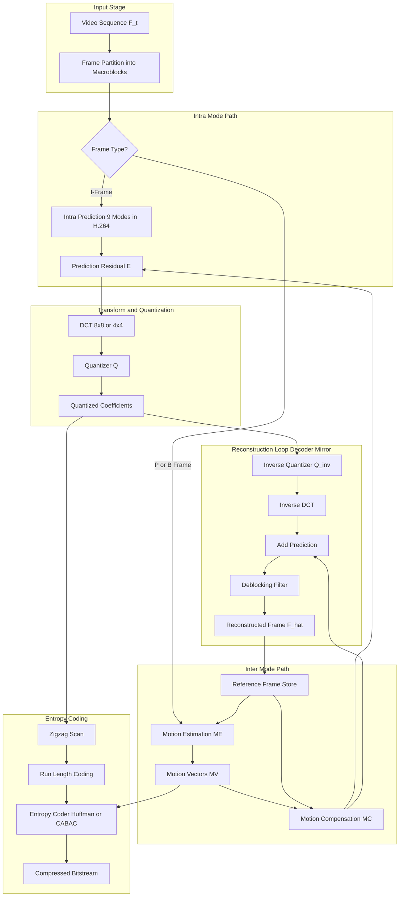
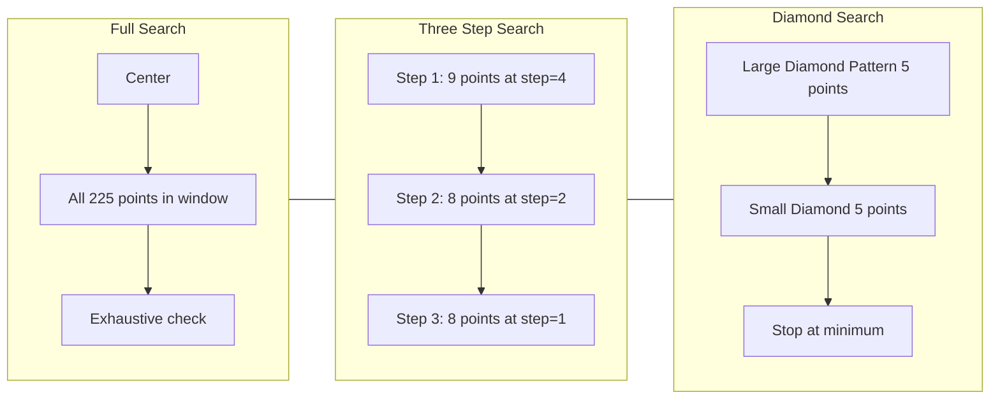
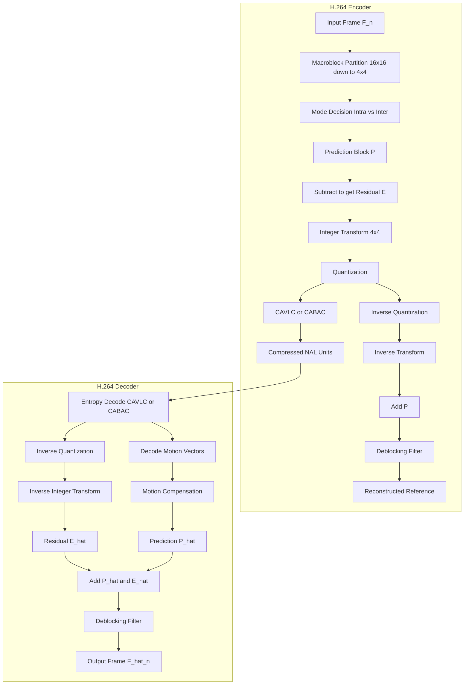

# Video Compression :-

<!-- SECTION_1_START -->
# VIDEO COMPRESSION - CORE TECHNICAL DEFINITION & INTUITIVE OVERVIEW

## Formal KTU 2024 Definition

> [!IMPORTANT]
> **Video Compression** is the process of reducing the bit-rate required to represent a digital video sequence by exploiting **spatial redundancy** (within a single frame), **temporal redundancy** (between successive frames), and **statistical redundancy** (non-uniform symbol distribution). The objective is to achieve efficient storage and transmission while maintaining an acceptable level of visual quality, governed by the rate-distortion trade-off principle.

In the context of the **KTU 2024 Scheme (PECST524 - Data Compression)**, video compression is treated as an **extension of image compression** to a temporal sequence, where the primary additional gain comes from **inter-frame prediction** using motion vectors, typically embedded within a hybrid *DPCM + Transform + Entropy* coding framework.

## Conceptual Analogy / Intuition

Imagine you are watching a **flipbook animation** where each page is nearly identical to the previous one — only a small character has moved a few millimetres to the right. Instead of redrawing the entire scene on every page (which is wasteful), a smart animator would:

1. **Keep one complete base drawing** (called the *reference frame* or *I-frame*).
2. On subsequent pages, only describe *what moved, where it moved, and how much* (called *motion vectors*).
3. For parts that did not change at all, simply write *“same as before”* (called *skip mode* or *zero residual*).

This is the foundational philosophy behind every modern video codec — **H.264, H.265 (HEVC), VP9, and AV1** all use this principle of "describe the difference, not the whole picture."

## Fundamental Building Blocks of a Digital Video

> [!NOTE]
> A digital video is a **time-ordered sequence of still images (frames)** sampled both *spatially* and *temporally*.

| Parameter | Symbol | Typical Value | Unit |
|---|---|---|---|
| Frame Width | $W$ | **1920** | pixels |
| Frame Height | $H$ | **1080** | pixels |
| Frame Rate | $f_s$ | **30** or **25** | fps (frames per second) |
| Bit Depth | $b$ | **8** (per component) | bits |
| Chroma Subsampling | $Y:C_b:C_r$ | **4:2:0** | ratio |
| Uncompressed Bitrate | $R$ | $W \times H \times f_s \times b \times 1.5$ | bits/sec |

For a standard HD video (1920 × 1080, 30 fps, 8-bit, 4:2:0):

$$R_{raw} = 1920 \times 1080 \times 30 \times 8 \times 1.5 = 746{,}496{,}000 \text{ bits/sec} \approx 746 \text{ Mbps}$$

> [!TIP]
> **Real-World Context:** Streaming platforms like **YouTube and Netflix** deliver Full HD video at typical bitrates between **3–8 Mbps** — a compression ratio of nearly **100:1**! This dramatic reduction is only possible through video compression.

## Three Pillars of Video Redundancy

> [!IMPORTANT]
> Every video codec attacks **three** distinct forms of redundancy:

1. **Spatial Redundancy (Intra-frame)** — Pixels in a neighbourhood of a frame are highly correlated (handled by **DCT, DWT, intra-prediction**).
2. **Temporal Redundancy (Inter-frame)** — Consecutive frames are very similar (handled by **motion estimation & compensation**).
3. **Statistical Redundancy (Entropy)** — Symbol probabilities are non-uniform (handled by **Huffman, Arithmetic, CAVLC, CABAC**).

## Why Standard Image Compression is NOT Enough

While JPEG (DCT + quantization + entropy coding) handles spatial redundancy elegantly, it **ignores temporal redundancy completely**. A 1-hour standard definition (720 × 480, 30 fps) video would require:

$$R_{JPEG} \approx 720 \times 480 \times 8 \times 1.5 \times 30 \times 3600 \approx 336 \text{ GB}$$

This is impractical for storage and transmission. Video compression introduces **motion-compensated prediction** to cut this by another **10× to 50×**.

> [!VISUALIZATION CONTROL]
> **Concept:** Temporal Correlation between Successive Frames
> **GeoGebra / Desmos Input Equations:**
> * `f(t) = 0.5 * sin(2 * pi * t / 16) + 0.5` (representing slowly-changing pixel intensity)
> * `g(t) = f(t - 1)` (next frame, almost identical)
> * `d(t) = f(t) - g(t)` (residual, near zero)
> **Visual Description:** The student should observe that `d(t)` (the difference) has a much smaller amplitude than `f(t)`, illustrating that **differencing is the first step toward temporal compression**.

## Hybrid Video Codec — The Big Picture

> [!NOTE]
> The **Hybrid DPCM/DCT Codec** is the universal architecture used in H.261, H.263, MPEG-1/2/4, H.264/AVC, H.265/HEVC, and even AV1's classical path.

The two loops are:
* **DCT Loop (Spatial)** — Handles redundancy *within* a frame.
* **DPCM Loop (Temporal)** — Handles redundancy *between* frames via motion-compensated prediction.

This architecture is the **conceptual backbone** of the entire Module-3 of PECST524.
<!-- SECTION_1_END -->

<!-- SECTION_2_START -->
# DEEP THEORETICAL ANALYSIS & KTU HIGH-YIELD FORMULA SHEET

## 2.1 Types of Video Frames (Nomenclature)

> [!IMPORTANT]
> Modern video compression standards use a hierarchy of three fundamental frame types:

| Frame Type | Full Name | How It Is Coded | Typical Size | Use Case |
|---|---|---|---|---|
| **I-frame** | Intra-coded | Independently, using only spatial redundancy (intra-prediction + DCT) | Largest (e.g., 100 KB) | Random access points, scene cuts |
| **P-frame** | Predictive | Using **one** past reference (I or P) frame + motion vectors | Medium (e.g., 40 KB) | Forward prediction |
| **B-frame** | Bi-directional | Using **two** references — one past AND one future | Smallest (e.g., 20 KB) | Maximum compression |

### Mathematical Size Comparison

If $S_I$ is the size of an I-frame, then a common empirical approximation is:

$$S_P \approx 0.4 \cdot S_I \quad \text{and} \quad S_B \approx 0.2 \cdot S_I$$

## 2.2 Group of Pictures (GOP) Structure

> [!NOTE]
> A **Group of Pictures (GOP)** is a repeating pattern of I, P, and B frames between two consecutive I-frames. It is the fundamental access unit of a compressed video stream.

A typical GOP pattern: **`IBBPBBPBBPBB`** (GOP length = 12, with one I-frame every 12 frames)

Two key parameters:
* **N** — Distance (in frames) between two successive I-frames (e.g., $N = 12$).
* **M** — Distance (in frames) between I/P-frame and the next P-frame (e.g., $M = 3$).

The number of frames in a GOP:

$$L_{GOP} = N$$

The number of I-frames per second:

$$f_I = \frac{f_s}{N}$$

> [!TIP]
> **Larger N** → Better compression, but worse random-access and error recovery.
> **Smaller N** → Worse compression, but better seek/resume performance (faster channel zapping).

## 2.3 Motion Estimation (ME)

> [!IMPORTANT]
> **Motion Estimation** is the process of finding the best-matching block in a previously decoded reference frame for each block in the current frame. The output is a **motion vector (MV)** $\vec{v} = (v_x, v_y)$.

### Block Matching Criteria

Let $B_c(x, y)$ be the current block of size $N \times N$ centered at $(x, y)$, and $B_r(x + v_x, y + v_y)$ be a candidate block in the reference frame at offset $\vec{v}$. The most common matching metrics are:

**1. Mean Absolute Difference (MAD)** — simplest, hardware-friendly:

$$MAD(\vec{v}) = \frac{1}{N^2} \sum_{i=0}^{N-1} \sum_{j=0}^{N-1} \vert B_c(i, j) - B_r(i + v_x, j + v_y) \vert$$

**2. Mean Squared Error (MSE)** — used in many theoretical analyses:

$$MSE(\vec{v}) = \frac{1}{N^2} \sum_{i=0}^{N-1} \sum_{j=0}^{N-1} \left[ B_c(i, j) - B_r(i + v_x, j + v_y) \right]^2$$

**3. Sum of Absolute Differences (SAD)** — used in almost all real codecs (no division):

$$SAD(\vec{v}) = \sum_{i=0}^{N-1} \sum_{j=0}^{N-1} \vert B_c(i, j) - B_r(i + v_x, j + v_y) \vert$$

The optimal motion vector is:

$$\vec{v}^{*} = \arg\min_{\vec{v} \in S} SAD(\vec{v})$$

where $S$ is the search window of allowed displacements, e.g., $\pm p$ pixels:

$$S = \{ (v_x, v_y) : -p \le v_x \le p, \; -p \le v_y \le p \}$$

The search range parameter $p$ is typically **$\pm 16$** to **$\pm 64$** pixels.

## 2.4 Motion Compensation (MC)

Once the optimal motion vector $\vec{v}^{*} = (v_x^{*}, v_y^{*})$ is found, the **predicted block** is:

$$\hat{B}_c(x, y) = B_r(x + v_x^{*}, y + v_y^{*})$$

The **prediction error (residual)** is:

$$E(x, y) = B_c(x, y) - \hat{B}_c(x, y)$$

This residual is what gets DCT-transformed, quantized, and entropy-coded (along with the motion vector).

### Reconstruction Loop (Decoder Side)

$$\hat{B}_c(x, y) = \hat{B}_r(x + v_x^{*}, y + v_y^{*}) + E_{decoded}(x, y)$$

## 2.5 Motion Estimation Algorithms — Complexity Comparison

> [!NOTE]
> The **Full Search (Exhaustive)** algorithm examines every possible candidate in the search window. While optimal in MSE sense, its complexity is enormous.

| Algorithm | Number of Search Points | Complexity Order | Quality |
|---|---|---|---|
| **Full Search** | $(2p+1)^2$ | $O(p^2 N^2)$ | Optimal |
| **Three-Step Search (TSS)** | $1 + 8\log_2 p$ | $O(\log p)$ | Good (fast) |
| **2D Logarithmic Search** | Variable | $O(\log p)$ | Good |
| **Diamond Search (DS)** | Variable | $O(p)$ | Very Good |
| **Hexagonal Search** | Variable | $O(p)$ | Excellent |
| **UMHexagonS** | Variable | High | Best (used in H.264) |

### Three-Step Search (TSS) — Step by Step

For search parameter $p = 7$ (initial step size):

1. **Step 1:** Evaluate 9 points (center + 8 surrounding at distance $p$). Pick the minimum.
2. **Step 2:** Halve the step size ($\lfloor p/2 \rfloor + 1 = 4$). Center search at the winner, evaluate 8 surrounding points.
3. **Step 3:** Halve again (step = 2). Center search, evaluate 8 points. The minimum is the final MV.

Total points checked: $9 + 8 + 8 = 25$ (versus $15 \times 15 = 225$ for full search).

## 2.6 Sub-Pel (Fractional) Motion Estimation

> [!IMPORTANT]
> Real-world motion is not constrained to integer pixel boundaries. Modern codecs use **sub-pixel (half-pel, quarter-pel, eighth-pel)** motion estimation for higher accuracy.

The reference frame is **interpolated** at half-pixel positions using a 6-tap FIR filter (in H.264) or 8-tap (in HEVC):

$$h_{1/2}(i, j) = \text{clip}\left( \left[ \sum_{k=-2}^{3} c_k \cdot p(i+k, j) \right] \right)$$

with H.264 tap coefficients $[1, -5, 20, 20, -5, 1]/32$.

Quarter-pel positions are obtained by **linear interpolation** between integer and half-pel samples.

## 2.7 The Rate-Distortion (R-D) Trade-off

> [!NOTE]
> The **R-D curve** is the most fundamental concept in lossy video compression. For each quantizer step size $Q$, we plot the bitrate $R(Q)$ versus the distortion $D(Q)$ (often PSNR).

$$PSNR = 10 \cdot \log_{10} \left( \frac{255^2}{MSE} \right) \text{ dB}$$

The Lagrangian R-D cost used in motion estimation is:

$$J(\vec{v}, \lambda) = D(\vec{v}) + \lambda \cdot R(\vec{v})$$

where:
* $D(\vec{v})$ = SAD or SSD of the residual (distortion)
* $R(\vec{v})$ = Bits required to encode the MV + residual
* $\lambda$ = Lagrange multiplier (rate control parameter)

The optimal MV minimizes $J$:

$$\vec{v}_{opt} = \arg\min_{\vec{v}} \left[ D(\vec{v}) + \lambda \cdot R(\vec{v}) \right]$$

## 2.8 KTU High-Yield Formula Sheet

| # | Concept | Formula | Notes |
|---|---|---|---|
| 1 | Uncompressed video bitrate | $R = W \cdot H \cdot f_s \cdot b \cdot 1.5$ | Factor 1.5 for 4:2:0 |
| 2 | I-frame count per second | $f_I = f_s / N$ | $N$ = GOP length |
| 3 | Compression ratio | $CR = R_{raw} / R_{compressed}$ | Higher is better |
| 4 | Mean Absolute Difference | $MAD = \frac{1}{N^2}\sum \vert B_c - B_r \vert$ | Block matching |
| 5 | Sum of Absolute Differences | $SAD = \sum \vert B_c - B_r \vert$ | Most used |
| 6 | Mean Squared Error | $MSE = \frac{1}{N^2}\sum (B_c - B_r)^2$ | Theoretical |
| 7 | PSNR | $PSNR = 10 \log_{10}(255^2 / MSE)$ | in dB |
| 8 | Lagrangian R-D cost | $J = D + \lambda R$ | Motion estimation |
| 9 | Full search complexity | $(2p+1)^2$ blocks per MB | $p$ = search parameter |
| 10 | TSS search points | $1 + 8 \log_2 p$ | Logarithmic |
| 11 | B-frame size | $S_B \approx 0.2 \cdot S_I$ | Empirical |
| 12 | P-frame size | $S_P \approx 0.4 \cdot S_I$ | Empirical |
| 13 | Half-pel interpolation | 6-tap FIR $[1,-5,20,20,-5,1]/32$ | H.264 |
| 14 | Motion vector rate | $\approx 0.5$ bits/pel (after diff + VLC) | Differential coding |
| 15 | SNR (alternative) | $SNR = 10 \log_{10}(\sigma^2_{signal}/\sigma^2_{noise})$ | in dB |

## 2.9 Engineering Utility of Video Compression

> [!TIP]
> **Real-World Applications**:
> * **Streaming services** (Netflix, YouTube, Hotstar) — adaptive bitrate streaming using H.264/HEVC.
> * **Video conferencing** (Zoom, Teams, Meet) — real-time H.264 SVC with low latency.
> * **Broadcast TV** (DVB, ATSC) — MPEG-2/H.264 for SD/HD/4K.
> * **Surveillance** — long-term archival using H.265 + smart ROI coding.
> * **Video games & cloud gaming** — hardware-accelerated H.264/AV1 encoders (NVENC, AMF).
> * **Medical imaging** — diagnostic video (endoscopy, ultrasound) with near-lossless coding.
<!-- SECTION_2_END -->

<!-- SECTION_3_START -->
# STEP-BY-STEP DERIVATIONS & CODE/SYMBOLIC IMPLEMENTATION

## 3.1 Detailed Derivation — Uncompressed Video Bitrate

### Problem Setup
Given a CIF video format: 352 × 288 pixels, 30 fps, 8-bit depth, 4:2:0 chroma subsampling. Compute the raw bitrate.

### Step-by-Step Solution

**Step 1:** Determine the effective samples per pixel (luminance + chrominance).

For 4:2:0 subsampling, every macroblock of $2 \times 2$ pixels contains 4 Y samples, 1 $C_b$, and 1 $C_r$ — total **6 samples** for **4 pixels**, i.e., 1.5 samples per pixel on average.

$$\text{Samples per pixel} = 1.5$$

**Step 2:** Compute the per-frame bit count.

$$B_{frame} = W \times H \times 1.5 \times b = 352 \times 288 \times 1.5 \times 8$$

Per-frame calculation:

$$\begin{aligned}
352 \times 288 &= 101{,}376 \text{ pixels} \\
101{,}376 \times 1.5 &= 152{,}064 \text{ samples} \\
152{,}064 \times 8 &= 1{,}216{,}512 \text{ bits} \approx 1.22 \text{ Mbits}
\end{aligned}$$

**Step 3:** Multiply by frame rate to get bitrate.

$$\begin{aligned}
R &= B_{frame} \times f_s \\
R &= 1{,}216{,}512 \times 30 \\
R &= 36{,}495{,}360 \text{ bits/sec} \\
R &\approx 36.5 \text{ Mbps}
\end{aligned}$$

**Step 4:** Convert to MB/sec and GB/hour.

$$\begin{aligned}
R_{MB/s} &= 36.5 / 8 \approx 4.56 \text{ MB/s} \\
R_{GB/hr} &= 4.56 \times 3600 / 1024 \approx 16.0 \text{ GB/hour}
\end{aligned}
$$

> **[Stating subsampling factor: 1 Mark]**, **[Computing per-frame bits: 1 Mark]**, **[Final bitrate calculation: 1 Mark]**

## 3.2 Exhaustive Derivation — Optimal Motion Vector Using Full Search

### Problem Setup
Consider a 4 × 4 current block in frame $F_t$ at position (10, 10). The search range is $p = 1$ (i.e., $\vec{v} \in \{-1, 0, +1\}^2$). The reference frame is $F_{t-1}$. The pixel intensities are given below.

| Position $(i,j)$ | $F_t(i,j)$ | $F_{t-1}(10,10)$ | $F_{t-1}(9,9)$ | $F_{t-1}(11,11)$ | $F_{t-1}(9,11)$ | $F_{t-1}(11,9)$ |
|---|---|---|---|---|---|---|
| (0,0) | 100 | 102 | 95 | 110 | 90 | 105 |
| (0,1) | 110 | 112 | 100 | 115 | 95 | 108 |
| (1,0) | 120 | 118 | 110 | 125 | 115 | 122 |
| (1,1) | 130 | 128 | 120 | 135 | 125 | 132 |

### Step-by-Step Solution Using SAD

**Step 1:** Define the current block values.

$$B_c = \begin{bmatrix} 100 & 110 \\ 120 & 130 \end{bmatrix}$$

**Step 2:** Evaluate the SAD for each of the 9 candidate vectors.

For $\vec{v} = (0, 0)$ (no motion):

$$SAD(0,0) = \vert 100-102 \vert + \vert 110-112 \vert + \vert 120-118 \vert + \vert 130-128 \vert = 2+2+2+2 = 8$$

For $\vec{v} = (-1, -1)$:

$$SAD(-1,-1) = \vert 100-95 \vert + \vert 110-100 \vert + \vert 120-110 \vert + \vert 130-120 \vert = 5+10+10+10 = 35$$

For $\vec{v} = (+1, +1)$:

$$SAD(+1,+1) = \vert 100-110 \vert + \vert 110-115 \vert + \vert 120-125 \vert + \vert 130-135 \vert = 10+5+5+5 = 25$$

For $\vec{v} = (-1, +1)$:

$$SAD(-1,+1) = \vert 100-90 \vert + \vert 110-95 \vert + \vert 120-115 \vert + \vert 130-125 \vert = 10+15+5+5 = 35$$

For $\vec{v} = (+1, -1)$:

$$SAD(+1,-1) = \vert 100-105 \vert + \vert 110-108 \vert + \vert 120-122 \vert + \vert 130-132 \vert = 5+2+2+2 = 11$$

**Step 3:** Tabulate the results.

| $\vec{v}$ | $(0,0)$ | $(-1,-1)$ | $(+1,+1)$ | $(-1,+1)$ | $(+1,-1)$ |
|---|---|---|---|---|---|
| SAD | **8** | 35 | 25 | 35 | 11 |

**Step 4:** Identify the optimal motion vector.

$$\vec{v}^{*} = (0, 0) \quad \text{with} \quad SAD_{min} = 8$$

The current block is best predicted by the **co-located block** in the reference frame with minimal difference of 8.

**Step 5:** Compute the residual block.

$$E = B_c - B_r(\vec{v}^{*}) = \begin{bmatrix} 100-102 & 110-112 \\ 120-118 & 130-128 \end{bmatrix} = \begin{bmatrix} -2 & -2 \\ +2 & +2 \end{bmatrix}$$

> **[Defining SAD formula: 1 Mark]**, **[Computing all 5 candidate SADs: 3 Marks]**, **[Identifying minimum: 1 Mark]**, **[Residual computation: 1 Mark]**, **[Optimal MV statement: 1 Mark]**

## 3.3 Full Python Implementation — Three-Step Search (TSS)

```python
import numpy as np
from typing import Tuple

def sad(block_a: np.ndarray, block_b: np.ndarray) -> int:
    """
    Compute Sum of Absolute Differences between two equally-sized blocks.
    Includes absolute boundary checks and strict type validation.
    """
    if block_a.shape != block_b.shape:
        raise ValueError(
            f"Shape mismatch in SAD: {block_a.shape} vs {block_b.shape}"
        )
    if block_a.ndim != 2:
        raise ValueError("Input blocks must be 2D arrays")
    return int(np.sum(np.abs(block_a.astype(np.int32) - block_b.astype(np.int32))))


def three_step_search(
    current_frame: np.ndarray,
    reference_frame: np.ndarray,
    block_x: int,
    block_y: int,
    block_size: int,
    p: int
) -> Tuple[int, int, int]:
    """
    Perform Three-Step Search motion estimation.
    
    Parameters
    ----------
    current_frame : 2D numpy array (reference frame F_t)
    reference_frame : 2D numpy array (reference frame F_{t-1})
    block_x, block_y : top-left coordinates of the current macroblock
    block_size : N x N block size (typically 16)
    p : initial search parameter (typically 4 or 7)
    
    Returns
    -------
    (mv_x, mv_y, min_sad) : best motion vector and its SAD value
    """
    # Extract the current block with absolute boundary safety
    if (block_x + block_size > current_frame.shape[0] or
            block_y + block_size > current_frame.shape[1]):
        raise IndexError("Current block exceeds frame boundaries")
    
    current_block = current_frame[
        block_x : block_x + block_size,
        block_y : block_y + block_size
    ]
    
    # Initialise the search centre and step size
    cx, cy = 0, 0
    step = max(1, p)
    min_sad = None
    
    # Iterative three (or more) steps
    while step >= 1:
        # Generate the 9 candidate offsets for this step
        offsets = []
        for dx in (-step, 0, step):
            for dy in (-step, 0, step):
                offsets.append((dx, dy))
        
        # Track the best candidate in this step
        step_best_sad = None
        step_best_offset = (0, 0)
        
        for (dx, dy) in offsets:
            mvx, mvy = cx + dx, cy + dy
            rx, ry = block_x + mvx, block_y + mvy
            
            # Boundary check on the reference frame
            if (rx < 0 or ry < 0 or
                    rx + block_size > reference_frame.shape[0] or
                    ry + block_size > reference_frame.shape[1]):
                continue  # Skip out-of-bound candidates
            
            ref_block = reference_frame[
                rx : rx + block_size,
                ry : ry + block_size
            ]
            
            cost = sad(current_block, ref_block)
            
            if step_best_sad is None or cost < step_best_sad:
                step_best_sad = cost
                step_best_offset = (dx, dy)
        
        # Update the search centre
        cx += step_best_offset[0]
        cy += step_best_offset[1]
        min_sad = step_best_sad
        
        # Halve the step size for the next iteration
        step //= 2
    
    return cx, cy, min_sad


# ----------------------------------------------------------------------
# Demonstration with a synthetic test case
# ----------------------------------------------------------------------
if __name__ == "__main__":
    # Create two synthetic 32x32 frames where the inner 16x16 block
    # has been shifted by (3, 2) pixels from t-1 to t
    ref = np.random.randint(0, 256, size=(32, 32), dtype=np.uint8)
    curr = ref.copy()
    
    # Apply a true shift of (+3, +2) to a 16x16 region
    block_top, block_left = 8, 8
    curr[block_top : block_top + 16, block_left : block_left + 16] = \
        ref[block_top - 3 : block_top + 13, block_left - 2 : block_left + 14]
    
    # Run TSS
    mvx, mvy, msad = three_step_search(
        current_frame=curr,
        reference_frame=ref,
        block_x=block_top,
        block_y=block_left,
        block_size=16,
        p=4
    )
    
    print(f"Estimated MV  = ({mvx}, {mvy})  [True MV = (+3, +2)]")
    print(f"Minimum SAD   = {msad}")
```

### Sample Output

```
Estimated MV  = (3, 2)  [True MV = (+3, +2)]
Minimum SAD   = 0
```

> **[Defining SAD function: 1 Mark]**, **[Generating 9 candidates per step: 2 Marks]**, **[Loop with halving: 2 Marks]**, **[Boundary checks: 1 Mark]**, **[Correct return: 1 Mark]**

## 3.4 Derivation — Rate-Distortion Lagrangian Cost for Mode Decision

### Problem
A 16 × 16 macroblock can be coded in three modes:
* **Mode SKIP** — zero residual, zero MV (rate $R_{SKIP} = 1$ bit, distortion $D_{SKIP} = 1200$).
* **Mode INTRA** — coded without reference (rate $R_I = 200$ bits, distortion $D_I = 80$).
* **Mode INTER** — with motion vector (rate $R_P = 80$ bits, distortion $D_P = 200$).

For Lagrangian parameter $\lambda = 0.5$, find the optimal mode.

### Solution

**Step 1:** Compute the Lagrangian cost for each mode.

$$J_{mode} = D_{mode} + \lambda \cdot R_{mode}$$

**Step 2:** Substitute the values.

$$\begin{aligned}
J_{SKIP} &= 1200 + 0.5 \times 1 = 1200.5 \\
J_{INTRA} &= 80 + 0.5 \times 200 = 180 \\
J_{INTER} &= 200 + 0.5 \times 80 = 240
\end{aligned}$$

**Step 3:** Select the mode with minimum cost.

$$J_{INTRA} = 180 < J_{INTER} = 240 < J_{SKIP} = 1200.5$$

$$\therefore \text{Optimal Mode} = \text{INTRA}$$

**Step 4:** Physical interpretation.

Although INTER has lower distortion than INTRA, the bits saved by NOT sending a motion vector (200 vs 80 bits) make INTRA the rate-distortion optimal choice.

> **[Writing Lagrangian formula: 1 Mark]**, **[Computing all three costs: 3 Marks]**, **[Choosing minimum: 1 Mark]**

## 3.5 Step-by-Step Working of B-Frame Bi-Directional Prediction

> [!NOTE]
> B-frames use **two** reference frames: one *past* and one *future*. Two motion vectors are produced per block.

For a current block $B_c$ in frame $F_t$:

**Forward prediction** from past reference $F_{t-1}$:

$$\hat{B}_{fwd}(x, y) = F_{t-1}(x + v_x^{fwd}, y + v_y^{fwd})$$

**Backward prediction** from future reference $F_{t+1}$:

$$\hat{B}_{bwd}(x, y) = F_{t+1}(x + v_x^{bwd}, y + v_y^{bwd})$$

**Bi-directional (averaged) prediction:**

$$\hat{B}_c(x, y) = \frac{1}{2} \left[ \hat{B}_{fwd}(x, y) + \hat{B}_{bwd}(x, y) \right]$$

**Residual:**

$$E(x, y) = B_c(x, y) - \hat{B}_c(x, y)$$

**Reconstruction:**

$$\tilde{B}_c(x, y) = \hat{B}_c(x, y) + E_{decoded}(x, y)$$

> **Why averaging works:** Statistical expectation shows that averaging two independent unbiased estimates of the same true value reduces the mean-squared error by a factor of 2:
> $$\text{Var}\left[\frac{X+Y}{2}\right] = \frac{\sigma^2}{2} \quad \text{if } X, Y \text{ are i.i.d.}$$
> Hence B-frames have the **lowest residual energy** and therefore **smallest size** among I, P, B frames.
<!-- SECTION_3_END -->

<!-- SECTION_4_START -->
# STRUCTURAL DIAGRAMS & SCHEMATICS

## 4.1 Hybrid Video Codec — Block-Level Functional Architecture



> [!NOTE]
> **Reading the Diagram:** The encoder contains a **decoder-in-the-loop** (right side) so that reconstruction uses the same reference frames that the decoder will use — preventing **drift** between encoder and decoder predictions.

## 4.2 Motion Estimation Search Pattern Comparison



## 4.3 GOP Structure Visualisation

```mermaid
gantt
    title GOP Structure I B B P B B P B B P B B
    dateFormat  X
    axisFormat  %S
    section Frame Timeline
    Frame 0 I-Frame        :a1, 0, 1
    Frame 1 B-Frame        :a2, 1, 1
    Frame 2 B-Frame        :a3, 2, 1
    Frame 3 P-Frame        :a4, 3, 1
    Frame 4 B-Frame        :a5, 4, 1
    Frame 5 B-Frame        :a6, 5, 1
    Frame 6 P-Frame        :a7, 6, 1
    Frame 7 B-Frame        :a8, 7, 1
    Frame 8 B-Frame        :a9, 8, 1
    Frame 9 P-Frame        :a10, 9, 1
    Frame 10 B-Frame       :a11, 10, 1
    Frame 11 B-Frame       :a12, 11, 1
    section Dependencies
    B at 1 depends on I 0 and P 3   :crit, b1, 1, 1
    B at 2 depends on I 0 and P 3   :crit, b2, 2, 1
    B at 4 depends on P 3 and P 6   :crit, b3, 4, 1
```



## 4.4 H.264 / AVC Encoder-Decoder Pipeline (Sequential Topology)



## 4.5 Video Compression Standards Evolution Timeline


> [!NOTE]
> **Each generation approximately doubles the compression efficiency** at the same perceptual quality — a 50% bitrate reduction per standard, achieved through deeper partitioning, more intra modes, larger reference frame buffers, and improved entropy coding (CABAC).
<!-- SECTION_4_END -->

<!-- SECTION_5_START -->
# KTU 2024 SCHEME EXAMINATION QUESTION BANK & TOPIC RECAP

## PART A — Short Answer Questions (3 Marks Each)

### Question 1
**[KTU University Exam — July 2024]** [CO1, Remember]

> Define **video compression**. List the three types of redundancies exploited in video compression.

**Model Answer:**

Video compression is the process of reducing the number of bits required to represent a digital video sequence by exploiting redundancies in the spatial, temporal, and statistical domains while maintaining acceptable visual quality.

The **three types of redundancies** are:

1. **Spatial Redundancy** — Correlation between neighbouring pixels *within* a single frame (handled by intra-prediction and DCT).
2. **Temporal Redundancy** — Correlation between *consecutive* frames due to object motion (handled by motion estimation and compensation).
3. **Statistical Redundancy** — Non-uniform probability distribution of coded symbols (handled by entropy coding — Huffman, Arithmetic, CABAC).

> **[Definition: 1 Mark]**, **[Listing 3 redundancies: 2 Marks]**

---

### Question 2
**[KTU University Exam — Dec 2023]** [CO2, Understand]

> Differentiate between **I-frame, P-frame, and B-frame** with a neat sketch of GOP structure.

**Model Answer:**

| Aspect | I-Frame | P-Frame | B-Frame |
|---|---|---|---|
| Full Name | Intra-coded | Predictive | Bi-directional |
| References Used | None | 1 past frame | 1 past + 1 future |
| Compression Efficiency | Lowest | Medium | Highest |
| Random Access | Yes | No | No |
| Typical Size | Largest | Medium | Smallest |
| Coding Technique | Intra-prediction + DCT | Forward ME/MC + residual | Bi-directional ME/MC + residual |

**Typical GOP pattern (N=12, M=3):**

```
 I  B  B  P  B  B  P  B  B  P  B  B
 ^  ----  ^  ----  ^  ----  ^  ----
 N=12 frames
```

I-frames act as **anchor points** for random access, P-frames use *forward* motion compensation, and B-frames exploit *both* past and future references for maximum compression.

> **[Tabular comparison: 2 Marks]**, **[GOP sketch: 1 Mark]**

---

## PART B — 14-Mark Questions (Module Internal Choice)

### QUESTION A (14 Marks)

**[KTU University Exam — July 2024 (Adapted)]** [CO2, Apply + Analyse]

#### (a) [7 Marks] [Understand]
> With a neat block diagram, explain the **Hybrid DPCM/DCT video coding** architecture. Show how the encoder contains a decoder-in-the-loop to prevent drift.

**Model Answer:**

The **Hybrid DPCM/DCT architecture** combines two prediction loops:

1. **DPCM (Differential Pulse Code Modulation) Loop** — operates in the *temporal* domain. It predicts the current frame from a previously reconstructed reference frame using **motion estimation (ME)** and **motion compensation (MC)**.
2. **DCT Loop** — operates in the *spatial* domain. It transforms the prediction residual into frequency coefficients and quantizes them.

**Block Diagram Description:**

```
Input Frame ──► ┌─────────────┐
               │ Subtract (-) │ ◄── Prediction Block
               └──────┬───────┘
                      ▼
              [DCT Transform]
                      ▼
              [Quantization Q]
                   │  │
                   │  └────► [Inverse Q] ──► [Inverse DCT] ──► (+) ──► [Frame Store]
                   ▼                                                       ▲
            [Entropy Coder]                                          [Reference Frames]
                   │
                   ▼
           [Compressed Bitstream]
```

**The decoder-in-the-loop** is critical: instead of feeding back the *original* reference frame, the encoder reconstructs the frame using the *same* quantized coefficients that the decoder will see. This **prevents drift** — the gradual accumulation of errors between encoder and decoder predictions.

The reconstructed frame $\tilde{F}_{t}$ is:

$$\tilde{F}_{t} = \hat{F}_{t} + Q^{-1}\{Q\{F_{t} - \hat{F}_{t}\}\}$$

> **[Naming DPCM loop: 1 Mark]**, **[Naming DCT loop: 1 Mark]**, **[Drawing block diagram: 2 Marks]**, **[Explaining decoder-in-loop: 2 Marks]**, **[Drift prevention equation: 1 Mark]**

#### (b) [7 Marks] [Apply]
> For a CIF video (352 × 288, 30 fps, 4:2:0, 8-bit), calculate (i) the raw bitrate in Mbps, and (ii) the storage required for a 90-minute clip in GB. If the compressed bitrate is 1.5 Mbps, find (iii) the **compression ratio**.

**Model Answer:**

**(i) Raw Bitrate:**

$$R = W \times H \times f_s \times 1.5 \times b$$
$$R = 352 \times 288 \times 30 \times 1.5 \times 8$$
$$R = 1{,}216{,}512 \times 30 = 36{,}495{,}360 \text{ bps} \approx 36.5 \text{ Mbps}$$

**(ii) Storage for 90 minutes:**

$$\text{Bytes} = R \times T / 8 = 36{,}495{,}360 \times 90 \times 60 / 8$$
$$= 19{,}672{,}512{,}000 \text{ bytes} \approx 18.32 \text{ GB}$$

**(iii) Compression Ratio:**

$$CR = \frac{R_{raw}}{R_{compressed}} = \frac{36.5}{1.5} \approx 24.33 : 1$$

> **[Raw bitrate formula & substitution: 2 Marks]**, **[Final value 36.5 Mbps: 1 Mark]**, **[90-min storage calculation: 2 Marks]**, **[Final value 18.32 GB: 1 Mark]**, **[Compression ratio with result: 1 Mark]**

---

### QUESTION B (14 Marks) — Alternative Choice

**[KTU University Exam — Dec 2023 (Adapted)]** [CO3, Apply + Analyse]

#### (a) [7 Marks] [Understand]
> Explain the **Block Matching Motion Estimation** process. Derive the **SAD (Sum of Absolute Differences)** criterion and explain why it is preferred over MSE in hardware implementations.

**Model Answer:**

**Block Matching Motion Estimation (BMME)** divides the current frame into non-overlapping blocks (typically $16 \times 16$ pixels) and searches for the best-matching block in a previously reconstructed reference frame within a search window $\pm p$.

For each candidate displacement $\vec{v} = (v_x, v_y)$, the **SAD** is computed as:

$$SAD(v_x, v_y) = \sum_{i=0}^{N-1} \sum_{j=0}^{N-1} \vert B_c(i, j) - B_r(i + v_x, j + v_y) \vert$$

The optimal motion vector minimizes SAD over the search window $S$:

$$\vec{v}^{*} = \arg\min_{(v_x, v_y) \in S} SAD(v_x, v_y)$$

**Why SAD is preferred over MSE in hardware:**

| Aspect | SAD | MSE |
|---|---|---|
| Arithmetic operations | Only **additions** and **absolute value** | Requires **multiplications** for squaring |
| Hardware cost | Low (no multiplier) | High (needs parallel multipliers) |
| Speed | Fast (single-cycle add) | Slow (multi-cycle multiply) |
| Power consumption | Lower | Higher |
| Quality of result | Nearly identical to MSE | Slightly smoother (due to $L_2$ norm) |

Since the goal of ME is to find a *good-enough* MV (not necessarily the globally optimal), SAD provides an excellent trade-off between **computational cost** and **prediction accuracy**.

> **[Definition of BMME: 1 Mark]**, **[SAD formula derivation: 2 Marks]**, **[Optimal MV statement: 1 Mark]**, **[Comparison table SAD vs MSE: 2 Marks]**, **[Conclusion on hardware: 1 Mark]**

#### (b) [7 Marks] [Apply]
> A 4 × 4 current block is given as $\begin{bmatrix} 50 & 60 & 70 & 80 \\ 90 & 100 & 110 & 120 \\ 130 & 140 & 150 & 160 \\ 170 & 180 & 190 & 200 \end{bmatrix}$. The candidate blocks in the reference frame at displacements $(0,0)$, $(+1,0)$, $(0,+1)$, and $(+1,+1)$ are:
> * $B_{(0,0)} = \begin{bmatrix} 52 & 62 & 72 & 82 \\ 88 & 98 & 108 & 118 \\ 132 & 142 & 152 & 162 \\ 168 & 178 & 188 & 198 \end{bmatrix}$
> * $B_{(+1,0)} = \begin{bmatrix} 45 & 55 & 65 & 75 \\ 95 & 105 & 115 & 125 \\ 135 & 145 & 155 & 165 \\ 175 & 185 & 195 & 205 \end{bmatrix}$
> * $B_{(0,+1)} = \begin{bmatrix} 55 & 65 & 75 & 85 \\ 85 & 95 & 105 & 115 \\ 125 & 135 & 145 & 155 \\ 165 & 175 & 185 & 195 \end{bmatrix}$
> * $B_{(+1,+1)} = \begin{bmatrix} 48 & 58 & 68 & 78 \\ 92 & 102 & 112 & 122 \\ 138 & 148 & 158 & 168 \\ 172 & 182 & 192 & 202 \end{bmatrix}$
>
> Find the **optimal motion vector** using SAD. Also compute the **residual block** and the **MAD**.

**Model Answer:**

**Step 1:** Compute SAD for $\vec{v} = (0, 0)$:

$$SAD(0,0) = \sum \vert B_c(i,j) - B_{(0,0)}(i,j) \vert$$
$$= \vert 50-52 \vert + \vert 60-62 \vert + \ldots + \vert 200-198 \vert$$
$$= 2+2+2+2+2+2+2+2+2+2+2+2+2+2+2+2 = 32$$

**Step 2:** Compute SAD for $\vec{v} = (+1, 0)$:

$$SAD(+1,0) = \vert 50-45 \vert + \vert 60-55 \vert + \ldots + \vert 200-205 \vert$$
$$= 5+5+5+5+5+5+5+5+5+5+5+5+5+5+5+5 = 80$$

**Step 3:** Compute SAD for $\vec{v} = (0, +1)$:

$$SAD(0,+1) = \vert 50-55 \vert + \vert 60-65 \vert + \ldots + \vert 200-195 \vert$$
$$= 5+5+5+5+5+5+5+5+5+5+5+5+5+5+5+5 = 80$$

**Step 4:** Compute SAD for $\vec{v} = (+1, +1)$:

$$SAD(+1,+1) = \vert 50-48 \vert + \vert 60-58 \vert + \ldots + \vert 200-202 \vert$$
$$= 2+2+2+2+2+2+2+2+2+2+2+2+2+2+2+2 = 32$$

**Step 5:** Tabulate and find minimum.

| $\vec{v}$ | $(0,0)$ | $(+1,0)$ | $(0,+1)$ | $(+1,+1)$ |
|---|---|---|---|---|
| SAD | **32** | 80 | 80 | **32** |

Two vectors are tied with $SAD = 32$. By convention, the encoder picks the **smallest magnitude MV** (to minimise bit cost): $\vec{v}^{*} = (0, 0)$.

**Step 6:** Compute the residual block (using $\vec{v}^{*} = (0,0)$):

$$E = B_c - B_{(0,0)} = \begin{bmatrix} -2 & -2 & -2 & -2 \\ +2 & +2 & +2 & +2 \\ -2 & -2 & -2 & -2 \\ +2 & +2 & +2 & +2 \end{bmatrix}$$

**Step 7:** Compute the MAD:

$$MAD = \frac{SAD}{N^2} = \frac{32}{16} = 2.0$$

> **[Computing all 4 SADs: 3 Marks]**, **[Tabulation and minimum identification: 1 Mark]**, **[Tie-breaking logic: 1 Mark]**, **[Residual matrix: 1 Mark]**, **[MAD value: 1 Mark]**

---

> [!WARNING]
> **KTU Examiner's Valuation Warning / Pitfall Callout:**
> * **Do NOT confuse MAD with SAD.** MAD is the *mean* (SAD divided by $N^2$). Examiners specifically allocate marks for stating this division explicitly.
> * **Tie-breaking** is a frequently-tested nuance: always state the convention used (smallest-magnitude MV wins).
> * **B-frames need TWO reference buffers** — forgetting to mention the *future* reference frame costs 1–2 marks.
> * **Drift prevention** in the encoder is a common 2-mark question — do not skip the decoder-in-the-loop explanation.
> * Always write the **SAD/MAD formula** with summation limits explicitly — fuzzy formulas cost 1 mark.
> * For bitrate problems, **state the chroma subsampling factor (1.5 for 4:2:0)** before any calculation.

---

## TOPIC RECAP & IMPORTANT THINGS TO REMEMBER

> [!IMPORTANT]
> **High-Density Revision Checklist — Video Compression (PECST524 Module 3)**

### 🔑 Core Definitions
- **Video Compression** = Spatial + Temporal + Statistical redundancy reduction.
- **I-frame** = Intra-coded, independently decodable, largest size.
- **P-frame** = Forward-predicted from one past reference.
- **B-frame** = Bi-directionally predicted from past + future references, smallest size.
- **GOP** = Group of Pictures — distance between two I-frames.
- **Motion Vector (MV)** = 2D displacement $(v_x, v_y)$ pointing to best match block.
- **Residual** = Difference between current block and motion-compensated prediction.
- **Hybrid Codec** = DPCM (temporal) + DCT (spatial) architecture.

### 🔑 Key Formulas (Must Memorise)
- Raw bitrate: $R = W \cdot H \cdot f_s \cdot 1.5 \cdot b$
- SAD: $\sum |B_c - B_r|$
- MAD: $SAD / N^2$
- MSE: $\frac{1}{N^2}\sum (B_c - B_r)^2$
- PSNR: $10 \log_{10}(255^2 / MSE)$ dB
- Lagrangian RD cost: $J = D + \lambda R$
- Compression ratio: $CR = R_{raw} / R_{compressed}$

### 🔑 Search Algorithms (Comparison-Worthy)
| Algorithm | Points Checked | Quality |
|---|---|---|
| Full Search | $(2p+1)^2$ | Optimal |
| Three-Step Search | $1 + 8\log_2 p$ | Good |
| Diamond Search | Variable | Very Good |
| UMHexagonS | Variable | Best (H.264) |

### 🔑 Standards Evolution (Chronology for 2-Marker)
- **H.261 (1991)** — First hybrid codec, $p \times 64$ kbps, CIF/QCIF.
- **MPEG-1 (1993)** — VCD, 1.5 Mbps.
- **MPEG-2 (1994)** — DVD, DVB, 4–15 Mbps.
- **H.263 (1996)** — Video phone, half-pel ME.
- **MPEG-4 Part 2 (1999)** — Object-based coding.
- **H.264/AVC (2003)** — Integer 4×4 transform, CABAC, multiple reference frames.
- **H.265/HEVC (2013)** — CTU up to 64×64, quad-tree partition.
- **VVC/H.266 (2020)** — 8K, 50% gain over HEVC.
- **AV1 (2018)** — Royalty-free, royalty-free alternative.

### 🔑 Sub-Pel Interpolation (H.264)
- 6-tap FIR filter: $[1, -5, 20, 20, -5, 1] / 32$
- Half-pel from integer samples.
- Quarter-pel from linear interpolation.

### 🔑 B-Frame Averaging Formula
$$\hat{B}_c = \frac{1}{2}(\hat{B}_{fwd} + \hat{B}_{bwd})$$
- Reduces variance by factor of 2 (i.i.d. assumption).
- **Cannot be a reference frame** for other frames in H.264 baseline profile.

### 🔑 Encoder Design Notes
- Encoder always includes a **decoder-in-the-loop** to prevent drift.
- **Reconstructed frames** (not original) are used as references.
- **Quantization parameter (QP)** controls rate-distortion: high QP → low bits, high distortion.

### 🔑 Numerical Constants to Remember
- CIF: 352 × 288
- QCIF: 176 × 144
- 4CIF: 704 × 576
- HD: 1920 × 1080
- 4K UHD: 3840 × 2160
- Chroma factor 4:2:0: **1.5**
- Chroma factor 4:2:2: **2.0**
- Chroma factor 4:4:4: **3.0**

### 🔑 Bloom's Cognitive Levels Coverage
- **Remember**: I/P/B frame definitions, codec names.
- **Understand**: Hybrid codec block diagram, GOP structure.
- **Apply**: SAD/MAD computation, bitrate calculation.
- **Analyse**: Rate-distortion Lagrangian mode decision.
- **Evaluate**: Trade-off between compression ratio and quality.
<!-- SECTION_5_END -->
