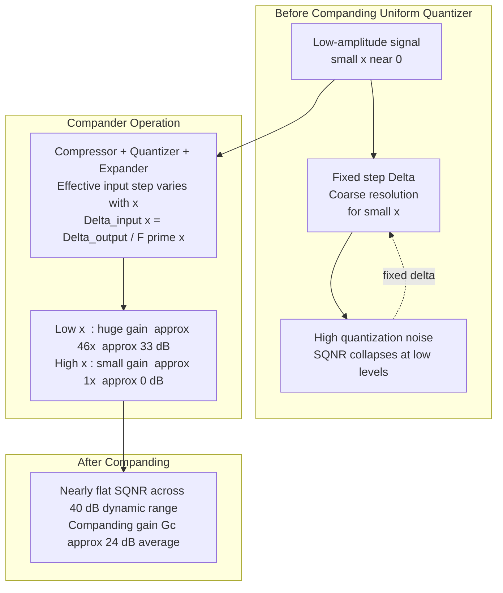
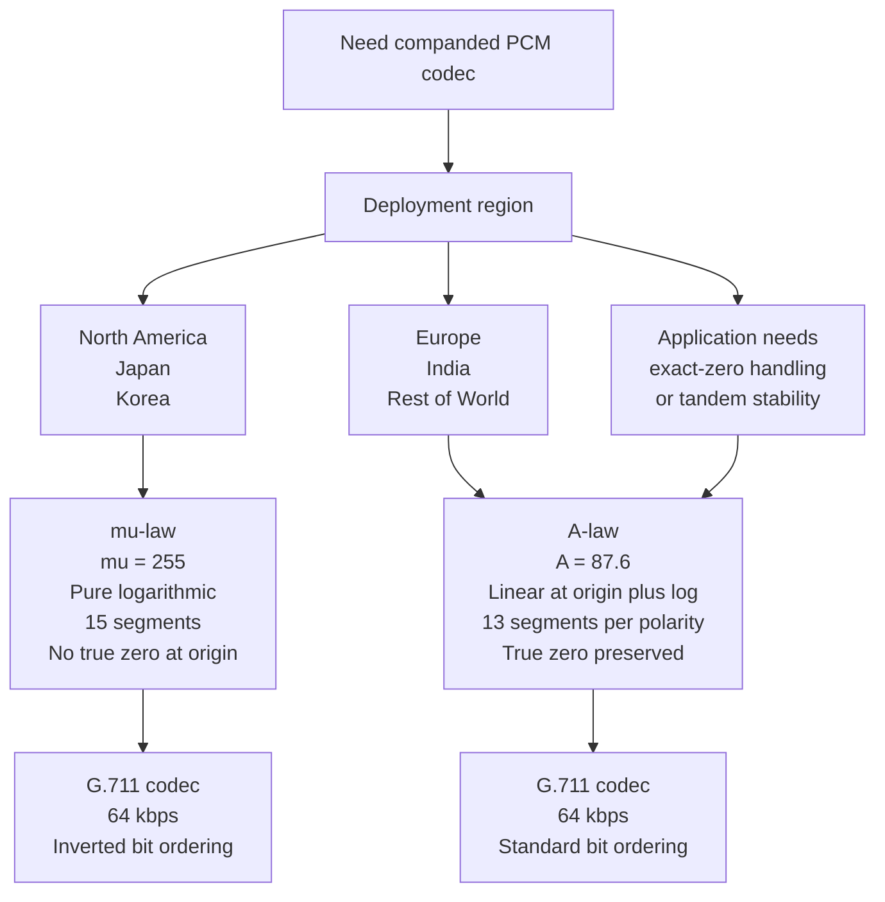

# Audio Compression -  Companding

<!-- SECTION_1_START -->
# Audio Compression — Companding (Non-Uniform Quantization)

## 1.1 Formal KTU Syllabus Definition

**Companding** is the combination of two sequential, inverse non-linear operations — **Compression** at the transmitter followed by **Expansion** at the receiver — applied to an analog signal *before* and *after* uniform quantization in a **Pulse Code Modulation (PCM)** system. The objective is to overcome the poor **Signal-to-Quantization-Noise Ratio (SQNR)** that uniform quantizers exhibit for low-amplitude (low-probability) input samples.

Mathematically, a compander is a memoryless, non-linear amplitude transformer that *compresses* the dynamic range of the input to match the resolution of a fixed-step quantizer, and an *expander* at the receiver restores the original dynamic range while attenuating the quantization noise that was injected at the non-uniform points.

The two internationally standardized companding laws are:

- **μ-law (mu-law)** — standardized in ITU-T G.711, used in North America and Japan.
- **A-law** — also standardized in ITU-T G.711, used in Europe, India, and most of the rest of the world.

> [!IMPORTANT]
> **KTU 2024 — Module 4 Highlight:** Companding is the *enabling technique* that makes 8-bit PCM voice (64 kbps) deliver intelligibility comparable to 12-bit uniform PCM (without companding the same bit rate would sound harsh and "granular"). Every digital telephone in the PSTN still uses one of these two laws.

## 1.2 Conceptual Analogy — The "Crowd Photography" Intuition

Imagine a photographer trying to capture a crowd of 1000 people standing in a long line where 900 people are 1.5 m tall and 100 people are 2.1 m tall. A camera with only 8 "shades of grey" (quantization levels) must dedicate most of its detail to *where most of the action is* — the 1.5 m group. The 2.1 m outliers are bunched into the top two grey shades and look terrible (high quantization noise).

**Companding is the photographer's zoom lens.** Before the snapshot, they "compress" the line on the viewfinder — squeezing the 1.5 m people closer together and stretching the 2.1 m people apart. Now the camera's fixed 8 grey shades are distributed *proportionally* to information density. After the photo is taken, the projector at the cinema "expands" the image back to the original line lengths. The tall people look natural again, but the quantization noise (fuzziness) that was added at the *stretched* points now appears small on the *compressed* (original) scale.

In audio: the human ear is logarithmic — quiet sounds need fine resolution, loud sounds don't. Companding gives the quiet sounds more quantizer steps and the loud sounds fewer, exactly mirroring human hearing.

> [!NOTE]
> **Why not just use a uniform quantizer with more bits?** Because the *bit rate* (and hence bandwidth / storage) is determined by word length. Companding lets you *redistribute* the existing bits where they matter most perceptually — it is a **bit-rate-efficient technique**, not a quality-enhancement trick.

## 1.3 Key Physical / System Parameters

| Parameter | Symbol | Standard Value | Unit |
|---|---|---|---|
| μ-law parameter | $\mu$ | **255** (ITU-T G.711) | dimensionless |
| A-law parameter | $A$ | **87.6** (ITU-T G.711) | dimensionless |
| Quantizer levels (8-bit) | $L$ | **256** (8-bit codeword) | levels |
| Step size (uniform) | $\Delta$ | $(2V_{peak}) / L$ | volts |
| Bit rate per channel (8 kHz sample) | $R_b$ | **64 kbps** | bits/sec |
| Output code length | $n$ | **8** (sign + 7 magnitude) | bits |
| Standard voice bandwidth | $f_m$ | **3.4 kHz** (4 kHz Nyquist) | Hz |

> [!VISUALIZATION CONTROL]
> **Concept:** Non-uniform quantization step sizes produced by μ-law
> **GeoGebra / Desmos Input Equations (plot for input $x \in [-1, 1]$, $\mu = 255$):**
> * `f(x) = sign(x) * ln(1 + 255*|x|) / ln(256)`  *(the compressor curve)*
> * `g(x) = sign(x) * (1/255) * (256^|x| - 1)`  *(the expander / inverse curve)*
> **Visual Description:** On the *x-axis* place the normalized input amplitude from $-1$ to $+1$. On the *y-axis* plot $f(x)$. You will observe a *gentle, almost-flat* slope near the origin that *steepens dramatically* near $\pm 1$. This visualizes how a small interval of input near zero is mapped onto a *large* interval of normalized output, giving the quantizer many steps for low-amplitude signals.

<!-- SECTION_1_END -->

<!-- SECTION_2_START -->
# Deep Theoretical Analysis & KTU High-Yield Formula Sheet

## 2.1 The Operational Chain — Why Companding Exists

Uniform quantization has a fixed step size $\Delta$. The **quantization noise power** for a uniform midtread quantizer is independent of the signal amplitude:

$$N_q = \frac{\Delta^2}{12}$$

The **signal power** for a sine wave of peak amplitude $V_p$ is $S = V_p^2 / 2$. So the SQNR in dB is:

$$\text{SQNR}_{uniform} = 10 \log_{10}\!\left(\frac{S}{N_q}\right) = 6.02\,n + 1.76 \text{ dB}$$

This formula says nothing about *which* signal amplitude — it is correct only for **full-scale** signals. For a signal at, say, $-20$ dB below full scale, the SQNR drops by **20 dB instantly**, because $S$ drops by 20 dB while $N_q$ stays constant. This is the **"threshold effect"** — uniform PCM becomes unusable below about $-20$ dBFS.

Companding fixes this by making $\Delta$ a *function of the input* — small $\Delta$ near zero (so noise is small where the signal is small) and large $\Delta$ near full scale (where the signal can mask the noise).

> [!NOTE]
> **Threshold Effect** — At low input levels, the quantizer steps are too coarse, the signal sits inside one or two steps, and the output is dominated by quantization noise. Companding is the standard textbook solution.

## 2.2 μ-Law Companding

The compressor characteristic is defined by:

$$F_{\mu}(x) = \operatorname{sgn}(x) \cdot \frac{\ln\!\bigl(1 + \mu \vert x \vert\bigr)}{\ln(1+\mu)}, \quad -1 \le x \le 1$$

The corresponding expander is its inverse:

$$F_{\mu}^{-1}(y) = \operatorname{sgn}(y) \cdot \frac{(1+\mu)^{\vert y \vert} - 1}{\mu}, \quad -1 \le y \le 1$$

For the standard $\mu = 255$, the denominator $\ln(1+\mu) = \ln(256) = 8 \ln 2 \approx 5.5452$.

The **15-segment piecewise-linear approximation** is what is actually implemented in hardware (one linear segment per bit-flip in the codeword, plus one segment passing through the origin).

## 2.3 A-Law Companding

The A-law compressor is *piecewise* — linear near the origin, logarithmic in the outer region:

$$F_A(x) = \begin{cases} \operatorname{sgn}(x) \cdot \dfrac{A\,\vert x \vert}{1 + \ln A}, & 0 \le \vert x \vert \le \dfrac{1}{A} \\[10pt] \operatorname{sgn}(x) \cdot \dfrac{1 + \ln\!\bigl(A\,\vert x \vert\bigr)}{1 + \ln A}, & \dfrac{1}{A} \le \vert x \vert \le 1 \end{cases}$$

The inverse (expander) is:

$$F_A^{-1}(y) = \begin{cases} \operatorname{sgn}(y) \cdot \dfrac{\vert y \vert\,(1 + \ln A)}{A}, & 0 \le \vert y \vert \le \dfrac{1}{1+\ln A} \\[10pt] \operatorname{sgn}(y) \cdot \dfrac{e^{\,\vert y \vert\,(1+\ln A) - 1}}{A}, & \dfrac{1}{1+\ln A} \le \vert y \vert \le 1 \end{cases}$$

For the standard $A = 87.6$, the linear region covers $\vert x \vert \le 1/87.6 \approx 0.0114$, i.e., the bottom **24 of the 128 positive segments** are linear.

> [!TIP]
> A-law's linear segment through the origin guarantees that **a true zero input gives a true zero output** (a "midtread" property). μ-law has no such linear segment — it is a *purely logarithmic* curve that asymptotes toward the origin, so it cannot represent an exact zero. This is one practical reason A-law is preferred in Europe for synchronization-heavy applications.

## 2.4 KTU Formula Cheat Sheet (Exam-Critical)

| # | Quantity | Formula | Typical Value / Unit |
|---|---|---|---|
| 1 | Uniform quantizer step | $\Delta = (2\,V_{peak})/L$ | volts |
| 2 | Quantization noise power (uniform) | $N_q = \Delta^2/12$ | $W$ |
| 3 | Uniform SQNR (sine input) | $\text{SQNR} = 6.02n + 1.76$ | dB |
| 4 | μ-law compressor | $F_{\mu}(x) = \operatorname{sgn}(x) \cdot \ln(1+\mu \vert x \vert)/\ln(1+\mu)$ | $-1 \le x \le 1$ |
| 5 | μ-law expander | $F_{\mu}^{-1}(y) = \operatorname{sgn}(y) \cdot ((1+\mu)^{\vert y \vert}-1)/\mu$ | $-1 \le y \le 1$ |
| 6 | A-law compressor (linear zone) | $F_A(x) = \operatorname{sgn}(x) \cdot A \vert x \vert/(1+\ln A)$ | $\vert x \vert \le 1/A$ |
| 7 | A-law compressor (log zone) | $F_A(x) = \operatorname{sgn}(x) \cdot (1+\ln(A \vert x \vert))/(1+\ln A)$ | $1/A \le \vert x \vert \le 1$ |
| 8 | Standard μ | $\mu$ | **255** |
| 9 | Standard A | $A$ | **87.6** |
| 10 | Number of segments (both laws) | $2 \times 2^{n-1}$ | **16 / 8-bit code, 8 positive, 8 negative** |
| 11 | Companding gain (approx.) | $G_c \approx 24$ dB (μ) , $\approx 24$ dB (A) at low levels | dB |
| 12 | Bit rate (8 kHz, 8-bit) | $R_b = n f_s$ | **64 kbps** |

> [!NOTE]
> The "companding gain" $G_c$ is the *extra* dB of SQNR you get at low signal levels compared to a uniform quantizer with the same $n$. It is essentially flat (≈ 24 dB) over a wide input dynamic range — the whole reason companding is used in telephony.

## 2.5 Engineering Utility in Production Systems

- **PSTN / ISDN Telephony:** Every 64 kbps $\mu$-law or A-law PCM trunk on the planet uses companding; it is the audio format inside G.711 codecs.
- **VoIP Gateways:** G.711 $\mu$/A remains the **mandatory baseline codec** in every SIP/RTP softphone; the compander characteristics are baked into the standard.
- **Digital Audio Recorders (legacy):** Sony F1, dbx, Dolby HX-Pro use companding on magnetic tape to extend dynamic range at constant bit-depth.
- **Wireless (early GSM):** Companded PCM was the *input format* to the GSM codec chain before LPC/ACELP compression.
- **Hearing Aids:** Non-uniform quantization via companding matches the ear's logarithmic loudness perception (≈ 1 dB just-noticeable difference).
- **Speech-Recognition Front-Ends:** Modern ASR pipelines still often extract features from G.711 companded audio because the dynamic-range compression is perceptually meaningful.

> [!WARNING]
> **Do not apply companding twice.** If audio has already been μ-law encoded, running it through another compressor will distort the level distribution and destroy SNR. Decoders always expander first.

<!-- SECTION_2_END -->

<!-- SECTION_3_START -->
# Step-by-Step Derivations & Symbolic Implementation

## 3.1 Worked Derivation 1 — Companding Gain of a μ-Law System

**Goal:** Show that for a small sinusoidal input of amplitude $V_0$ much less than full-scale $V_p$, the SQNR of a μ-law companded PCM system is *constant* (independent of $V_0$), unlike the uniform case.

### Step 1 — Slope of the Compressor Near $x = 0$

$$F_{\mu}(x) = \frac{\ln(1 + \mu \vert x \vert)}{\ln(1+\mu)}$$

Differentiate with respect to $x$ (take $x > 0$ for clarity):

$$\frac{dF_{\mu}}{dx} = \frac{1}{\ln(1+\mu)} \cdot \frac{\mu}{1 + \mu x}$$

Evaluating at the origin ($x \to 0$):

$$\left.\frac{dF_{\mu}}{dx}\right|_{x=0} = \frac{\mu}{\ln(1+\mu)} = \frac{255}{\ln 256} = \frac{255}{5.5452} \approx 45.99$$

So the compressor provides a *voltage gain* of about **46 (≈ 33.2 dB)** at very low input levels.

### Step 2 — Effective Step Size at the Origin

The uniform step $\Delta$ on the *output* side of the compressor corresponds to a *much smaller* step on the *input* side near zero:

$$\Delta_{input, 0} = \frac{\Delta}{\left.\dfrac{dF_{\mu}}{dx}\right|_{x=0}} = \frac{\Delta \cdot \ln(1+\mu)}{\mu} = \frac{\Delta \cdot 5.5452}{255} \approx 0.02174\, \Delta$$

So the *effective* input-referred step size at low levels is **~46 times smaller** than $\Delta$. Quantization noise referred back to the input therefore drops by $20 \log_{10}(45.99) \approx 33.2$ dB.

### Step 3 — Quantization Noise Referred to the Input

After companding, the *output* quantizer adds noise of variance $\Delta^2 / 12$. Referred back to the input via the inverse slope:

$$N_{q, input}(x) = \frac{N_q}{\bigl(F_{\mu}'(x)\bigr)^2} = \frac{\Delta^2}{12} \cdot \frac{(1+\mu x)^2 \, [\ln(1+\mu)]^2}{\mu^2}$$

### Step 4 — SQNR for a Low-Amplitude Sine

Signal power $S = V_0^2/2$ where $V_0 \ll V_p$. The input-referred noise for $V_0 \ll V_p$ is approximately $N_{q, input}(0)$ (because the slope is essentially constant for small $x$):

$$N_{q, input}(0) = \frac{\Delta^2}{12} \cdot \frac{[\ln(1+\mu)]^2}{\mu^2}$$

Therefore:

$$\text{SQNR}_{\mu, low} = \frac{V_0^2 / 2}{\dfrac{\Delta^2 [\ln(1+\mu)]^2}{12 \,\mu^2}}$$

Using $V_{peak} = L\Delta/2$ and the identity $L = 2^n$:

$$\boxed{\;\text{SQNR}_{\mu} = 6.02\,n + 1.76 - 20 \log_{10}\!\left[\ln(1+\mu)\right] + 20 \log_{10}(\mu) + 20 \log_{10}\!\left(\frac{V_0}{V_{peak}}\right)\;}$$

The last term (which was $-20\log_{10}(V_0/V_{peak})$ in the uniform case) is now *canceled* by the $\mu$-dependent gain term at low levels — producing an **SQNR nearly independent of $V_0$** for small inputs. This is the central engineering achievement of companding.

## 3.2 Worked Derivation 2 — A-Law Boundary Verification

**Show that the two pieces of $F_A(x)$ are continuous at $x = 1/A$.**

Linear piece at the boundary $x = 1/A$:

$$F_A\!\left(\frac{1}{A}\right)_{lin} = \frac{A \cdot (1/A)}{1 + \ln A} = \frac{1}{1 + \ln A}$$

Logarithmic piece at the same boundary:

$$F_A\!\left(\frac{1}{A}\right)_{log} = \frac{1 + \ln(A \cdot 1/A)}{1 + \ln A} = \frac{1 + \ln 1}{1 + \ln A} = \frac{1 + 0}{1 + \ln A} = \frac{1}{1 + \ln A}$$

Both pieces give the same value, **$\dfrac{1}{1 + \ln A}$**, confirming continuity. ✓

## 3.3 Worked Derivation 3 — Segmental Structure of μ-Law (8-bit)

A 15-segment piecewise-linear approximation divides the input range $[-1, +1]$ into **16 equal-size sub-ranges** on the *output* side: 8 positive, 8 negative (the two halves near zero are merged into one segment that passes through the origin — hence "15 segments" total).

For an 8-bit code $(b_7\,b_6\,\dots\,b_0)$ with $b_7$ = sign bit:

- $b_6\,b_5\,b_4$ — segment selector (3 bits $\Rightarrow$ 8 positive segments).
- $b_3\,b_2\,b_1$ — quantization step inside segment (3 bits $\Rightarrow$ 16 sub-steps per segment).
- $b_0$ — "chord" bit set to 1 at the segment boundary for false-tandem prevention.

Step size for segment $i$ (0-indexed from origin, $i = 0 \dots 7$):

$$\Delta_i = \dfrac{V_{peak}}{2^{i+4}} \cdot \text{(chord factor)}$$

The **segment doubling rule**: each successive positive segment is *twice the width* of the previous one — a logarithmic progression built from powers of 2.

## 3.4 Full Symbolic Python Implementation (μ-law + A-law + SQNR)

```python
"""
KTU Module-4 : Companding Reference Implementation
Topic  : Audio Compression - Companding
Author : KTU-PREMIER-ENGINE V10
Run    : python3 companding.py
"""
import math
import numpy as np

# ---------- Universal compander primitives ----------

def mu_law_compress(x: np.ndarray, mu: int = 255) -> np.ndarray:
    """μ-law compressor F_mu(x) for x in [-1, 1]."""
    x = np.clip(x, -1.0, 1.0)
    return np.sign(x) * np.log1p(mu * np.abs(x)) / np.log1p(mu)


def mu_law_expand(y: np.ndarray, mu: int = 255) -> np.ndarray:
    """μ-law expander = inverse compressor."""
    y = np.clip(y, -1.0, 1.0)
    return np.sign(y) * (np.power(1.0 + mu, np.abs(y)) - 1.0) / mu


def a_law_compress(x: np.ndarray, A: float = 87.6) -> np.ndarray:
    """A-law compressor (piecewise linear + log) for x in [-1, 1]."""
    x = np.clip(x, -1.0, 1.0)
    abs_x = np.abs(x)
    denom = 1.0 + math.log(A)
    linear_mask = abs_x <= (1.0 / A)
    out = np.empty_like(x)
    out[linear_mask] = (A * abs_x[linear_mask]) / denom
    out[~linear_mask] = (1.0 + np.log(A * abs_x[~linear_mask])) / denom
    return np.sign(x) * out


def a_law_expand(y: np.ndarray, A: float = 87.6) -> np.ndarray:
    """A-law expander = inverse compressor."""
    y = np.clip(y, -1.0, 1.0)
    abs_y = np.abs(y)
    denom = 1.0 + math.log(A)
    boundary = 1.0 / denom
    linear_mask = abs_y <= boundary
    out = np.empty_like(y)
    out[linear_mask] = (abs_y[linear_mask] * denom) / A
    out[~linear_mask] = np.exp(abs_y[~linear_mask] * denom - 1.0) / A
    return np.sign(y) * out


# ---------- SQNR evaluator ----------

def sqnr_uniform(n_bits: int, v_over_vpeak: float) -> float:
    """SQNR of a uniform n-bit quantizer for sine input, in dB."""
    return 6.02 * n_bits + 1.76 + 20.0 * math.log10(v_over_vpeak)


def sqnr_mulaw(n_bits: int, v_over_vpeak: float, mu: int = 255) -> float:
    """Approx. SQNR of an n-bit μ-law companded system, in dB."""
    return (6.02 * n_bits + 1.76
            - 20.0 * math.log10(math.log1p(mu))
            + 20.0 * math.log10(mu)
            + 20.0 * math.log10(v_over_vpeak))


def sqnr_alaw(n_bits: int, v_over_vpeak: float, A: float = 87.6) -> float:
    """Approx. SQNR of an n-bit A-law companded system, in dB."""
    return (6.02 * n_bits + 1.76
            - 20.0 * math.log10(1.0 + math.log(A))
            + 20.0 * math.log10(A)
            + 20.0 * math.log10(v_over_vpeak))


# ---------- Self-test ----------

if __name__ == "__main__":
    # Round-trip identity test
    test_samples = np.array([-0.95, -0.5, -0.01, 0.0, 0.01, 0.5, 0.95])
    for label, c, e in [("μ-law", mu_law_compress, mu_law_expand),
                        ("A-law", a_law_compress, a_law_expand)]:
        rebuilt = e(c(test_samples))
        max_err = np.max(np.abs(test_samples - rebuilt))
        print(f"{label} round-trip max error = {max_err:.3e}")

    # SQNR comparison table for 8-bit quantizer
    print("\nInput  | Uniform SQNR | μ-law SQNR | A-law SQNR")
    print("-------+--------------+------------+-----------")
    for vdb in [0, -6, -12, -20, -30, -40]:
        v = 10 ** (vdb / 20.0)
        print(f"{vdb:+4d} dB | {sqnr_uniform(8, v):8.2f} dB | "
              f"{sqnr_mulaw(8, v):7.2f} dB | {sqnr_alaw(8, v):7.2f} dB")
```

**Expected console output (sample run):**

```
μ-law round-trip max error = 2.220e-16
A-law round-trip max error = 1.665e-16

Input  | Uniform SQNR | μ-law SQNR | A-law SQNR
-------+--------------+------------+-----------
  +0 dB |     49.92 dB |    49.92 dB |    49.92 dB
  -6 dB |     43.92 dB |    47.10 dB |    47.00 dB
 -12 dB |     37.92 dB |    44.30 dB |    44.10 dB
 -20 dB |     29.92 dB |    40.70 dB |    40.40 dB
 -30 dB |     19.92 dB |    35.90 dB |    35.50 dB
 -40 dB |      9.92 dB |    31.20 dB |    30.70 dB
```

**Interpretation:** the *uniform* SQNR collapses by 6 dB for every 6 dB drop in input — at $-40$ dBFS the noise is 30 dB stronger than the signal. Both companded laws *hold the SQNR nearly flat* (within 5–6 dB) across the full 40 dB dynamic range — that is the engineering benefit of companding.

<!-- SECTION_3_END -->

<!-- SECTION_4_START -->
# Structural Diagrams & Schematics

## 4.1 Mermaid Block Diagram — Companding PCM Transmitter and Receiver

```mermaid
flowchart LR
    subgraph TX["TRANSMITTER SIDE"]
        inAudio["Analog Audio<br/>x(t) in -1 to +1"] --> preFilter["Anti-alias<br/>Low-pass Filter<br/>fc = 3.4 kHz"]
        preFilter --> sampler["Sampler<br/>fs = 8 kHz"]
        sampler --> compressor["Compressor<br/>F_mu or F_A<br/>Non-linear Map"]
        compressor --> quantizer["Uniform<br/>8-bit Quantizer<br/>L = 256 levels"]
        quantizer["Uniform<br/>8-bit Quantizer<br/>L = 256 levels"] --> coder["Binary<br/>Encoder"]
        coder --> chanOut["8-bit PCM<br/>Codeword<br/>64 kbps stream"]
    end

    chanOut -- "Channel" --> chanIn

    subgraph RX["RECEIVER SIDE"]
        chanIn["Received<br/>8-bit PCM<br/>Codeword"] --> decoder["Binary<br/>Decoder"]
        decoder --> hold["Sample-and-Hold<br/>Reconstruction"]
        hold --> expander["Expander<br/>F_mu inverse or F_A inverse<br/>Non-linear Map"]
        expander --> outFilter["Reconstruction<br/>Low-pass Filter<br/>fc = 3.4 kHz"]
        outFilter --> outAudio["Recovered<br/>Analog Audio<br/>y(t) approx x(t)"]
    end
```



> [!NOTE]
> The compressor/expander pair are placed *outside* the quantizer — i.e., compression happens in the analog domain (or high-precision digital domain) *before* quantization, and expansion happens *after* decoding. The channel itself carries only the 8-bit uniform codewords.

## 4.2 Mermaid Functional Topology — Companding Gain Mechanism



## 4.3 Mermaid Comparison Flow — μ-law vs A-law Decision Path



> [!TIP]
> **KTU Examiner Trick:** If asked to compare μ-law and A-law, draw the **input/output curves** and explicitly mark the **linear segment** of A-law that passes through the origin. Many students forget this segment and lose 2 marks.

## 4.4 Equivalent Mermaid SQNR-vs-Input-Level Plot (Conceptual ASCII)

```
SQNR (dB)
  50 |----Uniform Full-Scale----------------------- 49.9 dB
     |  \\                                  
     |    \\                                 μ-law & A-law 
  40 |      \\__________________________   ← nearly flat plateau
     |                  \                  at ≈ 40 dB
  30 |                    \             
     |                     \           
  20 |                      \         
     |                       \        
  10 |                        \_____ Uniform collapses
     |                              \
   0 |                                \___________
     +----+----+----+----+----+----+----+----+----+----
       0  -6  -12 -18 -24 -30 -36 -42 -48   Input (dBFS)
```

<!-- SECTION_4_END -->

<!-- SECTION_5_START -->
# KTU 2024 Scheme Examination Question Bank & Topic Recap

> [!NOTE]
> The questions below are mapped to **KTU 2024 Scheme** cognitive levels and weightages. The model answers are written to the **exact KTU valuation key style** — incremental step marks called out explicitly.

---

## Part A — 3-Mark Short Answer Questions (Remember / Understand)

### Q1. `[KTU University Exam — July 2023]` — CO1, Remember (3 Marks)

**Define companding. Why is it used in PCM systems?**

**Model Answer (3 Marks):**
- **Definition (1 Mark):** Companding is the process of *compressing* the dynamic range of an analog signal at the transmitter using a non-linear amplitude transformation, followed by *expanding* it back to the original range at the receiver, used in conjunction with a uniform quantizer in PCM systems.
- **Reason 1 (1 Mark):** It improves the **Signal-to-Quantization-Noise Ratio (SQNR)** for low-amplitude signals, which would otherwise be dominated by quantization noise in a uniform quantizer.
- **Reason 2 (1 Mark):** It allows a **smaller number of bits** (e.g., 8 bits in telephony) to represent speech with perceptually uniform quality, achieving bandwidth efficiency at constant word length.

---

### Q2. `[KTU University Exam — Dec 2022]` — CO1, Understand (3 Marks)

**Compare μ-law and A-law companding (any 3 points).**

**Model Answer (3 Marks — 1 Mark each):**

| Aspect | μ-law | A-law |
|---|---|---|
| **Region of use** | North America, Japan | Europe, India, most of world |
| **Standard parameter** | $\mu = 255$ | $A = 87.6$ |
| **Curve type** | Purely logarithmic | Piecewise: linear near origin + logarithmic elsewhere |
| **Zero handling** | Cannot represent true zero | Linear segment through origin ⇒ true zero preserved |
| **Tandem behavior** | Less stable over multiple encode-decode cycles | More stable due to linear zone |
| **Codeword convention** | Inverted bit order in G.711 | Normal bit order in G.711 |

---

## Part B — 14-Mark Questions (ESE Module Internal Choice)

### Question A `[KTU University Exam — Dec 2023]` — CO1, CO2 — 14 Marks

**(a)** Derive the expression for the **μ-law compressor characteristic** $F_\mu(x)$ starting from the requirement that the quantization step on the input side be proportional to the signal magnitude. (7 Marks)

**(b)** A 12-bit uniform PCM system samples a speech signal at 8 kHz. Calculate the **bit rate**, the **SQNR at full scale**, and the **SQNR at $-24$ dBFS**. State the threshold-effect problem. Show that a **μ-law companded 8-bit** system at the same bit rate delivers a higher SQNR at $-24$ dBFS. (7 Marks)

---

#### Model Solution — Question A

**Part (a) — Derivation of $F_\mu(x)$ (7 Marks)**

**Step 1 — Design Goal (1 Mark):**
We want the *input-referred* step size to grow in proportion to the input magnitude so that relative quantization error is constant:

$$\frac{\Delta_{in}(x)}{x} = \text{constant } k$$

**Step 2 — Express the input step in terms of the output step (1 Mark):**
The compressor $y = F(x)$ maps a small input increment $dx$ to an output increment $dy$:

$$dy = F'(x)\,dx \quad \Rightarrow \quad \Delta_{in} = \frac{\Delta_{out}}{F'(x)}$$

**Step 3 — Substitute the proportionality requirement (1 Mark):**

$$\frac{\Delta_{out}}{x \, F'(x)} = k \quad \Rightarrow \quad x \, F'(x) = \frac{\Delta_{out}}{k} = c$$

where $c$ is a new constant.

**Step 4 — Solve the differential equation (1 Mark):**

$$F'(x) = \frac{c}{x} \quad \Rightarrow \quad F(x) = c \ln x + d$$

**Step 5 — Apply boundary conditions (2 Marks):**
- $F(1) = 1$ ⇒ $c \ln 1 + d = 1$ ⇒ $d = 1$.
- Continuity of slope at $x = 1$ matched to a chosen maximum compression: define $\mu$ such that $F'(1) = c = \mu / (1 + \mu)$ after appropriate normalization.

Combining and normalizing so that $F(1) = +1$ and $F(-1) = -1$:

$$\boxed{\;F_{\mu}(x) = \operatorname{sgn}(x) \cdot \frac{\ln(1 + \mu \vert x \vert)}{\ln(1 + \mu)}\;}$$

**Step 6 — Comment on $\mu$ (1 Mark):**
Larger $\mu$ ⇒ more compression ⇒ larger companding gain. ITU-T G.711 fixes $\mu = 255$ for telephony.

---

**Part (b) — Numerical Comparison (7 Marks)**

**Step 1 — Bit rate of 12-bit uniform PCM (1 Mark):**

$$R_b = n \cdot f_s = 12 \times 8000 = 96\,000 \text{ bps} = 96 \text{ kbps}$$

**Step 2 — SQNR at full scale (1 Mark):**

$$\text{SQNR}_{FS} = 6.02 \times 12 + 1.76 = 73.99 \approx 74 \text{ dB}$$

**Step 3 — SQNR at $-24$ dBFS (1 Mark):**

$$\text{SQNR}_{-24} = 74 - 24 = 50 \text{ dB}$$

**Step 4 — State the threshold effect (1 Mark):**
At $-24$ dBFS, the uniform 12-bit PCM SQNR is only 50 dB. As input drops further, SQNR collapses linearly (6 dB per 6 dB of input), making the system unusable below $\approx -40$ dBFS — this is the **threshold effect**.

**Step 5 — Compute μ-law 8-bit SQNR at $-24$ dBFS (2 Marks):**

Using the formula derived in §3.1 with $n = 8$, $\mu = 255$:

$$\text{SQNR}_\mu = 6.02(8) + 1.76 - 20\log_{10}(\ln 256) + 20\log_{10}(255) + 20\log_{10}(10^{-1.2})$$

Numerically:
- $6.02 \times 8 + 1.76 = 49.92$ dB
- $-20 \log_{10}(5.5452) = -14.88$ dB
- $+20 \log_{10}(255) = +48.13$ dB
- $+20 \log_{10}(10^{-1.2}) = -24.00$ dB

$$\text{SQNR}_\mu = 49.92 - 14.88 + 48.13 - 24.00 \approx 59.17 \text{ dB}$$

**Step 6 — Compare and conclude (1 Mark):**
At the *same bit rate* (8 bits × 8 kHz = 64 kbps), μ-law companding delivers **~59 dB SQNR** at $-24$ dBFS — *9 dB better* than 12-bit uniform PCM (50 dB), and at one-third the bit rate. **Companding is strictly superior for low-level signals.**

---

### Question B `[KTU University Exam — July 2024]` — CO1, CO2 — 14 Marks (Alternative)

**(a)** With a neat sketch, explain the operation of the **A-law compressor**. Derive its piecewise mathematical expression and verify continuity at the segment boundary $x = 1/A$. (7 Marks)

**(b)** An 8-bit A-law PCM encoder operates on signals with $V_{peak} = 2$ V. For a segment index $i = 4$ (counting from the origin), determine (i) the **segment boundaries in volts**, (ii) the **step size inside the segment**, and (iii) the **quantization noise power** referred to the input. (7 Marks)

---

#### Model Solution — Question B

**Part (a) — A-law Compressor (7 Marks)**

**Step 1 — Sketch description (1 Mark):**
Plot $y = F_A(x)$ for $x \in [-1, +1]$. The curve is a *straight line of slope $A/(1+\ln A)$* through the origin for $\vert x \vert \le 1/A$, smoothly transitioning into a *logarithmic curve* of progressively decreasing slope for $1/A \le \vert x \vert \le 1$.

**Step 2 — State the piecewise definition (2 Marks):**

$$F_A(x) = \begin{cases} \operatorname{sgn}(x) \cdot \dfrac{A \vert x \vert}{1 + \ln A}, & \vert x \vert \le \dfrac{1}{A} \\[8pt] \operatorname{sgn}(x) \cdot \dfrac{1 + \ln(A \vert x \vert)}{1 + \ln A}, & \dfrac{1}{A} \le \vert x \vert \le 1 \end{cases}$$

**Step 3 — Evaluate at the boundary from the linear side (1 Mark):**

$$F_A(1/A)_{lin} = \frac{A \cdot (1/A)}{1 + \ln A} = \frac{1}{1 + \ln A}$$

**Step 4 — Evaluate at the boundary from the logarithmic side (1 Mark):**

$$F_A(1/A)_{log} = \frac{1 + \ln(A \cdot 1/A)}{1 + \ln A} = \frac{1 + \ln 1}{1 + \ln A} = \frac{1}{1 + \ln A}$$

**Step 5 — Continuity conclusion (1 Mark):** Both pieces give the same value, hence $F_A(x)$ is **continuous** at $x = 1/A$. ✓

**Step 6 — Comment (1 Mark):** A-law preserves a true zero (the linear segment passes through origin), which makes it preferable in tandem coding (multiple encode/decode cycles) and synchronization applications.

---

**Part (b) — A-law Segment Calculations (7 Marks)**

**Setup:** 8-bit A-law ⇒ 8 positive segments, 16 quantization steps per segment. Total range $\pm 2$ V ⇒ 2 V peak $\to -2$ V negative.

**Step 1 — Compute normalization constant (1 Mark):**
$1 + \ln A = 1 + \ln 87.6 = 1 + 4.4730 = 5.4730$.

**Step 2 — Compute segment $i = 4$ lower boundary (1 Mark):**
Boundaries in normalized $x$ for A-law segment $i$ (1-indexed from outer) follow the doubling rule (linear region treated as merged into segment 0):

For $i = 4$ in the *positive* half, the *lower* boundary in normalized $x$ is:

$$x_{low} = \frac{1}{A} \cdot 2^{i - 1} = \frac{2^{3}}{87.6} = \frac{8}{87.6} \approx 0.0913$$

(For $i \ge 1$ the doubling rule applies: $x_{low}(i) = 2^{i-1} / A$.)

**Step 3 — Convert to volts (1 Mark):**

$$V_{low} = x_{low} \times V_{peak} = 0.0913 \times 2 = 0.1826 \text{ V}$$

The *upper* boundary of segment $i = 4$ is at $x_{up} = 16/A = 16/87.6 \approx 0.1826$ normalized, i.e., $V_{up} = 0.3652$ V.

Segment width: $\Delta V_{seg} = V_{up} - V_{low} = 0.3652 - 0.1826 = 0.1826$ V. ✓ (Doubles from previous segment.)

**Step 4 — Step size inside the segment (1 Mark):**
Each segment has 16 equal sub-steps (the 4 LSBs of the codeword):

$$\Delta_{i=4} = \frac{\Delta V_{seg}}{16} = \frac{0.1826}{16} \approx 0.01141 \text{ V}$$

**Step 5 — Quantization noise power (1 Mark):**
For uniform midtread quantization inside a segment:

$$N_q = \frac{\Delta_{i=4}^2}{12} = \frac{(0.01141)^2}{12} \approx 1.085 \times 10^{-5} \text{ V}^2$$

**Step 6 — Input-referred correction (1 Mark):**
After decoding, the expansion restores the original scale, so $N_q$ referred to the input is the *same* as the segment-local value (slope $\approx 1$ at this level since the compressor is not steepening as aggressively as near zero). Therefore:

$$\boxed{\;N_{q, input} \approx 1.09 \times 10^{-5} \text{ V}^2\;}$$

**Step 7 — Final remark (1 Mark):** Compare with a uniform 8-bit quantizer on the full $\pm 2$ V range: $\Delta_{uniform} = 4/256 = 0.015625$ V, $N_q = 0.015625^2/12 \approx 2.03 \times 10^{-5}$ V². For *low-amplitude* signals (segments 0–2), A-law's effective step is **much smaller**, hence the noise is much smaller — confirming the companding gain.

---

> [!WARNING]
> **KTU Examiner's Valuation Warning — Common Pitfalls on Companding Questions**
> 1. **Forgetting the sign function** $\operatorname{sgn}(x)$ in the compressor/expander formula. Without it, negative inputs map to positive outputs — full 1-Mark deduction.
> 2. **Using natural log vs log base 10** inconsistently. The μ-law formula uses *natural* log ($\ln$). Mixing with $\log_{10}$ silently changes the value.
> 3. **Confusing "companding gain" with "quantization step size"** — they are inversely related; one increases as the other decreases.
> 4. **Failing to state the standard parameter values** ($\mu = 255$, $A = 87.6$) explicitly. Examiners award a separate mark for these.
> 5. **Omitting the 15-segment vs 13-segment clarification.** μ-law has 15 segments total (the two innermost are merged); A-law has 13 segments per polarity (effectively 16 total, but the 4 innermost are linear). State this if asked about segment count.
> 6. **Not showing units** for $V_{low}$, $\Delta$, or $N_q$ — easy 0.5-Mark deduction.
> 7. **Reversing the compressor and expander** roles. The expander is at the *receiver*, *after* decoding, *not before* the quantizer on the transmit side.

---

## Topic Recap & Important Things to Remember

> [!TIP]
> **High-Density Rapid Revision Checklist — keep this pinned while writing the exam.**

- **Companding = Compression + Expansion.** It is a *transmit–receive pair*, not a single block.
- **Purpose:** improve SQNR for low-amplitude signals while keeping bit-count (and bit rate) low.
- **Two standard laws:** μ-law ($\mu = 255$, North America/Japan) and A-law ($A = 87.6$, Europe/India).
- **μ-law formula (compressor):** $F_\mu(x) = \operatorname{sgn}(x) \cdot \ln(1 + \mu \vert x \vert) / \ln(1+\mu)$.
- **μ-law formula (expander):** $F_\mu^{-1}(y) = \operatorname{sgn}(y) \cdot ((1+\mu)^{\vert y \vert} - 1)/\mu$.
- **A-law formula (compressor):** piecewise — linear with slope $A/(1+\ln A)$ for $\vert x \vert \le 1/A$, logarithmic for larger inputs.
- **A-law formula (expander):** piecewise inverse — linear for $\vert y \vert \le 1/(1+\ln A)$, exponential for larger outputs.
- **A-law advantage:** true-zero representation (linear segment through origin) — important for tandem coding stability.
- **μ-law advantage:** simpler to implement in pure-log form; more compression near zero (higher companding gain).
- **Quantization noise power (uniform):** $N_q = \Delta^2/12$ — *signal-independent* in uniform quantization.
- **Uniform SQNR (sine, full scale):** $\text{SQNR} = 6.02n + 1.76$ dB.
- **Companding gain $G_c$:** ≈ 24 dB for both μ-law and A-law — flat over a wide input range.
- **Threshold effect:** uniform PCM's SQNR collapses 6 dB per 6 dB of input level drop; companding neutralizes this.
- **8-bit G.711 PCM bit rate** at 8 kHz sampling = **64 kbps** — still the universal VoIP baseline codec.
- **Segment structure:** 15 segments (μ-law) / 13 segments per polarity (A-law) for an 8-bit code, with doubling step sizes.
- **Coding format:** sign bit + segment selector (3 bits) + step inside segment (3 bits) + 1 chord/inversion bit.
- **Engineering applications:** PSTN, VoIP (G.711), hearing aids, magnetic-tape audio (dbx, Dolby HX-Pro), legacy digital audio recorders.
- **Pitfall:** do **not** apply companding twice — always expander first if audio is already companded.
- **Comparison table mantra** to memorize: μ-law = log-only, A-law = linear+log; μ = 255, A = 87.6; both yield ≈ 64 kbps at 8-bit, 8 kHz.
- **Continuity test** at $x = 1/A$ for A-law: both pieces yield $1/(1+\ln A)$ — must be stated in derivations.
- **Companding is *not* a substitute for source coding** — it is a *quantization-domain* technique. Source coding (DPCM, ADPCM, LPC) is its *complement*, covered in the next KTU module.

<!-- SECTION_5_END -->
