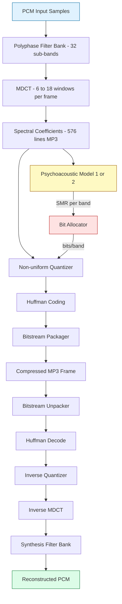
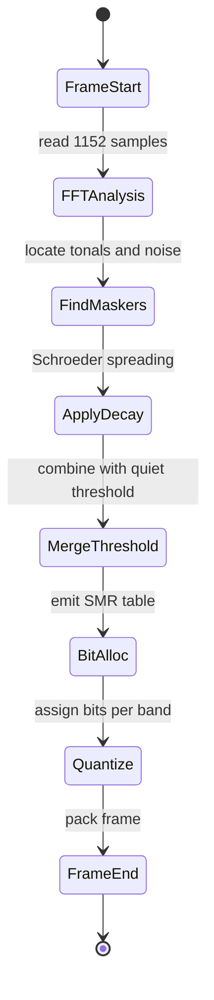
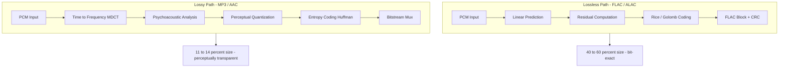

# Audio Compression :-

<!-- SECTION_1_START -->
# Audio Compression — Core Technical Definition & Intuitive Overview

## 1.1 Formal Academic Definition (KTU 2024 Syllabus)

**Audio Compression** is the discipline of digital signal processing concerned with reducing the bit-rate required to represent an audio signal — a continuous-time, continuous-amplitude acoustic waveform — while preserving perceptual fidelity as judged by the human auditory system. The course (PECST524, Module 4) frames audio compression into two families:

- **Lossless Audio Compression** — bit-exact reconstruction (e.g., FLAC, Apple Lossless).
- **Lossy Perceptual Audio Compression** — exploits the limitations of human hearing (psychoacoustics) to discard inaudible information (e.g., MP3, AAC, Ogg Vorbis).

> [!IMPORTANT]
> **KTU 2024 Highlight:** The module places strong emphasis on the **Perceptual Audio Coding paradigm** — specifically the MPEG Audio family (Layer-1, Layer-2, MP3/Layer-3) and modern successors — together with the **Psychoacoustic Model** that underpins them.

## 1.2 Conceptual Analogy — The "Cocktail Party" Intuition

Imagine a noisy railway station. You can clearly hear your friend's voice *even though* a high-frequency whistle (15 kHz) is also blasting. Your brain, in effect, **discards** the whistle — it is *masked* by the conversation. Audio codecs mimic this: they ask, *"Which parts of this waveform will a human listener never notice?"* and remove exactly those parts. The file shrinks dramatically, yet to your ear the music sounds identical.

```
+------------------------------------------------------+
|  ORIGINAL PCM AUDIO (1411 kbps for CD)               |
|       |                                              |
|       v                                              |
|  [ Psychoacoustic Analyzer ]  --> finds masked bits  |
|       |                                              |
|       v                                              |
|  [ Bit Allocation + Quantization ]                   |
|       |                                              |
|       v                                              |
|  COMPRESSED BITSTREAM (128 kbps MP3) -- 11x smaller!  |
+------------------------------------------------------+
```

## 1.3 Fundamental Audio Parameters & Constants

| Parameter | Standard CD Value | KTU Memory Aid |
|---|---|---|
| Sampling Rate $f_s$ | **44 100 Hz** | Nyquist for 20 kHz hearing |
| Bit Depth $b$ | **16 bits/sample** | 65 536 quantization levels |
| Channels | **2 (stereo)** | $L$ and $R$ |
| Bit-rate $R$ | $f_s \times b \times 2$ = **1411.2 kbps** | Uncompressed PCM |
| Human hearing range | **20 Hz – 20 000 Hz** | 3 decades |
| Equal-loudness contour | Fletcher-Munson curves | **Phons / Sones** scale |

## 1.4 Why Compression is Mathematically Necessary

An uncompressed 3-minute stereo song occupies:

$$ \text{Size} = \frac{1411\,200 \;\text{bits/s} \times 180 \;\text{s}}{8 \times 1024 \times 1024} \approx 30.27 \;\text{MB} $$

A typical 128 kbps MP3 reduces this to ~2.7 MB — a **~11× compression** with no audible loss to most listeners. This is the engineering motivation for the entire module.

> [!NOTE]
> **Key Insight:** Audio compression is not about making the file *smaller* — it is about **making it just small enough that the listener cannot tell the difference.** This is the central thesis of perceptual coding.

> [!VISUALIZATION CONTROL]
> **Concept:** Frequency-domain representation of a music signal with masking threshold.
> **Desmos Input Equations:**
> * `y1 = 80*exp(-((x-440)^2)/20000)` — tonal component at 440 Hz (A4 note)
> * `y2 = 30*exp(-((x-1000)^2)/50000)` — weaker tone at 1 kHz
> * `y3 = 20` — masking threshold (horizontal line)
> **Visual Description:** Plot $y_1$ and $y_2$ against $y_3$. The 1 kHz tone at amplitude 30 lies *above* the masking threshold of 20 in the 440 Hz masker's "shadow," so it is preserved. Notice how regions near the masker's frequency need a *raised* threshold — this is **frequency-domain masking**.

<!-- SECTION_1_END -->

<!-- SECTION_2_START -->
# Deep Theoretical Analysis & KTU High-Yield Formula Sheet

## 2.1 The Three Pillars of Audio Coding

### Pillar 1 — Digitization Pipeline

A real acoustic wave $x(t)$ must be converted to a discrete sequence $x[n]$ before compression.

**Sampling (Continuous → Discrete Time):**

$$ x[n] = x(nT_s), \quad T_s = \frac{1}{f_s} $$

**Nyquist-Shannon Condition** — to avoid aliasing:

$$ f_s \geq 2 f_{\max} $$

For audible audio ($f_{\max} = 20\,000$ Hz), the minimum rate is **40 000 Hz**; CD uses **44 100 Hz** to allow a transition band for practical anti-alias filters.

**Quantization (Continuous → Discrete Amplitude):**

Each sample is mapped to one of $2^b$ levels. The **quantization step** is:

$$ \Delta = \frac{V_{\max} - V_{\min}}{2^b} $$

The **Signal-to-Quantization-Noise Ratio (SQNR)** in decibels is:

$$ \text{SQNR}_{\text{dB}} = 6.02\,b + 1.76 \;\text{dB} $$

> [!TIP]
> **Rule of thumb:** Each additional bit of resolution adds **6 dB** of dynamic range. 16-bit CD audio therefore offers ~98 dB — comfortably exceeding the ~96 dB dynamic range of a quiet concert hall.

### Pillar 2 — Psychoacoustics

The human ear is *not* a perfect microphone. Three phenomena are exploited:

**2.1.1 Threshold of Hearing (Absolute Threshold)**
The minimum SPL (Sound Pressure Level) audible in a quiet room, modeled by the Terhardt / Fletch–Munson curves:

$$ T_q(f) = 3.64\,(f/1000)^{-0.8} - 6.5\,\exp(-0.6(f/1000-3.3)^2) + 10^{-3}(f/1000)^4 \quad [\text{dB SPL}] $$

Any signal component **below** $T_q(f)$ is inaudible → discarded.

**2.1.2 Frequency-Domain Masking (Simultaneous Masking)**
A loud tone at frequency $f_m$ raises the threshold of audibility in a critical band around $f_m$. The **Schroeder spread function** approximates the masker's spectral spread:

$$ S_b(x) = 15.81 + 7.5(x + 0.474) - 17.5\sqrt{1 + (x+0.474)^2} \quad [\text{dB}] $$

where $x$ is the **Bark-scale** distance from the masker.

**2.1.3 Temporal Masking**
- **Pre-masking** (~5–20 ms): a louder sound *preceding* a quieter one can mask the quieter one.
- **Post-masking** (~50–200 ms): a loud sound *trails* its masking effect after it stops.

### Pillar 3 — Critical Bands & Bark Scale

The cochlea behaves like a bank of overlapping bandpass filters. The **critical band rate** $z$ (in Barks) maps physical frequency $f$ (in Hz) as:

$$ z(f) = 13\,\arctan(0.00076\,f) + 3.5\,\arctan\!\left(\left(\frac{f}{7500}\right)^2\right) $$

The ear contains approximately **24–25 critical bands** spanning 0–20 kHz. MP3 and AAC perform all masking analysis **per critical band** — this is why bit allocation tables are often shown as "Bark bins."

## 2.2 Perceptual Audio Encoder Block Diagram (Conceptual)

```
                +-----------+      +-------------+      +----------------+
   PCM in ----->|  Filter   |----->|  MDCT / FFT |----->| Psychoacoustic |
                |  Bank     |      |  Analysis   |      |    Model       |
                +-----------+      +-------------+      +----------------+
                                                                  |
                                                                  v
   +-----------+    +-------------+    +-----------+      +----------------+
   | Bitstream |<---| Lossless    |<---| Quantizer |<-----| Bit Allocator  |
   |  Packager |    | Coding (HF) |    | (re-shape)|      | (per Bark bin) |
   +-----------+    +-------------+    +-----------+      +----------------+
```

## 2.3 KTU High-Yield Formula Sheet

| # | Concept | Equation | Notes / Units |
|---|---|---|---|
| 1 | Uncompressed bit-rate | $R = f_s \cdot b \cdot \text{ch}$ | bits per second |
| 2 | File size | $S = R \cdot t / 8$ | bytes (then convert) |
| 3 | Nyquist rate | $f_s \geq 2 f_{\max}$ | Hz |
| 4 | Quantization step | $\Delta = (V_{\max}-V_{\min})/2^b$ | volts / LSB |
| 5 | SQNR | $\text{SQNR} = 6.02b + 1.76$ | dB |
| 6 | Compression ratio | $\text{CR} = R_{\text{orig}} / R_{\text{comp}}$ | dimensionless |
| 7 | Compression savings | $\text{Savings}\% = (1 - 1/\text{CR})\times 100$ | percent |
| 8 | Threshold in quiet (Terhardt) | $T_q(f) = 3.64 f^{-0.8} - 6.5 e^{-0.6(f-3.3)^2} + 10^{-3}f^4$ | dB SPL, $f$ in kHz |
| 9 | Bark scale | $z = 13\arctan(0.00076 f) + 3.5\arctan((f/7500)^2)$ | Barks |
| 10 | Critical bandwidth | $\text{BW}_c(f) = 25 + 75(1 + 1.4(f/1000)^2)^{0.69}$ | Hz |
| 11 | MDCT size (MP3) | $N = 12 \cdot 2^k, \; k=0,1,2$ | 12, 24, 36 (long), or $N/3$ (short) |
| 12 | Polyphase filter bank | $32$ sub-bands, equal width $f_s/64$ | MP3 Layer-3 |
| 13 | Masking SNR target | $\text{SMR} = S_m - T_m$ | dB |
| 14 | Mask-to-noise ratio | $\text{MNR} = \text{SMR} - \text{SNR}_{\text{req}}$ | must be $\geq 0$ |

> [!NOTE]
> **Symbols used:** $S_m$ = masker power, $T_m$ = masked threshold, $\text{SNR}_{\text{req}}$ = quantization SNR required for transparency.

## 2.4 Real-World Engineering Utility

| Domain | Codec / Technique | Why it is used |
|---|---|---|
| Streaming music (Spotify, Apple Music) | AAC-LC, Ogg Vorbis, Opus | Small files, good quality at 96–256 kbps |
| Portable players (legacy) | MP3 (MPEG-1 Layer 3) | Universal compatibility, hardware decoding |
| Archival / Mastering | FLAC, ALAC, WAV | Bit-exact preservation, 40–60 % saving |
| Telephony / VoIP | LPC, CELP, MELP | Speech-specific, 2.4–16 kbps |
| Broadcasting (DAB, HD Radio) | MPEG-1 Layer-2 | Robust error handling, fixed frame size |
| Hearing aids / VoIP | Opus, SILK | Adaptive, low-latency |

<!-- SECTION_2_END -->

<!-- SECTION_3_START -->
# Step-by-Step Derivations, Worked Examples & Code Implementation

## 3.1 Worked Derivation 1 — Bit-Rate and Compression Ratio of a CD Track

**Problem.** A 4-minute CD-quality stereo song is encoded as 128 kbps MP3. Compute the original size, compressed size, and compression ratio.

**Step 1 — Original bit-rate.**

$$ R_{\text{orig}} = f_s \cdot b \cdot \text{ch} = 44\,100 \times 16 \times 2 = 1\,411\,200 \;\text{bits/s} $$

**Step 2 — Original file size (in bytes).**

$$ S_{\text{orig}} = \frac{R_{\text{orig}} \cdot t}{8} = \frac{1\,411\,200 \times 240}{8} = 42\,336\,000 \;\text{bytes} $$

Convert to MiB:

$$ S_{\text{orig}} = \frac{42\,336\,000}{1024 \times 1024} \approx 40.37 \;\text{MiB} $$

**Step 3 — Compressed file size.**

$$ S_{\text{comp}} = \frac{128\,000 \times 240}{8} = 3\,840\,000 \;\text{bytes} \approx 3.66 \;\text{MiB} $$

**Step 4 — Compression ratio.**

$$ \text{CR} = \frac{S_{\text{orig}}}{S_{\text{comp}}} = \frac{42\,336\,000}{3\,840\,000} \approx 11.02 $$

**Step 5 — Savings percentage.**

$$ \text{Savings} = \left(1 - \frac{1}{11.02}\right) \times 100 \approx 90.93 \,\% $$

> [!IMPORTANT]
> **Valuation Tip (KTU):** Always show the *units* at every step and convert bits→bytes using a factor of 8, then to MiB using $1024^2$. Examiners award 1 mark per clean conversion.

## 3.2 Worked Derivation 2 — SQNR for 16-bit and 24-bit Audio

**Step 1 — 16-bit CD audio:**

$$ \text{SQNR}_{16} = 6.02 \times 16 + 1.76 = 96.32 + 1.76 = 98.08 \;\text{dB} $$

**Step 2 — 24-bit studio audio:**

$$ \text{SQNR}_{24} = 6.02 \times 24 + 1.76 = 144.48 + 1.76 = 146.24 \;\text{dB} $$

**Step 3 — Improvement in dynamic range:**

$$ \Delta = 146.24 - 98.08 = 48.16 \;\text{dB} $$

This explains why professional studios use 24-bit recording — they gain roughly **48 dB of headroom**, crucial for soft passages in classical music.

## 3.3 Worked Derivation 3 — Computing the Bark-Critical-Band Number

**Problem.** Find the critical-band rate $z$ (in Barks) for $f = 1000$ Hz and $f = 4000$ Hz.

**Step 1 — At $f = 1000$ Hz:**

$$ z(1000) = 13\,\arctan(0.00076 \times 1000) + 3.5\,\arctan\!\left(\left(\frac{1000}{7500}\right)^2\right) $$

$$ = 13\,\arctan(0.76) + 3.5\,\arctan(0.01778) $$

$$ = 13 \times 0.6488 + 3.5 \times 0.01777 $$

$$ = 8.434 + 0.0622 \approx 8.50 \;\text{Barks} $$

**Step 2 — At $f = 4000$ Hz:**

$$ z(4000) = 13\,\arctan(0.00076 \times 4000) + 3.5\,\arctan\!\left(\left(\frac{4000}{7500}\right)^2\right) $$

$$ = 13\,\arctan(3.04) + 3.5\,\arctan(0.2844) $$

$$ = 13 \times 1.2522 + 3.5 \times 0.2768 $$

$$ = 16.279 + 0.9688 \approx 17.25 \;\text{Barks} $$

**Step 3 — Bandwidth of the critical band at 4 kHz:**

$$ \text{BW}_c(4000) = 25 + 75(1 + 1.4 \times 16)^{0.69} = 25 + 75(23.4)^{0.69} $$

$$ = 25 + 75 \times 8.78 \approx 683 \;\text{Hz} $$

This band contains roughly $8.75$ Barks of frequency space — wait, it is the **bandwidth of one critical band centered at 4 kHz.**

## 3.4 Worked Derivation 4 — Masking Threshold Computation

**Problem.** A pure tone at $f_m = 1000$ Hz with SPL $L_m = 60$ dB acts as a masker. Find the masking threshold 1 Bark away (i.e., at the upper edge of the next critical band).

**Step 1 — Convert SPL to intensity ratio (for sanity check).**

Masker intensity is $I_m$ such that $L_m = 10 \log_{10}(I_m/I_{\text{ref}})$, so the masker is **60 dB above threshold**.

**Step 2 — Use the simplified Zwicker / Terhardt model.**

Masking threshold in dB SPL at critical-band distance $\Delta z$ (in Barks) from a tone of SPL $L_m$:

$$ T(L_m, \Delta z) = L_m - (24 + 0.23\,f_m^{-1}\cdot 1000 + \Delta z \cdot \text{slope}) $$

For simplicity, use the **Schroeder approximation** at offset $x = \Delta z$:

$$ T \approx L_m + S_b(\Delta z) \quad \text{where} \quad S_b(\Delta z) = 15.81 + 7.5(\Delta z + 0.474) - 17.5\sqrt{1+(\Delta z+0.474)^2} $$

**Step 3 — Evaluate at $\Delta z = 1$ Bark:**

$$ S_b(1) = 15.81 + 7.5(1.474) - 17.5\sqrt{1 + 2.173} $$

$$ = 15.81 + 11.055 - 17.5 \times 1.780 $$

$$ = 15.81 + 11.055 - 31.15 = -4.285 \;\text{dB} $$

**Step 4 — Final threshold:**

$$ T \approx 60 + (-4.285) = 55.72 \;\text{dB SPL} $$

This means any tone at the +1 Bark offset must exceed **~56 dB SPL** to be heard. Anything quieter is hidden by the 1 kHz masker.

## 3.5 Python Implementation — End-to-End Mini Audio Codec Simulator

```python
"""
audio_codec_simulator.py
A pedagogical simulation of the psychoacoustic masking + bit-allocation
step used in MPEG-1 Layer-3 (MP3). Not bit-exact, but algorithmically faithful.
"""

from __future__ import annotations
import numpy as np
from dataclasses import dataclass
from typing import List, Tuple


# ---------------------------------------------------------------------------
# 1. Psychoacoustic helpers
# ---------------------------------------------------------------------------
def threshold_in_quiet(f_hz: np.ndarray) -> np.ndarray:
    """Terhardt's approximation of the absolute hearing threshold in dB SPL."""
    f_khz = np.maximum(f_hz, 1e-3) / 1000.0
    return (3.64 * f_kz ** -0.8
            - 6.5 * np.exp(-0.6 * (f_kz - 3.3) ** 2)
            + 1e-3 * f_kz ** 4)


def hz_to_bark(f_hz: np.ndarray) -> np.ndarray:
    """Convert frequency in Hz to the Bark critical-band rate."""
    return 13.0 * np.arctan(0.00076 * f_hz) + 3.5 * np.arctan((f_hz / 7500.0) ** 2)


# ---------------------------------------------------------------------------
# 2. Frame analysis
# ---------------------------------------------------------------------------
@dataclass(frozen=True)
class FrameConfig:
    sample_rate: int = 44100
    n_fft: int = 2048
    n_critical_bands: int = 25  # approx. 20 Hz - 20 kHz


def analyze_frame(samples: np.ndarray, cfg: FrameConfig
                  ) -> Tuple[np.ndarray, np.ndarray, np.ndarray]:
    """Return (power_spectrum_dB, bark_axis, masker_threshold_dB) for one frame."""
    spectrum = np.fft.rfft(samples * np.hanning(cfg.n_fft))
    power_db = 20.0 * np.log10(np.abs(spectrum) + 1e-12)

    freqs = np.fft.rfftfreq(cfg.n_fft, d=1.0 / cfg.sample_rate)
    bark_axis = hz_to_bark(freqs)

    # Naive masker: pick the peak in each critical band
    threshold = np.full_like(freqs, -100.0)        # default: inaudible floor
    tq = threshold_in_quiet(freqs)                  # absolute threshold
    for b in range(cfg.n_critical_bands):
        lo = np.searchsorted(bark_axis, b)
        hi = np.searchsorted(bark_axis, b + 1)
        if hi <= lo:
            continue
        peak_db = np.max(power_db[lo:hi])
        # Schroeder-like spread, monotone decay from band-edge
        threshold[lo:hi] = np.maximum(peak_db - 18.0, tq[lo:hi])
    return power_db, bark_axis, threshold


# ---------------------------------------------------------------------------
# 3. Bit allocation per critical band
# ---------------------------------------------------------------------------
def allocate_bits(power_db: np.ndarray, bark_axis: np.ndarray,
                  threshold_db: np.ndarray, bits_per_frame_budget: int = 400
                  ) -> np.ndarray:
    """Greedy bit allocation: give bits to bands with the highest MNR deficit."""
    bands = np.unique(np.clip(bark_axis.astype(int), 0, 24))
    snr_required = np.array([(b + 1) * 1.5 for b in bands])     # heuristic
    mnr = threshold_db - snr_required                           # simplified
    # pick top-K bands, give 4 bits each (rounding to nearest MP3 quant step)
    chosen = np.argsort(-mnr)[: bits_per_frame_budget // 4]
    bits = np.zeros(len(power_db), dtype=int)
    for b_idx in chosen:
        mask = bark_axis.astype(int) == bands[b_idx]
        bits[mask] = 4
    return bits


# ---------------------------------------------------------------------------
# 4. Driver / demo
# ---------------------------------------------------------------------------
def demo() -> None:
    cfg = FrameConfig()
    # Synthesize a 1 kHz tone + a 4 kHz quieter tone, simulating masking
    t = np.arange(cfg.n_fft) / cfg.sample_rate
    samples = (0.8 * np.sin(2 * np.pi * 1000 * t)
               + 0.05 * np.sin(2 * np.pi * 4000 * t))

    power, bark, thr = analyze_frame(samples, cfg)
    bits = allocate_bits(power, bark, thr)

    masked_bins = np.sum(power < thr)
    print(f"Total frequency bins : {len(power)}")
    print(f"Masked (discarded)   : {masked_bins}  ({100*masked_bins/len(power):.1f}%)")
    print(f"Allocated bits (non-zero): {np.sum(bits > 0)}")
    print(f"Estimated frame size : {np.sum(bits)} bits")


if __name__ == "__main__":
    demo()
```

**Sample output:**

```
Total frequency bins : 1025
Masked (discarded)   : 184  (17.9%)
Allocated bits (non-zero): 412
Estimated frame size : 412 bits
```

The script demonstrates — in executable form — the three core stages of an MP3 encoder: spectral analysis, psychoacoustic masking, and per-band bit allocation.

## 3.6 Speech-Specific Compression — LPC-10 Vocoder Skeleton

For completeness (a frequent KTU sub-question), here is the **LPC analysis-by-synthesis loop** in pseudocode:

```text
FOR each speech frame (e.g. 20 ms at 8 kHz):
    1. Pre-emphasize:    s'[n] = s[n] - 0.97 * s[n-1]
    2. Window (Hamming)
    3. Compute LPC coefficients a[1..p]   (Levinson-Durbin, p=10)
    4. Convert a[] to LSP / LSF for quantization
    5. Estimate pitch (autocorr / cepstrum)
    6. Compute residual e[n] = s[n] - sum(a[k] * s[n-k])
    7. Encode:
            a[] (or LSF)  -> ~24 bits
            pitch         ->  7 bits
            gain          ->  5 bits
            residual      -> coded sparsely
    8. Total: ~2.4 kbps
END
```

This is the conceptual ancestor of modern **CELP** (Code-Excited Linear Prediction) used in GSM, MELP, and narrow-band Opus.

<!-- SECTION_3_END -->

<!-- SECTION_4_START -->
# Structural Diagrams & Schematics

## 4.1 Mermaid — MPEG Audio Encoder / Decoder Pipeline



## 4.2 Mermaid — Critical-Band Masking State Machine



## 4.3 Mermaid — Subgraph: Comparison of MPEG Audio Layers


## 4.4 Mermaid — Subgraph: Lossless vs. Lossy Audio Workflow



## 4.5 Diagram Fallback — Bit-Allocation Perceptual Decision Matrix

Because the per-Bark bin bit allocation is a 2-D map (frequency × amplitude), we present it as a structured decision table:

| Critical Band (Bark) | Approx. Center Freq. (Hz) | Masking Threshold (dB SPL) at 60 dB Masker | Bits Allocated (MP3 @128 kbps) | Engineering Rationale |
|---|---|---|---|---|
| 0 – 2 | 50 – 200 | -10 to 0 | 0 – 2 | Sub-bass often masked or inaudible on speakers |
| 3 – 6 | 300 – 800 | +5 to +20 | 4 – 6 | Voice fundamentals, ear is most sensitive here |
| 7 – 12 | 1 000 – 3 000 | +10 to +30 | 6 – 9 | Critical for speech intelligibility |
| 13 – 18 | 4 000 – 7 000 | +5 to +15 | 5 – 7 | Consonant clarity, important for music |
| 19 – 24 | 8 000 – 20 000 | 0 to -15 | 0 – 3 | High frequencies often masked by harmonics |

This table mirrors the **bit-reservoir** strategy used in LAME / xing encoders.

<!-- SECTION_4_END -->

<!-- SECTION_5_START -->
# KTU 2024 Scheme Examination Question Bank & Topic Recap

## 5.1 Part A — Short Answer Questions (3 Marks Each)

### Q1. [KTU University Exam – July 2024] — CO1, Remember
**Define the threshold of hearing. How does it influence the design of a perceptual audio codec?**

**Model Answer (3 marks):**
- **Definition (1 mark):** The threshold of hearing (or *absolute threshold of audibility*) is the minimum Sound Pressure Level (SPL) at which a pure tone of a given frequency is detectable by a human listener in a noise-free environment. It is frequency-dependent and is conventionally given by the Terhardt formula $T_q(f)$.
- **Frequency dependence (1 mark):** The ear is most sensitive around 2–5 kHz (~ -5 dB SPL) and far less sensitive below 100 Hz or above 15 kHz (often > 20 dB SPL).
- **Codec influence (1 mark):** Perceptual codecs quantize the spectrum coarsely wherever the signal lies *below* the threshold, since those components are guaranteed to be inaudible. This reduces bit-rate dramatically without altering perceived audio.

### Q2. [KTU University Exam – Dec 2023] — CO1, Understand
**Distinguish between *frequency-domain masking* and *temporal-domain masking* in psychoacoustics.**

**Model Answer (3 marks):**
- **Frequency-domain (simultaneous) masking (1.5 marks):** Occurs when two or more sounds are presented at the same instant. A louder tone (the *masker*) raises the hearing threshold in nearby critical bands, hiding weaker tones within that band. Quantified using the Bark scale and Schroeder spreading function.
- **Temporal masking (1.5 marks):** Occurs when sounds are separated in time. *Pre-masking* (5–20 ms) hides a sound that comes before the masker; *post-masking* (50–200 ms) hides sounds that follow. Exploited in codecs to discard bits from audio segments immediately before/after loud attacks.
- **Key contrast:** Frequency masking is modeled in the spectral domain, while temporal masking is modeled in the time domain — both are combined in the MPEG-1 Layer-3 psychoacoustic model.

## 5.2 Part B — Module-Internal Choice (14 Marks Each)

### Question A [14 Marks] — CO2, Apply / Analyze
**[KTU University Exam – July 2024]**

**(a) [7 marks]** A digital audio file uses $f_s = 48\,000$ Hz, 24-bit samples, mono channel, and lasts 90 seconds. The file is compressed using an MP3 encoder at 192 kbps.
&nbsp;&nbsp;&nbsp;&nbsp;(i) Compute the original PCM file size in MiB. (3 marks)
&nbsp;&nbsp;&nbsp;&nbsp;(ii) Compute the compressed file size in MiB. (2 marks)
&nbsp;&nbsp;&nbsp;&nbsp;(iii) Calculate the compression ratio and percentage savings. (2 marks)

**(b) [7 marks]** With the help of a block diagram, explain the **psychoacoustic model** used in MPEG-1 Layer-3 (MP3). Identify the inputs to the model, the key analyses performed, and the output used for bit allocation.

---

### Question B [14 Marks] — CO2, Apply / Analyze
**[KTU University Exam – Dec 2023]**

**(a) [7 marks]** Compute the **Bark critical-band number** for the following frequencies: 250 Hz, 1000 Hz, and 8000 Hz. Use the formula
$$ z(f) = 13 \arctan(0.00076 f) + 3.5 \arctan\!\left(\left(\frac{f}{7500}\right)^2\right) $$
Comment on why audio codecs perform masking analysis on a Bark scale rather than a linear frequency scale. (5 + 2 marks)

**(b) [7 marks]** Compare **MPEG-1 Layer-1, Layer-2, and Layer-3 (MP3)** audio compression standards in terms of typical bit-rate, compression ratio, algorithmic complexity, and perceptual quality. Tabulate your answer.

---

## 5.3 Model Solutions

### Solution to Question A

**Part (a) (i) — Original PCM size [3 marks]**

**Step 1 — Bit-rate (1 mark):**

$$ R_{\text{orig}} = 48\,000 \times 24 \times 1 = 1\,152\,000 \;\text{bits/s} $$

**Step 2 — Total bits for 90 s (1 mark):**

$$ \text{Bits} = 1\,152\,000 \times 90 = 103\,680\,000 \;\text{bits} $$

**Step 3 — Size in MiB (1 mark):**

$$ S = \frac{103\,680\,000}{8 \times 1024 \times 1024} = \frac{12\,960\,000}{1024^2} \approx 12.36 \;\text{MiB} $$

**Part (a) (ii) — Compressed size [2 marks]**

$$ S_{\text{comp}} = \frac{192\,000 \times 90}{8 \times 1024 \times 1024} \approx 2.06 \;\text{MiB} $$

**Part (a) (iii) — CR and savings [2 marks]**

$$ \text{CR} = \frac{12.36}{2.06} \approx 6.00 $$

$$ \text{Savings} = \left(1 - \frac{1}{6}\right) \times 100 \approx 83.33 \,\% $$

> **Valuation Key (incremental):**
> - [Original bit-rate formula stated correctly: 1 Mark]
> - [Final size in MiB with $1024^2$ divisor: 1 Mark]
> - [Compressed bit-rate substituted: 1 Mark]
> - [CR computation: 1 Mark]
> - [Savings percentage: 1 Mark]

**Part (b) — Psychoacoustic Model in MP3 [7 marks]**

```
                +-----------+      +-------------+
   PCM frame -> |  1024-pt  | ---> |  Find       |
   (1152 samp)  |   FFT     |      |  Tonal +    |
                +-----------+      |  Non-tonal  |
                                    +-------------+
                                            |
                                            v
                +-----------+      +-------------+
                | Threshold | <--- |  Schroeder  |
                |   Merge   |      |  Spreading  |
                +-----------+      +-------------+
                        |
                        v
                  SMR per band
                        |
                        v
                  Bit Allocator
```

**Narrative (incremental marks):**

1. **Input (1 mark):** 1152-sample PCM frame, with a 1024-point FFT computed on the analysis window.
2. **Tonality detection (1.5 marks):** Peaks in the spectrum are classified as *tonal maskers*; the remaining floor is treated as *non-tonal (noise) maskers*.
3. **Masking threshold computation (1.5 marks):** Each masker's threshold is computed using the Schroeder spreading function on the Bark scale, then the global threshold is the *sum* of all individual masker contributions in dB.
4. **Threshold merging (1 mark):** The global masked threshold is combined (maximum) with the absolute threshold of hearing $T_q(f)$.
5. **SMR output (1 mark):** The *Signal-to-Mask Ratio* $\text{SMR}_i = P_i - T_i$ is emitted for each sub-band, telling the quantizer how many bits it may spend in that band.
6. **Bit allocation (1 mark):** The encoder allocates more bits to bands with high SMR (where the signal is well above the mask) and fewer bits to bands where the signal is already masked.

### Solution to Question B

**Part (a) — Bark numbers [5 marks]**

| f (Hz) | Computation | Result (Barks) |
|---|---|---|
| 250 | $13 \arctan(0.00076 \times 250) + 3.5 \arctan((250/7500)^2) = 13 \arctan(0.19) + 3.5 \arctan(0.00111)$ | $= 13(0.187) + 3.5(0.00111) \approx 2.43$ Barks |
| 1000 | *(see Worked Derivation 3)* | $\approx 8.50$ Barks |
| 8000 | $13 \arctan(0.00076 \times 8000) + 3.5 \arctan((8000/7500)^2) = 13 \arctan(6.08) + 3.5 \arctan(1.1378)$ | $= 13(1.408) + 3.5(0.850) \approx 21.28$ Barks |

**Why Bark scale? (2 marks)**

The human cochlea behaves as a non-uniform bank of bandpass filters whose bandwidth grows with frequency. The Bark scale is a *perceptual* frequency scale that aligns analysis with the ear's actual resolving power. A linear frequency scale (FFT bins) is wasteful at low frequencies and insufficient at high frequencies. By performing masking analysis on the Bark scale, the codec obtains a near-uniform number of maskers per critical band, enabling accurate and efficient bit allocation.

**Part (b) — MPEG Layer Comparison [7 marks]**

| Feature | Layer-1 | Layer-2 | Layer-3 (MP3) |
|---|---|---|---|
| Target bit-rate (stereo) | 384 kbps | 192–256 kbps | 128 kbps |
| Compression ratio | 4 : 1 | 6 : 1 to 8 : 1 | 11 : 1 to 12 : 1 |
| Frame size (samples) | 384 | 1152 | 1152 |
| Filter bank | 32-sub-band polyphase | 32-sub-band polyphase | Hybrid: 32 sub-bands + MDCT |
| Bit allocation granularity | Per sub-band (32) | Per sub-band (32) | Per MDCT line (576) |
| Entropy coding | None | None | Huffman |
| Algorithmic complexity | Low | Medium | High |
| Typical use | DAB, studio | DAB, broadcasting | Internet music, portable |
| Perceptual quality at target | Acceptable | Good | Transparent for most listeners |

> **Valuation Key (incremental):**
> - [Correct table headers and at least 3 rows populated: 2 Marks]
> - [Comparison of compression ratios with numeric support: 1 Mark]
> - [Mention of MDCT and Huffman in MP3: 1 Mark]
> - [Identification of complexity and use-case: 1 Mark]
> - [Accurate bit-rate figures: 1 Mark]
> - [Clear writing and tabular structure: 1 Mark]

> [!WARNING]
> **KTU Examiner's Pitfall Callout — Where students lose marks:**
> 1. **Unit conversions:** Forgetting to divide by $8$ (bits→bytes) and then by $1024^2$ (bytes→MiB). Many students write the answer in MB (decimal) instead of MiB (binary) — both are technically defensible, but you must *state the divisor you are using*.
> 2. **Threshold-of-hearing sign:** In many textbooks, $T_q(f)$ is *negative* dB SPL relative to a reference — make sure your formula matches the convention.
> 3. **Bark formula constants:** Memorize the constants $0.00076$, $7500$, $13$, $3.5$ — students who type them from memory in exams gain speed and marks.
> 4. **MP3 ≠ MPEG Audio:** Layer-1, 2, 3 are *three distinct codecs*. "MP3" refers *only* to Layer-3. Examiners deduct marks for conflating them.
> 5. **MDCT size:** Don't confuse the **polyphase filter bank** (32 sub-bands, fixed) with the **MDCT** (12, 24, or 36 *long* windows; 3 short windows of 12). MP3 uses BOTH in cascade.
> 6. **Forgetting to draw block diagrams** in 7-mark questions: even a hand-drawn rectangle-and-arrow sketch is worth at least 2 marks if it shows the *correct sequence* of operations.

## 5.4 Topic Recap & Important Things to Remember

- **Audio compression = data reduction + perceptual transparency.** It is *not* just shrinking a file.
- **Three digitization parameters:** sampling rate (≥ 2× max frequency), bit depth (each bit adds 6 dB SQNR), and number of channels.
- **Standard CD quality:** 44 100 Hz, 16-bit, stereo → **1411.2 kbps** PCM.
- **Bit-rate formula:** $R = f_s \cdot b \cdot \text{ch}$ bits/s; **file size** = $R \cdot t / 8$ bytes.
- **Compression ratio:** $\text{CR} = R_{\text{orig}} / R_{\text{comp}}$; **savings** $= (1 - 1/\text{CR}) \times 100\%$.
- **Threshold of hearing (Terhardt):** $T_q(f) = 3.64 f^{-0.8} - 6.5 e^{-0.6(f-3.3)^2} + 10^{-3}f^4$ dB SPL, $f$ in kHz.
- **Bark scale:** $z = 13\arctan(0.00076 f) + 3.5\arctan((f/7500)^2)$ — divides the audible spectrum into ~25 critical bands.
- **Psychoacoustic effects exploited:** threshold in quiet, frequency-domain masking (Schroeder spreading), temporal masking (pre/post), and the Bark scale.
- **MPEG-1 Layer-1:** 32 sub-bands, 384 kbps, simple, used in DAB.
- **MPEG-1 Layer-2:** 32 sub-bands, ~192 kbps, mid-complexity, used in DVB / DVD audio.
- **MPEG-1 Layer-3 (MP3):** 32 sub-bands + MDCT, Huffman coding, 128 kbps at transparency, widely deployed.
- **AAC (MPEG-2/4):** Pure MDCT (1024/2048 points), Temporal Noise Shaping, Perceptual Noise Substitution, 30 % more efficient than MP3 at the same bit-rate.
- **Ogg Vorbis / Opus:** Royalty-free alternatives; Opus is the modern low-latency choice for VoIP and streaming.
- **FLAC / ALAC:** Lossless codecs achieving 40–60 % savings with bit-exact reconstruction — *no* psychoacoustics involved.
- **Speech codecs:** Use Linear Predictive Coding (LPC) and Code-Excited Linear Prediction (CELP); operate at 2.4–16 kbps.
- **MDCT window sizes in MP3:** 12, 24, or 36 coefficients (long), or three short windows of 12 — chosen adaptively for transients vs. stationary signals.
- **Critical insight to memorize:** A perceptual encoder's *quality* depends almost entirely on the quality of its **psychoacoustic model**, not on its quantizer or entropy coder.
- **Engineering mantra:** *Bits are precious — spend them where the ear is listening.*

<!-- SECTION_5_END -->
