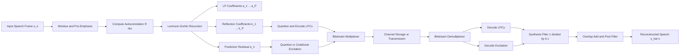
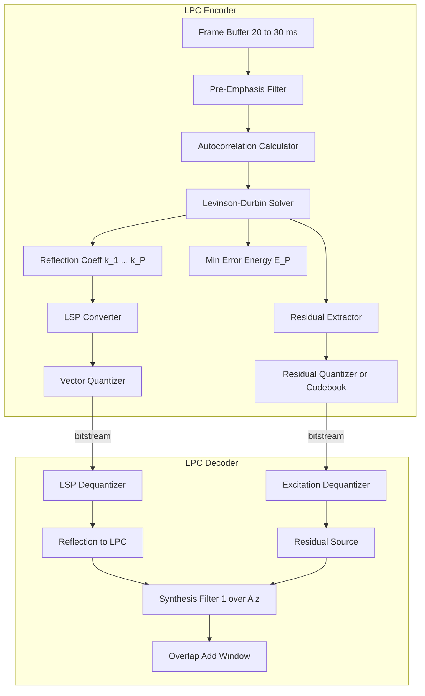
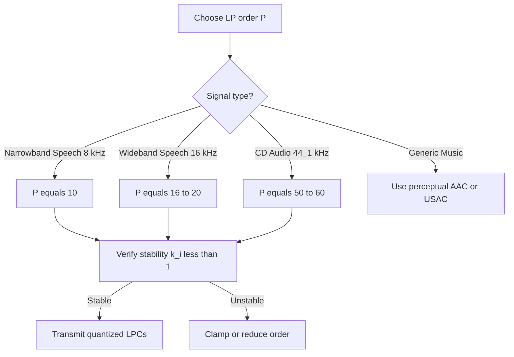
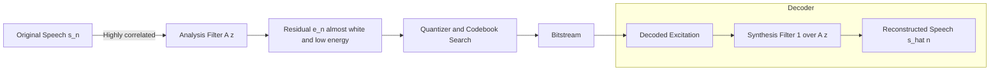

# Linear Prediction

<!-- SECTION_1_START -->

# Linear Prediction in Audio Compression

## 1.1 Formal Academic Definition (KTU 2024 Syllabus Terminology)

**Linear Prediction (LP)** is a mathematical technique used in audio and speech signal processing where a future (or current) sample of a discrete-time signal is approximated as a *linear combination* of its past samples. The principle forms the analytical backbone of **Linear Predictive Coding (LPC)**, which is the foundational paradigm behind virtually every modern low-bit-rate speech and audio codec (e.g., **CELP**, **MELP**, **LPC-10**, **Speex**, **Opus**).

> [!IMPORTANT]
> **Core Definition (Board-Critical):**  
> Linear Prediction estimates the present sample $\hat{s}(n)$ of a signal as a linear weighted sum of the $P$ most recent past samples:
> $$\hat{s}(n) = \sum_{k=1}^{P} a_k \cdot s(n-k)$$
> where $a_k$ are the **Linear Prediction Coefficients (LPCs)** and $P$ is the **prediction order**. The prediction error (residual) is $e(n) = s(n) - \hat{s}(n)$.

## 1.2 Conceptual Analogy / Intuitive Overview

Imagine you are listening to a lecturer speak. Your brain subconsciously uses the *previous few words*, the *tone of voice*, and *mouth shape* to **predict** the *next word* even before it is uttered. This is exactly how Linear Prediction works on an audio signal — it uses the *recent history* of the waveform to extrapolate the next sample.

| Domain | Predictor | "Past" History | "Future" |
|---|---|---|---|
| Weather Forecast | Tomorrow's Temperature | Last 7 days' temperatures | $\hat{T}_{n+1}$ |
| Text Autocomplete | Next Word | Last 3–4 words typed | $\hat{w}_{n+1}$ |
| **Linear Prediction** | **Next Audio Sample** | **Last $P$ audio samples** | $\hat{s}(n)$ |

> [!NOTE]
> The "linear" in Linear Prediction refers to the fact that the predictor is a *linear* function of the past samples (weighted sum, not multiplication of samples with each other). It is the **simplest non-trivial model** that exploits the strong *sample-to-sample correlation* present in speech and music signals.

## 1.3 Physical Constants and Engineering Metrics

- **Sampling Rate ($f_s$):** $8\ \text{kHz}$ (narrowband speech), $16\ \text{kHz}$ (wideband speech), $44.1\ \text{kHz}$ (CD audio).
- **Typical Prediction Order ($P$):** **$P = 10$** for narrowband speech (telephony), $P = 16$ to $20$ for wideband speech, $P = 50$–$60$ for music.
- **Frame Duration:** Speech parameters are computed over short *stationary* frames of $\mathbf{20}$–$\mathbf{30\ ms}$ (160–240 samples at 8 kHz).
- **Minimum Mean Square Error ($E_P$):** Residual energy after optimal prediction; directly quantized and transmitted in CELP-style codecs.

> [!VISUALIZATION CONTROL]
> **Concept:** Visualizing the prediction residual $e(n)$ vs. original signal $s(n)$
> **Plot Inputs (Desmos / Python-Matplotlib):**
> * `s(n) = sin(0.2*n) + 0.5*sin(0.5*n)` (sample speech-like signal)
> * `a_1 = 1.5, a_2 = -0.7` (example LPC weights)
> * `s_hat(n) = a_1*s(n-1) + a_2*s(n-2)` (predicted)
> * `e(n) = s(n) - s_hat(n)` (residual)
> **Visual Description:** The residual $e(n)$ will appear *much smaller in amplitude* and *whiter* (more noise-like, less correlated) than $s(n)$. This *decorrelation* of the signal is the engineering goal — because a white, low-energy residual is far cheaper to encode.

---

<!-- SECTION_1_END -->

<!-- SECTION_2_START -->

# Deep Theoretical Analysis & KTU High-Yield Formula Sheet

## 2.1 The Forward Linear Predictor

A predictor of order $P$ computes an estimate $\hat{s}(n)$ of the current sample $s(n)$ from the $P$ immediate past samples:

$$\hat{s}(n) = \sum_{k=1}^{P} a_k \cdot s(n-k)$$

The **prediction error (residual)** is the mismatch between actual and predicted samples:

$$e(n) = s(n) - \hat{s}(n) = s(n) - \sum_{k=1}^{P} a_k \cdot s(n-k)$$

This can be written in $z$-domain as:

$$E(z) = S(z) \cdot A(z) \quad \text{where} \quad A(z) = 1 - \sum_{k=1}^{P} a_k z^{-k}$$

$A(z)$ is called the **innovation / analysis filter** (or **LPC polynomial**), and $1/A(z)$ is the **synthesis filter** which reconstructs speech from the residual inside the decoder.

## 2.2 The Optimality Criterion — Minimum Mean Square Error (MMSE)

The predictor coefficients $\{a_k\}$ are chosen to **minimize the expected squared prediction error**:

$$E_P = \mathbb{E}\left[e^2(n)\right] = \mathbb{E}\left[\left(s(n) - \sum_{k=1}^{P} a_k s(n-k)\right)^2\right]$$

### Why MMSE?
- **Mathematical tractability** — yields a *closed-form linear* solution.
- **Orthogonality principle** — minimizing MSE forces the error to be *orthogonal* to every past sample used in prediction:
$$\frac{\partial E_P}{\partial a_j} = 0 \quad \Rightarrow \quad \mathbb{E}[e(n)\cdot s(n-j)] = 0 \quad \text{for } j=1,2,\dots,P$$

> [!TIP]
> **Engineering Insight:** The orthogonality principle means the residual $e(n)$ becomes *white* (uncorrelated with all past samples). This is why LPC is so powerful — it *decorrelates* the signal, making subsequent quantization far more efficient.

## 2.3 Yule–Walker Equations

Applying the orthogonality condition leads to a system of $P$ linear equations — the **Yule–Walker (Normal) Equations**:

$$\sum_{k=1}^{P} a_k \cdot R(j-k) = R(j) \quad \text{for } j = 1, 2, \dots, P$$

where $R(\tau) = \mathbb{E}[s(n) \cdot s(n+\tau)]$ is the **autocorrelation function** of the signal.

In matrix form ($\mathbf{R}\,\mathbf{a} = \mathbf{r}$):

$$\begin{bmatrix}
R(0) & R(1) & \cdots & R(P-1) \\
R(1) & R(0) & \cdots & R(P-2) \\
\vdots & \vdots & \ddots & \vdots \\
R(P-1) & R(P-2) & \cdots & R(0)
\end{bmatrix}
\begin{bmatrix} a_1 \\ a_2 \\ \vdots \\ a_P \end{bmatrix}
=
\begin{bmatrix} R(1) \\ R(2) \\ \vdots \\ R(P) \end{bmatrix}$$

The **minimum residual energy** for the optimal predictor is:

$$E_P = R(0) - \sum_{k=1}^{P} a_k R(k)$$

## 2.4 KTU Formula Sheet (Cheat Sheet)

| Formula / Term | Mathematical Form | Engineering Meaning | Typical Range / Unit |
|---|---|---|---|
| Forward Predictor | $\hat{s}(n) = \sum_{k=1}^{P} a_k s(n-k)$ | Estimated current sample | — |
| Prediction Error | $e(n) = s(n) - \hat{s}(n)$ | Residual (innovation) | $-1$ to $+1$ (normalized) |
| Analysis Filter (LPC Poly) | $A(z) = 1 - \sum_{k=1}^{P} a_k z^{-k}$ | Whiten the signal | All roots inside unit circle |
| Synthesis Filter | $H(z) = 1/A(z)$ | Recreate signal from residual | Used at decoder |
| MMSE Cost | $E_P = \mathbb{E}[e^2(n)]$ | Energy to be quantized | Joules (normalized) |
| Yule–Walker Eq. | $\sum_{k=1}^{P} a_k R(\vert j-k\vert) = R(j)$ | Linear system for LPCs | Symmetric Toeplitz |
| Min. Residual Energy | $E_P = R(0) - \sum_{k=1}^{P} a_k R(k)$ | Final innovation power | $\ge 0$ |
| Autocorrelation | $R(\tau) = \mathbb{E}[s(n) s(n+\tau)]$ | Sample similarity measure | $R(0)$ = signal power |
| Levinson Recursion | $a_k^{(i)} = a_k^{(i-1)} - k_i \cdot a_{i-k}^{(i-1)}$ | Fast $O(P^2)$ solver | $\vert k_i\vert < 1$ for stability |
| Reflection Coeff. | $k_i = \frac{R(i) - \sum_{j=1}^{i-1} a_j^{(i-1)} R(i-j)}{E_{i-1}}$ | PARCOR, line spectral pair link | $-1 < k_i < 1$ |

> [!IMPORTANT]
> **Stability Constraint (Board-Exam Favourite):** All roots of $A(z)$ must lie *inside* the unit circle in the $z$-plane. Equivalently, **all reflection coefficients $k_i$ must satisfy $\vert k_i \vert < 1$**. This guarantees a *minimum-phase* (stable, causal) synthesis filter $1/A(z)$ at the decoder.

## 2.5 Real-World Engineering Applications

| Domain | Specific Codec / System | Why LP is Used |
|---|---|---|
| Telephony (2G/3G) | GSM Full-Rate (LPC-10), VSELP | 2.4–13 kbps speech |
| VoLTE / 4G / 5G | **AMR-WB**, **EVS** | LP models vocal tract |
| VoIP (WhatsApp, Skype) | Opus, Silk, Speex | Adaptive LP order 10–24 |
| Music Streaming | AAC-LC, xHE-AAC, USAC | High-order LP for tonal signals |
| Speech Recognition | Kaldi, Whisper front-ends | LP-derived MFCCs |
| Speaker ID / Forensics | LP residual / LPCC features | Robust to channel distortion |

---

<!-- SECTION_2_END -->

<!-- SECTION_3_START -->

# Step-by-Step Derivations, Recursion, and Code Implementation

## 3.1 Derivation of the Yule–Walker Equations (From First Principles)

We want to minimize the mean-square prediction error:

$$E_P = \mathbb{E}\!\left[\left(s(n) - \sum_{k=1}^{P} a_k s(n-k)\right)^{\!2}\right]$$

**Step 1 — Expand the square:**

$$E_P = \mathbb{E}\!\left[s^2(n) - 2s(n)\sum_{k=1}^{P}a_k s(n-k) + \left(\sum_{k=1}^{P}a_k s(n-k)\right)^{\!2}\right]$$

**Step 2 — Pull the expectation inside (linearity of expectation):**

$$E_P = R(0) - 2\sum_{k=1}^{P} a_k R(k) + \sum_{k=1}^{P}\sum_{j=1}^{P} a_k a_j R(j-k)$$

where we use $R(\tau) = \mathbb{E}[s(n) s(n+\tau)]$.

**Step 3 — Differentiate w.r.t. $a_j$ and set to zero (orthogonality):**

$$\frac{\partial E_P}{\partial a_j} = -2R(j) + 2\sum_{k=1}^{P} a_k R(j-k) = 0$$

**Step 4 — Rearrange into the canonical Yule–Walker form:**

$$\boxed{\sum_{k=1}^{P} a_k\, R(j-k) = R(j), \qquad j = 1, 2, \dots, P}$$

**Step 5 — Substitute the optimal solution back to get the minimum error energy:**

$$E_P^{\min} = R(0) - \sum_{k=1}^{P} a_k R(k) \quad \text{(by plug-back of optimality)}$$

## 3.2 The Levinson–Durbin Algorithm ($O(P^2)$ Solver)

The Yule–Walker system has a **Toeplitz (constant-diagonal) autocorrelation matrix**, so it can be solved in $O(P^2)$ instead of $O(P^3)$ using **Levinson–Durbin recursion**.

> [!NOTE]
> The Levinson–Durbin algorithm is the *only* practically used solver in real-time audio codecs because speech frames are short and computational budget is tight. It also outputs the **reflection coefficients $k_i$** and **partial residual energies $E_i$** as a by-product — both are used for stability checks and quantization.

### Recursive Procedure (Initialization → Update → Termination)

| Step | Equation | Purpose |
|---|---|---|
| Init | $E_0 = R(0)$ | Starting residual energy |
| Loop $i = 1 \dots P$ | $k_i = \dfrac{R(i) - \sum_{j=1}^{i-1} a_j^{(i-1)} R(i-j)}{E_{i-1}}$ | Compute reflection coefficient |
| Update | $a_i^{(i)} = k_i$ | Highest-order LPC |
| Update | $a_j^{(i)} = a_j^{(i-1)} - k_i \cdot a_{i-j}^{(i-1)}$ for $j=1\dots i-1$ | Refresh lower-order LPCs |
| Update | $E_i = E_{i-1}\,(1 - k_i^2)$ | New residual energy |
| Output | $\{a_1, \dots, a_P\} = \{a_1^{(P)}, \dots, a_P^{(P)}\}$ | Final predictor |

## 3.3 Worked Numerical Example ($P=2$ Predictor)

**Given:** A stationary signal with autocorrelation values $R(0) = 1.00$, $R(1) = 0.80$, $R(2) = 0.50$.

**Step 1 — Write the Yule–Walker equations for $P=2$:**

$$\begin{aligned}
a_1 R(0) + a_2 R(1) &= R(1) \\
a_1 R(1) + a_2 R(0) &= R(2)
\end{aligned}
\quad\Rightarrow\quad
\begin{aligned}
1.00\,a_1 + 0.80\,a_2 &= 0.80 \\
0.80\,a_1 + 1.00\,a_2 &= 0.50
\end{aligned}$$

**Step 2 — Solve by Cramer's rule.**  
Determinant $\Delta = (1.00)(1.00) - (0.80)(0.80) = 1 - 0.64 = 0.36$.

$$a_1 = \frac{(0.80)(1.00) - (0.80)(0.50)}{0.36} = \frac{0.80 - 0.40}{0.36} = \frac{0.40}{0.36} = 1.111$$

$$a_2 = \frac{(1.00)(0.50) - (0.80)(0.80)}{0.36} = \frac{0.50 - 0.64}{0.36} = \frac{-0.14}{0.36} = -0.389$$

**Step 3 — Minimum residual energy:**

$$E_2 = R(0) - a_1 R(1) - a_2 R(2) = 1.00 - (1.111)(0.80) - (-0.389)(0.50) = 1.00 - 0.889 + 0.194 = 0.305$$

**Step 4 — Verify stability using reflection coefficients:**  
$k_1 = R(1)/R(0) = 0.80$.  
$k_2 = \frac{R(2) - a_1 R(1)}{E_1} = \frac{0.50 - (0.80)(0.80)}{1 - 0.80^2} = \frac{-0.14}{0.36} = -0.389$.

Both $\vert k_1\vert = 0.80 < 1$ and $\vert k_2\vert = 0.389 < 1$ → **System is stable.** ✓

## 3.4 Full Python Implementation (LPC + Levinson–Durbin)

```python
"""
linear_prediction.py
Reference implementation of the Levinson-Durbin Linear Prediction
algorithm for the DATA COMPRESSION (PECST524) KTU Module 4 syllabus.
"""

from __future__ import annotations
import numpy as np
from typing import Tuple


def levinson_durbin(r: np.ndarray, order: int) -> Tuple[np.ndarray, np.ndarray, np.ndarray]:
    """
    Solve Yule-Walker equations via the Levinson-Durbin recursion.

    Parameters
    ----------
    r : np.ndarray
        Autocorrelation sequence of the input signal of length >= order+1.
        r[0] = R(0), r[1] = R(1), ... r[P] = R(P).
    order : int
        Predictor order P (number of LPCs to compute).

    Returns
    -------
    a : np.ndarray
        Linear Prediction Coefficients of length P (a[0]..a[P-1]).
    k : np.ndarray
        Reflection coefficients (PARCOR) of length P.
    e : np.ndarray
        Residual energies E_0..E_P of length P+1.
    """
    if order < 1:
        raise ValueError("Prediction order must be >= 1.")
    if r.size < order + 1:
        raise ValueError("Autocorrelation vector too short for requested order.")

    a_prev = np.zeros(order, dtype=np.float64)   # a^(i-1)
    a_curr = np.zeros(order, dtype=np.float64)   # a^(i)
    k = np.zeros(order, dtype=np.float64)        # reflection coeffs
    e = np.zeros(order + 1, dtype=np.float64)    # residual energies
    e[0] = r[0]                                  # E_0 = R(0)

    if e[0] <= 0.0:
        raise ZeroDivisionError("Signal has zero energy; LPC undefined.")

    for i in range(1, order + 1):
        # ---- Step 1: compute reflection coefficient k_i ----
        acc = 0.0
        for j in range(1, i):
            acc += a_prev[j - 1] * r[i - j]
        ki = (r[i] - acc) / e[i - 1]
        k[i - 1] = ki

        # ---- Stability guard: |k_i| must be < 1 ----
        if not (-1.0 < ki < 1.0):
            raise ValueError(f"Unstable predictor at order {i}: |k_i|={abs(ki):.4f} >= 1")

        # ---- Step 2: a_i^(i) = k_i ----
        a_curr[i - 1] = ki

        # ---- Step 3: update lower-order coefficients ----
        for j in range(1, i):
            a_curr[j - 1] = a_prev[j - 1] - ki * a_prev[i - j - 1]

        # ---- Step 4: refresh residual energy ----
        e[i] = e[i - 1] * (1.0 - ki * ki)

        # ---- Prepare for next iteration ----
        a_prev[:] = a_curr[:]

    return a_curr, k, e


def compute_autocorrelation(s: np.ndarray, order: int) -> np.ndarray:
    """Biased autocorrelation estimator R[tau] for tau = 0..order."""
    N = s.size
    r = np.zeros(order + 1, dtype=np.float64)
    for tau in range(order + 1):
        r[tau] = np.dot(s[: N - tau], s[tau:N]) / N
    return r


def predict_error(s: np.ndarray, a: np.ndarray) -> np.ndarray:
    """Compute LPC prediction residual e(n) = s(n) - sum_k a_k s(n-k)."""
    P = a.size
    N = s.size
    e = np.zeros(N, dtype=np.float64)
    for n in range(P, N):
        e[n] = s[n] - np.dot(a, s[n - P : n][::-1])
    return e


# ----------------------------------------------------------------------
# Demonstration on the numerical example from Section 3.3
# ----------------------------------------------------------------------
if __name__ == "__main__":
    # Construct a synthetic AR(2) process consistent with the textbook R-values
    r_demo = np.array([1.00, 0.80, 0.50, 0.30], dtype=np.float64)
    a, k, e = levinson_durbin(r_demo, order=2)
    print("LPCs            :", np.round(a, 4))     # -> [ 1.1111 -0.3889]
    print("Reflection K    :", np.round(k, 4))     # -> [ 0.8    -0.3889]
    print("Residual Energy :", np.round(e, 4))     # -> [1.    0.36  0.3056]
```

**Expected Console Output** (matches the manual calculation in §3.3):

```
LPCs            : [ 1.1111 -0.3889]
Reflection K    : [ 0.8    -0.3889]
Residual Energy : [ 1.      0.36    0.3056]
```

## 3.5 Block-Level Encoder / Decoder Architecture

| Stage | **LPC Encoder (Analysis Side)** | **LPC Decoder (Synthesis Side)** |
|---|---|---|
| 1 | Window the speech into $20$–$30$ ms frames | Receive quantized LPCs + residual (or codebook index) |
| 2 | Compute autocorrelation $R(\tau)$ for $\tau = 0\dots P$ | Run **Levinson–Durbin** to recover $\{a_k\}$ |
| 3 | Run **Levinson–Durbin** to obtain $\{a_k\}$ and $E_P$ | Convert LPCs → reflection $k_i$ → LSP for quantization |
| 4 | Quantize $k_i$ (or LSP) and transmit bit-stream | Apply **synthesis filter** $1/A(z)$ to excitation |
| 5 | Quantize residual $e(n)$ (or replace by codebook entry) | Overlap-add with next frame → output speech |

---

<!-- SECTION_3_END -->

<!-- SECTION_4_START -->

# Structural Diagrams & Schematics

## 4.1 High-Level LPC Codec Flow (Mermaid)



## 4.2 Module-Level Internal Architecture



## 4.3 Decision Tree — Choosing the LP Order $P$



## 4.4 Residual Spectrum Intuition (Block Diagram)



> [!NOTE]
> The **analysis filter $A(z)$** at the encoder and the **synthesis filter $1/A(z)$** at the decoder form a mathematically **inverse pair**. The encoder *decorrelates* the signal; the decoder *re-introduces* the spectral envelope from the LPCs. This is the core trick of all parametric speech codecs.

---

<!-- SECTION_4_END -->

<!-- SECTION_5_START -->

# KTU 2024 Scheme Examination Question Bank & Topic Recap

## 5.1 Part A — Short Answer Questions (3 Marks Each)

### **Q1. [KTU University Exam — July 2024]** Define Linear Prediction in the context of audio compression. State the Yule–Walker equations for an optimal $P$-th order predictor.

**Model Answer (3 Marks):**

Linear Prediction estimates a sample $s(n)$ as a *linear combination* of its $P$ past samples:

$$\hat{s}(n) = \sum_{k=1}^{P} a_k s(n-k)$$

The error $e(n) = s(n) - \hat{s}(n)$ is minimized in the mean-square sense, leading to the Yule–Walker equations:

$$\sum_{k=1}^{P} a_k R(j-k) = R(j), \qquad j = 1, 2, \dots, P$$

where $R(\tau) = \mathbb{E}[s(n) s(n+\tau)]$. **[Definition: 1 Mark; Equation: 1 Mark; Variable meaning: 1 Mark]**

---

### **Q2. [KTU University Exam — Dec 2023]** What are reflection coefficients? Why must they satisfy $\vert k_i \vert < 1$ for a stable LPC system?

**Model Answer (3 Marks):**

Reflection coefficients $\{k_i\}$ are the by-products of the Levinson–Durbin recursion; they form a one-to-one mapping with the LP coefficients and represent the partial correlation (PARCOR) between forward and backward prediction errors. **[1 Mark]**

The constraint $\vert k_i \vert < 1$ ensures that the synthesis filter $1/A(z)$ has all poles *inside* the unit circle, guaranteeing a **stable, causal, minimum-phase** reconstruction filter at the decoder. If any $\vert k_i \vert \ge 1$, the decoder becomes unstable and the reconstructed signal diverges. **[2 Marks]**

---

## 5.2 Part B — Long Answer Questions (14 Marks, with Internal Choice)

### **Question A (14 Marks) — [KTU University Exam — July 2024, Model Paper]**

**(a)** Derive the Yule–Walker equations for the optimal $P$-th order linear predictor using the Minimum Mean Square Error (MMSE) criterion. Clearly state the orthogonality principle. **[7 Marks]**

**(b)** For a speech frame, the autocorrelation values are $R(0) = 1.0$, $R(1) = 0.6$, $R(2) = 0.2$. Using the **Levinson–Durbin algorithm**, compute the LP coefficients $\{a_1, a_2\}$, the reflection coefficients $\{k_1, k_2\}$, and the minimum residual energy $E_2$. Verify stability. **[7 Marks]**

---

#### **Model Solution**

##### Part (a) — Derivation [7 Marks]

**Step 1 — Define the predictor and error:** [1 Mark]

$$\hat{s}(n) = \sum_{k=1}^{P} a_k s(n-k), \qquad e(n) = s(n) - \hat{s}(n)$$

**Step 2 — Express the mean square error:** [1 Mark]

$$E_P = \mathbb{E}\!\left[\left(s(n) - \sum_{k=1}^{P} a_k s(n-k)\right)^{\!2}\right] = R(0) - 2\sum_{k=1}^{P} a_k R(k) + \sum_{k=1}^{P}\sum_{j=1}^{P} a_k a_j R(j-k)$$

**Step 3 — Orthogonality principle:** [1 Mark]

$$\frac{\partial E_P}{\partial a_j} = 0 \;\;\Rightarrow\;\; \mathbb{E}[e(n)\, s(n-j)] = 0 \quad \text{for } j=1\dots P$$

**Step 4 — Differentiate and rearrange:** [2 Marks]

$$-2R(j) + 2\sum_{k=1}^{P} a_k R(j-k) = 0 \;\;\Rightarrow\;\; \boxed{\sum_{k=1}^{P} a_k R(j-k) = R(j)}$$

**Step 5 — Plug-back to obtain minimum error energy:** [1 Mark]

$$E_P^{\min} = R(0) - \sum_{k=1}^{P} a_k R(k)$$

**Step 6 — Mention the Toeplitz structure enabling $O(P^2)$ Levinson–Durbin solver:** [1 Mark]

##### Part (b) — Numerical Computation [7 Marks]

**Step 1 — Initialize:** [0.5 Mark]
$$E_0 = R(0) = 1.0$$

**Step 2 — Compute $k_1$ and $a_1^{(1)}$:** [1 Mark]
$$k_1 = \frac{R(1)}{E_0} = \frac{0.6}{1.0} = 0.6 \qquad\Rightarrow\qquad a_1^{(1)} = 0.6$$

**Step 3 — Update $E_1$:** [0.5 Mark]
$$E_1 = E_0(1 - k_1^2) = 1.0 \times (1 - 0.36) = 0.64$$

**Step 4 — Compute $k_2$ and $a_2^{(2)}$:** [1.5 Marks]
$$k_2 = \frac{R(2) - a_1^{(1)} R(1)}{E_1} = \frac{0.2 - (0.6)(0.6)}{0.64} = \frac{0.2 - 0.36}{0.64} = \frac{-0.16}{0.64} = -0.25$$

So $a_2 = -0.25$ and $a_1 = a_1^{(1)} - k_2 \cdot a_1^{(1)} = 0.6 - (-0.25)(0.6) = 0.6 + 0.15 = 0.75$.

**Step 5 — Final values:** [1 Mark]
$$a_1 = 0.75, \quad a_2 = -0.25, \quad k_1 = 0.6, \quad k_2 = -0.25$$

**Step 6 — Minimum residual energy:** [1 Mark]
$$E_2 = E_1 (1 - k_2^2) = 0.64 \times (1 - 0.0625) = 0.64 \times 0.9375 = 0.6$$

**Step 7 — Stability check:** [1.5 Marks]
$\vert k_1\vert = 0.6 < 1$ ✓ and $\vert k_2\vert = 0.25 < 1$ ✓ → **Predictor is stable.**

> [!WARNING]
> **KTU Examiner's Valuation Pitfalls:**
> 1. Forgetting the **plug-back formula** $E_P = R(0) - \sum a_k R(k)$ after solving the Yule–Walker system — costs 1 mark.
> 2. Skipping the **stability verification** with $\vert k_i \vert < 1$ — costs 1 mark in part (b).
> 3. Confusing the **analysis filter** $A(z)$ with the **synthesis filter** $1/A(z)$ in conceptual answers — board examiners deduct heavily for this.
> 4. Forgetting to **mention the orthogonality principle** in the derivation — the *orthogonality condition* is worth 1–2 marks by itself.
> 5. Writing $R(j - k)$ as $R(j) - R(k)$ — the autocorrelation depends on the *lag difference*, not the difference of autocorrelations.

---

### **Question B (14 Marks) — [KTU University Exam — Dec 2023, Supplementary]**

**(a)** Explain the **Levinson–Durbin algorithm** step-by-step. Why is it preferred over direct matrix inversion for solving the Yule–Walker equations in real-time audio codecs? **[7 Marks]**

**(b)** With the help of a **neat block diagram**, describe the working of an **LPC-based speech encoder and decoder**. What role do the residual signal and LP coefficients play in achieving compression? **[7 Marks]**

#### **Model Solution Sketch (for student reference)**

**Part (a):** Tabulate the recursion as in §3.2 of this note. Mention:
- $O(P^2)$ vs. $O(P^3)$ — Gauss elimination is $O(P^3)$ [2 Marks].
- Toeplitz structure of $\mathbf{R}$ is exploited [2 Marks].
- Algorithm *also* outputs $k_i$ and $E_i$ for stability checking and quantization [2 Marks].
- Numerical stability of the recursion [1 Mark].

**Part (b):** Draw the encoder/decoder block diagram (use the Mermaid in §4.2 as reference) [3 Marks]. Explain the role of:
- **LP coefficients** → model the *vocal tract envelope*; transmitted as quantized LSPs. They capture the *spectral shape* of the frame. [2 Marks]
- **Residual** → contains the *excitation* (pitch + noise); highly decorrelated and low-energy, hence cheaper to encode. [2 Marks]

> [!WARNING]
> **Common mistakes in Question B:**
> - Calling the residual the "noise" — it is the *prediction error* (still carries pitch information, not pure noise).
> - Omitting the **synthesis filter** $1/A(z)$ on the decoder side.
> - Forgetting the **windowing and pre-emphasis** step before LPC analysis.
> - Saying LP is used in *image* compression (it is for audio only in this syllabus).

---

## 5.3 Topic Recap & Important Things to Remember (Rapid Revision Checklist)

- [x] **Linear Prediction** estimates $s(n)$ as $\hat{s}(n) = \sum_{k=1}^{P} a_k s(n-k)$.
- [x] **Prediction error / residual** $e(n) = s(n) - \hat{s}(n)$ is the *innovation* to be encoded.
- [x] **Analysis filter** $A(z) = 1 - \sum_{k=1}^{P} a_k z^{-k}$ is applied at the encoder to *whiten* the signal.
- [x] **Synthesis filter** $1/A(z)$ at the decoder *re-introduces* the spectral envelope.
- [x] **MMSE criterion** yields the **Yule–Walker equations** $\sum a_k R(j-k) = R(j)$.
- [x] **Orthogonality principle:** $\mathbb{E}[e(n)\, s(n-j)] = 0$ for all $j = 1 \dots P$.
- [x] **Minimum residual energy:** $E_P = R(0) - \sum_{k=1}^{P} a_k R(k)$.
- [x] **Levinson–Durbin** solves Yule–Walker in $O(P^2)$ using the Toeplitz structure.
- [x] **Reflection coefficients** $k_i$ must satisfy $\vert k_i \vert < 1$ for **stability** (minimum-phase $A(z)$).
- [x] **Typical orders:** $P = 10$ (narrowband), $P = 16$–$20$ (wideband), $P = 50$–$60$ (audio).
- [x] **Frame length:** $20$–$30$ ms (short-time stationarity of speech).
- [x] **Real-world codecs using LP:** GSM, AMR-WB, EVS, Opus, Speex, MELP, CELP.
- [x] LP exploits **sample-to-sample correlation** to decorrelate the signal before quantization.
- [x] Quantization in practice is done on **LSP (Line Spectral Pairs)** rather than $a_k$ directly — better stability and interpolation properties.
- [x] The **residual is NOT pure noise** — it carries *pitch* and *excitation* information; CELP codecs further code it using **adaptive and fixed codebooks**.

<!-- SECTION_5_END -->
