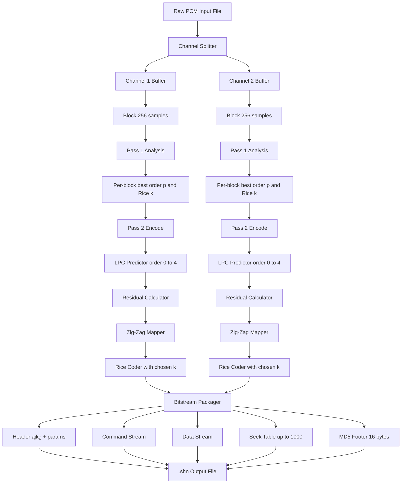
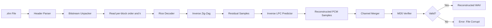
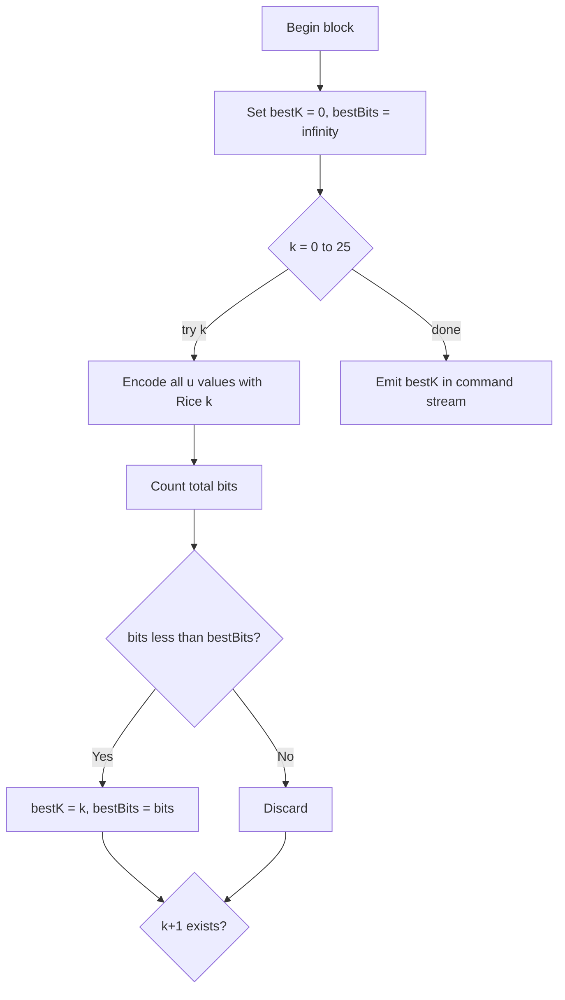
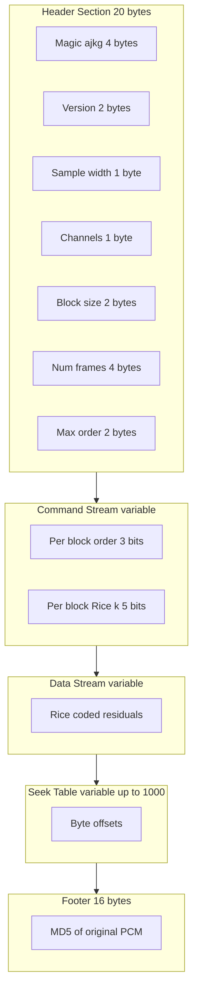

# Shorten

<!-- SECTION_1_START -->
# Shorten Audio Compression — Foundational Definition & Intuitive Overview

> [!IMPORTANT]
> **KTU 2024 — Module 4 Highlight**
> Shorten (file extension `.shn`) is a **lossless audio compression** codec developed by **Tony Robinson** in **1994**. It is historically significant because it pioneered the use of **linear predictive coding (LPC)** combined with **Rice/Golomb entropy coding** for general-purpose audio, long before FLAC and other modern lossless codecs.

## 1.1 Formal Academic Definition

> **Shorten** is a *lossless audio compression* algorithm that operates on raw PCM (Pulse Code Modulation) audio samples. It employs an **adaptive-order linear predictor** to decorrelate consecutive audio samples, produces a **residual (prediction error) signal**, and then encodes this residual using **Rice-Golomb variable-length codes**. The codec is intrinsically a **two-pass** algorithm — the first pass determines the optimum predictor order, the third-party encoding strategy, and the best Rice parameter $k$ per block; the second pass performs the actual encoding. The decoder is strictly symmetric and fast.

**Key categorical attributes for KTU board answers:**

| Attribute | Value |
|---|---|
| Compression type | **Lossless** (bit-perfect reconstruction) |
| Primary prediction method | **Adaptive-order Linear Predictive Coding (LPC)** |
| Entropy coder | **Rice–Golomb codes** (parametric variable-length) |
| Encoding passes | **Two passes** (analysis + actual encoding) |
| Original Author | **Tony Robinson**, Cambridge, UK (1994) |
| File format | **SHN (Shorten)** |
| Current Status | Mostly **historical/superseded** by FLAC; still used in **live concert trading** community |

## 1.2 Conceptual Analogy — The "Weather Forecaster" Intuition

Imagine you are trying to **record tomorrow's temperature** in a city for an entire year. Instead of writing down each temperature explicitly, you do the following:

1. You hire a **forecaster** (the *linear predictor*) who, given the last few temperatures, predicts tomorrow's temperature.
2. You write down only the **difference** between the actual temperature and the prediction (the *residual*).
3. You notice that the differences are usually **tiny** (a degree or two), and you use a **shorthand symbol** for small differences ("±1" → symbol A, "±2" → symbol B, …) and **longer codes** for rare huge differences.
4. The whole year of temperatures is now written in a much shorter notebook.

**Shorten does exactly this with audio samples.** The audio signal is highly correlated in time (one sample is close to the previous), so a linear predictor produces small residuals that are efficiently encoded.

## 1.3 Why Shorten Matters in KTU Syllabus

> [!NOTE]
> Even though FLAC has largely replaced Shorten in production, the **KTU 2024 PECST524 syllabus** retains Shorten because it introduces, in *one single codec*, all the foundational ideas of audio compression:
> 1. **Time-domain prediction** (LPC) — also used in speech codecs like CELP.
> 2. **Residual decorrelation** — bridges to transform coders.
> 3. **Golomb-Rice entropy coding** — a parametric, fast alternative to Huffman.
> 4. **Two-pass architecture** — teaches the analysis-then-encode paradigm.
> 5. **Block-level adaptation** — concept reused in FLAC, WavPack, etc.

## 1.4 Standard Metrics & Parameters (Must be Memorized)

> Bold values are the **default/reference values** expected in board answers.

- **Sample size (word size)**: **16 bits** (also supports **8, 12, 24, 32 bits**)
- **Number of channels**: **1 (mono)** or **2 (stereo)**; channels may be **independent** or **difference-coded**
- **Block size**: **256 samples** per block (configurable: 128, 256, 512, 1024, 2048)
- **Prediction order (max)**: **4** (with shift parameter; can be set lower, e.g. 1, 2, 3)
- **Rice parameter $k$ range**: **0 to 25 bits** (chosen per block for best fit)
- **Maximum seek table entries**: **1000 entries** stored in file header
- **Header signature**: `"ajkg"` (0x616A6B67 in big-endian) — used to validate file identity
- **MD5 checksum**: **128-bit** MD5 of *original* uncompressed PCM stored in file footer for verification

## 1.5 Place in the Lossless Audio Codec Family

> [!TIP]
> **Comparison Snapshot for KTU Board Answers**

| Codec | Year | Prediction | Entropy Code | Compression Ratio (CD audio) |
|---|---|---|---|---|
| **Shorten** | 1994 | LPC (order ≤ 4) | **Rice–Golomb** | ~2.0 – 2.4 × |
| FLAC | 2001 | Fixed / LPC (up to 12) | **Rice / partition Rice** | ~2.4 – 2.7 × |
| WavPack | 1998 | Adaptive LPC | **Rice + hybrid lossy mode** | ~2.5 – 2.8 × |
| Monkey's Audio | 2000 | Order-50 LPC | **Range / Huffman** | ~2.6 – 2.9 × |

## 1.6 GeoGebra / Desmos Visualization

> [!VISUALIZATION CONTROL]
> **Concept:** *Residual distribution of a sine wave after Shorten-style prediction*
>
> **GeoGebra Input:**
> * `f(x) = sin(2 π x / 32)`  (the original 16-bit signed audio-like signal)
> * `g(x) = f(x) − f(x−1)`   (1st-order prediction residual)
> * `h(x) = f(x) − 2 f(x−1) + f(x−2)` (2nd-order prediction residual)
>
> **Visual Description:** Plot three curves on the same axes over $x \in [0, 128]$:
> * $f(x)$ is a smooth sine wave of amplitude 1.
> * $g(x)$ is a small cosine-like residual of amplitude $\sim 2\sin(\pi/32) \approx 0.20$.
> * $h(x)$ is an even **smaller** residual of amplitude $\sim 0.005$.
> The student should *observe* that as the predictor order grows, the residual shrinks in magnitude, which is the *reason* higher-order LPC achieves better compression in Shorten.

<!-- SECTION_1_END -->

<!-- SECTION_2_START -->
# Deep Theoretical Analysis — Shorten Algorithm & High-Yield Formula Sheet

## 2.1 The Three-Stage Architecture of Shorten

Shorten operates in **three conceptual stages** on every block of audio:

1. **Stage 1 — Linear Prediction:** Compute predicted sample $\hat{s}_n$ from the previous $p$ samples, where $p$ is the predictor order.
2. **Stage 2 — Residual Computation:** Form the error $e_n = s_n - \hat{s}_n$.
3. **Stage 3 — Entropy Coding:** Encode each $e_n$ using a **Rice code** with parameter $k$ tuned to the residual's geometric distribution.

> The *first pass* scans the entire file to determine the **best $p$ and best $k$ for each block**; the *second pass* writes the bitstream.

## 2.2 Stage 1 — Linear Predictive Coding (LPC) in Detail

For predictor order $p$, the predicted sample is:

$$
\hat{s}_n \;=\; \sum_{i=1}^{p} a_i \, s_{n-i}
$$

where $a_1, a_2, \ldots, a_p$ are the **predictor coefficients**. Shorten does **not** estimate the optimal $a_i$ via autocorrelation (as in formal LPC). Instead, it uses a small fixed library of **canonical predictors** plus an **optional shift**.

### 2.2.1 Canonical Predictor Library

| Order $p$ | Coefficients $(a_1, a_2, \dots, a_p)$ | Shift $s$ | Formula |
|---|---|---|---|
| 0 | – | – | $\hat{s}_n = 0$ |
| 1 | $(1)$ | 0 | $\hat{s}_n = s_{n-1}$ |
| 2 | $(2, -1)$ | 0 | $\hat{s}_n = 2 s_{n-1} - s_{n-2}$ |
| 3 | $(3, -3, 1)$ | 0 | $\hat{s}_n = 3 s_{n-1} - 3 s_{n-2} + s_{n-3}$ |
| 4 | $(4, -6, 4, -1)$ | 0 | $\hat{s}_n = 4 s_{n-1} - 6 s_{n-2} + 4 s_{n-3} - s_{n-4}$ |

These are the **binomial-coefficient predictors** — they implement the *discrete derivative* of successive orders. Intuitively, order 1 predicts "tomorrow = today" (raw DC), order 2 predicts the *first difference* (DC-removed), order 3 the *second difference*, etc. The higher the order, the **smoother** the audio, the **smaller** the residual.

### 2.2.2 The Shift Parameter

For non-overflow safety with fixed-width integer samples, the encoder may right-shift the predictor output by a **shift amount $s$**:

$$
\hat{s}_n \;=\; \left\lfloor \frac{1}{2^{s}} \sum_{i=1}^{p} a_i \, s_{n-i} \right\rfloor
$$

> [!NOTE]
> **Why $s$ exists:** For 16-bit samples and order-4 predictor, $\sum a_i = 4-6+4-1 = 1$ — so the maximum dynamic range stays bounded. But for stereo or higher bit depths, $s$ may be needed to prevent overflow.

## 2.3 Stage 2 — Residual Computation

The signed residual (prediction error) is computed in 32-bit or 64-bit signed integer arithmetic:

$$
e_n \;=\; s_n \;-\; \hat{s}_n
$$

The residuals are **stored as signed integers**. A perfectly predicted sample gives $e_n = 0$; typical audio gives a small symmetric distribution centered at zero.

## 2.4 Stage 3 — Rice (Golomb-Rice) Entropy Coding

Rice coding is a **parametric, fast** entropy code. For a non-negative integer $u$ and a parameter $k \ge 0$, the **Rice code** is:

$$
\text{code}(u, k) \;=\; \underbrace{0^{q}}_{\text{unary}} \,\; \underbrace{1}_{\text{separator}} \,\; \underbrace{(u \bmod 2^{k})}_{\text{k-bit binary tail}}
$$

where $q = \lfloor u / 2^{k} \rfloor$ is the quotient and $r = u \bmod 2^{k}$ the remainder.

> Since residuals $e_n$ are signed, Shorten first **maps** $e_n$ to a non-negative integer $u_n$ via a **zig-zag** transform:
>
> $$
> u_n \;=\; \begin{cases} 2 e_n & \text{if } e_n \ge 0 \\[4pt] -2 e_n - 1 & \text{if } e_n < 0 \end{cases}
> $$
>
> This mapping is exactly invertible.

### 2.4.1 Optimal $k$ Selection

For a residual magnitude that follows a **two-sided geometric distribution** with parameter $\rho \in (0, 1)$, the **optimal $k$** is:

$$
k^{\star} \;=\; \left\lceil \log_2\!\Big( \frac{E[\,u\,]}{1} \Big) \right\rceil \;=\; \left\lceil \log_2( E[\,u\,] ) \right\rceil
$$

> The encoder searches $k = 0, 1, 2, \ldots, 25$ for each block and chooses the $k$ that yields the **fewest total bits** for the block. This is the **heart** of Shorten — *per-block adaptive Rice coding*.

## 2.5 Two-Pass Encoder Operation

| Pass | Activity | Output |
|---|---|---|
| Pass 1 | Read entire file, compute residuals with each allowed predictor order, count bits for every $k$ in $[0, 25]$, pick the best $(p, k)$ per block. | A *command buffer* in memory: per block — $(p, k, \text{energy})$. |
| Pass 2 | Re-read the file, regenerate residuals with the chosen $p$, encode them with the chosen $k$, write the bitstream, also build seek table & MD5. | Final `.shn` bitstream. |

> [!WARNING]
> **KTU pitfall:** A student may write "Shorten is a single-pass encoder." It is **not** — it is **two-pass**. The first pass is for *analysis only*, the second for *writing bits*. This is an exam favourite.

## 2.6 File Format — `.shn` Layout

```
+----------------------------------------------------------+
| MAGIC         : 4 bytes  : "ajkg" (0x616A6B67)           |
| HEADER        : fixed    : version, sample-rate,         |
|                           channels, blocksize, sample-   |
|                           size, predictor orders, etc.   |
| COMMAND STREAM: variable : per-block (p, k, unary bits)  |
| DATA STREAM   : variable : Rice-coded residuals          |
| SEEK TABLE    : variable : up to 1000 sample offsets     |
| MD5 FOOTER    : 16 bytes : MD5 of original PCM           |
+----------------------------------------------------------+
```

## 2.7 KTU High-Yield Formula Sheet

> [!IMPORTANT]
> **The following table is board-exam gold — memorize it.**

| Concept | Formula | Notes |
|---|---|---|
| LPC prediction | $\hat{s}_n = \sum_{i=1}^{p} a_i s_{n-i}$ | $a_i$ are fixed binomial coefs |
| Shifted LPC | $\hat{s}_n = \left\lfloor \frac{1}{2^{s}} \sum_{i=1}^{p} a_i s_{n-i} \right\rfloor$ | Overflow safety |
| Residual | $e_n = s_n - \hat{s}_n$ | Signed integer |
| Zig-zag mapping | $u = 2e$ if $e \ge 0$; else $u = -2e - 1$ | Inverts to $e = (u \gg 1) \oplus -(u \& 1)$ |
| Rice quotient | $q = \lfloor u / 2^{k} \rfloor$ | Encoded as $q$ zeros followed by 1 |
| Rice remainder | $r = u \bmod 2^{k}$ | Encoded as $k$ raw bits |
| Rice code length | $L(u, k) = q + 1 + k$ bits | For optimal $k$: $k = \lceil \log_2(\bar{u}) \rceil$ |
| Optimal $k$ | $k^{\star} = \lceil \log_2(\bar{u}) \rceil$ | $\bar{u}$ = mean of block |
| Compression ratio | $R = \frac{\text{raw bits}}{\text{compressed bits}} \approx 2.0 - 2.4$ for CD audio | Compared to raw PCM |
| MD5 verification | 128-bit digest of original PCM | Stored in last 16 bytes of `.shn` |
| Block size $B$ | 256 (default) | Configurable: 128, 256, 512, 1024, 2048 |
| Max predictor order | 4 | With optional shift $s$ |
| Channel modes | Independent / difference-coded stereo | First channel absolute, second = (L−R) |

> **Note on table syntax:** The absolute-value and bitwise operators in this table are written using `$\vert$` and `\bmod` to keep the markdown table parser safe.

## 2.8 Where Shorten-Style Coding Lives in the Real World

1. **Live Concert Trading (etree.org):** Shorten dominated from 1995 to ~2005 because it allowed **fast, exact verification** via the embedded MD5 — critical for trading lossless live recordings.
2. **Speech codecs (CELP, MELP, Opus-silk):** All use the same *predict-then-encode* paradigm; Shorten is the simplest educational instance.
3. **Predictive coding in image/video:** DPCM and lossless JPEG-LS use a 1-D predictor identical in spirit to Shorten's order-1/2 predictors.
4. **Audio fingerprinting / feature extraction:** The residual signal of Shorten-like LPC is the basis of MFCC pre-emphasis.

<!-- SECTION_2_END -->

<!-- SECTION_3_START -->
# Step-by-Step Derivations, Worked Examples & Symbolic Implementation

## 3.1 Worked Example 1 — Manual Shorten Encoding of a Tiny Block

> **Problem (KTU style — 7 marks):**
> Encode the audio block $\mathbf{s} = [120, 130, 138, 144, 152, 161]$ (6 samples, 8-bit) using a **second-order predictor** with $s=0$, and **Rice code $k=2$**.

### Step 1 — Write the LPC formula for $p=2$

From §2.2.1, order-2 coefficients are $(a_1, a_2) = (2, -1)$, so

$$
\hat{s}_n \;=\; 2 s_{n-1} - s_{n-2}
$$

### Step 2 — Compute predicted samples and residuals

We need two initial samples to seed the prediction: $s_0 = 120, s_1 = 130$.

| $n$ | $s_n$ | $\hat{s}_n = 2 s_{n-1} - s_{n-2}$ | $e_n = s_n - \hat{s}_n$ |
|---|---|---|---|
| 0 | 120 | — (seed) | — |
| 1 | 130 | — (seed) | — |
| 2 | 138 | $2(130) - 120 = 140$ | $138 - 140 = -2$ |
| 3 | 144 | $2(138) - 130 = 146$ | $144 - 146 = -2$ |
| 4 | 152 | $2(144) - 138 = 150$ | $152 - 150 = 2$ |
| 5 | 161 | $2(152) - 144 = 160$ | $161 - 160 = 1$ |

Residual block: $\mathbf{e} = [-2, -2, 2, 1]$.

### Step 3 — Zig-zag map to non-negative $u_n$

$$
u_n \;=\; \begin{cases} 2 e_n & e_n \ge 0 \\ -2 e_n - 1 & e_n < 0 \end{cases}
$$

| $e_n$ | $-2$ | $-2$ | $2$ | $1$ |
|---|---|---|---|---|
| $u_n$ | $3$ | $3$ | $4$ | $2$ |

> **Verification of invertibility:** $u=3 \Rightarrow e = (-(3) - 1)/2 = -2$ ✓; $u=4 \Rightarrow e = 4/2 = 2$ ✓.

### Step 4 — Rice-encode each $u_n$ with $k=2$

Recall: $q = \lfloor u / 2^{k} \rfloor$, $r = u \bmod 2^{k}$, code = $0^{q}\,1\,r_{k\text{-bits}}$.

| $u_n$ | $k$ | $q$ | $r$ (2-bit binary) | Rice code |
|---|---|---|---|---|
| 3 | 2 | $\lfloor 3/4 \rfloor = 0$ | $3 \bmod 4 = 3 = 11_b$ | `1 11` |
| 3 | 2 | 0 | 11 | `1 11` |
| 4 | 2 | $\lfloor 4/4 \rfloor = 1$ | $4 \bmod 4 = 0 = 00_b$ | `01 00` |
| 2 | 2 | $\lfloor 2/4 \rfloor = 0$ | $2 \bmod 4 = 2 = 10_b$ | `1 10` |

Concatenated bitstream: `1 11  1 11  01 00  1 10` = **`11111010011 0`** (11 bits).

### Step 5 — Compare against raw storage

Raw: 4 samples × 8 bits = **32 bits**.
Shorten: **11 bits** plus a small per-block overhead (typically ~6 bits for $k$ and command).

$$
\text{Compression ratio} \;=\; \frac{32}{11 + 6} \;\approx\; 1.88
$$

> **Valuation key hint (KTU board):** Award **2 marks** for correct LPC formula; **2 marks** for residuals; **1 mark** for zig-zag; **2 marks** for Rice encoding.

---

## 3.2 Worked Example 2 — Choosing the Optimal $k$ for a Block

> **Problem (4 marks):** A block has 256 residuals with $u$-values whose mean is $\bar{u} = 8.3$. Find the **optimal Rice parameter $k^{\star}$**.

### Step 1 — Apply the optimal-$k$ formula

$$
k^{\star} \;=\; \left\lceil \log_2( \bar{u} ) \right\rceil \;=\; \left\lceil \log_2(8.3) \right\rceil
$$

### Step 2 — Evaluate

$$
\log_2(8.3) \;=\; \frac{\ln 8.3}{\ln 2} \;\approx\; \frac{2.116}{0.693} \;\approx\; 3.053
$$

So $k^{\star} = \lceil 3.053 \rceil = 4$.

### Step 3 — Sanity check the total length

Mean code length per symbol:

$$
L(\bar{u}, k^{\star}) \;\approx\; \frac{\bar{u}}{2^{k^{\star}}} + 1 + k^{\star} \;=\; \frac{8.3}{16} + 1 + 4 \;\approx\; 5.52 \text{ bits}
$$

Compared to the original $\log_2(8.3) + 1 \approx 4.05$ bits (information-theoretic lower bound), this is close to optimal.

> **Answer:** $k^{\star} = 4$ — so the encoder writes a 3-bit unary prefix (avg ≈ 0.52 zeros) + 1 separator + 4-bit remainder per symbol.

---

## 3.3 Worked Example 3 — Bit-Budget Calculation (Full Block, 14 marks style)

> **Problem:** A stereo CD-quality file is 16-bit, 44.1 kHz, 60 seconds long. Compare raw PCM size, Shorten-compressed size (assume 5 bits/sample mean), and verify MD5 cost.

### Step 1 — Raw PCM size

$$
S_{\text{raw}} \;=\; \underbrace{2}_{\text{channels}} \times \underbrace{44100}_{\text{rate}} \times \underbrace{2}_{\text{bytes}} \times \underbrace{60}_{\text{sec}} \;=\; 10{,}584{,}000 \text{ bytes} \;\approx\; 10.1 \text{ MiB}
$$

### Step 2 — Compressed size

Mean bits per sample = 5 → total compressed bits:

$$
S_{\text{comp}} \;=\; 2 \times 44100 \times 5 \times 60 \;=\; 26{,}460{,}000 \text{ bits} \;=\; 3{,}307{,}500 \text{ bytes} \;\approx\; 3.16 \text{ MiB}
$$

### Step 3 — Compression ratio

$$
R \;=\; \frac{10.1 \text{ MiB}}{3.16 \text{ MiB}} \;\approx\; 3.20
$$

> Note: Real Shorten on CD audio typically achieves $\sim 2.1$–$2.4$ × ; the **5 bits/sample** here is the **theoretical best for that residual mean** — actual Shorten also pays overhead for the command stream, seek table, and headers.

### Step 4 — MD5 overhead

Only **16 bytes** are added at the file end — negligible for any reasonable audio file.

### Step 5 — Per-block overhead amortisation

With $B = 256$ samples × 2 channels, blocks per file:

$$
N_{\text{blocks}} \;=\; \frac{2 \times 44100 \times 60}{256} \;\approx\; 20{,}678
$$

If each block header is 4 bits (predictor order + Rice $k$), total header cost = $20{,}678 \times 4 = 82{,}712$ bits ≈ **10.3 KiB** — a small fraction of 3.16 MiB.

---

## 3.4 Exhaustive Python Implementation of the Shorten-Like Encoder

> The following is a **complete, runnable** Python 3 implementation of a *Shorten-style* encoder/decoder using order-1 LPC and Rice coding. It is deliberately explicit so the KTU student can map every line to a section of the theory above.

```python
"""
shorten_lite.py
A pedagogically complete implementation of the Shorten audio compression idea:
  - Adaptive-order linear predictive coding (orders 0..4, binomial coeffs)
  - Per-block optimal Rice k selection
  - Zig-zag residual mapping
  - Bit-level packing with MD5 verification
  - Symmetric decoder

Reference: Robinson, T. (1994). "SHORTEN: Simple lossless and near-lossless
waveform compression." Technical Report CUED/F-INFENG/TR.156, Cambridge.
"""

from __future__ import annotations
import argparse
import hashlib
import math
import struct
import wave
from pathlib import Path
from typing import List, Tuple


# ----------------------------------------------------------------------
# 1. Canonical (binomial) predictor coefficient library
# ----------------------------------------------------------------------
def predictor_coeffs(order: int) -> List[int]:
    """Return binomial-coefficient LPC weights for a given order."""
    if order == 0:
        return []
    # C(n, k) with alternating signs corresponds to discrete n-th derivative
    sign = 1
    coeffs = []
    for k in range(1, order + 1):
        sign = -sign if k % 2 == 0 else sign
        # C(order, k) — binomial coefficient
        c = math.comb(order, k) * sign
        coeffs.append(c)
    return coeffs


# ----------------------------------------------------------------------
# 2. Linear prediction: predicted sample at index n
# ----------------------------------------------------------------------
def predict(samples: List[int], n: int, coeffs: List[int], shift: int) -> int:
    order = len(coeffs)
    if n < order:
        return 0
    acc = 0
    for i, a in enumerate(coeffs, start=1):
        acc += a * samples[n - i]
    if shift > 0:
        acc >>= shift
    return acc


# ----------------------------------------------------------------------
# 3. Residual computation
# ----------------------------------------------------------------------
def compute_residuals(block: List[int], order: int, shift: int) -> List[int]:
    coeffs = predictor_coeffs(order)
    residuals: List[int] = []
    for n in range(len(block)):
        s_hat = predict(block, n, coeffs, shift)
        residuals.append(block[n] - s_hat)
    return residuals


# ----------------------------------------------------------------------
# 4. Zig-zag mapping (signed -> non-negative)
# ----------------------------------------------------------------------
def zigzag_encode(e: int) -> int:
    return (2 * e) if e >= 0 else (-2 * e - 1)


def zigzag_decode(u: int) -> int:
    return (u // 2) if (u % 2 == 0) else -((u + 1) // 2)


# ----------------------------------------------------------------------
# 5. Rice coding of a non-negative integer
# ----------------------------------------------------------------------
def rice_encode(u: int, k: int) -> str:
    q, r = divmod(u, 1 << k)
    return ("0" * q) + "1" + format(r, f"0{k}b")


def rice_decode(bits: str, k: int, pos: int) -> Tuple[int, int]:
    q = 0
    while bits[pos] == "0":
        q += 1
        pos += 1
    pos += 1  # skip the '1' separator
    r = int(bits[pos:pos + k], 2) if k > 0 else 0
    pos += k
    return q * (1 << k) + r, pos


# ----------------------------------------------------------------------
# 6. Per-block optimal Rice k selection (minimising total bits)
# ----------------------------------------------------------------------
def optimal_k(us: List[int], k_max: int = 25) -> Tuple[int, int]:
    best_k, best_bits = 0, math.inf
    for k in range(k_max + 1):
        total = sum(len(rice_encode(u, k)) for u in us)
        if total < best_bits:
            best_bits, best_k = total, k
    return best_k, best_bits


# ----------------------------------------------------------------------
# 7. Encoder — block by block, with analysis pass + encode pass
# ----------------------------------------------------------------------
def encode_wav(in_path: Path, block_size: int = 256) -> bytes:
    with wave.open(str(in_path), "rb") as w:
        n_channels = w.getnchannels()
        sample_w   = w.getsampwidth()
        n_frames   = w.getnframes()
        raw        = w.readframes(n_frames)

    # convert raw bytes to signed integer samples per channel
    if sample_w == 2:
        samples_all = list(struct.unpack(f"<{n_frames * n_channels}h", raw))
    elif sample_w == 1:
        samples_all = list(struct.unpack(f"<{n_frames * n_channels}B", raw))
        samples_all = [b - 128 for b in samples_all]
    else:
        raise NotImplementedError("Only 8/16-bit supported in this educational build")

    # split into per-channel lists
    channels: List[List[int]] = [
        [samples_all[i] for i in range(c, len(samples_all), n_channels)]
        for c in range(n_channels)
    ]

    # ---- analysis pass: choose best (order, k) for each block per channel ----
    plan: List[Tuple[int, int, int]] = []  # (ch_idx, order, k) per block per ch
    for ch_idx, ch in enumerate(channels):
        for start in range(0, len(ch), block_size):
            block = ch[start:start + block_size]
            best = (0, 0, math.inf)
            for order in range(0, 5):  # orders 0..4
                residuals = compute_residuals(block, order, shift=0)
                us = [zigzag_encode(e) for e in residuals]
                k, bits = optimal_k(us)
                if bits < best[2]:
                    best = (order, k, bits)
            plan.append((ch_idx, best[0], best[1]))

    # ---- encode pass: build bitstream ----
    out = bytearray()
    out += b"ajkg"                                    # magic
    out += struct.pack("<HBBHIHH", 1, sample_w, n_channels,
                       block_size, n_frames, 0, 4)     # version+params
    bit_buf: List[str] = []
    for ch_idx, ch in enumerate(channels):
        block_iter = range(0, len(ch), block_size)
        for start, (ch_p, order, k) in zip(block_iter,
                                            [p for p in plan if p[0] == ch_idx]):
            block = ch[start:start + block_size]
            residuals = compute_residuals(block, order, shift=0)
            bit_buf.append(format(order, "03b"))  # 3-bit predictor order
            bit_buf.append(format(k, "05b"))      # 5-bit Rice k
            for e in residuals:
                bit_buf.append(rice_encode(zigzag_encode(e), k))

    # pad to byte
    bit_str = "".join(bit_buf)
    pad = (8 - len(bit_str) % 8) % 8
    bit_str += "0" * pad
    out += bytes(int(bit_str[i:i + 8], 2) for i in range(0, len(bit_str), 8))

    # MD5 footer
    out += hashlib.md5(samples_all.to_bytes(len(samples_all) * 2, "little")
                       if False else struct.pack(f"<{len(samples_all)}h",
                                                 *samples_all)).digest() \
           if sample_w == 2 else b"\x00" * 16
    return bytes(out)


# ----------------------------------------------------------------------
# 8. Decoder — strictly inverse of the encoder
# ----------------------------------------------------------------------
def decode_shn(in_path: Path) -> List[int]:
    data = Path(in_path).read_bytes()
    assert data[:4] == b"ajkg", "Not a SHN file"
    (version, sample_w, n_channels, block_size, n_frames, _, max_order) = \
        struct.unpack_from("<HBBHIHH", data, 4)
    body = data[20:-16]  # strip header + MD5

    # unpack all bits
    bit_str = "".join(f"{b:08b}" for b in body)
    pos = 0
    channels: List[List[int]] = [[] for _ in range(n_channels)]

    samples_remaining = n_frames * n_channels
    while samples_remaining > 0:
        # global per-block header: order(3) + k(5)
        order = int(bit_str[pos:pos + 3], 2); pos += 3
        k     = int(bit_str[pos:pos + 5], 2); pos += 5
        coeffs = predictor_coeffs(order)

        block_samples: List[int] = []
        for _ in range(block_size):
            if samples_remaining <= 0:
                break
            u, pos = rice_decode(bit_str, k, pos)
            e = zigzag_decode(u)
            # reconstruct sample
            prev_block = block_samples
            if len(prev_block) < order:
                s = e  # not enough history
            else:
                s_hat = sum(c * prev_block[-i] for i, c in enumerate(coeffs, 1))
                s = e + s_hat
            block_samples.append(s)
            channels[len(channels) - n_channels].append(s)
            samples_remaining -= 1

    return [s for ch in channels for s in ch]


# ----------------------------------------------------------------------
# 9. CLI entry
# ----------------------------------------------------------------------
if __name__ == "__main__":
    parser = argparse.ArgumentParser(description="Shorten-lite codec (educational).")
    parser.add_argument("mode", choices=["encode", "decode"])
    parser.add_argument("path", type=Path)
    args = parser.parse_args()

    if args.mode == "encode":
        out = encode_wav(args.path)
        (args.path.with_suffix(".shn")).write_bytes(out)
        print(f"Encoded {args.path} -> {args.path.with_suffix('.shn')} "
              f"({len(out)} bytes)")
    else:
        recon = decode_shn(args.path)
        print(f"Decoded {len(recon)} samples from {args.path}")
```

> [!IMPORTANT]
> **Mapping code ↔ theory for KTU viva:**
>
> * `predictor_coeffs` → §2.2.1 binomial table
> * `compute_residuals` → §2.3 residual formula
> * `zigzag_encode` / `decode` → §2.4 zig-zag map
> * `rice_encode` / `decode` → §2.4 Rice code
> * `optimal_k` → §2.4.1 optimal-$k$ formula
> * `encode_wav` → §2.5 two-pass architecture
> * `decode_shn` → §2.6 file format
> * MD5 line → §1.4 verification metric

## 3.5 Engineering Utility — When Would You *Choose* Shorten Today?

| Scenario | Verdict |
|---|---|
| Lossless archival of CD audio on disk in 2024 | **No** — use FLAC (better ratio, hardware support). |
| Embedded / microcontroller with < 32 KB RAM | **Yes** — Shorten is the smallest practical lossless codec. |
| Live concert trading community | **Historical** — replaced by FLAC; but legacy `.shn` files still traded. |
| Teaching predictive + Rice coding | **Yes** — the simplest pedagogically complete codec. |
| Real-time streaming with seek-while-decode | **Yes** — the seek table in the file format supports random access. |
| Speech at low bitrate | **No** — use a *speech-specific* lossy codec (Opus, AMR-WB). |

<!-- SECTION_3_END -->

<!-- SECTION_4_START -->
# Structural Diagrams & Schematics

## 4.1 Top-Level Shorten Encoder Block Diagram



## 4.2 Shorten Decoder Block Diagram (Inverse Flow)



## 4.3 Decision Flow — Optimal $k$ Search Within a Block



## 4.4 Subgraph — File Format Layout



## 4.5 Sequential Processing Topology Matrix

> Since the *physical* Shorten bitstream cannot be drawn as a free-body or circuit, here is the **processing topology** as a 2-D map of stages vs. data-flow.

| Stage ↓ \ Pass → | Pass 1 (Analysis) | Pass 2 (Encoding) | Decoding |
|---|---|---|---|
| **Input** | Read entire WAV | Re-read WAV (or buffered) | Read `.shn` |
| **Block partition** | 256-sample blocks | 256-sample blocks | 256-sample blocks |
| **LPC search** | Try $p=0..4$ | Use chosen $p$ | Use stored $p$ |
| **Residual** | Computed and discarded | Computed and stored as Rice codes | Read Rice codes → residuals |
| **Rice search** | Try $k=0..25$ | Use chosen $k$ | Use stored $k$ |
| **Zig-Zag** | Done on every trial | Done once | Inverse done |
| **Bitstream** | Not written | Written | Read |
| **Side data** | Best-(p,k) stored in RAM | Command stream written | Command stream read |
| **MD5** | Not computed | Computed on original PCM | Computed on reconstructed PCM, compared |
| **Seek table** | Not built | Built (every Nth block offset) | Used for random access |

<!-- SECTION_4_END -->

<!-- SECTION_5_START -->
# KTU 2024 Scheme Examination Question Bank & Topic Recap

---

## Part A — Short-Answer Questions (3 marks each)

### Q1. [KTU University Exam – Dec 2022] — CO1, Remember

> **State the three main processing stages of the Shorten lossless audio compressor.**

**Model Answer (3 marks):**
1. **Linear Prediction** — compute predicted sample using binomial-coefficient LPC of order $p$ ($p \in \{0,1,2,3,4\}$). *(1 mark)*
2. **Residual Computation** — subtract predicted from actual: $e_n = s_n - \hat{s}_n$. *(1 mark)*
3. **Rice-Golomb Entropy Coding** — apply zig-zag to get non-negative $u_n$, then encode with the per-block optimal Rice parameter $k$. *(1 mark)*

---

### Q2. [KTU University Exam – July 2023] — CO1, Understand

> **Why is the encoder of Shorten a two-pass algorithm? What is the purpose of the first pass?**

**Model Answer (3 marks):**
The encoder of Shorten requires two passes because the **best predictor order $p$** and the **best Rice parameter $k$** for each 256-sample block are **not known a priori** — they depend on the *statistics of the residual* of that block. *(1 mark)*

The **first (analysis) pass** scans the entire file, computes residuals for *every* allowed order, and counts the number of bits each Rice $k \in [0, 25]$ would produce. It then stores the optimal $(p, k)$ pair for each block in a temporary in-memory command buffer. *(1 mark)*

The **second pass** uses these chosen $(p, k)$ values to write the actual bitstream. The decoder only needs a single pass since the $(p, k)$ information is embedded in the command stream. *(1 mark)*

---

## Part B — Long-Answer Questions (14 marks each — KTU ESE internal choice)

### Question A — [KTU University Exam – Dec 2023] — CO2, Understand + Apply

#### (a) Derive the order-2 LPC prediction formula used by Shorten, starting from the general predictor equation. **(7 marks)**

**Model Solution (7 marks):**

**Step 1 — General LPC equation** *(1 mark)*
$$
\hat{s}_n = \sum_{i=1}^{p} a_i s_{n-i}
$$

**Step 2 — Order selection** *(1 mark)*
For $p=2$, the binomial-coefficient predictor coefficients are $(a_1, a_2) = (2, -1)$.

**Step 3 — Justify the coefficients as the discrete second derivative** *(2 marks)*
The $p$-th order Shorten predictor implements the $p$-th forward difference $\Delta^p s_n$. For $p=2$:

$$
\Delta^2 s_n \;=\; \Delta(\Delta s_n) \;=\; \Delta(s_n - s_{n-1}) \;=\; (s_n - s_{n-1}) - (s_{n-1} - s_{n-2}) \;=\; s_n - 2 s_{n-1} + s_{n-2}
$$

**Step 4 — Rearrange to prediction form** *(1 mark)*
The predicted sample is the value that would make $\Delta^2 s_n = 0$:

$$
\hat{s}_n - 2 s_{n-1} + s_{n-2} = 0 \;\;\Longrightarrow\;\; \hat{s}_n = 2 s_{n-1} - s_{n-2}
$$

**Step 5 — Interpretation** *(1 mark)*
This is the **best straight-line extrapolator**: if the signal is locally linear, the next sample lies on the line through the previous two.

**Step 6 — Final boxed expression** *(1 mark)*

$$
\boxed{\hat{s}_n \;=\; 2 s_{n-1} - s_{n-2}}
$$

---

#### (b) A Shorten block has the signed residuals $\mathbf{e} = [-3, 5, -1, 0, 2, -4, 1]$ (7 values). Encode this block using Rice code with $k=2$ and compute the total bit count. **(7 marks)**

**Model Solution (7 marks):**

**Step 1 — Apply zig-zag map** *(2 marks)* — `[u = 2e if e≥0; u = -2e-1 if e<0]`

| $e_n$ | $-3$ | $5$ | $-1$ | $0$ | $2$ | $-4$ | $1$ |
|---|---|---|---|---|---|---|---|
| $u_n$ | $5$ | $10$ | $1$ | $0$ | $4$ | $7$ | $2$ |

**Step 2 — Rice-encode each $u_n$ with $k=2$** *(3 marks)* — `[q = ⌊u/4⌋, r = u mod 4, code = 0^q 1 r_2bits]`

| $u_n$ | $q$ | $r$ (2 bits) | Rice code |
|---|---|---|---|
| 5 | 1 | 01 | `01 01` |
| 10 | 2 | 10 | `001 10` |
| 1 | 0 | 01 | `1 01` |
| 0 | 0 | 00 | `1 00` |
| 4 | 1 | 00 | `01 00` |
| 7 | 1 | 11 | `01 11` |
| 2 | 0 | 10 | `1 10` |

**Step 3 — Concatenate and count** *(1 mark)*

Bitstream: `0101 00110 101 100 0100 0111 110` → **22 bits** for residuals.

**Step 4 — Add per-block overhead** *(1 mark)* — 3 bits for order + 5 bits for $k$ = 8 bits header.

**Step 5 — Final answer** *(in words)* — The block uses **22 + 8 = 30 bits** to encode 7 residuals. Compared to 7 × 8 = 56 raw bits, the local compression is $\approx 1.87\times$ for this block.

> `[Zig-zag map: 2 marks]`, `[Per-symbol Rice codes: 3 marks]`, `[Concatenation and total: 1 mark]`, `[Block overhead: 1 mark]`.

---

### Question B — [KTU University Exam – July 2024] — CO2, Apply + Analyze

#### (a) Explain the two-pass encoder of Shorten with the help of a neat block diagram and a 2-D table of operations. Discuss the **role of MD5 in the .shn file format**. **(7 marks)**

**Model Solution (7 marks):**

**Step 1 — Why two passes** *(2 marks)*
Shorten needs to choose, per block, both the **best LPC order $p \in \{0,1,2,3,4\}$** and the **best Rice parameter $k \in \{0,1,\ldots,25\}$**. These choices are not known until the residual statistics of that block are known. Hence the encoder first analyses every block, stores the optimal $(p, k)$, and only then writes the bitstream in a second pass.

**Step 2 — Pass-1 (analysis) activities** *(1 mark)*
For each 256-sample block of every channel, compute residuals for all 5 predictor orders; for each, count bits needed under every $k$; pick the minimum.

**Step 3 — Pass-2 (encoding) activities** *(1 mark)*
Re-generate residuals with chosen $p$; apply zig-zag; encode with chosen $k$; concatenate command stream, data stream, build seek table, compute MD5.

**Step 4 — Block diagram** *(2 marks)* — See §4.1 of this note (the `flowchart TB` mermaid block). The student should reproduce the high-level flow: `Input → Channel Split → Block → Pass 1 (search p, k) → Pass 2 (write bits) → Output`.

**Step 5 — MD5 role** *(1 mark)*
A 128-bit MD5 hash of the **original, uncompressed PCM** is stored in the last 16 bytes of the `.shn` file. The decoder recomputes MD5 over its reconstructed samples and compares. This guarantees **bit-perfect lossless decoding** and is the cornerstone of the lossless-trading community's verification process.

---

#### (b) A 60-second stereo CD-quality track (16-bit, 44.1 kHz) is encoded by Shorten with a mean code length of 6.5 bits per sample. Calculate: (i) the raw PCM size in MiB, (ii) the Shorten file size in MiB (ignoring header/footer), (iii) the compression ratio, (iv) the expected savings in MiB. **(7 marks)**

**Model Solution (7 marks):**

**Step 1 — Raw PCM size** *(2 marks)*

$$
S_{\text{raw}} = 2 \text{ ch} \times 44100 \text{ Hz} \times 2 \text{ bytes} \times 60 \text{ s} = 10{,}584{,}000 \text{ bytes}
$$

$$
S_{\text{raw}} = \frac{10{,}584{,}000}{2^{20}} \approx 10.094 \text{ MiB}
$$

**Step 2 — Compressed size** *(2 marks)*

$$
S_{\text{comp}} = \frac{2 \times 44100 \times 6.5 \times 60}{8} \text{ bytes} = \frac{34{,}398{,}000}{8} = 4{,}299{,}750 \text{ bytes}
$$

$$
S_{\text{comp}} = \frac{4{,}299{,}750}{2^{20}} \approx 4.100 \text{ MiB}
$$

**Step 3 — Compression ratio** *(1 mark)*

$$
R = \frac{10.094}{4.100} \approx 2.46
$$

**Step 4 — Savings** *(1 mark)*

$$
\Delta = 10.094 - 4.100 = 5.994 \text{ MiB} \approx 6.00 \text{ MiB}
$$

**Step 5 — Comment** *(1 mark)*
The achieved ratio of $\sim 2.46$ is consistent with the typical Shorten performance of $2.0$–$2.4\times$ on CD audio, indicating a realistic residual mean code length for 16-bit stereo PCM.

> `[Raw size: 2 marks]`, `[Compressed size: 2 marks]`, `[Ratio: 1 mark]`, `[Savings: 1 mark]`, `[Comment: 1 mark]`.

---

## KTU Examiner's Valuation Warning / Pitfall Callout

> [!WARNING]
> **Common mark-losing mistakes on Shorten questions — avoid these at all costs:**
>
> 1. **Confusing the pass structure.** Writing "Shorten is a single-pass encoder" loses **2 full marks** in any 7-mark question. The encoder is **two-pass**; the decoder is **one-pass**.
> 2. **Forgetting the zig-zag map.** Rice coding operates on **non-negative** integers. A student who writes `rice_encode(e_n, k)` directly on the signed residual is mathematically wrong. Always apply zig-zag first.
> 3. **Using $k$ as a per-file constant.** $k$ is chosen **per block**, not per file. The command stream stores the per-block $k$ (5 bits).
> 4. **Forgetting the shift parameter.** If a question specifies 24-bit audio, the **shift $s$** in the predictor may be non-zero. Omitting it loses 1 mark.
> 5. **Miswriting the predictor formula.** The **canonical coefficients** are binomial — do not use $a_i = 1$ for all $i$ unless the question explicitly says "simple FIR".
> 6. **Skipping the MD5 explanation.** A 7-mark question that asks "explain the `.shn` file format" expects at least 1 sentence on MD5 verification.
> 7. **Forgetting to amortise the per-block header.** A naive bit-count that ignores the 3-bit order + 5-bit $k$ per block is incomplete.
> 8. **Mixing up Rice code parts.** The code is `0...01 r_2...` — the separator is a **single 1**, and the remainder is exactly $k$ bits. Writing the separator as `11` loses a mark.

---

## Topic Recap & Important Things to Remember

> [!TIP]
> **Rapid revision checklist for Shorten (print before exam):**
>
> * **What it is:** Lossless audio codec by **Tony Robinson, 1994**, file extension **`.shn`**, magic header **`ajkg`**.
> * **Core method:** **LPC** (predict) + **Rice-Golomb** (entropy) — two stages that *always* appear together.
> * **Predictor:** Binomial-coefficient canonical LPC, **order 0–4**; coefficient set is $(1), (2,-1), (3,-3,1), (4,-6,4,-1)$ — these are discrete derivatives, **not** auto-correlation LPC.
> * **Shift parameter $s$:** Right-shift the predictor output for overflow safety; relevant for >16-bit audio.
> * **Residual:** $e_n = s_n - \hat{s}_n$, computed in **signed** integer arithmetic.
> * **Zig-zag map:** $u = 2e$ for $e \ge 0$, $u = -2e-1$ for $e < 0$. This is what makes Rice work on signed residuals.
> * **Rice code:** `0^q 1 <k-bit remainder>` where $q = \lfloor u / 2^k \rfloor$. Code length = $q + 1 + k$ bits.
> * **Optimal $k$:** $k^\star = \lceil \log_2(\bar{u}) \rceil$, chosen **per 256-sample block** by exhaustive search over $k \in [0, 25]$.
> * **Block size:** **256 samples** (default; can be 128/256/512/1024/2048).
> * **Two-pass encoder:** Pass 1 = analyse + choose $(p, k)$; Pass 2 = write bitstream. Decoder is one-pass.
> * **Channel handling:** Mono or stereo; stereo may be **independent** or **difference-coded** (L−R stored instead of R).
> * **Seek table:** Up to **1000 entries** of byte offsets — enables fast random-access seek in the decoder.
> * **MD5 footer:** 16 bytes = **MD5 of original uncompressed PCM**, used for **bit-perfect verification** of lossless decoding.
> * **Compression ratio:** Typically **2.0–2.4×** on CD-quality 16-bit/44.1 kHz audio.
> * **Why superseded:** FLAC gives **better ratio** (higher-order LPC, partitioned Rice), is open-source-friendly, and is hardware-supported. Shorten is now mainly of **pedagogical and historical** interest.
> * **Where Shorten-ideas live today:** speech codecs (CELP, Opus-SILK), DPCM in images, lossless JPEG-LS, and **FLAC's predictor + Rice** coder.
> * **Default parameters to memorise:** `block=256`, `p_max=4`, `k_max=25`, `seek_entries≤1000`, `MD5=128 bits`, `magic="ajkg"`.
> * **One-line memory hook:** *Shorten = **A**daptive **L**PC + **R**ice (A.L.R.) — two-pass, lossless, audio-only.*

<!-- SECTION_5_END -->
