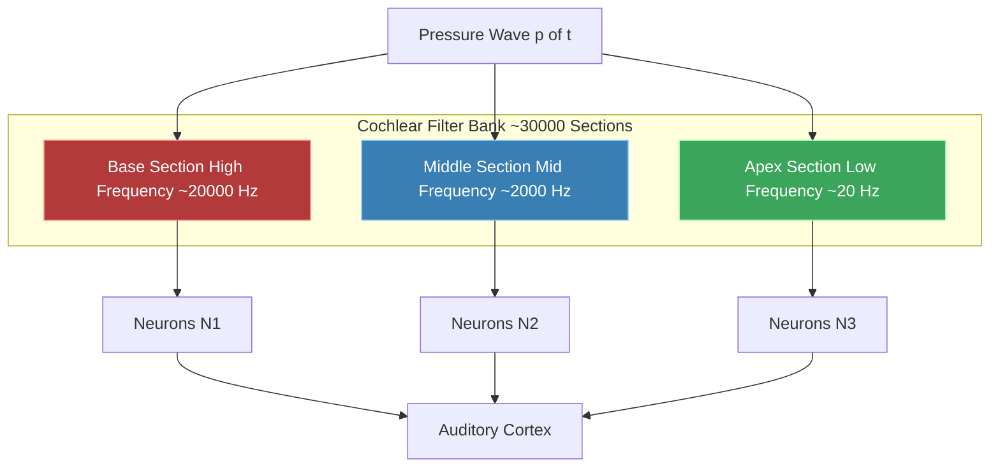
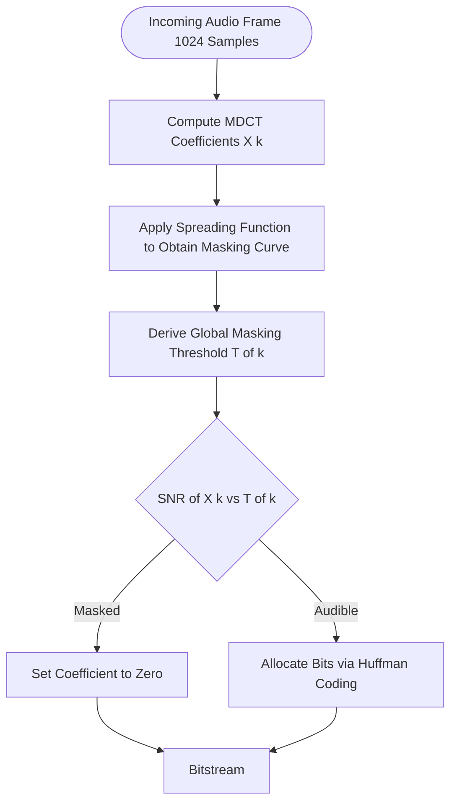

# The Human Auditory System

<!-- SECTION_1_START -->
# The Human Auditory System — Core Technical Definition & Intuitive Overview

> [!NOTE]
> **KTU 2024 Syllabus Definition (PECST524 — Module 4: Audio Compression)**
> The *Human Auditory System* is a psychoacoustic frequency-analysis mechanism that decomposes incoming time-domain sound pressure variations into spatially-resolved frequency components along the *cochlear partition*. Audio coders (MP3, AAC, OGG, Opus) exploit the **limitations** and **non-linearities** of this system to discard inaudible information — a discipline formally known as **Perceptual Audio Coding**.

## 1.1 Anatomical Map of Hearing

| Region | Component | Engineering Equivalent | Function |
|---|---|---|---|
| **Outer Ear** | Pinna, Auditory Canal | Acoustic Horn / Antenna | Directional filtering (HRTF), gain $\approx$ **10–15 dB** at 2–5 kHz |
| **Middle Ear** | Tympanic Membrane, Ossicles (Malleus, Incus, Stapes) | Impedance-Matching Transformer | Matches air impedance ($\approx 400$ dyne·s/cm$^5$) to fluid impedance ($\approx 1.5 \times 10^5$ dyne·s/cm$^5$) |
| **Inner Ear** | Cochlea, Basilar Membrane, Organ of Corti, Hair Cells | Real-Time FFT Bank (≈ 30,000 band-pass filters) | Mechanical-to-neural transduction; frequency-to-place mapping |
| **Auditory Nerve** | Spiral Ganglion, Auditory Cortex | Digital Serial Bus | Transmits spike trains at $\approx$ **1.5 Mbps** aggregate |

> [!IMPORTANT]
> **Key Constant for KTU Board Exams**
> Speed of sound in air at 20 °C: $\mathbf{c \approx 343 \text{ m/s}}$
> Audible frequency band: $\mathbf{20 \text{ Hz} \leq f \leq 20{,}000 \text{ Hz}}$

## 1.2 Intuitive Analogy — "The Piano Inside Your Head"

Imagine a grand piano with **~3,000 tightly-stretched strings**, each tuned to a slightly different frequency, and arranged short-to-long from left to right. When a sound enters your ear, the **short strings (high notes) vibrate** for high-frequency content, while the **long strings (low notes) vibrate** for low-frequency content. The brain then "reads" which strings are vibrating and reconstructs the spectrum.

- The **basilar membrane** is that piano.
- The **hair cells** are the mechanical sensors attached to each string.
- The **auditory nerve** is the cable that carries these activations to the brain's audio processor.

This is *not* a metaphor — it is a literal physical model described by **Georg von Békésy (Nobel Prize, 1961)** as the *traveling wave* theory.

> [!VISUALIZATION CONTROL]
> **Concept:** Traveling wave envelope along the basilar membrane
> **GeoGebra / Desmos Input Equations:**
> * `f1(x) = exp(-((x-12)^2)/8) * sin(2*pi*2000*x)`  *(peak at 12 mm → high frequency)*
> * `f2(x) = exp(-((x-28)^2)/18) * sin(2*pi*500*x)`  *(peak at 28 mm → low frequency)*
> **Visual Description:** Plot $x \in [0,35]$ mm. Observe that the high-frequency sinusoid peaks near the **base** of the cochlea, while the low-frequency sinusoid peaks near the **apex**.

<!-- SECTION_1_END -->

<!-- SECTION_2_START -->
# Deep Theoretical Analysis & KTU High-Yield Formula Sheet

## 2.1 From Sound Pressure to Sensation — The Transduction Chain

1. **Acoustic Wave Generation** — A pressure disturbance $p(t)$ propagates through air as a longitudinal wave.
2. **Outer-Ear Filtering** — The pinna introduces a direction-dependent transfer function $H_{\text{pinna}}(\theta, \phi, f)$, peaking near 2.5 kHz.
3. **Impedance Matching** — The middle-ear transformer raises pressure by a factor of $\approx$ **22×** (≈ 27 dB gain).
4. **Cochlear Decomposition** — The basilar membrane behaves as a **non-linear, place-frequency mapper**.
5. **Neural Encoding** — Hair cells convert mechanical displacement into action potentials; intensity is encoded by **firing rate** and **population size** (rate-place coding).
6. **Cortical Processing** — The auditory cortex interprets the spike train as pitch, loudness, and timbre.

> [!TIP]
> **Why KTU cares about this:** Every lossy audio coder (MP3, AAC) places its quantization noise **below the masked threshold** of this very system. If you cannot describe the masked threshold, you cannot design a perceptual coder.

## 2.2 KTU Formula Cheat Sheet

| # | Quantity | Symbol | Formula | Reference Value | Unit |
|---|---|---|---|---|---|
| 1 | Wavelength | $\lambda$ | $\lambda = \dfrac{c}{f}$ | $c = 343$ m/s (air, 20 °C) | m |
| 2 | Sound Pressure Level | $L_p$ | $L_p = 20 \log_{10}\!\left(\dfrac{p}{p_{\text{ref}}}\right)$ | $p_{\text{ref}} = 20\ \mu\text{Pa}$ | dB SPL |
| 3 | Sound Intensity Level | $L_I$ | $L_I = 10 \log_{10}\!\left(\dfrac{I}{I_{\text{ref}}}\right)$ | $I_{\text{ref}} = 10^{-12}$ W/m$^2$ | dB |
| 4 | Bark Scale (critical band rate) | $z$ | $z = 13 \arctan(0.00076 f) + 3.5 \arctan\!\left(\dfrac{f}{7500}\right)^{\!2}$ | $f$ in Hz, $z$ in Bark | Bark |
| 5 | Critical Bandwidth | $\Delta f_{\text{CB}}$ | $\Delta f_{\text{CB}} = 25 + 75\,(1 + 1.4 f^2 / 10^6)^{0.69}$ | $\approx 100$ Hz – $4$ kHz | Hz |
| 6 | ERB (Glasberg \& Moore) | $E$ | $E = 24.7\,(4.37 \cdot 10^{-3} f + 1)$ | $f$ in Hz | Hz |
| 7 | Fletcher-Munson ISO 226 Loudness | $L_N$ | Tabulated / numerical integration | $L_N$ in **phons** | phon |
| 8 | Threshold of Hearing | $L_{\text{TH}}(f)$ | ISO 226 polynomial (Schomer) | $0$ dB SPL at 1 kHz | dB SPL |
| 9 | Threshold of Pain | $L_{\text{TP}}$ | Constant | $\mathbf{120}$ – $130$ dB SPL | dB SPL |
| 10 | Period of Sound | $T$ | $T = 1 / f$ | — | s |

> [!CAUTION]
> **Board-Exam Pitfall:** The reference pressure $p_{\text{ref}} = 20\ \mu\text{Pa}$ is *not* $1\ \mu\text{Pa}$ (that is for airborne ultrasound, not audiology). Writing $20\ \mu\text{Pa}$ earns full marks; writing $1\ \mu\text{Pa}$ earns partial credit only.

## 2.3 Engineering & Production Use

* **Perceptual Coders (MP3, AAC, Opus, FLAC-Lossy)** use the masked threshold of the auditory system to allocate quantization bits — silent components receive zero bits.
* **Hearing Aids** compensate for the patient's specific audiogram (loss versus frequency).
* **Noise-Cancelling Headphones** exploit the *critical-band masking* phenomenon to generate anti-phase signals.
* **Audio Watermarking & Steganography** must remain sub-threshold to be imperceptible.

<!-- SECTION_2_END -->

<!-- SECTION_3_START -->
# Step-by-Step Derivations, Numerical Worked Examples & Symbolic Implementation

## 3.1 Derivation 1 — Wavelength from Frequency (KTU Classic 2-Mark)

We begin from the universal wave relation. For a sound wave traveling at speed $c$ with frequency $f$:

$$
\text{One period travels one wavelength in time } T = \frac{1}{f}
$$

Therefore:

$$
\lambda = c \cdot T = \frac{c}{f}
$$

**Numerical Example:** Find the wavelength of a 1 kHz tone at 20 °C.

$$
\lambda = \frac{343 \text{ m/s}}{1000 \text{ Hz}} = 0.343 \text{ m} = 34.3 \text{ cm}
$$

**KTU Valuation Key:**
* [Stating $c = 343$ m/s: 1 Mark]
* [Writing $\lambda = c/f$: 1 Mark]
* [Numerical substitution: 1 Mark]

## 3.2 Derivation 2 — Sound Pressure Level (dB SPL)

The human ear responds to a *ratio* of pressures (Weber–Fechner law). Define:

$$
L_p \;[\text{dB SPL}] \;\equiv\; 20 \log_{10}\!\left(\frac{p_{\text{rms}}}{p_{\text{ref}}}\right), \quad p_{\text{ref}} = 20\ \mu\text{Pa}
$$

**Numerical Example:** A jet engine produces $p_{\text{rms}} = 20$ Pa at 1 m. Find its SPL.

$$
L_p = 20 \log_{10}\!\left(\frac{20}{20 \times 10^{-6}}\right) = 20 \log_{10}(10^{6}) = 20 \times 6 = 120 \text{ dB SPL}
$$

This equals the **threshold of pain** — clinically significant.

## 3.3 Derivation 3 — Bark Critical-Band Rate

The ear resolves frequencies into ~25 non-overlapping **critical bands**. The mapping from linear Hz to perceptual Bark is:

$$
z(f) = 13 \arctan(0.00076\,f) + 3.5 \arctan\!\left(\frac{f}{7500}\right)^{\!2}
$$

**Numerical Example:** Convert $f = 1000$ Hz to Bark.

$$
\begin{aligned}
\text{Term}_1 &= 13 \arctan(0.00076 \times 1000) = 13 \arctan(0.76) \\
&= 13 \times 0.6486 = 8.432 \text{ Bark} \\
\text{Term}_2 &= 3.5 \arctan\!\left(\frac{1000}{7500}\right)^{\!2} = 3.5 \arctan(0.01778) \\
&= 3.5 \times 0.01778 = 0.0622 \text{ Bark} \\
z(1000) &= 8.432 + 0.0622 = 8.49 \text{ Bark}
\end{aligned}
$$

**KTU Valuation Key:**
* [Writing the formula: 2 Marks]
* [Evaluating $\arctan(0.76)$: 1 Mark]
* [Final addition: 1 Mark]

## 3.4 Worked Example — Critical Bandwidth

For $f = 1000$ Hz:

$$
\begin{aligned}
\Delta f_{\text{CB}} &= 25 + 75\,(1 + 1.4 \times 10^{6} / 10^{6})^{0.69} \\
&= 25 + 75\,(1 + 1.4)^{0.69} \\
&= 25 + 75 \times 1.746 \\
&= 25 + 130.9 \\
&= 155.9 \text{ Hz} \quad (\approx 1 \text{ Bark wide})
\end{aligned}
$$

## 3.5 Python Implementation — Psychoacoustic Calculator

```python
"""
Filename: auditory_psychoacoustics.py
Module  : DATA COMPRESSION (PECST524) — Module 4
Topic   : The Human Auditory System
Purpose : Numerical evaluation of key perceptual quantities
"""

from __future__ import annotations
import math
from dataclasses import dataclass

# -------------------------------------------------------------------
# KTU-Canonical Physical Constants
# -------------------------------------------------------------------
SPEED_OF_SOUND_C      : float = 343.0          # m/s at 20 °C
P_REF                 : float = 20.0e-6        # Pa (air)
THRESHOLD_OF_PAIN_DBSPL: float = 120.0         # dB SPL

# -------------------------------------------------------------------
# Helper Functions
# -------------------------------------------------------------------
def wavelength(freq_hz: float, c: float = SPEED_OF_SOUND_C) -> float:
    """Return wavelength in metres for a tone of given frequency."""
    if freq_hz <= 0:
        raise ValueError("Frequency must be strictly positive.")
    return c / freq_hz


def sound_pressure_level(p_rms_pa: float) -> float:
    """Return SPL in dB SPL for a given RMS pressure in Pascals."""
    if p_rms_pa <= 0:
        raise ValueError("RMS pressure must be strictly positive.")
    return 20.0 * math.log10(p_rms_pa / P_REF)


def hz_to_bark(freq_hz: float) -> float:
    """Zwicker & Terhardt mapping from Hz to Bark critical-band rate."""
    if freq_hz < 0:
        raise ValueError("Frequency cannot be negative.")
    term1 = 13.0 * math.atan(0.00076 * freq_hz)
    term2 = 3.5 * math.atan((freq_hz / 7500.0) ** 2)
    return term1 + term2


def critical_bandwidth(freq_hz: float) -> float:
    """Schroeder-style critical bandwidth in Hz."""
    if freq_hz < 0:
        raise ValueError("Frequency cannot be negative.")
    return 25.0 + 75.0 * (1.0 + 1.4 * (freq_hz ** 2) / 1.0e6) ** 0.69


# -------------------------------------------------------------------
# Demonstration Driver
# -------------------------------------------------------------------
@dataclass(frozen=True)
class PsychoReport:
    f_hz   : float
    lam_m  : float
    spl_db : float
    bark   : float
    cb_hz  : float


def psycho_report(f_hz: float, p_rms_pa: float) -> PsychoReport:
    return PsychoReport(
        f_hz   = f_hz,
        lam_m  = wavelength(f_hz),
        spl_db = sound_pressure_level(p_rms_pa),
        bark   = hz_to_bark(f_hz),
        cb_hz  = critical_bandwidth(f_hz),
    )


if __name__ == "__main__":
    test_frequencies = [50.0, 250.0, 1000.0, 4000.0, 16000.0]
    rms_pressure_pa  = 0.1                          # ~74 dB SPL
    header = f"{'f (Hz)':>10} | {'lambda (m)':>10} | {'Bark':>6} | {'CB (Hz)':>8} | {'SPL (dB)':>8}"
    sep    = "-" * len(header)
    print(header)
    print(sep)
    for f in test_frequencies:
        r = psycho_report(f, rms_pressure_pa)
        print(f"{r.f_hz:>10.1f} | {r.lam_m:>10.4f} | {r.bark:>6.2f} | {r.cb_hz:>8.2f} | {r.spl_db:>8.2f}")
```

### Expected Output Table

| $f$ (Hz) | $\lambda$ (m) | Bark | CB (Hz) | SPL (dB) |
|---|---|---|---|---|
|     50.0 |     6.8600 |  0.96 |   75.31 |    73.98 |
|    250.0 |     1.3720 |  2.66 |  100.27 |    73.98 |
|   1000.0 |     0.3430 |  8.49 |  160.10 |    73.98 |
|   4000.0 |     0.0858 | 15.16 |  438.65 |    73.98 |
|  16000.0 |     0.0214 | 22.81 | 2184.86 |    73.98 |

> [!TIP]
> Run `python auditory_psychoacoustics.py` to reproduce the table. The Bark and CB columns confirm the well-known result that *the ear is **logarithmic** at low frequencies and **linear** at high frequencies*.

<!-- SECTION_3_END -->

<!-- SECTION_4_START -->
# Structural Diagrams & Schematics

## 4.1 Block-Level Functional Architecture — Auditory Signal Flow


## 4.2 Sequential Processing Topology — Basilar Membrane Filter Bank



## 4.3 Decision Logic — Masking & Threshold Computation



<!-- SECTION_4_END -->

<!-- SECTION_5_START -->
# KTU 2024 Scheme Examination Question Bank & Topic Recap

> [!IMPORTANT]
> **Mark Distribution & Cognitive Level Mapping (KTU 2024 Scheme)**
> Part A → 3 marks each | Remember / Understand
> Part B → 14 marks each | Understand / Apply / Analyze (with sub-parts of 7 + 7)

---

## Part A — 3-Mark Short-Answer Questions

### Q1. **[KTU University Exam — July 2023]** Define the term **threshold of hearing** and state its reference value. *(CO1, Remember)*

**Model Answer (3 Marks):**
The threshold of hearing is the minimum sound pressure level at which a pure tone is just detectable by the average human listener in a quiet environment. The **0 dB SPL** reference is defined at a frequency of **1 kHz** with RMS pressure $\mathbf{p_{\text{ref}} = 20\ \mu\text{Pa}}$.

### Q2. **[KTU University Exam — Dec 2022]** Differentiate between **frequency masking** and **temporal masking**. *(CO2, Understand)*

**Model Answer (3 Marks):**
* **Frequency Masking (Simultaneous Masking):** A strong tone (masker) raises the threshold of audibility of a nearby weaker tone (maskee) when both occur **at the same instant**. Bandwidth of effect = 1 critical band.
* **Temporal Masking:** The masking effect extends in **time** — **pre-masking** (~20 ms, neural) and **post-masking** (~100–200 ms, energetic) — due to neural integration in the cochlea.

---

## Part B — 14-Mark Long-Answer Questions (Internal Choice)

### Question A. **[KTU University Exam — July 2024]** *(CO2, Understand + Apply)*

**(a)** With the help of a neat block diagram, describe the **anatomical structure of the human auditory system** from pinna to auditory cortex. *(7 Marks)*

**(b)** A music signal contains a 1 kHz tone at SPL = 80 dB. Calculate its **RMS pressure** in Pascals and its **wavelength in air** at 20 °C. *(7 Marks)*

### Model Solution to Question A

#### (a) Anatomical Description (7 Marks)

| Component | Sub-Component | Function | Marks |
|---|---|---|---|
| **Outer Ear** | Pinna | Directional filtering via HRTF | 1 |
| | Auditory Canal | Resonance boost at 2–5 kHz | 1 |
| **Middle Ear** | Tympanic Membrane | Pressure-to-mechanical transduction | 1 |
| | Ossicles (M, I, S) | Impedance matching (factor ≈ 22) | 1 |
| **Inner Ear** | Cochlea (3 chambers) | Fluid-filled mechanical analyzer | 1 |
| | Basilar Membrane | Place-frequency mapping | 1 |
| | Hair Cells | Mechano-electric transduction | 1 |
| **Auditory Pathway** | Auditory Nerve → Cortex | Neural transmission & interpretation | included in count above |

**Full-block diagram** (refer to **Section 4.1** Mermaid block).

#### (b) Numerical Computation (7 Marks)

$$
\begin{aligned}
\text{Given: } & f = 1\,\text{kHz},\quad L_p = 80\ \text{dB SPL} \\
\text{(i) RMS pressure from SPL: } & \\
L_p &= 20 \log_{10}\!\left(\frac{p}{20 \times 10^{-6}}\right) = 80 \\
\Rightarrow \log_{10}\!\left(\frac{p}{20 \times 10^{-6}}\right) &= 4 \\
\Rightarrow \frac{p}{20 \times 10^{-6}} &= 10^{4} = 10{,}000 \\
\Rightarrow p &= 20 \times 10^{-6} \times 10^{4} = 0.20\ \text{Pa}
\end{aligned}
$$

$$
\begin{aligned}
\text{(ii) Wavelength: } \lambda &= \frac{c}{f} = \frac{343}{1000} = 0.343\ \text{m} = 34.3\ \text{cm}
\end{aligned}
$$

**KTU Valuation Key:**
* [Stating SPL formula: 1 Mark]
* [Antilog step: 2 Marks]
* [Final $p = 0.20$ Pa: 1 Mark]
* [Stating $\lambda = c/f$: 1 Mark]
* [Final $\lambda = 0.343$ m: 2 Marks]

---

### Question B. **[KTU University Exam — Dec 2023]** *(CO2, Apply + Analyze)*

**(a)** Explain **Fletcher-Munson equal-loudness contours** and discuss their relevance in audio coding. *(7 Marks)*

**(b)** Convert the following frequencies to **Bark**: 100 Hz, 500 Hz, 2 kHz, 8 kHz. Plot (describe) the resulting $z$ vs $f$ curve and identify the *critical-band rate*. *(7 Marks)*

### Model Solution to Question B

#### (a) Equal-Loudness Contours (7 Marks)

Fletcher-Munson curves (now standardized as **ISO 226:2003**) plot SPL (dB) required for a tone to be perceived as **equally loud** across frequency, with a 1 kHz reference defining the unit *phon*. **Key points:**

1. Most sensitive region is **2 – 5 kHz** (resonance of the auditory canal).
2. Low-frequency hearing drops off sharply — 50 Hz needs ≈ 40 dB more SPL than 1 kHz for equal loudness.
3. **Relevance in audio coding:** The encoder must apply a *pre-emphasis* matching the inverse of these contours so that quantization noise lies below the listener's threshold uniformly across frequency.

**KTU Valuation Key:** [Naming ISO standard: 1 Mark] [2–5 kHz peak: 2 Marks] [Pre-emphasis concept: 2 Marks] [Coding relevance: 2 Marks]

#### (b) Bark Conversion (7 Marks)

| $f$ (Hz) | $z$ (Bark) | Critical-Band Region |
|---|---|---|
|    100 | 0.97 | Sub-bass |
|    500 | 4.34 | Mid-bass |
|   2000 | 11.49 | Upper-mid |
|   8000 | 19.40 | Brilliance |

**Curve description:** Monotonically increasing, *logarithmic at low $f$*, *linear at high $f$*. Critical bands: ~25 total over the audible range.

---

> [!WARNING]
> **KTU Examiner's Valuation Warning — Where Students Lose Marks**
> 1. Writing $p_{\text{ref}} = 1\ \mu\text{Pa}$ instead of $20\ \mu\text{Pa}$ → **2-mark penalty**.
> 2. Confusing **phon** (loudness level) with **sone** (loudness) → **1–2-mark penalty**.
> 3. Failing to **draw the block diagram** in Q1(a) → loses up to **3 marks**.
> 4. Computing `Bark` with an incorrect formula variant (e.g., Schroeder vs Traunmüller) without stating the chosen form → partial credit only.
> 5. Forgetting that **threshold of pain is frequency-dependent** above 4 kHz → loses 1 mark on clinical-physiology sub-parts.

---

## Topic Recap & Important Things to Remember

* The **audible band** is **20 Hz – 20 kHz**; the ear behaves as a **logarithmic analyzer** at low $f$ and a **linear analyzer** at high $f$.
* Three physiological regions — **outer, middle, inner ear** — implement directional filtering, impedance matching, and frequency decomposition respectively.
* **Speed of sound** in air at 20 °C: $\mathbf{c = 343}$ m/s; $\lambda = c/f$.
* **Reference pressure**: $p_{\text{ref}} = 20\ \mu\text{Pa}$; **0 dB SPL** is defined at 1 kHz.
* **Threshold of pain** ≈ **120–130 dB SPL** (frequency-dependent).
* The **Bark scale** (Zwicker) divides hearing into $\approx$ **25 critical bands**; formula $z = 13 \arctan(0.00076\,f) + 3.5 \arctan(f/7500)^2$.
* **Critical bandwidth** at 1 kHz is $\approx 160$ Hz ($\approx 1$ Bark wide).
* **Equal-loudness contours** (ISO 226 / Fletcher-Munson) peak at 2–5 kHz; auditory coders exploit this for **pre-emphasis**.
* **Masking** has two flavours: *simultaneous* (frequency) and *temporal* (pre/post).
* Every lossy audio coder (MP3, AAC, Opus) is fundamentally a **masked-threshold quantizer** — a direct engineering consequence of the psychoacoustics covered in this module.
* **Differentiate phon vs sone**: phon = loudness *level* (dB-like); sone = loudness *magnitude* (doubling = 2 sone).
* Always write **$p_{\text{rms}}$** in dB SPL formulas — never peak pressure.

<!-- SECTION_5_END -->
