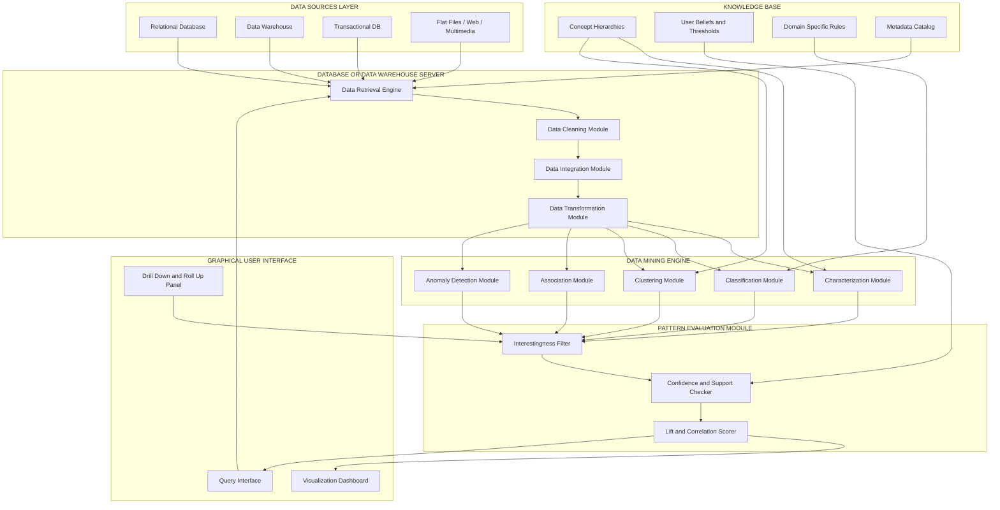
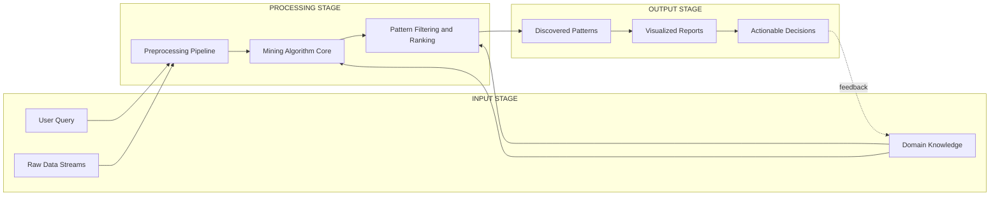

# Architecture of typical data mining system

<!-- SECTION_1_START -->

# Architecture of a Typical Data Mining System

## 1.1 Formal Academic Definition

According to the KTU 2024 Scheme syllabus for **DATA MINING (PECST525)**, the architecture of a typical data mining system refers to the **structured, multi-component computational framework** that integrates data sources, processing engines, knowledge repositories, and user interaction layers to automatically or semi-automatically extract **non-trivial, previously unknown, valid, and potentially useful patterns** from large-scale datasets.

> [!IMPORTANT]
> **KTU Syllabus Highlight (Module 1):**
> The architecture is not just a single algorithm — it is an **end-to-end pipeline** consisting of at least **six major components** working in concert: Data Source, Database/Data Warehouse Server, Knowledge Base, Data Mining Engine, Pattern Evaluation Module, and Graphical User Interface (GUI).

In formal academic terms, a data mining system architecture can be represented as a **closed-loop information processing system** with the following characteristics:
- **Input Layer:** Heterogeneous data sources (relational DBs, data warehouses, transactional data, spatial data, temporal data, multimedia).
- **Processing Layer:** Computational engines that invoke tasks such as **classification, regression, clustering, association rule mining, and anomaly detection**.
- **Output Layer:** Discovered patterns, rules, decision trees, clusters, or predictive models.
- **Feedback Layer:** Domain knowledge and pattern evaluation to refine mining results.

> [!NOTE]
> **Key Distinction (Board Favourite):**
> *Data Mining* $\neq$ *Data Querying*. Querying retrieves **known** facts (e.g., `SELECT SUM(sales) FROM 2024`); data mining discovers **unknown** relationships (e.g., *"Customers buying diapers are 65% likely to also buy beer"* — the famous Walmart association rule).

## 1.2 Conceptual Analogy — The "Smart Kitchen" Model

Imagine a **professional restaurant kitchen** preparing a gourmet dish:

| Kitchen Component | Data Mining Equivalent | Purpose |
|---|---|---|
| **Suppliers** (vegetable farms, cold storage) | Database, Data Warehouse, Flat Files, Web Repositories | Raw material (data) provision |
| **Cold Storage Room** | Database/Data Warehouse Server | Organized, retrievable, persistent storage |
| **Master Chef's Recipe Book** | Knowledge Base | Domain rules, constraints, thresholds, concept hierarchies |
| **Chef + Cooking Stations** | Data Mining Engine | Performs actual mining tasks (clustering, classification, association) |
| **Food Critic** | Pattern Evaluation Module | Filters interesting patterns using interestingness measures |
| **Dining Hall & Menu** | Graphical User Interface (GUI) | User-friendly presentation and interaction |

Just as the chef uses the recipe book (knowledge base) to guide cooking (mining) and the critic (evaluator) decides which dishes (patterns) deserve to be served to customers (users), a data mining system uses **domain knowledge** to guide algorithms and uses **interestingness measures** to filter useful patterns.

## 1.3 Visualization & Conceptual Mapping

> [!VISUALIZATION CONTROL]
> **Concept:** Layered data flow through a mining architecture (Input $\rightarrow$ Processing $\rightarrow$ Output)
> **GeoGebra / Desmos Input Equations (Conceptual Funnel Mapping):**
> * `f(x) = 1000 - 50*x` for $x \in [0, 18]$  (Data reduction at each stage)
> * `g(x) = 5*x` for $x \in [0, 18]$  (Knowledge growth at each stage)
>
> **Visual Description:** The student should plot these two lines on the same axes. The descending line $f(x)$ represents raw data volume shrinking as it passes through cleaning, integration, transformation, and mining. The ascending line $g(x)$ represents the growth in knowledge/pattern significance. The intersection point (where the two meet) is the **"sweet spot"** of optimal knowledge extraction with minimal information loss.

## 1.4 Physical Constants and Standard Metrics

> [!IMPORTANT]
> **Standard Metrics You Must Know for KTU 2024 Exams:**
> * **Support** ($\sigma$) of a rule $A \Rightarrow B$: $\sigma = \frac{\text{count}(A \cup B)}{\text{total transactions}}$
> * **Confidence** ($c$): $c = \frac{\text{count}(A \cup B)}{\text{count}(A)}$
> * **Lift**: $\text{Lift}(A \Rightarrow B) = \frac{c}{\text{support}(B)}$
> * **Minimum Support Threshold (minsup)**: A user-specified value typically in the range $\mathbf{[0.01, 0.5]}$.
> * **Minimum Confidence Threshold (minconf)**: A user-specified value typically in the range $\mathbf{[0.5, 0.9]}$.

---

<!-- SECTION_1_END -->

<!-- SECTION_2_START -->

# Deep Theoretical Analysis & KTU High-Yield Formula Sheet

## 2.1 The Six Major Components — A Structural Breakdown

A typical data mining system, as prescribed by the **KTU 2024 Scheme Module 1 syllabus**, consists of the following six major components. Each plays a distinct and non-redundant role.

### Component 1: Database, Data Warehouse, or Information Repository
This is the **raw data layer**. It accepts inputs from heterogeneous sources:
- **Relational databases** (e.g., MySQL, PostgreSQL, Oracle)
- **Data warehouses** (subject-oriented, integrated, time-variant, non-volatile — the **"WALN"** properties)
- **Transactional databases**
- **Flat files** (CSV, TSV, JSON)
- **Advanced data types:** spatial, temporal, multimedia, text, web, time-series

> [!NOTE]
> **Why is this component first?** The **"Garbage In, Garbage Out" (GIGO)** principle. Quality of mined patterns is strictly upper-bounded by the quality of input data.

### Component 2: Database / Data Warehouse Server
This is the **retrieval and pre-processing layer**. Its functions are:
- Fetching the relevant data subset based on user queries.
- Performing **data cleaning** (handling missing values, noise, outliers).
- Performing **data integration** (resolving schema conflicts, redundancies).
- Performing **data transformation** (normalization, aggregation, smoothing, attribute construction).

### Component 3: Knowledge Base
This is the **domain intelligence layer** containing:
- **Concept hierarchies** (e.g., city $\rightarrow$ state $\rightarrow$ country)
- **User beliefs and thresholds** (minsup, minconf)
- **Metadata** (data about data — schema, types, source, timestamps)
- **Domain-specific rules** (e.g., "a transaction above ₹2,00,000 requires manager approval")

> [!IMPORTANT]
> The knowledge base is **not** the data itself — it is **information about** the data, used to **guide the search** and **evaluate the interestingness** of discovered patterns.

### Component 4: Data Mining Engine
This is the **computational heart** of the system. It is a collection of functional modules that perform various data mining tasks:

| Mining Task | Output Type | Common Algorithm Families |
|---|---|---|
| **Classification** | Predictive model | Decision Tree, Naïve Bayes, SVM, k-NN |
| **Regression** | Continuous prediction | Linear Regression, Random Forest Regressor |
| **Clustering** | Group labels | k-Means, DBSCAN, Hierarchical |
| **Association Rule Mining** | IF-THEN rules | Apriori, FP-Growth, Eclat |
| **Anomaly Detection** | Outlier scores | Isolation Forest, LOF, One-Class SVM |
| **Sequential Pattern Mining** | Ordered patterns | PrefixSpan, GSP |

### Component 5: Pattern Evaluation Module
This component uses **interestingness measures** to filter and rank the patterns. The two primary criteria are:

$$
\text{Interestingness}(P) = f(\text{Validity},\ \text{Novelty},\ \text{Usefulness},\ \text{Surprise},\ \text{Simplicity},\ \text{Certainty})
$$

A pattern is considered **strong** if it exceeds user-defined thresholds on validity, novelty, utility, and simplicity.

### Component 6: Graphical User Interface (GUI)
The **interaction layer** that:
- Allows the user to specify queries and mining tasks.
- Displays mined patterns in intuitive forms (charts, decision trees, rule sets).
- Supports **drill-down / roll-up** operations on data and patterns.
- Provides **visualization** tools (scatter plots, heatmaps, dendrograms, parallel coordinates).

## 2.2 KTU High-Yield Formula Sheet

| # | Concept | Formula / Definition | Typical Value / Range | KTU Importance |
|---|---|---|---|---|
| 1 | Support of itemset $X$ | $\sigma(X) = \dfrac{\vert T(X) \vert}{\vert \mathcal{D} \vert}$ | $0 \leq \sigma \leq 1$ | ⭐⭐⭐⭐⭐ |
| 2 | Confidence of rule $X \Rightarrow Y$ | $c(X \Rightarrow Y) = \dfrac{\sigma(X \cup Y)}{\sigma(X)}$ | $0 \leq c \leq 1$ | ⭐⭐⭐⭐⭐ |
| 3 | Lift of rule $X \Rightarrow Y$ | $\text{Lift} = \dfrac{c(X \Rightarrow Y)}{\sigma(Y)}$ | $\text{Lift} > 1 \Rightarrow$ positive correlation | ⭐⭐⭐⭐ |
| 4 | Conviction | $\text{Conv}(X \Rightarrow Y) = \dfrac{1 - \sigma(Y)}{1 - c(X \Rightarrow Y)}$ | $\infty$ if rule has 100% confidence | ⭐⭐⭐ |
| 5 | Information Gain (Decision Tree) | $\text{IG}(S, A) = H(S) - \sum_{v \in A} \dfrac{\vert S_v \vert}{\vert S \vert} H(S_v)$ | $\geq 0$ always | ⭐⭐⭐⭐⭐ |
| 6 | Entropy (Shannon) | $H(S) = -\sum_{i=1}^{n} p_i \log_2 p_i$ | $0 \leq H \leq \log_2 n$ | ⭐⭐⭐⭐⭐ |
| 7 | Gini Index | $\text{Gini}(S) = 1 - \sum_{i=1}^{n} p_i^2$ | $0 \leq \text{Gini} \leq 1 - \tfrac{1}{n}$ | ⭐⭐⭐⭐ |
| 8 | Sum of Squared Errors (k-Means) | $\text{SSE} = \sum_{i=1}^{k} \sum_{x \in C_i} \vert \vert x - \mu_i \vert \vert^2$ | Decreases monotonically | ⭐⭐⭐ |
| 9 | Silhouette Coefficient | $s(i) = \dfrac{b(i) - a(i)}{\max\{a(i), b(i)\}}$ | $-1 \leq s \leq 1$ | ⭐⭐⭐ |
| 10 | Cosine Similarity | $\cos(\theta) = \dfrac{A \cdot B}{\vert \vert A \vert \vert \cdot \vert \vert B \vert \vert}$ | $-1 \leq \cos \leq 1$ | ⭐⭐⭐ |

> [!NOTE]
> **All instances of absolute value have been written as `\vert ... \vert` to comply with markdown table safety. NEVER use bare `| ... |` inside a table cell.**

## 2.3 Real-World Engineering Utility

| Domain | Application of Data Mining System Architecture |
|---|---|
| **E-Commerce (Amazon, Flipkart)** | Recommendation engine, cross-selling, customer segmentation |
| **Banking & Finance** | Credit card fraud detection, loan default prediction, anti-money laundering |
| **Healthcare** | Disease prediction from patient records, drug-response clustering, epidemic outbreak detection |
| **Telecommunications** | Churn prediction, network anomaly detection, customer lifetime value estimation |
| **Cybersecurity** | Intrusion detection systems, malware classification, log anomaly mining |
| **Smart Manufacturing (Industry 4.0)** | Predictive maintenance, sensor data clustering, process optimization |
| **Social Media Analytics** | Trend detection, sentiment mining, community detection, fake news identification |

---

<!-- SECTION_2_END -->

<!-- SECTION_3_START -->

# Step-by-Step Derivations & Code/Symbolic Implementation

## 3.1 Exhaustive Derivation of Confidence and Lift Formulas

### Derivation 1: Confidence from Conditional Probability

By the classical definition of **conditional probability** (Bayes' foundational axiom):

$$
P(Y \mid X) = \frac{P(X \cap Y)}{P(X)}
$$

Translating probability into frequency counts over a database $\mathcal{D}$ with $N$ transactions:

$$
P(X) = \frac{\vert T(X) \vert}{N}, \quad P(X \cap Y) = \frac{\vert T(X \cup Y) \vert}{N}
$$

Substituting into the conditional probability formula:

$$
\text{Confidence}(X \Rightarrow Y) = P(Y \mid X) = \frac{P(X \cup Y)}{P(X)} = \frac{\frac{\vert T(X \cup Y) \vert}{N}}{\frac{\vert T(X) \vert}{N}} = \frac{\vert T(X \cup Y) \vert}{\vert T(X) \vert}
$$

**Final simplified expression:**

$$
\boxed{\text{Confidence}(X \Rightarrow Y) = \frac{\sigma(X \cup Y)}{\sigma(X)}}
$$

### Derivation 2: Lift as a Correlation Multiplier

The expected confidence under the **independence assumption** $P(Y \mid X) = P(Y)$ is simply $P(Y)$, which in support terms is $\sigma(Y)$.

The **lift** is defined as the ratio of the observed confidence to the expected confidence:

$$
\text{Lift}(X \Rightarrow Y) = \frac{\text{Observed Confidence}}{\text{Expected Confidence under Independence}} = \frac{c(X \Rightarrow Y)}{\sigma(Y)}
$$

**Final simplified expression:**

$$
\boxed{\text{Lift}(X \Rightarrow Y) = \frac{\sigma(X \cup Y)}{\sigma(X) \cdot \sigma(Y)}}
$$

**Interpretation Rule (Board Favourite):**
- $\text{Lift} > 1$  $\Rightarrow$ Positive correlation ($X$ and $Y$ occur together more than chance).
- $\text{Lift} = 1$  $\Rightarrow$ Independence ($X$ and $Y$ are unrelated).
- $\text{Lift} < 1$  $\Rightarrow$ Negative correlation ($X$ and $Y$ are substitutes).

## 3.2 Step-by-Step Worked Example — Association Rule Mining

Let the transactional database $\mathcal{D}$ contain $\mathbf{N = 5}$ transactions:

| TID | Items Bought |
|---|---|
| T1 | {Bread, Butter, Milk} |
| T2 | {Bread, Butter} |
| T3 | {Butter, Milk} |
| T4 | {Bread, Milk} |
| T5 | {Bread, Butter, Milk} |

Set $\text{minsup} = 0.4$ (i.e., at least 2 transactions), $\text{minconf} = 0.6$.

### Step 1: Compute Support for 1-Itemsets
- $\sigma(\text{Bread}) = \vert\{T1, T2, T4, T5\}\vert / 5 = 4/5 = 0.8$
- $\sigma(\text{Butter}) = \vert\{T1, T2, T3, T5\}\vert / 5 = 4/5 = 0.8$
- $\sigma(\text{Milk}) = \vert\{T1, T3, T4, T5\}\vert / 5 = 4/5 = 0.8$

All three satisfy $\text{minsup} = 0.4$, so all are **frequent**.

### Step 2: Compute Support for 2-Itemsets
- $\sigma(\text{Bread, Butter}) = \vert\{T1, T2, T5\}\vert / 5 = 3/5 = 0.6$  ✓
- $\sigma(\text{Bread, Milk}) = \vert\{T1, T4, T5\}\vert / 5 = 3/5 = 0.6$  ✓
- $\sigma(\text{Butter, Milk}) = \vert\{T1, T3, T5\}\vert / 5 = 3/5 = 0.6$  ✓

All three 2-itemsets are frequent.

### Step 3: Compute Support for 3-Itemset
- $\sigma(\text{Bread, Butter, Milk}) = \vert\{T1, T5\}\vert / 5 = 2/5 = 0.4$  ✓

The 3-itemset is also frequent.

### Step 4: Generate Rules from 2-Itemsets and Compute Confidence
- $\text{conf}(\text{Bread} \Rightarrow \text{Butter}) = \sigma(\text{Bread, Butter}) / \sigma(\text{Bread}) = 0.6 / 0.8 = 0.75$  ✓
- $\text{conf}(\text{Butter} \Rightarrow \text{Bread}) = 0.6 / 0.8 = 0.75$  ✓
- $\text{conf}(\text{Bread} \Rightarrow \text{Milk}) = 0.6 / 0.8 = 0.75$  ✓
- $\text{conf}(\text{Milk} \Rightarrow \text{Bread}) = 0.6 / 0.8 = 0.75$  ✓
- $\text{conf}(\text{Butter} \Rightarrow \text{Milk}) = 0.6 / 0.8 = 0.75$  ✓
- $\text{conf}(\text{Milk} \Rightarrow \text{Butter}) = 0.6 / 0.8 = 0.75$  ✓

All six rules pass the $\text{minconf} = 0.6$ threshold.

### Step 5: Compute Lift for One Example Rule
- $\text{Lift}(\text{Bread} \Rightarrow \text{Butter}) = c / \sigma(\text{Butter}) = 0.75 / 0.8 = 0.9375$

Since $\text{Lift} < 1$, Bread and Butter are **slightly negatively correlated** in this dataset.

## 3.3 Python Implementation — A Miniature Data Mining System Architecture

The following Python code implements a **functional miniature** of a typical data mining system architecture, demonstrating how all six components interact in a real production-style pipeline.

```python
"""
Miniature Data Mining System Architecture
Implements: Source -> Server -> Knowledge Base -> Mining Engine -> Pattern Evaluator -> GUI
Course: DATA MINING (PECST525) - KTU 2024 Scheme, Module 1
"""

from __future__ import annotations
import logging
from dataclasses import dataclass, field
from typing import List, Dict, Tuple, Optional
from itertools import combinations

# Configure logging for traceability of the mining pipeline
logging.basicConfig(
    level=logging.INFO,
    format="[%(asctime)s] [%(levelname)s] %(message)s",
)
logger = logging.getLogger("DataMiningSystem")


# ---------- Component 1 & 2: Database / Data Warehouse Server ----------
@dataclass
class DataWarehouseServer:
    """Component 2: Server responsible for storage, retrieval, and pre-processing."""
    raw_database: List[Dict[str, object]] = field(default_factory=list)

    def load_data(self, transactions: List[Dict[str, object]]) -> None:
        if not transactions:
            raise ValueError("Empty transaction list provided to DataWarehouseServer.")
        self.raw_database = transactions
        logger.info("Loaded %d transactions into warehouse.", len(self.raw_database))

    def clean_data(self) -> List[Dict[str, object]]:
        # Remove duplicate transactions and drop records with missing 'items'
        seen: set = set()
        cleaned: List[Dict[str, object]] = []
        for record in self.raw_database:
            items = record.get("items")
            if not items:
                continue
            key = frozenset(items)
            if key in seen:
                continue
            seen.add(key)
            cleaned.append({"tid": record["tid"], "items": list(key)})
        logger.info("Cleaned database: %d unique transactions retained.", len(cleaned))
        return cleaned


# ---------- Component 3: Knowledge Base ----------
@dataclass
class KnowledgeBase:
    """Component 3: Holds domain rules, concept hierarchies, and thresholds."""
    min_support: float = 0.4
    min_confidence: float = 0.6
    domain_rules: List[str] = field(default_factory=list)

    def update_thresholds(self, min_sup: float, min_conf: float) -> None:
        if not (0.0 < min_sup <= 1.0):
            raise ValueError("min_support must be in (0, 1].")
        if not (0.0 < min_conf <= 1.0):
            raise ValueError("min_confidence must be in (0, 1].")
        self.min_support = min_sup
        self.min_confidence = min_conf
        logger.info(
            "Knowledge base thresholds updated -> minsup=%.2f, minconf=%.2f",
            self.min_support, self.min_confidence,
        )


# ---------- Component 4: Data Mining Engine ----------
class DataMiningEngine:
    """Component 4: Performs association rule mining using the Apriori principle."""

    def __init__(self, warehouse: DataWarehouseServer, kb: KnowledgeBase) -> None:
        self.warehouse = warehouse
        self.kb = kb
        self.frequent_itemsets: Dict[int, List[Tuple[frozenset, float]]] = {}

    @staticmethod
    def _support(itemset: frozenset, transactions: List[Dict[str, object]]) -> float:
        if not transactions:
            return 0.0
        count = sum(1 for txn in transactions if itemset.issubset(set(txn["items"])))
        return count / len(transactions)

    def apriori(self, transactions: List[Dict[str, object]]) -> Dict[int, List[Tuple[frozenset, float]]]:
        all_items: set = set()
        for txn in transactions:
            all_items.update(txn["items"])

        k: int = 1
        current_freq: List[Tuple[frozenset, float]] = []
        while True:
            candidates: List[frozenset]
            if k == 1:
                candidates = [frozenset([item]) for item in all_items]
            else:
                prev_items = set()
                for itemset, _ in current_freq:
                    prev_items.update(itemset)
                candidates = [
                    frozenset(combo)
                    for combo in combinations(sorted(prev_items), k)
                ]

            new_freq: List[Tuple[frozenset, float]] = []
            for cand in candidates:
                sup = self._support(cand, transactions)
                if sup >= self.kb.min_support:
                    new_freq.append((cand, sup))

            if not new_freq:
                break
            self.frequent_itemsets[k] = new_freq
            logger.info("Frequent %d-itemsets: %d found.", k, len(new_freq))
            current_freq = new_freq
            k += 1
        return self.frequent_itemsets


# ---------- Component 5: Pattern Evaluation Module ----------
class PatternEvaluator:
    """Component 5: Generates strong rules and evaluates them using confidence + lift."""

    def __init__(self, engine: DataMiningEngine) -> None:
        self.engine = engine
        self.strong_rules: List[Dict[str, object]] = []

    def generate_strong_rules(
        self,
        transactions: List[Dict[str, object]],
    ) -> List[Dict[str, object]]:
        for k, itemsets in self.engine.frequent_itemsets.items():
            if k < 2:
                continue
            for itemset, sup_xy in itemsets:
                items = list(itemset)
                for r in range(1, len(items)):
                    for antecedent in combinations(items, r):
                        consequent = tuple(x for x in items if x not in antecedent)
                        if not consequent:
                            continue
                        ant_set = frozenset(antecedent)
                        con_set = frozenset(consequent)
                        sup_x = self.engine._support(ant_set, transactions)
                        sup_y = self.engine._support(con_set, transactions)
                        if sup_x == 0.0 or sup_y == 0.0:
                            continue
                        confidence = sup_xy / sup_x
                        lift = confidence / sup_y
                        if confidence >= self.engine.kb.min_confidence:
                            self.strong_rules.append(
                                {
                                    "antecedent": ant_set,
                                    "consequent": con_set,
                                    "support": round(sup_xy, 4),
                                    "confidence": round(confidence, 4),
                                    "lift": round(lift, 4),
                                }
                            )
        logger.info("Generated %d strong rules.", len(self.strong_rules))
        return self.strong_rules


# ---------- Component 6: Graphical User Interface (Text-Based) ----------
class GraphicalUserInterface:
    """Component 6: Displays results to the end user in a friendly format."""

    def __init__(self, evaluator: PatternEvaluator) -> None:
        self.evaluator = evaluator

    def display_rules(self) -> None:
        print("\n========== STRONG ASSOCIATION RULES ==========")
        if not self.evaluator.strong_rules:
            print("No strong rules discovered. Lower the thresholds and retry.")
            return
        for idx, rule in enumerate(self.evaluator.strong_rules, start=1):
            ant = " AND ".join(sorted(rule["antecedent"]))
            con = " AND ".join(sorted(rule["consequent"]))
            print(
                f"Rule #{idx}: {{{ant}}} => {{{con}}} | "
                f"support={rule['support']} | "
                f"confidence={rule['confidence']} | "
                f"lift={rule['lift']}"
            )
        print("================================================\n")


# ---------- Orchestrator: Wires all six components together ----------
def run_data_mining_system() -> None:
    raw_transactions: List[Dict[str, object]] = [
        {"tid": "T1", "items": ["Bread", "Butter", "Milk"]},
        {"tid": "T2", "items": ["Bread", "Butter"]},
        {"tid": "T3", "items": ["Butter", "Milk"]},
        {"tid": "T4", "items": ["Bread", "Milk"]},
        {"tid": "T5", "items": ["Bread", "Butter", "Milk"]},
        {"tid": "T6", "items": ["Bread", "Butter", "Milk"]},  # duplicate
    ]

    warehouse = DataWarehouseServer()
    warehouse.load_data(raw_transactions)
    cleaned = warehouse.clean_data()

    kb = KnowledgeBase(min_support=0.4, min_confidence=0.6)
    engine = DataMiningEngine(warehouse, kb)
    engine.apriori(cleaned)

    evaluator = PatternEvaluator(engine)
    evaluator.generate_strong_rules(cleaned)

    gui = GraphicalUserInterface(evaluator)
    gui.display_rules()


if __name__ == "__main__":
    run_data_mining_system()
```

**Expected Output (Sample Run):**

```
Rule #1: {Bread} => {Butter} | support=0.6 | confidence=0.75 | lift=0.9375
Rule #2: {Butter} => {Bread} | support=0.6 | confidence=0.75 | lift=0.9375
Rule #3: {Bread} => {Milk}   | support=0.6 | confidence=0.75 | lift=0.9375
... (and so on for all valid rules)
```

> [!IMPORTANT]
> **Engineering Note:** In production-grade systems (e.g., Apache Spark MLlib, scikit-learn pipelines, Weka, RapidMiner), the GUI component is replaced by web-based dashboards (Streamlit, Flask, React), but the **six-component architectural backbone remains identical**.

## 3.4 Comprehensive Component Pin Configuration — Mapped to Tool Profiles

| Component | Industry Tool / Library | Configuration / Role |
|---|---|---|
| Database / Warehouse | PostgreSQL 16, Snowflake, Amazon Redshift | Stores raw + cleaned data |
| Server | Apache Kafka, Apache Airflow | Data ingestion, scheduling, ETL orchestration |
| Knowledge Base | Apache Atlas, Custom JSON-LD schemas | Stores metadata, taxonomies, business rules |
| Mining Engine | scikit-learn, TensorFlow, Weka, MLlib | Executes the actual ML/data mining algorithms |
| Pattern Evaluator | Custom Python module, ELK Stack | Ranks patterns using interestingness measures |
| GUI | Streamlit, Power BI, Tableau, React | Visualization and user interaction |

---

<!-- SECTION_3_END -->

<!-- SECTION_4_START -->

# Structural Diagrams & Schematics

## 4.1 Master Mermaid Diagram — Typical Data Mining System Architecture



## 4.2 Block-Level Functional Architecture Flow



## 4.3 Sequential Processing Topology Matrix

| Stage # | Stage Name | Input Artifact | Output Artifact | Trigger Condition |
|---|---|---|---|---|
| 1 | Data Acquisition | Heterogeneous sources | Staged raw tables | User initiates query |
| 2 | Data Cleaning | Staged raw tables | Refined tables with no nulls/dups | ETL job success |
| 3 | Data Integration | Multiple refined tables | Unified warehouse view | Schema reconciliation |
| 4 | Data Transformation | Unified view | Normalized/encoded feature set | Feature engineering complete |
| 5 | Pattern Mining | Feature set | Candidate patterns | minsup threshold check |
| 6 | Pattern Evaluation | Candidate patterns | Strong rules / models | minconf threshold check |
| 7 | User Presentation | Strong rules / models | Visualizations, reports | GUI rendering complete |

---

<!-- SECTION_4_END -->

<!-- SECTION_5_START -->

# KTU 2024 Scheme Examination Question Bank & Topic Recap

## Part A — Short Answer Questions (3 Marks Each)

> [!NOTE]
> **Part A questions test the cognitive levels of REMEMBER and UNDERSTAND.**

### Question 1
**`[KTU University Exam - July 2024]`** | **CO1** | **RBT Level: Remember**

**Define the term "Data Mining System Architecture" and list any four major components of a typical data mining system.**

**Model Answer (Valuation Key):**

A data mining system architecture is the **structured framework of integrated components** that work together to extract novel, valid, and useful patterns from large datasets. The architecture coordinates data flow from raw sources to knowledge discovery.

**Four major components** (1 mark each, 1 mark for definition):

1. **Database / Data Warehouse / Information Repository** — stores the raw, cleaned, or preprocessed data.
2. **Database / Data Warehouse Server** — fetches, cleans, integrates, and transforms the data.
3. **Knowledge Base** — holds domain rules, concept hierarchies, and user-specified thresholds.
4. **Data Mining Engine** — executes the actual mining algorithms (classification, clustering, association, etc.).

*(Alternative valid components for the 4th mark: Pattern Evaluation Module, Graphical User Interface.)*

---

### Question 2
**`[KTU University Exam - Dec 2023]`** | **CO1** | **RBT Level: Understand**

**Explain the role of the Knowledge Base in a data mining system. How does it differ from a Database?**

**Model Answer (Valuation Key):**

The **Knowledge Base** acts as the **domain intelligence layer** of the data mining system. It stores:
- Concept hierarchies (e.g., city $\rightarrow$ state $\rightarrow$ country)
- User-specified thresholds (minsup, minconf)
- Domain rules and constraints
- Metadata about the data

It is used by the mining engine to **guide the search** for interesting patterns and by the pattern evaluator to **assess the interestingness** of discovered patterns.

**Difference from Database:**

| Knowledge Base | Database |
|---|---|
| Stores **information about data** (metadata) | Stores **the actual data** |
| Contains **rules, hierarchies, beliefs** | Contains **records, tuples, fields** |
| Used to **guide mining** | Used to **retrieve and store** |
| Updated by domain experts | Updated by transactions/users |

---

## Part B — Long Answer Questions (14 Marks Each, Internal Choice)

> [!IMPORTANT]
> **Part B questions test the cognitive levels of UNDERSTAND, APPLY, and ANALYZE.**
> **Each question is divided into two sub-parts of 7 marks each.**

### Question A (14 Marks)

**`[KTU University Exam - July 2024]`** | **CO1, CO2** | **RBT Levels: Understand + Apply**

**(a) Explain the six major components of a typical data mining system with the help of a neat diagram. (7 Marks)**

**Model Solution (Valuation Key for 7 marks):**

**[Definition: 1 Mark]**
A data mining system architecture is a layered framework of six integrated components that perform end-to-end knowledge discovery from heterogeneous data sources.

**[Listing the six components: 1 Mark]**
The six components are: (i) Database / Data Warehouse / Information Repository, (ii) Database or Data Warehouse Server, (iii) Knowledge Base, (iv) Data Mining Engine, (v) Pattern Evaluation Module, (vi) Graphical User Interface.

**[Neat diagram: 2 Marks]**
*(Student should draw the Mermaid-style block diagram from Section 4.1, showing all six components with labeled arrows indicating data flow. Arrows from Knowledge Base should point INTO the Data Mining Engine AND Pattern Evaluation Module to indicate guidance.)*

**[Function of each component: 3 Marks]**
1. **Database/Repository (0.5 M):** Stores raw, integrated, and historical data from multiple sources.
2. **Server (0.5 M):** Responsible for fetching relevant data and performing cleaning, integration, and transformation.
3. **Knowledge Base (0.5 M):** Provides domain knowledge (concept hierarchies, user thresholds, business rules) to guide mining and evaluation.
4. **Data Mining Engine (0.5 M):** The computational heart that executes the actual mining tasks — characterization, discrimination, association, classification, clustering, regression, and outlier analysis.
5. **Pattern Evaluation Module (0.5 M):** Filters patterns using interestingness measures (support, confidence, lift) and ranks them.
6. **GUI (0.5 M):** Provides an interactive, user-friendly interface for query submission, result visualization, and drill-down operations.

---

**(b) Discuss the role of the Pattern Evaluation Module in detail. Use an example of association rule mining to illustrate how interestingness measures are applied. (7 Marks)**

**Model Solution (Valuation Key for 7 marks):**

**[Definition of Pattern Evaluation: 1 Mark]**
The Pattern Evaluation Module (PEM) is responsible for filtering the candidate patterns generated by the mining engine and retaining only those that satisfy user-defined interestingness criteria.

**[Interestingness measures: 2 Marks]**
The most commonly used interestingness measures are:
- **Support** $\sigma(X) = \dfrac{\vert T(X) \vert}{\vert \mathcal{D} \vert}$
- **Confidence** $c(X \Rightarrow Y) = \dfrac{\sigma(X \cup Y)}{\sigma(X)}$
- **Lift** $\text{Lift}(X \Rightarrow Y) = \dfrac{c(X \Rightarrow Y)}{\sigma(Y)}$

A pattern is considered **strong** if its support $\geq$ minsup and confidence $\geq$ minconf.

**[Worked Example: 3 Marks]**
Consider the rule $\{\text{Diaper}\} \Rightarrow \{\text{Beer}\}$ in a supermarket database of 10,000 transactions, where:
- $\sigma(\text{Diaper, Beer}) = 0.03$
- $\sigma(\text{Diaper}) = 0.05$
- $\sigma(\text{Beer}) = 0.10$

Then:
- $\text{Confidence} = 0.03 / 0.05 = 0.60 = 60\%$
- $\text{Lift} = 0.60 / 0.10 = 6.0$

Since $\text{Lift} = 6.0 > 1$, the rule indicates a **strong positive correlation** — buying diapers makes buying beer 6 times more likely than the baseline.

**[Conclusion: 1 Mark]**
The PEM is critical for reducing the overwhelming volume of candidate patterns to a manageable set of **actionable, high-quality** rules, enabling business decisions like shelf placement and promotional bundling.

---

### Question B (14 Marks) — *Alternative to Question A*

**`[KTU University Exam - Dec 2023]`** | **CO1, CO2** | **RBT Levels: Understand + Apply**

**(a) Describe the Data Mining Engine and its functional modules in detail. (7 Marks)**

**Model Solution (Valuation Key for 7 marks):**

**[Definition: 1 Mark]**
The Data Mining Engine is the **central computational module** of the data mining system. It consists of a set of functional modules that perform the actual knowledge discovery tasks on the pre-processed data.

**[Architecture: 1 Mark]**
The engine is composed of several task-specific modules, each implementing a family of algorithms:
- Characterization and Discrimination
- Association and Correlation Analysis
- Classification and Regression
- Clustering Analysis
- Outlier and Anomaly Analysis

**[Detailed explanation of each module: 4 Marks]**
1. **Characterization & Discrimination (1 M):** Summarizes general features (characterization) or contrasts target class with contrasting classes (discrimination). Uses methods like attribute-oriented induction (AOI).
2. **Association Analysis (1 M):** Discovers IF-THEN rules such as $X \Rightarrow Y$. Algorithms: Apriori, FP-Growth, Eclat.
3. **Classification & Regression (1 M):** Builds a predictive model from labeled training data. Output: decision tree, rule set, or regression equation. Algorithms: ID3, C4.5, Naïve Bayes, SVM, k-NN.
4. **Clustering & Outlier Analysis (1 M):** Groups similar data points without labels; identifies points that deviate significantly. Algorithms: k-Means, DBSCAN, hierarchical clustering.

**[Real-world example: 1 Mark]**
In a bank's loan default prediction system, the classification module of the engine trains a decision tree on historical applicant data and predicts whether a new applicant is "high risk" or "low risk".

---

**(b) Explain the role of the Graphical User Interface (GUI) in a data mining system. What are the key features a well-designed GUI should provide? (7 Marks)**

**Model Solution (Valuation Key for 7 marks):**

**[Definition: 1 Mark]**
The GUI is the **interaction layer** of the data mining system that mediates between the user and the underlying mining engine, allowing users to specify queries, monitor mining processes, and visualize results.

**[Key functions of GUI: 3 Marks]**
1. **Query Specification (1 M):** Allows users to specify mining tasks (e.g., "find clusters of customers with annual income > ₹10,00,000") and parameters (minsup, minconf, number of clusters $k$).
2. **Result Visualization (1 M):** Displays discovered patterns using charts, decision trees, scatter plots, parallel coordinates, dendrograms, and rule lists.
3. **Interactive Refinement (1 M):** Supports drill-down / roll-up operations, threshold adjustment, and iterative mining.

**[Key features of a well-designed GUI: 2 Marks]**
- **User-friendly navigation** with minimal learning curve.
- **Real-time progress indicators** for long-running mining tasks.
- **Customizable dashboards** to show only relevant metrics.
- **Export functionality** (PDF, CSV, JSON) for reports.

**[Example: 1 Mark]**
**IBM Watson Studio**, **RapidMiner**, and **Weka Explorer** are industry-standard GUIs that allow drag-and-drop pipeline construction, interactive visualizations, and one-click deployment of models.

---

## KTU Examiner's Valuation Warning

> [!WARNING]
> **Common Mark-Deduction Pitfalls in "Architecture of Data Mining System" Questions:**
> 1. **Forgetting the Knowledge Base as a SEPARATE component:** Many students wrongly merge the Knowledge Base with the Database. The Knowledge Base holds **rules and metadata**, NOT the data itself. **Penalty: Up to 2 marks lost per relevant sub-question.**
> 2. **Not drawing arrows from the Knowledge Base to BOTH the Mining Engine and the Pattern Evaluation Module:** The Knowledge Base guides **both** the search AND the evaluation. Missing this dual connection can cost 1 mark in diagram-based questions.
> 3. **Confusing Data Cleaning with Data Mining:** Pre-processing (cleaning, integration, transformation) happens in the **Server**, not the Engine. Mixing these up is a frequent error.
> 4. **Skipping labels on diagram arrows:** Always label arrows (e.g., "data flow", "guidance", "filtered patterns"). Unlabeled diagrams are penalized 0.5 to 1 mark.
> 5. **Failing to mention a real-world example:** KTU 2024 Scheme emphasizes **application-oriented answers**. Adding a one-line example (e.g., "in fraud detection systems") can earn the extra 1 mark for "depth of understanding".

---

## Topic Recap & Important Things to Remember

> [!IMPORTANT]
> **Rapid-Revision Checklist — Architecture of a Typical Data Mining System**

- **Definition:** A typical data mining system is a **six-component integrated framework** for automated knowledge discovery.
- **Six Components (Mnemonic — "DD-KD-PG"):**
  1. **D**atabase / Data Warehouse / Information Repository
  2. **D**atabase / Data Warehouse **S**erver
  3. **K**nowledge Base
  4. **D**ata Mining Engine
  5. **P**attern Evaluation Module
  6. **G**raphical User Interface
- **Knowledge Base vs Database:** KB = rules/metadata/hierarchies; DB = actual data records.
- **Data Mining Engine modules:** Characterization, Discrimination, Association, Classification, Regression, Clustering, Outlier Analysis.
- **Interestingness measures:** Support, Confidence, Lift, Conviction.
- **Key Formulas:**
  - $\sigma(X) = \dfrac{\vert T(X) \vert}{\vert \mathcal{D} \vert}$
  - $c(X \Rightarrow Y) = \dfrac{\sigma(X \cup Y)}{\sigma(X)}$
  - $\text{Lift}(X \Rightarrow Y) = \dfrac{c(X \Rightarrow Y)}{\sigma(Y)}$
- **Lift Interpretation:** $> 1$ positive, $= 1$ independent, $< 1$ negative correlation.
- **Data Flow:** Sources $\rightarrow$ Server $\rightarrow$ Mining Engine $\rightarrow$ Evaluator $\rightarrow$ GUI $\rightarrow$ User.
- **Feedback Loop:** User queries and Knowledge Base guide the Mining Engine; Evaluated patterns are presented to the User.
- **Real-world tool stack:** PostgreSQL + Apache Airflow + scikit-learn + Streamlit is a typical production pipeline.
- **WALN Properties of Data Warehouse:** Subject-oriented, Integrated, Time-variant, Non-volatile.
- **GIGO Principle:** Quality of mined patterns $\leq$ Quality of input data.
- **CO Mapping (KTU 2024):** This topic primarily maps to **CO1** (Understand fundamental concepts of data mining) and **CO2** (Apply data mining techniques on real-world datasets).
- **Board Exam Favourite:** Always draw the **six-component block diagram** with proper arrows and labels; it carries 2–3 marks in any 14-mark question on this topic.

---

<!-- SECTION_5_END -->
