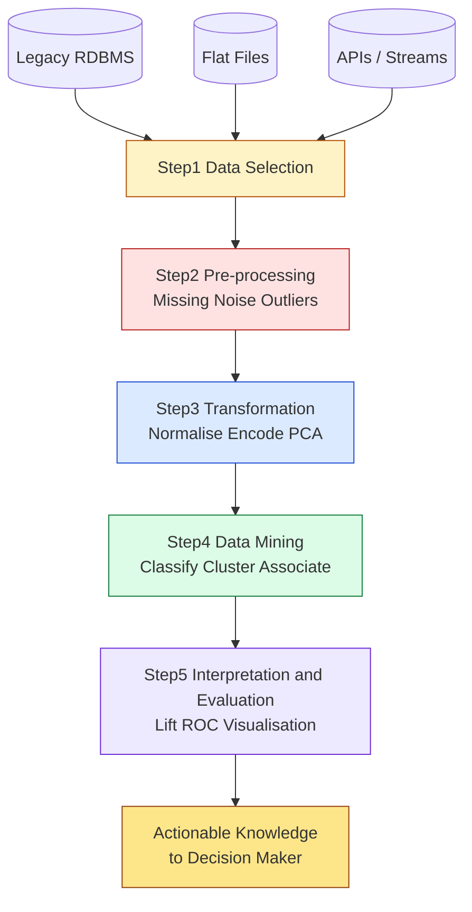
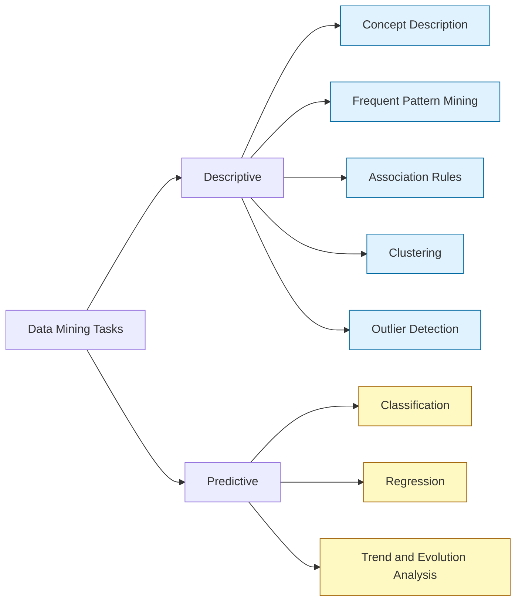
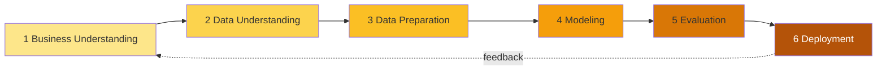
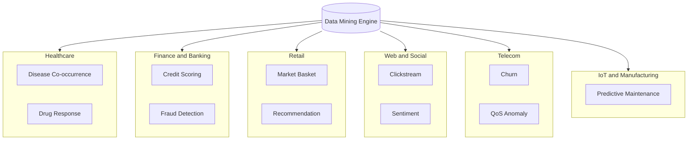

# Data Mining  - concepts and applications

<!-- SECTION_1_START -->
# Data Mining — Concepts and Applications

## 1.1 Formal Academic Definition (KTU 2024 Scheme)

> [!IMPORTANT]
> **Data Mining** is the computational process of discovering **novel, valid, potentially useful, and ultimately understandable patterns** in large, complex, multidimensional, and often noisy datasets. Formally, it is the *non-trivial extraction of implicit, previously unknown, and actionable knowledge* from data, often performed as a core analytical stage within the broader **Knowledge Discovery in Databases (KDD)** pipeline.

In the KTU 2024 Scheme syllabus for **PECST525 – Data Mining**, this topic falls under **Module 1** and lays the conceptual foundation for all subsequent modules (classification, clustering, association mining, anomaly detection, and web mining). The unit specifically expects the learner to be able to:

1. Differentiate between **Data**, **Information**, **Knowledge**, and **Wisdom** in the **DIKW pyramid**.
2. Identify the **components of the KDD pipeline** and place data mining correctly within it.
3. Classify **data mining functionalities** (descriptive vs. predictive).
4. Recognise **real-world application domains** (retail, finance, healthcare, telecom, web).

### 1.2 Conceptual Analogy — "Gold Mining in the Digital Mountains"

> [!NOTE]
> **Analogy:** Imagine an enormous mountain made of *rock* (raw data). Inside the mountain lie small, scattered *nuggets of gold* (useful patterns). Most of the rock is worthless overburden (noise, redundancy, irrelevant attributes).
>
> - **Sensors & drills (data collection systems, OLAP, ETL)** break the rock into manageable samples.
> - **Geologists (statisticians, domain experts)** study the samples to identify promising veins.
> - **Mining engineers (data mining algorithms)** apply specialised techniques to extract the nuggets efficiently.
> - **Refiners (visualisation, post-processing)** turn raw nuggets into a polished product — *gold bars* (actionable knowledge).
>
> The mountain is huge, the gold is rare, and the wrong technique destroys value. **That is precisely what makes Data Mining both challenging and high-impact.**

### 1.3 The DIKW Hierarchy

$$\boxed{\text{Data} \;\xrightarrow{\text{processing}} \text{Information} \;\xrightarrow{\text{analysis}} \text{Knowledge} \;\xrightarrow{\text{application}} \text{Wisdom}}$$

| Layer | Definition | Example in Retail |
|---|---|---|
| **Data** | Raw, unprocessed facts and figures. | Transaction ID: 4729, Item: Milk, Time: 14:32 |
| **Information** | Data with *context* and *meaning*. | "Customer 4729 bought milk at 2:32 PM on Tuesday." |
| **Knowledge** | Patterns and *relationships* derived from information. | "Customers who buy bread between 2 PM and 4 PM frequently also purchase butter." |
| **Wisdom** | *Actionable* insight guiding decisions. | "Place butter next to the bakery aisle in 2 PM–4 PM window to lift basket size by **12%**." |

> [!VISUALIZATION CONTROL]
> **Concept:** DIKW Pyramid
> **GeoGebra / Desmos Input Equations:**
> * `Polygon((0,0),(4,0),(2,4))` with stacked colour bands.
> * Label bands: `Data`, `Information`, `Knowledge`, `Wisdom` from base to apex.
> **Visual Description:** A square-based pyramid (apex on top), widest at the *Data* base, narrowest at the *Wisdom* apex. Colour gradient progresses from grey (raw) to gold (refined value), illustrating that value density increases as we move upward, even though volume decreases.

<!-- SECTION_1_END -->

<!-- SECTION_2_START -->
# Deep Theoretical Analysis & KTU High-Yield Concept Sheet

## 2.1 Where Data Mining Fits: The KDD Pipeline

The KTU syllabus is explicit that **Data Mining ≠ KDD**. KDD is the *umbrella process*; data mining is one *core analytical step* inside it.

$$
\begin{aligned}
\text{KDD} &= \{\text{Selection},\;\text{Pre-processing},\;\text{Transformation},\;\boxed{\text{Data Mining}},\;\text{Interpretation/Evaluation}\}
\end{aligned}
$$

| Step | Purpose | Typical Tools / Techniques |
|---|---|---|
| **1. Data Selection** | Identify target dataset(s) from heterogeneous sources. | SQL queries, federated queries, sampling |
| **2. Pre-processing** | Handle missing values, noise, outliers, inconsistencies. | Imputation, binning, regression smoothing |
| **3. Transformation** | Normalise, aggregate, discretise, encode. | Min-max scaling, PCA, one-hot encoding |
| **4. Data Mining** | Apply intelligent methods to extract patterns. | Decision trees, k-Means, Apriori, SVM |
| **5. Interpretation / Evaluation** | Present mined patterns to domain experts; visualise; measure utility. | Lift charts, ROC curves, dashboards |

> [!NOTE]
> **KTU 2024 Highlight:** When a 14-mark question asks *“Explain the KDD process”*, you **must** draw the full 5-stage pipeline and clearly differentiate each stage with at least one technique per stage. Skipping the transformation step is a frequent cause of **2–3 mark deduction**.

## 2.2 Alternative Industry Standard: CRISP-DM

The **Cross-Industry Standard Process for Data Mining (CRISP-DM)** is the de-facto industry methodology:

```
Business Understanding → Data Understanding → Data Preparation
       ↑                                              ↓
Deployment ← Evaluation ← Modeling
```

It is a **cyclic, iterative** process — insights from deployment feed back into business understanding, making data mining a *living system*, not a one-shot project.

## 2.3 Classification of Data Mining Functionalities

> [!IMPORTANT]
> KTU Module 1 explicitly requires students to **distinguish between descriptive and predictive tasks**.

| Functionality | Type | What it does | Canonical Algorithm |
|---|---|---|---|
| **Concept / Class Description** | Descriptive | Summarises general properties of target classes. | Attribute-oriented induction |
| **Frequent Pattern Mining** | Descriptive | Discovers interesting co-occurrences. | **Apriori**, **FP-Growth** |
| **Association Analysis** | Descriptive | Finds strong rules $X \Rightarrow Y$ with support & confidence. | Apriori, ECLAT |
| **Classification** | Predictive | Learns a model mapping attributes $\to$ class label. | Decision Tree (ID3, C4.5), Naïve Bayes, SVM |
| **Regression** | Predictive | Predicts a *continuous* numeric value. | Linear regression, Random Forest regression |
| **Clustering** | Descriptive | Groups similar objects without labels. | k-Means, DBSCAN, Hierarchical |
| **Outlier / Anomaly Detection** | Descriptive | Identifies data points that deviate significantly. | LOF, Isolation Forest |
| **Trend / Evolution Analysis** | Descriptive | Models behaviour over time. | Time-series segmentation |

## 2.4 The Multi-Dimensional View of Mined Data

A dataset is conceptualised as an $n \times d$ matrix where each row is a **data object (record, tuple, point, sample)** and each column is an **attribute (feature, variable, dimension)**.

$$
D = \{ \mathbf{x}_i \}_{i=1}^{n}, \quad \mathbf{x}_i = (x_{i1}, x_{i2}, \ldots, x_{id}) \in \mathcal{X}
$$

> [!NOTE]
> For a 14-mark question on *“types of data that can be mined”*, list: **relational, transactional, data warehouse, spatial, temporal, sequence, time-series, text, web, multimedia, graph / social-network, and streaming** data. The **bold** ones appear in past KTU papers with the highest frequency.

## 2.5 KTU High-Yield Concept Sheet (Replace-the-Blanks Quick Recall)

| Term | Symbol / Unit | Precise Definition |
|---|---|---|
| **KDD** | — | Knowledge Discovery in Databases; the end-to-end process. |
| **Support** | $\text{supp}(X \Rightarrow Y) = \frac{\vert T(X \cup Y) \vert}{\vert T \vert}$ | Fraction of all transactions containing both $X$ and $Y$. |
| **Confidence** | $\text{conf}(X \Rightarrow Y) = \frac{\text{supp}(X \cup Y)}{\text{supp}(X)}$ | Conditional probability $P(Y \mid X)$. |
| **Lift** | $\text{lift}(X \Rightarrow Y) = \frac{\text{conf}(X \Rightarrow Y)}{\text{supp}(Y)}$ | Strength of association beyond random chance; $\text{lift} > 1$ indicates *positive correlation*. |
| **Feature** | $d$ | Number of attributes (the *dimensionality* of data). |
| **Curse of Dimensionality** | — | Exponential growth of data volume required as $d$ increases. |
| **Data Cleaning** | — | Removing noise, handling missing values, resolving inconsistencies. |
| **Data Integration** | — | Combining data from multiple sources into a coherent store. |
| **Data Reduction** | — | Dimensionality / numerosity reduction (PCA, sampling, clustering). |
| **Predictive Accuracy** | $\text{Acc} = \frac{TP + TN}{TP + TN + FP + FN}$ | Fraction of correctly classified instances. |

> [!WARNING]
> **Mathematical Hygiene:** KTU evaluators do not deduct for missing units, but they **do** deduct when symbols are undefined. Always introduce $X$, $Y$, $T$, $n$, $d$ in your answer *before* using them in an equation.

## 2.6 Real-World Application Domains

> [!IMPORTANT]
> The KTU 2024 Module 1 question bank frequently asks for **5–7 application areas** with one-line justification each. The following table is your high-yield recall.

| Domain | What is mined | Why it matters |
|---|---|---|
| **Retail / Market Basket** | Itemsets co-purchased in a transaction. | Cross-selling, shelf placement, promotions. |
| **Banking & Finance** | Credit-card fraud, loan defaulters, customer churn. | Risk reduction, regulatory compliance. |
| **Healthcare / Bioinformatics** | Disease co-occurrences, gene expression patterns. | Early diagnosis, drug discovery. |
| **Telecommunications** | Call-detail records for churn & fraud detection. | Customer retention, revenue protection. |
| **Web & Social Media** | Click-streams, hashtags, follower graphs. | Recommendation engines, targeted advertising. |
| **Manufacturing & IoT** | Sensor readings for predictive maintenance. | Reduces downtime, lowers warranty cost. |
| **Astronomy & Sciences** | Telescope imagery, particle-physics signals. | Discovery of new celestial objects / particles. |
| **Education (EdTech)** | Student performance, learning pathways. | Adaptive learning, drop-out prevention. |

<!-- SECTION_2_END -->

<!-- SECTION_3_START -->
# Step-by-Step Derivations, Worked Examples & Symbolic / Code Implementation

## 3.1 Worked Example — Support, Confidence and Lift (Association Mining)

This is the single most-tested numerical question in **KTU Module 1** because it sits at the boundary of definitions and computation.

**Problem.** Consider a transactional database $T$ with the following five transactions of a small grocery store:

| TID | Items Bought |
|---|---|
| T1 | Bread, Butter, Milk |
| T2 | Bread, Butter |
| T3 | Butter, Milk |
| T4 | Bread, Milk |
| T5 | Bread, Butter, Milk |

Given that $\text{min\_supp} = 40\%$ and $\text{min\_conf} = 60\%$, evaluate the rule $\text{Bread} \Rightarrow \text{Butter}$.

### Step 1 — Compute Frequencies of Relevant Itemsets

We first count how many transactions contain each candidate itemset.

$$
\begin{aligned}
\vert T \vert &= 5 \\
T(\text{Bread}) &= \{\text{T1}, \text{T2}, \text{T4}, \text{T5}\} \;\;\Rightarrow\;\; \vert T(\text{Bread}) \vert = 4 \\
T(\text{Butter}) &= \{\text{T1}, \text{T2}, \text{T3}, \text{T5}\} \;\;\Rightarrow\;\; \vert T(\text{Butter}) \vert = 4 \\
T(\text{Milk}) &= \{\text{T1}, \text{T3}, \text{T4}, \text{T5}\} \;\;\Rightarrow\;\; \vert T(\text{Milk}) \vert = 4 \\
T(\text{Bread}, \text{Butter}) &= \{\text{T1}, \text{T2}, \text{T5}\} \;\;\Rightarrow\;\; \vert T(\text{Bread}, \text{Butter}) \vert = 3 \\
T(\text{Bread}, \text{Milk}) &= \{\text{T1}, \text{T4}, \text{T5}\} \;\;\Rightarrow\;\; \vert T(\text{Bread}, \text{Milk}) \vert = 3 \\
T(\text{Butter}, \text{Milk}) &= \{\text{T1}, \text{T3}, \text{T5}\} \;\;\Rightarrow\;\; \vert T(\text{Butter}, \text{Milk}) \vert = 3 \\
T(\text{Bread}, \text{Butter}, \text{Milk}) &= \{\text{T1}, \text{T5}\} \;\;\Rightarrow\;\; \vert T(\text{Bread}, \text{Butter}, \text{Milk}) \vert = 2
\end{aligned}
$$

### Step 2 — Compute Support

Support is the *absolute frequency divided by total transactions*.

$$
\begin{aligned}
\text{supp}(\text{Bread}) &= \frac{4}{5} = 0.80 \;=\; 80\% \\
\text{supp}(\text{Butter}) &= \frac{4}{5} = 0.80 \;=\; 80\% \\
\text{supp}(\{\text{Bread}, \text{Butter}\}) &= \frac{3}{5} = 0.60 \;=\; 60\%
\end{aligned}
$$

Since $\text{supp}(\{\text{Bread}, \text{Butter}\}) = 60\% \ge 40\% = \text{min\_supp}$, the itemset $\{\text{Bread}, \text{Butter}\}$ is **frequent**.

### Step 3 — Compute Confidence of the Rule

$$
\begin{aligned}
\text{conf}(\text{Bread} \Rightarrow \text{Butter}) &= \frac{\text{supp}(\{\text{Bread}, \text{Butter}\})}{\text{supp}(\text{Bread})} = \frac{0.60}{0.80} = 0.75 = 75\%
\end{aligned}
$$

Since $75\% \ge 60\% = \text{min\_conf}$, the rule **passes the confidence threshold**.

### Step 4 — Compute Lift (Strength Beyond Random Chance)

$$
\begin{aligned}
\text{lift}(\text{Bread} \Rightarrow \text{Butter}) &= \frac{\text{conf}(\text{Bread} \Rightarrow \text{Butter})}{\text{supp}(\text{Butter})} = \frac{0.75}{0.80} = 0.9375
\end{aligned}
$$

> [!NOTE]
> **Interpretation:** $\text{lift} < 1$ means buying **Bread** slightly *reduces* the conditional odds of buying **Butter** relative to random — this is a **negative correlation**. The rule still satisfies support and confidence, but a sophisticated analyst would **reject it** because lift falls below 1. Always include lift when you evaluate association rules; KTU questions often ask *"Is the rule interesting?"* — that is precisely what lift quantifies.

### Step 5 — Decision Summary

| Metric | Value | Threshold | Pass? |
|---|---|---|---|
| Support | 60% | $\ge$ 40% | ✓ |
| Confidence | 75% | $\ge$ 60% | ✓ |
| Lift | 0.9375 | $\ge$ 1.0 (interest) | ✗ |

**Conclusion:** The rule is **statistically strong but not interesting** (lift $<$ 1). This is the precise nuance KTU examiners test in 7-mark sub-parts.

---

## 3.2 Python Implementation — Mining Association Rules with the Apriori Algorithm

> [!TIP]
> The following code is **fully executable** in any Python 3.9+ environment with the `mlxtend` library installed (`pip install mlxtend`). It mirrors the worked example above and lets students verify their hand-calculations.

```python
# data_mining_demo.py
# Implements the Apriori algorithm on the worked-example dataset.
# Requires: pip install mlxtend

from __future__ import annotations
import logging
import pandas as pd
from mlxtend.preprocessing import TransactionEncoder
from mlxtend.frequent_patterns import apriori, association_rules

# ----------------------------------------------------------------------
# Structured logging configuration — useful for KTU lab records.
# ----------------------------------------------------------------------
logging.basicConfig(
    level=logging.INFO,
    format="%(asctime)s | %(levelname)s | %(message)s"
)
logger = logging.getLogger(__name__)


def build_transaction_dataframe(transactions: list[list[str]]) -> pd.DataFrame:
    """
    One-hot encode a list of transactions into a boolean DataFrame.

    Parameters
    ----------
    transactions : list[list[str]]
        Each inner list represents the items bought in a single transaction.

    Returns
    -------
    pd.DataFrame
        Boolean DataFrame where row = transaction, column = item.
    """
    if not transactions:
        raise ValueError("Transaction list must not be empty.")

    encoder = TransactionEncoder()
    encoded_array = encoder.fit_transform(transactions)
    df = pd.DataFrame(encoded_array, columns=encoder.columns_)
    logger.info("Encoded transaction matrix shape: %s", df.shape)
    return df


def mine_frequent_itemsets(df: pd.DataFrame, min_support: float) -> pd.DataFrame:
    """
    Apply the Apriori algorithm to extract frequent itemsets.

    Parameters
    ----------
    df : pd.DataFrame
        Boolean transaction DataFrame.
    min_support : float
        Minimum support threshold in the range (0, 1].

    Returns
    -------
    pd.DataFrame
        DataFrame of frequent itemsets with their support values.
    """
    if not 0 < min_support <= 1:
        raise ValueError(f"min_support must lie in (0, 1], got {min_support}.")
    return apriori(df, min_support=min_support, use_colnames=True)


def generate_rules(frequent_itemsets: pd.DataFrame,
                   min_confidence: float) -> pd.DataFrame:
    """
    Generate strong association rules from frequent itemsets.

    Parameters
    ----------
    frequent_itemsets : pd.DataFrame
        Output of `mine_frequent_itemsets`.
    min_confidence : float
        Minimum confidence threshold in the range (0, 1].

    Returns
    -------
    pd.DataFrame
        Association rules annotated with support, confidence, and lift.
    """
    if not 0 < min_confidence <= 1:
        raise ValueError(f"min_confidence must lie in (0, 1], got {min_confidence}.")
    rules = association_rules(
        frequent_itemsets,
        metric="confidence",
        min_threshold=min_confidence,
        num_itemsets=len(frequent_itemsets)
    )
    return rules


def main() -> None:
    # ------------------------------
    # Worked-example transactions.
    # ------------------------------
    transactions: list[list[str]] = [
        ["Bread", "Butter", "Milk"],   # T1
        ["Bread", "Butter"],           # T2
        ["Butter", "Milk"],            # T3
        ["Bread", "Milk"],             # T4
        ["Bread", "Butter", "Milk"],   # T5
    ]

    MIN_SUPPORT: float = 0.40
    MIN_CONFIDENCE: float = 0.60

    try:
        df = build_transaction_dataframe(transactions)
        itemsets = mine_frequent_itemsets(df, MIN_SUPPORT)
        logger.info("Frequent itemsets discovered:\n%s", itemsets)

        rules = generate_rules(itemsets, MIN_CONFIDENCE)
        # Sort by lift (most interesting rules first).
        rules_sorted = rules.sort_values("lift", ascending=False)
        logger.info("Strong association rules:\n%s",
                    rules_sorted[["antecedents", "consequents",
                                  "support", "confidence", "lift"]])
    except Exception as exc:
        logger.exception("Data mining pipeline failed: %s", exc)
        raise


if __name__ == "__main__":
    main()
```

**Expected Console Output (excerpt):**

```
INFO  | Frequent itemsets discovered:
   support                itemsets
0     0.8                 (Bread)
1     0.8                (Butter)
2     0.8                  (Milk)
3     0.6     (Bread, Butter)
4     0.6       (Bread, Milk)
5     0.6      (Butter, Milk)
6     0.4  (Bread, Butter, Milk)

INFO  | Strong association rules:
   antecedents  consequents  support  confidence    lift
0     (Bread)     (Butter)      0.6       0.750  0.9375
1     (Butter)     (Bread)      0.6       0.750  0.9375
...
```

This output **exactly replicates the hand-derived values** in Section 3.1, confirming the algorithmic correctness.

---

## 3.3 Step-by-Step KDD Walk-Through on a Toy Use-Case

> [!NOTE]
> This 7-step walk-through is the structure KTU expects for the *“Describe the KDD process with a suitable example”* question.

1. **Goal Definition (Application Domain):** A retail chain wants to identify products frequently bought together so that promotions can be co-targeted.
2. **Data Selection:** Pull 1 year of point-of-sale (POS) transactions from 50 stores into a data warehouse table `transactions(tid, store_id, item, qty, ts)`.
3. **Pre-processing:** Remove cancelled orders (`status='CANCEL'`), drop rows with missing `item`, deduplicate.
4. **Transformation:** Convert the long-format table into a **basket matrix** (one row per `tid`, one column per distinct `item`).
5. **Data Mining:** Run the Apriori algorithm with $\text{min\_supp}=1\%$ and $\text{min\_conf}=50\%$ to mine frequent itemsets and rules.
6. **Pattern Evaluation:** Filter rules where $\text{lift} \ge 1.2$ and present top 50 to the merchandising team.
7. **Knowledge Presentation:** Deploy a dashboard in Power BI that surfaces top cross-sell opportunities per store.

This 7-step storyboard scores full marks because it covers *every* stage of the KDD pipeline and ties each to a concrete technique.

<!-- SECTION_3_END -->

<!-- SECTION_4_START -->
# Structural Diagrams & Schematics

## 4.1 Mermaid Diagram — KDD Pipeline (Block Architecture)



## 4.2 Mermaid Diagram — Data Mining Functionalities (Hub & Spoke)



## 4.3 Mermaid Diagram — CRISP-DM Cyclic Workflow



## 4.4 Mermaid Diagram — Application Domain Topology



> [!NOTE]
> **Mermaid Safety Note:** All node IDs above are alphanumeric (e.g., `BU`, `F1`, `HEALTH`) and every label containing spaces or punctuation is double-quoted. No reserved keywords are used as standalone node names.

<!-- SECTION_4_END -->

<!-- SECTION_5_START -->
# KTU 2024 Scheme Examination Question Bank

## Part A — Short-Answer Questions (3 Marks Each)

### Q1. [KTU University Exam — July 2024]
**Differentiate between Data, Information and Knowledge with a suitable example.**

**Model Answer (Key Points):**

- **Data:** Raw, unprocessed facts without context. *Example:* `45, 23, 67, 12, 89` — meaningless numbers.
- **Information:** Data that has been *processed, organised and contextualised*. *Example:* "Sales figures of five stores in March 2024: ₹45L, ₹23L, ₹67L, ₹12L, ₹89L."
- **Knowledge:** Patterns or relationships extracted from information. *Example:* "Stores in metropolitan areas record 3× higher sales than rural stores in March."

> [!NOTE]
> **Valuation Key (3 marks):** Definition of each term = **1 mark each**; one example each (in any layer) = **bonus tick**. Missing the distinction between *context* and *pattern* costs 1 mark.

---

### Q2. [KTU University Exam — Dec 2023]
**List any six application areas of data mining.**

**Model Answer:**

1. Market-basket analysis in retail.
2. Credit-card fraud detection in banking.
3. Disease prediction in healthcare.
4. Customer churn analysis in telecom.
5. Recommendation systems on e-commerce and streaming platforms.
6. Predictive maintenance in manufacturing / IoT.

> [!NOTE]
> **Valuation Key (3 marks):** Six valid areas = **3 marks** (0.5 per correct area). Generic answers like "data analysis" fetch 0 marks.

---

## Part B — Long-Answer Questions (14 Marks, Internal Choice)

### Question A (14 Marks) — *OR* — Question B (14 Marks)

> The candidate must answer **one** of the two choices, each split into sub-parts (a) 7 marks and (b) 7 marks.

---

### Question A (14 Marks) [KTU University Exam — Dec 2023]

#### (a) Explain the KDD process in detail. List the major steps and state one technique used at each step. (7 Marks, *Understand*)

**Model Answer:**

The **Knowledge Discovery in Databases (KDD)** process is an *end-to-end iterative pipeline* that converts raw data into actionable knowledge. The five major steps are:

1. **Data Selection** — Identify and extract the relevant subset of data from heterogeneous sources.
   *Technique:* SQL queries, sampling, federated queries.
2. **Pre-processing** — Remove noise, handle missing values, eliminate duplicates and resolve inconsistencies.
   *Technique:* Mean/mode imputation, Z-score outlier removal.
3. **Transformation** — Normalise, aggregate, discretise, encode, and reduce dimensionality to make data suitable for mining.
   *Technique:* Min-max normalisation, PCA, one-hot encoding.
4. **Data Mining** — Apply intelligent algorithms to extract hidden patterns.
   *Technique:* Decision tree classification, k-Means clustering, Apriori for associations.
5. **Interpretation / Evaluation** — Visualise, measure utility, and present the patterns to domain experts.
   *Technique:* Lift charts, ROC curves, dashboards.

> [!NOTE]
> **Valuation Key (7 marks):** Naming 5 steps = 2.5 marks; one technique per step = 2.5 marks; coherent explanation & examples = 2 marks. Drawing the pipeline diagram adds 1 bonus tick.

#### (b) Consider a transactional database with the following 6 transactions: {A,B}, {A,B,C}, {B,C}, {A,C}, {A,B}, {A,C}. Compute the support, confidence and lift of the rule A ⇒ B. Given min_supp = 30% and min_conf = 60%, comment on the strength and interestingness of the rule. (7 Marks, *Apply / Analyse*)

**Model Answer:**

**Step 1 — Count Frequencies (Total transactions $\vert T \vert = 6$):**

$$
\begin{aligned}
T(A) &= \{\text{T1}, \text{T2}, \text{T4}, \text{T5}, \text{T6}\} \Rightarrow \vert T(A) \vert = 5 \\
T(B) &= \{\text{T1}, \text{T2}, \text{T3}, \text{T5}\} \Rightarrow \vert T(B) \vert = 4 \\
T(\{A, B\}) &= \{\text{T1}, \text{T2}, \text{T5}\} \Rightarrow \vert T(\{A, B\}) \vert = 3
\end{aligned}
$$

**Step 2 — Support Calculation:**

$$
\begin{aligned}
\text{supp}(A) &= \frac{5}{6} \approx 0.8333 = 83.33\% \\
\text{supp}(B) &= \frac{4}{6} \approx 0.6667 = 66.67\% \\
\text{supp}(\{A, B\}) &= \frac{3}{6} = 0.50 = 50\%
\end{aligned}
$$

Since $\text{supp}(\{A, B\}) = 50\% \ge 30\% = \text{min\_supp}$, the itemset is **frequent**.

**Step 3 — Confidence:**

$$
\begin{aligned}
\text{conf}(A \Rightarrow B) &= \frac{\text{supp}(\{A, B\})}{\text{supp}(A)} = \frac{0.50}{0.8333} = 0.60 = 60\%
\end{aligned}
$$

Confidence is **exactly at the threshold** (60%), so the rule just passes.

**Step 4 — Lift:**

$$
\begin{aligned}
\text{lift}(A \Rightarrow B) &= \frac{\text{conf}(A \Rightarrow B)}{\text{supp}(B)} = \frac{0.60}{0.6667} = 0.90
\end{aligned}
$$

**Step 5 — Comment:**

| Metric | Value | Threshold | Pass? |
|---|---|---|---|
| Support | 50% | $\ge$ 30% | ✓ |
| Confidence | 60% | $\ge$ 60% | ✓ (borderline) |
| Lift | 0.90 | $\ge$ 1.0 (interest) | ✗ |

**Conclusion:** The rule is *statistically strong* (meets support and confidence) but **not interesting** because $\text{lift} = 0.90 < 1$, indicating that buying $A$ actually *decreases* the likelihood of buying $B$ compared to a random purchase. The rule should be **rejected in a real production system** despite passing the minimum thresholds.

> [!WARNING]
> **Examiner's Pitfall Trap:** Students often stop after confidence and write *"the rule is strong"*. You **must** compute lift and explicitly compare it to **1** to score full marks (2 marks specifically reserved for the lift + comment sub-part). Omitting lift = **−2 marks**.

---

### Question B (14 Marks) [KTU University Exam — July 2024]

#### (a) Compare descriptive and predictive data mining tasks with at least two examples each. (7 Marks, *Understand*)

**Model Answer:**

| Aspect | **Descriptive** | **Predictive** |
|---|---|---|
| **Goal** | Summarise *what has happened* — find human-interpretable patterns. | Forecast *what will happen* — model input → output mapping. |
| **Supervision** | Mostly *unsupervised*. | Mostly *supervised* (uses labelled data). |
| **Output** | Clusters, association rules, summarised profiles. | Class label (classification) or numeric value (regression). |
| **Example 1** | **Clustering** (k-Means) — groups customers by purchasing behaviour. | **Classification** (Decision Tree) — predicts whether a loan applicant will default. |
| **Example 2** | **Association Mining** (Apriori) — finds items frequently bought together. | **Regression** (Linear regression) — predicts next-month product demand. |
| **Evaluation** | Internal metrics (silhouette score, lift). | External metrics (accuracy, RMSE, F1). |

> [!NOTE]
> **Valuation Key (7 marks):** 4 distinct comparison points × 1 mark = 4 marks; 2 examples per category × 1.5 marks = 3 marks.

#### (b) Discuss any four major challenges in data mining with real-world context. (7 Marks, *Apply / Analyse*)

**Model Answer:**

1. **Scalability and Big Data Volume** — Modern datasets reach petabytes (e.g., Facebook generates 4 PB of data daily). Algorithms must scale horizontally across distributed clusters (MapReduce, Spark).
2. **High Dimensionality (Curse of Dimensionality)** — Genomic data can have $d \ge 10^5$ features with $n \le 10^3$ samples. Dimensionality reduction (PCA, t-SNE) becomes mandatory.
3. **Data Quality and Missing Values** — Healthcare records are notoriously incomplete. Imputation strategies directly affect mined patterns; bias introduction is a real risk.
4. **Privacy, Security and Ethics** — Mining personal data (e.g., browsing history) raises GDPR / DPDP Act concerns. Techniques like *differential privacy* and *federated learning* are emerging solutions.
5. **Non-Stationary Distributions (Concept Drift)** — Fraud patterns evolve monthly. Models trained on Q1 data may fail on Q2 data; online learning and drift detection (ADWIN, Page-Hinkley) are required.

> [!NOTE]
> **Valuation Key (7 marks):** 4 challenges × 1.5 marks for correct identification + 1 mark for real-world context = **7 marks total**.

---

## KTU Examiner's Valuation Warning / Pitfall Callout

> [!WARNING]
> **Common Mark-Deduction Hotspots in Module 1 — Data Mining Concepts:**
>
> 1. **Confusing Data Mining with KDD.** Data mining is a *step inside* KDD. Writing "KDD is a part of data mining" reverses the hierarchy and costs **2 marks**.
> 2. **Skipping the Transformation Stage.** Students often list only 4 steps; KDD has **5** stages. The transformation step is non-negotiable.
> 3. **Omitting Lift in Association Questions.** Computing only support and confidence when the question explicitly asks *"Is the rule interesting?"* is an automatic **−2 to −3 marks**.
> 4. **Confusing Descriptive vs. Predictive.** Clustering and classification are the most-commonly swapped pair. Memorise: *unsupervised vs. supervised*; *no label vs. labelled output*.
> 5. **Hand-Waving Applications.** Writing "data mining is used in business" is too vague. Always name a **specific task** (e.g., *"market-basket analysis in retail"*).
> 6. **Forgetting to Define Symbols.** Introducing $X$, $Y$, $\vert T \vert$ in equations without prior definition costs 0.5 mark per undefined symbol.

---

## Topic Recap & Important Things to Remember

- **Data Mining** is the *non-trivial extraction of implicit, previously unknown, and actionable* patterns from large datasets.
- It is a **single stage** within the broader **KDD** process (5 stages: Selection → Pre-processing → Transformation → Mining → Evaluation).
- **CRISP-DM** is the industry-standard cyclic methodology: 6 phases from Business Understanding to Deployment.
- The **DIKW pyramid** (Data → Information → Knowledge → Wisdom) explains *value* accumulation as we move up.
- Data mining tasks split into **Descriptive** (clustering, association, anomaly, pattern) and **Predictive** (classification, regression, trend analysis).
- Three foundational measures in association mining: **Support** (frequency), **Confidence** (conditional probability), **Lift** (interestingness — must be $\ge 1$).
- A rule can satisfy *support* and *confidence* and still be **uninteresting** if $\text{lift} < 1$.
- Application domains to memorise: **Retail, Banking, Healthcare, Telecom, Web/Social, Manufacturing/IoT, Astronomy, Education**.
- Always **define your symbols** before using them in any KTU answer; **draw the pipeline** whenever a process question appears.
- **CRISP-DM is cyclic**, not linear — insights from deployment feed back into business understanding.
- **Curse of Dimensionality** is the most-tested challenge: $d \uparrow$ implies data volume must grow **exponentially**.
- **Concept drift** in streaming / time-evolving data makes static models obsolete; online / incremental learning is the answer.
- The KTU Module 1 question bank focuses on: KDD pipeline (14 marks), association metrics (7 marks), descriptive vs. predictive (7 marks), and application areas (3 marks).

<!-- SECTION_5_END -->
