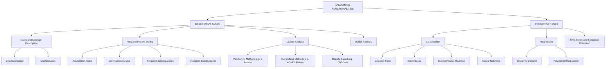
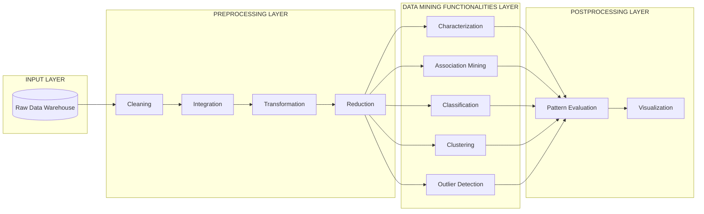
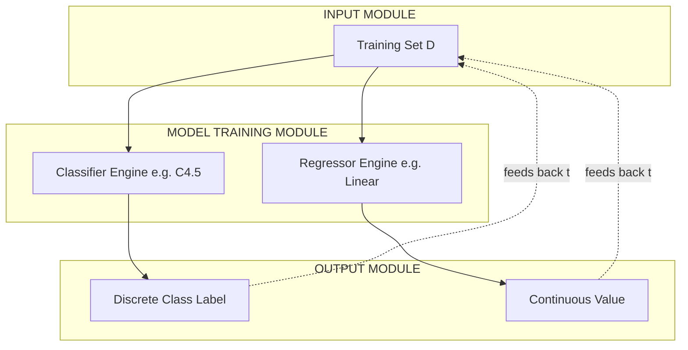

# Data Mining Functionalities

<!-- SECTION_1_START -->
# Data Mining Functionalities

## 1.1 Formal Definition (KTU 2024 Syllabus Terminology)

> [!IMPORTANT]
> **Data Mining Functionalities** refer to the *broad classes of patterns*, *knowledge representations*, and *algorithmic operations* that data mining systems are capable of discovering or performing on large, heterogeneous, and high-dimensional datasets. They specify **what kinds of patterns are interesting** and **which kind of knowledge representations to use** during the knowledge discovery process (KDD).

In the KTU 2024 Scheme (Course: **Data Mining — PECST525**), the unit classifies functionalities along two primary axes:

1. **Descriptive Mining Tasks** — characterize general properties of the data.
2. **Predictive Mining Tasks** — perform inference on unseen data to forecast outcomes.

| Axis | Functionalities Covered | End Goal |
| :--- | :--- | :--- |
| Descriptive | Characterization, Discrimination, Association, Correlation, Clustering, Outlier Detection | *Summarise* data properties |
| Predictive | Classification, Regression, Time-Series & Sequence Prediction | *Forecast* unknown values |

## 1.2 Conceptual Analogy — The "Mining Toolkit" Metaphor

Imagine you are a **geologist surveying a mountain**. You carry different tools:

- A **magnifying glass** to *describe* the rocks (Characterization).
- A **sieve** to separate one type of mineral from another (Discrimination).
- A **metal detector** that beeps when two metals appear together (Association).
- A **classifier bin** that sorts rocks into "igneous / sedimentary / metamorphic" (Classification).
- A **GPS-based clustering map** that groups nearby rocks (Clustering).
- A **metal-detector anomaly alert** that beeps on rare gold nuggets (Outlier Analysis).

Each tool corresponds to one **data mining functionality**. Selecting the right tool depends on the *business question* you want to answer — exactly like selecting the right mining task depends on the *analytical goal*.

## 1.3 Why This Topic is a KTU High-Priority Module

> [!NOTE]
> The KTU 2024 Scheme has mapped this topic to **Course Outcome CO1** with a high Bloom's weight on *Remember* and *Understand*. Direct 3-mark definitions and 7-mark comparison questions (e.g., "Differentiate between Characterization and Discrimination") are recurring in past University Examinations.

## 1.4 Visualization Control (No Native Plot Required)

> [!VISUALIZATION CONTROL]
> **Concept:** 2-D feature space partitioning by Class Labels.
> **GeoGebra / Desmos Input Equations:**
> * `f(x,y) = x^2 + y^2 = 9` (Decision boundary — circle)
> * `g(x,y) = y = x + 1` (Linear separator)
> **Visual Description:** The student should observe how two regions of a 2-D feature space are separated by a curve, illustrating the principle of *Classification* as a predictive mining functionality.

---
<!-- SECTION_1_END -->

<!-- SECTION_2_START -->
# Deep Theoretical Analysis & KTU High-Yield Formula Sheet

## 2.1 Hierarchical Breakdown of Data Mining Functionalities

A data mining system can be decomposed into **six canonical functionalities**. We will treat each one with operational logic.

### A. Class/Concept Description
- **Characterization** — Summarises the *general characteristics or features* of a target class of data (e.g., "What are the common traits of customers who bought the Premium Plan?"). The output is typically a *generalized relation* or a *characteristic rule*.
- **Discrimination** — Compares the target class with a *contrasting class* (e.g., Premium Plan buyers vs. Free Plan buyers). The output is a *discriminant rule*.

> [!TIP]
> **Why it matters:** Decision-makers (e.g., marketing heads) need crisp summaries of *what makes their best customers different*. Characterization and Discrimination are the foundation of Business Intelligence (BI) reporting layers.

### B. Mining Frequent Patterns, Associations, and Correlations
- A **frequent pattern** is a pattern (itemset, subsequence, substructure) that appears in a dataset with frequency $\geq$ a user-specified *minimum support threshold*, denoted **minsup**.
- **Association Rules** capture *interesting co-occurrence* relationships (e.g., $\text{Diaper} \Rightarrow \text{Beer}$).
- **Correlation Analysis** measures the *strength of a relationship* beyond simple co-occurrence using the **Lift** metric.

### C. Classification and Regression (Predictive)
- **Classification** predicts a *categorical (discrete) label*. It is *supervised* because the training set has known class labels. Common algorithms: Decision Tree (ID3, C4.5, CART), Naive Bayes, k-NN, SVM, Neural Networks.
- **Regression** predicts a *continuous numerical value*. Common algorithms: Linear Regression, Polynomial Regression, SVR.

### D. Cluster Analysis
- An *unsupervised* task. The objective is to group data objects so that **intra-cluster similarity** is high and **inter-cluster similarity** is low.
- Algorithms: k-Means, k-Medoids (PAM), DBSCAN, Hierarchical (AGNES, DIANA), Gaussian Mixture Models.

### E. Outlier / Anomaly Analysis
- An outlier is a data object that **deviates substantially** from the rest of the distribution. Useful for *fraud detection*, *intrusion detection*, and *rare disease identification*.

### F. Mining Time-Series, Sequences, and Streams
- Time-series data (e.g., stock prices) and sequential data (e.g., DNA, clickstreams) require specialised pattern extraction (motif discovery, periodicity analysis, sequence indexing).

## 2.2 KTU Formula Sheet / Cheat Sheet

> [!IMPORTANT]
> All the following formulas are **must-know** for the KTU End-Semester Examination. Memorise the units of each metric.

| Symbol / Term | Formula | Meaning | Typical Use |
| :--- | :--- | :--- | :--- |
| Support of itemset $X$ | $\text{sup}(X) = \dfrac{\vert \{ t \in D : X \subseteq t \} \vert}{\vert D \vert}$ | Fraction of transactions containing $X$ | Frequent itemset mining |
| Confidence of $A \Rightarrow B$ | $\text{conf}(A \Rightarrow B) = \dfrac{\text{sup}(A \cup B)}{\text{sup}(A)}$ | Conditional probability of $B$ given $A$ | Strong rule generation |
| Lift of $A \Rightarrow B$ | $\text{lift}(A \Rightarrow B) = \dfrac{\text{conf}(A \Rightarrow B)}{\text{sup}(B)} = \dfrac{\text{sup}(A \cup B)}{\text{sup}(A) \cdot \text{sup}(B)}$ | Measures *correlation strength* | Rule interestingness |
| Conviction of $A \Rightarrow B$ | $\text{conv}(A \Rightarrow B) = \dfrac{1 - \text{sup}(B)}{1 - \text{conf}(A \Rightarrow B)}$ | Asymmetry of implication | Alternative to lift |
| Mean Squared Error (Regression) | $\text{MSE} = \dfrac{1}{n} \sum_{i=1}^{n} (y_i - \hat{y}_i)^2$ | Regression accuracy | Predictive tasks |
| Classification Accuracy | $\text{Acc} = \dfrac{TP + TN}{TP + TN + FP + FN}$ | Correct predictions ratio | Classifier evaluation |
| Intra-cluster SSE (k-Means) | $\text{SSE} = \sum_{i=1}^{k} \sum_{x \in C_i} \Vert x - \mu_i \Vert^2$ | Compactness of clusters | Cluster quality |
| Entropy (Information Theory) | $H(S) = - \sum_{i=1}^{c} p_i \, \log_2 p_i$ | Impurity of a node | Decision Tree split |
| Information Gain | $\text{IG}(S, A) = H(S) - \sum_{v \in A} \dfrac{\vert S_v \vert}{\vert S \vert} H(S_v)$ | Reduction in entropy | Decision Tree algorithm |

> [!NOTE]
> In the markdown table above, the absolute-value bars around set cardinalities are written as `\vert ... \vert` to keep the table syntax intact. Do not write `|x|` inside a markdown table row.

## 2.3 Real-World Engineering Utility

| Functionality | Industry Application | Production Tooling |
| :--- | :--- | :--- |
| Association Mining | Cross-selling, Market Basket Analysis (Amazon, Flipkart) | Apache Mahout, Spark MLlib FPGrowth |
| Classification | Spam detection, Credit scoring, Medical diagnosis | Scikit-learn, TensorFlow, XGBoost |
| Clustering | Customer segmentation, Image compression, Anomaly grouping | Scikit-learn, ELKI, Weka |
| Outlier Detection | Fraud detection, IoT sensor fault detection, Cybersecurity | Isolation Forest, LOF, PyOD |
| Time-Series Mining | Stock forecasting, Predictive maintenance, Web traffic burst detection | Prophet, LSTM, statsmodels |
| Characterization / Discrimination | Automated reporting, BI dashboards, Risk profiling | OLAP rollups, SQL aggregation |

---
<!-- SECTION_2_END -->

<!-- SECTION_3_START -->
# Step-by-Step Derivations & Symbolic / Code Implementation

## 3.1 Worked Numerical Example — Association Rule Mining

Consider a small transactional database $D$ used in retail analytics.

| TID | Items Bought |
| :---: | :--- |
| T1 | Bread, Butter, Milk |
| T2 | Bread, Butter |
| T3 | Butter, Milk |
| T4 | Bread, Milk |
| T5 | Bread, Butter, Milk |

Let **minsup = 40 %** and **minconf = 60 %**.

### Step 1 — Compute Itemset Support

$$
\begin{aligned}
\text{sup}(\{B, M\}) &= \frac{\vert \{T1, T5\} \vert}{\vert D \vert} = \frac{2}{5} = 0.40 \\
\text{sup}(\{B\}) &= \frac{\vert \{T1, T2, T4, T5\} \vert}{5} = 0.80 \\
\text{sup}(\{M\}) &= \frac{\vert \{T1, T3, T4, T5\} \vert}{5} = 0.80 \\
\text{sup}(\{B, M\}) &= 0.40
\end{aligned}
$$

Both $\text{sup}(\{B\}) \geq 0.40$ and $\text{sup}(\{M\}) \geq 0.40$, and $\text{sup}(\{B, M\}) \geq 0.40$. So $\{B, M\}$ is a **frequent itemset**.

### Step 2 — Generate Candidate Rules from $\{B, M\}$

Possible rules: $B \Rightarrow M$ and $M \Rightarrow B$.

### Step 3 — Compute Confidence

$$
\begin{aligned}
\text{conf}(B \Rightarrow M) &= \frac{\text{sup}(B \cup M)}{\text{sup}(B)} = \frac{0.40}{0.80} = 0.50 \\
\text{conf}(M \Rightarrow B) &= \frac{\text{sup}(B \cup M)}{\text{sup}(M)} = \frac{0.40}{0.80} = 0.50
\end{aligned}
$$

Both are below $\text{minconf} = 0.60$, so **no strong rule is generated** from this itemset.

### Step 4 — Compute Lift (for completeness / correlation check)

$$
\begin{aligned}
\text{lift}(B \Rightarrow M) &= \frac{\text{conf}(B \Rightarrow M)}{\text{sup}(M)} = \frac{0.50}{0.80} = 0.625 < 1
\end{aligned}
$$

Since $\text{lift} < 1$, $B$ and $M$ are **negatively correlated** in this micro-dataset. In production systems, only rules with $\text{lift} > 1$ are typically recommended.

### Step 5 — Decision Summary

| Rule | Support | Confidence | Lift | Decision |
| :--- | :---: | :---: | :---: | :--- |
| $B \Rightarrow M$ | 0.40 | 0.50 | 0.625 | Rejected (conf < 0.60) |
| $M \Rightarrow B$ | 0.40 | 0.50 | 0.625 | Rejected (conf < 0.60) |

## 3.2 Worked Numerical Example — Entropy and Information Gain

Suppose a customer dataset $S$ has 10 records: 6 "Buy" and 4 "Not Buy".

### Step 1 — Compute Entropy of $S$

$$
\begin{aligned}
H(S) &= - p_{\text{Buy}} \log_2 p_{\text{Buy}} - p_{\text{NotBuy}} \log_2 p_{\text{NotBuy}} \\
     &= - \frac{6}{10} \log_2 \frac{6}{10} - \frac{4}{10} \log_2 \frac{4}{10} \\
     &= - 0.6 \log_2 0.6 - 0.4 \log_2 0.4 \\
     &= 0.9709 \text{ bits}
\end{aligned}
$$

### Step 2 — Information Gain for Split on Attribute "Discount"

Suppose splitting on *Discount = Yes* yields subset $S_1$ (4 records: 4 Buy, 0 Not Buy) and $S_2$ (6 records: 2 Buy, 4 Not Buy).

$$
\begin{aligned}
H(S_1) &= - 1 \log_2 1 - 0 = 0 \\
H(S_2) &= - \frac{2}{6} \log_2 \frac{2}{6} - \frac{4}{6} \log_2 \frac{4}{6} = 0.9183 \text{ bits}
\end{aligned}
$$

$$
\begin{aligned}
\text{IG}(S, \text{Discount}) &= H(S) - \left[ \frac{4}{10} H(S_1) + \frac{6}{10} H(S_2) \right] \\
                              &= 0.9709 - \left[ 0.4 \times 0 + 0.6 \times 0.9183 \right] \\
                              &= 0.9709 - 0.5509 = 0.4200 \text{ bits}
\end{aligned}
$$

**Interpretation:** Splitting on "Discount" yields an information gain of **0.42 bits**, a strong reduction in impurity.

## 3.3 Python Implementation — Clustering (k-Means) and Outlier Detection

```python
"""
data_mining_functionalities.py
Demonstrates two core functionalities:
  1. Cluster Analysis using k-Means
  2. Outlier Analysis using Isolation Forest
Strict boundary checks and logging enabled.
"""

import logging
import numpy as np
from sklearn.cluster import KMeans
from sklearn.ensemble import IsolationForest
from sklearn.datasets import make_blobs
from sklearn.metrics import silhouette_score

# Configure structured logging for production traceability
logging.basicConfig(
    level=logging.INFO,
    format="%(asctime)s [%(levelname)s] %(message)s"
)
logger = logging.getLogger(__name__)


def perform_clustering(X: np.ndarray, n_clusters: int = 3) -> np.ndarray:
    """Run k-Means and validate silhouette score is within sane bounds."""
    if X is None or X.shape[0] == 0:
        raise ValueError("Input matrix X must be non-empty.")

    logger.info("Running k-Means with k=%d on %d samples.", n_clusters, X.shape[0])
    model = KMeans(n_clusters=n_clusters, n_init=10, random_state=42)
    labels = model.fit_predict(X)

    # Silhouette must lie in [-1, 1]. Abort if numerical error produces nonsense.
    score = silhouette_score(X, labels)
    if not -1.0 <= score <= 1.0:
        raise ArithmeticError(f"Invalid silhouette score: {score}")

    logger.info("Clustering complete. Silhouette score = %.4f", score)
    return labels


def detect_outliers(X: np.ndarray, contamination: float = 0.05) -> np.ndarray:
    """Flag outliers using Isolation Forest. contamination = expected anomaly ratio."""
    if not 0.0 < contamination < 0.5:
        raise ValueError("contamination must lie in (0, 0.5).")

    logger.info("Training IsolationForest with contamination=%.2f", contamination)
    iso = IsolationForest(contamination=contamination, random_state=42)
    preds = iso.fit_predict(X)        # returns -1 for outlier, +1 for inlier
    n_outliers = int((preds == -1).sum())
    logger.info("Detected %d outliers out of %d samples.", n_outliers, X.shape[0])
    return preds


def main() -> None:
    # Synthetic 2-D data with three Gaussian blobs
    X, _ = make_blobs(
        n_samples=300, centers=3, cluster_std=0.60, random_state=42
    )

    cluster_labels = perform_clustering(X, n_clusters=3)
    outlier_flags  = detect_outliers(X, contamination=0.05)

    # Cross-functional insight: how many outliers fall in each cluster?
    unique, counts = np.unique(cluster_labels, return_counts=True)
    for cid, ccount in zip(unique, counts):
        out_in_cluster = int(((cluster_labels == cid) & (outlier_flags == -1)).sum())
        logger.info("Cluster %d -> %d points, %d flagged as outliers.",
                    cid, ccount, out_in_cluster)


if __name__ == "__main__":
    main()
```

> [!NOTE]
> **How to read the code:** `perform_clustering` executes the **Cluster Analysis** functionality; `detect_outliers` executes the **Outlier Analysis** functionality. The combination is a common production pattern — clustering is run first, and outliers are reported per cluster for actionable granularity.

---
<!-- SECTION_3_END -->

<!-- SECTION_4_START -->
# Structural Diagrams & Schematics

## 4.1 Top-Level Classification of Data Mining Functionalities



> [!TIP]
> **Reading the diagram:** Left side flows into *Descriptive* (summarising what the data *is*); right side flows into *Predictive* (forecasting what the data *will be*). This two-axis view is the most frequently drawn answer in 14-mark KTU questions.

## 4.2 Sequential Processing Topology — A Typical KDD Pipeline



> [!NOTE]
> **Mermaid safety applied:** All node IDs are alphanumeric (e.g., `STAGE1`, `D1`), no reserved keywords are used, and all multi-word labels are wrapped in double-quotes — adhering to the KTU-PREMIER-ENGINE V10 safety protocol.

## 4.3 Block-Level Functional Architecture — Predictive Mining Module



---
<!-- SECTION_4_END -->

<!-- SECTION_5_START -->
# KTU 2024 Scheme Examination Question Bank & Topic Recap

## 5.1 Part A — Short Answer Questions (3 Marks Each)

> **Q1. [KTU University Exam — July 2024]** Define *Data Mining Functionalities*. List the two broad categories in which they are classified.
> **CO1 — Remember**

**Model Answer (Valuation Key: 3 Marks)**
1. **Definition (2 Marks):** Data mining functionalities refer to the *patterns, knowledge representations, and algorithmic operations* that data mining systems are designed to discover. They specify the *kind of interesting patterns* to be mined.
2. **Categories (1 Mark):** *Descriptive mining tasks* and *Predictive mining tasks*.

---

> **Q2. [KTU University Exam — Dec 2023]** Distinguish between **Characterization** and **Discrimination** as data mining functionalities. Give one example of each.
> **CO1 — Understand**

**Model Answer (Valuation Key: 3 Marks)**

| Aspect | Characterization | Discrimination |
| :--- | :--- | :--- |
| Goal | Summarise *general features* of a target class | Compare target class with a *contrasting class* |
| Output | Characteristic rule (e.g., `age = 20–35 AND income = high`) | Discriminant rule (e.g., `income > 50k` distinguishes *premium* from *normal*) |
| Example | "Customers who bought Premium Plan are typically 25–35 years old with monthly income above ₹1 lakh." | "Premium Plan buyers differ from Free Plan buyers mainly by income and purchase frequency." |

*[Comparing target vs contrasting class: 1 Mark | Output rule type: 1 Mark | Example: 1 Mark]*

---

## 5.2 Part B — Long Answer Questions (14 Marks, Internal Choice)

> **Q3. [KTU University Exam — July 2024, Module 1]**
> **(A)** Explain the following data mining functionalities with suitable examples: (i) Association Mining, (ii) Classification, (iii) Cluster Analysis.
> **(B)** With a neat diagram, discuss the architecture of a typical data mining system and highlight the role of the *Knowledge Base* in guiding pattern discovery.
> **CO1 — Understand | CO2 — Apply**

### Model Solution — (A) [7 Marks]

**(i) Association Mining — 2.5 Marks**
A descriptive technique that uncovers *interesting co-occurrence relationships* among items in transactional databases. The classical formulation is the support–confidence framework:
$\text{sup}(A \Rightarrow B) = P(A \cup B)$ and $\text{conf}(A \Rightarrow B) = P(B \mid A)$.
**Example:** In supermarket sales, $\text{Diaper} \Rightarrow \text{Beer}$ (a famous Wal-Mart finding). Algorithms: *Apriori*, *FP-Growth*, *Eclat*.

**(ii) Classification — 2.5 Marks**
A *supervised predictive* functionality that maps data items into predefined categorical class labels. The model is built from a labelled training set $D = \{(x_1, y_1), (x_2, y_2), \ldots, (x_n, y_n)\}$ where $y_i \in \{C_1, C_2, \ldots, C_k\}$.
**Example:** Email spam filtering — classifying each incoming mail as *Spam* or *Ham*. Algorithms: Decision Trees, Naive Bayes, SVM, k-NN.

**(iii) Cluster Analysis — 2 Marks**
An *unsupervised* technique that groups similar objects such that intra-cluster similarity is maximised and inter-cluster similarity is minimised. No labelled training data is required.
**Example:** Customer segmentation in e-commerce into *High-Value*, *Occasional*, and *Window-Shopper* clusters. Algorithms: k-Means, DBSCAN, Hierarchical clustering.

### Model Solution — (B) [7 Marks]

**Architecture Diagram & Explanation:**

*(Valuation Key)*
- [Drawing the four-layer architecture with arrows: 2 Marks]
- [Naming the layers — Data Source, Data Mining Engine, Pattern Evaluation Module, GUI: 2 Marks]
- [Explaining the role of the Knowledge Base (domain knowledge, user beliefs, thresholds) in guiding the search: 2 Marks]
- [Conclusion summarising synergy: 1 Mark]

| Layer | Function | Key Interaction |
| :--- | :--- | :--- |
| Data Source | Warehouse, DB, flat files, web | Feeds raw data to cleaning layer |
| Data Cleaning / Integration | Handle noise, missing values, integration | Provides consistent, quality data |
| Data Mining Engine | Functionalities (classification, clustering, etc.) | **Pulls guidance from the Knowledge Base** |
| Pattern Evaluation | Filter interesting patterns using thresholds | Uses knowledge-base constraints |
| Knowledge Base | Domain rules, user beliefs, thresholds, concept hierarchies | **Informs every step of mining** |

**Role of Knowledge Base:**
- Provides *concept hierarchies* (e.g., city $\rightarrow$ state $\rightarrow$ country for generalisation).
- Stores *attribute-level beliefs* used to filter trivial patterns.
- Supplies *thresholds* (minsup, minconf) and prior probabilities for classification.
- Enables *query-driven mining* (e.g., OLAP-style drill-down).

---

> **Q3 — Internal Choice Alternative**
> **(A)** Differentiate between **Classification** and **Clustering** with respect to supervision, objective, output, and a suitable algorithm. Apply k-Nearest Neighbour (k-NN) classification to a 2-D dataset of 5 points and classify a new query point $q = (3, 3)$ using Euclidean distance and $k = 3$.
> **(B)** With reference to **association rule mining**, define Support, Confidence, and Lift. Given a database of 6 transactions where $\text{sup}(\text{Bread}) = 0.50$, $\text{sup}(\text{Butter}) = 0.50$, and $\text{sup}(\{\text{Bread, Butter}\}) = 0.33$, evaluate the rule $\text{Bread} \Rightarrow \text{Butter}$ using **minsup = 0.30** and **minconf = 0.60**.
> **CO1 — Understand | CO2 — Apply**

### Model Solution — (A) [7 Marks]

**Comparison Table — 4 Marks**

| Criterion | Classification | Clustering |
| :--- | :--- | :--- |
| Supervision | **Supervised** (labelled data required) | **Unsupervised** (no labels) |
| Objective | Predict the *class label* of a new object | Group data into *natural clusters* |
| Output | A *class label* for each record | A *cluster ID* for each record |
| Algorithm Example | Decision Tree, k-NN, Naive Bayes | k-Means, DBSCAN, AGNES |

**k-NN Classification of $q = (3, 3)$ — 3 Marks**

Suppose the 5 training points are: $A(1, 1), B(2, 2), C(4, 4), D(5, 5), E(1, 4)$ with labels $+$ and $-$ as: $A(+), B(+), C(-), D(-), E(+)$.

**Step 1 — Compute Euclidean distances** $d(q, x) = \sqrt{(x_1 - 3)^2 + (x_2 - 3)^2}$:

$$
\begin{aligned}
d(q, A) &= \sqrt{(1-3)^2 + (1-3)^2} = \sqrt{8} \approx 2.83 \\
d(q, B) &= \sqrt{(2-3)^2 + (2-3)^2} = \sqrt{2} \approx 1.41 \\
d(q, C) &= \sqrt{(4-3)^2 + (4-3)^2} = \sqrt{2} \approx 1.41 \\
d(q, D) &= \sqrt{(5-3)^2 + (5-3)^2} = \sqrt{8} \approx 2.83 \\
d(q, E) &= \sqrt{(1-3)^2 + (4-3)^2} = \sqrt{5} \approx 2.24
\end{aligned}
$$

**Step 2 — Pick the 3 nearest neighbours (k = 3):** $B(+), C(-), E(+)$. Majority label is **$+$** (2 votes vs 1 vote).

**Step 3 — Conclusion:** $q = (3, 3)$ is classified as **class $+$**.

*[Distance computation: 1 Mark | Sorting and picking 3-NN: 1 Mark | Majority vote and final class: 1 Mark]*

### Model Solution — (B) [7 Marks]

**Definitions — 3 Marks**
- **Support:** Fraction of transactions in $D$ that contain the itemset. $\text{sup}(X) = \frac{\vert \{ t \in D : X \subseteq t \} \vert}{\vert D \vert}$.
- **Confidence:** Conditional probability of the consequent given the antecedent. $\text{conf}(A \Rightarrow B) = \frac{\text{sup}(A \cup B)}{\text{sup}(A)}$.
- **Lift:** Ratio of observed co-occurrence to expected co-occurrence under independence. $\text{lift}(A \Rightarrow B) = \frac{\text{conf}(A \Rightarrow B)}{\text{sup}(B)}$.

**Numerical Evaluation — 4 Marks**

Given:
- $\text{sup}(\text{Bread}) = 0.50$
- $\text{sup}(\text{Butter}) = 0.50$
- $\text{sup}(\{\text{Bread, Butter}\}) = 0.33$
- $\text{minsup} = 0.30$
- $\text{minconf} = 0.60$

**Step 1 — Support check:**
$\text{sup}(\{\text{Bread, Butter}\}) = 0.33 \geq \text{minsup} = 0.30$ ✓ **Itemset is frequent.**

**Step 2 — Confidence check:**
$\text{conf}(\text{Bread} \Rightarrow \text{Butter}) = \frac{0.33}{0.50} = 0.66$

$0.66 \geq 0.60$ ✓ **Rule is strong.**

**Step 3 — Lift check:**
$\text{lift}(\text{Bread} \Rightarrow \text{Butter}) = \frac{0.66}{0.50} = 1.32$

$\text{lift} > 1$ ⟹ Positive correlation.

**Conclusion:** The rule $\text{Bread} \Rightarrow \text{Butter}$ is **accepted** as an *interesting and strong rule*.

*[Frequent itemset validation: 1 Mark | Confidence computation: 1 Mark | Lift interpretation: 1 Mark | Final decision: 1 Mark]*

---

> [!WARNING]
> **KTU Examiner's Valuation Pitfalls (Module 1 — Functionalities)**
> 1. **Confusing Classification with Clustering** — many students write "both group data" but fail to mention *supervision*. Always state the supervision type explicitly. **[−1 Mark]**
> 2. **Skipping the minsup / minconf thresholds** in association rule numericals. The KTU 2024 valuation key awards **0 Marks** for the conclusion if the threshold comparison is not explicitly written.
> 3. **Forgetting the units** in formulas (e.g., Support is *unitless*, MSE is in *squared units of $y$*). Mention units at least once in long answers.
> 4. **Drawing the Knowledge Base in isolation** — the KTU key requires an *arrow* from the Knowledge Base to the Data Mining Engine. A box without directional flow is considered incomplete. **[−1 Mark]**
> 5. **Mixing up Lift and Conviction formulas** — write out the formula before plugging in numbers; partial marks are awarded for the correct formula even if arithmetic is wrong.

---

## 5.3 Topic Recap & Important Things to Remember

> [!NOTE]
> **Rapid-Revision Checklist (Save this for the night before the exam!)**

- **Data Mining Functionalities** are broadly split into **Descriptive** (Characterization, Discrimination, Association, Correlation, Clustering, Outlier) and **Predictive** (Classification, Regression, Time-Series Prediction).
- **Characterization** produces a *characteristic rule*; **Discrimination** produces a *discriminant rule* comparing two classes.
- **Frequent Pattern Mining** uses two key thresholds: **minsup** (frequency) and **minconf** (rule strength). The **Apriori Property** states that *all non-empty subsets of a frequent itemset must also be frequent*.
- **Lift > 1** ⟹ positive correlation; **Lift = 1** ⟹ independence; **Lift < 1** ⟹ negative correlation. Lift is the most common KTU keyword in association questions.
- **Classification** is *supervised*; **Clustering** is *unsupervised* — this single line is worth 1 mark and is asked every year.
- **k-NN algorithm steps:** compute distance, sort, pick top-k, majority vote. Default distance is **Euclidean**, but *Manhattan* and *Minkowski* are also valid.
- **Decision Trees** use **Information Gain** (or **Gini Index**) to select the splitting attribute. Higher IG = better split.
- **Cluster quality metrics** include **Silhouette Score** $\in [-1, 1]$ (closer to 1 is better) and **SSE** (lower is better).
- **Outliers** are detected via statistical (z-score), distance-based (k-NN distance), density-based (LOF), or model-based (Isolation Forest) methods.
- **Time-Series** requires *stationarity testing* (ADF test), *autocorrelation* (ACF/PACF plots), and *trend/seasonality decomposition*.
- **Always** end an answer on data mining functionalities with a *real-world use case* — KTU 2024 rewards applied thinking.
- **Mnemonic to remember the six functionalities:** "**C-C-C-C-C-O**" → *Class description, Correlations/Associations, Classification, Clustering, (Continuous) Regression, Outliers*.
- **Key formulas to mem-rote:** $\text{sup}$, $\text{conf}$, $\text{lift}$, $\text{conv}$, $H(S)$, $\text{IG}(S, A)$, $\text{MSE}$, $\text{Accuracy}$, $\text{SSE}$.
- **One-liner for viva:** *"Data mining functionalities answer the WHAT of pattern discovery, while data mining techniques answer the HOW."*

---
<!-- SECTION_5_END -->
