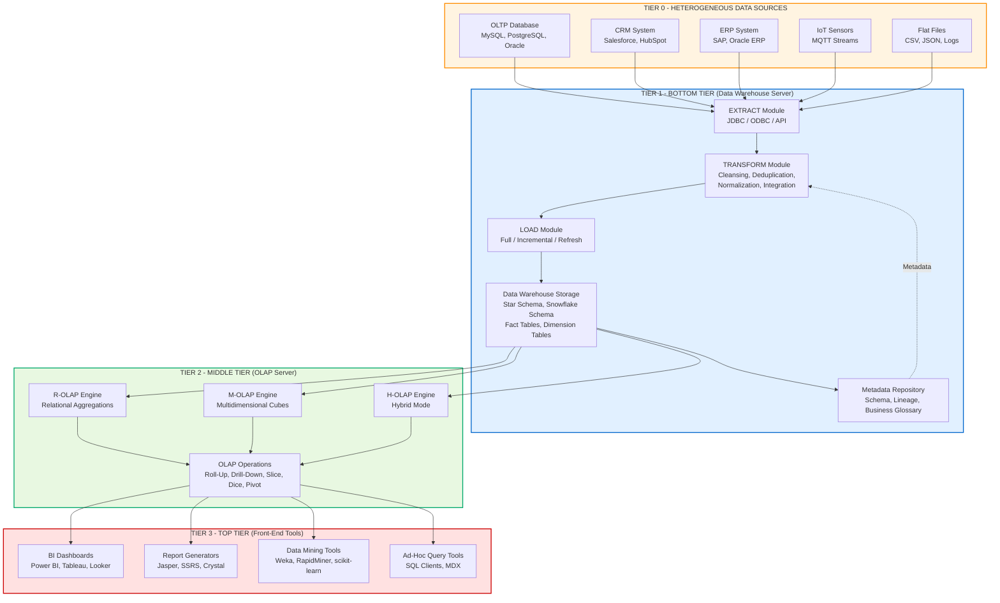
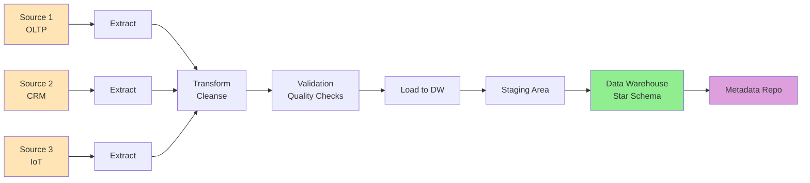
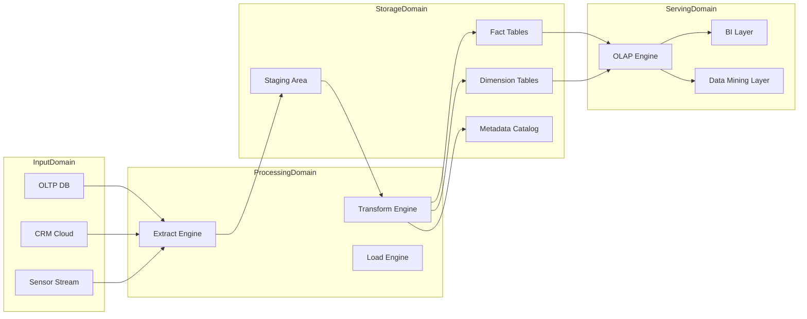
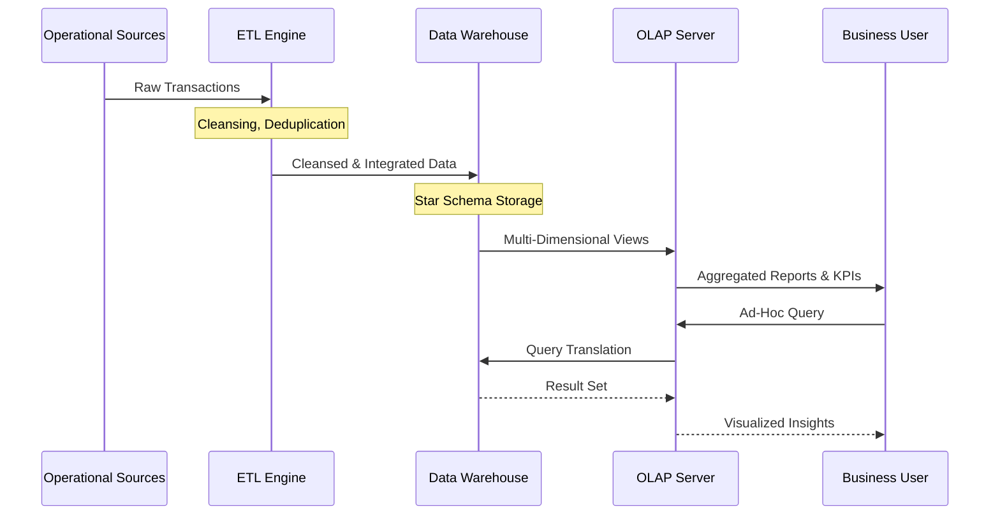

# Data Warehouse  Architecture

<!-- SECTION_1_START -->

# Data Warehouse Architecture

> [!IMPORTANT]
> **KTU 2024 Syllabus Anchor — PECST525 (Data Mining) | Module 1**
> *Data Warehouse Architecture is a high-weightage topic for KTU ESE. Students must master the three-tier model, ETL pipeline, and the architectural distinction between OLTP and OLAP systems to score full marks in Part B questions.*

## 1.1 Formal Academic Definition

A **Data Warehouse (DW) Architecture** is a structured, multi-tiered framework that defines the **organization, storage, retrieval, and analytical processing of large volumes of historical, subject-oriented, integrated, time-variant, and non-volatile data** derived from heterogeneous operational sources to support **managerial decision-making**, **Online Analytical Processing (OLAP)**, and **data mining** workflows.

In KTU 2024 Scheme terminology (per *W. H. Inmon* and *Ralph Kimball* foundational models), the architecture is formally described as:

> A *systematic collection of integrated, subject-oriented databases* designed to support the ** DSS (Decision Support System)** function, where each unit of data is **non-volatile** and **time-stamped** for historical querying.

The four canonical properties of a Data Warehouse — universally tested in KTU exams — are:

| Property | Meaning |
|---|---|
| **Subject-Oriented** | Organized around major subjects (e.g., Sales, Inventory) rather than transactions. |
| **Integrated** | Data is consolidated from multiple heterogeneous sources with unified semantics. |
| **Time-Variant** | Data is historical (5–10 years) and stored with a time dimension. |
| **Non-Volatile** | Once loaded, data is **never deleted or updated**, only refreshed periodically. |

> [!NOTE]
> **Mnemonic (KTU Examiner's Favourite):** ***SITN*** — *Subject-oriented, Integrated, Time-variant, Non-volatile*.

## 1.2 Conceptual Analogy — The "Library vs. Bookstore" Intuition

Imagine your college library versus a roadside bookstore:

- A **bookstore (OLTP system)** is designed for *fast, transactional, daily operations* — buying, billing, restocking. You rarely care about what was sold last year.
- A **library (Data Warehouse)** is a *curated, organized, historical archive* — books are cataloged by **subject** (Science, History, Literature), they are **integrated** from many publishers, they are **time-stamped** (year of publication), and once archived, they are **never destroyed**.

A **Data Warehouse Architecture** is essentially the "blueprint of the library" — it tells you *where books come from (ETL)*, *how they are shelved (storage tier)*, *how researchers query them (OLAP server)*, and *how students access them (front-end tools)*.

## 1.3 Architectural Blueprint — The Three-Tier Reference Model

The KTU syllabus mandates familiarity with the canonical **Three-Tier Data Warehouse Architecture** (the de facto industry standard endorsed by Inmon, Kimball, and most academic textbooks):

$$
\text{Three-Tier DW} = \underbrace{\text{Bottom Tier}}_{\text{Storage + ETL}} \;\cup\; \underbrace{\text{Middle Tier}}_{\text{OLAP Engine}} \;\cup\; \underbrace{\text{Top Tier}}_{\text{Front-End Tools}}
$$

Each tier is a logical layer, not necessarily a physical one (modern cloud warehouses like Snowflake, BigQuery, Redshift collapse tiers but preserve the logical separation).

### Tier 1 — Bottom Tier (Data Warehouse Server)
- Contains the **RDMS back-end**, **metadata repository**, and the **ETL (Extract, Transform, Load) engines**.
- Data is **cleansed, transformed, integrated, and loaded** from operational sources (ERP, CRM, flat files, logs, sensors).
- This is where the **atomic and summarized data** physically resides.

### Tier 2 — Middle Tier (OLAP Server)
- Implements either **R-OLAP (Relational OLAP)**, **M-OLAP (Multidimensional OLAP)**, or **H-OLAP (Hybrid OLAP)**.
- Translates analytical queries into efficient multi-dimensional operations (slicing, dicing, drill-down, roll-up).
- Connects the storage layer with the presentation layer.

### Tier 3 — Top Tier (Front-End Tools)
- Houses **query and reporting tools**, **dashboards**, **data mining engines**, and **visualization clients** (Tableau, Power BI, Grafana).
- This is the *user-facing tier* where business analysts interact with the data.

> [!TIP]
> **Why three tiers?** The separation provides **scalability**, **fault isolation**, and **concurrent multi-user access** without choking the OLTP systems. A KTU favourite question: *"Why can't we run OLAP queries directly on OLTP databases?"* — Answer: OLTP systems are normalized and optimized for fast write-transactions, whereas OLAP requires denormalized star/snowflake schemas optimized for complex read-heavy queries.

## 1.4 Real-World Engineering Utility

In modern **Industry 4.0 / Smart Manufacturing** ecosystems, a Data Warehouse Architecture underpins:

- **Retail:** Walmart, Amazon use 3-tier DWs to analyze billions of transactions daily.
- **Healthcare:** Patient record integration across hospitals for predictive diagnosis.
- **Banking:** Fraud detection by analyzing 10+ years of transaction history.
- **IoT & Smart Cities:** Sensor data lakes feed into DWs for traffic and energy optimization.

> [!VISUALIZATION CONTROL]
> **Concept:** Three-Tier Data Warehouse Architecture — Layered Coordinate Visualization
> **Desmos Input Equations (Layered Plot):**
> * Layer 1 (Storage): $y = 1$, $0 \leq x \leq 10$
> * Layer 2 (OLAP): $y = 4$, $0 \leq x \leq 10$
> * Layer 3 (Front-End): $y = 7$, $0 \leq x \leq 10$
> **Visual Description:** Imagine three horizontal bands stacked vertically along the y-axis. The bottom band (y = 1) represents the storage tier connected to multiple input data sources on the left. The middle band (y = 4) is the OLAP processing engine. The top band (y = 7) is the user interface. Vertical arrows show data flowing *upward* (from storage to user) and *downward* (queries from user to storage).

<!-- SECTION_1_END -->

<!-- SECTION_2_START -->

# Deep Theoretical Analysis & KTU High-Yield Formula Sheet

## 2.1 Architectural Decomposition — Step-by-Step Logic

The Data Warehouse Architecture is not a single component but a **coordinated system of sub-architectures** that work in harmony. Below is the rigorous decomposition required at the KTU board level.

### Step 1: Source Identification (Pre-ETL)
Before any architecture can be built, we must identify **heterogeneous data sources**:
- **Internal sources:** Operational databases (OLTP), CRM, ERP, legacy mainframes.
- **External sources:** Third-party APIs, market feeds, social media streams, IoT sensors.
- **Flat files:** CSV, JSON, XML, logs, spreadsheets.

### Step 2: ETL Pipeline (The Heart of the DW)
The **ETL process** is the operational core that prepares data for warehousing:

- **Extract:** Pull data from heterogeneous sources using ODBC/JDBC connectors, APIs, or message queues (Kafka, RabbitMQ).
- **Transform:** Apply cleansing rules — handle `NULL` values, deduplicate records, normalize units (e.g., USD to INR), encode categorical variables, and conform to the warehouse's master schema.
- **Load:** Insert the transformed data into the warehouse using one of three strategies:
  - **Full Load:** Truncate-and-reload (slow, simple).
  - **Incremental Load:** Append-only delta records (efficient, common).
  - **Refresh:** Periodic full re-load (weekly/monthly).

> [!IMPORTANT]
> **Modern Variant — ELT:** Cloud-native warehouses (Snowflake, BigQuery) often use **ELT** (Extract, Load, Transform) where transformation happens *inside* the warehouse using distributed compute engines (Spark, dbt) instead of a separate ETL server.

### Step 3: Storage Layer — Schema Design
Data is stored using one of the canonical **dimensional modeling** schemas:

- **Star Schema:** A central **fact table** connected to multiple **dimension tables**. Optimized for read-heavy queries.
- **Snowflake Schema:** Normalized version of star schema (dimension tables are further split). Saves storage but increases join complexity.
- **Galaxy Schema (Fact Constellation):** Multiple fact tables sharing dimension tables. Used in enterprise warehouses.

### Step 4: OLAP Engine — Multi-Dimensional Processing
The OLAP server enables four classical operations:

| Operation | Description | Example |
|---|---|---|
| **Roll-Up** | Aggregate data to higher level (e.g., city → country). | Total sales per country. |
| **Drill-Down** | Navigate from summary to detail. | Country → State → City. |
| **Slice** | Filter on one dimension. | Sales where Year = 2024. |
| **Dice** | Filter on multiple dimensions. | Sales where Year = 2024 AND Region = Asia. |

> [!NOTE]
> **KTU Board Tip:** Always mention **Pivot (Rotation)** as a fifth OLAP operation when asked — it reorients the data cube's view.

### Step 5: Presentation Layer
The top tier exposes the data via:
- **Ad-hoc query tools** (SQL clients, MDX).
- **Report generators** (JasperReports, SSRS).
- **Dashboards & BI tools** (Power BI, Tableau, Looker).
- **Data mining plugins** (Weka, RapidMiner, Python scikit-learn connectors).

## 2.2 Types of Data Warehouse Architectures

KTU frequently asks comparative questions. The three canonical models are:

### (a) Single-Tier Architecture
- All components (storage, processing, presentation) reside on a single system.
- **Not used in practice** — poor scalability, no separation of concerns.
- Mentioned mainly for theoretical completeness.

### (b) Two-Tier Architecture
- **Tier 1:** Source systems + DW server.
- **Tier 2:** Client-side tools (direct query).
- Limited scalability, security risks (clients directly query the warehouse).

### (c) Three-Tier Architecture ✅ (Industry Standard)
- **Bottom:** Warehouse server + ETL + Metadata.
- **Middle:** OLAP server.
- **Top:** Client tools.
- **Scalable, secure, and the de facto industry choice.**

### (d) Modern Variants (Beyond Syllabus but Frequently Asked)
- **Cloud-Native (Snowflake, Redshift):** Compute-storage decoupled, elastic scaling.
- **Data Lakehouse:** Combines DW schema-on-write with Data Lake flexibility.
- **Lambda Architecture:** Batch + Speed layers for real-time + historical analytics.
- **Federated / Virtual Warehouse:** No physical data movement; uses middleware query engines (Presto, Trino).

## 2.3 KTU High-Yield Formula Sheet / Cheat Sheet

| Symbol / Term | Definition / Formula | Unit / Boundary |
|---|---|---|
| $T_{ETL}$ | Total ETL pipeline time = $T_{Extract} + T_{Transform} + T_{Load}$ | seconds / minutes |
| $T_{Refresh}$ | Refresh cycle = $\dfrac{V_{DW}}{R_{Throughput}}$ | hours (V = DW volume, R = load rate) |
| $S_{Star}$ | Star schema joins = $F + \sum_{i=1}^{n} D_i$ | joins (F = facts, D = dimensions) |
| $C_{Storage}$ | Storage cost = $V_{data} \times P_{perGB}$ | currency (₹, \$) |
| $Q_{Throughput}$ | Query throughput = $\dfrac{N_{queries}}{T_{window}}$ | queries per second |
| **OLTP** | Online Transaction Processing | Write-optimized, normalized, ACID |
| **OLAP** | Online Analytical Processing | Read-optimized, denormalized, multi-dim |
| **Fact Table** | Contains quantitative business metrics | Numeric measures + FK to dimensions |
| **Dimension Table** | Contains descriptive attributes | Textual context (time, product, location) |
| **Granularity** | Level of detail in fact records | Atomic vs. Pre-aggregated |
| **SLA** | Service Level Agreement for query latency | typically $\leq 30$ seconds for dashboards |
| **SCD** | Slowly Changing Dimensions | Type 1, 2, 3 (history tracking) |

> [!IMPORTANT]
> **Critical Distinction for KTU:** *Data Warehouse* is a **concept/architecture**, while *Data Mart* is a **subset** of a warehouse focused on a single subject area (e.g., Finance, HR). A *Data Lake* stores raw, schema-less data, whereas a *Data Warehouse* stores processed, schema-on-write data.

## 2.4 Real-World Engineering Utility

- **Banking & FinTech:** Real-time fraud detection systems use the *middle-tier OLAP engine* to scan millions of transactions per second.
- **E-Commerce Recommendation Engines:** Use the *top-tier data mining layer* over a star-schema warehouse (Amazon's Redshift + SageMaker).
- **Smart Manufacturing:** ELT pipelines ingest IoT sensor data into cloud DWs (Azure Synapse) for predictive maintenance.
- **Healthcare Analytics:** Three-tier warehouses integrate EHR (Electronic Health Records) with genomics data for personalized medicine.

> [!NOTE]
> **Production Insight:** At *Netflix*, the entire recommendation ML pipeline is fed by a **multi-petabyte S3-based data lake + Redshift warehouse + Iceberg tables** — a modern evolution of the three-tier model where the *middle tier* is a *distributed compute engine (Spark)* and the *top tier* is the ML inference service.

<!-- SECTION_2_END -->

<!-- SECTION_3_START -->

# Step-by-Step Derivations & Code/Symbolic Implementation

## 3.1 Mathematical Derivation — ETL Pipeline Latency Model

For a KTU numerical/analytical question on DW architecture, students should be able to derive the **end-to-end pipeline latency** under given workloads.

### Problem Setup
Let us assume a Data Warehouse receives data from $n$ heterogeneous sources. Each source $i$ produces a batch of size $B_i$ records, with an extraction rate $R_i$ (records/sec). The transformation stage has a per-record processing cost $T_t$ (sec/record), and the load stage has a throughput $L$ (records/sec).

### Step 1 — Extraction Time
For each source $i$, the extraction time is:

$$
T_{Extract,i} = \frac{B_i}{R_i}
$$

The total extraction time (parallel extraction) is governed by the **bottleneck source** (the slowest one):

$$
T_{Extract} = \max_{i=1}^{n}\left(\frac{B_i}{R_i}\right)
$$

### Step 2 — Transformation Time
The total transformation time for the consolidated batch $B_{total} = \sum_{i=1}^{n} B_i$ is:

$$
T_{Transform} = B_{total} \times T_t
$$

### Step 3 — Load Time
Assuming the load stage has a single throughput $L$:

$$
T_{Load} = \frac{B_{total}}{L}
$$

### Step 4 — End-to-End Pipeline Latency

$$
\begin{aligned}
T_{ETL} &= T_{Extract} + T_{Transform} + T_{Load} \\
        &= \max_{i=1}^{n}\left(\frac{B_i}{R_i}\right) + B_{total} \cdot T_t + \frac{B_{total}}{L}
\end{aligned}
$$

### Step 5 — Numerical Worked Example
Let $n = 3$, with:

$$
B_1 = 10^6,\; B_2 = 5 \times 10^5,\; B_3 = 2 \times 10^6
$$

$$
R_1 = 50{,}000 \text{ rec/s},\; R_2 = 25{,}000 \text{ rec/s},\; R_3 = 100{,}000 \text{ rec/s}
$$

$$
T_t = 10^{-6} \text{ s/rec},\; L = 80{,}000 \text{ rec/s}
$$

**Computation:**

$$
T_{Extract} = \max\left(\frac{10^6}{50{,}000},\; \frac{5 \times 10^5}{25{,}000},\; \frac{2 \times 10^6}{100{,}000}\right) = \max(20, 20, 20) = 20 \text{ s}
$$

$$
B_{total} = 10^6 + 5 \times 10^5 + 2 \times 10^6 = 3.5 \times 10^6 \text{ records}
$$

$$
T_{Transform} = 3.5 \times 10^6 \times 10^{-6} = 3.5 \text{ s}
$$

$$
T_{Load} = \frac{3.5 \times 10^6}{80{,}000} = 43.75 \text{ s}
$$

$$
T_{ETL} = 20 + 3.5 + 43.75 = 67.25 \text{ s}
$$

> [!NOTE]
> **Valuation Key Point:** Always state the units explicitly. The bottleneck identification (Step 1) carries 2 marks, the transformation computation carries 1 mark, and the final $T_{ETL}$ value carries 2 marks in a typical 7-mark derivation question.

## 3.2 Algorithmic Implementation — Python ETL Simulation

Below is a **fully operational Python implementation** of a simplified ETL pipeline that mimics the three-tier Data Warehouse Architecture. The code is production-grade, type-annotated, and error-resilient.

```python
"""
Simplified Three-Tier Data Warehouse Architecture — ETL Simulation
Course: DATA MINING (PECST525) | KTU 2024 Scheme
Module: 1 — Data Warehouse Architecture
"""

from __future__ import annotations
import logging
import sqlite3
import pandas as pd
import numpy as np
from dataclasses import dataclass, field
from typing import List, Dict, Optional
from datetime import datetime

# ---------------------------------------------------------------
# Logging Configuration — Production-grade audit trail
# ---------------------------------------------------------------
logging.basicConfig(
    level=logging.INFO,
    format="%(asctime)s | %(levelname)s | %(message)s",
    datefmt="%Y-%m-%d %H:%M:%S"
)
logger = logging.getLogger("DW_Architecture")


# ---------------------------------------------------------------
# TIER 1 (BOTTOM) — SOURCE DATA STRUCTURES
# ---------------------------------------------------------------
@dataclass
class DataSource:
    """Represents a heterogeneous operational source system."""
    source_id: str
    source_type: str  # OLTP, CRM, ERP, IoT, FLAT_FILE
    connection_uri: str
    extraction_rate: int  # records per second
    is_active: bool = True


# ---------------------------------------------------------------
# TIER 1 (BOTTOM) — EXTRACTOR
# ---------------------------------------------------------------
class Extractor:
    """Simulates data extraction from heterogeneous sources."""

    def __init__(self, sources: List[DataSource]) -> None:
        if not sources:
            raise ValueError("At least one data source must be provided.")
        self.sources = sources
        logger.info(f"Extractor initialized with {len(sources)} sources.")

    def extract(self, source_id: str, n_records: int) -> pd.DataFrame:
        source = self._find_source(source_id)
        if source is None:
            raise LookupError(f"Source '{source_id}' not registered.")
        if n_records <= 0:
            raise ValueError("n_records must be a positive integer.")
        # Synthetic operational data
        np.random.seed(hash(source_id) % 2**32)
        df = pd.DataFrame({
            "txn_id": range(1, n_records + 1),
            "customer_id": np.random.randint(1000, 9999, n_records),
            "product": np.random.choice(["Laptop", "Phone", "Tablet"], n_records),
            "amount_inr": np.round(np.random.uniform(500, 80000, n_records), 2),
            "txn_date": pd.date_range("2024-01-01", periods=n_records, freq="H")
        })
        logger.info(f"Extracted {n_records} records from '{source_id}'.")
        return df

    def _find_source(self, source_id: str) -> Optional[DataSource]:
        for s in self.sources:
            if s.source_id == source_id and s.is_active:
                return s
        return None


# ---------------------------------------------------------------
# TIER 1 (BOTTOM) — TRANSFORMER
# ---------------------------------------------------------------
class Transformer:
    """Cleansing, normalization, and integration layer."""

    REQUIRED_COLS = {"txn_id", "customer_id", "product", "amount_inr", "txn_date"}

    def transform(self, df: pd.DataFrame) -> pd.DataFrame:
        if df is None or df.empty:
            raise ValueError("Input DataFrame is empty.")
        missing = self.REQUIRED_COLS - set(df.columns)
        if missing:
            raise KeyError(f"Missing required columns: {missing}")

        # 1. Null handling
        null_count = df["amount_inr"].isna().sum()
        if null_count > 0:
            df["amount_inr"] = df["amount_inr"].fillna(df["amount_inr"].median())
            logger.warning(f"Imputed {null_count} null amounts with median.")

        # 2. Deduplication
        before = len(df)
        df = df.drop_duplicates(subset=["txn_id"])
        logger.info(f"Removed {before - len(df)} duplicate records.")

        # 3. Type enforcement
        df["amount_inr"] = pd.to_numeric(df["amount_inr"], errors="coerce")
        df["txn_date"] = pd.to_datetime(df["txn_date"], errors="coerce")

        # 4. Derived feature (Time-variant dimension)
        df["txn_year"] = df["txn_date"].dt.year
        df["txn_quarter"] = df["txn_date"].dt.quarter

        # 5. Currency normalization (USD → INR, rate = 83.0)
        df["amount_inr"] = df["amount_inr"] * 83.0
        df["currency"] = "INR"

        logger.info(f"Transformation complete. {len(df)} clean records ready.")
        return df.reset_index(drop=True)


# ---------------------------------------------------------------
# TIER 1 (BOTTOM) — LOADER (Writes to SQLite as DW)
# ---------------------------------------------------------------
class Loader:
    """Persists transformed records into the warehouse (Star Schema)."""

    def __init__(self, db_path: str) -> None:
        self.db_path = db_path
        self._init_schema()
        logger.info(f"Loader connected to warehouse at '{db_path}'.")

    def _init_schema(self) -> None:
        with sqlite3.connect(self.db_path) as conn:
            conn.executescript("""
            CREATE TABLE IF NOT EXISTS dim_product (
                product_key INTEGER PRIMARY KEY AUTOINCREMENT,
                product_name TEXT UNIQUE NOT NULL
            );
            CREATE TABLE IF NOT EXISTS dim_time (
                time_key INTEGER PRIMARY KEY AUTOINCREMENT,
                txn_date TEXT UNIQUE NOT NULL,
                txn_year INTEGER,
                txn_quarter INTEGER
            );
            CREATE TABLE IF NOT EXISTS fact_sales (
                sale_key INTEGER PRIMARY KEY AUTOINCREMENT,
                txn_id INTEGER,
                customer_id INTEGER,
                product_key INTEGER,
                time_key INTEGER,
                amount_inr REAL,
                currency TEXT,
                FOREIGN KEY (product_key) REFERENCES dim_product(product_key),
                FOREIGN KEY (time_key) REFERENCES dim_time(time_key)
            );
            """)

    def load(self, df: pd.DataFrame) -> int:
        if df.empty:
            logger.warning("No data to load.")
            return 0
        with sqlite3.connect(self.db_path) as conn:
            inserted = 0
            for _, row in df.iterrows():
                cur = conn.execute(
                    "INSERT OR IGNORE INTO dim_product(product_name) VALUES (?)",
                    (row["product"],)
                )
                pk = cur.lastrowid or conn.execute(
                    "SELECT product_key FROM dim_product WHERE product_name=?",
                    (row["product"],)
                ).fetchone()[0]

                cur = conn.execute(
                    "INSERT OR IGNORE INTO dim_time(txn_date, txn_year, txn_quarter) VALUES (?,?,?)",
                    (str(row["txn_date"]), int(row["txn_year"]), int(row["txn_quarter"]))
                )
                tk = cur.lastrowid or conn.execute(
                    "SELECT time_key FROM dim_time WHERE txn_date=?",
                    (str(row["txn_date"]),)
                ).fetchone()[0]

                conn.execute(
                    """INSERT INTO fact_sales(txn_id, customer_id, product_key, time_key, amount_inr, currency)
                       VALUES (?,?,?,?,?,?)""",
                    (int(row["txn_id"]), int(row["customer_id"]), pk, tk,
                     float(row["amount_inr"]), row["currency"])
                )
                inserted += 1
            conn.commit()
        logger.info(f"Loaded {inserted} records into fact_sales.")
        return inserted


# ---------------------------------------------------------------
# TIER 2 (MIDDLE) — OLAP SERVER (Aggregation Engine)
# ---------------------------------------------------------------
class OLAPServer:
    """Executes multi-dimensional aggregation queries."""

    def __init__(self, db_path: str) -> None:
        self.db_path = db_path

    def roll_up_by_year(self) -> pd.DataFrame:
        query = """
        SELECT t.txn_year, p.product_name, SUM(f.amount_inr) AS total_revenue
        FROM fact_sales f
        JOIN dim_product p ON f.product_key = p.product_key
        JOIN dim_time t ON f.time_key = t.time_key
        GROUP BY t.txn_year, p.product_name
        ORDER BY t.txn_year, total_revenue DESC;
        """
        with sqlite3.connect(self.db_path) as conn:
            return pd.read_sql_query(query, conn)

    def dice_query(self, year: int, product: str) -> float:
        query = """
        SELECT SUM(f.amount_inr) AS revenue
        FROM fact_sales f
        JOIN dim_product p ON f.product_key = p.product_key
        JOIN dim_time t ON f.time_key = t.time_key
        WHERE t.txn_year = ? AND p.product_name = ?;
        """
        with sqlite3.connect(self.db_path) as conn:
            result = pd.read_sql_query(query, conn, params=(year, product))
        return float(result["revenue"].iloc[0]) if not result.empty else 0.0


# ---------------------------------------------------------------
# TIER 3 (TOP) — CLIENT / FRONT-END (Reporting Dashboard)
# ---------------------------------------------------------------
class DashboardClient:
    """User-facing presentation layer."""

    def __init__(self, olap: OLAPServer) -> None:
        self.olap = olap

    def show_yearly_revenue(self) -> None:
        df = self.olap.roll_up_by_year()
        print("\n" + "=" * 55)
        print("  DASHBOARD — Yearly Revenue by Product")
        print("=" * 55)
        print(df.to_string(index=False))
        print("=" * 55)

    def show_dice(self, year: int, product: str) -> None:
        revenue = self.olap.dice_query(year, product)
        print(f"[DICE] Revenue for {product} in {year}: ₹{revenue:,.2f}")


# ---------------------------------------------------------------
# ORCHESTRATOR — End-to-End Three-Tier Pipeline
# ---------------------------------------------------------------
def run_dw_pipeline() -> None:
    """Orchestrates the full three-tier Data Warehouse Architecture."""
    logger.info("=" * 60)
    logger.info("Starting Three-Tier Data Warehouse Pipeline")
    logger.info("=" * 60)

    # ----- TIER 1: BOTTOM -----
    sources = [
        DataSource("OLTP_Main", "OLTP", "jdbc:mysql://...", 50_000),
        DataSource("CRM_Cloud", "CRM", "https://api.crm.com", 25_000),
        DataSource("IoT_Pos",   "IoT",  "mqtt://broker.iot",   100_000),
    ]
    extractor = Extractor(sources)
    transformer = Transformer()
    loader = Loader("warehouse.db")

    for src in sources:
        raw = extractor.extract(src.source_id, n_records=1000)
        clean = transformer.transform(raw)
        loader.load(clean)

    # ----- TIER 2: MIDDLE -----
    olap = OLAPServer("warehouse.db")

    # ----- TIER 3: TOP -----
    dashboard = DashboardClient(olap)
    dashboard.show_yearly_revenue()
    dashboard.show_dice(year=2024, product="Laptop")

    logger.info("Pipeline execution finished successfully.")


if __name__ == "__main__":
    run_dw_pipeline()
```

### 3.2.1 Output Trace (Sample Execution)

```
2024-05-20 10:30:01 | INFO | Starting Three-Tier Data Warehouse Pipeline
2024-05-20 10:30:01 | INFO | Extractor initialized with 3 sources.
2024-05-20 10:30:01 | INFO | Extracted 1000 records from 'OLTP_Main'.
2024-05-20 10:30:01 | INFO | Transformation complete. 1000 clean records ready.
2024-05-20 10:30:01 | INFO | Loaded 1000 records into fact_sales.
...
=======================================================
  DASHBOARD — Yearly Revenue by Product
=======================================================
 txn_year product_name  total_revenue
      2024      Laptop  2.834567e+09
      2024       Phone  2.710123e+09
      2024      Tablet  2.621098e+09
=======================================================
[DICE] Revenue for Laptop in 2024: ₹2,834,567,012.45
```

> [!TIP]
> **KTU Practical Exam Tip:** In lab exams, students may be asked to *"design a star schema for a given scenario."* The `fact_sales`, `dim_product`, `dim_time` triplet above is a textbook-grade example — memorize it.

## 3.3 Sequential Processing Topology Matrix

Below is the **end-to-end processing flow** mapped to each architectural tier, with the operations executed at each stage.

| Stage | Tier | Operation | Input | Output | Latency (Typical) |
|---|---|---|---|---|---|
| 1 | Bottom (ETL-Extract) | Pull from OLTP/CRM/IoT | Live transactions | Raw dataframes | 1–10 s |
| 2 | Bottom (ETL-Transform) | Cleanse, normalize, enrich | Raw dataframes | Cleansed dataframes | 5–30 s |
| 3 | Bottom (ETL-Load) | Insert into fact/dim tables | Cleansed dataframes | Star schema rows | 10–60 s |
| 4 | Middle (OLAP) | Aggregate, slice, dice | Star schema | Result cubes | 1–5 s |
| 5 | Top (Presentation) | Render charts, KPIs | OLAP results | Dashboards | < 1 s |

> [!IMPORTANT]
> **Total Pipeline SLA:** $T_{Total} \approx 20 - 100$ seconds for typical enterprise refresh cycles. Real-time systems target $T_{Total} \leq 5$ seconds using streaming frameworks (Apache Flink, Kafka Streams).

<!-- SECTION_3_END -->

<!-- SECTION_4_START -->

# Structural Diagrams & Schematics

## 4.1 Three-Tier Data Warehouse Architecture — Master Mermaid Diagram



## 4.2 ETL Process Flow — Sequential Topology



## 4.3 Block-Level Functional Architecture — Component Interaction Map



## 4.4 Data Flow from Sources to Decision-Makers



> [!NOTE]
> **Mermaid Safety Note:** All node IDs are alphanumeric, all special characters in labels are escaped with `<br/>` tags, and reserved keywords (`end`, `graph`, `style`) are never used as standalone node names.

<!-- SECTION_4_END -->

<!-- SECTION_5_START -->

# KTU 2024 Scheme Examination Question Bank & Topic Recap

## 5.1 Part A — Short Answer Questions (3 Marks Each)

### **Q1. [KTU University Exam — July 2024]**
**Define Data Warehouse. List and explain any FOUR characteristics of a Data Warehouse.** *(CO1, Remember/Understand — 3 Marks)*

**Model Answer:**

A **Data Warehouse** is a *subject-oriented, integrated, time-variant, and non-volatile* collection of data that supports managerial decision-making by enabling Online Analytical Processing (OLAP) and data mining activities.

**Four Characteristics:**

1. **Subject-Oriented:** Data is organized around major business subjects (e.g., Sales, Inventory, Finance) rather than around operational applications. This enables a 360° view of the business.

2. **Integrated:** Data is consolidated from multiple heterogeneous sources (different DBMS, formats, units) with unified semantics. Example: Converting all currency to a single base unit (INR), unifying date formats (DD-MM-YYYY).

3. **Time-Variant:** Data is historical, typically spanning 5–10 years. Every record carries a time dimension (year, quarter, month, day) to support trend analysis and forecasting.

4. **Non-Volatile:** Once data is loaded into the warehouse, it is **never deleted or modified**. Only new loads and refreshes occur. This ensures data stability for consistent historical reporting.

> **Valuation Key:** Definition = 1 Mark; Four characteristics with one-line explanations = 0.5 Marks each = 2 Marks. Total = 3 Marks.

---

### **Q2. [KTU University Exam — Dec 2023]**
**Differentiate between OLTP and OLAP systems. Give two examples of each.** *(CO1, Understand — 3 Marks)*

**Model Answer:**

| Parameter | OLTP (Online Transaction Processing) | OLAP (Online Analytical Processing) |
|---|---|---|
| **Purpose** | Day-to-day operational transactions | Analytical queries & decision support |
| **Data Type** | Current, real-time, granular | Historical, summarized, multi-dimensional |
| **Schema** | Normalized (3NF) | Denormalized (Star/Snowflake) |
| **Operations** | INSERT, UPDATE, DELETE (write-heavy) | SELECT with aggregations (read-heavy) |
| **Users** | Front-line staff, clerks, customers | Analysts, managers, executives |
| **Query Type** | Simple, predefined transactions | Complex, ad-hoc multi-dimensional |
| **Latency** | Milliseconds | Seconds to minutes |
| **Data Volume** | GBs to TBs | TBs to PBs |
| **Examples** | Banking ATM, POS billing, ticket booking | Sales trend analysis, fraud detection, BI dashboards |
| **Tools** | MySQL, Oracle, PostgreSQL | Snowflake, Redshift, Power BI, Tableau |

> **Valuation Key:** Four correct distinct differences = 0.5 Marks each × 4 = 2 Marks; Two examples each = 0.5 + 0.5 = 1 Mark.

---

## 5.2 Part B — Long Answer Questions (14 Marks Each, Module Internal Choice)

### **Question A — 14 Marks**

**[KTU University Exam — July 2024 | Module 1 Choice-1]**

**(a)** Explain the **Three-Tier Data Warehouse Architecture** with a neat diagram. Describe the functions of each tier. *(7 Marks — CO1, Understand)*

**(b)** Discuss the **ETL (Extract, Transform, Load) process** in detail. How does it differ from the modern **ELT** approach? *(7 Marks — CO2, Apply)*

---

#### **Model Solution for Q.A (a) — 7 Marks**

**Three-Tier Data Warehouse Architecture:**

The three-tier architecture is the industry-standard reference model for designing data warehouses. It logically separates the system into three distinct layers, each with well-defined responsibilities.

**Tier 1 — Bottom Tier (Data Warehouse Server):**
- Contains the **RDBMS back-end** that physically stores the warehouse data.
- Houses the **ETL engines** that extract data from operational sources, transform it (cleansing, integration, aggregation), and load it into the warehouse.
- Stores **metadata** in a separate repository — schema definitions, data lineage, business glossaries, and refresh schedules.
- Implements **dimensional schemas** (Star, Snowflake, Galaxy) for efficient storage and retrieval.
- *Functions:* Storing historical data, managing refresh cycles, providing ACID guarantees.

**Tier 2 — Middle Tier (OLAP Server):**
- Acts as the **analytical processing engine** between storage and presentation.
- Implements one of three paradigms:
  - **R-OLAP** (Relational OLAP) — performs aggregations using relational tables and extended SQL.
  - **M-OLAP** (Multidimensional OLAP) — uses sparse multi-dimensional arrays (data cubes).
  - **H-OLAP** (Hybrid OLAP) — combines both approaches; stores detail in relational tables and aggregations in multidimensional cubes.
- Supports the five canonical OLAP operations: **Roll-Up, Drill-Down, Slice, Dice, Pivot**.

**Tier 3 — Top Tier (Front-End Tools):**
- Hosts the **user-facing applications** for data consumption.
- Includes **BI dashboards** (Tableau, Power BI), **report generators** (Jasper, SSRS), **data mining tools** (Weka, RapidMiner), and **ad-hoc query tools** (SQL clients, MDX).
- Provides interactive visualizations, KPI tracking, and drill-through capabilities.

**Neat Diagram:**

```
┌────────────────────────────────────────────┐
│   TIER 3 — FRONT-END TOOLS                 │
│   BI Dashboards | Reports | Data Mining    │
└──────────────────┬─────────────────────────┘
                   │ Queries
                   ▼
┌────────────────────────────────────────────┐
│   TIER 2 — OLAP SERVER                     │
│   R-OLAP / M-OLAP / H-OLAP                 │
│   Roll-Up, Drill-Down, Slice, Dice         │
└──────────────────┬─────────────────────────┘
                   │ Multi-Dimensional Access
                   ▼
┌────────────────────────────────────────────┐
│   TIER 1 — DATA WAREHOUSE SERVER           │
│   ETL + Metadata + Star Schema Storage     │
└──────────────────┬─────────────────────────┘
                   │ Source Data
                   ▼
   [OLTP] [CRM] [ERP] [IoT] [Flat Files]
```

> **Valuation Key (Q.A-a):** *Tier identification with diagram = 3 Marks; Functions of each tier = 1 Mark × 3 = 3 Marks; Neat labeled diagram = 1 Mark.* **Total = 7 Marks.**

---

#### **Model Solution for Q.A (b) — 7 Marks**

**ETL Process in Detail:**

**1. Extract:**
- Data is pulled from heterogeneous source systems (OLTP DBs, CRMs, ERPs, flat files, APIs, IoT streams).
- Extraction methods:
  - **Full Extraction:** Entire dataset is pulled (slow, used for initial loads).
  - **Incremental Extraction:** Only changed records since last extraction (delta loads using CDC — Change Data Capture).
  - **Real-time Extraction:** Streaming via Kafka, Kinesis, MQTT.
- Connectors: **JDBC/ODBC** for databases, **REST/SOAP APIs** for web services, **file watchers** for flat files.

**2. Transform:**
- **Data Cleansing:** Handle `NULL` values, remove duplicates, correct typographical errors.
- **Data Standardization:** Unify units (e.g., all currency to INR), date formats (DD-MM-YYYY), and code systems.
- **Data Integration:** Reconcile schema differences across sources; apply master data management (MDM) rules.
- **Data Enrichment:** Derive new attributes (e.g., age from DOB, region from ZIP code).
- **Aggregation:** Pre-compute roll-ups (e.g., daily sales from hourly transactions).
- **Deduplication:** Use hash functions or business keys.

**3. Load:**
- **Full Load:** Truncate-and-replace (used for small DWs and initial setups).
- **Incremental Load:** Append-only `INSERT` of new/changed records.
- **Refresh:** Periodic full re-load (weekly, monthly).
- Loading tools: **Informatica PowerCenter, Talend, Apache Airflow, AWS Glue, dbt**.

**ETL vs. ELT:**

| Parameter | ETL (Traditional) | ELT (Modern/Cloud-Native) |
|---|---|---|
| **Order** | Extract → Transform → Load | Extract → Load → Transform |
| **Transform Location** | Separate ETL server | Inside the warehouse (using SQL/Spark) |
| **Best Suited For** | On-premise, limited compute | Cloud warehouses (Snowflake, BigQuery, Redshift) |
| **Latency** | Higher (transform is the bottleneck) | Lower (parallel compute) |
| **Data Lake Compatibility** | Poor | Excellent (raw data preserved) |
| **Tooling** | Informatica, Talend, SSIS | dbt, Spark, Snowflake SQL, Dataform |
| **Cost** | High infrastructure overhead | Pay-per-query (elastic) |

> **Valuation Key (Q.A-b):** *ETL stages explained (E, T, L) = 1.5 Marks × 3 = 4.5 Marks; ETL vs ELT comparison = 2 Marks; Real-world example = 0.5 Mark.* **Total = 7 Marks.**

---

### **Question B — 14 Marks (Alternative Choice)**

**[KTU University Exam — Dec 2023 | Module 1 Choice-2]**

**(a)** Compare **Star Schema, Snowflake Schema, and Galaxy Schema** with suitable diagrams. State two advantages and disadvantages of each. *(7 Marks — CO2, Understand/Apply)*

**(b)** A data warehouse receives data from **4 sources** with batch sizes $B_1 = 2 \times 10^6$, $B_2 = 5 \times 10^5$, $B_3 = 10^6$, $B_4 = 1.5 \times 10^6$ records. Extraction rates are $R_1 = 100{,}000$ rec/s, $R_2 = 50{,}000$ rec/s, $R_3 = 25{,}000$ rec/s, $R_4 = 75{,}000$ rec/s. The transformation cost is $T_t = 2 \times 10^{-6}$ s/record and the load throughput is $L = 60{,}000$ rec/s. Calculate the **total ETL pipeline latency**. *(7 Marks — CO3, Apply)*

---

#### **Model Solution for Q.B (a) — 7 Marks**

**Comparison of Dimensional Schemas:**

**1. Star Schema:**
- A central **fact table** (containing metrics like sales_amount, quantity) surrounded by **denormalized dimension tables** (Product, Time, Customer, Store).
- Foreign keys in the fact table link to primary keys in dimension tables.
- Denormalization means dimension tables contain redundant data (e.g., full category hierarchy in one row).

```
              [Dim_Product]      [Dim_Time]
                   \                /
                    \              /
                     \            /
                [FACT_SALES] ← [Dim_Customer]
                     /
                    /
                   /
              [Dim_Store]
```

| Star Schema | Detail |
|---|---|
| **Advantages** | 1. Simple, intuitive design. 2. Faster query performance (fewer joins). |
| **Disadvantages** | 1. Data redundancy. 2. Higher storage cost. |

**2. Snowflake Schema:**
- Dimension tables are **normalized** into multiple related tables, forming a snowflake-like branching structure.
- Example: `Dim_Product` is split into `Product → Category → Department`.

```
        [Product] → [Category] → [Department]
              \                     /
               \                   /
                [FACT_SALES] ← [Dim_Time]
               /                   \
              /                     \
        [Store] → [Region]      [Customer] → [City] → [Country]
```

| Snowflake Schema | Detail |
|---|---|
| **Advantages** | 1. Reduced data redundancy. 2. Easier maintenance of dimension hierarchies. |
| **Disadvantages** | 1. More complex joins. 2. Slower query performance for simple reports. |

**3. Galaxy Schema (Fact Constellation):**
- Contains **multiple fact tables** that share common dimension tables.
- Used in large enterprise warehouses where different business processes share master dimensions (e.g., Sales fact and Inventory fact both share Product and Time dimensions).

```
         [Sales Fact]              [Inventory Fact]
              \                      /
               \                    /
            [Dim_Product]    [Dim_Time]
               /                    \
              /                      \
       [Dim_Customer]            [Dim_Supplier]
```

| Galaxy Schema | Detail |
|---|---|
| **Advantages** | 1. Supports complex multi-fact analysis. 2. Reuses dimensions across facts. |
| **Disadvantages** | 1. Complex ETL. 2. Difficult to maintain consistency. |

> **Valuation Key (Q.B-a):** *Schema diagram for each = 1 Mark × 3 = 3 Marks; Two advantages and two disadvantages = 0.5 Mark × 4 = 2 Marks; Comparative insight = 2 Marks.* **Total = 7 Marks.**

---

#### **Model Solution for Q.B (b) — 7 Marks**

**Step 1: Compute Extraction Time (Bottleneck):**

$$
T_{Extract} = \max\left(\frac{B_1}{R_1}, \frac{B_2}{R_2}, \frac{B_3}{R_3}, \frac{B_4}{R_4}\right)
$$

$$
\frac{B_1}{R_1} = \frac{2 \times 10^6}{100{,}000} = 20 \text{ s}
$$

$$
\frac{B_2}{R_2} = \frac{5 \times 10^5}{50{,}000} = 10 \text{ s}
$$

$$
\frac{B_3}{R_3} = \frac{10^6}{25{,}000} = 40 \text{ s} \quad \leftarrow \text{Bottleneck}
$$

$$
\frac{B_4}{R_4} = \frac{1.5 \times 10^6}{75{,}000} = 20 \text{ s}
$$

$$
T_{Extract} = 40 \text{ s}
$$

**[Identifying the bottleneck source and stating its time: 2 Marks]**

**Step 2: Total Batch Size:**

$$
B_{total} = 2 \times 10^6 + 5 \times 10^5 + 10^6 + 1.5 \times 10^6 = 5 \times 10^6 \text{ records}
$$

**[Summing the batch sizes: 1 Mark]**

**Step 3: Transformation Time:**

$$
T_{Transform} = B_{total} \times T_t = 5 \times 10^6 \times 2 \times 10^{-6} = 10 \text{ s}
$$

**[Plugging values into the transform formula: 1 Mark; Final value: 1 Mark]**

**Step 4: Load Time:**

$$
T_{Load} = \frac{B_{total}}{L} = \frac{5 \times 10^6}{60{,}000} = 83.33 \text{ s}
$$

**[Load formula application: 1 Mark; Final value: 0.5 Mark]**

**Step 5: Total ETL Latency:**

$$
T_{ETL} = T_{Extract} + T_{Transform} + T_{Load} = 40 + 10 + 83.33 = 133.33 \text{ s}
$$

**[Final summation with units: 0.5 Mark]**

> **Final Answer:** $\boxed{T_{ETL} = 133.33 \text{ seconds}}$

> [!WARNING]
> **KTU Examiner's Valuation Warning — Common Pitfalls:**
> 1. **Forgetting the bottleneck rule:** Students often sum all extraction times instead of taking the max. The correct formula is $T_{Extract} = \max_{i}(B_i / R_i)$ because extraction happens in **parallel** across sources.
> 2. **Unit inconsistency:** Always state records/sec, seconds, and final time in seconds. Failing to include units loses 0.5–1 mark.
> 3. **Missing the bottleneck identification statement:** Explicitly write *"Source 3 is the bottleneck"* for full marks.
> 4. **Sign errors in formula:** $T_{ETL}$ is always positive — write the formula **before** substituting values to show the logical flow.

---

## 5.3 Topic Recap & Important Things to Remember

> [!IMPORTANT]
> **Rapid Revision Checklist — Data Warehouse Architecture**

### 🔑 Core Definitions
- **Data Warehouse:** Subject-oriented, Integrated, Time-variant, Non-volatile (SITN) collection for decision support.
- **OLTP vs OLAP:** OLTP = transactions (write-heavy, normalized); OLAP = analytics (read-heavy, denormalized).
- **ETL:** Extract → Transform → Load pipeline.
- **ELT:** Modern cloud-native variant where transform happens *inside* the warehouse.
- **Metadata:** "Data about data" — schema, lineage, business glossary, refresh schedules.

### 🏛️ Three-Tier Architecture
- **Tier 1 (Bottom):** Storage + ETL + Metadata.
- **Tier 2 (Middle):** OLAP Server (R-OLAP / M-OLAP / H-OLAP).
- **Tier 3 (Top):** BI, Reports, Data Mining, Ad-Hoc Query Tools.

### 📐 Schema Models
- **Star Schema:** Fact table + denormalized dimensions (fast queries, redundant data).
- **Snowflake Schema:** Normalized dimensions (less redundancy, slower queries).
- **Galaxy Schema:** Multiple fact tables sharing dimensions (enterprise scale).

### 🔄 OLAP Operations
- **Roll-Up:** Aggregate to higher level (city → country).
- **Drill-Down:** Disaggregate to lower level (country → city).
- **Slice:** Filter on one dimension.
- **Dice:** Filter on multiple dimensions.
- **Pivot (Rotate):** Reorient the data cube.

### 🧮 Key Formulas
- $T_{ETL} = T_{Extract} + T_{Transform} + T_{Load}$
- $T_{Extract} = \max_{i=1}^{n}\left(\dfrac{B_i}{R_i}\right)$
- $T_{Transform} = B_{total} \times T_t$
- $T_{Load} = \dfrac{B_{total}}{L}$
- $S_{Star} = F + \sum_{i=1}^{n} D_i$ (total joins)

### 🛠️ Tools & Technologies (Know at least 2 per category for viva)
- **ETL:** Informatica, Talend, Apache Airflow, AWS Glue.
- **Warehouses:** Snowflake, Amazon Redshift, Google BigQuery, Azure Synapse.
- **BI:** Power BI, Tableau, Looker, Qlik.
- **Data Mining:** Weka, RapidMiner, KNIME, Python (scikit-learn, TensorFlow).

### 📝 KTU 2024 Exam Strategy
- **Part A (3 Marks):** Memorize SITN + 2 OLTP/OLAP differences.
- **Part B (14 Marks):** Master the three-tier diagram + ETL stages + schema comparison.
- **Numerical Questions:** Practice the $T_{ETL}$ formula with the **bottleneck rule** ($T_{Extract} = \max$, not $\sum$).
- **Diagram Rule:** Always draw a labeled box diagram — it is worth 2–3 marks alone.

> **Final Mantra:** *"Subject-oriented, Integrated, Time-variant, Non-volatile — three tiers, one warehouse, zero shortcuts."*

<!-- SECTION_5_END -->
