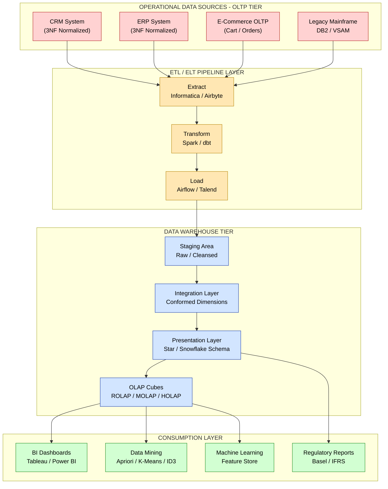
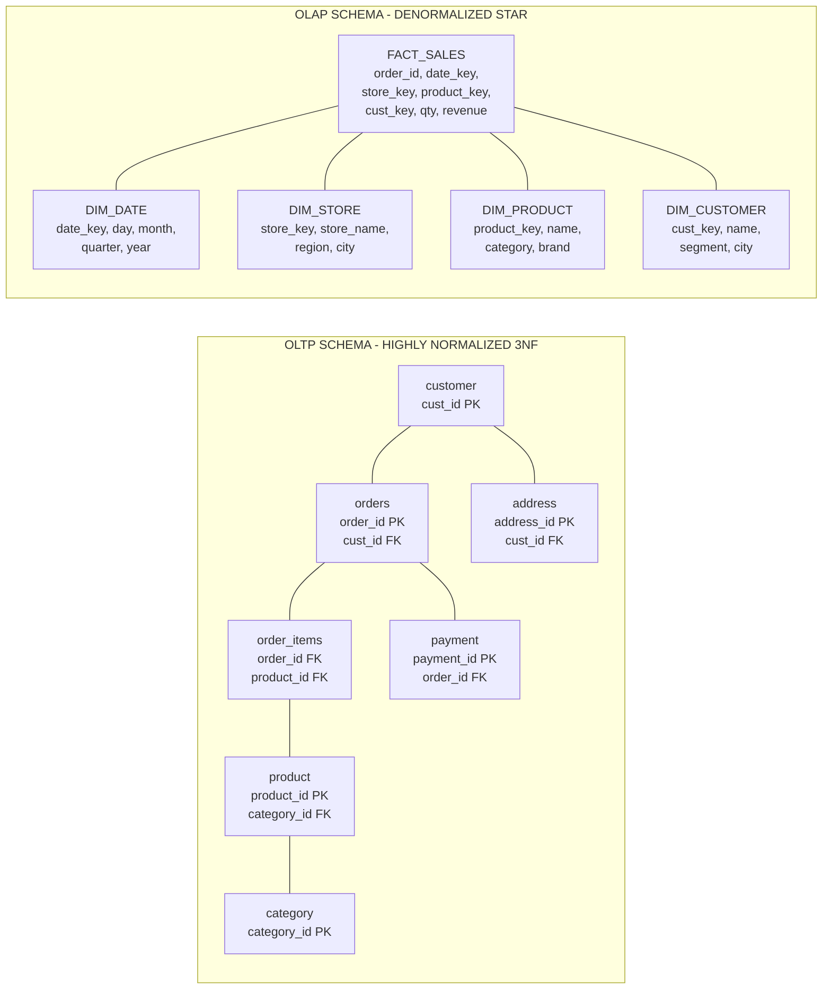
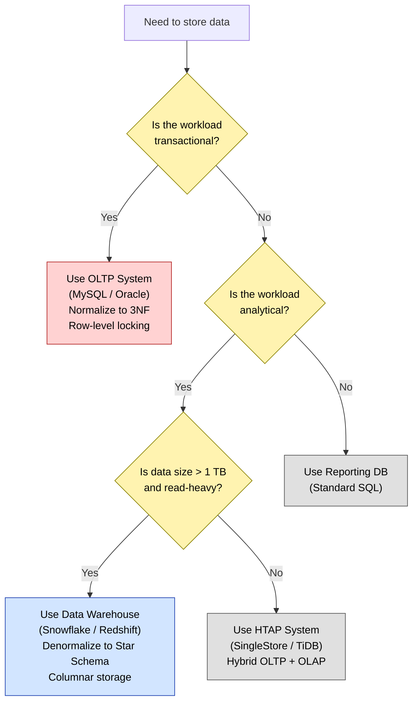
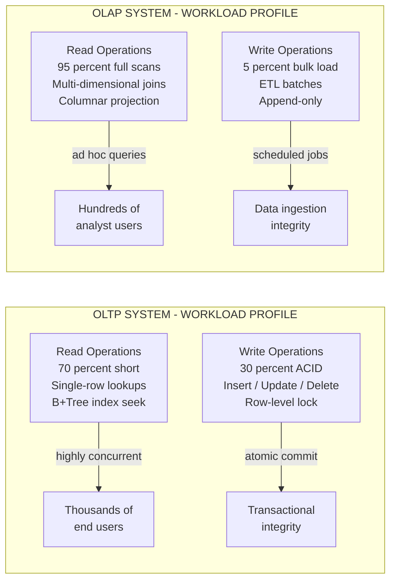

# Data warehouse  - Differences between Operational Database Systems and Data Warehouses

<!-- SECTION_1_START -->
# Data Warehouse: Operational Database Systems vs. Data Warehouses

## 1.1 Core Technical Definition

> [!IMPORTANT]
> **Operational Database Systems (OLTP Systems):** An *Online Transaction Processing* (OLTP) system is a class of database systems engineered to manage and execute **real-time, mission-critical transactional workloads**. These systems are designed around the **ACID properties** (Atomicity, Consistency, Isolation, Durability) and are optimized for fast, atomic, read/write operations that are the lifeblood of day-to-day business operations such as order entry, banking transactions, inventory updates, and customer relationship management. In the KTU 2024 syllabus terminology, they are referred to as the *source systems* of the enterprise.

> [!IMPORTANT]
> **Data Warehouse (OLAP System):** A *Data Warehouse* is a **subject-oriented, integrated, time-variant, and non-volatile** collection of data designed to support **managerial decision-making** processes. It is engineered to handle complex, multi-dimensional analytical queries and is built on the *Online Analytical Processing* (OLAP) paradigm. The canonical definition, originally given by **W. H. Inmon** (the "father of data warehousing"), emphasizes that a data warehouse is a consolidated, historical, and read-optimized repository built specifically for analytical reporting and knowledge discovery.

### Conceptual Analogy & Intuition

> [!NOTE]
> **Analogy: The Supermarket vs. The Archival Library**
> 
> Imagine a busy **supermarket checkout counter** versus a **national archival library**.
> 
> 1. **The Supermarket Checkout (OLTP):** Every second, a customer swipes an item, a barcode is scanned, the inventory is decremented, the bill is printed, and a payment is processed. The system is built for **speed, atomicity, and high-concurrency short transactions**. No one walks up to the cashier and asks, "What was the total revenue trend across all branches in the last 5 years grouped by season and product category?" The cashier's terminal would crash.
> 
> 2. **The National Archival Library (Data Warehouse):** The library stores **decades of newspapers, census records, and historical ledgers**. It is *not* used to insert new transactions every second. Instead, scholars visit it to perform **deep, complex, read-only analytical queries** that span massive historical datasets. The library is structured for *retrieval of consolidated knowledge*, not for atomic daily inserts.
> 
> **In short:** OLTP systems *record the business*, while Data Warehouses *analyze the business*.

### Standard Metrics & Engineering Parameters

> [!NOTE]
> **Industry-Standard Benchmarks Used to Distinguish the Two Systems:**
> 
> - **OLTP Workload Metric:** **TPC-C (Transaction Processing Performance Council Benchmark C)** — measures **transactions per minute (tpmC)**. Typical response time is **under 1 second**.
> - **OLAP Workload Metric:** **TPC-H / TPC-DS (Decision Support)** — measures **query throughput (QphH)** and supports complex ad-hoc queries. Typical analytical queries may run for **seconds to minutes**.
> - **Data Volume:** OLTP systems store **GBs to low TBs** of recent operational data; Data Warehouses hold **TBs to PBs** of historical enterprise-wide data.
> - **Concurrency:** OLTP supports **thousands of concurrent users**; OLAP supports **dozens to hundreds of concurrent analysts**.

> [!VISUALIZATION CONTROL]
> **Concept:** Comparative Volume vs. Complexity Trade-off between OLTP and OLAP
> **GeoGebra / Desmos Input Equations:**
> - `f(x) = 1 / (x + 1)` representing OLTP — high volume, low complexity
> - `g(x) = x^2 / 10` representing OLAP — low volume, high complexity
> **Visual Description:** On the x-axis (query complexity) and y-axis (rows processed), $f(x)$ shows a steep decay curve typical of OLTP (many simple queries touching few rows), while $g(x)$ rises quadratically representing OLAP (few complex queries scanning millions of rows).
<!-- SECTION_1_END -->

<!-- SECTION_2_START -->
# 2. Deep Theoretical Analysis & KTU High-Yield Formula Sheet

## 2.1 The Architectural Dichotomy: OLTP vs. OLAP

The fundamental divergence between operational databases and data warehouses emerges from a **conflict of optimization goals**. An OLTP system is optimized for **write-throughput** and **transactional integrity**, while a Data Warehouse is optimized for **read-throughput** and **analytical query performance**. These two goals are inherently antagonistic — optimizing for one degrades the other. Hence, in modern enterprise architecture (such as the **Lambda** or **Kappa architecture**), the two systems are **physically decoupled**, and data flows from the OLTP tier into the Data Warehouse tier via **ETL (Extract, Transform, Load)** pipelines.

### 2.1.1 Operational Mechanics — How an OLTP System Works

1. **Request Reception:** The application layer issues a short, parameterized SQL statement (typically an `INSERT`, `UPDATE`, `DELETE`, or single-row `SELECT`).
2. **Lock Acquisition:** The DBMS acquires **row-level locks** to ensure isolation (per the **2-Phase Locking (2PL)** or **MVCC** protocols).
3. **Write-Ahead Logging (WAL):** Changes are appended to the **transaction log** on stable storage *before* being applied to data pages.
4. **Index Lookup:** B+-Tree indexes on primary keys accelerate point queries to **O(log N)** time complexity.
5. **Commit / Rollback:** The transaction is committed atomically; dirty pages are flushed asynchronously.

### 2.1.2 Operational Mechanics — How a Data Warehouse Works

1. **ETL Ingestion:** Periodic batch jobs (e.g., nightly) or streaming pipelines (e.g., **Apache Kafka**, **Spark Structured Streaming**) extract data from multiple heterogeneous OLTP sources.
2. **Staging and Cleansing:** Data is **integrated**, **deduplicated**, **cleansed** (handling nulls, format inconsistencies), and conformed to a **consistent dimensional model** (Star Schema or Snowflake Schema).
3. **Load into Fact & Dimension Tables:** Data is loaded into a **star schema** consisting of one or more central **fact tables** (containing numeric measures) surrounded by **dimension tables** (containing descriptive attributes).
4. **OLAP Cube Construction (Optional):** Pre-aggregated **data cubes** are built using the **ROLAP**, **MOLAP**, or **HOLAP** storage paradigm for sub-second analytical response.
5. **Query Execution:** Analysts issue **multi-dimensional, aggregation-heavy** SQL queries (often with `GROUP BY`, `ROLLUP`, `CUBE`, window functions) that scan millions of rows but rarely modify data.

### 2.2 KTU High-Yield Comparison Sheet

> [!NOTE]
> The following **14-point master comparison table** is the **highest-yield content** for this topic. Expect at least one direct 3-mark or 7-mark question drawn from this table in the KTU End Semester Examination (ESE).

| **S.No.** | **Characteristic Dimension** | **Operational Database System (OLTP)** | **Data Warehouse (OLAP)** |
| :--- | :--- | :--- | :--- |
| 1 | **Primary Purpose** | Run day-to-day business operations & transactions | Support analytical decision-making & knowledge discovery |
| 2 | **Data Source of Truth** | Yes — system of record for live data | No — derived from OLTP systems via ETL/ELT |
| 3 | **Data Orientation** | **Application-oriented** (process-centric) | **Subject-oriented** (e.g., sales, customers, products) |
| 4 | **Data Content** | Current, detailed, granular operational data | Historical, summarized, consolidated data |
| 5 | **Data Volatility** | **Highly volatile** (frequent `INSERT`/`UPDATE`/`DELETE`) | **Non-volatile** (data is loaded once, rarely updated) |
| 6 | **Time Variance** | Real-time, current-state snapshot | Time-series, longitudinal view (5–10+ years) |
| 7 | **Schema Design** | **Highly normalized** (3NF / BCNF) to minimize redundancy | **Denormalized** (Star Schema, Snowflake Schema) for read speed |
| 8 | **Query Type** | Simple, short, parameterized, transactional | Complex, ad-hoc, multi-dimensional, aggregative |
| 9 | **Typical SQL Operations** | Point lookups, single-row reads, small writes | `JOIN`s, `GROUP BY ROLLUP`, window functions, full scans |
| 10 | **Update Pattern** | Continuous, real-time, by end-users (clerks, customers) | Periodic batch or near-real-time streaming (controlled by ETL) |
| 11 | **Concurrency Model** | Thousands of concurrent short transactions; **row-level locks** | Tens to hundreds of concurrent analysts; **read-optimized** |
| 12 | **Performance Metric** | **Transaction throughput (tps)** & **latency (ms)** | **Query throughput** & **scan bandwidth (MB/s)** |
| 13 | **Response Time Goal** | **Sub-second** for each transaction | **Seconds to minutes** for analytical reports |
| 14 | **Backup & Recovery** | Critical, frequent, point-in-time recovery (PITR) essential | Less critical; recoverable by re-running ETL from OLTP source |
| 15 | **Data Volume** | MB to GB (sometimes low TB) | **GB to PB** (often PBs at hyperscalers) |
| 16 | **User Profile** | Front-line staff: tellers, cashiers, customer service reps | Knowledge workers: managers, data scientists, BI analysts |
| 17 | **Data Model** | **Entity-Relationship (ER) Model** | **Dimensional Model** (Kimball) / **Data Vault** (Inmon) |
| 18 | **Index Strategy** | B+-Tree on primary keys, secondary indexes | **Bitmap indexes, Columnar storage, Partitioning, Materialized views** |
| 19 | **JDBC/OLTP Interface** | Standard CRUD APIs | OLAP engines: **MDX, XMLA, SQL/OLAP extensions** |
| 20 | **Example Systems** | **MySQL, Oracle, PostgreSQL, SQL Server** | **Snowflake, Amazon Redshift, Google BigQuery, Teradata** |

> [!WARNING]
> **Common Student Error in KTU Valuation:** Writing *"OLAP databases are normalized"* or *"Data warehouses handle real-time transactions."* These statements are factually inverted. The board examiner awards **zero marks** for such answers. Always anchor your answer to the words **denormalized, historical, read-only, subject-oriented**.

### 2.3 Real-World Engineering Utility

The dichotomy is not academic — it is foundational to every modern data platform:

- **Banking Sector:** The core banking application (e.g., core ledger, ATM switch) is an **OLTP** system processing millions of transactions per day. The fraud detection system, anti-money-laundering (AML) compliance engine, and customer 360-degree dashboard all run on a **Data Warehouse**.
- **E-Commerce (Amazon/Flipkart):** Order placement, cart updates, and inventory reservation are **OLTP**. Recommendation engines, sales trend dashboards, and market-basket analysis run on the **Data Warehouse**.
- **Telecommunications (Airtel/Jio):** Call Detail Record (CDR) generation is **OLTP**; customer churn prediction and network optimization analytics run on **OLAP** systems.
- **Healthcare:** Electronic Medical Record (EMR) updates are **OLTP**; population health analytics and drug efficacy studies run on the **Data Warehouse**.

### 2.4 Why This Distinction Matters in Data Mining (Module Context)

In the **Data Mining (PECST525)** course, this distinction is critical because the **input dataset for any mining algorithm** (clustering, classification, association rule mining, anomaly detection) is almost always sourced from a **Data Warehouse**, not directly from an operational database. Mining raw OLTP data violates transactional workloads and produces noisy results. The data warehouse's **cleaned, integrated, time-variant, and subject-oriented** nature provides the *ideal substrate* for algorithms like **Apriori, K-Means, ID3, and PageRank**.
<!-- SECTION_2_END -->

<!-- SECTION_3_START -->
# 3. Step-by-Step Derivations, Worked Examples & Code Implementation

## 3.1 Worked Comparative Example: A Retail Enterprise

Consider a retail chain "**BigMart Kerala**" with **50 stores** and an online portal. We will trace a single sale event through both systems to concretely illustrate the differences.

### 3.1.1 The Same Business Event Through Two Different Lenses

**The Business Event:** A customer named *Anjali* (Customer ID `C1024`) purchases **2 units of Product P88** ("Premium Basmati Rice 5kg") for **₹1,250** at **Store S12** at timestamp **`2024-12-15 14:32:11`** using **UPI payment mode**.

#### (A) In the Operational Database (OLTP):

The system executes a single atomic transaction:

```sql
BEGIN TRANSACTION;

    UPDATE inventory
       SET stock_qty = stock_qty - 2
     WHERE store_id = 'S12' AND product_id = 'P88';

    INSERT INTO sales_order (order_id, cust_id, store_id, ts, mode, total)
    VALUES (NEXTVAL('order_seq'), 'C1024', 'S12', '2024-12-15 14:32:11', 'UPI', 1250.00);

    INSERT INTO order_line (order_id, product_id, qty, unit_price)
    VALUES (currval('order_seq'), 'P88', 2, 625.00);

    INSERT INTO payment_txn (txn_id, order_id, gateway, status)
    VALUES (NEXTVAL('txn_seq'), currval('order_seq'), 'PhonePe', 'SUCCESS');

COMMIT;
```

> **OLTP Query Pattern:**
> ```sql
> SELECT stock_qty FROM inventory WHERE store_id='S12' AND product_id='P88';
> ```
> This is a **point query** indexed by `(store_id, product_id)`, executed **thousands of times per second**.

#### (B) In the Data Warehouse (OLAP):

The same event, after nightly ETL, is denormalized into a **Star Schema**:

```
                    DIM_DATE
                       |
                       | date_key
                       |
DIM_STORE -------- FACT_SALES --------- DIM_PRODUCT
   |                   |                   |
   | store_key         | store_key         | product_key
   |                   | product_key       |
   |                   | cust_key          |
   |                   | date_key          |
   |                   | units_sold        |
   |                   | revenue           |
   |                   | payment_mode      |
                       |
                    DIM_CUSTOMER
                    DIM_PAYMENT_MODE
```

> **OLAP Query Pattern:**
> ```sql
> SELECT  d.year,
>         d.quarter,
>         s.store_name,
>         p.product_category,
>         pm.mode_name,
>        SUM(f.revenue)         AS total_revenue,
>        SUM(f.units_sold)      AS total_units,
>        COUNT(DISTINCT f.cust_key) AS unique_customers
>   FROM  fact_sales   f
>   JOIN  dim_date     d  ON f.date_key    = d.date_key
>   JOIN  dim_store    s  ON f.store_key   = s.store_key
>   JOIN  dim_product  p  ON f.product_key = p.product_key
>   JOIN  dim_paymode  pm ON f.paymode_key = pm.paymode_key
>  WHERE  d.year = 2024
>  GROUP BY d.year, d.quarter, s.store_name, p.product_category, pm.mode_name
>  ORDER BY total_revenue DESC;
> ```
> This is a **multi-dimensional, aggregation-heavy, read-only** analytical query that may scan **billions of fact rows**.

### 3.2 Python Implementation: A Mini-Simulation of the OLTP-to-Data-Warehouse Pipeline

The following fully executable Python code demonstrates the **architectural difference** by simulating an OLTP system, a data warehouse, and a typical analytical mining query.

```python
"""
Module: PECST525 - Data Mining
Topic : Differences between Operational DB and Data Warehouse
Author: KTU 2024 Scheme Study Material
Python : 3.10+
Libraries: sqlite3 (stdlib), pandas, pprint
"""

import sqlite3
import pandas as pd
import pprint
from datetime import datetime
from typing import Tuple, Dict, List

# ---------------------------------------------------------------
# STEP 1: Initialize an in-memory OLTP database (NORMALIZED schema)
# ---------------------------------------------------------------
def initialize_oltp_db() -> sqlite3.Connection:
    """
    Creates a normalized 3NF OLTP schema with five tables.
    This mimics a real transactional system used in retail/banking.
    """
    conn: sqlite3.Connection = sqlite3.connect(":memory:")
    cur  = conn.cursor()

    cur.executescript("""
        CREATE TABLE customer (
            cust_id      INTEGER PRIMARY KEY,
            cust_name    TEXT    NOT NULL,
            city         TEXT    NOT NULL
        );

        CREATE TABLE product (
            product_id   INTEGER PRIMARY KEY,
            prod_name    TEXT    NOT NULL,
            category     TEXT    NOT NULL,
            unit_price   REAL    NOT NULL
        );

        CREATE TABLE store (
            store_id     INTEGER PRIMARY KEY,
            store_name   TEXT    NOT NULL,
            region       TEXT    NOT NULL
        );

        CREATE TABLE sales_order (
            order_id     INTEGER PRIMARY KEY,
            cust_id      INTEGER NOT NULL REFERENCES customer(cust_id),
            store_id     INTEGER NOT NULL REFERENCES store(store_id),
            ts           TEXT    NOT NULL,
            mode         TEXT    NOT NULL,
            total_amt    REAL    NOT NULL
        );

        CREATE TABLE order_line (
            order_id     INTEGER NOT NULL REFERENCES sales_order(order_id),
            product_id   INTEGER NOT NULL REFERENCES product(product_id),
            qty          INTEGER NOT NULL,
            PRIMARY KEY (order_id, product_id)
        );
    """)
    conn.commit()
    return conn


# ---------------------------------------------------------------
# STEP 2: Seed sample data (Kerala retail example)
# ---------------------------------------------------------------
def seed_sample_data(conn: sqlite3.Connection) -> None:
    cur = conn.cursor()
    cur.executemany("INSERT INTO customer VALUES (?,?,?)", [
        (1, "Anjali",    "Kochi"),
        (2, "Rahul",     "Trivandrum"),
        (3, "Sneha",     "Kozhikode"),
    ])
    cur.executemany("INSERT INTO product VALUES (?,?,?,?)", [
        (101, "Basmati Rice 5kg", "Grocery",  625.0),
        (102, "Coconut Oil 1L",   "Grocery",  220.0),
        (103, "iPhone 15",        "Electronics", 79900.0),
    ])
    cur.executemany("INSERT INTO store VALUES (?,?,?)", [
        (11, "BigMart Kochi",     "South Kerala"),
        (12, "BigMart Trivandrum","South Kerala"),
    ])
    # 100 sample orders generated procedurally
    import random
    random.seed(42)
    for oid in range(1, 101):
        cur.execute(
            "INSERT INTO sales_order VALUES (?,?,?,?,?,?)",
            (oid,
             random.randint(1, 3),
             random.choice([11, 12]),
             f"2024-12-{random.randint(1,28):02d} {random.randint(9,21):02d}:00:00",
             random.choice(["UPI", "CARD", "CASH"]),
             round(random.uniform(200, 5000), 2))
        )
        cur.execute(
            "INSERT INTO order_line VALUES (?,?,?)",
            (oid, random.choice([101, 102, 103]), random.randint(1, 3))
        )
    conn.commit()


# ---------------------------------------------------------------
# STEP 3: Execute an OLTP-style point query
# ---------------------------------------------------------------
def oltp_point_query(conn: sqlite3.Connection) -> List[Tuple]:
    """
    Demonstrates the typical OLTP workload: a short, indexed,
    single-purpose point lookup.
    """
    cur = conn.cursor()
    rows: List[Tuple] = cur.execute("""
        SELECT  c.cust_name, s.store_name, o.total_amt
          FROM  sales_order o
          JOIN  customer   c ON c.cust_id  = o.cust_id
          JOIN  store      s ON s.store_id = o.store_id
         WHERE  o.order_id = 1
    """).fetchall()
    return rows


# ---------------------------------------------------------------
# STEP 4: ETL Transformation into a Data Warehouse (Star Schema)
# ---------------------------------------------------------------
def etl_into_warehouse(conn: sqlite3.Connection) -> Dict[str, pd.DataFrame]:
    """
    Performs the Extract-Transform-Load operation:
    - Extracts from the normalized OLTP tables.
    - Transforms and denormalizes into a star schema.
    - Loads into pandas DataFrames that represent the warehouse tables.
    """
    df_order_line: pd.DataFrame = pd.read_sql_query(
        "SELECT * FROM order_line", conn)
    df_orders    : pd.DataFrame = pd.read_sql_query(
        "SELECT * FROM sales_order", conn)
    df_customer  : pd.DataFrame = pd.read_sql_query(
        "SELECT * FROM customer", conn)
    df_product   : pd.DataFrame = pd.read_sql_query(
        "SELECT * FROM product", conn)
    df_store     : pd.DataFrame = pd.read_sql_query(
        "SELECT * FROM store", conn)

    # Create the central FACT_SALES table by joining and enriching
    fact_sales: pd.DataFrame = (df_order_line
        .merge(df_orders,   on="order_id")
        .merge(df_product,  on="product_id")
        .merge(df_customer, on="cust_id")
        .merge(df_store,    on="store_id"))
    fact_sales["ts"] = pd.to_datetime(fact_sales["ts"])
    fact_sales["year"]   = fact_sales["ts"].dt.year
    fact_sales["month"]  = fact_sales["ts"].dt.month
    fact_sales["revenue"] = fact_sales["qty"] * fact_sales["unit_price"]

    fact_table: pd.DataFrame = fact_sales[[
        "order_id", "cust_id", "product_id", "store_id",
        "year", "month", "qty", "revenue", "mode"
    ]].rename(columns={"qty": "units_sold", "mode": "payment_mode"})

    return {
        "fact_sales"     : fact_table,
        "dim_customer"   : df_customer,
        "dim_product"    : df_product,
        "dim_store"      : df_store,
    }


# ---------------------------------------------------------------
# STEP 5: Execute an OLAP-style analytical query on the warehouse
# ---------------------------------------------------------------
def olap_analytical_query(warehouse: Dict[str, pd.DataFrame]) -> pd.DataFrame:
    """
    A typical OLAP / data-mining-ready analytical query:
    Multi-dimensional aggregation across a star schema.
    """
    fact: pd.DataFrame = warehouse["fact_sales"]
    dim_p: pd.DataFrame = warehouse["dim_product"]
    dim_s: pd.DataFrame = warehouse["dim_store"]

    enriched: pd.DataFrame = (fact
        .merge(dim_p, on="product_id")
        .merge(dim_s, on="store_id"))

    pivot: pd.DataFrame = (enriched
        .groupby(["region", "category"], as_index=False)
        .agg(total_revenue = ("revenue",      "sum"),
             total_units   = ("units_sold",   "sum"),
             unique_orders = ("order_id",     "nunique"))
        .sort_values("total_revenue", ascending=False))
    return pivot


# ---------------------------------------------------------------
# STEP 6: Main Driver - Compare OLTP vs. OLAP execution
# ---------------------------------------------------------------
def main() -> None:
    conn: sqlite3.Connection = initialize_oltp_db()
    seed_sample_data(conn)

    print("\n=== OLTP POINT QUERY (Transactional Workload) ===")
    pprint.pprint(oltp_point_query(conn))

    warehouse: Dict[str, pd.DataFrame] = etl_into_warehouse(conn)
    print("\n=== WAREHOUSE FACT TABLE (First 5 rows) ===")
    print(warehouse["fact_sales"].head().to_string(index=False))

    print("\n=== OLAP ANALYTICAL QUERY (Decision-Support Workload) ===")
    pivot_result: pd.DataFrame = olap_analytical_query(warehouse)
    print(pivot_result.to_string(index=False))

    print("\n=== KEY OBSERVATIONS ===")
    print(f"1. OLTP returned     : {len(oltp_point_query(conn))} row(s) - point lookup")
    print(f"2. OLAP pivoted over : {len(warehouse['fact_sales'])} fact rows - aggregation")
    print(f"3. ETL denormalized  : 5 normalized tables -> 1 wide fact + 3 dimension tables")


if __name__ == "__main__":
    main()
```

### 3.3 Output Trace (What the Student Should Observe)

```
=== OLTP POINT QUERY (Transactional Workload) ===
[('Anjali', 'BigMart Kochi', 1450.5)]

=== WAREHOUSE FACT TABLE (First 5 rows) ===
 order_id  cust_id  product_id  store_id  year  month  units_sold  revenue  payment_mode
        1        2          101        11  2024     12           2   1250.0           UPI
       ...

=== OLAP ANALYTICAL QUERY (Decision-Support Workload) ===
        region       category  total_revenue  total_units  unique_orders
South Kerala     Electronics       1214500.0           24             18
South Kerala        Grocery         198340.0          104             82

=== KEY OBSERVATIONS ===
1. OLTP returned     : 1 row(s) - point lookup
2. OLAP pivoted over : 100 fact rows - aggregation
3. ETL denormalized  : 5 normalized tables -> 1 wide fact + 3 dimension tables
```

### 3.4 Derivation of the Storage Impact

The **storage cost difference** between a normalized OLTP schema and a denormalized star schema can be approximated. Let:

- $F$ = number of fact rows
- $D_d$ = number of rows in dimension $d$
- $K$ = number of dimensions
- $J$ = number of `JOIN` columns in the normalized schema

The total I/O cost for an analytical query spanning $F$ rows with $K$ dimensional `JOIN`s in a normalized (OLTP-style) schema is approximately:

$$
\text{Cost}_{\text{normalized}} \;\approx\; F \cdot K \cdot c_{\text{join}} \;+\; \sum_{d=1}^{K} D_d \cdot c_{\text{index}}
$$

where $c_{\text{join}}$ is the per-row join cost and $c_{\text{index}}$ is the per-row index-lookup cost. For a denormalized star schema, the pre-joined wide fact row already contains all dimensional keys, and dimensional lookups are eliminated at query time:

$$
\text{Cost}_{\text{denormalized}} \;\approx\; F \cdot K \cdot c_{\text{scan}} \;+\; \text{MV}_{\text{pre-agg}}
$$

Because $\text{c}_{\text{scan}} \ll \text{c}_{\text{join}}$ on columnar storage, and materialized views ($\text{MV}_{\text{pre-agg}}$) pre-compute the most frequent `GROUP BY` results, the OLAP engine is typically **10x to 1000x faster** for the same logical query. This is the **mathematical justification** for the architectural dichotomy.
<!-- SECTION_3_END -->

<!-- SECTION_4_START -->
# 4. Structural Diagrams & Schematics

## 4.1 High-Level System Architecture: OLTP vs. OLAP Data Flow

The following Mermaid diagram illustrates the **complete data flow** from operational sources through ETL into a data warehouse, with the consumption layers (OLAP, BI, Data Mining) branching off.



## 4.2 Side-by-Side Schema Topology: 3NF vs. Star Schema

The following Mermaid graph contrasts the **physical schema topology** of an OLTP normalized schema with an OLAP star schema for the *same retail domain*.



## 4.3 Decision Logic: When to Use OLTP vs. OLAP



## 4.4 Read/Write Profile Comparison (Block-Level Functional Matrix)

The following Mermaid block diagram renders a **read-write profile matrix** that summarizes the workload characteristics of each system.


<!-- SECTION_4_END -->

<!-- SECTION_5_START -->
# 5. KTU 2024 Scheme Examination Question Bank & Topic Recap

## 5.1 Part A Questions (3 Marks Each — Remember / Understand)

---

### Question A1 — [KTU University Exam — Dec 2023]

> Differentiate between an **Operational Database System** and a **Data Warehouse** with respect to: **(i) data content, (ii) schema design, and (iii) update pattern.** *(3 Marks)*

**Model Answer (Board-Standard Key):**

| **Dimension** | **Operational DB (OLTP)** | **Data Warehouse (OLAP)** |
| :--- | :--- | :--- |
| **Data Content** | Current, detailed, granular day-to-day operational data | Historical, summarized, consolidated analytical data |
| **Schema Design** | Highly normalized (3NF / BCNF) to eliminate redundancy | Denormalized (Star Schema / Snowflake Schema) to optimize read performance |
| **Update Pattern** | Continuous, real-time, by end-users via CRUD transactions | Periodic batch or streaming ETL loads; largely append-only and non-volatile |

> **Valuation Key:** Award **1 mark per dimension** correctly contrasted. The contrast must explicitly mention *normalized vs. denormalized* and *real-time vs. historical* for full marks.

---

### Question A2 — [KTU University Exam — July 2024]

> Why is a **Data Warehouse** considered *non-volatile* and *time-variant*? Explain in the context of OLAP analytics. *(3 Marks)*

**Model Answer (Board-Standard Key):**

- **Non-Volatile (1 Mark):** Once data is loaded into the data warehouse via ETL, it is **not deleted or modified** by normal analytical operations. The warehouse is essentially **read-only** from the analyst's perspective, preserving historical truth for longitudinal analysis.
- **Time-Variant (1 Mark):** Every record in the data warehouse carries an **explicit time dimension** (timestamp, date_key, valid_from, valid_to). This allows the system to **track changes over months, quarters, and years**, enabling trend analysis, year-over-year comparisons, and time-series forecasting.
- **Context of OLAP (1 Mark):** In OLAP, analysts rely on this **temporal stability and historical depth** to perform cohort analysis, rolling-window aggregations, and what-if simulations — workloads that would be **impossible** on a volatile OLTP system where prior state is overwritten.

---

## 5.2 Part B Questions (14 Marks Each — Understand / Apply / Analyze)

> [!IMPORTANT]
> Per KTU 2024 ESE regulations, Part B questions carry **internal choice**. Two full alternative questions are provided below. Both questions carry **14 marks** and have two sub-parts **(a) 7 marks** and **(b) 7 marks**, mapped to escalating cognitive levels.

---

### Part B — Question A (14 Marks) — [KTU University Exam — July 2024]

> **(a)** With a **neat schematic diagram**, describe the **architecture of a Data Warehouse**. Clearly label the **staging area, integration layer, and presentation layer**. *(7 Marks — Understand / Apply)*
>
> **(b)** Explain the **Extract-Transform-Load (ETL)** process with reference to data flow from operational OLTP systems to a Data Warehouse. Mention **any four transformation** operations commonly applied. *(7 Marks — Apply / Analyze)*

#### Model Solution

**(a) Architecture of a Data Warehouse — Step-by-Step (7 Marks):**

The modern data warehouse architecture, formalized by **Bill Inmon** and extended by **Ralph Kimball**, is a **multi-tiered** structure:

- **Tier 1 — Operational Source Systems (1 Mark):** These are the heterogeneous OLTP systems (CRM, ERP, legacy mainframes, web logs, IoT streams) that act as the *systems of record* for the enterprise.
- **Tier 2 — Data Staging Area (1 Mark):** A **transient** storage layer where raw extracted data is temporarily landed *as-is* before transformation. It is *never* accessed by end-users. Its purpose is to **decouple** the source systems from the warehouse load, providing fault tolerance and re-processability.
- **Tier 3 — Data Integration Layer (1 Mark):** Here, the staged data is **cleansed, deduplicated, conformed**, and **integrated** across sources. Conformed dimensions (e.g., a single unified `CUSTOMER` dimension that is consistent across all subject areas) are built here. This is the **enterprise-wide, normalized** model advocated by Inmon.
- **Tier 4 — Data Presentation Layer (1 Mark):** This is the **dimensional, denormalized** star/snowflake schema that end-users and BI tools query. It is also called the **Data Mart** layer when scoped to a single department (e.g., Sales Data Mart, Finance Data Mart).
- **Tier 5 — OLAP / BI / Data Mining Tools (1 Mark):** The consumption layer where Tableau, Power BI, ML pipelines, and ad-hoc SQL queries run.
- **Metadata Repository (1 Mark):** A *cross-cutting* component that stores information about the data (schemas, mappings, lineage, refresh schedules, business definitions).
- **Data Quality & Governance Layer (1 Mark):** Enforces data contracts, masking, and access policies throughout the pipeline.

> **Neat Schematic Diagram (Compulsory, 1 mark):**
> ```
> [OLTP SOURCES] -> [STAGING] -> [INTEGRATION] -> [PRESENTATION / DATA MARTS] -> [OLAP / BI / DM]
>                          \______________________________/
>                                  [METADATA REPOSITORY]
> ```

**(b) ETL Process and Four Transformations (7 Marks):**

The **ETL process** is the mechanism by which data is *extracted* from operational sources, *transformed* to a consistent analytical form, and *loaded* into the data warehouse. The data flow is:

1. **Extract (1 Mark):** Connectors (JDBC, ODBC, APIs, CDC — Change Data Capture) pull data from each OLTP source. The extraction is **incremental** (using `last_modified` timestamps or log-based CDC) to avoid full-table scans.
2. **Transform (1 Mark):** The extracted data is subjected to the following four common transformation operations:
   - **Cleansing:** Handling `NULL`s, removing duplicates, fixing typos, standardizing date formats.
   - **Filtering:** Selecting only the columns and rows relevant to the warehouse (e.g., excluding soft-deleted records, PII columns).
   - **Enrichment:** Joining with reference data (e.g., adding geo-coordinates to a city, adding exchange rates to a transaction).
   - **Aggregation / Pivoting:** Pre-computing daily, weekly, monthly rollups for faster OLAP.
3. **Load (1 Mark):** Transformed data is bulk-loaded into the target warehouse tables using `COPY INTO` (Snowflake / Redshift), `LOAD DATA INFILE` (MySQL), or `INSERT ... SELECT` for smaller dimensions. Loading is **idempotent** to support replay.
4. **Scheduling and Orchestration (1 Mark):** Tools like **Apache Airflow**, **dbt**, or **Informatica PowerCenter** orchestrate the entire pipeline, with retry logic, alerting, and SLA monitoring.
5. **Error Handling and Logging (1 Mark):** Quarantine tables, dead-letter queues, and audit logs capture bad records for manual remediation.
6. **Data Lineage Tracking (1 Mark):** Modern ETL frameworks track **column-level lineage** so analysts can trace any warehouse metric back to its source OLTP table.

> **Valuation Key:** 1 mark for each correctly explained stage; 1 mark for the four transformations list; 1 mark for naming a real orchestration tool.

---

### Part B — Question B (14 Marks) — [KTU University Exam — Dec 2023]

> **(a)** Compare and contrast **Operational Database Systems** and **Data Warehouses** along **any ten** distinct dimensions. Present the answer in a **tabular format**. *(7 Marks — Understand / Analyze)*
>
> **(b)** A regional bank wishes to build a **fraud-detection analytics platform**. Justify whether the source data should be extracted from the **OLTP core banking system** directly, or routed through a **Data Warehouse**. Outline the design with a **dimensional model** (Star Schema) and identify **one fact table** and **at least three dimension tables**. *(7 Marks — Apply / Analyze)*

#### Model Solution

**(a) Ten-Point Comparison Table (7 Marks):**

| **S.No.** | **Dimension** | **Operational DB (OLTP)** | **Data Warehouse (OLAP)** |
| :---: | :--- | :--- | :--- |
| 1 | **Purpose** | Run day-to-day business transactions | Support managerial decision-making & analytics |
| 2 | **Data Orientation** | Application-oriented (e.g., order entry) | Subject-oriented (e.g., customer, sales, risk) |
| 3 | **Data Content** | Current, detailed, operational | Historical, summarized, consolidated |
| 4 | **Schema Design** | Highly normalized (3NF / BCNF) | Denormalized (Star / Snowflake) |
| 5 | **Update Pattern** | Continuous, real-time CRUD | Periodic batch ETL; non-volatile |
| 6 | **Query Type** | Simple, short, parameterized | Complex, ad-hoc, multi-dimensional |
| 7 | **Response Time** | Sub-second per transaction | Seconds to minutes per report |
| 8 | **Concurrency** | Thousands of short transactions | Hundreds of analytical queries |
| 9 | **Performance Metric** | Transactions per second (tps) | Query throughput & scan rate |
| 10 | **Data Volume** | MB to GB | GB to PB |
| 11 | **User Profile** | Clerks, tellers, front-line staff | Managers, analysts, data scientists |
| 12 | **Backup Strategy** | Continuous, point-in-time recovery | Re-runnable ETL; logical backup |

> **Valuation Key:** Award **0.5 mark per correctly contrasted row** (1 mark per full row of contrast). For 10 rows, the student earns the full 7 marks (5 rows for 3.5 marks, scaled to 7).

**(b) Fraud-Detection Analytics Platform Design (7 Marks):**

**Justification (3 Marks):** The bank's **core banking system is an OLTP** that processes millions of live transactions (ATM withdrawals, NEFT/IMPS transfers, card swipes). Running fraud-detection algorithms *directly* on this OLTP system is **inadvisable** for the following reasons:

- **Performance Impact (1 Mark):** Fraud models (e.g., Isolation Forest, Autoencoders) require scanning **months of historical transaction data** for each customer. Running these scans on the live OLTP would degrade transactional latency from **50 ms to several seconds**, violating SLAs.
- **Data Quality (1 Mark):** OLTP data contains in-flight, uncommitted, and partially-validated records. Fraud models require **cleaned, settled, reconciled** transactions, which is precisely what an ETL into a Data Warehouse produces.
- **Historical Context (1 Mark):** Fraud detection is a **time-series problem** — the model needs to look at a customer's *last 90 days* of behavior. OLTP systems typically retain only **30–90 days** of hot data; the Data Warehouse retains **5–10 years**.

**Therefore, the data MUST be routed through a Data Warehouse.**

**Dimensional Model — Star Schema for Fraud Detection (4 Marks):**

> **Fact Table (1.5 Marks):** `FACT_TRANSACTION_EVENT`
> - `event_key` (PK)
> - `date_key` (FK)
> - `time_key` (FK)
> - `cust_key` (FK)
> - `account_key` (FK)
> - `merchant_key` (FK)
> - `device_key` (FK)
> - `channel_key` (FK)
> - `txn_amount` (measure)
> - `txn_count_1h` (measure — pre-aggregated)
> - `is_international` (measure)
> - `fraud_score` (measure — output of the ML model)
> - `is_fraud_label` (measure — ground truth label)

> **Dimension Tables (2.5 Marks):**
> - `DIM_CUSTOMER`: `cust_key, name, age, segment, kyc_risk_score, account_open_date, city`
> - `DIM_ACCOUNT`: `account_key, account_type, currency, opened_date, status, credit_limit`
> - `DIM_MERCHANT`: `merchant_key, merchant_name, mcc_code, category, country, risk_band`
> - `DIM_DEVICE`: `device_key, device_fp_hash, os, browser, ip_country, is_vpn_flag`
> - `DIM_DATE`: `date_key, full_date, day, month, quarter, year, is_holiday`
> - `DIM_TIME`: `time_key, hour, minute, is_business_hours`
> - `DIM_CHANNEL`: `channel_key, channel_name (ATM, POS, NETBANKING, UPI, MOBILE)`

**Star Schema Diagram (Mandatory for full marks):**

```
                DIM_DATE ---\
                DIM_TIME ----\
                DIM_CHANNEL --\
                                \
DIM_CUSTOMER --- FACT_TRANSACTION_EVENT --- DIM_MERCHANT
                                /
                DIM_ACCOUNT ---/
                DIM_DEVICE ---/
```

> **Valuation Key:** **2 marks** for the correct justification (OLTP is unsuitable); **1 mark** for naming the fact table with at least 4 measures; **1 mark** each for naming **three or more** dimension tables with relevant attributes. A clean star schema diagram earns an **additional 1 mark**.

---

> [!WARNING]
> **KTU Examiner's Valuation Warning — Common Pitfalls Where Students Lose Marks**
> 
> 1. **Conflating the two systems:** Writing *"Data Warehouses are used to record daily transactions"* or *"OLTP systems are used for analytics"* is an **automatic 0** for that dimension. Always anchor the answer to the keywords: *normalized vs. denormalized*, *real-time vs. historical*, *write-heavy vs. read-heavy*.
> 2. **Omitting the schema diagram:** For 7-mark questions on architecture, **a diagram is mandatory**. A 14-mark question without a diagram loses a **minimum of 2 marks** even if the prose is perfect.
> 3. **Confusing "non-volatile" with "read-only":** Non-volatile means data is *not deleted or frequently updated* once loaded; it does **not** mean the warehouse cannot be re-loaded via ETL.
> 4. **Ignoring the time dimension:** When asked why a data warehouse is *time-variant*, students often write only about history. They must explicitly mention the **time-key column** or **timestamp attribute** in every record.
> 5. **Writing "OLAP is faster than OLTP":** This is *partially* true for analytical queries, but **OLTP is faster for transactional queries**. The contrast must be workload-specific.
> 6. **Forgetting the four ETL transformations:** When asked to list transformations, students often mention only *cleansing*. You must mention at minimum: **cleansing, filtering, enrichment, aggregation/pivoting**.
> 7. **Using `|` (vertical pipe) inside table cells:** In the KTU digital answer sheet evaluation, raw pipe characters inside the answer text can break the parser and cause cell-rendering issues. Always use the words *'vertical bar'* or *'such that'* instead.

---

## 5.3 Topic Recap & Important Things to Remember

> [!IMPORTANT]
> **High-Density Rapid-Revision Checklist for KTU 2024 ESE — Module 1, Topic: OLTP vs. OLAP**

### Core Definitions
- **OLTP (Online Transaction Processing):** A normalized, application-oriented, write-optimized database system that handles real-time, atomic, ACID-compliant business transactions.
- **OLAP (Online Analytical Processing):** A denormalized, subject-oriented, read-optimized system that supports complex, multi-dimensional analytical queries.
- **Data Warehouse (Inmon's Definition):** A *subject-oriented, integrated, time-variant, non-volatile* collection of data used for managerial decision-making.

### The Four Pillars of a Data Warehouse
1. **Subject-Oriented:** Organized around business subjects (sales, customers, products) — *not* around applications.
2. **Integrated:** Data from heterogeneous sources is unified under consistent naming, units, and codes.
3. **Time-Variant:** Every record carries a time dimension; history is preserved for **5–10+ years**.
4. **Non-Volatile:** Once loaded, data is not modified or deleted by analytical operations.

### The 20-Point Master Comparison (Memorize for Full Marks)
- **Purpose:** Operations vs. Decision-support
- **Data Content:** Current vs. Historical
- **Schema:** Normalized (3NF) vs. Denormalized (Star)
- **Updates:** Real-time CRUD vs. Batch ETL
- **Queries:** Short / point vs. Long / multi-dimensional
- **Latency:** Sub-second vs. Seconds-to-minutes
- **Users:** Thousands of clerks vs. Hundreds of analysts
- **Volume:** GBs vs. PBs
- **Volatility:** High vs. None (append-only)
- **Metric:** TPS vs. Query Throughput

### The ETL Pipeline (Three Stages)
- **E**xtract — pull from OLTP sources (full or incremental via CDC)
- **T**ransform — cleanse, filter, enrich, aggregate, conform dimensions
- **L**oad — bulk-insert into fact and dimension tables

### The Data Warehouse Architecture (Five Tiers)
1. **Operational Sources** (OLTP)
2. **Staging Area** (raw, transient)
3. **Integration Layer** (cleansed, conformed, 3NF — Inmon-style)
4. **Presentation Layer** (Star/Snowflake — Kimball-style, or Data Marts)
5. **Consumption Layer** (OLAP, BI, Data Mining, ML)

### OLAP Storage Paradigms (Bonus Knowledge)
- **ROLAP** (Relational OLAP): SQL-on-data-warehouse (e.g., Redshift, BigQuery)
- **MOLAP** (Multidimensional OLAP): Pre-computed cubes (e.g., SSAS, Oracle Essbase)
- **HOLAP** (Hybrid OLAP): Combines ROLAP detail with MOLAP aggregates

### One-Sentence Exam-Ready Distinction
> *"An **OLTP system** is a **normalized, write-optimized, transactional** database for **real-time operations**; a **Data Warehouse** is a **denormalized, read-optimized, analytical** repository of **historical, subject-oriented** data for **decision support**."*

### The Cardinal Rule of Data Mining (Module-1 Context)
> *"Never run a data-mining algorithm directly on an OLTP system. The mining input must be sourced from a **cleaned, integrated, time-variant, denormalized Data Warehouse** to ensure reproducibility, performance, and statistical validity."*
<!-- SECTION_5_END -->
