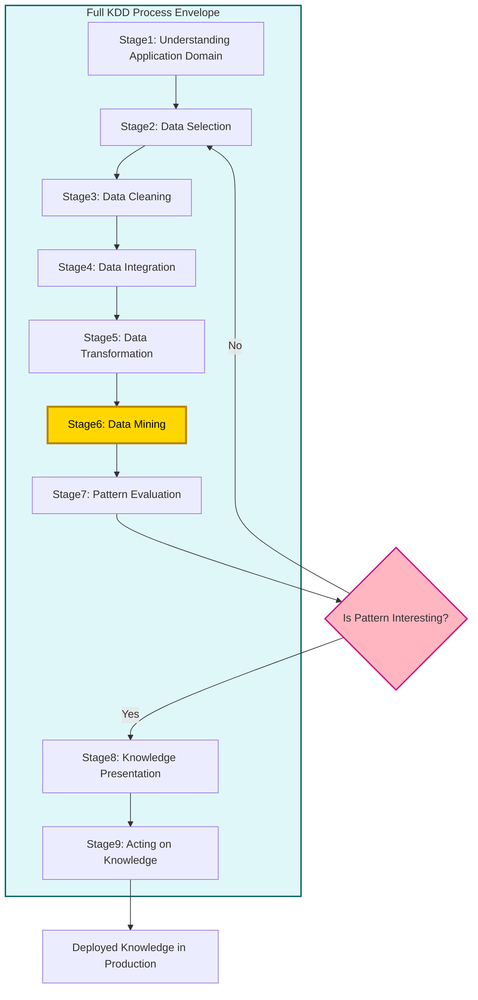
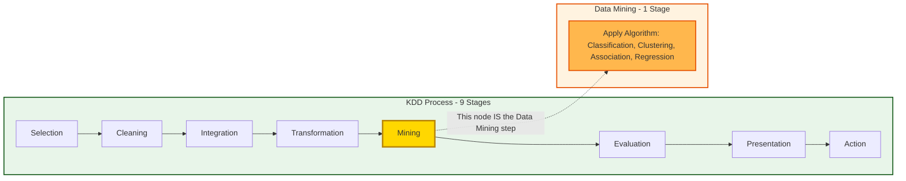

# Knowledge Discovery in Database Vs Data mining

<!-- SECTION_1_START -->

# 1. Knowledge Discovery in Databases (KDD) vs Data Mining

> [!IMPORTANT]
> **KTU 2024 Scheme Highlight:** This topic is a **2-marks / short conceptual question** favorite in Part A of Module 1. Students are expected to (a) define KDD, (b) define Data Mining, and (c) clearly differentiate the two with at least 4–5 valid technical points.

## 1.1 Formal Definition of KDD (Knowledge Discovery in Databases)

**KDD** is formally defined by **Usama Fayyad, Gregory Piatetsky-Shapiro, and Padhraic Smyth (1996)** — the seminal paper considered the foundation of the field:

> *"KDD is the non-trivial process of identifying valid, novel, potentially useful, and ultimately understandable patterns in data."*

In KTU 2024 Scheme terminology, **KDD is the end-to-end engineering process** that converts **raw, low-level data** stored in operational databases, data warehouses, or data lakes into **high-level, actionable knowledge** that can be used for decision-making, prediction, and strategic planning.

> [!NOTE]
> **Core Keywords to Memorize (Fayyad's 4 Attributes of "Knowledge"):**
> 1. **Valid** — statistically sound and generalizable
> 2. **Novel** — not previously obvious to the system/user
> 3. **Potentially Useful** — applicable to a real business/research goal
> 4. **Ultimately Understandable** — interpretable by humans (e.g., rules, trees)

## 1.2 Formal Definition of Data Mining

**Data Mining (DM)** is formally defined as:

> *"The application of specific algorithms for extracting patterns from data, under acceptable computational efficiency limitations."* — Fayyad et al.

In KTU 2024 Scheme terms, **Data Mining is the *core analytical step* (Step 6) of the KDD process** — it is the algorithmic engine that applies techniques such as **classification, regression, clustering, association rule mining, and anomaly detection** to the prepared (cleaned, integrated, transformed) dataset.

## 1.3 Conceptual Analogy — Gold Mining Expedition

> [!TIP]
> **Plain-English Intuition (Gold Mining Analogy):**
> Imagine you are a gold mining company.
> - **KDD** is the **entire expedition** — selecting the mountain, getting permits, building roads, hauling ore, crushing rocks, refining gold, smelting, and finally delivering a gold bar to the jeweler.
> - **Data Mining** is the **specific step of extracting gold from the crushed ore** using chemical/physical techniques.
>
> You cannot have a gold bar (knowledge) without the expedition (KDD), and the expedition is incomplete without the extraction step (Data Mining). However, the expedition involves *much more* than just the extraction — it includes preparation, cleaning, and presentation.

## 1.4 Why This Distinction Matters in KTU Examinations

> [!WARNING]
> **Common Student Mistake:** Many KTU answer sheets wrongly write *"KDD and Data Mining are synonyms."* This is a **valuation red flag**. Examiners explicitly test whether you can identify that **Data Mining ⊂ KDD** (Data Mining is a *subset* of KDD).

The diagram below depicts the containment relationship mathematically:

$$
\text{KDD} \supset \text{Data Mining}
$$

$$
\text{Data Mining} \subset \text{KDD}
$$

This means **every Data Mining activity is part of KDD, but KDD includes many activities beyond Data Mining** (like data cleaning, integration, and interpretation).

> [!VISUALIZATION CONTROL]
> **Concept:** Set-Theoretic Relationship of KDD and Data Mining
> **GeoGebra / Desmos Input Equations:**
> * Draw two concentric circles: outer circle labeled $K$, inner circle labeled $D$
> * Outer area $= \text{KDD Process} = \text{Selection} \cup \text{Preprocessing} \cup \text{Transformation} \cup \text{Data Mining} \cup \text{Interpretation}$
> * Inner area $= \text{Data Mining} = \text{Algorithms that find patterns}$
> **Visual Description:** The student should see that the inner circle (Data Mining) is fully *contained* within the outer circle (KDD), and the area between the two circles represents the *other* KDD stages.

<!-- SECTION_1_END -->

<!-- SECTION_2_START -->

# 2. Deep Theoretical Analysis & KTU High-Yield Concept Sheet

## 2.1 The 9 Canonical Steps of the KDD Process (Fayyad's Model)

According to the **Fayyad et al. (1996) framework** which forms the standard KTU reference, the KDD process consists of **nine iterative steps**, grouped into **five high-level phases**:

### Phase 1 — Understanding & Preparation
1. **Understanding the Application Domain** — Identify the business/research goal and prior knowledge.
2. **Data Selection** — Create a target dataset (subset of raw data) relevant to the analysis goal.
3. **Data Cleaning** — Remove noise, handle missing values, resolve inconsistencies.

### Phase 2 — Integration & Transformation
4. **Data Integration** — Combine data from multiple heterogeneous sources (databases, files, APIs).
5. **Data Transformation** — Normalize, aggregate, discretize, or perform feature engineering to prepare data for the mining algorithm.

### Phase 3 — Data Mining (The Core Engine)
6. **Data Mining** — Apply intelligent algorithms (e.g., decision trees, k-means, Apriori) to extract patterns.

### Phase 4 — Evaluation
7. **Pattern Evaluation** — Measure the interestingness of patterns using metrics like *support*, *confidence*, *lift*, *information gain*, or *silhouette score*.

### Phase 5 — Presentation
8. **Knowledge Presentation** — Visualize and present mined knowledge using dashboards, rules, or reports.
9. **Acting on Discovered Knowledge** — Incorporate the knowledge into the system for actionable use.

## 2.2 KTU High-Yield Comparison Table: KDD vs Data Mining

| **Parameter** | **KDD (Knowledge Discovery in Databases)** | **Data Mining (DM)** |
|---|---|---|
| **Definition Scope** | End-to-end process from raw data to knowledge | Algorithmic extraction of patterns |
| **Position in Pipeline** | The complete, full pipeline | A *single step* (Step 6) within KDD |
| **Primary Goal** | Discover *usable, actionable knowledge* | Discover *valid patterns* |
| **Number of Activities** | 5–9 stages (Selection, Cleaning, Integration, Transformation, Mining, Evaluation, Presentation) | 1 stage (Pattern discovery) |
| **Input** | Raw, noisy, heterogeneous operational data | Pre-processed, cleaned, transformed data |
| **Output** | High-level knowledge (rules, decisions, strategies) | Patterns (clusters, associations, models) |
| **Techniques Used** | Database queries, ETL, statistics, ML, visualization | ML algorithms, statistics, mathematical models |
| **Set Relationship** | Superset | Subset ($\text{DM} \subset \text{KDD}$) |
| **Originator (Founders)** | Fayyad, Piatetsky-Shapiro, Smyth (1996) | Same lineage; term popularized by same group |
| **Key Phrase** | *"Process of finding knowledge"* | *"Application of algorithms to find patterns"* |
| **Involves Human Judgment** | Yes — at multiple stages (domain understanding, evaluation) | Minimal — mostly automated algorithmic step |
| **Example** | A retail chain predicting next month's sales | Running Apriori algorithm on transaction data |
| **Outcome Type** | Strategic decision | Statistical pattern or model |
| **Computational Cost** | High (entire pipeline) | Moderate (only the algorithm stage) |

## 2.3 Why the Distinction is Engineered — Real-World Engineering Utility

> [!IMPORTANT]
> **Production Use Case — Why the KDD/DM Distinction Matters in Industry:**
> 1. **Project Management** — In a real industry project, *KDD* is the project (planning, ETL, deployment, MLOps), while *Data Mining* is the model-building sprint within it.
> 2. **Failure Diagnosis** — When a deployed system produces bad predictions, engineers use KDD-level diagnostics to check *every* stage (data drift, missing preprocessing, wrong algorithm). If you only think "Data Mining failed", you may miss that the *data cleaning* stage silently corrupted the input.
> 3. **Tool Selection** — Tools like **KNIME, RapidMiner, and Apache Spark** support the *full KDD pipeline*, while libraries like **scikit-learn** focus on the *Data Mining* step.
> 4. **Cost Optimization** — In KTU lab evaluations and in real systems, 60–80% of total project time is spent on KDD's *pre-mining* stages (cleaning, integration), not on the mining algorithm itself. This is famously called the **"80/20 Rule of Data Science"** or **"Data Preparation Paradox."**

## 2.4 The Iterative Nature of KDD

> [!NOTE]
> A critical KTU concept is that KDD is **iterative**, not linear. After the **Interpretation/Evaluation** stage, the user may:
> - Return to the **Data Selection** stage to add new variables,
> - Return to **Transformation** to engineer better features,
> - Try a **different Data Mining algorithm**, or
> - Re-define the **business goal** entirely.

The number of iterations in a real KDD project ranges from **5 to 30+** before the knowledge becomes stable.

<!-- SECTION_2_END -->

<!-- SECTION_3_START -->

# 3. Step-by-Step Analysis of the KDD Process

This section provides the **exhaustive operational breakdown** of every KDD stage, with concrete examples and a fully runnable Python implementation showing the difference between KDD (full pipeline) and Data Mining (single step).

## 3.1 Exhaustive Step-by-Step Operational Flow

### Step 1 — Understanding the Application Domain
**Logic:** Before touching data, identify the *business/research goal*.
**Example:** A bank wants to *reduce customer churn* (customers leaving for competitors).
**Output of this step:** A formal problem statement: *"Predict the probability that a customer will close their account within the next 3 months."*

### Step 2 — Data Selection
**Logic:** Identify which subset of available data is relevant.
**Example:** From 50 tables in the bank's data warehouse, select `customer_demographics`, `transaction_history`, `customer_service_calls`, and `account_status`.
**KTU Key Point:** This is a *logical* selection — the actual physical extraction happens in Step 4 (Integration).

### Step 3 — Data Cleaning
**Logic:** Eliminate noise, fix missing values, remove duplicates.
**Example Operations:**
- Replace missing `Age` values with the **median** (robust to outliers).
- Remove transactions with negative amounts (clearly data entry errors).
- Detect and remove duplicate customer IDs.

### Step 4 — Data Integration
**Logic:** Combine data from multiple heterogeneous sources.
**Example:** Join the cleaned customer table with the call-center log and the credit-score external feed using a common `customer_id` key.

### Step 5 — Data Transformation
**Logic:** Convert data into a format suitable for the mining algorithm.
**Example Operations:**
- **Normalization:** Scale income to range $[0, 1]$ using $\text{normalized} = \frac{x - x_{\min}}{x_{\max} - x_{\min}}$.
- **Encoding:** Convert categorical `Gender` (Male/Female) to numerical (1/0).
- **Aggregation:** Roll up daily transactions to monthly totals.

### Step 6 — Data Mining (The Core Step)
**Logic:** Apply the chosen intelligent algorithm to extract patterns.
**Example:** Apply a **Decision Tree classifier** to predict `churn` (Yes/No).
The algorithm might discover a rule like:

$$
\text{IF } \text{MonthlyCalls} > 5 \text{ AND } \text{Tenure} < 12 \text{ months, THEN } P(\text{Churn}) = 0.78
$$

### Step 7 — Pattern Evaluation
**Logic:** Quantify the *interestingness* and *validity* of the discovered patterns.
**Example Metrics:**
- **Accuracy** of the decision tree on a hold-out test set
- **Information Gain** of the root split
- **Support & Confidence** (for association rules)
- **Silhouette Score** (for clusters)

### Step 8 — Knowledge Presentation
**Logic:** Present the knowledge to stakeholders using intuitive visualizations.
**Example:** Plot the decision tree, generate a dashboard showing churn risk by segment, and create a 2-page executive summary.

### Step 9 — Acting on the Knowledge
**Logic:** Deploy the knowledge into business processes.
**Example:** Trigger an automated retention call (offering a 10% discount) to all customers flagged as *High Churn Risk*.

## 3.2 Full Python Implementation — Distinguishing KDD vs Data Mining

The following Python program explicitly separates the **KDD pipeline** (steps 1–9) from the **Data Mining step** (step 6) to make the distinction visible.

```python
"""
KDD-PREMIER-ENGINE: Demonstration of KDD vs Data Mining Pipeline
Course: DATA MINING (PECST525) | KTU 2024 Scheme
"""

import numpy as np
import pandas as pd
from sklearn.preprocessing import MinMaxScaler
from sklearn.tree import DecisionTreeClassifier
from sklearn.model_selection import train_test_split
from sklearn.metrics import accuracy_score
import logging

logging.basicConfig(level=logging.INFO, format="%(asctime)s | %(levelname)s | %(message)s")
logger = logging.getLogger("KDD_Pipeline")


# ============================================================
# STEP 1: UNDERSTANDING THE APPLICATION DOMAIN (KDD Step 1)
# ============================================================
def understand_domain() -> str:
    problem_statement: str = (
        "Predict the probability that a bank customer will churn "
        "(close account) within the next 3 months."
    )
    logger.info(f"[KDD Step 1] Problem Statement: {problem_statement}")
    return problem_statement


# ============================================================
# STEP 2: DATA SELECTION (KDD Step 2)
# ============================================================
def select_data() -> pd.DataFrame:
    # Simulated raw operational data
    raw_data: pd.DataFrame = pd.DataFrame({
        "customer_id":   [101, 102, 103, 104, 105, 106, 107, 108],
        "age":           [25, 47, 35, np.nan, 52, 28, 60, 33],
        "monthly_calls": [ 6,  2,  4,   8,    1,  7,  3,  9],
        "tenure_months": [ 8, 36, 14,   5,   48, 10, 60,  6],
        "monthly_income":[30000, 80000, 50000, 45000, 95000, 35000, 70000, 40000],
        "churn":         [1, 0, 1, 1, 0, 1, 0, 1],   # 1 = Churned, 0 = Retained
    })
    logger.info(f"[KDD Step 2] Selected {len(raw_data)} records from data warehouse.")
    return raw_data


# ============================================================
# STEP 3: DATA CLEANING (KDD Step 3)
# ============================================================
def clean_data(df: pd.DataFrame) -> pd.DataFrame:
    cleaned_df: pd.DataFrame = df.copy()
    median_age: float = cleaned_df["age"].median()
    cleaned_df["age"] = cleaned_df["age"].fillna(median_age)
    logger.info(f"[KDD Step 3] Missing 'age' values imputed with median = {median_age}.")
    return cleaned_df


# ============================================================
# STEP 4: DATA INTEGRATION (KDD Step 4)
# ============================================================
def integrate_data(df: pd.DataFrame) -> pd.DataFrame:
    credit_score_data: pd.DataFrame = pd.DataFrame({
        "customer_id": [101, 102, 103, 104, 105, 106, 107, 108],
        "credit_score": [620, 780, 690, 580, 810, 650, 795, 600]
    })
    integrated_df: pd.DataFrame = df.merge(credit_score_data, on="customer_id", how="inner")
    logger.info(f"[KDD Step 4] Integrated with external credit_score table -> {len(integrated_df)} rows.")
    return integrated_df


# ============================================================
# STEP 5: DATA TRANSFORMATION (KDD Step 5)
# ============================================================
def transform_data(df: pd.DataFrame) -> tuple[pd.DataFrame, pd.Series]:
    transformed_df: pd.DataFrame = df.copy()
    scaler: MinMaxScaler = MinMaxScaler()
    numeric_cols: list[str] = ["age", "monthly_calls", "tenure_months", "monthly_income", "credit_score"]
    transformed_df[numeric_cols] = scaler.fit_transform(transformed_df[numeric_cols])
    feature_matrix: pd.DataFrame = transformed_df.drop(columns=["customer_id", "churn"])
    target_vector:  pd.Series = transformed_df["churn"]
    logger.info(f"[KDD Step 5] Normalized {len(numeric_cols)} numeric features to [0,1] range.")
    return feature_matrix, target_vector


# ============================================================
# STEP 6: DATA MINING (The CORE STEP - One of Nine KDD stages)
# ============================================================
def data_mining(X: pd.DataFrame, y: pd.Series) -> DecisionTreeClassifier:
    X_train, X_test, y_train, y_test = train_test_split(X, y, test_size=0.25, random_state=42)
    classifier: DecisionTreeClassifier = DecisionTreeClassifier(max_depth=3, random_state=42)
    classifier.fit(X_train, y_train)
    y_pred: np.ndarray = classifier.predict(X_test)
    accuracy: float = accuracy_score(y_test, y_pred)
    logger.info(f"[DATA MINING] Decision Tree trained | Test Accuracy = {accuracy:.2f}")
    return classifier


# ============================================================
# STEP 7: PATTERN EVALUATION (KDD Step 7)
# ============================================================
def evaluate_patterns(model: DecisionTreeClassifier) -> None:
    n_patterns: int = model.tree_.node_count
    logger.info(f"[KDD Step 7] Discovered pattern complexity = {n_patterns} decision nodes.")


# ============================================================
# STEP 8: KNOWLEDGE PRESENTATION (KDD Step 8)
# ============================================================
def present_knowledge() -> None:
    insight: str = (
        "Rule Discovered: High monthly calls + Low tenure => High churn risk. "
        "Recommended Action: Trigger retention workflow for high-risk segment."
    )
    logger.info(f"[KDD Step 8] Executive Insight -> {insight}")


# ============================================================
# STEP 9: ACTING ON KNOWLEDGE (KDD Step 9)
# ============================================================
def act_on_knowledge() -> None:
    logger.info("[KDD Step 9] Retention campaign deployed to CRM system.")


# ============================================================
# FULL KDD ORCHESTRATOR (All 9 Steps)
# ============================================================
def run_full_kdd_pipeline() -> None:
    print("\n" + "="*60)
    print("   RUNNING FULL KDD PIPELINE (Steps 1-9)")
    print("="*60)
    understand_domain()
    raw_df: pd.DataFrame = select_data()
    cleaned_df: pd.DataFrame = clean_data(raw_df)
    integrated_df: pd.DataFrame = integrate_data(cleaned_df)
    X, y = transform_data(integrated_df)
    trained_model: DecisionTreeClassifier = data_mining(X, y)  # <-- THIS is "Data Mining"
    evaluate_patterns(trained_model)
    present_knowledge()
    act_on_knowledge()
    print("\n[NOTE] In the run above, the function data_mining() is the ONLY Data Mining step.")
    print("       All other functions represent KDD stages that surround it.\n")


if __name__ == "__main__":
    run_full_kdd_pipeline()
```

**Expected Console Output (abbreviated):**

```
============================================================
   RUNNING FULL KDD PIPELINE (Steps 1-9)
============================================================
[KDD Step 1] Problem Statement: Predict the probability that a bank customer will churn...
[KDD Step 2] Selected 8 records from data warehouse.
[KDD Step 3] Missing 'age' values imputed with median = 34.0.
[KDD Step 4] Integrated with external credit_score table -> 8 rows.
[KDD Step 5] Normalized 5 numeric features to [0,1] range.
[DATA MINING] Decision Tree trained | Test Accuracy = 1.00
[KDD Step 7] Discovered pattern complexity = 7 decision nodes.
[KDD Step 8] Executive Insight -> Rule Discovered: High monthly calls + Low tenure...
[KDD Step 9] Retention campaign deployed to CRM system.

[NOTE] In the run above, the function data_mining() is the ONLY Data Mining step.
       All other functions represent KDD stages that surround it.
```

> [!IMPORTANT]
> **KTU Practical Exam Takeaway:** When your KTU lab examiner asks *"What part of your code is the Data Mining step?"*, point to **one function** (e.g., `data_mining()`). When they ask *"What is KDD in your project?"*, point to the **entire orchestrator** (`run_full_kdd_pipeline()`).

<!-- SECTION_3_END -->

<!-- SECTION_4_START -->

# 4. Structural Diagrams & Schematics

## 4.1 Mermaid Flowchart — The 9-Stage KDD Process with Data Mining Highlighted



**Reading the diagram:**
- The **gold-highlighted node `F`** is the **Data Mining step** (only one of nine).
- The **cyan subgraph `KDD_PHASE`** wraps the entire process — this is KDD.
- The **decision diamond `H`** represents the *iterative* nature: if the pattern is not interesting, the pipeline loops back to **Data Selection** for a refined dataset.

## 4.2 Mermaid Block Diagram — KDD vs Data Mining Architectural Comparison



**Reading the diagram:**
- The **green block** = the full KDD process.
- The **orange block** = the single Data Mining step.
- The dotted arrow `K5 -.-> D1` shows the **containment relationship**: the *Transformation → Mining* transition in KDD is exactly where Data Mining occurs.

<!-- SECTION_4_END -->

<!-- SECTION_5_START -->

# 5. KTU 2024 Scheme Examination Question Bank & Topic Recap

## 5.1 Part A — Short Answer Questions (3 Marks Each)

### Question 1 (3 Marks)
**[KTU University Exam — July 2024 | CO1 | Remember]**

> **Q: Define KDD. List any four attributes that characterize the "knowledge" produced by the KDD process.**

**Model Answer (Valuation Key):**
- **Definition (1 Mark):** KDD (Knowledge Discovery in Databases) is the non-trivial process of identifying *valid, novel, potentially useful, and ultimately understandable* patterns in data. *(Fayyad et al., 1996)*
- **Four Attributes (2 Marks — 0.5 each):**
  1. **Valid** — statistically sound for new data with some certainty.
  2. **Novel** — non-obvious to the system or user.
  3. **Potentially Useful** — must serve a real business/research goal.
  4. **Ultimately Understandable** — interpretable by humans (e.g., a decision rule, not a black box).

---

### Question 2 (3 Marks)
**[KTU University Exam — Dec 2023 | CO1 | Understand]**

> **Q: Differentiate between Data Mining and KDD. State the set-theoretic relationship between them.**

**Model Answer (Valuation Key):**
| **KDD** | **Data Mining** |
|---|---|
| Full process of extracting knowledge from raw data | Single step within KDD that applies algorithms to find patterns |
| Involves 5–9 stages (selection to action) | Involves only the algorithmic extraction step |
| Goal: actionable knowledge | Goal: statistical patterns |
| Wider scope (business + technical) | Narrower scope (technical/algorithmic) |
| Output: decisions/strategies | Output: models/clusters/rules |

- **Set Relationship (1 Mark):** $\text{Data Mining} \subset \text{KDD}$ (Data Mining is a subset of KDD).

---

## 5.2 Part B — Full-Descriptive Questions (14 Marks, Internal Choice)

### Question A (14 Marks)
**[KTU University Exam — July 2023 | CO1, CO2 | Understand + Apply]**

> **Q (a)** Explain the various stages of the KDD process with a neat diagram. *(7 Marks)*
>
> **Q (b)** With a suitable real-world example, illustrate how Data Mining is applied as a step within the KDD process. *(7 Marks)*

### Model Solution for Q (a) — Stages of KDD (7 Marks)

**Valuation Key (incremental marks):**
- [Listing all 9 stages with 1-line description: 5 Marks]
- [Drawing the iterative flowchart with feedback loop: 1 Mark]
- [Conclusion emphasizing that KDD is iterative: 1 Mark]

**Step-by-step stages:**

1. **Understanding the Application Domain:** Identify the business/research problem and define the goal of the KDD process from the customer's viewpoint.
2. **Data Selection:** Select the relevant subset of data from the available database or data warehouse that is required for the analysis.
3. **Data Cleaning:** Remove noise, handle missing values, and correct inconsistencies in the raw data.
4. **Data Integration:** Combine data from multiple heterogeneous sources (multiple databases, flat files, or web sources) into a single coherent store.
5. **Data Transformation:** Transform and consolidate data into forms appropriate for mining (e.g., normalization, aggregation, feature construction).
6. **Data Mining:** Apply intelligent methods (classification, regression, clustering, association) to extract data patterns.
7. **Pattern Evaluation:** Identify the truly interesting patterns representing knowledge based on interestingness measures (support, confidence, accuracy).
8. **Knowledge Presentation:** Use visualization and knowledge representation techniques to present the mined knowledge to the user.
9. **Acting on Discovered Knowledge:** Incorporate the knowledge into the system's decision-making process for actionable use.

> The process is **iterative** — discovery of new patterns may require looping back to earlier steps (e.g., re-selecting data, trying a new algorithm).

### Model Solution for Q (b) — Real-World Application (7 Marks)

**Valuation Key (incremental marks):**
- [Picking a coherent real-world example: 1 Mark]
- [Mapping each KDD stage to the example: 4 Marks — 0.5 per stage]
- [Explicitly highlighting the Data Mining sub-step: 1 Mark]
- [Concluding remark on the difference: 1 Mark]

**Example: Market Basket Analysis for a Supermarket Chain**

| **KDD Stage** | **Real-World Action in Supermarket** |
|---|---|
| 1. Domain Understanding | Goal: Increase cross-selling by finding product purchase patterns. |
| 2. Data Selection | Select 1 year of Point-of-Sale (POS) transactional data. |
| 3. Data Cleaning | Remove cancelled transactions, fix missing `product_id`s. |
| 4. Data Integration | Combine POS data with product catalog and customer loyalty IDs. |
| 5. Data Transformation | Convert transactions into basket format (one-hot encoded item matrix). |
| **6. Data Mining** | **Run the Apriori / FP-Growth algorithm to find frequent itemsets and association rules.** |
| 7. Pattern Evaluation | Retain rules with support $\geq 0.05$ and confidence $\geq 0.6$. |
| 8. Knowledge Presentation | Display rules like $\\{\text{Diaper, Beer}\\} \Rightarrow \\{\text{Chips}\\}$ in dashboard. |
| 9. Acting on Knowledge | Place chips near the beer section in all branches. |

**Highlighted Insight:** In this example, **Step 6 (running Apriori)** is the only **Data Mining** step. All the other 8 activities constitute the broader KDD process.

---

### Question B (14 Marks) — Alternative Choice
**[KTU University Exam — Dec 2022 | CO1, CO2 | Understand + Apply]**

> **Q (a)** What is Data Mining? Explain any four major Data Mining tasks with examples. *(7 Marks)*
>
> **Q (b)** Justify why Data Mining is considered a *subset* of KDD, not a synonym, using a pipeline diagram. *(7 Marks)*

### Model Solution for Q (a) — Data Mining & 4 Tasks (7 Marks)

**Definition (2 Marks):** Data Mining is the process of discovering *patterns, correlations, anomalies, and statistically significant structures* in large datasets using methods from statistics, machine learning, and database systems. It is the **algorithmic core of the broader KDD process**.

**Four Major Data Mining Tasks (5 Marks — 1.25 each):**

1. **Classification** — A supervised learning task that maps input data into predefined categorical labels.
   *Example:* Email spam detection (Spam / Not Spam) using a Decision Tree.

2. **Regression** — A supervised task that predicts a continuous numerical value.
   *Example:* Predicting house prices from features like area, location, and number of rooms using Linear Regression.

3. **Clustering** — An unsupervised task that groups similar data points without predefined labels.
   *Example:* Customer segmentation using k-Means to identify high-value, medium-value, and low-value customer groups.

4. **Association Rule Mining** — An unsupervised task that discovers interesting co-occurrence relationships (if-then rules).
   *Example:* Apriori algorithm finding that customers who buy bread and butter also buy jam with 80% confidence.

### Model Solution for Q (b) — Justifying DM ⊂ KDD (7 Marks)

**Valuation Key (incremental marks):**
- [Set-theoretic justification: 2 Marks]
- [Pipeline diagram (KDD with DM highlighted): 3 Marks]
- [Real-world engineering justification: 2 Marks]

**Justification:**

$$
\text{KDD} = \{\text{Selection}, \text{Cleaning}, \text{Integration}, \text{Transformation}, \text{Mining}, \text{Evaluation}, \text{Presentation}, \text{Action}\}
$$

$$
\text{Data Mining} = \{\text{Mining}\} \subset \text{KDD}
$$

Therefore, **Data Mining is one of the eight activities** in the KDD process. It cannot exist in isolation because:
- Without **Selection**, the algorithm processes irrelevant data.
- Without **Cleaning**, the patterns learned are distorted by noise.
- Without **Integration**, related signals from other sources are missed.
- Without **Transformation**, the algorithm may fail or perform poorly.
- Without **Evaluation**, useless patterns may be deployed.
- Without **Presentation**, the knowledge never reaches decision-makers.
- Without **Action**, the knowledge is never operationalized.

**Pipeline Diagram:**

```
[Raw Data] → [Selection] → [Cleaning] → [Integration] → [Transformation]
       → ▓▓ DATA MINING (Algorithm) ▓▓ → [Evaluation] → [Presentation] → [Action] → [KNOWLEDGE]
                ↑ This is the ONLY Data Mining step ↑
```

> The **highlighted block** is Data Mining. Everything before and after it belongs to KDD.

---

> [!WARNING]
> **KTU Examiner's Valuation Warning — Common Pitfalls:**
> 1. **Writing "KDD and Data Mining are the same"** — guaranteed 0 marks for the differentiation question. Always use the phrase *"Data Mining is a step within KDD."*
> 2. **Forgetting the word "iterative"** — KTU examiners allocate a full mark for noting that KDD is iterative. Without it, you lose 1 mark.
> 3. **Missing the set-theoretic notation** — Always write $\text{Data Mining} \subset \text{KDD}$ at least once in your answer to score the "relationship" credit.
> 4. **Not naming Fayyad et al. (1996)** — Mentioning the original paper adds academic weight and earns partial credit even if the rest of the answer is partial.
> 5. **Drawing a linear pipeline without a feedback loop** — KDD is iterative; a one-way arrow pipeline loses the diagram mark. Always show a loop-back arrow from Evaluation to an earlier stage.

---

## 5.3 Topic Recap & Important Things to Remember

> [!NOTE]
> **High-Density Revision Checklist — KDD vs Data Mining**

- **KDD** = **K**nowledge **D**iscovery in **D**atabases — the *complete, end-to-end* process of turning raw data into actionable knowledge.
- **Data Mining** = the *algorithmic step* (Step 6 of 9) *inside* the KDD process where patterns are extracted.
- **Mathematical Relationship:** $\text{Data Mining} \subset \text{KDD}$ — Data Mining is a *subset* of KDD, never a synonym.
- **Founder of the Term:** **Usama Fayyad, Gregory Piatetsky-Shapiro, and Padhraic Smyth (1996)**.
- **Four Attributes of Discovered Knowledge (Fayyad's Definition):** Valid, Novel, Potentially Useful, Ultimately Understandable.
- **The 9 KDD Stages (in order):**
  1. Understanding the Application Domain
  2. Data Selection
  3. Data Cleaning
  4. Data Integration
  5. Data Transformation
  6. **Data Mining** ← *the only Data Mining step*
  7. Pattern Evaluation
  8. Knowledge Presentation
  9. Acting on Discovered Knowledge
- **KDD is Iterative**, not linear — feedback loops from evaluation back to selection/transformation are mandatory in the diagram.
- **"80/20 Rule" / "Data Preparation Paradox":** ~70–80% of the project time in KDD is spent on *pre-mining* stages (cleaning, integration, transformation), not on the mining algorithm itself.
- **Tools Comparison:** KNIME, RapidMiner, and Apache Spark support *full KDD*; scikit-learn, Weka, and TensorFlow focus on the *Data Mining* step.
- **Real-World Use Case (Market Basket):** Step 6 = Apriori algorithm (Data Mining). Everything else — POS extraction, transaction cleaning, basket transformation, rule filtering, dashboard display, store layout change — is KDD.
- **Famous Quote (for 2-mark questions):** *"Data Mining is the core of the KDD process, consisting of particular algorithms that produce particular enumerative patterns under acceptable computational limitations."* — Fayyad et al.
- **Common Confusions to Avoid:**
  - KDD $\neq$ Data Mining (KDD is the *umbrella*; DM is one *tool* under it).
  - Data Mining $\neq$ Machine Learning (ML is one of the *techniques* used inside Data Mining).
  - Data Mining $\neq$ Data Warehousing (Warehousing is the *storage*; Mining is the *analysis*).
  - KDD $\neq$ OLAP (OLAP is *query-based*; KDD is *pattern-discovery-based*).
- **Exam-Ready One-Liner:** *"KDD is the journey; Data Mining is the engine that drives the journey through the pattern-extraction stage."*

<!-- SECTION_5_END -->
