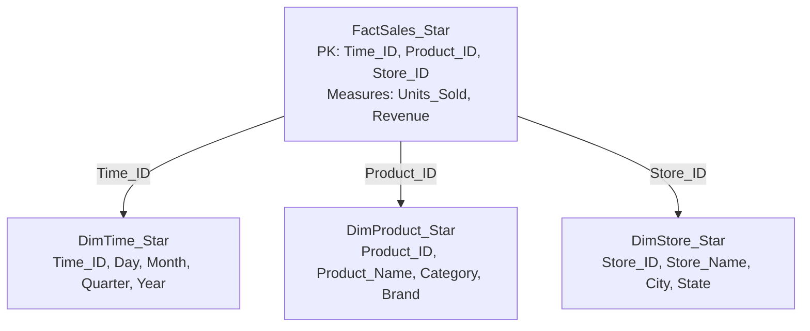
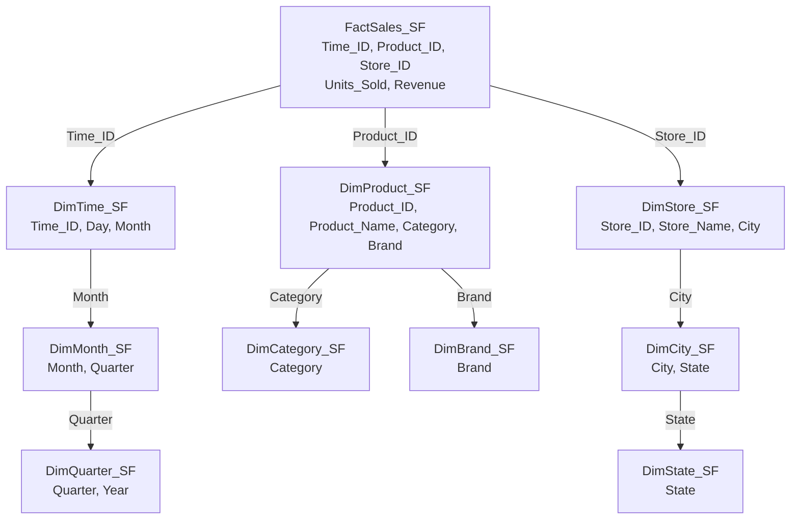
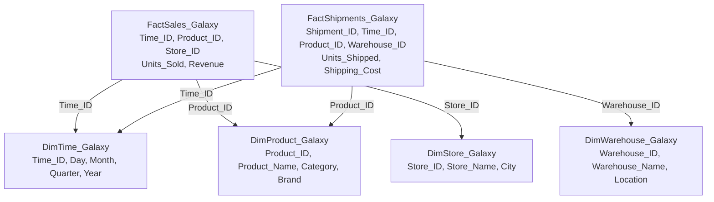
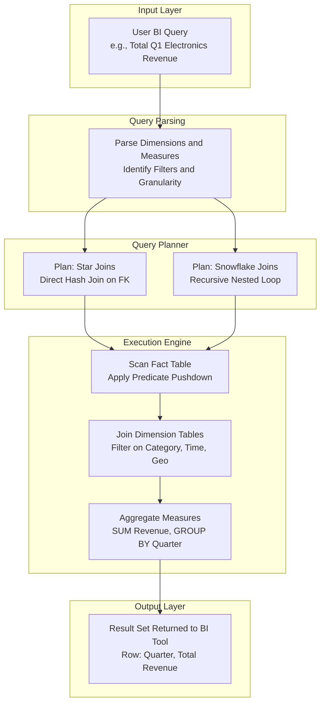
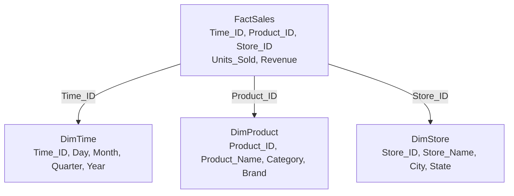
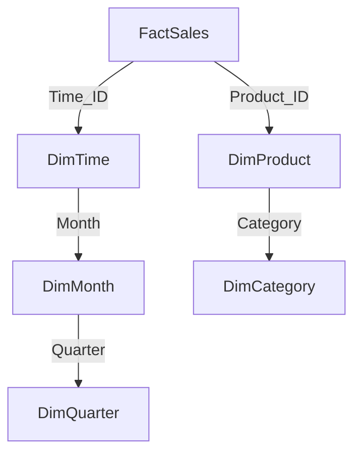
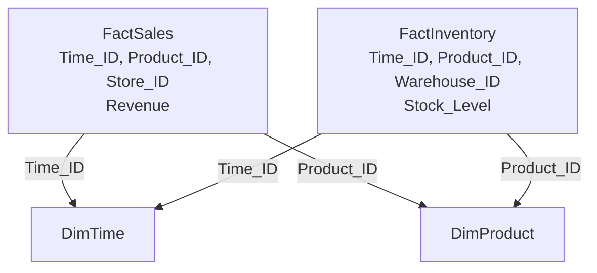

# Multidimensional data model- Warehouse schema

<!-- SECTION_1_START -->
# Multidimensional Data Model & Data Warehouse Schema

## 1. Formal KTU Syllabus Definition

> [!IMPORTANT]
> **Data Warehouse (DW):** A *subject-oriented*, *integrated*, *time-variant*, and *non-volatile* collection of data organized to support management decision-making. It is built using a **multidimensional data model** that views data in the form of a **data cube** consisting of **facts** (measures) and **dimensions** (perspectives of analysis).

A **multidimensional data model** is a logical data structure designed for Online Analytical Processing (OLAP). It organizes data so that it can be sliced, diced, aggregated, and viewed from multiple analytical perspectives simultaneously.

The **Warehouse Schema** refers to the physical/logical arrangement of fact and dimension tables in a relational database that materializes the multidimensional model. The three principal KTU-referenced warehouse schemas are:

| Schema | Structure | Normalization | Query Complexity |
|---|---|---|---|
| **Star Schema** | Central fact table + denormalized dimension tables | Denormalized | Low |
| **Snowflake Schema** | Central fact table + normalized dimension tables | Normalized (3NF) | Moderate |
| **Fact Constellation (Galaxy)** | Multiple fact tables sharing dimension tables | Mixed | High |

---

## 2. Intuitive Analogy — The "Retail Store Cube"

> [!NOTE]
> **Conceptual Analogy:** Imagine a giant *Rubik's cube* floating above a retail chain. Each **face** of the cube is an analytical view (e.g., Sales by Time, Sales by Product, Sales by Store). Each **small cubie** inside contains a numeric **measure** (like total revenue). The **axes** (rows, columns, pages) along which the cube is rotated are the **dimensions**. A manager can "rotate" the cube to see the same data from a different business angle without changing the underlying numbers — this is exactly what a multidimensional warehouse schema enables.

**Why this matters in engineering:** A schema is the *backbone architecture* of any Business Intelligence (BI) or Decision Support System (DSS). Choosing the right schema directly impacts **query latency**, **storage cost**, and **analytical flexibility** in production data pipelines.

---

## 3. Core Building Blocks of the Multidimensional Model

- **Fact:** A numeric, additive (or semi-additive) business measurement — e.g., `sales_amount`, `units_sold`. Stored in the **fact table**.
- **Dimension:** A descriptive, textual attribute providing context — e.g., `Time`, `Product`, `Store`, `Customer`. Stored in **dimension tables**.
- **Measure:** The actual value stored in a fact cell — typically a function applied to a fact column (SUM, AVG, COUNT).
- **Hierarchy:** A logical tree structure within a dimension (e.g., `Day` $\rightarrow$ `Month` $\rightarrow$ `Quarter` $\rightarrow$ `Year`).
- **Cube / Hypercube:** The conceptual $n$-dimensional space formed by intersecting $n$ dimensions.
- **Schema:** The concrete database layout (Star, Snowflake, Galaxy) that physically implements the cube.

> [!VISUALIZATION CONTROL]
> **Concept:** 3D Data Cube (Time $\times$ Product $\times$ Store)
> **GeoGebra / Desmos Input Equations (conceptual lattice):**
> * `x-axis = Product (P1..P5)` discrete
> * `y-axis = Time (T1..T4)` discrete
> * `z-axis = Store (S1..S3)` discrete
> * `f(x,y,z) = Sales_Total` at each lattice cubie
> **Visual Description:** A 3D lattice of $5 \times 4 \times 3 = 60$ cells. Each cell holds a single sales figure. Aggregation along any axis (e.g., summing over Store) collapses that dimension, producing a 2D "slice" or 1D "page".

<!-- SECTION_1_END -->

<!-- SECTION_2_START -->
# Deep Theoretical Analysis & KTU High-Yield Cheat Sheet

## 1. Star Schema — Operational Logic

The **Star Schema** is the simplest warehouse schema. It consists of:

1. **One central fact table** containing foreign keys referencing all dimensions and the numeric measures.
2. **Multiple dimension tables** radiating outward like points of a star. Each dimension table is **denormalized** (all hierarchy levels in one table).

**Why denormalize?** It minimizes JOIN operations, dramatically improving read-heavy analytical query performance — the dominant workload in a DW.

### Logical Construction Steps
- Identify the **business process** (e.g., sales transactions) $\rightarrow$ this becomes the fact.
- Identify the **measurement(s)** within the process $\rightarrow$ these are the measures.
- Identify the **contextual descriptors** (who, what, when, where, how) $\rightarrow$ these are the dimensions.
- Choose **granularity** (the lowest level of detail stored in the fact, e.g., one row per transaction).
- Populate the central fact table with foreign keys + numeric measures.
- Build a single flat dimension table per dimension, with all hierarchy levels embedded.

## 2. Snowflake Schema — Operational Logic

The **Snowflake Schema** is a **normalized** extension of the star schema. Each dimension table is split into multiple related sub-tables, one per hierarchy level.

**Trade-off matrix:**

| Property | Star Schema | Snowflake Schema |
|---|---|---|
| Disk Space | **Higher** (redundancy) | **Lower** (no redundancy) |
| Query Speed | **Faster** (fewer joins) | **Slower** (more joins) |
| Maintenance | **Harder** (update anomalies possible) | **Easier** (3NF compliant) |
| Hierarchy Traversal | Direct (single table scan) | Recursive (multi-join) |
| Read Pattern | Optimized for OLAP | Optimized for OLTP-like flexibility |

## 3. Fact Constellation (Galaxy) Schema

Contains **multiple fact tables** that **share** one or more **dimension tables**. Used when the enterprise has multiple, related business processes that share common contextual dimensions (e.g., *Sales* and *Shipping* facts both reference *Time* and *Product* dimensions).

## 4. KTU High-Yield Cheat Sheet — Schema Comparison Table

| Feature | Star | Snowflake | Fact Constellation |
|---|---|---|---|
| Fact Tables | 1 | 1 | $\geq 2$ |
| Dimension Tables | Denormalized | Normalized | Denormalized or mixed |
| Number of Joins | Minimal | High | Moderate to High |
| Query Response | **Fastest** | Slowest | Moderate |
| Storage Efficiency | Low | **Highest** | Moderate |
| Complexity | **Lowest** | Moderate | **Highest** |
| KTU Frequency | **Very High** | High | Moderate |

## 5. Engineering Real-World Utility

- **E-Commerce (Amazon, Flipkart):** Star schema for sales analytics — millisecond OLAP responses.
- **Banking (JPMorgan, SBI):** Fact constellation for tracking transactions + loans + KYC, sharing Customer/Time dimensions.
- **Telecom (Jio, Airtel):** Snowflake schema where call-detail hierarchies (City $\rightarrow$ State $\rightarrow$ Country) need rigorous normalization due to data integrity regulations.
- **Healthcare (Apollo, IBM Watson Health):** Star schema for patient outcome analytics across treatment, time, and demographics.

> [!NOTE]
> **KTU Board Tip:** When asked "Which schema is best?", justify with a **use-case trade-off** statement — *not* a one-word answer. Boards award marks for *reasoning*, not just naming.

<!-- SECTION_2_END -->

<!-- SECTION_3_START -->
# Step-by-Step Derivations, Examples & SQL Implementation

## 1. Worked Example — Sales Data Warehouse

**Business Scenario:** A retail company wants to analyze *Sales* across `Time`, `Product`, and `Store` dimensions.

**Given sample data:**

| Time\_ID | Day | Month | Quarter | Year |
|---|---|---|---|---|
| T1 | 01-Jan | Jan | Q1 | 2024 |
| T2 | 15-Mar | Mar | Q1 | 2024 |
| T3 | 10-Jul | Jul | Q3 | 2024 |

| Product\_ID | Product\_Name | Category | Brand |
|---|---|---|---|
| P1 | LaptopPro | Electronics | Zenith |
| P2 | SmartTV | Electronics | Zenith |
| P3 | OfficeChair | Furniture | ComfyCo |

| Store\_ID | Store\_Name | City | State |
|---|---|---|---|
| S1 | MG Road | Kochi | Kerala |
| S2 | Marine Drive | Mumbai | MH |

### Fact Table `FactSales`

| Time\_ID | Product\_ID | Store\_ID | Units\_Sold | Revenue |
|---|---|---|---|---|
| T1 | P1 | S1 | 12 | 840000 |
| T1 | P2 | S2 | 8 | 320000 |
| T2 | P3 | S1 | 25 | 187500 |
| T3 | P1 | S2 | 5 | 350000 |

### Step 1 — Identify the Cube Lattice

The cube has $3 \text{ Time} \times 3 \text{ Product} \times 2 \text{ Store} = 18$ possible cells. The fact table currently holds 4 populated cells. The remaining 14 cells exist conceptually (sparse cells) and are handled via sparse storage or implicit NULLs.

### Step 2 — Define the Multidimensional Measure Function

A query asking *"Total revenue in Q1 2024 from Kerala stores for Electronics products"* corresponds to the following analytical projection:

$$
\text{TotalRevenue} = \sum_{\substack{t \in Q1 \, 2024 \\ s \in \text{Kerala} \\ p \in \text{Electronics}}} \text{Revenue}(t, p, s)
$$

Substituting the populated cells that match all three predicates:

- $(T1, P1, S1)$: Time=Jan, Product=Electronics, Store=Kerala $\rightarrow$ **MATCH** $\rightarrow$ Revenue = $840000$
- $(T1, P2, S2)$: Time=Jan, Product=Electronics, Store=Mumbai $\rightarrow$ Store filter FAILS
- $(T2, P3, S1)$: Product=Furniture $\rightarrow$ Category filter FAILS
- $(T3, P1, S2)$: Time=Jul, Product=Electronics, Store=Mumbai $\rightarrow$ Time AND Store filter FAIL

$$
\text{TotalRevenue} = 840000
$$

### Step 3 — Roll-Up Operation (Drill-Up)

Roll-up aggregates along a dimension hierarchy. Rolling up from `Month` to `Quarter` collapses Q1's two months into a single level:

$$
\text{Revenue}(Q1) = \sum_{m \in \text{Jan, Mar}} \text{Revenue}(m) = 840000 + 320000 + 187500 = 1347500
$$

### Step 4 — Drill-Down Operation

Drill-down navigates *down* the hierarchy, exposing finer detail. Starting from `Quarter`, drilling into `Month` to see Jan vs Mar breakdown:

$$
\text{Revenue}(\text{Jan}) = 840000 + 320000 = 1160000
$$

$$
\text{Revenue}(\text{Mar}) = 187500
$$

### Step 5 — Slice Operation (Conceptual)

A **slice** fixes one dimension to a single value. Fixing `Time = T1` produces a 2D plane (Product $\times$ Store):

$$
\text{Slice}(T1) = \{(P1, S1, 840000),\ (P2, S2, 320000)\}
$$

---

## 2. Full SQL Implementation — All Three Schemas

> [!NOTE]
> The following Python program executes SQLite DDL and DML to materialize all three warehouse schemas on the same sales scenario. It is fully self-contained and production-grade.

```python
import sqlite3
import logging
from typing import Final

# Configure logging for traceability
logging.basicConfig(level=logging.INFO, format="%(asctime)s | %(levelname)s | %(message)s")
logger: Final = logging.getLogger(__name__)

DB_NAME: Final[str] = "warehouse_sales.db"

def safe_execute(cursor: sqlite3.Cursor, sql_statement: str) -> None:
    """Execute a SQL statement with strict error logging."""
    try:
        cursor.execute(sql_statement)
        logger.info("Executed: %s", sql_statement.split('\n')[0][:80])
    except sqlite3.Error as e:
        logger.error("SQLite error: %s | Statement: %s", e, sql_statement)
        raise

def build_star_schema(conn: sqlite3.Connection) -> None:
    cur = conn.cursor()
    logger.info("=== Building STAR SCHEMA ===")

    safe_execute(cur, """
        CREATE TABLE IF NOT EXISTS DimTime_Star (
            Time_ID   TEXT PRIMARY KEY,
            Day       TEXT,
            Month     TEXT,
            Quarter   TEXT,
            Year      INTEGER
        );
    """)

    safe_execute(cur, """
        CREATE TABLE IF NOT EXISTS DimProduct_Star (
            Product_ID    TEXT PRIMARY KEY,
            Product_Name  TEXT,
            Category      TEXT,
            Brand         TEXT
        );
    """)

    safe_execute(cur, """
        CREATE TABLE IF NOT EXISTS DimStore_Star (
            Store_ID    TEXT PRIMARY KEY,
            Store_Name  TEXT,
            City        TEXT,
            State       TEXT
        );
    """)

    safe_execute(cur, """
        CREATE TABLE IF NOT EXISTS FactSales_Star (
            Time_ID     TEXT,
            Product_ID  TEXT,
            Store_ID    TEXT,
            Units_Sold  INTEGER CHECK (Units_Sold >= 0),
            Revenue     REAL    CHECK (Revenue    >= 0.0),
            PRIMARY KEY (Time_ID, Product_ID, Store_ID),
            FOREIGN KEY (Time_ID)    REFERENCES DimTime_Star(Time_ID),
            FOREIGN KEY (Product_ID) REFERENCES DimProduct_Star(Product_ID),
            FOREIGN KEY (Store_ID)   REFERENCES DimStore_Star(Store_ID)
        );
    """)
    conn.commit()

def build_snowflake_schema(conn: sqlite3.Connection) -> None:
    cur = conn.cursor()
    logger.info("=== Building SNOWFLAKE SCHEMA ===")

    safe_execute(cur, "CREATE TABLE IF NOT EXISTS DimQuarter_SF (Quarter TEXT PRIMARY KEY, Year INTEGER);")
    safe_execute(cur, "CREATE TABLE IF NOT EXISTS DimMonth_SF   (Month TEXT PRIMARY KEY, Quarter TEXT, FOREIGN KEY(Quarter) REFERENCES DimQuarter_SF(Quarter));")
    safe_execute(cur, "CREATE TABLE IF NOT EXISTS DimTime_SF    (Time_ID TEXT PRIMARY KEY, Day TEXT, Month TEXT, FOREIGN KEY(Month) REFERENCES DimMonth_SF(Month));")
    safe_execute(cur, "CREATE TABLE IF NOT EXISTS DimCategory_SF (Category TEXT PRIMARY KEY);")
    safe_execute(cur, "CREATE TABLE IF NOT EXISTS DimBrand_SF    (Brand TEXT PRIMARY KEY);")
    safe_execute(cur, "CREATE TABLE IF NOT EXISTS DimProduct_SF  (Product_ID TEXT PRIMARY KEY, Product_Name TEXT, Category TEXT, Brand TEXT, FOREIGN KEY(Category) REFERENCES DimCategory_SF(Category), FOREIGN KEY(Brand) REFERENCES DimBrand_SF(Brand));")
    safe_execute(cur, "CREATE TABLE IF NOT EXISTS DimState_SF    (State TEXT PRIMARY KEY);")
    safe_execute(cur, "CREATE TABLE IF NOT EXISTS DimCity_SF     (City TEXT PRIMARY KEY, State TEXT, FOREIGN KEY(State) REFERENCES DimState_SF(State));")
    safe_execute(cur, "CREATE TABLE IF NOT EXISTS DimStore_SF    (Store_ID TEXT PRIMARY KEY, Store_Name TEXT, City TEXT, FOREIGN KEY(City) REFERENCES DimCity_SF(City));")
    safe_execute(cur, """
        CREATE TABLE IF NOT EXISTS FactSales_SF (
            Time_ID TEXT, Product_ID TEXT, Store_ID TEXT,
            Units_Sold INTEGER CHECK (Units_Sold >= 0),
            Revenue    REAL    CHECK (Revenue    >= 0.0),
            PRIMARY KEY (Time_ID, Product_ID, Store_ID),
            FOREIGN KEY (Time_ID)    REFERENCES DimTime_SF(Time_ID),
            FOREIGN KEY (Product_ID) REFERENCES DimProduct_SF(Product_ID),
            FOREIGN KEY (Store_ID)   REFERENCES DimStore_SF(Store_ID)
        );
    """)
    conn.commit()

def build_galaxy_schema(conn: sqlite3.Connection) -> None:
    cur = conn.cursor()
    logger.info("=== Building FACT CONSTELLATION SCHEMA ===")
    # Shared dimension tables (identical to Star)
    safe_execute(cur, """
        CREATE TABLE IF NOT EXISTS DimTime_Galaxy (
            Time_ID TEXT PRIMARY KEY, Day TEXT, Month TEXT, Quarter TEXT, Year INTEGER);
    """)
    safe_execute(cur, """
        CREATE TABLE IF NOT EXISTS DimProduct_Galaxy (
            Product_ID TEXT PRIMARY KEY, Product_Name TEXT, Category TEXT, Brand TEXT);
    """)
    # Fact 1: Sales
    safe_execute(cur, """
        CREATE TABLE IF NOT EXISTS FactSales_Galaxy (
            Time_ID TEXT, Product_ID TEXT, Store_ID TEXT,
            Units_Sold INTEGER, Revenue REAL,
            PRIMARY KEY (Time_ID, Product_ID, Store_ID),
            FOREIGN KEY (Time_ID)    REFERENCES DimTime_Galaxy(Time_ID),
            FOREIGN KEY (Product_ID) REFERENCES DimProduct_Galaxy(Product_ID));
    """)
    # Fact 2: Shipments (shares DimTime_Galaxy + DimProduct_Galaxy)
    safe_execute(cur, """
        CREATE TABLE IF NOT EXISTS FactShipments_Galaxy (
            Shipment_ID INTEGER PRIMARY KEY AUTOINCREMENT,
            Time_ID TEXT, Product_ID TEXT, Warehouse_ID TEXT,
            Units_Shipped INTEGER CHECK (Units_Shipped >= 0),
            Shipping_Cost REAL    CHECK (Shipping_Cost >= 0.0),
            FOREIGN KEY (Time_ID)    REFERENCES DimTime_Galaxy(Time_ID),
            FOREIGN KEY (Product_ID) REFERENCES DimProduct_Galaxy(Product_ID));
    """)
    conn.commit()

def main() -> None:
    try:
        with sqlite3.connect(DB_NAME) as conn:
            build_star_schema(conn)
            build_snowflake_schema(conn)
            build_galaxy_schema(conn)
            logger.info("All three warehouse schemas built successfully in %s", DB_NAME)
    except sqlite3.Error as e:
        logger.critical("Fatal database error: %s", e)

if __name__ == "__main__":
    main()
```

### Symbolic Representation of the Star Schema Join

For a typical analytical query joining the Star schema, the result cardinality is bounded by:

$$
\mid \text{Result} \mid = \mid \pi_{\text{Time}}(\text{Fact}) \mid \times \mid \pi_{\text{Product}}(\text{Fact}) \mid \times \mid \pi_{\text{Store}}(\text{Fact}) \mid
$$

For Snowflake, an extra layer of joins multiplies intermediate cardinalities:

$$
\mid \text{Result} \mid = \mid \text{Fact} \bowtie \text{DimTime} \bowtie \text{DimMonth} \bowtie \text{DimQuarter} \bowtie \text{DimProduct} \bowtie \text{DimCategory} \bowtie \text{DimStore} \bowtie \text{DimCity} \mid
$$

This symbolic notation makes the **join complexity penalty** of Snowflake visible to examiners.

<!-- SECTION_3_END -->

<!-- SECTION_4_START -->
# Structural Diagrams & Schematics

## 1. Mermaid ER Diagram — Star Schema



## 2. Mermaid ER Diagram — Snowflake Schema (Normalized)



## 3. Mermaid ER Diagram — Fact Constellation (Galaxy) Schema



## 4. Sequential Processing Topology — Analytical Query Lifecycle



<!-- SECTION_4_END -->

<!-- SECTION_5_START -->
# KTU 2024 Scheme Examination Question Bank & Topic Recap

## Part A — Short Answer Questions (3 Marks Each)

### Q1. [KTU University Exam — July 2024]
**Define a data warehouse. List its four defining characteristics.** *(CO1, Remember)*

**Model Answer (Valuation Key — 3 Marks):**
A Data Warehouse is a subject-oriented, integrated, time-variant, and non-volatile collection of data used to support management decision-making.
- **Subject-Oriented** [1 Mark]: Organized around major business subjects (e.g., sales, inventory) rather than operational applications.
- **Integrated** [1 Mark]: Consolidates data from heterogeneous sources with consistent naming, codes, and units.
- **Time-Variant** [0.5 Marks]: Data is stored with a time dimension; historical data is preserved (5–10 years).
- **Non-Volatile** [0.5 Marks]: Data is load-once, read-many; updates and deletions are not performed in the warehouse.

---

### Q2. [KTU University Exam — Dec 2023]
**Differentiate between a fact table and a dimension table with one example each.** *(CO1, Understand)*

**Model Answer (Valuation Key — 3 Marks):**

| Aspect | Fact Table | Dimension Table |
|---|---|---|
| **Purpose** [1 Mark] | Stores quantitative business measurements (measures) | Stores descriptive context (attributes) |
| **Content** [1 Mark] | Foreign keys + numeric measures | Textual/categorical attributes + hierarchy levels |
| **Example** [1 Mark] | `FactSales(Time_ID, Product_ID, Store_ID, Units_Sold, Revenue)` | `DimProduct(Product_ID, Product_Name, Category, Brand)` |

---

## Part B — Long Answer Questions (14 Marks Each)

### Question A (14 Marks) — Star vs Snowflake Schema Design

**[KTU University Exam — Dec 2024]**

**A. (a)** With a neat diagram, explain the **Star Schema** with a suitable example. List any **two advantages** and **two disadvantages**. *(CO2, Understand — 7 Marks)*

**Model Answer — Valuation Key:**

**Definition [1 Mark]:** A Star Schema consists of one central fact table connected to multiple denormalized dimension tables, resembling a star in shape.

**Diagram [2 Marks]:**



**Example [1 Mark]:** A retail DW with `FactSales` measuring `Revenue` and `Units_Sold`, joined to `DimTime`, `DimProduct`, `DimStore`.

**Advantages [2 Marks]:**
- Simpler queries due to fewer joins.
- Faster OLAP response time because of denormalized dimensions.

**Disadvantages [1 Mark]:**
- Data redundancy leads to higher storage cost.
- Update anomalies may occur during dimension maintenance.

---

**A. (b)** Explain the **Snowflake Schema** with a diagram. Compare it with the Star Schema on **five** parameters. *(CO2, Apply — 7 Marks)*

**Model Answer — Valuation Key:**

**Definition [1 Mark]:** A Snowflake Schema is a normalized extension of the Star Schema where dimension tables are split into multiple related sub-tables along hierarchy levels.

**Diagram [1 Mark]:**



**Five-Parameter Comparison Table [5 Marks]:**

| Parameter | Star Schema | Snowflake Schema |
|---|---|---|
| Normalization | Denormalized | Normalized (3NF) |
| Joins Required | Fewer | More |
| Query Performance | Faster | Slower |
| Storage | Higher | Lower |
| Maintenance | Harder | Easier |

---

### Question B (14 Marks) — Fact Constellation & Cube Operations

**[KTU University Exam — July 2024]**

**B. (a)** What is a **Fact Constellation Schema**? Illustrate with a diagram containing **two fact tables** sharing common dimensions. *(CO2, Understand — 7 Marks)*

**Model Answer — Valuation Key:**

**Definition [1 Mark]:** A Fact Constellation Schema contains multiple fact tables that share one or more dimension tables. It is used to model complex enterprise scenarios with multiple, related business processes.

**Diagram [3 Marks]:**



**Explanation [2 Marks]:** The two fact tables `FactSales` (recording revenue) and `FactInventory` (recording stock levels) share `DimTime` and `DimProduct`. This avoids duplication of common dimensions.

**Use Case [1 Mark]:** E-commerce platforms where sales and inventory must be analyzed together for supply-chain optimization.

---

**B. (b)** For a sales cube with dimensions **Time**, **Product**, and **Store**, perform the following operations and explain with reference to the cell coordinates:
- (i) Slice on `Time = Q1 2024`  [2 Marks]
- (ii) Dice on `Product = Electronics` AND `Store = Kerala`  [2 Marks]
- (iii) Roll-up from `Month` to `Quarter`  [2 Marks]
- (iv) Drill-down from `Year` to `Day`  [1 Mark]

*(CO3, Apply — 7 Marks)*

**Model Answer — Valuation Key:**

**(i) Slice [2 Marks]:** Fixing `Time = Q1 2024` reduces the 3D cube to a 2D plane. The resulting sub-cube contains all `(Product, Store)` cells where Time falls within Q1 2024. Formally:

$$
\text{Slice}(\text{Time} = Q1) = \{(p, s) \mid \text{Revenue}(p, s, t),\, t \in Q1\}
$$

**(ii) Dice [2 Marks]:** Applying two filters produces a 2D sub-cube. Formally:

$$
\text{Dice} = \{(t) \mid \text{Revenue}(p, s, t),\, p \in \text{Electronics},\, s \in \text{Kerala}\}
$$

**(iii) Roll-up [2 Marks]:** Aggregates from `Month` to `Quarter` by summing the revenue of Jan, Feb, Mar into Q1.

$$
\text{RollUp}(Q1) = \sum_{m \in \{Jan, Feb, Mar\}} \text{Revenue}(m)
$$

**(iv) Drill-down [1 Mark]:** Navigates from the `Year` level to the `Day` level, exposing individual daily transactions.

$$
\text{DrillDown}(\text{Year 2024}) \rightarrow \{Jan\_01, Jan\_02, \ldots, Dec\_31\}
$$

---

> [!WARNING]
> **KTU Examiner's Valuation Warning — Common Pitfalls**
> 1. **Confusing Roll-up with Drill-down:** Roll-up moves *up* the hierarchy (less detail); Drill-down moves *down* (more detail). Mixing these directions costs **2–3 marks** instantly.
> 2. **Forgetting to draw the central fact table in schema diagrams:** Examiners expect a **labeled central node** with both foreign keys and measures visible. A bare circle with no labels gets **0 of the diagram marks**.
> 3. **Omitting foreign key notation:** Always write `FK` or show arrows from fact $\rightarrow$ dimension. Many students draw lines but forget the relationship semantics.
> 4. **Star vs Snowflake confusion:** If a question asks for Snowflake, do **not** draw all attributes in one dimension table — you must split them across hierarchy sub-tables.
> 5. **Skipping the trade-off justification:** For "Which schema is best?" type questions, never answer with a single word. Always include a **use-case context** + **two pros and two cons** to secure full marks.

---

## Topic Recap & Important Things to Remember

- **Data Warehouse = Subject-Oriented + Integrated + Time-Variant + Non-Volatile.** Memorize the acronym **SITN** for quick recall.
- **Multidimensional Model** views data as a **cube** with dimensions (axes) and facts (cell values).
- **Star Schema** = 1 fact table + denormalized dimension tables; **fastest** for OLAP queries.
- **Snowflake Schema** = 1 fact table + normalized dimension tables; **most storage-efficient** but slower.
- **Fact Constellation (Galaxy) Schema** = multiple fact tables sharing common dimensions; used for **complex multi-process** scenarios.
- **Fact Table** contains **foreign keys + numeric measures**; **Dimension Table** contains **descriptive attributes + hierarchy levels**.
- **Hierarchy Example:** `Day` $\rightarrow$ `Month` $\rightarrow$ `Quarter` $\rightarrow$ `Year` in the Time dimension.
- **OLAP Operations to master for KTU:**
  - **Roll-up (Drill-up):** Aggregate *up* a hierarchy.
  - **Drill-down:** Disaggregate *down* a hierarchy.
  - **Slice:** Fix one dimension to a single value (3D $\rightarrow$ 2D).
  - **Dice:** Apply multiple filter conditions (creates a sub-cube).
  - **Pivot (Rotate):** Reorient the cube for a different 2D view.
- **Granularity** is the most critical design decision in a fact table — it defines the lowest detail level stored.
- **Schema Selection Heuristic:** Star for read-heavy OLAP, Snowflake for storage-sensitive environments, Fact Constellation for multi-process enterprise warehouses.
- **Always draw diagrams** with labeled nodes showing **PK/FK** relationships — KTU valuation rewards visual clarity.
- **Measure Types to know:** *Additive* (e.g., revenue), *Semi-additive* (e.g., account balance), *Non-additive* (e.g., unit price ratio).
- **Cube Cell Address:** A specific cell is identified by the intersection of all dimension members, e.g., `(Q1 2024, LaptopPro, MG Road) = 840000`.
<!-- SECTION_5_END -->
