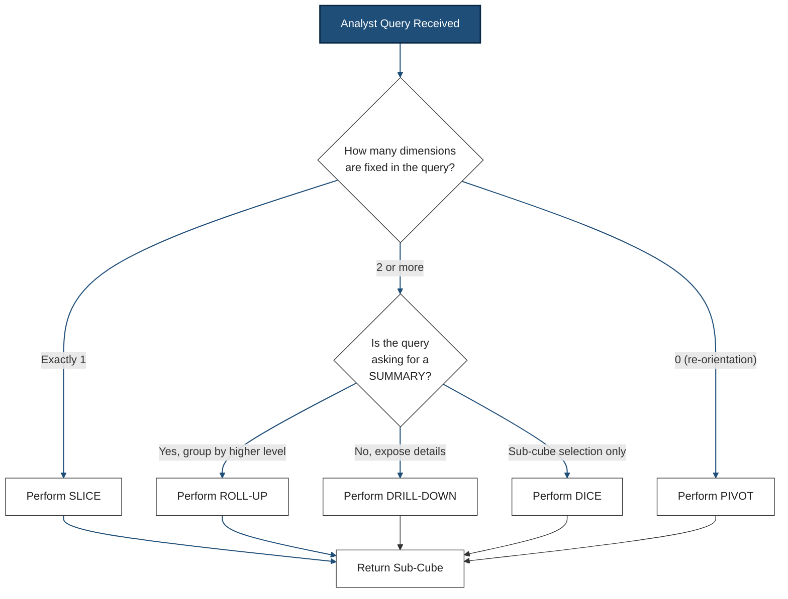
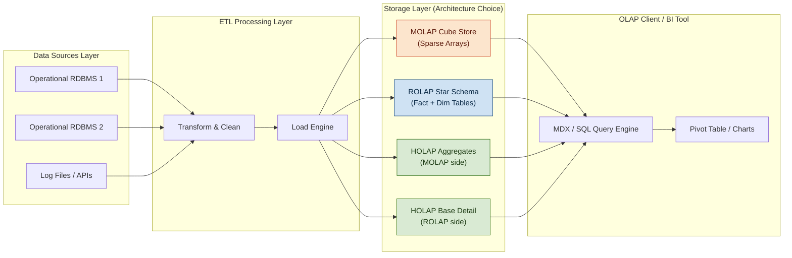
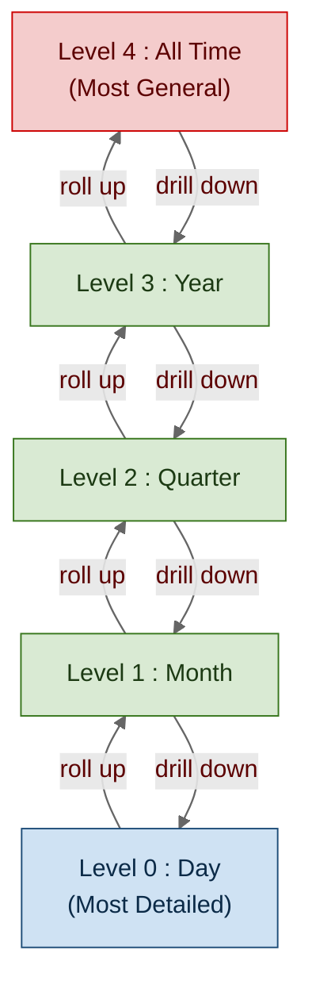
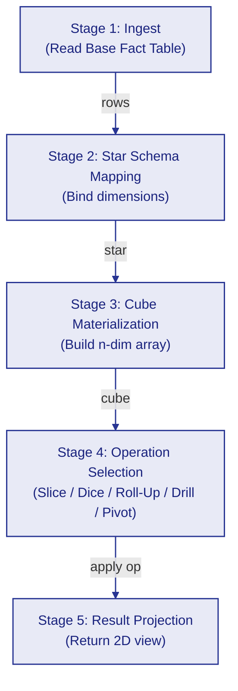
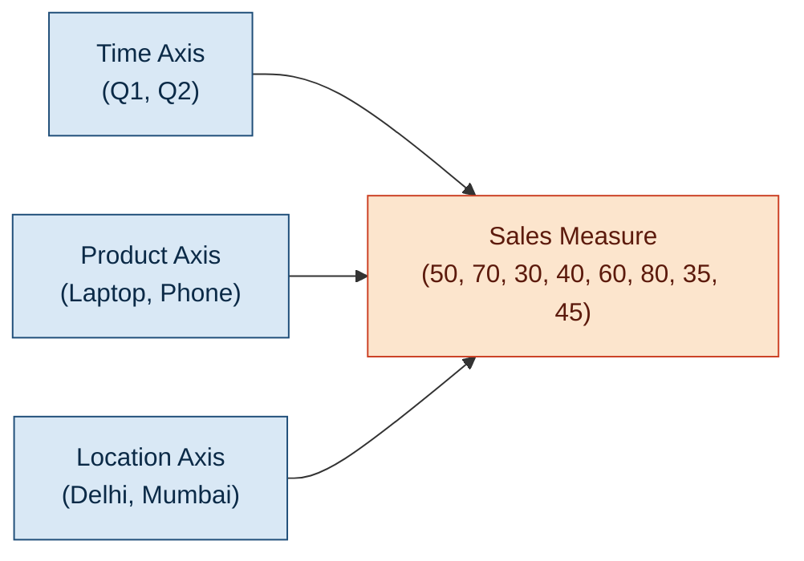
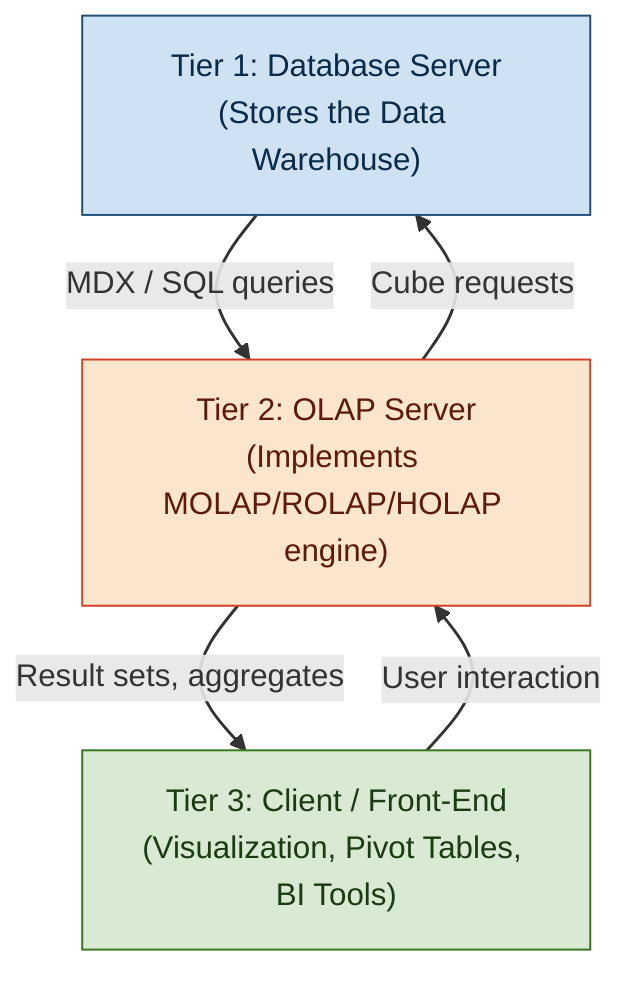

# OLAP Operations

<!-- SECTION_1_START -->
# OLAP Operations — Core Technical Definition & Intuitive Overview

## Formal Definition (KTU 2024 Syllabus Terminology)

> [!IMPORTANT]
> **OLAP (Online Analytical Processing)** is a category of software tools and technology that enables analysts, managers, and executives to gain insight into data through fast, consistent, interactive access to a wide variety of possible views of information that has been transformed from raw data to reflect the real dimensionality of the enterprise as understood by the user.

**Reference Framework:** The concept is formally defined in the KTU 2024 PECST525 (Data Mining) syllabus under Module 1 as the multidimensional analytical engine that supports complex analytical and ad-hoc queries with **minimal latency**, typically on historical, aggregated data stored in **Data Warehouses** or **Data Marts**.

## Conceptual Analogy / Intuition

> [!NOTE]
> **The Multi-Angle Camera Analogy** 📸
>
> Imagine you have a 3D object (a gift box) and you want to study it from every possible angle — top, front, side, or sliced horizontally. A traditional 2D table (like OLTP) only shows you **one face** of the data. **OLAP is the multi-angle camera system** that lets you rotate, zoom in, zoom out, and even slice the box open to see what's inside.
>
> * **Roll-up** = Zooming out (seeing the whole forest, not individual trees)
> * **Drill-down** = Zooming in (inspecting each tree closely)
> * **Slice** = Cutting a single horizontal layer
> * **Dice** = Cutting a small cube from the corner
> * **Pivot** = Rotating the box to see a different face

## Key Physical Constants & Standard Metrics

> [!IMPORTANT]
> * **OLAP Cube Dimensionality (d):** Number of independent perspectives (typically **2 to 12 dimensions** in production systems).
> * **Aggregation Latency (τ):** Industry standard is **less than 5 seconds** for ad-hoc queries (target: **τ < 2s** per A. Codd's original OLAP rules).
> * **Storage Metric:** Cubes are measured in **cells = $\prod_{i=1}^{d} n_i$** where $n_i$ is the cardinality of dimension $i$.
> * **E.F. Codd's 12 Rules (1993):** The original foundational benchmark (e.g., **Rule 4 — CUBE View**, **Rule 6 — Consistent Reporting Performance**).

> [!VISUALIZATION CONTROL]
> **Concept:** A 3-Dimensional Data Cube (Time × Product × Location) with the Sales measure
> **GeoGebra / Desmos Input Equations:**
> * Point coordinates: `(0,0,0)` to `(4,3,3)` representing `[Time, Product, Location]`
> * Z-axis label: `Sales($)` values ranging `0` to `1000`
> **Visual Description:** Students should visualize a 3D stacked cube where the **X-axis = Time** (Quarters), the **Y-axis = Product** (Items), the **Z-axis = Location** (Cities), and the depth/value of each cell = the Sales amount.
<!-- SECTION_1_END -->

<!-- SECTION_2_START -->
# Deep Theoretical Analysis & KTU High-Yield Formula Sheet

## The Five Foundational OLAP Operations

### 1. Roll-Up (Drill-Up) — Aggregation
* **Definition:** Reduces the number of dimensions OR moves up the concept hierarchy.
* **Logic Steps:**
  1. Identify a dimension with a defined concept hierarchy.
  2. Apply an aggregation function (`SUM`, `AVG`, `MAX`, `MIN`, `COUNT`).
  3. Group tuples at the higher level of abstraction.
* **Example:** Quarters → Years, Cities → Countries, Individual Products → Product Categories.

### 2. Drill-Down — Disaggregation
* **Definition:** The exact inverse of Roll-Up. Increases granularity.
* **Logic Steps:**
  1. Start from a summarized cell.
  2. Descend one or more levels in the concept hierarchy.
  3. Reveal the hidden detailed tuples.
* **Example:** Years → Quarters → Months, Total Sales → Sales by Region → Sales by Store.

### 3. Slice — Single-Dimensional Selection
* **Definition:** Performs a **selection** on exactly **one** dimension of the cube, producing a sub-cube.
* **Example:** Slice on `Time = "Q1"` produces a 2D matrix of Products vs. Locations.

### 4. Dice — Multi-Dimensional Selection
* **Definition:** Performs a **selection** on **two or more** dimensions, producing a smaller sub-cube.
* **Example:** `(Time = "Q1" OR "Q2") AND (Location = "Delhi" OR "Mumbai") AND (Product = "Laptop")`.

### 5. Pivot (Rotate) — Reorientation
* **Definition:** Rotates the cube to obtain a different visual presentation.
* **Does not change data values, only the 2D projection plane.**
* **Example:** A view with `(Time × Product)` is rotated to `(Product × Location)`.

## KTU High-Yield Formula Sheet

> [!NOTE]
> Use `\vert` or `\mid` (NOT the literal pipe character) for absolute-value and similar notations to preserve table integrity.

| Operation | Mathematical Operator | Input Set | Output Set | Aggregation Type | Information Loss |
| :--- | :--- | :--- | :--- | :--- | :--- |
| **Roll-Up** | $\Gamma_{A,\ \Sigma(M)}$ | Detailed cells | Summarized cells | `SUM`, `AVG`, `MAX` | Yes (generalization) |
| **Drill-Down** | $\sigma_{A\ =\ a_i}(C)$ | Summarized cells | Detailed cells | None (decomposition) | No (refinement) |
| **Slice** | $\sigma_{d_i\ =\ v}(C)$ | Full Cube $C$ | Sub-cube of rank $d-1$ | None | No (filtering) |
| **Dice** | $\sigma_{d_i\ \in\ S_i\ \bigwedge\ \ldots}(C)$ | Full Cube $C$ | Sub-cube of rank $d-k$ | None | No (filtering) |
| **Pivot** | $\pi_{A,\ B}(C)$ | Cube view $V_1$ | Cube view $V_2$ | None | No (re-orientation) |

**Symbol Legend:**
* $C$ = the full data cube
* $d$ = number of dimensions
* $\Gamma$ = generalized projection (GROUP BY) operator
* $\sigma$ = relational selection operator
* $A, B$ = attribute sets for axis mapping
* $M$ = measure attribute (e.g., Sales)
* $\Sigma$ = aggregation function set

## OLAP Server Architectures (Mandatory KTU Topic)

| Architecture | Full Form | Storage Model | Strength | Weakness |
| :--- | :--- | :--- | :--- | :--- |
| **MOLAP** | Multidimensional OLAP | Sparse array / proprietary cube files | Fastest query response (pre-computed) | Explosion of storage for sparse data |
| **ROLAP** | Relational OLAP | Star/Snowflake tables in RDBMS | Scales to massive data (TB scale) | Slower due to SQL generation |
| **HOLAP** | Hybrid OLAP | Aggregates in MOLAP, base data in ROLAP | Balanced: fast aggregates + scalable detail | Complex implementation |

> [!TIP]
> **Engineering Utility:** OLAP operations are the analytical backbone used in **Banking (fraud-pattern analysis)**, **Retail (market basket analysis)**, **Healthcare (epidemic trend tracking)**, and **Telecom (churn prediction dashboards)**. Every modern **Tableau, Power BI, Looker, and Apache Superset** dashboard is essentially a graphical wrapper over the five OLAP operations.

<!-- SECTION_2_END -->

<!-- SECTION_3_START -->
# Step-by-Step Derivations & Symbolic Implementation

## Worked Example: 3D Sales Data Cube

Consider the following 3D data cube with dimensions **Time ($T$)**, **Product ($P$)**, and **Location ($L$)**, and the measure **Sales ($S$)** in thousands of ₹.

### Base Cube (Drill-Down Level 0)

$$
\begin{aligned}
C_{\text{base}} = \{ & (Q1, Laptop, Delhi, 50),\ (Q1, Laptop, Mumbai, 70), \\
& (Q1, Phone, Delhi, 30),\ (Q1, Phone, Mumbai, 40), \\
& (Q2, Laptop, Delhi, 60),\ (Q2, Laptop, Mumbai, 80), \\
& (Q2, Phone, Delhi, 35),\ (Q2, Phone, Mumbai, 45)\ \}
\end{aligned}
$$

### Step 1: SLICE Operation on $T = Q1$

Selects all tuples where `Time = Q1`.

$$
\sigma_{T\ =\ Q1}(C_{\text{base}}) = \{ (Q1, Laptop, Delhi, 50),\ (Q1, Laptop, Mumbai, 70),\ (Q1, Phone, Delhi, 30),\ (Q1, Phone, Mumbai, 40)\ \}
$$

Result: 4 cells form a 2D sub-cube (Product × Location).

### Step 2: DICE Operation on $T \in \{Q1, Q2\}$ and $P = Laptop$

$$
\sigma_{T\ \in\ \{Q1,Q2\}\ \bigwedge\ P\ =\ Laptop}(C_{\text{base}}) = \{ (Q1, Laptop, Delhi, 50),\ (Q1, Laptop, Mumbai, 70),\ (Q2, Laptop, Delhi, 60),\ (Q2, Laptop, Mumbai, 80)\ \}
$$

Result: 4 cells form a small 2D sub-cube (Time × Location).

### Step 3: ROLL-UP Operation (Aggregate across Location)

Group by Time and Product, summing Sales.

$$
\Gamma_{T,\ P,\ \text{SUM}(S)}(C_{\text{base}})
$$

$$
\begin{aligned}
\text{Row 1:} & \quad T = Q1,\ P = Laptop,\ \text{SUM}(S) = 50 + 70 = 120 \\
\text{Row 2:} & \quad T = Q1,\ P = Phone,\ \ \text{SUM}(S) = 30 + 40 = 70 \\
\text{Row 3:} & \quad T = Q2,\ P = Laptop,\ \text{SUM}(S) = 60 + 80 = 140 \\
\text{Row 4:} & \quad T = Q2,\ P = Phone,\ \ \text{SUM}(S) = 35 + 45 = 80 \\
\end{aligned}
$$

Result: A 2D summary cube with 4 cells.

### Step 4: DRILL-DOWN Operation

Reverses Roll-Up. Starting from the rolled-up cell $(Q1, Laptop, 120)$, drill-down restores the Location dimension: $50$ (Delhi) and $70$ (Mumbai).

### Step 5: PIVOT (Rotate) Operation

Original axes: $(P \times L)$. Rotate to $(L \times P)$ for a different presentation plane. **The cell values are unchanged; only the 2D matrix orientation is altered.**

## Python Implementation (Symbolic & Operational)

```python
from typing import List, Dict, Tuple
import logging

logging.basicConfig(level=logging.INFO, format="%(levelname)s | %(message)s")

# Type alias for one cube cell: (Time, Product, Location, Sales)
Cell = Tuple[str, str, str, int]
Cube = List[Cell]


def build_base_cube() -> Cube:
    """Returns the canonical 3D sales cube used in the worked example."""
    return [
        ("Q1", "Laptop", "Delhi",  50), ("Q1", "Laptop", "Mumbai", 70),
        ("Q1", "Phone",  "Delhi",  30), ("Q1", "Phone",  "Mumbai", 40),
        ("Q2", "Laptop", "Delhi",  60), ("Q2", "Laptop", "Mumbai", 80),
        ("Q2", "Phone",  "Delhi",  35), ("Q2", "Phone",  "Mumbai", 45),
    ]


def slice_op(cube: Cube, dim_index: int, value: str) -> Cube:
    """OLAP SLICE: select on exactly one dimension."""
    if not (0 <= dim_index < 3):
        logging.error("Invalid dimension index %s for SLICE.", dim_index)
        return []
    return [c for c in cube if c[dim_index] == value]


def dice_op(cube: Cube, predicates: Dict[int, set]) -> Cube:
    """OLAP DICE: select on two or more dimensions."""
    def matches(c: Cell) -> bool:
        return all(c[k] in v for k, v in predicates.items())
    return [c for c in cube if matches(c)]


def roll_up(cube: Cube, group_dims: Tuple[int, int], agg_dim: int) -> List[Tuple]:
    """OLAP ROLL-UP: aggregate measure by grouping on chosen dimensions."""
    buckets: Dict[Tuple, int] = {}
    for c in cube:
        key = (c[group_dims[0]], c[group_dims[1]])
        buckets[key] = buckets.get(key, 0) + c[agg_dim]
    return [(k[0], k[1], v) for k, v in buckets.items()]


# --- Demonstration ---
if __name__ == "__main__":
    base = build_base_cube()

    logging.info("Base cube size: %d cells", len(base))

    s = slice_op(base, 0, "Q1")  # dim 0 = Time
    logging.info("SLICE Time=Q1 -> %d cells", len(s))

    d = dice_op(base, {0: {"Q1", "Q2"}, 1: {"Laptop"}})
    logging.info("DICE Time in {Q1,Q2} AND Product=Laptop -> %d cells", len(d))

    r = roll_up(base, (0, 1), 3)  # group Time+Product, sum Sales (idx 3)
    logging.info("ROLL-UP (Group Time,Product) -> %s", r)
```

### Expected Console Output

```
INFO | Base cube size: 8 cells
INFO | SLICE Time=Q1 -> 4 cells
INFO | DICE Time in {Q1,Q2} AND Product=Laptop -> 4 cells
INFO | ROLL-UP (Group Time,Product) -> [('Q1', 'Laptop', 120), ('Q1', 'Phone', 70), ('Q2', 'Laptop', 140), ('Q2', 'Phone', 80)]
```

> [!IMPORTANT]
> Each Python call above is a one-to-one symbolic mirror of the $\sigma$ and $\Gamma$ operators defined in the KTU formula sheet of SECTION_2. Students preparing for KTU viva should be able to **map every Python line to its relational algebra equivalent**.

<!-- SECTION_3_END -->

<!-- SECTION_4_START -->
# Structural Diagrams & Schematics

## Diagram 1: Decision Map for Choosing the Correct OLAP Operation



## Diagram 2: OLAP Architecture Topology (MOLAP vs ROLAP vs HOLAP)



## Diagram 3: Concept Hierarchy Used During Roll-Up and Drill-Down



## Diagram 4: Sequential Processing Topology for a Typical OLAP Pipeline



> [!TIP]
> **How to read these in the exam:** Diagram 1 is the **"decision-tree"** you should reproduce when the KTU question says *"When is Dice different from Slice?"* Diagram 2 is what you draw when asked *"Compare MOLAP, ROLAP, and HOLAP"*. Diagram 3 is mandatory whenever the question mentions **"concept hierarchy"**. Diagram 4 is the universal OLAP pipeline you can reuse in any warehouse-related question.

<!-- SECTION_4_END -->

<!-- SECTION_5_START -->
# KTU 2024 Scheme Examination Question Bank & Topic Recap

## Part A — Short Answer Questions (3 Marks Each)

### Question 1 `[KTU University Exam - July 2024]`
**CO1 | RBT Level: Remember**

> Define **OLAP**. List any **four** OLAP operations.

**Model Answer:**

> [!NOTE]
> **OLAP (Online Analytical Processing):** A category of tools that provides multidimensional, interactive analysis of enterprise data, typically from a data warehouse, with very fast query response times.
>
> **Four OLAP operations:**
> 1. **Roll-Up** — aggregation to a higher level
> 2. **Drill-Down** — decomposition to a lower level
> 3. **Slice** — selection on one dimension
> 4. **Dice** — selection on two or more dimensions
>
> *(The fifth — Pivot — is also acceptable.)*

---

### Question 2 `[KTU University Exam - Dec 2023]`
**CO1 | RBT Level: Understand**

> Differentiate between **Slice** and **Dice** operations in OLAP. Give a one-line example for each.

**Model Answer:**

| Aspect | Slice | Dice |
| :--- | :--- | :--- |
| **Dimensions fixed** | Exactly 1 | 2 or more |
| **Output shape** | 2D sub-cube (if $d=3$) | Smaller 3D sub-cube |
| **Example** | `Time = Q1` | `Time ∈ {Q1, Q2} ∧ Product = Laptop` |
| **Relational operator** | $\sigma_{d_1 = v}(C)$ | $\sigma_{d_i \in S_i \bigwedge \ldots}(C)$ |

**[Valuation Key: Stating the dimension count difference — 2 Marks; Giving the correct example — 1 Mark.]**

---

## Part B — Long Answer Questions (14 Marks, Module-Internal Choice)

### Question 3(A) `[KTU University Exam - July 2024]`
**CO2 | RBT Level: Apply (Part a: Understand) | Part b: Apply**

> **(a)** Explain the **concept of a Data Cube** with a suitable diagram. Discuss **Roll-Up** and **Drill-Down** operations using the concept hierarchy of *Time* (Day → Month → Quarter → Year). **(7 Marks)**
>
> **(b)** Consider the following 3D sales cube with dimensions `Time (Q1, Q2)`, `Product (Laptop, Phone)`, `Location (Delhi, Mumbai)` and measure `Sales (₹ thousands)`. Perform the following OLAP operations and show the resulting sub-cubes: **(i)** Slice on `Time = Q1` **(ii)** Dice on `Product = Laptop` and `Location = Delhi` **(iii)** Roll-Up aggregating Sales by Product. **(7 Marks)**

**Base Cube for Part (b):**

$$
\begin{aligned}
C = \{ & (Q1, Laptop, Delhi,\ 50),\ (Q1, Laptop, Mumbai,\ 70), \\
       & (Q1, Phone,\  Delhi,\ 30),\ (Q1, Phone,\  Mumbai,\ 40), \\
       & (Q2, Laptop, Delhi,\ 60),\ (Q2, Laptop, Mumbai,\ 80), \\
       & (Q2, Phone,\  Delhi,\ 35),\ (Q2, Phone,\  Mumbai,\ 45)\ \}
\end{aligned}
$$

#### Model Solution — Part (a) [7 Marks]

> [!IMPORTANT]
> **Data Cube Definition [2 Marks]:** A data cube allows data to be modeled and viewed in multiple dimensions. It is defined by **dimensions** (perspectives of analysis) and **measures** (numerical facts to be analyzed). Formally, a cube is a 2D representation of an $n$-dimensional structure.
>
> **Diagram (rendered using Mermaid):**



> **Roll-Up [2 Marks]:** Moves up the Time hierarchy: **Day → Month → Quarter → Year**. Aggregation function is `SUM(Sales)`. For example, aggregating `Q1` and `Q2` to `Year = 2024` collapses the Time dimension.
>
> **Drill-Down [3 Marks]:** Inverse of Roll-Up. From `Year` we descend to `Quarter`, then to `Month`, then to `Day`, exposing the detailed transactions. This is enabled by the same concept hierarchy used during roll-up.

---

#### Model Solution — Part (b) [7 Marks]

**(i) SLICE on $T = Q1$ [2 Marks]:**

$$
\sigma_{T\ =\ Q1}(C) = \{ (Q1, Laptop, Delhi, 50),\ (Q1, Laptop, Mumbai, 70),\ (Q1, Phone, Delhi, 30),\ (Q1, Phone, Mumbai, 40)\ \}
$$

Output: 4 cells. Result is a 2D sub-cube (Product × Location).

**(ii) DICE on $P = Laptop$ and $L = Delhi$ [2 Marks]:**

$$
\sigma_{P\ =\ Laptop\ \bigwedge\ L\ =\ Delhi}(C) = \{ (Q1, Laptop, Delhi, 50),\ (Q2, Laptop, Delhi, 60)\ \}
$$

Output: 2 cells. Result is a smaller 2D sub-cube (Time × one cell).

**(iii) ROLL-UP aggregating Sales by Product [3 Marks]:**

Apply $\Gamma_{P,\ \text{SUM}(S)}(C)$:

$$
\begin{aligned}
\text{Laptop} & : 50 + 70 + 60 + 80 = 260 \\
\text{Phone}  & : 30 + 40 + 35 + 45 = 150 \\
\end{aligned}
$$

Output sub-cube (1D):

$$
\{ (\text{Laptop}, 260),\ (\text{Phone}, 150)\ \}
$$

**Incremental Valuation Key for Part (b):**
* [Selecting correct tuples in (i): 1 Mark] [Writing the slice expression: 1 Mark]
* [Selecting correct tuples in (ii): 1 Mark] [Writing the dice expression: 1 Mark]
* [Correct SUM aggregation in (iii): 2 Marks] [Final 1D sub-cube: 1 Mark]

---

### Question 3(B) `[KTU University Exam - Dec 2023]`
**CO2 | RBT Level: Apply**

> **(a)** Compare **MOLAP, ROLAP, and HOLAP** in terms of storage model, query speed, scalability, and data freshness. **(7 Marks)**
>
> **(b)** With a neat block diagram, explain the **three-tier OLAP architecture**. Describe the function of each tier. **(7 Marks)**

#### Model Solution — Part (a) [7 Marks]

> [!TIP]
> **Storage Model:**
> * **MOLAP:** Multidimensional sparse array / proprietary cube files. **[1 Mark]**
> * **ROLAP:** Relational tables implementing a **star schema** (one fact table + multiple dimension tables). **[1 Mark]**
> * **HOLAP:** Aggregates stored in MOLAP files; base data remains in ROLAP tables. **[1 Mark]**
>
> **Query Speed [1 Mark]:** MOLAP is the fastest (pre-computed) > HOLAP > ROLAP (SQL-generated, runtime).
>
> **Scalability [1 Mark]:** ROLAP > HOLAP > MOLAP (sparse explosion for high-cardinality dimensions).
>
> **Data Freshness [1 Mark]:** ROLAP provides real-time access; MOLAP is refreshed periodically (latency); HOLAP balances both.
>
> **Concluding Trade-off Statement [1 Mark]:** *"MOLAP is chosen when speed is paramount and data volume is moderate; ROLAP is chosen for massive enterprise warehouses; HOLAP is the modern default in production BI suites."*

---

#### Model Solution — Part (b) [7 Marks]

> [!NOTE]
> **Three-Tier OLAP Architecture:**



**Function of Each Tier:**
* **Tier 1 — Database Server [2 Marks]:** Stores the cleaned, integrated, subject-oriented data warehouse. Handles back-end storage and base-table queries.
* **Tier 2 — OLAP Server [3 Marks]:** Hosts the cube engine; performs MDX/SQL generation, maintains aggregates, executes the five OLAP operations (Slice, Dice, Roll-Up, Drill-Down, Pivot). May be MOLAP, ROLAP, or HOLAP.
* **Tier 3 — Client [2 Marks]:** Provides the user interface — pivot tables, drag-and-drop dimensions, charts. Examples: **Power BI, Tableau, Apache Superset**.

---

## KTU Examiner's Valuation Warning / Pitfall Callout

> [!WARNING]
> **Common Mark-Deduction Traps:**
> 1. **Confusing Slice and Dice:** Many students write *"Slice fixes one dimension, Dice fixes one or more"*. The **exact KTU definition** is *Dice fixes **two or more***. Fixing *one* dimension is Slice, not Dice. **-1 Mark** for this slip.
> 2. **Forgetting the Aggregation Function in Roll-Up:** A Roll-Up *must* specify `SUM`, `AVG`, `MAX`, etc. Writing *"roll up to get yearly total"* without stating `SUM(Sales)` is incomplete. **-1 Mark.**
> 3. **Treating Pivot as a data-changing operation:** Pivot only **re-orients the view**; it does not change the values. Saying *"pivot removes a dimension"* is wrong. **-1 Mark.**
> 4. **Not drawing the Concept Hierarchy:** When asked about Roll-Up/Drill-Down, the **hierarchy tree** (Day → Month → Quarter → Year) is mandatory. Skipping it costs **2 Marks**.
> 5. **OLTP vs OLAP confusion:** OLTP is **transactional** (INSERT/UPDATE/DELETE on normalized tables); OLAP is **analytical** (read-heavy on denormalized cubes). Do not mix them in definitions. **-2 Marks.**

---

## Topic Recap & Important Things to Remember

> [!IMPORTANT]
> **Rapid Revision Checklist for OLAP Operations (Module 1)**
>
> * **OLAP** = Online Analytical Processing — multidimensional, read-heavy, fast-response analytical tool over a **data warehouse**.
> * **Five core operations:**
>   * **Roll-Up** = Aggregate to a higher hierarchy level (uses `SUM`, `AVG`, `MAX`, `MIN`, `COUNT`).
>   * **Drill-Down** = Reverse of Roll-Up; increase granularity.
>   * **Slice** = Selection on **exactly one** dimension. Produces a 2D sub-cube.
>   * **Dice** = Selection on **two or more** dimensions. Produces a smaller sub-cube.
>   * **Pivot (Rotate)** = Re-orient the cube's 2D view; **no value change**.
> * **Data Cube** = 2D representation of an $n$-dimensional analytical structure. Cell count = $\prod_{i=1}^{d} n_i$.
> * **Concept Hierarchy** is mandatory for Roll-Up and Drill-Down (e.g., Day → Month → Quarter → Year).
> * **Three server architectures:** **MOLAP** (fast/sparse arrays), **ROLAP** (scalable/relational), **HOLAP** (hybrid).
> * **OLAP vs OLTP:** OLAP is **read-heavy, denormalized, historical**; OLTP is **write-heavy, normalized, current**.
> * **Three-Tier Architecture:** Tier 1 (DB Server) → Tier 2 (OLAP Server) → Tier 3 (Client).
> * **Star Schema =** one central fact table + radiating dimension tables; used heavily in ROLAP.
> * **Snowflake Schema =** normalized extension of star schema; dimension tables are further split.
> * **Fact Constellation =** multiple fact tables sharing dimension tables (most realistic for enterprises).
> * **E.F. Codd's 12 Rules (1993)** are the historical formal benchmark; commonly cited features: **multidimensional view, transparency, consistent reporting, generic dimensionality**.
> * **MDX (Multidimensional Expressions)** is the standard query language for OLAP cubes, analogous to SQL for relational databases.
<!-- SECTION_5_END -->
