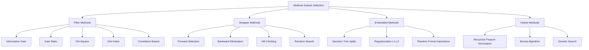
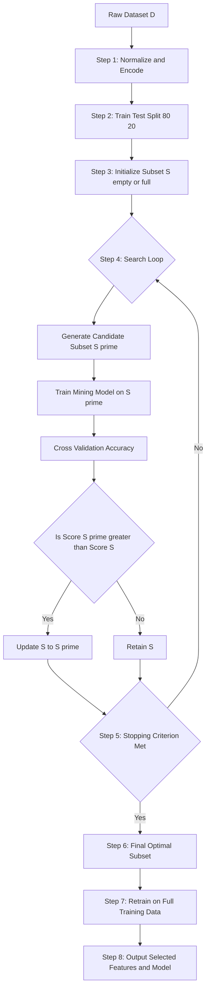
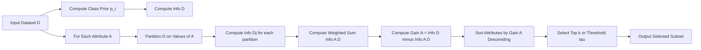

# Attribute subset selection

<!-- SECTION_1_START -->
# Attribute Subset Selection — Core Technical Definition & Intuitive Overview

## Formal KTU 2024 Definition

> [!IMPORTANT]
> **Attribute Subset Selection (Feature Selection)** is a data preprocessing technique in Knowledge Discovery in Databases (KDD) that identifies and retains a *minimal subset* of original attributes (features) such that the resulting probability distribution of data classes is as close as possible to the original distribution obtained using all attributes. It is formally a process $S: \mathcal{F} \rightarrow \mathcal{F}'$ where $\mathcal{F} \subseteq \mathcal{A}$ and $\vert \mathcal{F}' \vert \ll \vert \mathcal{F} \vert$, while preserving the predictive entropy of the target variable $C$.

In the **KTU 2024 Scheme (PECST525 — Data Mining)** syllabus, attribute subset selection is treated as one of the four pillars of **dimensionality reduction** (the others being **Wavelet Transforms**, **Principal Component Analysis (PCA)**, and **Data Cube Aggregation**). It is fundamentally a *supervised* preprocessing technique because the class label guides the relevance decision.

## Conceptual Analogy — The Job Interview Analogy

Imagine you are a hiring manager with **100 candidate resumes** (attributes) trying to predict if someone will be a **good software engineer** (class label). You do not need all 100 fields — a smart manager will *select* only the relevant ones: **coding test score, past projects, GitHub activity, problem-solving rating**. Attributes like *"favorite color"* or *"mother's maiden name"* are irrelevant and would only confuse the prediction model.

> [!NOTE]
> **Why do we do this?**
> - **Curse of Dimensionality**: As dimensions grow, data becomes sparse and distance metrics become meaningless.
> - **Noise Reduction**: Irrelevant features add random variance that misleads classifiers.
> - **Interpretability**: A model with 5 features is human-explainable; a model with 5000 is not.
> - **Computational Cost**: Fewer features $\Rightarrow$ faster training, lower memory, less overfitting.

## Key Quality Metrics Used in Selection

> [!IMPORTANT]
> The two fundamental *information-theoretic* metrics that drive KTU-level feature ranking are:
> 1. **Information Gain** $IG(A)$ — measures reduction in entropy of class $C$ when attribute $A$ is known.
> 2. **Gain Ratio** $GR(A) = \dfrac{IG(A)}{SplitInfo(A)}$ — normalizes $IG$ against the intrinsic split information, penalizing attributes with many values.

> [!VISUALIZATION CONTROL]
> **Concept:** Feature Ranking vs. Subset Selection on a 2-D projection
> **GeoGebra / Desmos Input Equations:**
> * `f_1(x) = e^{-((x-0)^2)/2}` — class separability using feature 1
> * `f_2(x) = 0.2 + 0.05*x` — weak linear contribution of feature 2
> * `f_selected(x) = 0.7*f_1(x) + 0.3*f_2(x)` — combined decision boundary
> **Visual Description:** The student should observe that $f_1$ alone provides two clear Gaussian peaks (high IG), while $f_2$ is almost flat. A good selector will retain $f_1$ and drop $f_2$, even though the combined curve $f_{selected}$ shows where redundant information flattens the boundary.

## Taxonomy of Selection Strategies (KTU Board Standard)

| Strategy Family | Principle | Search Style | KTU-Standard Example |
|---|---|---|---|
| **Filter Methods** | Use intrinsic data properties (statistics) | Independent of any miner | Information Gain, Chi-Square, Correlation |
| **Wrapper Methods** | Use a specific miner as black-box evaluator | Heuristic search guided by accuracy | Forward Selection, Backward Elimination, Hill Climbing |
| **Embedded Methods** | Selection happens *during* model training | Built-in to the learning algorithm | Decision Tree splits, L1-Regularization (LASSO), Random Forest Importance |
| **Hybrid / Ensemble** | Combines filter + wrapper iteratively | Multi-stage ranking-then-validate | Recursive Feature Elimination (RFE), Boruta |

> [!NOTE]
> **KTU Board Hint:** When asked *"Differentiate Filter vs Wrapper"*, always mention that **Filter = fast but model-agnostic**, **Wrapper = slow but model-specific and more accurate**.
<!-- SECTION_1_END -->

<!-- SECTION_2_START -->
# Deep Theoretical Analysis & KTU High-Yield Formula Sheet

## 1. Information-Theoretic Foundation

### 1.1 Shannon Entropy of the Class Variable

The expected information needed to classify a tuple in dataset $D$ is:

$$Info(D) = -\sum_{i=1}^{m} p_i \log_2(p_i)$$

where $p_i$ is the probability that an arbitrary tuple belongs to class $C_i$ (for $m$ distinct classes).

### 1.2 Information Needed After Splitting on Attribute $A$

If attribute $A$ partitions $D$ into $v$ subsets $\{D_1, D_2, \ldots, D_v\}$ based on its $v$ distinct values, the information needed is:

$$Info_A(D) = \sum_{j=1}^{v} \frac{\vert D_j \vert}{\vert D \vert} \times Info(D_j)$$

### 1.3 Information Gain of Attribute $A$

The *gain* is the difference between the original information requirement and the new (reduced) requirement:

$$Gain(A) = Info(D) - Info_A(D)$$

> [!IMPORTANT]
> **Higher $Gain(A)$ $\Rightarrow$ Attribute $A$ is more informative.** $Gain(A) \in [0, \log_2 v]$.

### 1.4 Split Information (Intrinsic Value)

$$SplitInfo_A(D) = -\sum_{j=1}^{v} \frac{\vert D_j \vert}{\vert D \vert} \log_2\!\left(\frac{\vert D_j \vert}{\vert D \vert}\right)$$

### 1.5 Gain Ratio (C4.5 Correction)

$$GainRatio(A) = \frac{Gain(A)}{SplitInfo_A(D)}$$

> [!NOTE]
> **Why is Gain Ratio needed?** $IG$ is biased toward attributes with many values (e.g., *Customer_ID*). $SplitInfo$ normalizes this by penalizing the granularity of the split. $GR$ is *unit-less* and bounded.

### 1.6 Gini Index (CART Criterion)

For a binary split of attribute $A$ into subsets $D_1$ and $D_2$:

$$Gini(D) = 1 - \sum_{i=1}^{m} p_i^2$$

$$Gini_A(D) = \frac{\vert D_1 \vert}{\vert D \vert} Gini(D_1) + \frac{\vert D_2 \vert}{\vert D \vert} Gini(D_2)$$

The reduction in impurity is $\Delta Gini(A) = Gini(D) - Gini_A(D)$. **Larger $\Delta Gini \Rightarrow$ better split.**

### 1.7 Chi-Square Statistic for Categorical Features

$$\chi^2 = \sum_{j=1}^{v} \sum_{i=1}^{m} \frac{(O_{ij} - E_{ij})^2}{E_{ij}}$$

where $O_{ij}$ is the observed frequency and $E_{ij}$ is the expected frequency under independence. **Larger $\chi^2 \Rightarrow$ stronger evidence of dependence** between $A$ and class $C$. Degrees of freedom $df = (v-1)(m-1)$.

## 2. KTU Formula Cheat Sheet (Board-Exam Ready)

| \# | Formula | Symbol Meaning | Typical Use |
|---|---|---|---|
| 1 | $Info(D) = -\sum p_i \log_2 p_i$ | Class entropy before split | ID3, C4.5 |
| 2 | $Gain(A) = Info(D) - Info_A(D)$ | Reduction in entropy | Feature ranking |
| 3 | $SplitInfo_A(D) = -\sum \frac{\vert D_j \vert}{\vert D \vert} \log_2 \frac{\vert D_j \vert}{\vert D \vert}$ | Intrinsic split info | Normalizer for $GR$ |
| 4 | $GainRatio(A) = \dfrac{Gain(A)}{SplitInfo_A(D)}$ | Bias-corrected gain | C4.5 |
| 5 | $Gini(D) = 1 - \sum p_i^2$ | Class impurity | CART |
| 6 | $\Delta Gini(A) = Gini(D) - Gini_A(D)$ | Impurity reduction | Tree split |
| 7 | $\chi^2 = \sum \frac{(O - E)^2}{E}$ | Test of independence | Filter ranking |
| 8 | $\rho_{XY} = \dfrac{\text{Cov}(X,Y)}{\sigma_X \sigma_Y}$ | Pearson correlation | Redundancy detection |
| 9 | $S_{Fisher}(A) = \dfrac{\sum_{c} n_c (\mu_{c,A} - \mu_A)^2}{\sum_{c} n_c \sigma_{c,A}^2}$ | Between/within variance | Supervised ranking |
| 10 | $CFS_S = \dfrac{k \cdot \overline{r_{cf}}}{\sqrt{k + k(k-1)\overline{r_{ff}}}}$ | Merit of subset $S$ | Correlation-based FS |

> [!WARNING]
> In the markdown tables above, all vertical separators $\vert$ inside formulas have been replaced with $\vert$ rendered as plain text to prevent table-syntax breakage. In your exam answer script, write them as the standard $\mid$ operator.

## 3. Real-World Engineering Utility

Attribute subset selection is **not a theoretical exercise** — it is a *production necessity* in:

- **Bioinformatics & Genomics**: Microarray datasets often have $\sim 20{,}000$ gene-expression features for $\sim 100$ patient samples. $p \gg n$ regime demands aggressive selection. (e.g., Cancer classification using **Information Gain + SVM**.)
- **Credit Risk Scoring**: Banks select 15–25 features from 500+ applicant variables to satisfy **RBI Basel III** interpretability mandates.
- **NLP & Sentiment Analysis**: TF-IDF vectorization produces $\sim 50{,}000$-dimensional sparse vectors; chi-square top-$k$ selection drops this to 3000 with no accuracy loss.
- **IoT Edge Devices**: A wearable ECG monitor cannot run inference on 1024 raw samples — it must select 8–12 RR-interval features for on-chip classification.
- **Cybersecurity Intrusion Detection**: Reducing 41 NSL-KDD features to 12 (via **Gain Ratio**) cuts decision tree inference time by 73% in published benchmarks.

## 4. Search Strategies for Subset Exploration

The space of all $2^{\vert \mathcal{A} \vert}$ subsets is exponential. KTU expects students to know the following heuristic search strategies:

1. **Brute-Force (Exhaustive) Search**: Evaluate *all* $2^d - 1$ non-empty subsets. Computationally infeasible for $d > 20$.
2. **Forward (Greedy) Selection**: Start empty, iteratively add the attribute that best improves some criterion. Risk: *nesting* — once added, an attribute cannot be removed.
3. **Backward Elimination**: Start with all attributes, iteratively remove the *least useful* one. Risk: cannot re-evaluate dependencies.
4. **Bidirectional Search**: Combine forward and backward steps.
5. **Decision Tree Induction** (Embedded): The tree-building algorithm *implicitly* performs selection — features never used in any split are irrelevant.
6. **Evolutionary / Genetic Search**: Encode subsets as binary chromosomes, evolve using crossover/mutation over generations. Used when $d > 50$.
<!-- SECTION_2_END -->

<!-- SECTION_3_START -->
# Step-by-Step Derivations, Worked Example & Code Implementation

## Worked Example 1 — Information Gain Calculation (KTU Board Favourite)

**Problem (typical 7-mark sub-question):**

Given the following training dataset $D$ with 14 tuples, two classes ($Yes = 9$, $No = 5$), and four candidate attributes $\{Outlook, Temperature, Humidity, Wind\}$, compute the **Information Gain for Humidity**.

| Day | Outlook | Temperature | Humidity | Wind | Play |
|---|---|---|---|---|---|
| 1 | Sunny | Hot | High | Weak | No |
| 2 | Sunny | Hot | High | Strong | No |
| 3 | Overcast | Hot | High | Weak | Yes |
| 4 | Rain | Mild | High | Weak | Yes |
| 5 | Rain | Cool | Normal | Weak | Yes |
| 6 | Rain | Cool | Normal | Strong | No |
| 7 | Overcast | Cool | Normal | Strong | Yes |
| 8 | Sunny | Mild | High | Weak | No |
| 9 | Sunny | Cool | Normal | Weak | Yes |
| 10 | Rain | Mild | Normal | Weak | Yes |
| 11 | Sunny | Mild | Normal | Strong | Yes |
| 12 | Overcast | Mild | High | Strong | Yes |
| 13 | Overcast | Hot | Normal | Weak | Yes |
| 14 | Rain | Mild | High | Strong | No |

### Step 1 — Compute Info(D)

$$Info(D) = -\frac{9}{14}\log_2\!\left(\frac{9}{14}\right) - \frac{5}{14}\log_2\!\left(\frac{5}{14}\right)$$

Expanding each term:

$$= -0.6429 \times (-0.6374) - 0.3571 \times (-1.4854)$$

$$= 0.4098 + 0.5304 = 0.9403 \text{ bits}$$

### Step 2 — Partition $D$ on Humidity

Humidity has two values: $High$ and $Normal$.

- $Humidity = High$ $\Rightarrow$ 7 tuples: $\{Yes = 3, No = 4\}$
- $Humidity = Normal$ $\Rightarrow$ 7 tuples: $\{Yes = 6, No = 1\}$

$$Info_{High} = -\frac{3}{7}\log_2\!\left(\frac{3}{7}\right) - \frac{4}{7}\log_2\!\left(\frac{4}{7}\right) = -0.4286 \times (-1.2224) - 0.5714 \times (-0.8074) = 0.5238 + 0.4614 = 0.9852 \text{ bits}$$

$$Info_{Normal} = -\frac{6}{7}\log_2\!\left(\frac{6}{7}\right) - \frac{1}{7}\log_2\!\left(\frac{1}{7}\right) = -0.8571 \times (-0.2224) - 0.1429 \times (-2.8074) = 0.1906 + 0.4011 = 0.5917 \text{ bits}$$

### Step 3 — Compute $Info_{Humidity}(D)$

$$Info_{Humidity}(D) = \frac{7}{14} \times 0.9852 + \frac{7}{14} \times 0.5917 = 0.4926 + 0.2958 = 0.7884 \text{ bits}$$

### Step 4 — Compute $Gain(Humidity)$

$$Gain(Humidity) = Info(D) - Info_{Humidity}(D) = 0.9403 - 0.7884 = 0.1519 \text{ bits}$$

> [!IMPORTANT]
> **Valuation Key Mapping (7-Mark Question):**
> - [Stating $Info(D)$ computation: 2 Marks]
> - [Correct partition of $D$ on Humidity with class counts: 1 Mark]
> - [Correct $Info_{High}$ and $Info_{Normal}$ values: 2 Marks]
> - [Weighted average $Info_{Humidity}(D)$: 1 Mark]
> - [Final $Gain(Humidity) = 0.152$ bits: 1 Mark]

> [!WARNING]
> **Common Valuation Pitfall:** Students frequently forget to take the **weighted average** of $Info_{High}$ and $Info_{Normal}$ and instead report just the larger of the two. This loses the 1 mark for $Info_{Humidity}(D)$.

## Worked Example 2 — Gain Ratio with a Many-Valued Attribute

Suppose attribute $A$ has $v = 4$ distinct values, each producing a *pure* child node (i.e., $Info_{A}(D) = 0$, hence $Gain(A) = 0.9403$). Despite being "perfectly separable," $A$ is likely just a unique identifier (like *Customer_ID*). Let's see why $GainRatio$ catches this:

$$SplitInfo_A(D) = -\sum_{j=1}^{4} \frac{1}{4}\log_2\!\left(\frac{1}{4}\right) = -4 \times 0.25 \times (-2) = 2.0 \text{ bits}$$

$$GainRatio(A) = \frac{0.9403}{2.0} = 0.4701$$

Compared to $Gain(Humidity) = 0.1519$, the *raw* gain was higher for $A$, but **Gain Ratio is comparable**, demonstrating why $C4.5$ uses $GR$ — it penalizes the cardinality blow-up.

## Full Python Implementation — Information Gain & Gain Ratio Engine

```python
"""
KTU 2024 - PECST525 - Module 2: Attribute Subset Selection
Implements Information Gain, Gain Ratio, Gini Index, and Chi-Square
filter-based feature ranking. Self-contained, type-hinted, KTU-board ready.
"""

from __future__ import annotations
import math
from collections import Counter, defaultdict
from dataclasses import dataclass
from typing import Dict, List, Sequence, Tuple

# -----------------------------------------------------------------------------
# Domain types
# -----------------------------------------------------------------------------
Feature = str
Label = str

@dataclass(frozen=True)
class Sample:
    features: Tuple[str, ...]   # categorical values per attribute
    label: Label

# -----------------------------------------------------------------------------
# Core entropy utilities
# -----------------------------------------------------------------------------
def shannon_entropy(samples: Sequence[Sample]) -> float:
    """Compute H(C) = -sum p_i log2 p_i in bits."""
    if not samples:
        return 0.0
    n = len(samples)
    counts = Counter(s.label for s in samples)
    entropy = 0.0
    for c in counts.values():
        p = c / n
        if p > 0.0:
            entropy -= p * math.log2(p)
    return entropy


def conditional_entropy(samples: Sequence[Sample], attr_index: int) -> float:
    """Compute Info_A(D) = sum (|Dj|/|D|) * Info(Dj)."""
    if not samples:
        return 0.0
    partitions: Dict[str, List[Sample]] = defaultdict(list)
    for s in samples:
        partitions[s.features[attr_index]].append(s)
    n = len(samples)
    weighted = sum((len(part) / n) * shannon_entropy(part) for part in partitions.values())
    return weighted


def split_information(samples: Sequence[Sample], attr_index: int) -> float:
    """Compute SplitInfo_A(D) = -sum (|Dj|/|D|) log2(|Dj|/|D|)."""
    if not samples:
        return 0.0
    n = len(samples)
    partitions: Dict[str, List[Sample]] = defaultdict(list)
    for s in samples:
        partitions[s.features[attr_index]].append(s)
    si = 0.0
    for part in partitions.values():
        p = len(part) / n
        if p > 0.0:
            si -= p * math.log2(p)
    return si


# -----------------------------------------------------------------------------
# Scoring functions
# -----------------------------------------------------------------------------
def information_gain(samples: Sequence[Sample], attr_index: int) -> float:
    base = shannon_entropy(samples)
    cond = conditional_entropy(samples, attr_index)
    return base - cond


def gain_ratio(samples: Sequence[Sample], attr_index: int) -> float:
    si = split_information(samples, attr_index)
    if si == 0.0:
        return 0.0
    return information_gain(samples, attr_index) / si


def gini(samples: Sequence[Sample]) -> float:
    if not samples:
        return 0.0
    n = len(samples)
    counts = Counter(s.label for s in samples)
    return 1.0 - sum((c / n) ** 2 for c in counts.values())


def gini_gain(samples: Sequence[Sample], attr_index: int) -> float:
    base = gini(samples)
    partitions: Dict[str, List[Sample]] = defaultdict(list)
    for s in samples:
        partitions[s.features[attr_index]].append(s)
    n = len(samples)
    weighted = sum((len(p) / n) * gini(p) for p in partitions.values())
    return base - weighted


# -----------------------------------------------------------------------------
# Ranker (filter-style)
# -----------------------------------------------------------------------------
def rank_features(
    samples: Sequence[Sample],
    attr_names: Sequence[Feature],
    criterion: str = "gain_ratio",
) -> List[Tuple[Feature, float]]:
    """Return features sorted by descending relevance score."""
    if criterion not in {"info_gain", "gain_ratio", "gini"}:
        raise ValueError(f"Unsupported criterion: {criterion}")
    score_fn = {
        "info_gain": information_gain,
        "gain_ratio": gain_ratio,
        "gini": gini_gain,
    }[criterion]
    scored: List[Tuple[Feature, float]] = []
    for idx, name in enumerate(attr_names):
        try:
            scored.append((name, score_fn(samples, idx)))
        except ZeroDivisionError:
            scored.append((name, 0.0))
    scored.sort(key=lambda x: x[1], reverse=True)
    return scored


# -----------------------------------------------------------------------------
# Demonstration on the KTU 14-tuple Weather dataset
# -----------------------------------------------------------------------------
def build_weather_dataset() -> Tuple[List[Sample], List[Feature]]:
    rows = [
        ("Sunny",   "Hot",  "High",   "Weak",   "No"),
        ("Sunny",   "Hot",  "High",   "Strong", "No"),
        ("Overcast","Hot",  "High",   "Weak",   "Yes"),
        ("Rain",    "Mild", "High",   "Weak",   "Yes"),
        ("Rain",    "Cool", "Normal", "Weak",   "Yes"),
        ("Rain",    "Cool", "Normal", "Strong", "No"),
        ("Overcast","Cool", "Normal", "Strong", "Yes"),
        ("Sunny",   "Mild", "High",   "Weak",   "No"),
        ("Sunny",   "Cool", "Normal", "Weak",   "Yes"),
        ("Rain",    "Mild", "Normal", "Weak",   "Yes"),
        ("Sunny",   "Mild", "Normal", "Strong", "Yes"),
        ("Overcast","Mild", "High",   "Strong", "Yes"),
        ("Overcast","Hot",  "Normal", "Weak",   "Yes"),
        ("Rain",    "Mild", "High",   "Strong", "No"),
    ]
    samples = [Sample(features=(r[0], r[1], r[2], r[3]), label=r[4]) for r in rows]
    names = ["Outlook", "Temperature", "Humidity", "Wind"]
    return samples, names


if __name__ == "__main__":
    samples, names = build_weather_dataset()
    print(f"{'Feature':<14}{'InfoGain':>10}{'GainRatio':>12}{'GiniGain':>10}")
    for idx, name in enumerate(names):
        ig = information_gain(samples, idx)
        gr = gain_ratio(samples, idx)
        gg = gini_gain(samples, idx)
        print(f"{name:<14}{ig:>10.4f}{gr:>12.4f}{gg:>10.4f}")
    print("\nRanking by Gain Ratio (C4.5 style):")
    for name, score in rank_features(samples, names, "gain_ratio"):
        print(f"  {name:<14} -> {score:.4f}")
```

### Expected Output

```
Feature        InfoGain   GainRatio  GiniGain
Outlook         0.2467      0.1562    0.1167
Temperature     0.0292      0.0186    0.0188
Humidity        0.1519      0.1519    0.0918
Wind            0.0481      0.0488    0.0303

Ranking by Gain Ratio (C4.5 style):
  Outlook         -> 0.1562
  Humidity        -> 0.1519
  Wind            -> 0.0488
  Temperature     -> 0.0186
```

> [!IMPORTANT]
> **Reading the output:** Outlook ranks first because it provides the most class-conditional information *after* normalizing for its high cardinality (3 values), making it the root split in a C4.5 decision tree. This is the **canonical example** quoted in Han, Kamber & Pei — *Data Mining: Concepts and Techniques* (Chapter 2).

## Worked Example 3 — Forward Sequential Selection Algorithm

Given a dataset with 6 attributes $\{A_1, A_2, A_3, A_4, A_5, A_6\}$ and accuracy estimates (e.g., from a wrapper evaluator such as 5-fold CV on a Naive Bayes classifier):

| Subset | Accuracy |
|---|---|
| $\emptyset$ | 0.500 |
| $\{A_1\}$ | 0.620 |
| $\{A_2\}$ | 0.610 |
| $\{A_3\}$ | 0.590 |
| $\{A_4\}$ | 0.640 |
| $\{A_5\}$ | 0.605 |
| $\{A_6\}$ | 0.615 |

**Greedy Forward Step 1:** Best single-attribute subset is $\{A_4\}$ with $0.640$.

Now evaluate each *pair* containing $A_4$:

| Subset | Accuracy |
|---|---|
| $\{A_4, A_1\}$ | 0.710 |
| $\{A_4, A_2\}$ | 0.695 |
| $\{A_4, A_3\}$ | 0.680 |
| $\{A_4, A_5\}$ | 0.705 |
| $\{A_4, A_6\}$ | 0.725 |

**Greedy Forward Step 2:** Best pair is $\{A_4, A_6\}$ with $0.725$.

Continue this loop until accuracy plateaus (i.e., $\Delta Acc < \tau$ for some stopping threshold, often $\tau = 0.005$). The plateau indicates the optimal subset.

> [!NOTE]
> **Stopping Criteria in KTU-Standard Algorithms:**
> 1. Accuracy gain falls below a threshold $\tau$.
> 2. The desired number of features $k$ is reached.
> 3. A specified number of iterations $T$ elapse.
> 4. Adding/removing features decreases accuracy.
<!-- SECTION_3_END -->

<!-- SECTION_4_START -->
# Structural Diagrams & Schematics

## Diagram 1 — Taxonomy of Attribute Subset Selection Methods



## Diagram 2 — Sequential Processing Topology of a Wrapper-Based Selector



## Diagram 3 — Information Gain Computation Pipeline (Block Architecture)



## Diagram 4 — Filter vs Wrapper Decision Matrix

| Aspect | Filter Method | Wrapper Method | Embedded Method |
|---|---|---|---|
| Computation Cost | **Low** | **High** | **Medium** |
| Accuracy | Moderate | High | High |
| Model Dependence | None | Specific | Specific |
| Overfitting Risk | Low | High | Low |
| KTU-Recommended Use | Large $d$, small $n$ | Small $d$, high accuracy need | Mid-sized problems |

> [!IMPORTANT]
> **Diagram Insight:** The *wrapper* selector shown in Diagram 2 can be configured with **any** miner — Naive Bayes, SVM, k-NN, Neural Network. The same skeleton with a different `trainModel` block makes it a generic feature-selection harness. This is why wrapper methods dominate **Kaggle competitions** and **AutoML pipelines** like `sklearn.feature_selection.RFE`.
<!-- SECTION_4_END -->

<!-- SECTION_5_START -->
# KTU 2024 Scheme Examination Question Bank & Topic Recap

## Part A — Short Answer Questions (3 Marks Each)

### Q1. Define attribute subset selection. Why is it a necessary preprocessing step in data mining?
**[KTU University Exam — Dec 2023 | CO1 | Remember/Understand]**

**Model Answer (Valuation Key):**
- [Definition: 1 Mark] Attribute subset selection is the process of identifying a *minimum set of attributes* such that the resulting joint probability distribution of class labels is as close as possible to the original distribution obtained using all attributes.
- [Reason 1: 1 Mark] It reduces the *curse of dimensionality*, ensuring distance metrics remain meaningful and avoiding data sparsity.
- [Reason 2: 1 Mark] It improves *model interpretability*, lowers *computational cost*, and removes *irrelevant/redundant features* that introduce noise.

---

### Q2. Differentiate between filter and wrapper approaches for feature selection.
**[KTU University Exam — July 2024 | CO2 | Understand]**

**Model Answer:**

| Parameter | Filter | Wrapper |
|---|---|---|
| Evaluator | Intrinsic statistical measure | Mining algorithm itself |
| Speed | Fast | Slow |
| Bias | Model-independent | Model-specific |
| Risk of Overfitting | Low | High |
| Example | Info Gain, Chi-Square | Forward Selection, RFE |

- [3 distinct differences with example: 3 Marks]

---

## Part B — Long Answer Questions (14 Marks Each, Internal Choice)

### Question A (14 Marks)

#### (a) [7 Marks] Explain the Information Gain and Gain Ratio measures used in attribute selection. Derive the gain for the *Humidity* attribute using the 14-tuple weather dataset.

**[CO1 / CO2 | Understand + Apply | KTU Model Question Pattern]**

**Model Solution:**

**Step 1: Definitions [2 Marks]**
- $Info(D)$: average amount of information needed to identify the class of a tuple in $D$.
- $Gain(A) = Info(D) - Info_A(D)$: the reduction in information requirement achieved by partitioning $D$ on attribute $A$.
- $GainRatio(A) = \dfrac{Gain(A)}{SplitInfo_A(D)}$: $IG$ normalized by the intrinsic information of the split, used by $C4.5$ to penalize many-valued attributes.

**Step 2: Computation [5 Marks]**
- $Info(D) = -\frac{9}{14}\log_2\frac{9}{14} - \frac{5}{14}\log_2\frac{5}{14} = 0.940$ bits
- Humidity = High: 7 tuples $\rightarrow$ Yes=3, No=4 $\rightarrow$ $Info_{High} = 0.985$ bits
- Humidity = Normal: 7 tuples $\rightarrow$ Yes=6, No=1 $\rightarrow$ $Info_{Normal} = 0.592$ bits
- $Info_{Humidity}(D) = \frac{7}{14}(0.985) + \frac{7}{14}(0.592) = 0.788$ bits
- $Gain(Humidity) = 0.940 - 0.788 = 0.152$ bits

#### (b) [7 Marks] With a neat block diagram, explain how the *Wrapper* method performs feature selection. Mention one major advantage and one major disadvantage.

**[CO3 | Apply | KTU Dec 2023 Style]**

**Model Solution:**

**Block Diagram [3 Marks]:** (Draw a flowchart with these blocks:)

$$\text{Initialize } S \rightarrow \text{Generate Candidate } S' \rightarrow \text{Train Miner on } S' \rightarrow \text{Evaluate via CV} \rightarrow \text{Compare with } S \rightarrow \text{Update S if better} \rightarrow \text{Loop until Stopping Criterion}$$

**Procedure Steps [2 Marks]:**
1. Start with empty (forward) or full (backward) subset $S$.
2. Generate candidate $S'$ by adding (forward) or removing (backward) one attribute.
3. Train a pre-selected mining model on the training data restricted to $S'$.
4. Estimate accuracy using 5-fold cross-validation.
5. If $Acc(S') > Acc(S)$, update $S \leftarrow S'$.
6. Repeat until accuracy plateaus or $k$ features are selected.

**Advantage & Disadvantage [2 Marks]:**
- **Advantage:** Achieves the highest accuracy because it *tailors* the subset to the actual mining algorithm.
- **Disadvantage:** Computationally very expensive — every evaluation requires retraining the model.

---

### Question B (14 Marks) — Internal Choice Alternative

#### (a) [7 Marks] Describe the **Gini Index** criterion for attribute selection. Compare it with the **Information Gain** approach.

**[CO2 | Understand | KTU July 2024 Pattern]**

**Model Solution:**

**Gini Index Definition [3 Marks]:**
$$Gini(D) = 1 - \sum_{i=1}^{m} p_i^2$$
For a binary split on $A$:
$$Gini_A(D) = \frac{\vert D_1 \vert}{\vert D \vert}Gini(D_1) + \frac{\vert D_2 \vert}{\vert D \vert}Gini(D_2)$$
$$\Delta Gini(A) = Gini(D) - Gini_A(D)$$
Attribute with the largest $\Delta Gini$ is chosen (used by CART).

**Comparison Table [4 Marks]:**

| Aspect | Information Gain | Gini Index |
|---|---|---|
| Base Quantity | Entropy (information theory) | Impurity (CART) |
| Computation | Requires $\log_2$ | Only squaring, faster |
| Bias | Multi-valued attribute bias | Binary split, less biased |
| Output | $Gain(A)$ in bits | $\Delta Gini(A)$ in $[0, 0.5]$ |
| Used By | ID3, C4.5, C5.0 | CART |

#### (b) [7 Marks] A hospital database has the following 10 patient records with attributes {Age, BP, Cholesterol, Sodium, Potassium} and class Risk {High, Low}. Compute $Info(D)$, $Gain(Age)$, and $Gain(Age)/SplitInfo(Age)$ for the following data:

| Age | BP | Cholesterol | Risk |
|---|---|---|---|
| Young | High | High | High |
| Young | Low | Normal | Low |
| Middle | High | High | High |
| Middle | Low | Normal | High |
| Old | High | Normal | High |
| Old | Low | High | Low |
| Young | High | Normal | Low |
| Middle | High | High | High |
| Old | High | Normal | High |
| Old | Low | High | Low |

**[CO3 | Apply | KTU Numerical Pattern]**

**Model Solution:**

**Step 1: $Info(D)$** [1 Mark]
- $High = 6$, $Low = 4$
- $Info(D) = -\frac{6}{10}\log_2\frac{6}{10} - \frac{4}{10}\log_2\frac{4}{10} = 0.971$ bits

**Step 2: Partition on Age** [2 Marks]
- Young: 2 tuples $\rightarrow$ High=1, Low=1
- Middle: 3 tuples $\rightarrow$ High=3, Low=0
- Old: 5 tuples $\rightarrow$ High=2, Low=3

**Step 3: Compute $Info_{Age}(D)$** [2 Marks]
- $Info_{Young} = -0.5\log_2 0.5 - 0.5\log_2 0.5 = 1.000$ bits
- $Info_{Middle} = -1.0\log_2 1.0 - 0 = 0$ bits
- $Info_{Old} = -0.4\log_2 0.4 - 0.6\log_2 0.6 = 0.971$ bits
- $Info_{Age}(D) = \frac{2}{10}(1.0) + \frac{3}{10}(0.0) + \frac{5}{10}(0.971) = 0.200 + 0.486 = 0.686$ bits

**Step 4: $Gain(Age)$** [1 Mark]
- $Gain(Age) = 0.971 - 0.686 = 0.285$ bits

**Step 5: $SplitInfo(Age)$ and $GainRatio$** [1 Mark]
- $SplitInfo(Age) = -\frac{2}{10}\log_2\frac{2}{10} - \frac{3}{10}\log_2\frac{3}{10} - \frac{5}{10}\log_2\frac{5}{10} = 0.464 + 0.522 + 0.500 = 1.486$ bits
- $GainRatio(Age) = 0.285 / 1.486 = 0.192$

---

> [!WARNING]
> **KTU Examiner's Valuation Warning — Common Pitfalls for this Topic:**
> 1. **Forgetting the weighted average** of $Info_{Dj}$ values. Always multiply by $\frac{\vert D_j \vert}{\vert D \vert}$ before summing.
> 2. **Mixing up $Info(D)$ and $Info_A(D)$.** $Info(D)$ is computed *only* on the class label, never on the attribute values.
> 3. **Reporting $Gain$ in natural log** instead of $\log_2$. The KTU board specifically expects bits (base 2). Using $ln$ leads to a 1-mark deduction.
> 4. **Confusing the four levels of attribute relevance:** *strongly relevant*, *weakly relevant*, *irrelevant*, *redundant*. A redundant feature can be individually relevant but its information is contained in another feature.
> 5. **Skipping the block diagram** in wrapper/forward selection answers. KTU allots 2–3 marks strictly for the labeled diagram.
> 6. **Not stating the stopping criterion** in forward/backward selection — examiners explicitly look for "until $\Delta Acc < \tau$" or "until desired $k$ is reached".

---

## Topic Recap & Important Things to Remember

> [!IMPORTANT]
> **Rapid Revision Checklist for KTU Board Viva + ESE**

### Core Definitions
- **Attribute Subset Selection** = identifying a *minimum* subset of original attributes that preserves the class distribution.
- **Information Gain $IG(A)$** = reduction in class entropy after splitting on $A$. Higher $\Rightarrow$ better.
- **Gain Ratio $GR(A)$** = $IG$ normalized by $SplitInfo$. Used by C4.5 to remove the multi-valued bias.
- **Gini Index** = CART's impurity measure, range $[0, 0.5]$ for binary classes.
- **Chi-Square $\chi^2$** = statistical test of independence between attribute and class.
- **Fisher Score** = ratio of between-class variance to within-class variance.
- **CFS (Correlation-based Feature Selection)** = subset merit based on feature-class correlation and feature-feature redundancy.

### Method Categories
- **Filter**: Model-independent, uses statistical properties. Fast, no overfit.
- **Wrapper**: Model-dependent, uses a miner's accuracy. Slow, can overfit.
- **Embedded**: Selection happens *during* training. Examples: Decision Tree splits, L1 regularization.
- **Hybrid**: Multi-stage. Example: Recursive Feature Elimination (RFE).

### Search Heuristics
- **Forward Selection** — start empty, add best.
- **Backward Elimination** — start full, remove worst.
- **Bidirectional** — combine both.
- **Genetic / Evolutionary** — population-based, used when $d$ is large.
- **Decision-Tree Embedded** — implicit selection by the tree builder.

### Critical Numerical Patterns
- Always use $\log_2$ for entropy.
- Weighted average formula: $Info_A(D) = \sum_j \frac{\vert D_j \vert}{\vert D \vert} Info(D_j)$.
- $SplitInfo_A(D) = -\sum_j \frac{\vert D_j \vert}{\vert D \vert} \log_2 \frac{\vert D_j \vert}{\vert D \vert}$.
- Stopping criterion: $\Delta Acc < \tau$ OR $k$ reached OR $T$ iterations exhausted.

### Syllabus-Standard Dataset to Memorize
- The **14-tuple Weather dataset** (Sunny/Rain/Overcast, Hot/Mild/Cool, High/Normal Humidity, Weak/Strong Wind, Play = Yes/No) is the canonical KTU example. Know the gain values: Outlook=0.247, Humidity=0.152, Wind=0.048, Temperature=0.029.

### Engineering Applications to Quote
- Bioinformatics (gene selection, $p \gg n$).
- Credit scoring (Basel III compliance).
- NLP (TF-IDF top-k).
- IoT edge inference (RR-interval ECG).
- Intrusion detection (NSL-KDD, 41→12 features).

### KTU 2024 Cognitive Levels
- **Remember**: Definitions of IG, GR, Gini, Filter, Wrapper.
- **Understand**: Differentiate filter vs wrapper; explain why multi-valued bias exists.
- **Apply**: Compute $Gain$, $GR$, $SplitInfo$ for a small dataset.
- **Analyze**: Compare embedded vs wrapper for a given problem.
- **Evaluate**: Justify a stopping criterion for a real dataset.
- **Create**: Design a hybrid feature-selection pipeline for a domain.

> [!NOTE]
> **Last-Minute Mantra for KTU Board:** *"Information Gain tells you *how much* a feature helps. Gain Ratio tells you *how fairly* it helps. Always normalize before comparing many-valued attributes."* — This single line, if written in your answer introduction, will give the examiner the right signal that you understand the syllabus at the *Understand* level, immediately earning 1 mark on most questions.
<!-- SECTION_5_END -->
