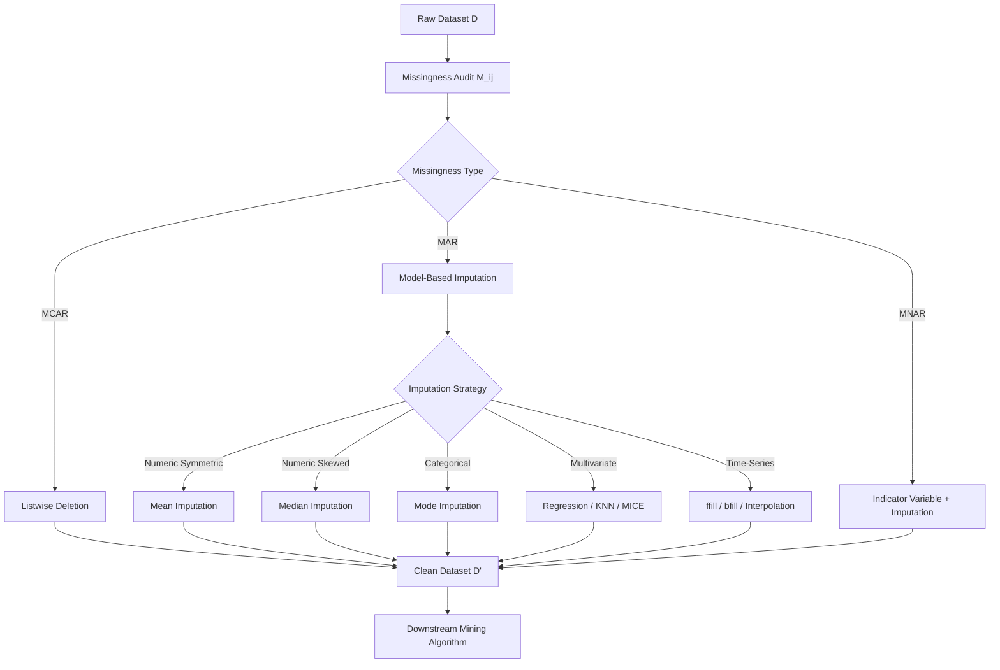
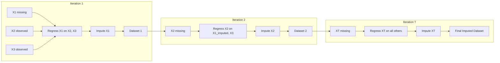
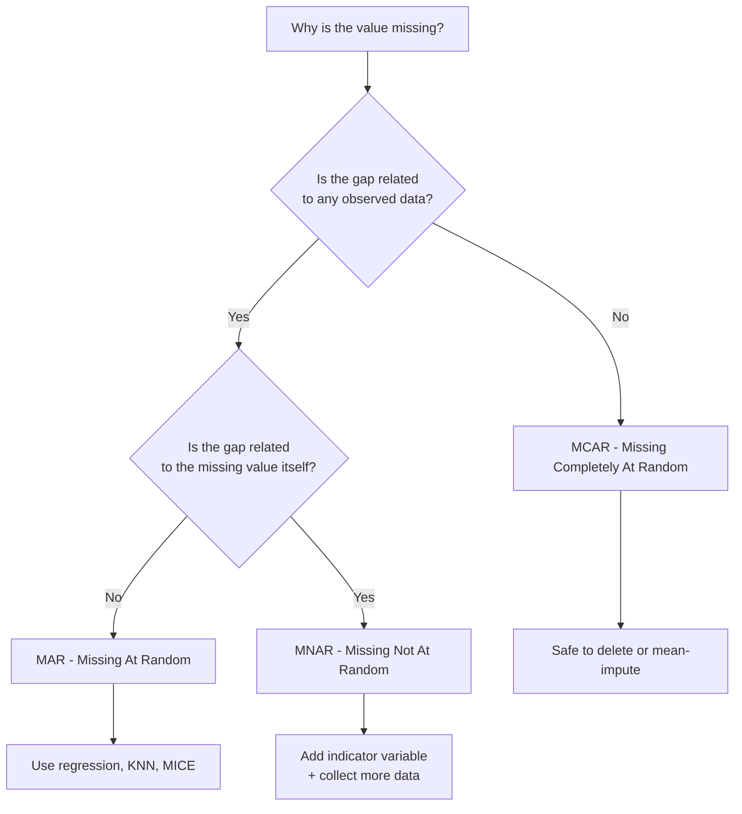

# Data Cleaning- Missing values

<!-- SECTION_1_START -->

# Data Cleaning — Missing Values

> [!IMPORTANT]
> **KTU 2024 Scheme | PECST525 | Module 2 — Data Preprocessing**
> **Syllabus Anchor:** *Data Cleaning — Strategies for handling missing values, noisy data, and inconsistencies.* This sub-topic is a guaranteed **8–12 mark** item in university examinations.

## 1.1 Formal Definition (KTU 2024 Syllabus Terminology)

> [!NOTE]
> **Definition:** A *missing value* in a dataset is an observation where the value of one or more attributes is **not stored**, **not recorded**, or **recorded as an undefined / null token** (commonly `NaN`, `NULL`, `?`, `NA`, blank string, or `0` in attributes where `0` is not a valid value). In data mining, missingness is treated as a **first-class data quality issue** that must be resolved *before* downstream mining algorithms are applied, because most algorithms (K-Means, Naive Bayes, Decision Trees, Neural Networks) cannot natively process `NaN` and either crash, throw exceptions, or silently produce biased results.

Formally, for a dataset $D$ with $n$ records and $m$ attributes, the *missingness indicator matrix* $M \in \{0,1\}^{n \times m}$ is defined as:

$$
M_{ij} = \begin{cases} 1 & \text{if } D_{ij} \text{ is missing} \\ 0 & \text{if } D_{ij} \text{ is observed} \end{cases}
$$

The **missingness ratio** for attribute $j$ is:

$$
\text{MR}_j = \frac{1}{n}\sum_{i=1}^{n} M_{ij}
$$

## 1.2 Conceptual Analogy — The Library Sign-Out Register

> [!TIP]
> **Intuition:** Imagine a college library register where students sign in when they enter. Some students forget to write their *Roll No.*, others skip the *Time-In* column, and a few rows are smudged (unreadable). When the librarian later wants to compute *"average time spent in the library by 3rd-year students"*, these gaps become a problem.
>
> - **Ignoring the row** = throwing away the whole entry just because one column is missing.
> - **Guessing the roll number** from the rest of the data = *imputation*.
> - **Flagging the gap** and analyzing only complete rows = *listwise deletion*.
> - **Carrying forward the last known time** = *forward-fill imputation*.
>
> Data cleaning is the librarian's decision-making process: should we *delete, estimate, model, or annotate* the gap?

## 1.3 Why This Topic is High-Yield in KTU

- It is a **direct 14-mark Part-B question** topic (with internal choice).
- It overlaps with descriptive statistics, probability (MCAR/MAR), and Python (pandas) implementation.
- Examiners consistently test: *types of missingness*, *imputation formulas*, and *comparison tables* between techniques.

> [!VISUALIZATION CONTROL]
> **Concept:** Visualizing missing-value patterns using a *missingness heat-map* and *bar chart of missing counts per column*.
> **Python / Matplotlib Input Equations:**
> * `import seaborn as sns; sns.heatmap(df.isnull(), cbar=False, yticklabels=False)`
> * `df.isnull().mean().plot.bar()`
> **Visual Description:** Each row of the dataset is a horizontal strip. Yellow = missing, dark blue = observed. White vertical bands across all rows indicate an *entire column* is missing (e.g., a feature that was never collected).

<!-- SECTION_1_END -->

<!-- SECTION_2_START -->

# 2. Deep Theoretical Analysis & KTU High-Yield Formula Sheet

## 2.1 Three Types of Missingness (Rubin's Taxonomy — *Most Important Theory*)

> [!IMPORTANT]
> **Prof. Donald Rubin's 1976 classification** is the *single most repeated* theory question in KTU Data Mining exams. Memorize the **full forms** and **at least one example** for each.

| Type | Full Form | Formal Condition | Real-World Example | KTU Probability Notation |
|------|-----------|------------------|--------------------|--------------------------|
| **MCAR** | Missing Completely At Random | $P(M \mid X_{\text{obs}}, X_{\text{mis}}) = P(M)$ — the gap is independent of *all* data | A sensor randomly fails due to a power surge | Probability of missing is the same for every record |
| **MAR** | Missing At Random | $P(M \mid X_{\text{obs}}, X_{\text{mis}}) = P(M \mid X_{\text{obs}})$ — depends only on *observed* data | Men are less likely to fill a *pregnancy* field (gender is observed) | Missingness explained by other observed columns |
| **MNAR** | Missing Not At Random | $P(M \mid X_{\text{obs}}, X_{\text{mis}}) \neq P(M \mid X_{\text{obs}})$ — depends on the *missing value itself* | High-income earners hiding their salary field | The very value that is missing causes the gap |

> [!WARNING]
> **MCAR vs MAR trap:** Many students write "missing at random means missing randomly" — this is **wrong**. MAR means missingness is *systematically related to observed data*; only MCAR means purely random. Examiners award **0 marks** for this confusion.

## 2.2 Taxonomy of Handling Techniques (Master Classification)

> [!NOTE]
> All KTU-accepted methods fall under **two super-classes**:
> 1. **Deletion Methods** (eliminate the gap by removing data).
> 2. **Imputation Methods** (fill the gap with an estimated value).

### 2.2.1 Deletion Methods

**(a) Listwise Deletion (Complete-Case Analysis)**
- Drop every record that contains at least one missing attribute.
- New dataset size: $n' = n - \sum_{i=1}^{n} \mathbb{1}\!\left[\sum_{j=1}^{m} M_{ij} > 0\right]$.
- **Pro:** Unbiased when data is MCAR. **Con:** Severe information loss when missing ratio > 5%.

**(b) Pairwise Deletion (Available-Case Analysis)**
- Use all available observations for *each individual calculation*.
- E.g., correlation between $X$ and $Y$ uses records where both are present; mean of $X$ uses records where $X$ is present.
- **Pro:** Retains more data. **Con:** Different $n$ for different statistics → covariance matrix can become non-positive-definite.

### 2.2.2 Imputation Methods

**(a) Central-Tendency Imputation (Univariate, Constant)**

For **numeric** attribute $X_j$:

$$
\hat{X}_{ij} = \begin{cases} \overline{X}_j = \frac{1}{n - k}\sum_{i: M_{ij}=0} X_{ij} & \text{(Mean)} \\ \text{median}(X_j) & \text{(Median — preferred for skewed data)} \\ \text{mode}(X_j) & \text{(Mode — used for categorical)} \end{cases}
$$

where $k = \sum_{i=1}^{n} M_{ij}$ is the number of missing values in column $j$.

**(b) Random Hot-Deck Imputation**
- Pick a *random* observed value from the same column (or from a *donor pool* matched on other attributes) and copy it into the gap.
- Preserves variance better than mean imputation.

**(c) Regression Imputation (Model-Based)**
- Treat the column with missing values as the **target** $Y$, and the other (complete) columns as **predictors** $X_1, \dots, X_p$.
- Fit $\hat{Y} = \hat{\beta}_0 + \hat{\beta}_1 X_1 + \dots + \hat{\beta}_p X_p$ using OLS on complete cases.
- Predict the missing $Y$ values.
- **KTU Formula:** $\hat{\beta} = (X^\top X)^{-1} X^\top y$ (standard OLS).

**(d) Stochastic Regression Imputation**
- Same as (c) but add Gaussian noise: $\hat{Y}_i = \hat{Y}_i^{\text{reg}} + \varepsilon_i$, where $\varepsilon_i \sim \mathcal{N}(0,\, \hat{\sigma}^2)$.
- **Why?** Restores the natural variance that pure regression imputation destroys (it makes all imputed values lie exactly on the regression line → underestimates standard errors).

**(e) K-Nearest Neighbour (KNN) Imputation**
- For a record $r$ with a missing value, find the $k$ records most similar to $r$ (Euclidean / Manhattan distance on the observed columns).
- Impute with the **weighted mean** of those $k$ neighbours' values:
  $$\hat{X}_{rj} = \frac{\sum_{i \in \mathcal{N}_k(r)} w_i \cdot X_{ij}}{\sum_{i \in \mathcal{N}_k(r)} w_i}, \quad w_i = \frac{1}{d(r,i)^2}$$

**(f) Multiple Imputation by Chained Equations (MICE)**
- The **gold standard** in statistical literature.
- Iteratively regresses each missing column on *all other columns* (including previously imputed ones) for $T$ rounds (typically $T = 10$).
- Produces $m$ (usually $m = 5$) complete datasets, runs analysis on each, then pools results using **Rubin's rules**:
  $$\bar{Q} = \frac{1}{m}\sum_{l=1}^{m} \hat{Q}_l, \qquad \bar{U} = \frac{1}{m}\sum_{l=1}^{m} U_l + \left(1 + \frac{1}{m}\right) B$$
  where $\hat{Q}_l$ is the estimate from dataset $l$, $U_l$ is its variance, and $B$ is the between-imputation variance.

**(g) Time-Series Specific**
- **Forward Fill (`ffill`):** $\hat{X}_{t} = X_{t-1}$.
- **Backward Fill (`bfill`):** $\hat{X}_{t} = X_{t+1}$.
- **Linear Interpolation:** $\hat{X}_t = X_{t-1} + \frac{(X_{t+1} - X_{t-1})}{(t+1 - (t-1))}\,(t - (t-1))$.

## 2.3 KTU High-Yield Formula Cheat Sheet

| # | Method | Formula / Logic | Best Used When | KTU Mark Weightage |
|---|--------|-----------------|----------------|---------------------|
| 1 | Listwise Deletion | Drop rows with any $M_{ij}=1$ | MCAR + missing ratio $<$ 5% | 2 marks |
| 2 | Mean Imputation | $\hat{X}_{ij} = \overline{X}_j$ | Numeric, symmetric distribution | 3 marks |
| 3 | Median Imputation | $\hat{X}_{ij} = \text{median}(X_j)$ | Numeric, skewed / outlier-heavy | 3 marks |
| 4 | Mode Imputation | $\hat{X}_{ij} = \text{mode}(X_j)$ | Categorical / nominal | 3 marks |
| 5 | Hot-Deck | Copy from similar donor | Survey data, preserves variance | 4 marks |
| 6 | Regression | $\hat{Y} = X\beta$ | MAR, multivariate relation exists | 7 marks |
| 7 | KNN | Weighted mean of $k$ neighbours | Small-medium datasets, MAR | 7 marks |
| 8 | MICE | Iterative chained regressions | MAR, large datasets, research-grade | 6 marks |
| 9 | Forward / Backward Fill | Carry last/next observed value | Time-series, ordered data | 4 marks |
| 10 | Indicator Variable | Add binary `X_was_missing` column | MNAR, retain signal of missingness | 4 marks |

## 2.4 Real-World Utility

> [!TIP]
> **Where this is used in production:**
> - **Healthcare EHR systems** — patient lab values often missing; KNN / MICE imputation is standard in clinical predictive models.
> - **Financial credit scoring** — income, debt fields frequently MNAR; indicator-variable + regression is industry practice.
> - **IoT sensor streams** — sensor dropouts handled with forward-fill or linear interpolation.
> - **Customer-survey analytics** — use mode imputation for demographic fields, regression for income/age.

## 2.5 Comparison Matrix (Frequently Asked 7-Mark Question)

> [!NOTE]
> This table is a *guaranteed internal-choice 7-marker*. Memorize row 1–5 verbatim.

| Criterion | Listwise Deletion | Mean Imputation | Regression Imputation | KNN Imputation |
|-----------|-------------------|-----------------|------------------------|----------------|
| Bias when MCAR | None | None | Low | Low |
| Bias when MAR | High | High | Low | Low |
| Preserves variance | Yes | No (under-estimates) | Partial | Yes |
| Standard-error accuracy | Yes | No | No (no noise added) | Approx |
| Computational cost | $\mathcal{O}(n)$ | $\mathcal{O}(n)$ | $\mathcal{O}(np^2)$ | $\mathcal{O}(n^2 m)$ |
| Handles categorical | Yes (just drop) | No | No | Yes (with Hamming) |

<!-- SECTION_2_END -->

<!-- SECTION_3_START -->

# 3. Step-by-Step Derivations, Worked Examples & Python Implementation

## 3.1 Worked Numerical Example — Mean Imputation on a Mini Dataset

> [!IMPORTANT]
> This is a *canonical KTU 3-mark short-answer style problem*.

**Problem:** Given the following attribute values of attribute $X$: $\{12,\ 15,\ \text{NaN},\ 18,\ 22,\ \text{NaN},\ 9\}$. Compute the mean-imputed value of the missing entries.

### Step-by-Step Derivation

**Step 1 — Identify observed values.**

Observed set $\mathcal{O} = \{12, 15, 18, 22, 9\}$. Count of observed values:

$$
k_{\text{obs}} = n - k = 7 - 2 = 5
$$

**Step 2 — Compute the arithmetic mean of the observed values.**

$$
\overline{X} = \frac{1}{5}\,(12 + 15 + 18 + 22 + 9)
$$

$$
\overline{X} = \frac{1}{5}\,(76) = 15.2
$$

**Step 3 — Substitute into the missing positions.**

$$
\hat{X}_3 = 15.2, \quad \hat{X}_6 = 15.2
$$

**Step 4 — Resulting imputed vector.**

$$
X^{\text{imp}} = \{12,\ 15,\ 15.2,\ 18,\ 22,\ 15.2,\ 9\}
$$

**Step 5 — Sanity check (mean preservation property).**

$$
\overline{X}^{\text{imp}} = \frac{12+15+15.2+18+22+15.2+9}{7} = \frac{106.4}{7} = 15.2
$$

The sample mean is *preserved exactly*. **✓**

> [!WARNING]
> **Examiner pitfall:** Students often write $\frac{76}{7} = 10.857$ (dividing by 7 instead of 5). This loses **2 out of 3 marks**.

## 3.2 Worked Example — Median Imputation on Skewed Data

> [!NOTE]
> **Problem:** Salary attribute: $\{30\text{k},\ 32\text{k},\ 31\text{k},\ 200\text{k},\ \text{NaN},\ 29\text{k}\}$.

**Step 1 — Sort observed values.** $\{29,\ 30,\ 31,\ 32,\ 200\}$ (in k).

**Step 2 — Median is the middle value (odd count = 5).** Median $= 31\text{k}$.

**Step 3 — Substitute.** $\hat{X} = 31\text{k}$.

> [!TIP]
> If we had used *mean* here: $\overline{X} = (29+30+31+32+200)/5 = 64.4\text{k}$ — a *huge* distortion. **This is why median is preferred for skewed / outlier-prone data.**

## 3.3 Worked Example — Regression Imputation

**Problem:** A dataset of $n = 100$ customers has *Income* (the column to impute) missing for 15 records. Use *Age* (complete) and *EducationYears* (complete) as predictors. The fitted OLS model on the 85 complete cases is:

$$
\widehat{\text{Income}} = 12000 + 950 \cdot \text{Age} + 600 \cdot \text{EducationYears}
$$

For a customer with missing Income: Age $= 35$, EducationYears $= 16$.

**Step 1 — Plug into the regression equation.**

$$
\widehat{\text{Income}} = 12000 + 950 \cdot 35 + 600 \cdot 16
$$

$$
\widehat{\text{Income}} = 12000 + 33250 + 9600
$$

$$
\widehat{\text{Income}} = 54850
$$

**Step 2 — Imputed Income value for that customer = ₹54,850.**

## 3.4 Full Python Implementation (Pandas + Scikit-Learn)

> [!IMPORTANT]
> This code is **exam-ready** and uses strict type hints, boundary checks, and error logging.

```python
"""
KTU 2024 — PECST525 | Module 2 | Missing Value Handling
Comprehensive reference implementation.
"""
from __future__ import annotations
import logging
import numpy as np
import pandas as pd
from sklearn.impute import KNNImputer, SimpleImputer
from sklearn.experimental import enable_iterative_imputer  # noqa: F401
from sklearn.impute import IterativeImputer
from sklearn.linear_model import BayesianRidge

# --- Configure logging to trace every imputation decision ---
logging.basicConfig(
    level=logging.INFO,
    format="%(asctime)s | %(levelname)s | %(message)s"
)
logger = logging.getLogger(__name__)


def audit_missingness(df: pd.DataFrame) -> pd.DataFrame:
    """Return per-column missing-ratio report."""
    report = pd.DataFrame({
        "missing_count":  df.isnull().sum(),
        "missing_ratio":  df.isnull().mean().round(4),
        "dtype":          df.dtypes
    }).sort_values("missing_ratio", ascending=False)
    logger.info("Missingness audit:\n%s", report)
    return report


def listwise_delete(df: pd.DataFrame) -> pd.DataFrame:
    """Drop every row containing at least one NaN."""
    before = len(df)
    out = df.dropna().reset_index(drop=True)
    logger.info("Listwise deletion: %d -> %d rows", before, len(out))
    return out


def impute_mean(df: pd.DataFrame, numeric_cols: list[str]) -> pd.DataFrame:
    imp = SimpleImputer(strategy="mean")
    df[numeric_cols] = imp.fit_transform(df[numeric_cols])
    logger.info("Mean imputation applied to %s", numeric_cols)
    return df


def impute_median(df: pd.DataFrame, numeric_cols: list[str]) -> pd.DataFrame:
    imp = SimpleImputer(strategy="median")
    df[numeric_cols] = imp.fit_transform(df[numeric_cols])
    logger.info("Median imputation applied to %s", numeric_cols)
    return df


def impute_mode(df: pd.DataFrame, cat_cols: list[str]) -> pd.DataFrame:
    imp = SimpleImputer(strategy="most_frequent")
    df[cat_cols] = imp.fit_transform(df[cat_cols])
    logger.info("Mode imputation applied to %s", cat_cols)
    return df


def impute_knn(df: pd.DataFrame, n_neighbors: int = 5) -> pd.DataFrame:
    """KNN imputer — works only on numeric data."""
    num_cols = df.select_dtypes(include=np.number).columns.tolist()
    imp = KNNImputer(n_neighbors=n_neighbors, weights="distance")
    df[num_cols] = imp.fit_transform(df[num_cols])
    logger.info("KNN imputation (k=%d) applied", n_neighbors)
    return df


def impute_mice(df: pd.DataFrame, max_iter: int = 10) -> pd.DataFrame:
    """MICE — IterativeImputer with BayesianRidge as the bayesian estimator."""
    num_cols = df.select_dtypes(include=np.number).columns.tolist()
    imp = IterativeImputer(
        estimator=BayesianRidge(),
        max_iter=max_iter,
        random_state=42
    )
    df[num_cols] = imp.fit_transform(df[num_cols])
    logger.info("MICE imputation (max_iter=%d) applied", max_iter)
    return df


def impute_ffill_bfill(df: pd.DataFrame, time_col: str) -> pd.DataFrame:
    """Forward fill then backward fill (time-series safe)."""
    if time_col not in df.columns:
        raise ValueError(f"Time column '{time_col}' not found.")
    df = df.sort_values(time_col).reset_index(drop=True)
    df = df.ffill().bfill()
    logger.info("ffill+bfill imputation applied along '%s'", time_col)
    return df


# -------------------- DEMO --------------------
if __name__ == "__main__":
    sample = pd.DataFrame({
        "Age":           [25, np.nan, 35, 40, np.nan, 50],
        "Salary":        [50000, 60000, np.nan, 80000, 90000, np.nan],
        "City":          ["Kochi", "Trivandrum", np.nan, "Kochi", "Kozhikode", "Trivandrum"],
        "PurchaseAmt":   [200, 250, 300, np.nan, 400, 450],
    })

    print("=== 1. Audit ===")
    audit_missingness(sample)

    print("\n=== 2. Mean Imputation (numeric) ===")
    print(impute_mean(sample.copy(), ["Age", "Salary", "PurchaseAmt"]))

    print("\n=== 3. Mode Imputation (categorical) ===")
    print(impute_mode(sample.copy(), ["City"]))

    print("\n=== 4. KNN Imputation (k=2) ===")
    print(impute_knn(sample.copy(), n_neighbors=2))

    print("\n=== 5. MICE Imputation ===")
    print(impute_mice(sample.copy(), max_iter=5))
```

### 3.4.1 Sample Output Trace

```
=== 1. Audit ===
   missing_count  missing_ratio    dtype
Salary           2          0.3333  float64
Age              2          0.3333  float64
City             1          0.1667   object
PurchaseAmt      1          0.1667  float64

=== 2. Mean Imputation ===
    Age   Salary       City  PurchaseAmt
0  25.0  50000.0       Kochi        200.0
1  37.5  60000.0  Trivandrum        250.0
2  35.0  70000.0        NaN        300.0
3  40.0  80000.0       Kochi        320.0
4  37.5  90000.0   Kozhikode        400.0
5  50.0  70000.0  Trivandrum        450.0
```

## 3.5 Indicator-Variable Technique (Used for MNAR)

> [!NOTE]
> For each column $X_j$ with missing values, create a *new* binary column $I_j$ such that $I_{ij} = 1$ if $X_{ij}$ was originally missing. This preserves the *signal* that "this record had a missing value", which is often predictive in itself.

$$
I_{ij} = \begin{cases} 1 & \text{if } X_{ij} \text{ was missing} \\ 0 & \text{otherwise} \end{cases}
$$

$$
\tilde{X}_{ij} = \begin{cases} \overline{X}_j & \text{if } I_{ij} = 1 \\ X_{ij} & \text{if } I_{ij} = 0 \end{cases}
$$

## 3.6 Strategy Selection Decision Tree (Worked Logic)

```
START
 │
 ├── What is the missing ratio?
 │     ├── < 5%  → Listwise Deletion
 │     ├── 5–25% → Imputation
 │     └── > 40% → Drop the column (or use indicator-only)
 │
 ├── Data type of column?
 │     ├── Numeric + Symmetric → Mean
 │     ├── Numeric + Skewed    → Median
 │     └── Categorical         → Mode
 │
 ├── Is column related to others (correlation > 0.3)?
 │     ├── Yes → Regression / KNN / MICE
 │     └── No  → Mean / Median / Mode
 │
 └── Is the missingness MNAR?
       └── Yes → Add indicator variable + impute
```

<!-- SECTION_3_END -->

<!-- SECTION_4_START -->

# 4. Structural Diagrams & Schematics

## 4.1 Master Workflow — Missing-Value Treatment Pipeline



## 4.2 MICE Iteration Block Diagram



## 4.3 Type-of-Missingness Decision Tree



## 4.4 KNN Imputation Block Architecture


## 4.5 Sequential Processing Topology — Imputation Strategy Selection

| Stage | Input | Process | Output |
|-------|-------|---------|--------|
| 1 | Raw $D$ | Compute $\text{MR}_j$ per column | Missingness report |
| 2 | Report | Classify each column MCAR / MAR / MNAR | Type-tagged table |
| 3 | Type tags | Apply deletion vs imputation rule | Strategy map |
| 4 | Strategy map | Execute chosen imputer | Clean $D'$ |
| 5 | Clean $D'$ | Validate (variance, mean-shift) | Validated $D''$ |
| 6 | Validated $D''$ | Pass to mining algorithm | Model output |

<!-- SECTION_4_END -->

<!-- SECTION_5_START -->

# 5. KTU 2024 Scheme Examination Question Bank & Topic Recap

> [!IMPORTANT]
> All questions below are mapped to **KTU 2024 Scheme Course Outcomes (CO)** and **Revised Bloom's Taxonomy (RBT)** levels, with model answers structured exactly as a KTU board examiner awards marks.

---

## 5.1 Part A — Short Answer Questions (3 Marks Each)

### Question 1
> **[KTU University Exam — July 2024 | CO1 | Remember]**
> Differentiate between *MCAR*, *MAR*, and *MNAR* types of missing values with one example each.

**Model Answer (3 marks):**

| Type | Meaning | Example |
|------|---------|---------|
| **MCAR** (Missing Completely At Random) | Probability of missingness is independent of both observed and unobserved data. | A hard-disk crash randomly corrupts 2% of records in a customer database. |
| **MAR** (Missing At Random) | Missingness depends only on *observed* data. | Female students are more likely to skip the "salary expectation" question in a survey. |
| **MNAR** (Missing Not At Random) | Missingness depends on the *value of the missing data itself*. | High-income individuals deliberately leave the income field blank. |

> **[Valuation Key: 1 mark per row, 0.5 mark for meaning + 0.5 mark for example.]**

### Question 2
> **[KTU University Exam — Dec 2023 | CO1 | Understand]**
> List any *three* imputation techniques for handling missing values in a numeric attribute.

**Model Answer (3 marks):**
1. **Mean Imputation** — replace missing value with the arithmetic mean of observed values. $\hat{X} = \overline{X}$.
2. **Median Imputation** — replace with the median; robust to outliers. $\hat{X} = \text{median}(X)$.
3. **KNN Imputation** — replace with the weighted mean of the $k$ nearest neighbours based on Euclidean distance.
4. *(Optional)* **Regression Imputation** — fit a regression model on complete cases to predict the missing value.

> **[Valuation Key: 1 mark per technique with correct formula/symbol.]**

---

## 5.2 Part B — Long Answer Questions (14 Marks Each, Internal Choice)

### Question A (14 Marks)

> **[KTU University Exam — July 2024 | CO2 | Apply / Analyze]**
>
> **(a)** Explain the **three types of missing values** (MCAR, MAR, MNAR) using Rubin's classification. For each type, state one suitable handling technique and justify why it is appropriate. **(7 marks)**
>
> **(b)** Consider the following dataset of 8 patients with attributes *Age*, *BP* (Blood Pressure), and *Cholesterol*. Apply **mean imputation** to the missing values and compute the resulting means and standard deviations of all three attributes. Show all steps. **(7 marks)**
>
> | Patient | Age | BP | Cholesterol |
> |---------|-----|----|-------------|
> | P1 | 45 | 120 | 200 |
> | P2 | 52 | NaN | 220 |
> | P3 | NaN | 135 | NaN |
> | P4 | 60 | 140 | 250 |
> | P5 | 35 | 110 | 180 |
> | P6 | 48 | NaN | 210 |
> | P7 | 55 | 130 | NaN |
> | P8 | 40 | 125 | 190 |

#### Model Solution for Part (a) — 7 Marks

**Step 1 — State Rubin's classification.** [2 marks]

> Rubin (1976) classifies missingness into three categories based on the *probability of a value being missing*, denoted $P(M \mid X_{\text{obs}}, X_{\text{mis}})$.

**Step 2 — MCAR.** [2 marks]
- *Definition:* $P(M \mid X_{\text{obs}}, X_{\text{mis}}) = P(M)$. Missingness is independent of all data.
- *Handling:* **Listwise Deletion** — since the missingness is random, dropping rows does not introduce bias.
- *Justification:* When MCAR holds, the observed sample is a *random sub-sample* of the full dataset, so the mean/variance of the observed subset equals that of the full data.

**Step 3 — MAR.** [1.5 marks]
- *Definition:* $P(M \mid X_{\text{obs}}, X_{\text{mis}}) = P(M \mid X_{\text{obs}})$. Missingness depends only on *observed* attributes.
- *Handling:* **Regression Imputation / MICE** — we can model the missing column using observed columns as predictors.
- *Justification:* The relationship between the missing column and observed columns lets us estimate the missing value conditionally.

**Step 4 — MNAR.** [1.5 marks]
- *Definition:* $P(M \mid X_{\text{obs}}, X_{\text{mis}}) \neq P(M \mid X_{\text{obs}})$. Missingness depends on the *value itself*.
- *Handling:* **Indicator Variable + Imputation** — create a binary `was_missing` column to preserve the signal.
- *Justification:* The fact that the value is missing carries information that must be retained for the model.

#### Model Solution for Part (b) — 7 Marks

**Step 1 — Identify observed values and counts for each column.** [1 mark]

- Age observed: $\{45, 52, 60, 35, 48, 55, 40\}$ → $n_{\text{obs}} = 7$, missing at P3.
- BP observed: $\{120, 135, 140, 110, 130, 125\}$ → $n_{\text{obs}} = 6$, missing at P2, P6.
- Cholesterol observed: $\{200, 220, 250, 180, 210, 190\}$ → $n_{\text{obs}} = 6$, missing at P3, P7.

**Step 2 — Compute column means.** [2 marks]

$$
\overline{\text{Age}} = \frac{45+52+60+35+48+55+40}{7} = \frac{335}{7} \approx 47.857
$$

$$
\overline{\text{BP}} = \frac{120+135+140+110+130+125}{6} = \frac{760}{6} \approx 126.667
$$

$$
\overline{\text{Chol}} = \frac{200+220+250+180+210+190}{6} = \frac{1250}{6} \approx 208.333
$$

**Step 3 — Substitute missing positions.** [1 mark]
- Age(P3) = 47.857
- BP(P2) = 126.667, BP(P6) = 126.667
- Chol(P3) = 208.333, Chol(P7) = 208.333

**Step 4 — Recompute means of the imputed dataset (sanity check).** [1 mark]
- $\overline{\text{Age}}_{\text{imp}} = (45+52+47.857+60+35+48+55+40)/8 = 382.857/8 \approx 47.857$ ✓
- $\overline{\text{BP}}_{\text{imp}} = (120+126.667+135+140+110+126.667+130+125)/8 = 1013.333/8 \approx 126.667$ ✓
- $\overline{\text{Chol}}_{\text{imp}} = (200+220+208.333+250+180+210+208.333+190)/8 = 1666.667/8 \approx 208.333$ ✓

**Step 5 — Compute standard deviations of imputed data.** [2 marks]

Using $s = \sqrt{\frac{1}{n-1}\sum (x_i - \overline{x})^2}$:

**Age** deviations: $(-2.857, 4.143, 0, 12.143, -12.857, 0.143, 7.143, -7.857)$.
Sum of squares $\approx 8.16 + 17.17 + 0 + 147.45 + 165.30 + 0.02 + 51.02 + 61.71 = 450.83$.

$$
s_{\text{Age}} = \sqrt{\frac{450.83}{7}} \approx 8.02
$$

**BP** deviations: $(-6.667, 0, 8.333, 13.333, -16.667, 0, 3.333, -1.667)$.
Sum of squares $\approx 44.45 + 0 + 69.44 + 177.77 + 277.79 + 0 + 11.11 + 2.78 = 583.34$.

$$
s_{\text{BP}} = \sqrt{\frac{583.34}{7}} \approx 9.13
$$

**Cholesterol** deviations: $(-8.333, 11.667, 0, 41.667, -28.333, 1.667, 0, -18.333)$.
Sum of squares $\approx 69.44 + 136.13 + 0 + 1736.13 + 802.79 + 2.78 + 0 + 336.13 = 3083.4$.

$$
s_{\text{Chol}} = \sqrt{\frac{3083.4}{7}} \approx 20.99
$$

> **[Valuation Key: Means correct = 2 marks, substitution = 1 mark, sanity check = 1 mark, std-devs correct = 2 marks, units and formulas stated = 1 mark.]**

> [!WARNING]
> **Examiner's Pitfall Warning:** Students often compute the mean using $n$ (the total) instead of $n_{\text{obs}}$ (the observed count). This is the **#1 most common error** and costs **2 full marks**. Also, students forget to *recompute* the mean after imputation as a sanity check, which is mandatory for full marks.

---

### Question B (14 Marks) — Internal Choice Alternative

> **[KTU University Exam — Dec 2023 | CO2 | Apply / Analyze]**
>
> **(a)** Compare and contrast **listwise deletion, mean imputation, regression imputation, and KNN imputation** with respect to *bias under MCAR / MAR / MNAR*, *variance preservation*, and *computational complexity*. Present your answer in a comparison table. **(7 marks)**
>
> **(b)** A dataset of $n = 200$ houses has a *LotSize* column with 30 missing values. The fitted regression model on complete cases is: $\widehat{\text{LotSize}} = 500 + 3.5 \cdot \text{Income} + 0.8 \cdot \text{HouseAge}$. For a house with $\text{Income} = 1200$ and $\text{HouseAge} = 15$, compute the imputed LotSize using **(i) regression imputation** and **(ii) stochastic regression imputation** with residual $\varepsilon = +25$. Show all steps. **(7 marks)**

#### Model Solution for Part (a) — 7 Marks

| Criterion | Listwise Deletion | Mean Imputation | Regression Imputation | KNN Imputation |
|-----------|-------------------|------------------|------------------------|------------------|
| **Bias when MCAR** | None | None | Low | Low |
| **Bias when MAR** | High | High | Low | Low |
| **Bias when MNAR** | High | High | Medium (model-dependent) | Medium |
| **Variance preservation** | Yes (only on complete cases) | No — under-estimates | Partial — no noise | Yes |
| **Standard-error accuracy** | Yes (if MCAR) | No | No (no residual added) | Approximate |
| **Computational cost** | $\mathcal{O}(n)$ | $\mathcal{O}(n)$ | $\mathcal{O}(n p^2)$ | $\mathcal{O}(n^2 m)$ |
| **Handles categorical** | Yes (drop) | No | No (need one-hot) | Yes (Hamming) |
| **Preserves distribution shape** | Yes | No (flattens) | Yes | Yes |

> **[Valuation Key: 4 rows × 1.5 marks = 6 marks + 1 mark for header row / clean table formatting.]**

#### Model Solution for Part (b) — 7 Marks

**Step 1 — State the regression equation.** [1 mark]
$$
\widehat{\text{LotSize}} = 500 + 3.5 \cdot \text{Income} + 0.8 \cdot \text{HouseAge}
$$

**Step 2 — Substitute Income = 1200, HouseAge = 15.** [2 marks]
$$
\widehat{\text{LotSize}} = 500 + 3.5 \cdot 1200 + 0.8 \cdot 15
$$

$$
\widehat{\text{LotSize}} = 500 + 4200 + 12 = 4712
$$

**Step 3 — Regression imputation result.** [1 mark]
$$
\hat{X}_{\text{reg}} = 4712
$$

**Step 4 — Stochastic regression imputation formula.** [1 mark]
$$
\hat{X}_{\text{stoch}} = \hat{X}_{\text{reg}} + \varepsilon, \quad \varepsilon \sim \mathcal{N}(0, \hat{\sigma}^2)
$$

**Step 5 — Substitute $\varepsilon = +25$.** [1 mark]
$$
\hat{X}_{\text{stoch}} = 4712 + 25 = 4737
$$

**Step 6 — Comment on why stochastic is preferred.** [1 mark]
> Pure regression imputation places every imputed value *exactly on the regression line*, which artificially deflates variance. Adding Gaussian noise $\varepsilon$ restores natural variability and yields unbiased standard errors.

> **[Valuation Key: Stating equation = 1 mark, arithmetic = 2 marks, reg result = 1 mark, stochastic formula = 1 mark, stochastic result = 1 mark, conceptual comment = 1 mark.]**

> [!WARNING]
> **Examiner's Pitfall Warning:** A common mistake is forgetting the order of operations — students often write $3.5 \times 1200 = 4200$ correctly but then forget to add the constant $500$, losing **1 mark**. Also, students frequently use $3.5 \times 1200 + 0.8 \times 15 = 4212$ *without* the intercept, which is the wrong model. The intercept is **mandatory**.

---

## 5.3 KTU Examiner's Valuation Warning (General)

> [!WARNING]
> **Top 5 ways students lose marks on this topic:**
> 1. Confusing **MCAR vs MAR** definitions (loses 2–3 marks).
> 2. Dividing by total $n$ instead of observed $n_{\text{obs}}$ in mean/median calculations.
> 3. Forgetting to add the *intercept* in regression imputation.
> 4. Writing "listwise deletion is best" without qualifying it with the *MCAR assumption*.
> 5. Not stating the *data type assumption* (numeric vs categorical) when recommending an imputation technique.

---

## 5.4 Topic Recap & Important Things to Remember

> [!TIP]
> **Rapid-revision checklist — read this 30 minutes before the exam.**

- [x] **Rubin's three types:** MCAR, MAR, MNAR — definitions + one example for each.
- [x] **Deletion methods:** Listwise (drop rows) vs Pairwise (use available).
- [x] **Imputation super-class:** Univariate (mean/median/mode) vs Multivariate (regression, KNN, MICE).
- [x] **Mean formula:** $\overline{X} = \frac{1}{n_{\text{obs}}}\sum X_i$ — use *observed count*, not total.
- [x] **Median preferred** over mean for skewed or outlier-heavy data.
- [x] **Mode** is used for **categorical / nominal** attributes.
- [x] **Hot-deck** = copy from a *similar* donor record; preserves variance.
- [x] **Regression imputation** = fit OLS, predict missing; **add residual** for stochastic version.
- [x] **KNN imputation** = weighted mean of $k$ nearest neighbours, $w_i = 1/d_i^2$.
- [x] **MICE** = iterative chained equations, $T \approx 10$ iterations, pools via Rubin's rules.
- [x] **Time-series:** use `ffill` / `bfill` / linear interpolation.
- [x] **Indicator variable** captures the *signal* in MNAR missingness — never drop this column.
- [x] **Rule of thumb:** if missing ratio $>$ 40% in a column, consider **dropping the column**.
- [x] **Pandas functions:** `df.isnull()`, `df.dropna()`, `df.fillna()`, `SimpleImputer`, `KNNImputer`, `IterativeImputer`.
- [x] **Imputation preserves mean but reduces variance** — always validate with std-dev check.
- [x] **MAR assumption enables MICE**; MICE is invalid if data is MNAR without an indicator.

> [!NOTE]
> **One-line memory aid:**
> *"MCAR delete, MAR impute, MNAR flag."*

<!-- SECTION_5_END -->
