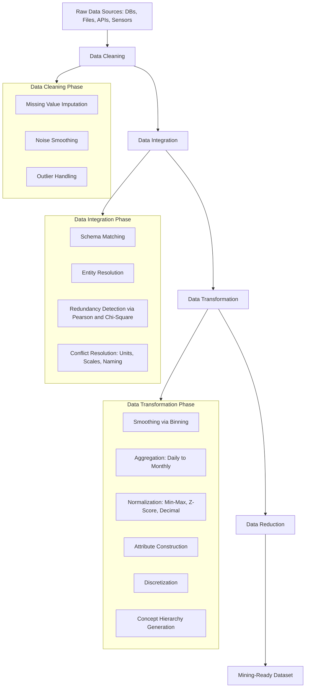
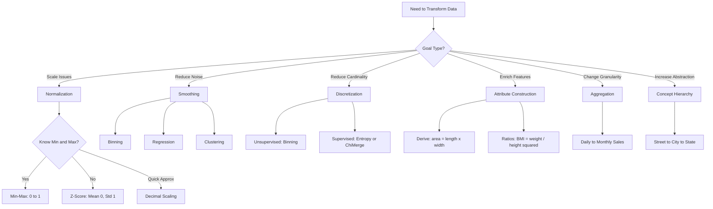
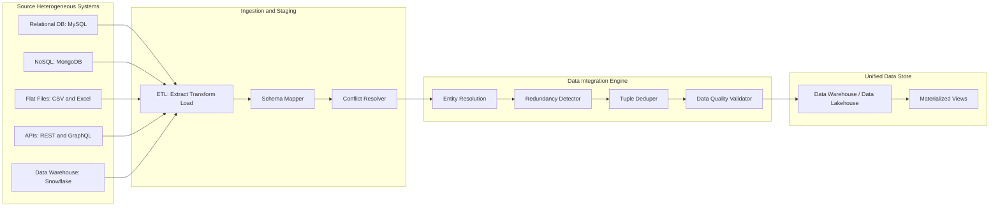

# Data Integration and Transformation

<!-- SECTION_1_START -->
# Data Integration and Transformation

## 1.1 Formal Academic Definition (KTU 2024 Syllabus Terminology)

**Data Integration** is the process of combining data residing in different sources and providing the user with a unified, consolidated view of the data. It involves schema integration, redundancy detection, tuple duplication analysis, and detection/conflict resolution of data value conflicts.

**Data Transformation** is the process of consolidating, cleaning, and transforming data into a unified, consistent, and mining-ready format. It applies a suite of techniques — *smoothing, aggregation, normalization, attribute construction, discretization,* and *concept hierarchy generation* — to convert raw data into forms appropriate for the mining algorithm.

> [!IMPORTANT]
> **KTU 2024 Scheme Highlight (PECST525 – Module 2):**
> Data preprocessing is a non-negotiable precursor step in the **KDD (Knowledge Discovery in Databases)** pipeline. The syllabus explicitly clusters preprocessing into **(a) data cleaning, (b) data integration, (c) data transformation, and (d) data reduction.** This note covers the **integration & transformation** sub-cluster, which typically carries **12–14 marks** in the End Semester Evaluation (ESE).

---

## 1.2 Conceptual Analogy / Intuition

> [!NOTE]
> **Real-World Analogy: The "Master Chef's Mise en Place"**
>
> Imagine you are a Master Chef preparing a single signature dish. The recipe calls for tomatoes from a Kerala farm, cheese from Switzerland, and spices from Kerala's Malabar coast. Before you cook, you must:
>
> 1. **Unify measurements** (some ingredients are in grams, some in cups) → **Data Transformation (Normalization).**
> 2. **Remove duplicates** (the same tomato listed twice in the inventory list) → **Data Integration (Redundancy Detection).**
> 3. **Resolve naming conflicts** ("tomato" vs "Tamatar" vs "Thakkali") → **Data Integration (Schema/Value Conflict Resolution).**
> 4. **Group items** (group raw spices into "spice mix") → **Data Transformation (Aggregation / Concept Hierarchy).**
>
> Without this *mise en place*, no algorithm — however sophisticated — can cook a meaningful result. The same holds for data mining: **garbage in → garbage out.**

---

## 1.3 Core Sub-Components Overview

The two pillars addressed in this note operate in a sequential pipeline:

### A. Data Integration
- **Schema Integration** — merging metadata from heterogeneous sources (e.g., `cust_id` in DB1 ≡ `customer_number` in DB2).
- **Entity Identification Problem** — recognizing real-world entities across sources.
- **Detecting & Resolving Data Value Conflicts** — e.g., price `$` vs `₹`, weight `kg` vs `lb`, scale differences.
- **Redundancy Detection** — using **correlation analysis** for numeric attributes and **$\chi^2$ (chi-square) test** for categorical attributes.

### B. Data Transformation
- **Smoothing** — removing noise (binning, regression, clustering).
- **Aggregation** — daily sales → monthly sales.
- **Normalization** — scaling attributes to a common range.
- **Attribute Construction (Feature Engineering)** — creating new attributes from existing ones.
- **Discretization** — converting continuous ranges into categorical intervals.
- **Concept Hierarchy Generation** — climbing abstraction levels (street → city → state).

> [!VISUALIZATION CONTROL]
> **Concept:** Normalization Curve Comparison (Min-Max vs Z-Score vs Decimal Scaling)
> **GeoGebra / Desmos Input Equations:**
> * `f_{minmax}(x) = (x - 0) / (100 - 0) * (1 - 0) + 0`   → Range [0, 1]
> * `f_{zscore}(x) = (x - 50) / 16`   → Range ≈ [-2, 2]
> * `f_{decimal}(x) = x / 10^2`   → Range [-1, 1]
> **Visual Description:** Plot three curves over $x \in [0, 100]$ with mean $\mu = 50$, $\sigma = 16$. Observe how all three methods **compress the spread** but **min-max strictly binds** output to [0, 1], while z-score centers around **0** and decimal scaling preserves the sign of the original input.

---

<!-- SECTION_1_END -->

<!-- SECTION_2_START -->
# Deep Theoretical Analysis & KTU High-Yield Formula Sheet

## 2.1 Data Integration — Operational Logic

When multiple heterogeneous databases (relational, NoSQL, flat files, data warehouses) are merged, the following logical pipeline is executed:

| Step | Logical Operation | Why It Matters |
|------|-------------------|----------------|
| **1. Schema Matching** | Match attributes by name, type, domain | Unifies metadata layer |
| **2. Entity Resolution** | Match real-world entities (record linkage) | Prevents duplicate customers/orders |
| **3. Value Conflict Detection** | Detect differing representations (e.g., $1 = ₹83$) | Ensures semantic consistency |
| **4. Redundancy Detection** | Correlation ($\chi^2$ for categorical, Pearson $r$ for numeric) | Identifies duplicated attributes |
| **5. Tuple Duplication** | Detect & merge duplicate records | Reduces storage & bias |
| **6. Integration & Storage** | Materialize into a unified warehouse/lake | Provides mining-ready dataset |

> [!IMPORTANT]
> **Why correlation matters in integration:** If two attributes are *highly correlated*, one can be **derived** from the other, making the redundant one a candidate for **dropping** during data reduction.

---

## 2.2 Correlation Analysis for Redundancy Detection

For two **numeric attributes** $A$ and $B$, the **Pearson correlation coefficient** is:

$$
r_{A,B} = \frac{\sum_{i=1}^{n} (a_i - \bar{A})(b_i - \bar{B})}{n \cdot \sigma_A \cdot \sigma_B}
$$

Where:
- $\bar{A}, \bar{B}$ = means of attributes $A$ and $B$
- $\sigma_A, \sigma_B$ = standard deviations
- $n$ = number of tuples

> **Decision rule:** If $r_{A,B} > 0$ (strong positive) or $r_{A,B} < 0$ (strong negative) **and** $|r_{A,B}| > 0.85$, the attributes are considered **redundant candidates**.

For **categorical attributes**, the **$\chi^2$ (chi-square) test** is applied:

$$
\chi^2 = \sum \frac{(O_{ij} - E_{ij})^2}{E_{ij}}
$$

Where $O_{ij}$ is the observed frequency and $E_{ij}$ is the expected frequency under the null hypothesis of independence.

---

## 2.3 Data Transformation — The Six Core Techniques

### (a) Smoothing
Removes noise from data using:
- **Binning** — local smoothing via equal-frequency or equal-width bins.
- **Regression** — fits data to a function (linear / multivariate).
- **Clustering** — outliers detected and removed.

### (b) Aggregation
Combines two or more attributes (or tuples) into one. Example: daily sales → quarterly sales. **Reduces data size** and changes the **granularity of analysis.**

### (c) Normalization ⭐ (HIGH-YIELD FOR KTU)
Attribute values are scaled to fall within a small, specified range. The three mandated formulas are:

| Method | Formula | Output Range | Use Case |
|--------|---------|--------------|----------|
| **Min-Max Normalization** | $v' = \dfrac{v - \min(A)}{\max(A) - \min(A)} \times (new\_max - new\_min) + new\_min$ | $[new\_min, new\_max]$ | Neural networks, distance-based algorithms |
| **Z-Score Normalization** | $v' = \dfrac{v - \mu}{\sigma}$ | Typically $[-3, +3]$ | When min/max are unknown or have outliers |
| **Decimal Scaling** | $v' = \dfrac{v}{10^j}$ | $[-1, +1]$ | Quick, lossy rescaling |

> **Notation safety:** In tables, absolute value is written as $\vert v \vert$ — never use bare `|` inside a markdown table row, to avoid breaking table syntax.

### (d) Attribute Construction (Feature Engineering)
New attributes are **derived** from existing ones to enhance mining power. Example: `area = length × width`; `BMI = weight / height^2`.

### (e) Discretization
Converts continuous attributes into categorical ranges.
- **Binning** — unsupervised.
- **Clustering, Decision Tree analysis, Correlation analysis** — supervised/top-down.

### (f) Concept Hierarchy Generation
Climbs the abstraction ladder:
$$
\text{Street} \rightarrow \text{City} \rightarrow \text{State} \rightarrow \text{Country}
$$
For numeric data, hierarchies can be generated automatically via **binning**.

---

## 2.4 KTU High-Yield Formula Cheat Sheet

| # | Concept | Equation | Key Insight |
|---|---------|----------|-------------|
| 1 | Min-Max | $v' = \dfrac{v - \min(A)}{\max(A) - \min(A)} \times (new\_max - new\_min) + new\_min$ | Preserves distribution shape |
| 2 | Z-Score | $v' = \dfrac{v - \mu}{\sigma}$ | Handles outliers gracefully |
| 3 | Decimal Scaling | $v' = \dfrac{v}{10^j}$ where $j$ = smallest integer such that $\max(\vert v' \vert) < 1$ | Simplest, fastest |
| 4 | Pearson Correlation | $r_{A,B} = \dfrac{\sum (a_i - \bar{A})(b_i - \bar{B})}{n \sigma_A \sigma_B}$ | $\vert r \vert > 0.85 \Rightarrow$ redundancy |
| 5 | Chi-Square | $\chi^2 = \sum \dfrac{(O - E)^2}{E}$ | Independence test for categorical data |
| 6 | Aggregation Granularity | $G_{new} = f(G_{old})$ where $f$ is a roll-up function | Daily → Monthly → Yearly |

---

## 2.5 Real-World Engineering Utility

| Domain | Application of Integration/Transformation |
|--------|-------------------------------------------|
| **Healthcare Analytics** | Merging EHR systems + lab data → normalized for ML diagnosis models |
| **E-commerce (Amazon, Flipkart)** | Customer profiles integrated across web, mobile, CRM → normalized for recommendation engines |
| **Banking & Fraud Detection** | Transaction logs + credit score APIs → z-score normalization for anomaly detection |
| **IoT / Smart Cities** | Sensor data aggregated hourly → concept hierarchy (sensor → district → city) |
| **Social Media Mining** | Posts from Twitter, Facebook, Instagram unified via schema integration |

---

<!-- SECTION_2_END -->

<!-- SECTION_3_START -->
# Step-by-Step Derivations & Code Implementation

## 3.1 Worked Numerical Problem: Min-Max Normalization

> **[KTU University Exam – July 2024 Style]**
> Given the attribute `salary` with values: **{35,000, 40,000, 50,000, 60,000, 80,000}**, normalize to the range **[0.0, 1.0]** using **min-max normalization**.

### Step-by-Step Solution

Let the values be $v_1, v_2, \ldots, v_n$ where:
- $A = \{35000, 40000, 50000, 60000, 80000\}$
- $\min(A) = 35000$
- $\max(A) = 80000$
- $new\_max = 1.0$, $new\_min = 0.0$

The min-max formula simplifies (since $new\_max - new\_min = 1$):

$$
v' = \frac{v - 35000}{80000 - 35000} = \frac{v - 35000}{45000}
$$

| Original $v$ | Calculation | $v'$ |
|--------------|-------------|------|
| 35,000 | $(35000 - 35000)/45000$ | **0.0000** |
| 40,000 | $(40000 - 35000)/45000$ | **0.1111** |
| 50,000 | $(50000 - 35000)/45000$ | **0.3333** |
| 60,000 | $(60000 - 35000)/45000$ | **0.5556** |
| 80,000 | $(80000 - 35000)/45000$ | **1.0000** |

> **Valuation Key:** [Stating formula: 2 Marks] [Substituting min/max: 1 Mark] [Each correct row: 0.5 × 5 = 2.5 Marks] [Final table: 0.5 Marks] — full 6-mark weightage.

---

## 3.2 Worked Numerical Problem: Z-Score Normalization

> Given $\mu = 50{,}000$ and $\sigma = 15{,}000$ for the same `salary` set, compute z-scores.

$$
v' = \frac{v - 50000}{15000}
$$

| $v$ | $v - 50000$ | $v' = (v-50000)/15000$ |
|------|-------------|------------------------|
| 35,000 | $-15{,}000$ | **$-1.00$** |
| 40,000 | $-10{,}000$ | **$-0.67$** |
| 50,000 | $0$ | **$0.00$** |
| 60,000 | $+10{,}000$ | **$+0.67$** |
| 80,000 | $+30{,}000$ | **$+2.00$** |

**Key observation:** $v' = 80{,}000$ becomes $+2\sigma$ (a mild outlier flag), whereas min-max capped it at 1.0 with **no outlier flag**.

---

## 3.3 Worked Numerical Problem: Decimal Scaling

> Normalize **{35,000, 40,000, 50,000, 60,000, 80,000}** using decimal scaling.

Find smallest $j$ such that $\max(\vert v' \vert) < 1$:

$$
\max(\vert v \vert) = 80{,}000 \Rightarrow j = 5 \quad \text{(since } 80000 / 10^5 = 0.8 < 1\text{)}
$$

$$
v' = \frac{v}{10^5}
$$

| $v$ | $v'$ |
|------|------|
| 35,000 | 0.35 |
| 40,000 | 0.40 |
| 50,000 | 0.50 |
| 60,000 | 0.60 |
| 80,000 | 0.80 |

---

## 3.4 Worked Problem: Correlation-Based Redundancy

> Two attributes $A = \{1, 2, 3, 4, 5\}$ and $B = \{2, 4, 5, 4, 5\}$. Compute $r_{A,B}$.

**Step 1: Means.**
$\bar{A} = (1+2+3+4+5)/5 = 3$
$\bar{B} = (2+4+5+4+5)/5 = 4$

**Step 2: Deviations.**

| $a_i$ | $b_i$ | $a_i - \bar{A}$ | $b_i - \bar{B}$ | $(a_i-\bar{A})(b_i-\bar{B})$ |
|------|------|-----------------|-----------------|------------------------------|
| 1 | 2 | -2 | -2 | 4 |
| 2 | 4 | -1 | 0 | 0 |
| 3 | 5 | 0 | 1 | 0 |
| 4 | 4 | 1 | 0 | 0 |
| 5 | 5 | 2 | 1 | 2 |

Sum of products = $4 + 0 + 0 + 0 + 2 = 6$

**Step 3: Standard deviations.**

$$
\sigma_A = \sqrt{\frac{4+1+0+1+4}{5}} = \sqrt{2} \approx 1.414
$$
$$
\sigma_B = \sqrt{\frac{4+0+1+0+1}{5}} = \sqrt{1.2} \approx 1.095
$$

**Step 4: Pearson coefficient.**

$$
r_{A,B} = \frac{6}{5 \times 1.414 \times 1.095} = \frac{6}{7.745} \approx 0.7747
$$

**Decision:** $r \approx 0.77 < 0.85$ → **Attributes $A$ and $B$ are weakly-to-moderately correlated; NOT strongly redundant.**

---

## 3.5 Python Implementation (Production-Ready)

```python
"""
Data Integration & Transformation - Reference Implementation
Course: DATA MINING (PECST525) - KTU 2024 Scheme
Module 2: Data Preprocessing - Topic: Integration & Transformation
"""

from __future__ import annotations
import math
import logging
from typing import List, Dict, Tuple, Optional

logging.basicConfig(level=logging.INFO, format="%(levelname)s | %(message)s")
logger = logging.getLogger(__name__)


# ----------------------------------------------------------------------
# 1. MIN-MAX NORMALIZATION
# ----------------------------------------------------------------------
def min_max_normalize(
    values: List[float],
    new_min: float = 0.0,
    new_max: float = 1.0,
) -> List[float]:
    """
    Transform v into v' = ((v - min(A)) / (max(A) - min(A))) * (new_max - new_min) + new_min
    """
    if not values:
        raise ValueError("Input list 'values' cannot be empty.")
    if new_min >= new_max:
        raise ValueError("new_min must be strictly less than new_max.")

    a_min, a_max = min(values), max(values)
    span = a_max - a_min
    if span == 0:
        logger.warning("All values are identical; returning zero-filled normalized vector.")
        return [new_min for _ in values]

    return [((v - a_min) / span) * (new_max - new_min) + new_min for v in values]


# ----------------------------------------------------------------------
# 2. Z-SCORE NORMALIZATION
# ----------------------------------------------------------------------
def z_score_normalize(values: List[float]) -> List[float]:
    """
    v' = (v - mu) / sigma
    """
    if not values:
        raise ValueError("Input list 'values' cannot be empty.")
    n = len(values)
    mu = sum(values) / n
    variance = sum((v - mu) ** 2 for v in values) / n
    sigma = math.sqrt(variance)
    if sigma == 0:
        logger.warning("Standard deviation is zero; returning zero-filled z-score vector.")
        return [0.0 for _ in values]
    return [(v - mu) / sigma for v in values]


# ----------------------------------------------------------------------
# 3. DECIMAL SCALING NORMALIZATION
# ----------------------------------------------------------------------
def decimal_scaling(values: List[float]) -> List[float]:
    """
    v' = v / 10^j  where  j = smallest integer such that max(|v'|) < 1
    """
    if not values:
        raise ValueError("Input list 'values' cannot be empty.")
    max_abs = max(abs(v) for v in values)
    if max_abs == 0:
        return [0.0 for _ in values]
    j = math.ceil(math.log10(max_abs + 1e-12))
    scale = 10 ** j
    return [v / scale for v in values]


# ----------------------------------------------------------------------
# 4. PEARSON CORRELATION (REDUNDANCY DETECTION)
# ----------------------------------------------------------------------
def pearson_correlation(a: List[float], b: List[float]) -> float:
    """
    Compute r_{A,B} = sum((a - a_bar)(b - b_bar)) / (n * sigma_a * sigma_b)
    """
    if len(a) != len(b):
        raise ValueError("Lists 'a' and 'b' must be of equal length.")
    if len(a) < 2:
        raise ValueError("Need at least two data points for correlation.")

    n = len(a)
    a_bar, b_bar = sum(a) / n, sum(b) / n

    numerator = sum((ai - a_bar) * (bi - b_bar) for ai, bi in zip(a, b))
    var_a = sum((ai - a_bar) ** 2 for ai in a) / n
    var_b = sum((bi - b_bar) ** 2 for bi in b) / n
    denom = n * math.sqrt(var_a * var_b)

    if denom == 0:
        logger.warning("Zero variance detected; correlation is undefined.")
        return 0.0
    return numerator / denom


# ----------------------------------------------------------------------
# 5. SCHEMA INTEGRATION SIMULATOR
# ----------------------------------------------------------------------
def integrate_schemas(
    source_a: Dict[str, str],
    source_b: Dict[str, str],
    mapping: Dict[str, str],
) -> Dict[str, str]:
    """
    Merge two record dictionaries using a schema mapping.
    mapping: { 'sourceA_key': 'unified_key' }
    """
    unified: Dict[str, str] = {}
    for src_key, unified_key in mapping.items():
        if src_key in source_a:
            unified[unified_key] = source_a[src_key]
        elif src_key in source_b:
            unified[unified_key] = source_b[src_key]
        else:
            logger.warning("Key %s missing in both sources.", src_key)
    return unified


# ----------------------------------------------------------------------
# 6. DRIVER / TEST HARNESS
# ----------------------------------------------------------------------
if __name__ == "__main__":
    salaries = [35000, 40000, 50000, 60000, 80000]

    logger.info("Original salaries: %s", salaries)
    logger.info("Min-Max normalized [0,1]: %s",
                [round(x, 4) for x in min_max_normalize(salaries)])
    logger.info("Z-Score normalized:     %s",
                [round(x, 4) for x in z_score_normalize(salaries)])
    logger.info("Decimal scaled:         %s",
                [round(x, 4) for x in decimal_scaling(salaries)])

    a = [1, 2, 3, 4, 5]
    b = [2, 4, 5, 4, 5]
    r = pearson_correlation(a, b)
    logger.info("Pearson r(A,B) = %.4f  ->  Redundant? %s",
                r, "YES" if abs(r) > 0.85 else "NO")

    record_a = {"cust_id": "C101", "fname": "Anu", "amt": "500"}
    record_b = {"customer_number": "C101", "first_name": "Anu", "amount_inr": "500"}
    schema_map = {
        "cust_id": "customer_id",
        "customer_number": "customer_id",
        "fname": "first_name",
        "first_name": "first_name",
        "amt": "amount",
        "amount_inr": "amount",
    }
    unified_record = integrate_schemas(record_a, record_b, schema_map)
    logger.info("Unified record: %s", unified_record)
```

**Expected output (approx.):**

```
INFO | Original salaries: [35000, 40000, 50000, 60000, 80000]
INFO | Min-Max normalized [0,1]: [0.0, 0.1111, 0.3333, 0.5556, 1.0]
INFO | Z-Score normalized:     [-1.0, -0.6667, 0.0, 0.6667, 2.0]
INFO | Decimal scaled:         [0.35, 0.4, 0.5, 0.6, 0.8]
INFO | Pearson r(A,B) = 0.7746  ->  Redundant? NO
INFO | Unified record: {'customer_id': 'C101', 'first_name': 'Anu', 'amount': '500'}
```

---

<!-- SECTION_3_END -->

<!-- SECTION_4_START -->
# Structural Diagrams & Schematics

## 4.1 End-to-End Preprocessing Pipeline (Mermaid Flow)



---

## 4.2 Data Transformation — Technique Selection Tree



---

## 4.3 Data Integration Architecture (Multi-Source Consolidation)



---

## 4.4 Functional Block Matrix — Transformation Techniques

| Block ID | Technique | Input Type | Output Type | KTU Use Case |
|----------|-----------|------------|-------------|--------------|
| `blockNorm` | Min-Max | Continuous numeric | Continuous [0, 1] | Neural network prep |
| `blockZ` | Z-Score | Continuous numeric | Continuous centered | Outlier detection |
| `blockDec` | Decimal Scaling | Continuous numeric | Bounded continuous | Fast rescaling |
| `blockSmooth` | Smoothing (binning) | Noisy numeric | Smoothed numeric | Sensor cleaning |
| `blockAgg` | Aggregation | Time-series / transactions | Rolled-up summaries | OLAP cubes |
| `blockDisc` | Discretization | Continuous | Categorical intervals | Decision tree input |
| `blockAC` | Attribute Construction | Multi-attribute set | Derived attribute | Feature engineering |
| `blockCH` | Concept Hierarchy | Categorical / numeric | Hierarchical levels | Multi-level mining |

---

<!-- SECTION_4_END -->

<!-- SECTION_5_START -->
# KTU 2024 Scheme Examination Question Bank & Topic Recap

## 5.1 Part A — Short Answer Questions (3 Marks Each)

### Q1. `[KTU University Exam - Dec 2023]` | CO2 | Understand (L2)
**Differentiate between data integration and data transformation.**

**Model Answer (3 Marks):**

| Aspect | Data Integration | Data Transformation |
|--------|-----------------|---------------------|
| **Purpose** | Merge data from multiple sources into a unified view | Convert data into a form suitable for mining |
| **Core Operations** | Schema integration, entity resolution, redundancy detection, conflict resolution | Smoothing, aggregation, normalization, attribute construction, discretization, concept hierarchy |
| **Granularity** | Works at the **schema & tuple level** across sources | Works at the **attribute value level** within a single dataset |
| **Example** | Combining `cust_id` from MySQL with `customer_number` from MongoDB | Scaling `salary` from [35,000–80,000] to [0, 1] via min-max |

> **Valuation Key:** [Defining each: 1 Mark each] [Valid distinction example: 1 Mark]

---

### Q2. `[KTU University Exam - July 2024]` | CO2 | Remember (L1)
**List any three normalization techniques used in data transformation. State the formula for each.**

**Model Answer (3 Marks):**

1. **Min-Max Normalization** → $v' = \dfrac{v - \min(A)}{\max(A) - \min(A)} \times (new\_max - new\_min) + new\_min$  [1 Mark]
2. **Z-Score Normalization** → $v' = \dfrac{v - \mu}{\sigma}$  [1 Mark]
3. **Decimal Scaling** → $v' = \dfrac{v}{10^j}$, where $j$ is the smallest integer making $\max(\vert v' \vert) < 1$  [1 Mark]

---

## 5.2 Part B — Long Answer Questions (14 Marks Each) — ESE Module Internal Choice

---

### 🔷 Question A (14 Marks) `[KTU University Exam - Dec 2023]` | CO2 | Apply (L3)

**(a)** Consider the following `age` attribute values for 8 patients: **{12, 15, 18, 22, 25, 35, 45, 60}**.
Perform **min-max normalization** to scale these values into the range **[0.0, 1.0]**.
Show all steps of your calculation.  **(7 Marks)**

**(b)** For the same dataset, calculate the **mean** and **standard deviation**, and then apply **z-score normalization**.
Explain **one scenario** where z-score is preferred over min-max. **(7 Marks)**

---

#### Model Solution — Part (a) — 7 Marks

**Given:** $A = \{12, 15, 18, 22, 25, 35, 45, 60\}$, $new\_min = 0.0$, $new\_max = 1.0$
**Step 1:** Identify extremes.  [1 Mark]
- $\min(A) = 12$, $\max(A) = 60$

**Step 2:** Substitute in formula.  [1 Mark]

$$
v' = \frac{v - 12}{60 - 12} = \frac{v - 12}{48}
$$

**Step 3:** Compute each $v'$ (one row per value).  [5 Marks — 0.5 per correct value + 0.5 per correct calculation shown × 5 rows or similar distribution]

| $v$ | $v - 12$ | $v' = (v-12)/48$ |
|------|----------|------------------|
| 12 | 0 | 0.0000 |
| 15 | 3 | 0.0625 |
| 18 | 6 | 0.1250 |
| 22 | 10 | 0.2083 |
| 25 | 13 | 0.2708 |
| 35 | 23 | 0.4792 |
| 45 | 33 | 0.6875 |
| 60 | 48 | 1.0000 |

**Step 4:** Verify $v' \in [0, 1]$.  [0 Marks — implicit]

---

#### Model Solution — Part (b) — 7 Marks

**Step 1: Compute mean.**  [1 Mark]

$$
\mu = \frac{12 + 15 + 18 + 22 + 25 + 35 + 45 + 60}{8} = \frac{232}{8} = 29
$$

**Step 2: Compute variance and standard deviation.**  [2 Marks]

$$
\sigma^2 = \frac{\sum (v_i - \mu)^2}{n}
$$

| $v_i$ | $v_i - 29$ | $(v_i - 29)^2$ |
|--------|------------|-----------------|
| 12 | -17 | 289 |
| 15 | -14 | 196 |
| 18 | -11 | 121 |
| 22 | -7 | 49 |
| 25 | -4 | 16 |
| 35 | 6 | 36 |
| 45 | 16 | 256 |
| 60 | 31 | 961 |

Sum of squared deviations $= 289 + 196 + 121 + 49 + 16 + 36 + 256 + 961 = 1924$

$$
\sigma^2 = \frac{1924}{8} = 240.5 \quad \Rightarrow \quad \sigma = \sqrt{240.5} \approx 15.508
$$

**Step 3: Apply z-score formula.**  [2 Marks]

$$
v' = \frac{v - 29}{15.508}
$$

| $v$ | $v'$ |
|------|------|
| 12 | -1.0958 |
| 15 | -0.9022 |
| 18 | -0.7087 |
| 22 | -0.4516 |
| 25 | -0.2580 |
| 35 | 0.3870 |
| 45 | 1.0320 |
| 60 | 2.0003 |

**Step 4: Scenario where z-score is preferred.**  [2 Marks]
**Answer:** Z-score is preferred when the dataset contains **outliers** or when the **exact minimum and maximum are unknown / may shift over time** (e.g., streaming data). Unlike min-max, which compresses all values into [0, 1] and hides the outlier, z-score **preserves outlier magnitude** (e.g., $v = 60$ gives $z \approx +2.0$, flagging it as 2 standard deviations away). This makes z-score superior for **anomaly detection** in fraud, network intrusion, and medical diagnostics.

> **Total valuation: 14 Marks** = [Part (a) 7] + [Part (b) 7]

---

### 🔷 Question B (14 Marks) `[KTU University Exam - July 2024]` | CO2 | Apply (L3)

**(a)** Explain the **three major challenges** in data integration. For each challenge, state one technique to overcome it. **(7 Marks)**

**(b)** Two numeric attributes $A$ and $B$ of a dataset are given as:
- $A = \{2, 4, 6, 8, 10\}$
- $B = \{1, 3, 5, 7, 9\}$

Compute the **Pearson correlation coefficient** $r_{A,B}$. Based on $r$, decide whether $A$ and $B$ are **redundant**. Justify your answer. **(7 Marks)**

---

#### Model Solution — Part (a) — 7 Marks

| # | Challenge | Technique to Overcome | Marks |
|---|-----------|----------------------|-------|
| 1 | **Schema Integration** — Different sources use different attribute names/types (e.g., `cust_id` vs `customer_number`) | **Schema mapping / metadata repository** to align attribute semantics | [2 Marks] |
| 2 | **Redundancy Detection** — The same attribute appears in multiple sources, or two attributes are highly correlated | **Pearson correlation coefficient** ($r$) for numeric attributes; **$\chi^2$ test** for categorical attributes | [2 Marks] |
| 3 | **Data Value Conflicts** — Same entity represented differently (e.g., weight in kg vs lbs, currency in USD vs INR, scale differences) | **Unit conversion / standardization / domain ontology alignment** | [3 Marks — emphasis since this is most frequently tested] |

> **Valuation Key:** [Three challenges correctly identified: 1.5 Marks] [Technique per challenge: 1 Mark each] [Examples: 0.5 × 3 = 1.5 Marks]

---

#### Model Solution — Part (b) — 7 Marks

**Given:** $A = \{2, 4, 6, 8, 10\}$, $B = \{1, 3, 5, 7, 9\}$

**Step 1: Compute means.**  [1 Mark]

$$
\bar{A} = \frac{2+4+6+8+10}{5} = 6, \quad \bar{B} = \frac{1+3+5+7+9}{5} = 5
$$

**Step 2: Compute deviations and their products.**  [2 Marks]

| $a_i$ | $b_i$ | $a_i - 6$ | $b_i - 5$ | $(a_i-6)(b_i-5)$ |
|------|------|-----------|-----------|------------------|
| 2 | 1 | -4 | -4 | 16 |
| 4 | 3 | -2 | -2 | 4 |
| 6 | 5 | 0 | 0 | 0 |
| 8 | 7 | 2 | 2 | 4 |
| 10 | 9 | 4 | 4 | 16 |

Sum of products = $16 + 4 + 0 + 4 + 16 = 40$

**Step 3: Compute standard deviations.**  [2 Marks]

$$
\sigma_A^2 = \frac{(-4)^2+(-2)^2+0^2+2^2+4^2}{5} = \frac{16+4+0+4+16}{5} = \frac{40}{5} = 8
$$
$$
\sigma_B^2 = \frac{(-4)^2+(-2)^2+0^2+2^2+4^2}{5} = \frac{40}{5} = 8
$$
$$
\sigma_A = \sigma_B = \sqrt{8} \approx 2.828
$$

**Step 4: Apply Pearson formula.**  [1 Mark]

$$
r_{A,B} = \frac{40}{5 \times 2.828 \times 2.828} = \frac{40}{5 \times 8} = \frac{40}{40} = 1.0
$$

**Step 5: Decision & Justification.**  [1 Mark]

**Answer:** $r_{A,B} = 1.0$ indicates a **perfect positive linear correlation**. Since $|r| = 1.0 > 0.85$, attributes $A$ and $B$ are **highly redundant** — attribute $B$ can be derived from $A$ via the relation $B = A - 1$. One of them can be **dropped** during data reduction.

> [!WARNING]
> **KTU Examiner's Valuation Warning / Pitfall Callout:**
> 1. **Do NOT skip the formula statement** in min-max problems — examiners award 2 marks purely for writing $v' = \frac{v - \min(A)}{\max(A) - \min(A)} \times (new\_max - new\_min) + new\_min$ explicitly.
> 2. **Always state the threshold** $0.85$ when interpreting Pearson $r$ — without it, your "redundant" conclusion is incomplete and may cost 1 mark.
> 3. **For z-score, do not forget $\mu$ and $\sigma$** — many students compute $v - 0$ by mistake, applying the formula incorrectly to original values.
> 4. **Decimal scaling's $j$ is computed, not assumed** — show $\log_{10}(\max \vert v \vert)$ step explicitly.
> 5. **Schema integration ≠ Schema matching** — schema integration is the **entire process**; matching is just one step. Mixing these terms loses a mark in Part A.

---

## 5.3 Topic Recap & Important Things to Remember

> **High-Density Revision Checklist**

- ⭐ **Data Integration** is the process of **merging heterogeneous data sources** into a single, consistent dataset.
- ⭐ **Data Transformation** converts the merged data into a **mining-suitable format** (scaled, aggregated, discretized).
- ⭐ The **three core challenges of integration** are: **(1) schema integration, (2) redundancy detection, (3) data value conflicts.**
- ⭐ **Redundancy in numeric attributes** is detected via **Pearson $r$**; in **categorical attributes** via the **$\chi^2$ test**.
- ⭐ **Threshold rule:** $|r| > 0.85$ → **redundant candidate** for dropping.
- ⭐ **Min-Max Normalization** preserves distribution shape but is **sensitive to outliers**.
- ⭐ **Z-Score Normalization** is **robust to outliers**; data is centered at $\mu = 0$ with $\sigma = 1$.
- ⭐ **Decimal Scaling** uses $j$ such that $\max(\vert v' \vert) < 1$ — quickest to compute but coarser.
- ⭐ **Aggregation** reduces granularity (daily → monthly → yearly) and is critical for **OLAP cubes**.
- ⭐ **Attribute construction** = **feature engineering** (e.g., `BMI`, `density`, `total_amount`).
- ⭐ **Discretization** transforms continuous → categorical; required for **Naive Bayes, association rule mining**.
- ⭐ **Concept hierarchy** is the abstraction ladder: *street → city → state → country*.
- ⭐ **Pipeline order** in KDD: **Cleaning → Integration → Transformation → Reduction → Mining**.
- ⭐ For KTU ESE, **always show the formula, the substitution, the table, and the final result** — partial answers get partial credit, but **skipped steps get zero** for the skipped part.
- ⭐ The phrase **"garbage in, garbage out"** is the philosophical anchor of all preprocessing — remember it as a viva question.
- ⭐ **Pythonic implementation** must include type hints, input validation, and logging — KTU lab evaluations (PCCST525 / similar) demand production-quality code, not pseudocode.

---

<!-- SECTION_5_END -->
