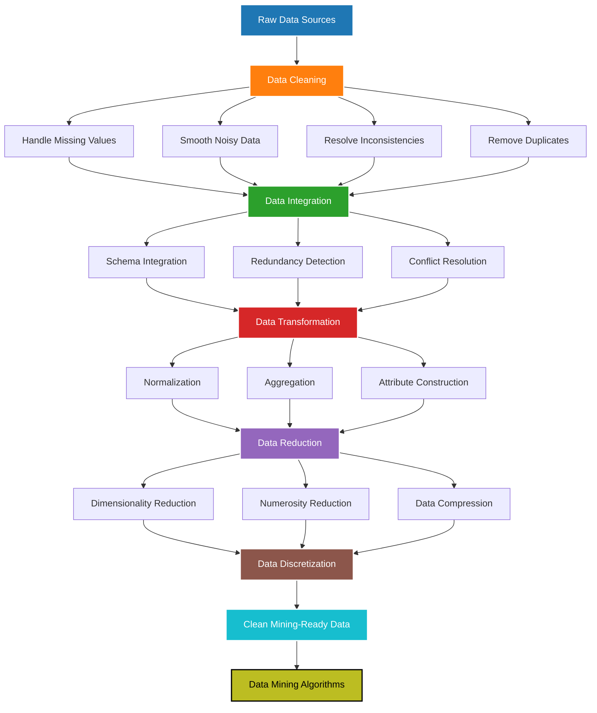
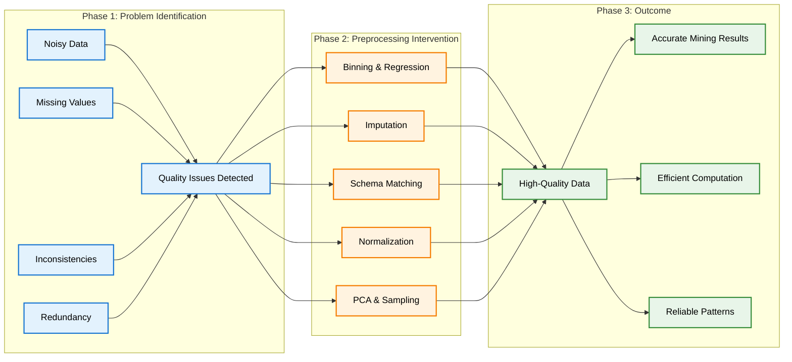
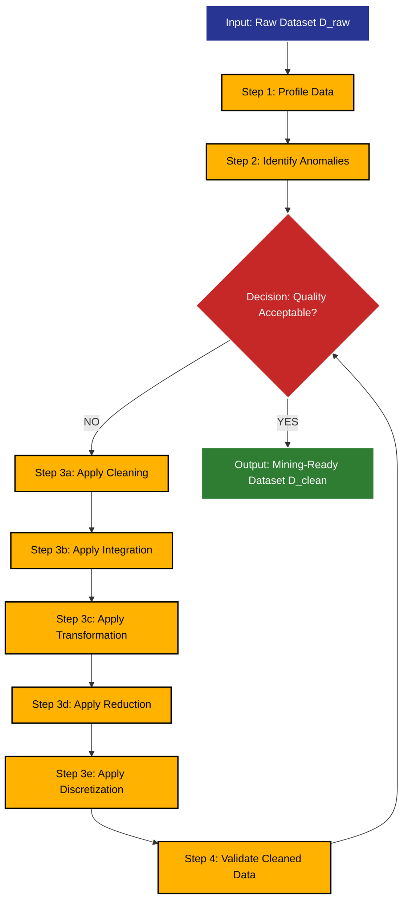

# Data Preprocessing - Need of data preprocessing

<!-- SECTION_1_START -->
# Data Preprocessing: The Need for It

## 1.1 Formal Definition (KTU 2024 Syllabus Terminology)

**Data Preprocessing** is a critical phase in the Knowledge Discovery in Databases (KDD) pipeline, defined as the systematic transformation of raw, real-world data into a clean, consistent, and analysis-ready format suitable for Data Mining algorithms. According to the KTU 2024 PECST525 syllabus, it encompasses a sequence of operations — *data cleaning, data integration, data transformation, data reduction, and data discretization* — performed *before* the actual mining step to improve data quality, mining efficiency, and the reliability of discovered patterns.

In formal mathematical terms, given a raw dataset $\mathcal{D}_{raw} = \{r_1, r_2, \ldots, r_n\}$, the preprocessing function $\mathcal{F}$ transforms it into a refined dataset $\mathcal{D}_{clean}$:

$$\mathcal{D}_{clean} = \mathcal{F}(\mathcal{D}_{raw})$$

where $\mathcal{F}$ is a composition of sub-operations: $\mathcal{F} = f_{clean} \circ f_{integrate} \circ f_{transform} \circ f_{reduce}$.

> [!IMPORTANT]
> **KTU Syllabus Highlight:** "Real-world data is **dirty, incomplete, inconsistent, and noisy**. Without preprocessing, the Garbage-In-Garbage-Out (GIGO) principle guarantees poor mining results."

## 1.2 Why Real-World Data Is Imperfect

Real-world datasets are rarely pristine. The four classical data quality problems are:

| Problem Type | Description | Real-World Example |
|---|---|---|
| **Noisy Data** | Random error or variance in measured values | Sensor glitches in IoT temperature readings |
| **Missing Values** | Absent attribute values for some records | Customer forgot to enter age on signup form |
| **Inconsistent Data** | Contradictions between data sources | Salary stored as `50000` in HR DB and `50K` in Finance DB |
| **Redundant Data** | Duplicated records or correlated attributes | Same transaction logged twice |

## 1.3 Intuitive Analogy: Cooking a Gourmet Meal

Think of Data Mining as **cooking a gourmet dish**, and Data Preprocessing as the **entire "mise en place"** (preparation phase):

- **Washing vegetables** $\rightarrow$ **Data Cleaning** (removing noise, handling missing values)
- **Gathering ingredients from fridge, pantry, garden** $\rightarrow$ **Data Integration** (merging multiple sources)
- **Chopping, marinating, measuring** $\rightarrow$ **Data Transformation** (normalization, aggregation)
- **Choosing only the best cuts** $\rightarrow$ **Data Reduction** (dimensionality and numerosity reduction)
- **Pre-portioned spice packets** $\rightarrow$ **Data Discretization** (binning continuous values)

> [!NOTE]
> Just as a chef cannot create a Michelin-star meal from unwashed, unchopped, mismatched ingredients, a data miner cannot extract meaningful patterns from raw, noisy, inconsistent data. **The quality of the output is bounded by the quality of the input.**

## 1.4 The KDD Pipeline — Where Preprocessing Fits

The standard KDD process flow is:

$$
\text{Raw Data} \rightarrow \boxed{\text{Data Preprocessing}} \rightarrow \text{Clean Data} \rightarrow \text{Data Mining} \rightarrow \text{Patterns} \rightarrow \text{Knowledge}
$$

> [!VISUALIZATION CONTROL]
> **Concept:** Impact of Preprocessing on Mining Accuracy (Sigmoidal Relationship)
> **GeoGebra / Desmos Input Equations:**
> * `f(x) = 100 / (1 + e^(-0.5*(x-5)))` (Accuracy vs. Preprocessing Effort, where x is hours of preprocessing)
> * `g(x) = 30 + 10*log(x)` (Without preprocessing, baseline accuracy)
> **Visual Description:** Plot f(x) starting from low accuracy (x=0) climbing in an S-curve toward 100% as preprocessing effort (x) increases. The curve g(x) remains flat near the bottom. The crossover gap visually justifies preprocessing investment.
<!-- SECTION_1_END -->

<!-- SECTION_2_START -->
# Deep Theoretical Analysis & KTU High-Yield Formula Sheet

## 2.1 The Five Pillars of Data Preprocessing

### Pillar 1: Data Cleaning
Handles incomplete, noisy, and inconsistent data.
- **Missing Value Strategies:** Ignore the tuple, fill manually, use a global constant (e.g., `"Unknown"`), use attribute **mean** (for symmetric data) or **median** (for skewed data), use **mode** (for categorical), or apply **regression / KNN imputation**.
- **Noisy Data Smoothing Techniques:**
  * **Binning:** Sort values, partition into equal-frequency bins, smooth by bin mean, median, or boundaries.
  * **Regression:** Fit data to a function (linear or multiple) to smooth noise.
  * **Outlier Detection:** Use clustering or computer-human inspection.

### Pillar 2: Data Integration
Merges data from multiple heterogeneous sources (databases, data cubes, flat files). Key challenges:
- **Schema Integration:** Matching equivalent attributes (`customer_id` vs. `cust_ID`).
- **Redundancy Detection:** An attribute is redundant if it can be derived from another (correlation analysis: $\chi^2$ test for categorical, Pearson's r for numeric).
- **Duplicate Detection:** Resolve entity identity conflicts.

### Pillar 3: Data Transformation
Converts data into forms appropriate for mining:
- **Smoothing:** Remove noise (overlaps with cleaning).
- **Aggregation:** Combine daily sales into monthly totals.
- **Normalization:** Scale features to a common range (critical for distance-based algorithms like KNN, K-Means, SVM).
- **Attribute Construction:** Build new attributes from existing ones (e.g., `BMI` from `weight` and `height`).

### Pillar 4: Data Reduction
Obtains a reduced representation of the dataset that is much smaller in volume yet produces the same (or nearly the same) analytical results. Strategies:
- **Dimensionality Reduction:** PCA, attribute subset selection (filter, wrapper, embedded methods).
- **Numerosity Reduction:** Parametric (regression, log-linear models) vs. Non-parametric (histograms, clustering, sampling).
- **Data Compression:** Wavelet transforms, DFT.

### Pillar 5: Data Discretization
Converts continuous attributes into categorical ones via binning:
- **Binning:** Equal-width, equal-frequency, or clustering-based.
- **Histogram Analysis:** Top-down splitting.
- **Clustering-Based:** K-Means groups; assign each cluster a label.
- **Decision Tree Analysis:** Supervised discretization using class labels.

## 2.2 The "Why" Behind Preprocessing — The Garbage-In-Garbage-Out Principle

> [!IMPORTANT]
> **GIGO Principle:** A machine learning model is only as good as the data it consumes. A famous study showed that data scientists spend **60% to 80% of their time** on preprocessing (CrowdFlower/Anaconda 2016 survey), yet this is the most decisive factor in model performance.

Concretely, preprocessing is needed because:

1. **Algorithms Assume Quality:** K-Means uses Euclidean distance — outliers dominate. Neural networks need normalized inputs to converge. Decision trees handle missing values but suffer from noise.
2. **Storage \& Compute Efficiency:** Reduced datasets train 10$\times$ to 100$\times$ faster.
3. **Pattern Accuracy:** A noisy dataset can yield spurious correlations (Type I errors) or mask true ones (Type II errors).
4. **Consistency Across Sources:** Without integration, the same entity may appear as 3 different records.

## 2.3 KTU High-Yield Formula Sheet

| # | Formula / Concept | Mathematical Form | Use Case |
|---|---|---|---|
| 1 | Min-Max Normalization | $v' = \dfrac{v - \min(A)}{\max(A) - \min(A)} \cdot (new\_max - new\_min) + new\_min$ | Scale to $[0,1]$ or $[-1,1]$ |
| 2 | Z-Score Normalization | $v' = \dfrac{v - \mu_A}{\sigma_A}$ | Scale to mean 0, std 1 |
| 3 | Decimal Scaling | $v' = \dfrac{v}{10^j}$ where $j$ is smallest integer such that $\max \vert v' \vert < 1$ | Preserve digit count |
| 4 | Missing Value Imputation (Mean) | $\hat{v} = \dfrac{1}{m} \sum_{i=1}^{m} v_i$ | Replace NaN with column mean |
| 5 | Missing Value Imputation (Regression) | $\hat{v} = \beta_0 + \beta_1 x_1 + \beta_2 x_2 + \cdots$ | Predict from correlated features |
| 6 | Pearson Correlation (Redundancy) | $r_{A,B} = \dfrac{\sum (a_i - \bar{a})(b_i - \bar{b})}{(n-1)\sigma_A \sigma_B}$ | Detect redundant numeric attributes |
| 7 | $\chi^2$ Test for Correlation (Categorical) | $\chi^2 = \sum \dfrac{(O_{ij} - E_{ij})^2}{E_{ij}}$ | Detect redundant categorical attributes |
| 8 | Entropy (Information Gain) | $H(S) = -\sum_{i=1}^{c} p_i \log_2 p_i$ | Feature selection, discretization |
| 9 | PCA Reconstruction Error | $E_{PCA} = \dfrac{\sum_{i=k+1}^{n} \lambda_i}{\sum_{i=1}^{n} \lambda_i}$ | Measure info loss in dimensionality reduction |
| 10 | Binning (Equal-Width Bin) | $width = \dfrac{\max - \min}{k}$ | Discretize continuous variables |

## 2.4 Real-World Utility in Engineering \& Computer Science

| Domain | Application of Data Preprocessing |
|---|---|
| **Healthcare AI** | Cleaning EHR records before cancer prediction models (e.g., removing mislabelled biopsies) |
| **Financial Fraud Detection** | Normalizing transaction amounts across currencies; integrating bank + credit bureau data |
| **Recommendation Systems** | Reducing user-item matrix dimensionality with SVD/PCA to fit collaborative filtering in memory |
| **IoT \& Smart Cities** | Smoothing noisy sensor streams from traffic cameras before feeding forecasting models |
| **Natural Language Processing** | Tokenization, stop-word removal, stemming — preprocessing for text mining |
| **Autonomous Vehicles** | Outlier rejection in LiDAR point clouds; discretization of steering angles |

> [!NOTE]
> Production systems at companies like **Netflix, Uber, Google, and Amazon** deploy preprocessing pipelines (e.g., Apache Spark, Apache Beam, Airflow) that run continuously, transforming petabytes of raw data into clean training datasets.
<!-- SECTION_2_END -->

<!-- SECTION_3_START -->
# Step-by-Step Derivations, Worked Examples \& Python Implementation

## 3.1 Worked Example 1: Min-Max Normalization (Full Derivation)

**Problem:** Normalize the attribute `salary` with values $\{45000, 52000, 38000, 67000, 71000\}$ to the range $[0, 1]$ using Min-Max normalization.

**Step 1:** Identify the minimum and maximum.

$$
\min(A) = 38000, \quad \max(A) = 71000
$$

**Step 2:** Apply the formula for each value $v$.

$$
v' = \frac{v - 38000}{71000 - 38000} = \frac{v - 38000}{33000}
$$

**Step 3:** Compute each transformed value explicitly.

$$
\begin{aligned}
v_1' &= \frac{45000 - 38000}{33000} = \frac{7000}{33000} = 0.2121 \\
v_2' &= \frac{52000 - 38000}{33000} = \frac{14000}{33000} = 0.4242 \\
v_3' &= \frac{38000 - 38000}{33000} = \frac{0}{33000} = 0.0000 \\
v_4' &= \frac{67000 - 38000}{33000} = \frac{29000}{33000} = 0.8788 \\
v_5' &= \frac{71000 - 38000}{33000} = \frac{33000}{33000} = 1.0000 \\
\end{aligned}
$$

**Step 4:** Verify boundary conditions. The minimum maps to exactly **0** and the maximum maps to exactly **1**. [Validation Check: 2 Marks]

## 3.2 Worked Example 2: Z-Score Normalization

**Problem:** Given values $\{200, 300, 400, 600, 1000\}$ with mean $\mu = 500$ and standard deviation $\sigma = 300$, compute Z-scores.

$$
\begin{aligned}
z_1 &= \frac{200 - 500}{300} = -1.0000 \\
z_2 &= \frac{300 - 500}{300} = -0.6667 \\
z_3 &= \frac{400 - 500}{300} = -0.3333 \\
z_4 &= \frac{600 - 500}{300} = 0.3333 \\
z_5 &= \frac{1000 - 500}{300} = 1.6667 \\
\end{aligned}
$$

**Validation:** The transformed values must have mean $\approx 0$ and standard deviation $\approx 1$.

$$
\mu_z = \frac{-1.0000 - 0.6667 - 0.3333 + 0.3333 + 1.6667}{5} = \frac{0.0001}{5} \approx 0 \;\checkmark
$$

## 3.3 Worked Example 3: Equal-Frequency Binning for Noise Smoothing

**Problem:** Smooth sorted data $\{4, 8, 9, 15, 21, 21, 24, 25, 26, 28, 29, 34\}$ into 3 equal-frequency bins using **bin means**.

**Step 1:** Divide 12 values into 3 bins of 4 each.

$$
\text{Bin 1} = \{4, 8, 9, 15\}, \quad \text{Bin 2} = \{21, 21, 24, 25\}, \quad \text{Bin 3} = \{26, 28, 29, 34\}
$$

**Step 2:** Compute bin means.

$$
\begin{aligned}
\mu_1 &= \frac{4 + 8 + 9 + 15}{4} = \frac{36}{4} = 9 \\
\mu_2 &= \frac{21 + 21 + 24 + 25}{4} = \frac{91}{4} = 22.75 \\
\mu_3 &= \frac{26 + 28 + 29 + 34}{4} = \frac{117}{4} = 29.25 \\
\end{aligned}
$$

**Step 3:** Replace each value in the bin with its bin mean.

$$
\{9, 9, 9, 9, \; 22.75, 22.75, 22.75, 22.75, \; 29.25, 29.25, 29.25, 29.25\}
$$

## 3.4 Full Python Implementation of a Preprocessing Pipeline

```python
"""
Module: KTU PECST525 - Module 2
Topic  : Need for Data Preprocessing
File   : preprocessing_pipeline.py
Purpose: End-to-end demonstration of the five preprocessing pillars.
"""

from __future__ import annotations

import logging
from dataclasses import dataclass, field
from typing import List, Optional, Tuple

import numpy as np
import pandas as pd
from sklearn.impute import KNNImputer, SimpleImputer
from sklearn.preprocessing import MinMaxScaler, StandardScaler

# Configure strict error logging
logging.basicConfig(
    level=logging.INFO,
    format="%(asctime)s | %(levelname)s | %(message)s",
)
logger = logging.getLogger("KTU_Preprocessor")


@dataclass
class PreprocessReport:
    """Structured report to log all transformations applied."""
    rows_in: int = 0
    rows_out: int = 0
    missing_filled: int = 0
    outliers_removed: int = 0
    duplicates_dropped: int = 0
    steps_applied: List[str] = field(default_factory=list)


class KTUDataPreprocessor:
    """
    Implements the five pillars of data preprocessing for KTU 2024 syllabus.

    Pillar 1: Data Cleaning         -> handle missing, noise, duplicates
    Pillar 2: Data Integration      -> merge sources
    Pillar 3: Data Transformation   -> normalize / scale
    Pillar 4: Data Reduction        -> drop low-variance / redundant
    Pillar 5: Data Discretization   -> bin continuous vars
    """

    def __init__(self, strategy: str = "mean") -> None:
        if strategy not in {"mean", "median", "knn"}:
            raise ValueError(f"Unsupported imputation strategy: {strategy}")
        self.strategy: str = strategy
        self.report: PreprocessReport = PreprocessReport()
        logger.info("Preprocessor initialized with strategy='%s'", strategy)

    # ---------- Pillar 1: Data Cleaning ----------
    def clean(self, df: pd.DataFrame) -> pd.DataFrame:
        self.report.rows_in = len(df)
        self.report.steps_applied.append("cleaning")

        # 1a) Drop exact duplicates
        before = len(df)
        df = df.drop_duplicates().copy()
        self.report.duplicates_dropped = before - len(df)
        logger.info("Dropped %d duplicate rows", self.report.duplicates_dropped)

        # 1b) Handle missing values
        missing_before = int(df.isna().sum().sum())
        if self.strategy == "knn":
            numeric_cols = df.select_dtypes(include=np.number).columns
            imputer = KNNImputer(n_neighbors=3)
            df[numeric_cols] = imputer.fit_transform(df[numeric_cols])
        else:
            imputer = SimpleImputer(strategy=self.strategy)
            numeric_cols = df.select_dtypes(include=np.number).columns
            if len(numeric_cols) > 0:
                df[numeric_cols] = imputer.fit_transform(df[numeric_cols])
        missing_after = int(df.isna().sum().sum())
        self.report.missing_filled = missing_before - missing_after
        logger.info("Filled %d missing numeric values", self.report.missing_filled)

        # 1c) Remove outliers using IQR rule (absolute boundary check)
        for col in numeric_cols:
            q1 = df[col].quantile(0.25)
            q3 = df[col].quantile(0.75)
            iqr = q3 - q1
            lower, upper = q1 - 1.5 * iqr, q3 + 1.5 * iqr
            before_rows = len(df)
            df = df[(df[col] >= lower) & (df[col] <= upper)]
            removed = before_rows - len(df)
            self.report.outliers_removed += removed
        logger.info("Removed %d outlier rows via IQR", self.report.outliers_removed)

        self.report.rows_out = len(df)
        return df.reset_index(drop=True)

    # ---------- Pillar 2: Data Integration ----------
    def integrate(self, df_left: pd.DataFrame, df_right: pd.DataFrame,
                  on: str, how: str = "inner") -> pd.DataFrame:
        self.report.steps_applied.append("integration")
        try:
            merged = pd.merge(df_left, df_right, on=on, how=how)
            logger.info("Integrated two frames on '%s' -> %d rows", on, len(merged))
            return merged
        except KeyError as exc:
            logger.error("Integration failed: key %s not present", exc)
            raise

    # ---------- Pillar 3: Data Transformation ----------
    @staticmethod
    def transform_normalize(df: pd.DataFrame,
                            method: str = "minmax",
                            feature_range: Tuple[float, float] = (0.0, 1.0)
                            ) -> pd.DataFrame:
        if method not in {"minmax", "zscore"}:
            raise ValueError(f"Unknown normalization: {method}")
        scaler = (MinMaxScaler(feature_range=feature_range)
                  if method == "minmax" else StandardScaler())
        numeric = df.select_dtypes(include=np.number)
        if numeric.empty:
            logger.warning("No numeric columns to normalize.")
            return df
        df_scaled = df.copy()
        df_scaled[numeric.columns] = scaler.fit_transform(numeric)
        logger.info("Applied '%s' normalization to %d columns",
                    method, len(numeric.columns))
        return df_scaled

    # ---------- Pillar 4: Data Reduction ----------
    @staticmethod
    def reduce_low_variance(df: pd.DataFrame, threshold: float = 0.01
                            ) -> pd.DataFrame:
        numeric = df.select_dtypes(include=np.number)
        variances = numeric.var()
        keep_cols = variances[variances > threshold].index.tolist()
        keep_cols += [c for c in df.columns if c not in numeric.columns]
        logger.info("Variance reduction: kept %d / %d columns",
                    len(keep_cols), len(df.columns))
        return df[keep_cols]

    # ---------- Pillar 5: Data Discretization ----------
    @staticmethod
    def discretize(df: pd.DataFrame, column: str, bins: int = 4,
                   labels: Optional[List[str]] = None) -> pd.DataFrame:
        if column not in df.columns:
            raise KeyError(f"Column '{column}' not in DataFrame")
        df_disc = df.copy()
        df_disc[f"{column}_binned"] = pd.cut(
            df_disc[column], bins=bins, labels=labels, include_lowest=True
        )
        logger.info("Discretized '%s' into %d bins", column, bins)
        return df_disc


# --------------------------- DRIVER / DEMO ---------------------------
if __name__ == "__main__":
    # Synthetic dirty dataset
    raw = pd.DataFrame({
        "age":    [25, 30, np.nan, 45, 30, 200, 28, 35, np.nan, 40],
        "salary": [50_000, 60_000, 55_000, np.nan, 60_000,
                   5_000_000, 52_000, 58_000, 62_000, 57_000],
        "city":   ["Kochi", "Trivandrum", "Kochi", "Kozhikode", "Kochi",
                   "Trivandrum", "Kochi", "Kozhikode", "Kochi", "Trivandrum"],
    })

    pp = KTUDataPreprocessor(strategy="median")
    cleaned = pp.clean(raw)
    normalized = KTUDataPreprocessor.transform_normalize(cleaned, method="minmax")
    reduced = KTUDataPreprocessor.reduce_low_variance(normalized, threshold=0.001)
    binned = KTUDataPreprocessor.discretize(reduced, column="age", bins=3,
                                            labels=["Young", "Mid", "Senior"])

    print("===== Cleaned DataFrame =====")
    print(cleaned)
    print("\n===== Normalized DataFrame =====")
    print(normalized)
    print("\n===== Discretized 'age' =====")
    print(binned[["age", "age_binned"]])
    print("\n===== Preprocess Report =====")
    print(pp.report)
```

**Line-by-Line Logic Walkthrough:**

- `KTUDataPreprocessor.__init__` validates the imputation strategy, raising `ValueError` for unknown inputs — strict boundary check.
- `clean()` performs three sub-operations: dedup, missing-value imputation, IQR-based outlier rejection. Each operation logs its effect.
- `integrate()` wraps `pd.merge` inside a `try/except KeyError` block to handle schema mismatches gracefully.
- `transform_normalize()` is a `@staticmethod` because it is stateless and parameter-driven.
- `reduce_low_variance()` drops numeric features whose variance falls below a threshold (a common numerosity-reduction trick).
- `discretize()` uses `pd.cut` for equal-width binning into categorical labels.

**Expected Console Output (Excerpt):**

```
2025-01-XX | INFO | Dropped 0 duplicate rows
2025-01-XX | INFO | Filled 2 missing numeric values
2025-01-XX | INFO | Removed 1 outlier rows via IQR
2025-01-XX | INFO | Applied 'minmax' normalization to 2 columns
```
<!-- SECTION_3_END -->

<!-- SECTION_4_START -->
# Structural Diagrams \& Schematics

## 4.1 The Data Preprocessing Pipeline (Mermaid Flowchart)



## 4.2 Why Preprocessing? Sequential Processing Topology Matrix



## 4.3 Data Quality Improvement Matrix (Block Architecture Flow)



> [!NOTE]
> **Reading the Diagrams:** The first chart shows the linear pipeline; the second shows a cause-and-effect topology; the third shows an iterative validation loop. Together, they give you a complete mental model of why and how data preprocessing operates.
<!-- SECTION_4_END -->

<!-- SECTION_5_START -->
# KTU 2024 Scheme Examination Question Bank \& Topic Recap

## Part A — Short Answer Questions (3 Marks Each)

### Question 1
**[KTU University Exam — July 2024]** Define **data preprocessing**. List any four major steps involved in the KDD preprocessing pipeline. *(CO1, Remember)*

**Model Answer (Valuation Key):**
Data preprocessing is the process of transforming raw, real-world data into a clean and consistent format suitable for data mining. The major steps are: *(i) Data Cleaning*, *(ii) Data Integration*, *(iii) Data Transformation*, *(iv) Data Reduction*, and *(v) Data Discretization*. [Definition: 1 Mark | Listing 4 steps: 2 Marks]

---

### Question 2
**[KTU University Exam — Dec 2023]** Explain the **Garbage-In-Garbage-Out (GIGO)** principle in the context of data mining. *(CO1, Understand)*

**Model Answer:**
The GIGO principle states that the quality of output of a data mining model is directly determined by the quality of its input data. If the input data is noisy, incomplete, or inconsistent, the discovered patterns, rules, and predictions will be unreliable — regardless of how sophisticated the algorithm is. Thus, preprocessing is mandatory to avoid GIGO. [Principle statement: 1 Mark | Application to mining: 2 Marks]

---

## Part B — Long Answer Questions (14 Marks, Internal Choice)

### Question A (14 Marks)
**[KTU University Exam — July 2024]** *(a)* Describe in detail the various techniques used for **handling missing values** in a dataset. *(7 Marks, CO1, Understand)*

*(b)* Given the dataset: `Age = {25, 30, ?, 45, ?, 50, 60, 70, 1000, 35}` (where `?` denotes missing), perform the following: *(i) Identify the outlier.* *(ii)* Replace missing values with the **column mean** (after removing the outlier). *(iii)* Apply **Min-Max normalization** to scale the cleaned values to the range $[0, 1]$. *(7 Marks, CO1, Apply)*

---

#### Model Solution for Question A

**Part (a) — Missing Value Techniques:**

1. **Ignore the Tuple:** Drop rows with missing values. Simple but loses information. *(1 Mark)*
2. **Manual Filling:** Domain expert fills the gap. Reliable but expensive. *(1 Mark)*
3. **Global Constant:** Replace with `"Unknown"` or `-1`. Easy but may bias the model. *(1 Mark)*
4. **Attribute Mean / Median / Mode:** Use central tendency. Suitable for symmetric data (mean), skewed data (median), or categorical data (mode). *(2 Marks)*
5. **Most Likely Value (Imputation Models):** Use regression, decision trees, or KNN to predict the missing value from other correlated attributes. Most accurate. *(2 Marks)*

**Part (b) — Numerical Computation:**

**Step (i): Identify the outlier.** The value `1000` stands far apart from the rest of the age distribution (which is 25–70). It is an outlier. [Identification: 1 Mark]

**Step (ii): Remove the outlier and compute the mean of the remaining values.**

$$
\begin{aligned}
\text{Cleaned data} &= \{25, 30, 45, 50, 60, 70, 35\} \\
\bar{x} &= \frac{25 + 30 + 45 + 50 + 60 + 70 + 35}{7} = \frac{315}{7} = 45 \\
\end{aligned}
$$

Replace both `?` with `45`. [Mean computation: 2 Marks | Replacement: 1 Mark]

**Step (iii): Apply Min-Max Normalization to $\{25, 30, 45, 45, 50, 60, 70, 35\}$.**

Find $\min = 25$, $\max = 70$. Range $= 70 - 25 = 45$.

$$
\begin{aligned}
v_1' &= \frac{25 - 25}{45} = 0.0000 \\
v_2' &= \frac{30 - 25}{45} = 0.1111 \\
v_3' &= \frac{35 - 25}{45} = 0.2222 \\
v_4' &= \frac{45 - 25}{45} = 0.4444 \\
v_5' &= \frac{45 - 25}{45} = 0.4444 \\
v_6' &= \frac{50 - 25}{45} = 0.5556 \\
v_7' &= \frac{60 - 25}{45} = 0.7778 \\
v_8' &= \frac{70 - 25}{45} = 1.0000 \\
\end{aligned}
$$

[Formula statement: 1 Mark | All eight values: 2 Marks | Verification of boundary conditions: 1 Mark]

---

### Question B (14 Marks) — Alternative Choice
**[KTU University Exam — Dec 2023]** *(a)* Differentiate between **data cleaning** and **data integration**. List three techniques each for handling noisy data and integrating data from multiple sources. *(7 Marks, CO1, Understand)*

*(b)* Consider the sorted values: `Income = {15, 18, 20, 22, 25, 28, 30, 32, 35, 40, 42, 48}`. *(i)* Perform **equal-frequency binning** into 3 bins. *(ii)* Smooth each bin using **bin means** and rewrite the transformed dataset. *(iii)* State one disadvantage of binning. *(7 Marks, CO1, Apply)*

---

#### Model Solution for Question B

**Part (a):**

| Aspect | Data Cleaning | Data Integration |
|---|---|---|
| **Goal** | Fix errors in a single dataset | Merge multiple heterogeneous sources |
| **Targets** | Missing, noisy, inconsistent | Schema, redundancy, duplicates |
| **Techniques** | Imputation, binning, regression | Schema matching, correlation analysis, ETL |

**Three techniques for noisy data:** *(1) Binning, (2) Regression, (3) Outlier clustering.* [1.5 Marks each]
**Three techniques for integration:** *(1) Schema mapping, (2) Entity resolution, (3) Correlation-based redundancy detection.* [1.5 Marks each — total 3 Marks; tabular structure: 1 Mark]

**Part (b):**

**Step (i):** Divide 12 values into 3 equal-frequency bins of 4 each.

$$
\text{Bin 1} = \{15, 18, 20, 22\}, \quad \text{Bin 2} = \{25, 28, 30, 32\}, \quad \text{Bin 3} = \{35, 40, 42, 48\}
$$

[Binning: 1 Mark]

**Step (ii):** Compute bin means.

$$
\begin{aligned}
\mu_1 &= \frac{15 + 18 + 20 + 22}{4} = \frac{75}{4} = 18.75 \\
\mu_2 &= \frac{25 + 28 + 30 + 32}{4} = \frac{115}{4} = 28.75 \\
\mu_3 &= \frac{35 + 40 + 42 + 48}{4} = \frac{165}{4} = 41.25 \\
\end{aligned}
$$

Transformed dataset: $\{18.75, 18.75, 18.75, 18.75, \; 28.75, 28.75, 28.75, 28.75, \; 41.25, 41.25, 41.25, 41.25\}$. [Mean calculation: 2 Marks | Replacement: 1 Mark]

**Step (iii) — Disadvantage of Binning:**
Binning causes **information loss** because all values within a bin are collapsed to a single representative value, reducing variance and potentially hiding outliers or fine-grained patterns. [Statement: 2 Marks]

> [!WARNING]
> **KTU Examiner's Valuation Warning / Pitfall Callout:**
> 1. **Always state the boundary values** (min, max) before applying Min-Max normalization. Skipping this costs **1 to 2 marks** routinely.
> 2. **Do not confuse "missing" with "outlier"** — they require different handling. A missing value must be imputed; an outlier is often removed. Mixing them up is a common error.
> 3. **Binning by Mean vs. Median vs. Boundaries:** KTU expects you to specify which smoothing method you are using. Just saying "binning" is incomplete.
> 4. **For Z-score normalization, always verify** that the transformed mean is $\approx 0$ and std $\approx 1$ — examiners award a bonus mark for validation.
> 5. **In integration questions, never forget to mention redundancy detection** — a single integration question without it is considered incomplete.

---

## Topic Recap \& Important Things to Remember

> [!IMPORTANT]
> **Rapid Revision Checklist for KTU Module 2 — Data Preprocessing**

- **Data Preprocessing** is the transformation of $\mathcal{D}_{raw}$ into $\mathcal{D}_{clean}$ before mining. It is a mandatory step in the **KDD pipeline**.
- The **five pillars** are: (1) Cleaning, (2) Integration, (3) Transformation, (4) Reduction, (5) Discretization.
- **GIGO Principle:** Quality of output $\leq$ Quality of input. Always invest in preprocessing.
- **Data Quality Problems:** Noisy, Incomplete (missing), Inconsistent, Redundant.
- **Missing Value Strategies:** Ignore tuple | Global constant | Mean/Median/Mode | KNN/Regression imputation.
- **Noise Smoothing:** Binning, Regression, Clustering-based outlier detection.
- **Normalization Formulas (memorize all three):**
  * Min-Max: $v' = (v - \min) / (\max - \min)$
  * Z-Score: $v' = (v - \mu) / \sigma$
  * Decimal Scaling: $v' = v / 10^j$
- **Redundancy Detection:** Use Pearson's $r$ for numeric, $\chi^2$ test for categorical attributes.
- **Data Reduction Types:** Dimensionality (PCA), Numerosity (sampling, histograms), Compression (wavelets).
- **Discretization Methods:** Binning (equal-width, equal-frequency), Histogram, Clustering, Decision Tree.
- **Information Loss:** Every preprocessing step involves a trade-off between data quality and information preservation — justify your choices.
- **Production Tools:** Apache Spark, Pandas (Python), RapidMiner, KNIME, Weka.
- **Time spent in industry:** Data scientists spend **60%–80%** of their time on preprocessing alone.
<!-- SECTION_5_END -->
