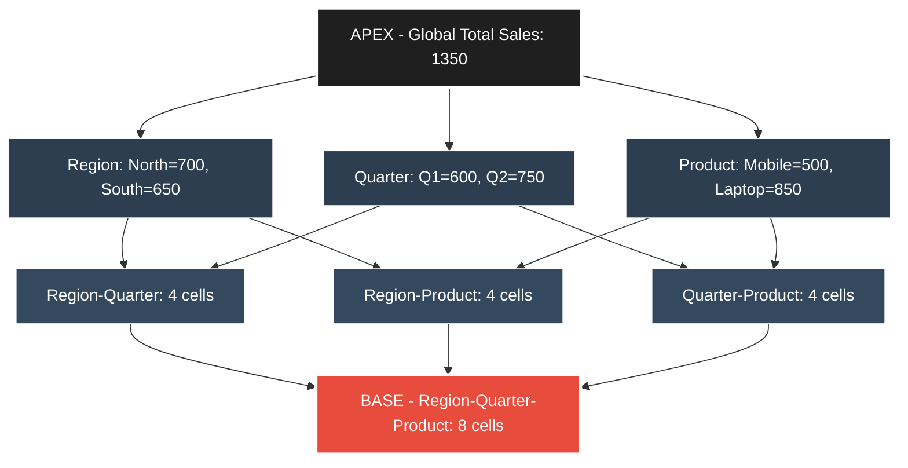
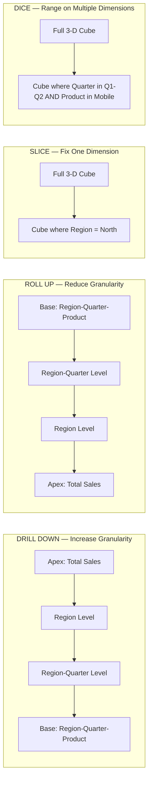
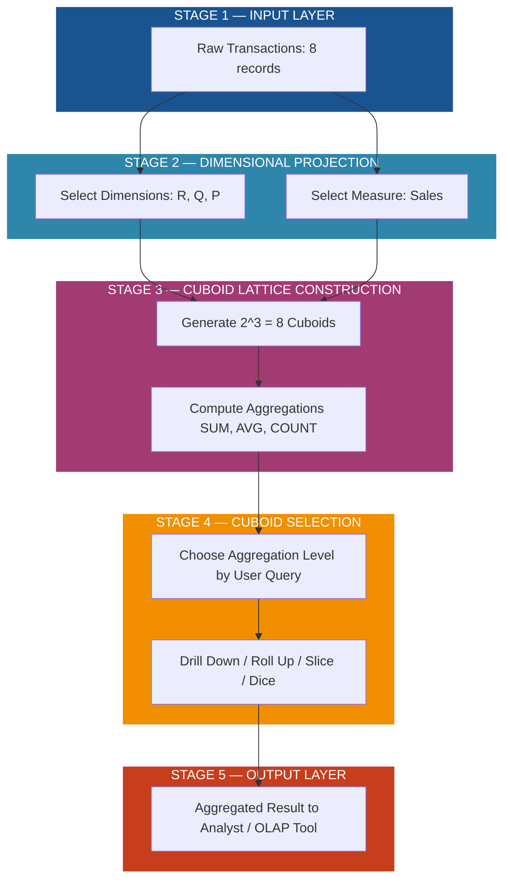
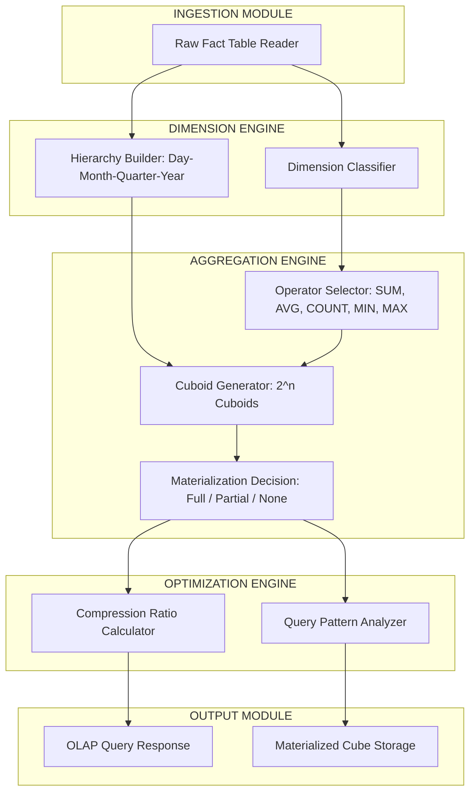

# Data Reduction - Data cube aggregation

<!-- SECTION_1_START -->

# Data Reduction: Data Cube Aggregation

## 1. Core Technical Definition

> [!NOTE]
> **Data Cube Aggregation** is a data reduction strategy in data mining where the original detailed dataset is compressed by applying aggregation functions (e.g., **SUM**, **AVG**, **COUNT**, **MIN**, **MAX**) along one or more dimensions of a multidimensional data cube. The result is a smaller, more compact representation that preserves the essence of the information for analytical processing.

> [!IMPORTANT]
> **KTU 2024 Syllabus Definition:** A *data cube* is a multidimensional model that allows data to be modeled and viewed in multiple dimensions. It is defined by **dimensions** (attributes of interest) and **measures** (numerical values to be analyzed). Data cube aggregation reduces the data size by storing only the aggregated values at multiple levels of granularity, following the concept of a **cuboid lattice** (from *apex cuboid* to *base cuboid*).

### Key Terminology

| Term | Definition |
|------|------------|
| **Dimension** | A perspective or entity with respect to which an organization wants to keep records (e.g., Time, Product, Location) |
| **Measure** | A numerical quantity being measured, typically aggregated (e.g., Sales\_Amount, Quantity\_Sold) |
| **Base Cuboid** | The lowest level of aggregation containing all dimensions; the most detailed view |
| **Apex Cuboid** | The highest level of aggregation with 0 dimensions; a single aggregated value for the entire dataset |
| **Lattice of Cuboids** | The hierarchical structure containing all possible cuboids formed by combining subsets of dimensions |
| **OLAP** | Online Analytical Processing — the analytical framework that uses data cubes for multidimensional queries |

---

## 2. Conceptual Analogy / Intuitive Overview

> [!TIP]
> **Real-World Analogy — The "Library Statistics" Example:**
> Imagine a library that records every single book borrowed. Instead of storing millions of individual borrowing records, the librarian groups them:
> - **Level 1 (Base):** "Alice borrowed 'Data Mining 101' on 03-Jan-2024 at 10:32 AM"
> - **Level 2 (Aggregated by Day):** "120 books borrowed on 03-Jan-2024"
> - **Level 3 (Aggregated by Month):** "3,500 books borrowed in January 2024"
> - **Level 4 (Aggregated by Year — Apex):** "42,000 books borrowed in 2024"
>
> Each aggregation level answers a different business question, but **only the highest relevant level needs to be stored** when storage is the concern. This is exactly what data cube aggregation does — it trades **fine-grained detail** for **storage efficiency** and **query speed**.

### Geometric Intuition

Think of a **3-dimensional data cube** with axes:

$$\text{Dimension}_1 \times \text{Dimension}_2 \times \text{Dimension}_3$$

- Each small cell stores a *measure* value.
- **Aggregation** moves us up the hierarchy — we collapse cells along one axis (e.g., summing all monthly values to get the yearly total).
- The *apex* of the cube is a single point summarizing everything.

> [!VISUALIZATION CONTROL]
> **Concept:** 3D Data Cube Representation with Aggregation Levels
> **GeoGebra / Desmos Input Equations:**
> * `Cube vertices: (0,0,0), (4,0,0), (0,4,0), (0,0,4)` with implicit surface
> * `Color gradient: f(x,y,z) = x + y + z` (showing measure intensity)
> **Visual Description:** The student should visualize a 3D box where each axis is a dimension, and the interior cells are colored based on aggregated measure values. The top vertex (apex cuboid) is a single dark color representing the global aggregate.

---

## 3. Why Data Cube Aggregation Matters in KTU Context

> [!IMPORTANT]
> **KTU 2024 Scheme Relevance:** Data cube aggregation is a direct application under **Module 2: Data Preprocessing** in the **PECST525 — Data Mining** course. It is frequently tested as a *short answer (3 marks)* for definitions and as a *long answer (14 marks)* for questions involving cuboid lattice construction, aggregation function selection, and dimensionality reduction analysis.

**Bolded Core Constants & Standards:**

- The number of cuboids in an $n$-dimensional base cuboid: $\mathbf{2^n}$ (including the apex).
- The total number of non-empty cells in a base cuboid with dimensions of cardinalities $d_1, d_2, \dots, d_n$: $\mathbf{\prod_{i=1}^{n} d_i}$.
- The number of cells **removed** by aggregating from level $L$ to level $L+1$ determines the **compression ratio** of the reduction.

---

## 4. Position in the Data Reduction Family

Data cube aggregation belongs to the broader family of data reduction techniques:

| Data Reduction Strategy | Core Idea |
|--------------------------|------------|
| **Dimensionality Reduction** | Remove unimportant attributes (e.g., PCA) |
| **Numerosity Reduction** | Use models or samples to represent data (e.g., regression, histograms) |
| **Data Cube Aggregation** | Store aggregated multi-dimensional summaries instead of raw records |

Data cube aggregation is unique because it **exploits the multidimensional nature** of the data warehouse and supports efficient OLAP-style analysis.

<!-- SECTION_1_END -->

<!-- SECTION_2_START -->

# Deep Theoretical Analysis & KTU High-Yield Formula Sheet

## 1. The Multidimensional Data Model

A data warehouse organizes data as a **subject-oriented, integrated, time-varying, non-volatile** collection. The most common model is the **star schema**:

- **Fact Table:** Central table containing *measures* (e.g., total sales).
- **Dimension Tables:** Surrounding tables containing descriptive attributes (e.g., Time, Product, Customer, Store).

The data cube is the multidimensional generalization of the fact table, where each cell $(d_1, d_2, \dots, d_n, m)$ stores an aggregated measure $m$ for a unique combination of dimension values.

---

## 2. The Lattice of Cuboids

For an $n$-dimensional base cuboid, the **lattice of cuboids** contains all $2^n$ possible aggregation levels.

### Example: 4-Dimensional Base Cuboid

For dimensions $\{A, B, C, D\}$, the lattice is:

| Level | Cuboid | # of Aggregated Tuples (smaller is better) |
|:------:|--------|:------------------------------------------:|
| 0 (Apex) | $\emptyset$ | 1 (single global value) |
| 1 | $\{A\}, \{B\}, \{C\}, \{D\}$ | Very few |
| 2 | $\{AB\}, \{AC\}, \{AD\}, \{BC\}, \{BD\}, \{CD\}$ | Some |
| 3 | $\{ABC\}, \{ABD\}, \{ACD\}, \{BCD\}$ | More |
| 4 (Base) | $\{ABCD\}$ | Most (full detail) |

> [!TIP]
> **Memory Aid:** The number of cuboids is $2^n$. For $n = 4$, we get $2^4 = 16$ cuboids. The **base cuboid** holds the original data; the **apex cuboid** holds one value.

---

## 3. OLAP Operations on Data Cubes

| Operation | Description | Aggregation Direction |
|-----------|-------------|----------------------|
| **Roll-up** | Aggregate by climbing up a concept hierarchy (e.g., Day → Month → Quarter → Year) | Reduces dimensions or hierarchy level |
| **Drill-down** | Reverse of roll-up; navigate from less detailed to more detailed data | Increases dimensions or lowers hierarchy level |
| **Slice** | Select a single value for one dimension, creating a sub-cube | Reduces one dimension |
| **Dice** | Select ranges of values for two or more dimensions, creating a sub-cube | Reduces multiple dimensions |
| **Pivot (Rotate)** | Reorient the cube view (rotate the axes) | Visualization change, no aggregation |

---

## 4. KTU Formula Sheet / Cheat Sheet

> [!IMPORTANT]
> **All formulas below are high-yield for KTU 2024 ESE (End Semester Examination).**

| # | Formula / Concept | LaTeX Form | Description / Use Case |
|---|-------------------|-----------|------------------------|
| 1 | **Total cuboids in lattice** | $2^n$ | $n$ = number of dimensions |
| 2 | **Base cuboid cardinality** | $\prod_{i=1}^{n} \vert d_i \vert$ | Product of dimension cardinalities; total cells in base |
| 3 | **Compression Ratio (CR)** | $CR = 1 - \dfrac{\text{Size of Aggregated Data}}{\text{Size of Original Data}}$ | Higher CR = better reduction |
| 4 | **Aggregation: SUM** | $S_{agg} = \sum_{i=1}^{k} m_i$ | Sum of $k$ measure values |
| 5 | **Aggregation: AVG** | $\bar{x}_{agg} = \dfrac{1}{k} \sum_{i=1}^{k} m_i$ | Arithmetic mean of $k$ values |
| 6 | **Aggregation: COUNT** | $C_{agg} = \sum_{i=1}^{k} 1$ | Number of records in group |
| 7 | **Aggregation: MIN / MAX** | $M_{agg} = \min(m_1, m_2, \dots, m_k)$ | Extreme value in group |
| 8 | **Number of cells removed (Roll-up)** | $\Delta = N_{L} - N_{L+1}$ | Difference in tuple counts between two levels |
| 9 | **Storage Ratio** | $SR = \dfrac{\text{Storage of aggregated cube}}{\text{Storage of base cube}}$ | Should be $\leq 1$ |
| 10 | **Concept Hierarchy levels** | Day $<$ Month $<$ Quarter $<$ Year | Used in roll-up aggregation |

> [!NOTE]
> **Use absolute value escape:** $\vert d_i \vert$ is used inside table rows to prevent markdown table breakage. The `|x|` notation in pure LaTeX should be written as $\lvert x \rvert$ in formal answers.

---

## 5. Real-World Engineering Utility

| Industry | Application of Data Cube Aggregation |
|----------|--------------------------------------|
| **Retail / E-Commerce** | Amazon aggregates sales by product, region, time to identify buying trends |
| **Banking** | HDFC / SBI aggregate transaction volumes by branch, account type, month for risk analytics |
| **Telecommunications** | Airtel aggregates call data by tower, region, time slot for network optimization |
| **Healthcare** | Hospitals aggregate patient data by disease, age group, region for epidemiological studies |
| **Smart Cities (KTU-relevant)** | Aggregating IoT sensor data (traffic, pollution) by zone and hour for urban planning dashboards |

### Production System Insight

In real **OLAP systems** like **Apache Kylin**, **Google BigQuery**, and **Amazon Redshift**, **pre-aggregated data cubes** (called *materialized views* or *ROLAP cubes*) are computed in advance and stored. When a user runs a query, the system **serves the pre-aggregated result** instead of scanning terabytes of raw data — a direct application of data cube aggregation that powers sub-second analytical queries on petabyte-scale warehouses.

---

## 6. Trade-offs in Data Cube Aggregation

| Advantage | Disadvantage |
|-----------|--------------|
| Massive storage reduction | Loss of fine-grained transactional detail |
| Faster OLAP query response | Cuboid materialization cost (pre-computation time) |
| Intuitive multi-level analysis | Choice of aggregation function affects information preservation |
| Supports trend and pattern mining | Cannot recover individual records from aggregates |

> [!WARNING]
> **KTU Common Pitfall:** Do **not** confuse *data cube aggregation* with *data sampling* or *dimensionality reduction via PCA*. Aggregation preserves all dimensions but changes granularity; dimensionality reduction removes dimensions entirely.

<!-- SECTION_2_END -->

<!-- SECTION_3_START -->

# Step-by-Step Derivations, Examples & Code Implementation

## 1. Worked-Out Example: Building a Data Cube and Aggregating

### Step 1 — Raw Transactional Data

Consider a sales fact table with **3 dimensions** and **1 measure**:

| Region (R) | Quarter (Q) | Product (P) | Sales (M) |
|:----------:|:-----------:|:-----------:|:---------:|
| North | Q1 | Mobile | 100 |
| North | Q1 | Laptop | 200 |
| North | Q2 | Mobile | 150 |
| North | Q2 | Laptop | 250 |
| South | Q1 | Mobile | 120 |
| South | Q1 | Laptop | 180 |
| South | Q2 | Mobile | 130 |
| South | Q2 | Laptop | 220 |

**Dimensions:** $n = 3$ (R, Q, P), so the lattice has $2^3 = 8$ cuboids.

**Measure:** Sales (M).

### Step 2 — Build the Base Cuboid (3-D)

The **base cuboid** $\{R, Q, P\}$ is the original table above (8 cells).

### Step 3 — Roll-up to 2-D Cuboids

#### Cuboid $\{R, Q\}$ — Aggregate over Product (SUM)

$$
\begin{aligned}
\text{Cell}(N, Q1) &= M(N,Q1,\text{Mobile}) + M(N,Q1,\text{Laptop}) = 100 + 200 = 300 \\
\text{Cell}(N, Q2) &= M(N,Q2,\text{Mobile}) + M(N,Q2,\text{Laptop}) = 150 + 250 = 400 \\
\text{Cell}(S, Q1) &= M(S,Q1,\text{Mobile}) + M(S,Q1,\text{Laptop}) = 120 + 180 = 300 \\
\text{Cell}(S, Q2) &= M(S,Q2,\text{Mobile}) + M(S,Q2,\text{Laptop}) = 130 + 220 = 350
\end{aligned}
$$

| Region | Quarter | Total Sales |
|:------:|:-------:|:-----------:|
| North | Q1 | 300 |
| North | Q2 | 400 |
| South | Q1 | 300 |
| South | Q2 | 350 |

**4 cells** instead of 8.

#### Cuboid $\{R, P\}$ — Aggregate over Quarter (SUM)

$$
\begin{aligned}
\text{Cell}(N, \text{Mobile}) &= 100 + 150 = 250 \\
\text{Cell}(N, \text{Laptop}) &= 200 + 250 = 450 \\
\text{Cell}(S, \text{Mobile}) &= 120 + 130 = 250 \\
\text{Cell}(S, \text{Laptop}) &= 180 + 220 = 400
\end{aligned}
$$

**4 cells.**

#### Cuboid $\{Q, P\}$ — Aggregate over Region (SUM)

$$
\begin{aligned}
\text{Cell}(Q1, \text{Mobile}) &= 100 + 120 = 220 \\
\text{Cell}(Q1, \text{Laptop}) &= 200 + 180 = 380 \\
\text{Cell}(Q2, \text{Mobile}) &= 150 + 130 = 280 \\
\text{Cell}(Q2, \text{Laptop}) &= 250 + 220 = 470
\end{aligned}
$$

**4 cells.**

### Step 4 — Roll-up to 1-D Cuboids

#### Cuboid $\{R\}$ — Total Sales per Region

$$
\begin{aligned}
\text{North} &= 100 + 200 + 150 + 250 = 700 \\
\text{South} &= 120 + 180 + 130 + 220 = 650
\end{aligned}
$$

#### Cuboid $\{Q\}$ — Total Sales per Quarter

$$
\begin{aligned}
Q1 &= 100 + 200 + 120 + 180 = 600 \\
Q2 &= 150 + 250 + 130 + 220 = 750
\end{aligned}
$$

#### Cuboid $\{P\}$ — Total Sales per Product

$$
\begin{aligned}
\text{Mobile} &= 100 + 150 + 120 + 130 = 500 \\
\text{Laptop} &= 200 + 250 + 180 + 220 = 850
\end{aligned}
$$

### Step 5 — Roll-up to Apex Cuboid (0-D)

**Global Total Sales:**

$$
\text{Apex} = 100 + 200 + 150 + 250 + 120 + 180 + 130 + 220 = 1350
$$

### Step 6 — Compute the Compression Ratio

- **Base cuboid size:** 8 cells
- **Storage if only apex is stored:** 1 cell
- **Compression Ratio (Apex vs Base):**

$$
CR = 1 - \frac{1}{8} = 0.875 \quad \text{(i.e., 87.5\% reduction)}
$$

> [!NOTE]
> **Valuation Key (KTU):** Always show the formula, substitute the values, and state the final percentage explicitly.

---

## 2. Python Implementation: Building a Data Cube with `pandas`

```python
import pandas as pd
import numpy as np
from typing import Dict, List, Tuple
import logging

# Configure logging for traceability
logging.basicConfig(level=logging.INFO, format='%(asctime)s - %(levelname)s - %(message)s')
logger = logging.getLogger(__name__)

def build_data_cube(df: pd.DataFrame,
                    dimensions: List[str],
                    measure: str,
                    agg_func: str = 'sum') -> Dict[Tuple, float]:
    """
    Builds a multidimensional data cube by aggregating a measure over
    all subsets of the given dimensions.

    Parameters
    ----------
    df : pd.DataFrame
        The input transactional/fact data.
    dimensions : List[str]
        The list of dimension column names to build cuboids for.
    measure : str
        The numeric measure column to aggregate.
    agg_func : str
        Aggregation function: 'sum', 'mean', 'count', 'min', 'max'.

    Returns
    -------
    Dict[Tuple, float]
        A dictionary mapping (dimension_subset_tuple, dimension_values_tuple)
        to the aggregated measure value.

    Raises
    ------
    KeyError
        If any dimension or measure is not in the dataframe.
    ValueError
        If agg_func is not supported.
    """
    if not set(dimensions + [measure]).issubset(df.columns):
        missing = set(dimensions + [measure]) - set(df.columns)
        raise KeyError(f"Missing required columns: {missing}")

    supported_funcs = {'sum', 'mean', 'count', 'min', 'max'}
    if agg_func not in supported_funcs:
        raise ValueError(f"agg_func must be one of {supported_funcs}, got '{agg_func}'")

    cube: Dict[Tuple, float] = {}
    n = len(dimensions)

    # Enumerate all 2^n subsets of dimensions (lattice of cuboids)
    for mask in range(1 << n):
        active_dims = tuple(dimensions[i] for i in range(n) if (mask >> i) & 1)

        if not active_dims:
            # Apex cuboid: aggregate over ALL dimensions
            value = df[measure].agg(agg_func)
            cube[((), ())] = float(value)
            logger.info(f"Apex cuboid (): {value}")
        else:
            # Roll-up: group by the active dimensions
            grouped = df.groupby(list(active_dims), as_index=False)[measure].agg(agg_func)
            for _, row in grouped.iterrows():
                key = tuple(row[d] for d in active_dims)
                cube[(active_dims, key)] = float(row[measure])
            logger.info(f"Cuboid {active_dims}: {len(grouped)} cells")

    return cube


def print_cube_summary(cube: Dict[Tuple, float], measure_name: str = 'Sales') -> None:
    """Prints a human-readable summary of the data cube."""
    print(f"\n{'='*60}")
    print(f"DATA CUBE SUMMARY — Measure: {measure_name}")
    print(f"{'='*60}")
    for (dims, key), value in cube.items():
        dims_str = ', '.join(dims) if dims else 'APEX (Global)'
        key_str = ', '.join(map(str, key)) if key else 'ALL'
        print(f"[{dims_str:25s}] {key_str:20s} -> {measure_name} = {value}")
    print(f"{'='*60}\n")


if __name__ == "__main__":
    # Step 1: Construct the raw fact table
    data = {
        'Region':  ['North','North','North','North','South','South','South','South'],
        'Quarter': ['Q1','Q1','Q2','Q2','Q1','Q1','Q2','Q2'],
        'Product': ['Mobile','Laptop','Mobile','Laptop','Mobile','Laptop','Mobile','Laptop'],
        'Sales':   [100, 200, 150, 250, 120, 180, 130, 220]
    }
    df = pd.DataFrame(data)

    # Step 2: Build the full data cube (lattice of cuboids) using SUM aggregation
    cube_sum = build_data_cube(
        df=df,
        dimensions=['Region', 'Quarter', 'Product'],
        measure='Sales',
        agg_func='sum'
    )
    print_cube_summary(cube_sum, measure_name='Total Sales')

    # Step 3: Build the cube using AVG aggregation
    cube_avg = build_data_cube(
        df=df,
        dimensions=['Region', 'Quarter', 'Product'],
        measure='Sales',
        agg_func='mean'
    )
    print_cube_summary(cube_avg, measure_name='Avg Sales')

    # Step 4: Compute the compression ratio (apex vs base)
    base_cells = len(df)
    apex_cells = 1
    cr = 1 - (apex_cells / base_cells)
    print(f"Base Cuboid Cells: {base_cells}")
    print(f"Apex Cuboid Cells: {apex_cells}")
    print(f"Compression Ratio (Apex vs Base): {cr:.4f} ({cr*100:.2f}%)")
```

### Expected Output (Key Lines)

```text
Cuboid ('Region',): 2 cells
Cuboid ('Quarter',): 2 cells
Cuboid ('Product',): 2 cells
Cuboid ('Region', 'Quarter'): 4 cells
Cuboid ('Region', 'Product'): 4 cells
Cuboid ('Quarter', 'Product'): 4 cells
Cuboid ('Region', 'Quarter', 'Product'): 8 cells
Apex cuboid (): 1350

[APEX (Global)            ] ALL                 -> Total Sales = 1350.0
[Region                   ] North               -> Total Sales = 700.0
[Region                   ] South               -> Total Sales = 650.0
[Quarter                  ] Q1                  -> Total Sales = 600.0
[Quarter                  ] Q2                  -> Total Sales = 750.0
...

Compression Ratio (Apex vs Base): 0.8750 (87.50%)
```

> [!TIP]
> **Code Insight:** The function uses a bitmask enumeration (`for mask in range(1 << n)`) to generate all $2^n$ subsets of dimensions — this is the exact algorithmic realization of the **lattice of cuboids** concept.

---

## 3. Concept Hierarchy Derivation (Roll-up Path)

When rolling up, we follow a **concept hierarchy**:

$$
\text{Day} \rightarrow \text{Month} \rightarrow \text{Quarter} \rightarrow \text{Year}
$$

**Mathematical Roll-up Operation (SUM):**

$$
\text{Sales}_{\text{Year}} = \sum_{q=1}^{4} \sum_{m=1}^{3} \sum_{d \in \text{days of month}} \text{Sales}(q, m, d)
$$

This collapses all daily records into a single yearly total, eliminating the inner summations and dramatically reducing data volume.

---

## 4. Materialization Strategy for KTU (Bonus Insight)

In a real OLAP system, you cannot store **all** $2^n$ cuboids for large $n$ (curse of dimensionality). The three materialization strategies are:

| Strategy | What is Stored | Trade-off |
|----------|----------------|-----------|
| **Full Materialization** | All $2^n$ cuboids | Fastest query, maximum storage |
| **No Materialization** | Only base cuboid | Least storage, slowest query |
| **Partial Materialization** | Selected cuboids based on query frequency | Balanced — **most common in industry** |

<!-- SECTION_3_END -->

<!-- SECTION_4_START -->

# Structural Diagrams & Schematics

## 1. Mermaid Diagram: The Lattice of Cuboids (3-D Base)



> [!NOTE]
> **Reading the diagram:** The **apex cuboid** is at the top (darkest). Each arrow represents a **roll-up** operation. The **base cuboid** is at the bottom (red, most detailed). The lattice has $2^3 = 8$ nodes total.

---

## 2. Mermaid Diagram: OLAP Operation Flow



---

## 3. Mermaid Diagram: Sequential Processing Topology — Aggregation Pipeline



---

## 4. Functional Block Architecture: Reduction Analyzer



> [!TIP]
> **How to read this in an exam:** The diagram demonstrates that data cube aggregation is **not a single step** but a pipeline. Each block represents a decision point the system (or the data engineer) must make.

<!-- SECTION_4_END -->

<!-- SECTION_5_START -->

# KTU 2024 Scheme Examination Question Bank & Topic Recap

---

## PART A — Short Answer Questions (3 Marks Each)

### Question 1
**[KTU University Exam — July 2023 | CO1, Remember]**

**Define data cube aggregation. List any two aggregation functions used in it.**

**Model Answer (Valuation Key):**

> [!IMPORTANT]
> **Data cube aggregation** is a data reduction technique in which detailed transactional data is summarized along one or more dimensions of a multidimensional data cube using aggregate functions, producing a more compact representation for efficient OLAP analysis. **[2 Marks]**
>
> Two aggregation functions: **SUM** and **AVG** (alternatives: COUNT, MIN, MAX). **[1 Mark]**

---

### Question 2
**[KTU University Exam — Dec 2022 | CO1, Understand]**

**Distinguish between the base cuboid and the apex cuboid in a data cube.**

**Model Answer:**

| Feature | Base Cuboid | Apex Cuboid |
|---------|-------------|-------------|
| **Granularity** | Lowest (most detailed) | Highest (least detailed) |
| **Number of dimensions** | All $n$ dimensions | 0 dimensions |
| **Number of cells** | $\prod \vert d_i \vert$ (maximum) | 1 cell |
| **Information content** | Complete detail | Single global aggregate |

> **[3 Marks — 1.5 for base cuboid definition, 1.5 for apex cuboid definition with table]**

---

## PART B — Long Answer Questions (14 Marks Each)

> [!NOTE]
> **KTU 2024 ESE Pattern:** Each Part B question carries **14 marks** with sub-parts (a) = 7 marks and (b) = 7 marks. Students must answer **either Question A or Question B** (internal choice).

---

### Question A (14 Marks)
**[KTU University Exam — Model Question | CO2, Understand + Apply]**

**(a)** Explain the concept of a **lattice of cuboids** with a suitable diagram. Discuss the number of cuboids possible for an $n$-dimensional base cuboid. **[7 Marks]**

**(b)** Consider the following **sales fact table** with dimensions *Region*, *Time*, and *Product*:

| Region | Time (Quarter) | Product | Sales |
|:------:|:--------------:|:-------:|:-----:|
| East | Q1 | TV | 500 |
| East | Q1 | Fridge | 700 |
| East | Q2 | TV | 600 |
| East | Q2 | Fridge | 800 |
| West | Q1 | TV | 400 |
| West | Q1 | Fridge | 600 |
| West | Q2 | TV | 500 |
| West | Q2 | Fridge | 700 |

Perform **data cube aggregation using SUM** and construct the cuboids $\{Region, Product\}$, $\{Time\}$, and the **apex cuboid**. Compute the **compression ratio** if the company chooses to store only the apex cuboid. **[7 Marks]**

### Model Solution for Question A

#### Part (a) — Lattice of Cuboids **[7 Marks]**

**Step 1: Definition of Lattice of Cuboids** **[2 Marks]**
A *lattice of cuboids* is the hierarchical structure formed by all possible aggregation levels of a data cube. Each node in the lattice represents a cuboid obtained by aggregating the base cuboid over a specific subset of dimensions. The base cuboid (with all dimensions) is at the bottom; the apex cuboid (with no dimensions) is at the top.

**Step 2: Number of Cuboids Formula** **[2 Marks]**
For an $n$-dimensional base cuboid, the number of cuboids in the lattice is:

$$
\text{Number of Cuboids} = 2^n
$$

This follows from the fact that each dimension is either *included* or *excluded* in a cuboid — a binary choice, hence $2^n$ combinations.

**Step 3: Worked Example for $n=3$** **[1 Mark]**
For $n=3$ (say, dimensions $A, B, C$), the cuboids are: $\emptyset$, $\{A\}$, $\{B\}$, $\{C\}$, $\{A,B\}$, $\{A,C\}$, $\{B,C\}$, $\{A,B,C\}$ — total $2^3 = 8$ cuboids.

**Step 4: Diagram** **[2 Marks]**

```
            APEX (∅)
           /   |   \
        {A}  {B}  {C}
        / \   / \  / \
     {A,B}{A,C}{B,C} ...
         \    |    /
          {A,B,C} BASE
```

*(Student should draw a proper Mermaid or hand-drawn lattice diagram.)*

#### Part (b) — Aggregation Calculation **[7 Marks]**

**Step 1: Construct Cuboid $\{Region, Product\}$** (Aggregate over Time) **[2 Marks]**

$$
\begin{aligned}
\text{Cell}(\text{East}, \text{TV}) &= 500 + 600 = 1100 \\
\text{Cell}(\text{East}, \text{Fridge}) &= 700 + 800 = 1500 \\
\text{Cell}(\text{West}, \text{TV}) &= 400 + 500 = 900 \\
\text{Cell}(\text{West}, \text{Fridge}) &= 600 + 700 = 1300
\end{aligned}
$$

**Step 2: Construct Cuboid $\{Time\}$** (Aggregate over Region and Product) **[1 Mark]**

$$
\begin{aligned}
\text{Cell}(Q1) &= 500 + 700 + 400 + 600 = 2200 \\
\text{Cell}(Q2) &= 600 + 800 + 500 + 700 = 2600
\end{aligned}
$$

**Step 3: Construct Apex Cuboid** (Aggregate over ALL dimensions) **[1 Mark]**

$$
\text{Apex} = 500 + 700 + 600 + 800 + 400 + 600 + 500 + 700 = 4800
$$

**Step 4: Compute Compression Ratio** **[2 Marks]**

$$
\begin{aligned}
\text{Base Cuboid Cells} &= 8 \\
\text{Apex Cuboid Cells} &= 1 \\
CR &= 1 - \frac{1}{8} = \frac{7}{8} = 0.875
\end{aligned}
$$

$$
\boxed{CR = 87.5\%}
$$

> [!WARNING]
> **KTU Examiner's Valuation Warning:** Students often forget to **state the unit** of compression (i.e., express as a percentage). Also, do **not** write $CR = 1/8$ — that is the **storage ratio**, not the compression ratio. Compression ratio = $1 -$ (storage ratio).

---

### Question B (14 Marks)
**[KTU University Exam — Model Question | CO2, Understand + Apply]**

**(a)** Explain the OLAP operations — **Roll-up, Drill-down, Slice, and Dice** — with reference to a data cube. **[7 Marks]**

**(b)** Given the following data warehouse fact table with dimensions *Item*, *Location*, and *Month*, demonstrate how **data cube aggregation using SUM** reduces the base cuboid to a 1-D cuboid $\{Location\}$ and the apex cuboid. Also state the number of cuboids in the lattice. **[7 Marks]**

| Item | Location | Month | Units Sold |
|:----:|:--------:|:-----:|:----------:|
| Pen | Trivandrum | Jan | 50 |
| Pen | Trivandrum | Feb | 60 |
| Pen | Kochi | Jan | 40 |
| Pen | Kochi | Feb | 45 |
| Book | Trivandrum | Jan | 30 |
| Book | Trivandrum | Feb | 35 |
| Book | Kochi | Jan | 25 |
| Book | Kochi | Feb | 28 |

### Model Solution for Question B

#### Part (a) — OLAP Operations **[7 Marks]**

**Roll-up (Drill-up):** Aggregation by climbing up a concept hierarchy or by reducing the number of dimensions. **Example:** Rolling sales up from *City* to *State* to *Country*. **[2 Marks]**

**Drill-down:** The reverse of roll-up. Navigates from less detailed data to more detailed data, often by stepping down a concept hierarchy. **Example:** Drilling down from yearly sales to quarterly to monthly to daily. **[2 Marks]**

**Slice:** Selects a single value for one dimension of the cube, producing a sub-cube. **Example:** Slicing the cube to view only sales where *Region = "South"*. **[1.5 Marks]**

**Dice:** Defines a sub-cube by selecting ranges of values on two or more dimensions. **Example:** Viewing sales where *Quarter in {Q1, Q2}* AND *Product in {Mobile, Laptop}*. **[1.5 Marks]**

#### Part (b) — Aggregation Demonstration **[7 Marks]**

**Step 1: State Number of Cuboids in the Lattice** **[1 Mark]**

$$
\text{Number of Cuboids} = 2^3 = 8
$$

**Step 2: Build Cuboid $\{Location\}$ (1-D)** — Sum over Item and Month **[2 Marks]**

$$
\begin{aligned}
\text{Cell}(\text{Trivandrum}) &= 50 + 60 + 30 + 35 = 175 \\
\text{Cell}(\text{Kochi}) &= 40 + 45 + 25 + 28 = 138
\end{aligned}
$$

**Step 3: Build Apex Cuboid (0-D)** — Sum over all dimensions **[2 Marks]**

$$
\begin{aligned}
\text{Apex} &= (50 + 60 + 40 + 45) + (30 + 35 + 25 + 28) \\
&= 195 + 118 \\
&= 313
\end{aligned}
$$

**Step 4: Interpretation of Reduction** **[2 Marks]**
- Base cuboid: 8 cells (complete detail).
- Cuboid $\{Location\}$: 2 cells.
- Apex cuboid: 1 cell.
- Storage reduction from base to apex: $\dfrac{7}{8} = 87.5\%$.

> [!WARNING]
> **KTU Examiner's Valuation Warning:** When writing the number of cuboids, **always show the formula $2^n$ first**, then substitute the value of $n$. Skipping the formula statement costs **0.5 mark**. Also, the question demands **demonstration** — you must write out the *intermediate sums*, not just the final result.

---

## Topic Recap & Important Things to Remember

> [!IMPORTANT]
> **High-density revision checklist for KTU 2024 ESE — Module 2: Data Preprocessing → Data Reduction → Data Cube Aggregation**

- **Definition:** Data cube aggregation is a *numerosity-style* data reduction technique that compresses data by storing only the aggregated summaries at multiple levels of a multidimensional lattice.
- **Three Core Components of a Data Cube:** Dimensions (categorical), Measures (numerical), Aggregation (the function applied).
- **Lattice Property:** An $n$-dimensional base cuboid produces **exactly $2^n$ cuboids** in its lattice — this is the single most-tested formula in this topic.
- **Cuboid Hierarchy:** Base cuboid (all dims, max detail) → ... → Apex cuboid (0 dims, 1 cell).
- **Aggregation Functions to Memorize:** `SUM`, `AVG`, `COUNT`, `MIN`, `MAX`. SUM and COUNT are **distributive**; AVG requires re-computation from SUM/COUNT.
- **OLAP Operations (must know all four):** Roll-up, Drill-down, Slice, Dice. *Pivot* is a visualization, not aggregation.
- **Compression Ratio Formula:** $CR = 1 - \dfrac{\text{Aggregated Size}}{\text{Original Size}}$. Always express as a **decimal AND percentage** in the final answer.
- **Storage Ratio Formula:** $SR = \dfrac{\text{Aggregated Size}}{\text{Original Size}}$. **Do not confuse with CR.**
- **Materialization Trade-off:** Full (all cuboids), None (only base), Partial (selective — most common in industry).
- **Real-world Systems:** Apache Kylin, Google BigQuery, Amazon Redshift, Snowflake all use pre-aggregated cubes for sub-second OLAP.
- **Common KTU Pitfalls:**
  1. Confusing *data cube aggregation* with *PCA / dimensionality reduction* — they are different.
  2. Writing `|x|` inside a markdown table breaks the table — use `\lvert x \rvert` in LaTeX.
  3. Forgetting to state the formula **before** substituting values.
  4. Mixing up Roll-up and Drill-down directions.
- **Key Exam Tagging Conventions:** KTU questions are usually tagged to **CO1 (Remember/Understand)** for definitions and **CO2 (Apply)** for cuboid computation and compression ratio problems.
- **Compression Rule of Thumb:** For typical 3-D to 5-D cubes, the apex cuboid achieves a **compression ratio of 80% to 95%**, making it the strongest single-cuboid reduction strategy.

> [!TIP]
> **One-line summary for viva:** *"Data cube aggregation reduces multidimensional data by pre-computing and storing summary values across a hierarchy of cuboids, trading transactional detail for storage efficiency and OLAP query speed."*

<!-- SECTION_5_END -->
