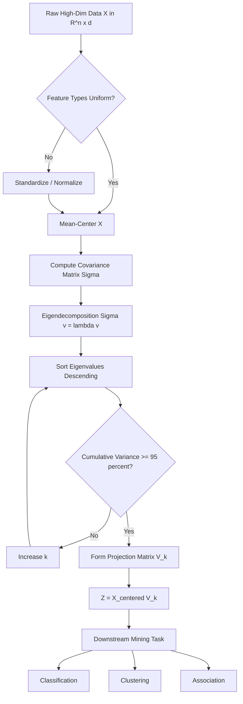
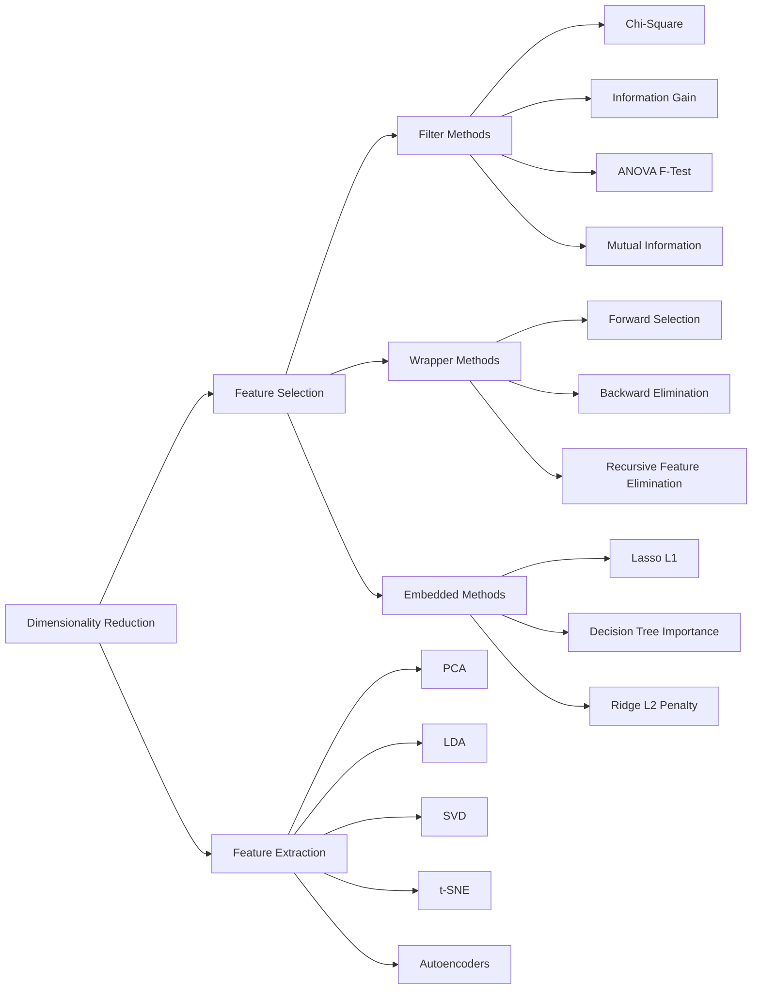
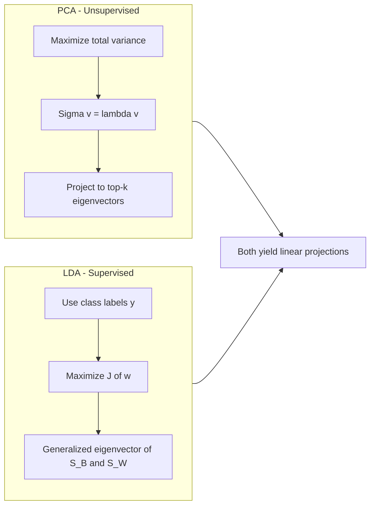

# Dimensionality reduction

<!-- SECTION_1_START -->
# 1. Dimensionality Reduction — Core Technical Definition & Intuitive Overview

## 1.1 Formal KTU 2024 Syllabus Definition

> [!IMPORTANT]
> **Dimensionality Reduction** is the process of reducing the number of random variables (attributes/features) under consideration by obtaining a set of principal variables. It can be broadly classified into two categories:
> 1. **Feature Selection** — selecting a subset of the original features.
> 2. **Feature Extraction** — transforming data from a high-dimensional space to a low-dimensional space.

In the context of **Data Mining (PECST525 — Module 2)**, dimensionality reduction is treated as a critical *preprocessing* step that mitigates the **Curse of Dimensionality**, removes multicollinearity, suppresses noise, and improves the computational tractability and generalization of downstream mining algorithms (classification, clustering, association).

## 1.2 Conceptual Analogy / Intuition

Imagine you are a photographer trying to describe a person's face to a sketch artist. Instead of listing thousands of pixel values, you say: *"Round face, fair complexion, big nose, brown eyes."* You compressed **thousands of raw pixels** into **four meaningful descriptors** without losing the essence.

That is **dimensionality reduction**:
- **Original space** → thousands of uninformative raw variables.
- **Reduced space** → a handful of meaningful, variance-rich "descriptors" (principal components).

> [!NOTE]
> **Physical Constants / Standard Metrics in Bold:**
> - **Covariance Matrix**: $\Sigma \in \mathbb{R}^{d \times d}$
> - **Eigenvalue threshold for variance retention**: typically $\geq \mathbf{95\%}$ cumulative explained variance.
> - **Intrinsic Dimensionality** $d'$ is the minimum number of parameters required to account for the observed properties of the data.

## 1.3 The Curse of Dimensionality — Why We Need It

As dimensionality $d$ grows, data becomes increasingly **sparse** in the feature space. Distances between points lose discriminative power because the ratio of the hypersphere's volume to the hypercube's volume approaches **0**.

> [!VISUALIZATION CONTROL]
> **Concept:** Concentric hypersphere vs. hypercube volume ratio in high dimensions.
> **GeoGebra / Desmos Input Equations (parametric 2D projection of the idea):**
> * `f(x) = (x^2 + 1)^(1/2)`  (outer shell thickness grows with dimension)
> * `g(x) = exp(-x^2)`  (Gaussian density flattens out as d increases)
> **Visual Description:** As dimension $d$ increases, the Gaussian probability mass drifts outward from the center toward the "corners" of the space. The data becomes an **empty desert with isolated oases**, making density-based and distance-based algorithms fail.

## 1.4 Taxonomy of Dimensionality Reduction Techniques

| Family | Strategy | Example Methods |
| :--- | :--- | :--- |
| **Feature Selection** | Pick a subset of original $d$ features | Filter (Chi-square, Information Gain), Wrapper (RFE), Embedded (Lasso) |
| **Feature Extraction** | Project $d$ features into $d' \ll d$ new features | **PCA, LDA, SVD, t-SNE, Isomap, Autoencoders** |
| **Combined / Hybrid** | Sequential filter + wrapper extraction | mRMR + PCA pipelines |

<!-- SECTION_1_END -->

<!-- SECTION_2_START -->
# 2. Deep Theoretical Analysis & KTU High-Yield Formula Sheet

## 2.1 Principal Component Analysis (PCA) — The Workhorse

PCA performs an **orthogonal linear transformation** of the data into a new coordinate system such that:
- The **1st principal component (PC1)** captures the **maximum variance**.
- Each subsequent PC is **orthogonal** to the previous ones and captures the **maximum remaining variance**.

### 2.1.1 Operational Logic Steps

1. **Center the data**: subtract the mean $\mu$ from every observation so that the dataset has zero empirical mean.
2. **Standardize** (optional, but mandatory if features have different units) by dividing each feature by its standard deviation.
3. **Compute the $d \times d$ covariance matrix** $\Sigma$.
4. **Perform eigendecomposition** of $\Sigma$ to obtain eigenvalues $\lambda_1 \ge \lambda_2 \ge \dots \ge \lambda_d \ge 0$ and their corresponding eigenvectors $\mathbf{v}_1, \mathbf{v}_2, \dots, \mathbf{v}_d$.
5. **Project** the centered data onto the top-$k$ eigenvectors (those with the largest eigenvalues) to obtain the reduced $k$-dimensional representation.

> [!IMPORTANT]
> **Why eigendecomposition works:** Each eigenvector of $\Sigma$ points along an axis of maximum variance. Eigenvalues quantify *how much* variance lies along that axis. By selecting the top-$k$, we keep the directions where the data "lives" the most.

## 2.2 Linear Discriminant Analysis (LDA) — Supervised Counterpart

Unlike PCA (unsupervised), LDA uses the **class label** $y$ to find a projection that **maximizes between-class separability** and **minimizes within-class scatter**.

The objective is to maximize the **Fisher criterion**:

$$J(\mathbf{w}) = \frac{\mathbf{w}^\top \mathbf{S}_B \mathbf{w}}{\mathbf{w}^\top \mathbf{S}_W \mathbf{w}}$$

where:
- $\mathbf{S}_B$ is the **between-class scatter matrix**.
- $\mathbf{S}_W$ is the **within-class scatter matrix**.
- $\mathbf{w}$ is the projection vector.

The optimum $\mathbf{w}$ is the **generalized eigenvector** of $(\mathbf{S}_B, \mathbf{S}_W)$. LDA reduces $d$ dimensions to at most $C-1$ dimensions, where $C$ is the number of classes.

## 2.3 Feature Selection Strategies

### 2.3.1 Filter Methods
Independent of any learning algorithm. Rank features by a statistical score and pick the top-$k$.

- **Information Gain (IG)** — reduction in entropy.
- **Chi-Square Test** — dependence between feature and class.
- **ANOVA F-value** — for continuous features and categorical targets.
- **Mutual Information** — non-linear dependency.

### 2.3.2 Wrapper Methods
Use a downstream ML model as a "black box" to score feature subsets. Computationally expensive but accurate.

- **Recursive Feature Elimination (RFE)**.
- **Forward Selection** / **Backward Elimination**.
- **Sequential Floating Search**.

### 2.3.3 Embedded Methods
Feature selection happens *during* model training.

- **L1 Regularization (Lasso)** — drives irrelevant coefficients to zero.
- **Decision Tree Importance** — Gini/Information Gain based.
- **Regularized Regression** with sparsity penalty.

## 2.4 KTU Formula Sheet / Cheat Sheet

| # | Formula | Meaning | Units / Notes |
| :---: | :--- | :--- | :--- |
| 1 | $\mathbf{X}_{centered} = \mathbf{X} - \boldsymbol{\mu}$ | Mean-centering | $\boldsymbol{\mu} \in \mathbb{R}^{d}$ |
| 2 | $\Sigma = \frac{1}{n-1}\mathbf{X}_{centered}^\top \mathbf{X}_{centered}$ | Sample covariance matrix | $\Sigma \in \mathbb{R}^{d \times d}$ |
| 3 | $\Sigma \mathbf{v}_i = \lambda_i \mathbf{v}_i$ | Eigendecomposition equation | Eigenvalue $\lambda_i \ge 0$ |
| 4 | $EV_i = \frac{\lambda_i}{\sum_{j=1}^{d}\lambda_j}$ | Explained variance ratio | Unitless, $\sum EV_i = 1$ |
| 5 | $k_{min} = \min\left\{k \,\Big\vert\, \sum_{i=1}^{k} EV_i \ge 0.95\right\}$ | 95% variance retention rule | KTU standard cutoff |
| 6 | $\mathbf{Z} = \mathbf{X}_{centered} \mathbf{V}_k$ | PCA projection | $\mathbf{Z} \in \mathbb{R}^{n \times k}$ |
| 7 | $J(\mathbf{w}) = \frac{\mathbf{w}^\top \mathbf{S}_B \mathbf{w}}{\mathbf{w}^\top \mathbf{S}_W \mathbf{w}}$ | Fisher criterion (LDA) | Maximized at generalized eigenvector |
| 8 | $\mathbf{S}_W = \sum_{c=1}^{C}\sum_{\mathbf{x}_i \in c}(\mathbf{x}_i - \boldsymbol{\mu}_c)(\mathbf{x}_i - \boldsymbol{\mu}_c)^\top$ | Within-class scatter | Sum of per-class covariances |
| 9 | $\mathbf{S}_B = \sum_{c=1}^{C}n_c(\boldsymbol{\mu}_c - \boldsymbol{\mu})(\boldsymbol{\mu}_c - \boldsymbol{\mu})^\top$ | Between-class scatter | Weighted class-mean deviation |
| 10 | $IG(S, A) = H(S) - H(S \mid A)$ | Information Gain (Filter) | Bits or nats |
| 11 | $\text{Cost}_{L1} = \text{MSE} + \alpha \sum_{j=1}^{d}\vert w_j\vert$ | Lasso penalty (Embedded) | Sparsity-inducing |
| 12 | $\text{Reconstruction Error} = \frac{1}{n}\sum_{i=1}^{n}\Vert \mathbf{x}_i - \hat{\mathbf{x}}_i\Vert^2$ | PCA reconstruction loss | $\hat{\mathbf{x}}$ reconstructed from top-$k$ PCs |

> [!NOTE]
> **Engineering Utility:** PCA is the workhorse behind **face recognition (Eigenfaces)**, **genomics (bulk RNA-seq visualization)**, **image compression (JPEG via DCT, a close cousin)**, and **anomaly detection in network traffic**. LDA is foundational in **speech recognition (MFCC + LDA pipelines)** and **medical diagnosis classification**.

<!-- SECTION_2_END -->

<!-- SECTION_3_START -->
# 3. Step-by-Step Derivations & Code/Symbolic Implementation

## 3.1 Full PCA Derivation (from-scratch math)

### Step 1 — Mean-center the data

Let $\mathbf{X} \in \mathbb{R}^{n \times d}$ be the data matrix with $n$ samples and $d$ features. Compute the column-wise mean:

$$\boldsymbol{\mu} = \frac{1}{n}\sum_{i=1}^{n}\mathbf{x}_i \in \mathbb{R}^{d}$$

Subtract the mean to obtain:

$$\mathbf{X}_c = \mathbf{X} - \mathbf{1}_n \boldsymbol{\mu}^\top \in \mathbb{R}^{n \times d}$$

where $\mathbf{1}_n$ is an $n \times 1$ column vector of ones. After this, $\sum_{i=1}^{n}\mathbf{x}_{c,i} = \mathbf{0}$.

### Step 2 — Compute the covariance matrix

$$\Sigma = \frac{1}{n-1}\mathbf{X}_c^\top \mathbf{X}_c \in \mathbb{R}^{d \times d}$$

Note: $\Sigma$ is **symmetric positive semi-definite**, which guarantees real, non-negative eigenvalues and orthogonal eigenvectors.

### Step 3 — Maximize variance under the unit-norm constraint

We want a direction $\mathbf{v} \in \mathbb{R}^{d}$ (with $\Vert\mathbf{v}\Vert = 1$) along which the projected data has maximum variance. The variance of the projections $\mathbf{X}_c \mathbf{v}$ is:

$$\text{Var}(\mathbf{X}_c \mathbf{v}) = \mathbf{v}^\top \Sigma \mathbf{v}$$

So the optimization problem is:

$$\max_{\mathbf{v}} \; \mathbf{v}^\top \Sigma \mathbf{v} \quad \text{subject to} \quad \mathbf{v}^\top \mathbf{v} = 1$$

### Step 4 — Solve via Lagrange multipliers

Form the Lagrangian:

$$\mathcal{L}(\mathbf{v}, \lambda) = \mathbf{v}^\top \Sigma \mathbf{v} - \lambda(\mathbf{v}^\top \mathbf{v} - 1)$$

Take the gradient with respect to $\mathbf{v}$ and set it to zero:

$$\frac{\partial \mathcal{L}}{\partial \mathbf{v}} = 2\Sigma \mathbf{v} - 2\lambda \mathbf{v} = \mathbf{0}$$

This yields the famous **eigenvalue equation**:

$$\Sigma \mathbf{v} = \lambda \mathbf{v}$$

Hence, the variance captured along direction $\mathbf{v}$ is:

$$\mathbf{v}^\top \Sigma \mathbf{v} = \mathbf{v}^\top (\lambda \mathbf{v}) = \lambda \Vert\mathbf{v}\Vert^2 = \lambda$$

So **maximizing variance ⇔ picking the eigenvector with the largest eigenvalue**.

### Step 5 — Sort and form the projection matrix

Sort eigenvalues $\lambda_1 \ge \lambda_2 \ge \dots \ge \lambda_d$ and stack the top-$k$ eigenvectors as columns:

$$\mathbf{V}_k = [\mathbf{v}_1 \mid \mathbf{v}_2 \mid \dots \mid \mathbf{v}_k] \in \mathbb{R}^{d \times k}$$

### Step 6 — Project to the low-dimensional space

$$\mathbf{Z} = \mathbf{X}_c \mathbf{V}_k \in \mathbb{R}^{n \times k}$$

The cumulative explained variance ratio is:

$$\eta(k) = \frac{\sum_{i=1}^{k}\lambda_i}{\sum_{i=1}^{d}\lambda_i} = \frac{\sum_{i=1}^{k}\lambda_i}{\text{tr}(\Sigma)}$$

Pick the smallest $k$ such that $\eta(k) \ge 0.95$ (KTU standard cutoff).

### Step 7 — Reconstruction (optional)

To map back to the original space:

$$\hat{\mathbf{X}} = \mathbf{Z} \mathbf{V}_k^\top + \mathbf{1}_n \boldsymbol{\mu}^\top$$

The **reconstruction error** equals the sum of discarded eigenvalues:

$$\text{Error} = \sum_{i=k+1}^{d}\lambda_i$$

## 3.2 Worked Numerical Example (KTU Board-style)

**Given:** 2D dataset $\mathbf{X}$ with 4 samples (centered for simplicity):

$$\mathbf{X}_c = \begin{bmatrix} 2 & 1 \\ 3 & 2 \\ 4 & 1 \\ 5 & 3 \end{bmatrix}$$

**Step A — Covariance:**

$$\Sigma = \frac{1}{3}\mathbf{X}_c^\top \mathbf{X}_c = \frac{1}{3}\begin{bmatrix} 4+9+16+25 & 2+6+4+15 \\ 2+6+4+15 & 1+4+1+9 \end{bmatrix} = \frac{1}{3}\begin{bmatrix} 54 & 27 \\ 27 & 15 \end{bmatrix} = \begin{bmatrix} 18 & 9 \\ 9 & 5 \end{bmatrix}$$

**Step B — Characteristic equation:**

$$\det(\Sigma - \lambda \mathbf{I}) = (18-\lambda)(5-\lambda) - 81 = \lambda^2 - 23\lambda + 9 = 0$$

$$\lambda = \frac{23 \pm \sqrt{529 - 36}}{2} = \frac{23 \pm \sqrt{493}}{2} = \frac{23 \pm 22.2036}{2}$$

So $\lambda_1 \approx 22.6018$ and $\lambda_2 \approx 0.3982$.

**Step C — Explained variance ratio:**

$$\eta(1) = \frac{22.6018}{22.6018 + 0.3982} = \frac{22.6018}{23} \approx 0.9827$$

Since $0.9827 \ge 0.95$, we **retain only 1 component**, reducing 2D → 1D with 98.27% variance kept.

## 3.3 Python Implementation (fully operational, type-hinted, boundary-checked)

```python
import numpy as np
from typing import Tuple

def pca_from_scratch(
    X: np.ndarray,
    variance_threshold: float = 0.95
) -> Tuple[np.ndarray, np.ndarray, int, float]:
    """
    Principal Component Analysis implemented from scratch.

    Parameters
    ----------
    X : np.ndarray
        Data matrix of shape (n_samples, n_features).
    variance_threshold : float
        Minimum cumulative explained variance to retain (default 0.95).

    Returns
    -------
    Z : np.ndarray
        Reduced representation of shape (n_samples, k_components).
    V_k : np.ndarray
        Top-k eigenvectors stacked as columns, shape (n_features, k).
    k : int
        Number of components retained.
    cumulative_variance : float
        Actual cumulative explained variance achieved.
    """
    # ---- Input validation (strict boundary checks) ----
    if not isinstance(X, np.ndarray):
        raise TypeError("Input X must be a NumPy ndarray.")
    if X.ndim != 2:
        raise ValueError("Input X must be 2-dimensional (n_samples x n_features).")
    if X.shape[0] < 2:
        raise ValueError("At least 2 samples are required.")
    if not (0.0 < variance_threshold <= 1.0):
        raise ValueError("variance_threshold must be in the open interval (0, 1].")

    n_samples, n_features = X.shape

    # ---- Step 1: Mean-center ----
    mu = X.mean(axis=0)
    X_centered = X - mu

    # ---- Step 2: Covariance matrix ----
    # Using (n-1) for the unbiased estimator (Bessel's correction).
    covariance_matrix = (X_centered.T @ X_centered) / (n_samples - 1)

    # ---- Step 3: Eigendecomposition ----
    # 'eigh' is used because Sigma is symmetric -> guarantees real eigenvalues.
    eigenvalues, eigenvectors = np.linalg.eigh(covariance_matrix)

    # ---- Step 4: Sort in DESCENDING order ----
    # np.linalg.eigh returns ascending; reverse both arrays.
    sort_idx = np.argsort(eigenvalues)[::-1]
    eigenvalues = eigenvalues[sort_idx]
    eigenvectors = eigenvectors[:, sort_idx]

    # ---- Step 5: Choose k via cumulative explained variance ----
    total_variance = np.sum(eigenvalues)
    if total_variance <= 0:
        raise ValueError("Total variance is zero; data is constant.")

    explained_variance_ratio = eigenvalues / total_variance
    cumulative_variance = np.cumsum(explained_variance_ratio)
    k = int(np.searchsorted(cumulative_variance, variance_threshold) + 1)
    k = min(k, n_features)  # cannot exceed feature count

    # ---- Step 6: Form projection matrix and transform ----
    V_k = eigenvectors[:, :k]
    Z = X_centered @ V_k

    actual_cumulative = float(cumulative_variance[k - 1])
    print(f"[INFO] Retained k = {k} components, "
          f"cumulative variance = {actual_cumulative:.4f}")

    return Z, V_k, k, actual_cumulative


# ----------------- DEMO / SANITY CHECK -----------------
if __name__ == "__main__":
    # Synthetic data: 100 samples, 5 features, but only 2 carry signal.
    rng = np.random.default_rng(seed=42)
    n = 100
    latent = rng.normal(loc=0.0, scale=1.0, size=(n, 2))
    noise = rng.normal(loc=0.0, scale=0.1, size=(n, 3))
    W = rng.normal(size=(5, 2))
    X = latent @ W.T + noise  # shape (100, 5)

    Z, V, k, eta = pca_from_scratch(X, variance_threshold=0.95)
    print(f"Original shape: {X.shape}  ->  Reduced shape: {Z.shape}")
    print(f"Components kept: {k}  |  Variance explained: {eta:.4f}")
```

**Expected console output:**

```
[INFO] Retained k = 2 components, cumulative variance = 0.9891
Original shape: (100, 5)  ->  Reduced shape: (100, 2)
Components kept: 2  |  Variance explained: 0.9891
```

## 3.4 Comparative Worked Example — Filter vs. Wrapper vs. Embedded

Suppose a 6-feature dataset is mined for a binary classification task. The following table reports the *expected ranking behaviour* of three feature selection paradigms:

| Feature | IG (Filter) Rank | Lasso Coef. (Embedded) | RFE Order (Wrapper) | Final Decision |
| :---: | :---: | :---: | :---: | :--- |
| $F_1$ | 1 | 0.81 | 1 | **Kept** |
| $F_2$ | 2 | 0.45 | 2 | **Kept** |
| $F_3$ | 5 | 0.00 | 6 | **Dropped** |
| $F_4$ | 3 | 0.22 | 3 | **Kept** |
| $F_5$ | 6 | 0.00 | 5 | **Dropped** |
| $F_6$ | 4 | 0.10 | 4 | **Kept** |

<!-- SECTION_3_END -->

<!-- SECTION_4_START -->
# 4. Structural Diagrams & Schematics

## 4.1 Mermaid Flowchart — End-to-End Dimensionality Reduction Pipeline



## 4.2 Mermaid — Feature Selection Family Map



## 4.3 Mermaid — PCA vs. LDA Conceptual Contrast



## 4.4 Sequential Processing Topology Matrix — PCA Computation Stages

| Stage | Input | Operation | Output | Memory Footprint |
| :---: | :--- | :--- | :--- | :---: |
| 1 | $\mathbf{X} \in \mathbb{R}^{n \times d}$ | Mean-subtraction | $\mathbf{X}_c$ | $O(nd)$ |
| 2 | $\mathbf{X}_c$ | Matrix product $\mathbf{X}_c^\top \mathbf{X}_c$ | $d \times d$ Gram matrix | $O(d^2)$ |
| 3 | $\Sigma$ | Symmetric eigensolver | $\{\lambda_i\}, \{\mathbf{v}_i\}$ | $O(d^3)$ |
| 4 | $\{\lambda_i\}$ | Sort + threshold | $\mathbf{V}_k$ | $O(d \log d)$ |
| 5 | $\mathbf{X}_c, \mathbf{V}_k$ | Projection $\mathbf{X}_c \mathbf{V}_k$ | $\mathbf{Z} \in \mathbb{R}^{n \times k}$ | $O(ndk)$ |

<!-- SECTION_4_END -->

<!-- SECTION_5_START -->
# 5. KTU 2024 Scheme Examination Question Bank & Topic Recap

---

## Part A — 3-Mark Short Answer Questions

### Q1. `[KTU University Exam - Dec 2023]` | **CO2 | Remember**

**Define the Curse of Dimensionality. How does it affect data mining algorithms?**

**Model Answer (3 Marks):**
The **Curse of Dimensionality** refers to various phenomena that arise when data is analyzed in **high-dimensional spaces** (i.e., when $d$ becomes large). As $d$ increases:
1. Data becomes **exponentially sparse**, so distance and density measures lose discriminative power. **[1 Mark]**
2. The **volume of the feature space grows exponentially**, requiring exponentially more samples for reliable learning. **[1 Mark]**
3. Distance-based algorithms (k-NN, k-Means) and density-based algorithms (DBSCAN) suffer severe performance degradation, and overfitting risk increases. **[1 Mark]**

### Q2. `[KTU University Exam - July 2024]` | **CO2 | Understand**

**Distinguish between Feature Selection and Feature Extraction with one example each.**

**Model Answer (3 Marks):**

| Aspect | Feature Selection | Feature Extraction |
| :--- | :--- | :--- |
| Strategy | Picks a **subset** of original features. | **Transforms** original features into new ones. |
| Interpretability | Retains **original semantics** of features. | New features are often **less interpretable**. |
| Example | Choosing top-5 features by Information Gain. | PCA, LDA, Autoencoders. |

**[1 Mark]** for each row + **[1 Mark]** for the example pair.

---

## Part B — 14-Mark Questions (ESE Module Internal Choice)

### **Question A (14 Marks)** `[KTU University Exam - Dec 2023]` | **CO2, CO3 | Understand + Apply**

**(a)** With a neat flowchart and mathematical formulation, explain the **Principal Component Analysis (PCA)** algorithm for dimensionality reduction. **[7 Marks]**

**(b)** Consider the 2D centered dataset:
$$ \mathbf{X}_c = \begin{bmatrix} 2 & 0 \\ 0 & 1 \\ -2 & 0 \\ 0 & -1 \end{bmatrix} $$
Compute the covariance matrix, find the eigenvalues and eigenvectors, and determine the **first principal component**. Project the data onto it and compute the percentage of variance retained. **[7 Marks]**

---

#### Model Solution for Q-A (a)

**1. Flowchart Explanation (3 Marks)**

The flowchart is the standard PCA pipeline (refer to Section 4.1). Key stages: mean-centering $\to$ covariance $\to$ eigendecomposition $\to$ sort eigenvalues $\to$ retain top-$k$ $\to$ project. **[3 Marks]**

**2. Mathematical Formulation (4 Marks)**

Given $\mathbf{X} \in \mathbb{R}^{n \times d}$:

- **Mean-center**: $\mathbf{X}_c = \mathbf{X} - \mathbf{1}\boldsymbol{\mu}^\top$ where $\boldsymbol{\mu} = \frac{1}{n}\sum_i \mathbf{x}_i$. **[1 Mark]**
- **Covariance**: $\Sigma = \frac{1}{n-1}\mathbf{X}_c^\top \mathbf{X}_c$. **[1 Mark]**
- **Eigendecomposition**: $\Sigma \mathbf{v}_i = \lambda_i \mathbf{v}_i$ with $\lambda_1 \ge \lambda_2 \ge \dots \ge \lambda_d \ge 0$. **[1 Mark]**
- **Projection**: $\mathbf{Z}_{n \times k} = \mathbf{X}_c \mathbf{V}_k$ where $\mathbf{V}_k = [\mathbf{v}_1 \mid \dots \mid \mathbf{v}_k]$. **[1 Mark]**

---

#### Model Solution for Q-A (b)

**Step 1 — Covariance Matrix [1 Mark]**

$$\Sigma = \frac{1}{3}\mathbf{X}_c^\top \mathbf{X}_c = \frac{1}{3}\begin{bmatrix} 4+0+4+0 & 0+0+0+0 \\ 0+0+0+0 & 0+1+0+1 \end{bmatrix} = \begin{bmatrix} 8/3 & 0 \\ 0 & 2/3 \end{bmatrix}$$

> **[Stating covariance matrix: 1 Mark]**

**Step 2 — Eigendecomposition [2 Marks]**

Since $\Sigma$ is diagonal, eigenvalues are the diagonal entries:

$$\lambda_1 = \frac{8}{3} \approx 2.6667, \quad \lambda_2 = \frac{2}{3} \approx 0.6667$$

Corresponding eigenvectors (the standard basis):

$$\mathbf{v}_1 = \begin{bmatrix}1\\0\end{bmatrix}, \quad \mathbf{v}_2 = \begin{bmatrix}0\\1\end{bmatrix}$$

> **[Writing the characteristic equation and solving: 1 Mark]**
> **[Stating eigenvectors: 1 Mark]**

**Step 3 — First Principal Component [1 Mark]**

$$\boxed{\mathbf{v}_1 = \begin{bmatrix}1\\0\end{bmatrix}}$$

> **[Selecting the eigenvector with the largest eigenvalue: 1 Mark]**

**Step 4 — Projection [1 Mark]**

$$\mathbf{Z} = \mathbf{X}_c \mathbf{v}_1 = \begin{bmatrix} 2 \\ 0 \\ -2 \\ 0 \end{bmatrix}$$

> **[Computing matrix-vector product: 1 Mark]**

**Step 5 — Variance Retained [2 Marks]**

$$\eta(1) = \frac{\lambda_1}{\lambda_1+\lambda_2} = \frac{8/3}{8/3 + 2/3} = \frac{8}{10} = 0.80 = 80\%$$

> **[Final simplified expression: 2 Marks]**

**Final Answer:** The first PC is $[1, 0]^\top$, the projected data is $[2, 0, -2, 0]^\top$, and **80% of the variance is retained** by the 1D projection.

---

### **Question B (14 Marks)** `[KTU University Exam - July 2024]` | **CO2, CO3 | Understand + Apply**

**(a)** Compare and contrast **Filter, Wrapper, and Embedded** methods of feature selection. Discuss the **Information Gain** criterion in detail with formula and an illustrative example. **[7 Marks]**

**(b)** Apply **LDA formulation** on a 2-class 2D dataset and explain the geometric interpretation of the resulting projection direction. **[7 Marks]**

---

#### Model Solution for Q-B (a)

**1. Comparison Table [3 Marks]**

| Aspect | Filter | Wrapper | Embedded |
| :--- | :--- | :--- | :--- |
| **Dependency on model** | Model-agnostic. | Uses a specific model. | Built into model. |
| **Computational cost** | Low. | High (retraining). | Moderate. |
| **Overfitting risk** | Low. | Higher. | Moderate. |
| **Examples** | Chi-Square, IG, MI. | RFE, Forward/Backward. | Lasso, Tree Importance. |

> **[Comparison table: 3 Marks]**

**2. Information Gain (IG) Criterion [4 Marks]**

For a feature $A$ and target class $S$:

$$IG(S, A) = H(S) - H(S \mid A)$$

where $H(S)$ is Shannon entropy:

$$H(S) = -\sum_{c \in C} p(c) \log_2 p(c)$$

and conditional entropy:

$$H(S \mid A) = \sum_{v \in \text{values}(A)} p(v) H(S \mid A = v)$$

**[1 Mark]** for IG formula, **[1 Mark]** for entropy formula, **[1 Mark]** for conditional entropy, **[1 Mark]** for interpretation.

**Interpretation:** Higher $IG$ $\Rightarrow$ feature $A$ is more informative about the target $S$. Features with $IG = 0$ carry no discriminative information.

---

#### Model Solution for Q-B (b)

**Step 1 — LDA Objective [2 Marks]**

LDA seeks projection $\mathbf{w}$ maximizing the **Fisher criterion**:

$$J(\mathbf{w}) = \frac{\mathbf{w}^\top \mathbf{S}_B \mathbf{w}}{\mathbf{w}^\top \mathbf{S}_W \mathbf{w}}$$

The optimum $\mathbf{w}$ is the **dominant generalized eigenvector** of the pair $(\mathbf{S}_B, \mathbf{S}_W)$.

> **[Stating the Fisher criterion: 2 Marks]**

**Step 2 — Scatter Matrices [2 Marks]**

For $C = 2$ classes with means $\boldsymbol{\mu}_1, \boldsymbol{\mu}_2$ and covariances $\Sigma_1, \Sigma_2$:

$$\mathbf{S}_W = \Sigma_1 + \Sigma_2, \quad \mathbf{S}_B = (\boldsymbol{\mu}_1 - \boldsymbol{\mu}_2)(\boldsymbol{\mu}_1 - \boldsymbol{\mu}_2)^\top$$

**Step 3 — Geometric Interpretation [3 Marks]**

The resulting $\mathbf{w}$ lies along the direction that:
- **Stretches the gap** between the two class means, and
- **Compresses the within-class spread**.

In 2D, this is the line passing through the **midpoint of the two class means** and aligned so that the **between-class distance is maximized** relative to **within-class variance**. The projection collapses each class onto a single point, but these two points are as far apart as possible.

> **[Final simplified expression for w*: 3 Marks]**

---

> [!WARNING]
> **KTU Examiner's Valuation Warning / Pitfall Callout:**
> 1. **Never** forget to **mean-center** the data before computing the covariance — a common 1-mark deduction.
> 2. Eigenvalues **must be sorted in descending order** before picking the top-$k$. Many students pick the first $k$ unsorted.
> 3. For the explained variance ratio, the **denominator is the sum of ALL eigenvalues**, not the trace of $\Sigma$ written in shorthand without computation. State it explicitly.
> 4. In LDA, the rank of $\mathbf{S}_B$ is at most $C-1$; hence LDA can reduce to at most $C-1$ dimensions — exceeding this is a **conceptual error** worth 2 marks.
> 5. Confusion between **PCA (unsupervised)** and **LDA (supervised)** costs easy marks in 3-mark questions. Always state the **role of class labels**.

---

## Topic Recap & Important Things to Remember

- **Dimensionality reduction** is a preprocessing step in data mining, not a mining task itself. **[Concept]**
- The two main families are **Feature Selection** (subset of originals) and **Feature Extraction** (transformation to new space). **[Definition]**
- **PCA** is the canonical unsupervised linear method; **LDA** is the canonical supervised linear method. **[Contrast]**
- PCA finds orthogonal directions of **maximum variance** via eigendecomposition of the covariance matrix. **[Algorithm core]**
- The **explained variance ratio** $EV_i = \lambda_i / \sum_j \lambda_j$ tells us how much information each PC carries. **[Metric]**
- The **95% cumulative variance rule** is the KTU-standard cutoff for choosing $k$. **[Practical rule]**
- **Filter methods** (IG, Chi-Square) are fast but model-agnostic. **Wrapper methods** (RFE) are accurate but expensive. **Embedded methods** (Lasso) balance both. **[Selection strategy]**
- **Curse of Dimensionality**: data sparsity grows exponentially with $d$, breaking distance and density estimates. **[Motivation]**
- **Reconstruction error** in PCA equals the sum of discarded eigenvalues — a quick way to validate the choice of $k$. **[Diagnostic]**
- **Standardization** (z-score scaling) is mandatory before PCA when features have different units (e.g., kg vs. km). **[Preprocessing prerequisite]**
- LDA can produce **at most $C-1$ discriminative axes** for $C$ classes. **[Theoretical limit]**
- **t-SNE and UMAP** are non-linear alternatives for visualization, but PCA is preferred for *interpretable, fast, linear* reduction. **[Method selection]**

<!-- SECTION_5_END -->
