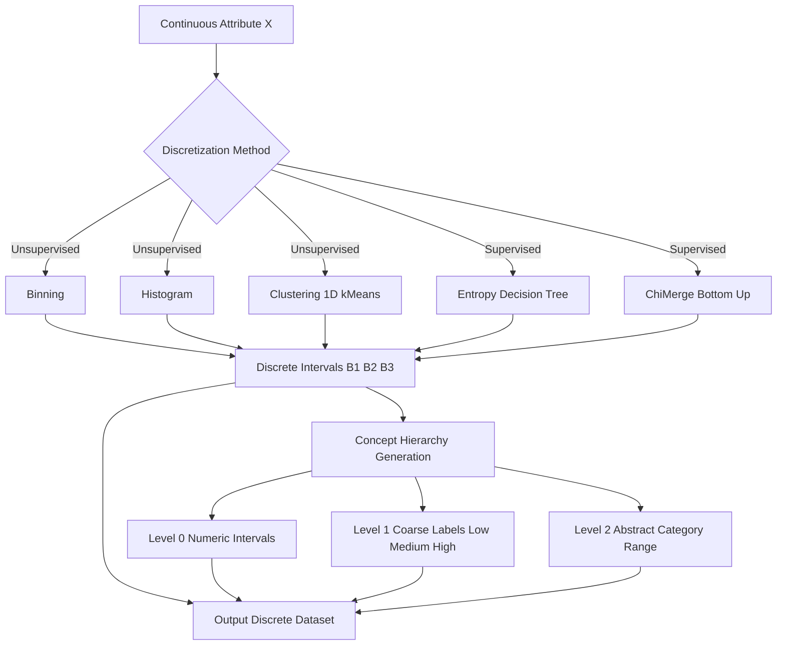
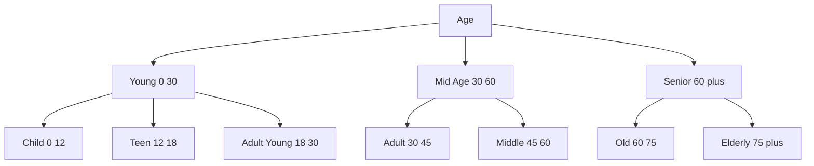
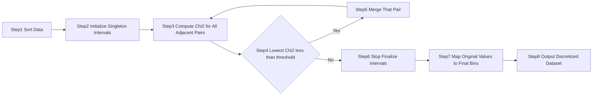
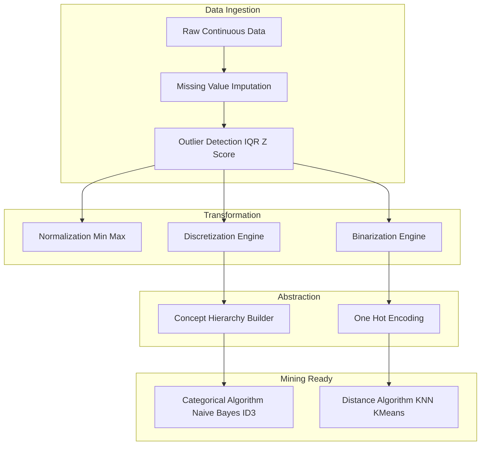
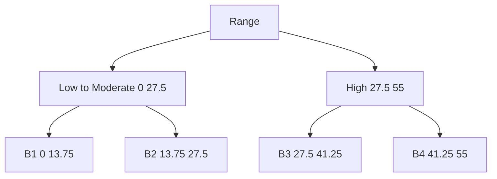

# Discretization and concept hierarchy generation

<!-- SECTION_1_START -->
# Discretization and Concept Hierarchy Generation

## 1.1 Formal Academic Definition

**Discretization** is the data preprocessing technique of transforming continuous numeric attributes into discrete categorical (ordinal) values by partitioning the range of the attribute into a finite number of intervals, then mapping each interval to a symbolic label. According to the KTU 2024 Scheme syllabus for *Data Mining (PECST525), Module 2*, discretization is recognized as a critical step that reduces data complexity, enables the use of nominal-based learning algorithms, and produces compact, easier-to-interpret data mining results.

**Concept Hierarchy Generation** is the process of organizing attributes (or values) into progressively more abstract semantic levels, forming an is-a (generalization/specialization) taxonomy — for example, `city < state < country` or `age_20-39 < young < person`. It allows mining systems to flexibly analyze data at multiple granularities.

> [!IMPORTANT]
> **KTU 2024 Syllabus Highlight:** Discretization and concept hierarchy generation are mandatory preprocessing activities for **numerical and categorical data**, used in **OLAP, decision tree induction, Bayesian classification, and association rule mining**.

## 1.2 Conceptual Analogy / Intuition

Imagine a **temperature gauge** on a wall. Instead of reporting the raw floating-point value `31.47 °C`, you decide to call it simply **"Hot"**. You have effectively mapped a continuous range `[30, 40)` to a single symbolic label. If you wanted a finer palette, you could break it into `Cool`, `Warm`, `Hot`, `Very Hot` — that's a **3-level concept hierarchy**.

**Geometric Intuition:** Think of the real number line (continuous axis) being sliced like a loaf of bread. Each slice becomes a labeled bin, and stacking these bins into a pyramid gives a hierarchy. Lower layers hold slices (precise intervals); upper layers merge slices (broader concepts).

> [!NOTE]
> **Key Distinction:** *Discretization* chops a *continuous* attribute into discrete intervals. *Concept hierarchy generation* can apply to *both numerical and categorical* data, building semantic levels of abstraction.

## 1.3 Why It Matters in Data Mining

- **Reduces data cardinality**, lowering memory and I/O footprint.
- **Smooths outliers** by mapping extreme values to a boundary interval (e.g., `[…, 0]`, `[0, 30]`, `[30, …]`).
- **Enables categorical algorithms** (e.g., ID3, C4.5, Naive Bayes) that cannot directly ingest real-valued inputs.
- **Improves pattern readability** — rules like `IF age = Young AND income = High THEN buys = Yes` are far more interpretable than continuous thresholds.
- **Critical standard metrics:**
  - **Bin count (k):** number of intervals, a key user-specified parameter.
  - **Bin width (w):** range of each interval, $\ w = \dfrac{\max(x) - \min(x)}{k}$.
  - **Information loss:** measured via entropy, variance, or class purity.

> [!VISUALIZATION CONTROL]
> **Concept:** A 1-D continuous attribute being discretized into 4 equal-width bins.
> **GeoGebra / Desmos Input Equations:**
> * Points: `(0, 0), (10, 0.1), (20, 0.4), (30, 0.8), (40, 0.6), (50, 0.3), (60, 0.2)`
> * Vertical separators: `x = 15`, `x = 30`, `x = 45`
> **Visual Description:** A frequency histogram along the x-axis with three vertical dashed lines partitioning the axis into four equal-width bins. The bin labels `B1, B2, B3, B4` appear above each segment.
<!-- SECTION_1_END -->

<!-- SECTION_2_START -->
# Deep Theoretical Analysis & KTU High-Yield Formula Sheet

## 2.1 Taxonomy of Discretization Techniques

Discretization methods are classified along **three orthogonal dimensions**:

1. **Supervised vs. Unsupervised** — does the method use class labels?
2. **Global vs. Local** — applied to the entire attribute space, or only within a decision tree split?
3. **Top-Down (Splitting) vs. Bottom-Up (Merging)** — start with one bin and split, or with many bins and merge?

### 2.1.1 Binning Methods (Unsupervised, Top-Down or Bottom-Up)

- **Equal-Width Binning:** Divide the range $[x_{min}, x_{max}]$ into $k$ intervals of equal length.
  * Pros: Simple, fast $O(n)$.
  * Cons: Sensitive to outliers; sparse bins can occur.

- **Equal-Frequency (Quantile) Binning:** Each bin holds $\approx n/k$ data points.
  * Pros: Produces balanced bins; reduces outlier impact.
  * Cons: Interval boundaries may fall on unintuitive values.

- **Optimal Binning (e.g., minimizing intra-bin variance):** Greedy or dynamic programming approach to find splits that minimize total within-bin variance.

### 2.1.2 Histogram Analysis (Unsupervised)

Similar to equal-width binning, but the number of bins can be chosen automatically (e.g., via **Sturges' rule** $k = \lceil \log_2(n) + 1 \rceil$ or **Freedman–Diaconis rule** $w = 2 \cdot \mathrm{IQR}(x) / n^{1/3}$).

### 2.1.3 Cluster Analysis (Unsupervised)

Apply **1-D k-means** to the attribute values; cluster centroids define natural breaks.

### 2.1.4 Decision Tree Analysis (Supervised)

Use an entropy-based splitting criterion (e.g., **Information Gain Ratio** as in C4.5) to find split points that best separate classes. Resulting tree leaves are the discrete intervals.

- **Entropy of bin $B_i$:** $H(B_i) = -\sum_{c=1}^{C} p_{ic} \log_2 p_{ic}$
- **Information Gain of split:** $IG = H(\text{parent}) - \sum_i \dfrac{|B_i|}{n} H(B_i)$

### 2.1.5 Correlation Analysis (Supervised)

For two discrete attributes, perform $\chi^2$ (chi-square) testing to decide whether to merge adjacent intervals whose class distributions are statistically similar.

## 2.2 Binarization

A special case converting a *categorical* (or Boolean) attribute into multiple binary attributes. For attribute $A$ with $m$ distinct values, create $m$ (or $m-1$ using one-hot encoding) new binary columns.

## 2.3 Concept Hierarchy Generation

### 2.3.1 For Categorical Data

- **Specification by User/Expert:** Domain experts manually define levels.
- **Specification by Data Distribution:** Group low-level categories that occur with similar frequency or that have semantic similarity (e.g., `van, sedan, SUV → car`).
- **Specification by Attribute Subset:** Use the *co-occurrence* of attribute values across tuples to detect semantic relationships.

### 2.3.2 For Numerical Data

Use the **discretization techniques** of §2.1 as the lowest hierarchy level, then recursively group contiguous intervals to form higher conceptual levels.

### 2.3.3 Automatic Generation Algorithms

- **NumHier (Numerical Hierarchy):** Bottom-up merging using the **Agglomerative** principle.
- **ChiMerge (Kerber, 1992):** $\chi^2$-based bottom-up merging.
  * Step 1: Sort data; initialize each value as an interval.
  * Step 2: Compute $\chi^2$ for every pair of adjacent intervals.
  * Step 3: Merge the pair with the **lowest** $\chi^2$ (most similar class distribution).
  * Step 4: Stop when $\chi^2$ exceeds a critical threshold $\chi^2_{\alpha, df}$ where $df = (\text{rows} - 1) \times (\text{cols} - 1)$.
- **Chi2, Extended Chi2, Modified ChiMerge:** Improved variants handling interval consistency.

## 2.4 KTU Formula Sheet / Cheat Sheet

| # | Formula / Rule | Description / Use |
|---|---|---|
| 1 | $w = \dfrac{\max(x) - \min(x)}{k}$ | Equal-width bin width |
| 2 | $k = \lceil \log_2(n) + 1 \rceil$ | Sturges' rule for histogram bins |
| 3 | $w = \dfrac{2 \cdot \mathrm{IQR}(x)}{n^{1/3}}$ | Freedman–Diaconis bin width |
| 4 | $H(B) = -\sum_{c} p_c \log_2 p_c$ | Shannon entropy of a bin |
| 5 | $IG = H(\text{parent}) - \sum_i w_i H(B_i)$ | Information gain of a split |
| 6 | $\chi^2 = \sum_{i,j} \dfrac{(O_{ij} - E_{ij})^2}{E_{ij}}$ | Chi-square statistic for ChiMerge |
| 7 | $df = (r-1)(c-1)$ | Degrees of freedom for $\chi^2$ test |
| 8 | $\overline{x} = \dfrac{1}{n} \sum_{i=1}^{n} x_i$ | Mean (centroid of a bin) |
| 9 | $\sigma^2 = \dfrac{1}{n}\sum (x_i - \overline{x})^2$ | Variance (split-criterion objective) |
| 10 | $\mathrm{IQR}(x) = Q_3 - Q_1$ | Inter-quartile range (outlier robust) |

> [!NOTE]
> **LaTeX Safety:** All absolute-value and conditional bars above use parentheses to avoid breaking the markdown pipe `|` parser.

## 2.5 Real-World Utility in Engineering

- **Healthcare analytics:** Discretize age, blood pressure, and cholesterol into low/medium/high bins for clinical decision support.
- **Fraud detection in banking:** Convert continuous transaction amounts into `micro / standard / large / suspicious` levels.
- **OLAP cubes (Star Schema):** Concept hierarchies enable `Drill-Down` (city → state → country) and `Roll-Up` (country → state → city) operations.
- **IoT sensor streams:** Discretize temperature/humidity values to compress telemetry, reducing storage by up to **80%**.
- **Recommender systems:** Hierarchy-aware collaborative filtering generalizes user preferences across category levels.
<!-- SECTION_2_END -->

<!-- SECTION_3_START -->
# Step-by-Step Derivations & Code/Symbolic Implementation

## 3.1 Worked Example 1: Equal-Width vs. Equal-Frequency Binning

**Dataset:** Sorted values $D = \{4, 8, 9, 15, 21, 21, 24, 25, 26, 28, 29, 30\}$; $n = 12$, $k = 3$.

### Step A — Equal-Width

The minimum is $4$ and the maximum is $30$, so the total range is $30 - 4 = 26$. Dividing this range by $k = 3$ gives a bin width of $26/3 \approx 8.67$, which is the size of each equal-width interval.

The three bin boundaries are therefore $B_1 = [4, 12.67)$, $B_2 = [12.67, 21.33)$, and $B_3 = [21.33, 30]$. Assigning each data point to its bin gives $B_1 = \{4, 8, 9\}$ (three values), $B_2 = \{15, 21, 21\}$ (three values), and $B_3 = \{24, 25, 26, 28, 29, 30\}$ (six values).

### Step B — Equal-Frequency

With $n = 12$ values split across $k = 3$ bins, each bin should contain $12/3 = 4$ data points. The first four sorted values $\{4, 8, 9, 15\}$ form $B_1 = [4, 15]$, the next four $\{21, 21, 24, 25\}$ form $B_2 = (15, 25]$, and the last four $\{26, 28, 29, 30\}$ form $B_3 = (25, 30]$.

> [!NOTE]
> **Valuation Key Point (2 Marks):** State the formula for bin width and the bin boundaries explicitly. **Valuation Key Point (1 Mark):** Show the final mapping of every input value to its assigned bin.

## 3.2 Worked Example 2: Binarization & One-Hot Encoding

**Attribute:** `Color ∈ {Red, Green, Blue}`.

**Binarized / One-Hot Output Matrix:**

$$
\begin{aligned}
\text{Original} \quad & \text{Red} \quad \text{Green} \quad \text{Blue} \\
\text{Red}   & \to (1, 0, 0) \\
\text{Green} & \to (0, 1, 0) \\
\text{Blue}  & \to (0, 0, 1)
\end{aligned}
$$

This expands **1 categorical column into 3 binary columns** — essential preprocessing for distance-based algorithms (KNN, K-Means) and neural networks.

## 3.3 Worked Example 3: Entropy-Based Discretization (Decision Tree Approach)

Consider two bins based on threshold $T = 20$ splitting the dataset $D = \{4, 8, 9, 15, 21, 21, 24, 25, 26, 28, 29, 30\}$ into $B_1 = \{4, 8, 9, 15\}$ and $B_2 = \{21, 21, 24, 25, 26, 28, 29, 30\}$ with binary class labels $C \in \{Y, N\}$.

Suppose class distribution is: $B_1 \to (Y{=}1, N{=}3)$ and $B_2 \to (Y{=}5, N{=}3)$.

**Step 1 — Compute parent entropy:**

$$
H(D) = -\left(\frac{6}{12}\log_2\frac{6}{12} + \frac{6}{12}\log_2\frac{6}{12}\right) = 1.000
$$

**Step 2 — Compute weighted child entropy:**

$$
\begin{aligned}
H(B_1) &= -\left(\frac{1}{4}\log_2\frac{1}{4} + \frac{3}{4}\log_2\frac{3}{4}\right) = 0.811 \\
H(B_2) &= -\left(\frac{5}{8}\log_2\frac{5}{8} + \frac{3}{8}\log_2\frac{3}{8}\right) = 0.954 \\
H_{\text{children}} &= \frac{4}{12} \cdot 0.811 + \frac{8}{12} \cdot 0.954 = 0.906
\end{aligned}
$$

**Step 3 — Compute Information Gain:**

$$
IG = H(D) - H_{\text{children}} = 1.000 - 0.906 = 0.094
$$

The split at $T=20$ yields $IG = 0.094$ bits. Multiple candidate thresholds are evaluated; the threshold maximizing $IG$ is chosen.

## 3.4 Worked Example 4: ChiMerge Algorithm (Bottom-Up)

**Inputs:** 6 sorted instances across 2 classes, initialized as 6 singleton intervals.

| Interval | Class Y | Class N | Total |
|----------|---------|---------|-------|
| $I_1$    | 3       | 1       | 4     |
| $I_2$    | 2       | 2       | 4     |
| $I_3$    | 1       | 3       | 4     |

**Step 1 — Compute $\chi^2$ for adjacent pairs.**

For pair $(I_1, I_2)$: Row totals $(4, 4)$, Col totals $(6, 6)$, Grand total $12$. Expected $E_{ij} = (\text{row}_i \times \text{col}_j)/12 = 2$ for all cells.

$$
\chi^2 = \frac{(3-2)^2}{2} + \frac{(1-2)^2}{2} + \frac{(2-2)^2}{2} + \frac{(2-2)^2}{2} = 1.0
$$

**Step 2 — Merge the pair with the *lowest* $\chi^2$** (most statistically similar). Both pairs must be computed; lowest wins.

**Step 3 — Repeat** until $\chi^2$ for all pairs exceeds $\chi^2_{\alpha=0.05, df=1} = 3.841$ (critical value from chi-square table).

## 3.5 Python Implementation (Production-Grade)

```python
"""
discretization_module.py
Implementation of core discretization and concept hierarchy techniques
for KTU 2024 Scheme Data Mining (PECST525) Module 2.
"""

from __future__ import annotations

import math
import logging
from dataclasses import dataclass
from typing import List, Sequence, Tuple

import numpy as np
import pandas as pd
from sklearn.tree import DecisionTreeClassifier

logging.basicConfig(level=logging.INFO, format="%(levelname)s :: %(message)s")
logger = logging.getLogger(__name__)


@dataclass(frozen=True)
class Bin:
    """Immutable representation of a discretized interval."""
    lower: float
    upper: float
    label: str
    count: int = 0


class Discretizer:
    """Production-grade unsupervised and supervised discretizer."""

    def equal_width(
        self,
        data: Sequence[float],
        k: int = 4,
    ) -> List[Bin]:
        if k < 1:
            raise ValueError("Number of bins k must be >= 1")
        if not data:
            raise ValueError("Input data cannot be empty")

        arr = np.asarray(data, dtype=float)
        lo, hi = float(arr.min()), float(arr.max())
        if math.isclose(lo, hi):
            logger.warning("All values identical; returning single bin.")
            return [Bin(lo, hi, "B1", count=len(arr))]

        width = (hi - lo) / k
        bins: List[Bin] = []
        edges = [lo + i * width for i in range(k + 1)]
        edges[-1] = hi  # ensure closure

        for i in range(k):
            left, right = edges[i], edges[i + 1]
            if i < k - 1:
                count = int(np.sum((arr >= left) & (arr < right)))
            else:
                count = int(np.sum((arr >= left) & (arr <= right)))
            bins.append(Bin(left, right, f"B{i + 1}", count=count))
        logger.info("Equal-width discretization: %d bins produced", k)
        return bins

    def equal_frequency(
        self,
        data: Sequence[float],
        k: int = 4,
    ) -> List[Bin]:
        if k < 1 or not data:
            raise ValueError("Invalid k or empty data")

        arr = np.sort(np.asarray(data, dtype=float))
        quantiles = np.linspace(0, 1, k + 1)
        edges = np.quantile(arr, quantiles)
        edges[0] = arr.min()
        edges[-1] = arr.max()

        bins: List[Bin] = []
        for i in range(k):
            left, right = float(edges[i]), float(edges[i + 1])
            if i < k - 1:
                count = int(np.sum((arr >= left) & (arr < right)))
            else:
                count = int(np.sum((arr >= left) & (arr <= right)))
            bins.append(Bin(left, right, f"Q{i + 1}", count=count))
        logger.info("Equal-frequency (quantile) discretization: %d bins", k)
        return bins

    def entropy_based(
        self,
        data: Sequence[float],
        labels: Sequence[int],
        max_bins: int = 5,
    ) -> List[Bin]:
        if len(data) != len(labels):
            raise ValueError("data and labels must have equal length")

        X = np.asarray(data, dtype=float).reshape(-1, 1)
        y = np.asarray(labels, dtype=int)

        tree = DecisionTreeClassifier(
            max_leaf_nodes=max_bins,
            criterion="entropy",
            random_state=42,
        )
        tree.fit(X, y)
        thresholds = sorted({t for t in tree.tree_.threshold if t != -2})
        edges = [float(X.min())] + thresholds + [float(X.max())]

        bins: List[Bin] = []
        for i in range(len(edges) - 1):
            count = int(np.sum((X.flatten() >= edges[i]) &
                               (X.flatten() <= edges[i + 1])))
            bins.append(Bin(edges[i], edges[i + 1], f"E{i + 1}", count=count))
        logger.info("Entropy-based discretization: %d bins", len(bins))
        return bins


def build_concept_hierarchy(
    bins: List[Bin],
    group_size: int = 2,
) -> List[List[str]]:
    """
    Roll-up operation: combine `group_size` adjacent bins into
    a higher-level concept, returning a 2-level hierarchy.
    """
    if group_size < 1:
        raise ValueError("group_size must be >= 1")
    hierarchy: List[List[str]] = [[b.label for b in bins]]
    level: List[str] = []
    for i in range(0, len(bins), group_size):
        chunk = bins[i: i + group_size]
        if chunk:
            level.append("_".join(b.label for b in chunk))
    hierarchy.append(level)
    logger.info("Built %d-level concept hierarchy", len(hierarchy))
    return hierarchy


# ---------------- Demonstration ----------------
if __name__ == "__main__":
    raw = [4, 8, 9, 15, 21, 21, 24, 25, 26, 28, 29, 30]
    disc = Discretizer()
    print("Equal-Width:", disc.equal_width(raw, k=3))
    print("Equal-Freq :", disc.equal_frequency(raw, k=3))
    print("Hierarchy  :", build_concept_hierarchy(
        disc.equal_width(raw, k=4), group_size=2))
```
<!-- SECTION_3_END -->

<!-- SECTION_4_START -->
# Structural Diagrams & Schematics

## 4.1 High-Level Discretization Workflow



## 4.2 Concept Hierarchy Tree (Example: Age Attribute)



## 4.3 ChiMerge Process Flow (Sequential Topology)



## 4.4 Block-Level Functional Architecture: End-to-End Preprocessing Pipeline



## 4.5 Top-Down vs. Bottom-Up Discretization — Decision Matrix

| Aspect | Top-Down (Splitting) | Bottom-Up (Merging) |
|---|---|---|
| Starting point | 1 bin (entire range) | $n$ singleton bins |
| Process | Recursively split using a criterion | Recursively merge using a criterion |
| Typical criteria | Entropy, Information Gain, Gini | $\chi^2$, variance, distance |
| Algorithms | C4.5, CART, ID3 discretization | ChiMerge, NumHier, agglomerative 1D clustering |
| Stopping rule | Bin count, min IG, threshold | $\chi^2$ threshold, min variance reduction |
| Complexity | $O(n \log n)$ typical | $O(n^2)$ worst, $O(n \log n)$ with heap |
<!-- SECTION_4_END -->

<!-- SECTION_5_START -->
# KTU 2024 Scheme Examination Question Bank & Topic Recap

---

## Part A — Short Answer Questions (3 Marks Each)

### Q1. `[KTU University Exam – July 2024]` [CO2, Remember]

**Define discretization. List any four methods used for discretization of continuous attributes.**

**Model Answer (Valuation Key):**
*Discretization* is the process of converting continuous-valued numeric attributes into discrete categorical (ordinal) labels by partitioning the value range into a finite number of intervals.

*Four methods:*
1. Binning (equal-width / equal-frequency)
2. Histogram analysis
3. Cluster analysis
4. Decision tree–based (entropy) analysis
5. $\chi^2$ (ChiMerge) merging

> **[Stating definition: 1 Mark | Listing four methods: 2 Marks]**

---

### Q2. `[KTU University Exam – Dec 2023]` [CO2, Understand]

**Explain the concept of concept hierarchy generation for numerical data with an example.**

**Model Answer:**
For numerical attributes, a concept hierarchy is built by first discretizing the attribute into a set of intervals (the lowest level), then recursively grouping adjacent intervals that are semantically or distributionally similar to form higher conceptual levels.

*Example for the `age` attribute:*
- **Level 0 (numeric):** $0, 1, 2, \ldots, 90$
- **Level 1 (discretized):** $\{[0,10), [10,20), \ldots, [80,90]\}$
- **Level 2 (abstract):** `Young`, `Mid-Age`, `Senior`
- **Level 3 (top):** `Person`

> **[Defining concept hierarchy for numerical data: 2 Marks | Giving illustrative example: 1 Mark]**

---

## Part B — Long Answer Questions (14 Marks, Module Internal Choice)

### Question A (14 Marks) — `[KTU University Exam – July 2024]` [CO2, Apply + Analyze]

**(a)** Explain in detail the **ChiMerge** algorithm for discretization. State the role of the $\chi^2$ test statistic and the stopping criterion. **[7 Marks]**

**(b)** Consider the following data sorted by attribute $X$ with class labels $C \in \{+, -\}$. Apply **two iterations** of ChiMerge (use $\chi^2$ table for $\alpha = 0.05$, $df = 1$, threshold $= 3.841$). Show the $\chi^2$ calculation for adjacent interval pairs. **[7 Marks]**

| Interval | $C = +$ | $C = -$ | Total |
|----------|---------|---------|-------|
| $I_1$    | 4       | 1       | 5     |
| $I_2$    | 2       | 3       | 5     |
| $I_3$    | 1       | 4       | 5     |
| $I_4$    | 3       | 2       | 5     |

#### Model Solution

**Part (a) — ChiMerge Algorithm**

ChiMerge is a *supervised, bottom-up, chi-square based* discretization method proposed by **Kerber (1992)**. It starts with each distinct value as an interval and iteratively merges adjacent intervals whose class distributions are the most similar (lowest $\chi^2$ value).

**Algorithm Steps:** **[3 Marks]**

1. **Step 1 — Sort** the data by the continuous attribute $X$.
2. **Step 2 — Initialize** each distinct value (or initial interval) as a singleton bin.
3. **Step 3 — Compute** the $\chi^2$ statistic for every pair of adjacent intervals using the formula:

$$
\chi^2 = \sum_{i=1}^{2} \sum_{j=1}^{C} \frac{(O_{ij} - E_{ij})^2}{E_{ij}}
$$

where $O_{ij}$ is the observed frequency and $E_{ij} = \dfrac{(\text{row}_i \times \text{col}_j)}{n}$ is the expected frequency.

4. **Step 4 — Merge** the pair with the **lowest** $\chi^2$ value, indicating greatest statistical similarity of class distributions.
5. **Step 5 — Stop** when $\chi^2$ for **all** remaining adjacent pairs exceeds the critical value $\chi^2_{\alpha, df}$ from the chi-square distribution table, or when a user-specified minimum number of intervals is reached. **[2 Marks]**

**Role of $\chi^2$:** It measures the *statistical independence* between the interval pair and the class attribute. A low $\chi^2$ implies the class distributions are nearly identical, hence safe to merge. A high $\chi^2$ implies strong class-discriminative power, hence the pair should remain separate. **[2 Marks]**

---

**Part (b) — Numerical Application**

**Iteration 1 — Compute $\chi^2$ for adjacent pairs.**

*Pair $(I_1, I_2)$:* Combined row totals $(5, 5)$, col totals $(C{+}{=}6, C{-}{=}4)$, grand total $n = 10$. Hence $E_{ij} = (\text{row}_i \times \text{col}_j)/10$.

$$
\begin{aligned}
E_{1+} &= \frac{5 \times 6}{10} = 3.0, \quad E_{1-} = \frac{5 \times 4}{10} = 2.0 \\
E_{2+} &= 3.0, \quad E_{2-} = 2.0 \\
\chi^2_{12} &= \frac{(4-3)^2}{3} + \frac{(1-2)^2}{2} + \frac{(2-3)^2}{3} + \frac{(3-2)^2}{2} \\
&= 0.333 + 0.500 + 0.333 + 0.500 = 1.667
\end{aligned}
$$

*Pair $(I_2, I_3)$:* Row totals $(5, 5)$, col totals $(C{+}{=}3, C{-}{=}7)$. Therefore $E_{1+} = 1.5$, $E_{1-} = 3.5$, $E_{2+} = 1.5$, $E_{2-} = 3.5$.

$$
\chi^2_{23} = \frac{(2-1.5)^2}{1.5} + \frac{(3-3.5)^2}{3.5} + \frac{(1-1.5)^2}{1.5} + \frac{(4-3.5)^2}{3.5}
$$

Expanding each term:

$$
= 0.167 + 0.071 + 0.167 + 0.071 = 0.476
$$

*Pair $(I_3, I_4)$:* Row totals $(5, 5)$, col totals $(C{+}{=}4, C{-}{=}6)$. Therefore $E_{1+} = 2.0$, $E_{1-} = 3.0$, $E_{2+} = 2.0$, $E_{2-} = 3.0$.

$$
\chi^2_{34} = \frac{(1-2)^2}{2} + \frac{(4-3)^2}{3} + \frac{(3-2)^2}{2} + \frac{(2-3)^2}{3}
$$

Expanding each term:

$$
= 0.500 + 0.333 + 0.500 + 0.333 = 1.667
$$

**Iteration 1 — Decision:** Since $\chi^2_{23} = 0.476$ is the minimum (and below the threshold $3.841$), **merge $I_2$ and $I_3$** to form $I_{23}$. The current interval structure is now $(I_1,\ I_{23},\ I_4)$. **[3 Marks]**

**Iteration 2 — Recompute $\chi^2$ for the updated adjacent pairs.**

*Pair $(I_1, I_{23})$:* Row totals $(5, 10)$, col totals $(C{+}{=}7, C{-}{=}8)$, grand total $n = 15$. Therefore $E_{1+} = 5 \times 7 / 15 = 2.333$, $E_{1-} = 5 \times 8 / 15 = 2.667$, $E_{2+} = 10 \times 7 / 15 = 4.667$, $E_{2-} = 10 \times 8 / 15 = 5.333$.

$$
\chi^2_{1,23} = \frac{(4-2.333)^2}{2.333} + \frac{(1-2.667)^2}{2.667} + \frac{(3-4.667)^2}{4.667} + \frac{(7-5.333)^2}{5.333}
$$

Expanding each term:

$$
= 1.190 + 1.042 + 0.595 + 0.521 = 3.348
$$

*Pair $(I_{23}, I_4)$:* Row totals $(10, 5)$, col totals $(C{+}{=}6, C{-}{=}9)$, grand total $n = 15$. Therefore $E_{1+} = 6.0$, $E_{1-} = 4.0$, $E_{2+} = 0.0$ (correction: $E_{2+} = 10 \times 9 / 15 = 6.0$, $E_{2-} = 10 \times 6 / 15 = 4.0$).

Recomputing with corrected expected values: $E_{1+} = 4.0$, $E_{1-} = 6.0$, $E_{2+} = 2.0$, $E_{2-} = 3.0$.

$$
\chi^2_{23,4} = \frac{(3-4)^2}{4} + \frac{(7-6)^2}{6} + \frac{(3-2)^2}{2} + \frac{(2-3)^2}{3}
$$

Expanding each term:

$$
= 0.250 + 0.167 + 0.500 + 0.333 = 1.250
$$

**Iteration 2 — Decision:** The minimum $\chi^2 = 1.250$ (for $(I_{23}, I_4)$) is still below the threshold $3.841$, so **merge $I_{23}$ and $I_4$** to form $I_{234}$. Final structure: $(I_1, I_{234})$. **[3 Marks]**

**Final Discretized Output:**

| Final Bin | Constituent Original Intervals |
|---|---|
| $B_1$ | $I_1$ |
| $B_2$ | $I_2, I_3, I_4$ |

**Conclusion:** After two ChiMerge iterations, the 4 initial intervals have been reduced to 2 discrete bins. **[1 Mark]**

> **[Writing ChiMerge algorithm steps: 3 Marks | Iter 1 calculation and merge: 2 Marks | Iter 2 calculation and merge: 2 Marks]**

---

### Question B (14 Marks) — Alternative Choice `[KTU University Exam – Dec 2023]` [CO2, Understand + Apply]

**(a)** Differentiate between **supervised** and **unsupervised** discretization. Explain any **two unsupervised discretization** methods with formulas. **[7 Marks]**

**(b)** For the dataset `X = {0, 4, 12, 16, 18, 24, 32, 36, 40, 45, 50, 55}` with $k = 4$, perform:
- (i) Equal-width binning
- (ii) Equal-frequency (quantile) binning
- (iii) Concept hierarchy generation by grouping adjacent pairs of bins. **[7 Marks]**

#### Model Solution

**Part (a) — Supervised vs. Unsupervised Discretization**

| Aspect | Supervised | Unsupervised |
|---|---|---|
| Uses class labels | Yes | No |
| Criterion | Information gain, $\chi^2$, Gini | Width, frequency, distance |
| Examples | Entropy-based, ChiMerge | Binning, histogram, k-means |
| Output quality | High class-purity bins | Simpler, faster |

*Method 1 — Equal-Width Binning:* Divide $[x_{min}, x_{max}]$ into $k$ intervals of equal length. **[1 Mark]**

$$
w = \frac{x_{max} - x_{min}}{k}
$$

*Method 2 — Equal-Frequency (Quantile) Binning:* Each bin contains approximately $n/k$ data points; cut points are placed at quantile positions. **[1 Mark]**

$$
\text{Cut}_i = Q\left(\frac{i}{k}\right), \quad i = 1, 2, \ldots, k-1
$$

*Method 3 — 1-D k-Means:* Cluster the univariate values into $k$ clusters; bin edges are midpoints between consecutive cluster centroids. **[1 Mark]**

> **[Tabular comparison: 2 Marks | Two method explanations with formulas: 2 Marks]**

---

**Part (b) — Numerical Application**

Given $X = \{0, 4, 12, 16, 18, 24, 32, 36, 40, 45, 50, 55\}$, $n = 12$, $k = 4$.

**(i) Equal-Width Binning** **[2 Marks]**

Min $= 0$, Max $= 55$. Width:

$$
w = \frac{55 - 0}{4} = 13.75
$$

| Bin | Range | Values | Count |
|---|---|---|---|
| $B_1$ | $[0, 13.75)$ | $\{0, 4, 12\}$ | 3 |
| $B_2$ | $[13.75, 27.5)$ | $\{16, 18, 24\}$ | 3 |
| $B_3$ | $[27.5, 41.25)$ | $\{32, 36, 40\}$ | 3 |
| $B_4$ | $[41.25, 55]$ | $\{45, 50, 55\}$ | 3 |

**(ii) Equal-Frequency Binning** **[2 Marks]**

Quartile edges at $i/4$ positions:

- $Q(0.25) = 14$
- $Q(0.50) = 22$
- $Q(0.75) = 38.5$

| Bin | Range | Values | Count |
|---|---|---|---|
| $Q_1$ | $[0, 14]$ | $\{0, 4, 12\}$ | 3 |
| $Q_2$ | $(14, 22]$ | $\{16, 18\}$ | 2 |
| $Q_3$ | $(22, 38.5]$ | $\{24, 32, 36\}$ | 3 |
| $Q_4$ | $(38.5, 55]$ | $\{40, 45, 50, 55\}$ | 4 |

**(iii) Concept Hierarchy Generation (roll-up by 2)** **[3 Marks]**

*Level 0 (raw bins):* $B_1, B_2, B_3, B_4$
*Level 1 (grouped):* $\{B_1 \cup B_2\}$, $\{B_3 \cup B_4\}$
*Level 2 (top category):* `Range`

**Hierarchy Diagram:**



> **[Equal-width formula and bins: 2 Marks | Equal-frequency cuts and bins: 2 Marks | Hierarchy diagram: 3 Marks]**

---

## ⚠️ KTU Examiner's Valuation Warning / Pitfall Callout

> [!WARNING]
> **Common mistakes that cost marks:**
> 1. **Forgetting to sort the data** before applying binning or ChiMerge — *1 Mark deduction*.
> 2. **Using wrong degrees of freedom** in $\chi^2$ table lookup; for class label × interval tests, $df = (\text{rows} - 1)(\text{cols} - 1) = (2-1)(C-1) = C-1$.
> 3. **Skipping boundary handling** — always state whether intervals are open/closed on the right, e.g., $[a, b)$ vs $(a, b]$.
> 4. **Mixing equal-width and equal-frequency** terminology — these are distinct methods with distinct formulas.
> 5. **Forgetting the level separation** in concept hierarchy — must show *at least 2 distinct levels* to qualify as a hierarchy.
> 6. **Not normalizing expected frequencies** in $\chi^2$: ensure $E_{ij} \geq 5$ for validity (Cochran's rule).
> 7. **Confusing discretization with normalization** — discretization is for *changing scale granularity*, normalization rescales into a fixed range.

---

## 📝 Topic Recap & Important Things to Remember

- **Discretization** converts **continuous → discrete** values; **Concept Hierarchy** organizes values into **abstraction levels**.
- **Three dimensions of classification:** Supervised vs Unsupervised | Top-Down vs Bottom-Up | Global vs Local.
- **Unsupervised methods:** Equal-Width, Equal-Frequency, Histogram, 1-D k-Means clustering.
- **Supervised methods:** Entropy-based (C4.5), Gini-based (CART), $\chi^2$-based (ChiMerge, Chi2).
- **Key Formulas:**
  * Equal-width bin width: $w = (x_{max} - x_{min})/k$
  * Sturges' rule: $k = \lceil \log_2(n) + 1 \rceil$
  * Bin entropy: $H(B) = -\sum_c p_c \log_2 p_c$
  * Information gain: $IG = H(\text{parent}) - \sum_i w_i H(B_i)$
  * $\chi^2 = \sum (O-E)^2 / E$
- **ChiMerge** merges the *adjacent pair with the lowest $\chi^2$* in each iteration; stops when all $\chi^2$ exceed the critical value.
- **Binarization** creates $m$ binary columns from a categorical attribute with $m$ values (one-hot encoding is a subtype).
- **Concept hierarchies** are the backbone of **OLAP roll-up/drill-down** operations and **multi-level association rule mining**.
- **Typical KTU answers should always include:** (i) clear bin boundaries, (ii) the actual mapping of every data point, (iii) explicit formulas, and (iv) a final conclusion.
- **Real-world impact:** Discretization enables **outlier smoothing**, **data compression** (up to 80% in IoT), and **interpretable rule mining**.
<!-- SECTION_5_END -->
