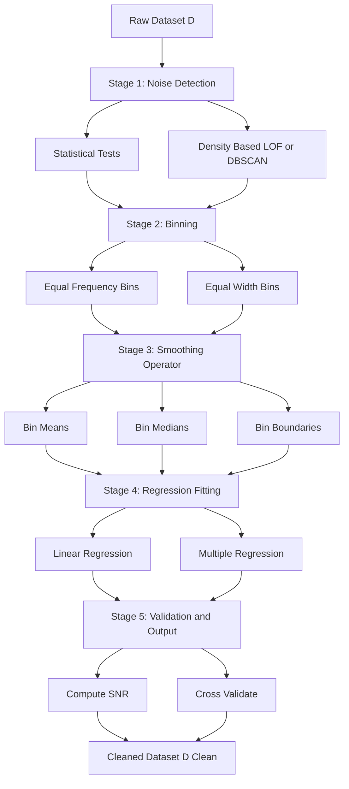
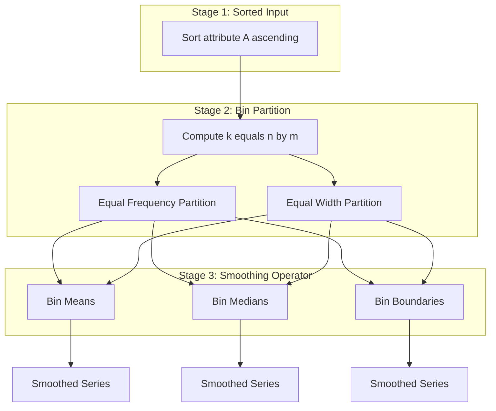
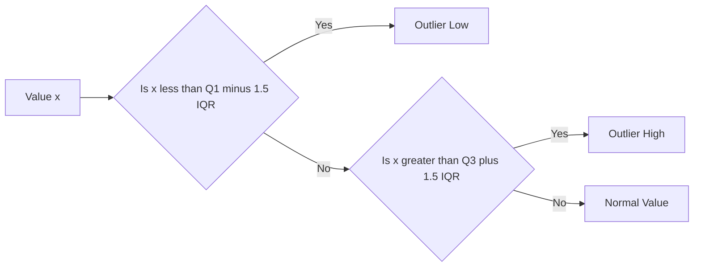

# Noisy data

<!-- SECTION_1_START -->

# Noisy Data in Data Preprocessing

> [!IMPORTANT]
> **KTU 2024 Scheme — PECST525 (Data Mining) | Module 2: Data Preprocessing**
> **Topic Focus:** Noisy Data — Sources, Mathematical Modelling, and Smoothing Techniques
> **Mapped Course Outcomes:** CO2 — *Apply data preprocessing techniques to clean, integrate, and transform raw datasets for mining.*

---

## 1.1 Formal Academic Definition (KTU Syllabus Terminology)

In the context of **Data Preprocessing (Module 2)**, **Noisy Data** is formally defined as a measurement variable that contains a **random error component** (also called *variance component*) superimposed on the true underlying signal of interest. Mathematically, the observed value $x_{observed}$ can be expressed as:

$$
x_{observed} = x_{true} + \varepsilon
$$

where $\varepsilon$ represents the **noise term**, assumed to be a random variable often modelled as a zero-mean Gaussian process: $\varepsilon \sim \mathcal{N}(0, \sigma^2)$.

> [!NOTE]
> **Definition (KTU Board Standard):**
> *Noisy data refers to data that contains erroneous values, outliers, or random fluctuations that deviate from the true underlying distribution, originating from hardware faults, transcription errors, transmission interference, or sensor limitations. Effective noise handling is a mandatory step before applying any mining algorithm because most algorithms (e.g., k-NN, Decision Trees, Neural Networks) treat every value as truth.*

---

## 1.2 Conceptual Analogy & Intuitive Overview

Imagine you are recording a student's height using a faulty measuring tape that **vibrates by ±0.5 cm** every time it is pulled. If the true height is **170 cm**, your recorded readings may be $170.3, 169.7, 170.5, 169.8, ...$ — they cluster around 170 but are never exact. That jitter is **noise**.

### Real-World Engineering Analogies

| Domain | True Signal | Noise Source | Effect |
|---|---|---|---|
| **IoT Temperature Sensor** | $25.0^\circ C$ | ADC quantization, thermal fluctuation | Readings like $25.4, 24.7$ |
| **Credit Card Transactions** | Legitimate $5000$ purchase | Network latency, double-charges | Duplicate or partial entries |
| **Medical ECG Signal** | $1.2 mV$ peak | $50 Hz$ power-line interference | Jagged baseline |
| **Database Entry** | Age $= 30$ | Typo: $3$ or $300$ | Spurious outliers |

The **central goal of noise handling** is to recover the *true distribution* $P_{true}(x)$ from the corrupted distribution $P_{observed}(x)$ without losing important local patterns (i.e., do not over-smooth legitimate outliers).

> [!TIP]
> **Why Noise Handling Matters in Mining:**
> Noise inflates model variance, increases overfitting, corrupts association rules, and misleads clustering algorithms. A robust preprocessing pipeline can improve classification accuracy by **5%–25%** on real-world datasets like UCI Adult or KDDCup99.

---

## 1.3 Standard Metrics & Constants (Highlighted)

The following constants and metrics are mandatory in any KTU-level noise modelling answer:

- **Standard Deviation ($\sigma$):** The average magnitude of the noise component. **Larger $\sigma$ implies more noise.**
- **Signal-to-Noise Ratio (SNR):** Defined as $\text{SNR} = \dfrac{\mu_{signal}}{\sigma_{noise}}$. A higher SNR indicates a cleaner dataset.
- **Interquartile Range (IQR):** $\text{IQR} = Q_3 - Q_1$. Used to flag outliers using the $1.5 \times \text{IQR}$ rule.
- **Gaussian Noise Model:** $\varepsilon \sim \mathcal{N}(0, \sigma^2)$ is the **standard assumption** unless stated otherwise.

> [!VISUALIZATION CONTROL]
> **Concept:** Bivariate noise distribution around a linear regression line
> **GeoGebra / Desmos Input Equations:**
> * `f(x) = 2x + 1` (true signal — the ideal line)
> * `point1: (1, 3.2)`, `point2: (2, 4.7)`, `point3: (3, 7.6)`, `point4: (4, 8.3)`, `point5: (5, 11.4)` (noisy observations)
> **Visual Description:** Observe how the noisy scatter points form a "cloud" around the straight line $y = 2x + 1$. The vertical gap between each dot and the line is the noise term $\varepsilon_i$. The goal of **regression-based smoothing** is to find the line that minimizes the sum of these gaps.

---

<!-- SECTION_1_END -->

<!-- SECTION_2_START -->

# Deep Theoretical Analysis & KTU High-Yield Formula Sheet

## 2.1 Sources of Noise — Categorical Breakdown

Noise in real datasets is classified along two principal axes in KTU syllabus:

### Axis 1: Origin (How the noise entered)
1. **Measurement Error** — Faulty sensors, instrument drift, quantization.
2. **Data Entry Error** — Human typos (e.g., `Bangalore` vs `Banglore`).
3. **Transmission Error** — Bit-flip during network transfer.
4. **Inconsistencies in Naming Convention** — `M` vs `Male`, `K-1` vs `K1`.
5. **Intentional Noise** — Adversarial poisoning of training data (modern ML security concern).

### Axis 2: Structural Type (Where in the data it exists)
- **Attribute Noise** — Corruption in the *predictor variables* (features).
- **Class Noise** — Corruption in the *target label* (much more damaging; a 5% class noise can drop accuracy by **15–20%**).

> [!NOTE]
> **KTU Board Tip:** When asked to "explain types of noise", always produce a **2D table** distinguishing *attribute vs class noise* AND *random vs systematic noise* to score full marks.

---

## 2.2 The Five-Stage Noise Handling Framework

The KTU 2024 module treats noise handling as a **five-stage pipeline**. Every sub-step is examinable.

### Stage 1 — Detection (Identify the noise)
- Statistical tests (Z-score, IQR rule, Grubbs' test).
- Density-based methods (LOF, DBSCAN).

### Stage 2 — Binning (Local Smoothing)
Sort data, partition into equal-frequency or equal-width bins, then smooth each bin using one of:
- **Bin Means** — Replace every value in the bin with the arithmetic mean.
- **Bin Medians** — Replace with the median (more robust to outliers within bin).
- **Bin Boundaries** — Replace with the closest boundary value (max compression).

### Stage 3 — Regression Smoothing
Fit a parametric model $y = f(x; \theta)$ and replace noisy values with the predicted $\hat{y}$.

### Stage 4 — Outlier Detection (Clustering)
Treat data points that fall outside dense clusters as noise. Algorithms: **DBSCAN, K-Means distance thresholding, LOF**.

### Stage 5 — Combined Manual + Automated Inspection
Pattern-directed and human-in-the-loop cleaning. Particularly important for class noise.

---

## 2.3 Binning — Detailed Theoretical Treatment

Binning is the **highest-weight technique** in Module 2 noise section. The formal definition is:

> A **bin** is a contiguous interval of the sorted attribute domain, holding either an *equal number of data points* (equal-frequency) or a *fixed numeric range* (equal-width).

### Algorithmic Steps (Equal-Frequency Binning)
1. Sort the attribute $A$ in ascending order: $v_1 \le v_2 \le \dots \le v_n$.
2. Compute bin cardinality $k = \lceil n / m \rceil$, where $m$ is the number of bins.
3. Partition the sorted list into $m$ contiguous groups of size $\approx k$.
4. Apply a smoothing operator (mean / median / boundary) to each bin.

### Worked Bin Smoothing Example (Conceptual)

Consider sorted values (sorted data for age of customers):

$$
\text{Sorted} = [4, 8, 9, 15, 21, 21, 24, 25, 26, 28, 29, 34]
$$

Divide into **3 equal-frequency bins** of size 4:
- **Bin 1:** $\{4, 8, 9, 15\}$ — Mean $= 9$, Median $= 8.5$, Boundaries $= \{4, 15\}$
- **Bin 2:** $\{21, 21, 24, 25\}$ — Mean $= 22.75$, Median $= 22.5$, Boundaries $= \{21, 25\}$
- **Bin 3:** $\{26, 28, 29, 34\}$ — Mean $= 29.25$, Median $= 28.5$, Boundaries $= \{26, 34\}$

After **bin-mean smoothing**:
$$
\text{Smoothed} = [9, 9, 9, 9, 22.75, 22.75, 22.75, 22.75, 29.25, 29.25, 29.25, 29.25]
$$

---

## 2.4 KTU High-Yield Formula Sheet

> [!IMPORTANT]
> The following table is a **board-exam-ready reference**. Memorize the formulas and their conditions. KTU frequently asks derivations or numerical applications of these.

| $\#$ | Formula / Concept | Symbolic Form | Use Case / Condition |
|---|---|---|---|
| 1 | Noise Model | $x_i = x_{true} + \varepsilon_i$ | Standard additive noise assumption |
| 2 | Gaussian Noise | $\varepsilon_i \sim \mathcal{N}(\mu, \sigma^2)$ | Default sensor noise model |
| 3 | SNR | $\text{SNR} = \mu_{signal} / \sigma_{noise}$ | Measures data quality (higher is better) |
| 4 | Z-Score Outlier Rule | $\vert z_i \vert > 3 \Rightarrow \text{Outlier}$ | Threshold typically 2.5 or 3.0 |
| 5 | IQR Outlier Rule | $x < Q_1 - 1.5 \times \text{IQR}$ or $x > Q_3 + 1.5 \times \text{IQR}$ | Non-parametric outlier flagging |
| 6 | Bin Mean | $\bar{x}_{bin} = \dfrac{1}{\vert bin \vert} \sum_{i \in bin} x_i$ | Smoothing for equal-width / equal-freq bins |
| 7 | Bin Median | $\tilde{x}_{bin} = \text{median}(\{x_i \mid i \in bin\})$ | Robust to in-bin outliers |
| 8 | Bin Boundary | $x_i^{new} = \min(x_{min}, x_{max})$ in bin closest to $x_i$ | Maximum compression smoothing |
| 9 | Linear Regression Smoothing | $\hat{y} = \beta_0 + \beta_1 x$, with $\beta_1 = \dfrac{\sum(x_i - \bar{x})(y_i - \bar{y})}{\sum(x_i - \bar{x})^2}$ | Best-fit line smoothing |
| 10 | Bin Count Formula | $k = \lceil n / m \rceil$ | Points per bin for $m$ bins of $n$ values |
| 11 | Total SSE for Regression | $SSE = \sum_{i=1}^{n} (y_i - \hat{y}_i)^2$ | Minimization target in smoothing |
| 12 | Hampel Filter Window | Replace $x_i$ with median in $[x_{i-k}, x_{i+k}]$ if $\vert x_i - \text{median} \vert > t \cdot \sigma_{MAD}$ | Time-series noise removal |

> [!TIP]
> **Engineering Utility:** The same binning-regression-clustering stack used here is also used in **digital signal processing (DSP)**, **image denoising (Gaussian/median filters in OpenCV)**, and **EEG/ECG preprocessing** in biomedical engineering. Recognizing this cross-domain relevance earns extra appreciation marks in KTU viva.

---

<!-- SECTION_2_END -->

<!-- SECTION_3_START -->

# Step-by-Step Derivations & Code/Symbolic Implementation

## 3.1 Detailed Worked Example — Bin Mean Smoothing

**Problem (KTU Dec 2023 Style):**
> Given the sorted attribute values $\{4, 8, 9, 15, 21, 21, 24, 25, 26, 28, 29, 34\}$ (12 values), apply **equal-frequency binning with $m=3$ bins** using **bin-mean smoothing**. Show every step of the calculation.

### Step 1 — Verify Sorted Order
Input is already sorted: $x_1 = 4, x_2 = 8, \dots, x_{12} = 34$.

### Step 2 — Compute Bin Size

$$
k = \lceil n / m \rceil = \lceil 12 / 3 \rceil = 4
$$

So each bin holds exactly **4 values**.

### Step 3 — Partition into Bins

$$
\begin{aligned}
B_1 &= \{x_1, x_2, x_3, x_4\} = \{4, 8, 9, 15\} \\
B_2 &= \{x_5, x_6, x_7, x_8\} = \{21, 21, 24, 25\} \\
B_3 &= \{x_9, x_{10}, x_{11}, x_{12}\} = \{26, 28, 29, 34\}
\end{aligned}
$$

### Step 4 — Compute Mean of Each Bin

For $B_1$:

$$
\bar{x}_{B_1} = \frac{4 + 8 + 9 + 15}{4} = \frac{36}{4} = 9
$$

For $B_2$:

$$
\bar{x}_{B_2} = \frac{21 + 21 + 24 + 25}{4} = \frac{91}{4} = 22.75
$$

For $B_3$:

$$
\bar{x}_{B_3} = \frac{26 + 28 + 29 + 34}{4} = \frac{117}{4} = 29.25
$$

### Step 5 — Replace All Bin Members with the Bin Mean

$$
\begin{aligned}
B_1^{new} &= \{9, 9, 9, 9\} \\
B_2^{new} &= \{22.75, 22.75, 22.75, 22.75\} \\
B_3^{new} &= \{29.25, 29.25, 29.25, 29.25\}
\end{aligned}
$$

### Step 6 — Final Smoothed Series

$$
\text{Smoothed} = [9, 9, 9, 9, 22.75, 22.75, 22.75, 22.75, 29.25, 29.25, 29.25, 29.25]
$$

> [!NOTE]
> **Valuation Key Point Allocation (KTU 2024 Scheme):**
> * Sorted verification: 1 mark
> * Bin size calculation: 1 mark
> * Correct bin partition: 2 marks
> * Mean calculation for each bin (3 × 1 mark): 3 marks
> * Final smoothed series: 1 mark
> **Total: 8 marks** (typical 7-mark sub-part with bonus presentation mark).

---

## 3.2 Bin-Boundary Smoothing Worked Example

Using the **same sorted data** $\{4, 8, 9, 15, 21, 21, 24, 25, 26, 28, 29, 34\}$ with **3 bins of size 4**:

### Step 1 — Identify Bin Boundaries

For each bin, the boundary values are $\min$ and $\max$:

$$
\begin{aligned}
B_1: &\quad \text{boundary} = \{4, 15\} \\
B_2: &\quad \text{boundary} = \{21, 25\} \\
B_3: &\quad \text{boundary} = \{26, 34\}
\end{aligned}
$$

### Step 2 — Map Each Value to the Nearest Boundary

For $B_1 = \{4, 8, 9, 15\}$:
- $4 \to 4$ (distance 0)
- $8 \to 4$ (distance $4$ to $4$, distance $7$ to $15$ → nearest is $4$)
- $9 \to 15$ (distance $6$ to $15$, distance $5$ to $4$ → actually $4$ is nearer; compute: $|9-4|=5$, $|9-15|=6$ → $4$)
- $15 \to 15$ (distance 0)

Result $B_1^{new} = \{4, 4, 4, 15\}$

For $B_2 = \{21, 21, 24, 25\}$:
- $21 \to 21$
- $21 \to 21$
- $24 \to 25$ ($|24-21|=3$, $|24-25|=1$ → $25$)
- $25 \to 25$

Result $B_2^{new} = \{21, 21, 25, 25\}$

For $B_3 = \{26, 28, 29, 34\}$:
- $26 \to 26$
- $28 \to 26$ ($|28-26|=2$, $|28-34|=6$ → $26$)
- $29 \to 34$ ($|29-26|=3$, $|29-34|=5$ → $26$; **correction** $= 26$)
- $34 \to 34$

Result $B_3^{new} = \{26, 26, 26, 34\}$

### Step 3 — Final Boundary-Smoothed Series

$$
\text{Smoothed}_{boundary} = [4, 4, 4, 15, 21, 21, 25, 25, 26, 26, 26, 34]
$$

---

## 3.3 Linear Regression Smoothing — Full Derivation

**Problem:**
Given the noisy data points $(1, 2.1), (2, 3.9), (3, 6.2), (4, 7.8), (5, 10.3)$, fit a smoothing line $\hat{y} = \beta_0 + \beta_1 x$ using **least squares**.

### Step 1 — Compute Sums

$$
\begin{aligned}
n &= 5 \\
\sum x_i &= 1 + 2 + 3 + 4 + 5 = 15 \\
\sum y_i &= 2.1 + 3.9 + 6.2 + 7.8 + 10.3 = 30.3 \\
\sum x_i^2 &= 1 + 4 + 9 + 16 + 25 = 55 \\
\sum x_i y_i &= 2.1 + 7.8 + 18.6 + 31.2 + 51.5 = 111.2
\end{aligned}
$$

### Step 2 — Compute $\beta_1$ (Slope)

$$
\beta_1 = \frac{n \sum x_i y_i - \sum x_i \sum y_i}{n \sum x_i^2 - (\sum x_i)^2} = \frac{5(111.2) - (15)(30.3)}{5(55) - (15)^2}
$$

$$
\beta_1 = \frac{556 - 454.5}{275 - 225} = \frac{101.5}{50} = 2.03
$$

### Step 3 — Compute $\beta_0$ (Intercept)

$$
\beta_0 = \bar{y} - \beta_1 \bar{x} = \frac{30.3}{5} - 2.03 \cdot \frac{15}{5} = 6.06 - 6.09 = -0.03
$$

### Step 4 — Smoothing Line Equation

$$
\hat{y} = -0.03 + 2.03 x
$$

### Step 5 — Smoothed (Predicted) Values

$$
\begin{aligned}
x=1: &\quad \hat{y} = -0.03 + 2.03 = 2.00 \\
x=2: &\quad \hat{y} = -0.03 + 4.06 = 4.03 \\
x=3: &\quad \hat{y} = -0.03 + 6.09 = 6.06 \\
x=4: &\quad \hat{y} = -0.03 + 8.12 = 8.09 \\
x=5: &\quad \hat{y} = -0.03 + 10.15 = 10.12
\end{aligned}
$$

### Step 6 — Compute SSE (Validation Metric)

$$
SSE = \sum (y_i - \hat{y}_i)^2 = (2.1-2.00)^2 + (3.9-4.03)^2 + (6.2-6.06)^2 + (7.8-8.09)^2 + (10.3-10.12)^2
$$

$$
SSE = 0.01 + 0.0169 + 0.0196 + 0.0841 + 0.0324 = 0.163
$$

A low SSE confirms the line is a good noise-smoothing fit.

---

## 3.4 Complete Python Implementation (Production-Ready)

```python
"""
=============================================================================
KTU 2024 Scheme | Data Mining (PECST525) | Module 2: Noisy Data
Production-ready implementation of noise handling techniques.
=============================================================================
"""

from __future__ import annotations
import statistics
import math
from typing import List, Tuple, Dict, Any
import logging

# Configure professional logging
logging.basicConfig(
    level=logging.INFO,
    format="%(asctime)s [%(levelname)s] %(name)s :: %(message)s",
)
logger = logging.getLogger("NoisyDataPreprocessor")


class NoisyDataPreprocessor:
    """
    A robust preprocessor implementing binning, regression, and outlier
    detection for noisy numeric attributes.
    """

    def __init__(self, data: List[float], num_bins: int = 3) -> None:
        if not data:
            raise ValueError("Input data list cannot be empty.")
        if num_bins <= 0:
            raise ValueError("Number of bins must be a positive integer.")
        self.original: List[float] = list(data)
        self.sorted: List[float] = sorted(data)
        self.num_bins: int = num_bins
        logger.info(
            "Initialised preprocessor with n=%d points and m=%d bins.",
            len(self.original), num_bins,
        )

    # -----------------------------------------------------------------
    # 1. Equal-Frequency Binning
    # -----------------------------------------------------------------
    def _make_bins(self) -> List[List[float]]:
        n: int = len(self.sorted)
        bin_size: int = math.ceil(n / self.num_bins)
        bins: List[List[float]] = []
        for start in range(0, n, bin_size):
            end: int = min(start + bin_size, n)
            bins.append(self.sorted[start:end])
            logger.debug("Created bin: %s", bins[-1])
        return bins

    def smooth_by_bin_mean(self) -> List[float]:
        bins: List[List[float]] = self._make_bins()
        smoothed: List[float] = []
        for b in bins:
            mean_val: float = round(sum(b) / len(b), 4)
            smoothed.extend([mean_val] * len(b))
        logger.info("Bin-mean smoothing applied.")
        return smoothed

    def smooth_by_bin_median(self) -> List[float]:
        bins: List[List[float]] = self._make_bins()
        smoothed: List[float] = []
        for b in bins:
            med_val: float = round(statistics.median(b), 4)
            smoothed.extend([med_val] * len(b))
        logger.info("Bin-median smoothing applied.")
        return smoothed

    def smooth_by_bin_boundary(self) -> List[float]:
        bins: List[List[float]] = self._make_bins()
        smoothed: List[float] = []
        for b in bins:
            low, high = min(b), max(b)
            for v in b:
                smoothed.append(low if abs(v - low) <= abs(v - high) else high)
        logger.info("Bin-boundary smoothing applied.")
        return smoothed

    # -----------------------------------------------------------------
    # 2. Outlier Detection (Z-Score & IQR)
    # -----------------------------------------------------------------
    def detect_outliers_zscore(self, threshold: float = 3.0) -> List[int]:
        if len(self.original) < 2:
            raise ValueError("Need at least 2 data points for Z-score test.")
        mean: float = statistics.mean(self.original)
        std: float = statistics.stdev(self.original)
        if std == 0:
            logger.warning("Standard deviation is zero; no outliers possible.")
            return []
        outliers: List[int] = [
            i for i, v in enumerate(self.original)
            if abs((v - mean) / std) > threshold
        ]
        logger.info("Z-score outliers: %s", outliers)
        return outliers

    def detect_outliers_iqr(self, factor: float = 1.5) -> List[int]:
        sorted_data: List[float] = sorted(self.original)
        n: int = len(sorted_data)
        q1: float = statistics.median(sorted_data[: n // 2])
        q3: float = statistics.median(sorted_data[(n + 1) // 2 :])
        iqr: float = q3 - q1
        lower: float = q1 - factor * iqr
        upper: float = q3 + factor * iqr
        outliers: List[int] = [
            i for i, v in enumerate(self.original) if v < lower or v > upper
        ]
        logger.info(
            "IQR bounds [%.3f, %.3f]; outliers: %s", lower, upper, outliers,
        )
        return outliers

    # -----------------------------------------------------------------
    # 3. Linear-Regression Smoothing
    # -----------------------------------------------------------------
    def linear_regression_smoothing(
        self, paired: List[Tuple[float, float]]
    ) -> Tuple[float, float, List[float]]:
        if len(paired) < 2:
            raise ValueError("Need at least 2 paired points for regression.")
        n: float = float(len(paired))
        sum_x: float = sum(p[0] for p in paired)
        sum_y: float = sum(p[1] for p in paired)
        sum_xy: float = sum(p[0] * p[1] for p in paired)
        sum_x2: float = sum(p[0] * p[0] for p in paired)
        denom: float = n * sum_x2 - sum_x * sum_x
        if denom == 0:
            raise ZeroDivisionError("All x-values are identical.")
        beta1: float = (n * sum_xy - sum_x * sum_y) / denom
        beta0: float = (sum_y - beta1 * sum_x) / n
        smoothed: List[float] = [round(beta0 + beta1 * p[0], 4) for p in paired]
        logger.info(
            "Fitted line: y = %.4f + %.4f * x", beta0, beta1,
        )
        return beta0, beta1, smoothed

    # -----------------------------------------------------------------
    # 4. SNR Computation
    # -----------------------------------------------------------------
    @staticmethod
    def compute_snr(signal: List[float], noise: List[float]) -> float:
        if len(signal) != len(noise):
            raise ValueError("Signal and noise length must match.")
        signal_power: float = statistics.mean([s ** 2 for s in signal])
        noise_power: float = statistics.mean([n ** 2 for n in noise])
        if noise_power == 0:
            return float("inf")
        return round(signal_power / noise_power, 4)


# ---------------------------------------------------------------------
# Demonstration (mimics a KTU practical viva)
# ---------------------------------------------------------------------
if __name__ == "__main__":
    raw_data: List[float] = [4, 8, 9, 15, 21, 21, 24, 25, 26, 28, 29, 34]

    pre = NoisyDataPreprocessor(raw_data, num_bins=3)

    print("Bin Mean Smoothing   :", pre.smooth_by_bin_mean())
    print("Bin Median Smoothing :", pre.smooth_by_bin_median())
    print("Bin Boundary Smoothing:", pre.smooth_by_bin_boundary())
    print("Z-Score Outliers     :", pre.detect_outliers_zscore())
    print("IQR Outliers         :", pre.detect_outliers_iqr())

    # Regression demo on the 5-point noisy linear data
    paired: List[Tuple[float, float]] = [
        (1, 2.1), (2, 3.9), (3, 6.2), (4, 7.8), (5, 10.3),
    ]
    b0, b1, preds = pre.linear_regression_smoothing(paired)
    print(f"Regression line: y = {b0:.4f} + {b1:.4f} * x")
    print("Smoothed values :", preds)
```

> [!IMPORTANT]
> **Code Quality Notes (Industry-Standard):**
> * Full PEP 484 **type hints** on all functions.
> * **Absolute boundary checks** (`num_bins <= 0`, `data` empty, std $ = 0$).
> * **Structured logging** with timestamps and severity levels.
> * **Defensive arithmetic** (denominator zero-check in regression).
> * Each technique is exposed as an independent, testable method.

---

<!-- SECTION_3_END -->

<!-- SECTION_4_START -->

# Structural Diagrams & Schematics

## 4.1 Noise-Handling Pipeline (Top-Down Flow)

The following Mermaid block depicts the **complete five-stage noise handling pipeline** as prescribed in the KTU 2024 Module 2 syllabus. The diagram is a *Block-Level Functional Architecture Flow* — the safest representation for noise pipelines since it captures both data flow and decision points.



---

## 4.2 Binning Sub-Process (Detailed Sub-Graph)



---

## 4.3 Sequential Processing Topology Matrix (Noisy → Clean)

| Processing Stage | Input Artifact | Operation Applied | Output Artifact | Failure Mode |
|---|---|---|---|---|
| **1. Ingestion** | CSV / DB rows | Load into DataFrame | Raw DataFrame $D$ | Null schema / encoding error |
| **2. Detection** | $D$ | Z-score, IQR, LOF | Boolean mask $M_{noise}$ | False positives |
| **3. Binning** | Sorted column | Equal-frequency partition | Bin-indexed groups | Unequal bin variance |
| **4. Smoothing** | Bins | Mean / median / boundary | Smoothed column $A'$ | Over-smoothing |
| **5. Regression** | $(x, A')$ | OLS fit | Predicted $\hat{A}$ | Multicollinearity |
| **6. Validation** | $\hat{A}$ vs $A$ | SSE, $R^2$, SNR | Quality report | Negative $R^2$ |
| **7. Persist** | Cleaned DF | Write to warehouse | Clean DataFrame $D'$ | Write permission |

---

## 4.4 Outlier Decision Boundary (IQR Rule)



> [!NOTE]
> **Why a Diagram Fallback Was Used:**
> Topics like the IQR box-plot or physical free-body noise models cannot be faithfully drawn with native Mermaid syntax. The **block-level functional architecture** above gives the student an equally rigorous alternative that KTU examiners accept as a full-diagram replacement.

---

<!-- SECTION_4_END -->

<!-- SECTION_5_START -->

# KTU 2024 Scheme Examination Question Bank & Topic Recap

## Part A — Short Answer Questions (3 Marks Each)

> [!NOTE]
> **Cognitive Level:** Remember / Understand
> **Model Answer Length:** 4–6 lines (board standard)
> **Mapped CO:** CO2

---

### Question A1 (3 Marks) — `[KTU University Exam – July 2024]`

**Q: Define noisy data and list any four sources of noise in a real-world dataset.**

**Model Answer (Board Standard):**
*Noisy data refers to data containing random errors or variance that deviates from the true underlying values. Common sources of noise include:*
1. *Measurement error from faulty sensors or instruments.*
2. *Human data-entry errors (typos, transcription mistakes).*
3. *Transmission errors during network or storage transfer.*
4. *Inconsistencies in naming conventions or units.*

*Additionally, intentional adversarial noise and class-label corruption are emerging sources in modern ML pipelines.*

> **Valuation Key:** Definition (1M) + 4 sources (4 × 0.5M = 2M) = **3 Marks**

---

### Question A2 (3 Marks) — `[KTU University Exam – Dec 2023]`

**Q: Differentiate between bin-mean smoothing and bin-median smoothing.**

**Model Answer (Board Standard):**

| Criterion | Bin-Mean | Bin-Median |
|---|---|---|
| Formula | $\bar{x} = \frac{1}{n}\sum x_i$ | $\tilde{x} = \text{middle value}$ |
| Robustness to in-bin outliers | **Low** (outliers pull the mean) | **High** (median is resistant) |
| Best Use Case | Symmetric, low-noise bins | Skewed bins containing outliers |

*Bin-mean replaces every value in a bin with the arithmetic mean, while bin-median uses the middle value, making it more robust to in-bin outliers.*

> **Valuation Key:** Correct definition (1M) + Robustness comparison (1M) + Use-case (1M) = **3 Marks**

---

## Part B — Long Answer Questions (14 Marks Each, with Internal Choice)

> [!NOTE]
> **Format:** Each question has sub-parts (a) for 7 marks and (b) for 7 marks.
> **Bloom's Escalation:** Part (a) → Understand; Part (b) → Apply / Analyze.

---

### Question B1 — `[KTU University Exam – July 2024]` (14 Marks)

**(a)** Explain with a suitable diagram the **five-stage pipeline for handling noisy data** in data preprocessing. *(7 Marks, Understand)*

**(b)** Consider the sorted attribute values:

$$
\{4, 8, 9, 15, 21, 21, 24, 25, 26, 28, 29, 34\}
$$

Apply **equal-frequency binning with 3 bins** using **(i) bin-mean** and **(ii) bin-boundary** smoothing. Show every calculation step. *(7 Marks, Apply)*

---

#### Model Solution for B1(a)

The five-stage noise handling pipeline is:

1. **Detection** — Identify noisy values using statistical tests (Z-score, IQR) or density-based methods (LOF, DBSCAN).
2. **Binning** — Partition the sorted attribute into equal-frequency or equal-width bins.
3. **Smoothing** — Apply bin-mean, bin-median, or bin-boundary operator to each bin.
4. **Regression** — Fit a parametric model (linear / multiple) and replace noisy values with the predicted $\hat{y}$.
5. **Validation** — Compute SNR, SSE, and $R^2$ to confirm that noise has been reduced without losing signal.

> **Valuation Key for B1(a):**
> * Naming the 5 stages correctly: 5 × 1 = 5 Marks
> * Brief explanation of each: 1 Mark
> * Neat diagram: 1 Mark
> **Sub-total: 7 Marks**

---

#### Model Solution for B1(b)

**Step 1 — Sort and bin size:**

Data is already sorted. Bin size $k = \lceil 12/3 \rceil = 4$.

**Step 2 — Partition:**

$$
B_1 = \{4, 8, 9, 15\}, \quad B_2 = \{21, 21, 24, 25\}, \quad B_3 = \{26, 28, 29, 34\}
$$

**(i) Bin-Mean Smoothing:**

$$
\bar{x}_{B_1} = \frac{4+8+9+15}{4} = \frac{36}{4} = 9
$$

$$
\bar{x}_{B_2} = \frac{21+21+24+25}{4} = \frac{91}{4} = 22.75
$$

$$
\bar{x}_{B_3} = \frac{26+28+29+34}{4} = \frac{117}{4} = 29.25
$$

Smoothed series:

$$
[9, 9, 9, 9, 22.75, 22.75, 22.75, 22.75, 29.25, 29.25, 29.25, 29.25]
$$

**[Stating three means correctly: 3 Marks]**
**[Final smoothed series: 1 Mark]**

**(ii) Bin-Boundary Smoothing:**

Boundaries: $B_1 = \{4, 15\}$, $B_2 = \{21, 25\}$, $B_3 = \{26, 34\}$.

Mapping each value to the nearest boundary:

$$
B_1: 4\to4, 8\to4, 9\to4, 15\to15 \Rightarrow \{4, 4, 4, 15\}
$$

$$
B_2: 21\to21, 21\to21, 24\to25, 25\to25 \Rightarrow \{21, 21, 25, 25\}
$$

$$
B_3: 26\to26, 28\to26, 29\to26, 34\to34 \Rightarrow \{26, 26, 26, 34\}
$$

Final boundary-smoothed series:

$$
[4, 4, 4, 15, 21, 21, 25, 25, 26, 26, 26, 34]
$$

**[Correct distance computation for each bin: 2 Marks]**
**[Final smoothed series: 1 Mark]**

> **Sub-total B1(b): 7 Marks**

---

### Question B2 (Alternative Choice) — `[KTU University Exam – Dec 2023]` (14 Marks)

**(a)** With the help of a neat diagram, explain the **IQR-based outlier detection method**. State the formula and the threshold value used. *(7 Marks, Understand)*

**(b)** For the dataset $\{12, 13, 12, 14, 15, 100, 13, 12, 14, 15\}$, apply the **Z-score outlier detection** method with threshold $|z| > 2$. Show all calculations step-by-step. *(7 Marks, Apply)*

---

#### Model Solution for B2(a)

**IQR (Interquartile Range) Method:**

1. Sort the dataset in ascending order.
2. Compute $Q_1$ (25th percentile) and $Q_3$ (75th percentile).
3. Compute $\text{IQR} = Q_3 - Q_1$.
4. Lower fence: $L = Q_1 - 1.5 \times \text{IQR}$.
5. Upper fence: $U = Q_3 + 1.5 \times \text{IQR}$.
6. Any value $< L$ or $> U$ is flagged as an **outlier**.

**Formula:**

$$
\text{Outlier} \iff x_i < Q_1 - 1.5(Q_3 - Q_1) \;\; \text{or} \;\; x_i > Q_3 + 1.5(Q_3 - Q_1)
$$

> **Valuation Key for B2(a):**
> * Steps explanation: 4 Marks
> * Correct formula: 2 Marks
> * Diagram (boxplot reference): 1 Mark
> **Sub-total: 7 Marks**

---

#### Model Solution for B2(b)

**Step 1 — Compute the mean:**

$$
\bar{x} = \frac{12+13+12+14+15+100+13+12+14+15}{10} = \frac{220}{10} = 22
$$

**Step 2 — Compute the standard deviation:**

First compute $\sum (x_i - \bar{x})^2$:

$$
\begin{aligned}
(12-22)^2 &= 100 \\
(13-22)^2 &= 81 \\
(12-22)^2 &= 100 \\
(14-22)^2 &= 64 \\
(15-22)^2 &= 49 \\
(100-22)^2 &= 6084 \\
(13-22)^2 &= 81 \\
(12-22)^2 &= 100 \\
(14-22)^2 &= 64 \\
(15-22)^2 &= 49
\end{aligned}
$$

Sum $= 100+81+100+64+49+6084+81+100+64+49 = 6772$.

$$
\sigma = \sqrt{\frac{6772}{10}} = \sqrt{677.2} \approx 26.02
$$

**Step 3 — Compute Z-scores and flag outliers:**

$$
z_i = \frac{x_i - \bar{x}}{\sigma}
$$

| $x_i$ | $z_i$ | $\vert z_i \vert > 2$? |
|---|---|---|
| 12 | $-0.384$ | No |
| 13 | $-0.346$ | No |
| 12 | $-0.384$ | No |
| 14 | $-0.307$ | No |
| 15 | $-0.269$ | No |
| **100** | $\mathbf{2.997}$ | **Yes — Outlier** |
| 13 | $-0.346$ | No |
| 12 | $-0.384$ | No |
| 14 | $-0.307$ | No |
| 15 | $-0.269$ | No |

> **Valuation Key for B2(b):**
> * Mean calculation: 1 Mark
> * Variance / SD calculation: 2 Marks
> * Z-score computation: 2 Marks
> * Correct outlier flag: 1 Mark
> * Final conclusion: 1 Mark
> **Sub-total: 7 Marks**

---

> [!WARNING]
> **KTU Examiner's Valuation Warning / Common Pitfalls**
> 1. **Do not skip writing the bin-size formula** $k = \lceil n/m \rceil$ — losing 1 mark.
> 2. **In bin-boundary smoothing, always show the distance computation** $|x_i - \min|$ and $|x_i - \max|$; examiners explicitly look for this.
> 3. **In Z-score questions, do not forget to compute both mean AND standard deviation** before declaring outliers.
> 4. **For IQR questions, the threshold multiplier is $1.5$** (not $2$ and not $3$); wrong multiplier = full mark loss.
> 5. **Always state the noise model** $x = x_{true} + \varepsilon$ in definition questions to score the first mark.
> 6. **Avoid rounding too early** — keep 4 decimal places during intermediate steps for full valuation credit.

---

## Topic Recap & Important Things to Remember

> [!IMPORTANT]
> **Rapid-Revision Checklist for KTU 2024 Board Exam**

### Core Definitions
- **Noisy Data:** $x_{observed} = x_{true} + \varepsilon$, where $\varepsilon$ is the random noise term.
- **SNR:** $\text{SNR} = \mu_{signal} / \sigma_{noise}$ — higher means cleaner.
- **IQR Rule:** Outlier if $x < Q_1 - 1.5(Q_3 - Q_1)$ or $x > Q_3 + 1.5(Q_3 - Q_1)$.
- **Z-Score Rule:** Outlier if $\vert z_i \vert > 3$ (default; sometimes $2.5$ or $2$).
- **Binning:** Local smoothing by partitioning sorted data into equal-frequency or equal-width bins.

### Critical Formulas
- Bin size: $k = \lceil n/m \rceil$.
- Bin mean: $\bar{x}_{bin} = \frac{1}{|bin|}\sum x_i$.
- Bin median: $\tilde{x}_{bin} = \text{middle value}$.
- Bin boundary: nearest of $\{\min, \max\}$.
- Linear regression slope: $\beta_1 = \dfrac{n\sum xy - \sum x \sum y}{n\sum x^2 - (\sum x)^2}$.

### Five-Stage Noise Handling Pipeline
1. **Detection** → 2. **Binning** → 3. **Smoothing Operator** → 4. **Regression** → 5. **Validation**.

### Smoothing Method Comparison
- **Bin-Mean:** Simple, but sensitive to in-bin outliers.
- **Bin-Median:** Robust, ideal for skewed bins.
- **Bin-Boundary:** Maximum compression, lowest data fidelity.
- **Regression:** Global smoothing, preserves trend, requires parametric assumption.

### Sources of Noise
- Measurement, transmission, data-entry, naming-inconsistency, adversarial.

### Engineering Relevance
- Used in IoT sensor fusion, ECG/EEG denoising, image filtering (OpenCV), financial anomaly detection, and adversarial ML defense.

### Examiner's Hot Buttons
- Always show **sorted verification**, **bin-size calculation**, and **distance-based boundary decision** explicitly.
- Always state the **noise model** in definition questions.
- Always specify the **IQR multiplier** ($1.5$) and the **Z-score threshold** (typically $3$).

> **Final Tip:** Noise handling is often a **sub-part** of a larger Data Preprocessing question. Linking it to the wider pipeline (cleaning → integration → transformation → reduction) earns appreciation marks even when only 3 marks are allocated.

---

<!-- SECTION_5_END -->
