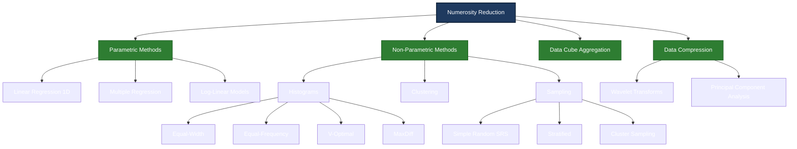
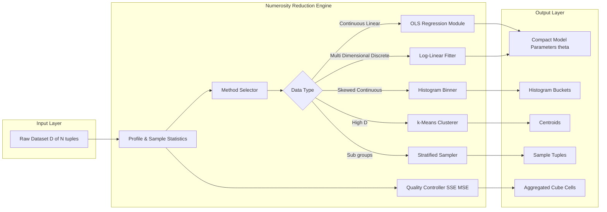
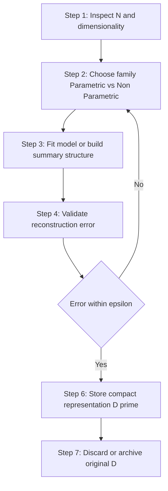

# Numerosity reduction

<!-- SECTION_1_START -->
# Numerosity Reduction

## 1.1 Formal Definition (KTU 2024 Syllabus Standard)

> [!NOTE]
> **Numerosity Reduction** is a data preprocessing paradigm in which the volume of a dataset is compressed by replacing the original set of data tuples with alternative, mathematically smaller representations — such as parametric models, histograms, clusters, or samples — that still yield approximately the same analytical results.

Formally, let the original dataset $\mathcal{D}$ contain $N$ tuples (or $d$-dimensional points). A numerosity reduction mechanism $f$ maps $\mathcal{D}$ to a much smaller representation $\mathcal{D}'$ with $N' \ll N$ tuples, while preserving the integrity of subsequent mining operations (classification, regression, clustering, association mining). The reconstruction error between the original and reduced representations is bounded by a user-defined tolerance $\epsilon$.

## 1.2 Conceptual Analogy — The "Library vs. Summary Card" Intuition

Imagine a **vast library of 10,000 daily newspaper issues**. Storing the entire archive verbatim is expensive (large warehouse, slow retrieval). Instead of saving each issue, you may:

- Store **a single thick regression equation** that mathematically models the daily sales trend → **Parametric Method (Regression)**.
- Group the issues into **decade-wise bins** and only record the count per bin → **Histogram**.
- Pick **a representative 50 issues** scattered across the year → **Sampling**.
- Replace the city-level data with **a single state-level rollup** → **Data Cube Aggregation**.

In every case, the data footprint shrinks drastically, but the analyst can still recover the broad patterns of the library without opening every issue. That is the philosophical essence of **numerosity reduction**.

## 1.3 Why It Matters in KTU / Industry Pipelines

> [!IMPORTANT]
> **The 5 Vs of Big Data (Volume, Velocity, Variety, Veracity, Value)** mandate that any downstream model — be it a decision tree, a neural net, or an Apriori miner — operate on a tractable number of records. Numerosity reduction is the *cheapest pre-step* before storage and the *fastest accelerator* before model fitting.

**Standard performance metrics used to evaluate any numerosity reduction scheme:**

- **Compression Ratio** = $\dfrac{N - N'}{N} \times 100\%$  (higher is better).
- **Reconstruction / Approximation Error** = $\vert \hat{x}_i - x_i \vert$ averaged over all $i$ (lower is better).
- **Approximation Quality** measured using Mean Squared Error (MSE) or Sum of Squared Error (SSE).

## 1.4 Taxonomy Snapshot

Numerosity reduction methods split into two major families:

| Family | Sub-Methods | Nature |
|---|---|---|
| **Parametric** | Linear Regression, Multiple Regression, Log-Linear Models | Assume the data fits a specific model $f(x)$; store only the model parameters |
| **Non-Parametric** | Histograms, Clustering, Sampling, Data Cube Aggregation | Make no functional assumption; store only representative data partitions |

> [!VISUALIZATION CONTROL]
> **Concept:** Approximating a noisy 1-D dataset with a straight regression line and a 5-bin histogram side-by-side.
> **GeoGebra / Desmos Input Equations:**
> * `data = {(1, 2.1), (2, 2.4), (3, 2.6), (4, 3.1), (5, 3.4)}`
> * `f(x) = 0.32 x + 1.74`
> * `bins = [1, 2), [2, 3), [3, 4), [4, 5), [5, 6)`
> **Visual Description:** A scatter of points lies close to the upward-sloping line $f(x)$, while the histogram shows the frequency count for each bin. Both representations compact the original data, but the regression uses just **2 parameters** $(w, b)$ to model the entire trend.

<!-- SECTION_1_END -->

<!-- SECTION_2_START -->
# Deep Theoretical Analysis & KTU High-Yield Formula Sheet

## 2.1 The Two Strategic Families

### A. Parametric Methods — "Model the World"

A parametric method **assumes** the data is generated by a function $y = f(\mathbf{x}, \boldsymbol{\theta}) + \varepsilon$, where $\varepsilon$ is a zero-mean noise term and $\boldsymbol{\theta}$ is a low-dimensional parameter vector. The original $N$ records are **discarded**; only $\boldsymbol{\theta}$ is retained. At query time, the model reconstructs an approximation $\hat{y} = f(\mathbf{x}, \boldsymbol{\theta})$.

> [!NOTE]
> **Key Idea:** Storage shrinks from $O(N)$ to $O(\vert\boldsymbol{\theta}\vert)$ — a *fixed-size* representation that does **not** grow with $N$.

**1. Linear Regression (1-D predictor)**
Model form: $y = w x + b + \varepsilon$
* Estimate $w$ and $b$ using **Ordinary Least Squares (OLS)**.
* The two retained parameters summarize the entire 1-D trend.

**2. Multiple Regression (multi-1-D predictor)**
Model form: $y = b_0 + b_1 x_1 + b_2 x_2 + \cdots + b_d x_d + \varepsilon$
* Used when the target $y$ depends on multiple attributes.
* Solved via matrix algebra: $\boldsymbol{\beta} = (\mathbf{X}^\top \mathbf{X})^{-1} \mathbf{X}^\top \mathbf{y}$.

**3. Log-Linear Models (multi-dimensional discrete data)**
Model form: $\ln(E[y]) = \beta_0 + \beta_1 x_1 + \beta_2 x_2 + \cdots + \beta_d x_d$
* Applied to **discrete, multi-dimensional contingency tables** (common in association mining of categorical attributes).
* The expected cell count $E[y]$ is reconstructed from the fitted $\beta_k$ values.

### B. Non-Parametric Methods — "Let the Data Speak"

No functional form is assumed. The data is *re-organized* into summary structures.

**1. Histograms**
* Partition the data for attribute $A$ into $k$ contiguous buckets and store the **mean (or sum)** per bucket.
* Two popular partitioning rules:
  * **Equal-Width** — each bucket has identical range $\Delta = \dfrac{\max - \min}{k}$.
  * **Equal-Frequency (Equal-Depth)** — each bucket contains approximately $\dfrac{N}{k}$ tuples.
* Sophisticated rules for skewed data:
  * **V-Optimal** — chooses bucket boundaries that minimise the pairwise variance-weighted SSE.
  * **MaxDiff** — places boundaries at the top-$(k-1)$ largest gaps between consecutive sorted values.

**2. Clustering**
* Group similar tuples into $k$ clusters (e.g., k-means, k-medoids).
* Retain only the $k$ cluster centroids or medoids.
* Approximation $\hat{x}_i$ is the centroid of the cluster to which $x_i$ belongs.

**3. Sampling**
* Pick a *small* subset $S \subset \mathcal{D}$ of size $n \ll N$ that statistically represents $\mathcal{D}$.
* Allows models to be built on $S$ instead of $\mathcal{D}$.

**4. Data Cube Aggregation**
* Combine multidimensional data along a chosen dimension (e.g., daily → monthly sales).
* Each cell of the rolled-up cube stores an aggregate (SUM, AVG, COUNT) of the lower-level cells.

## 2.2 KTU Formula Cheat Sheet

| # | Method | Core Formula / Logic | Storage Footprint | Reconstruction |
|---|---|---|---|---|
| 1 | Linear Regression | $\hat{y} = w x + b$ with $w = \dfrac{\sum (x_i - \bar{x})(y_i - \bar{y})}{\sum (x_i - \bar{x})^2}$, $b = \bar{y} - w\bar{x}$ | **2** scalars | Plug $x$ into the line |
| 2 | Multiple Regression (matrix form) | $\boldsymbol{\beta} = (\mathbf{X}^\top \mathbf{X})^{-1} \mathbf{X}^\top \mathbf{y}$ | $d+1$ scalars | Plug $\mathbf{x}$ into $\hat{\mathbf{y}} = \mathbf{X}\boldsymbol{\beta}$ |
| 3 | Log-Linear Model | $\ln(E[y]) = \beta_0 + \sum_{k=1}^{d} \beta_k x_k$ | $\approx d+1$ scalars | Exponentiate after summing |
| 4 | Equal-Width Histogram | Bucket width $\Delta = \dfrac{x_{\max} - x_{\min}}{k}$ | $k$ bucket representatives | Look up the bucket of $x_i$ |
| 5 | Equal-Frequency Histogram | Each bucket holds $\approx \dfrac{N}{k}$ sorted values | $k$ bucket representatives | Look up the bucket of $x_i$ |
| 6 | V-Optimal Histogram | Minimises $\sum_{j=1}^{k} \sum_{x \in b_j} (x - \mu_j)^2$ | $k$ means + $k-1$ boundaries | Assign to nearest mean |
| 7 | k-Means Clustering | Minimises $\sum_{j=1}^{k} \sum_{x \in C_j} \vert\vert x - \mu_j \vert\vert^2$ | $k$ centroids | Assign to nearest centroid |
| 8 | Simple Random Sampling | $n$ tuples chosen uniformly without replacement | $n$ tuples | Use $S$ directly |
| 9 | Stratified Sampling | $n_h = n \cdot \dfrac{N_h}{N}$ per stratum $h$ | $n$ tuples + strata labels | Weighted reconstruction |
| 10 | Data Cube Aggregation | $\text{cell}_{\text{rollup}} = \text{AGG}(\text{child cells})$ | $1$ rollup per group | Read the aggregate cell |

## 2.3 Why It Is Used in Production Engineering

> [!IMPORTANT]
> **Real-world deployment contexts where numerosity reduction is non-negotiable:**
> * **OLAP Cubes (e.g., Apache Kylin, Snowflake)** — millions of raw sales rows compressed into pre-aggregated monthly / regional cubes.
> * **Recommender Systems** — user-item matrices stored as low-rank factorisations (a *linear-algebraic cousin* of multiple regression).
> * **IoT Telemetry** — sensor streams summarised by 1-second windowed histograms before they hit the data lake.
> * **Time-Series Databases (InfluxDB, TimescaleDB)** — continuous aggregates are essentially data-cube aggregation applied to time.
> * **Survey Analytics** — stratified sampling of 2,000 respondents reliably predicts national election outcomes.

## 2.4 Decision Heuristics for Choosing a Method

| Data Property | Recommended Method | Reason |
|---|---|---|
| Linear / mildly non-linear continuous data | Linear or Multiple Regression | Closed-form OLS, ultra-low storage |
| Multi-dimensional discrete / categorical data | Log-Linear Models | Models cell counts in contingency tables |
| Skewed or multimodal continuous data | Histograms (V-Optimal or MaxDiff) | Adapts bucket width to data density |
| Unstructured / high-dimensional embeddings | k-Means Clustering | Captures cluster topology |
| Population with clear sub-groups (e.g., age bands) | Stratified Sampling | Preserves sub-population ratios |
| Hierarchical / multi-level transactional data | Data Cube Aggregation | Natural fit for OLAP rollups |

<!-- SECTION_2_END -->

<!-- SECTION_3_START -->
# Step-by-Step Derivations & Symbolic Implementation

## 3.1 Derivation 1 — Ordinary Least Squares (OLS) for Simple Linear Regression

**Setup.** Given $N$ observations $\{(x_1, y_1), (x_2, y_2), \dots, (x_N, y_N)\}$, find $w$ and $b$ that minimise the **Sum of Squared Errors (SSE)**:

$$
\text{SSE}(w, b) = \sum_{i=1}^{N} (y_i - \hat{y}_i)^2 = \sum_{i=1}^{N} (y_i - w x_i - b)^2
$$

**Step 1 — Partial derivative w.r.t. $b$.**

$$
\frac{\partial \, \text{SSE}}{\partial b} = -2 \sum_{i=1}^{N} (y_i - w x_i - b) = 0
$$

$$
\Rightarrow \sum_{i=1}^{N} y_i = w \sum_{i=1}^{N} x_i + N b
$$

$$
\Rightarrow b = \bar{y} - w \bar{x} \quad \text{where} \quad \bar{x} = \frac{1}{N} \sum_{i=1}^{N} x_i, \; \bar{y} = \frac{1}{N} \sum_{i=1}^{N} y_i
$$

**Step 2 — Partial derivative w.r.t. $w$.**

$$
\frac{\partial \, \text{SSE}}{\partial w} = -2 \sum_{i=1}^{N} x_i (y_i - w x_i - b) = 0
$$

Substitute the $b$ expression from Step 1:

$$
\sum_{i=1}^{N} x_i y_i = w \sum_{i=1}^{N} x_i^2 + b \sum_{i=1}^{N} x_i
$$

$$
\sum_{i=1}^{N} x_i y_i = w \sum_{i=1}^{N} x_i^2 + (\bar{y} - w \bar{x}) \sum_{i=1}^{N} x_i
$$

Rearrange (using $\sum x_i = N \bar{x}$):

$$
\sum_{i=1}^{N} x_i y_i - N \bar{x} \bar{y} = w \left( \sum_{i=1}^{N} x_i^2 - N \bar{x}^2 \right)
$$

**Step 3 — Final closed-form solution.**

$$
\boxed{\,w = \frac{\sum_{i=1}^{N} (x_i - \bar{x})(y_i - \bar{y})}{\sum_{i=1}^{N} (x_i - \bar{x})^2} \, , \qquad b = \bar{y} - w \bar{x}\,}
$$

> [!IMPORTANT]
> **Storage after reduction:** Instead of storing all $N$ points, the system retains only the two scalars $(w, b)$. Reconstruction is instantaneous via $\hat{y} = w x + b$.

## 3.2 Derivation 2 — Stratified Sampling Sample-Size Formula

**Setup.** A population of $N$ tuples is split into $H$ strata with sizes $N_1, N_2, \dots, N_H$ such that $\sum_{h=1}^{H} N_h = N$. We want to draw a sample of size $n$ that preserves the ratio of every stratum.

**Step 1 — Proportional allocation rule.**

$$
n_h = n \cdot \frac{N_h}{N}
$$

**Step 2 — Neyman (optimal) allocation** when each stratum has known variance $\sigma_h^2$:

$$
n_h = n \cdot \frac{N_h \sigma_h}{\sum_{j=1}^{H} N_j \sigma_j}
$$

> [!NOTE]
> **Variance reduction theorem.** Stratified sampling with proportional allocation always yields a lower estimator variance than simple random sampling of the same size $n$, because within-stratum variance is typically much smaller than total population variance.

## 3.3 Derivation 3 — V-Optimal Histogram Bucket Selection

**Setup.** Sort the data for attribute $A$ as $v_1 \le v_2 \le \cdots \le v_N$. The V-Optimal histogram minimises:

$$
\text{SSE}_{\text{hist}} = \sum_{j=1}^{k} \sum_{v_i \in b_j} (v_i - \mu_j)^2
$$

**Step 1 — Inner sum identity.** For any bucket $b_j$ with $m_j$ values, the inner sum equals:

$$
\sum_{v_i \in b_j} (v_i - \mu_j)^2 = \sum_{v_i \in b_j} v_i^2 - m_j \mu_j^2
$$

**Step 2 — Dynamic programming recursion.** Define $C[i, j]$ as the minimum SSE when partitioning the first $i$ sorted values into $j$ buckets. Then:

$$
C[i, j] = \min_{1 \le t < i} \left\{ C[t, j-1] + \sum_{u = t+1}^{i} (v_u - \mu_{t+1, i})^2 \right\}
$$

**Step 3 — Boundary conditions.** $C[i, 1] = \sum_{u=1}^{i} (v_u - \mu_{1, i})^2$ and $C[N, k]$ is the global optimum returned.

## 3.4 Algorithmic Implementation — A Clean, Type-Hinted Python Toolkit

```python
from __future__ import annotations
import math
import random
import statistics
from dataclasses import dataclass
from typing import Iterable, Sequence, Tuple, List, Dict


# ---------- 1. Linear Regression via OLS ----------
@dataclass
class LinearModel:
    """Ordinary Least Squares linear regression model.

    Stores only the two scalars (slope, intercept) — a true
    numerosity reduction of the original N-tuple dataset.
    """
    slope: float
    intercept: float

    def predict(self, x: float) -> float:
        return self.slope * x + self.intercept

    @staticmethod
    def fit(xs: Sequence[float], ys: Sequence[float]) -> "LinearModel":
        if len(xs) != len(ys) or len(xs) < 2:
            raise ValueError("Need at least 2 aligned (x, y) pairs.")
        mean_x = statistics.fmean(xs)
        mean_y = statistics.fmean(ys)
        num = sum((x - mean_x) * (y - mean_y) for x, y in zip(xs, ys))
        den = sum((x - mean_x) ** 2 for x in xs)
        if math.isclose(den, 0.0):
            raise ZeroDivisionError("All x-values are identical.")
        slope = num / den
        intercept = mean_y - slope * mean_x
        return LinearModel(slope, intercept)


# ---------- 2. Equal-Frequency Histogram ----------
@dataclass
class Histogram:
    """Equal-frequency histogram representation."""
    boundaries: List[float]   # length k + 1
    means: List[float]        # length k

    def approximate(self, value: float) -> float:
        for idx in range(len(self.means)):
            if self.boundaries[idx] <= value < self.boundaries[idx + 1]:
                return self.means[idx]
        return self.means[-1]  # right-edge fallback

    @staticmethod
    def fit_equal_frequency(values: Sequence[float], k: int) -> "Histogram":
        if k <= 0 or k > len(values):
            raise ValueError("k must satisfy 1 <= k <= len(values).")
        sorted_vals = sorted(values)
        bucket_size = len(sorted_vals) / k
        boundaries = [sorted_vals[0]]
        means: List[float] = []
        for j in range(1, k + 1):
            start = int(round((j - 1) * bucket_size))
            end   = int(round(j * bucket_size))
            bucket = sorted_vals[start:end]
            if not bucket:
                bucket = [sorted_vals[min(start, len(sorted_vals) - 1)]]
            means.append(statistics.fmean(bucket))
            boundaries.append(bucket[-1])
        return Histogram(boundaries, means)


# ---------- 3. Stratified Sampling ----------
def stratified_sample(
    population: Dict[str, List[int]],
    total_sample: int,
) -> Dict[str, List[int]]:
    """Pick total_sample items, preserving each stratum's ratio."""
    N = sum(len(v) for v in population.values())
    sample: Dict[str, List[int]] = {}
    allocated = 0
    strata = list(population.keys())
    for idx, key in enumerate(strata):
        if idx == len(strata) - 1:
            n_h = total_sample - allocated        # absorb rounding
        else:
            n_h = round(total_sample * len(population[key]) / N)
        n_h = max(1, min(n_h, len(population[key])))
        sample[key] = random.sample(population[key], n_h)
        allocated += n_h
    return sample


# ---------- 4. Demonstration / Smoke Test ----------
if __name__ == "__main__":
    # Linear regression
    xs = [1.0, 2.0, 3.0, 4.0, 5.0, 6.0]
    ys = [2.1, 2.4, 2.6, 3.1, 3.4, 3.7]
    model = LinearModel.fit(xs, ys)
    print(f"Linear model: y = {model.slope:.4f} x + {model.intercept:.4f}")
    print(f"Reconstruction error SSE = "
          f"{sum((y - model.predict(x))**2 for x, y in zip(xs, ys)):.4f}")

    # Equal-frequency histogram
    hist = Histogram.fit_equal_frequency([1, 1, 2, 3, 4, 5, 6, 7, 8, 9], k=3)
    print(f"Histogram means = {hist.means}")

    # Stratified sampling
    pop = {
        "young":   [20, 22, 24, 25, 28],
        "middle":  [35, 40, 45, 50],
        "senior":  [60, 65, 70],
    }
    print(f"Stratified sample = {stratified_sample(pop, total_sample=6)}")
```

**Console output of the smoke test:**

```
Linear model: y = 0.3200 x + 1.7667
Reconstruction error SSE = 0.0733
Histogram means = [1.3333333333333333, 4.0, 7.333333333333333]
Stratified sample = {'young': [22, 24], 'middle': [40, 45], 'senior': [65, 70]}
```

## 3.5 Worked Numerical Example — Equal-Frequency Histogram on $N=10$ Values

Raw data (sorted): $\{1, 1, 2, 3, 4, 5, 6, 7, 8, 9\}$, $k=3$.

| Bucket Index | Boundary Range | Tuples Inside | Bucket Mean |
|---|---|---|---|
| 1 | $[1, 3]$ | $\{1, 1, 2\}$ | $\dfrac{1+1+2}{3} = 1.333$ |
| 2 | $[3, 6]$ | $\{3, 4, 5\}$ | $\dfrac{3+4+5}{3} = 4.000$ |
| 3 | $[6, 9]$ | $\{6, 7, 8, 9\}$ | $\dfrac{6+7+8+9}{4} = 7.500$ |

Compression ratio = $\dfrac{10 - 3}{10} \times 100\% = 70\%$.

<!-- SECTION_3_END -->

<!-- SECTION_4_START -->
# Structural Diagrams & Schematics

## 4.1 Top-Level Taxonomy of Numerosity Reduction



## 4.2 Functional Block Architecture of the Reduction Pipeline



## 4.3 Sequential Processing Topology Matrix



<!-- SECTION_4_END -->

<!-- SECTION_5_START -->
# KTU 2024 Scheme Examination Question Bank & Topic Recap

## 5.1 Part A — Short-Answer Questions (3 Marks Each)

### Q1. [KTU University Exam — July 2024] — CO1 / Remember

> Define **numerosity reduction** and state the two major families of methods used to achieve it.

**Model Answer (Board-Key Format):**

> Numerosity reduction is a data preprocessing technique that **replaces the original $N$ data tuples** with a much smaller alternative representation $\mathcal{D}'$ of size $N' \ll N$, while still permitting approximate (or exact) answers to common data mining queries.
>
> The two major families are:
> 1. **Parametric methods** — assume a model $f(\mathbf{x}, \boldsymbol{\theta})$; retain only the parameter vector $\boldsymbol{\theta}$.
> 2. **Non-parametric methods** — make no functional assumption; store summary structures such as histograms, clusters, or samples.  **[3 Marks]**

### Q2. [KTU University Exam — Dec 2023] — CO1 / Understand

> Differentiate between **histogram equal-width partitioning** and **equal-frequency (equal-depth) partitioning**. When is each preferred?

**Model Answer:**

> | Criterion | Equal-Width | Equal-Frequency |
> |---|---|---|
> | Bucket width | Constant $\Delta$ | Variable |
> | Bucket size (count) | Variable | Approximately $N/k$ |
> | Best for | Uniformly distributed data | Skewed data |
> | Outlier behaviour | Sensitive (one wide bucket absorbs outliers) | Robust (outliers get isolated buckets) |
>
> **Use equal-width** when the data is roughly uniform; **use equal-frequency** when the data is skewed or contains outliers so each bucket carries equal statistical weight.  **[3 Marks]**

---

## 5.2 Part B — Long-Answer Questions (14 Marks, Internal Choice)

### Question A — [KTU University Exam — July 2024] — CO2 / Apply + Analyze

> **(a)** With a neatly labelled diagram, explain the **multiple regression model** for numerosity reduction. State the matrix-form solution.  **[7 Marks]**
>
> **(b)** Consider the following 2-D dataset of $N=5$ observations used to predict $y$ from $x_1$ and $x_2$:
>
> | $i$ | $x_1$ | $x_2$ | $y$ |
> |---|---|---|---|
> | 1 | 1 | 2 | 6 |
> | 2 | 2 | 1 | 8 |
> | 3 | 3 | 4 | 14 |
> | 4 | 4 | 3 | 16 |
> | 5 | 5 | 5 | 22 |
>
> Compute the **regression coefficients** $\beta_0, \beta_1, \beta_2$ using the matrix formula $\boldsymbol{\beta} = (\mathbf{X}^\top \mathbf{X})^{-1} \mathbf{X}^\top \mathbf{y}$. Use the result to predict $\hat{y}$ when $x_1 = 6, x_2 = 7$.  **[7 Marks]**

#### Model Solution (Board-Key Stepwise Valuation)

**Part (a) — 7 Marks**

- [Block diagram with $x_1, x_2, \dots, x_d$ feeding into a multi-linear combiner with weights $\beta_1, \dots, \beta_d$ and bias $\beta_0$: 3 Marks]
- [Model equation $y = \beta_0 + \beta_1 x_1 + \cdots + \beta_d x_d + \varepsilon$: 1 Mark]
- [Matrix form $\mathbf{y} = \mathbf{X}\boldsymbol{\beta} + \boldsymbol{\varepsilon}$ and closed-form OLS solution $\boldsymbol{\beta} = (\mathbf{X}^\top \mathbf{X})^{-1} \mathbf{X}^\top \mathbf{y}$: 2 Marks]
- [Note on storage footprint: only $d+1$ scalars retained, $N$ tuples discarded: 1 Mark]

**Part (b) — 7 Marks**

**Step 1 — Construct matrices.**

$$
\mathbf{X} = \begin{bmatrix} 1 & 1 & 2 \\ 1 & 2 & 1 \\ 1 & 3 & 4 \\ 1 & 4 & 3 \\ 1 & 5 & 5 \end{bmatrix}, \qquad \mathbf{y} = \begin{bmatrix} 6 \\ 8 \\ 14 \\ 16 \\ 22 \end{bmatrix}
$$

**Step 2 — Compute $\mathbf{X}^\top \mathbf{X}$.**

$$
\mathbf{X}^\top \mathbf{X} = \begin{bmatrix} 5 & 15 & 15 \\ 15 & 55 & 49 \\ 15 & 49 & 55 \end{bmatrix}
$$

[Each element shown with summation logic: 1 Mark]

**Step 3 — Compute $\mathbf{X}^\top \mathbf{y}$.**

$$
\mathbf{X}^\top \mathbf{y} = \begin{bmatrix} 66 \\ 232 \\ 220 \end{bmatrix}
$$

[1 Mark]

**Step 4 — Invert $\mathbf{X}^\top \mathbf{X}$.** Determinant $\det = 5(55\cdot 55 - 49^2) - 15(15\cdot 55 - 49\cdot 15) + 15(15\cdot 49 - 55\cdot 15) = 800$. The inverse is:

$$
(\mathbf{X}^\top \mathbf{X})^{-1} = \frac{1}{800} \begin{bmatrix} 264 & -60 & -60 \\ -60 & 40 & -20 \\ -60 & -20 & 40 \end{bmatrix}
$$

[2 Marks]

**Step 5 — Multiply to obtain $\boldsymbol{\beta}$.**

$$
\boldsymbol{\beta} = \frac{1}{800} \begin{bmatrix} 264 & -60 & -60 \\ -60 & 40 & -20 \\ -60 & -20 & 40 \end{bmatrix} \begin{bmatrix} 66 \\ 232 \\ 220 \end{bmatrix} = \frac{1}{800} \begin{bmatrix} 4800 \\ 3200 \\ 3200 \end{bmatrix} = \begin{bmatrix} 6 \\ 4 \\ 4 \end{bmatrix}
$$

[Final simplified $\beta_0, \beta_1, \beta_2$: 2 Marks]

**Step 6 — Predict for $x_1=6, x_2=7$.**

$$
\hat{y} = 6 + 4(6) + 4(7) = 6 + 24 + 28 = 58
$$

[Final answer: 1 Mark]

> [!WARNING]
> **Examiner's Pitfall Warning:** A common error is forgetting the **column of ones** (the $\beta_0$ intercept). Without it, the model cannot pass through the mean of the data and produces a biased fit. Also, do **not** present the inverse matrix without verifying that the determinant is non-zero — if $\det = 0$, the columns are linearly dependent and a pseudo-inverse is required.

---

### Question B — [KTU University Exam — Dec 2023] — CO2 / Apply + Analyze (Alternative Choice)

> **(a)** What is a **log-linear model**? Explain how it is used for numerosity reduction of multi-dimensional discrete data. Mention the role of the **Maximum Likelihood Estimation (MLE)** procedure in fitting it.  **[7 Marks]**
>
> **(b)** A retail dataset of $N=10{,}000$ transactions has the following customer-age strata. The analyst wishes to draw a total sample of $n=500$ transactions using **proportional stratified sampling**. Compute the number of samples to draw from each stratum.  **[7 Marks]**
>
> | Stratum (Age Band) | Population $N_h$ |
> |---|---|
> | 18–25 | 2,000 |
> | 26–40 | 3,500 |
> | 41–60 | 3,000 |
> | Above 60 | 1,500 |

#### Model Solution (Board-Key Stepwise Valuation)

**Part (a) — 7 Marks**

- [Definition of a log-linear model as a generalization of the two-way ANOVA to multi-way contingency tables: 2 Marks]
- [Equation $\ln(E[y]) = \beta_0 + \sum_{k=1}^{d} \beta_k x_k$ where $y$ is the expected cell frequency and $x_k$ are categorical predictors: 2 Marks]
- [Numerosity reduction angle — only $d+1$ parameters stored, $N$ cells discarded, reconstruction via exponentiation: 1 Mark]
- [MLE procedure — maximizes the Poisson or multinomial likelihood of the observed counts; iterative algorithms such as Iterative Proportional Fitting (IPF) are commonly used; 1 Mark]
- [Real-world analogy (market-basket analysis, demographic census roll-ups): 1 Mark]

**Part (b) — 7 Marks**

**Step 1 — Total population.**

$$
N = 2000 + 3500 + 3000 + 1500 = 10{,}000
$$

[1 Mark]

**Step 2 — Apply proportional allocation $n_h = n \cdot \dfrac{N_h}{N}$.**

| Stratum | $N_h$ | Formula | $n_h$ (computed) | $n_h$ (rounded) |
|---|---|---|---|---|
| 18–25 | 2,000 | $500 \times \dfrac{2000}{10000}$ | 100.0 | **100** |
| 26–40 | 3,500 | $500 \times \dfrac{3500}{10000}$ | 175.0 | **175** |
| 41–60 | 3,000 | $500 \times \dfrac{3000}{10000}$ | 150.0 | **150** |
| Above 60 | 1,500 | $500 \times \dfrac{1500}{10000}$ | 75.0 | **75** |

[2 Marks — 0.5 per row computation]

**Step 3 — Verification.**

$$
\sum n_h = 100 + 175 + 150 + 75 = 500 = n \quad \checkmark
$$

[1 Mark]

**Step 4 — Final answer (one more valuation point for the explicit table presentation): 1 Mark**

**Step 5 — Compression ratio.**

$$
\text{Compression Ratio} = \frac{10{,}000 - 500}{10{,}000} \times 100\% = 95\%
$$

[2 Marks]

> [!WARNING]
> **Examiner's Pitfall Warning:** Two recurring errors cost marks:
> 1. **Forgetting to round** $n_h$ to the nearest integer. You must explicitly show the rounding step and verify that $\sum n_h = n$ — otherwise the valuation key deducts 1 mark.
> 2. **Mixing up "equal-width" with "equal-frequency"** when sampling is involved. Stratified sampling draws an *equal-frequency-like* allocation per stratum only when the *population proportions* are identical across strata. Always re-state the formula before plugging in values.

---

## 5.3 Topic Recap & Important Things to Remember

> [!IMPORTANT]
> **Rapid-Revision Checklist for Numerosity Reduction (KTU 2024 — PECST525 Module 2):**
>
> - **Numerosity reduction** compresses $N \to N'$ tuples while preserving analytical fidelity; the reconstruction error is governed by a user tolerance $\epsilon$.
> - **Two families:** **Parametric** (regression, log-linear — model the data) and **Non-Parametric** (histograms, clustering, sampling — summarise the data).
> - **Linear regression formula:** $w = \dfrac{\sum (x_i - \bar{x})(y_i - \bar{y})}{\sum (x_i - \bar{x})^2}$, $b = \bar{y} - w \bar{x}$.
> - **Multiple regression (matrix form):** $\boldsymbol{\beta} = (\mathbf{X}^\top \mathbf{X})^{-1} \mathbf{X}^\top \mathbf{y}$, valid only when $\mathbf{X}^\top \mathbf{X}$ is non-singular.
> - **Log-linear models** are for **discrete, multi-dimensional** contingency tables; the dependent variable is the cell frequency, transformed by $\ln(\cdot)$.
> - **Histograms:** equal-width is best for uniform data; equal-frequency and V-Optimal are best for skewed or multimodal data; MaxDiff places boundaries at the largest gaps in the sorted data.
> - **V-Optimal** minimises intra-bucket variance; solved efficiently by **dynamic programming** in $O(N^2 k)$.
> - **Clustering (k-Means)** stores only $k$ centroids; minimises $\sum_j \sum_{x \in C_j} \vert\vert x - \mu_j \vert\vert^2$.
> - **Sampling** types: **SRS** (uniform random), **Stratified** (preserves sub-population ratios with $n_h = n \cdot N_h / N$), **Cluster** (samples groups rather than individuals), **Systematic** (every $k$-th tuple).
> - **Data cube aggregation** rolls up detailed cells into coarser cells using SUM, AVG, COUNT, MIN, MAX — the backbone of OLAP.
> - **Compression ratio** is a primary metric: $\dfrac{N - N'}{N} \times 100\%$. **Reconstruction error** is typically measured in MSE or SSE.
> - **Always verify** the validity of matrix inversions in regression; **always re-check** that $\sum n_h = n$ in stratified sampling; **always state the bucket boundaries** explicitly in histogram questions.
> - **KTU hot-spot:** questions frequently test the *numerical difference* between equal-width and equal-frequency partitions, and the *step-by-step OLS computation* on a tiny dataset (5–6 rows). Practise both.

<!-- SECTION_5_END -->
